## [Tab相关研究

Table_ReportInfo]《地产行业复苏中的投资机遇》

2022.12.16

《浙商基金贾腾：质量价值投资坚守者，以实业眼光评估企业 IRR》2022.12.15《疫后复苏新机遇——论疫情防控优化对交运板块的影响》2022.12.15

分析师:冯佳睿

Tel:(021)23219732

Email:fengjr@haitong.com

证书:S0850512080006

分析师:余浩淼

Tel:(021)23219883

Email:yhm9591@haitong.com

证书:S0850516050004

## 高频策略交易成本的分析和预测

## [Table_Sum投资要点：

- 本文根据海内外的实践经验，将交易成本分为价格走势、价格波动、买卖价差、盘口流动性、限价单成交概率五个组成部分。它们对不同类型算法交易策略的影响有显著差异，同时，各自的预测难度也相去甚远。因此，深入探究每个组成部分对成本的作用机制，分析哪些部分是可预测的，哪些又相对难以预测，对更为精准地预测交易成本非常重要。

- 不同 TWAP交易策略的成本影响因素有所差异。基于 TWAP的纯市价单策略的影响因素为，价格波动、买卖价差、盘口流动性。基于 的限价单优先策略的影响因素为，价格波动、买卖价差、盘口流动性、限价单成交比例。

- 分别预测价格波动、买卖价差与盘口流动性，再将它们汇总，可获得纯市价单策略的成本预测。相比简单的滑点方式，该预测方法既可以灵活地反映交易金额对成本的影响，又可以显著地区分不同股票交易成本的差异，从而使策略回测更加符合实际。

- 在预测限价单优先策略的成本时，要对限价成交和强制市价成交两部分单独进行，再按限价单成交比例合成。但该比例较难预测，从本文的示例来看，倘若限价单成交比例大幅低于实际，将导致更多的成交是遵循纯市价策略的成本预测方法，从而引入了本不该有的价差成本与盘口流动性成本。同时，更高的市价单成交占比也会显著推高盘口流动性成本，使预测成本更保守。

- 对于交易频率较高的量化策略而言，理论上美好的策略能否付诸实践，很多时候都依赖于更准确的交易成本估计。例如，在构建量化组合时，我们可以把每个想交易的股票的成本预测当作惩罚项加入优化目标，取代简单的统一滑点惩罚，从而尽可能避免回测结果和样本外的应用效果有较大差距。

- 风险提示。市场系统性风险、模型误设风险、有效因子变动风险。

## 1. 交易成本的组成与定义

随着量化策略交易频率的逐步升高，以及单个标的交易金额随整体管理规模的上升而增大，交易成本对投资收益的影响变得愈发不可忽视。传统的简单滑点方式估计交易成本，已越来越难适应高频换仓与大金额下单的场景。因此，如何更好地预测交易成本，在整个量化策略的设计中正在占据越来越重要的地位。

结合海内外的实践经验，我们认为，一笔交易的成本通常可以分解为以下 5个组成部分：

- 价格走势；

- 价格波动；

- 买卖价差；

- 盘口流动性；

- 限价单成交概率。

上述 5个组成部分对不同类型算法交易策略的影响有显著差异，同时，不同组成部分的预测难度也相去甚远。

## 1.1 价格走势

从绝对收益角度来看，价格走势对于交易成本的影响往往最为显著，逆势交易所支付的成本远超其他成本的组成部分。假设昨日收盘后，我们综合各类信息打算在今日对投资组合进行调仓。那么，这个调仓的交易过程相当于买入相对看好的股票，卖出相对看空的股票。交易的目标便是保证所交易标的尽可能保留当日涨跌幅，从而接近策略的理论效果，因为策略理论上是按昨日收盘价调仓的。

于是，我们可定义收益保留比例为：

$$
RevenueRatio(\frac{ClosePrice}{TradePrice}-1)\middle/(\frac{ClosePrice}{PreClosePrice}-1)
$$

即，成交价（TradePrice）相对今收盘价的收益率与前收盘价相对今收盘价的收益率之比。为避免歧义，上述定义暂不考虑前收盘价和今收盘价相等的情形。该比值越大，代表交易的保留收益越高。若比值大于 1，则代表从交易中获取了超额收益；若比值小于1，则代表交易过程产生了损失。

将全天的交易时段从集合竞价开始，以半小时为周期进行划分。其中，集合竞价为第一个单独的交易时段。考察每个时段内以每秒的 TWAP交易，所得的全市场股票的平均收益保留比例，结果如图 1 所示。

从集合竞价开始，随着交易时段的延后，收益保留比例单调下降。平均而言，在集合竞价时段完成交易，能保留当日 90%的收益率；而到了开盘后半小时，收益保留比例快速下降至 60%；如果在每日的最后一个小时交易，仅能保留当日 10%的收益率。

因此，我们认为，在不考虑市场和个股流动性的前提下，越靠近开盘交易，就越有可能实现预期的策略效果。推广到日内信号型策略，越靠近信号触发时点交易，就有更大概率实现交易信号的逻辑，获取对应的预期收益。

图1 分时段收益保留比例的全市场均值（2021.06-2022.09）
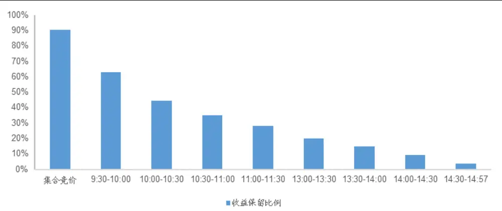
资料来源：Wind，海通证券研究所

## 1.2 价格波动

假设每分钟都以每秒的 TWAP 成交，我们进一步考察开盘半小时内（包括集合竞价）的平均收益保留比例（图 ）。同样地，在首个半小时内，也是越靠近开盘成交，收益保留比例越高。平均而言，从 9:30 的 80%左右单调递减至 9:59 的 50%左右。

然而，由于越靠近开盘，分钟内成交价的波动也越剧烈，因此，收益保留比例的不确定性就会大幅提高。如下图所示，开盘第一分钟内，收益保留比例的波动率就高达40%；即使是开盘后的第 5分钟，波动也高达 20%以上。

图2 开盘半小时内收益保留比例的均值与波动率（2021.06-2022.09）
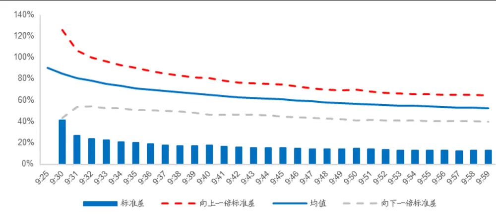
资料来源：Wind，海通证券研究所

由此可见，价格波动的幅度对收益保留比例有着重要影响。越靠近开盘时段交易，就越有可能遭遇较大的价格波动，造成收益保留比例大幅降低，甚至带来额外的交易成本。因此，在成本预测过程中，除了价格走势，还需纳入价格波动这一要素。

## 1.3 买卖价差

在前两个小节中讨论交易成本影响因素时，我们都假设交易是按 完成的，这其中并未考虑主动买入或主动卖出的情形。当分钟内出现单边行情，即在单边上涨过程中买入或在单边下跌过程中卖出，想要完成交易就必须下市价单。那么，以每秒的作为期望的成交价，必然会在一定程度上低估交易成本。

因此，我们认为，买卖价差也是交易成本的一个重要组成部分，而它产生的影响可以通过如下这个简单的例子予以说明。

假设开盘后半小时内，每分钟的交易都以市价单，即对手方最优价格完成，那么最终的交易成本相对每秒 成交的交易成本的增幅，如下图中的虚线所示。平均而言，市价单成交将增加 8-18个 bps 的额外成本。而且，越靠近开盘，成本的增幅越大。例如，开盘第一分钟，市价单成交的额外成本接近 2‰。

图3 开盘半小时内市价成交的额外成本（2021.06-2022.09）
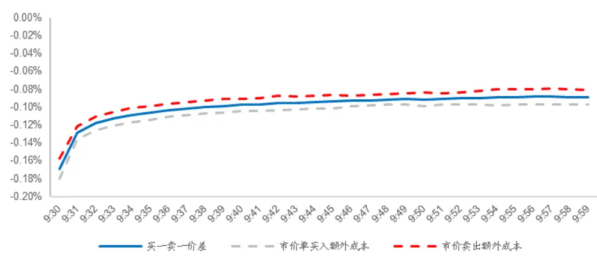
资料来源： ，海通证券研究所

观察上图，我们还发现，市价单买入或卖出产生的额外成本的均值约等于买一卖一价差。因此，我们可以通过预测买卖价差，估计市价单成交的额外成本。

当然，完全以市价单成交是非常极端的情形，但实际交易都由限价单完成同样很难实现。故我们要承担多少市价单的额外成本，就与交易时的盘口流动性息息相关。

## 1.4 盘口流动性

以上三个交易成本的组成部分——价格走势、价格波动与买卖价差，只考虑了价格对交易成本的影响。当我们需要交易的量很小，同时市场流动性又很充足时，只考虑这三个因素已经足够。然而，当我们的单笔下单量较大，而市场流动性又不足时，那就有可能在价格之外产生非价格因素的额外成本。

下图一般被称为盘口流动性表，它展示了开盘后半小时内，承担不同额外成本下，全市场股票每分钟所能即时成交的量占其自由流通股本比例的均值。其中，红色和绿色分别代表委卖和委买盘口。<=0.5‰表示承担 0.5‰以内非价格因素的额外成本，所能获得的即时成交量占比。

[Table_Pic 图 Pe]4 开盘半小时内承担不同额外成本所能获得的即时成交量占比（2021.06-2022.09）

|  | 9:30 | 9:31 | 9:32 | 9:33 | 9:34 | 9:35 | 9:36 | 9:37 | 9:38 | 9:39 | 9:40 | 9:41 | 9:42 | 9:43 | 9:44 | 9:45 | 9:46 | 9:47 | 9:48 | 9:49 | 9:50 | 9:51 | 9:52 | 9:53 | 9:54 | 9:55 | 9:56 | 9:57 | 9:58 | 9:59 |
| --- | --- | --- | --- | --- | --- | --- | --- | --- | --- | --- | --- | --- | --- | --- | --- | --- | --- | --- | --- | --- | --- | --- | --- | --- | --- | --- | --- | --- | --- | --- |
| <=5.0% | 0.34%0 | .36% | 0.38% | 0.41% | 0.43% | 0.44%0 | .46% | 0.48%0 | .49%0 | .50% | 0.51% | 0.52% | 0.53% | 0.54% | 0.55%0 | .55% | 0.56% | 0.57% | 0.58% | 0.59% | 0.58%0 | .59% | 0.60% | 0.60% | 0.61% | 0.61% | 0.62% | 0.62% | 0.62% | 0.63% |
| <=4.5% | 0.31% | 0.32% | 0.35% | 0.37% | 0.39% | 0.40% | 0.42% | 0.43% | 0.45% | 0.46% | 0.46% | 0.47%0.48% | 0 | 0.49% | 0.50% | 0.50% | 0.51% | 0.52% | 0.52%0.53% | 0 | 0.53% | 0.53% | 0.54% | 0.55% | 0.55% | 0.55% | 0.56% | 0.56% | 0.56% | 0.57% |
| <=4.0% | 0.27%o | 0.29% | 0.32% | 0.33% | 0.35% | 0.36% | 0.38% | 0.39% | 0.40% | 0.41% | 0.42% | 0.42% | 0.43% | 0.44% | 0.45% | 0.45% | 0.46%0 | .46% | 0.47% | 0.48% | 0.47% | 0.48% | 0.48% | 0.49% | 0.49% | 0.50% | 0.50% | 0.50% | 0.50% | 0.51% |
| <=3.5% | 0.24% | 0.26% | 0.28% | 0.29% | 0.31% | 0.32% | 0.33%0 | 0.35% | 0.36% | 0.37% | 0.37% | 0.37% | 0.38% | 0.39% | 0.40% | 0.40% | 0.40% | 0.41% | 0.42% | 0.42% | 0.42% | 0.42% | 0.43% | 0.43%0.44% | 0 | 0.44% | 0.44% | 0.45% | 0.45% | 0.45% |
| <=3.0% | 0.21% | 0.22% | 0.24% | 0.26% | 0.27%。 | 0.28% | 0.29% | 0.30%。0 | .31% | 0.32% | 0.32% | 0.33% | 0.33% | 0.34% | 0.34% | 0.35% | 0.35% | 0.36% | 0.36% | 0.37% | 0.36% | 0.37% | 0.37% | 0.38% | 0.38% | 0.38% | 0.38% | 0.39% | 0.39% | 0.39% |
| <=2.5%0 | 0.18%o | 0.19% | 0.21% | 0.22% | 0.23% | 0.24% | 0.25% | 0.26%0 | .27% | 0.27% | 0.27% | 0.28% | 0.28% | 0.29% | 0.29% | 0.30% | 0.30%。 | 0.30% | 0.31% | 0.31% | 0.31% | 0.31%。0 | .32% | 0.32% | 0.32% | 0.32% | 0.33% | 0.33% | 0.33% | 0.33% |
| <=2.0% | 0.15% | 0.16% | 0.17% | 0.18% | 0.19% | 0.20% | 0.21% | 0.21% | 0.22% | 0.23% | 0.23% | 0.23%0.23% | 0 | 0.24% | 0.24% | 0.24% | 0.25% | 0.25% | 0.25% | 0.26% | 0.25% | 0.26% | 0.26% | 0.26% | 0.27% | 0.27% | 0.27%0 | 0.27% | 0.27% | 0.27% |
| <=1.5%0 | 0.12% | 0.13%。 | 0.14% | 0.14% | 0.15% | 0.16% | 0.16% | 0.17% | 0.17% | 0.18% | 0.18% | 0.18% | 0.18% | 0.19% | 0.19% | 0.19% | 0.20% | 0.20% | 0.20% | 0.20% | 0.20% | 0.20% | 0.20% | 0.21% | 0.21% | 0.21% | 0.21% | 0.21% | 0.21% | 0.21% |
| <=1.0%0 | 0.09% | 0.09% | 0.10% | 0.11% | 0.11% | 0.12% | 0.12% | 0.13% | 0.13% | 0.13% | 0.13% | 0.13% | 0.14% | 0.14% | 0.14% | 0.14% | 0.14% | 0.15% | 0.15% | 0.15% | 0.15% | 0.15% | 0.15% | 0.15% | 0.15% | 0.15% | 0.16% | 0.16% | 0.16% | 0.16% |
| <=0.5% | 0.06% | 0.07% | 0.07% | 0.07% | 0.08% | 0.08% | 0.08% | 0.08% | 0.09% | 0.09% | 0.09% | 0.09% | 0.09% | 0.09% | 0.10%0 | .10% | 0.10% | 0.10% | 0.10% | 0.10% | 0.10% | 0.10%0 | .10% | 0.10% | 0.10% | 0.10% | 0.10% | 0.11% | 0.11% | 0.11% |
| 0% | 0.04%o | 0.04% | 0.05% | 0.05% | 0.05% | 0.05% | 0.05% | 0.05% | 0.06% | 0.06% | 0.06% | 0.06% | 0.06% | 0.06% | 0.06% | 0.06% | 0.06% | 0.06% | 0.06% | 0.06% | 0.06% | 0.06% | 0.06% | 0.07% | 0.07% | 0.07% | 0.07% | 0.07% | 0.07% | 0.07% |
| 0% | 0.04% | 0.04% | 0.05% | 0.05% | 0.05% | 0.05% | 0.05% | 0.06% | 0.06% | 0.06% | 0.06% | 0.06% | 0.06% | 0.06% | 0.07% | 0.07% | 0.07% | 0.07% | 0.07% | 0.07% | 0.07% | 0.07% | 0.07% | 0.07% | 0.07% | 0.07% | 0.07% | 0.08% | 0.08% | 0.08% |
| <=0.5%0 | 0.06% | 0.07%0 | 0.07% | 0.08% | 0.08% | 0.09%。 | 0.09% | 0.09% | 0.10% | 0.10% | 0.10% | 0.10% | 0.10% | 0.10% | 0.11% | 0.11% | 0.11% | 0.11% | 0.11% | 0.11% | 0.11% | 0.11% | 0.12% | 0.12% | 0.12% | 0.12% | 0.12% | 0.12% | 0.12% | 0.12% |
| <=1.0%0 | 0.09%0 | .10% | 0.11% | 0.12% | 0.13% | 0.13% | 0.14% | 0.14% | 0.15% | 0.15% | 0.15% | 0.15% | 0.16% | 0.16% | 0.16%0.17% | 0 | 0.17% | 0.17% | 0.17%0.18% | 0 | 0.18% | 0.18%0 | .18% | 0.18% | 0.19% | 0.19% | 0.19% | 0.19% | 0.19% | 0.19% |
| <=1.5% | 0.12% | 0.14% | 0.15% | 0.16% | 0.17% | 0.18% | 0.19% | 0.20% | 0.21% | 0.21% | 0.21% | 0.21% | 0.22% | 0.23% | 0.23% | 0.23% | 0.23% | 0.24% | 0.24% | 0.25% | 0.25% | 0.24% | 0.25% | 0.25% | 0.26% | 0.26% | 0.26% | 0.27% | 0.27% | 0.27% |
| <=2.0% | 0.16% | 0.17% | 0.20%0.21% | 0 | 0.22% | 0.23% | 0.24% | 0.26% | 0.27% | 0.27% | 0.27% | 0.28% | 0.28% | 0.29% | 0.30% | 0.30% | 0.30%0 | .31% | 0.31% | 0.32% | 0.32% | 0.32% | 0.32% | 0.33% | 0.34% | 0.34% | 0.34% | 0.35% | 0.35% | 0.35% |
| <=2.5% | 0.19% | 0.21% | 0.24% | 0.26% | 0.27% | 0.29% | 0.30% | 0.31% | 0.33% | 0.33% | 0.33% | 0.34% | 0.35% | 0.36% | 0.36% | 0.37% | 0.37% | 0.38% | 0.38% | 0.39% | 0.39% | 0.39% | 0.40% | 0.40% | 0.41% | 0.42% | 0.42% | 0.42% | 0.43% | 0.43% |
| <=3.0% | 0.23% | 0.25% | 0.28% | 0.30% | 0.32% | 0.34%0 | 0.35%0 | 0.37% | 0.39% | 0.40% | 0.40% | 0.40% | 0.41% | 0.42% | 0.43% | 0.43% | 0.44%0 | .45% | 0.46% | 0.46% | 0.46% | 0.46% | 0.47% | 0.48% | 0.49% | 0.49% | 0.50% | 0.50% | 0.51% | 0.51% |
| <=3.5% | 0.26% | 0.29% | 0.33% | 0.35% | 0.37% | 0.39% | 0.41% | 0.43% | 0.45% | 0.46% | 0.46% | 0.46% | 0.48% | 0.49% | 0.50% | 0.50% | 0.51% | 0.52% | 0.53% | 0.54% | 0.53% | 0.53% | 0.54% | 0.55%。 | 0.56% | 0.57% | 0.57% | 0.58% | 0.58% | 0.59% |
| <=4.0% | 0.30% | 0.33% | 0.37% | 0.40% | 0.42% | 0.44% | 0.46% | 0.48% | 0.50% | 0.52% | 0.52% | 0.53% | 0.54% | 0.55% | 0.56% | 0.57% | 0.58% | 0.59% | 0.60% | 0.61% | 0.60% | 0.61% | 0.62% | 0.63% | 0.64% | 0.64% | 0.65% | 0.66% | 0.66% | 0.66% |
| <=4.5% | 0.34% | 0.37% | 0.41% | 0.44% | 0.47% | 0.50% | 0.52% | 0.54% | 0.56% | 0.57% | 0.58% | 0.58% | 0.60% | 0.61% | 0.63% | 0.63% | 0.64% | 0.65% | 0.66% | 0.68% | 0.67% | 0.68% | 0.69% | 0.70% | 0.71% | 0.72% | 0.72% | 0.73% | 0.74% | 0.74% |
| <=5.0% | 0.37% | 0.41% | 0.45% | 0.49%0 | .52% 0 | .55% 0 | .57% | 0.59%0 | .62% | 0.63%0 | .63% | 0.64% | 0.66% | 0.67% | 0.69%。 | 0.70% | 0.71%0 | .72% | 0.73%0.74% | 0 | 0.74%0 | .74% 0 | .76% | 0.77% | 0.78% | 0.79% | 0.79% | 0.80% | 0.81% | 0.81% |

资料来源：Wind，海通证券研究所

从时间维度来看，越靠近开盘，流动性越差。此时，想要获得相同的成交量，需要负担更多的额外成本；或者说，承担相同的额外成本，获得的成交量更少。从同一时刻上的买卖对比来看，买盘的流动性一般优于卖盘。故绝大多数情况下，卖出股票所需付出的额外成本更小。

## 1.5 限价单成交概率

上文介绍的四个因素未必都会影响交易成本。例如，若所有成交都以限价单完成，那么，买卖价差和盘口流动性就与成本无关，价格走势和价格波动是唯二的决定因素。实际上，限价单成交概率决定了前四个因素中的哪几个会对成本产生影响，所以我们可以将它视为第五个因素。

然而，预测限价单成交概率也绝非易事。但可以想见，它与股价的涨跌应当有着较强的相关性。定义下一个 3秒内，1 档盘口以外委托单的成交量为限价单成交量，与全天成交量的比值为限价单成交概率的近似。它与同分钟的涨跌幅及 1档盘口流动性的相关性如下图所示。不论是买入还是卖出，限价单成交概率与分钟涨跌幅的相关性约是它与盘口流动性相关性的 20 倍以上。

图5 限价单成交概率与分钟涨跌幅的相关性（2021.06-2022.08）
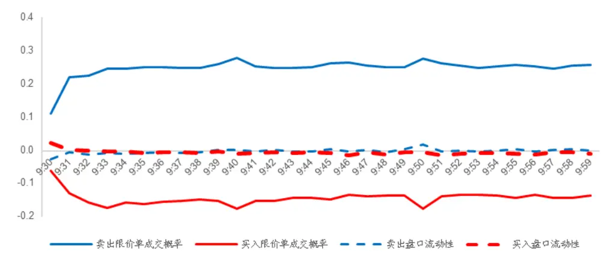
资料来源：Wind，海通证券研究所

## 2. 不同交易策略的成本预测方法与效果

## 2.1 不同交易策略的成本影响因素

从拆单方法来看，算法交易可分为 TWAP与 VWAP两类；而从拆单后的下单模式来看，可分为纯市价单与限价单优先两类。两两组合，可得以下四种算法交易类型。

1. 基于 TWAP的纯市价单策略

2. 基于 TWAP的限价单优先策略

3. 基于 VWAP的纯市价单策略

4. 基于 VWAP的限价单优先策略

这四种算法交易模式的复杂度由简入难，其成本的影响因素也由少到多。

首先，VWAP拆单相较 TWAP 拆单可以在理论上更加贴近当日成交状况。尤其是当下单金额较大时，可以尽可能避免流动性不足导致的额外成本。但 VWAP拆单需要预测当日的成交分布，因而预测准确率也会对成本产生较大影响。

其次，限价单优先的下单策略相较纯市价单策略，理论上会更节省成本。理想状态下，如果所有订单均以限价单成交，则完全不需要承担 1.3 节中介绍的买卖价差成本。但由 1.5 节可知，限价单成本节省的效果与其成交概率正相关。限价单成交的概率越高，买卖价差成本的节省效果越好；限价单成交概率越低，除了无法节省买卖价差成本外，还可能需要承担更高的盘口流动性成本。

为降低成本预测的复杂度，我们假定下文交易成本的测算均以 TWAP理论成交价为基准，暂不考虑 VWAP成交的情形。

理论上，价格走势是成本的首要影响因素，这也是我们在介绍成本的组成部分时，把它第一个提出来的原因。不过，对价格走势的判断也是收益预测模型关注的核心。因此，为避免引入更复杂的模型和更多的不确定性，我们暂不考虑价格走势对成本的影响。这样一来，不同 TWAP交易策略的成本影响因素可以归纳为，

- 基于 TWAP的纯市价单策略：价格波动、买卖价差、盘口流动性。

- 基于 TWAP的限价单优先策略：价格波动、买卖价差、盘口流动性、限价单成交比例。

## 2.2 基于 TWAP 的纯市价单策略的成本预测

## 2.2.1基于TWAP 的纯市价单策略的成本预测方法

基于 TWAP的纯市价单策略只受价格波动、买卖价差和盘口流动性影响，故我们只需分别预测这三个因素。

我们定义，价格波动导致的成本约等于分钟成交价相对前收盘价收益率的标准差。

$$
VolCost=SD\left(\frac{TradePrice}{Preclose}-1\right)
$$

由于收益率的波动有聚集性，因此预测第 i分钟的波动率时，我们使用了过去五个交易日的第 i分钟价格波动的滑动平均作为预测值。如下图所示，开盘后的一分钟，全市场股票价格波动的平均预测误差（预测误差：预测值和真实值之差的绝对值，下同）的均值为 14bps，80%分位数为 17bps，均为 10 点前峰值。随后，平均预测误差的均值逐步下降至 4bps左右，80%分位数也同步下降至 5bps 左右，并同时保持稳定。虽然开盘后的误差较大，但平均误差百分比始终在 44%至 50%之间，与交易时段无关。

图6 开盘半小时内分钟价格波动的平均预测误差（2021.06-2022.09）
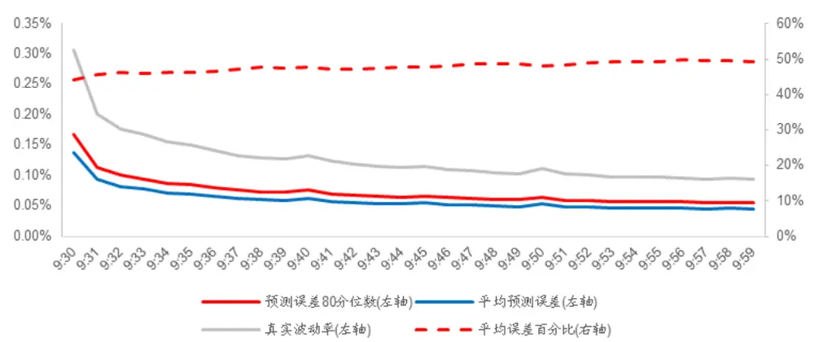
资料来源：Wind，海通证券研究所

我们用同样的方式预测买卖价差，即，取过去 5个交易日同一分钟内买卖价差的均值作为当日该分钟买卖价差的预测。如下图所示，买卖价差的预测精度显著优于价格波动，平均预测误差的均值在 2-6bps 之间，平均误差百分比在 28%-32%之间。

图7 开盘半小时内分钟买卖价差的平均预测误差（2021.06-2022.09）
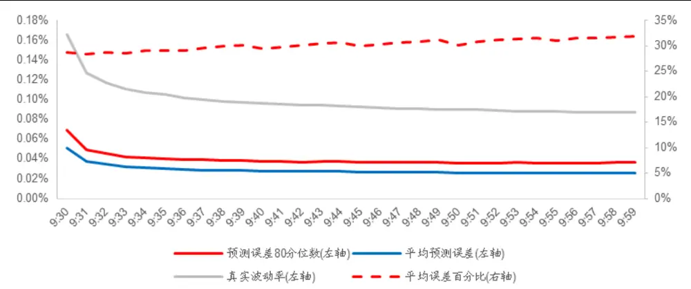
资料来源：Wind，海通证券研究所

与前面两个因素的预测效果相比，盘口流动性的预测效果则要差得多。如下图所示，不同时点上的平均误差百分比都在 40%以上。尤其是在买一和卖一（额外成本=0‰）处，平均误差百分比将达到 60%，甚至 70%以上。

[Table_Pic 图 Pe]8 开盘半小时内盘口流动性的平均预测误差（2021.06-2022.09）
<table><tr><td rowspan=1 colspan=1></td><td rowspan=1 colspan=1>9:30</td><td rowspan=1 colspan=1>9:31</td><td rowspan=1 colspan=1>9:32</td><td rowspan=1 colspan=1>9:33</td><td rowspan=1 colspan=1>9:34</td><td rowspan=1 colspan=1>9:35</td><td rowspan=1 colspan=1>9:36</td><td rowspan=1 colspan=1>9:37</td><td rowspan=1 colspan=1>9:38</td><td rowspan=1 colspan=1>9:39</td><td rowspan=1 colspan=1>9:40</td><td rowspan=1 colspan=1>9:41</td><td rowspan=1 colspan=1>9:42</td><td rowspan=1 colspan=1>9:43</td><td rowspan=1 colspan=1>9:44</td><td rowspan=1 colspan=1>9:45</td><td rowspan=1 colspan=1>9:46</td><td rowspan=1 colspan=1>9:47</td><td rowspan=1 colspan=1>9:48</td><td rowspan=1 colspan=1>9:49</td><td rowspan=1 colspan=1>9:50</td><td rowspan=1 colspan=1>9:51</td><td rowspan=1 colspan=1>9:52</td><td rowspan=1 colspan=1>9:53</td><td rowspan=1 colspan=1>9:54</td><td rowspan=1 colspan=1>9:55</td><td rowspan=1 colspan=1>9:56</td><td rowspan=1 colspan=1>9:57</td><td rowspan=1 colspan=1>9:58</td><td rowspan=1 colspan=1>9:59</td></tr><tr><td rowspan=1 colspan=1>&lt;=5.0%</td><td rowspan=1 colspan=1>52.2%</td><td rowspan=1 colspan=1>51.2%</td><td rowspan=1 colspan=1>51.5%</td><td rowspan=1 colspan=1>51.7%</td><td rowspan=1 colspan=1>52.2%</td><td rowspan=1 colspan=1>52.2%</td><td rowspan=1 colspan=1>52.5%</td><td rowspan=1 colspan=1>52.8%</td><td rowspan=1 colspan=1>53.2%</td><td rowspan=1 colspan=1>53.2%</td><td rowspan=1 colspan=1>52.9%</td><td rowspan=1 colspan=1>53.4%</td><td rowspan=1 colspan=1>53.6%</td><td rowspan=1 colspan=1>53.8%</td><td rowspan=1 colspan=1>54.0%</td><td rowspan=1 colspan=1>53.8%</td><td rowspan=1 colspan=1>53.8%</td><td rowspan=1 colspan=1>54.0%</td><td rowspan=1 colspan=1>54.0%</td><td rowspan=1 colspan=1>54.0%</td><td rowspan=1 colspan=1>53.5%</td><td rowspan=1 colspan=1>54.0%</td><td rowspan=1 colspan=1>54.1%</td><td rowspan=1 colspan=1>54.2%</td><td rowspan=1 colspan=1>54.3%</td><td rowspan=1 colspan=1>54.3%</td><td rowspan=1 colspan=1>54.5%</td><td rowspan=1 colspan=1>54.6%</td><td rowspan=1 colspan=1>54.6%</td><td rowspan=1 colspan=1>54.8%</td></tr><tr><td rowspan=1 colspan=1>&lt;=4.5%</td><td rowspan=1 colspan=1>53.0%</td><td rowspan=1 colspan=1>52.0%</td><td rowspan=1 colspan=1>52.2%</td><td rowspan=1 colspan=1>52.4%</td><td rowspan=1 colspan=1>52.9%</td><td rowspan=1 colspan=1>52.9%</td><td rowspan=1 colspan=1>53.2%</td><td rowspan=1 colspan=1>53.5%</td><td rowspan=1 colspan=1>53.9%</td><td rowspan=1 colspan=1>53.9%</td><td rowspan=1 colspan=1>53.6%</td><td rowspan=1 colspan=1>54.1%</td><td rowspan=1 colspan=1>54.3%</td><td rowspan=1 colspan=1>54.5%</td><td rowspan=1 colspan=1>54.7%</td><td rowspan=1 colspan=1>54.5%</td><td rowspan=1 colspan=1>54.5%</td><td rowspan=1 colspan=1>54.8%</td><td rowspan=1 colspan=1>54.8%</td><td rowspan=1 colspan=1>54.8%</td><td rowspan=1 colspan=1>54.2%</td><td rowspan=1 colspan=1>54.8%</td><td rowspan=1 colspan=1>54.9%</td><td rowspan=1 colspan=1>55.0%</td><td rowspan=1 colspan=1>55.0%</td><td rowspan=1 colspan=1>55.1%</td><td rowspan=1 colspan=1>55.3%</td><td rowspan=1 colspan=1>55.4%</td><td rowspan=1 colspan=1>55.4%</td><td rowspan=1 colspan=1>55.6%</td></tr><tr><td rowspan=1 colspan=1>&lt;=4.0%</td><td rowspan=1 colspan=1>53.8%</td><td rowspan=1 colspan=1>52.8%</td><td rowspan=1 colspan=1>53.0%</td><td rowspan=1 colspan=1>53.1%</td><td rowspan=1 colspan=1>53.6%</td><td rowspan=1 colspan=1>53.6%</td><td rowspan=1 colspan=1>53.9%</td><td rowspan=1 colspan=1>54.3%</td><td rowspan=1 colspan=1>54.6%</td><td rowspan=1 colspan=1>54.6%</td><td rowspan=1 colspan=1>54.3%</td><td rowspan=1 colspan=1>54.8%</td><td rowspan=1 colspan=1>55.1%</td><td rowspan=1 colspan=1>55.2%</td><td rowspan=1 colspan=1>55.4%</td><td rowspan=1 colspan=1>55.3%</td><td rowspan=1 colspan=1>55.3%</td><td rowspan=1 colspan=1>55.5%</td><td rowspan=1 colspan=1>55.5%</td><td rowspan=1 colspan=1>55.5%</td><td rowspan=1 colspan=1>55.0%</td><td rowspan=1 colspan=1>55.6%</td><td rowspan=1 colspan=1>55.7%</td><td rowspan=1 colspan=1>55.8%</td><td rowspan=1 colspan=1>55.8%</td><td rowspan=1 colspan=1>55.9%</td><td rowspan=1 colspan=1>56.1%</td><td rowspan=1 colspan=1>56.2%</td><td rowspan=1 colspan=1>56.2%</td><td rowspan=1 colspan=1>56.4%</td></tr><tr><td rowspan=1 colspan=1>&lt;=3.5%0</td><td rowspan=1 colspan=1>54.6%</td><td rowspan=1 colspan=1>53.6%</td><td rowspan=1 colspan=1>53.7%</td><td rowspan=1 colspan=1>53.9%</td><td rowspan=1 colspan=1>54.3%</td><td rowspan=1 colspan=1>54.3%</td><td rowspan=1 colspan=1>54.7%</td><td rowspan=1 colspan=1>55.0%</td><td rowspan=1 colspan=1>55.4%</td><td rowspan=1 colspan=1>55.4%</td><td rowspan=1 colspan=1>55.1%</td><td rowspan=1 colspan=1>55.6%</td><td rowspan=1 colspan=1>55.9%</td><td rowspan=1 colspan=1>56.1%</td><td rowspan=1 colspan=1>56.3%</td><td rowspan=1 colspan=1>56.1%</td><td rowspan=1 colspan=1>56.2%</td><td rowspan=1 colspan=1>56.4%</td><td rowspan=1 colspan=1>56.4%</td><td rowspan=1 colspan=1>56.4%</td><td rowspan=1 colspan=1>55.8%</td><td rowspan=1 colspan=1>56.5%</td><td rowspan=1 colspan=1>56.6%</td><td rowspan=1 colspan=1>56.7%</td><td rowspan=1 colspan=1>56.8%</td><td rowspan=1 colspan=1>56.8%</td><td rowspan=1 colspan=1>57.1%</td><td rowspan=1 colspan=1>57.2%</td><td rowspan=1 colspan=1>57.2%</td><td rowspan=1 colspan=1>57.4%</td></tr><tr><td rowspan=1 colspan=1>&lt;=3.0%</td><td rowspan=1 colspan=1>55.4%</td><td rowspan=1 colspan=1>54.4%</td><td rowspan=1 colspan=1>54.5%</td><td rowspan=1 colspan=1>54.7%</td><td rowspan=1 colspan=1>55.1%</td><td rowspan=1 colspan=1>55.1%</td><td rowspan=1 colspan=1>55.5%</td><td rowspan=1 colspan=1>55.9%</td><td rowspan=1 colspan=1>56.3%</td><td rowspan=1 colspan=1>56.3%</td><td rowspan=1 colspan=1>55.9%</td><td rowspan=1 colspan=1>56.5%</td><td rowspan=1 colspan=1>56.8%</td><td rowspan=1 colspan=1>57.0%</td><td rowspan=1 colspan=1>57.2%</td><td rowspan=1 colspan=1>57.0%</td><td rowspan=1 colspan=1>57.1%</td><td rowspan=1 colspan=1>57.4%</td><td rowspan=1 colspan=1>57.4%</td><td rowspan=1 colspan=1>57.4%</td><td rowspan=1 colspan=1>56.8%</td><td rowspan=1 colspan=1>57.5%</td><td rowspan=1 colspan=1>57.6%</td><td rowspan=1 colspan=1>57.8%</td><td rowspan=1 colspan=1>57.8%</td><td rowspan=1 colspan=1>57.9%</td><td rowspan=1 colspan=1>58.1%</td><td rowspan=1 colspan=1>58.3%</td><td rowspan=1 colspan=1>58.3%</td><td rowspan=1 colspan=1>58.5%</td></tr><tr><td rowspan=1 colspan=1>&lt;=2.5%0</td><td rowspan=1 colspan=1>56.3%</td><td rowspan=1 colspan=1>55.3%</td><td rowspan=1 colspan=1>55.3%</td><td rowspan=1 colspan=1>55.5%</td><td rowspan=1 colspan=1>56.0%</td><td rowspan=1 colspan=1>56.0%</td><td rowspan=1 colspan=1>56.4%</td><td rowspan=1 colspan=1>56.8%</td><td rowspan=1 colspan=1>57.3%</td><td rowspan=1 colspan=1>57.3%</td><td rowspan=1 colspan=1>56.9%</td><td rowspan=1 colspan=1>57.5%</td><td rowspan=1 colspan=1>57.8%</td><td rowspan=1 colspan=1>58.0%</td><td rowspan=1 colspan=1>58.3%</td><td rowspan=1 colspan=1>58.0%</td><td rowspan=1 colspan=1>58.2%</td><td rowspan=1 colspan=1>58.5%</td><td rowspan=1 colspan=1>58.5%</td><td rowspan=1 colspan=1>58.6%</td><td rowspan=1 colspan=1>57.9%</td><td rowspan=1 colspan=1>58.7%</td><td rowspan=1 colspan=1>58.9%</td><td rowspan=1 colspan=1>59.0%</td><td rowspan=1 colspan=1>59.1%</td><td rowspan=1 colspan=1>59.1%</td><td rowspan=1 colspan=1>59.4%</td><td rowspan=1 colspan=1>59.5%</td><td rowspan=1 colspan=1>59.5%</td><td rowspan=1 colspan=1>59.8%</td></tr><tr><td rowspan=1 colspan=1>&lt;=2.0%</td><td rowspan=1 colspan=1>57.2%</td><td rowspan=1 colspan=1>56.2%</td><td rowspan=1 colspan=1>56.2%</td><td rowspan=1 colspan=1>56.4%</td><td rowspan=1 colspan=1>56.9%</td><td rowspan=1 colspan=1>57.0%</td><td rowspan=1 colspan=1>57.5%</td><td rowspan=1 colspan=1>57.9%</td><td rowspan=1 colspan=1>58.4%</td><td rowspan=1 colspan=1>58.4%</td><td rowspan=1 colspan=1>58.0%</td><td rowspan=1 colspan=1>58.7%</td><td rowspan=1 colspan=1>59.0%</td><td rowspan=1 colspan=1>59.3%</td><td rowspan=1 colspan=1>59.5%</td><td rowspan=1 colspan=1>59.3%</td><td rowspan=1 colspan=1>59.5%</td><td rowspan=1 colspan=1>59.8%</td><td rowspan=1 colspan=1>59.9%</td><td rowspan=1 colspan=1>60.0%</td><td rowspan=1 colspan=1>59.2%</td><td rowspan=1 colspan=1>60.2%</td><td rowspan=1 colspan=1>60.3%</td><td rowspan=1 colspan=1>60.5%</td><td rowspan=1 colspan=1>60.6%</td><td rowspan=1 colspan=1>60.6%</td><td rowspan=1 colspan=1>60.9%</td><td rowspan=1 colspan=1>61.1%</td><td rowspan=1 colspan=1>61.1%</td><td rowspan=1 colspan=1>61.4%</td></tr><tr><td rowspan=1 colspan=1>&lt;=1.5%0</td><td rowspan=1 colspan=1>58.2%</td><td rowspan=1 colspan=1>57.1%</td><td rowspan=1 colspan=1>57.2%</td><td rowspan=1 colspan=1>57.4%</td><td rowspan=1 colspan=1>58.0%</td><td rowspan=1 colspan=1>58.1%</td><td rowspan=1 colspan=1>58.7%</td><td rowspan=1 colspan=1>59.2%</td><td rowspan=1 colspan=1>59.7%</td><td rowspan=1 colspan=1>59.7%</td><td rowspan=1 colspan=1>59.3%</td><td rowspan=1 colspan=1>60.0%</td><td rowspan=1 colspan=1>60.4%</td><td rowspan=1 colspan=1>60.8%</td><td rowspan=1 colspan=1>61.0%</td><td rowspan=1 colspan=1>60.8%</td><td rowspan=1 colspan=1>61.1%</td><td rowspan=1 colspan=1>61.5%</td><td rowspan=1 colspan=1>61.5%</td><td rowspan=1 colspan=1>61.7%</td><td rowspan=1 colspan=1>60.8%</td><td rowspan=1 colspan=1>62.0%</td><td rowspan=1 colspan=1>62.1%</td><td rowspan=1 colspan=1>62.3%</td><td rowspan=1 colspan=1>62.5%</td><td rowspan=1 colspan=1>62.4%</td><td rowspan=1 colspan=1>62.7%</td><td rowspan=1 colspan=1>63.0%</td><td rowspan=1 colspan=1>63.0%</td><td rowspan=1 colspan=1>63.3%</td></tr><tr><td rowspan=1 colspan=1>&lt;=1.0%</td><td rowspan=1 colspan=1>59.3%</td><td rowspan=1 colspan=1>58.1%</td><td rowspan=1 colspan=1>58.1%</td><td rowspan=1 colspan=1>58.5%</td><td rowspan=1 colspan=1>59.2%</td><td rowspan=1 colspan=1>59.3%</td><td rowspan=1 colspan=1>60.0%</td><td rowspan=1 colspan=1>60.7%</td><td rowspan=1 colspan=1>61.2%</td><td rowspan=1 colspan=1>61.3%</td><td rowspan=1 colspan=1>60.8%</td><td rowspan=1 colspan=1>61.6%</td><td rowspan=1 colspan=1>62.1%</td><td rowspan=1 colspan=1>62.5%</td><td rowspan=1 colspan=1>62.9%</td><td rowspan=1 colspan=1>62.6%</td><td rowspan=1 colspan=1>62.9%</td><td rowspan=1 colspan=1>63.5%</td><td rowspan=1 colspan=1>63.6%</td><td rowspan=1 colspan=1>63.7%</td><td rowspan=1 colspan=1>62.8%</td><td rowspan=1 colspan=1>64.1%</td><td rowspan=1 colspan=1>64.3%</td><td rowspan=1 colspan=1>64.6%</td><td rowspan=1 colspan=1>64.8%</td><td rowspan=1 colspan=1>64.6%</td><td rowspan=1 colspan=1>65.0%</td><td rowspan=1 colspan=1>65.3%</td><td rowspan=1 colspan=1>65.4%</td><td rowspan=1 colspan=1>65.7%</td></tr><tr><td rowspan=1 colspan=1>&lt;=0.5%</td><td rowspan=1 colspan=1>60.7%</td><td rowspan=1 colspan=1>59.4%</td><td rowspan=1 colspan=1>59.4%</td><td rowspan=1 colspan=1>59.8%</td><td rowspan=1 colspan=1>60.5%</td><td rowspan=1 colspan=1>60.7%</td><td rowspan=1 colspan=1>61.5%</td><td rowspan=1 colspan=1>62.4%</td><td rowspan=1 colspan=1>63.0%</td><td rowspan=1 colspan=1>63.1%</td><td rowspan=1 colspan=1>62.6%</td><td rowspan=1 colspan=1>63.5%</td><td rowspan=1 colspan=1>64.0%</td><td rowspan=1 colspan=1>64.5%</td><td rowspan=1 colspan=1>65.0%</td><td rowspan=1 colspan=1>64.8%</td><td rowspan=1 colspan=1>65.2%</td><td rowspan=1 colspan=1>65.7%</td><td rowspan=1 colspan=1>65.9%</td><td rowspan=1 colspan=1>66.2%</td><td rowspan=1 colspan=1>65.1%</td><td rowspan=1 colspan=1>66.4%</td><td rowspan=1 colspan=1>66.8%</td><td rowspan=1 colspan=1>67.1%</td><td rowspan=1 colspan=1>67.6%</td><td rowspan=1 colspan=1>67.2%</td><td rowspan=1 colspan=1>67.8%</td><td rowspan=1 colspan=1>68.2%</td><td rowspan=1 colspan=1>68.2%</td><td rowspan=1 colspan=1>68.6%</td></tr><tr><td rowspan=1 colspan=1>0%</td><td rowspan=1 colspan=1>64.1%</td><td rowspan=1 colspan=1>63.3%</td><td rowspan=1 colspan=1>63.2%</td><td rowspan=1 colspan=1>63.5%</td><td rowspan=1 colspan=1>64.2%</td><td rowspan=1 colspan=1>64.5%</td><td rowspan=1 colspan=1>65.5%</td><td rowspan=1 colspan=1>66.4%</td><td rowspan=1 colspan=1>67.1%</td><td rowspan=1 colspan=1>67.1%</td><td rowspan=1 colspan=1>66.7%</td><td rowspan=1 colspan=1>67.4%</td><td rowspan=1 colspan=1>68.1%</td><td rowspan=1 colspan=1>68.7%</td><td rowspan=1 colspan=1>69.3%</td><td rowspan=1 colspan=1>69.1%</td><td rowspan=1 colspan=1>69.5%</td><td rowspan=1 colspan=1>70.1%</td><td rowspan=1 colspan=1>70.5%</td><td rowspan=1 colspan=1>70.8%</td><td rowspan=1 colspan=1>69.5%</td><td rowspan=1 colspan=1>70.8%</td><td rowspan=1 colspan=1>71.4%</td><td rowspan=1 colspan=1>71.8%</td><td rowspan=1 colspan=1>72.2%</td><td rowspan=1 colspan=1>71.9%</td><td rowspan=1 colspan=1>72.6%</td><td rowspan=1 colspan=1>73.1%</td><td rowspan=1 colspan=1>73.0%</td><td rowspan=1 colspan=1>73.5%</td></tr><tr><td rowspan=1 colspan=1>0%0</td><td rowspan=1 colspan=1>61.7%</td><td rowspan=1 colspan=1>60.4%</td><td rowspan=1 colspan=1>60.2%</td><td rowspan=1 colspan=1>60.7%</td><td rowspan=1 colspan=1>61.3%</td><td rowspan=1 colspan=1>61.6%</td><td rowspan=1 colspan=1>62.1%</td><td rowspan=1 colspan=1>62.9%</td><td rowspan=1 colspan=1>63.6%</td><td rowspan=1 colspan=1>64.0%</td><td rowspan=1 colspan=1>64.2%</td><td rowspan=1 colspan=1>64.6%</td><td rowspan=1 colspan=1>65.1%</td><td rowspan=1 colspan=1>65.5%</td><td rowspan=1 colspan=1>65.9%</td><td rowspan=1 colspan=1>65.8%</td><td rowspan=1 colspan=1>66.2%</td><td rowspan=1 colspan=1>66.4%</td><td rowspan=1 colspan=1>66.9%</td><td rowspan=1 colspan=1>67.3%</td><td rowspan=1 colspan=1>67.3%</td><td rowspan=1 colspan=1>68.0%</td><td rowspan=1 colspan=1>68.2%</td><td rowspan=1 colspan=1>68.3%</td><td rowspan=1 colspan=1>68.4%</td><td rowspan=1 colspan=1>68.7%</td><td rowspan=1 colspan=1>69.1%</td><td rowspan=1 colspan=1>69.2%</td><td rowspan=1 colspan=1>69.5%</td><td rowspan=1 colspan=1>69.9%</td></tr><tr><td rowspan=1 colspan=1>&lt;=0.5%</td><td rowspan=1 colspan=1>59.2%</td><td rowspan=1 colspan=1>57.9%</td><td rowspan=1 colspan=1>57.7%</td><td rowspan=1 colspan=1>58.4%</td><td rowspan=1 colspan=1>59.1%</td><td rowspan=1 colspan=1>59.4%</td><td rowspan=1 colspan=1>59.9%</td><td rowspan=1 colspan=1>60.6%</td><td rowspan=1 colspan=1>61.3%</td><td rowspan=1 colspan=1>61.6%</td><td rowspan=1 colspan=1>61.7%</td><td rowspan=1 colspan=1>62.2%</td><td rowspan=1 colspan=1>62.6%</td><td rowspan=1 colspan=1>62.9%</td><td rowspan=1 colspan=1>63.3%</td><td rowspan=1 colspan=1>63.3%</td><td rowspan=1 colspan=1>63.7%</td><td rowspan=1 colspan=1>63.8%</td><td rowspan=1 colspan=1>64.3%</td><td rowspan=1 colspan=1>64.6%</td><td rowspan=1 colspan=1>64.5%</td><td rowspan=1 colspan=1>65.4%</td><td rowspan=1 colspan=1>65.4%</td><td rowspan=1 colspan=1>65.5%</td><td rowspan=1 colspan=1>65.4%</td><td rowspan=1 colspan=1>65.7%</td><td rowspan=1 colspan=1>66.1%</td><td rowspan=1 colspan=1>66.1%</td><td rowspan=1 colspan=1>66.5%</td><td rowspan=1 colspan=1>66.8%</td></tr><tr><td rowspan=1 colspan=1>&lt;=1.0%</td><td rowspan=1 colspan=1>58.3%</td><td rowspan=1 colspan=1>57.2%</td><td rowspan=1 colspan=1>56.8%</td><td rowspan=1 colspan=1>57.5%</td><td rowspan=1 colspan=1>58.1%</td><td rowspan=1 colspan=1>58.3%</td><td rowspan=1 colspan=1>58.7%</td><td rowspan=1 colspan=1>59.2%</td><td rowspan=1 colspan=1>59.8%</td><td rowspan=1 colspan=1>60.1%</td><td rowspan=1 colspan=1>60.1%</td><td rowspan=1 colspan=1>60.6%</td><td rowspan=1 colspan=1>60.8%</td><td rowspan=1 colspan=1>61.0%</td><td rowspan=1 colspan=1>61.3%</td><td rowspan=1 colspan=1>61.4%</td><td rowspan=1 colspan=1>61.7%</td><td rowspan=1 colspan=1>61.8%</td><td rowspan=1 colspan=1>62.2%</td><td rowspan=1 colspan=1>62.5%</td><td rowspan=1 colspan=1>62.4%</td><td rowspan=1 colspan=1>63.1%</td><td rowspan=1 colspan=1>63.0%</td><td rowspan=1 colspan=1>63.0%</td><td rowspan=1 colspan=1>63.0%</td><td rowspan=1 colspan=1>63.0%</td><td rowspan=1 colspan=1>63.4%</td><td rowspan=1 colspan=1>63.4%</td><td rowspan=1 colspan=1>63.7%</td><td rowspan=1 colspan=1>64.1%</td></tr><tr><td rowspan=1 colspan=1>&lt;=1.5%</td><td rowspan=1 colspan=1>57.4%</td><td rowspan=1 colspan=1>56.2%</td><td rowspan=1 colspan=1>55.7%</td><td rowspan=1 colspan=1>56.2%</td><td rowspan=1 colspan=1>56.6%</td><td rowspan=1 colspan=1>56.8%</td><td rowspan=1 colspan=1>57.1%</td><td rowspan=1 colspan=1>57.4%</td><td rowspan=1 colspan=1>57.9%</td><td rowspan=1 colspan=1>58.1%</td><td rowspan=1 colspan=1>58.1%</td><td rowspan=1 colspan=1>58.6%</td><td rowspan=1 colspan=1>58.7%</td><td rowspan=1 colspan=1>58.9%</td><td rowspan=1 colspan=1>59.1%</td><td rowspan=1 colspan=1>59.1%</td><td rowspan=1 colspan=1>59.3%</td><td rowspan=1 colspan=1>59.4%</td><td rowspan=1 colspan=1>59.7%</td><td rowspan=1 colspan=1>60.0%</td><td rowspan=1 colspan=1>59.9%</td><td rowspan=1 colspan=1>60.5%</td><td rowspan=1 colspan=1>60.4%</td><td rowspan=1 colspan=1>60.3%</td><td rowspan=1 colspan=1>60.2%</td><td rowspan=1 colspan=1>60.3%</td><td rowspan=1 colspan=1>60.5%</td><td rowspan=1 colspan=1>60.5%</td><td rowspan=1 colspan=1>60.8%</td><td rowspan=1 colspan=1>61.1%</td></tr><tr><td rowspan=1 colspan=1><=2.0%</td><td rowspan=1 colspan=1>56.4%</td><td rowspan=1 colspan=1>55.1%</td><td rowspan=1 colspan=1>54.5%</td><td rowspan=1 colspan=1>54.8%</td><td rowspan=1 colspan=1>55.2%</td><td rowspan=1 colspan=1>55.2%</td><td rowspan=1 colspan=1>55.4%</td><td rowspan=1 colspan=1>55.7%</td><td rowspan=1 colspan=1>56.1%</td><td rowspan=1 colspan=1>56.2%</td><td rowspan=1 colspan=1>56.2%</td><td rowspan=1 colspan=1>56.6%</td><td rowspan=1 colspan=1>56.7%</td><td rowspan=1 colspan=1>56.8%</td><td rowspan=1 colspan=1>56.9%</td><td rowspan=1 colspan=1>56.9%</td><td rowspan=1 colspan=1>57.1%</td><td rowspan=1 colspan=1>57.2%</td><td rowspan=1 colspan=1>57.5%</td><td rowspan=1 colspan=1>57.7%</td><td rowspan=1 colspan=1>57.6%</td><td rowspan=1 colspan=1>58.1%</td><td rowspan=1 colspan=1>57.9%</td><td rowspan=1 colspan=1>57.9%</td><td rowspan=1 colspan=1>57.8%</td><td rowspan=1 colspan=1>57.8%</td><td rowspan=1 colspan=1>57.9%</td><td rowspan=1 colspan=1>57.9%</td><td rowspan=1 colspan=1>58.1%</td><td rowspan=1 colspan=1>58.4%</td></tr><tr><td rowspan=1 colspan=1>=2.5%</td><td rowspan=1 colspan=1>55.4%</td><td rowspan=1 colspan=1>54.0%</td><td rowspan=1 colspan=1>53.3%</td><td rowspan=1 colspan=1>53.5%</td><td rowspan=1 colspan=1>53.8%</td><td rowspan=1 colspan=1>53.8%</td><td rowspan=1 colspan=1>53.9%</td><td rowspan=1 colspan=1>54.1%</td><td rowspan=1 colspan=1>54.4%</td><td rowspan=1 colspan=1>54.5%</td><td rowspan=1 colspan=1>54.5%</td><td rowspan=1 colspan=1>54.9%</td><td rowspan=1 colspan=1>54.9%</td><td rowspan=1 colspan=1>54.9%</td><td rowspan=1 colspan=1>55.0%</td><td rowspan=1 colspan=1>55.0%</td><td rowspan=1 colspan=1>55.1%</td><td rowspan=1 colspan=1>55.2%</td><td rowspan=1 colspan=1>55.4%</td><td rowspan=1 colspan=1>55.6%</td><td rowspan=1 colspan=1>55.6%</td><td rowspan=1 colspan=1>56.0%</td><td rowspan=1 colspan=1>55.8%</td><td rowspan=1 colspan=1>55.7%</td><td rowspan=1 colspan=1>55.6%</td><td rowspan=1 colspan=1>55.6%</td><td rowspan=1 colspan=1>55.7%</td><td rowspan=1 colspan=1>55.7%</td><td rowspan=1 colspan=1>55.9%</td><td rowspan=1 colspan=1>56.0%</td></tr><tr><td rowspan=1 colspan=1>&lt;=3.0%</td><td rowspan=1 colspan=1>54.4%</td><td rowspan=1 colspan=1>53.0%</td><td rowspan=1 colspan=1>52.2%</td><td rowspan=1 colspan=1>52.3%</td><td rowspan=1 colspan=1>52.5%</td><td rowspan=1 colspan=1>52.4%</td><td rowspan=1 colspan=1>52.5%</td><td rowspan=1 colspan=1>52.7%</td><td rowspan=1 colspan=1>52.9%</td><td rowspan=1 colspan=1>52.9%</td><td rowspan=1 colspan=1>52.9%</td><td rowspan=1 colspan=1>53.3%</td><td rowspan=1 colspan=1>53.3%</td><td rowspan=1 colspan=1>53.3%</td><td rowspan=1 colspan=1>53.3%</td><td rowspan=1 colspan=1>53.3%</td><td rowspan=1 colspan=1>53.3%</td><td rowspan=1 colspan=1>53.5%</td><td rowspan=1 colspan=1>53.6%</td><td rowspan=1 colspan=1>53.8%</td><td rowspan=1 colspan=1>53.8%</td><td rowspan=1 colspan=1>54.1%</td><td rowspan=1 colspan=1>53.9%</td><td rowspan=1 colspan=1>53.8%</td><td rowspan=1 colspan=1>53.7%</td><td rowspan=1 colspan=1>53.6%</td><td rowspan=1 colspan=1>53.8%</td><td rowspan=1 colspan=1>53.7%</td><td rowspan=1 colspan=1>53.9%</td><td rowspan=1 colspan=1>54.0%</td></tr><tr><td rowspan=1 colspan=1>&lt;=3.5%</td><td rowspan=1 colspan=1>53.4%</td><td rowspan=1 colspan=1>52.0%</td><td rowspan=1 colspan=1>51.1%</td><td rowspan=1 colspan=1>51.1%</td><td rowspan=1 colspan=1>51.3%</td><td rowspan=1 colspan=1>51.1%</td><td rowspan=1 colspan=1>51.2%</td><td rowspan=1 colspan=1>51.3%</td><td rowspan=1 colspan=1>51.5%</td><td rowspan=1 colspan=1>51.5%</td><td rowspan=1 colspan=1>51.5%</td><td rowspan=1 colspan=1>51.8%</td><td rowspan=1 colspan=1>51.8%</td><td rowspan=1 colspan=1>51.8%</td><td rowspan=1 colspan=1>51.8%</td><td rowspan=1 colspan=1>51.8%</td><td rowspan=1 colspan=1>51.7%</td><td rowspan=1 colspan=1>51.8%</td><td rowspan=1 colspan=1>52.0%</td><td rowspan=1 colspan=1>52.2%</td><td rowspan=1 colspan=1>52.1%</td><td rowspan=1 colspan=1>52.4%</td><td rowspan=1 colspan=1>52.2%</td><td rowspan=1 colspan=1>52.0%</td><td rowspan=1 colspan=1>51.9%</td><td rowspan=1 colspan=1>51.9%</td><td rowspan=1 colspan=1>52.0%</td><td rowspan=1 colspan=1>52.0%</td><td rowspan=1 colspan=1>52.1%</td><td rowspan=1 colspan=1>52.2%</td></tr><tr><td rowspan=1 colspan=1>&lt;=4.0%</td><td rowspan=1 colspan=1>52.5%</td><td rowspan=1 colspan=1>51.0%</td><td rowspan=1 colspan=1>50.1%</td><td rowspan=1 colspan=1>50.1%</td><td rowspan=1 colspan=1>50.2%</td><td rowspan=1 colspan=1>50.0%</td><td rowspan=1 colspan=1>50.0%</td><td rowspan=1 colspan=1>50.1%</td><td rowspan=1 colspan=1>50.2%</td><td rowspan=1 colspan=1>50.2%</td><td rowspan=1 colspan=1>50.2%</td><td rowspan=1 colspan=1>50.5%</td><td rowspan=1 colspan=1>50.4%</td><td rowspan=1 colspan=1>50.4%</td><td rowspan=1 colspan=1>50.4%</td><td rowspan=1 colspan=1>50.4%</td><td rowspan=1 colspan=1>50.3%</td><td rowspan=1 colspan=1>50.4%</td><td rowspan=1 colspan=1>50.5%</td><td rowspan=1 colspan=1>50.7%</td><td rowspan=1 colspan=1>50.6%</td><td rowspan=1 colspan=1>50.8%</td><td rowspan=1 colspan=1>50.6%</td><td rowspan=1 colspan=1>50.5%</td><td rowspan=1 colspan=1>50.4%</td><td rowspan=1 colspan=1>50.4%</td><td rowspan=1 colspan=1>50.5%</td><td rowspan=1 colspan=1>50.4%</td><td rowspan=1 colspan=1>50.5%</td><td rowspan=1 colspan=1>50.6%</td></tr><tr><td rowspan=1 colspan=1>=4.5%</td><td rowspan=1 colspan=1>51.6%</td><td rowspan=1 colspan=1>50.1%</td><td rowspan=1 colspan=1>49.2%</td><td rowspan=1 colspan=1>49.1%</td><td rowspan=1 colspan=1>49.1%</td><td rowspan=1 colspan=1>48.9%</td><td rowspan=1 colspan=1>48.8%</td><td rowspan=1 colspan=1>49.0%</td><td rowspan=1 colspan=1>49.1%</td><td rowspan=1 colspan=1>49.0%</td><td rowspan=1 colspan=1>49.0%</td><td rowspan=1 colspan=1>49.3%</td><td rowspan=1 colspan=1>49.2%</td><td rowspan=1 colspan=1>49.2%</td><td rowspan=1 colspan=1>49.2%</td><td rowspan=1 colspan=1>49.1%</td><td rowspan=1 colspan=1>48.9%</td><td rowspan=1 colspan=1>49.0%</td><td rowspan=1 colspan=1>49.2%</td><td rowspan=1 colspan=1>49.3%</td><td rowspan=1 colspan=1>49.2%</td><td rowspan=1 colspan=1>49.4%</td><td rowspan=1 colspan=1>49.2%</td><td rowspan=1 colspan=1>49.1%</td><td rowspan=1 colspan=1>49.0%</td><td rowspan=1 colspan=1>49.0%</td><td rowspan=1 colspan=1>49.0%</td><td rowspan=1 colspan=1>49.0%</td><td rowspan=1 colspan=1>49.1%</td><td rowspan=1 colspan=1>49.1%</td></tr><tr><td rowspan=1 colspan=1><-5.0%</td><td rowspan=1 colspan=1>50.8%</td><td rowspan=1 colspan=1>49.2%</td><td rowspan=1 colspan=1>48.3%</td><td rowspan=1 colspan=1>48.1%</td><td rowspan=1 colspan=1>48.1%</td><td rowspan=1 colspan=1>47.9%</td><td rowspan=1 colspan=1>47.8%</td><td rowspan=1 colspan=1>47.9%</td><td rowspan=1 colspan=1>48.0%</td><td rowspan=1 colspan=1>47.9%</td><td rowspan=1 colspan=1>47.9%</td><td rowspan=1 colspan=1>48.1%</td><td rowspan=1 colspan=1>48.1%</td><td rowspan=1 colspan=1>48.0%</td><td rowspan=1 colspan=1>48.0%</td><td rowspan=1 colspan=1>48.0%</td><td rowspan=1 colspan=1>47.7%</td><td rowspan=1 colspan=1>47.8%</td><td rowspan=1 colspan=1>47.9%</td><td rowspan=1 colspan=1>48.0%</td><td rowspan=1 colspan=1>48.0%</td><td rowspan=1 colspan=1>48.1%</td><td rowspan=1 colspan=1>47.9%</td><td rowspan=1 colspan=1>47.8%</td><td rowspan=1 colspan=1>47.7%</td><td rowspan=1 colspan=1>47.7%</td><td rowspan=1 colspan=1>47.7%</td><td rowspan=1 colspan=1>47.7%</td><td rowspan=1 colspan=1>47.7%</td><td rowspan=1 colspan=1>47.8%</td></tr></table>

资料来源： ，海通证券研究所

有了这三个要素的预测，纯市价单策略相对于同时段 TWAP的成本可写为，

$$
Cost_{min}=VolCost_{min}+DiffCost_{min}+SheetLiqCost_{min}
$$

其中， $VolCost_{min}$ 表示价格波动成本， $DiffCost_{min}$ 表示买卖价差成本， $SheetLiqCost_{min}$ 表示盘口流动性成本。

但需要注意的是，图 6-8 展示的预测都假设每秒交易 1次，即每分钟交易 60次。但在实际交易中，囿于网络延迟、柜台处理能力不足等因素，很难实现每秒交易。因此，真实的成本也将受到交易次数的影响。

我们假设每分钟的交易次数为n（ $\scriptstyle\mathsf{n}<=6\ )$ ，那么价格波动成本变为在样本数为 ${\sf N}(=60)$ 的总体中抽取 n个样本后，这些样本的标准差：

$$
VolCost_{min}=\beta*\sqrt{\frac{N-n}{N-1}}*\left(\frac{PreVolCost_{min}}{\sqrt{n}}\right)
$$

其中， $PreVolCost_{min}$ 为上文预测的分钟波动率。 是一个经验参数，代表投资者对市场环境的判断。如果认为流动性较差，抽样价格将会较大幅度偏离 TWAP，那么可以适当地调高 ；反之，较小的 代表投资者有信心接近 TWAP。若 ，则表明不存在价格波动成本。显然，当其他变量相同时，分钟内的下单次数越多，价格波动成本越低。例如，每分钟交易 6 次的价格波动成本大约仅为交易 1 次的 39%（ ）。

需要注意的是，有关价格波动成本和买卖价差成本的预测，本节都提出了简洁的方法。但对于盘口流动性成本，我们只通过图 8展示了预测误差，并未给出具体的预测方式。这是因为，盘口流动性成本通常无法用一个简单的公式描述。常见的做法是，事先基于历史交易数据，绘制类似图 4的盘口流动性表；随后根据交易量和交易时间，查表获得盘口流动性成本。

## 2.2.2基于TWAP 的纯市价单策略的成本预测效果

我们以沪深 300、中证 500、中证 1000 三个主流宽基指数的 1800 只成分股作为研究对象，采用纯市价单策略，以每个股票分别交易 100 万、1000 万、5000 万和 1亿元进行买卖模拟测试。考察 2021.07-2022.09 期间，不同交易金额下，预测的成本和利用真实行情模拟撮合的成本之间的差异。

如以下 4图所示，随着单个股票交易金额的上升，预测误差也逐渐扩大。但是，选择合适的 ，却可以获得相对更优的效果。当交易金额较低时（图 9-10），较小的 可使预测成本更贴近真实值；一旦交易金额较高（图 11-12），较小的 对应的预测误差反而更大。此时，调高 ，更加保守地预测成本是相对合理的选择。

图9 纯市价单策略的成本预测误差（每个股票 100万元）
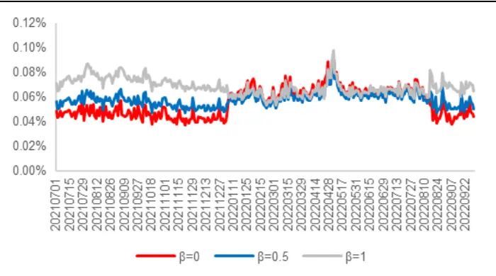
资料来源：Wind，海通证券研究所

图10 纯市价单策略的成本预测误差（每个股票 1000万元）
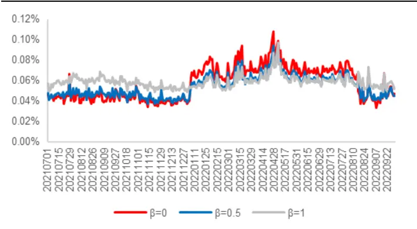
资料来源：Wind，海通证券研究所

图11 纯市价单策略的成本预测误差（每个股票 5000万元）
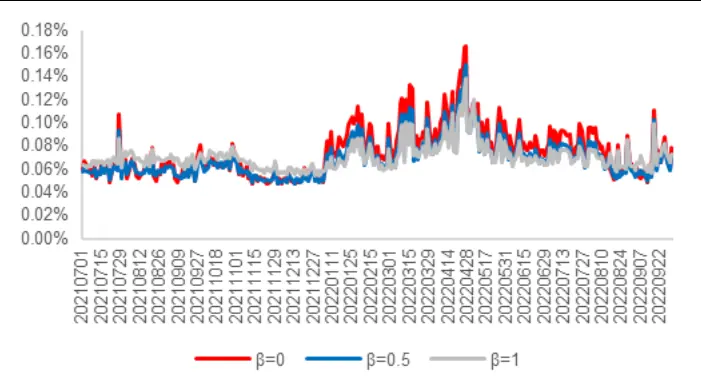
资料来源：Wind，海通证券研究所

图12 纯市价单策略的成本预测误差（每个股票 1亿元）
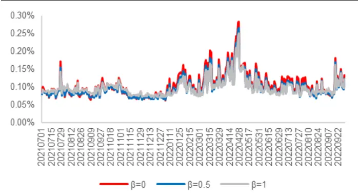
资料来源：Wind，海通证券研究所

除了成交金额，不同时段的预测误差也有明显的差异。例如，2021 年 12 月至 2022年 4 月，市场下跌幅度较大，成交量也明显萎缩。在此期间，不同交易金额的成本预测精度普遍下降，预测误差相比其余时期大幅上升。

相比简单的滑点方式，上文介绍的预测方法既可以灵活地反映交易金额对成本的影响，又可以显著地区分不同股票交易成本的差异，从而使策略回测更加符合实际。

下表展示了不同交易金额和 下，使用本文方法和滑点方式的成本预测误差。首先，当交易金额较小时（ 万元或 万元），滑点方式不失为一种简单却行之有效的预测。其平均误差与本文方法的结果并无显著区别。但当交易金额较大时（5000 万元或 1亿元），滑点方式相比本文方法的预测精度就要差很多了。

表 1 纯市价单策略的成本预测效果（2021.07-2022.09）

| 100万元 |  | 平均误差 | 误差IC | 误差IC 的离散系数 |
| --- | --- | --- | --- | --- |
|  | β=0 | 0.056% | 0.341 | 0.311 |
|  | β=0.5 | 0.058% | 0.338 | 0.266 |
|  | β=1 | 0.069% | 0.323 | 0.230 |
|  | 滑点（0.1%） | 0.063% | - | - |
|  | β=0 | 0.058% | 0.396 | 0.288 |
|  | β=0.5 1000万元 | 0.054% | 0.400 | 0.251 |
| 5000万元 | β=1 | 0.059% | 0.396 | 0.218 |
|  | 滑点（0.1%） | 0.056% | - | - |
|  | β=0 | 0.075% | 0.623 | 0.103 |
|  | β=0.5 | 0.070% | 0.625 | 0.095 |
|  | β=1 | 0.071% | 0.620 | 0.090 |
|  | 滑点（0.1%） | 0.103% | - | - |
| 1亿元 | β=0 | 0.105% | 0.718 | 0.043 |
|  | β=0.5 | 0.099% | 0.719 | 0.040 |
|  | β=1 | 0.099% | 0.716 | 0.038 |
|  | 滑点（0.1%） | 0.188% |  |  |

资料来源：Wind，海通证券研究所

其次，预测成本与真实成本之间较高的 IC则表明，本文的预测方法对不同股票的真实交易成本有较好的截面区分度。尤其是随着交易金额的提升，本文方法捕捉股票间交易成本差异的能力也在逐渐增强。

第三，和图 9-12 的结论一致，参数 也会影响预测误差。从我们的回测结果来看，取 0.5 在 4 种不同交易金额下都是相对较优的选择。

进一步分别在三个主流宽基指数的成分股内，按照指数权重分配交易金额后（总交易金额=第二列的金额*成分股数量，下同），再计算成本预测误差，结果如下表所示。

表 2 主要宽基指数纯市价单策略的成本预测误差汇总（2021.07-2022.09）

|  | 滑点（0.1%） |  | β=0 | β=0.5 | β=1 |
| --- | --- | --- | --- | --- | --- |
|  | 100万元 | 0.079% | 0.043% | 0.049% | 0.063% |
|  | 1000万元 沪深 300 | 0.060% | 0.031% | 0.033% | 0.044% |
|  | 5000万元 | 0.040% | 0.033% | 0.035% | 0.045% |
|  | 1亿元 | 0.042% | 0.040% | 0.038% | 0.045% |
|  | 100万元 | 0.065% | 0.051% | 0.056% | 0.068% |
|  | 1000万元 | 0.053% | 0.053% | 0.051% | 0.059% |
| 中证1000 | 5000万元 | 0.075% | 0.064% | 0.059% | 0.062% |
|  | 1亿元 | 0.136% | 0.083% | 0.076% | 0.078% |
|  | 100万元 | 0.072% | 0.067% | 0.069% | 0.081% |
|  | 1000万元 | 0.063% | 0.071% | 0.066% | 0.072% |
|  | 5000万元 | 0.128% | 0.093% | 0.085% | 0.084% |
|  | 1亿元 | 0.238% | 0.128% | 0.120% | 0.117% |

资料来源： ，海通证券研究所

对于成分股流动性很好的沪深 指数，较小的 通常都对应更小的预测误差；对于流动性不如沪深 300 的中证 500 指数，当交易金额较大时，更保守的 （0.5 或 1）设定，可以减小预测误差；而对于流动性在三者中最差的中证 1000 指数，除非每个股票的交易金额较小，如，100 万，否则我们都应该选择较大的 参数来预测成本。

## 2.3 基于 TWAP 的限价单优先策略的成本预测

## 2.3.1基于TWAP 的限价单优先策略的成本预测方法

限价单优先策略是指，先尽可能以限价单形式成交，再将未成交部分以市价单强制成交。所以，在预测成本时，也要对限价成交和强制市价成交两部分单独进行，再按成交比例合成。由于限价成交部分的成本只与价格波动有关，因此，最终的预测成本为，

$$
Cost_{min}=Weight_{i,\mathrm{min}}*Vol\ Cost_{i,\mathrm{min}}+Weight_{m,\mathrm{min}}*(Vol\ Cost_{m,\mathrm{min}}+DiffCost_{m,\mathrm{in}}+SheetLiqCost_{m,\mathrm{in}})
$$

其中， $VolCost_{l,min}\hat{\square}VolCost_{m,min}$ 分别代表限价单和市价单的价格波动成本，它们的计算公式相同，但下单次数 n会随不同的下单策略变化。 $Weight_{l,min}$ 与 $Weight_{m,min}$ 分别代表限价单和市价单的成交占比，具体数值由下单策略、股票价格走势等多重因素决定。而由前文可知，该参数的预测难度很大，故后文将通过人为设定，对其进行简化。

## 2.3.2基于TWAP 的限价单优先策略的成本预测效果

首先，我们将限价单优先策略设定为，对于每分钟的欲交易量 m，在前半分钟先尝试三次限价单成交。第一次下单量为 m/3，后两次下单量为 m/3 加上前序下单的未成交部分；后半分钟则将前半分钟的未成交部分等分为 3 份，分三次以市价成交。

随后，我们对中证 800+中证 1000 的成分股，并假设每个股票的交易金额为 100 万、1000 万、5000 万和 1 亿元，采用等权或按指数权重再分配交易金额两种方式，分别利用限价单交易策略进行买卖模拟测试，得到的限价单成交比例如下表所示。

表 3 主要宽基指数成分股的限价单成交比例（2021.07-2022.09）

| 1800只股票等权 | 买入 | 卖出 | 买卖均值 |
| --- | --- | --- | --- |
|  | 100万元 55.2% | 52.9% | 54.0% |
|  | 1000万元 41.8% | 39.2% | 40.5% |
|  | 5000万元 25.1% | 23.1% | 24.1% |
|  | 1亿元 17.8% | 16.4% | 17.1% |
|  | 100万元 73.1% | 74.6% | 73.8% |
|  | 1000万元 | 63.4% 65.9% | 64.7% |
| (指数权重分配) 中证500 (指数权重分配) | 5000万元 45.1% | 48.3% | 46.7% |
|  | 1亿元 34.3% | 37.4% | 35.9% |
|  | 100万元 58.5% | 60.2% | 59.4% |
|  | 1000万元 45.4% | 47.8% | 46.6% |
|  | 5000万元 26.7% | 28.7% | 27.7% |
|  | 1亿元 18.4% | 19.8% | 19.1% |
| 中证1000 (指数权重分配) | 100万元 58.0% | 60.4% | 59.2% |
|  | 1000万元 41.7% | 44.7% | 43.2% |
|  | 5000万元 22.4% | 24.3% | 23.4% |
|  | 1亿元 14.8% | 16.0% | 15.4% |

资料来源：Wind，海通证券研究所

同样的交易金额，买入和卖出的限价单成交比例并无显著差异；但不论是哪个指数或何种交易金额分配方式，随着交易金额的上升，限价单成交比例都显著下降。若按指数权重分配交易金额，则金额大小和成分股流动性的影响更甚。同样是从 100 万变为 1亿，沪深 300 的买卖平均成交比例仍有 36%，而中证 500 和中证 1000 均不足 20%。

参考上表中等权交易的测算结果，我们假定每只股票的交易金额为 100 万、1000万、5000 万和 1 亿时，对应的限价单成交比例为 50%、40%、20%和 10%，那么在2021.07-2022.09 期间计算得到的交易成本预测误差如以下 4图所示。

图13 限价单优先策略的成本预测误差（每个股票 100万元）
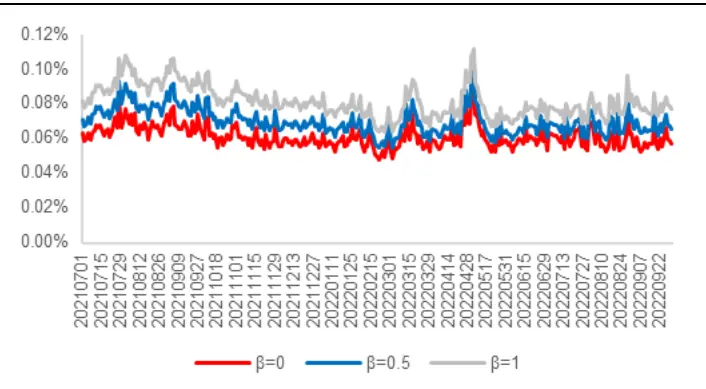
资料来源：Wind，海通证券研究所

图14 限价单优先策略的成本预测误差（每个股票 1000万元）
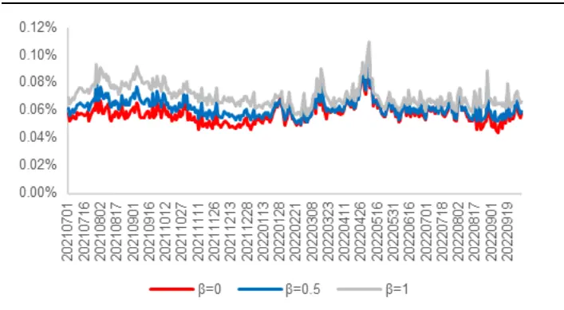
资料来源：Wind，海通证券研究所

图15 限价单优先策略的成本预测误差（每个股票 5000万元）
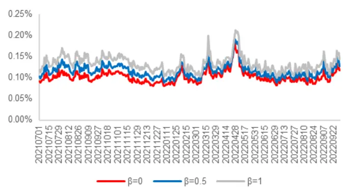
资料来源：Wind，海通证券研究所

图16 限价单优先策略的成本预测误差（每个股票 1亿元）
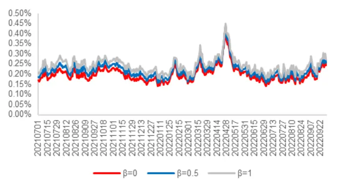
资料来源：Wind，海通证券研究所

与纯市价策略相比，限价单优先策略的预测误差更高，但 对误差的影响程度则要更低。可能的原因是，人为设定的限价单成交比例与实际情况存在差异，使得 对预测结果的影响能力变弱。

下表进一步展示了限价单优先策略在不同 和交易金额下的平均预测误差。和简单的滑点方式相比，本文方法的预测虽然精度相对更高，但却明显不及表 1 中的纯市价策略。这是因为，根据模拟撮合的结果，我们设定的限价单成交比例远低于实际，导致更多的成交是遵循纯市价策略的成本预测方法，从而引入了本不该有的价差成本与盘口流动性成本。同时，更高的市价单成交比例也会显著推高盘口流动性成本，使成本预测更保守。

表 4 限价单优先策略的成本预测效果（2021.07-2022.09）

| 100万元 |  | 平均误差 | 误差IC | 误差IC 的离散系数 |
| --- | --- | --- | --- | --- |
|  | β=0 | 0.061% | 0.249 | 0.241 |
|  | β=0.5 | 0.070% | 0.216 | 0.263 |
|  | β=1 | 0.081% | 0.190 | 0.297 |
|  | 滑点（0.1%） | 0.082% | - | - |
|  | β=0 | 0.058% | 0.421 | 0.159 |
|  | β=0.5 | 0.062% | 0.390 | 0.159 |
| 1000万元 | β=1 | 0.071% 0.358 | 0.179 |  |
|  | 滑点（0.1%） | 0.070% | 一 |  |
| 5000万元 | β=0 | 0.103% | 0.734 0.043 |  |
|  | β=0.5 | 0.116% | 0.731 0.043 |  |
|  | β=1 | 0.133% 0.725 | 0.044 |  |
|  | 滑点（0.1%） | 0.149% - | - |  |
| 1亿元 | β=0 | 0.201% | 0.721 0.051 |  |
|  | β=0.5 | 0.220% | 0.719 0.050 |  |
|  | β=1 | 0.242% | 0.716 0.050 |  |
|  | 滑点（0.1%） | 0.305% | 1 |  |

资料来源：Wind，海通证券研究所

我们进一步根据指数权重分配交易金额，计算三个主流宽基指数成分股交易成本的平均预测误差。如下表所示，相较简单滑点法，本文方法在限价单优先策略中对成本预测误差的改善，尤其是在交易金额较大时，明显不及表 2 中的纯市价单策略。

表 5 主要宽基指数限价单优先策略的成本预测误差汇总（2021.07-2022.09）

|  | 滑点（0.1%） |  | β=0 | β=0.5 | β=1 |
| --- | --- | --- | --- | --- | --- |
|  | 100万元 | 0.103% | 0.062% | 0.074% | 0.088% |
|  | 1000万元 | 0.086% | 0.045% | 0.058% | 0.072% |
|  | 5000万元 | 0.056% | 0.070% | 0.088% | 0.108% |
|  | 1亿元 | 0.051% | 0.111% | 0.132% | 0.156% |
|  | 100万元 | 0.090% | 0.062% | 0.073% | 0.086% |
|  | 1000万元 | 0.070% | 0.055% | 0.064% | 0.077% |
| 中证500 中证1000 | 5000万元 | 0.088% | 0.096% | 0.111% | 0.131% |
|  | 1亿元 | 0.186% | 0.176% | 0.198% | 0.223% |
|  | 100万元 | 0.093% | 0.074% | 0.085% | 0.099% |
|  | 1000万元 | 0.075% | 0.070% | 0.077% | 0.088% |
|  | 5000万元 | 0.166% | 0.126% | 0.141% | 0.161% |
| 1亿元 |  | 0.358% | 0.235% | 0.256% | 0.280% |

资料来源： ，海通证券研究所

## 3. 总结

交易成本是投资过程中的重要一环，本文根据海内外的实践经验，将其分为价格走势、价格波动、买卖价差、盘口流动性、限价单成交概率五个部分，它们对于不同交易策略的影响程度也各不相同。因此，深入探究每个组成部分对成本的作用机制，分析哪些部分是可预测的，哪些又相对难以预测，对更为精准地预测交易成本非常重要。

本文通过两个基于 TWAP的纯市价单和限价单优先策略，展示了交易成本的预测方法，并将其与简单的滑点方式进行了对比。对于纯市价单策略，由于不涉及成交概率这一较难预测的因素，故最终的成本预测误差显著优于滑点方式；而对于限价单优先策略，限价单成交概率的预测准确性很大程度上决定了最终的成本预测效果。我们认为，虽然本文介绍的这两种方法都对市场和预测过程做了诸多简化，有效性有待商榷，但仍不失为研究交易成本预测的一个良好起点。

对于交易频率较高的量化策略而言，理论上美好的策略能否付诸实践，很多时候都依赖于更准确的交易成本估计。例如，在构建量化组合时，我们可以把每个想交易的股票的成本预测当作惩罚项加入优化目标，取代简单的统一滑点惩罚，从而尽可能避免回测结果和样本外的应用效果有较大差距。当然，交易成本的预测还有很多不同的应用场景，这也是我们未来研究的一个重要方向。

## 4. 风险提示

市场系统性风险、模型误设风险、有效因子变动风险。

# 信息披露

分析师声明

[Table冯佳睿yst金融工程研究团队s]

余浩淼金融工程研究团队

本人具有中国证券业协会授予的证券投资咨询执业资格，以勤勉的职业态度，独立、客观地出具本报告。本报告所采用的数据和信息均来自市场公开信息，本人不保证该等信息的准确性或完整性。分析逻辑基于作者的职业理解，清晰准确地反映了作者的研究观点，结论不受任何第三方的授意或影响，特此声明。

## 法律声明

。本公司不会因接收人收到本报告而视其为客户。在任何情况下，

本报告中的信息或所表述的意见并不构成对任何人的投资建议。在任何情况下，本公司不对任何人因使用本报告中的任何内容所引致的任何损失负任何责任。

本报告所载的资料、意见及推测仅反映本公司于发布本报告当日的判断，本报告所指的证券或投资标的的价格、价值及投资收入可能会波动。在不同时期，本公司可发出与本报告所载资料、意见及推测不一致的报告。

市场有风险，投资需谨慎。本报告所载的信息、材料及结论只提供特定客户作参考，不构成投资建议，也没有考虑到个别客户特殊的投资目标、财务状况或需要。客户应考虑本报告中的任何意见或建议是否符合其特定状况。在法律许可的情况下，海通证券及其所属关联机构可能会持有报告中提到的公司所发行的证券并进行交易，还可能为这些公司提供投资银行服务或其他服务。

本报告仅向特定客户传送，未经海通证券研究所书面授权，本研究报告的任何部分均不得以任何方式制作任何形式的拷贝、复印件或复制品，或再次分发给任何其他人，或以任何侵犯本公司版权的其他方式使用。所有本报告中使用的商标、服务标记及标记均为本公司的商标、服务标记及标记。如欲引用或转载本文内容，务必联络海通证券研究所并获得许可，并需注明出处为海通证券研究所，且不得对本文进行有悖原意的引用和删改。

根据中国证监会核发的经营证券业务许可，海通证券股份有限公司的经营范围包括证券投资咨询业务。

## 海通证券股份有限公司研究所[Table_PeopleInfo]

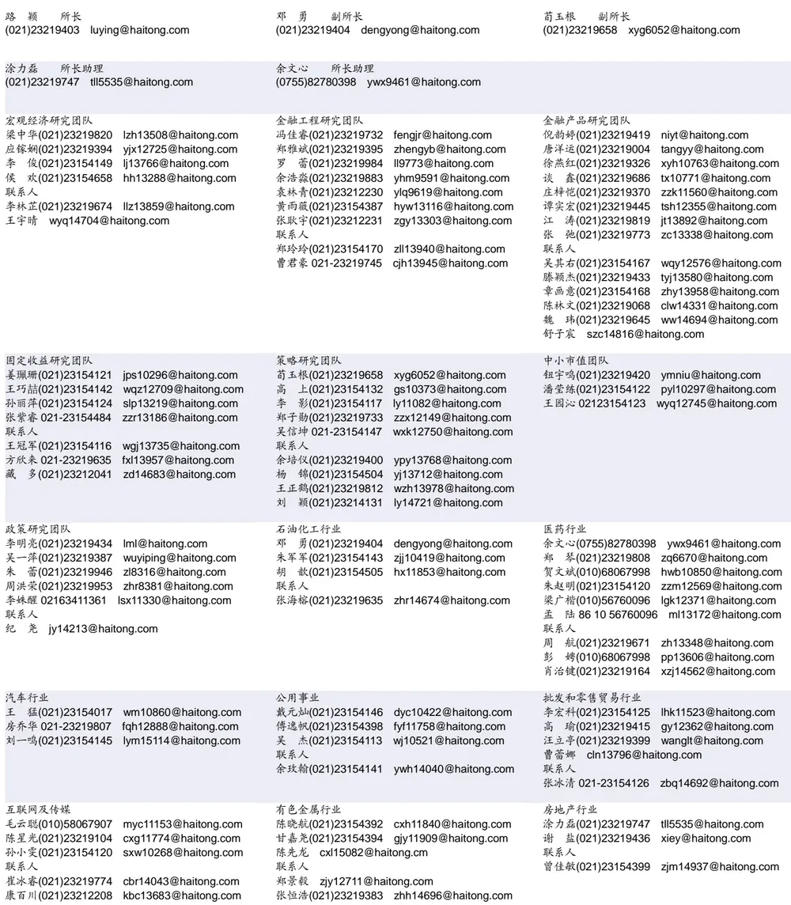

## 研究所销售团队

## 深广地区销售团队

伏财勇(0755)23607963 fcy7498@haitong.com

蔡铁清(0755)82775962 ctq5979@haitong.com

辜丽娟(0755)83253022 gulj@haitong.com

刘晶晶(0755)83255933 liujj4900@haitong.com

饶 伟(0755)82775282 rw10588@haitong.com

欧阳梦楚(0755)23617160

oymc11039@haitong.com

巩柏含 gbh11537@haitong.com

滕雪竹 0755 23963569 txz13189@haitong.com

张馨尹 0755-25597716 zxy14341@haitong.com

海通证券股份有限公司研究所

地址：上海市黄浦区广东路 689号海通证券大厦 9楼

网址：www.htsec.com

电话：（021）23219000

传真：（021）23219392

上海地区销售团队上海地区销售团队

胡雪梅(021)23219385 huxm@haitong.com 黄 诚(021)23219397 hc10482@haitong.com 季唯佳(021)23219384 jiwj@haitong.com 黄 毓(021)23219410 huangyu@haitong.com 李 寅 021-23219691 ly12488@haitong.com 胡宇欣(021)23154192 hyx10493@haitong.com 马晓男 mxn11376@haitong.com 邵亚杰 23214650 syj12493@haitong.com 杨祎昕(021)23212268 yyx10310@haitong.com 毛文英(021)23219373 mwy10474@haitong.com 谭德康 tdk13548@haitong.com 王祎宁(021)23219281 wyn14183@haitong.com 张歆钰 zxy14733@haitong.com 周之斌 zzb14815@haitong.com

北京地区销售团队
殷怡琦(010)58067988 yyq9989@haitong.com
董晓梅 dxm10457@haitong.com
郭 楠 010-5806 7936 gn12384@haitong.com
杨羽莎(010)58067977 yys10962@haitong.com
张丽萱(010)58067931 zlx11191@haitong.com
郭金垚(010)58067851 gjy12727@haitong.com
张钧博 zjb13446@haitong.com
高 瑞 gr13547@haitong.com
上官灵芝 sglz14039@haitong.com
姚 坦 yt14718@haitong.com