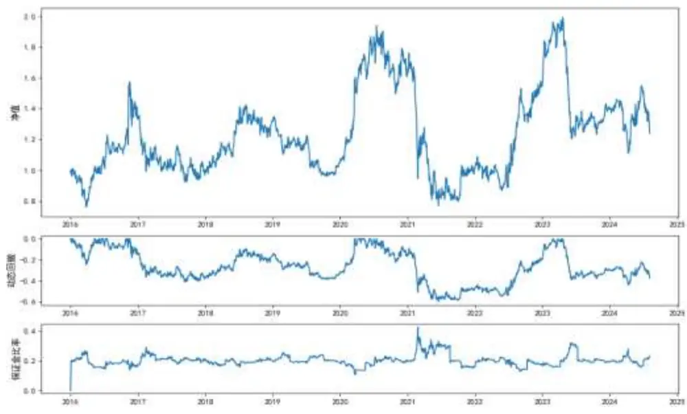
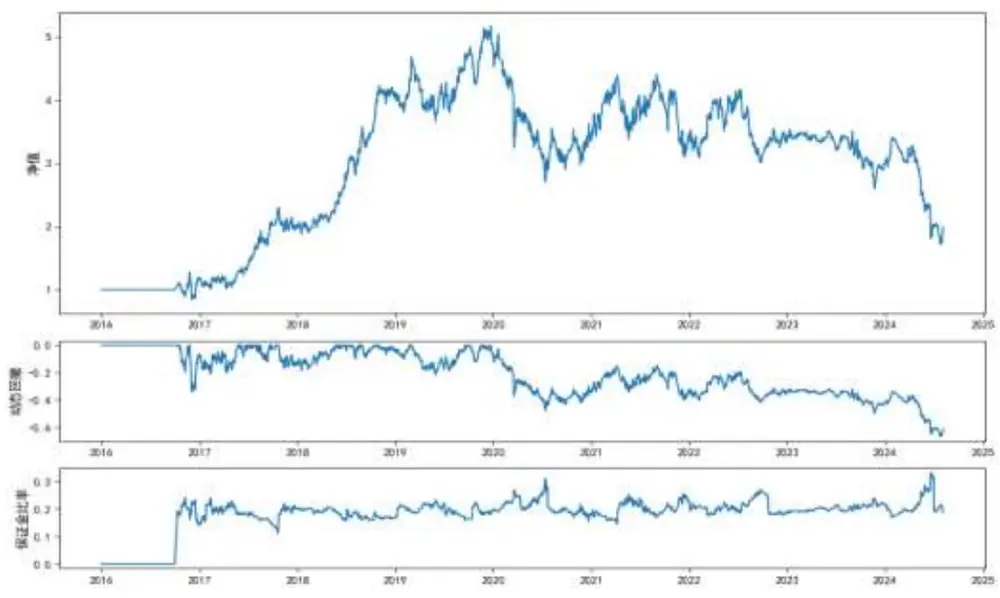
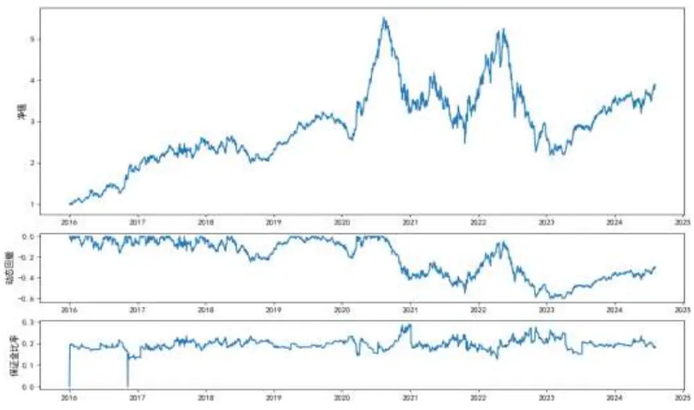
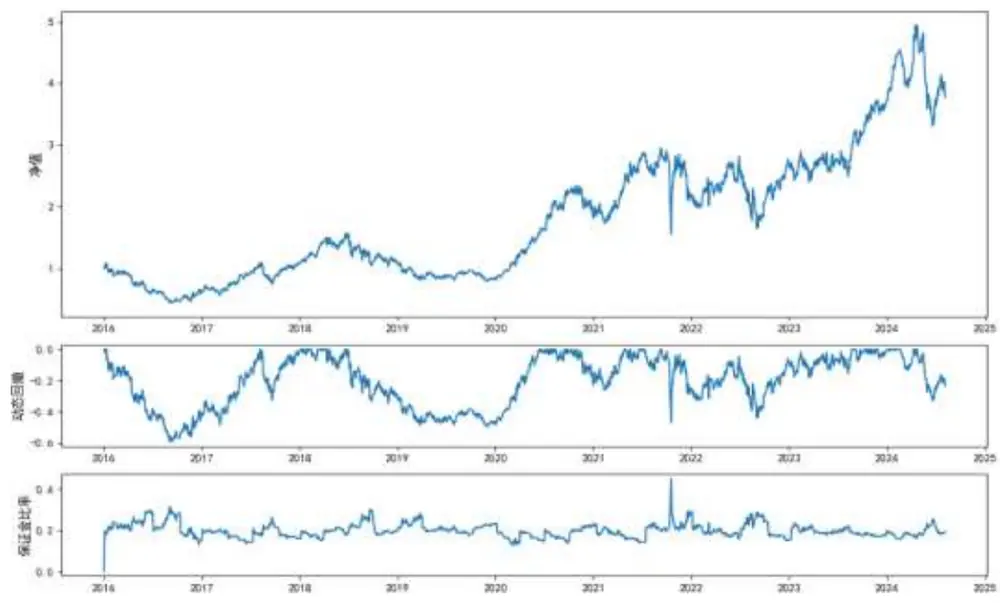
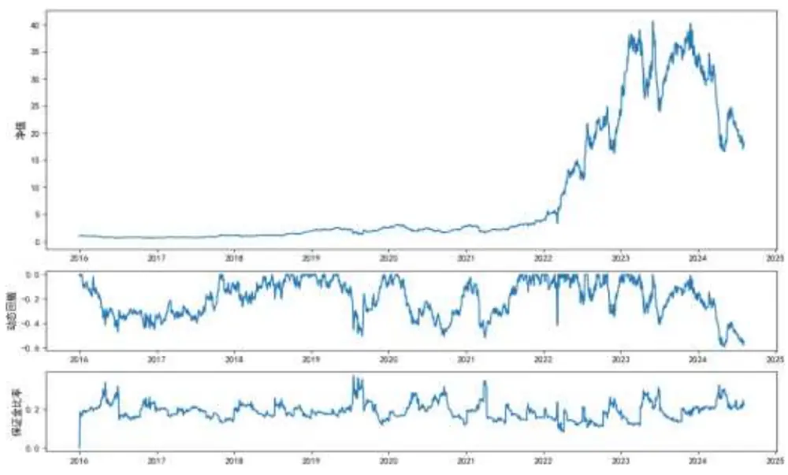
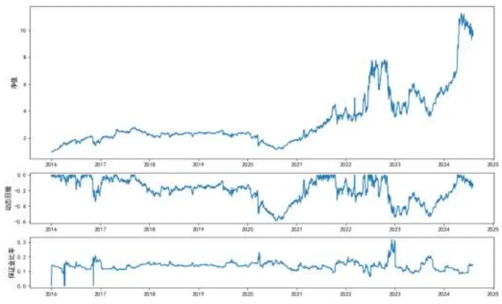
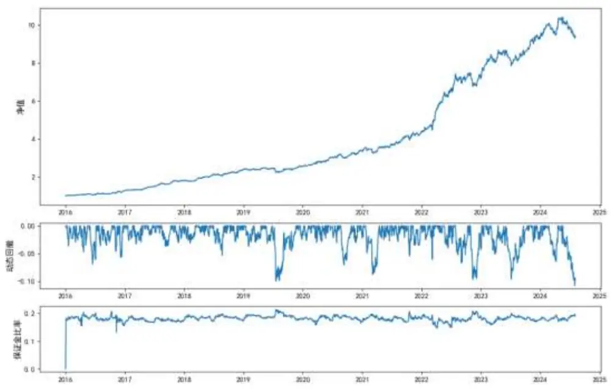

# 量化策略：商品期货的中高频数据的高阶特征分析

## 摘要：

- 本篇报告针对时序高阶类型因子进行研究。对该类因子为何能够存在的底层逻辑、其收益来源、以及影响其效果的关键因素一一展开讨论。

高阶特征利用期货高阶矩与其未来收益建立联系，刻画日内价格分布以及快速变化的特征，能够有效反映价格的除动量和波动率这样一阶和二阶特征外更高阶的特征。本文中，我们对6个不同构建方式下的高阶特征因子进行了有效性检验，包含分钟收益率的高阶特征和分钟成交量占比的高阶特征。

- 综上所述，高阶特征因子整体有效性良好，其中收益率偏度与收益率偏度和峰度比值因子具有不错的预测性和稳定性，可以关注。

风险提示：模型误设风险、历史统计规律失效等风险。

[table_invest] 作者姓名：陆昶燚

邮箱：luchangyi @csc.com.cn

电话：023-81157340

期货从业信息：F3079046

期货交易咨询从业信息：Z0018527

发布日期：2024 年 9 月 9 日

## 概述

高阶特征利用股票高阶矩与其未来收益建立联系，刻画日内价格分布以及快速变化的特征，能够有效反映价格的除动量和波动率这样一阶和二阶特征外更高阶的特征。本文主要就高频数据中的峰度与偏度系数进行验证，峰度系数衡量的是数据分布的尖峰程度，数值越大，数据点越集中在峰值周围，而偏度系数则揭示了分布的不对称性，绝对值越大，表明数据点在正负方向上的偏离越明显，中位数与平均值之间的差距会更显著。峰度系数过小意味着分布平滑，可能导致区分度不足，而过大则可能导致信号过于集中，尾部不稳定。偏度系数则为我们揭示因子的特性，如新闻情绪因子常常倾向于正向偏离，暗示积极信息占主导。

## 1.1. 中高频数据的应用

日内高频数据因子是以日内交易价量、逐笔成交、逐笔委托以及分钟 K线等数据为基础构建的，刻画的是更细腻的交易结构和交易行为。对比低频因子，高频数据在量化建模中表现出一些明显的优势：

## 1、信息含量更加丰富

相较于日频数据，高频数据具有更加丰富的信息量。高频数据体量往往明显大于低频数据。相对于日频数据，高频交易数据的体量是其几万倍，考虑到计算机的算力水平，本文主要使用的是 30分钟的中高频数据，其体量也能达到日频数据的 10倍以上。

## 2、因子开发度较低

当前市场上，日频数据的开发与研究相对更加成熟，日频因子的拥挤程度很高，但是高频数据结构相对复杂，处理成本较高，且信息主要来源于日内行情，因子开发流程相对复杂，这些因素都使得因子拥挤度相对较低，且高频数据的开发也可以借鉴日频因子的开发思路，可以为高频因子的开发提供灵感。

## 3、因子相关性较低

日频数据的数据维度较低，通常使用的包括价格，成交量，涨跌幅，换手率等，高频数据拥有更高的数据维度，类似期货市场中的 tick 数据，盘口五档的报价信息等，这是在日频维度中无法得到的数据，所以我们可以从更多的维度去开发因子，由于高频因子的高维度信息和丰富的数据处理方式，使用高频数据构造的因子内部相关性较低，投资者更有可能从中获得更丰富的信息增量。

## 1.2. 因子开发过程

## 1.成交量峰度因子

逻辑：使用的是日内 15 分钟的成交数据，我们这里使用的是距当前成交价格 500 根 K 线的成交量作为计算标准，计算出前 K 线各商品品种与前 500 根 K 线成交量占比，选取成交量占比偏度最大的部分品种做多，选取成交量占比偏度最小的部分品种做空。

$$
\begin{array}{r}{\mathrm{Vol-skew}=~\mathrm{skew}~(\frac{volume_{t}}{\sum_{i}^{n}{volume_{i}}})}\end{array}
$$

2.成交量偏度因子：

逻辑：我们这里使用的是距当前成交价格 500 根 K 线的成交量作为计算标准，计算出前 K 线各商品品种与前 500根K线成交量占比，选取成交量占比偏度最大的部分品种做多，选取成交量占比偏度最小的部分品种做空。

$$
\begin{array}{r}{\mathrm{Vol-kurt}=\mathrm{~kurt}\ (\frac{volume_{t}}{\sum_{i}^{n}volume_{i}})}\end{array}
$$

3.成交量峰度与偏度比值因子：

逻辑：我们这里使用的是距当前成交价格 500 根 K 线的成交量作为计算标准，计算出前 K 线各商品品种与前 500根K线成交量占比，再计算其峰度与偏度的比值，选取数值最大的部分品种做多，选取数值最小的部分品种做空。

$$
\mathrm{Vol-sk=Vol-skew/Vol-kurt}
$$

4.收益率峰度因子

逻辑：使用的是日内 15 分钟的成交数据，我们这里使用的是距当前成交价格 500 根 K 线的收益率作为计算标准，选取收益率峰度最大的部分品种做多，选取收益率峰度最小的部分品种做空。

$$
\mathrm{yield-skew}=\ \mathrm{skew}\ (\frac{volume_{t}}{\Sigma_{i}^{n}volume_{i}})
$$

5.收益率偏度因子：

逻辑：使用的是日内 15 分钟的成交数据，我们这里使用的是距当前成交价格 500 根 K 线的收益率作为计算标准，选取收益率偏度最大的部分品种做多，选取收益率偏度最小的部分品种做空。

$$
{\mathrm{yield-kurt}}={\mathrm{kurt}}\ ({\frac{volume_{t}}{\sum_{i}^{n}volume_{i}}})
$$

6.收益率峰度与偏度比值因子：

逻辑：使用的是日内 15 分钟的成交数据，我们这里使用的是距当前成交价格 500 根 K 线的收益率作为计算标准，再计算其峰度与偏度的比值，选取收益率偏度最大的部分品种做多，选取收益率偏度最小的部分品种做空。

$$
\mathrm{yield-sk=Vol-skew/Vol-kurt}
$$

## 因子表现

图 1：成交量峰度测试结果

数据来源：中信建投期货

| 因子代码 | 年化收益 | 波动率 | 夏普比率 | 卡玛比率 | 最大回撤 | 最大回撤周期 |
| --- | --- | --- | --- | --- | --- | --- |
| Vol-skew | 2.53% | 34.61% | 0.015 | 0.042 | 60.42% | 813 |

数据来源：中信建投期货

图 2：成交量偏度测试结果

数据来源：中信建投期货

| 因子代码 | 年化收益 | 波动率 | 夏普比率 | 卡玛比率 | 最大回撤 | 最大回撤周期 |
| --- | --- | --- | --- | --- | --- | --- |
| Vol-kurt | 9.14% | 35.28% | 0.202 | 0.137 | 66.67% | 1119 |

数据来源：中信建投期货

图 3：成交量峰度与偏度比值测试结果

数据来源：中信建投期货

期货交易咨询业务资格：证监许可〔2011〕1461 号

| 因子代码 | 年化收益 | 波动率 | 夏普比率 | 卡玛比率 | 最大回撤 | 最大回撤周期 |
| --- | --- | --- | --- | --- | --- | --- |
| Vol-sk_ratio | 17.16% | 33.78% | 0.448 | 0.283 | 60.48% | 966 |

数据来源：中信建投期货

图 4：收益率峰度测试结果

数据来源：中信建投期货

| 因子代码 | 年化收益 | 波动率 | 夏普比率 | 卡玛比率 | 最大回撤 | 最大回撤周期 |
| --- | --- | --- | --- | --- | --- | --- |
| yield-skew | 16.68% | 42.96% | 0.342 | 0.281 | 59.43% | 474 |

数据来源：中信建投期货

图 5：收益率偏度测试结果

数据来源：中信建投期货

| 因子代码 | 年化收益 | 波动率 | 夏普比率 | 卡玛比率 | 最大回撤 | 最大回撤周期 |
| --- | --- | --- | --- | --- | --- | --- |
| yield-kurt | 40.18% | 58.15% | 0.657 | 0.678 | 59.19% | 435 |

数据来源：中信建投期货

图 6：收益率峰度与偏度比值测试结果

数据来源：中信建投期货

| 因子代码 | 年化收益 | 波动率 | 夏普比率 | 卡玛比率 | 最大回撤 | 最大回撤周期 |
| --- | --- | --- | --- | --- | --- | --- |
| yield-sk_ratio | 30.07% | 49.01% | 0.572 | 0.506 | 59.42% | 898 |

数据来源：中信建投期货

全市场范围内，收益率偏度与峰度比值因子表现较好，具有良好的单调性，与常见因子不存在显著相关性；而成交量占比峰度因子的表现较差，在各个年份均不存在明显正收益。

收益率偏度与峰度比值因子与收益率偏度因子具有良好有效性，在 15 分钟中高频测试下，两个因子的年化收益超过 30%。夏普比率与卡玛比率均超过0.5，收益率偏度因子在22至23年间收益爆发力较强，其余年份收益能力一般，收益率偏度与峰度比值因子在各个年份收益相对均匀。

从上面测试结果中我们可以看到，收益率高阶特征因子的绩效水平明显强于成交量占比高阶特征因子，但两类因子之间的相关性较低，我们后续将对六个因子进行等权合成，并评估其效果。

## 二、组合测试结果

## 2.1. 回测参数

## 资金分配

我们比较全品种等权资金分配方案策略效果，基础资金分配时间为每季度最后一个交易日，基础资金分配如下：

$$
\begin{array}{c}\frac{1+}{25}\pi\frac{11}{11}\times\frac{2}{5}\pi\frac{1}{12}\times\frac{1}{12}=\frac{\frac{1}{15}\times\frac{2}{15}\times\frac{2}{10}\times\frac{2}{10}}{\frac{1}{16}\times\frac{2}{15}\pi\times\frac{5}{10}\times\frac{1}{10}\times\frac{2}{10}\times\frac{3}{10}\times\frac{2}{10}\times\frac{3}{10}\times\frac{5}{10}\times\frac{3}{10}}\end{array}
$$

注：杠杆系数在下文测试中统一设为2.0。

测试参数

回测时段：2017 年 1 月 1 日 - 2024 年 3 月 8 日

回测品种：期货市场内流动性较好的 30多个品种

成交时间：信号出现后下一个 K 线周期开盘价； 手续费设置: 交易所手续费 +20%；

交易频率：30min；

杠杆系数：1；

品种资金分配：每个季度最后一个交易日，按照当前可交易品种分配基础资金单位。

## 2.2. 高阶特征因子组合表现

图 7：动量组合测试结果

数据来源：中信建投期货

| 因子代码 | 年化收益 | 波动率 | 夏普比率 | 卡玛比率 | 最大回撤 | 最大回撤周期 |
| --- | --- | --- | --- | --- | --- | --- |
| 组合 | 29.77% | 13.52% | 2.054 | 2.762 | 10.77% | 117 |

数据来源：中信建投期货
年度表现如下：

| 年份 | 总收益 | 波动率 | 最大回撤 | 夏普比率 | 卡玛比率 |
| --- | --- | --- | --- | --- | --- |
| 2016 | 28.57% | 14.62% | 6.90% | 1.823 | 4.151 |
| 2017 | 40.40% | 10.52% | 3.71% | 3.712 | 11.057 |
| 2018 | 34.28% | 10.75% | 5.35% | 3.055 | 6.514 |
| 2019 | 6.86% | 11.15% | 9.99% | 0.439 | 0.691 |
| 2020 | 31.44% | 12.80% | 7.08% | 2.307 | 4.454 |
| 2021 | 29.73% | 13.89% | 8.83% | 2.024 | 3.409 |
| 2022 | 62.60% | 20.13% | 9.73% | 3.065 | 6.546 |

| 2023 | 28.40% | 13.13% | 9.68% | 2.045 | 2.978 |
| --- | --- | --- | --- | --- | --- |
| 2024 | 0.34% | 11.88% | 10.78% | -0.120 | 0.054 |

数据来源：中信建投期货

从组合信号的测试结果来看，我们可以发现，合成策略后，策略的绩效水平显著高于前述 6个波动率策略的绩效水平，合成策略的夏普比率超过 ，卡玛比率超过 ，相较于之前策略，组合策略夏普比率提升超过 400%，但最大回撤大幅度缩小，缩小超过 40%，从年度收益表现来看，策略也在每个年度均能取得正收益，策略在 16年与近年表现相对较差，均未能取得较高的正收益。

从策略稳定性来看，组合策略 16 年至 18 年与 20 年至 22 年之后爆发力较强，年度收益据超过 20%，其中 17年与22年收益甚至超过 40%，但是今年几乎未取得正收益，且当前正处于回撤调整的状态。总体来看，策略22年之前较为稳健，净值稳步提升，但近年来，随着宏观风险增大，策略波动加大，回撤幅度也相应增大。

## 三、 结论

本文就期货商品市场中各品种高频成交量与收益率的高阶特征进行研究，其中的主要特征为两者的峰度与偏度系数。峰度和偏度系数，作为统计分析的重要组成部分，为我们揭示因子的动态特性，是构建投资策略的有力支撑。它们没有固定的优劣之分，而是根据具体情境灵活运用，帮助我们捕捉到有价值的交易信号，经本文验证，收益率的高阶特征因子相较于成交量的高阶特征因子表现更好，且两者之间相关性较低，将 6 个因子合成后，组合策略绩效提升幅度较大，但近年来，随着宏观事件干扰，影响策略表现，近期策略净值增长幅度下降较大，回撤幅度也相应增大。

## 联系我们

全国统一客服电话：400-8877-780

网址：www.cfc108.com

获取更多投研报告、专业客户经理一对一服务、

了解公司更多信息，扫描右方二维码即可获得！

## 重要声明

本报告观点和信息仅供符合证监会适当性管理规定的期货交易者参考，据此操作、责任自负。中信建投期货有限公司（下称“中信建投”）不因任何订阅或接收本报告的行为而将订阅人视为中信建投的客户。

本报告发布内容如涉及或属于系列解读，则交易者若使用所载资料，有可能会因缺乏对完整内容的了解而对其中假设依据、研究依据、结论等内容产生误解。提请交易者参阅中信建投已发布的完整系列报告，仔细阅读其所附各项声明、数据来源及风险提示，关注相关的分析、预测能够成立的关键假设条件，关注研究依据和研究结论的目标价格及时间周期，并准确理解研究逻辑。

中信建投对本报告所载资料的准确性、可靠性、时效性及完整性不作任何明示或暗示的保证。本报告中的资料、意见等仅代表报告发布之时的判断，相关研究观点可能依据中信建投后续发布的报告在不发布通知的情形下作出更改。

中信建投的销售人员、交易人员以及其他专业人士可能会依据不同假设和标准、采用不同的分析方法而口头或书面发表与本报告意见不一致的市场评论和/或观点。本报告发布内容并非交易决策服务，在任何情形下都不构成对接收本报告内容交易者的任何交易建议，交易者应充分了解各类交易风险并谨慎考虑本报告发布内容是否符合自身特定状况，自主做出交易决策并自行承担交易风险。交易者根据本报告内容做出的任何决策与中信建投或相关作者无关。

本报告发布的内容仅为中信建投所有。未经中信建投事先书面许可，任何机构和/或个人不得以任何形式对本报告进行翻版、复制和刊发，如需引用、转发等，需注明出处为“中信建投期货”，且不得对本报告进行任何增删或修改。亦不得从未经中信建投书面授权的任何机构、个人或其运营的媒体平台接收、翻版、复制或引用本报告发布的全部或部分内容。版权所有，违者必究。