## 研究结论

本报告探讨如何找到有逻辑意义并且能够有效的区分个股的因子，且因子值对于个股未来收益有一定的预测能力；用数学的语言描述就是如何检验单因子和收益率之间是否有相关性。

- 我们对因子的检验基于两个维度：

1、计算同一时刻的个股的指标值和未来一段时间（通常为一个月）收益的相关性，也就是 IC值（信息系数）。

2、按照指标值大小对股票进行分组，从时间序列的角度观察各组的历史累计收益、信息比率、最大回撤以及胜率等。各组表现的优势组的胜率越高，单调性越强，说明指标的区分能力和选股能力越强。

- 检验方法的几点思考和改进

1、最小二乘法（OLS regress） vs. 稳健回归（Robust Regress）

2、整体回归 vs. 按月度回归

3、指标值回归 vs. 秩相关系数

4、按照指标排序全市场分组 vs. 行业内分组

5、同向显著比例 vs. 状态切换比例

我们以 32个常用选股因子为例，用改进后的方法做单因子检验并对因子进行了综合排序。总体而言，表现较好的因子有市值因子、反转因子、换手率指标、各类业绩增速指标和估值指标。另外、资产负债率、周转天数、ROE、ROA 以及销售利润率等指标也对股价有着一定的预测性。

## 风险提示

- 报告中选股指标的收益基于历史数据进行统计，未来市场可能发生较大的风格转换。

- 量化选股的胜率不为百分之百，需进行严格的风险控制。

| 指标名称 | 指标排序 | 秩相关回归显著比例较高的方向 | 稳健回归显著比例较高的方向 |
| --- | --- | --- | --- |
| 总市值 | 1 |  |  |
| 流通市值 | 2 |  |  |
| 22 日涨跌幅 | 3 |  |  |
| 均线偏离度指标 | 3 |  |  |
| 22 日换手率 | 5 |  |  |
| 单季销售同比增速 | 6 | 十 | 十 |
| 净资产/总市值 | 7 | 十 | 十 |
| 单季净利润同比增速 | 7 | 十 | 十 |
| 销售收入/总市值 | 9 | 十 | 十 |
| 销售同比增速 TTM | 10 | 十 | 十 |

报告发布日期

2015 年 06 月 26 日

证券分析师谭瑾

021-63325888*5091

tanjin@orientsec.com.cn

执业证书编号：S0860513070001

朱剑涛

021-63325888*6077

zhujiantao@orientsec.com.cn

执业证书编号：S0860515060001

## 单因子检验—多因子选股模型的基石

量化投资者总是试图用数据构建一个个可以量化的指标，去衡量股票的状态和市场风格，并且认为具有某些量化特征的股票更容易获得超额收益。量化选股主要涉及到两个核心的问题。第一，如何选出有逻辑意义并且能够有效的区分个股的因子，使得因子值对于个股未来收益有一定的预测能力。第二，影响市场的因子众多，且市场风格并非一成不变，我们如何构建一个能够适应市场变化的多因子模型，筛选出大概率能够战胜市场的股票组合，

图：多因子选股模型构建流程

建立因子库通过打分或者多元回归等方式，对个股进行排序根据需求挑选打分靠前的个股，建立组合

资料来源：东方证券研究所

本篇报告将集中讨论第一个问题，用数学的语言描述就是如何检验单因子的有效性，也就是说，检验这个因子的大小和股票未来的收益是否有相关性。

实际上，已有的大量研究已经为我们指明了清晰的方向；归纳起来，一般可以从两个维度去讨论这个问题：

1、计算同一时刻的个股的指标值和未来一段时间（通常为一个月）收益的相关性，也就是大家常说的 IC值（信息系数）。

2、每一期按照指标值大小对股票进行分组，从时间序列的角度观察各组的历史累计收益、信息比率、最大回撤以及胜率等。各组表现的单调性越强，优势组的胜率越高，说明指标的区分能力和选股能力越强。

单因子检验非常重要，因为它不仅关乎一个指标是否进入因子库，还有助于我们全方位了解这个指标，为后续多因子模型的建立打下坚实的基差，具体而言，单因子检验要回答的问题有：

1、同一时间截面的因子数值与股票后续收益是正相关还是负相关？相关性是否显著？

2、整体而言，根据指标大小分组得到的组合收益如何分布？是否有单调性？优胜组胜率有多高？

3、风格持续或反转的频率：因子所代表的风格每次能持续多久？这关系到因子模型的因子权重是否适合做动态调整。

4、该指标更适合用于全市场分组还是行业内分组，哪种方式更合理且更有效?

为了回答以上的问题，在这篇报告中，我们构建了自己的单因子检验框架，也在方法上做了一些新的尝试，希望能使多因子选股的重要第一步迈得更坚实。

## 检验方法的几点思考和改进

单因子有效性检验的一个重要思路，就是检验同一时刻的个股指标值和未来一段时间（通常为一个月）收益的相关性。一般来说，我们会对两组数据进行线性回归，然后检验回归系数是否显著。下面的 1-3点都将围绕线性回归的方式进行讨论。

## 1、最小二乘法（OLS regress）vs. 稳健回归（Robust Regress）

## 一元线性回归

将一系列观察到的指标值和未来的个股收益，通过拟合参数的方式，确定相应的直线方程Y = βx + α + µ

每个 t 时刻，对应：

$$
\mathrm{Y}_{\mathrm{t}}=\beta\mathrm{x}_{\mathrm{t}}+\alpha+\mathrm{u}_{\mathrm{t}}
$$

α、β为参数（parameters）,或称回归系数（regression coefficients），u通常被称为随机误差项。

## 最小二乘法

为了得到 值，最常用的方法是采用最小二乘法（ordinary least squares,简记 OLS）进行参数拟合。所谓最小二乘法，用数学公式表示就是：

使拟合之后的残差平方和（residual sum of squares, 简记 RSS） ∑ ̂   最小化：

$$
\mathrm{RSS}=\sum_{\mathrm{t}=1}^{\mathrm{T}}(\mathrm{y}_{\mathrm{t}}-\hat{\mathrm{y}}_{\mathrm{t}})^2=\sum_{\mathrm{t}=1}^{\mathrm{T}}(\mathrm{y}_{\mathrm{t}}-\hat{\mathrm{\alpha}}-\hat{\mathrm{\beta}}\mathrm{x}_{\mathrm{t}})^2
$$

传统的最小二乘法方便估计出一个线性回归系数，但其目标函数并不是一个稳健的统计量，容易受到异常样本值的影响。因为最小二乘法要求误差项相互独立、服从正态分布、以零为数学期望并有相同方差的随机变量。当实际的观测值包含异常值时，误差将不再服从正态分布，而是重尾分布（long-tailed distribution）。对这样的数据作回归分析时，回归直线将是主体数据与异常值之间的一个妥协，而与真实的回归线相差较远。

## 稳健回归法

在多因子模型中，一些选股因子很可能会出现一些异常值，而这些异常值会对回归的模型参数产生较大影响。为了降低异常值的影响，我们可以使用加权最小二乘法（稳健回归）估计模型。

稳健回归的主要思路是将对异常值十分敏感的经典最小二乘回归中的目标函数进行修改；例如，剔除一些异常值，或者降低其在目标函数中的权重。

稳健回归就能够克服最小二乘回归因异常值而失真的缺陷，得出更为接近实际值的估计。

以 2011-12-30 的 stockpjcj5-60 指标为例，与最小二乘法相比，稳健回归受到个别奇异值的影响较小。如果用 t 检验，稳健回归收到奇异值的影响较小，其回归系数显著小于 0，而 OLS 回归系数变得不显著。

图：最小二乘法 vs.稳健回归 (2011-12-30：stockpjcj5-60 指标与未来一个月超额收益)
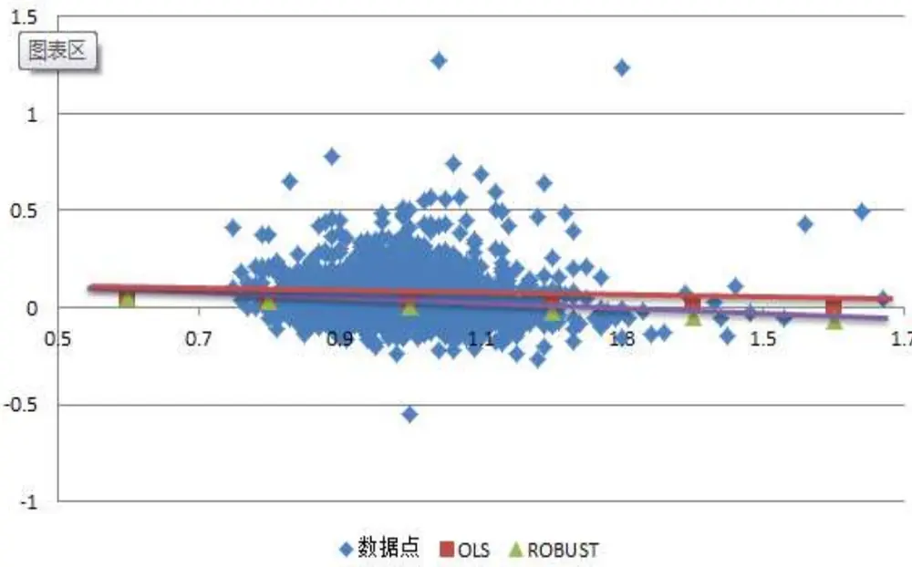
资料来源：wind，东方证券研究所

稳健回归(robustfit)的具体方法是通过数次的迭代，逐渐改变每一次回归的数据权重。一些常用的数据分析软件都有直接可以引用的稳健回归函数。

## 2、整体回归 vs. 按月度回归

每个月都有一组指标数据以及对应的未来收益率数据；以往有的研究会将几年的数据放在一起，整体进行回归，但我们更建议每月进行一次回归，按月回归的好处有两个:

1、减少单次回归的样本数量。

当我们得到一个回归系数 时，我们需要进行显著性检验（t 检验）；目的是通过检验回归系数β的值与 0是否有显著性差异，从而判断 Y与 X之间是否有显著的线性关系。

零假设： ；

备则假设： ；

若β=0,则 Y 和 x 之间并不存在线性关系;若β≠0,说明变量 Y 与 X 之间存在显著的线性关系。从下图可看出，当设定好一个显著水平后（如 0.05），样本量越大，拒绝原假设所需的相关系数越小，因此，样本量如果过大，指标很容易通过显著性检验，不利于对指标的优劣进行判断。

图：不同样本数对应的相关系数显著（拒绝零假设）的最小值
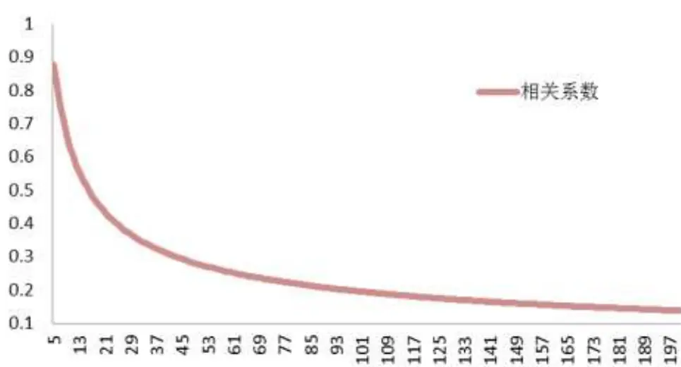
资料来源：东方证券研究所

2、有利于观察指标的历史表现。

数据放在一起做总体回归虽可以得到指标整体的历史规律，但市场不会长期保持一种风格，整体IC 忽略了很多重要的信息，而通过计算月度 IC，我们可以了解以下信息：

正相关月份的具体比例

- 负相关月份的具体比例

- 因子的持续周期和反转频率

## 3、指标值回归 vs. 秩相关系数

在对指标值进行稳健回归的基础上，我们还引入秩相关系数去检验指标与收益之间的相关性，这是因为指标与收益之间往往并不是线性相关的，而使用 Pearson 线性相关系数需要满足两个假设：

1、数据是成对地从正态分布中取得的；

2、数据至少在逻辑范畴内必须是等间距的数据。

如果这两条件不符合，一种选择就是采用 Spearman 秩相关系数来代替 Pearson 线性相关系数。

秩相关系数是一个非参数性质（与分布无关）的秩统计参数，由 Spearman 在 1904年提出，用来度量两个变量之间联系的强弱。秩相关系数又称顺序相关系数，是将两要素的样本值按数据的大小顺序排列位次，以各要素样本值的位次代替实际数据而求得的一种统计量。

不管变量之间的关系是不是线性的，只要变量之间具有严格的单调增加的函数关系，变量之间的秩相关系数就是 1（下图），相同情况下，Pearson相关性在变量不是线性函数关系时，并不是完全相关的。

图：秩相关系数为 1的案例
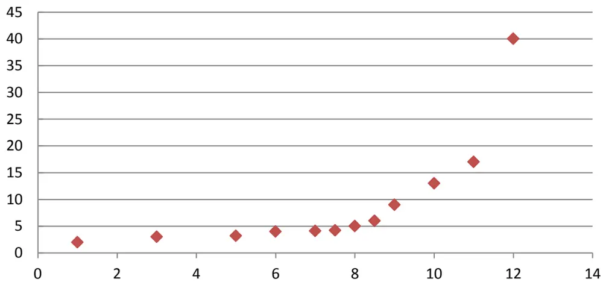
资料来源：东方证券研究所

当秩相关系数显著时，可以结合组合的历史超额收益、信息比率等信息，综合判断指标对于股票收益的区分度。

## 4、按照指标排序全市场分组 vs. 行业内分组

有一些基本面因子，如 PB、资产周转率、市值等，不同行业间有着天然的差异，可能不具有可比性，而且如果全市场分组，可能存在行业的显著偏离，因此全市场分组有效与指标在行业中性的情况下有效不是等同的概念。

我们在对因子的考察中，同时采用了行业内（申万 1 级）分组和全市场分组两种方式进行对比，发现有的指标在行业内分组的效果更好，而有的指标更适合于直接在全市场进行排序。

## 5、同向显著比例 vs. 状态切换比例

指标值每个月都可以与次月收益率之间算出一个回归系数，当回归系数显著的比例较高时，我们就认为该因子对与股票走势有一定的解释度。

一般而言，市场的风格不是一层不变的，而是轮动的。换言之，因子与收益率的回归系数会在正负之间之间切换。我们在运用因子时，有两个选择，一是计算历史正相关和负相关的比例，选取相关比例较高的一个方向作为对未来的预测；另一个方法是跟随最近的市场风格，例如采用该因子最近一次显著相关的方向作为对未来的预测，但这种方法要求因子有较强的延续性。

我们在检验结果中，同时列出正相关比例、负相关比例、同向显著比例以及状态切换比例。回归系数同向显著比例大，代表风格延续性强，越有可能在多因子模型中通过动态调整因子权重，提高胜率；而对于风格频繁切换的因子，使用静态权重可能是更好的方式。

## 常用因子检验结果

测试时间：2005 年 1 月-2015 年 2 月（共 122 个月）

选股范围：每月选取上市 6 个月以上的股票

基准指数：wind 全 A 指数

表：因子定义说明

| 指标定义说明 | 指标名称 | 指标计算方法 |
| --- | --- | --- |
| 估值指标 | BP | 最近报告期净资产/指定日总市值 |
|  | EP | 最近12个月净利润/指定日总市值 |
|  | SP | 最近12个月主营收入/指定日总市值 |
|  | CFP | 12个月经营性现金流/指定日总市值 |
|  | PE/ProfitGrowRateTTM | PE/ProfitGrowRateTTM |
|  | EBITDA/EV | EBITDA/企业价值 |
| 纯技术指标 | hsl22 | 最近22个交易日的换手率 |
|  | stockzf22 | 过去22个交易日涨跌幅 |
|  | stockpjcj5/60 | 5日VWAP/60日VWAP |
| 规模因子 | mv | 流通市值 |
|  | Totalmarketvalue | 总市值 |
| 盈利能力（纯财务指标） | ROA | 12个月归母净利润/平均总资产 |
|  | ROE | 12个月归母净利润/平均净资产 |
|  | ROA1 | 最近报告期归母净利润/总资产 |
|  | ROE1 | 最近报告期归母净利润/净资产 |
|  | OCFprofitratio | 12个月经营性现金流/12个月净利润 |
|  | profitsalesratio | 12个月归母净利润/12月个月总营业收入 |
|  | profitsalesratio1 | 最近报告期归母净利润/总营业收入 |
|  | opsalesratio | 最近12个月营业利润/主营业务收入净额 |
|  | opsalesratio1 | 最近报告期营业利润/主营业务收入净额 |
|  | assetturnover | 最近12个月主营业务收入净额/平均总资产 |
| 财务风险 | liquidratio | 最近报告期流动资产/流动负债 |
|  | CashAssetRatio | 最近12个月经营现金净流量/最近报告期流动负债 |
|  | debt2asset | 最近报告期负债总额/资产总额 |
| 经营效率 | daysofturnover | 应收账款周转天数+存货周转天数-应付账款周转天数 |
| 成长性 | salesgrowrate1 | 12个月销售收入同比增长 |
|  | ProfitGrowRate1 | 最近报告期净利润同比增长率(%) |
|  | equitygrowrate | 12个月净资产同比增长 |
|  | salesgrowrate | 12个月销售收入同比增长 |
|  | assetgrowrate | 最近报告期总资产同比增长 |
|  | ProfitGrowRateTTM | 最近12个月的净利润增长率(%) |
|  | NetassetGrowRateTTM | 最近12个月的每股净资产增长率(%) |

资料来源：东方证券研究所

## 稳健回归结果汇总

每月将全市场（上市 6 个月以上）的股票的指标值序列与次月超额收益序列做稳健回归，并检验回归系数是否显著为正或显著为负（显著水平：0.05），然后分别统计正相关和负相关显著的比例。正相关代表指标值越大，未来一个月的超额收益越大，而负相关代表指标值较小的股票未来表现更好。

另一方面，我们将回归系数显著的月份进行分类，如果当月的回归系数与最近一次显著的系数正负符号相同，则记为同向，如果方向发生了切换，则认为记为切换。一般而言，同向显著次数占比越大，说明指标的显著性和趋势性越强；而切换次数较多则意味着该指标所代表的市场风格经常发生转换，或者说风格持续的时间较短。

表：稳健回归结果汇总

| 稳健回归 | 指标名称 | 正相关显著比例 | 负相关显著比例 | 同向显著次数占比 | 状态切换次数占比 | 显著比例较高的方向 | abs(正一负) | 同向一切换 |
| --- | --- | --- | --- | --- | --- | --- | --- | --- |
| 估值指标 | BP | 40.98% | 34.43% | 38.52% | 36.89% | 十 | 6.56% | 1.64% |
|  | EP | 35.25% | 36.89% | 33.61% | 38.52% | 一 | 1.64% | -4.92% |
|  | SP | 37.70% | 27.87% | 33.61% | 31.97% | 十 | 9.84% | 1.64% |
|  | CFP | 21.31% | 20.49% | 19.67% | 22.13% | 十 | 0.82% | -2.46% |
|  | PE/ProfitGrowRateTTM | 6.56% | 9.02% | 7.38% | 8.20% | 一 | 2.46% | -0.82% |
|  | EBITDA/EV | 31.97% | 38.52% | 31.97% | 38.52% |  | 6.56% | -6.56% |
| 纯技术指标 | hsl22 | 27.87% | 47.54% | 37.70% | 37.70% | 一 | 19.67% | 0.00% |
|  | stockzf22 | 26.23% | 53.28% | 40.98% | 38.52% |  | 27.05% | 2.46% |
|  | stockpjcj5/60 | 28.69% | 56.56% | 45.08% | 40.16% |  | 27.87% | 4.92% |
| 规模因子 | mv | 18.03% | 47.54% | 40.16% | 25.41% | 一 | 29.51% | 14.75% |
|  | Total market value | 13.11% | 41.80% | 36.07% | 18.85% | 一 | 28.69% | 17.21% |
| 盈利能力 | ROA | 40.16% | 34.43% | 40.16% | 34.43% | 十 | 5.74% | 5.74% |
|  | ROE | 25.41% | 30.33% | 29.51% | 26.23% | 一 | 4.92% | 3.28% |
|  | ROA1 | 33.61% | 32.79% | 33.61% | 32.79% | 十 | 0.82% | 0.82% |
|  | ROE1 | 27.87% | 27.05% | 27.87% | 27.05% | 十 | 0.82% | 0.82% |
|  | OCFprofitratio | 10.66% | 8.20% | 9.84% | 9.02% | 十 | 2.46% | 0.82% |
|  | profitsalesratio | 5.74% | 4.10% | 5.74% | 4.10% | 十 | 1.64% | 1.64% |
|  | profitsalesratio1 | 4.92% | 3.28% | 4.92% | 3.28% | 十 | 1.64% | 1.64% |
|  | opsalesratio | 10.66% | 9.84% | 12.30% | 8.20% | 十 | 0.82% | 4.10% |
|  | opsalesratio1 | 5.74% | 5.74% | 7.38% | 4.10% | 十 | 0.00% | 3.28% |
|  | assetturnover | 22.13% | 24.59% | 23.77% | 22.95% | 一 | 2.46% | 0.82% |
| 财务风险 | liquidratio | 31.15% | 19.67% | 26.23% | 24.59% | 十 | 11.48% | 1.64% |
|  | CashAssetRatio | 22.95% | 22.13% | 24.59% | 20.49% | 十 | 0.82% | 4.10% |
|  | debt2asset | 20.49% | 29.51% | 25.41% | 24.59% |  | 9.02% | 0.82% |
| 经营效率 | daysofturnover | 18.03% | 9.84% | 14.75% | 13.11% | 十 | 8.20% | 1.64% |
| 成长性 | salesgrowrate1 | 22.13% | 11.48% | 18.85% | 14.75% | 十 | 10.66% | 4.10% |
|  | ProfitGrowRate1 | 29.51% | 13.93% | 28.69% | 14.75% | 十 | 15.57% | 13.93% |
|  | equitygrowrate | 13.11% | 13.93% | 13.11% | 13.93% | 一 | 0.82% | -0.82% |
|  | salesgrowrate | 19.67% | 12.30% | 17.21% | 14.75% | 十 | 7.38% | 2.46% |
|  | assetgrowrate | 14.75% | 13.93% | 11.48% | 17.21% | 十 | 0.82% | -5.74% |
|  | ProfitGrowRateTTM | 10.66% | 5.74% | 12.30% | 4.10% | 十 | 4.92% | 8.20% |
|  | NetassetGrowRateTTM | 12.30% | 18.03% | 18.03% | 12.30% | 一 | 5.74% | 5.74% |

资料来源：wind，东方证券研究所

## 秩相关系数结果汇总

稳健回归是直接将指标值与收益率的值进行回归，而秩相关系数则是将数据进行排序之后，针对排序计算出的一种统计量。秩相关系数可以排除非线性的因素，但也损失了一部分信息。一般而言，秩相关系数的显著比例要高于稳健回归系数。

表：秩回归结果汇总

| 秩回归 | 指标名称 | 正相关显著比例 | 负相关显著比例 | 同向显著次数占比 | 状态切换次数占比 | 显著比例较高的方向 | abs(正-负) | 同向一切换 |
| --- | --- | --- | --- | --- | --- | --- | --- | --- |
| 估值指标 | BP | 46.72% | 29.51% | 42.62% | 33.61% | 十 | 17.21% | 9.02% |
|  | EP | 42.62% | 34.43% | 31.97% | 45.08% | 十 | 8.20% | -13.11% |
|  | SP | 43.44% | 27.05% | 41.80% | 28.69% | 十 | 16.39% | 13.11% |
|  | CFP | 35.25% | 21.31% | 26.23% | 30.33% | 十 | 13.93% | -4.10% |
|  | PE/ProfitGrowRateTTM | 25.41% | 25.41% | 27.87% | 22.95% | 十 | 0.00% | 4.92% |
|  | EBITDA/EV | 37.70% | 39.34% | 31.97% | 45.08% | 一 | 1.64% | -13.11% |
| 纯技术指标 | hsl22 | 23.77% | 59.02% | 45.08% | 37.70% | 一 | 35.25% | 7.38% |
|  | stockzf22 | 22.95% | 57.38% | 43.44% | 36.89% | 一 | 34.43% | 6.56% |
|  | stockpjcj5/60 | 28.69% | 56.56% | 45.08% | 40.16% |  | 27.87% | 4.92% |
| 规模因子 | mv | 25.41% | 55.74% | 45.08% | 36.07% | 一 | 30.33% | 9.02% |
|  | Total market value | 22.13% | 54.92% | 45.90% | 31.15% | - | 32.79% | 14.75% |
| 盈利能力 | ROA | 42.62% | 36.89% | 38.52% | 40.98% | 十 | 5.74% | -2.46% |
|  | ROE | 34.43% | 35.25% | 32.79% | 36.89% | 一 | 0.82% | -4.10% |
|  | ROA1 | 44.26% | 36.07% | 44.26% | 36.07% | 十 | 8.20% | 8.20% |
|  | ROE1 | 33.61% | 33.61% | 27.05% | 40.16% | 十 | 0.00% | -13.11% |
|  | OCFprofitratio | 22.95% | 15.57% | 18.85% | 19.67% | 十 | 7.38% | -0.82% |
|  | profitsalesratio | 39.34% | 33.61% | 33.61% | 39.34% | 十 | 5.74% | -5.74% |
|  | profitsalesratio1 | 39.34% | 34.43% | 37.70% | 36.07% | 十 | 4.92% | 1.64% |
|  | opsalesratio | 37.70% | 35.25% | 35.25% | 37.70% | 十 | 2.46% | -2.46% |
|  | opsalesratio1 | 36.89% | 33.61% | 34.43% | 36.07% | 十 | 3.28% | -1.64% |
|  | assetturnover | 27.87% | 27.05% | 30.33% | 24.59% | 十 | 0.82% | 5.74% |
| 财务风险 | liquidratio | 36.89% | 28.69% | 31.15% | 34.43% | 十 | 8.20% | -3.28% |
|  | CashAssetRatio | 34.43% | 26.23% | 30.33% | 30.33% | 十 | 8.20% | 0.00% |
|  | debt2asset | 25.41% | 35.25% | 31.15% | 29.51% |  | 9.84% | 1.64% |
| 经营效率 | daysofturnover | 35.25% | 26.23% | 26.23% | 35.25% | 十 | 9.02% | -9.02% |
| 成长性 | salesgrowrate1 | 45.08% | 22.95% | 36.89% | 31.15% | 十 | 22.13% | 5.74% |
|  | ProfitGrowRate1 | 40.16% | 18.85% | 32.79% | 26.23% | 十 | 21.31% | 6.56% |
|  | equitygrowrate | 31.15% | 34.43% | 34.43% | 31.15% | 一 | 3.28% | 3.28% |
|  | salesgrowrate | 40.98% | 25.41% | 35.25% | 31.15% | 十 | 15.57% | 4.10% |
|  | assetgrowrate | 33.61% | 29.51% | 27.05% | 36.07% | 十 | 4.10% | -9.02% |
|  | ProfitGrowRateTTM | 36.89% | 25.41% | 31.15% | 31.15% | 十 | 11.48% | 0.00% |
|  | NetassetGrowRateTTM | 25.41% | 33.61% | 27.05% | 31.97% | - | 8.20% | -4.92% |

资料来源：wind，东方证券研究所

## 衡量因子是否显著的标准：

- 秩相关系数的正/负显著比例至少有一项>35%; 或者正+负显著比例>60%;适合用于行业中性策略的标准：

- 行业内分组的优胜组年化超额收益大于全市场分组。

## 因子稳定度指标：

- 同向显著次数大于状态切换次数，说明因子的表现具有一定的趋势性。

- 当同向显著的比例大于 max（正显著相关，负显著相关），则在后续的多因子模型建立中，动态的决定指标的参数可能胜率更高。

## 按指标大小分组各组表现

我们按照指标从小到大将市场分为 5 组，每月根据指标变化调整一次组合，然后计算各组相对于全 A指数的年化超额收益和信息比率，我们在这里列出第一组和第五组的计算结果。

表：指标分组表现结果汇总

| 指标从小 到大分组 | 指标名称 | 分组方法 | 第一组年 化超额收 益 | 第一组信 息比率 | 第五组年 化超额收 益 | 第五组信 息比率 | 第一组和第 五组之差的 绝对值 |
| --- | --- | --- | --- | --- | --- | --- | --- |
| 估值指标 | BP | 全市场分组 | 1.64% | 0.19 | 10.21% | 0.76 | 8.57% |
|  | EP | 行业内分组 | 0.76% | 0.13 | 12.23% | 0.91 | 11.47% |
|  |  | 全市场分组 | 5.59% | 0.39 | 8.48% | 1.01 | 2.89% |
|  | SP | 行业内分组 全市场分组 | 5.61% 2.68% | 0.40 0.26 | 10.91% 8.21% | 1.20 0.71 | 5.31% 5.52% |

有关分析师的申明，见本报告最后部分。其他重要信息披露见分析师申明之后部分，或请与您的投资代表联系。并请阅读本证券研究报告最后一页的免责申明。

|  | CFP | 行业内分组 | 2.29% | 0.23 | 10.29% | 0.89 | 8.00% |
| --- | --- | --- | --- | --- | --- | --- | --- |
|  |  | 全市场分组 | 6.00% | 0.48 | 9.40% | 0.95 | 3.40% |
|  |  | 行业内分组 | 5.08% | 0.42 | 11.65% | 1.03 | 6.58% |
|  |  | 全市场分组 | 9.70% | 0.68 | 2.69% | 0.26 | 7.01% |
| EBITDA/EV | PE/ProfitGrowRateTTM | 行业内分组 | 10.17% | 0.70 | 2.27% | 0.23 | 7.90% |
|  | 全市场分组 |  | 7.46% | 0.49 | 6.62% | 0.86 | 0.84% |
| 纯技术指 标 | hsl22 | 行业内分组 | 8.11% | 0.53 | 7.52% | 0.90 | 0.59% |
|  |  | 全市场分组 | 8.30% | 0.84 | -5.29% | (0.25) | 13.60% |
|  | stockzf22 | 行业内分组 | 10.52% | 1.01 | -5.79% | (0.30) | 16.31% |
|  |  | 全市场分组 | 14.14% | 0.87 | -7.14% | (0.55) | 21.29% |
|  | stockpjcj5/60 | 行业内分组 | 14.70% | 0.92 | -8.40% | (0.65) | 23.10% |
| 全市场分组 |  | 16.04% | 0.96 | -5.35% | (0.36) | 21.38% |  |
| 规模因子 | mv | 行业内分组 | 17.34% | 1.06 | -6.87% | (0.50) | 24.21% |
|  |  | 全市场分组 | 20.03% | 1.02 | -3.31% | (0.64) | 23.34% |
|  |  | 行业内分组 | 19.91% | 1.06 | -2.71% | (0.36) | 22.62% |
| 盈利能力 | Total market value | 全市场分组 | 22.30% | 1.16 | -3.89% | (0.73) | 26.19% |
|  |  | 行业内分组 | 22.43% | 1.19 | -2.85% | (0.37) | 25.27% |
|  | ROA | 全市场分组 | 6.17% | 0.43 | 6.49% | 0.59 | 0.31% |
|  |  | 行业内分组 | 6.69% | 0.46 | 5.92% | 0.59 | 0.77% |
|  | ROE | 全市场分组 | 6.67% | 0.46 | 5.59% | 0.64 | 1.09% |
|  |  | 行业内分组 | 7.58% | 0.51 | 5.50% | 0.58 | 2.08% |
|  | ROA1 | 全市场分组 | 6.58% | 0.45 | 7.08% | 0.67 | 0.51% |
|  |  | 行业内分组 | 6.28% | 0.44 | 7.58% | 0.75 | 1.29% |
|  | ROE1 | 全市场分组 | 6.33% | 0.44 | 6.68% | 0.80 | 0.35% |
|  |  | 行业内分组 | 7.31% | 0.49 | 6.61% | 0.72 | 0.70% |
|  | OCFprofitratio | 全市场分组 | 5.71% | 0.46 | 4.92% | 0.42 | 0.78% |
|  |  | 行业内分组 | 6.23% | 0.49 | 6.73% | 0.52 | 0.50% |
|  | profitsalesratio | 全市场分组 | 6.23% | 0.43 | 6.20% | 0.65 | 0.04% |
|  |  | 行业内分组 | 7.50% | 0.50 | 6.49% | 0.62 | 1.01% |
|  | profitsalesratio1 | 全市场分组 | 6.52% | 0.45 | 6.13% | 0.67 | 0.40% |
|  |  | 行业内分组 | 6.65% | 0.46 | 6.69% | 0.64 | 0.04% |
|  | opsalesratio | 全市场分组 | 6.71% | 0.47 | 4.17% | 0.50 | 2.54% |
|  |  | 行业内分组 | 7.78% | 0.53 | 4.42% | 0.44 | 3.36% |
|  |  | 全市场分组 | 6.53% | 0.46 | 5.39% | 0.64 | 1.14% |
|  | assetturnover | 行业内分组 | 6.55% | 0.46 | 5.54% | 0.55 | 1.01% |
| 全市场分组 |  | 6.51% | 0.57 | 5.04% | 0.50 | 1.47% |  |
| 行业内分组 |  | 7.46% | 0.56 | 5.73% | 0.55 | 1.73% |  |
| 财务风险 | liquidratio | 全市场分组 | 4.65% | 0.42 | 6.58% | 0.48 | 1.92% |
|  |  | 行业内分组 | 6.30% | 0.52 | 6.31% | 0.50 | 0.01% |
|  | CashAssetRatio | 全市场分组 | 5.51% | 0.43 6.58% | 0.61 |  | 1.07% |
|  |  | 行业内分组 | 4.82% | 0.39 | 6.67% | 0.62 | 1.85% |
|  |  | 全市场分组 | 6.07% | 0.45 | 8.09% | 0.76 | 2.02% |
| 经营效率 | debt2asset | 行业内分组 全市场分组 | 5.47% 3.46% | 0.44 0.43 | 8.35% 8.43% | 0.71 0.64 | 2.89% 4.97% |
|  | daysofturnover | 行业内分组 | 4.98% | 0.49 | 8.04% | 0.58 | 3.06% |
| 成长性 | salesgrowrate1 | 全市场分组 | 1.74% | 0.19 | 11.63% | 0.97 | 9.90% |
|  |  | 行业内分组 | 2.67% | 0.25 | 10.39% | 0.86 | 7.72% |
|  | ProfitGrowRate1 | 全市场分组 | 6.20% | 0.45 | 10.85% | 0.97 | 4.64% |
|  |  | 行业内分组 | 6.68% | 0.48 | 9.82% | 0.87 | 3.14% |
|  | equitygrowrate | 全市场分组 | 8.56% | 0.58 | 3.54% | 0.38 | 5.02% |
|  |  | 行业内分组 | 9.20% | 0.62 | 3.05% | 0.33 | 6.15% |
|  | salesgrowrate | 全市场分组 | 3.86% | 0.33 | 9.48% | 0.81 | 5.62% |
|  |  | 行业内分组 | 4.80% | 0.39 | 8.37% | 0.71 | 3.56% |
|  | assetgrowrate | 全市场分组 | 6.13% | 0.46 | 5.75% | 0.57 | 0.38% |
| 行业内分组 |  | 6.53% | 0.49 | 5.98% | 0.58 | 0.54% |  |
| ProfitGrowRateTTM | 全市场分组 | 5.28% | 0.39 | 8.49% | 0.73 | 3.21% |  |
|  | 行业内分组 | 6.34% | 0.44 | 7.80% | 0.68 | 1.47% |  |
| NetassetGrowRateTTM | 全市场分组 | 7.80% | 0.57 | 4.58% | 0.48 | 3.22% |  |
|  | 行业内分组 | 6.83% | 0.52 | 5.29% | 0.52 | 1.54% |  |

资料来源：wind，东方证券研究所

## 因子综合排序结果

综合考虑因子的正负显著比例之差以及强势组收益情况，我们对因子进行评分排序如下：排序越小说明因子作为单因子选股效果越好（我们将因子排序前 10名以及不同类型表现较好的因子用红色标出）。

•表：因子综合排序及相关性方向

| 回归方式：秩相关系数 | 指标名称 | 指标排序 | 秩相关回归显著比例较高的方向 | 稳健回归显著比例较高的方向 |
| --- | --- | --- | --- | --- |
| 估值指标 | BP | 7 | + | 十 |
|  | EP | 14 | + | 一 |
|  | SP | 9 | + | + |
|  | CFP | 11 | + | + |
|  | PE/ProfitGrowRateTTM | 17 | 十 | 一 |
|  | EBITDA/EV | 18 | 一 |  |
| 纯技术指标 | hsl22 | 5 |  |  |
|  | stockzf22 | 3 |  |  |
|  | stockpjcj5/60 | 3 |  |  |
| 规模因子 | mv | 2 |  |  |
|  | Total market value | 1 | 一 | 一 |
| 盈利能力 | ROA | 24 | + | + |
|  | ROE | 21 | 一 | 一 |
|  | ROA1 | 22 | + | + |
|  | ROE1 | 30 | + | + |
|  | OCFprofitratio | 25 | + | + |
|  | profitsalesratio | 23 | + | + |
|  | profitsalesratio1 | 28 | + | + |
|  | opsalesratio | 26 | + | + |
|  | opsalesratio1 | 32 | + | + |
|  | assetturnover | 27 | + | 一 |
| 财务风险 | liquidratio | 20 | + | + |
|  | CashAssetRatio | 29 | + | + |
|  | debt2asset | 12 | 一 | 1 |
| 经营效率 | daysofturnover | 12 | 十 | + |
| 成长性 | salesgrowrate1 | 6 | + | + |
|  | ProfitGrowRate1 | 7 | + | + |
|  | equitygrowrate | 19 | 一 | 一 |
|  | salesgrowrate | 10 | + | + |
|  | assetgrowrate | 31 | + | + |
|  | ProfitGrowRateTTM | 15 | + | + |
|  | NetassetGrowRateTTM | 16 |  |  |

资料来源：wind，东方证券研究所

## 按指标大小分组的各组净值表现和年化超额收益

在对指标的研究中，我们发现，有的指标分组收益有很好的单调性，而有的指标各组收益呈现两头高中间低的态势。

是否只有单调性好的指标才是好的选股因子？其实不然。这要根据指标本身的逻辑而定。

例如，部分纯财务指标（如 ProfitGrowRateTTM、profitsalesratio、ROA1 等）虽然指标值最大的第五组表现最好，但第一组的表现也并非最差；这是因为指标值最大的第五组，有着相对最好的基本面指标，因此其超额收益来源于业绩或者基本面因素；而指标值最小的一组，虽然其财务指标确实最差，但这些股票可能处于成长阶段，其股价驱动因素更多的是对未来的预期；或者这些股票的价格已经充分甚至过度反映了其糟糕的历史业绩，因此未来的股价反而有所反转。

又例如 HSL22 因子，我们发现换手率最高的第五组股票未来表现显著较差，但其他几组的表现并没有太大区分度；而 salesgrowrate 因子的第四和第五组表现较强，其余三组区分不大。对于这类因子，其原因可能是由于这类因子只在达到一定阈值后才对未来股票收益产生影响。

因此，没有单调性的指标并非没有意义，只是在使用方式上可能不是采用简单的排序打分方式。
我们列出所有显著的因子的分组表现和净值曲线，供大家参考。

图：按 BP 指标从小到大排列
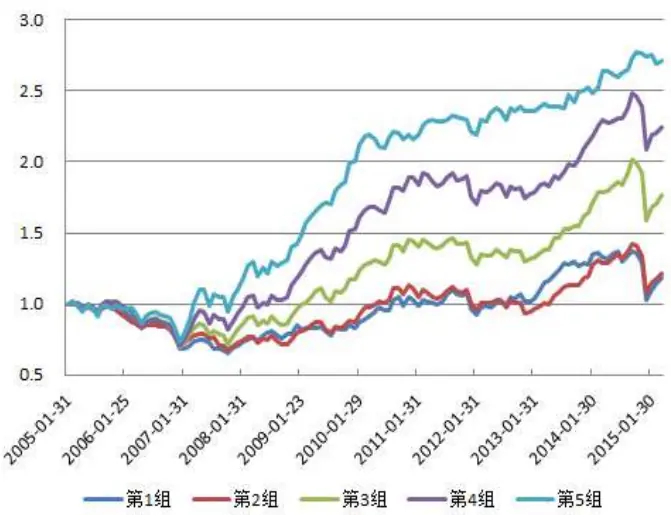

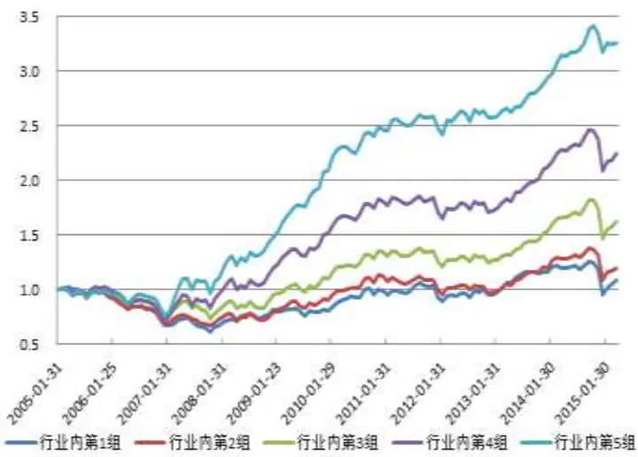

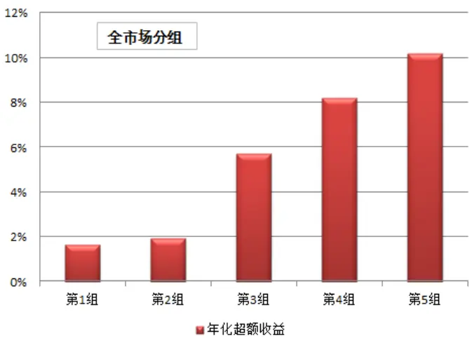

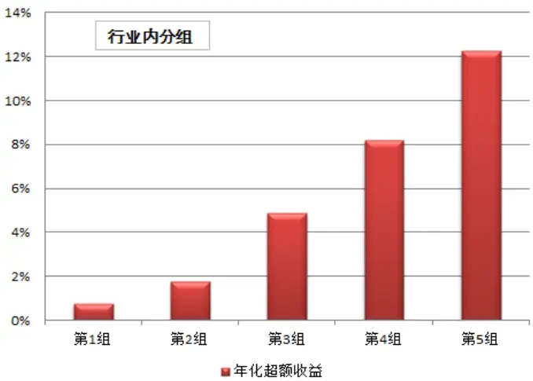

| 全市场分组 | 年化超额收益 | 月胜率 |
| --- | --- | --- |
| 第1组 | 1.64% | 54.10% |
| 第2组 | 1.94% | 56.56% |
| 第3组 | 5.70% | 58.20% |
| 第4组 | 8.19% | 60.66% |
| 第5组 | 10.21% | 59.02% |

资料来源：wind，东方证券研究所

| 行业内分组 | 年化超额收益 | 月胜率 |
| --- | --- | --- |
| 第1组 | 0.76% | 54.10% |
| 第2组 | 1.76% | 54.10% |
| 第3组 | 4.86% | 58.20% |
| 第4组 | 8.20% | 59.02% |
| 第5组 | 12.23% | 63.11% |

图：按 EP指标从小到大排列
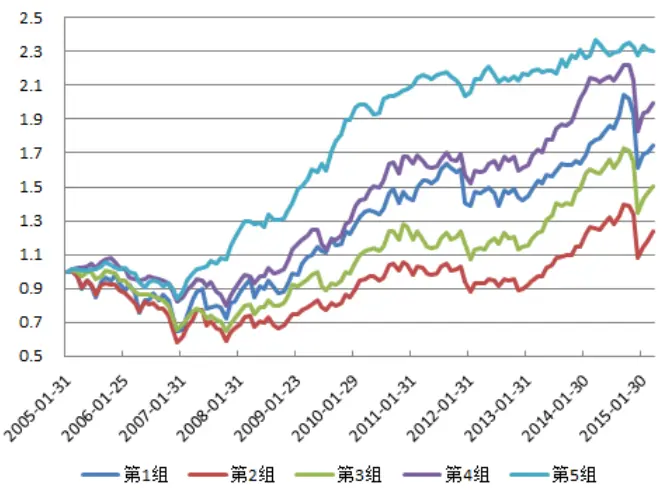

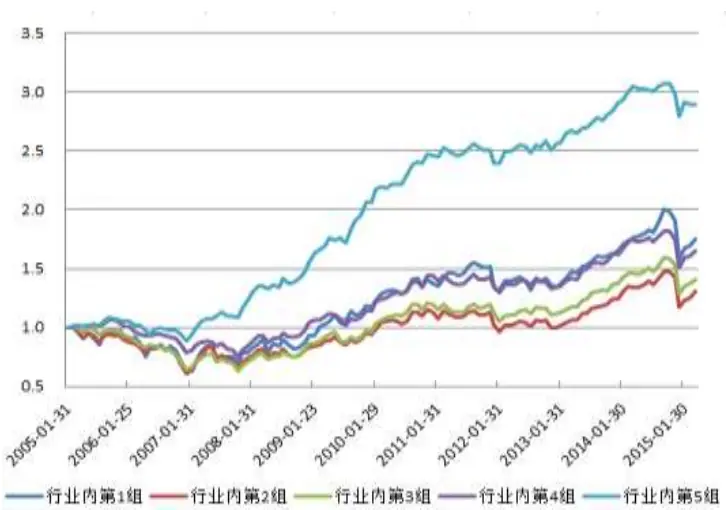

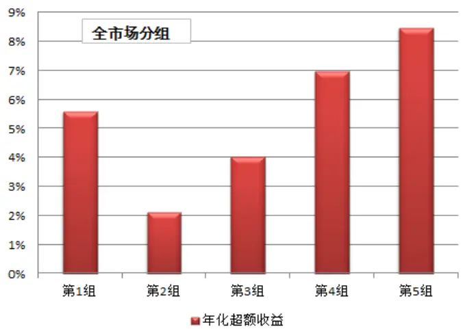

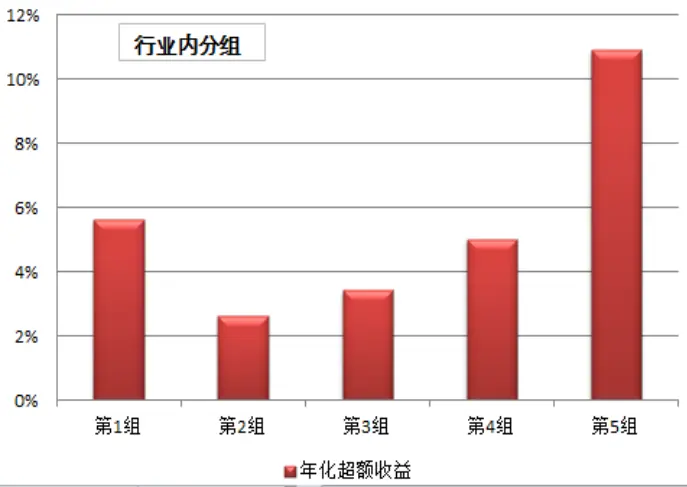

| 全市场分组 | 年化超额收益 | 月胜率 |
| --- | --- | --- |
| 第1组 | 5.59% | 58.20% |
| 第2组 | 2.12% | 55.74% |
| 第3组 | 4.04% | 54.92% |
| 第4组 | 6.98% | 59.84% |
| 第5组 | 8.48% | 58.20% |

资料来源：wind，东方证券研究所

| 行业内分组 | 年化超额收益 | 月胜率 |
| --- | --- | --- |
| 第1组 | 5.61% | 60.66% |
| 第2组 | 2.63% | 56.56% |
| 第3组 | 3.42% | 57.38% |
| 第4组 | 5.01% | 60.66% |
| 第5组 | 10.91% | 59.02% |

图：按 HSL22 指标从小到大排列
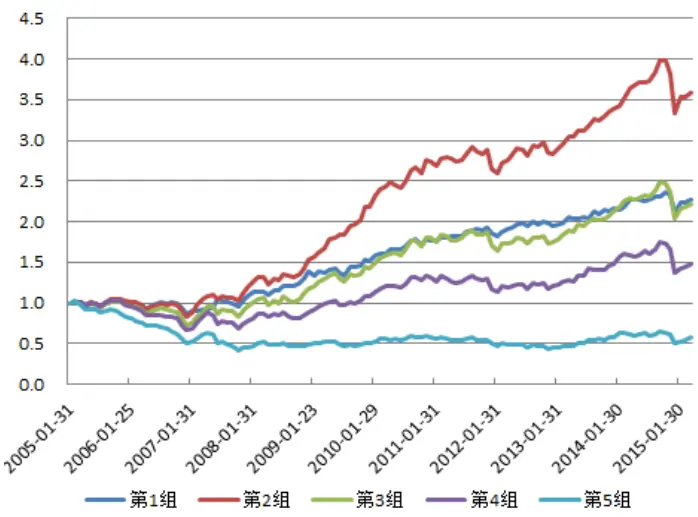

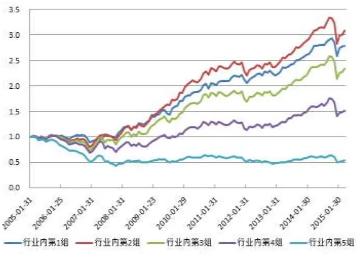

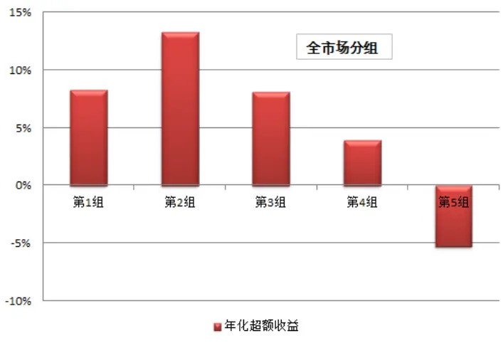

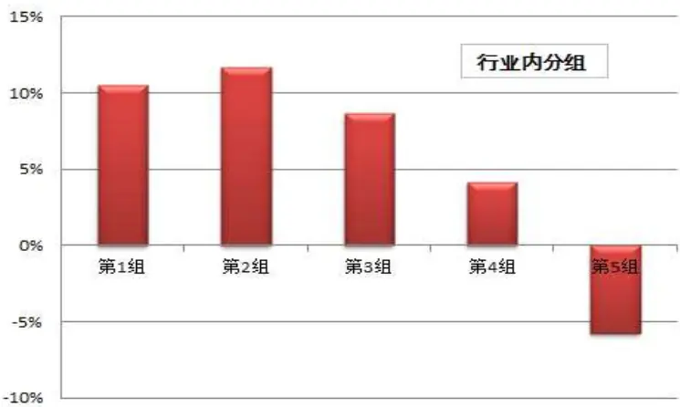
年化超额收益

| 全市场分组 | 年化超额收益 | 月胜率 |
| --- | --- | --- |
| 第1组 | 8.30% | 58.20% |
| 第2组 | 13.29% | 65.57% |
| 第3组 | 8.09% | 58.20% |
| 第4组 | 3.90% | 55.74% |
| 第5组 | -5.29% | 47.54% |

资料来源：wind，东方证券研究所

| 行业内分组 | 年化超额收益 | 月胜率 |
| --- | --- | --- |
| 第1组 | 10.52% | 63.93% |
| 第2组 | 11.63% | 60.66% |
| 第3组 | 8.62% | 62.30% |
| 第4组 | 4.15% | 54.92% |
| 第5组 | -5.79% | 45.90% |

图：按 stockpjcj5-60 指标从小到大排列
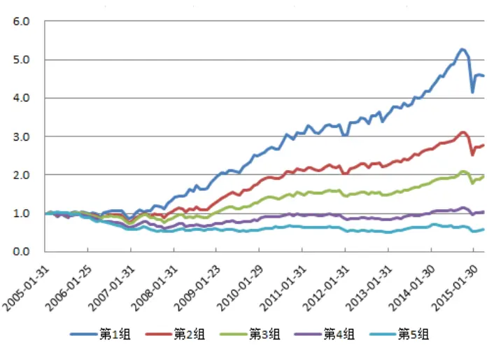

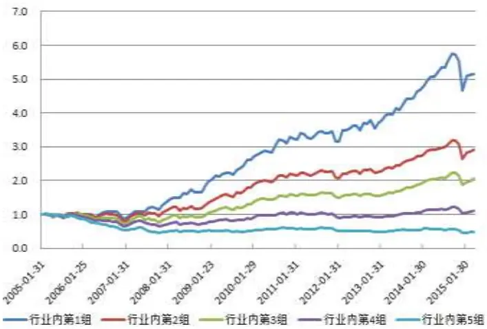

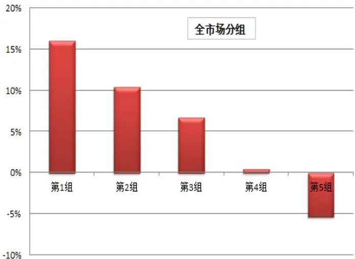

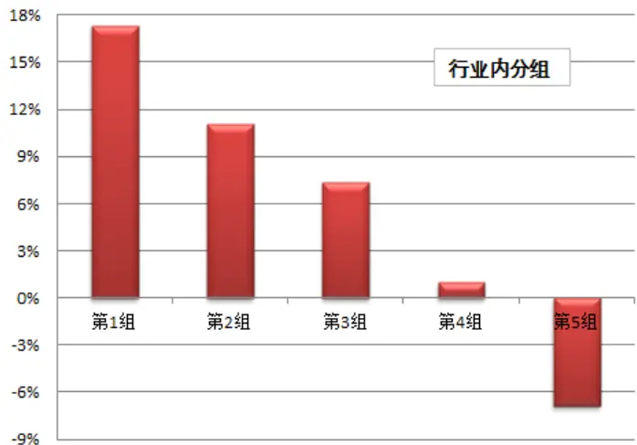

| 全市场分组 | 年化超额收益 | 月胜率 |
| --- | --- | --- |
| 第1组 | 16.04% | 63.11% |
| 第2组 | 10.45% | 59.02% |
| 第3组 | 6.75% | 59.02% |
| 第4组 | 0.43% | 53.28% |
| 第5组 | -5.35% | 45.90% |

资料来源：东方证券研究所

| 行业内分组 | 年化超额收益 | 月胜率 |
| --- | --- | --- |
| 第1组 | 17.34% | 62.30% |
| 第2组 | 11.02% | 60.66% |
| 第3组 | 7.36% | 63.11% |
| 第4组 | 0.99% | 53.28% |
| 第5组 | -6.87% | 45.08% |

图：按 mv指标从小到大排列
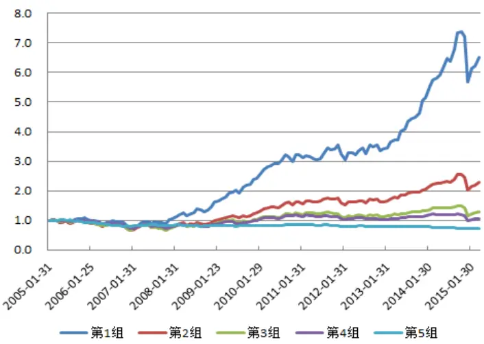

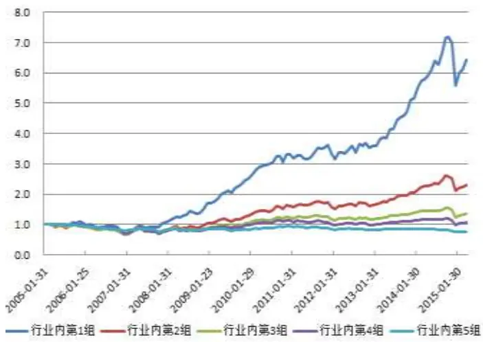

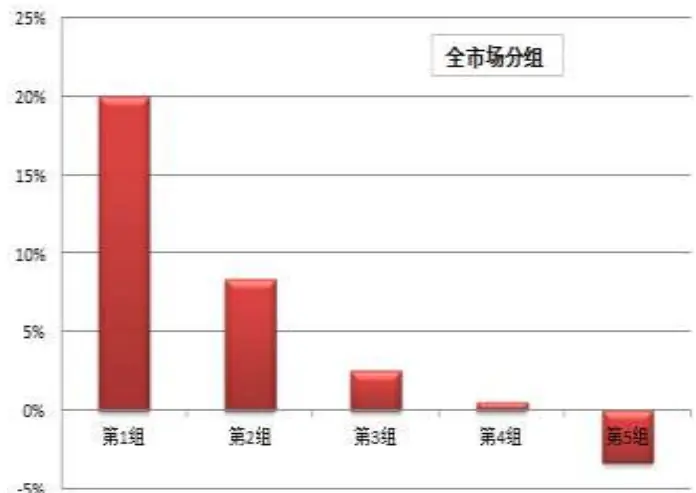

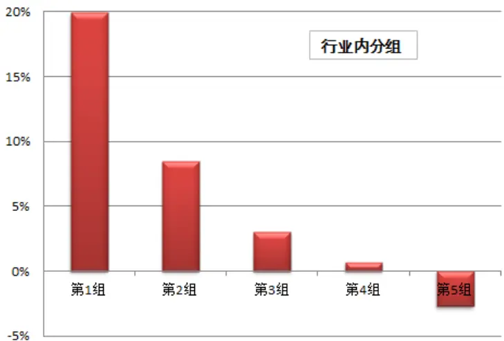

| 全市场分组 | 年化超额收益 | 月胜率 |
| --- | --- | --- |
| 第1组 | 20.03% | 67.21% |
| 第2组 | 8.39% | 61.48% |
| 第3组 | 2.56% | 53.28% |
| 第4组 | 0.57% | 51.64% |
| 第5组 | -3.31% | 41.80% |

资料来源：wind，东方证券研究所

| 行业内分组 | 年化超额收益 | 月胜率 |
| --- | --- | --- |
| 第1组 | 19.91% | 66.39% |
| 第2组 | 8.48% | 60.66% |
| 第3组 | 3.01% | 57.38% |
| 第4组 | 0.71% | 50.82% |
| 第5组 | -2.71% | 41.80% |

图：按 ProfitGrowRateTTM 指标从小到大排列
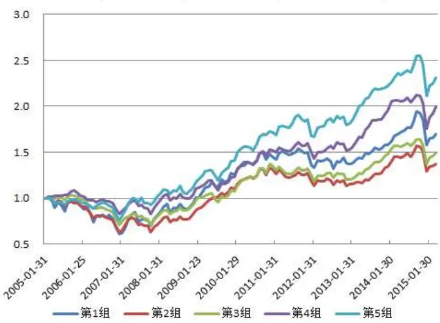

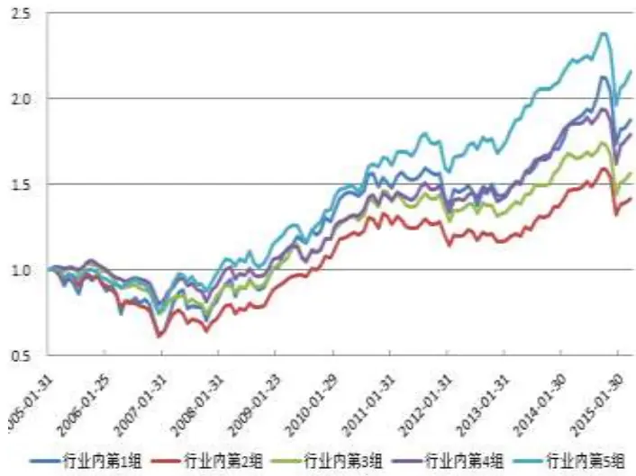

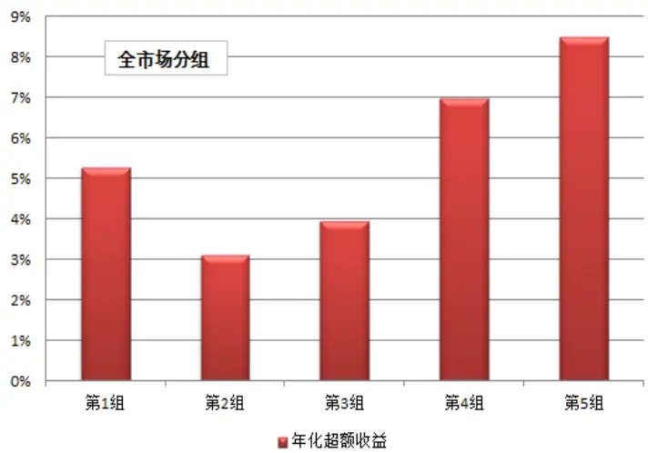

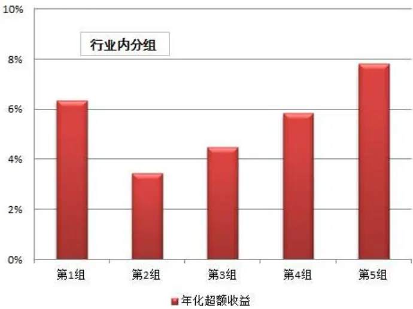

| 全市场分组 | 年化超额收益 | 月胜率 |
| --- | --- | --- |
| 第1组 | 5.28% | 58.20% |
| 第2组 | 3.12% | 57.38% |
| 第3组 | 3.95% | 54.10% |
| 第4组 | 6.98% | 62.30% |
| 第5组 | 8.49% | 61.48% |

资料来源：wind，东方证券研究所

| 行业内分组 | 年化超额收益 | 月胜率 |
| --- | --- | --- |
| 第1组 | 6.34% | 59.84% |
| 第2组 | 3.45% | 56.56% |
| 第3组 | 4.47% | 60.66% |
| 第4组 | 5.84% | 60.66% |
| 第5组 | 7.80% | 61.48% |

图：按 SP指标从小到大排列
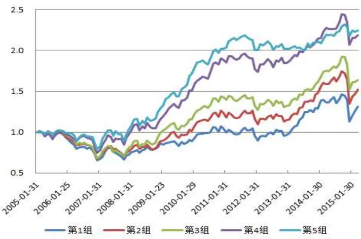

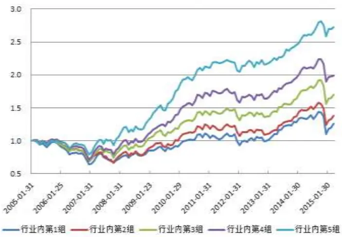

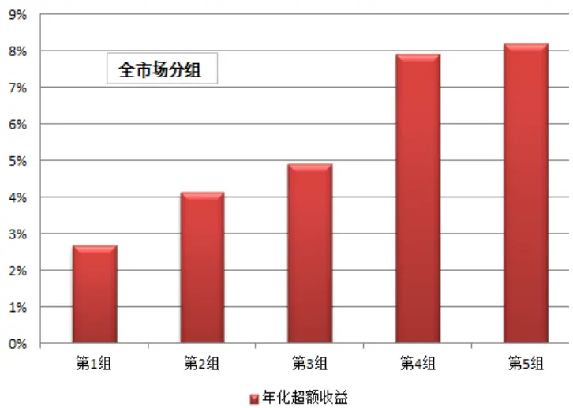

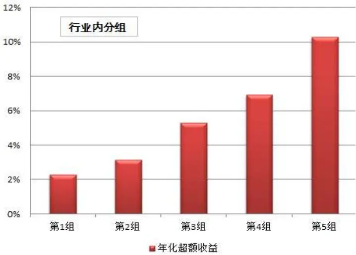

| 全市场分组 | 年化超额收益 | 月胜率 |
| --- | --- | --- |
| 第1组 | 2.68% | 55.74% |
| 第2组 | 4.15% | 57.38% |
| 第3组 | 4.93% | 55.74% |
| 第4组 | 7.92% | 56.56% |
| 第5组 | 8.21% | 58.20% |

资料来源：wind，东方证券研究所

| 行业内分组 | 年化超额收益 | 月胜率 |
| --- | --- | --- |
| 第1组 | 2.29% | 56.56% |
| 第2组 | 3.16% | 57.38% |
| 第3组 | 5.29% | 58.20% |
| 第4组 | 6.93% | 59.02% |
| 第5组 | 10.29% | 61.48% |

图：按 stockzf22指标从小到大排列
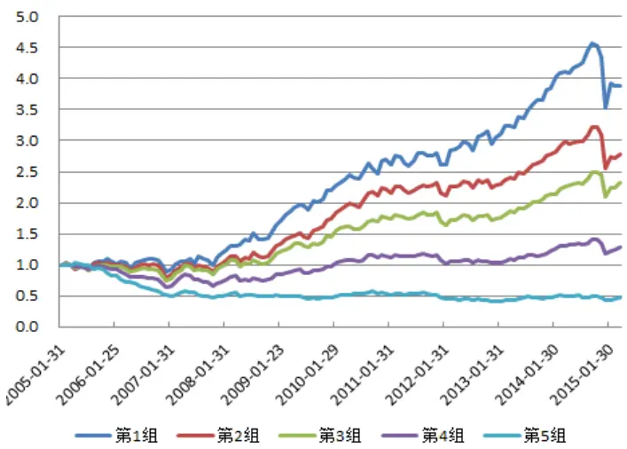

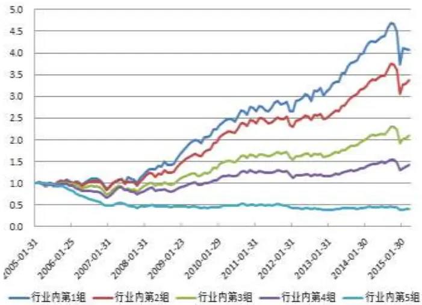

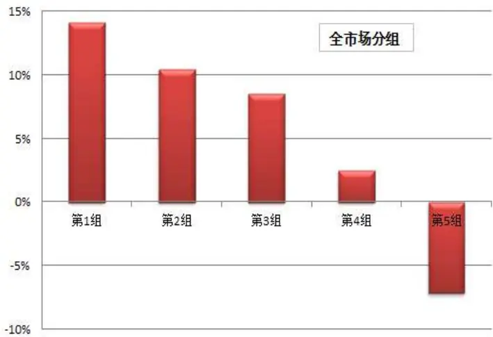

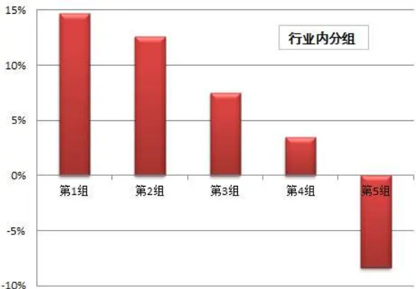

| 全市场分组 | 年化超额收益 | 月胜率 |
| --- | --- | --- |
| 第1组 | 14.14% | 63.11% |
| 第2组 | 10.48% | 61.48% |
| 第3组 | 8.54% | 59.84% |
| 第4组 | 2.50% | 54.92% |
| 第5组 | -7.14% | 45.08% |

资料来源：wind，东方证券研究所

| 行业内分组 | 年化超额收益 | 月胜率 |
| --- | --- | --- |
| 第1组 | 14.70% | 63.93% |
| 第2组 | 12.62% | 63.93% |
| 第3组 | 7.50% | 59.84% |
| 第4组 | 3.47% | 55.74% |
| 第5组 | -8.40% | 39.34% |

图：按 profitsalesratio 指标从小到大排列
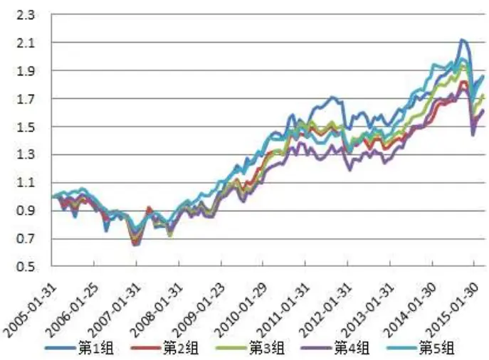

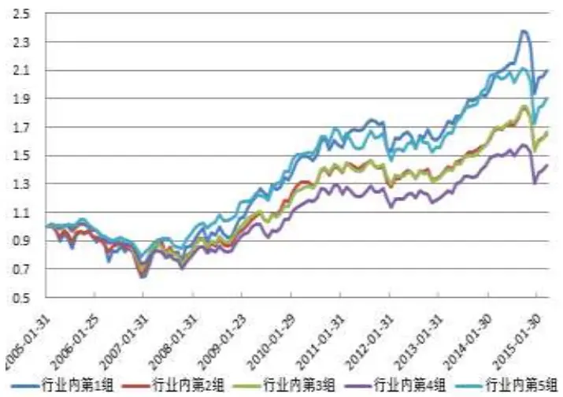

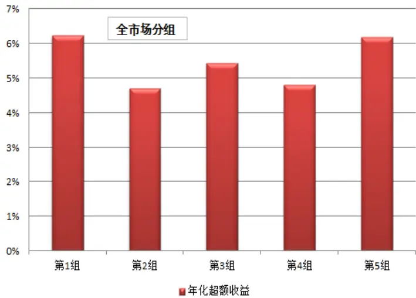

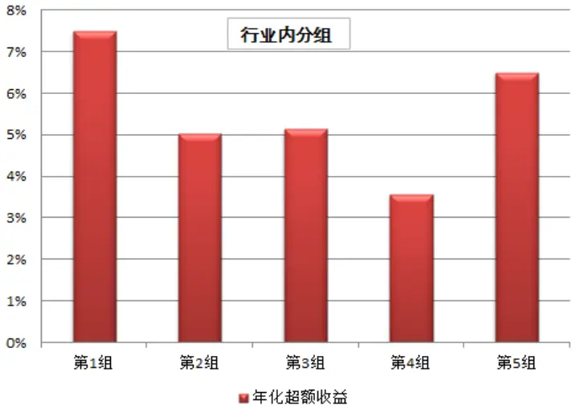

| 全市场分组 | 年化超额收益 | 月胜率 |
| --- | --- | --- |
| 第1组 | 6.23% | 61.48% |
| 第2组 | 4.72% | 56.56% |
| 第3组 | 5.45% | 59.84% |
| 第4组 | 4.82% | 56.56% |
| 第5组 | 6.20% | 59.84% |

资料来源：wind，东方证券研究所

| 行业内分组 | 年化超额收益 | 月胜率 |
| --- | --- | --- |
| 第1组 | 7.50% | 61.48% |
| 第2组 | 5.01% | 59.02% |
| 第3组 | 5.12% | 57.38% |
| 第4组 | 3.55% | 57.38% |
| 第5组 | 6.49% | 60.66% |

图：按 salesgrowrate 指标从小到大排列
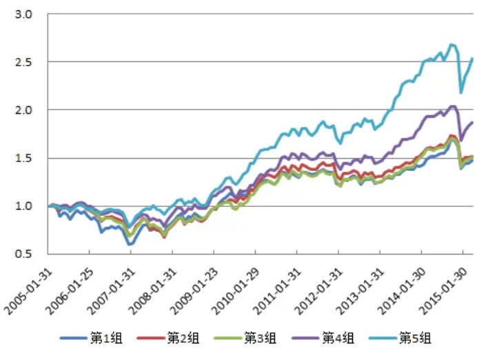

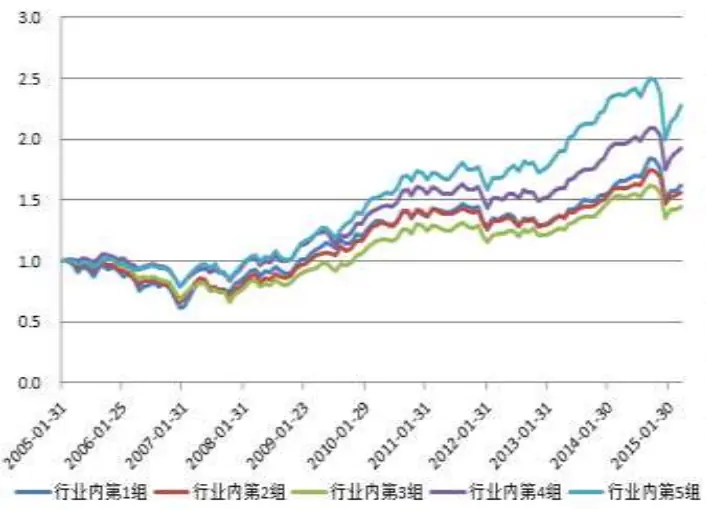

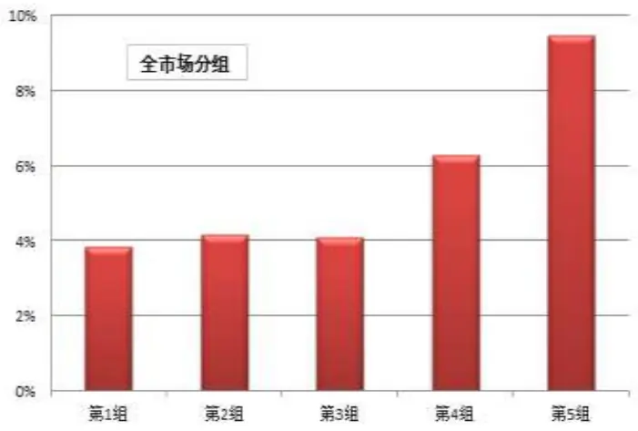

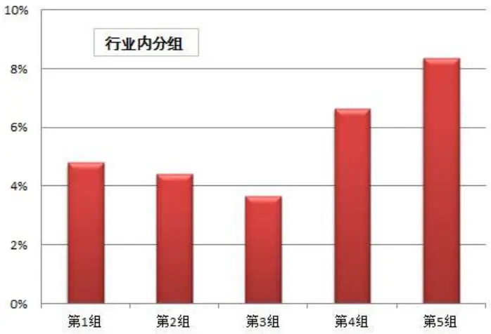

| 全市场分组 | 年化超额收益 | 月胜率 |
| --- | --- | --- |
| 第1组 | 3.86% | 57.38% |
| 第2组 | 4.17% | 55.74% |
| 第3组 | 4.11% | 54.92% |
| 第4组 | 6.30% | 57.38% |
| 第5组 | 9.48% | 63.93% |

资料来源：东方证券研究所

| 行业内分组 | 年化超额收益 | 月胜率 |
| --- | --- | --- |
| 第1组 | 4.80% | 59.02% |
| 第2组 | 4.43% | 55.74% |
| 第3组 | 3.66% | 59.02% |
| 第4组 | 6.62% | 60.66% |
| 第5组 | 8.37% | 63.11% |

图：按 liquidratio 指标从小到大排列
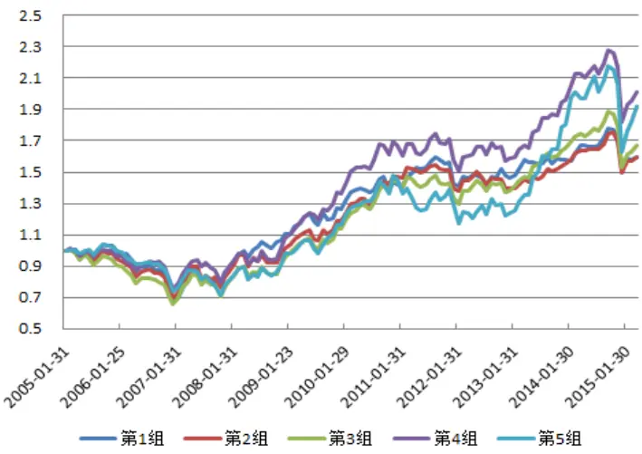

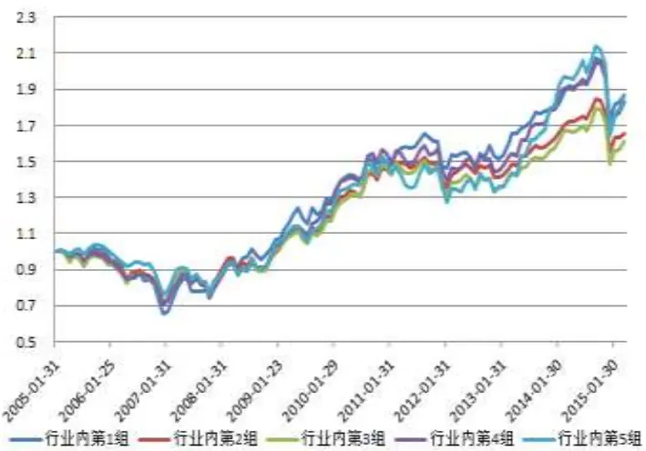

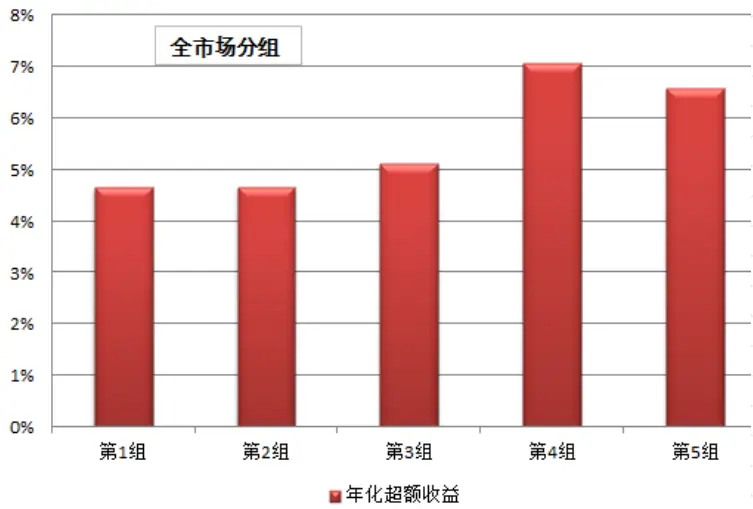

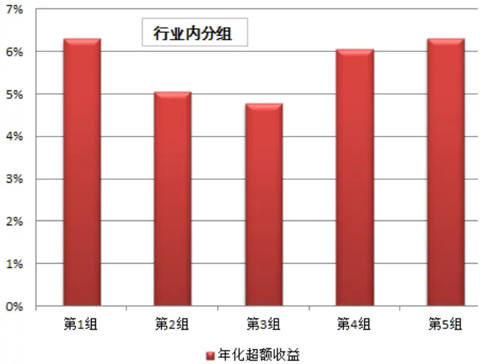

| 全市场分组 | 年化超额收益 | 月胜率 |
| --- | --- | --- |
| 第1组 | 4.65% | 53.28% |
| 第2组 | 4.67% | 59.84% |
| 第3组 | 5.14% | 58.20% |
| 第4组 | 7.07% | 59.02% |
| 第5组 | 6.58% | 59.02% |

资料来源：wind，东方证券研究所

| 行业内分组 | 年化超额收益 | 月胜率 |
| --- | --- | --- |
| 第1组 | 6.30% | 61.48% |
| 第2组 | 5.05% | 59.02% |
| 第3组 | 4.78% | 59.02% |
| 第4组 | 6.06% | 59.02% |
| 第5组 | 6.31% | 59.84% |

图：按 debt2asset指标从小到大排列
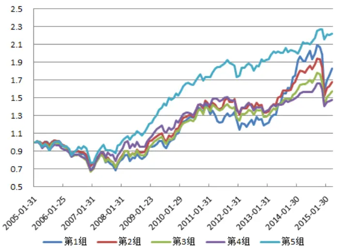

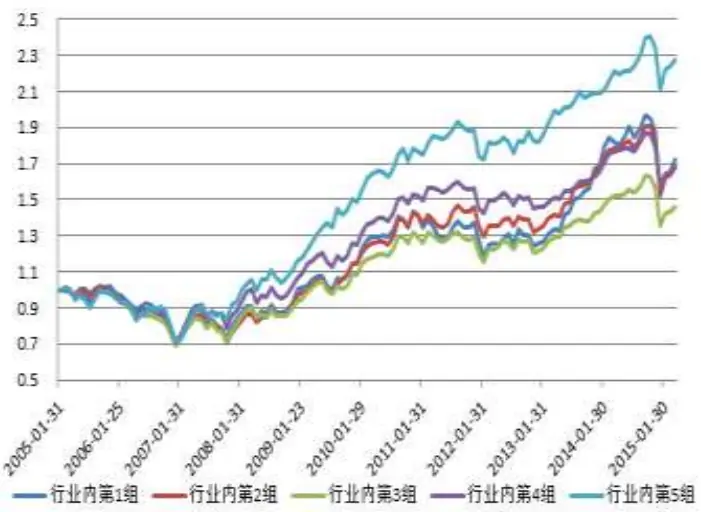

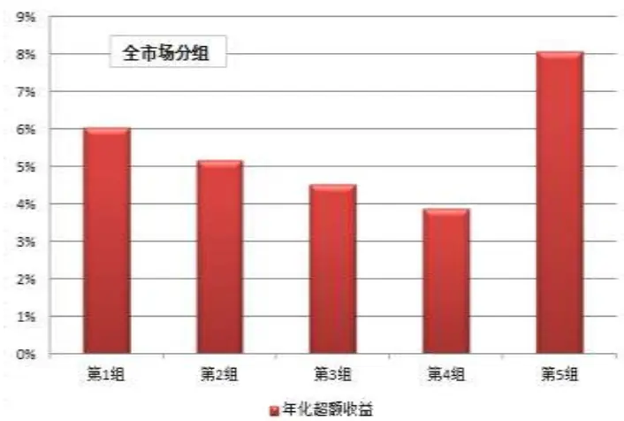

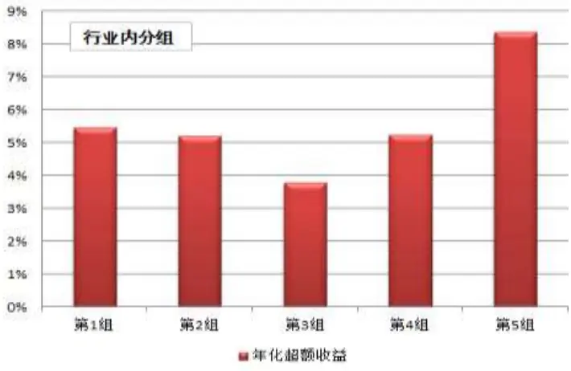

| 全市场分组 | 年化超额收益 | 月胜率 |
| --- | --- | --- |
| 第1组 | 6.07% | 56.56% |
| 第2组 | 5.18% | 57.38% |
| 第3组 | 4.54% | 57.38% |
| 第4组 | 3.89% | 56.56% |
| 第5组 | 8.09% | 59.02% |

资料来源：wind，东方证券研究所

| 行业内分组 | 年化超额收益 | 月胜率 |
| --- | --- | --- |
| 第1组 | 5.47% | 59.84% |
| 第2组 | 5.18% | 60.66% |
| 第3组 | 3.77% | 58.20% |
| 第4组 | 5.23% | 61.48% |
| 第5组 | 8.35% | 61.48% |

图：按 opsalesratio 指标从小到大排列
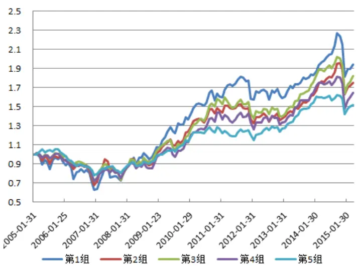

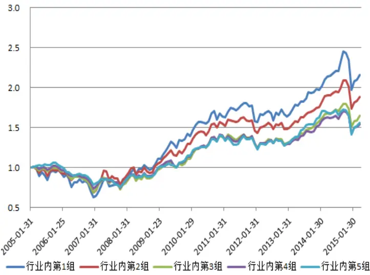

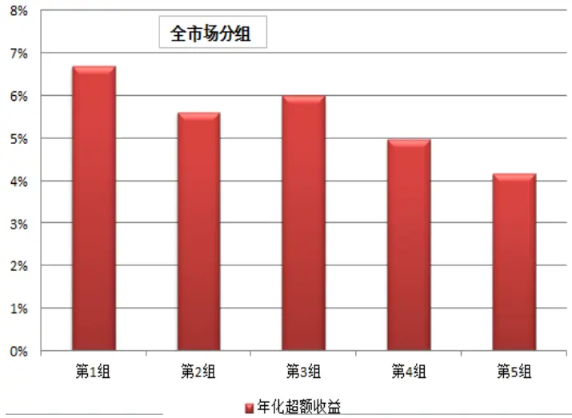

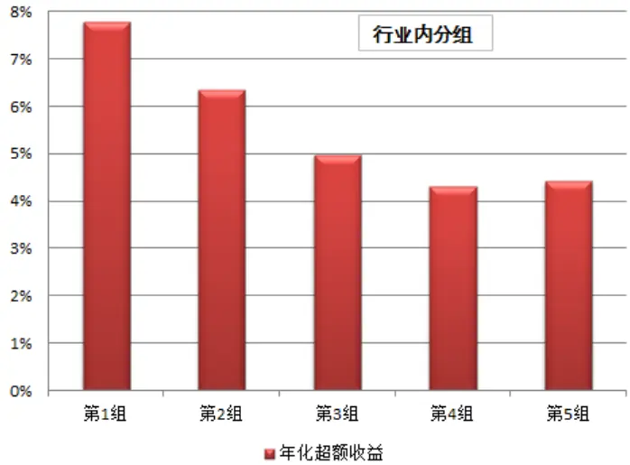

| 全市场分组 | 年化超额收益 | 月胜率 |
| --- | --- | --- |
| 第1组 | 6.71% | 59.84% |
| 第2组 | 5.62% | 57.38% |
| 第3组 | 6.01% | 57.38% |
| 第4组 | 4.97% | 56.56% |
| 第5组 | 4.17% | 60.66% |

资料来源：wind，东方证券研究所

| 行业内分组 | 年化超额收益 | 月胜率 |
| --- | --- | --- |
| 第1组 | 7.78% | 60.66% |
| 第2组 | 6.35% | 59.84% |
| 第3组 | 4.97% | 57.38% |
| 第4组 | 4.32% | 58.20% |
| 第5组 | 4.42% | 56.56% |

图：按 CFP指标从小到大排列
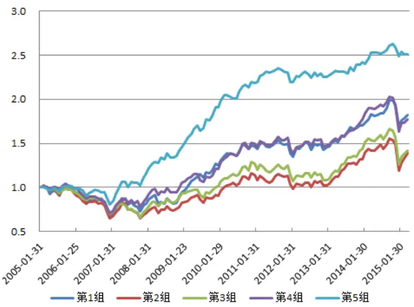

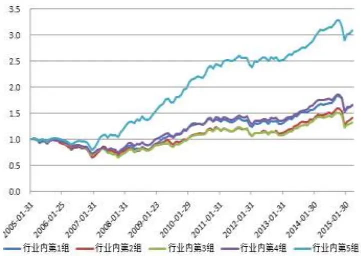

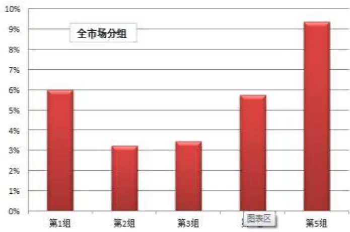

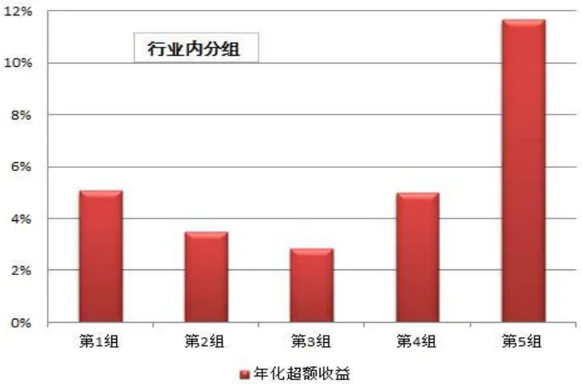

| 全市场分组 | 年化超额收益 | 月胜率 |
| --- | --- | --- |
| 第1组 | 6.00% | 59.84% |
| 第2组 | 3.26% | 56.56% |
| 第3组 | 3.46% | 58.20% |
| 第4组 | 5.74% | 58.20% |
| 第5组 | 9.40% | 58.20% |

资料来源：wind，东方证券研究所

| 行业内分组 | 年化超额收益 | 月胜率 |
| --- | --- | --- |
| 第1组 | 5.08% | 58.20% |
| 第2组 | 3.48% | 58.20% |
| 第3组 | 2.84% | 57.38% |
| 第4组 | 4.98% | 58.20% |
| 第5组 | 11.65% | 60.66% |

图：按 daysofturnover 指标从小到大排列
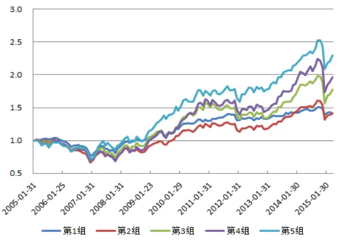

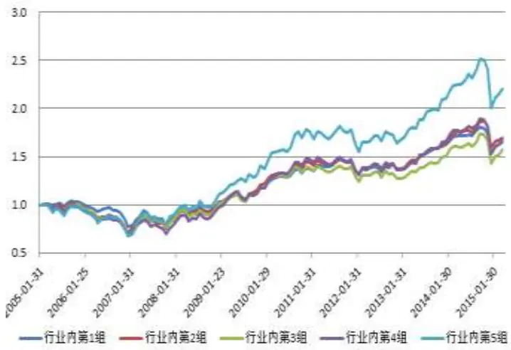

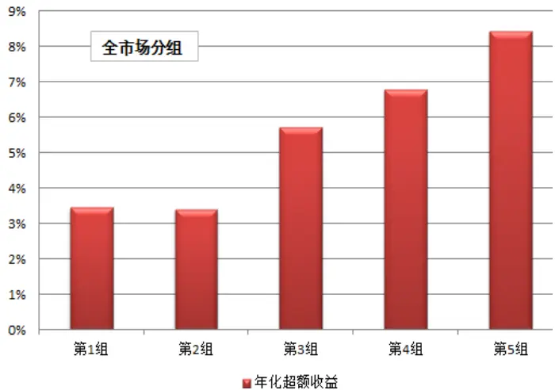

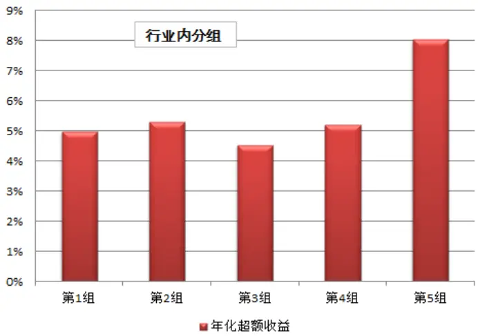

| 全市场分组 | 年化超额收益 | 月胜率 |
| --- | --- | --- |
| 第1组 | 3.46% | 55.74% |
| 第2组 | 3.42% | 57.38% |
| 第3组 | 5.74% | 57.38% |
| 第4组 | 6.80% | 57.38% |
| 第5组 | 8.43% | 61.48% |

资料来源：wind，东方证券研究所

| 行业内分组 | 年化超额收益 | 月胜率 |
| --- | --- | --- |
| 第1组 | 4.98% | 60.66% |
| 第2组 | 5.31% | 59.84% |
| 第3组 | 4.53% | 56.56% |
| 第4组 | 5.20% | 57.38% |
| 第5组 | 8.04% | 60.66% |

图：按 Totalmarketvalue 指标从小到大排列
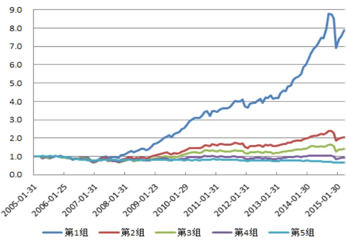

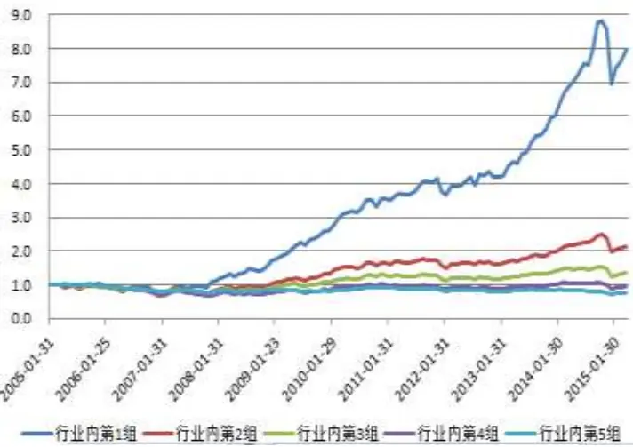

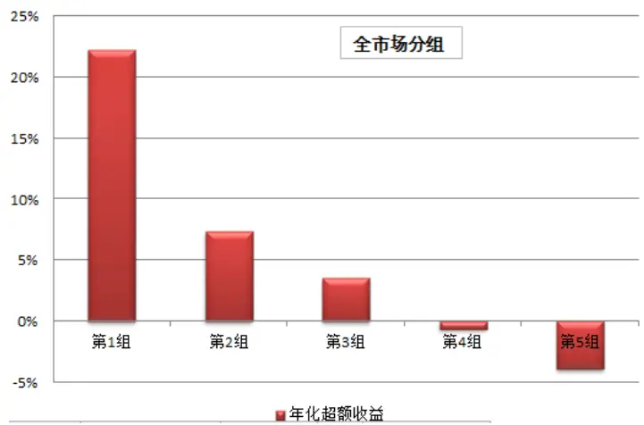

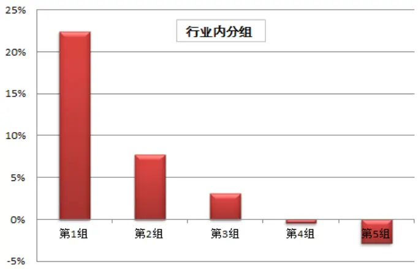

| 全市场分组 | 年化超额收益 | 月胜率 |
| --- | --- | --- |
| 第1组 | 22.30% | 69.67% |
| 第2组 | 7.34% | 59.84% |
| 第3组 | 3.56% | 54.92% |
| 第4组 | -0.64% | 50.82% |
| 第5组 | -3.89% | 43.44% |

资料来源：wind，东方证券研究所

| 行业内分组 | 年化超额收益 | 月胜率 |
| --- | --- | --- |
| 第1组 | 22.43% | 70.49% |
| 第2组 | 7.72% | 59.84% |
| 第3组 | 3.07% | 55.74% |
| 第4组 | -0.46% | 52.46% |
| 第5组 | -2.85% | 44.26% |

图：按 ProfitGrowRate1 指标从小到大排列
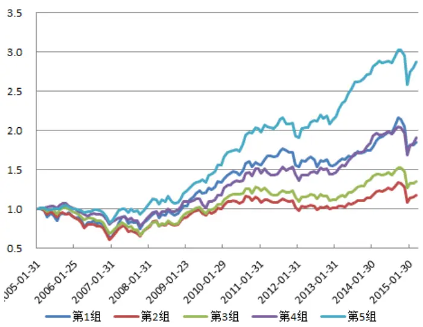

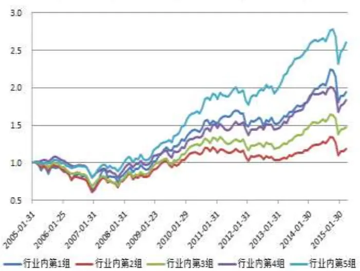

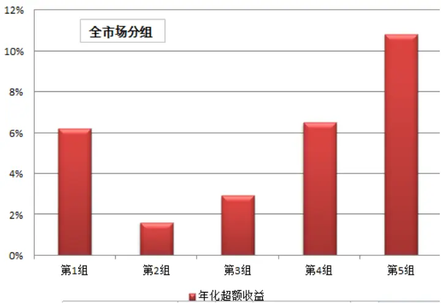

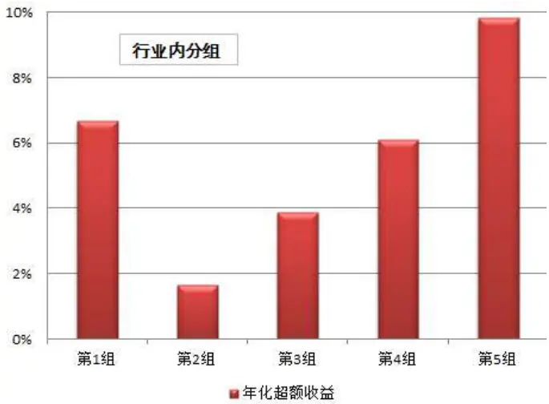

| 全市场分组 | 年化超额收益 | 月胜率 |
| --- | --- | --- |
| 第1组 | 6.20% | 59.02% |
| 第2组 | 1.63% | 54.10% |
| 第3组 | 2.94% | 57.38% |
| 第4组 | 6.51% | 63.93% |
| 第5组 | 10.85% | 68.03% |

资料来源：wind，东方证券研究所

| 行业内分组 | 年化超额收益 | 月胜率 |
| --- | --- | --- |
| 第1组 | 6.68% | 60.66% |
| 第2组 | 1.64% | 56.56% |
| 第3组 | 3.88% | 56.56% |
| 第4组 | 6.10% | 61.48% |
| 第5组 | 9.82% | 67.21% |

图：按 ROA1指标从小到大排列
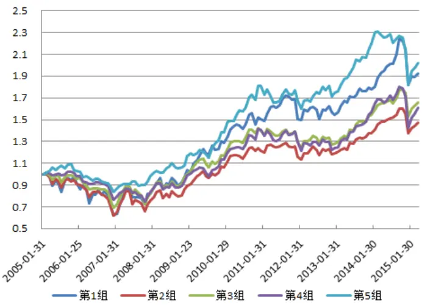

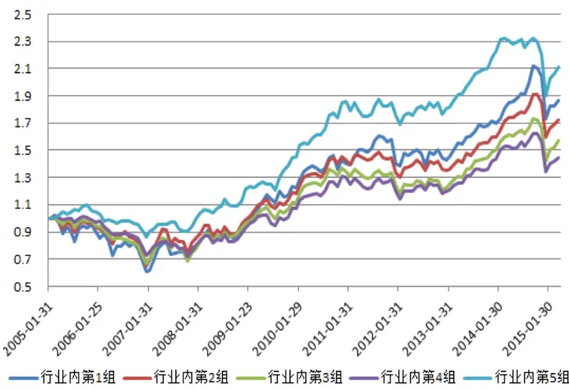

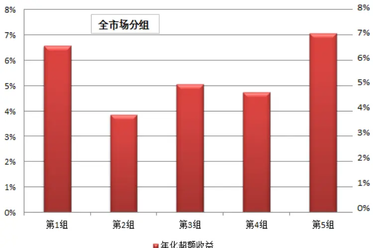

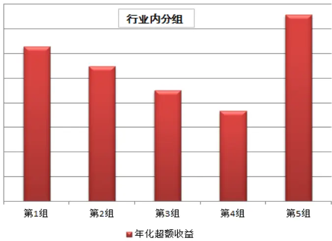

| 全市场分组 | 年化超额收益 | 月胜率 |
| --- | --- | --- |
| 第1组 | 6.58% | 58.20% |
| 第2组 | 3.87% | 58.20% |
| 第3组 | 5.07% | 58.20% |
| 第4组 | 4.74% | 58.20% |
| 第5组 | 7.08% | 61.48% |

资料来源：wind，东方证券研究所

| 行业内分组 | 年化超额收益 | 月胜率 |
| --- | --- | --- |
| 第1组 | 6.28% | 60.66% |
| 第2组 | 5.47% | 59.02% |
| 第3组 | 4.50% | 55.74% |
| 第4组 | 3.67% | 58.20% |
| 第5组 | 7.58% | 62.30% |

图：按 salesgrowrate1 指标从小到大排列
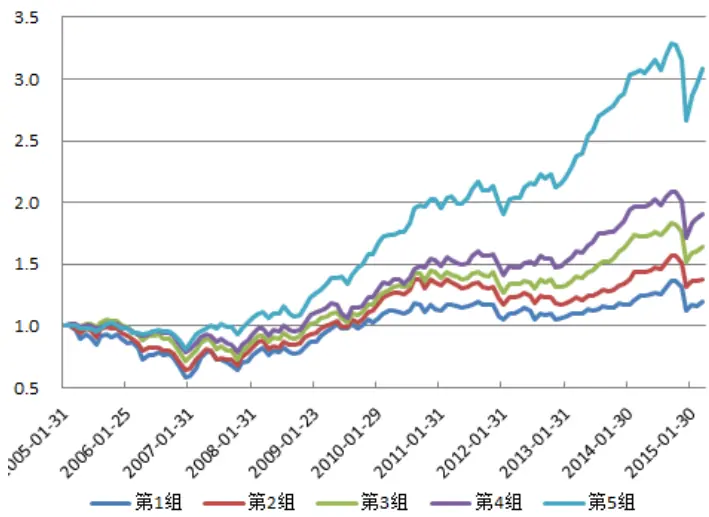

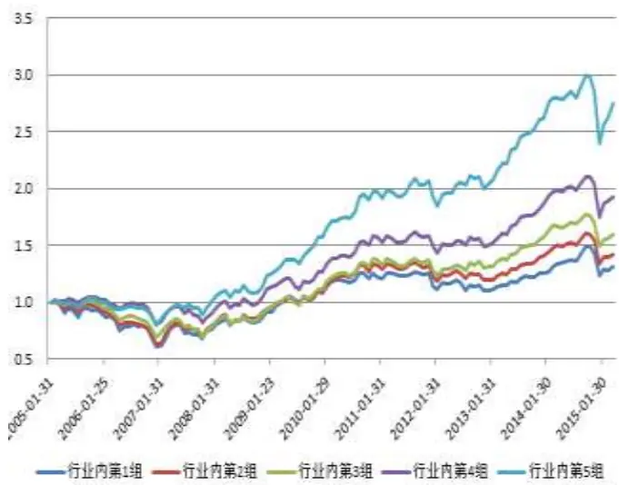

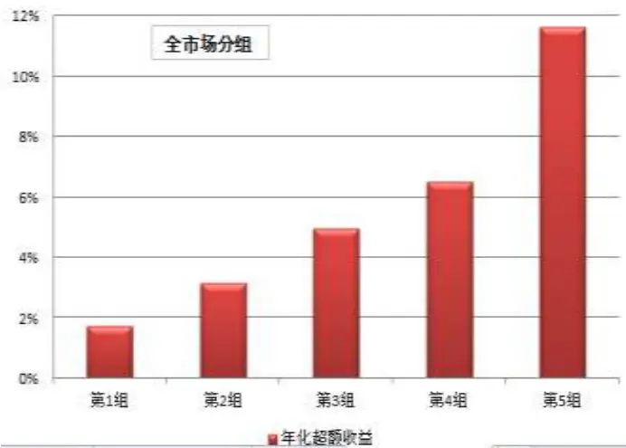

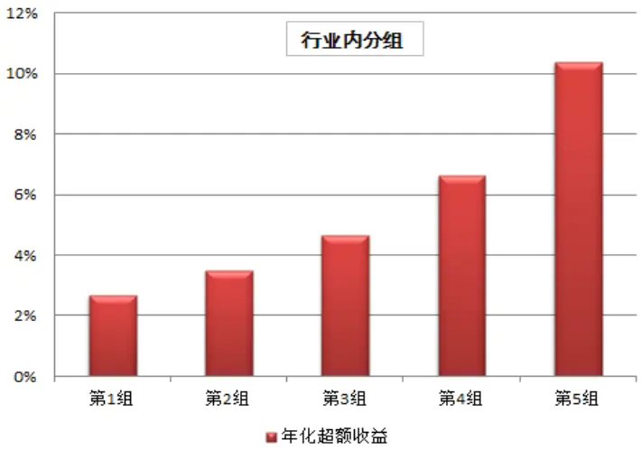

| 全市场分组 | 年化超额收益 | 月胜率 |
| --- | --- | --- |
| 第1组 | 1.74% | 56.56% |
| 第2组 | 3.17% | 56.56% |
| 第3组 | 4.99% | 58.20% |
| 第4组 | 6.51% | 55.74% |
| 第5组 | 11.63% | 68.03% |

资料来源：wind，东方证券研究所

| 行业内分组 | 年化超额收益 | 月胜率 |
| --- | --- | --- |
| 第1组 | 2.67% | 57.38% |
| 第2组 | 3.49% | 54.92% |
| 第3组 | 4.65% | 59.02% |
| 第4组 | 6.61% | 61.48% |
| 第5组 | 10.39% | 62.30% |

## 风险提示

- 报告中选股指标的收益基于历史数据进行统计，未来市场可能发生较大的风格转换。

- 量化选股的胜率不为百分之百，需进行严格的风险控制。

## 分析师申明

每位负责撰写本研究报告全部或部分内容的研究分析师在此作以下声明：

分析师在本报告中对所提及的证券或发行人发表的任何建议和观点均准确地反映了其个人对该证券或发行人的看法和判断；分析师薪酬的任何组成部分无论是在过去、现在及将来，均与其在本研究报告中所表述的具体建议或观点无任何直接或间接的关系。

## 投资评级和相关定义

报告发布日后的 12个月内的公司的涨跌幅相对同期的上证指数/深证成指的涨跌幅为基准；

## 公司投资评级的量化标准

买入：相对强于市场基准指数收益率15%以上；

增持：相对强于市场基准指数收益率5%～15%；

中性：相对于市场基准指数收益率在-5%～+5%之间波动；

减持：相对弱于市场基准指数收益率在-5%以下。

未评级——由于在报告发出之时该股票不在本公司研究覆盖范围内，分析师基于当时对该股票的研究状况，未给予投资评级相关信息。

暂停评级——根据监管制度及本公司相关规定，研究报告发布之时该投资对象可能与本公司存在潜在的利益冲突情形；亦或是研究报告发布当时该股票的价值和价格分析存在重大不确定性，缺乏足够的研究依据支持分析师给出明确投资评级；分析师在上述情况下暂停对该股票给予投资评级等信息，投资者需要注意在此报告发布之前曾给予该股票的投资评级、盈利预测及目标价格等信息不再有效。

## 行业投资评级的量化标准：

看好：相对强于市场基准指数收益率5%以上；

中性：相对于市场基准指数收益率在-5%～+5%之间波动；

看淡：相对于市场基准指数收益率在-5%以下。

未评级：由于在报告发出之时该行业不在本公司研究覆盖范围内，分析师基于当时对该行业的研究状况，未给予投资评级等相关信息。

暂停评级：由于研究报告发布当时该行业的投资价值分析存在重大不确定性，缺乏足够的研究依据支持分析师给出明确行业投资评级；分析师在上述情况下暂停对该行业给予投资评级信息，投资者需要注意在此报告发布之前曾给予该行业的投资评级信息不再有效。

## 免责声明

本证券研究报告（以下简称“本报告”）由东方证券股份有限公司（以下简称“本公司”）制作及发布。

本报告仅供本公司的客户使用。本公司不会因接收人收到本报告而视其为本公司的当然客户。本报告的全体接收人应当采取必要措施防止本报告被转发给他人。

本报告是基于本公司认为可靠的且目前已公开的信息撰写，本公司力求但不保证该信息的准确性和完整性，客户也不应该认为该信息是准确和完整的。同时，本公司不保证文中观点或陈述不会发生任何变更，在不同时期，本公司可发出与本报告所载资料、意见及推测不一致的证券研究报告。本公司会适时更新我们的研究，但可能会因某些规定而无法做到。除了一些定期出版的证券研究报告之外，绝大多数证券研究报告是在分析师认为适当的时候不定期地发布。

在任何情况下，本报告中的信息或所表述的意见并不构成对任何人的投资建议，也没有考虑到个别客户特殊的投资目标、财务状况或需求。客户应考虑本报告中的任何意见或建议是否符合其特定状况，若有必要应寻求专家意见。本报告所载的资料、工具、意见及推测只提供给客户作参考之用，并非作为或被视为出售或购买证券或其他投资标的的邀请或向人作出邀请。

本报告中提及的投资价格和价值以及这些投资带来的收入可能会波动。过去的表现并不代表未来的表现，未来的回报也无法保证，投资者可能会损失本金。外汇汇率波动有可能对某些投资的价值或价格或来自这一投资的收入产生不良影响。那些涉及期货、期权及其它衍生工具的交易，因其包括重大的市场风险，因此并不适合所有投资者。

在任何情况下，本公司不对任何人因使用本报告中的任何内容所引致的任何损失负任何责任，投资者自主作出投资决策并自行承担投资风险，任何形式的分享证券投资收益或者分担证券投资损失的书面或口头承诺均为无效。

本报告主要以电子版形式分发，间或也会辅以印刷品形式分发，所有报告版权均归本公司所有。未经本公司事先书面协议授权，任何机构或个人不得以任何形式复制、转发或公开传播本报告的全部或部分内容。不得将报告内容作为诉讼、仲裁、传媒所引用之证明或依据，不得用于营利或用于未经允许的其它用途。

经本公司事先书面协议授权刊载或转发的，被授权机构承担相关刊载或者转发责任。不得对本报告进行任何有悖原意的引用、删节和修改。

提示客户及公众投资者慎重使用未经授权刊载或者转发的本公司证券研究报告，慎重使用公众媒体刊载的证券研究报告。

## 东方证券研究所

地址：上海市中山南路 318 号东方国际金融广场 26 楼

联系人： 王骏飞

电话：021-63325888*1131

传真：021-63326786

网址： www.dfzq.com.cn

Email： wangjunfei@orientsec.com.cn