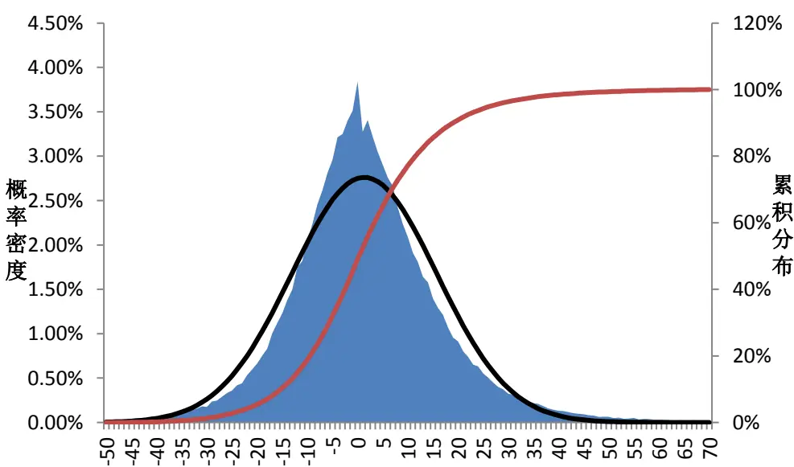
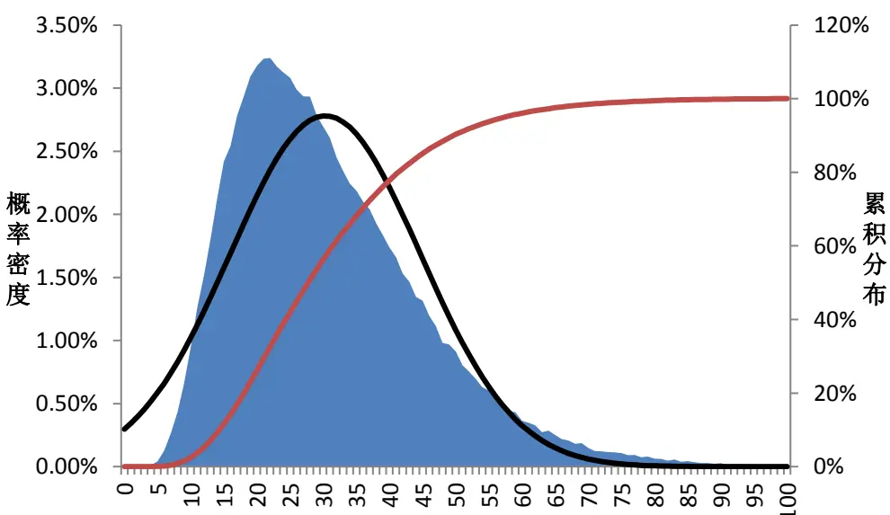
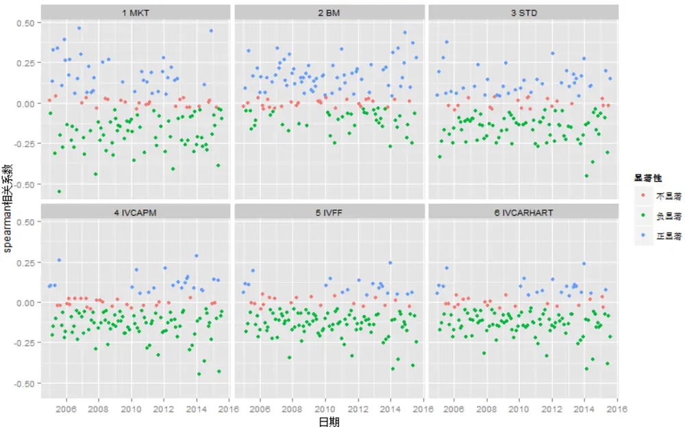
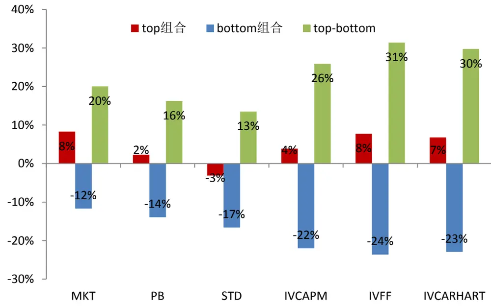
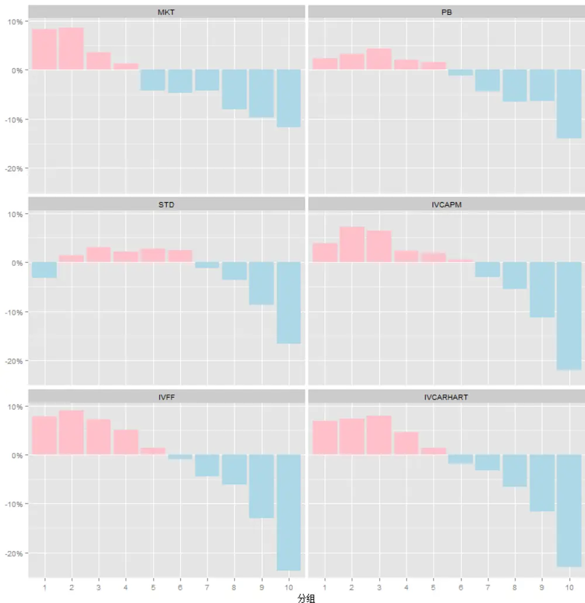
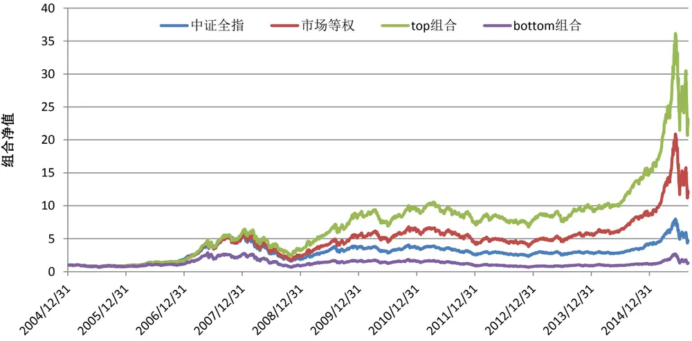
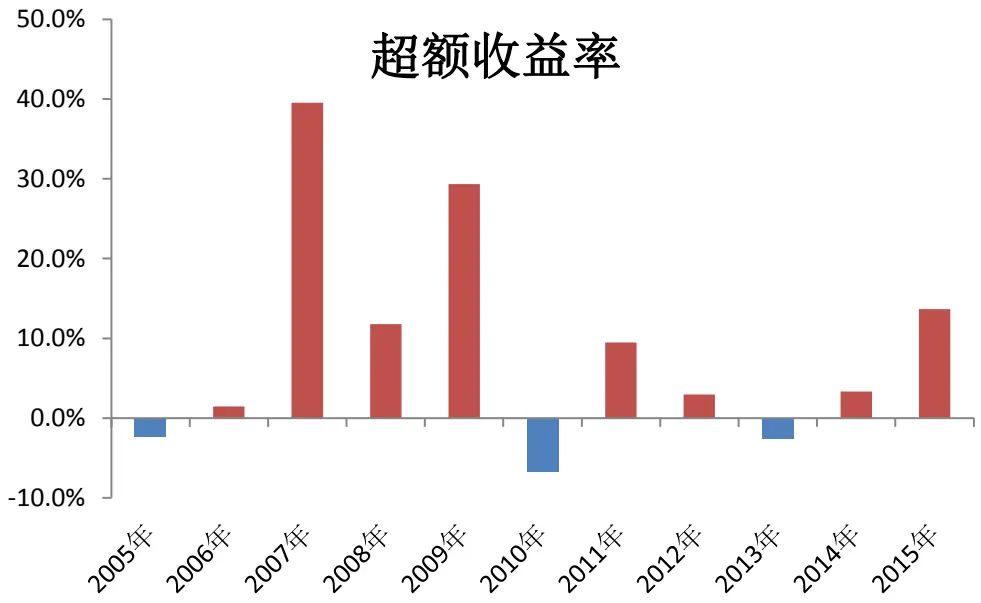
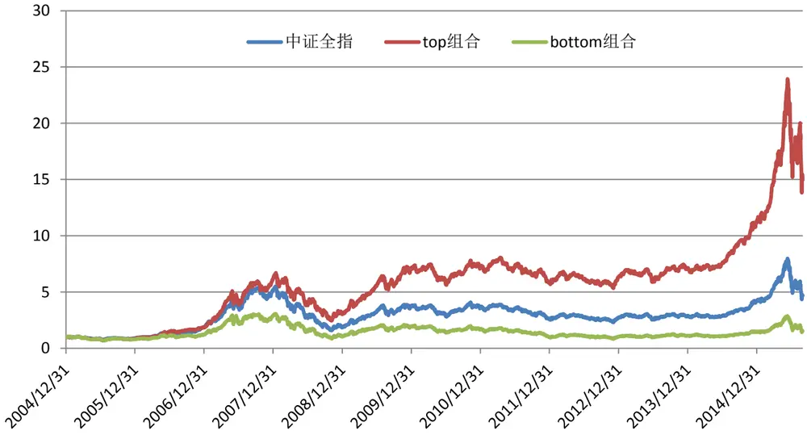
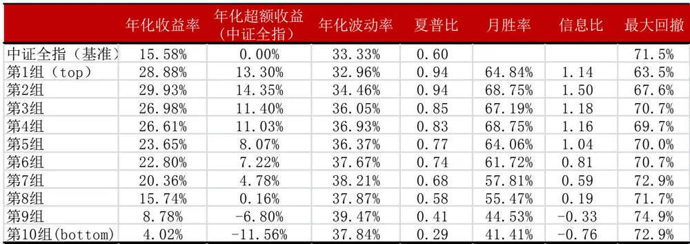
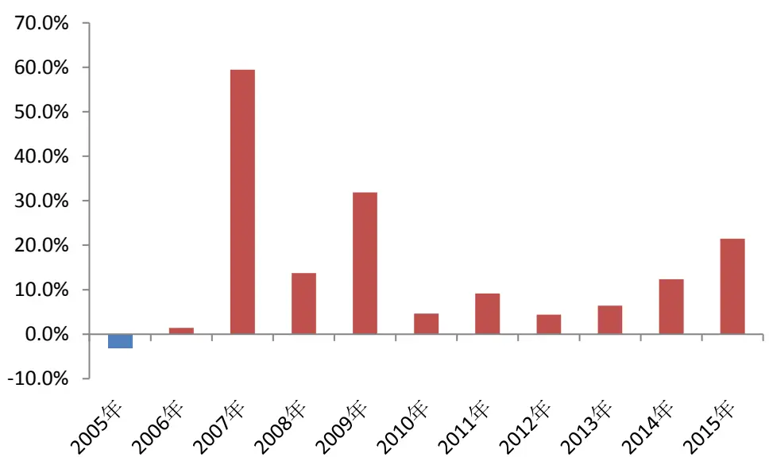

有关分析师的申明，见本报告最后部分。其他重要信息披露见分析师申明之后部分，或请与您的投资代表联系。并请阅读本证券研究报告最后一页的免责申明。

## 研究结论

海外和国内股票市场都发行过很多低波动指数，该类指数通常用一段时间收益率的标准差来衡量股价的波动，长期来看表现优于对应的基准指数。股价的波动很大一部分是由市值、估值等一些公共的市场风险因子引起，剔除掉这些公共因素后的剩余波动称为个股的“特质波动”，由个股的自身特性决定。我们的研究发现A股市场也有“特质波动率之谜”现象，即低特质波动的股票，未来预期收益更高。

基于 Fama-French 三因子模型的残差波动率能够较全面地捕捉股票的特质风险。利用前 1 个月的日频数据分别拟合 CAPM、Fama-French 三因子、Carhart 四因子模型，三个模型残差的年化标准差即为三种特质波动率的观察值 IVCAPM、IVFF、IVCARHART。日收益率的标准差 STD 显著大于IVCAPM，IVCAPM 显著大于 IVFF，IVFF 和 IVCARHART 相当。IVFF 剔除了股票大多数公共风险，已经能够较全面的捕捉了股票的特质风险。

- 特质波动率和未来横截面收益存在显著的负相关关系，基于三因子的 IVFF对收益率的预测能力最强。横截面标准化后的特质波动率和股票未来的超额收益率有显著的负相关关系，IVFF与超额收益的负相关程度大于 IVCAPM、STD，和 IVCARHART 相差不大。

我们基于多个特质波动率指标分组构建等权组合，考察各个组合的业绩表现。结果显示：低的特质波动率意味着高的超额收益，IVFF超额收益的绝对水平和单调性均优于其他特质波动率测度，IVFF 在大牛大熊行情下表现更优，IVFF的优秀表现在行业中性条件下同样存在，

分析特质波动率 IVFF 和其他常见因子的相关性，我们了解到低特质波动率选股倾向于大市值、低估值、前期表现差、低换手的股票，然而流通市值、市净率、月收益率、换手率等指标均不能完全解释特质波动率指标的超额收益。通过比较因子分层前后特质波动率分组的表现，我们发现换手率指标对特质波动率之谜的解释作用最强，反转因子和估值因子次之，流通市值对特质波动率选股有负的贡献。

## 风险提示

- 本文的研究成果基于历史数据，如果未来风格发生重大变化，部分规律可能失效。

表：特质波动率 IVFF分组表现（回撤时间：2005年 1月至 2015年 8月）

| 年化收益率年化超额收益年化波动率夏普比 月胜率 信息比 最大回撤 |  |  |  |  |  |  |  |
| --- | --- | --- | --- | --- | --- | --- | --- |
| 中证全指 | 15.58% | -10.52% | 33.33% | 0.60 | 42.19% | -0.80 | 71.5% |
| 市场等权（基准） | 26.10% | 0.00% | 37.21% | 0.81 |  |  | 70.6% |
| 第1组（top） | 33.84% | 7.73% | 34.84% | 1.02 | 57.81% | 0.68 | 63.1% |
| 第2组 | 35.04% | 8.94% | 36.78% | 1.00 | 64.84% | 1.33 | 66.2% |
| 第3组 | 33.23% | 7.13% | 37.74% | 0.95 | 65.63% | 1.11 | 69.2% |
| 第4组 | 31.07% | 4.96% | 38.36% | 0.90 | 59.38% | 1.21 | 70.7% |
| 第5组 | 27.47% | 1.36% | 37.99% | 0.83 | 56.25% | 0.39 | 71.2% |
| 第6组 | 25.15% | -0.96% | 37.65% | 0.79 | 55.47% | -0.15 | 71.3% |
| 第7组 | 21.68% | -4.42% | 38.91% | 0.70 | 48.44% | -0.63 | 73.9% |
| 第8组 | 19.98% | -6.13% | 39.09% | 0.66 | 45.31% | -0.83 | 72.0% |
| 第9组 | 13.16% | -12.94% | 38.79% | 0.51 | 34.38% | -1.55 | 72.6% |
| 第10组(bottom) | 2.47% | -23.63% | 40.01% | 0.26 | 24.22% | -2.22 | 77.2% |

报告发布日期2015 年 09 月 09 日

证券分析师朱剑涛

021-63325888*6077

zhujiantao@orientsec.com.cn

执业证书编号：S0860515060001

## 相关报告

单因子有效性检验2015-06-26

东方证券股份有限公司及其关联机构在法律许可的范围内正在或将要与本研究报告所分析的企业发展业务关系。因此，投资者应当考虑到本公司可能存在对报告的客观性产生影响的利益冲突，不应视本证券研究报告为作出投资决策的唯一因素。

## 一、 特质波动率之谜简介

## 研究文献

CAPM（Sharpe,1964)认为，当资本市场是完美的无摩擦市场时，公司的特质风险可以通过分散化投资抵消，因此特质风险与公司的预期收益率无关。

Levy(1978)理论上证明了投资者不能充分分散化投资时，特质风险对资产价格有影响。

Merton(1987)在不完全信息的基础上建立了一个一般均衡模型，该模型表示投资者所获得的信息是有限的，其构造的组合无法完全分散特质风险，投资者对这部分特质风险要求更高的回报，因此特质波动率与股票的预期收益率成正相关关系。

Ang、Hodirck、Xing & Zhang(2006)以美国的股票数据为样本，通过三因素模型残差项的标准差来度量股票特质波动率，发现股票特质波动率与横截面预期收益存在显著的负相关关系，而且这种现象不能由公司规模、账面市值比、动量、流动性、公司财务杠杆、交易量、换手率、价差、协偏度、分析师预测分歧程度等因素解释。

AHXZ(2009)将数据范围从美国市场扩展到 23个发达国家，同样发现了这种负向关系。

特质波动率(Idiosyncratic Volatility, IV)与预期收益率的负向关系既不符合经典资产定价理论，也不符合基于不完全信息的定价理论，因此学术界称之为“特质波动率之谜”。

## 风险的分解

风险分解的逻辑如下：股票的收益率可以被一组公共因子和一个仅与该股票相关的特异因子解释，由公共因子的不确定性所导致的风险普遍存在于市场中的股票中，而由股票特质因子不确定性所导致的风险仅与个股相关。

假设股票 i的超额收益率可以按以下方程线性分解：

$$
r_{i}(t)=\sum_{k}X_{i,k}(t)\cdot b_{k}(t)+u_{i}(t)
$$

式中， $r_{i}(t).$ ——股票 i 从时刻 t 到时刻 t+1 的超额收益率（收益率减去无风险利率）；

$X_{i,k}(t)$ ——时刻 t时，股票 i对因子 k的暴露度；

$b_{k}(t)$ ——因子 k从时刻 t到时刻 t+1的因子收益率；

$u_{i}(t)$ ——股票 i从时刻 t到时刻 t+1的特异收益率（idiosyncratic return），及总收益率中不能被公共因子解释的部分。特异收益率的波动率就是我们要研究的特质波动率(IdiosyncraticVolatility, IV)。

进一步假设残差收益率与因子收益率不相关，那么股票 i 的风险结构为：

$$
V_{i}=\sum_{k_{1},k_{2}=1}^{K}X_{i,k_{1}}\cdot F_{k_{1},k_{2}}\cdot X_{i,k_{2}}+\Delta_{i}
$$

式中， $V_{i}{\cdot}$ ——股票超额收益率的方差；

$F_{k_{1},k_{2}}$ ——为因子 $\cdot k_{1}$ 和因子 $\cdot k_{2}$ 之间的收益率协方差；当 $k_{1}=k_{2}$ 即为因子 k的收益率方差；

$\Delta_{i}.$ ——股票 i 的特质方差，即特质收益率的方差。

股票的风险结构方程将股票的总体风险分为公共因子风险、因子协同风险以及特异风险。公共因子风险和因子协同风险是所有股票共有的风险，但不同股票由于对各个公共因子的暴露度不同会有所不同，公共因子风险对总风险的贡献一定为正，因子协同风险对总风险的贡献可正可负，当公共因子互不相关时因子协同风险为零。特质风险衡量的是股票自身所特有的风险，与公共因子波动带来的风险不相关，与其他股票的特质风险也不相关。然而特质风险不能被实际观察到，在实际应用中特质风险的度量依赖于公共因子的选择，不同的的公共因子组合会估计出不同的特异收益率，从而会有不同的特异风险度量。

构建股票风险结构方程的艺术在于公共因子的选择。遗漏掉重要的公共因子会忽视重要的风险维度，不利于对股票风险结构的把握，同时忽视的公共因子所带来的风险（因子自身的风险及与其他因子的协同风险）被错误的归为特质风险，从而使得特质风险的度量失真。纳入冗余的因子会给模型的估计带来困难、模型误差增大，冗余因子的存在对股票风险的归因也会造成不客观的结果。

## 特质波动率的度量

特质风险的度量依赖于风险结构方程中公共因子的选择，遗漏掉的重要公共因子所带来的共有风险将被错误的纳入特质风险，纳入冗余的公共因子可能会增大模型估计的误差。结合当前学术研究成果及行业经验我们分别根据资本资产定价模型 CAPM、Fama-French三因子模型、Carhart四因子模型等从三个维度度量特质波动率，为了方便比较我们先定义了股票总风险的度量方法。

## 1. 日收益率的标准差 STD

我们沿用经典的风险度量方法，将股票的总风险 STD 定义为过去一个月内股票日收益率的样本标准差。

$$
STD_{i,t}=Std(r_{i,t})\cdot\sqrt{T}
$$

式中， ——样本标准差函数，下同；

$r_{i,t}$ 股票 i的收益率，下同；

——一年的交易日天数，取 243,下同。

## 2. 基于 CAPM 的特质波动率 IVCAPM

在 t日，利用股票 i过去一个月内的日收益率数据按以下方程对市场日收益率进行回归：

$$
r_{i,t}=\alpha_{i,t}+\beta_{i,t}MKT_{t}+\varepsilon_{i,t}
$$

式中， $MKT_{t}.$ ——市场因子，通过市场指数的日收益率度量，市场指数是由上市满 3 个月的全部 A股每月月底按流通市值加权构建的全收益指数，下同。

特质波动率 IVCAPM通过以上回归结果的残差项的年化标准差来度量:

$$
IVCAPM_{i,t}=Std(\varepsilon_{i,t})\cdot\sqrt{T}
$$

资本资产定价理论认为，股票的超额收益率取决于其对市场因子的暴露， 值越大，对市场因子的暴露度越高，预期收益率越高，股票的超额收益率是对承担市场风险的补偿。

基于 CAPM 的残差波动率 IVCAPM 从股票总风险 STD 中剔除了由于市场因子波动带来的风险，即传统的市场风险。

## 3. 基于 Fama-French 三因子模型的特质波动率 IVFF

在 t日，利用股票 i过去一个月内的日收益率按以下方程对 Fama、French（1993）的三因子数据进行回归：

$$
r_{i,t}=\alpha_{i,t}+\beta_{i,t}MKT_{t}+s_{i,t}SMB_{t}+h_{i,t}HML_{t}+\varepsilon_{i,t}
$$

式中， $SMB_{t}.$ ——市值因子，每月月底取流通市值最小的 1/3 只股票按流通市值加权构建小市值股票组合，取流通市值最大的 1/3只股票按流通市值加权构建大市值股票组合，小市值组合日收益率和大市值组合日收益率的差即为市值因子，下同。

$HML_{t}.$ ——估值因子，每月月底取流通估值最低（账面市值比 BM 最高，市净率 PB 最低）的 1/3只股票按流通市值加权构建低估值股票组合，取估值最高的 1/3只股票按流通市值加权构建高估值股票组合，低估值组合日收益率和高估值组合日收益率的差即为估值因子，下同。

特质波动率 IVFF通过以上回归结果的残差项的年化标准差来度量:

$$
IVFF_{i,t}=Std(\varepsilon_{i,t})\cdot\sqrt{T}
$$

Fama、French认为股票的超额收益并不能完全由市场因子风险解释，股票的市值规模和估值水平对股票收益率也有很强的解释能力，这三个因子总体来说可以解释股票绝大多数的收益特征。

基于 Fama-French三因子模型的特质波动率 IVFF在 IVCAPM的基础上剔除了由于市值因子和估值因子不确定带来的共有风险。

## 4. 基于 Carhart 四因子模型的特质波动率 IVCARHART

在 t日，利用股票 i过去一个月内的日交易数据按以下方程回归：

$$
r_{i,t}=\alpha_{i,t}+\beta_{i,t}MKT_{t}+s_{i,t}SMB_{t}+h_{i,t}HML_{t}+m_{i,t}MOM_{t}+\varepsilon_{i,t}
$$

式中， $MOM_{t}.$ ——动量（反转）因子，每月月底取前 1个月累计收益率最小的 1/3只股票按流通市值加权构建输者股票组合，取前 1 个月累计收益率最大的 1/3 只股票按流通市值加权构建赢者股票组合，输者组合日收益率和赢者组合日收益率的差即为市值因子。

特质波动率 IVCARHART通过以上回归结果的残差项的年化标准差来度量:

$$
IVCARHART_{i,t}=Std(\varepsilon_{i,t})\cdot\sqrt{T}
$$

Carhart（1997）认为 Fama-French 三因子模型并不能解释动量和反转相应带来的超额收益，在Fama-French三因子的基础上加入的动量因子构建了四因子模型。

基于 CARHART 四因子模型的特质波动率 IVCARHART，在 IVFF 的基础上提出了由于动量因子波动带来的公共风险。

## 特质波动率分布特征

理论上可以证明股票的总波动率STD和不同度量下的特质波动率存在如下关系：。根据 2004年 12月至 2015年 8月的波动率数据（表 1）可以验证各种波动率的大小关系，总波动率STD的平均值为47.26%，剔除市场因子波动后剩余的IVCAPM为35.61%，衰减的 11.65%的波动可以解释为市场因子波动的贡献；在 IVCAPM的基础上剔除市值因子和估值因子后的波动率进一步减小，剩余波动率 IVFF 均值 30.95%，市值因子和估值因子对波动率的边际贡献为 4.66%；当模型中进一步纳入动量因子后，波动率的边际变化较小，均值仅减小 1.35%至 29.60%。从波动率的分位数数据可以看出类似的结果。

根据 Fama、French（1993）的研究结果，仅由市场因子尚不能很好的解释股票的超额收益率，纳入市值因子和估值因子后模型可以解释绝大多数股票价格的波动。不同度量下的残差波动率数据和 Fama、French（1993）的研究成果相印证，残差波动率可以解释为未被模型解释的波动部分，向模型中纳入市值因子和估值因子后残差波动率显著的减小，而继续向模型中加入动量因子时，残差波动率变动不大。基于这种逻辑，我们认为基于 fama-French三因子模型的残差波动率能够较全面地捕捉特质风险。

表 1：特质波动率分布特征

| STD IVCAPM IVFF IVCARHART |  |  |  |  |
| --- | --- | --- | --- | --- |
| 1st Qu. | 32.02% | 22.96% | 19.66% | 18.75% |
| Median | 42.45% | 32.11% | 27.75% | 26.49% |
| Mean | 47.26% | 35.61% | 30.95% | 29.60% |
| Std | 34.70% | 31.59% | 28.91% | 27.52% |
| 3rd Qu. | 56.92% | 43.93% | 38.42% | 36.80% |

注：样本统计区间为 2004 年 12 月至 2015 年 8 月的月底数据
资料来源：wind 数据库，东方证券研究所

大量的实证研究表明，股票的收益率不服从简单的正态分布，呈现出尖峰肥尾的分布特征（图 1），因此股票的总波动率和特质波动率的分布也不是简单的分布形态，通过考察 2004年 12月至 2015年8月的月底波动率数据，我们可以发现总波动率和特质波动率的分布呈现出高度的相似性（图2，由于不同波动率的分布特征高度相似，我们仅以 IFVV的分布说明），具有高度右偏的特征。

图 1：A 股月度收益率分布

注：黑线为正态分布的密度曲线，样本统计区间为 2004 年 12 月至 2015 年 8 月的月底数据
资料来源：wind 数据库，东方证券研究所

图 2：特质波动率 IVFF分布

注：黑线为正态分布的密度曲线，样本统计区间为 2004 年 12 月至 2015 年 7 月的月底数据
资料来源：wind 数据库，东方证券研究所

## 二、特质波动率有效性检验

因子有效性的检验一般基于两个维度：1 计算.因子值与接下来一段时间（一般为 1 个月）的累计收益率的相关系数，即信息系数 IC，通过考察相关系数的大小和显著性等方面研究因子的有效性；2.根据因子大小分组构建投资组合，通过分析不同组合的业绩表现来考察因子的有效性。本文关于特质波动率有效性的检验也基于这两个维度。

## Pearson 相关系数 vs. Spearman 相关系数

一个因子和预期收益率的相关系数（即信息系数，IC）衡量了该因子预测预期收益率的能力，一般来说，相关系数的绝对值越大，意味着因子预测预期收益率的能力越强。最常见的相关系数是pearson 线性相关系数，但是 pearson 相关系数要求样本点等距的抽样于正态分布，由于波动率的实际分布和正态分布相差较大，所以我们也计算了 spearman秩相关系数。Pearson相关系数衡量的是线性相关程度，spearman相关系数衡量的是顺序相关的程度。

波动率因子在时间序列上的变动很大，中国市场牛短熊长的特点决定了牛市中股票的波动率普遍高于熊市中股票的波动率，而我们需要考察的是因子在横截面上的预测作用，为了剔除计算相关系数过程中因子时间序列波动的影响，我们在计算相关系数之前先在横截面上对因子进行了标准化处理$\begin{array}{r}{\left(\mathrm{F_{i,t}^{\prime}}=\frac{{\left(\mathrm{F_{i,t}}-\mathrm{MF_{t}}\right)}}{{\mathrm{SF_{t}}}},\ :\ :\mathrm{F_{i,t}},\ :\ :\mathrm{F_{i,t}^{\prime}}\right.}\end{array}$ 为股票 i 在时刻 t标准化前后的因子值， 为时刻 t 样本空间内所有股票的因子的均值， $\mathrm{SF_{t}}$ 为时刻 t 样本空间内所有股票的因子的标准差），标准化之后各期因子均有相同的均值和方程，剔除了因子时间序列上变化的影响。投资者更关注的是股票超越市场的超额收益，所有我们在计算相关系数时选用的是股票相对中证全指的超额收益率。

利用 2005年 1月至 2015年 8月的所有样本点我们计算所得到的相关系数如表 2所示。从表 2中的结果来我们可以看出：

1.低的特质波动率意味着高的横截面收益。无论是 pearson相关系数还是 spearman 相关系数，波动率指标和超额收益率（中证全指）都存在显著的负相关关系。

2.IVFF 在预测预期收益率的能力强于 IVCAPM，IVCAPM 强于 STD，IVCARHART 和 IVFF 的预测能力相当。从 pearson 相关系数和 spearman 相关系数的绝对值看， 从 STD 到 IVCAPM、到IVFF，因子与超额收益率相关系数的绝对值不断增大，而从 IVFF到 IVCARHART，相关系数并没有明显变化。

3.基于 Fama-French三因子模型的特质波动率在预期横截面收益方面和经典的流通市场、市净率相差无几，甚至更优。IVFF与超额收益率的 pearson相关系数低于流通市值的对数，高于账面市值比，从 spearman秩相关系数来看，IVFF并不逊于流通市值、账面市值比。

表 2：基于全时期样本计算的相关系数

| pearson相关系数 spearman秩相关系数值 p值 值 p值 |  |  |  |  |
| --- | --- | --- | --- | --- |
| 流通市值的对数MKT | -0.0636 | 0.0000 | -0.0510 | 0.0000 |
| 账面市值比BM | 0.0168 | 0.0000 | 0.0395 | 0.0000 |
| 年化波动率STD | -0.0134 | 0.0000 | -0.0426 | 0.0000 |
| 特质波动率IVCAPM | -0.0318 | 0.0000 | -0.0690 | 0.0000 |
| 特质波动率IVFF | -0.0400 | 0.0000 | -0.0793 | 0.0000 |
| 特质波动率IVCARHART | -0.0382 | 0.0000 | -0.0766 | 0.0000 |

资料来源：wind 数据库，东方证券研究所

为了进一步考察各个因子在每一期的具体表现，我们进一步计算了在各个月份的因子值与次月收益率的相关系数（如表 3、图 3）。 基于 2005年 1月至 2015年 8月的数据，我们计算了期间 128个月每个月份各个因子与次月收益率的相关系数，表 3 中的均值为各个月份相关系数值的均值，正向（负向）显著比例为相关系数显著（显著度=0.95）大于（小于）零的个数占统计期间总月份的比率。图 3展示了各个月份因子的 spearman秩相关系数的大小及显著性情况。表 3中的均值、正向（负向）显著比例的大小关系和表 2 的结果基本一致，从 STD 到 IVCAPM，到 IVFF 负相关程度依次增强，正向显著比例依次减小，负向显著比例依次增大，IVFF 和 IVCARHART 相差不大。从图 3 中可以看出 IVFF、IVCARHART 的相关系数大多数月份都显著为负，从 2006 年到 2009年及 2014年至今的表现会优于其他年份。

表 3：按月份计算的相关系数特征

| 置信度=0.95均值 |  | pearson相关系数正向显著比例负向显著比例 均值 |  |  | spearman秩相关系数正向显著比例 负向显著比例 |  |
| --- | --- | --- | --- | --- | --- | --- |
| 流通市值的对数MKT | -0.053 | 26.56% | 60.16% | -0.051 | 28.13% | 53.13% |
| 账面市值比BM | 0.023 | 39.06% | 35.94% | 0.047 | 48.44% | 31.25% |
| 年化波动率STD | -0.018 | 28.91% | 47.66% | -0.052 | 29.69% | 59.38% |
| 特质波动率IVCAPM | -0.038 | 19.53% | 51.56% | -0.080 | 17.19% | 64.84% |
| 特质波动率IVFF | -0.046 | 17.97% | 55.47% | -0.090 | 15.63% | 71.88% |
| 特质波动率IVCARHART | -0.044 | 16.41% | 54.69% | -0.086 | 15.63% | 69.53% |

资料来源：wind 数据库，东方证券研究所

图 3：因子各月份的 spearman相关系数

资料来源：wind 数据库，东方证券研究所

## 分组构建组合&回撤结果

验证因子有效性的另外一类方法就是根据因子的信息将股票分为多个组合， 比较组合间的业绩。
我们具体做法如下。

- 回撤时间段：2005 年 1 月 – 2015 年 8 月

- 调仓时点：每月的最后一个交易日

- 样本空间：每个调仓时点的样本空间为剔除当时上市时间不足 3个月、ST、*ST全部A股

- 分组方法：每个调仓时点根据因子从小到大的顺序将样本空间内的非停牌股分为 10组，分布记为第 1组（top组合）、第 2组、…、第 10组（bottom组合），每组股票数量基本相等。

- 组合加权方法：等权重

- 基准组合：市场等权组合，即每月将样本空间内所有股票等权构建的组合。

## 不同测度下特质波动率分组比较

我们按照股票流通市值 MKT、市净率 PB（账面市值比 BM 的倒数）、年化波动率 STD、特征波动率 IVCAPM、IVFF、IVCARHART等 6个因子分别分组构建组合，各组相对基准(市场等权组合)的年化超额收益情况如图 4、图 5 所示。 从超额收益绝对值来看(图 4)，从 STD 到 IVCAPM、到IVFF，top组合的年化超额收益率不断增加，bottom组合的年化超额收益率不断减少，IVFF 的表现也优于 IVCARHART；从各组超额收益的单调性来看（图 5）， 基于 Fama-French三因子模型的特质波动率 IVFF 优于 STD、IVCAPM，和 IVCARHART 相差不大，弱于流通市值指标 MKT。综合来看，基于 Fama-French 的特质波动率 IVFF 较其他不同测度下的特质波动率有效性更强，对预期收益率的预测能力更佳。

图 4：各因子 top/bottom组合年化超额收益率

资料来源：wind 数据库，东方证券研究所

图 5：各因子分组年化超额收益（相对市场等权组合）

资料来源：wind 数据库，东方证券研究所

## 特质波动率 IVFF 历史分组表现

接下来我们着重考究下有效性比较强的特质波动率 IVFF，2004 年 12 月 31 日至 2015 年 8 月 31日，基于 IVFF的 top组合实现了 22.4倍的增长，年化收益率 33.84%，远胜同期市场等权指数和中证全指的表现；相比之下，bottom组合净值仅为期初的 1.3倍，远输于基准和 top组合。从 IVFF各个分组的表现（表 4）可以看出，除第 1组（top组合）外，随着组号的增加，组合的年化收益率、夏普比、胜率单调递减，第 1 组表现略逊于第 2 组（可能是因为行业和规模错配），但总体仍存在很强的单调性。另外需要注意的是，高特质波动率的组合严重跑输基准，年化收益率低于基准 23.63%，和低特质波动率组合的超额收益不对称，在选股时应规避高特质波动率的股票。

图 6：IVFF等权组合净值表现

资料来源：wind 数据库，东方证券研究所

表 4：IVFF等权组合历史表现

| 年化收益率年化超额收益年化波动率夏普比 月胜率 信息比 最大回撤 |  |  |  |  |  |  |  |
| --- | --- | --- | --- | --- | --- | --- | --- |
| 中证全指 | 15.58% | -10.52% | 33.33% | 0.60 | 42.19% | -0.80 | 71.5% |
| 市场等权（基准） | 26.10% | 0.00% | 37.21% | 0.81 |  |  | 70.6% |
| 第1组（top） | 33.84% | 7.73% | 34.84% | 1.02 | 57.81% | 0.68 | 63.1% |
| 第2组 | 35.04% | 8.94% | 36.78% | 1.00 | 64.84% | 1.33 | 66.2% |
| 第3组 | 33.23% | 7.13% | 37.74% | 0.95 | 65.63% | 1.11 | 69.2% |
| 第4组 | 31.07% | 4.96% | 38.36% | 0.90 | 59.38% | 1.21 | 70.7% |
| 第5组 | 27.47% | 1.36% | 37.99% | 0.83 | 56.25% | 0.39 | 71.2% |
| 第6组 | 25.15% | -0.96% | 37.65% | 0.79 | 55.47% | -0.15 | 71.3% |
| 第7组 | 21.68% | -4.42% | 38.91% | 0.70 | 48.44% | -0.63 | 73.9% |
| 第8组 | 19.98% | -6.13% | 39.09% | 0.66 | 45.31% | -0.83 | 72.0% |
| 第9组 | 13.16% | -12.94% | 38.79% | 0.51 | 34.38% | -1.55 | 72.6% |
| 第10组(bottom) | 2.47% | -23.63% | 40.01% | 0.26 | 24.22% | -2.22 | 77.2% |

注：夏普比、信息比基于月度数据计算，经年化处理。
资料来源：wind 数据库，东方证券研究所

2005 年以来，IVFF 等权 top 组合共有 3 年（2005 年、2010 年、2013 年）跑输市场等权指数，而在 2007 年、2008 年、2009 年、2014 年、2015 年的超额收益较高，2005 年前 8 个月（截至 8月 31日）实现累计收益率 49.6%，超越等权指数 13.7%，收益相当可观。可见特质波动率指标在大牛大熊年景相对表现优于盘整的年景。

图 7：IVFF top组合各年度超额收益（相对市场等权组合）

注：2015 年为 8 月 31 日前的累积超额收益率
资料来源：wind 数据库，东方证券研究所

表 5：IVFF top 组合各年度表现

| 年度收益率 |  | 超额收益（市场等权） | 信息比 月胜率 |  | 最大回撤 |
| --- | --- | --- | --- | --- | --- |
| 2005年 | -15.4% | -2.3% | -0.58 | 50.0% | 32.2% |
| 2006年 | 94.7% | 1.5% | 0.10 | 58.3% | 12.2% |
| 2007年 | 251.6% | 39.6% | 1.70 | 66.7% | 26.2% |
| 2008年 | -45.5% | 11.8% | 4.09 | 91.7% | 63.1% |
| 2009年 | 175.1% | 29.4% | 1.58 | 66.7% | 18.4% |
| 2010年 | 7.7% | -6.7% | -0.99 | 41.7% | 26.9% |
| 2011年 | -20.5% | 9.5% | 1.42 | 50.0% | 30.5% |
| 2012年 | 6.5% | 3.0% | 0.36 | 58.3% | 23.2% |
| 2013年 | 23.6% | -2.6% | -0.31 | 50.0% | 17.9% |
| 2014年 | 53.0% | 3.3% | 0.26 | 50.0% | 7.3% |
| 2015年 | 49.6% | 13.7% | 0.64 | 50.0% | 42.8% |
| 汇总 | 33.8% | 7.7% | 0.68 | 57.8% | 63.1% |

注：2015 年数据截止至 8 月 31 日,信息比基于月度数据计算，经年化处理。
资料来源：wind 数据库，东方证券研究所

## 行业中性组合

每个调仓时点，在样本空间的非停牌股中，取每个行业（申万一级行业）内特质波动率 IVFF最小的1/10股票为第一组（top组合），接下来1/10为第2组，以此类推，最大的1/10为第10组（bottom组合），行业间根据流通市值加权、行业内等权构建行业中性策略组合。通过行业中性组合的各组表现，可以判断特征波动率因子 IVFF在行业内选股的有效性。考虑到基准和策略组合加权方法尽可能一致，我们选择调整流通市值加权的中证全指作为行业中性组合的业绩基准。

经过行业中性处理之后，分组超额收益的单调性依然明显，低 IVFF 组合超额收益显著。top 组合年化收益率 28.88%，超越中证全指 13.30%，月底胜率 64.84%，信息比 1.14。在控制行业配置后特质波动率指标 IVFF 的表现依然相当有吸引力，说明特质波动率指标 IVFF 在行业内的选股能力较强，经行业调整后的特质波动率指标可能也是比较优秀的选股因子。

图 8：IVFF行业中性组合净值表现

资料来源：wind 数据库，东方证券研究所

表 6：IVFF行业中性组合历史表现

注：夏普比、信息比基于月度数据计算，经年化处理
资料来源：wind 数据库，东方证券研究所

经行业中性调整后，2005 年至今，top 组合仅 2005 年小幅跑输中证全指。在 2007 年-2009 年，2014年至今，top组合表现尤佳，和未考虑行业时的组合一致，top组合在大牛大熊行情中表现明显比其他年份更优。今年以来（截至 8 月 31 日），行业中性 top 组合已实现 32.5%的累计收益率，超越基准中证全指 21.5%。

图 9：行业中性 top组合各年度超额收益（相对中证全指）

注：2015 年数据截止至 8 月 31 日
资料来源：wind 数据库，东方证券研究所

表 7：行业中性 top组合各年度表现

|  | 年度收益率 | 超额收益（中证全指） | 信息比 | 月胜率 | 最大回撤 |
| --- | --- | --- | --- | --- | --- |
| 2005年 | -14.0% | -3.0% | -0.41 | 41.7% | 32.1% |
| 2006年 | 113.6% | 1.4% | 0.04 | 58.3% | 10.6% |
| 2007年 | 230.3% | 59.5% | 1.27 | 58.3% | 24.2% |
| 2008年 | -50.3% | 13.7% | 5.35 | 91.7% | 63.5% |
| 2009年 | 138.3% | 31.9% | 1.96 | 75.0% | 19.0% |
| 2010年 | 0.9% | 4.6% | 0.72 | 58.3% | 24.6% |
| 2011年 | -18.8% | 9.2% | 2.16 | 75.0% | 27.9% |
| 2012年 | 9.0% | 4.4% | 0.97 | 58.3% | 21.8% |
| 2013年 | 11.6% | 6.4% | 1.71 | 58.3% | 16.3% |
| 2014年 | 58.2% | 12.3% | 1.27 | 66.7% | 6.0% |
| 2015年 | 32.5% | 21.5% | 2.89 | 75.0% | 42.2% |
| 汇总 | 33.8% | 7.7% | 0.68 | 57.8% | 63.1% |

注：2015 年数据截止至 8 月 31 日；信息比基于月底数据计算，经年化处理
资料来源：wind 数据库，东方证券研究所

## 三、特质波动率之谜的可能解释

“特质波动率之谜”之所以称之为“特质波动率之谜”是因为当前对这一现象尚无公认的合理解释，但近些年来学术界在解释这一现象方面也有一定成果，主要有以下两种观点：

## 异质信念与卖空限制

市场上的投资具有异质信念，对未来的预期分为乐观和悲观两种，乐观的投资者认为股价被低估，大量买入股票，但悲观的投资者由于卖空限制，不能做空，从而导致当前的股价仅反映了乐观者的预期，当前股价被高估，从而降低了预期收益。投资者分歧越大，预期收益率越低，伴随的成交量越大，换手率越高。所以，换手率与未来的收益率是一种负相关的关系。高换手率往往伴随较高的股价波动，从而导致较高的特质波动率，这样，特质波动率与未来的收益率就产生了负相关的关系。

## 反转效应

股票市场有短期的反转效应，股票的特质波动率与当期的月收益率很有强的正相关性。低特质波动率异味着低的收益率，由于反转效应的存在，下期预期收益率较高。

还有部分学者认为，特质波动率和预期收益率的负相关关系并不存在，之所以会存在这种伪结果是因为特质波动率的度量方法不对或者错误的将滞后的特质波动率作为预期的特质波动率。然而我们并不关心这种偷换概念类的解释，

从指导投资的角度，我们关心的是基于 Fama-French 三因子模型的特质波动率 IVFF 所带来的超额收益，能不能被其他常见的因子所解释，IVFF 有没有其他因子所不能解释的超额收益。接下来我们通过考察特质波动率因子和其他常见因子的相关性以及控制其他因子后特质波动率的表现两个角度研究这个问题。

## 与其他因子的相关性

Pearson 相关系数要求数据采样于正态分布，而且当相关关系非线性时 pearson 相关系数容易失真，所以我们采用对数据分布要求较低、衡量顺序相关关系的 spearman相关系数考察因子间的相关性。

因子收益率是仅对某个因子有一定暴露的组合收益率，反应了相应因子的收益风险特征，所以在考察因子值本身相关性的同时亦考察因子收益率的相关性。此处因子收益率的计算类似第一章的SMB、HML、MOM等，每月取样本空间内因子值最小的 1/3只股票按流通市值加权构建低指标组合，取因子值最大的 1/3只股票按流通市值加权构建高指标组合，低指标组合与高指标组合收益率之差（或者反过来）即为因子收益率。

根据 2005 年 1 月至 2015 年 8 月（截止 8 月 31 日）的月度数据我们计算的因子值之间、月底因子收益率之间的 spearman秩相关系数如表 8、表 9所示。其中，月收益率是指前 1个月股票的累计收益率，用以衡量反转效应；日均换手率是指前 1 个月股票各个交易日换手率的算术平均，是伴随着投资者异质信念的指标。

无论是因子值（表 8）还是因子收益率（表 9），换手率和特质波动率都有很高的相关性，因子值的秩相关系数 0.5905，因子收益收益率高达 0.7113，在一定程度上验证了异质信念与卖空限制的解释。通过观察特质波动率和其他几个因子的值相关系数与因子收益率相关系数，我们可以判断低特质波动率选股倾向于大市值、低估值、前期表现差、低换手的股票。

表 8：因子值 spearman 相关系数

| 特质波动率 |  | IVFF | 流通市值的对数市净率 | 月收益率 |
| --- | --- | --- | --- | --- |
| 流通市值的对数 | -0.0210 |  |  |  |
| 市净率 | 0.3583 | 0.1742 |  |  |
| 月收益率 | 0.2130 | 0.0556 | 0.1303 |  |
| 日均换手率 | 0.5905 | -0.2073 | 0.3066 | 0.2623 |

资料来源：wind 数据库，东方证券研究所

表 9：月度因子收益率 spearman相关系数

| 特质波动率IVFF 流通市值的对数 |  |  | 市净率 月收益率 |  |
| --- | --- | --- | --- | --- |
| 流通市值的对数 | -0.3997 |  |  |  |
| 市净率 | 0.3663 | -0.0792 |  |  |
| 月收益率 | 0.1256 | 0.2467 | 0.1754 |  |
| 日均换手率 | 0.7113 | -0.6508 | 0.2940 | 0.0809 |

资料来源：wind 数据库，东方证券研究所

各个因子 2005年 1月至 2015年 8月（截止 8月 31日）的分组表现如表 10所示，换手率因子的超额收益（相对市场等权指数）和收益单调性均不如特质波动率 IVFF，所以换手率因子并不能完全解释特质波动率因子 IVFF的超额收益来源，同样市净率因子和反转因子的表现均略逊于特质波动率因子 IVFF，从这个角度讲，特质波动率因子 IVFF应该有其自身的超额收益来源。

表 10：各个因子分组年化超额收益率（相对市场等权组合）

| 特质波动率IVFF流通市值 市净率 月收益率日均换手率 |  |  |  |  |  |
| --- | --- | --- | --- | --- | --- |
| 第1组(top) | 7.73% | 8.31% | 2.29% | 4.59% | 0.95% |
| 第2组 | 8.94% | 8.56% | 3.23% | 7.96% | 5.61% |
| 第3组 | 7.13% | 3.56% | 4.36% | 4.98% | 6.60% |
| 第4组 | 4.96% | 1.26% | 1.98% | 3.56% | 6.06% |
| 第5组 | 1.36% | -4.16% | 1.64% | 2.62% | 3.32% |
| 第6组 | -0.96% | -4.74% | -1.22% | 0.08% | -1.04% |
| 第7组 | -4.42% | -4.24% | -4.34% | -3.58% | -1.56% |
| 第8组 | -6.13% | -7.99% | -6.58% | -6.90% | -5.40% |
| 第9组 | -12.94% | -9.75% | -6.42% | -13.79% | -9.60% |
| 第10组(bottom) | -23.63% | -11.71% | -13.93% | -17.87% | -24.92% |

注：每月底根据指标从小到大分为 10 组，等权构建组合，业绩基准为市场等权组合
资料来源：wind 数据库，东方证券研究所

## 因子分层组合

为了剔除因子 F 对组合收益率的影响，实现组合对因子 F 的中性，可以构建基于因子 F 的因子分层组合。方法如下：

- 每月底按因子 F 大小将样本空间内的股票进行排序，均匀的分为 10 层；

- 在每层股票中按特质波动率因子 IVFF 从小到大进行排序，取每层中的前 1/10 归为第 1组、接下来 1/10归为第 2组，以此类推，共 10组股票；

- 每组股票按等权方法构建组合。

因子 F 的分层组合中每组股票因子 F 的水平大致相当，剔除了因子 F 对各组收益的影响，各组股票的表现差异可以视为剔除因子 F影响后特质波动率因子 IVFF对超额收益的剩余贡献，通过比较分层前后各分组组合的业绩变化，可以大致判断因子 F对特质波动率超额收益的贡献大小。

利用以上方法，我们计算了基于流通市值、市净率、月收益率、日均换手率等多个因子的分层组合，各组合相当市场等权组合的年化超额收益率如表 11 所示。根据对表 11 的观察，我们有以下发现：

1. 经流通市值分层后，特质波动率 IVFF的绝对超额收益和超额收益单调性均有较强的提升，流通市值指标对特质波动率 IVFF选股有负的贡献。这也意味着，我们可以通过规模分层的方法增强低特质波动率选股的效果。

2. 市净率和月收益率分层后低 IVFF组合收益小幅减小，高 IVFF 组合小幅增强，市净率和月收益率对特质波动率之谜的解释效果有限。

3. 控制换手率后低特质波动率股票收益率明显减小，但仍有较大的超额收益，高特质波动率股票收益明显增强，但仍大幅跑输基准，可见换手率对特质波动性之谜有一定的解释作用，但远不能完全解释该现象。

表 11：因子分层组合年化超额收益（相对市场等权组合）

| 不分层 流通市值分层 市净率分层 月收益率分层 日均换手率分层 |  |  |  |  |  |
| --- | --- | --- | --- | --- | --- |
| 第1组 | 7.73% | 9.72% | 7.77% | 7.64% | 5.31% |
| 第2组 | 8.94% | 9.31% | 7.20% | 5.47% | 4.36% |
| 第3组 | 7.13% | 5.15% | 5.16% | 5.61% | 2.79% |
| 第4组 | 4.96% | 5.13% | 3.61% | 3.40% | 1.51% |
| 第5组 | 1.36% | 1.12% | 1.09% | 0.17% | 1.57% |
| 第6组 | -0.96% | -1.83% | -1.21% | -0.58% | -2.64% |
| 第7组 | -4.42% | -3.94% | -3.06% | -4.22% | -4.28% |
| 第8组 | -6.13% | -7.44% | -6.72% | -6.91% | -5.00% |
| 第9组 | -12.94% | -12.91% | -11.32% | -10.39% | -9.36% |
| 第10组 | -23.63% | -22.60% | -20.49% | -19.38% | -14.20% |

注：回撤区间为 2005 年 1 月至 2015 年 8 月（截止 8 月 31 日）
资料来源：wind 数据库，东方证券研究所

## 四、小结

特质波动率与预期收益率的负向关系即不符合经典的资产定价理论，也不符合基于不完全信息的定价理论，因此学术界称为为“特质波动率之谜”

根据风险结构方程，股票的总体风险可以分为依赖公共因子的公共因子风险、因子协同风险和股票自身所特有的特质风险。特质风险的度量依赖于公共因子的选择，基于 Fama-French 三因子模型的残差波动率可以较全面地捕捉股票的特质风险。

从相关系数 IC、不同分组的业绩两个维度考察特质波动率指标的市场有效性，我们发现特质波动率和未来横截面收益存在显著的负相关关系，在行业中性条件下这种关系仍然存在；基于Fama-French 三因子模型的特质波动率较其他不同测度下的特质波动率在预测预期收益率方面的效果更佳，甚至和经典的市值因子、PB因子相差无几。

低特质波动率选股倾向于大市值、低估值、前期表现差、低换手的股票，然而流通市值、市净率、月收益率、换手率等指标均不能完全解释特质波动率指标的超额收益。换手率指标对特质波动率之谜的解释作用最强，反转因子和估值因子次之，流通市值对特质波动率选股有负的贡献。

## 风险提示

本文的结论基于对历史数据的研究，如果未来市场风格发生重大变化，部分规律可能会失效，另外高的预期超额收益并不代表 100%的胜率，市场有风险，投资需谨慎。

## 分析师申明

每位负责撰写本研究报告全部或部分内容的研究分析师在此作以下声明：

分析师在本报告中对所提及的证券或发行人发表的任何建议和观点均准确地反映了其个人对该证券或发行人的看法和判断；分析师薪酬的任何组成部分无论是在过去、现在及将来，均与其在本研究报告中所表述的具体建议或观点无任何直接或间接的关系。

## 投资评级和相关定义

报告发布日后的 12个月内的公司的涨跌幅相对同期的上证指数/深证成指的涨跌幅为基准；

## 公司投资评级的量化标准

买入：相对强于市场基准指数收益率 15%以上；

增持：相对强于市场基准指数收益率 5%～15%；

中性：相对于市场基准指数收益率在-5%～+5%之间波动；

减持：相对弱于市场基准指数收益率在-5%以下。

未评级——由于在报告发出之时该股票不在本公司研究覆盖范围内，分析师基于当时对该股票的研究状况，未给予投资评级相关信息。

暂停评级——根据监管制度及本公司相关规定，研究报告发布之时该投资对象可能与本公司存在潜在的利益冲突情形；亦或是研究报告发布当时该股票的价值和价格分析存在重大不确定性，缺乏足够的研究依据支持分析师给出明确投资评级；分析师在上述情况下暂停对该股票给予投资评级等信息，投资者需要注意在此报告发布之前曾给予该股票的投资评级、盈利预测及目标价格等信息不再有效。

## 行业投资评级的量化标准：

看好：相对强于市场基准指数收益率 5%以上；

中性：相对于市场基准指数收益率在-5%～+5%之间波动；

看淡：相对于市场基准指数收益率在-5%以下。

未评级：由于在报告发出之时该行业不在本公司研究覆盖范围内，分析师基于当时对该行业的研究状况，未给予投资评级等相关信息。

暂停评级：由于研究报告发布当时该行业的投资价值分析存在重大不确定性，缺乏足够的研究依据支持分析师给出明确行业投资评级；分析师在上述情况下暂停对该行业给予投资评级信息，投资者需要注意在此报告发布之前曾给予该行业的投资评级信息不再有效。

## 免责声明

本证券研究报告（以下简称“本报告”）由东方证券股份有限公司（以下简称“本公司”）制作及发布。

本报告仅供本公司的客户使用。本公司不会因接收人收到本报告而视其为本公司的当然客户。本报告的全体接收人应当采取必要措施防止本报告被转发给他人。

本报告是基于本公司认为可靠的且目前已公开的信息撰写，本公司力求但不保证该信息的准确性和完整性，客户也不应该认为该信息是准确和完整的。同时，本公司不保证文中观点或陈述不会发生任何变更，在不同时期，本公司可发出与本报告所载资料、意见及推测不一致的证券研究报告。本公司会适时更新我们的研究，但可能会因某些规定而无法做到。除了一些定期出版的证券研究报告之外，绝大多数证券研究报告是在分析师认为适当的时候不定期地发布。

在任何情况下，本报告中的信息或所表述的意见并不构成对任何人的投资建议，也没有考虑到个别客户特殊的投资目标、财务状况或需求。客户应考虑本报告中的任何意见或建议是否符合其特定状况，若有必要应寻求专家意见。本报告所载的资料、工具、意见及推测只提供给客户作参考之用，并非作为或被视为出售或购买证券或其他投资标的的邀请或向人作出邀请。

本报告中提及的投资价格和价值以及这些投资带来的收入可能会波动。过去的表现并不代表未来的表现，未来的回报也无法保证，投资者可能会损失本金。外汇汇率波动有可能对某些投资的价值或价格或来自这一投资的收入产生不良影响。那些涉及期货、期权及其它衍生工具的交易，因其包括重大的市场风险，因此并不适合所有投资者。

在任何情况下，本公司不对任何人因使用本报告中的任何内容所引致的任何损失负任何责任，投资者自主作出投资决策并自行承担投资风险，任何形式的分享证券投资收益或者分担证券投资损失的书面或口头承诺均为无效。

本报告主要以电子版形式分发，间或也会辅以印刷品形式分发，所有报告版权均归本公司所有。未经本公司事先书面协议授权，任何机构或个人不得以任何形式复制、转发或公开传播本报告的全部或部分内容。不得将报告内容作为诉讼、仲裁、传媒所引用之证明或依据，不得用于营利或用于未经允许的其它用途。

经本公司事先书面协议授权刊载或转发的，被授权机构承担相关刊载或者转发责任。不得对本报告进行任何有悖原意的引用、删节和修改。

提示客户及公众投资者慎重使用未经授权刊载或者转发的本公司证券研究报告，慎重使用公众媒体刊载的证券研究报告。

## 东方证券研究所

地址：上海市中山南路 318 号东方国际金融广场 26 楼

联系人： 王骏飞

电话：021-63325888*1131

传真：021-63326786

网址： www.dfzq.com.cn

Email： wangjunfei@orientsec.com.cn