## 研究结论

由于市场体制、投资者结构、投资者教育等多方面的原因 A股市场投机性较强，既然不能改变 A股投机的事实，我们不妨研究如何在投机市场中获利。我们将个股被投机的过程划分为 4个周期，投机程度增强的周期一般伴随着股价的上涨，过度投机后投机程度减弱的周期一般伴随着股价的回落，因此，买入投机程度弱的股票卖出过度投机的股票即可获取超额收益。

股票的投机程度虽然不能被直接观测，但投机程度高的股票往往伴随着一定的交易行为特征，通过对这些交易行为特征的刻画可变相考察个股的投机程度。我们通过特征波动率、特异度、价格时滞、市值调整换手分别度量股票的波动率高低、个股收益能否被市场风格解释、股价能否反应市场公共信息（市场指数）、和股票的换手程度。这四个指标描述的都是过去一段时间内个股的交易行为特征，我们统称为交易行为类指标。

特质波动率、特异度、价格时滞、市值调整换手历史上均表现出较强的收益预测能力，和我们预期的一致，过去一段时间内被过度投机的股票下期收益率普遍偏低，相反较为“正常”的股票反而更有可能获取超额收益。具体到各指标，特异度的正端超额收益最大，年均超越市场等权 17.3%，2005 年以来多空组合最大回撤仅 10.25%，市值调整换手正端收益也较大，但风险相对较高，相比之下，特质波动率和价格时滞较为平淡。

除低特质波动率选股略偏大票外，其他交易行为类指标几乎与市值不相关，交易行为类指标和同期的月收益率显著正相关，账面市值比显著负相关，但在控制月收益率、账面市值比后交易行为类指标预测收益的能力几乎不受影响。

相关性分析显示，特质波动率、特异度、价格时滞三个指标间信息重合比例较大，特质波动率和市值调整换手的相关性也较高。通过因子分层后分组和因子收益率回归，我们发现特质波动率和价格时滞预测收益率的能力能够完全被特异度和市值调整换手解释，相反，特异度和市值调整换手在控制其他交易行为类指标后仍能带来明显的超额收益。

## 风险提示

- 本文的研究成果基于历史数据，如果未来风格发生重大变化，部分规律可能失效。

报告发布日期2015 年 12 月 07 日

证券分析师朱剑涛

021-63325888*6077

zhujiantao@orientsec.com.cn

执业证书编号：S0860515060001

联系人王星星

021-63325888-6108

wangxingxing@orientsec.com.cn

## 相关报告

低特质波动，高超额收益2015-09-09

单因子有效性检验2015-06-26

表：因子分组年化超额收益（相对市场等权组合）

| 第1组 第2组 第3组 |  |  |  | 第4组 | 第5组 第6组 第7组 第8组 第9组 第10组 |  |  |  |  |  |
| --- | --- | --- | --- | --- | --- | --- | --- | --- | --- | --- |
| 流通市值 | 13.8% | 10.0% | 4.8% | 1.6% | -3.3% | -4.9% | -5.0% | -8.4% | -11.2% | -13.9% |
| 市净率 | 0.7% | 2.0% | 4.4% | 2.4% | 1.5% | -0.6% | -3.6% | -5.7% | -4.6% | -12.2% |
| 特质波动率 | 7.9% | 9.4% | 7.4% | 5.2% | 3.2% | -0.3% | -3.9% | -6.2% | -13.0% | -23.7% |
| 特异度 | 17.3% | 10.4% | 8.8% | 5.6% | -0.5% | -1.6% | -5.3% | -11.2% | -13.4% | -22.7% |
| 价格时滞 | 8.8% | 4.1% | 5.4% | 4.5% | 2.2% | -1.1% | -4.9% | -5.5% | -10.3% | -18.5% |
| 市值调整换手 | 9.4% | 12.0% | 9.5% | 5.0% | 3.2% | 1.3% | -2.3% | -6.8% | -15.3% | -29.0% |

## 一、投机与交易行为

## 1. 中国股市投机氛围依然很浓

早在 2001 年，吴敬琏老师就提出了著名的“中国股市赌场论”，然而 14 年过去了，A 股的投机氛围依然未减，机构坐庄操作股价时有发生，个股高换手已是常态，去年年底以来 A 股的暴涨暴跌以及无数的“特立 A”们更是是市场投机的铁证。

中国股市发展至今不到 25年，市场仍不成熟，过度投机的背后有其自身原因。一方面，市场体制上仍存在缺陷，“政策市”特征明显，缺乏制约投机的市场机制，信息披露不透明，监管力度不足；另一方面，中国股市机构投资者占比低，散户交易占比处于绝对优势的状态，散户短视、羊群效应特征十分明显，多希望通过股票市场的短期炒作赚大钱和快钱，市场对投资者价值投资的教育也尚不到位。

无论是何种原因，A股市场的投机性已是不争的事实，而且短期内看不到任何改善的迹象。作为市场微弱的一份子，既然我们无法改变市场投机的事实，那我们何不通过研究了解市场的投机行为，把握投机交易中的规律，利用市场的投机性给我们带来超额收益？

## 2. 个股的投机行为周期

所有的投机行为最后都会体现在个股层面，一般我们认为一只股票的投机周期均包括如图 1的 4 个阶段。

第 1 阶段：原本正常的股票由于某些信息层面的变化（业绩预增、证金举牌等）吸引了大资金的关注，大资金开始介入（或者在消息公布前已潜入），轮番炒作，最后信息滞后的散户由于赌博心理也杀入在泡沫中。这一阶段尤其在后期，大多伴随着股价的快速上涨。

第 2 阶段：股价被炒到一个比较离谱的高度，前期潜入的庄家及部分有先见的投资者逐渐开始退出。这一阶段一般伴随着股价的下跌。

第 3 阶段：股票的关注度逐渐下降，最后无人问津，前期冲高想博取短期收益的散户认为回本无望，最后选择了割肉离场。这一阶段股价继续下行。

第 4阶段：股价已下跌到低谷，抄底的资金开始布局，股价逐渐回归到一个合理的估值水平。至此一个完整的投资周期完成，可能又要开始下一个周期，周而复始。

图 1：个股投机交易行为周期
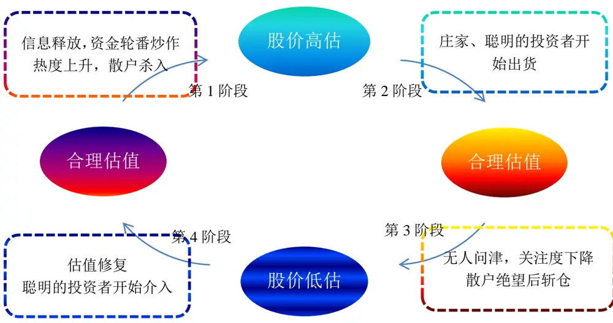
数据来源：东方证券研究所

从投机周期的分析中我们不难看出，一只股票投机程度不断增加的过程往往伴随着股价的不断上涨，疯狂的投机行为往往对应着股价的阶段性波峰；相反，投机程度比较弱的时点一般估值较低，未来超额收益较大。每只股票都有自己的投机周期，但可能处于不同的阶段，投机程度较浅的股票后期大概率上涨，被过度投机的股票后期大概率下跌，所以我们仅需买入“正常”的股票、卖出被过度投机的股票即能获得超越市场的收益。遗憾的是，我们并不能直接观察到股票的投机程度，但是投机程度高的股票往往伴随着一些交易层面的特征，通过对这些特征的刻画我们可以捕捉到个股的投机程度。

## 3. 被投机个股的交易行为特征

个股的投机最后必然会表现在股票的交易层面，我们通过波动率高低、个股收益能否被市场风格解释、股价能否及时反应市场公共信息、以及股票的换手程度等四个维度来刻画个股的投机性程度。我们认为被过度投机的股票一般具有下述特征：

高波动性：被投机的股票一般多空分歧较大，多空博弈的结果导致大的波动。由于个股的某些波动是由市场风格变动引起的，所以我们用剔除市场风格波动后的特质波动率来衡量个股的波动程度。

风格独立：一般而言，被过度投机的个股在交易时多依赖于其自身的私有信息，无视市场的涨跌或风格，以此投机性强的股票与市场风格关联性差，市场风格对其收益的解释程度弱。我们构建了特异度指标用来度量个股收益中不能被市场风格解释的成分占比。

价格时滞大：正常情况下个股的股价能够及时的反应市场公共信息（市场指数），但是当个股被过度投机时可能会过度关注个股层面的信息，导致市场层面的消息可能反应不足。我们通过价格时滞因子度量个股是否及时反应了市场公共信息。

高换手：换手率是交易员常用的用来甄别投机性股票的指标，投资者投机股票时一般追求的短期收益，成交频繁，博取短期收益，因此股票投机性强时自然伴随着较高的换手率。考虑到市值和换手的相关性，我们用市值调整后的换手率来度量个股的换手特征。

特质波动率、特异度、价格时滞、换手率四个指标描述的都是过去一段时间内（滞后的指标）个股的交易行为特征，我们可以统称为交易行为类指标。根据之前分析，股票当前被过度投机时，后期大概率下跌，作为股票投机程度代理变量的交易行为类指标取值越高，股票越有可能被过度投机，后期应该对应着较大的负向 alpha，相反，取值越小，越有可能获得正向 alpha。

报告接下来的部分主要介绍上文提到的四个交易行为类指标，包括历史超额收益的情况，相互之间的替代关系等，至于如何将多个交易行为类指标加总成一个反应股票投机程度的综合指标，哪一类股票更容易被投机、以及交易行为类指标在指数增强等领域的具体应用等，我们下次再作探讨。

## 二、交易行为类指标

该部分我们将分别介绍特质波动率、特异度、价格时滞、市值调整换手的定义、由来、及历史表现情况等。在市场有效性验证方面，有如下几个细节需要说明：

（1）回撤的样本空间为剔除上市不满 6 个月、ST、*ST 后的全部 A 股；

（2） 回撤时间为 2004 年 12 月 31 日至 2015 年 11 月 30 日；

（3） 基于全样本计算信息系数或者相关系数时，每个指标均经过了横截面标准化处理，以剔除指标在时间轴上波动的影响；

（4） 分组检验有效性时将样本空间内所有股票分成 10 组，每月调仓，构建等权组合，基准为市场等权组合；

（5）因子收益率为样本空间内因子值最小的 1/3股票构建的流通市值加权组合与最大 1/3股票组合收益率之差（每月调仓，估值因子收益率为账面市值比因子最大组合与最小组合收益率之差）。

## 1. 特质波动率

我们沿用 AHXZ(2006)的方法对特质波动率进行度量，在每月月底基于上月的日交易数据回归以下方程：

$$
r_{i,t}=\alpha_{i,t}+\beta_{i}MKT_{t}+s_{i}SMB_{t}+h_{i}HML_{t}+\varepsilon_{i,t}
$$

、 、 分别为市场收益率、市值因子收益率、估值因子收益率。

其中残差项的年化标准差（T=243）即为我们所求的特质波动率 ：

$$
IVol=std(\varepsilon_{i,t})\cdot\sqrt{T}
$$

特质波动率率度量的是剔除了市场常见风格波动后剩余的个股特有的波动率，用于度量归属于个股的特有风险。

图 2：特质波动率概率分布
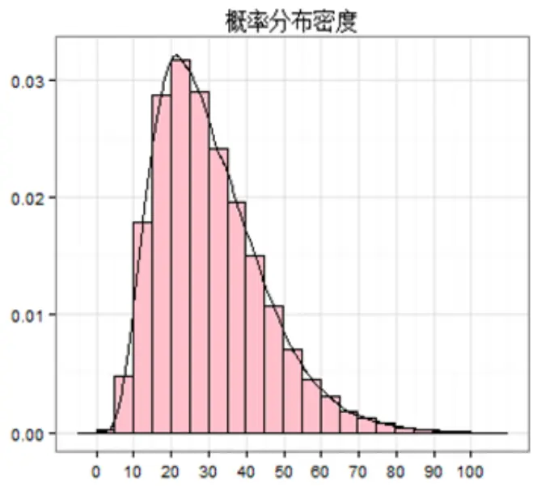
数据来源：Wind 数据库，东方证券研究所

图 3：特质波动率分组超额收益
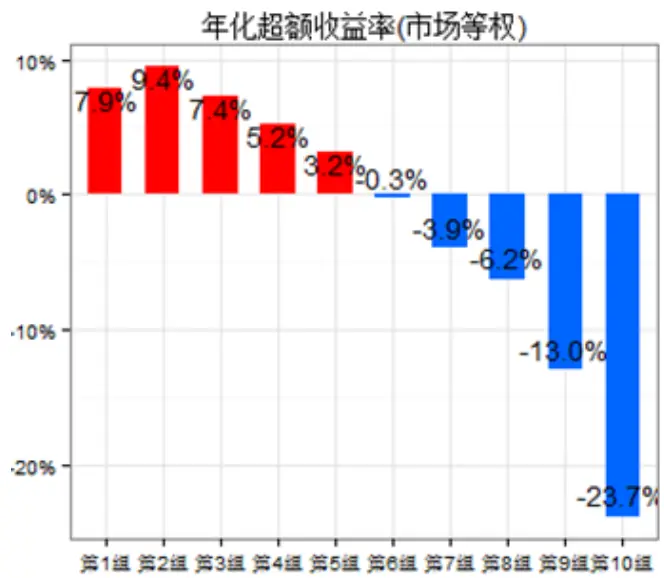
数据来源：Wind 数据库，东方证券研究所

我们通过信息比率 IC和分组检验两种方法验证了特质波动率预测次月收益率的能力，结果发现低特质波动率的股票拥有明显的正向超额收益。从 2005年至今的长样本来看，特质波动率和次月收益率的 pearson 相关系数达-0.065，spearman 相关系数更是高达-0.088，特质波动率的分组结果也强有力的支持了这个结论，特质波动率从小到大的 10个分组的超额收益率不断减小，从 7.9%的正向 alpha到-23.7%的负向alpha（第 1组超额收益略低于第 2组，主要是因为第一组内大市值股票占比相对较多），夏普比、信息比、胜率、回撤等指标也表现出了很强的单调性。同时，不应忽视的是特质波动率指标各分组的换手率较高，意味本期特质波动低的股票下期的特质波动率不一定还较低。

表 1：特质波动率分组业绩评价指标

| 年化收益率 年化超额收益 夏普比 信息比 月胜率 |  |  |  |  |  | 最大回撤 | 月均换手 |
| --- | --- | --- | --- | --- | --- | --- | --- |
| 中证全指 | 16.6% | -12.0% | 0.63 | -0.90 | 39.7% | 71.5% |  |
| 市场等权(基准) | 28.6% | 0.0% | 0.86 |  |  | 70.5% | 4.5% |
| 第1组 | 36.5% | 7.9% | 1.06 | 0.69 | 56.5% | 62.7% | 71.0% |
| 第2组 | 38.0% | 9.4% | 1.06 | 1.36 | 63.4% | 66.2% | 85.5% |
| 第3组 | 36.0% | 7.4% | 1.00 | 1.19 | 67.2% | 69.2% | 88.1% |
| 第4组 | 33.8% | 5.2% | 0.95 | 1.12 | 58.0% | 70.6% | 89.4% |
| 第5组 | 31.8% | 3.2% | 0.91 | 0.80 | 61.1% | 71.5% | 89.7% |
| 第6组 | 28.3% | -0.3% | 0.85 | 0.01 | 51.1% | 71.6% | 89.5% |
| 第7组 | 24.7% | -3.9% | 0.76 | -0.48 | 49.6% | 74.5% | 89.1% |
| 第8组 | 22.4% | -6.2% | 0.71 | -0.77 | 48.1% | 71.3% | 88.3% |
| 第9组 | 15.6% | -13.0% | 0.57 | -1.53 | 33.6% | 72.6% | 86.7% |
| 第10组 | 4.9% | -23.7% | 0.32 | -2.20 | 25.2% | 76.1% | 78.5% |

数据来源：Wind 数据库，东方证券研究所

为了考察特质波动率指标在时间轴上的稳定性，我们绘制了特质波动率指标各月份的信息系数 IC（上月特质波动率指标和本月收益率的秩相关系数）以及多空组合（做多第 1组，做空第 10组）的历史表现。结果发现特质波动率总体表现较稳健，2005 年至今 IC 正显著比率 12.2%，负显著比率 69.5%,多空组合月胜率 71%，大多数月份“低特质波动，高超额收益”的现象存在。多空组合历史净值曲线总体波动也不大，最大回撤为 18.26%，主要是 2013 年下半年及 2014 年下半年产生了较大回撤。

图 4：特质波动率历史表现回溯
各月份秩相关系数(均值：-0.09，正显著比率:12.2%，负显著比率:69.5%)
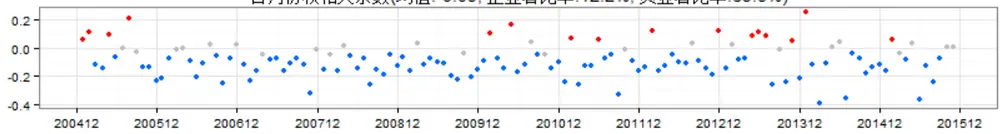

多空组合各月度收益(均值:2.06%，胜率:71.0%)
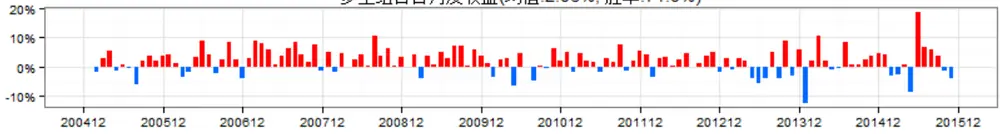

多空组合净值曲线
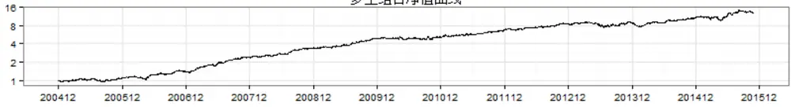

多空组合历史回撤(最大回撤：-18.26%)
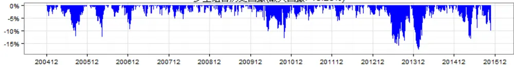
数据来源：Wind 数据库，东方证券研究所

其他更多关于特质波动率的信息请参见我们前期的专题报告《因子选股研究系列之二——低特质波动，高超额收益 20150909》

## 2. 特异度

在每月月底基于上月的日交易数据回归以下 Fama-French方程：

$$
r_{i,t}=\alpha_{i,t}+\beta_{i}MKT_{t}+s_{i}SMB_{t}+h_{i}HML_{t}+\varepsilon_{i,t}
$$

MKTt、 $\mathrm{SMB}_{\mathrm{t}},\ \mathrm{HML}_{\mathrm{t}}$ 分别为市场收益率、市值因子收益率、估值因子收益率。市场因子、市值因子及估值因子对股票收益的解释程度越高，上述方程的拟合度 $\mathrm{R}_{\mathrm{Fama-French}}^{2}$ 越高。

我们定义上述回归的残差平方和总平方和之比为特异度 :

$$
\mathrm{IVR}={\frac{SSR}{SST}}=1-\mathrm{R}_{\mathrm{Fama-French}}^{2}
$$

特异度反应了股票收益中不能被市场、规模、估值三种常见的风格因子解释的成分占比，特异度越高说明个股涨跌与市场风格的相关性越小，交易中市场层面的信息占比越低，个股层面的信息占比越高。股票的特异度越高，表示市场风格越不能解释其股票收益，过去一段时间内被过度投机的可能性和程度越大。

比较特质波动和特异度的度量方法不难看出，两种存在一定的定量关系：

$$
A\neq\sqrt{2}\times\frac{1}{2}\overrightarrow{x}\overrightarrow{2y}\overrightarrow{2\cdot}=\sqrt{A\neq\sqrt{\frac{1}{2}}\times\frac{1}{2}}\times A\neq\sqrt{\frac{1}{2}\ast}
$$

特异度和特质波动率、总波动率之间的关系非线性，而当前大多数量化模型均为线性模型，因此即使在模型中已有特质波动率及总波动率两个因子，也不一定能够捕捉到特异度所包含的信息成分。

根据特异度的定义，特异度的取值在 0-1 之间，从历史上看，特异度的均值为 0.46，大多数位于 0.28-0.62 之间，所以，大多数股票的一半以上的收益源于其市场风格，个股的涨跌对市场和风格的依赖性较强。

图 5：特异度概率分布
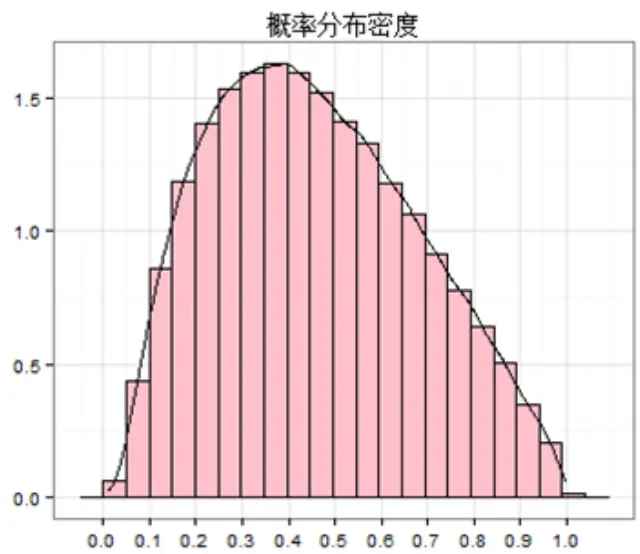
数据来源：Wind 数据库，东方证券研究所

图 6：特异度分组超额收益
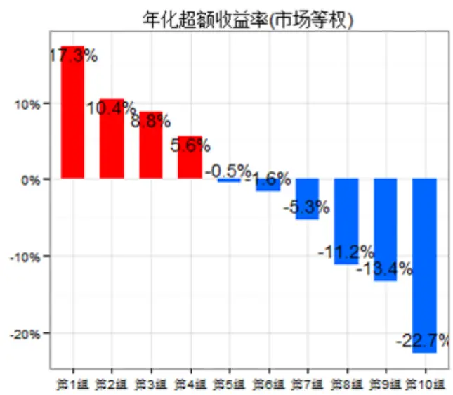
数据来源：Wind 数据库，东方证券研究所

表 2：特异度分组业绩评价指标

| 年化收益率 年化超额收益 夏普比 信息比 月胜率 |  |  |  |  |  | 最大回撤 | 月均换手 |
| --- | --- | --- | --- | --- | --- | --- | --- |
| 中证全指 | 16.6% | -12.0% | 0.63 | -0.90 | 39.7% | 71.5% |  |
| 市场等权(基准) | 28.6% | 0.0% | 0.86 |  |  | 70.5% | 4.5% |
| 第1组 | 45.9% | 17.3% | 1.16 | 1.85 | 68.7% | 65.0% | 81.8% |
| 第2组 | 39.0% | 10.4% | 1.04 | 1.52 | 70.2% | 67.5% | 88.2% |
| 第3组 | 37.4% | 8.8% | 1.01 | 1.54 | 64.9% | 70.5% | 89.6% |
| 第4组 | 34.2% | 5.6% | 0.95 | 1.20 | 64.9% | 69.0% | 90.6% |
| 第5组 | 28.1% | -0.5% | 0.84 | 0.01 | 49.6% | 71.2% | 90.1% |
| 第6组 | 27.1% | -1.6% | 0.82 | -0.20 | 46.6% | 72.5% | 90.3% |
| 第7组 | 23.3% | -5.3% | 0.75 | -1.00 | 38.2% | 72.4% | 90.0% |
| 第8组 | 17.4% | -11.2% | 0.62 | -1.82 | 28.2% | 72.6% | 89.5% |
| 第9组 | 15.3% | -13.4% | 0.57 | -2.13 | 28.2% | 73.3% | 88.5% |
| 第10组 | 5.9% | -22.7% | 0.34 | -2.67 | 19.8% | 72.2% | 85.3% |

数据来源：Wind 数据库，东方证券研究所

过去 10年特异度的业绩相当可喜，低特异度的股票表现了惊人的正向 alpha。基于全样本计算的信息比率，spearman 相关性系数为-0.071，spearman 秩相关系数高达-0.091，特异度分组的 top组合（第 1组）年均超越市场等权组合 17.3%，胜率高达 68.7%，bottom组合的负向 alpha更是夸张，高达-22.7%，过去 131 个月仅 19.8%战胜市场等权。特异度各分组更是表现出严格的业绩单调性，最后，同特质波动率，特质度各分组的换手率较高，说明个股的特质度在时间序列上不稳定，当期的特异度较低，下期就可能较高。

回溯特异度的历史表现，我们更是被特异度的稳定性震惊。从 2005 年 131 个月的信息比率仅 6 个月正向显著，占比不到 5%，从月收益来看，分组的 top 组合（第 1 组）以 79.4%的概率战胜 bottom 组合（第 10组）。特异度因子的回撤时间主要是 2005年前半年及 2007年中,多空组合（做多第 1 组，做空第 10 组）最大回撤-10.25%,近 5 年的回撤更是仅有 5%，今年以来特异度多空组合月度收益大多在 5%以上，均值曲线已实现翻倍。因此特异度因子不仅有较高的超额收益，更是具有单因子中罕见的稳定性。

图 7：特异度历史表现回溯
各月份秩相关系数(均值：-0.09，正显著比率:4.6%，负显著比率:67.9%)
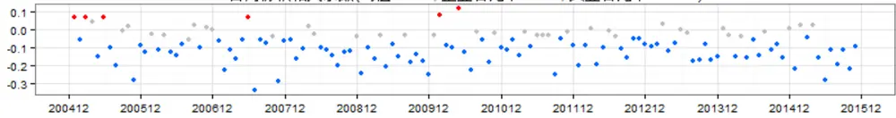

多空组合各月度收益(均值:2.81%.胜率:79.4%)
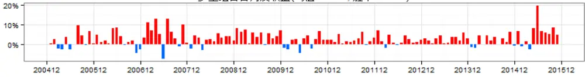

多空组合净值曲线
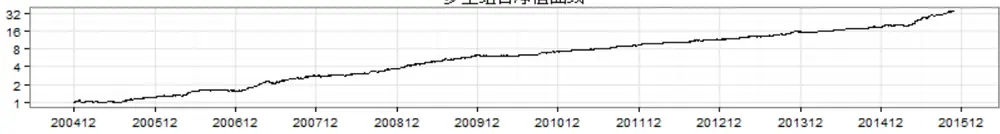

多空组合历史回撤(最大回撤：-10.25%)
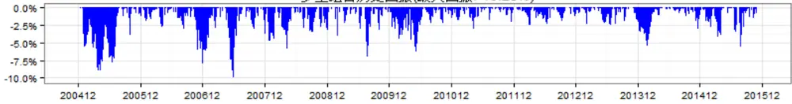
数据来源：Wind 数据库，东方证券研究所

## 3. 价格时滞

关于价格时滞的度量我们参照了 Hou and Moskowitz（2005）和胡聪慧等（2015）的定义，在每月月底利用本月日交易数据回归下述方程：

$$
r_{i,t}=\alpha_{i}+\beta_{i}MKT_{t}+et{}{'}\sum_{k=1}^{n}\delta_{i}^{(k)}MKT_{t-k}+\varepsilon_{i,t}
$$

为 t 期的市场收益率， $MKT_{t-k}$ 为滞后 k 期的市场收益率，n 表示滞后的期数。如果股价对市场信息的反应存在时滞，那么滞后的市场收益率对股票收益率具有显著的解释力，即 $\delta_{i}^{(k)}\neq0,$ 价格时滞定义为：

$$
PriceDelay=1-\frac{R_{\delta_{i}^{(k)}=0}^{2}}{R^{2}}
$$

$R_{\delta_{i}^{(k)}=0}^{2}$ 表示令 $\delta_{i}^{(k)}=0$ 时回归方程的拟合度 $R^{2}$ ， $R^{2}$ 表示回归上述方程的拟合度 $R^{2}$ ，上述定义表示不带约束回归的拟合程度高于带约束回归的拟合程度的比率， 越大，表示滞后的市场收益率对股票收益率的预测能力越强。

价格时滞度量中涉及到参数 滞后期 n，我们分别计算了 n=3、n=5 时的价格时滞，发现价格时滞对参数 n 不敏感，两者相关系数高达 0.93，下文中我们仅报告滞后期 n=3 的价格时滞因子，如有需要我们也提供 n=5的价格时滞相关信息。

从 2005 年以来的数据看，价格时滞因子均值 0.262，中位数 0.373，大多数股票对市场信息能够及时反应，滞后市场信息对个股收益的解释程度一般在 30%内。

价格时滞在预测股票收益方面表现也较好，价格时滞与次月收益率的 pearson相关系数-0.049，spearman 相关系数-0.058，分组的 top 组合（第 1 组）相对市场等权正向超额收益 8.8%，bottom组合（第 10组）负向超额收益-18.5%，第 2组的收益率比第 3组低，不满足单调性，但超额收益分组单调性总体来看依然良好，各业绩评价指标也显示价格时滞较低的组合有较高的投资价值。另外需要补充的是，价格时滞各分组的换手较高，说明价格时滞和特质波动率、特质度一样，个股的取值在时间序列上变化较大。

图 8：价格时滞概率分布
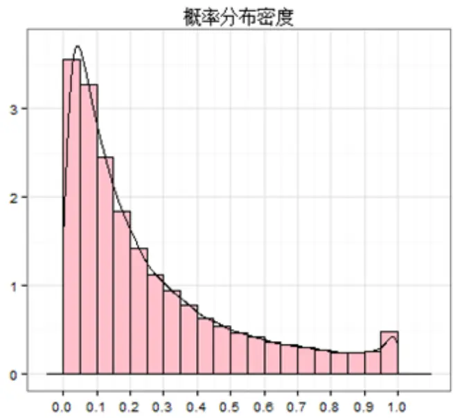
数据来源：Wind 数据库，东方证券研究所

图 9：价格时滞分组超额收益
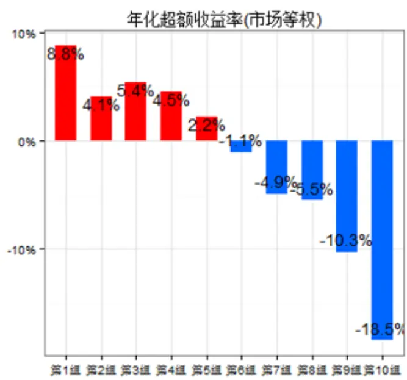
数据来源：Wind 数据库，东方证券研究所

表 3：价格时滞分组业绩评价指标

| 年化收益率 |  | 年化超额收益 夏普比 信息比 月胜率 |  |  |  | 最大回撤月均换手 |  |
| --- | --- | --- | --- | --- | --- | --- | --- |
| 中证全指 | 16.6% | -12.0% | 0.63 | -0.90 | 39.7% | 71.5% |  |
| 市场等权(基准) | 28.6% | 0.0% | 0.86 |  |  | 70.5% | 4.5% |
| 第1组 | 37.4% | 8.8% | 1.02 | 1.13 | 61.8% | 68.0% | 88.0% |
| 第2组 | 32.7% | 4.1% | 0.94 | 0.68 | 57.3% | 68.9% | 89.1% |
| 第3组 | 34.0% | 5.4% | 0.95 | 1.10 | 62.6% | 69.4% | 89.4% |
| 第4组 | 33.1% | 4.5% | 0.94 | 0.99 | 64.9% | 70.7% | 89.9% |
| 第5组 | 30.9% | 2.2% | 0.89 | 0.54 | 55.0% | 70.9% | 90.4% |
| 第6组 | 27.5% | -1.1% | 0.82 | -0.06 | 47.3% | 70.6% | 90.9% |
| 第7组 | 23.7% | -4.9% | 0.75 | -0.85 | 40.5% | 71.2% | 90.7% |
| 第8组 | 23.1% | -5.5% | 0.73 | -0.85 | 39.7% | 72.3% | 90.2% |
| 第9组 | 18.3% | -10.3% | 0.64 | -1.38 | 37.4% | 72.9% | 88.7% |
| 第10组 | 10.1% | -18.5% | 0.45 | -1.91 | 26.7% | 72.0% | 85.3% |

数据来源：Wind 数据库，东方证券研究所

从价格时滞 2005年以来的历史表现看，价格时滞总体表现也比较稳健。从过去 131个月的数据看，信息比率（IC，spearman）仅 9.2%的月份负显著，71%的月份多空组合（做多第 1 组，做空第 10 组）收益大于 0.，多空组合净值曲线稳步上升，11 年来多空组合最大回撤 15.8%,近期2014年初、2015年初回撤较大。值得注意的是，价格时滞指标在去年年底极端行情中，不仅没有回撤，而且获得较大的超额收益。

图 10：价格时滞历史表现回撤
各月份秩相关系数(均值：-0.06.正显著比率:9.2%，负显著比率:58.0%)
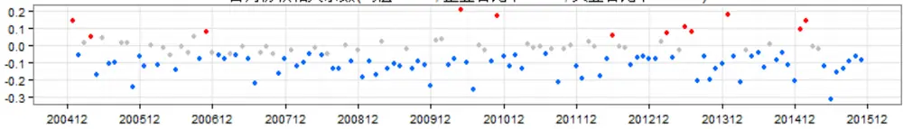

多空组合各月度收益(均值：1.91%，胜率:71.0%)
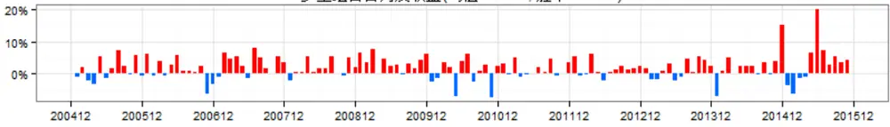

多空组合净值曲线
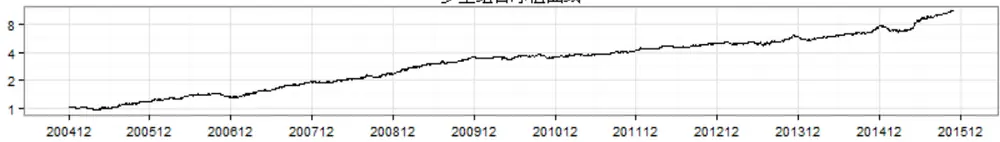

多空组合历史回撤(最大回撤：-15.84%)
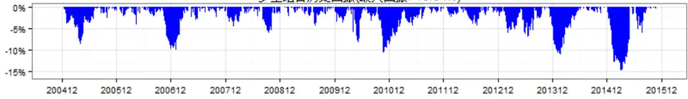
数据来源：Wind 数据库，东方证券研究所

## 4. 换手率

换手率，即股票的成交量占流通股本的比率，一直以来都被交易员用来衡量股票的投机程度，股票的换手率高，说明投资者主要是为了博取短期收益，自然伴随着高的投机性。我们用过去一个月的日均换手率作为过去一段时间换手高低的衡量标准。

从数据分布上看，换手率存在明显的右偏形态，多数股票的换手率较低，少数股票的换手率极高，A 股股票的日均换手率平均为 2.88%，中位数 2.07%，大多数位于 1%-4%之间。

换手率分组的结果和我们前期预期的有较大不同，主要表现为低换手率组合几乎没有超额收益，top组合（日均换手率最小的一组，第 1组）甚至跑输市场等权组合，虽然高换手率组合的负alpha 仍然较明显，但分组的收益单调性严重丧失。从历史的表现来看，12 年之前低换手率组合大概率跑赢高换手组合，但是 12年之后换手率的超额收益效应几乎消失。

图 11：日均换手率概率分布
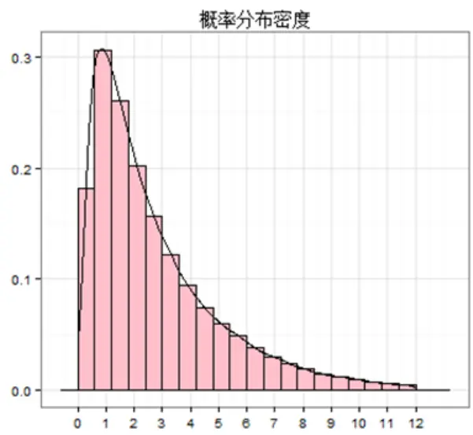
数据来源：Wind 数据库，东方证券研究所

图 12：日均换手率分组超额收益
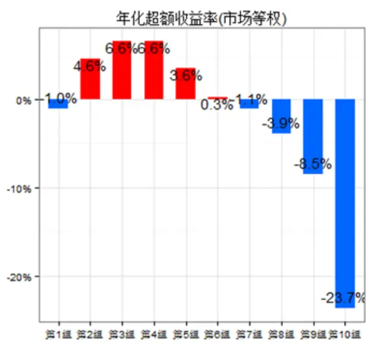
数据来源：Wind 数据库，东方证券研究所

图 13：日均换手率历史表现回溯
各月份秩相关系数(均值：-0.06，正显著比率:26.0%，负显著比率:58.0%)
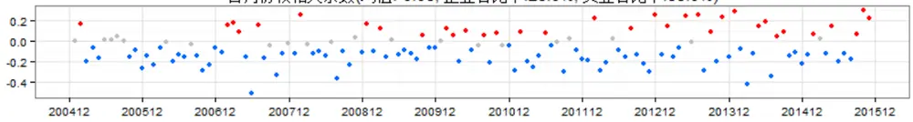

多空组合各月度收益(均值：1.29%，胜率:61.8%)
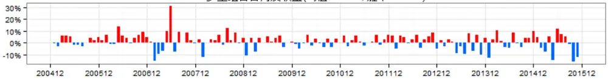

多空组合净值曲线
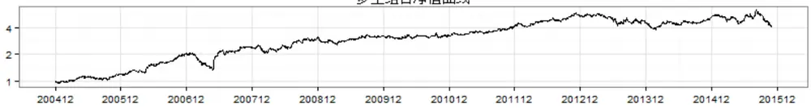

多空组合历史回撤(最大回撤:-35.81%)
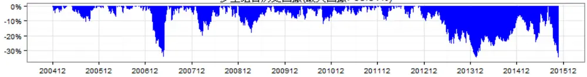
数据来源：Wind 数据库，东方证券研究所

考察换手率和流通市值的关系我们发现，日均换手率和流通市值的对数存在较高的负相关性，这可能是换手正端超额收益丧失的原因。换手率和流通市值的 pearson 相关系数达-0.368，spearman 相关系数-0.394，细看换手率和流通市值的分位数关系（图 14），图 14中右下角和左上角的数据点较其他区域更为密集，意味着低换手率的分组大多为大市值股票，高换手率的股票一般为小市值股票。近年来尤其是 12年以后市值效应相当强劲，由于市值效应的影响，日均换手率指标正端 alpha 丧失，这也可以解释为什么 2012 年之后换手率的超额收益消失，主要是因为 12年之后市值效应的表现异常强劲。

图 14：日均换手率与流通市值分位数关系
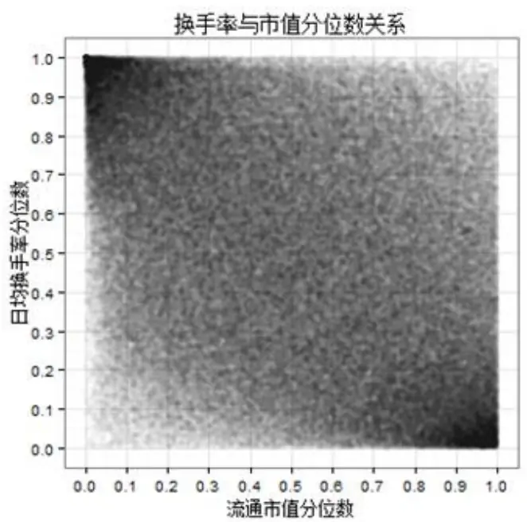
数据来源：Wind 数据库，东方证券研究所

图 15：日均换手率分组超额收益（流通市值分层）
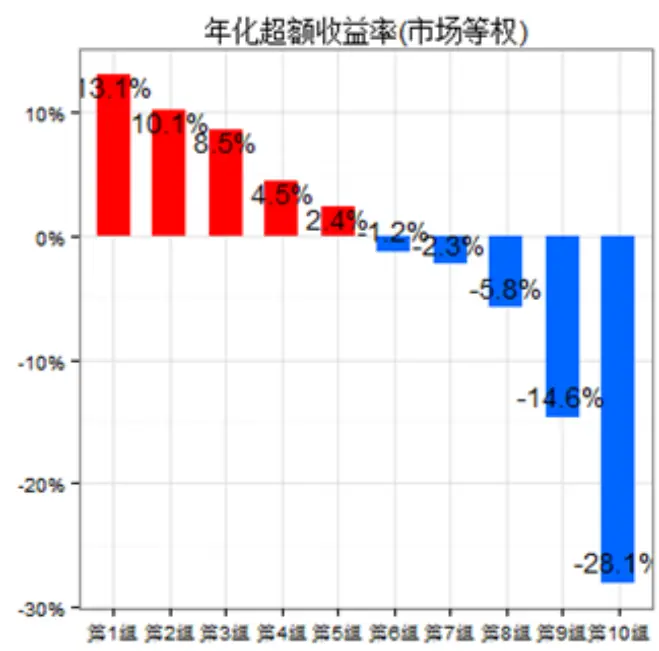
数据来源：Wind 数据库，东方证券研究所

表 4：日均换手率分组业绩评价指标（市值分层）

| 年化收益率 |  | 年化超额收益 夏普比 信息比 月胜率 最大回撤月均换手 |  |  |  |  |  |
| --- | --- | --- | --- | --- | --- | --- | --- |
| 中证全指 | 16.6% | -12.0% | 0.63 | -0.90 | 39.7% | 71.5% |  |
| 市场等权(基准) | 28.6% | 0.0% | 0.86 |  |  | 70.5% | 4.5% |
| 第1组 | 41.7% | 13.1% | 1.22 | 0.92 | 66.4% | 63.3% | 47.5% |
| 第2组 | 38.7% | 10.1% | 1.10 | 1.30 | 65.6% | 66.3% | 73.2% |
| 第3组 | 37.1% | 8.5% | 1.05 | 1.47 | 66.4% | 67.9% | 80.1% |
| 第4组 | 33.1% | 4.5% | 0.95 | 0.91 | 58.0% | 69.4% | 83.0% |
| 第5组 | 31.0% | 2.4% | 0.91 | 0.57 | 58.8% | 70.0% | 84.7% |
| 第6组 | 27.4% | -1.2% | 0.82 | -0.12 | 45.8% | 70.4% | 84.9% |
| 第7组 | 26.3% | -2.3% | 0.79 | -0.16 | 43.5% | 73.5% | 84.2% |
| 第8组 | 22.8% | -5.8% | 0.71 | -0.65 | 40.5% | 71.9% | 82.4% |
| 第9组 | 14.0% | -14.6% | 0.53 | -1.61 | 31.3% | 77.2% | 77.7% |
| 第10组 | 0.5% | -28.1% | 0.22 | -2.08 | 26.7% | 83.3% | 56.4% |

数据来源：Wind 数据库，东方证券研究所

为了考察剔除市值效应后日均换手率的表现，我们先根据流通市值将样本空间内的股票分为10层，再在每一个市值分层内根据日均换手率的大小将股票分为 10组。根据市值分层后，日均换手的分组单调性和两端超额收益明显增强，日均换手率最小的组合（top组合，第 1组）年均超越市场等权组合 13.1%，胜率高达 66.4%，而且组合换手率相对较低，月均单边换手 47.5%，日均换手率最大的组合平均跑输市场 28.1%，也大于市值分层前的 23.7%，夏普比、信息比、月胜率、等指标在各分组间的变化也印证了在控制市值效应后低换手股票可以带来明显的正向超额收益。

市值分层后换手率的多空组合胜率显著提升，月胜率 70.2%，2012年后低换手率组合也能跑赢高换手率组合，说明在控制市值效应后，换手率的超额收益并没有消失。但是，需要主要的是换手多空组合（做多第 1 组，做空第 10 组）的历史回撤较大，控制市值后最大回撤仍高达 22.3%，2007年中、2013年中，及近期都有明显回撤，说明换手率指标虽有较高的超额收益，但是其风险也值得注意。

图 16：日均换手率历史表现回溯（流通市值分层）
多空组合各月度收益(均值:2.62%，胜率:70.2%)
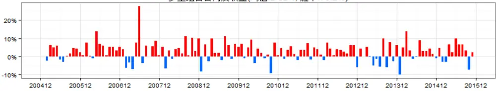

多空组合净值曲线
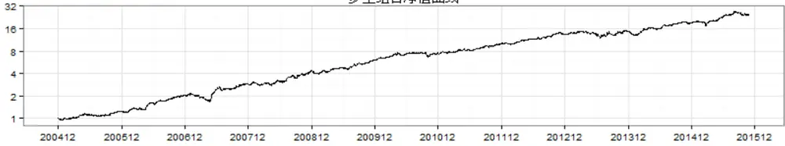

多空组合历史回撤(最大回撤:-22.26%)
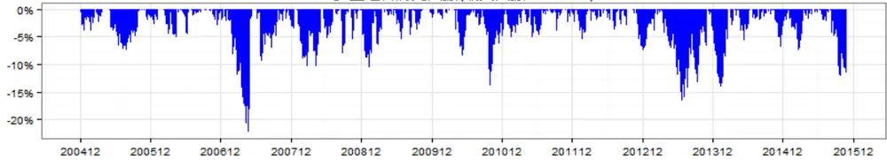
数据来源：Wind 数据库，东方证券研究所

从上述分析中我们不难看出，换手率指标在控制市值影响后能够带来较好的超额收益，但是换手率指标自身还带有市值因子的相关信息，这部分信息的对超额收益的影响和换手率对超额收益的作用相反，很直观的我们会想到从换手率中提取一个剔除市值信息后的换手率代理变量，

图 17：换手率对数概率分布
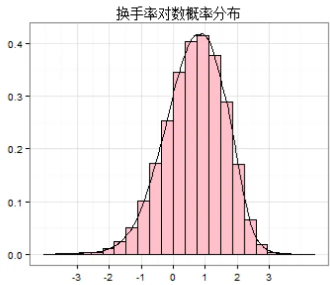
数据来源：Wind 数据库，东方证券研究所

图 18：市值调整换手概率分布
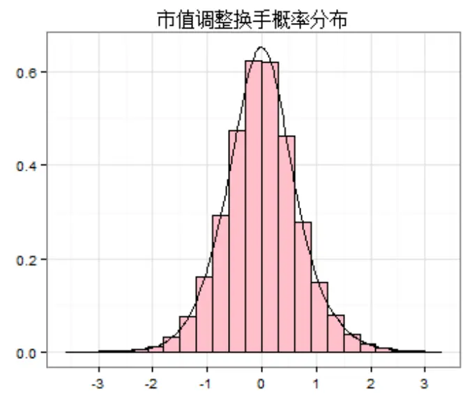
数据来源：Wind 数据库，东方证券研究所

我们采用最简单的回归方法剔除换手率中的市值成分，考虑到经典的回归模型要求残差项符合正态分布，为了使回归残差项更接近正态分布我们在回归时对换手率和市值均做了对数化处理。具体而言，每月的月底在横截面上回归以下方程：

$$
ln\big(Turnover_{i,t}\big)=\alpha_{t}+\beta_{t}\cdot ln\big(MktValue_{i,t}\big)+\varepsilon_{i,t}
$$

$ln\big(Turnover_{i,t}\big)$ 为日均换手率的对数， $ln\big(MktValue_{i,t}\big)$ 为流通市值的对数，回归残差项我们用来作为剔除市值后的换手率代理变量，我们称之为 市值调整换手。

图 19：市值调整换手和市值的分位数关系
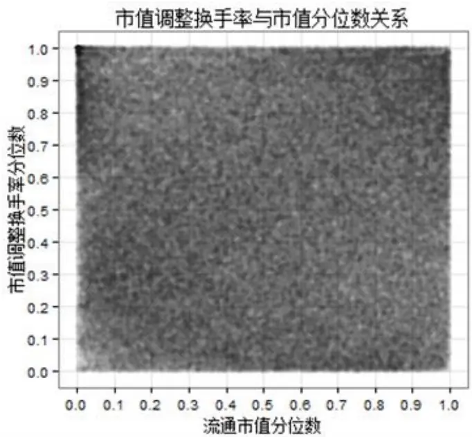
数据来源：Wind 数据库，东方证券研究所

图 20：市值调整换手分组超额收益
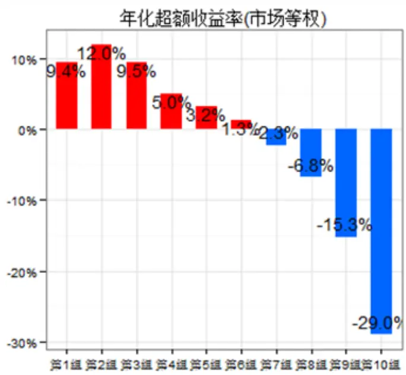
数据来源：Wind 数据库，东方证券研究所

经过回归处理后的市值调整换手和市值的相关性大幅减弱，pearson 线性相关系数下降为 0，spearman 秩相关系数 0.019，从市值调整换手和流通市值的分位数关系（图 19）我们也可以看出所有的点几乎均匀的散落在图形内，所以市值调整换手和市值几乎不相关。

另外，市值调整换手相对换手率对股票收益的预测能力大幅增强，与次月收益率的 pearson线性相关系数高达-0.074，spearman 秩相关系数高达-0.098，根据市值调整换手各分组也表现出相当高的单调性（第 1组表现相对较差可能是因为第 1组中大盘占比仍然较高），top组合（市值调整换手最小的组合）年均超越市场等权 9.4%，胜率 63.4%，总体表现较好，bottom组合跑输市场 29.0%，胜率仅 29.8%，各分组的单调性也展示了换手率低的股票拥有更高的投资价值。同时，市值调整换手分组的换手率相对较低，top组合仅 44.4%，低换手组合股票变动不大。

表 5：市值调整换手分组业绩评价指标

| 年化收益率 年化超额收益 夏普比 信息比 月胜率 最大回撤 月均换手 |  |  |  |  |  |  |  |
| --- | --- | --- | --- | --- | --- | --- | --- |
| 中证全指 | 16.6% | -12.0% | 0.63 | -0.90 | 39.7% | 71.5% |  |
| 市场等权(基准) | 28.6% | 0.0% | 0.86 |  |  | 70.5% | 4.5% |
| 第1组 | 38.0% | 9.4% | 1.17 | 0.48 | 63.4% | 63.6% | 44.4% |
| 第2组 | 40.6% | 12.0% | 1.12 | 1.71 | 70.2% | 66.2% | 73.8% |
| 第3组 | 38.1% | 9.5% | 1.06 | 1.52 | 64.9% | 67.9% | 81.0% |
| 第4组 | 33.7% | 5.0% | 0.95 | 1.00 | 62.6% | 68.3% | 83.6% |
| 第5组 | 31.8% | 3.2% | 0.92 | 0.70 | 59.5% | 69.6% | 84.8% |
| 第6组 | 29.9% | 1.3% | 0.86 | 0.40 | 55.7% | 71.0% | 85.0% |
| 第7组 | 26.3% | -2.3% | 0.79 | -0.20 | 44.3% | 72.4% | 84.3% |
| 第8组 | 21.8% | -6.8% | 0.69 | -0.83 | 36.6% | 73.5% | 82.2% |
| 第9组 | 13.3% | -15.3% | 0.51 | -1.62 | 28.2% | 78.8% | 77.6% |
| 第10组 | -0.4% | -29.0% | 0.20 | -2.12 | 29.8% | 83.4% | 54.8% |

数据来源：Wind 数据库，东方证券研究所

2005 年至今,市值调整换手率各月份的信息系数(IC, spearman)正向显著比率为 14.5%,负显著比率 67.9%,多空组合月度收益率胜率 67.9%，总体表现比较稳健, 但正向显著比率较其他交易行为类指标偏高,所以风险相对其他指标较大。近 11 年多空组合最大回撤发生在 2007 年，高达30.16%，近几年时不时亦有 10%以上的回撤。所以，总体来说，市值调整换手指标超额收益明显，但同时应注意应注意其风险可能高于前几个交易行为类指标。

图 21：市值调整换手历史表现回溯
各月份秩相关系数(均值-0.10，正显著比率：14.5%，负显著比率:67.9%)
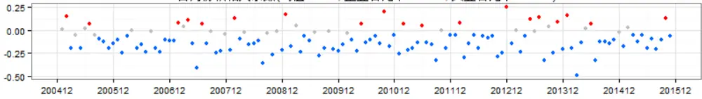

多空组合各月度收益(均值：2.45%，胜率:67.9%)
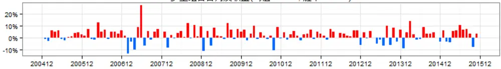

多空组合净值曲线
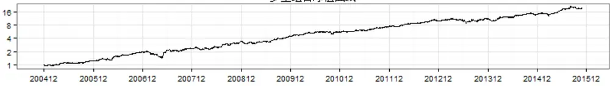

多空组合历史回撤(最大回撤：-30.16%)
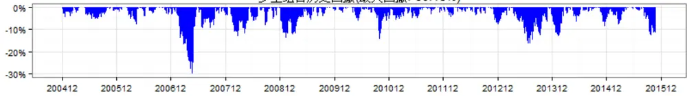
数据来源：Wind 数据库，东方证券研究所

本章我们分别介绍了四个描述过去一段时间投机程度的交易行为类指标，特质波动率、特异度、价格时滞等指标均表现出较强的预测超额收益的能力，相比之下，换手率指标的正向超额收益较弱，但控制市值效应后，换手率预测收益率的能力明显增强，基于此，我们构建了市值调整换手指标作为换手率的代理变量。总体而言，各交易行为类因子的表现符合我们的预期，过去一段时间被过度投机的股票下期收益率普遍偏低，同时较为“正常”的股票后期表现相对更好，具有到各指标，特异度指标带来的超额收益最明显，同时风险最小，市值调整换手的超额收益也较高，但风险较大，特质波动率和价格时滞的表现相对前两者较为平淡，但仍有可观的超额收益。

## 三、相关性结构与替代关系

## 1. 相关性分析

为了研究交易行为类指标内部各因子间以及交易行为类因子和其他因子的相关性，我们计算了各因子值间的spearman秩相关系数以及各因子收益率间的spearman秩相关系数，和之前一样，我们在计算因子值相关性之前对每个因子在横截面上均做了标准化处理。

表 6：因子值间的秩相关系数

| 市值对数 账面市值比月收益率特 |  |  |  | 质波动率 | 特异度 | 价格时滞 | 市值调整换手下月收益率 |  |
| --- | --- | --- | --- | --- | --- | --- | --- | --- |
| 市值对数 | 1.000 | 0.035 | 0.029 | -0.064 | 0.003 | -0.054 | 0.027 | -0.066 |
| 账面市值比 | 0.035 | 1.000 | -0.117 | -0.346 | -0.288 | -0.258 | -0.175 | 0.035 |
| 月收益率 | 0.029 | -0.117 | 1.000 | 0.329 | 0.300 | 0.228 | 0.192 | -0.079 |
| 特质波动率 | -0.064 | -0.346 | 0.329 | 1.000 | 0.723 | 0.501 | 0.510 | -0.088 |
| 特异度 | 0.003 | -0.288 | 0.300 | 0.723 | 1.000 | 0.631 | 0.221 | -0.091 |
| 价格时滞 | -0.054 | -0.258 | 0.228 | 0.501 | 0.631 | 1.000 | 0.197 | -0.058 |
| 市值调整换手率 | 0.027 | -0.175 | _0.192 | 0.510 | 0.221 | 0.197 | 1.000 | -0.098 |
| 下月收益率 | -0.066 | 0.035 | -0.079 | -0.088 | -0.091 | -0.058 | -0.098 | 1.000 |

数据来源：Wind 数据库，东方证券研究所

表 7：因子收益率间的秩相关系数

|  | 市值对数 | 账面市值比 | 月收益率特质波动率 |  | 特异度 | 价格时滞 | 市值调整换手 |
| --- | --- | --- | --- | --- | --- | --- | --- |
| 市值对数 | 1.000 | 0.107 | 0.235 | -0.407 | -0.180 | 0.084 | -0.237 |
| 账面市值比 | 0.107 | 1.000 | -0.191 | -0.382 | -0.544 | -0.527 | -0.133 |
| 月收益率 | 0.235 | -0.191 | 1.000 | 0.127 | 0.229 | 0.314 | 0.162 |
| 特质波动率 | -0.407 | -0.382 | 0.127 | 1.000 | 0.486 | 0.194 | 0.618 |
| 特异度 | -0.180 | -0.544 | 0.229 | 0.486 | 1.000 | 0.742 | 0.141 |
| 价格时滞 | 0.084 | -0.527 | 0.314 | 0.194 | 0.742 | 1.000 | -0.030 |
| 市值调整换手率 | -0.237 | -0.133 | 0.162 | 0.618 | 0.141 | -0.030 | 1.000 |

数据来源：Wind 数据库，东方证券研究所

从因子间的相关系数矩阵（表 6，表 7）中我们不难看出各因子间有下列相关性结构：

（1）特质波动率、特异度、价格时滞有较大比例的共有信息成分，特质波动率和市值调整换手相关性高。特质波动率、特异度、价格时滞两两之间相关性极高，因子值秩相关系数均在 0.5以上，而市值调整换手和特异度、价格时滞相关性不高，但市值调整换手和特质波动率有较高的相关性。基于此，我们可以猜想：特质波动率、特异度、价格时滞间有较大比例的共有信息成分，特质波动率和市值调整换手间有较大比例的共有成分。

（2）交易行为类因子与当月收益率高度正相关，次月收益率负相关。交易行为类因子与当月收益高度正相关，说明个股被投机炒作的过程中一般同时伴随着股价的上涨，而交易行为类因子与次月收益负相关，即上期被热炒的股票下期又大概率下跌。投机的过程伴随着股价的上涨，而过度投机后大概率下跌，说明交易行为类因子的超额收益表现可能与反转效应相关，下文中我们将会验证这种猜想。

（2）交易行为类指标与市值因子相关性弱，选股偏好低估值股票。从因子值及因子收益率间的相关系数看，除特质波动率略偏大票外，其他交易行为类指标和市值几乎不相关。而所有的交易行为类因子均和账面市值比负相关，投机性强的股票一般估值较高。

## 2. 因子分层

为了进一步考察交易行为类指标内部的相互替代作用以及反转效应、估值效应对交易行为类指标预测收益能力的解释作用，我们计算了各因子经过特定因子分层后再分组的各组表现，考察top 组合和 bottom 组合的相对表现。具有做法如下：

在每个月底按分层因子大小将样本空间内的股票分为 10层，再在每一层内按分组因子的大小排序，选取每一层内分组因子最小的 1/10 股票作为第 1 组（top 组合），以此类推，每层内分组因子最大 1/10股票作为第 10组（bottom 组合），然后比较做多 top组合做空 bottom组合的多空组合月均收益率及其 p值。

通过比较各个因子分层前后的多空组合月收益及 p 值变化（图 22），我们大致可以判断因子之间相互的替代关系和解释程度。

经过特异度分层后，特质波动率、价格时滞的多空组合月收益变得不显著，在控制特异度指标后，特质波动率、价格时滞预测收益的能力几乎消失，说明特质波动率、价格时滞所含有的超额收益信息主要归功于特异度。相反，在控制特质波动率或者价格时滞后，特异度的多空组合收益率虽稍有回落，但总体仍然显著，说明特异度中含有特质波动率、价格时滞中没有的但是能够带来超额收益的信息成分。综上，特异度指标能够解释特质波动率和价格时滞中的超额收益，同时包含特质波动率和价格时滞中没有的信息成分，因此，从预测超额收益的角度，特异度一个指标可以反应特异度、特质波动率、价格时滞三个指标总的信息。

市值调整换手指标经过其他三个交易行为类指标中的任一个因子分层后，多空组合的月收益均有不同程度的减小，其中经特质波动率分层后收益率减小的幅度最大，可以推断特质波动率对市值调整换手的解释程度最大，但是不管经过哪一个指标分层，市值调整换手多空组合的月收益仍然较大，且显著为正。所以我们认为，虽然市值调整换手的部分超额收益能够被其他交易行为类指标解释，但是市值调整换手仍包含大量其独有的能够带来超额收益的信息成分。

前面的相关性分析我们猜想估值效应、反转效应可能是交易行为类指标能够获取超额收益的部分原因，然而我们通过对账面市值比、月收益分层处理后，发现各交易行为类指标的多空组合收益率分层前后前后变化不大，各指标仍然较为显著，说明估值效应、反转效应对交易行为类指标超额收益的解释能力相当有限。

表 8：因子分层多空组合月均收益率及 p 值

| 多空组合月收益 特质波动率 特异度 价格时滞市值调整换手 账面市值比 月收益率 |  |  |  |  |  |  |  |
| --- | --- | --- | --- | --- | --- | --- | --- |
| 分层因子价 | 不分层 | 2.06% | 2.81% | 1.91% | 2.45% | -0.90% | 1.66% |
|  | 特质波动率 | 0.09% | 1.70% | 1.02% | 1.74% | -0.25% | 0.81% |
|  | 特异度 | -0.09% | 0.21% | 0.31% | 1.93% | -0.11% | 1.08% |
|  | 格时滞 | 1.39% | 2.18% | 0.37% | 2.07% | -0.43% | 1.43% |
|  | 市值调整换手 | 0.81% | 2.12% | 1.34% | 0.33% | -0.45% | 1.21% |
|  | 账面市值比 | 2.00% | 2.67% | 1.73% | 2.47% | -0.09% | 1.62% |
|  | 月收益率 | 1.76% | 2.10% | 1.59% | 2.38% | -0.56% | 0.21% |
|  | p值 特质波动率特异度 价格时滞 市值调整换手 账面市值比 月收益率 |  |  |  |  |  |  |
| 分层因子 | 不分层 | 0.000 | 0.000 | 0.000 | 0.000 | 0.104 | 0.003 |
|  | 特质波动率 | 0.459 | 0.000 | 0.002 | 0.000 | 0.625 | 0.147 |
|  | 特异度 | 0.853 | 0.091 | 0.236 | 0.000 | 0.832 | 0.046 |
|  | 价格时滞 | 0.000 | 0.000 | 0.004 | 0.000 | 0.394 | 0.007 |
|  | 市值调整换手 | 0.008 | 0.000 | 0.000 | 0.011 | 0.398 | 0.026 |
|  | 账面市值比 | 0.000 | 0.000 | 0.000 | 0.000 | 0.491 | 0.001 |
|  | 月收益率 | 0.000 | 0.000 | 0.000 | 0.000 | 0.240 | 0.133 |

数据来源：Wind 数据库，东方证券研究所

## 3. 因子收益率回归

为了进一步验证交易行为类因子间的相互替代性，同时考察多个因子对一个交易行为类指标的解释程度，我们应用了因子收益率回归的方法，具体做法如下：

以一个或多个因子的因子收益率（月度）为解释变量，通过线性回归方程解释某一个交易行为类指标的因子收益率，观察回归截距项是否显著判定解释变量中的信息能够完全解释该指标的超额收益成分。

表 9：因子收益率回归结果

|  |  | Intercept | MKT SMB | HML | MOM | IVol | IVR | PriceDelay adjTurnover |
| --- | --- | --- | --- | --- | --- | --- | --- | --- |
| IVol |  |  |  |  |  |  |  |  |
|  | Coef | -0.47 |  |  |  |  | 0.64 | 0.54 |
|  | p Value | (0.101) |  |  |  |  | (0.000) | (0.000) |
| IVR |  |  |  |  |  |  |  |  |
|  | Coef | 0.56 |  |  |  | 0.60 | 0.42 | -0.14 |
|  | p Value | (0.003) |  |  |  | (0.000) | (0.000) | (0.007) |
| IVR |  |  |  |  |  |  |  |  |
|  | Coef | 0.55 | 0.02 -0.03 | -0.04 | 0.03 | 0.56 | 0.39 | -0.12 |
|  | p Value | (0.007) | (0.317) (0.292) | (0.383) | (0.457)(0.000) |  | (0.000) | (0.039) |
| PriceDely |  |  |  |  |  |  |  |  |
|  | Coef | -0.24 |  |  |  |  | 0.72 |  |
|  | p Value | (0.317) |  |  |  |  | (0.000) |  |
| adjTurnover |  |  |  |  |  |  |  |  |
|  | Coef | 0.56 |  |  |  | 0.67 | -0.39 0.04 |  |
|  | p Value | (0.079) |  |  |  | (0.000) | (0.007) (0.721) |  |
| adjTurnover |  |  |  |  |  |  |  |  |
|  | Coef p Value | 0.88 | -0.14 | -0.08 0.08 (0.092) | 0.07 (0.194) (0.280) | 0.50 (0.000) (0.039) | -0.29 0.14 |  |

注：MKT、SMB、HML、MOM 分别为市场收益率、市值因子收益率、估值因子收益率、动量因子收益率。IVol、IVR、PriceDelay、adjTurnover 分别为特质波动率、特异度、价格时滞、市值调整换手，这里用因子名称呼相对应的因子收益率。
数据来源：Wind 数据库，东方证券研究所

特质波动率因子收益率对特异度和市值调整换手因子收益率回归结果中，特异度和市值调整换手的系数项显著性极高，说明特异度和市值调整换手对特质波动率均有一定的解释程度，这和因子分层的结果一致，回归的截距项不显著，也说明特异度和价格时滞几乎全部解释了特质波动率的超额收益来源。同样，在控制特异度后，价格时滞因子收益率的截距项也变得不显著，特异度因子也能够解释价格时滞的收益率来源。

特异度因子收益率对其他交易行为类因子收益率的回归结果显示，特质波动率、价格时滞、市值调整换手因子均对特异度因子收益率有一定的解释程度，但剔除这些影响后的截距项仍然明显正显著，说明其他交易行为类因子不能完全解释特异度的超额收益成分，这一结论在加入Fama-French 的三个因子收益率和动量因子收益率后仍成立。市值调整换手的回归结果和特异度类似，特质波动率、特异度对市值调整因子均有一定的解释程度，但不能完全解释其超额收益，在一结论在控制 Fama-French 三因子和动量效应后更显著。需要提醒的是，在回归关系中我们发现特异度和市值调整换手相互间的回归系数均显著为负，这也说明两者之间几乎没有替代关系，甚至存在部分相关抵消的信息成分。

## 四、结论

由于市场体制、投资者结构、投资者教育等多方面的原因 A 股市场投机性较强，既然不能改变 A 股投机的事实，我们不妨研究如何在投机市场中获利。我们将个股被投机的过程划分为 4 个周期，投机程度增强的周期一般伴随着股价的上涨，过度投机后投机程度减弱的周期一般伴随着股价的回落，因此，买入投机程度弱的股票卖出过度投机的股票即可获取超额收益。

股票的投机程度虽然不能被直接观测，但投机程度高的股票往往伴随着一定的交易行为特征，通过对这些交易行为特征的刻画可变相考察个股的投机程度。我们通过特征波动率、特异度、价格时滞、市值调整换手分别度量股票的波动率高低、个股收益能否被市场风格解释、股价能否反应市场公共信息（市场指数）、和股票的换手程度。这四个指标描述的都是过去一段时间内个股的交易行为特征，我们统称为交易行为类指标。

特质波动率、特异度、价格时滞、市值调整换手历史上均表现出较强的收益预测能力，和我们预期的一致，过去一段时间内被过度投机的股票下期收益率普遍偏低，相反较为“正常”的股票反而更有可能获取超额收益。具体到各指标，特异度的正端超额收益最大，年均超越市场等权17.3%，2005 年以来多空组合最大回撤仅 10.25%，市值调整换手正端收益也较大，但风险相对较高，相比之下，特质波动率和价格时滞较为平淡。

除低特质波动率选股略偏大票外，其他交易行为类指标几乎与市值不相关，交易行为类指标和同期的月收益率显著正相关，账面市值比显著负相关，但在控制月收益率、账面市值比后交易行为类指标预测收益的能力几乎不受影响。

相关性分析显示，特质波动率、特异度、价格时滞三个指标间信息重合比例较大，特质波动率和市值调整换手的相关性也较高。通过因子分层后分组和因子收益率回归，我们发现特质波动率和价格时滞预测收益率的能力能够完全被特异度和市值调整换手解释，相反，特异度和市值调整换手在控制其他交易行为类指标后仍能带来明显的超额收益。

关于如何加总交易行为类指标为一个反应个股投机程度的综合指标、哪一类股票更容易被投机以及如何交易行为类指标在指数增强等领域的具有应用请参见我们后期的相关研究。

## 风险提示

本文的结论基于对历史数据的研究，如果未来市场风格发生重大变化，部分规律可能会失效，另外高的预期超额收益并不代表 100%的胜率，市场有风险，投资需谨慎。

## 分析师申明

每位负责撰写本研究报告全部或部分内容的研究分析师在此作以下声明：

分析师在本报告中对所提及的证券或发行人发表的任何建议和观点均准确地反映了其个人对该证券或发行人的看法和判断；分析师薪酬的任何组成部分无论是在过去、现在及将来，均与其在本研究报告中所表述的具体建议或观点无任何直接或间接的关系。

## 投资评级和相关定义

报告发布日后的 12个月内的公司的涨跌幅相对同期的上证指数/深证成指的涨跌幅为基准；

## 公司投资评级的量化标准

买入：相对强于市场基准指数收益率15%以上；

增持：相对强于市场基准指数收益率5%～15%；

中性：相对于市场基准指数收益率在-5%～+5%之间波动；

减持：相对弱于市场基准指数收益率在-5%以下。

未评级——由于在报告发出之时该股票不在本公司研究覆盖范围内，分析师基于当时对该股票的研究状况，未给予投资评级相关信息。

暂停评级——根据监管制度及本公司相关规定，研究报告发布之时该投资对象可能与本公司存在潜在的利益冲突情形；亦或是研究报告发布当时该股票的价值和价格分析存在重大不确定性，缺乏足够的研究依据支持分析师给出明确投资评级；分析师在上述情况下暂停对该股票给予投资评级等信息，投资者需要注意在此报告发布之前曾给予该股票的投资评级、盈利预测及目标价格等信息不再有效。

## 行业投资评级的量化标准：

看好：相对强于市场基准指数收益率5%以上；

中性：相对于市场基准指数收益率在-5%～+5%之间波动；

看淡：相对于市场基准指数收益率在-5%以下。

未评级：由于在报告发出之时该行业不在本公司研究覆盖范围内，分析师基于当时对该行业的研究状况，未给予投资评级等相关信息。

暂停评级：由于研究报告发布当时该行业的投资价值分析存在重大不确定性，缺乏足够的研究依据支持分析师给出明确行业投资评级；分析师在上述情况下暂停对该行业给予投资评级信息，投资者需要注意在此报告发布之前曾给予该行业的投资评级信息不再有效。

## 免责声明

本证券研究报告（以下简称“本报告”）由东方证券股份有限公司（以下简称“本公司”）制作及发布。

本报告仅供本公司的客户使用。本公司不会因接收人收到本报告而视其为本公司的当然客户。本报告的全体接收人应当采取必要措施防止本报告被转发给他人。

本报告是基于本公司认为可靠的且目前已公开的信息撰写，本公司力求但不保证该信息的准确性和完整性，客户也不应该认为该信息是准确和完整的。同时，本公司不保证文中观点或陈述不会发生任何变更，在不同时期，本公司可发出与本报告所载资料、意见及推测不一致的证券研究报告。本公司会适时更新我们的研究，但可能会因某些规定而无法做到。除了一些定期出版的证券研究报告之外，绝大多数证券研究报告是在分析师认为适当的时候不定期地发布。

在任何情况下，本报告中的信息或所表述的意见并不构成对任何人的投资建议，也没有考虑到个别客户特殊的投资目标、财务状况或需求。客户应考虑本报告中的任何意见或建议是否符合其特定状况，若有必要应寻求专家意见。本报告所载的资料、工具、意见及推测只提供给客户作参考之用，并非作为或被视为出售或购买证券或其他投资标的的邀请或向人作出邀请。

本报告中提及的投资价格和价值以及这些投资带来的收入可能会波动。过去的表现并不代表未来的表现，未来的回报也无法保证，投资者可能会损失本金。外汇汇率波动有可能对某些投资的价值或价格或来自这一投资的收入产生不良影响。那些涉及期货、期权及其它衍生工具的交易，因其包括重大的市场风险，因此并不适合所有投资者。

在任何情况下，本公司不对任何人因使用本报告中的任何内容所引致的任何损失负任何责任，投资者自主作出投资决策并自行承担投资风险，任何形式的分享证券投资收益或者分担证券投资损失的书面或口头承诺均为无效。

本报告主要以电子版形式分发，间或也会辅以印刷品形式分发，所有报告版权均归本公司所有。未经本公司事先书面协议授权，任何机构或个人不得以任何形式复制、转发或公开传播本报告的全部或部分内容。不得将报告内容作为诉讼、仲裁、传媒所引用之证明或依据，不得用于营利或用于未经允许的其它用途。

经本公司事先书面协议授权刊载或转发的，被授权机构承担相关刊载或者转发责任。不得对本报告进行任何有悖原意的引用、删节和修改。

提示客户及公众投资者慎重使用未经授权刊载或者转发的本公司证券研究报告，慎重使用公众媒体刊载的证券研究报告。

## 东方证券研究所

地址：上海市中山南路 318 号东方国际金融广场 26 楼

联系人： 王骏飞

电话：021-63325888*1131

传真：021-63326786

网址： www.dfzq.com.cn

Email： wangjunfei@orientsec.com.cn