## 研究结论

前期的专题报告《投机、交易行为与股票收益（上）》中我们提出利用特质波动率、特异度、价格时滞、市值调整换手四个交易行为类指标可变相度量个股被投机的程度，进一步分析我们发现特异度、和市值调整换手两个指标几乎可以包含四个交易行为类指标的所有有效信息。

通过加总特异度、市值调整换手的信息得到一个的反应个股被投机程度的综合指标——交易热度。交易热度和市值相关性低于 0.01，同时展现出超强的预测超额收益的能力，信息系数（IC，spearman）高达-0.118，最低交易热度的分组年均超越市场等权 21.2%，而且特异度稳定性较高，多空组合胜率高达 80.9%。

考虑交易成分后交易热度对沪深 300指数仍有一定的收益增强，但对冲组合回撤较高，原因在于：投机交易的周期与交易热度的度量周期不匹配；增强组合的市值因子暴露与沪深 300不匹配。

交易热度用于增强中证 500的效果极佳，成分股内增强对冲组合年化收益率14.2%，回撤仅 6.6%，信息比高达 2.60，将选股的范围扩大至全市场后收益明显的增强，对冲组合年化超额收益提升至 25.0%，然而风险并没有增加，对冲组合最大回撤仅 6.9%，对冲组合收益回撤比高达 3.62，信息比高达3.44。

500 增强组合选股范围扩大而风险并没有提升的原因在于：交易热度和市值因子几乎零相关性，基于交易热度选股均匀的涵盖大、中、小型股票，所以对市值因子的风险暴露整体和中证 500指数相当，因此扩大选股范围并没有增大市值因子风险暴露。

## 风险提示

- 交易热度的表现和指数增强效果基于历史回撤，如果未来市场结构发生重大变化，交易热度的有效性可能减弱甚至丧失。

报告发布日期2015 年 12 月 14 日

证券分析师朱剑涛

021-63325888*6077

zhujiantao@orientsec.com.cn

执业证书编号：S0860515060001

联系人王星星

021-63325888-6108

wangxingxing@orientsec.com.cn

## 相关报告

| 投机、交易行为与股票收益(上） | 2015-12-07 |
| --- | --- |
| 低特质波动，高超额收益 | 2015-09-09 |
| 单因子有效性检验 | 2015-06-26 |

基于全市场选股的中证 500增强组合表现

| 年化收益率日胜率 信息比 最大回撤月均换手中证500增强组合 对冲组合 |  |  |  |  |  |  |  |
| --- | --- | --- | --- | --- | --- | --- | --- |
| 200702至今 | 15.1% | 43.9% | 25.0% | 59.6% | 3.44 | -6.9% | 73% |
| 2007年 | 149.9% | 271.0% | 50.7% | 64.0% | 5.96 | -1.6% | 81% |
| 2008年 | -60.4% | -46.3% | 30.2% | 60.2% | 3.89 | -3.0% | 72% |
| 2009年 | 130.5% | 195.6% | 30.0% | 62.3% | 4.79 | -1.8% | 77% |
| 2010年 | 10.1% | 17.1% | 6.3% | 52.5% | 1.09 | -3.8% | 72% |
| 2011年 | -33.7% | -21.8% | 16.4% | 56.1% | 3.39 | -2.2% | 68% |
| 2012年 | 0.3% | 13.5% | 12.6% | 61.7% | 2.82 | -2.3% | 67% |
| 2013年 | 17.3% | 35.7% | 15.9% | 54.6% | 2.94 | -3.8% | 71% |
| 2014年 | 38.6% | 64.4% | 19.3% | 62.0% | 3.54 | -5.8% | 71% |
| 2015年 | 43.8% | 121.2% | 56.6% | 63.3% | 3.81 | -6.9% | 74% |

## 交易热度

我们在前期的专题报告《投机、交易行为与股票收益（上）》中提出利用特质波动率、特异度、价格时滞、市值调整换手四个交易行为类指标变相度量个股被投机的程度。进一步分析四个交易行为类因子间的相关性结构和替代关系，我们发现特异度、和市值调整换手两个指标几乎可以包含四个交易行为类指标的所有有效信息。

含特异度、市值调整换手在内的四个因子度量的均是过去一段时间内的交易行为特征，基于此我们综合特异度、市值调整换手提出交易热度(BI,Behavior Index)的概念。

$$
BehaviorIndex_{i,t}=\frac{1}{2}[Q(IVR_{i,t})+Q\big(adjTurnover_{i,t}\big)]
$$

其中，BehaviorInd ${}^{2}x_{i,t}$ 为股票 i 在时刻 t 的交易热度， $IVR_{i,t}$ 为股票 i 在时刻 t 的特异度，$adjTurnover_{i,t}$ 为股票 i 在时刻 t 的市值调整换手。 $Q(I_{i,t})$ 表示股票 i 的指标 $\cdot I_{i,t}$ 在时刻 t 样本空间内所有股票中所对应的分位数（累计分布概率）。

根据交易热度的定义可知，交易热度的取值在 0-1 之间，交易热度取值越高，表明股票交易的活跃程度越高，反应的投机程度越大，后期预期收益率越低。

特异度、市值调整换手与市值的相关性都极小，所以交易热度基本与市值不相关(图 1)，据测算，经横截面标准化后，交易热度与流通市值对数的 pearson 线性相关系数仅-0.005，spearman秩相关系数仅 0.009.

图 1：交易热度与流通市值所在分位数关系
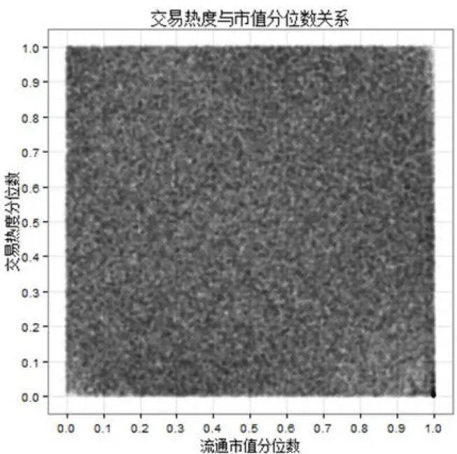
数据来源：wind 数据库，东方证券研究所

图 2：
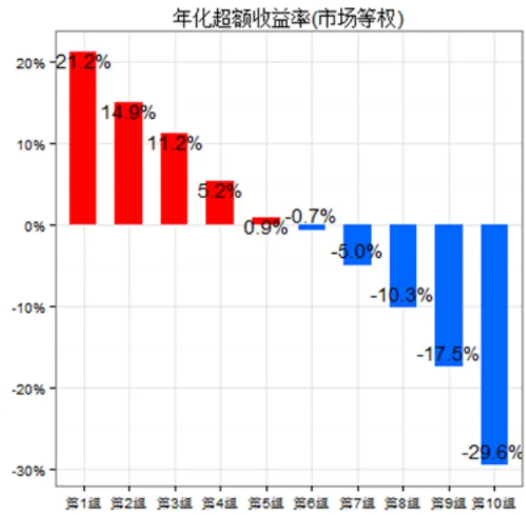
数据来源：wind 数据库，东方证券研究所

为了考察交易热度指标预测股票收益的有效性性，我们基于 2005 年 1月至 2015 年 11月的月度数据计算四个交易行为类指标和交易热度信息系数 IC（经横截面标准化处理）。无论是从pearson 线性相关系数还是 spearman 秩相关系数的角度，交易热度预测收益的能力强于任何单一的交易行为类指标，交易热度与次月收益率的 spearman 秩相关系数更是高达-0.118，IC 系数相当之高。

表 1：交易行为类指标及交易热度信息系数

| 特质波动率 特异度 价格时滞 市值调整换手 交易热度 |  |  |  |  |  |
| --- | --- | --- | --- | --- | --- |
| pearson | -0.064 | -0.071 | -0.049 | -0.074 | -0.092 |
| spearman | -0.088 | -0.089 | -0.057 | -0.098 | -0.118 |

数据来源：wind 数据库，东方证券研究所

基于交易热度的分组表现也显示交易热度低的股票意味着未来更高的超额收益。（我们的回撤期同样从 2005 年 1 月开始，每月月底将全部 A 股（剔除不满 6 个月的新股、ST、*ST 股票）按交易热度大小依次分为 10组（最小的为第 1组），基准为市场等权组合。）交易热度最小的一个组合相对市场等权年化超额收益高达 21.2%，各分组超额收益单调性明显。从各分组的其他业绩评价指标也验证了个股的交易热度越低、未来的超额收益平均意义上更大。

表 2：交易热度分组业绩评价指标

| 年化收益率 年化超额收益 夏普比 信息比 月胜率 最大回撤 月均换手 |  |  |  |  |  |  |  |  |
| --- | --- | --- | --- | --- | --- | --- | --- | --- |
| 中证全指 | 16.6% | -12.0% |  | 0.63 | -0.90 | 39.7% | 71.5% |  |
| 市场等权(基准) | 28.6% | 0.0% |  | 0.86 |  |  | 70.5% | 4.5% |
| 第1组 | 49.8% | 21.2 | % | 1.28 | 2.25 | 71.8% | 63.0% | 72.0% |
| 第2组 | 43.5% | 14 | .% | 1.16 | 2.24 | 79.4% | 65.7% | 84.8% |
| 第3组 | 39.8% | 11. | 2% | 1.07 | 1.98 | 73.3% | 67.1% | 87.7% |
| 第4组 | 33.8% | 5.2 | % | 0.97 | 1.10 | 64.9% | 69.9% | 88.8% |
| 第5组 | 29.5% | 0.9 | % | 0.88 | 0.22 | 51.1% | 72.0% | 89.2% |
| 第6组 | 27.9% | -0. | % | 0.84 | -0.04 | 50.4% | 71.1% | 89.3% |
| 第7组 | 23.6% | -5 | % | 0.74 | -0.81 | 42.0% | 72.3% | 88.9% |
| 第8组 | 18.3% | -10. | 3% | 0.63 | -1.42 | 40.5% | 74.0% | 87.7% |
| 第9组 | 11.1% | -17.5 | % | 0.47 | -2.35 | 16.8% | 75.1% | 85.8% |
| 第10组 | -1.0% | -29. | 6% | 0.17 | -2.99 | 16.8% | 82.4% | 76.4% |

数据来源：wind 数据库，东方证券研究所

从 2005 年以来交易热度指标的历史表现来看，交易热度表现也较为稳健，各月的信息系数（spearman）正显著比例仅 5.3%，负显著比例高达 79.4%，低交易热度组合（第 1组）80.9%的概率跑赢高交易热度组合（第 10组），2005年以来最大回撤 16.5%，2014年底无回撤。

图 3：交易热度历史表现回撤
各月份秩相关系数(均值-0.12.正显著比率:5.3%，负显著比率:79.4%)
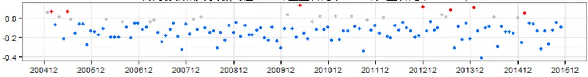

多空组合各月度收益(均值:3.01%胜率:80.9%)
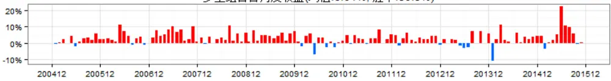

多空组合净值曲线
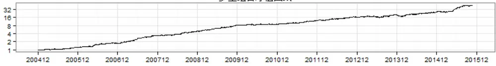

多空组合历史回撤(最大回撤：-16.54%)
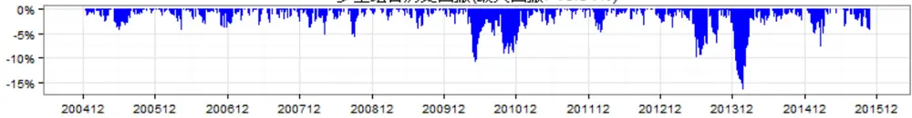
数据来源：wind 数据库，东方证券研究所

本篇报告为了展示交易行为类指标应用于指数增强的效果，初步引入了交易热度的概念。关于交易热度更多的详细信息请参考我们后期的专题研究《投机、交易行为与股票收益（中）》。

## 指数增强组合

交易热度低的股票意味着未来高的超额收益，相反，交易热度高的股票未来回调的概率更大。因此我们可以通过买入低交易热度的股票实现指数的增强。关于指数增强的细节，有以下几点需要说明：

（1）指数增强组合每月月底调仓；

（2） 指数增强组合各行业间（申万 1 级）按指数内各行业权重加权，行业内等权；

（3） 买入交易成本 1.8‰（佣金 0.8‰ + 冲击成本 1.0‰），卖出交易成本 2.8‰（佣金0.8‰ + 印花税 1.0‰ + 冲击成本 1.0‰）

（4）成分股内增强组合选股限定于指数当期的成分股，取各行业交易热度最低的 30%股票，全市场增强组合选股基于全市场（剔除上市不满 6个月的新股，ST、*ST股票），取各行业交易热度最低的 10%股票。

（5） 回撤时间：沪深 300，2005 年 5 月-2015 年 11 月；中证 500，2007 年 2 月-2015年 11 月

## 沪深 300 增强

无论是在成分股内，还是全市场，考虑交易费用后交易热度仍有一定的增强效果（成分股内7.4%，全市场 20.8%），但对冲组合的回撤总体较高，尤其是 2007 年以前（成分股内 9.00%，全市场 23.4%）以及去年年底(成分股内 5.6%,全市场 18.1%)。

沪深 300 增强组合风险较大的原因主要有两方面：1.投机交易的周期与交易热度的度量周期不匹配（关于交易周期，我们将在专题研究《投机、交易行为与股票收益（中）》中展开讨论）；2.行业内等权的加权方法使得增强组合对市值因子的风险敞口加大（尤其基于全市场的增强组合），因此大票表现强劲时增强组合会有回撤。

表 3：沪深 300增强组合各年度表现
成分股内增强

| 沪深300 |  | 年化收益率日胜率 信息比 最大回撤 月均换手增强组合 对冲组合 |  |  |  |  |  |
| --- | --- | --- | --- | --- | --- | --- | --- |
| 200505至今 | 13.5% | 22.0% | 7.4% | 55.0% | 1.32 | -9.0% | 47% |
| 2005年 | -1.4% | 0.7% | 2.0% | 53.9% | 0.34 | -9.0% | 48% |
| 2006年 | 122.5% | 123.4% | -0.3% | 49.4% | -0.01 | -8.3% | 52% |
| 2007年 | 162.6% | 196.3% | 14.3% | 54.1% | 1.99 | -6.5% | 53% |
| 2008年 | -65.5% | -60.8% | 13.2% | 61.0% | 1.74 | -7.0% | 46% |
| 2009年 | 96.2% | 122.2% | 13.8% | 61.1% | 2.84 | -3.1% | 49% |
| 2010年 | -12.6% | -7.2% | 6.1% | 56.6% | 1.54 | -2.1% | 44% |
| 2011年 | -24.9% | -24.2% | 1.0% | 51.2% | 0.29 | -3.4% | 42% |
| 2012年 | 7.6% | 8.6% | 1.1% | 50.2% | 0.31 | -3.9% | 44% |
| 2013年 | -7.8% | -2.0% | 6.4% | 52.9% | 1.47 | -3.3% | 43% |
| 2014年 | 51.1% | 55.8% | 2.3% | 54.7% | 0.58 | -5.6% | 45% |
| 2015年 | 1.0% | 26.2% | 23.4% | 60.2% | 3.18 | -4.4% | 45% |

全市场增强

| 沪深300 |  | 年化收益率日胜率 信息比 最大回撤 月均换手增强组合 对冲组合 |  |  |  |  |  |
| --- | --- | --- | --- | --- | --- | --- | --- |
| 200505至今 | 13.5% | 37.9% | 20.8% | 59.0% | 1.90 | -23.4% | 66% |
| 2005年 | -1.4% | 7.7% | 8.6% | 54.5% | 0.82 | -12.4% | 71% |
| 2006年 | 122.5% | 119.7% | -4.1% | 49.8% | -0.28 | -22.2% | 71% |
| 2007年 | 162.6% | 274.3% | 46.7% | 57.9% | 3.12 | -8.1% | 74% |
| 2008年 | -65.5% | -55.8% | 26.6% | 64.2% | 2.18 | -12.3% | 64% |
| 2009年 | 96.2% | 161.4% | 34.7% | 62.3% | 3.46 | -4.9% | 68% |
| 2010年 | -12.6% | 3.3% | 16.9% | 62.0% | 2.42 | -5.4% | 61% |
| 2011年 | -24.9% | -20.9% | 5.5% | 54.1% | 0.91 | -5.3% | 63% |
| 2012年 | 7.6% | 15.9% | 7.3% | 52.7% | 1.04 | -6.0% | 66% |
| 2013年 | -7.8% | 16.2% | 26.1% | 64.3% | 3.46 | -2.4% | 58% |
| 2014年 | 51.1% | 73.5% | 10.4% | 60.8% | 1.04 | -18.1% | 68% |
| 2015年 | 1.0% | 66.9% | 65.7% | 65.6% | 3.19 | -12.4% | 67% |

数据来源：wind 数据库，东方证券研究所

图 4：沪深 300增强组合各月超额收益及历史回撤
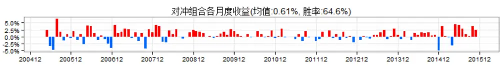

多空组合历史回撤(最大回撤：-9.00%)
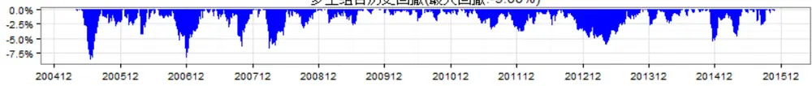

## 全市场增强

对冲组合各月度收益(均值：1.67%，胜率:71.7%)
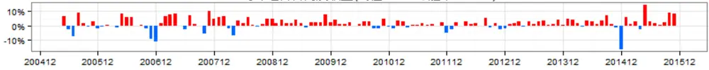

多空组合历史回撤(最大回撤：-23.38%)
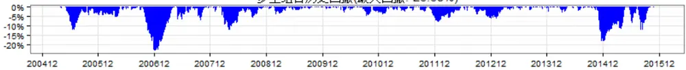
数据来源：wind 数据库，东方证券研究所

## 中证 500 增强

交易热度增强中证 500的效果相当惊人，成分股内增强对冲组合年化收益率 14.2%，回撤仅6.6%，信息比高达 2.60，将选股的范围扩大至全市场后收益明显的增强，对冲组合年化超额收益提升至 25.0%，然而风险并没有增加，对冲组合最大回撤仅 6.9%，对冲组合收益回撤比高达 3.62，信息比高达 3.44，2007 年至今成分股内增强和全市场增强组合每年均跑赢基准中证 500，交易热度单个因子的增强效果可比甚至超过一般的多因子选股模型。

500 增强组合选股范围扩大而风险并没有提升的原因在于：交易热度和市值等因子几乎没有相关性，基于交易热度选股均匀的涵盖大、中、小型股票，所以增强组合对市值因子的风险暴露整体和中证 500指数相当，因此扩大选股范围并没有增大风险暴露。

表 4：中证 500 增强组合各年度表现
成分股内增强

| 中证500 |  | 年化收益率日胜率 信息比增强组合 对冲组合 |  |  |  | 最大回撤 月均换手 |  |
| --- | --- | --- | --- | --- | --- | --- | --- |
| 200702至今 | 15.1% | 31.2% | 14.2% | 58.1% | 2.60 | -6.6% | 53% |
| 2007年 | 149.9% | 212.9% | 25.7% | 59.0% | 4.08 | -1.7% | 57% |
| 2008年 | -60.4% | -51.9% | 19.2% | 59.3% | 3.47 | -3.8% | 52% |
| 2009年 | 130.5% | 191.5% | 28.7% | 64.3% | 5.98 | -1.3% | 57% |
| 2010年 | 10.1% | 18.7% | 8.0% | 57.9% | 1.92 | -2.5% | 55% |
| 2011年 | -33.7% | -27.5% | 8.7% | 58.6% | 2.49 | -1.5% | 52% |
| 2012年 | 0.3% | 5.1% | 4.8% | 52.7% | 1.34 | -2.0% | 49% |
| 2013年 | 17.3% | 21.6% | 4.0% | 52.9% | 0.94 | -3.9% | 50% |
| 2014年 | 38.6% | 48.4% | 7.5% | 56.7% | 1.96 | -2.3% | 52% |
| 2015年 | 43.8% | 79.6% | 26.0% | 61.5% | 2.43 | -6.6% | 55% |

全市场增强

| 中证500 |  | 年化收益率日胜率 信息比 最大回撤月均换手增强组合 对冲组合 |  |  |  |  |  |
| --- | --- | --- | --- | --- | --- | --- | --- |
| 200702至今 | 15.1% | 43.9% | 25.0% | 59.6% | 3.44 | -6.9% | 73% |
| 2007年 | 149.9% | 271.0% | 50.7% | 64.0% | 5.96 | -1.6% | 81% |
| 2008年 | -60.4% | -46.3% | 30.2% | 60.2% | 3.89 | -3.0% | 72% |
| 2009年 | 130.5% | 195.6% | 30.0% | 62.3% | 4.79 | -1.8% | 77% |
| 2010年 | 10.1% | 17.1% | 6.3% | 52.5% | 1.09 | -3.8% | 72% |
| 2011年 | -33.7% | -21.8% | 16.4% | 56.1% | 3.39 | -2.2% | 68% |
| 2012年 | 0.3% | 13.5% | 12.6% | 61.7% | 2.82 | -2.3% | 67% |
| 2013年 | 17.3% | 35.7% | 15.9% | 54.6% | 2.94 | -3.8% | 71% |
| 2014年 | 38.6% | 64.4% | 19.3% | 62.0% | 3.54 | -5.8% | 71% |
| 2015年 | 43.8% | 121.2% | 56.6% | 63.3% | 3.81 | -6.9% | 74% |

数据来源：wind 数据库，东方证券研究所

对冲组合各月度收益(均值:1.90%，胜率:82.1%)
图 5：中证 500增强组合各月超额收益及历史回撤
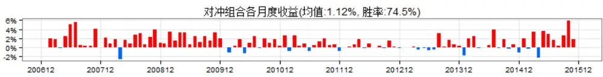

多空组合历史回撤(最大回撤：-6.64%)
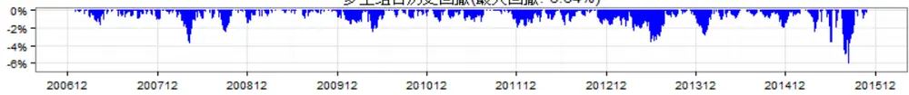

## 全市场增强

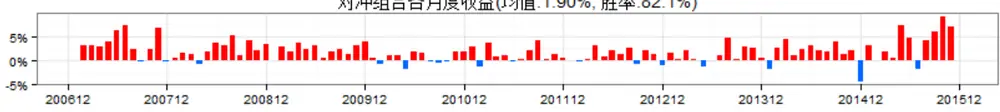

多空组合历史回撤(最大回撤：-6.93%)
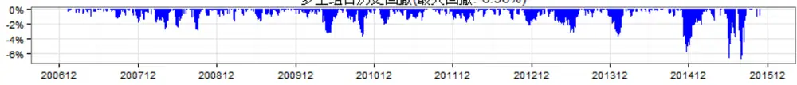
数据来源：wind 数据库，东方证券研究所

## 风险提示

交易热度的表现和指数增强效果基于历史回撤，如果未来市场结构发生重大变化，交易热度的有效性可能减弱甚至丧失。

## 分析师申明

每位负责撰写本研究报告全部或部分内容的研究分析师在此作以下声明：

分析师在本报告中对所提及的证券或发行人发表的任何建议和观点均准确地反映了其个人对该证券或发行人的看法和判断；分析师薪酬的任何组成部分无论是在过去、现在及将来，均与其在本研究报告中所表述的具体建议或观点无任何直接或间接的关系。

## 投资评级和相关定义

报告发布日后的 12个月内的公司的涨跌幅相对同期的上证指数/深证成指的涨跌幅为基准；

## 公司投资评级的量化标准

买入：相对强于市场基准指数收益率15%以上；

增持：相对强于市场基准指数收益率5%～15%；

中性：相对于市场基准指数收益率在-5%～+5%之间波动；

减持：相对弱于市场基准指数收益率在-5%以下。

未评级——由于在报告发出之时该股票不在本公司研究覆盖范围内，分析师基于当时对该股票的研究状况，未给予投资评级相关信息。

暂停评级——根据监管制度及本公司相关规定，研究报告发布之时该投资对象可能与本公司存在潜在的利益冲突情形；亦或是研究报告发布当时该股票的价值和价格分析存在重大不确定性，缺乏足够的研究依据支持分析师给出明确投资评级；分析师在上述情况下暂停对该股票给予投资评级等信息，投资者需要注意在此报告发布之前曾给予该股票的投资评级、盈利预测及目标价格等信息不再有效。

## 行业投资评级的量化标准：

看好：相对强于市场基准指数收益率5%以上；

中性：相对于市场基准指数收益率在-5%～+5%之间波动；

看淡：相对于市场基准指数收益率在-5%以下。

未评级：由于在报告发出之时该行业不在本公司研究覆盖范围内，分析师基于当时对该行业的研究状况，未给予投资评级等相关信息。

暂停评级：由于研究报告发布当时该行业的投资价值分析存在重大不确定性，缺乏足够的研究依据支持分析师给出明确行业投资评级；分析师在上述情况下暂停对该行业给予投资评级信息，投资者需要注意在此报告发布之前曾给予该行业的投资评级信息不再有效。

## 免责声明

本证券研究报告（以下简称“本报告”）由东方证券股份有限公司（以下简称“本公司”）制作及发布。

本报告仅供本公司的客户使用。本公司不会因接收人收到本报告而视其为本公司的当然客户。本报告的全体接收人应当采取必要措施防止本报告被转发给他人。

本报告是基于本公司认为可靠的且目前已公开的信息撰写，本公司力求但不保证该信息的准确性和完整性，客户也不应该认为该信息是准确和完整的。同时，本公司不保证文中观点或陈述不会发生任何变更，在不同时期，本公司可发出与本报告所载资料、意见及推测不一致的证券研究报告。本公司会适时更新我们的研究，但可能会因某些规定而无法做到。除了一些定期出版的证券研究报告之外，绝大多数证券研究报告是在分析师认为适当的时候不定期地发布。

在任何情况下，本报告中的信息或所表述的意见并不构成对任何人的投资建议，也没有考虑到个别客户特殊的投资目标、财务状况或需求。客户应考虑本报告中的任何意见或建议是否符合其特定状况，若有必要应寻求专家意见。本报告所载的资料、工具、意见及推测只提供给客户作参考之用，并非作为或被视为出售或购买证券或其他投资标的的邀请或向人作出邀请。

本报告中提及的投资价格和价值以及这些投资带来的收入可能会波动。过去的表现并不代表未来的表现，未来的回报也无法保证，投资者可能会损失本金。外汇汇率波动有可能对某些投资的价值或价格或来自这一投资的收入产生不良影响。那些涉及期货、期权及其它衍生工具的交易，因其包括重大的市场风险，因此并不适合所有投资者。

在任何情况下，本公司不对任何人因使用本报告中的任何内容所引致的任何损失负任何责任，投资者自主作出投资决策并自行承担投资风险，任何形式的分享证券投资收益或者分担证券投资损失的书面或口头承诺均为无效。

本报告主要以电子版形式分发，间或也会辅以印刷品形式分发，所有报告版权均归本公司所有。未经本公司事先书面协议授权，任何机构或个人不得以任何形式复制、转发或公开传播本报告的全部或部分内容。不得将报告内容作为诉讼、仲裁、传媒所引用之证明或依据，不得用于营利或用于未经允许的其它用途。

经本公司事先书面协议授权刊载或转发的，被授权机构承担相关刊载或者转发责任。不得对本报告进行任何有悖原意的引用、删节和修改。

提示客户及公众投资者慎重使用未经授权刊载或者转发的本公司证券研究报告，慎重使用公众媒体刊载的证券研究报告。

## 东方证券研究所

地址：上海市中山南路 318 号东方国际金融广场 26 楼

联系人： 王骏飞

电话：021-63325888*1131

传真：021-63326786

网址： www.dfzq.com.cn

Email： wangjunfei@orientsec.com.cn