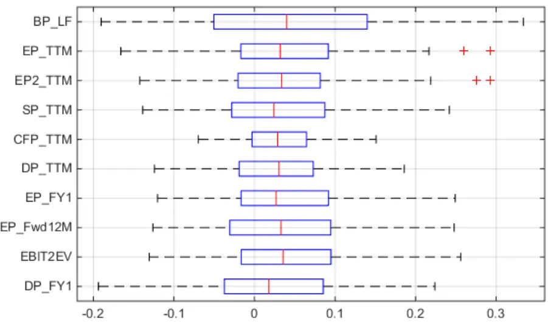
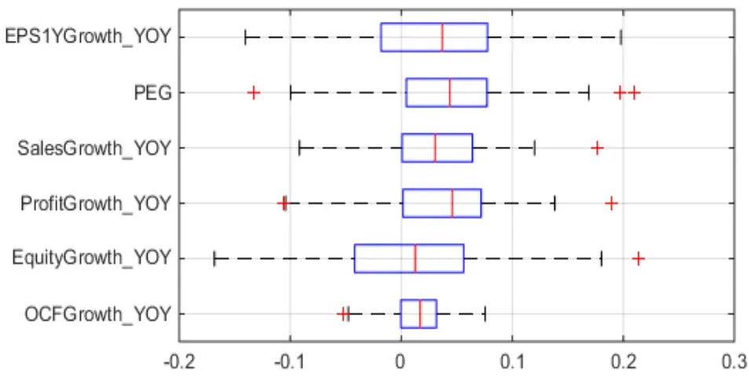
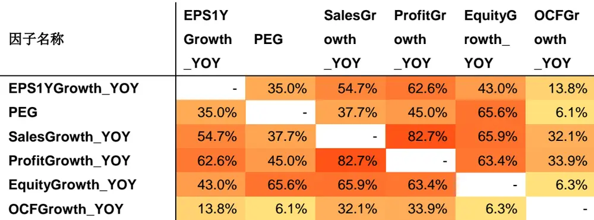
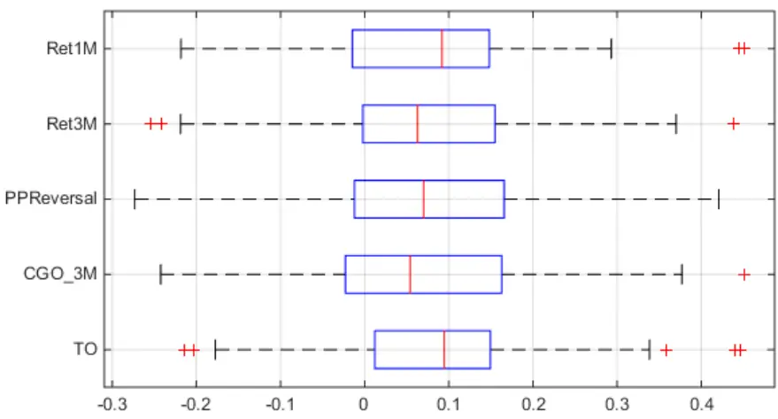
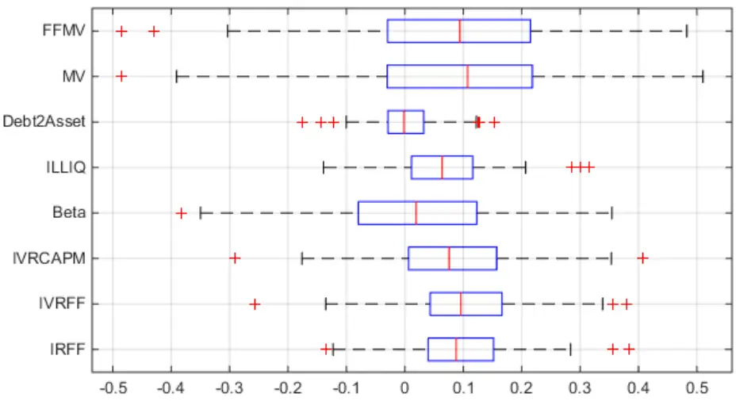
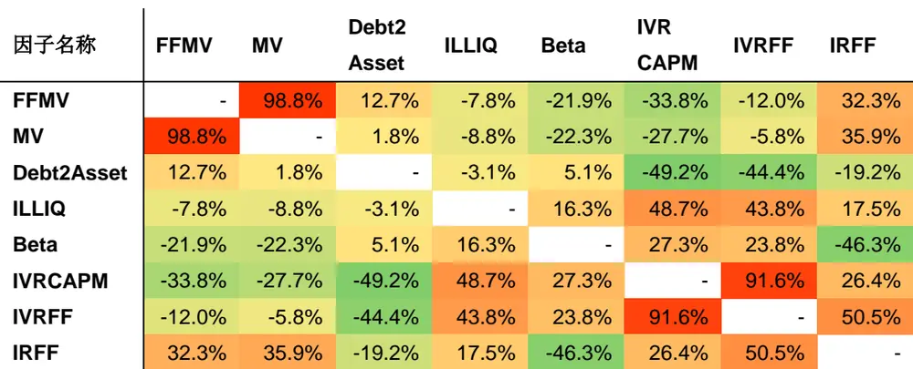

## 研究结论

A 股呈现明显的市值效应和行业效应，不少选股因子的 alpha 也大部分来源于此。如果采用因子的原始数据和股票收益率做相关性检验，选出的股票会明显受到市场风格因素的影响，我们有必要从因子原始数据中剥离这些因素，检验因子是否能贡献行业、风格因素之外的 alpha，本报告用新的方法对估值、成长、技术、风险四类因子过去十年的表现重新做了检验总结，并综合给出了最新的推荐选股因子。

估值类因子能够稳定地提供超额收益，但是高估值股票的负 alpha 普遍要比低估值股票的正 alpha更为显著，呈现出明显的不对称超额收益，在 A股市场缺乏有效的个股做空机制的情况下，难以充分获得估值类因子的 alpha

成长类因子在财务因子中表现最为优异，即使在剔行业和市值的影响以后，成长类因子仍然表现不俗，季度净利润同比增长因子的多空组合夏普比率高达 1.82. 我们同时发现利用总量指标计算的成长因子比利用每股指标计算的成长因子更加适合 A股市场，并且高成长股票的正 alpha普遍要比低成长股票的负 alpha更为显著，使得成长类因子的 alpha更加容易被获取。

技术类因子中反转因子和换手率因子在剔除市值和 Beta 影响后，对收益仍然具有很强的预测能力，月均 Rank IC超过 7%。但是技术因子整体波动较大，换手率高，多空组合的月度最大回撤也普遍较大。这说明技术类指标不适合作为独立的选股指标，应当与其他更为稳健的因子结合使用。

风险因子中，市值、流动性风险和特质风险因子表现突出。市值因子 Rank IC中位数超过 0.1，但也具有十足杀伤力，波动幅度大，多空组合最大回撤高达 25%。流动性风险因子具有独立于市值效应之外的收益预测能力，并且表现稳健，多空组合夏普比率达高 2.13。捕捉股票投机行为的特质风险因子普遍表现稳健，其中特异度因子最为优异，多空组合夏普比高达 2.62，最大回撤 5%.

## 风险提示

- 量化模型结论为统计上的概率事件，并不保证百分之百能获利；

- 模型有失效的风险；

表现较为优异的因子（中证全指内）

| 因子名称 | 因子定义 | 排序 | 行业中性 | 风格中性 |
| --- | --- | --- | --- | --- |
| BP_LF | 最近财报的净资产/总市值 | 降序 | 是 | 是 |
| EBIT2EV | 过去12 个月息税前利润/总市值 | 降序 | 是 | 是 |
| PEG | TTM PE/预测未来2年净利润复合增长率 | 升序 | 是 | 是 |
| ProfitGrowth_YOY | 净利润增长率(季度同比) | 降序 | 是 | 是 |
| PPReversal | 5 日均价/60 日成交均价 | 升序 | 否 | 是 |
| TO | 以流通股本计算的20日日均换手率 | 升序 | 否 | 是 |
| MV | 总市值 | 降序 | 否 | 否 |
| ILLIQ | 每天一个亿成交量能推动的股价涨幅 | 升序 | 否 | 是 |
| IRFF | 1 - Fama-French 回归 R 方 | 降序 | 否 | 否 |

数据来源：Wind 数据库，东方证券研究所

报告发布日期2016 年 02 月 16 日

证券分析师朱剑涛

021-63325888*6077

zhujiantao@orientsec.com.cn

执业证书编号：S0860515060001

联系人雷赟

021-63325888-5091

leiyun@orientsec.com.cn

## 相关报告

| 常用股票行业分类方法的比较 | 2016-01-22 |
| --- | --- |
| 精细过往，探新未来 | 2016-01-07 |
| 基于交易热度的指数增强 | 2015-12-14 |
| 投机、交易行为与股票收益(上） | 2015-12-07 |

## 因子显著性检验的方法

因子有效性检验的时间区间为2006年6月30日到2015年12月31日，为了检验因子的显著性，我们主要考察如下指标：因子Rank IC、Rank IC的 t统计量、IR、IC正显著比例、IC负显著比例、多空组合收益率、多空组合年化波动率、多空组合夏普比以及多空组合最大回撤等绩效指标，

各项指标具体的计算方式可以参考我们之前关于单因子有效性检验的报告。按照因子内在的经济逻辑和构建方法，我们将对估值类、成长类、技术类和风险类因子风别进行因子显著性检验。

## 因子显著性检验的细节如下：

1. 因子检验时间区间为 2006 年 6 月 30 日到 2015 年 12 月 31 日

2. 利用每个月末的中证全指的成分股作为回测的样本空间，避免公司退市带来的生存偏误（survivor ship bias）

3. 对于原始因子值，我们首先采取中位数去极值的方法调整异常值，将原始因子值调整到 3 倍绝对偏离中位数的范围内，然后进行横截面正态标准化处理得到标准化 z-score。

4. 行业中性处理是将标准化 z-score 对行业虚拟变量回归的方法,取回归的残差作为因子值，行业划分采用申万一级行业。风格中性处理则是将标准化 z-score 对市值对数和 beta 进行回归，取回归的残差作为因子值。

5. 对于财务类因子（估值、成长类），我们首先对原始因子值做行业中性化处理，然后作风格中性处理，剔除行业，beta, 市值的影响。

6. 对于技术类因子和部分风险类因子，我们对因子作风格中性处理，剔除 beta 和市值的影响。

7. 组合每个月末进行调仓，利用下个月的收益计算相关绩效指标。

8. 构建组合时，剔除样本空间内的停牌股票，然后按照因子值分为 5 组，构建 5 个等权组合。基准为中证全指的等权组合。

## 估值类因子

低估值股票具备更高的安全边际和预期收益，个股估值水平的高低可以用市盈率、市净率、市现率、市销率等指标度量， 但这些指标并非一直都有效，需用统计方法在这些指标中动态筛选，此项得分高的股票具备更好的估值优势。我们检验的估值类指标包括：

表 1：估值类因子名称及定义

| 因子名称 | 因子定义 | 排序 行业中性 | 风格中性 |
| --- | --- | --- | --- |
| BP_LF | 最近财报的净资产/总市值 | 降序 是 | 是 |
| EP_TTM | 过去12个月的净利润/总市值 | 降序 是 | 是 |
| EP2_TTM | 剔除非经常性损益的过去12个月净利润/总市值 | 降序 是 | 是 |
| SP_TTM | 过去12个月总营业收入/总市值 | 降序 是 | 是 |
| CFP_TTM | 过去12个月经营性现金流/总市值 | 降序 是 | 是 |
| DP_TTM | 过去12个月每股股息/总市值 | 降序 是 | 是 |
| EP_FY1 | 下一财年预测净利润/总市值 | 降序 是 | 是 |

| EP_Fwd12M | 未来12个月预测净利润/总市值 降序 |
| --- | --- |
| EBIT2EV 过去12个月息税前利润/总市值 | 是 是 降序 是 是 |
| DP_FY1 | 下一财年预测每股股息/总市值 降序 是 是 |

数据来源：Wind 数据库，东方证券研究所

表 2：估值类因子绩效指标（因子显著性）

| 因子名称 | RankIC | t(IC) | IR | 正显著率 | 负显著率 | 覆盖率 |
| --- | --- | --- | --- | --- | --- | --- |
| BP_LF | 5.1% | 4.29 | 0.40 | 48% | 28% | 97.4% |
| EP_TTM | 3.5% | 4.55 | 0.43 | 40% | 18% | 96.8% |
| EP2_TTM | 3.5% | 4.62 | 0.43 | 46% | 15% | 96.4% |
| SP_TTM | 2.8% | 4.07 | 0.38 | 39% | 21% | 96.8% |
| CFP_TTM | 2.7% | 6.45 | 0.61 | 36% | 8% | 96.7% |
| DP_TTM | 3.0% | 5.16 | 0.49 | 33% | 7% | 67.9% |
| EP_FY1 | 3.7% | 4.72 | 0.44 | 39% | 17% | 75.8% |
| EP_Fwd12M | 4.0% | 5.01 | 0.47 | 39% | 16% | 74.8% |
| EBIT2EV | 3.9% | 5.20 | 0.49 | 45% | 17% | 95.3% |
| DP_FY1 | 2.8% | 3.68 | 0.35 | 25% | 9% | 31.8% |

数据来源：Wind 数据库，东方证券研究所

首先从表 2 可以看出，估值类因子的在 A 股市场能够持续地提供超额收益，所有因子的 Rank IC的 t 统计量都大于 4，结合图 1 的信息，我们可以得出如下结论：

1. BP_LF因子的 Rank IC平均值和中位值在估值类因子中都排在首位，说明该因子对收益具有较强的预测能力。但是 BP_LF因子的 IR相对较低，从箱型图上也可以看出，BP_LF的 RankIC 分别范围是所有估值因子中最广的，这说明 BP_LF具有较为明显的风险因子特征。

2. 在 EP 类因子中，采用分析师预测净利润的 EP_FY1 和 EP_Fwd12M 因子要比采用历史净利润的 EP_TTM和 EP2_TTM因子具有更高的平均 IC 和更低的 IC 波动率，表现为更高的 IR。这说明在国内市场，分析师预测的净利润的确包含了对未来估值预期的前瞻性信息，并且这些预期在短期内还没有完全反映到股价上。进一步对比 EP_FY1 和 EP_Fwd12M 因子，我们发现 EP_Fwd12M 因子的各项指标均优于 EP_FY1 因子，这说明在综合 FY1 和 FY2 的预测净利润信息比仅采用 FY1的预测净利润信息能够更加充分反映未来 12个月的估值预期，

3. 估值类因子中最为稳定的则是 CFP_TTM因子，其 IR高达 0.61，从箱图上来看其 Rank IC的分布也最为集中，但是其 Rank IC 的均值相对较低，说明现金流对未来收益的预测能力并不十分强，但是现金流相对于收入和净利润更为稳定，不容易受到上市公司的操纵。

4. 采用历史财务数据计算的因子覆盖度普遍较高，除历史股息率因子外其他均在 95%以上。分析师预测的净利润数据覆盖率在 75%左右。而分析师预测的股息数据对样本空间的覆盖率较低，仅在 30%左右。

表 3 展示了估值类因子多空组合（做多等权 Top 组合，做空等权 Bottom 组合）的各项绩效指标。我们可以看到因子多空组合的表现同 Rank IC 表现相对一致。EP_Fwd12M 因子表现优异，夏普比率超过 1. 另外由于财报公布频率较低，估值类因子的换手率普遍较低，Top组合单边换手率均在 20%左右。

图 1：估值类因子 Rank IC 箱形图

数据来源：Wind 数据库，东方证券研究所

表 3：估值类因子绩效指标（多空组合）

| 因子名称 | 年化 收益率 | 年化 波动率 | 夏普比率 | 月胜率 | 最大回撤 | Top 月均 换手率 |
| --- | --- | --- | --- | --- | --- | --- |
| BP_LF | 11.5% | 14.0% | 0.82 | 57% | 19% | 16% |
| EP_TTM | 6.2% | 9.2% | 0.67 | 57% | 16% | 19% |
| EP2_TTM | 6.0% | 9.6% | 0.63 | 56% | 18% | 18% |
| SP_TTM | 6.7% | 8.6% | 0.77 | 53% | 12% | 13% |
| CFP_TTM | 5.3% | 5.1% | 1.03 | 61% | 7% | 19% |
| DP_TTM | 6.9% | 5.9% | 1.18 | 64% | 10% | 19% |
| EP_FY1 | 8.8% | 9.7% | 0.91 | 55% | 12% | 23% |
| EP_Fwd12M | 10.7% | 9.5% | 1.12 | 61% | 9% | 25% |
| EBIT2EV | 7.3% | 9.4% | 0.78 | 57% | 11% | 19% |
| DP_FY1 | 7.0% | 8.4% | 0.83 | 54% | 15% | 27% |

数据来源：Wind 数据库，东方证券研究所

表 4则展示了估值类因子分组组合相对全市场等权组合的超额收益及超额收益的 t统计量。我们将表中95%显著性水平的t统计量予以绿色高亮标注( t>1.65 或 t<-1.65). 综合考察分组超额收益的单调性和每个分组超额收益的显著程度。从表 4 可以看出，估值类因子 Bottom 组合的负 alpha 普遍要比 Top 组合的正 alpha 较为显著，这可能与 A 股市场缺乏有效的个股做空机制有关，综合来看，10 个估值类因子中有 2 个因子能够同时在 Top 和 Bottom 组合提供显著的超额收益，它们分别是 CFP_TTM 和 EBIT2EV. 其中表现最为优异的是 EBIT2EV，它在 Top 端和 Bottom 端的 2 个分组都能提供显著的超额收益， BP_LF因子在 Top组合的超额收益也相对较高，但是 t统计量略低，仅在 90%显著性水平上显著不等于 0.

表 4：估值类因子分组超额收益

| BP_LF EP_TTM | Top | 2 | 3 | 4 | Bottom |
| --- | --- | --- | --- | --- | --- |
|  | 3.9% | 3.3% | 0.2% | -3.5% | -7.6% |
|  | 1.50 | 2.60 | 0.16 | -1.73 | -3.28 |
|  | 2.3% | 1.8% | -0.6% | -3.2% | -3.8% |
| EP2_TTM | 1.21 | 1.16 | -0.33 | -1.81 | -1.98 |
|  | 2.5% | 1.9% | -0.1% | -4.2% | -3.5% |
| SP_TTM | 1.33 | 1.21 | -0.05 | -2.48 | -1.67 |
|  | 2.0% | 0.8% | 0.1% | -1.9% | -4.6% |
| CFP_TTM | 1.11 | 0.84 | 0.06 | -0.93 | -2.62 |
|  | 2.6% | 1.5% | -1.5% | -3.5% | -2.7% |
| DP_TTM | 1.66 | 1.55 | -0.72 | -1.82 | -1.74 |
|  | 0.9% | 0.4% | -0.7% | -2.6% | -6.1% |
|  | 0.55 | 0.28 | -0.39 | -1.29 | -3.90 |
| EP_FY1 | 2.3% | 1.8% | -2.4% | -2.8% | -6.4% |
|  | 1.08 | 1.06 | -1.00 | -1.27 | -3.50 |
| EP_Fwd12M | 2.6% | 1.7% | -1.9% | -2.4% | -8.2% |
|  | 1.18 | 0.96 | -0.80 | -1.08 | -4.61 |
| EBIT2EV | 2.9% | 1.9% | -0.1% | -3.2% | -4.4% |
|  | 1.69 | 1.53 | -0.07 | -1.67 | -2.21 |
| DP_FY1 | -1.0% | -1.6% | -3.1% | -3.9% | -8.0% |
|  | -0.31 | -0.52 | -0.94 | -1.11 | -3.06 |

数据来源：Wind 数据库，东方证券研究所

最后，我们关心这些不同的估值因子之间的相互关系。这里我们考察的是不同因子历史 Rank IC的时间序列线性相关系数。相比于因子值之间的秩相关系数，IC 相关系数能够提供如下的信息：当基于净利润的估值因子能够获得正的超额收益时，基于股息率或者净资产的估值因子能否也获得正的超额收益。这是构建多因子模型时我们最为关注的因素。较低的 IC 相关系数表明，在一类因子表现不佳时，另一类因子仍然能够获得正的超额收益，这样可以大幅提高多因子模型的稳定程度。通过表5可以看出，采用分析师预测数据计算的因子和采用对应历史数据计算的因子相关性较高，如 EP_TTM 因子和 EP_FY1、EP_Fwd12M，EBIT2EV 因子 IC 相关系数都在 0.9 左右， BP_LF因子和基于利润的估值因子相关性普遍较低，均在 0.3以下。另一方面，BP_LF因子和基于收入、股息或现金流的估值因子相关性普遍较高，均在 0.5 以上。这说明结合 BP_LF 因子和 EBIT2EV因子能够获得较好的分散效果。

表 5：估值类因子的 IC相关系数

| 因子名称 | EP_BP_LFTTM TTM TTM TTM |  |  |  |  | EP2_SP_ |  | CFP_ | DP_ EP_ EP_ DP_EBIT2EVTTM FY1 Fwd12M FY1 |  |
| --- | --- | --- | --- | --- | --- | --- | --- | --- | --- | --- |
| BP_LF |  | 9.1% | -5.4% | 83.4% | 50.4% | 61.6% | 23.3% 21.5% |  | 25.6% | 60.0% |
| EP_TTM | 9.1% |  | 96.8% | 28.2% | 44.6% | 49.0% | 91.6% | 89.6% | 96.1% | 48.5% |
| EP2_TTM | -5.4% | 96.8% |  | 12.4% | 39.0% | 40.0% | 86.7% | 84.9% | 89.9% | 37.0% |
| SP_TTM | 83.4% | 28.2% | 12.4% |  | 67.7% | 69.5% | 44.0% | 41.0% | 46.1% | 74.0% |
| CFP_TTM | 50.4% | 44.6% | 39.0% | 67.7% |  | 58.5% | 51.4% | 48.9% | 56.3% | 63.1% |
| DP_TTM | 61.6% | 49.0% | 40.0% | 69.5% | 58.5% |  | 55.1% | 51.2% | 55.1% | 74.2% |
| EP_FY1 | 23.3% | 91.6% | 86.7% | 44.0% | 51.4% | 55.1% |  | 98.8% | 91.8% | 63.3% |
| EP_Fwd12M | 21.5% | 89.6% | 84.9% | 41.0% | 48.9% | 51.2% | 98.8% |  | 89.3% | 60.4% |
| EBIT2EV | 25.6% | 96.1% | 89.9% | 46.1% | 56.3% | 55.1% | 91.8% | 89.3% |  | 57.8% |
| DP_FY1 | 60.0% | 48.5% | 37.0% | 74.0% | 63.1% | 74.2% | 63.3% | 60.4% | 57.8% |  |

数据来源：Wind 数据库，东方证券研究所

## 成长类因子

高成长性的股票更容易获得市场溢价，个股成长性得分根据上市公司收入增长率、利润增长率等财务指标，结合公司营运能力分析综合计算而得。我们检验的估值类指标包括：

表 6：成长类因子名称及定义

| 因子名称 | 因子定义 | 排序 | 行业中性 | 风格中性 |
| --- | --- | --- | --- | --- |
| EPS1YGrowth_YOY | 历史同比 EPS 增长率 | 降序 | 是 | 是 |
| PEG | TTM PE/预测未来 2年净利润复合增长率 | 升序 | 是 | 是 |
| SalesGrowth_YOY | 主营业务收入增长率(季度同比） | 降序 | 是 | 是 |
| ProfitGrowth_YOY | 净利润增长率 (季度同比) | 降序 | 是 | 是 |
| EquityGrowth_YOY | 净资产增长率 (季度同比) | 降序 | 是 | 是 |
| OCFGrowth_YOY | 经营现金流增长率（季度同比） | 降序 | 是 | 是 |

数据来源：Wind 数据库，东方证券研究所

表 7：成长类因子绩效指标（因子显著性）

| 因子名称 | RankIC | t(IC) | IR | 正显著率 | 负显著率 | 覆盖率 |
| --- | --- | --- | --- | --- | --- | --- |
| EPS1YGrowth_YOY | 3.5% | 4.05 | 0.38 | 45% | 16% | 82.3% |
| PEG | -4.2% | -7.07 | -0.66 | 8% | 46% | 75.1% |
| SalesGrowth_YOY | 2.9% | 6.23 | 0.59 | 40% | 11% | 96.5% |
| ProfitGrowth_YOY | 3.7% | 7.39 | 0.70 | 50% | 9% | 96.6% |
| EquityGrowth_YOY | 1.0% | 1.52 | 0.14 | 31% | 25% | 95.5% |
| OCFGrowth_YOY | 1.4% | 5.78 | 0.54 | 10% | 4% | 96.5% |

数据来源：Wind 数据库，东方证券研究所

图 2：成长类因子 Rank IC 箱形图

数据来源：Wind 数据库，东方证券研究所

从表 7可以看出，成长类因子表现普遍较好，其中净利润同比增长率和 PEG的 IR都超过 0.6。净资产增长率则表现最差。结合图 2和表 8的信息，我们可以得出以下结论：

1. ProfitGrowth_YOY因子和EPS1Ygrowth_YOY因子捕捉的都是公司净利润的短期历史增长情况，唯一的区别是 ProfitGrowth_YOY 计算的是总量的增长，而 EPS1Ygrowth_YOY 计算的是每股收益的增长，但是从表7和图 2可以看出，ProfitGrowth_YOY因子在各方面明显优于EPS1Ygrowth_YOY 因子。正常来说，每股净利润增长率更能合理地反映公司的成长性，因为公司增发后现金流量和净利润会自然增加，但是这与公司的成长性不一定有直接关系。我国股市存在较为特殊的情况，高成长的上市公司经常会送转股份，送转股份导致每股收益被摊薄，进而使得每股收益的增长率并不能反映真实的成长性，所以总量增长指标比每股增长指标更加适合目前的中国市场情况。

2. PEG 因子则结合了公司的估值水平和未来的预期增长率，也取得非常不错的表现，其因子Rank IC高达 0.66，多空组合夏普比率高达 1.48。由于计算 PEG 时需要剔除 PE为负数的公司，同时采用了分析师预测的未来年化复合增长率，使得该因子的覆盖率相对较低，为 75%

3. CFP_TTM因子较为稳定，从箱图上来看其 Rank IC的分布也最为集中，但是其 Rank IC的均值仅为 1.4%，说明现金流的增长虽然相对稳定，但是对未来收益的预测能力较弱，

4. 成长类因子与估值类因子相类似，换手率普遍较低，Top 组合的月均换手率都在 20%左右。

与估值因子不同的是，成长类因子Top组合的正alpha普遍要比Bottom组合的负alpha更为显著，综合来看，除 EquityGrowth_YOY 因子外，其他成长类因子都能够同时在 Top 和 Bottom 组合提供显著的超额收益，其中表现最为优异的是 ProfitGrowth_YOY，它在 Top 端和 Bottom 端的 4 个分组都能提供显著的超额收益，并且 Top 分组超额收益的均值和 t 统计量都表现优异，而EPS1Ygrowth_YOY 因子虽然在 Top 分组的超额收益较高，但是整体缺乏单调性，而且超额收益的显著性也不敌 ProfitGrowth_YOY 因子。

值得思考的是净资产增长率因子EquityGrowth_YOY在Top和Bottom端都表现为负的超额收益，而在第 3 组表现为显著的正超额收益，呈现出明显的非线性特征。这种现象并非中国所独有，它同公司治理中的代理问题(agency problem)相关。具体而言，EquityGrowth_YOY 因子的 Top 组合代表的则是净资产扩张速度非常快的公司，管理层通常能够从规模过度扩张中获得更大的权威感和经济利益，然而这可能损害股东权益，使公司背上沉重的债务，造成经营困难。反过来，公司如果投资不足也会使公司丧失行业竞争优势和未来的成长潜力，这同样也会损害股东权益。这就反映在Bottom 组合也表现为负的超额收益。而最好的那些公司则处于这两个极端的中间，它们的净资产扩张相对稳健。但是如何持续稳定地捕捉这些公司不是一件容易的事情，目前有一些处理方法可以在一定程度上解决非线性的问题，具体可以参考 Qian,E, Hua,R., and Eric.S. (2007).

表 8：成长类因子绩效指标（多空组合）

| 因子名称 | 年化 收益率 | 年化 波动率 | 夏普比率 | 月胜率 | 最大回撤 | Top 月均换手率 |
| --- | --- | --- | --- | --- | --- | --- |
| EPS1YGrowth_YOY | 11.1% | 10.9% | 1.02 | 66% | 12% | 24% |
| PEG | 10.9% | 7.3% | 1.48 | 68% | 14% | 25% |
| SalesGrowth_YOY | 8.4% | 6.1% | 1.38 | 69% | 6% | 24% |
| ProfitGrowth_YOY | 11.0% | 6.1% | 1.82 | 75% | 4% | 27% |
| EquityGrowth_YOY | -0.7% | 9.6% | -0.08 | 52% | 23% | 18% |
| OCFGrowth_YOY | 4.7% | 3.3% | 1.40 | 68% | 7% | 24% |

数据来源：Wind 数据库，东方证券研究所

表 9：成长类因子分组超额收益

| EPS1YGrowth_YOY | Top | 2 | 3 | 4 | Bottom |
| --- | --- | --- | --- | --- | --- |
|  | 6.9% | -0.1% | -4.2% | -2.3% | -4.2% |
|  | 3.31 | -0.04 | -2.18 | -1.24 | -1.76 |
| PEG | 5.6% | 1.6% | -1.5% | -4.9% | -5.3% |
|  | 3.46 | 0.91 | -0.77 | -2.71 | -3.38 |
|  | 4.2% | 2.2% | -1.6% | -4.3% | -4.3% |
| ProfitGrowth_YOY | 2.48 | 1.59 | -1.53 | -4.52 | -3.15 |
|  | 5.8% | 3.0% | -1.4% | -5.8% | -5.2% |
|  | 4.18 | 1.99 | -1.01 | -5.14 | -3.31 |
| EquityGrowth_YOY | -3.5% | 0.9% | 3.3% | -0.7% | -2.7% |
| OCFGrowth_YOY | -1.73 | 0.62 | 2.62 | -0.52 | -1.62 |
|  | 2.3% | 0.8% | -2.2% | -1.9% | -2.4% |
|  | 2.22 | 0.68 | -2.13 | -1.96 | -1.76 |

数据来源：Wind 数据库，东方证券研究所

表 10：成长类因子的 IC 相关系数

数据来源：Wind 数据库，东方证券研究所

最后，通过表 5 可以看出，成长类因子之间相关性最高的 SalesGrowth_YOY 和 ProfitGrowth_YOY因子，高达 0.827. 因为公司的净利润增长同营业收入增长通常是高度正相关的。其他成长类因子相关性则普遍较低。综合考虑，结合 ProfitGrowth_YOY 因子和 PEG 因子能够在获取较高的超额收益的同时取得较好的分散效果。

## 技术类因子

个股技术形态反映了资金强弱、市场情绪高低等公司价值之外的信息，直接影响二级市场投资收益。该指标根据一些技术因子指标，如：换手率、反转因子等，定量描述个股在技术形态上的强弱。从我们之前的研究可以得知，技术类指标普遍有风格倾向，比如小盘股比大盘股更容易反转，而大盘股比小盘股的换手率通常更低，因此我们对技术类因子作了风格中性处理，剔除市值和 beta 对因子的影响。我们检验的技术类指标包括：

表 11：技术类因子名称及定义

| 因子名称 | 因子定义 排序 | 行业中性 | 风格中性 |
| --- | --- | --- | --- |
| Ret1M | 20 日收益 | 升序 否 | 是 |
| Ret3M | 60 日收益 | 升序 否 | 是 |
| PPReversal | 5 日均价/60 日成交均价 | 升序 否 | 是 |
| CGO_3M | Capital Gains Overhang 处置效应 | 升序 否 | 是 |
| TO | 以流通股本计算的 20日日均换手率 | 升序 否 | 是 |

数据来源：Wind 数据库，东方证券研究所

表 12：技术类因子绩效指标（因子显著性）

| 因子名称 | RanklC | t(IC) | IR | 正显著率 | 负显著率 | 覆盖率 |
| --- | --- | --- | --- | --- | --- | --- |
| Ret1M | -7.3% | -6.37 | -0.60 | 20% | 67% | 99.2% |
| Ret3M | -7.5% | -6.15 | -0.58 | 14% | 58% | 99.2% |
| PPReversal | -7.4% | -5.85 | -0.55 | 17% | 57% | 91.2% |
| CGO_3M | -7.0% | -5.42 | -0.51 | 22% | 55% | 99.2% |
| TO | -8.6% | -7.60 | -0.71 | 15% | 68% | 97.2% |

数据来源：Wind 数据库，东方证券研究所

从表 12可以看到，技术类因子表现非常突出，所有因子的 Rank IC都在 7%以上，换手率因子 TO的 IR超过 0.7。而另一方面，众多研究已证明我国市场不存在显著的中长期动量效应，如高秋民，胡聪慧，燕翔(2014)。 这说明我国市场上投资者倾向于对各种利好和利空消息作出过度反应，并且普遍存在追涨杀跌心理，导致股票经常出现超买和超卖的现象，而反转因子捕捉的就是股价最终回归其基本价值过程中的收益。

但是需要注意的是，技术类因子整体波动较大，表现为 Rank IC 的分布较为分散，同时多空组合的月度最大回撤也普遍较大。这说明技术类指标不适合作为独立的选股指标，应当与其他更为稳健且的因子结合使用。

图 3：技术类因子 Rank IC 箱形图

数据来源：Wind 数据库，东方证券研究所

表 13：技术类因子绩效指标（多空组合）

| 因子名称 | 年化 收益率 | 年化 波动率 | 夏普比率 | 月胜率 | 最大回撤 | Top 月均 换手率 |
| --- | --- | --- | --- | --- | --- | --- |
| Ret1M | 17.6% | 14.0% | 1.26 | 65% | 11% | 83% |
| Ret3M | 16.7% | 15.6% | 1.07 | 63% | 20% | 54% |
| PPReversal | 18.3% | 14.7% | 1.25 | 61% | 21% | 63% |
| CGO_3M | 14.3% | 15.3% | 0.94 | 61% | 19% | 65% |
| TO | 23.1% | 14.2% | 1.62 | 70% | 17% | 40% |

数据来源：Wind 数据库，东方证券研究所

从表 13 可以看出，技术类因子 Bottom 组合的负 alpha 普遍要比 Top 组合的正 alpha 更为显著，综合来看，几乎所有技术类因子都能够同时在 Top和 Bottom组合提供显著的超额收益，换手率因子 TO 在 Top 端表现最为优异，月度超额收益达到 9.6%，t 统计量超过 4. 而在几个反转指标中，PPReversal 因子具有更好的单调性和更高的正端超额收益。PPReversal 因子是我们结合成交价格和成交量构造的历史持仓成本偏离度指标，该指标值越低，表示短期均价相对于长期均价越低；当该指标值过低时，我们认为出现了“超跌”，股价短期出现反转的概率较高。具体可以参考我们之前的相关报告。

另外由于计算技术指标的价格和成交量更新频率高，使得技术类因子的Top组合换手率非常之高，Ret1M因子的 Top组合月均换手率高达 83%。虽然 Ret1M比 Ret3M因子的多空组合年化收益率稍高，但是代价是换手率增加了 29%，在扣除实际交易成本后，Ret1M 因子的收益率会受到较大影响。这也提醒我们在构建多因子模型时，应当适当控制这类高换手率因子的权重。

表 14：技术类因子分组超额收益

| Ret1M | Top | 2 | 3 | 4 | Bottom |
| --- | --- | --- | --- | --- | --- |
|  | 4.7% | 5.5% | 3.0% | -4.0% | -12.9% |
|  | 1.87 | 4.00 | 2.50 | -2.61 | -4.60 |
| Ret3M | 5.5% | 4.2% | 2.3% | -4.4% | -11.2% |
|  | 2.06 | 2.69 | 2.04 | -2.57 | -3.58 |
| PPReversal | 5.8% | 4.6% | 1.5% | -4.0% | -12.4% |
|  | 2.23 | 2.94 | 1.20 | -2.54 | -4.35 |
| CGO_3M | 3.3% | 4.0% | 2.9% | -2.7% | -11.1% |
|  | 1.19 | 2.75 | 2.45 | -1.79 | -3.75 |
| TO | 9.6% | 3.0% | 0.1% | -2.8% | -13.5% |
|  | 4.56 | 2.56 | 0.11 | -1.69 | -4.40 |

数据来源：Wind 数据库，东方证券研究所

表 15：技术类因子的 IC相关系数

| 因子名称 | Ret1M | Ret3M | PPReversal | CGO_3M | TO | MV |
| --- | --- | --- | --- | --- | --- | --- |
| Ret1M |  | 64.0% | 82.4% | 85.4% | 26.2% | 13.9% |
| Ret3M | 64.0% |  | 87.1% | 72.9% | 36.6% | 14.2% |
| PPReversal | 82.4% | 87.1% |  | 83.8% | 37.4% | 18.0% |
| CGO_3M | 85.4% | 72.9% | 83.8% |  | 13.2% | 26.7% |
| TO | 26.2% | 36.6% | 37.4% | 13.2% |  | -22.7% |
| MV | 13.9% | 14.2% | 18.0% | 26.7% | -22.7% |  |

数据来源：Wind 数据库，东方证券研究所

最后，从表 15 可以看出，各个反转因子之间的相关系数普遍较高，均在 0.6 到 0.9 之间。但是换手率因子同其他技术类因子相关性普遍较低，均在 0.4 以下。另外，经过风格中性处理以后，各技术类因子同市值因子的 IC 相关系数都非常低，全部都在 0.3 以下，说明处理后的技术类因子对市值没有明显的偏好, 提供了独立于市值效应之外的超额收益，综合来看，结合 PPRevesal 和 TO因子是较优的选择，

## 风险类因子

风险类因子则涵盖了不同的风险类型,包括：财务风险，流动性风险，市场风险，特质风险等。我们检验了如下的风险类指标：

表 16：风险类因子名称及定义

| 因子名称 | 因子定义 | 排序 | 行业中性 | 风格中性 |
| --- | --- | --- | --- | --- |
| FFMV | 流通市值 | 降序 | 否 | 否 |
| MV | 总市值 | 降序 | 否 | 否 |
| Debt2Asset | 债务资产比例 | 降序 | 是 | 是 |
| ILLIQ | 每天一个亿成交量能推动的股价涨幅 | 升序 | 否 | 是 |
| Beta | 12个月对全市场指数滚动回归 | 降序 | 否 | 否 |
| IVRCAPM | CAPM 回归残差波动率 | 降序 | 否 | 否 |
| IVRFF | Fama-French 回归残差波动率 | 降序 | 否 | 否 |
| IRFF | 1 - Fama-French 回归 R 方 | 降序 | 否 | 否 |

数据来源：Wind 数据库，东方证券研究所

表 17：风险类因子绩效指标（因子显著性）

| 因子名称 | RanklC | t(IC) | IR | 正显著率 | 负显著率 | 覆盖率 |
| --- | --- | --- | --- | --- | --- | --- |
| FFMV | -7.7% | -4.57 | -0.43 | 21% | 58% | 99.2% |
| MV | -8.2% | -4.74 | -0.45 | 21% | 61% | 99.2% |
| Debt2Asset | -0.2% | -0.46 | -0.04 | 19% | 23% | 97.5% |
| ILLIQ | 6.3% | 7.57 | 0.71 | 64% | 14% | 95.0% |
| Beta | -1.5% | -1.00 | -0.09 | 32% | 44% | 88.9% |
| IVRCAPM | -7.8% | -6.61 | -0.62 | 17% | 62% | 97.7% |
| IVRFF | -9.6% | -9.24 | -0.87 | 11% | 75% | 97.7% |
| IRFF | -9.5% | -11.01 | -1.04 | 4% | 75% | 97.7% |

数据来源：Wind 数据库，东方证券研究所

从表 17 可以看出，风险类因子的总体表现非常抢眼，特质波动率和特异度的 Rank IC 超过 9%，特异度因子的 IR更是超过 1，

结合图 4和表 18， 我们可以得出以下结论：

1. 市值因子 MV 和流通市值因子 FFMV 的 Rank IC 都超过 7%，显示出了非常强的收益预测能力。同时负显著率明显高于正显著率，这也说明小盘股票在大部分时候都跑赢了大盘股。但是市值因子呈现出非常大的波动性，从图 4中可以看出，MV 因子 Rank IC的左边缘一直延续到了-0.4，右边缘延续到了 0.5. 这说明虽然小盘股在多数时候跑赢大盘股，但是偶尔一些时候小盘股显著跑输大盘股，并且有着相当大的负超额收益。这从表 18 中市值因子多空组合的最大回撤也能体现出来，MV 和 FFMV 的多空组合最大回撤均高达 25%，在所有风险类因子中居于榜首。

2. 基于流动性冲击指标的 ILLIQ因子表现优异，其 Rank IC超过 6%，IR值超过 0.7. 更难得的是 ILLIQ因子非常稳定，其 Rank IC分布在所有风险因子中最为集中。基于 ILLIQ因子的多空组合最大回撤仅 7%，夏普比率高达 2.13. 通常来说，流动性指标同市值高度相关，小市值的股票流动性要显著低于大市值股票。而 ILLIQ因子在剔除了市值影响后还能够获得显著的超额收益，说明流动性风险有着独立于市值效应之外的收益预测能力，也说明低流动性的股票需要更高的风险溢价来补偿。但是需要注意的是由于 ILLIQ 因子 TOP 组合股票普遍流动性较差，当组合资产规模较大时，ILLIQ因子不一定是合适的选择。

3. 基于 CAPM或者 Fama Frech三因子模型的特质波动率和特异度因子表现十分抢眼，其中特异度因子 IRFF 表现最为稳健，IR 值高达 1.04，多空组合月度胜率高达 83%，而月度最大回撤仅为 5%。特异度因子 IRFF和特质波动率因子 IVRFF类似，都是利用 Fama Frech三因子模型进行回归得到，区别是IVRFF是回归的残差波动率，而IRFF是回归的残差平方和（SSR）与总偏差平方和(SST)之比。IRFF 在 IVRFF 的基础上剔除了不同个股自身波动率水平不同带来的影响，能够更加直接反映出个股收益率脱离市场风格的程度，也就是被投机的程度。详细介绍可以参考我们之前的报告“投机，交易行为与股票收益(上)”。

图 4：风险类因子 Rank IC 箱形图

数据来源：Wind 数据库，东方证券研究所

表 18：风险类因子绩效指标（多空组合）

| 因子名称 | 年化 收益率 | 年化 波动率 | 夏普比率 | 月胜率 | 最大回撤 | Top 月均 换手率 |
| --- | --- | --- | --- | --- | --- | --- |
| FFMV | 26.4% | 22.9% | 1.15 | 70% | 27% | 16% |
| MV | 29.1% | 22.1% | 1.32 | 70% | 25% | 15% |
| Debt2Asset | -0.7% | 7.1% | -0.09 | 52% | 24% | 11% |
| ILLIQ | 20.1% | 9.4% | 2.13 | 79% | 7% | 37% |
| Beta | 0.5% | 15.6% | 0.03 | 50% | 34% | 20% |
| IVRCAPM | 15.5% | 13.5% | 1.15 | 67% | 17% | 58% |
| IVRFF | 22.2% | 12.1% | 1.83 | 73% | 11% | 61% |
| IRFF | 28.5% | 10.9% | 2.62 | 83% | 5% | 69% |

数据来源：Wind 数据库，东方证券研究所

风险类因子中 FFMV, MV, ILLIQ, IVRFF 和 IRFF 这 5 个因子都能够同时在 Top 端和 Bottom 端提供显著的超额收益。IVRFF 因子表现最为优异，在 TOP 端和 Bottom 端 4 个分组均能提供显著的超额收益，而且 Top组合的超额收益高达 12.4%，t统计量高达 6.43。

表 19：风险类因子分组超额收益

| FFMV | Top | 2 | 3 | 4 | Bottom |
| --- | --- | --- | --- | --- | --- |
|  | 13.4% | 5.2% | -3.1% | -6.3% | -12.9% |
|  | 3.66 | 2.40 | -2.02 | -4.63 | -3.06 |
| MV | 15.9% | 3.1% | -2.6% | -7.1% | -13.1% |
|  | 4.99 | 1.40 | -1.55 | -4.93 | -3.05 |
| Debt2Asset ILLIQ | -1.8% | 0.6% | -0.8% | -0.5% | -1.1% |
|  | -0.96 | 0.42 | -0.75 | -0.49 | -0.93 |
|  | 8.9% | 1.9% | 0.3% | -4.3% | -11.2% |
|  | 4.11 | 1.62 | 0.26 | -3.35 | -5.61 |
| Beta | -4.1% | 1.3% | 2.0% | 1.4% | -4.6% |
| IVRCAPM | -1.43 | 0.95 | 1.74 | 0.92 | -1.66 |
|  | 2.9% | 4.8% | 2.1% | -0.9% | -12.6% |
|  | 1.41 | 4.26 | 1.55 | -0.48 | -4.61 |
| IVRFF | 7.6% | 5.5% | 0.9% | -3.0% | -14.6% |
|  | 3.98 | 4.75 | 0.66 | -1.92 | -5.98 |
|  | 12.4% | 5.8% | -0.1% | -5.8% | -16.2% |
| IRFF | 6.43 | 4.18 | -0.04 | -4.22 | -8.05 |

数据来源：Wind 数据库，东方证券研究所

最后，从表 20 可以看出，市值因子和其他风险因子相关性普遍较低，ILLIQ，Beta，IVRCAPM，IVRFF 因子都与市值因子呈现出了负相关，说明它们与市值因子结合可以实现显著的分散效应，提升多因子模型的稳定性。综合考虑因子的显著性水平和相关性，推荐采用 MV, ILLIQ和 IRFF 三个因子。

表 20：风险类因子的 IC 相关系数

数据来源：Wind 数据库，东方证券研究所

## 总结

综合考察四类因子过去十年的表现，我们推荐以下 9个选股因子：

表 21：表现较为优异的因子（中证全指内）

| 因子名称 | 因子定义 | 排序 行业中性 |  | 风格中性 |
| --- | --- | --- | --- | --- |
| BP_LF | 最近财报的净资产/总市值 | 降序 是 |  | 是 |
| EBIT2EV | 过去12个月息税前利润/总市值 | 降序 | 是 | 是 |
| PEG | TTM PE/预测未来2年净利润复合增长率 | 升序 | 是 | 是 |
| ProfitGrowth_YOY | 净利润增长率(季度同比) | 降序 | 是 | 是 |
| PPReversal | 5 日均价/60 日成交均价 | 升序 | 否 | 是 |
| TO | 以流通股本计算的20 日日均换手率 | 升序 否 |  | 是 |
| MV | 总市值 | 降序 否 |  | 否 |
| ILLIQ | 每天一个亿成交量能推动的股价涨幅 | 升序 否 |  | 是 |
| IRFF | 1 - Fama-French 回归 R 方 | 降序 否 |  | 否 |

数据来源：Wind 数据库，东方证券研究所

这些因子均通过了历史较长时间严格的显著性检验，并且具合理的经济逻辑。因子之间具有较低的相关性，能够带来显著的分散效应。但是有几点需要注意：

1. 本文实证检验采用的样本空间为中证全指，包括了市场所有风格的股票。而同样的因子在不同的样本空间（如大盘股和小盘股，价值股和成长股）内表现通常会有显著性的区别。因此针对不同的投资标的，可以在相对应的样本空间内采取同样的检验方法，

2. 本文检验因子时没有考虑到交易成本和流动性的问题，当资金规模较大时，换手率较高的因子（如 PPReversal）和流动性较差的因子（如 MV、ILLIQ）会导致较高的交易成本，使得组合难以获得因子提供的超额收益。

3. 历史的情况不能完全代表未来，当市场结构、规则和政策等因素发生变化时，因子的有效性也会受到影响，因此定期的重复检验和调整也是有必要的。

## 风险提示

1. 个股各项得分与股票未来收益的正相关性是基于全市场股票大样本数据的统计分析，是一个整体性的大概率结论，并不百分百保证得分高的股票未来一定获利。

2. 量化模型基于历史数据分析而得，存在模型失效的风险，市场极端行情和黑天鹅事件也可能对模型效果造成较大冲击；股市有风险，投资须谨慎！

## 参考文献

Grinblatt, Mark and Bing Han. 2005. “Prospect Theory, Mental Accounting, and Momentum." Journal offinancial economics 78(2):311-339.

Qian,E, Hua,R., and Eric.S. 2007. Quantitative Equity Portfolio Management: Modern Techniques and Applications

高秋明，胡聪慧，燕翔. 中国 A 股市场动量效应的特征和形成机理研究[J]. 财经研究,2014,(40): 107-118.

## 分析师申明

每位负责撰写本研究报告全部或部分内容的研究分析师在此作以下声明：

分析师在本报告中对所提及的证券或发行人发表的任何建议和观点均准确地反映了其个人对该证券或发行人的看法和判断；分析师薪酬的任何组成部分无论是在过去、现在及将来，均与其在本研究报告中所表述的具体建议或观点无任何直接或间接的关系。

## 投资评级和相关定义

报告发布日后的 12个月内的公司的涨跌幅相对同期的上证指数/深证成指的涨跌幅为基准；

## 公司投资评级的量化标准

买入：相对强于市场基准指数收益率15%以上；

增持：相对强于市场基准指数收益率5%～15%；

中性：相对于市场基准指数收益率在-5%～+5%之间波动；

减持：相对弱于市场基准指数收益率在-5%以下。

未评级——由于在报告发出之时该股票不在本公司研究覆盖范围内，分析师基于当时对该股票的研究状况，未给予投资评级相关信息。

暂停评级——根据监管制度及本公司相关规定，研究报告发布之时该投资对象可能与本公司存在潜在的利益冲突情形；亦或是研究报告发布当时该股票的价值和价格分析存在重大不确定性，缺乏足够的研究依据支持分析师给出明确投资评级；分析师在上述情况下暂停对该股票给予投资评级等信息，投资者需要注意在此报告发布之前曾给予该股票的投资评级、盈利预测及目标价格等信息不再有效。

## 行业投资评级的量化标准：

看好：相对强于市场基准指数收益率5%以上；

中性：相对于市场基准指数收益率在-5%～+5%之间波动；

看淡：相对于市场基准指数收益率在-5%以下。

未评级：由于在报告发出之时该行业不在本公司研究覆盖范围内，分析师基于当时对该行业的研究状况，未给予投资评级等相关信息。

暂停评级：由于研究报告发布当时该行业的投资价值分析存在重大不确定性，缺乏足够的研究依据支持分析师给出明确行业投资评级；分析师在上述情况下暂停对该行业给予投资评级信息，投资者需要注意在此报告发布之前曾给予该行业的投资评级信息不再有效。

## 免责声明

本证券研究报告（以下简称“本报告”）由东方证券股份有限公司（以下简称“本公司”）制作及发布。

本报告仅供本公司的客户使用。本公司不会因接收人收到本报告而视其为本公司的当然客户。本报告的全体接收人应当采取必要措施防止本报告被转发给他人。

本报告是基于本公司认为可靠的且目前已公开的信息撰写，本公司力求但不保证该信息的准确性和完整性，客户也不应该认为该信息是准确和完整的。同时，本公司不保证文中观点或陈述不会发生任何变更，在不同时期，本公司可发出与本报告所载资料、意见及推测不一致的证券研究报告。本公司会适时更新我们的研究，但可能会因某些规定而无法做到。除了一些定期出版的证券研究报告之外，绝大多数证券研究报告是在分析师认为适当的时候不定期地发布。

在任何情况下，本报告中的信息或所表述的意见并不构成对任何人的投资建议，也没有考虑到个别客户特殊的投资目标、财务状况或需求。客户应考虑本报告中的任何意见或建议是否符合其特定状况，若有必要应寻求专家意见。本报告所载的资料、工具、意见及推测只提供给客户作参考之用，并非作为或被视为出售或购买证券或其他投资标的的邀请或向人作出邀请。

本报告中提及的投资价格和价值以及这些投资带来的收入可能会波动。过去的表现并不代表未来的表现，未来的回报也无法保证，投资者可能会损失本金。外汇汇率波动有可能对某些投资的价值或价格或来自这一投资的收入产生不良影响。那些涉及期货、期权及其它衍生工具的交易，因其包括重大的市场风险，因此并不适合所有投资者。

在任何情况下，本公司不对任何人因使用本报告中的任何内容所引致的任何损失负任何责任，投资者自主作出投资决策并自行承担投资风险，任何形式的分享证券投资收益或者分担证券投资损失的书面或口头承诺均为无效。

本报告主要以电子版形式分发，间或也会辅以印刷品形式分发，所有报告版权均归本公司所有。未经本公司事先书面协议授权，任何机构或个人不得以任何形式复制、转发或公开传播本报告的全部或部分内容。不得将报告内容作为诉讼、仲裁、传媒所引用之证明或依据，不得用于营利或用于未经允许的其它用途。

经本公司事先书面协议授权刊载或转发的，被授权机构承担相关刊载或者转发责任。不得对本报告进行任何有悖原意的引用、删节和修改。

提示客户及公众投资者慎重使用未经授权刊载或者转发的本公司证券研究报告，慎重使用公众媒体刊载的证券研究报告。

## 东方证券研究所

地址：上海市中山南路 318 号东方国际金融广场 26 楼

联系人： 王骏飞

电话：021-63325888*1131

传真：021-63326786

网址： www.dfzq.com.cn

Email： wangjunfei@orientsec.com.cn