# 用组合优化构建更精确多样的投资组合——《因子选股系列研究之六》

## 研究结论

多因子选股模型的整个投资流程包括 alpha模型的构建，风险模型的构建，交易成本模型的构建，投资组合优化过程以及组合业绩的归因分析。从国内市场上已公开的量化模型看，采取的大多是打分法选股或者行业、市值分层构建组合，这种组合构建方式缺乏对风险和 alpha的精确控制，最终组合可能偏离预定的投资目标。

多因子结构化风险模型(如 Barra, Axioma)目前仍然是市场上的主流风险模型。股票收益率的样本协方差矩阵面临的主要问题是：在股票数量 N超过时间样本区间 T时，协方差矩阵不可逆，并且包含着较大的估计误差，这些都会严重影响到投资组合优化，使得优化器给出错误的权重分配。

根据 Ledoit and Wolf (2003)的方法，我们在国内首次提出了一种具有实用性的风险模型构建方式：协方差矩阵的压缩估计量(Shrinkage Estimator)。它解决了当股票数量 N超过样本个数 T时样本协方差矩阵不可逆的问题，同时降低了协方差矩阵中的估计误差。同多因子风险模型相比，该风险模型的构建和维护过程相对简单，不需要针对不同市场和不同的 alpha 模型做调整，并且具有较好的风险预测能力。

我们同时构建了 alpha 模型和交易成本模型，并且在不同的样本空间内进行投资组合优化回溯测试，实证检验表明基于压缩估计量风险模型构建的组合能够获得比采用简单分层方法构建的组合更高的风险调整后收益和更低的换手率，同时，投资组合的优化过程也提供了对组合的权重分配、换手率进行动态微调的机会。

- 对于指数增强基金，我们检验得出传统上的行业中性处理已经能够把组合的跟踪误差控制在一个相对较小的范围内，而基于压缩估计量构建的风险模型能够更加精确地控制组合事后跟踪误差，这可以满足指数增强基金经理对组合主动风险进行精确控制的要求。

## 风险提示

- 研究成果基于历史数据，如未来风格发生重大变化，部分规律可能失效。

- 市场极端情况会导致模型失效。

不同目标跟踪误差下对冲组合的净值曲线
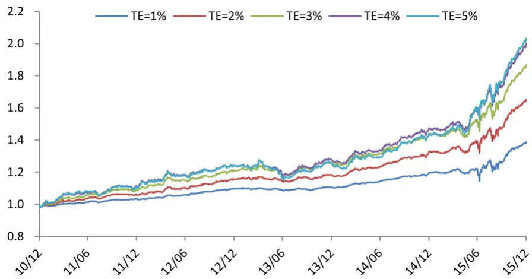
东方证券股份有限公司经相关主管机关核准具备证券投资咨询业务资格，据此开展发布证券研究报告业务。

报告发布日期2016 年 02 月 19 日

证券分析师朱剑涛

021-63325888*6077

zhujiantao@orientsec.com.cn

执业证书编号：S0860515060001

联系人雷赟

021-63325888-5091

leiyun@orientsec.com.cn

## 相关报告

| 剔除行业、风格因素后的大类因子检验 | 2016-02-17 |
| --- | --- |
| 常用股票行业分类方法的比较 | 2016-01-22 |
| 精细过往，探新未来 | 2016-01-07 |
| 基于交易热度的指数增强 | 2015-12-14 |
| 投机、交易行为与股票收益（上） | 2015-12-07 |

## 1.多因子模型投资流程

近年来, 多因子选股策略在国内市场上已经得到了较为广泛的应用，国内各机构也对阿尔法因子的挖掘和多因子阿尔法模型的构建有了较为充分的研究。但是类似研究在构建组合时大多采取的都是相对固定的模式，例如通过分层来构造行业中性和市值中性的组合。这类相对主观的调整难以顾及个股之间和行业之间的关联性，缺乏对组合风险的精确控制，导致最终构建的组合可能并没有充分暴露在预设的阿尔法因子上。

本文重点将放在风险模型构建和投资组合优化过程。同时也将梳理多因子选股模型的整个投资流程，包括阿尔法模型的构建，风险模型的构建，交易成本模型的构建，投资组合优化过程以及组合业绩的归因分析。

图 1：多因子模型投资流程
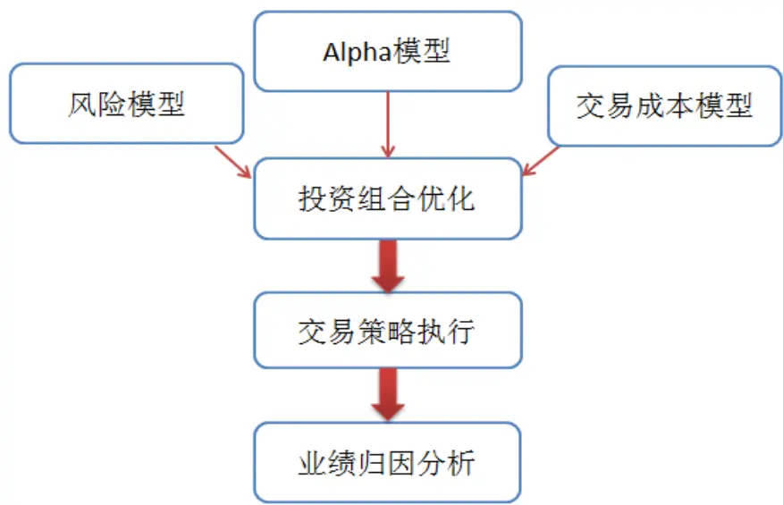
数据来源：东方证券研究所

## 1.1 风险模型定义与分类

风险模型是投资组合优化过程中非常重要的一个组成环节，风险模型旨在捕捉不同股票个体波动性差异大小和股票之间波动相关性的大小，对股票未来价格的波动进行预测。目前风险模型有如下几种：

1. 样本协方差矩阵：在资产收益率多元正态分布的假定下，样本协方差矩阵是总体协方差矩阵的无偏估计量。当投资组合中有 N 个资产时，需要估计的波动率个数为 N，需要估计的协方差个数为 N(N-1)/2。样本协方差的矩阵化表达式如下：

$$
S=\frac{1}{T}\sum_{t=1}^{T}X_{t}X_{t}^{\prime}
$$

其中 $X_{t}$ 是包含所有股票在时刻 t 收益率的 N×1 的列向量。然而，除了需要估计的参数个数过多以外，样本协方差矩阵的致命弱点是当资产个数 N 大于样本个数 T 时，样本协方差矩阵成为奇异矩阵，直观而言，就是我们可以找到一组特定的权重，使得以该权重构建的组合波动率为 0，然而这明显是违背现实情况的。与此同时，在 Markowitz 均值方差优化过程中，优化器会放大样本协方差矩阵的估计误差：优化器会给予那些表面上风险较小的股票过高的权重并且给予表面上风险较大的股票过低的权重。具体讨论可以参考 Michaud(1989)文章中提到的Error maximization 问题。

2. 基本面因子模型：目前较为主流的风险模型当属这一类，而且市场上有非常成熟的商业化解决方案（MSCI Barra, Axioma, Northfield）。在基本面因子模型中，股票收益的系统性风险部分能够被一组公共的因子所解释。而这些因子通常由行业因子和风格因子所组成:

$$
\mathbf{r}_{t,i}=\alpha_{i}+\beta^{t}_{i,1}f_{t,1}+\beta^{t}_{i,2}f_{t,2}+\beta^{t}_{i,3}f_{t,3}+\cdots+\beta^{t}_{i,K}f_{t,K}+\varepsilon_{t,i}
$$

其中， $\mathbf{r}_{t,i}$ 是第 i 只股票在期间 t 的收益率， $\beta_{i,K}^{t}$ 是期间 t 开始时股票 i 在第 k 个因子上的暴露，$f_{t,\mathbf{k}}$ 是第 k个因子在期间 t的收益率, $\varepsilon_{t,i}$ 是第 i只股票在期间 t的残差收益率.

假定每只股票的残差收益率和公共因子收益率不相关并且每只股票的残差收益率也不相关的情况下，股票组合的协方差矩阵可以表示如下：

$$
S=\mathrm{BF}B'+E
$$

其中 B 是 N 个股票在 K 个公共风险因子的上的因子暴露矩阵(N×K), F 是 K 个公共因子收益率的协方差矩阵(K×K)，E 是 N 个股票的残差收益率方差矩阵(N×N)。在基本面因子模型中，我们已知每期 N 个股票在 K 个因子上的暴露，通过加权最小二乘法(WLS)进行横截面回归就可以得到 K 个因子当期的因子收益率。再通过计算因子收益率之间的样本协方差矩阵就可以间接得到组合的协方差矩阵。基本面因子模型通过一组公共的因子来捕捉市场股票的波动，降低了需要估计的参数的数量，同时在一定程度上避开了股票历史价格波动带来的噪音。

基本面因子模型存在的一个主要问题是当alpha模型中的alpha因子只有一部分被包括在风险模型中时，这可能导致优化的投资组合没有暴露在预定的 alpha 因子上。一个简单的例子是：当 alpha 模型中使用 12 个月动量（t-13 到 t-1 的收益），而风险模型采用的动量因子是 12个月动量(t-12 到 t 的收益), 最后优化的投资组合大量暴露于 1 个月动量(t-13 到 t-12 的收益). 所以最好的处理方式是根据 alpha模型构建相对应的基本面风险模型。

图 2：alpha 因子与风险因子不匹配的情形
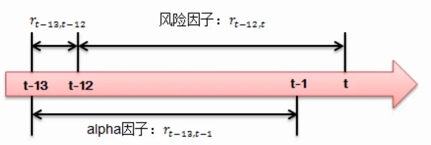
数据来源：东方证券研究所

3. 宏观因子模型：宏观因子模型与基本面因子模型类似，也是通过一组公共因子来解释股票收益的系统性风险，比如通货膨胀率，GDP 增长率，利率等。区别主要在于在宏观因子模型中，我们已知的是每个因子在每一期的因子收益率，而每个股票在这些公共因子上的暴露需要通过较长历史区间的时间序列回归进行估计。

4. 统计因子模型： 统计因子模型主要是利用主成分分析从股票收益率样本协方差矩阵提取出一定数量的主成分，主成分的数量由对总方差的解释阈值所确定。类似于基本面因子模型，我们可以通过 K个主成分来捕捉 N个股票之间的波动情况，降低了需要估计参数的个数。

## 1.2 基于协方差矩阵压缩估计量的风险模型

本文将从另外一个视角着眼，通过构建协方差矩阵的压缩估计量(Shrinkage Estimator)，解决样本协方差矩阵的不可逆问题和降低估计误差。正如我们前面所提到的，样本协方差矩阵虽然是总体协方差矩阵的无偏估计量，但是矩阵中异常高或者异常低的值实际包含了非常大的估计误差。直接将样本协方差矩阵应用到投资组合优化过程中会导致错误的权重分配。另一方面，我们上文提到的多因子风险模型都属于结构化风险模型，当模型中的因子越少时，模型的结构性越强。结构性越强的模型会降低估计误差，但是太少的因子可能带来较大的模型设定偏误。我们的目的是在这两类模型中找到一个折衷点，在估计误差和模型设定偏误之间找到最优的平衡。样本协方差矩阵的压缩估计量形式如下：

$$
\Sigma_{shrink}=(1-\beta)F+\beta S
$$

其中 S是样本协方差矩阵，F是一个高度结构化的风险模型， 称为压缩强度(Shrink Intensity), 是一个取值在 0 到 1 之间的参数。样本协方差的压缩估计量 $\mathbf{\Sigma_{\mathrm{shrink}}}$ 则是 F 和 S 的凸线性组合。

接下来的问题就是选择 F 作为压缩目标(Shrink Target)和最优的压缩强度(Shrink Intensity). 我们按照 Ledoit and Wolf(2003) 提出的方法，采用固定相关系数模型(constant correlation model)作为压缩目标 F。该模型假定每对股票之间的相关系数相等，用所有样本相关系数的平均值作为任意两只股票之间的相关系数的估计量。矩阵 F的结构如下：

$$
\begin{aligned}f_{_{ii}}&=\sigma_{_i}^{^2}\\f_{_{ij}}&=\overline{\rho}\sigma_{_i}\sigma_{_j}\\\overline{\rho}&=\frac{2}{(N-1)N}\sum_{_{i=1}}^{^{N-1}}\sum_{_{j=i+1}}^{^{N}}\frac{Cov(r_{_i},r_{_j})}{\sigma_{_i}\sigma_{_j}}\end{aligned}
$$

其中 $f_{ii}$ 是矩阵 F 的对角元素， $f_{ij}$ 是矩阵 F 的非对角元素， $\sigma_{i}$ 是第 i 只股票的样本方差 。接下来，我们的目标是找到一个最优的参数 ，使得如下的二次损失函数期望值最小化：

$$
L(\beta)=\left\|(1-\beta)F+\beta S-\Sigma\right\|^2
$$

关于如何得到最优的参数 $\beta$ ，由于篇幅限制本文将不做详细推导，具体可以参考 Ledoit andWolf(2003)。下面只是简要介绍最优参数 $\beta$ 背后的逻辑。为了方便解释，我们假定 F 的非对角元素 $f_{ij}^{\mathrm{~~}}{=}0$ ,对角元素 $f_{ii}=\frac{1}{N}\sum_{i}^{N}\sigma_{i}^{2}$ . 这样，压缩目标 F可以写成 $\overline{{\sigma}}I$ . 最优的压缩强度被证明可以写成如下形式：

$$
\beta=\frac{\delta^{2}}{\omega^{2}+\delta^{2}}
$$

其中 $\omega^{2}$ 代表的是样本协方差矩阵的估计误差， $\delta^{2}$ 代表的是压缩目标 F 的结构设定偏误。

直观来看，当 $\omega^{2}$ 趋近于 0 时， $\beta$ 趋近于 1，说明当样本协方差的估计误差越小时压缩估计量更大的权重放在了样本协方差矩阵上。当 $\delta^{2}$ 趋近于 0 时， $\beta$ 趋近于 0 ，说明当压缩目标的模型设定偏误越小时，压缩估计量更大的权重放在压缩目标上。 这也符合我们最初的预期。由于真实的协方差矩阵是未知的，我们需要对这两个参数进行估计。我们定义 $\omega^{2}$ 为样本协方差矩阵和真实协方差矩阵之间的距离（Frobenius 范数）

$$
\omega^{2}=E[\left\|S-\Sigma\right\|^{2}]
$$

利用横截面的信息，我们可以得到 $\omega^{2}$ 的估计量：

$$
\omega^{2}=\frac{1}{T(T-1)}\sum_{t=1}^{T}\left\|X_{t}X_{t}^{'}-S\right\|^{2}
$$

其中其中 $X_{t}$ 是包含所有股票在时刻 t收益率的 $\mathbb{N}\times1$ 的列向量。

类似的，我们定义 $\delta^{2}$ 为压缩目标 F 与真实协方差之间的距离：

$$
\delta^{2}=\left\|\boldsymbol{\Sigma}-\boldsymbol{F}\right\|^{2}
$$

然后通过如下的分解：

$$
\begin{aligned}E[\left\|S-F\right\|^2]&=E[\left\|S-\Sigma+\Sigma-F\right\|^2]\\&=E[\left\|S-\Sigma\right\|^2]+\left\|\Sigma-F\right\|^2\\&=\omega^2+\boldsymbol{\delta}^2\end{aligned}
$$

这样，我们就可以间接地得到 $\delta^{2}$ 的估计量：

$$
\delta^{2}=\left\|S-F\right\|^{2}-\omega^{2}
$$

整理后就可以得到 $\beta$ 的估计量：

$$
\beta=1-\frac{1}{T(T-1)}\frac{\sum\limits_{t=1}^{T}\left\|X_{t}X_{t}^{'}-S\right\|^{2}}{\left\|S-\overline{\sigma}I\right\|^{2}}
$$

协方差矩阵的压缩估计量为：

$$
\Sigma_{shrink}=(1-\hat{\beta})F+\hat{\beta}S
$$

并且可以证明 $\Sigma_{shrink}$ 是正定矩阵。

最后，我们通过图形直观展示出真实协方差矩阵，样本协方差矩阵和压缩目标三者之间的关系。从图 2 可以看出，压缩估计量是在压缩目标和样本协方差矩阵之间的一个折衷，而具体的折衷程度是由估计误差 $\omega^{2}$ 和模型设定偏误 $\delta^{2}$ 所决定。

图 3：压缩估计量的几何直观展示
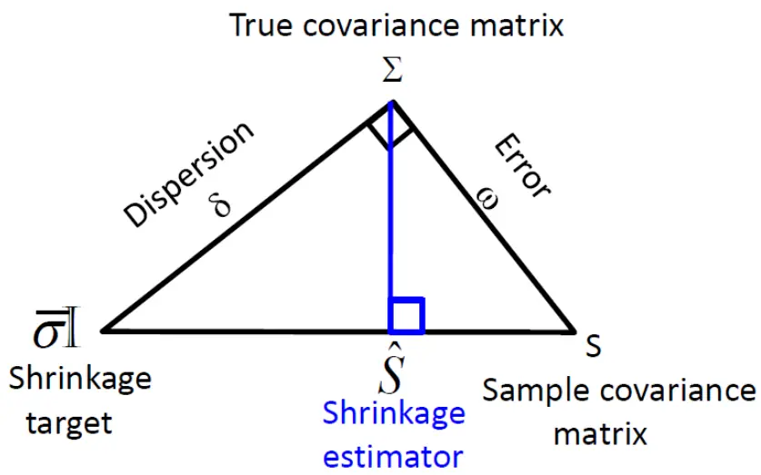
数据来源：东方证券研究所

## 1.3 阿尔法模型的构建

在多因子选股量化投资流程中，阿尔法模型的优劣直接决定了投资组合是否能够获得稳健的超额收益。 我们将在接下来的研究中深入探讨如何有效地构建多因子模型，本文只做初步介绍。我们对东方金工因子库中的 7大类 40多个因子在中证全指样本空间内进行了因子显著性检验，为了避免前视偏误（look ahead bias），因子有效性检验的时间区间为 2006 年 1 月 1 日到 2010 年 12 月31日，通过综合考察因子 Rank IC、Rank IC的 t统计量、IR、IC正显著比例、IC负显著比例、多空组合收益率、多空组合夏普比以及多空组合最大回撤等绩效指标，筛选出了如下因子作为阿尔法模型的组成部分：

表 1：因子类别及定义

| 因子类别 因子名称 | 因子定义 |
| --- | --- |
| 价值 BP_LF | 最近财报公布的净资产/总市值 |
| 价值 EP_Fwd12M | 预测未来12 个月的净利润/总市值 |
| 价值 DP_FY1 | 最近预测财年(FY1)每股股利/收盘价 |
| 成长 ProfitGrowth_YOY | 单季度净利润同比增长率 |
| 风险 IRFF | (1–R），其中R 为个股收益对 Fama French 三因子收益率时间序 列回归的R方 |
| 风险 TO | 20 日日均换手率 |
| 风险 LNMV | 总市值的对数 |
| 技术 PPReversal | 5 日成交均价/60 日成交均价 |

数据来源：Wind 数据库，东方证券研究所

由于DP_FY1因子在中证全指样本空间的覆盖率较低，低于40%。在全市场选股时，我们采用SP(过去 12个月营业收入/总市值)代替 DP_FY1 因子。在中证 500成分股内选股时，仍然使用 DP_FY1因子。

我们在每个月末首先计算因子的原始值，然后对原始值做中位数去极值和标准化处理，再针对不同类型的因子做进一步的中性化处理：

1. 财务类因子（价值、成长）做行业中性处理和风格中性处理，剔除行业和 Beta, 规模的影响。

2. 对风险类因子中的换手率因子和技术因子做风格中性处理。剔除 Beta, 规模的影响。

我们的目标是结合公司的基本面指标，风险指标和技术指标。投资逻辑是：购买具有相对低估值的高成长公司，同时这些公司前期没有被市场过度炒作而高估，并且技术面上反映出这些公司的股价已经出现超跌的现象。由于中国市场上小盘股效应较为明显，但波动较大，在 alpha模型中应当适量控制对小盘股的暴露。

接下来，可以采用不同的方法把多个因子的信息结合起来，构成合成因子。对于合成因子的构成，可以采用如下几种方式：

1. 在同类因子内部采取等权重加权，构成每类的合成因子。然后对每类的合成因子采取等权重加权，组成综合的合成因子。最后再对合成因子做标准化处理。

2. 在各个因子之间相关性较低的情况下可以利用单个因子的历史滚动 IR 进行加权，每个月动态调整因子配比。

3. 利用历史面板数据进行回归，因变量是股票的月度收益，自变量是经过处理后的因子值。利用最新一期的因子值和估计出的参数得到单个股票预期收益的预测值。

由于本文的重点放在风险模型构建和投资组合优化上，简单起见，我们只采用单个因子过去 24 个月滚动 IR进行加权，得到合成的因子值。各个因子的权重具体为：

$$
w=[w_1,w_2,\ldots,w_k]=[\frac{E[IC_1]}{std(IC_1)},\frac{E[IC_1]}{std(IC_1)},\ldots,\frac{E[IC_k]}{std(IC_k)}]
$$

## 1.4 交易成本模型的构建

交易成本也是多因子选股模型构建不可缺少的一环。交易成本与组合的权重变化和交易执行策略直接相关。这里我们只讨论交易成本与组合权重变化的关系。假定组合权重变化为 $\Delta w=w-w_{0}$ ，其中 $w_{0}$ 是调仓前的权重向量，w是调仓后的权重向量。交易成本可以表示为c w( )• ，即一个关于权重变化•w的函数。

交易成本通常可以分为固定成本和可变成本。固定成本包括交易佣金，印花税和买卖价差(bid-askspread)。可变成本则包括冲击成本和机会成本。由固定成本的定义可知，固定成本与组合的权重变化的绝对值成线性关系，可以表示成如下：

$$
c(\Delta w)=\tau^{\prime}\left|\Delta w\right|
$$

对于不同的股票， 可以取不同的值。虽然交易佣金和印花税是相同的，但是流动性不同的股票买卖价差区别也通常较大。

另一方面，可变成本中的机会成本难以在事前进行衡量，而冲击成本直接取决于交易量的大小和股票的流动性水平。当交易量相对股票日成交量较小时，不会对当前市场价格造成显著冲击。当交易量相对股票日成交量比例较大时，会对市场价格造成较大的影响。这说明冲击成本同交易量之间并不是线性递增的关系。在简化的假设下，可以表示成如下幂函数的形式：

$$
c(\Delta w_{i})=a_{i}(\Delta w_{i})^{p},a_{i}>0
$$

在估计出参数以后，我们就可以把交易成本嵌入到优化的目标函数中。由于参数的估计需要涉及到高频的数据，在本文的实证分析中只采用如下固定交易成本的简化假定：

1. 买入交易成本 1.8‰（佣金 0.8‰ + 冲击成本 $1.0\%$ ，卖出交易成本 2.8‰（佣金 0.8‰ + 印花税 1.0‰ + 冲击成本 1.0‰）

2. 假定每次买入金额等于卖出金额，参数 $\tau=0.5^{\circ}\left(2.8\%+1.8\%\right)=2.4\%$

我们将在后期对 A股交易的冲击成本作进一步研究。

## 2.投资组合优化

至此，我们已经完成了投资组合优化三大基石的构建：风险模型，alpha模型和交易成本模型。投资组合优化可以在精确控制组合风险的基础上，最大化组合对预定 alpha因子的暴露，同时满足其他约束条件。

## 2.1 优化问题的设定

我们采用经过风险和交易成本调整后的 alpha作为优化的目标函数：

$$
\begin{aligned}Max_{w}&\quad\alpha^{\prime}w-\mu w^{\prime}\Sigma w-\lambda\tau^{\prime}\left|w-w_{0}\right|\\s.t.\quad&\mathbf{R}^{\prime}w=\mathbf{R}^{\prime}w_{\mathit{bech}}\\&\mathbf{I}^{\prime}w=1\\&0\leq w_{i}\leq\min(\maxposition,w_{0,i}+\maxtradesize_{i}/\mathit{bobsize}_{i})\end{aligned}
$$

其中 $W_{bench}$ 是基准在时刻 t 的权重， $w_{0}$ 是组合优化前的权重，w是组合优化后的权重，

- 是协方差矩阵的压缩估计量， $\mu$ 是风险厌恶参数， 是交易成本参数，用来控制组合的换手率。R 是一个 $n\times\rho$ 的行业虚拟变量矩阵，当股票 i属于行业j时， $\mathrm{R}(\mathbf{i},\mathbf{j})\;=\;1$ 。 当股票 i 不属于行业 j时， $\mathsf{R}(\mathsf{i},\mathsf{j}){=}0$ . Maxposition 是单个股票在组合内的权重上限，Maxtradesize 是每次调仓时单个股票的最大买入金额。Booksize 是换仓时刻组合的总资产规模。

当加上显性跟踪误差约束条件时，优化的目标函数变为：

$$
\begin{aligned}&Max_{w}\quad\alpha^{\prime}w-\lambda\tau^{\prime}\left|w-w_{0}\right|\\&s.t.\quad\mathbf{R}^{\prime}w=\mathbf{R}^{\prime}w_{bench}\\&\quad\left(w-w_{bench}\right)^{\prime}\Sigma\left(w-w_{bench}\right)\leq\frac{TE^{2}}{252}\\&\quad\mathbf{I}^{\prime}w=1\\&\quad0\leq w_{i}\leq\min(\mathrm{maxposition},w_{0,i}+\mathrm{maxtradesize}_{i}/\mathrm{bossize}_{i})\\\end{aligned}
$$

其中 TE为预先给定的目标年化跟踪误差

## 2.1.1 优化目标函数中绝对值项处理方法

值得注意的是，当交易成本是组合权重变化的线性函数时，目标函数中出现了绝对值项。这使得该优化问题不能作为标准的二次规划问题求解。如果不对绝对值作处理而直接采用非线性优化器求解，优化器可能找不到可行解或者只能找到局部而非全局最优解。我们给如下方法解决绝对值的问题：

1. 变量代换。 定义 $w_{B}=\max(w-w_{0},0),w_{S}=\max(w_{0}-w,0)$ . 其中 $w_{B}$ 是买入而增加的权重，$w_{s}$ 是卖出而减少的权重，并且 $w_{B}\geq0和w_{S}\geq0$ 然后就有 $w=w_{0}+w_{B}-w_{S}$ .这样我们就可以把绝对值项转化为： $\left|w-w_{0}\right|=w_{B}+w_{S}$

相应的，优化的目标向量转换为:

$$
W=\begin{pmatrix}w_{_B}\\w_{_S}\end{pmatrix}
$$

这样，原来的问题就转化成一个标准的二次规划问题，代价是优化变量的个数增加了一倍；2. 分阶段优化。 我们首先求解不带交易成本项的二次规划问题：

$$
\mathrm{Max}_{w}\alpha^{\prime}w-\mu w^{\prime}\Sigma w
$$

其中约束条件仍然保持不变。得到上述问题的解 $w^{*}$ 后，重新定义交易成本向量 $\tau$

$$
\tau_{i}^{*}=\left\{\begin{aligned}\tau_{i},&ifw_{i}^{*}>w_{0,i}\\-\tau_{i},&ifw_{i}^{*}<w_{0,i}\end{aligned}\right.
$$

这样，我们通过第一次优化结果判断具体应该购买哪些股票和出售哪些股票，然后用新的交易成本向量 $\tau^{*}$ 替换 ，并求解如下问题：

$$
\begin{aligned}&Max_{w}\quad\alpha^{\prime}w-\mu w^{\prime}\Sigma w-\lambda\tau^{*^{\prime}}\left(w-w_{0}\right)\\&s.t.\quad\mathbf{R}^{\prime}w=R^{\prime}w_{k\mathit{ench}}\\&\quad\mathbf{1}^{\prime}w=1\\&\quad0\leq w_{i}<w_{0,i},if\tau_{i}^{*}<0\\&\quad w_{0,i}<w_{i}\leq\maxposition,if\tau_{i}^{*}>0\\\end{aligned}
$$

上述问题的解就是我们最终需要的结果。这样一来，原来的优化问题转化成两个标准的二次规划问题，代价是需要优化两次。由于本文实证检验中最优化问题的规模较大，股票个数可能超过 2000，采用第一种方法时会产生严重的性能问题。综合考虑计算性能和结果，本文考虑采用第二种处理方法。

## 2.2 实证分析

在前面几个部分我们完成了对投资组合优化细节的讨论，本节将利用前面讨论的方法，进行投资组合优化的实证检验。

## 2.2.1 不带跟踪误差约束条件的投资组合优化

我们首先考虑不带跟踪误差约束条件的组合优化，基准为中证 500指数, 实证检验的相关参数设置如下：

1） 回测时间为 2011 年 1 月到 2015 年 12 月

2） 回测的股票池为

a. 每月末的中证 500 成分股

b. 每月末的中证全指成分股

3） 交易成本为单边千分之 2.4

4） 单个股票的最大权重为 1.5%

5） 每次换仓时单个股票的最大买入金额为该股票过去 20 日日均成交金额的 20%

6） 参数 $\mu$ 设置为 1，为了控制月度单边换手率为 50%以下，参数 $\lambda$ 设置为 100

7） 每月利用过去 252个交易日的收益率重新计算协方差矩阵的压缩估计量，更新风险矩阵•我们采用不带显性跟踪误差约束条件的优化函数，在对基准保持行业中性的同时，最大化经过风险和交易成本调整后的 alpha. 优化问题具体设置如下：

$$
\begin{aligned}&Max_{_w}\alpha^{\prime}w-\mu w^{\prime}\Sigma w-\lambda\tau^{\prime}\left|w-w_{_0}\right|\\&s.t.\quad\mathbf{R}^{\prime}w=R^{\prime}w_{_{bench}}\\&\quad\mathbf{I}^{\prime}w=1\\&\quad0\leq w_{_i}\leq\min(1.5\%,w_{_{0,i}}+20\%ADTV_{_i}/booksize_{_t})\\\end{aligned}
$$

当回测的股票池为中证 500 成分股时，策略结果如下：

图 4：模型组合净值对比中证 500指数（成分内选股）
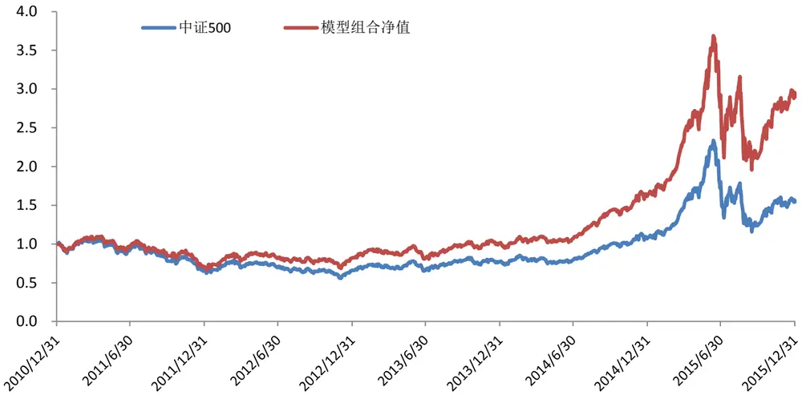
数据来源：Wind 数据库，东方证券研究所

图 5：对冲组合净值曲线（成分内选股）
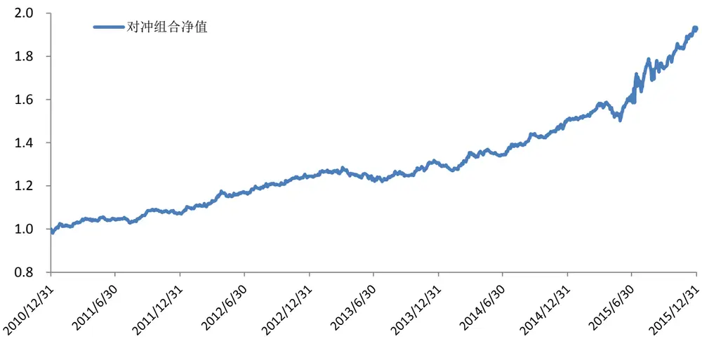
数据来源：Wind 数据库，东方证券研究所

表 2：策略分段绩效统计（成分内选股）

| 年份 | 基准 | 策略组合 | 跟踪误差 | 信息比率 | 策略组合 最大回撤 | 基准 最大回撤 |
| --- | --- | --- | --- | --- | --- | --- |
| 2011 | -33.8% | -28.9% | 4.6% | 1.58 | 36.4% | 38.5% |
| 2012 | 0.3% | 16.0% | 4.7% | 3.40 | 23.0% | 29.7% |
| 2013 | 16.9% | 23.1% | 5.2% | 0.96 | 17.4% | 16.7% |
| 2014 | 39.0% | 60.3% | 4.9% | 3.09 | 7.6% | 12.5% |
| 2015 | 43.1% | 78.1% | 12.3% | 2.28 | 47.0% | 50.6% |
| 2011-2015 | 9.1% | 23.7% | 7.0% | 2.00 | 47.0% | 50.6% |

数据来源：Wind 数据库，东方证券研究所

表 3：对冲组合绩效统计（成分内选股）

| 策略净值 | 1.93 | 最大回撤 | 5.6% |
| --- | --- | --- | --- |
| 策略日胜率 | 54.9% | 最大回撤开始时间 | 2015/8/17 |
| 年化收益率 | 14.0% | 最大回撤结束时间 | 2015/8/26 |
| 年化波动率 | 7.0% | 组合月均股票个数 | 83 |
| 夏普比率 | 2.00 | 组合月均换手率(单边) | 40% |

数据来源：Wind 数据库，东方证券研究所

当选股范围从中证 500成分股扩展到中证全指的样本空间时，策略回测结果如下：

图 6：模型组合净值对比中证 500指数（全市场选股）
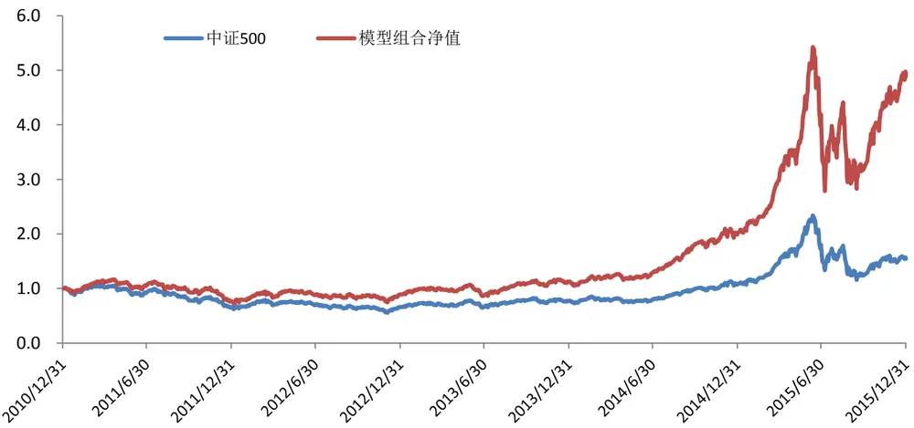
数据来源：Wind 数据库，东方证券研究所

图 7：对冲组合净值曲线（全市场选股）对比（成分内选股）
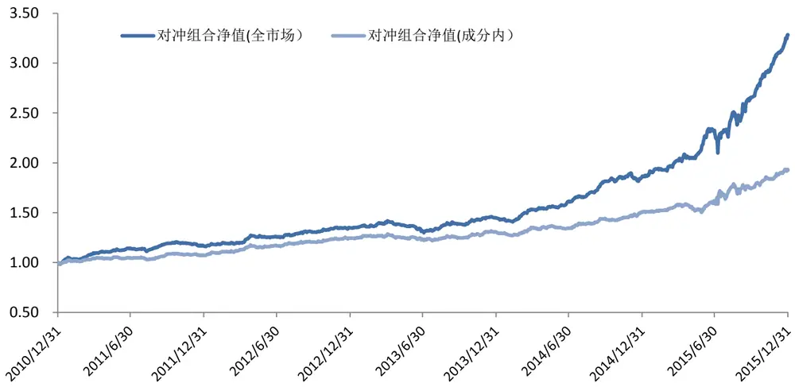
数据来源：Wind 数据库，东方证券研究所

表 4：策略分段绩效统计（全市场选股）

| 年份 | 基准 | 策略组合 | 跟踪误差 | 信息比率 | 策略组合 最大回撤 | 基准 最大回撤 |
| --- | --- | --- | --- | --- | --- | --- |
| 2011 | -33.8% | -22.7% | 5.6% | 2.96 | 35.1% | 38.5% |
| 2012 | 0.3% | 15.6% | 5.0% | 3.07 | 22.7% | 29.7% |
| 2013 | 16.9% | 26.1% | 5.8% | 1.30 | 19.3% | 16.7% |
| 2014 | 39.0% | 79.0% | 5.5% | 5.28 | 8.8% | 12.5% |
| 2015 | 43.1% | 142.3% | 13.8% | 5.50 | 48.6% | 50.6% |
| 2011-2015 | 9.1% | 37.4% | 8.0% | 3.37 | 48.6% | 50.6% |

数据来源：Wind 数据库，东方证券研究所

表 5：对冲组合绩效统计（全市场选股）

| 策略净值 | 3.28 | 最大回撤 | 10.4% |
| --- | --- | --- | --- |
| 策略日胜率 | 58.6% | 最大回撤开始时间 | 2015/6/15 |
| 年化收益率 | 26.8% | 最大回撤结束时间 | 2015/7/8 |
| 年化波动率 | 8.0% | 组合月均股票个数 | 89 |
| 夏普比率 | 3.37 | 组合月均换手率(单边) | 50% |

数据来源：Wind 数据库，东方证券研究所

从上述统计结果可以看出, 无论选股范围是中证 500成分股内还是全市场，模型策略组合在过去 5年每年都大幅跑赢了基准指数。在中证500成分股内选股时，模型策略组合的年化信息比率达到2。并且组合的超额收益具有较高的持续性和稳定性。同时，对冲组合的回撤也较小，仅发生在 2015年股灾期间，最大回撤为 5.6%

当股票池从中证 500样本空间扩展到全市场时，策略组合信息比提升到 3.37. 策略组合年化收益率从 23.7%提升到 37.4%。对冲组合的最大回撤有所增大，从 5.6%增加到 10.4%，同样也发生在 2015年 6-7月份股灾期间。由于对冲组合的构建是采取策略组合日收益减去基准指数日收益的方式，当全市场大量股票出现停牌情况时，这种简单的对冲可能导致组合存在一定的风险敞口，进而导致较大的回撤。

跟踪误差方面，当组合对基准保持行业中性时候，我们可以看到正常情况下策略组合的跟踪误差能够保持在年化5%左右，但是当市场出现较为极端情况时，比如2015年6-7月份股灾期间千股停牌，年化跟踪误差扩大到 10%以上。这种情况下，我们可能需要人为干预以应对市场巨幅波动。

最后，值得注意的是模型策略在 2013 的表现相对其他年份不佳，信息比率仅在 1左右，为此，我们列出了 alpha 模型中从 2011 到 2015 年各个因子的权重，从图 7 可以看到，BP_LF, EP_Fwd12M和 SP 三个价值因子的权重在过去 5 年相对稳定，占 30%左右。而 IRFF 因子由于其稳健的表现，一直占有较高的权重，因子权重变动最大的则是市值对数 LNMV, 其权重在 2013 年大幅下降，在2014 年开始后才逐渐增加到 10%左右。历史上看，2013年是结构性行情演绎到极致的一年。在大盘蓝筹和传统行业表现不佳的情况下，小盘股表现异军突起，创业板指数上涨超过 90%，而主板市场则令人失望，上证综指全年跌幅 6.75%。由于 alpha 模型中因子的权重采取的是过去 24 个月IR 进行加权，存在着一定的滞后性，因此在采取一定的量化因子择时策略或者根据市场情况主观调整 alpha 模型中因子配比或许能够显著提高 alpha 模型的效果。这些内容我们将在后期研究中深入讨论。

图 8：alpha模型因子历史权重
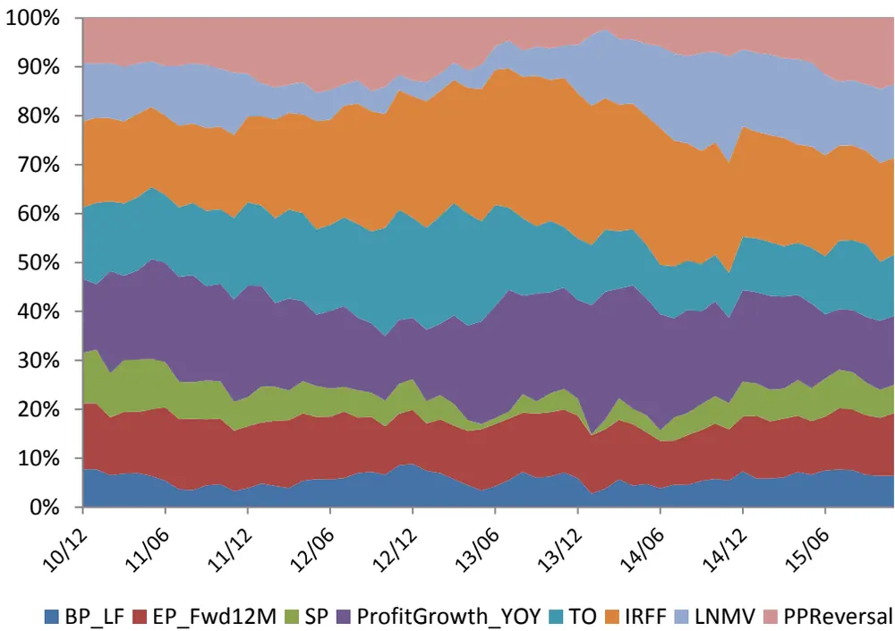
数据来源：Wind 数据库，东方证券研究所

作为对比，我们也采用了简单分层法构建了一个增强的组合，具体方法是在每个行业内选择 alpha最高的前 10%的股票，再保持行业权重与基准一致，行业内采取流通市值加权的方法。交易成本仍然保持双边千分之 2.4%的假定。

表 6：对冲组合绩效（全市场分层选股）

| 策略净值 | 2.16 | 最大回撤 | 10.6% |
| --- | --- | --- | --- |
| 策略日胜率 | 56.2% | 最大回撤开始时间 | 2013/2/5 |
| 年化收益率 | 16.6% | 最大回撤结束时间 | 2013/7/24 |
| 年化波动率 | 7.0% | 组合月均股票个数 | 196 |
| 夏普比率 | 2.37 | 组合月均换手率(单边) | 64% |

数据来源：Wind 数据库，东方证券研究所

对比表 5和表 6，我们可以看到采取风险优化构建组合的方式明显优于简单分层。具体表现为夏普比率从 2.37提升到了 3.26，日胜率从 56.2%提升到 59.1%。同时组合的月均换手率从 64%下降到了48%。组合最大回撤也有所降低。从表 7 可以进一步看出，组合的月均换手率对模型的参数 非常敏感，说明风险优化可以在一定程度上控制组合的月均换手率。

更加值得提出的是，在采取风险优化构建组合时，我们还考虑了股票的流动性限制。而采简单分层法构建组合时，忽略了股票流动性条件的约束，实际构建组合时可能会对市场带来较大的冲击，进而降低组合实际绩效。

表 7：参数 与组合月均换手率的关系

| λ | 组合月均换手率 |
| --- | --- |
| 200 | 28% |
| 175 | 31% |
| 150 | 34% |
| 100 | 40% |
| 50 | 47% |
| 25 | 51% |
| 15 | 52% |
| 5 | 54% |
| 1 | 55% |

数据来源：Wind 数据库，东方证券研究所

## 2.2.2 带跟踪误差约束条件的投资组合优化

相比于主动投资基金，指数增强基金更为关注的是组合的跟踪误差。基金经理的投资目标是满足目标最大年化跟踪误差基础上获得相对基准最大的超额收益。从前面的实证分析结果可以知道，当组合相对基准保持行业中性时，在正常年份组合的年化跟踪误差能够保持在 5%到 6%左右，而在 2015年这样的极端年份，跟踪误差可能放大到 10%以上。据我们了解，目前国内指数增强基金的目标年化跟踪误差大多在 7%到 8%之间。在保持行业中性的限制下，组合的实际跟踪误差在大多数情况可以控制在目标跟踪误差内。我们考虑能否在约束条件中加上跟踪误差的上限，更加精确地控制跟踪误差。因此，我们考虑如下带跟踪误差约束条件的优化问题：

$$
\begin{aligned}&Max_{_w}\quad\alpha^{\prime}w\\&s.t.\quad\mathbf{R}^{\prime}w=R^{\prime}w_{_{bench}}\\&\quad(w-w_{_{bench}})^{\prime}\Sigma(w-w_{_{bench}})\leq\frac{TE^{2}}{252}\\&\quad\mathbf{1}^{\prime}w=1\\&\sum_{i\in L}w_{i}\geq0.8\\&\quad0\leq w_{i}\leq\min(1.5\%,w_{_{0,i}}+20\%ADTV_{_i}/booksize_{_t})\\\end{aligned}
$$

优化的相关参数设置如下：

1） 回测时间为 2011 年 1 月到 2015 年 12 月

2） 回测的股票池为每月末的中证全指成分股，

3） 交易成本为单边千分之 2.4

4） 单个股票的最大权重为 1.5%，其中中证 500成分股占组合总资产权重大于或等于 80%

5） 目标年化跟踪误差分别设置为 5%，4%，3%，2%，1%

6） 每次换仓时单个股票的最大买入金额为该股票过去 20 日日均成交金额的 20%

在不同跟踪误差约束条件下的回测结果如下：

表 8：不同目标跟踪误差下的策略绩效（2011-2015）

| 目标跟踪误差 | 实际跟踪误差 | 实际跟踪误差 (除2015 外) | 组合平均股票个数 | 年化收益率 | 信息比率 |
| --- | --- | --- | --- | --- | --- |
| 无(保持行业中性) | 7.09% | 5.28% | 86 | 25.61% | 2.23 |
| 5.0% | 6.96% | 5.23% | 90 | 24.94% | 2.19 |
| 4.0% | 6.56% | 4.84% | 125 | 24.50% | 2.26 |
| 3.0% | 5.87% | 4.11% | 202 | 22.80% | 2.26 |
| 2.0% | 5.11% | 3.19% | 320 | 19.79% | 2.06 |
| 1.0% | 4.36% | 2.06% | 540 | 15.63% | 1.54 |

数据来源：Wind 数据库，东方证券研究所

从表 8可以看到，在不同的目标跟踪误差条件下，组合的实际跟踪误差、组合平均股票个数和年化收益率均呈现出单调性。前面我们提到在保持行业中性的条件下，组合年化跟踪误差能够控制在5%左右，因此当目标跟踪误差设置为 5%时，组合的实际跟踪误差和年化收益率同行业中性组合相差不大。当目标跟踪误差进一步降低时，组合平均股票个数显著增加，同时组合年化收益率下降，信息比率呈现出先增加后降低的趋势，

图 9：不同目标跟踪误差下对冲组合的净值曲线
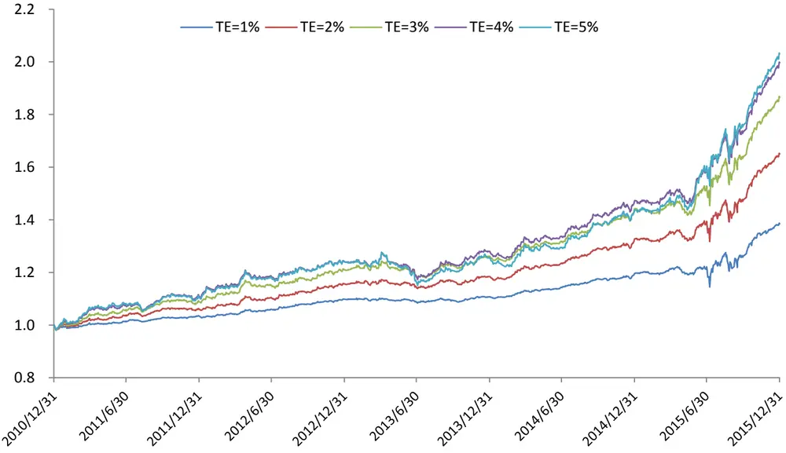
数据来源：Wind 数据库，东方证券研究所

另一方面，我们看到组合的实际跟踪误差要高于目标跟踪误差。即使在剔除 2015 年的数据后，实际跟踪误差也比目标跟踪误差高20%到50%。说明风险模型在一定程度上低估了组合的主动风险。低估的原因一般主要来自于两个方面：

1. 波动率是非平稳变量，具有随时间变化的特性。构建风险模型时没有考虑波动率非平稳的特征。

2. 协方差矩阵的估计误差。

对于第一个问题，目前 Barra 提出了一个较为有效的方法，称为 Volatility Regime Adjustment. 即根据风险模型在过去一段时间的表现情况，定量计算模型对风险估计的偏差，再对风险矩阵做出相对应的调整。由于涉及到一些较为复杂的处理和参数的选择，感兴趣的读者可以参考 Barra USE 4handbook，我们也将在后期的研究中按照该方法构建客制化的多因子风险模型。

接下来我们进一步考察在不同目标跟踪误差条件下组合每月跟踪误差波动情况，从图 11 可以看到从 2011 年到 2014年间，组合的跟踪误差表现较为稳定，虽然目标跟踪误差普遍低估实际跟踪误差20%-50%左右，但不同组合的实际跟踪误差仍然呈现出明显的单调性，体现出风险模型对跟踪误差的控制效果。从 2015年 7份开始，所有组合的跟踪误差均从正常水平直线上升到 15%以上。这段时间则正处于 2015年股灾期间，市场巨幅震荡，出现千股停牌的状况。从图 12可以看出，在 2015年 7 月底，中证全指成分股超过 18%的股票停牌，中证 500 成分股超过 15%的股票停牌。而我们回测的假定则是在每月末调仓时会全部卖出当月底停牌的股票，同时在进行优化的股票池剔除月底停牌股票。这个假定在正常市场状况下并不会对跟踪误差产生较大影响，而在大量股票停牌，指数失真的情况下，模型策略无法及时调整投资组合，会产生较大的跟踪偏离度和跟踪误差，需要人为的干预。

图 10：月度实际年化跟踪误差(2011-2014)
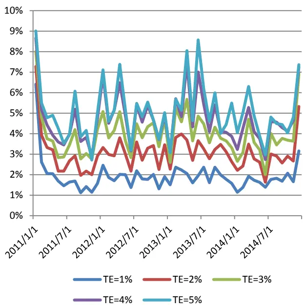
数据来源：Wind 数据库，东方证券研究所

图 11：月度实际年化跟踪误差(2015)
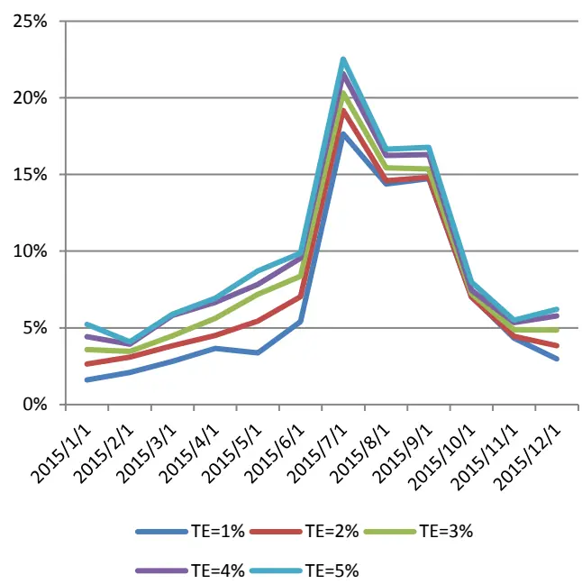
数据来源：Wind 数据库，东方证券研究所

图 12：指数成分股停牌股票数量比例（月度数据）
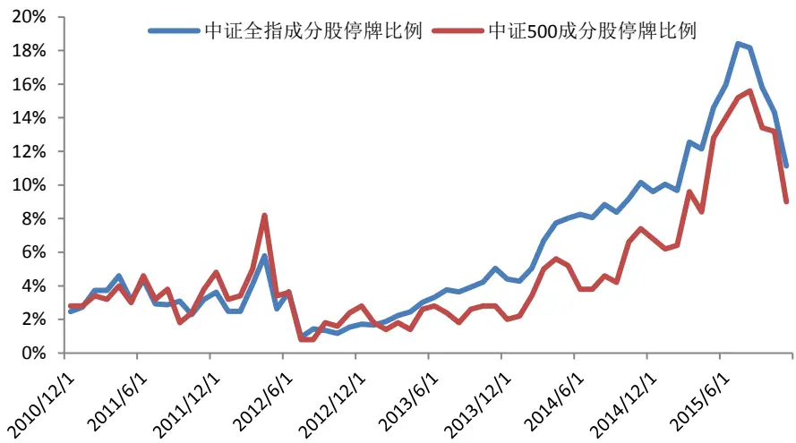
数据来源：Wind 数据库，东方证券研究所

## 3.研究结论

本文首先讨论了多因子模型的投资流程，指出投资组合优化能够有机结合 alpha模型，风险模型和交易成本模型三大基石，在满足一系列约束条件下最大化组合经过风险调整后的 alpha。然后梳理了各类不同风险模型的优点和缺点，指出样本协方差矩阵的一系列缺点限制了其在投资组合优化中的实际应用，

然后提出了一种具有实用性的风险模型构建方式：协方差矩阵的压缩估计量。它解决了当股票数量超过样本个数时样本协方差矩阵不可逆的问题，同时降低了协方差矩阵中的估计误差。同多因子风险模型相比，该风险模型的构建和维护过程相对简单，不需要针对不同市场和 alpha模型做大幅的调整，并且具有较好的风险预测能力。

实证检验证明，基于该风险模型构建的组合能够获得比采用简单分层方法构建的组合更高的风险调整后收益和更低的换手率，同时，投资组合的优化过程也提供了对组合进行动态微调的机会。

另一方面，对于指数增强基金，我们指出传统上的行业中性处理已经能够把组合的跟踪误差控制在一个相对较小的范围内，而基于压缩估计量构建的风险模型能够更加精确地控制组合事后跟踪误差，这可以满足指数增强基金经理对组合主动风险进行精确控制的要求。

本文提供了一个通用的投资组合优化框架，各个组成部分都具有模块化的特征：例如可以采用其他alpha 模型代替本文中采用的 alpha 模型，用更加复杂的交易成本模型(如考虑冲击成本的非线性模型)代替本文中采用的线性交易成本模型。

在后期的研究中，我们将进一步讨论如下问题：

1. 如何有效地构建 alpha模型，

2. 深入分析 A股的交易成本（包括固定成本和冲击成本）及其对组合绩效的影响，

3. 构建与 alpha 模型相匹配的客制化多因子风险模型

## 风险提示

- Alpha 模型的有效性是基于全市场股票大样本数据的统计分析，是一个整体性的大概率结论，并不百分百保证得分高的股票未来一定获利。

量化模型基于历史数据分析而得，存在模型失效的风险，市场极端行情和黑天鹅事件也可能对模型效果造成较大冲击；股市有风险，投资须谨慎！

## 4.参考文献

Michaud, R. O. (1989). The Markowitz optimization enigma: Is ‘optimized’ optimal? Financial Analyst Journal ,45:31–42.

Ledoit and Wolf (2003). Improved Estimation of the Covariance Matrix of Stock Returns With an Application to Portfolio Selection. Journal of Empirical Finance, Volume 10, Issue 5

Ledoit and Wolf (2004). Honey, I Shrunk the Sample Covariance Matrix. Journal of Portfolio Management, Volume 31, Number 1

Qian,E, Hua,R., and Eric.S. (2007). Quantitative Equity Portfolio Management: Modern Techniques and Applications

Barra(2011). The Barra US Equity Model (USE4) Methodology Notes

Ledoit, Olivier (2013). “Statistic Arbitrage”. University of California, Los Angeles

Xinfeng Zhou and Sameer Jain (2014). Active Equity Management, First Edition

## 分析师申明

每位负责撰写本研究报告全部或部分内容的研究分析师在此作以下声明：

分析师在本报告中对所提及的证券或发行人发表的任何建议和观点均准确地反映了其个人对该证券或发行人的看法和判断；分析师薪酬的任何组成部分无论是在过去、现在及将来，均与其在本研究报告中所表述的具体建议或观点无任何直接或间接的关系。

## 投资评级和相关定义

报告发布日后的 12个月内的公司的涨跌幅相对同期的上证指数/深证成指的涨跌幅为基准；

## 公司投资评级的量化标准

买入：相对强于市场基准指数收益率15%以上；

增持：相对强于市场基准指数收益率5%～15%；

中性：相对于市场基准指数收益率在-5%～+5%之间波动；

减持：相对弱于市场基准指数收益率在-5%以下。

未评级——由于在报告发出之时该股票不在本公司研究覆盖范围内，分析师基于当时对该股票的研究状况，未给予投资评级相关信息。

暂停评级——根据监管制度及本公司相关规定，研究报告发布之时该投资对象可能与本公司存在潜在的利益冲突情形；亦或是研究报告发布当时该股票的价值和价格分析存在重大不确定性，缺乏足够的研究依据支持分析师给出明确投资评级；分析师在上述情况下暂停对该股票给予投资评级等信息，投资者需要注意在此报告发布之前曾给予该股票的投资评级、盈利预测及目标价格等信息不再有效。

## 行业投资评级的量化标准：

看好：相对强于市场基准指数收益率5%以上；

中性：相对于市场基准指数收益率在-5%～+5%之间波动；

看淡：相对于市场基准指数收益率在-5%以下。

未评级：由于在报告发出之时该行业不在本公司研究覆盖范围内，分析师基于当时对该行业的研究状况，未给予投资评级等相关信息。

暂停评级：由于研究报告发布当时该行业的投资价值分析存在重大不确定性，缺乏足够的研究依据支持分析师给出明确行业投资评级；分析师在上述情况下暂停对该行业给予投资评级信息，投资者需要注意在此报告发布之前曾给予该行业的投资评级信息不再有效。

## 免责声明

本证券研究报告（以下简称“本报告”）由东方证券股份有限公司（以下简称“本公司”）制作及发布。

本报告仅供本公司的客户使用。本公司不会因接收人收到本报告而视其为本公司的当然客户。本报告的全体接收人应当采取必要措施防止本报告被转发给他人。

本报告是基于本公司认为可靠的且目前已公开的信息撰写，本公司力求但不保证该信息的准确性和完整性，客户也不应该认为该信息是准确和完整的。同时，本公司不保证文中观点或陈述不会发生任何变更，在不同时期，本公司可发出与本报告所载资料、意见及推测不一致的证券研究报告。本公司会适时更新我们的研究，但可能会因某些规定而无法做到。除了一些定期出版的证券研究报告之外，绝大多数证券研究报告是在分析师认为适当的时候不定期地发布。

在任何情况下，本报告中的信息或所表述的意见并不构成对任何人的投资建议，也没有考虑到个别客户特殊的投资目标、财务状况或需求。客户应考虑本报告中的任何意见或建议是否符合其特定状况，若有必要应寻求专家意见。本报告所载的资料、工具、意见及推测只提供给客户作参考之用，并非作为或被视为出售或购买证券或其他投资标的的邀请或向人作出邀请。

本报告中提及的投资价格和价值以及这些投资带来的收入可能会波动。过去的表现并不代表未来的表现，未来的回报也无法保证，投资者可能会损失本金。外汇汇率波动有可能对某些投资的价值或价格或来自这一投资的收入产生不良影响。那些涉及期货、期权及其它衍生工具的交易，因其包括重大的市场风险，因此并不适合所有投资者。

在任何情况下，本公司不对任何人因使用本报告中的任何内容所引致的任何损失负任何责任，投资者自主作出投资决策并自行承担投资风险，任何形式的分享证券投资收益或者分担证券投资损失的书面或口头承诺均为无效。

本报告主要以电子版形式分发，间或也会辅以印刷品形式分发，所有报告版权均归本公司所有。未经本公司事先书面协议授权，任何机构或个人不得以任何形式复制、转发或公开传播本报告的全部或部分内容。不得将报告内容作为诉讼、仲裁、传媒所引用之证明或依据，不得用于营利或用于未经允许的其它用途。

经本公司事先书面协议授权刊载或转发的，被授权机构承担相关刊载或者转发责任。不得对本报告进行任何有悖原意的引用、删节和修改。

提示客户及公众投资者慎重使用未经授权刊载或者转发的本公司证券研究报告，慎重使用公众媒体刊载的证券研究报告。

## 东方证券研究所

地址：上海市中山南路 318 号东方国际金融广场 26 楼

联系人： 王骏飞

电话：021-63325888*1131

传真：021-63326786

网址： www.dfzq.com.cn

Email： wangjunfei@orientsec.com.cn