东方证券股份有限公司经相关主管机关核准具备证券投资咨询业务资格，据此开展发布证券研究报告业务。

## 研究结论

在本篇中，我们借鉴统计套利的思想， 提出了价差偏离度的概念，试图捕捉股票相对其同类型股票的高估低估程度。价差偏离度因子本质上是一个相对意义上的反转因子，价差偏离度低，近期跑输其同类股票，股票相对处于低位，有向上回复的动力，有正的预期超额收益，价差偏离度越高，股票处于相对高位，后期有回调的压力。

价差偏离度因子业绩表现优异，过去 10年月度 RankIC-0.095，IR-0.85，分组的 top组合相对市场等权年化超额收益 17.8%，而且，其稳定性也较高，IC 正显著比例 9.8%，负显著比例 69.9%，多空组合月胜率 76.4%，最大回撤 15.16%。

价差偏离度和传统的市值因子、估值因子相关性弱，通过因子分层后分组和Fama-Macbeth回归我们发现，传统的 1个月反转和 3个月反转可以被价差偏离度替代，而价差偏离度因子信息来源相对独立，不能被其他的常见因子所解释。

加总特异度、市值调整换手和价差偏离度得到的交易热度较单一因子有明显提升，不仅体现在收益水平上，RankIC-0.132，top 组合超额收益 27.7%，稳定性也大幅提升，RankIC正显著比率仅 4.9%，负显著比率 79.7%，多空组合胜率 87.8%，回撤 11.87%，其选股对市值和行业均没有明显的偏好，另外，交易热度的信息速度相当之快，构建组合时需要注意。

传统的定期换仓的组合调整方法，调仓频率过低无法及时捕捉 alpha 因子变动带来的信息，如果调仓频率过高则会带来组合的高换手，为了克服这一矛盾，我们提出了一种不定期调仓的组合调整方法，对于交易热度 top100 组合，可以在月度定期调仓的换手水平下实现周度定期调仓的业绩。

报告发布日期2016 年 05 月 12 日

证券分析师朱剑涛

021-63325888*6077

zhujiantao@orientsec.com.cn

执业证书编号：S0860515060001

联系人王星星

021-63325888-6108

wangxingxing@orientsec.com.cn

## 风险提示

- 量化模型的失效及市场风格的重大转变

策略组合各年度表现

|  | 累计收益率 |  |  | 夏普比 |  |  | 最大回撤 |  |  |
| --- | --- | --- | --- | --- | --- | --- | --- | --- | --- |
|  | 沪深300 | 中证500 | 策略 | 沪深300 | 中证500 | 策略 | 沪深300 | 中证500 | 策略 |
| 2016Q1 | -13.7% | -19.2% | -5.9% | -1.42 | -1.48 | -0.31 | -19.4% | -25.4% | -20.6% |
| 2015年 | 5.6% | 43.1% | 178.6% | 0.34 | 1.04 | 2.76 | -43.5% | -50.6% | -33.9% |
| 2014年 | 51.7% | 39.0% | 62.8% | 2.28 | 1.79 | 3.03 | -10.1% | -12.5% | -7.4% |
| 2013年 | -7.6% | 16.9% | 36.5% | -0.26 | 0.82 | 1.78 | -22.2% | -16.7% | -16.2% |
| 2012年 | 7.6% | 0.3% | 23.5% | 0.46 | 0.13 | 1.05 | -22.4% | -29.7% | -17.2% |
| 2011年 | -25.0% | -33.8% | -16.2% | -1.31 | -1.60 | -0.74 | -31.6% | -38.5% | -29.8% |
| 2010年 | -12.5% | 10.1% | 27.7% | -0.42 | 0.48 | 1.15 | -29.5% | -28.4% | -25.2% |
| 2009年 | 96.7% | 131.3% | 236.0% | 2.26 | 2.56 | 3.99 | -25.3% | -20.3% | -18.0% |
| 2008年 | -65.9% | -60.8% | -31.5% | -1.99 | -1.44 | -0.52 | -71.6% | -72.4% | -56.2% |
| 2007年 | 161.5% | 186.6% | 353.8% | 2.86 | 2.78 | 4.17 | -20.9% | -30.4% | -23.4% |
| 2006年 | 121.0% | 100.7% | 110.4% | 3.77 | 2.99 | 3.48 | -13.8% | -15.3% | -10.8% |

有关分析师的申明，见本报告最后部分。其他重要信息披露见分析师申明之后部分，或请与您的投资代表联系。并请阅读本证券研究报告最后一页的免责申明。

东方证券股份有限公司及其关联机构在法律许可的范围内正在或将要与本研究报告所分析的企业发展业务关系。因此，投资者应当考虑到本公司可能存在对报告的客观性产生影响的利益冲突，不应视本证券研究报告为作出投资决策的唯一因素。

## 一、价差偏离度定义

在本报告上篇中我们提出了特异度和市值调整换手两个因子，分别从价和量两个维度去衡量个股被投机的程度，研究发现过去一段时间被过度投机的股票一般大幅跑输市场，相反，被市场“忽视“的股票有稳定的超额收益。然而，无论是特异度还是市值调整换手都是通过捕捉股票被投机的程度变相实现超额收益，而没有直接从股票的价格行为出发考虑股票的相对高估低估情况。在本篇中，我们借鉴了统计套利的思想，提出了价差偏离度(SpreadBias)的概念，试图捕捉股票相对其同类型股票的相对高估低估的程度。

股票的涨跌不是各自独立的，而是以概念、板块的方式轮动炒作，当某一板块大多数股票近期都表现较好时，该板块滞涨的股票就有补涨的需求，相反，当某一概念股近期普跌时，该概念其他尚未下跌的股票也有补跌的需求。基于这个逻辑，当某只股票近期表现弱于其相似的股票，那么该股票在短期内存在补涨需求，可能会有正的超额收益，相反，当某只股票近期表现强于其相似股，近期有补跌的压力，可能会有负的收益贡献。为了度量个股相对其同类型股票的表现，我们提出了价差偏度度(SpreadBias)的概念：

股票 i的价差偏离度的定义按如下三步：

（1）每月月底在全市场搜索与股票 i 距离最近（相似度最高）的 N 只股票等权构建该股票的特征组合，特征组合的净值价格我们称之为参考价格（ ）；

（2）计算股票 i的价格和参考价格的对数价差 $(PriceSpead_{i,t})$

$$
PriceSpead_{i,t}=ln\big((StockPrice_{i,t})-ln\big(ReferencePrice_{i,t}\big)
$$

（3）经过去 60日均值、标准差调整后的当前对数价差 $PriceSpead_{i,t}$ ，我们称之为价差偏离度。

$$
SpreadBias_{i,t}=\frac{PriceSpead_{i,t}-mean(PriceSpead_{i,t})}{std(PriceSpead_{i,t})}
$$

价差偏离度定义中涉及到的第一个问题是股票间的距离，股票有成长性、估值、市值等多个属性维度，直接从股票的具体属性去度量股票间的相似性可行性低，但相似的股票理应有相似的历史价格表现，因此我们可以通过股票过去的日涨跌幅的相关性来变相度量股票的距离：

## 股票间的距离 = 1 – 两股票过去 250 个交易日涨跌幅的 pearson 相关系数

另外，价差偏离度定义中涉及到两个参数：第一个参数是股票特征组合的容量 N，特征组合内股票个数越多，特征组合和股票的相似性越差，股票个数太少，特征组合又太容易受到组合内股票的特异性影响，从而导致参考价格失真，本文选取了距离最近的 10只股票构建特征组合，事实上，价差偏离度的表现对参数 N 并不敏感，如对其他参数下的价差偏离感兴趣请咨询下报告联系人。第二个参数是计算价差偏离度的时间窗口 K，不同时间窗口下的价差偏离度刻画了股票在不同时间周期上与其特征组合的偏离程度，本文基于过去 60个交易日的数据计算股票的价差偏离度，对于该参数的敏感性，下文再做具体分析。

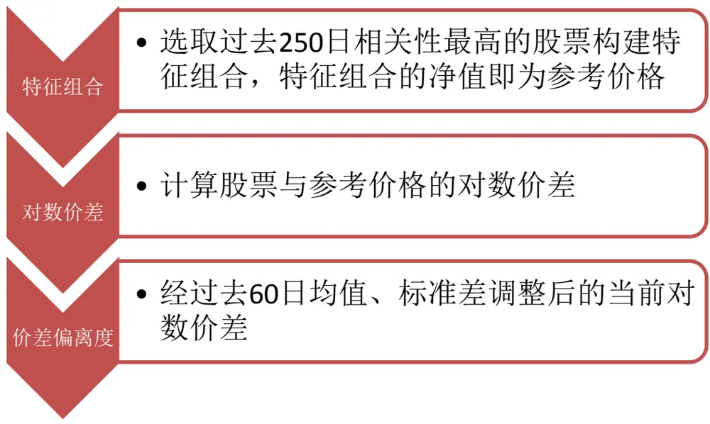
图 1：价差偏离度的定义
数据来源：wind 数据库, 东方证券研究所

价差偏离度度量了个股相对其特征组合（相似的股票集）价格的偏离程度，实质是一个相对意义上的反转因子，价差偏离度低，股票近期跑输其特征组合，股票相对估值偏低，有向上回复的动力，有正的预期超额收益，价差偏离度越高，股票处于相对高估状态，后期有回调的压力。需要提醒的是，股票价格向特征组合回复前提假设是其基本面没有发生重大变化，如若近期发生并购重组或者其他基本面发生重大变化的情形下，价差偏离度可能失效。

## 二、因子有效性分析

在该部分，我们首先利用传统的 IC和分组检验的方法检验价差偏离度因子的有效性，参数的稳健性，其次考察不同参数的因子在时间维度上的衰减速度，最后分析价差偏离度因子和其他因子（尤其是反转因子）的相关性情况和替代关系。

## 1．有效性检验

我们基于过去 10年的数据（20051230-20160331）考察价差偏离度因子的有效性。在每月月底，根据价差偏离度因子（时间窗口为 60 日）的大小将同期中证全指成分股分为 10 组（因子最小的组合为第 1组）等权构建投资组合，通过考察各个组合的业绩表现来检验因子的有效性。

图 2：价差偏离度分布特征
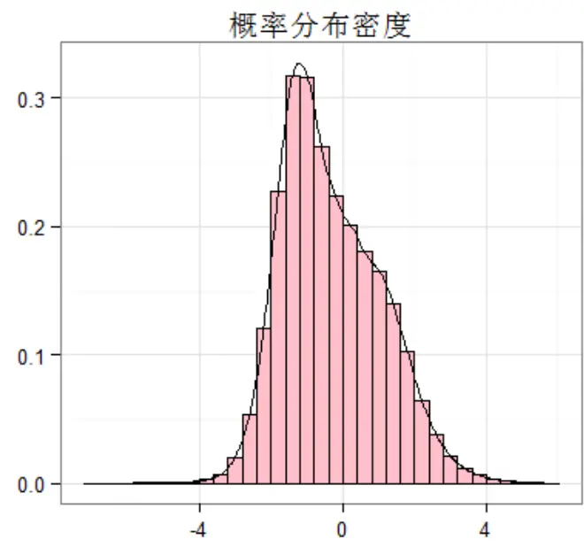
数据来源：wind 数据库, 东方证券研究所

图 3：价差偏离度各分组超额收益（市场等权）
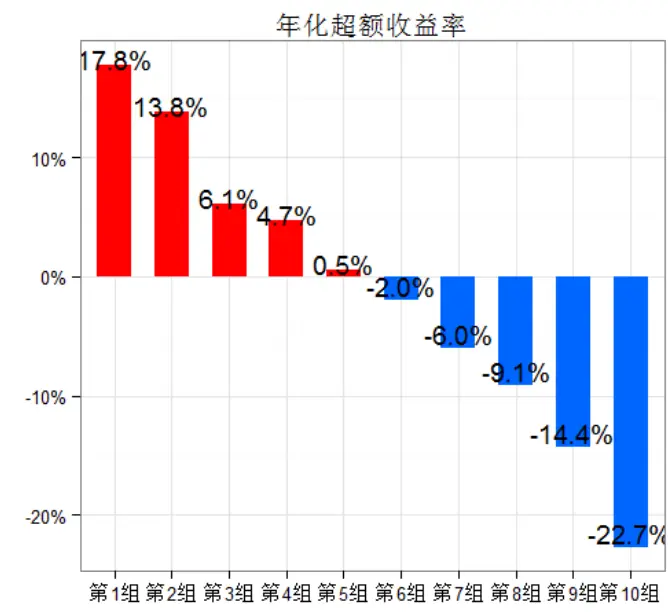
数据来源：wind 数据库, 东方证券研究所

价差偏离度过去 10年的表现异常惊人，低价差偏离度的组合表现出了相当显著的正超额收益。从信息系数 IC（spearman）来看，过去 10 年各月度 IC 均值-0.095，月度 IR-0.854（IC 均值/IC标准差），和我们预期的一致，低价差偏离度股票下期表现越好，但其 IC 的绝对数值和稳定性略超出我们预料（同期流通市值因子月度 IC-0.070，IR-0.360，特异度因子 IC-0.100、IR-1.121），价差偏离度的表现略逊于特异度，但 IC 的均值和稳定性都要高于传统的市值因子。分组的表现也验证了我们的假设，价差偏离度最小组合相对市场等权组合实现年化超额收益 17.8%（各分组和基准组合均未扣费），夏普比 1.32、月胜率 70.7%，相比这下，价差偏离度因子最大的组合年化跑输市场组合 22.7%，夏普比 0.41、月胜率仅 26.0%，而且从各分组的年化超额收益、夏普比、信息比、月胜率等业绩评价随着组号的变化呈现出明显的单调特征，价差偏离度越低的组合表现越佳，价差偏离度越高的组合表现越差。但需要提醒的是，价差偏离度各分组的月度换手较高（单边90%左右），在使用价差偏离度因子选股应引起注意。

表 1：价差偏离度因子各分组业绩评价指标

|  | 年化收益率 | 年化超额收益 | 夏普比 | 信息比 | 月胜率 | 最大回撤 | 月均换手 |
| --- | --- | --- | --- | --- | --- | --- | --- |
| 中证全指 | 17.5% | -13.5% | 0.68 | -1.33 | 36.6% | 71.5% |  |
| 市场等权（基准） | 31.1% | 0.0% | 0.98 |  | 0.0% | 70.5% | 5.8% |
| 第1组 | 48.8% | 17.8% | 1.32 | 2.30 | 70.7% | 66.9% | 89.4% |
| 第2组 | 44.8% | 13.8% | 1.21 | 1.99 | 71.5% | 69.2% | 86.4% |
| 第3组 | 37.2% | 6.1% | 1.06 | 1.03 | 61.8% | 70.8% | 87.0% |
| 第4组 | 35.7% | 4.7% | 1.04 | 0.89 | 64.2% | 70.9% | 89.3% |
| 第5组 | 31.6% | 0.5% | 0.96 | 0.23 | 51.2% | 71.7% | 90.1% |
| 第6组 | 29.1% | -2.0% | 0.91 | -0.29 | 45.5% | 72.3% | 90.7% |
| 第7组 | 25.0% | -6.0% | 0.82 | -1.21 | 32.5% | 70.8% | 90.2% |
| 第8组 | 22.0% | -9.1% | 0.75 | -1.64 | 35.8% | 71.7% | 88.5% |
| 第9组 | 16.7% | -14.4% | 0.63 | -2.05 | 24.4% | 72.0% | 83.9% |
| 第10组 | 8.3% | -22.7% | 0.41 | -2.25 | 26.0% | 71.2% | 84.5% |

数据来源：wind 数据库, 东方证券研究所

回溯价差偏离度的历史表现，我们发现价差偏离度表现的稳定性也值得我们认可。自2005年12月30日以来，价差偏离度各月度IC正显著比率仅9.8%，而负显著比率高达69.9%，其在大多数月份均贡献正的超额收益，即使不贡献正向超额收益也很少对组合的表现造成拖累。从多空组合的月度收益和组合回撤来看也可以说明这一点，多空组合月胜率高达 76.4%，10年来最大回撤仅 15.16%。纵观近 10 年的表现，不难发现，价差偏离度因子在市场波动较大的时间区间表现更佳，这和特异度等因子相一致，2015年 6月以来价差偏离度多空组合净值已翻倍有余。

图 4：价差偏离度历史表现回溯
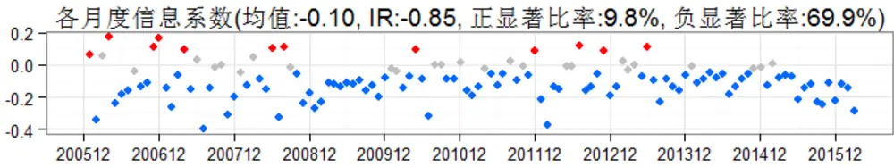

多空组合各月度收益(均值:2.84%，胜率:76.4%)
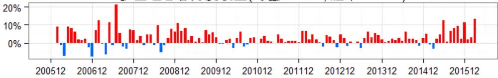

多空组合净值曲线(年化收益率:38.50%)
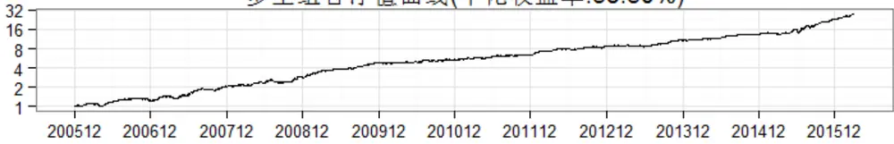

多空组合历史回撤(最大回撤:-15.16%)
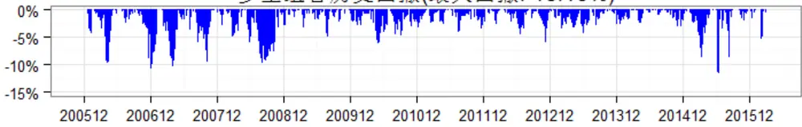
数据来源：wind 数据库, 东方证券研究所

## 2. 参数稳健性

基于不同的时间窗口长度计算的价差偏离度取值会有所不同，前文我们检验了 60 日价差偏离度的有效性，那么其他参数下价差偏离度是否有效？

从图 5 中，我们大致可以看出，在月频上，计算价差偏离度的时间窗口如果太短，其对次月收益率的预测能力不佳，但当时间窗口大于 30 日后，不同时间窗口下的 IC 均值相差不大，当时间窗口过长时（大于 80 天）IC 的稳定性会略有降低，因此在月度频率上价差偏离度的计算窗口长度建议在 30 日至 80 日间取值。

图 5：不同时间窗口价差偏离度的月度 IC
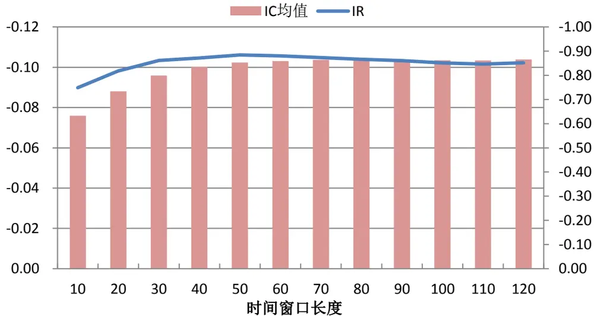
数据来源：wind 数据库, 东方证券研究所

当考察的频率从月频切换到周频时，我们发现价差偏离度更偏向于更短的时间窗口，其周度 IC的均值和稳定性着计算窗口的拉长呈明显的下降趋势，但下降的绝对幅度不明显。

图 6：不同时间窗口价差偏离度的周度 IC
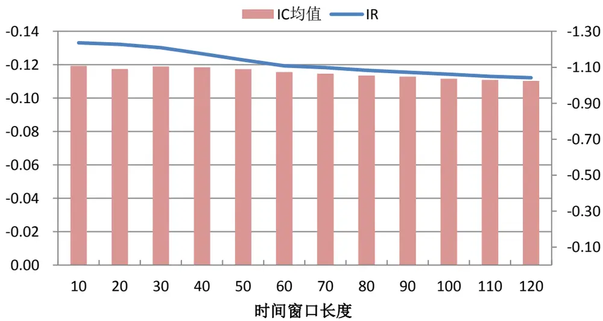
数据来源：wind 数据库, 东方证券研究所

不同时间窗口下计算的价差偏离度衡量的是股票在不同时间尺度上相对其特征组合偏离程度，当组合换仓频率较高时倾向于采用较短的时间窗口计算价差偏离度，当组合换仓频率较低时倾向于采用较长的时间窗口计算价差偏离度。但在绝对意义上，价差偏离度的表现对度量的时间窗口不太敏感，为避免过度的数据挖掘，我们仍然采用事先设定的 60日作为计算价差偏离度的时间窗口。

## 3. 相关性分析

通过前文的验证，我们发现价差偏离度因子的确能够带来显著的超额收益，但这部分超额收益能否被其他常见的因子所解释同样很有检验的必要。

价差偏离度因子本质上是一种相对意义上的反转因子，因此其与传统的反转因子（1 个月反转、3个月反转）有不可避免的高相关性，这一点在表 2中的相关性矩阵中得到了验证。其次，价差偏离度因子和我们在上篇剔除的特异度和市值调整换手有一定的相关性，但总体可控，两两之间最高的相关系数也仅为 0.32（价差偏离度和特异度）。最后，价差偏离因子和传统的市值因子和估值因子相关性也不高，其与市值因子和估值因子的相关系数分别为 0.099和-0.159。

表 2：因子值间的 spearman 相关系数

|  | 流通市值 | 账面市值比 | 特异度 | 市值调整换手 | 价差偏离度 | 1个月反转 3个月反转 |  |
| --- | --- | --- | --- | --- | --- | --- | --- |
| 流通市值 | 1.000 | 0.109 | -0.031 | -0.185 | 0.099 | 0.045 | 0.071 |
| 账面市值比 | 0.109 | 1.000 | -0.305 | -0.195 | -0.159 | -0.113 | -0.192 |
| 特异度 | -0.031 | -0.305 | 1.000 | 0.227 | 0.320 | 0.301 | 0.286 |
| 市值调整换手 | -0.185 | -0.195 | 0.227 | 1.000 | 0.241 | 0.236 | 0.219 |
| 价差偏离度 | 0.099 | -0.159 | 0.320 | 0.241 | 1.000 | 0.660 | 0.633 |
| 1个月反转 | 0.045 | -0.113 | 0.301 | 0.236 | 0.660 | 1.000 | 0.493 |
| 3个月反转 | 0.071 | -0.192 | 0.286 | 0.219 | 0.633 | 0.493 | 1.000 |

注：以上数值为各截面 spearman 相关系数的时间序列平均
数据来源：wind 数据库, 东方证券研究所

为了考察价差偏离度和反转及其他常见因子两两之间的替代作用，我们沿用了上篇中采用的因子分层的做法。具体做法如下：

在每个月底按分层因子大小将样本空间内的股票分为 10层，再在每一层内按分组因子的大小排序，选取每一层内分组因子最小的 1/10 股票作为第 1 组（top 组合），以此类推，每层内分组因子最大 1/10股票作为第 10组（bottom 组合），然后比较做多 top组合做空 bottom组合的多空组合月均收益率及其显著性。

分析因子分层多空组合的月均收益率和显著性，我们不难发现：

（1）价差偏离度因子可以解释传统的 1个月反转和 3个月反转的超额收益来源。价差偏离度因子经过 1个月反转或者 3个月反转分层后，多空组合的收益率有一定回落（从 3.14%回落至 1.70%或 2.12%），但仍有显著的超额收益，然而，1 个月反转或者 3 个月反转经价差偏离度分层后其多空组合月均收益率在 5%的显著性水平下已不显著。

（2）特异度、市值调整换手、价差偏离度三个因子间虽然有少量的共有信息源，但仍相对独立。特异度、市值调整换手、价差偏离度三个因子中任一个因子经其他两个因子中的一个分层后，其多空组合的收益率均有一定程度回落，但回落幅度不大，分层后多空组合仍有显著的收益率。

（3）价差偏离度因子的超额收益几乎不受市值效应和估值效应影响。价差偏离度因子经传统的流通市值、账面市值比分层后多空组合的收益率变化不大，说明流通市值和账面市值比对价差偏离的超额收益几乎没有解释能力。

表 3：因子分层多空组合月均收益率及其显著性（标红为 5%显著）

| 流通市值 账面市值比 特异度 市值调整换手 价差偏离度 1个月反转 |  |  |  |  |  |  |  |
| --- | --- | --- | --- | --- | --- | --- | --- |
| 价差偏离度 1个月反转 3个月反转 | 不分层 流通市值 | 3.07% | -1.05% 2.81% | 3.41% | 3.14% | 2.73% | 3个月反转 3.26% |
| 分 刀层因子 | 0.85% | -1.54% | 2.77% | 3.91% | 2.90% | 2.92% | 2.92% |
|  | 账面市值比 3.33% | 0.04% | 2.58% | 3.61% | 2.99% | 2.65% | 2.88% |
|  | 特异度 2.12% | -0.22% | 0.44% | 2.06% | 1.89% | 1.32% | 1.48% |
|  | 市值调整换手 3.22% | -0.60% | 2.24% | 0.80% | 1.94% | 0.98% | 1.33% |
|  | 1.84% | -0.53% | 2.00% | 2.26% | 0.57% | 0.57% | 0.63% |
|  | 2.09% | -0.57% | 2.11% | 2.53% | 1.70% | -0.04% | 1.37% |
|  | 2.35% | -0.21% | 2.18% | 2.66% | 2.12% | 1.40% | 0.49% |

数据来源：wind 数据库, 东方证券研究所

因子分层的做法仅能判断因子两两间的解释或替代作用，为考察多个因子的组合能否完全解释或替代价差偏离度，我们采用了学术上 Fama-Macbeth回归的方法，

分析 Fama-Macbeth 的回归结果，我们可以得出如下结论：

（1）价差偏离度对于次月收益率的确有显著的预测能力,这一点可以从方程(1)中价差偏离度的高显著性得到验证.

(2) 价差偏离度可以替代传统的 1 个月反转、3 个月反转。方程（2）在方程 1 的基础上解释变量增加了 1 个月反转和 3 个月反转，发现价差偏离度依然高显著，而 1 个月反转和 3 个月反转因子几乎不显著。

（3）价差偏离度的超额收益率远不能被特异度、市值调整换手解释。方程（3）的解释变量新增特异度和市值调整换手后，价差偏离度因子系数稍有回落，但依然高度显著。

（4）价差偏离度的超额收益率来源也不是市值、估值、PEG、成长、非流动性等传统因子。方程（5）的解释变量在加入市值、估值、PEG、成长、非流动性等因子后价差偏离度的系数和显著性变化不大。

表 4：Fama-Macbeth 回归结果

| intercept |  | spreadbias | ret1m | ret3m | ivr | adjto | mktval | bm | peg | growth | illiq |
| --- | --- | --- | --- | --- | --- | --- | --- | --- | --- | --- | --- |
| (1) | -0.009 (-13.21) | -0.085 (-9.10) |  |  |  |  |  |  |  |  |  |
| (2) | -0.009 (-12.92) | -0.051 (-6.23) | -0.028 (-2.05) | -0.026 (-1.80) |  |  |  |  |  |  |  |
| (3) | -0.009 (-12.58) | -0.040 (-4.91) | -0.008 (-0.58) | -0.014 (-1.03) | -0.040 (-6.46) | -0.068 (-6.23) |  |  |  |  |  |
| (4) | -0.010 (-12.34) | -0.032 (-4.72) | -0.018 (-1.53) | -0.009 (-0.73) | -0.041 (-7.57) | -0.066 (-6.44) | -0.060 (-4.24) | 0.007 (0.72) |  |  |  |
| (5) | -0.010 (-11.69) | -0.032 (-4.80) | -0.020 (-1.77) | -0.008 (-0.64) | -0.041 (-7.46) | -0.058 (-5.49) | -0.044 (-3.15) | 0.007 (0.70) | -0.032 (-6.92) | 0.030 (2.93) | 0.026 (2.59) |

注 1：spreadbias 为价差偏离度，ret1m 为一个月反转，ret3m 为三个月反转，ivr 为特异度，adjto 为市值调整换手，mktval 为流通市值。bm 为账面市值比，peg 为 PEG，growth 净利年化同比增长率，illiq 为非流动性指标。

注 2：为保证回归的有效性，包括被解释变量次月收益率在内的所有跟收益率相关的因子我们均转换为了对数收益率，流通市值、PEG、和非流动性指标均经过对数化处理。

## 注 3：括号内为系数的 t 统计量

数据来源：wind 数据库, 东方证券研究所

## 三、交易热度

我们在报告《基于交易热度的指数增强》中首次提及交易热度的概念，在本篇我们引入价差偏离度的概念后对交易热度的定义有所更新。

## 1．交易热度再定义

我们在前期的专题报告《投机、交易行为与股票收益（上）》和本文中我们提出了特异度、市值调整换手和价差偏离度三个交易类指标，特异度和市值调整换手从两个不同维度度量了股票在过去一段时间内的投机程度，价差偏离度直接从价格关系出发，度量股票相对其相似股票的偏离程度（股价相对高估其实也是过度投机的一种表现），三个指标均有明显的超额收益，而且信息源相对独立，基于此，我们提出交易热度(Behavior Index, BI)的概念。

$$
BehaviorIndex_{i,t}=\frac{1}{3}[Q(IVR_{i,t})+Q\big(adjTurnover_{i,t}\big)+Q\big(SpreadBias_{i,t}\big)]
$$

其中， $BehaviorIndex_{i,t}$ 为股票 i 在时刻 t 的交易热度， $IVR_{i,t}$ 为股票 i 在时刻 t 的特异度，$adjTurnover_{i,t}$ 为股票i在时刻t的市值调整换手, $SpreadBias_{i,t}$ 为股票i在时刻t的价差偏离度（60日）。 $Q(I_{i,t})$ 表示股票 i的指标 $\dot{\cdot}I_{i,t}$ 在时刻 t样本空间内所有股票中所对应的分位数（累计分布概率）。

根据交易热度的定义可知，交易热度的取值在 0-1 之间，交易热度取值越高，表明股票交易的活跃程度越高，相对越高估，后期预期收益率越低。

## 2. 交易热度表现

过去 10 年（20051230-20160331），交易热度的月度 IC（spearman）均值-0.132，IR-1.256，IC 的绝对高度和稳定性均高于单一的交易行为类因子（特异度 IC 均值-0.100、IR-1.121，市值调整换手 IC 均值-0.097，IR-0.717，价差偏离度，IC 均值-0.095，IR-0.854）。

表 5：交易热度各分组业绩评价指标

|  | 年化收益率 | 年化超额收益 | 夏普比 | 信息比 | 月胜率 | 最大回撤 | 月均换手 |
| --- | --- | --- | --- | --- | --- | --- | --- |
| 中证全指 | 17.5% | -13.5% | 0.68 | -1.33 | 36.6% | -71.5% |  |
| 市场等权（基准） | 31.1% | 0.0% | 0.98 |  | 0.0% | -70.5% | 5.8% |
| 第1组 | 58.8% | 27. 7% | 1.56 | 2.98 | 78.0% | -63.8% | 76.6% |
| 第2组 | 46.7% | 15. 7% | 1.27 | 2.24 | 69.9% | -66.0% | 85.5% |
| 第3组 | 42.1% | 11. 0% | 1.18 | 1.89 | 77.2% | -70.2% | 87.7% |
| 第4组 | 37.6% | 6.5% | 1.09 | 1.30 | 65.0% | -68.6% | 89.0% |
| 第5组 | 35.0% | 4.% | 1.04 | 0.91 | 56.1% | -72.2% | 89.8% |
| 第6组 | 29.8% | -1.3% | 0.92 | -0.14 | 44.7% | -70.2% | 89.7% |
| 第7组 | 24.4% | -6.6% | 0.80 | -1.19 | 39.8% | -72.3% | 89.0% |
| 第8组 | 19.7% | 113% | 0.69 | -1.87 | 30.9% | -72.6% | 88.0% |
| 第9组 | 12.7% | -18. 4% | 0.51 | -2.59 | 22.8% | -74.4% | 85.8% |
| 第10组 | -0.7% | -31. 7% | 0.15 | -3.15 | 10.6% | -83.5% | 78.3% |

数据来源：wind 数据库, 东方证券研究所

交易热度各分组的表现也显示了交易热度在选股方面具有出色表现。交易热度最小的一组，相对市场等权组合年化超额收益率高达 27.7%，夏普比 1.56，月胜率 28%。而且，随着交易热度

的增大，各分组的业绩逐渐变差，单调性明显，交易热度最高的一组，年均跑输市场等权 29.6%。
需要提醒的是，交易热度指标换手率依然不低，交易热度最低的组合月均换手高达 72.0%。

从近 10 年来（20051230-20150331）的历史表现来看，交易热度指标变现较为稳健，各月IC 的正显著比率仅 4.9%，多空组合月胜率高达 87.8%，多空组合回撤仅 11.87%。

图 7：交易热度历史表现回溯
各月度信息系数(均值：-0.13,IR:-1.26,正显著比率:4.9%，负显著比率:79.7%)
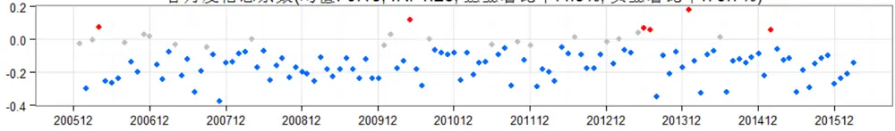

多空组合各月度收益(均值:3.98%.胜率:87.8%)
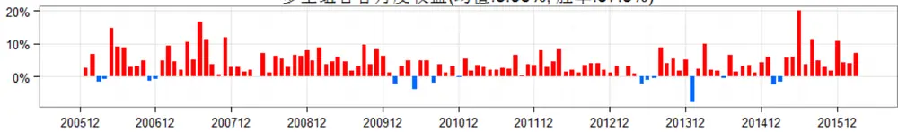

多空组合净值曲线(年化收益率:58.36%)
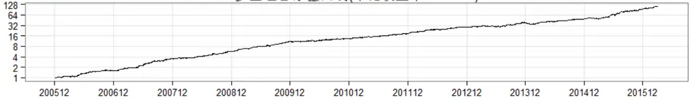

多空组合历史回撤(最大回撤:-11.87%)
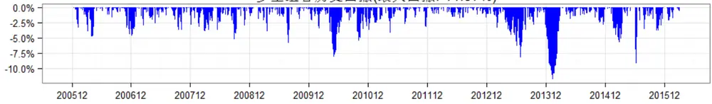
数据来源：wind 数据库, 东方证券研究所

## 3. 信息衰退速度

我们通过考察交易热度因子和不同滞后期后的收益率（日，周、月）收益率的 spearman 相关系数（不同滞后期的 IC 均值）来研究交易热度在信息时间尺度上的性质。不管是从日度、周度还是月底的 IC 衰退过程来看，毫无疑问的是，交易热度因子信息的衰退速度相当快，日度 IC 和周度 IC 的半衰期仅 5 天左右，月底 IC 的半衰期也仅有两周左右，因此，如果传统的月底换仓的频率远不能充分利用交易热度的信息，这也为我们下文中尝试改进组合调整方法打下了基础。

图 8：交易热度 IC均值衰减速度
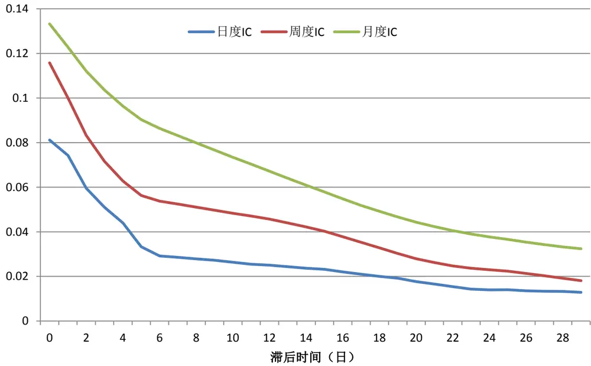
数据来源：wind 数据库, 东方证券研究所

## 4．行业与市值偏好

为了量化特定组合对某个行业的偏好，我们将组合中该行业的股票数量占比与全市场（中证全指成分股）中该行业数量占比的比值称为组合对该行业的偏好程度。偏好程度大于 1，说明组合超配该行业，偏好程度小于 1，说明组合低配该行业。

从过去 10 年的平均情况来看，交易热度选股对行业没有明显的偏好，最高配的交通运输业，top组合内的股票数量占比也不到全市场交运股占比的两倍。从长期的平均意义上没有行业偏好并不代表在特定时间点 top组合行业偏好不明显，一般来说，交易热度选股偏好冷门行业，低配热门行业。

图 9：交易热度 top组合各行业平均偏好
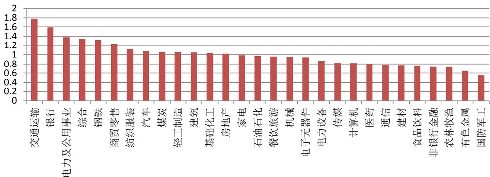
数据来源：wind 数据库, 东方证券研究所

过去 10 年交易热度和流通市值的 spearman 相关系数平均为-0.01，从相关系数的角度看，交易热度选股对市值几乎中性。为了进一步考察交易热度对各个股票市值区间的区间的偏好，我们在每月月底将全市场的股票按市值大小分为 10个层，考察 top 组合对各个市值分层的偏好程度，我们发现，交易热度选股对各个市值层偏好相对均匀，相对而言，略偏中小盘。

图 10：交易热度 top组合各市值分层平均偏好
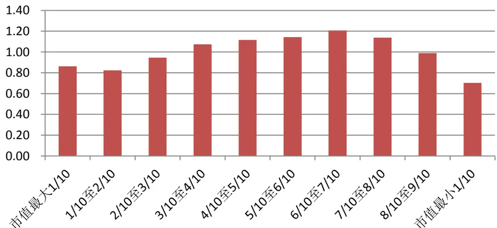
数据来源：wind 数据库, 东方证券研究所

## 四、组合调整的新尝试

传统的定期换仓的组合调整方法，调仓频率过低无法及时捕捉 alpha 因子变动带来的信息，尤其像交易热度这样信息衰退速度较快的因子，如果调仓频率过高则会带来组合的高换手，交易成本的大幅增加会导致可实现获得的盈利可能不增反降。为了及时捕捉 alpha因子变化带来的交易机会，同时实现实现换手水平可控，我们提出一种不定期调仓的组合调整方式，以交易热度 top100等权组合为例，具体实施步骤如下：

（1）将总资产池按资金量均匀划分为 100个通道，每个通道同一时间最多仅容纳 1只股票；

（2）初始建仓时点，选取样本空间内交易热度最低的 100 只股票，每个通道全仓买入一只股票，如遇停牌或者其他原因无法买入时选择交易热度次低的股票买入；

（3）每日监控持仓股票的交易热度取值，当股票的交易热度全市场排名上升至指定阈值（平仓阈值，默认为 500，关于其敏感性稍后再作讨论）卖出该股票，如遇停牌或其他原因无法卖出时则继续持仓，后期是否卖出取决于其交易热度排名是否仍超过平仓阈值；

（4）有通道股票卖出后，若该通道资产（股票已卖出，仅现金资产）高于各通道资产（股票+现金）平均水平，则将多余部分划拨至资产最低的通道的现金池，直至该通道资产达到平均水平，若仍有多余，向下一个资产最低的通道划拨，直至多余资金调度完成；

（5）在（4）完成后，有股票卖出的通道再全仓买入样本空间内除持仓股外交易热度最低的股票，如遇停牌或者其他原因无法买入时选择交易热度次低的股票买入。

上述的组合调整步骤中，步骤（3）、步骤（5）主要负责换仓的时点把握和股票选择，和具体的交易相关联，步骤（4）主要实现各通道间的资金再平衡，为账户会计处理，不涉及到实际交易，其主要目的是为了实现组合的近似等权。另外，需要指出的是，任何一个通道内的股票从买入至卖出不会人为的调整持仓数量，这种设计也更便于实际操作。

为了检验交易热度因子在这种新式组合调整方式下的实际效果，我们假设初始建仓点为 2005年 12月 30日，回撤时期截止 2016年 3月 31日，所有交易均在信号发出后的次日（交易日）以当天成交量加权均值（VWAP）成交，若开盘涨停则不可买入，开盘跌停不可卖出。

组合构建中涉及到一个重要的参数，平仓阈值，当持仓股票的交易热度在全市场的排名超过平仓阈值时次日卖出股票。平仓阈值最小取值即为组合的持股数量，此时组合相当于日频定期调仓，换手率极高，随着平仓阈值的逐渐放大，换手逐步大幅回落，组合的理论表现（不考虑费用的表现）会变差，但换手变低后带来了交易成本的下降，因此在考虑交易成本后的实际可获得收益不减反增，但随着平仓阈值增大到一定程度之后，换手降低节省的交易费用随不能弥补组合理论收益的下降，此时平仓阈值的放大反而会导致可获得收益的下降，平仓阈值的最优值跟模型采用的 alpha因子有关，也跟交易费率相关，一般来说，交易费率越高，平仓阈值的最优取值越大。

对于本文的交易热度因子而言，在 4.6‰的双边交易成本下，平仓阈值取值 300 时组合夏普比最高，但为了保守起见，我们取值 500，在下文中的组合业绩表现中我们也是以 500 的平仓阈值为基础。(投资者可以根据组合换手和业绩的权衡自行选择合适自己的平仓阈值)

年均换手率(单边)

图 11：不同平仓阈值和交易成本下组合的表现
同期沪深 300 年复合收益率 12.1%， 夏普比 0.53，中证 500 年复合收益率 19.8%，夏普比 0.70。
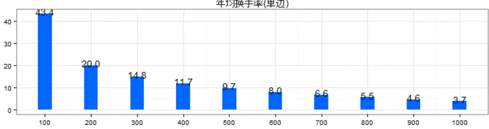

年复合收益率
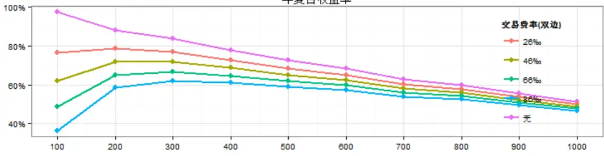

夏普比
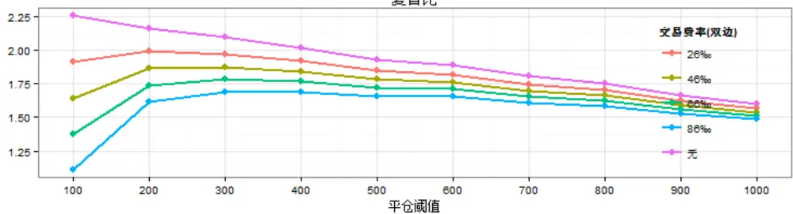
数据来源：wind 数据库, 东方证券研究所

对于同样的 alpha 源（交易热度因子），采用不定期调仓的策略组合和周度调仓策略的业绩表现相差不大，表现远好于按月度定期调仓的组合，而不定期调仓组合年均单边换手 9.67 倍，远小于周度定期调仓的 22.4倍，和月度定期调仓组合的 8.64倍相差不大。因此，采用不定期调仓的方法，可以在传统月频调仓的基础上获取周频调仓的收益水平。另外，观察策略月收益率和净值的时间序列，我们发现，策略组合在市场大波动的年份超额收益明显（如 2007 年至 2009 年以及 2015年至今），其他市场较平静的年份策略表现相对平庸。

图 12：策略组合月度收益率（相对中证 500）
不定期调仓组合：月均收益率2.58%，月胜率 82.9%)
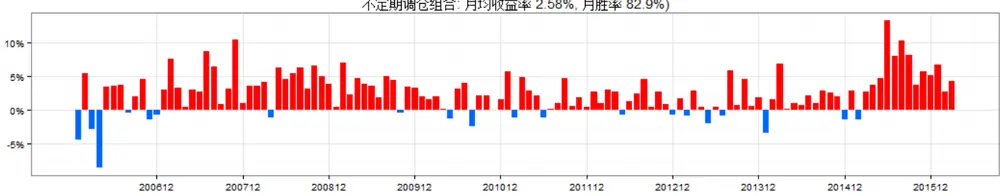

周度调仓组合：月均收益率2.37%，月胜率 83.7%)
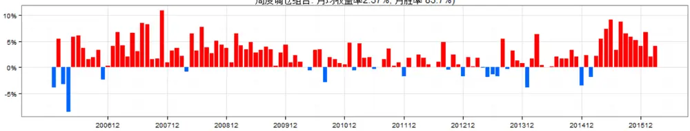

月度调仓组合：月均收益率1.63%，月胜率 76.4%)
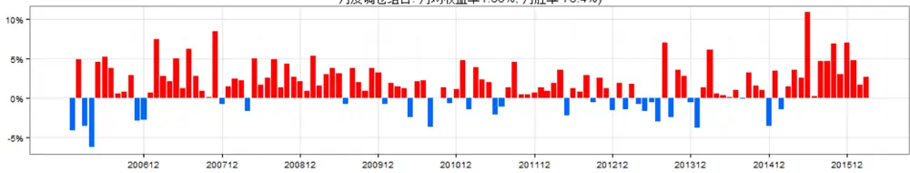
数据来源：wind 数据库, 东方证券研究所

图 13：策略对冲组合净值（中证 500）
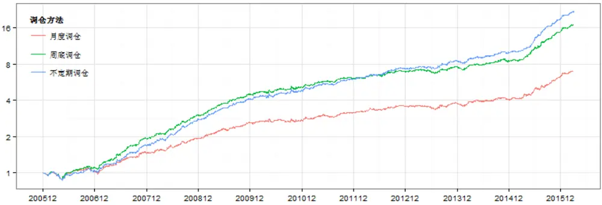
数据来源：wind 数据库, 东方证券研究所

具体策略组合（不定期调仓）各年度的表现，近 10年策略组合仅 1 年（2006年）小幅跑输沪深 300（策略 110.4%，沪深 300指数 121.0%），其他年份相对于沪深 300均获取明显的正超额收益，相对中证 500指数，近 10年策略的年胜率为 100%。从回撤的角度看，策略在获取超额收益的同时，风险水平没有提升反而明显小于同期的沪深 300 和中证 500 指数，2006 年至今策略组合的最大回撤每年均小于同期的沪深 300指数和中证 500指数。

表 6：策略组合各年度表现

|  | 累计收益率 |  |  | 夏普比 |  |  | 最大回撤 |  |  |
| --- | --- | --- | --- | --- | --- | --- | --- | --- | --- |
|  | 沪深300 | 中证500 | 策略 | 沪深300 | 中证500 | 策略 | 沪深300 | 中证500 | 策略 |
| 2016Q1 | -13.7% | -19.2% | -5.9% | -1.42 | -1.48 | -0.31 | -19.4% | -25.4% | -20.6% |
| 2015年 | 5.6% | 43.1% | 178.6% | 0.34 | 1.04 | 2.76 | -43.5% | -50.6% | -33.9% |
| 2014年 | 51.7% | 39.0% | 62.8% | 2.28 | 1.79 | 3.03 | -10.1% | -12.5% | -7.4% |
| 2013年 | -7.6% | 16.9% | 36.5% | -0.26 | 0.82 | 1.78 | -22.2% | -16.7% | -16.2% |
| 2012年 | 7.6% | 0.3% | 23.5% | 0.46 | 0.13 | 1.05 | -22.4% | -29.7% | -17.2% |
| 2011年 | -25.0% | -33.8% | -16.2% | -1.31 | -1.60 | -0.74 | -31.6% | -38.5% | -29.8% |
| 2010年 | -12.5% | 10.1% | 27.7% | -0.42 | 0.48 | 1.15 | -29.5% | -28.4% | -25.2% |
| 2009年 | 96.7% | 131.3% | 236.0% | 2.26 | 2.56 | 3.99 | -25.3% | -20.3% | -18.0% |
| 2008年 | -65.9% | -60.8% | -31.5% | -1.99 | -1.44 | -0.52 | -71.6% | -72.4% | -56.2% |
| 2007年 | 161.5% | 186.6% | 353.8% | 2.86 | 2.78 | 4.17 | -20.9% | -30.4% | -23.4% |
| 2006年 | 121.0% | 100.7% | 110.4% | 3.77 | 2.99 | 3.48 | -13.8% | -15.3% | -10.8% |

注： 2016 年的业绩截止 2016 年 3 月 31 日
数据来源：wind 数据库, 东方证券研究所

策略组合自 2006年以来各季度相对沪深 300指数的胜率为 85.4%，相对中证 500指数的胜率为 92.7%。

表 7：策略组合各季度表现

|  | 累计收益率 |  |  | 夏普比 |  |  | 最大回撤 |  |  |
| --- | --- | --- | --- | --- | --- | --- | --- | --- | --- |
|  | 沪深300 | 中证500 | 策略 | 沪深300 | 中证500 | 策略 | 沪深300 | 中证500 | 策略 |
| 2016Q1 | -13.7% | -19.2% | -5.9% | -1.42 | -1.48 | -0.31 | -19.4% | -25.4% | -20.6% |
| 2015Q4 | 16.5% | 24.4% | 42.4% | 2.46 | 2.89 | 5.28 | -7.4% | -8.0% | -6.0% |
| 2015Q3 | -28.4% | -31.2% | -8.5% | -2.17 | -1.95 | -0.27 | -28.9% | -35.3% | -27.6% |
| 2015Q2 | 10.4% | 22.8% | 51.4% | 1.16 | 2.01 | 4.37 | -21.7% | -26.5% | -19.1% |
| 2015Q1 | 14.6% | 36.3% | 41.3% | 2.19 | 6.39 | 8.47 | -9.1% | -4.7% | -3.7% |
| 2014Q4 | 44.2% | 8.3% | 11.7% | 5.82 | 1.52 | 2.36 | -4.8% | -7.4% | -6.1% |
| 2014Q3 | 13.2% | 25.3% | 32.5% | 3.40 | 5.74 | 8.55 | -2.9% | -3.4% | -2.4% |
| 2014Q2 | 0.9% | 2.2% | 4.3% | 0.32 | 0.60 | 1.21 | -7.0% | -9.1% | -7.4% |
| 2014Q1 | -7.9% | 0.3% | 5.5% | -1.76 | 0.17 | 1.33 | -10.1% | -8.8% | -7.0% |
| 2013Q4 | -3.3% | -1.1% | 6.1% | -0.67 | -0.10 | 1.47 | -8.5% | -11.3% | -5.8% |
| 2013Q3 | 9.5% | 19.7% | 26.2% | 1.65 | 3.27 | 4.83 | -6.5% | -4.4% | -3.7% |
| 2013Q2 | -11.8% | -6.1% | -6.8% | -2.23 | -0.99 | -1.39 | -18.3% | -16.7% | -16.2% |
| 2013Q1 | -1.1% | 5.2% | 9.3% | -0.08 | 1.08 | 2.11 | -10.1% | -6.2% | -4.0% |
| 2012Q4 | 10.0% | 2.4% | 5.7% | 2.01 | 0.53 | 1.10 | -9.9% | -16.7% | -14.7% |
| 2012Q3 | -6.8% | -7.8% | -0.5% | -1.32 | -1.18 | 0.03 | -11.6% | -12.6% | -8.0% |
| 2012Q2 | 0.3% | 1.6% | 4.9% | 0.15 | 0.43 | 1.26 | -10.7% | -9.4% | -7.7% |
| 2012Q1 | 4.7% | 4.6% | 12.0% | 0.92 | 0.77 | 1.85 | -8.9% | -12.6% | -9.5% |
| 2011Q4 | -9.1% | -15.3% | -12.7% | -1.64 | -2.37 | -2.17 | -16.6% | -23.5% | -22.3% |
| 2011Q3 | -15.2% | -15.8% | -10.1% | -2.89 | -2.63 | -1.66 | -17.5% | -21.2% | -15.3% |
| 2011Q2 | -5.6% | -8.4% | -4.3% | -1.25 | -1.49 | -0.89 | -14.7% | -17.5% | -14.7% |
| 2011Q1 | 3.0% | 1.3% | 11.6% | 0.70 | 0.35 | 2.64 | -7.9% | -13.7% | -6.5% |
| 2010Q4 | 6.6% | 5.9% | 9.8% | 1.05 | 0.91 | 1.80 | -14.2% | -13.8% | -9.4% |
| 2010Q3 | 14.5% | 27.2% | 31.6% | 2.66 | 4.03 | 5.27 | -4.5% | -5.4% | -3.3% |
| 2010Q2 | -23.4% | -23.0% | -21.1% | -3.65 | -2.98 | -3.04 | -24.8% | -26.4% | -24.2% |
| 2010Q1 | -6.4% | 6.0% | 12.1% | -1.26 | 1.17 | 2.53 | -11.7% | -11.7% | -7.6% |
| 2009Q4 | 19.0% | 31.9% | 39.7% | 2.70 | 3.77 | 5.04 | -9.9% | -10.5% | -8.2% |
| 2009Q3 | -5.1% | -1.5% | 10.8% | -0.32 | 0.06 | 1.23 | -25.3% | -20.3% | -18.0% |
| 2009Q2 | 26.3% | 18.5% | 32.6% | 3.95 | 2.81 | 5.01 | -7.2% | -9.0% | -6.8% |
| 2009Q1 | 38.0% | 50.3% | 63.7% | 3.97 | 4.36 | 5.86 | -13.1% | -15.8% | -11.9% |
| 2008Q4 | -19.0% | -9.2% | 7.0% | -1.48 | -0.47 | 0.79 | -23.5% | -26.3% | -19.4% |
| 2008Q3 | -19.6% | -24.1% | -10.7% | -1.57 | -1.74 | -0.62 | -37.1% | -41.1% | -31.9% |
| 2008Q2 | -26.3% | -30.4% | -22.2% | -2.09 | -2.11 | -1.63 | -31.6% | -35.2% | -27.2% |
| 2008Q1 | -29.0% | -18.3% | -7.8% | -2.89 | -1.34 | -0.49 | -34.6% | -27.4% | -20.2% |
| 2007Q4 | -4.3% | -2.7% | 13.1% | -0.42 | -0.18 | 1.87 | -20.9% | -20.7% | -15.5% |
| 2007Q3 | 48.3% | 41.8% | 61.9% | 4.55 | 3.70 | 5.27 | -7.7% | -8.8% | -7.8% |
| 2007Q2 | 35.3% | 22.5% | 30.5% | 3.29 | 1.84 | 2.50 | -15.8% | -26.1% | -21.5% |
| 2007Q1 | 36.3% | 69.5% | 89.9% | 3.56 | 5.80 | 7.36 | -11.8% | -9.0% | -8.4% |
| 2006Q4 | 45.4% | 11.3% | 14.2% | 6.85 | 2.01 | 2.95 | -4.6% | -9.5% | -6.0% |
| 2006Q3 | 0.7% | 4.4% | 10.1% | 0.22 | 0.76 | 1.71 | -13.8% | -15.3% | -10.8% |
| 2006Q2 | 31.4% | 48.6% | 46.2% | 4.33 | 5.47 | 5.46 | -8.5% | -9.3% | -8.0% |
| 2006Q1 | 14.9% | 16.3% | 14.5% | 4.10 | 4.00 | 3.78 | -4.9% | -6.7% | -4.7% |

数据来源：wind 数据库, 东方证券研究所

## 五．总结

在本篇中，我们借鉴统计套利的思想， 提出了价差偏离度的概念，试图捕捉股票相对其同类型股票的高估低估程度。价差偏离度因子本质上是一个相对意义上的反转因子，价差偏离度低，近期跑输其同类股票，股票相对处于低位，有向上回复的动力，有正的预期超额收益，价差偏离度越高，股票处于相对高位，后期有回调的压力。

价差偏离度因子业绩表现优异，过去 10年月度 RankIC-0.095，IR-0.85，分组的 top组合相对市场等权年化超额收益17.8%，而且，其稳定性也较高，IC正显著比例9.8%，负显著比例69.9%，多空组合月胜率 76.4%，最大回撤 15.16%。

价差偏离度和传统的市值因子、估值因子相关性弱，通过因子分层后分组和 Fama-Macbeth回归我们发现，传统的 1 个月反转和 3 个月反转可以被价差偏离度替代，而价差偏离度因子信息来源相对独立，不能被其他的常见因子所解释。

加总特异度、市值调整换手和价差偏离度得到的交易热度较单一因子有明显提升，不仅体现在收益水平上，RankIC-0.132，top 组合超额收益 27.7%，稳定性也大幅提升，RankIC 正显著比率仅 4.9%，负显著比率 79.7%，多空组合胜率 87.8%，回撤 11.87%，其选股对市值和行业均没有明显的偏好，另外，交易热度的信息速度相当之快，构建组合时需要注意。

传统的定期换仓的组合调整方法，调仓频率过低无法及时捕捉 alpha 因子变动带来的信息，如果调仓频率过高则会带来组合的高换手，为了克服这一矛盾，我们提出了一种不定期调仓的组合调整方法，对于交易热度 top100 组合，可以在月度定期调仓的换手水平下实现周度定期调仓的业绩。

## 风险提示

本文的研究成果基于历史数据，如果未来风格发生重大变化，部分规律可能失效。

## 分析师申明

每位负责撰写本研究报告全部或部分内容的研究分析师在此作以下声明：

分析师在本报告中对所提及的证券或发行人发表的任何建议和观点均准确地反映了其个人对该证券或发行人的看法和判断；分析师薪酬的任何组成部分无论是在过去、现在及将来，均与其在本研究报告中所表述的具体建议或观点无任何直接或间接的关系。

## 投资评级和相关定义

报告发布日后的 12个月内的公司的涨跌幅相对同期的上证指数/深证成指的涨跌幅为基准；

## 公司投资评级的量化标准

买入：相对强于市场基准指数收益率15%以上；

增持：相对强于市场基准指数收益率5%～15%；

中性：相对于市场基准指数收益率在-5%～+5%之间波动；

减持：相对弱于市场基准指数收益率在-5%以下。

未评级——由于在报告发出之时该股票不在本公司研究覆盖范围内，分析师基于当时对该股票的研究状况，未给予投资评级相关信息。

暂停评级——根据监管制度及本公司相关规定，研究报告发布之时该投资对象可能与本公司存在潜在的利益冲突情形；亦或是研究报告发布当时该股票的价值和价格分析存在重大不确定性，缺乏足够的研究依据支持分析师给出明确投资评级；分析师在上述情况下暂停对该股票给予投资评级等信息，投资者需要注意在此报告发布之前曾给予该股票的投资评级、盈利预测及目标价格等信息不再有效。

## 行业投资评级的量化标准：

看好：相对强于市场基准指数收益率5%以上；

中性：相对于市场基准指数收益率在-5%～+5%之间波动；

看淡：相对于市场基准指数收益率在-5%以下。

未评级：由于在报告发出之时该行业不在本公司研究覆盖范围内，分析师基于当时对该行业的研究状况，未给予投资评级等相关信息。

暂停评级：由于研究报告发布当时该行业的投资价值分析存在重大不确定性，缺乏足够的研究依据支持分析师给出明确行业投资评级；分析师在上述情况下暂停对该行业给予投资评级信息，投资者需要注意在此报告发布之前曾给予该行业的投资评级信息不再有效。

## 免责声明

本证券研究报告（以下简称“本报告”）由东方证券股份有限公司（以下简称“本公司”）制作及发布。

本报告仅供本公司的客户使用。本公司不会因接收人收到本报告而视其为本公司的当然客户。本报告的全体接收人应当采取必要措施防止本报告被转发给他人。

本报告是基于本公司认为可靠的且目前已公开的信息撰写，本公司力求但不保证该信息的准确性和完整性，客户也不应该认为该信息是准确和完整的。同时，本公司不保证文中观点或陈述不会发生任何变更，在不同时期，本公司可发出与本报告所载资料、意见及推测不一致的证券研究报告。本公司会适时更新我们的研究，但可能会因某些规定而无法做到。除了一些定期出版的证券研究报告之外，绝大多数证券研究报告是在分析师认为适当的时候不定期地发布。

在任何情况下，本报告中的信息或所表述的意见并不构成对任何人的投资建议，也没有考虑到个别客户特殊的投资目标、财务状况或需求。客户应考虑本报告中的任何意见或建议是否符合其特定状况，若有必要应寻求专家意见。本报告所载的资料、工具、意见及推测只提供给客户作参考之用，并非作为或被视为出售或购买证券或其他投资标的的邀请或向人作出邀请。

本报告中提及的投资价格和价值以及这些投资带来的收入可能会波动。过去的表现并不代表未来的表现，未来的回报也无法保证，投资者可能会损失本金。外汇汇率波动有可能对某些投资的价值或价格或来自这一投资的收入产生不良影响。那些涉及期货、期权及其它衍生工具的交易，因其包括重大的市场风险，因此并不适合所有投资者。

在任何情况下，本公司不对任何人因使用本报告中的任何内容所引致的任何损失负任何责任，投资者自主作出投资决策并自行承担投资风险，任何形式的分享证券投资收益或者分担证券投资损失的书面或口头承诺均为无效。

本报告主要以电子版形式分发，间或也会辅以印刷品形式分发，所有报告版权均归本公司所有。未经本公司事先书面协议授权，任何机构或个人不得以任何形式复制、转发或公开传播本报告的全部或部分内容。不得将报告内容作为诉讼、仲裁、传媒所引用之证明或依据，不得用于营利或用于未经允许的其它用途。

经本公司事先书面协议授权刊载或转发的，被授权机构承担相关刊载或者转发责任。不得对本报告进行任何有悖原意的引用、删节和修改。

提示客户及公众投资者慎重使用未经授权刊载或者转发的本公司证券研究报告，慎重使用公众媒体刊载的证券研究报告。

## 东方证券研究所

地址：上海市中山南路 318 号东方国际金融广场 26 楼

联系人： 王骏飞

电话：021-63325888*1131

传真：021-63326786

网址： www.dfzq.com.cn

Email： wangjunfei@orientsec.com.cn