## 研究结论

传统多因子 Alpha 模型大多是在全市场范围内对股票一视同仁地进行打分评价，忽视了个股之间的基本面情况差异和选股因子在不同风格股票池里的适用性，能够捕捉不同股票之间差异性的动态情景模型(DynamicContextual Alpha Model)应运而生, 并且在海外市场获得了优异的业绩。

本文借鉴了国外同行的先进经验，并根据中国 A股市场作出了相应调整，将全市场的股票按照规模、估值、成长、盈利能力和流动性水平进行了划分，并且在不同的股票类型中采取最优的因子权重配置方式，构建了一套动态情景 alpha 模型。

实证检验表明，动态情景 alpha 模型能够更加精确地捕捉横截面股票定价信息，并且大幅提升了模型对市场风格剧烈切换的适应能力，动态情景 alpha模型的月度 Rank IC 高达 12%，IC_IR 高达 1.64。

根据该动态情景模型构建的中证500指数增强策略和模拟对冲组合在超额收益和稳定性方面都大幅战胜传统 alpha 模型，月度调仓增强组合的年化收益率为 39%，信息比率高达 4.06，月度胜率高达 88%。对冲组合的年化收益率为 24%，夏普比率超过 4。

- 动态情景 alpha策略在 2016年表现优异，截至 2016年 3月 31日，中证 500增强组合超额收益率 5.83%，对冲组合收益率 7.68%，最大回撤仅 1.23%。

## 风险提示

- 研究成果基于历史数据，如未来市场结构发生重大变化，部分规律可能失效。

- 市场极端情况会导致模型失效。

报告发布日期2016 年 05 月 25 日

证券分析师朱剑涛

021-63325888*6077

zhujiantao@orientsec.com.cn

执业证书编号：S0860515060001

## 联系人雷赟

021-63325888-5091

leiyun@orientsec.com.cn

## 相关报告

| 投机、交易行为与股票收益（下） | 2016-05-12 |
| --- | --- |
| 用组合优化构建更精确多样的投资组合 | 2016-02-19 |
| 剔除行业、风格因素后的大类因子检验 | 2016-02-17 |
| 基于交易热度的指数增强 | 2015-12-14 |
| 投机、交易行为与股票收益（上） | 2015-12-07 |
| 低特质波动，高超额收益 | 2015-09-09 |
| 单因子有效性检验 | 2015-06-26 |

动态情景中证 500增强对冲组合表现：年化收益 24%，最大回撤 4.7%，夏普比4.06
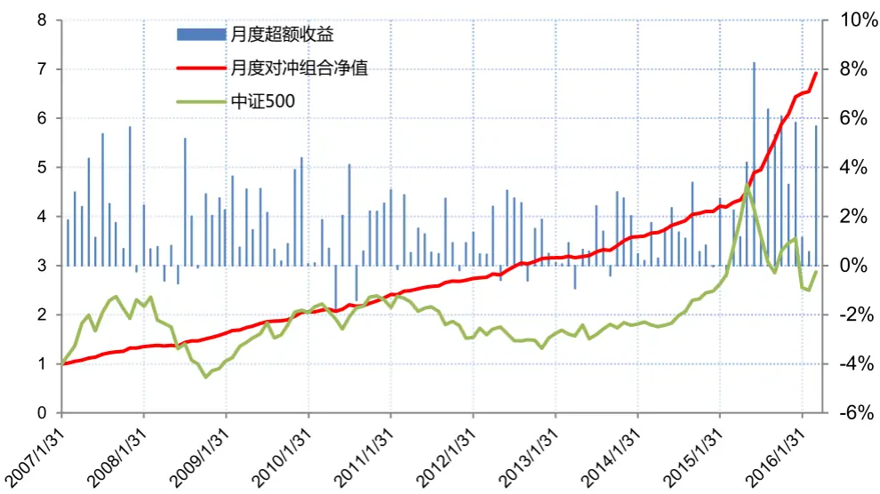

## 1. Alpha 模型之再认识

在之前的因子选股系系列报告中，我们系统地讨论了因子的检验、挑选和投资组合的构建问题。本文将着重讨论如何有效的构建 Alpha模型。首先需要明确的是，Alpha模型的最终目标是在给定的样本空间范围内稳定地预测股票未来收益率的排序，即把”好股票”和”坏股票”区分开来。构建 Alpha模型最为核心的两个步骤是因子的挑选和不同因子之间权重的分配方式。

然而，大多数传统 Alpha 模型的一个前提就是对全市场的股票进行一视同仁的打分，然后在全市场进行排序。我们知道，不同个股的基本面属性可能存在非常大的区别。比如，对于一个低估值、高 ROE 和大市值的蓝筹股，它在模型中与一个高估值、低 ROE 和小市值的成长股的可比性会大大降低，这也是传统上的基本面研究以行业或者市值作为划分标准的依据。

为了解决这个问题，人们开始尝试对每个行业进行单独建模，比如利用各种统计方法检验在每个行业内区分能力最强的因子，利用对该行业有显著效果的因子给行业内的股票进行独立打分，然后再汇总个股的得分或者排序，从而得到全市场的排序。

这种方法在一定程度上弥补了全市场统一打分模型的缺陷，承认了个股之间的差异性和不可比性，增加了 Alpha模型的广度(Breadth)。但它也存在几个重要的问题:

1. 传统上的行业分类主要依据是公司收入的来源，而公司收入来源相似不代表公司的基本面完全一致。换句话说，公司收入来源不同（属于在不同的行业）也不代表公司的基本面不同，比如同一个成熟的技术类公司相比，一个高速成长的技术类公司可能和一个高速成长的生物医药公司基本面更为相似。

2. 公司的行业属性相对稳定，但是公司的基本面并非是一成不变的。一个公司刚上市时，可能是属于小市值，高成长和高估值的成长股，但八到十年后，公司可能具有完全不同的基本面属性，比如已经成为一个大市值，高盈利和低估值的蓝筹股。单纯以行业作为划分依据难以捕捉公司基本面随时间发生的变化。

3. 同一个行业内的股票数量相对有限，统计检验出来的有效因子可能是对历史数据噪音的过度拟合，样本外的效果值得怀疑。

为了解决上述两个问题，Sorenson, Hua and Qian (2005) 首先提出 Dynamic Contextual Alpha的概念，中文叫做动态情景 Alpha 模型。这个模型摈弃了行业内打分的做法，转而根据股票基本面的属性，比如估值、成长和盈利能力等，把股票分成不同的层面，对每个层面内的股票采用单独的评价体系进行打分或者排序，最后得到每个股票的综合得分。这个模型已经成功地被运用在波士顿一家知名的量化资产管理公司-PanAgora Asset Management 的 Dynamic Equity Strategies 策略上，并且取得了优异的业绩。

在 2007年的美国 Quant Crisis 中，由于少数的市场中性量化基金的去杠杆，使得市场上的量化基金相互踩踏，净值在短时间内大幅下跌。这在一定程度上反映出了传统量化模型的同质性，即大家使用类似的因子，选出的股票也非常类似，导致组合的收益率相关性非常高，放大了量化基金的系统性风险。

如图 1 所示，据国外统计，采用动态情景模型的标普 500 指数增强基金在这次危机中明显战胜采用传统量化模型的基金，具体表现为动态情景策略年化超额收益率的中位数超过传统策略年化超额收益率中位数 80个基点以上。这说明动态情景模型只要构建恰当，能够降低同传统量化策略的相关性，并且在市场极端行情中获得稳定的超额收益。

图 1：动态情景策略在 2007 年 Quant Crisis 中的表现
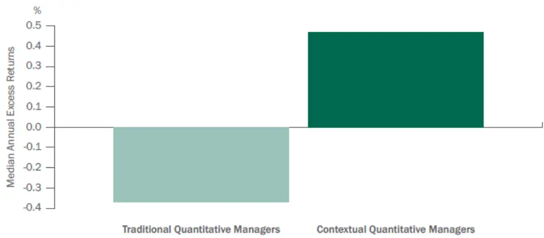
数据来源：eVestment Alliance data for Enhanced S&P 500 Index Equity Universe as of 30 September, 2009.

接下来，我们将按照动态情景模型的思想，针对 A 股市场作相应调整，构建一套类似的 DynamicContextual Alpha 模型，并且比较该模型和传统模型的区别。

## 2. 动态情景 Alpha 模型的构建

## 2.1 情景分层因子的选择

在 DCA模型的构建中，首先需要考虑的是采用什么因子对股票进行分层。分层的目标是把具有相似的基本面的股票聚集在一起，同时不同的分层应该能够刻画股票基本面上不同的属性，如规模、价值和成长性等。分层的理想结果是不同的 Alpha 因子在不同的分层(如大市值和小市值，高估值和低估值)有着显著的绩效区别。最为简单粗暴的方法则是把每个因子都作为分层因子测试一遍，统计其他因子的预测能力强度，选出综合区分能力最强的因子。但是这种方法缺乏事前逻辑的支撑，容易掉入数据窥视偏差(Data-Snooping Bias)的陷阱.对历史数据过度拟合(overfitting).

我们认为分层因子应当具有风险因子的特征，挑选的具体标准如下：

1. 因子对市场风格的切换具有较强的捕捉能力，具体表现为 Rank IC 正负显著比例之和在 70%以上。

2. 因子本身应当相对稳定，具体表现为较高的线性自相关系数(85%以上)。不同分层因子之间的因子值的横截面秩相关系数应当较低，能够在不同维度刻画股票的特征。

3. 因子定义简单，逻辑明确，因子在样本空间的覆盖率高(95%以上)，同时应当覆盖所有行业。表 1 则是 Barra CNE5 Empirical Notes (2012) 对风格因子的检验结果，从中可以看出，市值因子Size 对于风格的捕捉能力最强，具体表现为高达 89.7%的正负显著比率之和。这也同我们的直观感觉一致，从 2009 年起，小盘股在 A 股市场一骑绝尘，但是时而伴随着巨幅的大小盘风格切换，这种情况在最近三年表现的尤为突出。 其他风格因子，包括动量 Momentum, BP和 Beta因子也对 A 股市场的风格也有着较强的捕捉能力。需要注意的是，动量因子的变化频率相对较高，即使在作平滑处理以后，其截面自相关系数(Factor Stability Coeff)仍然低于 0.9.

表 1：风格因子的描述统计量(2005-2011)

| Factor Name | Average Absolute t-stat | Percent Observ. \|t\|>2 | Annual. Factor Return | Annual. Factor Volatility | Factor Sharpe Ratio | Correl. with ESTU | Factor Stability Coeff. | Variance Inflation Factor |
| --- | --- | --- | --- | --- | --- | --- | --- | --- |
| Size | 5.66 | 89.7 | -1.25 | 4.71 | -0.27 | -0.18 | 0.995 | 4.04 |
| Beta | 4.20 | 69.2 | 8.57 | 6.65 | 1.29 | 0.81 | 0.94 | 1.83 |
| Momentum | 3.26 | 64.1 | 2.78 | 3.41 | 0.82 | -0.08 | 0.87 | 2.22 |
| Residual Volatility | 3.14 | 62.8 | -7.09 | 3.94 | -1.80 | 0.46 | 0.93 | 2.14 |
| Book-to-Price | 2.45 | 51.3 | 0.02 | 3.19 | 0.01 | 0.43 | 0.96 | 2.05 |
| Non-linear Size | 2.64 | 57.7 | -2.62 | 2.75 | -0.95 | 0.23 | 0.98 | 1.40 |
| Earnings Yield | 2.09 | 42.3 | -1.38 | 2.55 | -0.54 | 0.26 | 0.94 | 2.59 |
| Liquidity | 2.42 | 47.4 | -6.75 | 2.26 | -2.98 | 0.13 | 0.94 | 1.51 |
| Leverage | 1.65 | 35.9 | 0.99 | 1.65 | 0.60 | -0.03 | 0.99 | 1.47 |
| Growth | 1.73 | 35.9 | 1.72 | 1.98 | 0.87 | 0.37 | 0.94 | 1.41 |
| Average | 2.93 | 55.64 | -0.50 | 3.31 | -0.30 | 0.24 | 0.95 | 2.07 |

数据来源：MSCI Barra

据此，我们按照之前的报告提到的方法检验了各个因子的正负显著比例、覆盖率和因子的截面自相关系数，检验区间为 2006 年 2 月到 2011 年 12 月，检验样本空间为中证全指成分股。备选的分层因子结果如下：

表 2：分层因子的初步检验

| 因子名称 Percent \|t\|>2 |  | 覆盖率 | 自相关系数 |
| --- | --- | --- | --- |
| BP_LF | 84.5% | 99.9% | 97% |
| EP_TTM | 73.8% | 96.2% | 95% |
| SP_TTM | 61.9% | 96.2% | 99% |
| ROE | 76.2% | 97.2% | 87% |
| ROIC | 81.0% | 97.3% | 92% |
| EPS1YGrowth_YOY | 59.3% | 76.2% | 80% |
| EquityGrowth_YOY | 77.8% | 98.3% | 85% |
| MV | 83.3% | 99.9% | 100% |
| Beta | 82.1% | 99.6% | 97% |
| STOQ | 76.1% | 100.0% | 92% |

数据来源：东方证券研究所，Wind

从表 2 可以看出，我们的检验结果和 Barra 的结论基本一致，市值因子 Rank IC 正负显著比例之和高达 83%，对风格具有极强的捕捉能力。估值因子中，BP的风格捕捉能力更强。成长因子中净资产同比增长率具有比 EPS 增长率更强的风格捕捉能力。另外，从覆盖率来看，除EPS1YGrowth_YOY 因子外，其他因子的覆盖率都在 95%以上。我们前面提到，分层因子的另外一个重要特点就是不同的分层因子之间的截面秩相关系数应当较低，如果两个因子之间秩相关系数很高，说明对样本空间的划分趋于一致，并没有在真正意义上增加情景模型的广度（Breadth）. 为此，我们同时检验了不同因子之间的截面秩相关系数：

表 3：分层因子的截面秩相关系数

| 因子名称 | BP_LF ROE Growth MV STOQ |  |  |  |  |
| --- | --- | --- | --- | --- | --- |
| BP_LF | - | -24% | -12% | -10% | -12% |
| EquityGrowth_YOYMVSTOQ | ROE | -24% | - | 63% | 44% |
|  | -12% | 63% |  | 33% | -9% |
|  | -10% | 44% | 33% | - | -2% |
|  | -12% | -7% | -9% -2% |  | 1 |

数据来源：东方证券研究所,Wind

从表 3 可以看出，分层因子的秩相关系数普遍较低，其中最高的则是净资产同比增长率和 ROE。这说明分层因子能够在不同的维度刻画股票的基本面属性或风格属性。至此，我们选定了如下的分层因子：

表 4：挑选出的情景分层因子

| 风格维度 | 因子名称 | 因子定义 |
| --- | --- | --- |
| 规模 | MV | 总市值 |
| 价值 | BP_LF | 最近财报的净资产/总市值 |
| 成长 | EquityGrowth_YOY | 净资产同比增长率 |
| 盈利 | ROE | 净资产收益率 |
| 流动性水平 | STOQ | 季度日均换手率 |

数据来源：东方证券研究所 WInd

初步选择出情景分层因子后，接下来我们要做的在分层因子的不同维度(如大盘股和小盘股，高成长和低成长，高估值和低估值，高盈利和低盈利)下测试其他所有因子的 IC和 IR，利用 t和 F 统计检验各类因子是否在不同分层下的IC均值和IC标准差存在显著的差别，找出存在显著差别的因子，并且试图在经济意义上找到逻辑支撑。

因子检验的细节设定如下：

1. 时间区间为 2006 年 2 月到 2011 年 12 月

2. 检验样本空间为中证全指成分股。每个月末按照分层因子首先将全样本空间等分成两块，每一块的股票数量相同，如大市值样本空间和小市值样本空间。然后计算其他因子在不同样本空间的风险调整后 Rank IC 和 IC_IR。

3. 所有的因子检验前经过中位数去极值，标准化，行业和市值的中性化处理。

不同于原始的 Rank IC，风险调整 IC 定义如下：

$$
\begin{aligned}&IC_{-}adj=Corr(f_{pure},r_{residual})\\&f_{pure}=f-b_{1}X-b_{2}\log(mktcap)\\&r_{residual}=r-m_{1}X-m_{2}\log(mktcap)\\\end{aligned}
$$

其中 X是行业虚拟变量矩阵，log(mktcap)是总市值的对数, f 是上个月末的原始因子值， r是当月个股的收益率。即每个月末进行 OLS横截面回归，得到每个股票的风险调整后因子值和风险调整后的收益率。和普通的 IC相比，风险调整 IC在一定程度上剔除了 A股的主要风格（行业和市值）对于因子绩效指标 IC的影响，更加纯净地反映出因子本身的预测能力，适合在 alpha模型中作为因子权重配置的参考指标。

首先来看估值因子在市值分层下的结果：

表 5：估值因子在规模分层下的风险调整 IC

| MV分层 | Mean |  | STD |  | IR |  | Two Sample t Test F Test |  |
| --- | --- | --- | --- | --- | --- | --- | --- | --- |
|  | High Low | High | Low | High | Low t | p value | F | p value |
| BP_LF | 5.2% | 6.2% | 0.136 0.089 | 0.38 | 0.69 -0.513 | 0.61 | 2.326 | 0.00 |
| EP_TTM | 6.0% | 3.8% | 0.117 0.128 | 0.51 | 0.29 1.075 | 0.28 | 0.838 | 0.46 |
| EP2_TTM | 6.0% | 3.7% | 0.112 0.129 | 0.54 | 0.29 1.126 | 0.26 | 0.754 | 0.24 |
| SP_TTM | 4.0% | 4.1% | 0.099 0.069 | 0.41 | 0.59 | -0.016 0.99 | 2.068 | 0.00 |
| CFP_TTM | 4.3% | 3.4% | 0.060 0.047 | 0.71 | 0.73 | 0.936 0.35 | 1.631 | 0.04 |
| DP_πTM | 2.8% | 2.2% | 0.063 0.049 | 0.44 | 0.46 | 0.577 0.56 | 1.641 | 0.04 |
| EP_FY1 | 5.9% | 3.4% | 0.125 0.076 | 0.47 | 0.45 | 1.412 0.16 | 2.704 | 0.00 |
| EP_Fwd12M | 6.0% | 3.7% | 0.127 0.075 | 0.48 | 0.49 | 1.334 0.18 | 2.831 | 0.00 |
| EBIT2EV | 5.8% | 4.3% | 0.107 0.110 | 0.54 | 0.39 | 0.801 0.42 | 0.951 | 0.84 |
| DP_FY1 | 3.1% | 1.1% | 0.073 0.044 | 0.42 | 0.26 | 1.897 0.06 | 2.819 | 0.00 |

数据来源：东方证券研究所,Wind

总体来看，估值类因子中，BP因子和 SP因子在小盘股中表现显著优于大盘股中的表现，具体表现在 IR从 0.4提升到了 0.6左右，并且 IC的方差的差别在统计上具有显著性。盈利类估值因子则在大盘股中的表现显著优于小盘股。逻辑上来看，由于小盘股的盈利通常不稳定或为负数，采用净资产或者营业收入进行估值更为合适，而大盘股通常是较为成熟的公司，采用盈利进行估值更加合理。

质量因子中在大盘股的表现由于小盘股，但是 IC的差别在统计上不显著。这也同我们的预期一致，投资者在评价相对成熟的大盘股时，更加看重的是盈利的质量。另外，成长因子在大盘股和小盘股中的表现差别并不显著。唯一的例外是 PEG 因子，PEG 因子在大盘股中的 IC 和 IR 都更高，部分原因可能是 PE因子在大盘股的效果更好。

表 6：质量因子和成长因子在规模分层下的风险调整 IC

| MV分层 | Mean |  | STD |  | IR Two Sample t Test |  | F Test |  |
| --- | --- | --- | --- | --- | --- | --- | --- | --- |
|  | High Low | High | Low | High Low | t | p value | F | p value |
| ROA | 1.9% | 1.1% | 0.127 0.141 | 0.15 | 0.08 0.353 | 0.72 | 0.808 | 0.37 |
| ROE | 3.0% | 1.5% | 0.129 0.134 | 0.23 | 0.11 0.665 | 0.51 | 0.922 | 0.73 |
| GrossMargin | 1.8% | 1.5% | 0.095 0.079 | 0.19 | 0.19 0.214 | 0.83 | 1.426 | 0.14 |
| NetMargin | 1.5% | 0.5% | 0.105 0.125 | 0.14 | 0.04 0.529 | 0.60 | 0.710 | 0.15 |
| AssetTurnover | 1.0% | 1.4% | 0.067 0.067 | 0.14 | 0.21 | -0.380 0.70 | 1.000 | 1.00 |
| InvTurnover | 0.7% | 0.1% | 0.056 0.048 | 0.12 | 0.03 | 0.600 0.55 | 1.336 | 0.23 |
| GP2Asset | 2.9% | 2.5% | 0.124 0.111 | 0.23 | 0.23 | 0.191 0.85 | 1.257 | 0.34 |
| ROIC | 3.1% | 1.9% | 0.125 0.122 | 0.25 | 0.15 | 0.570 0.57 | 1.044 | 0.86 |
| Accrual2NI | -1.4% | -1.4% | 0.064 0.067 | -0.21 | -0.21 | 0.066 0.95 | 0.926 | 0.75 |
| OperatingProfitGrowth_Qr_YOY | 4.0% | 4.1% | 0.073 0.068 | 0.55 | 0.60 | -0.050 0.96 | 1.169 | 0.51 |
| EPS1YGrowth_YOY | 2.5% | 3.2% | 0.076 0.071 | 0.33 | 0.45 | -0.532 0.60 | 1.147 | 0.57 |
| PEG | -4.8% | -3.6% | 0.088 0.072 | -0.55 | -0.50 | -0.882 0.38 | 1.468 | 0.11 |
| SalesGrowth_Qr_YOY | 3.2% | 2.9% | 0.077 0.064 | 0.42 | 0.45 | 0.245 0.81 | 1.426 | 0.14 |
| ProfitGrowth_Qr_YOY | 4.1% | 4.0% | 0.075 0.071 | 0.55 | 0.56 | 0.127 0.90 | 1.095 | 0.71 |
| EquityGrowth_YOY | 0.9% | 0.7% | 0.097 0.113 | 0.09 | 0.06 | 0.115 0.91 | 0.733 | 0.20 |
| OCFGrowth_YOY | 1.8% | 2.1% | 0.045 0.044 | 0.40 | 0.49 | -0.485 0.63 | 1.044 | 0.86 |

数据来源：东方证券研究所，Wind

对于风险和技术类因子，几乎所有因子在小盘股内的表现显著由于大盘股内的表现。比如特异度因子 IRFF，它的 IC从大盘股内的 7.9%提升到了小盘股内的 12.3%，IR从 0.88提升到了 1.73，并且 IC 的均值和方差都在统计上具有显著的差别。另外，技术指标中的反转和换手率因子在小盘股内的 IR都有了显著提升。这也与我们的直觉相一致，即小盘股相对大盘股的交易属性更强，更加容易被市场所炒作。

表 7：风险因子和技术因子在规模分层下的风险调整 IC

| MV分层 | Mean |  | STD |  | IR Two Sample t Test |  | F Test |  |
| --- | --- | --- | --- | --- | --- | --- | --- | --- |
|  | High Low | High | Low | High | Low t | p value | F | p value |
| FFMV | -2.0% | -5.2% | 0.188 0.095 | -0.11 | -0.55 1.276 | 0.20 | 3.867 | 0.00 |
| MV | -2.0% | -5.2% | 0.188 0.095 | -0.11 | -0.55 | 1.276 0.20 | 3.867 | 0.00 |
| Debt2Asset | 1.3% | -0.1% | 0.074 0.072 | 0.18 | -0.02 | 1.178 0.24 | 1.074 | 0.77 |
| ILLIQ | 4.8% | 6.7% | 0.121 0.105 | 0.40 | 0.64 | -0.984 0.33 | 1.311 | 0.26 |
| Beta | -2.5% | 1.3% | 0.172 0.094 | -0.14 | 0.14 | -1.611 0.11 | 3.336 | 0.00 |
| IVRCAPM | -8.7% | -10.7% | 0.112 0.091 | -0.78 | -1.17 | 1.138 0.26 | 1.518 | 0.08 |
| IVRFF | -9.5% | -12.1% | 0.105 0.081 | -0.90 | -1.49 | 1.639 0.10 | 1.681 | 0.03 |
| IRFF | -7.9% | -12.3% | 0.090 0.071 | -0.88 | -1.73 | 3.173 0.00 | 1.631 | 0.04 |
| Ret1M | -6.8% | -9.4% | 0.121 0.108 | -0.56 | -0.87 | 1.363 0.18 | 1.255 | 0.34 |
| Ret3M | -5.5% | -8.0% | 0.146 0.127 | -0.38 | -0.63 | 1.084 0.28 | 1.309 | 0.26 |
| PPReversal | -6.3% | -8.1% | 0.142 0.120 | -0.45 | -0.68 | 0.819 0.41 | 1.400 | 0.16 |
| CGO_3M | -6.5% | -8.5% | 0.150 0.128 | -0.43 | -0.67 | 0.875 0.38 | 1.373 | 0.19 |
| TO | -7.9% | -12.0% | 0.150 0.095 | -0.53 | -1.26 | 1.931 0.06 | 2.456 | 0.00 |
| TO_adj | -8.0% | -12.2% | 0.146 0.095 | -0.55 | -1.27 | 2.000 0.05 | 2.329 | 0.00 |

数据来源：东方证券研究所, Wind

接下来，我们用同样的方法研究因子在不同估值水平股票中的有效性。从表 8可以看出，EP 因子在高估值(低 BP)的股票中表现更加优异，而质量因子普遍在高估值的股票中表现更加优异，比如GP2Asset因子的 IC从低估值股票中的 2.3%提升到了高估值股票中的 4.1%，并且两者的差别具有统计上的显著性。这说明对于估值相对较高的公司，投资者更为关注的是公司的持续盈利能力，即公司能否继续维持现有的高估值水平。

表 8： 估值因子和质量在规模分层下的风险调整 IC

| BP分层 | Mean |  | STD |  | IR |  | Two Sample t Test |  | FTest |  |
| --- | --- | --- | --- | --- | --- | --- | --- | --- | --- | --- |
|  | High | Low | High | Low | High | Low | t p value |  | F | p value |
| 3 BP_LF | 3.8% | 2.0% | 0.057 | 0.078 | 0.66 | 0.26 | 1.519 | 0.13 | 0.535 | 0.01 |
| 4 EP_πTM | 2.0% | 4.6% | 0.116 | 0.115 | 0.17 | 0.40 | -1.334 | 0.18 | 1.008 | 0.97 |
| 5 EP2_TTM | 2.0% | 5.0% | 0.111 | 0.121 | 0.18 | 0.41 | -1.497 | 0.14 | 0.831 | 0.44 |
| 6 SP_πTM |  | 3.0% 1.4% | 0.058 | 0.059 | 0.52 | 0.25 | 1.629 | 0.11 | 0.987 | 0.96 |
| 7 CFP_TTM |  | 2.8% | 3.0% | 0.045 0.052 | 0.62 | 0.58 | -0.336 | 0.74 | 0.730 | 0.19 |
| 8 DP_πTM |  | 1.2% | 2.0% | 0.062 0.051 | 0.19 | 0.40 | -0.875 | 0.38 | 1.453 | 0.12 |
| 9 EP_FY1 |  | 1.9% | 4.5% | 0.106 0.081 | 0.18 | 0.55 | -1.645 | 0.10 | 1.720 | 0.02 |
| 10 EP_Fwd12M |  | 2.1% 4.4% | 0.109 | 0.080 | 0.19 | 0.55 | -1.423 | 0.16 | 1.849 | 0.01 |
| 11 EBIT2EV | 2.4% | 4.3% | 0.100 | 0.106 | 0.24 | 0.41 | -1.111 | 0.27 | 0.899 | 0.66 |
| 12 DP_FY1 |  | 0.4% 2.0% | 0.057 | 0.064 | 0.07 | 0.30 | -1.531 | 0.13 | 0.795 | 0.35 |
| 13 ROA |  | 0.5% 2.9% | 0.105 | 0.140 | 0.05 | 0.20 | -1.126 | 0.26 | 0.562 | 0.02 |
| 14ROE |  | 1.4% 3.3% | 0.105 | 0.133 | 0.14 | 0.25 | -0.941 | 0.35 | 0.631 | 0.06 |
| 15 GrossMargin | 0.7% | 3.0% | 0.068 | 0.078 | 0.10 | 0.39 | -1.909 | 0.06 | 0.755 | 0.24 |
| 16 NetMargin | 0.0% | 1.9% | 0.094 | 0.110 | 0.00 | 0.18 | -1.113 | 0.27 | 0.739 | 0.21 |
| 17 AssetTurnover | 1.5% | 1.1% | 0.060 | 0.071 | 0.25 | 0.16 | 0.329 | 0.74 | 0.696 | 0.13 |
| 18 InvTurnover | 0.3% | -0.3% | 0.053 | 0.051 | 0.06 | -0.06 | 0.744 | 0.46 | 1.076 | 0.76 |
| 19 GP2Asset | 2.3% | 4.1% | 0.083 | 0.117 | 0.28 | 0.35 | -1.063 | 0.29 | 0.495 | 0.00 |
| 20ROIC | 2.0% | 3.6% | 0.094 | 0.127 | 0.22 | 0.28 | -0.830 | 0.41 | 0.546 | 0.01 |
| 21 Accrual2NI | -1.3% | -0.7% | 0.054 | 0.061 | -0.24 | -0.12 | -0.563 | 0.57 | 0.786 | 0.32 |

数据来源：东方证券研究所，Wind

由于篇幅的限制，本报告省略了在其他分层下的分析结果。总体的结论是，对于基本面属性不同的公司，我们应当采取不同的评价体系，这不仅能够提升普通因子的预测能力，而且能够大幅增加单因子预测的稳定程度，使得模型对市场风格切换具有更强的适应能力。

## 2.2 构建个股的情景特征向量

前面一小节中，我们完成了对情景分层因子的挑选和分析，接下来，我们的目标是对个股在不同情景分层上的属性进行定量刻画。前面的分析中，我们按照情景因子的得分，直接把全市场的股票划分为两块。而实际操作中，属于同一分层的股票的特征可能也存在更细微的差别，比如全市场估值最高的 10%的股票和估值最高的 40%的股票可能存在一些区别，直观而言，如果一个股票的估值越高，它更加能够被高估值的特征所描绘。这里，我们定义一个距离

$$
\begin{aligned}&d=\frac{percentile(S_{i})-101}{101}\times10,ifpercentile(S_{i})\leq50\\&d=\frac{percentile(S_{i})}{101}\times10,ifpercentile(S_{i})>50\\\end{aligned}
$$

将股票在情景因子上得分的百分位排序转化为一个得分，以此描述股票的情景相似度。

图 3：股票情景相似度的几何涵义
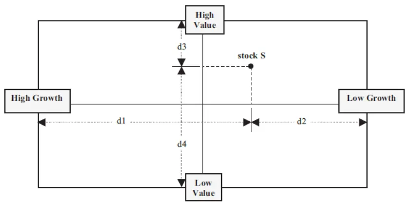
数据来源：Sorenson, Hua and Qian (2005), Journal of Portfolio Management

从图 4可以看出，但是这种方法存在一个问题，即从分位数转化为距离的函数不是连续的，即当股票的排序接近中位数时，得分出现了跳跃。另外一种方法则是采用连续函数进行转换，减小股票在两个极端的差异，同时放大股票在中位数附近的差别。相比而言，这种转换方法要更为稳健。

图 4：股票情景因子排序分位数转化为距离的方法一
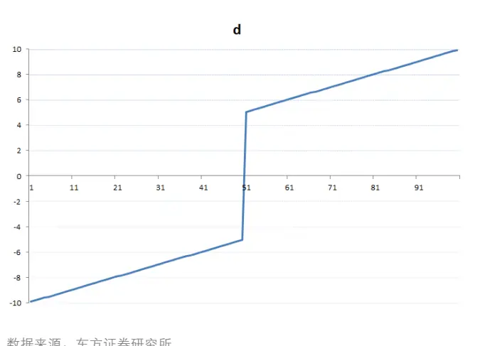
数据来源：东方证券研究所

图 5：股票情景因子排序分位数转化为距离的方法二
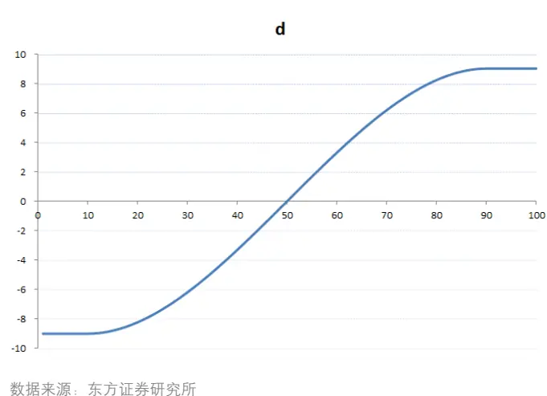

确定转换方法以后，我们根据股票在每个情景因子上的得分情况，就能够对每个股票建立如下的特征向量，这样非常方便我们比较同一时间不同个股在基本面属性上的差异性。比如创业板股票科斯伍德（300192.SZ）和蓝筹股中国石油 (601857.SH)，科斯伍德在规模上显著小于中石油，因此在低规模特征上得分较高，此外，由于创业板小盘股交投更加活跃，科斯伍德在高流动性特征上得分较高，而中石油在低流动性上得分较高。盈利能力方面，虽然科斯伍德和中石油同属于高盈利股票，但是中石油在盈利层面的得分（7.13）显著高于科斯伍德(2.01), 准确刻画了中石油的基本面特征。

表 9：科斯伍德和中国石油的个股情景特征（20121130）

| 风险情景 科斯伍德 |  |
| --- | --- |
| 规模 高 | 中国石油 0.00 9.00 |
| 低 | 9.00 0.00 |
| 价值 高 | 2.34 6.91 |
| 低 | 0.00 0.00 |
| 成长 高 | 1.35 2.01 |
| 低 | 0.00 0.00 |
| 盈利 高 | 2.01 7.13 |
| 低 | 0.00 0.00 |
| 流动性 高 | 7.13 0.00 |
| 低 | 0.00 9.00 |

数据来源：东方证券研究所,Wind

动态情景 alpha模型不仅能够在同一时间捕捉不同股票的基本面的差异，还有一个极大的优点就是能够捕捉同一只股票在不同时间基本面的变化，下面以东方财富(300059.SZ)为例，上市以来，由于东方财富的市值不断增加，高规模的情景得分从 2.99增加到了 9，另外一方面，随着创业板估值水平的提高，低价值情景的权重得分从 0.34大幅增加到 9，其盈利能力的改善也完整地反映在了模型权重的变化中。

表 10：东方财富在不同时点的个股情景特征

| 风险情景 | 2011/12/30 2015/9/30 |
| --- | --- |
| 规模 高 | 2.99 9.00 |
| 低 | 0.00 0.00 |
| 价值 高 | 0.00 0.00 |
| 低 | 0.34 9.00 |
| 成长 高 | 0.00 8.97 |
| 低 | 4.83 0.00 |
| 盈利 高 | 0.00 9.00 |
| 低 | 6.19 0.00 |
| 流动性 高 |  |
| 低 | 7.54 9.00 0.00 0.00 |

数据来源：东方证券研究所，Wind

## 2.3 情景模型的因子加权矩阵

我们在前面提到过，同样的因子在不同的情景分层中的预测能力和预测的稳定程度存在着显著的差别。因此，在不同的情景分层中，我们需要给同样的因子不同的权重。本文采用因子过去 12个月的风险调整 IC的均值除以标准差作为因子加权的依据：

$$
w_{k}=\frac{mean(IC_{-}adj_{k})}{std(IC_{-}adj_{k})}
$$

根据样本内的检验结果，我们首先挑选如下的因子作为 Alpha因子：

表 11：样本内选择的 Alpha 因子

| 因子名称 | 因子定义 |
| --- | --- |
| BP_LF | 最近财报的净资产/总市值 |
| EP2_TTM | 剔除非经常性损益的过去12个月净利润/总市值 |
| SP_TTM | 过去12 个月总营业收入/总市值 |
| GP2Asset | 销售毛利润/总资产 |
| PEG | TTM PE/预测未来 2 年净利润复合增长率 |
| ProfitGrowth_Qr_YOY | 净利润增长率（季度同比） |
| PPReversal | 5 日均价/60 日成交均价 |
| TO_adj | 以流通股本计算的20 日日均换手率 |
| IRFF | 1 - Fama-French 回归 R 方 |

数据来源：东方证券研究所,Wind

图 6：因子加权矩阵(2011 年 12 月 30 日)

|  |  | Value | Quality | Growth |  | Risk & Technical |  |
| --- | --- | --- | --- | --- | --- | --- | --- |
| 风险情景 | BP_LF EP2_TTM | SP_TTM | GP2Asset | PEG | ProfitGrowth | PPReversal TO_adj | IRFF |
| 规模 高 | 5.0% | 11.5% 3.5% | 6.3% | 15.9% | 18.6% | 5.3% | 17.8% 16.0% |
| 低 | 8.5% | 6.2% 5.7% | 3.6% | 14.8% | 9.0% | 7.6% | 17.1% 27.5% |
| 价值 高 | 10.8% | 5.7% 4.9% | 0.0% | 11.2% | 18.0% | 7.1% | 15.5% 26.8% |
| 低 | 3.8% | 9.0% 2.7% | 10.5% | 15.5% | 16.5% | 5.5% | 16.2% 20.2% |
| 成长 高 | 4.9% | 7.2% 4.5% | 9.1% | 11.9% | 18.5% | 5.1% | 16.8% 22.0% |
| 低 | 8.2% | 9.8% 4.2% | 3.7% | 15.0% | 10.1% | 9.3% | 15.2% 24.5% |
| 盈利 高 | 6.3% | 5.7% 4.3% | 7.2% | 9.1% | 20.0% | 7.8% | 20.6% 18.9% |
| 低 | 10.2% | 5.7% 5.2% | 0.0% | 14.6% | 10.6% | 8.1% | 17.1% 28.6% |
| 流动性 高 | 6.4% | 7.7% 4.7% | 8.3% | 17.5% | 11.9% | 6.6% | 13.1% 23.7% |
| 低 | 4.6% | 8.5% 1.3% | 1.6% | 17.8% | 19.1% | 6.2% | 21.4% 19.5% |
| 总权重 | 18.6% |  | 5.0% | 29.6% |  | 46.7% |  |

数据来源：东方证券研究所,Wind

结合单因子的风险调整 IC，每个月我们都能得到如图 6 所示的因子加权矩阵。从规模分层来看，模型在大盘股中提升了 EP 和质量因子的权重，同时降低了 BP、SP、技术类和风险因子的权重。另一方面，在低价值股票中，质量因子的权重也得到大幅提升，从 0 提升到了 10.5%。这种因子的加权方式有效地反映出了同样的因子在不同风险分层中的重要性。图 6 最后一行是每一大类因子的最终权重，其中风险和技术类因子权重最高，超过 45%。成长类因子权重其次，接近 30%。权重最低的则是质量因子，仅 5%。这也在一定程度上反映出 A 股市场当时的市场价值评估体系：市场炒作氛围浓厚，技术和特质风险因子占主要地位，而在财务指标中，相比估值水平和盈利质量，投资者更加关注公司的短期成长性。

## 3. 模型回溯测试

至此，我们已经完成了动态情景多因子模型各个组成部分的构建。结合个股的因子得分、个股的情景特征向量和因子的加权矩阵，不难计算出每个股票的模型综合得分。接下来，我们将对 DCAM模型的显著性进行初步检验，并且同全市场 IR加权模型和等权多因子模型进行横向比较。

模型检验的相关设定如下：

1. 检验时间区间为 2007 年 1 月 31 日到 2016 年 3 月 31 日

2. 样本空间分别每个月末的中证全指成分股、中证 500成分股和沪深 300成分股

3. 构建组合时，剔除样本空间内的停牌股票，然后按照因子值分为 10 组，构建 10 个等权组合，多空组合为做多第 1组，做空第 10组，基准为相应样本空间的等权组合。

4. 检验的模型包括：动态情景 Alpha 模型 (DCAM), 静态 Alpha 模型(SM), 等权 Alpha 模型(EQM)

从表 12 可以看出，动态情景模型在所有样本空间内均战胜了 IR 加权和等权多因子模型。在中证全指内，DCAM的月度 IC接近 12%，其 IC_IR一举突破 1.6. IC的正显著比率超过 90%，在采用相同的 Alpha 因子的条件下，动态情景模型同时提升了模型的预测能力和预测稳定程度，表现十分突出。此外，动态情景模型在中证 500 和沪深 300 样本空间内均战胜其他两个模型，其中在中证 500 内动态情景模型的 IC 超过 12%. 由于动态情景模型构建时考虑了不同股票的基本面差异，使得它在不同样本空间内都具有稳健的表现。

表 12：模型在不同样本空间内 IC指标

| 样本空间 | Alpha 模型 | RanklC | t(IC) | IR | 正显著率 | 负显著率 | 自相关系数 |
| --- | --- | --- | --- | --- | --- | --- | --- |
| 中证全指 | DCAM | 11.9% | 17.17 | 1.64 | 90.9% | 1.8% | 61% |
|  | SM | 11.6% | 16.74 | 1.60 | 90.0% | 1.8% | 62% |
|  | EQM | 11.1% | 12.94 | 1.23 | 79.1% | 5.5% | 77% |
| 中证500 | DCAM | 12.2% | 15.27 | 1.46 | 70.0% | 0.9% | 60% |
|  | SM | 12.1% | 15.00 | 1.43 | 69.1% | 0.9% | 62% |
|  | EQM | 11.4% | 12.03 | 1.15 | 62.7% | 0.9% | 77% |
| 沪深300 | DCAM | 8.7% | 4.87 | 0.68 | 54.9% | 9.8% | 63% |
|  | SM | 8.2% | 4.48 | 0.63 | 49.0% | 9.8% | 65% |
|  | EQM | 7.0% | 3.22 | 0.45 | 35.3% | 11.8% | 82% |

数据来源：东方证券研究所,Wind

表 13展示的是模型在不同样本空间内的等权多空组合的绩效情况。可以看出，多空组合的表现同IC 的表现情况基本一致，动态情景模型在中证全指和中证 500 中都具有更高的夏普比和更低的回撤。而在沪深 300 中，与 IC 的检验结果不同是，动态情景模型的夏普比率略低于 IR 加权模型，这可能是由于在沪深 300 中等权组合构建的方式带来了较大的市值风险暴露所致。此外，从 Top组合的月均换手率来看，动态情景模型和 IR 加权模型的换手率都明显高于等权多因子模型，但是动态情景模型的换手率和 IR加权模型的换手率基本一致，都在 60%左右。

表 13：模型在不同样本空间内的多空组合绩效

| 样本空间 | Alpha 模型 | 年化 收益率 | 年化 波动率 | 夏普 比率 | 月度 胜率 | 最大 回撤 | 月均 换手率 |
| --- | --- | --- | --- | --- | --- | --- | --- |
| 中证全指 | DCAM | 42.5% | 11.9% | 3.59 | 88.2% | 8.5% | 60.9% |
|  | SM | 40.7% | 12.0% | 3.39 | 88.2% | 8.7% | 59.2% |
|  | EQM | 38.4% | 13.6% | 2.83 | 78.2% | 10.1% | 48.4% |
| 中证 500 | DCAM | 41.8% | 13.3% | 3.13 | 86.4% | 11.5% | 61.9% |
|  | SM | 41.7% | 13.6% | 3.07 | 82.7% | 10.9% | 60.4% |
|  | EQM | 37.3% | 14.4% | 2.59 | 77.3% | 15.2% | 48.4% |
| 沪深 300 | DCAM | 21.9% | 13.9% | 1.58 | 66.4% | 12.8% | 48.6% |
|  | SM | 22.2% | 13.7% | 1.62 | 67.3% | 13.2% | 48.4% |
|  | EQM | 22.9% | 15.5% | 1.48 | 64.5% | 16.4% | 39.7% |

数据来源：东方证券研究所,Wind

最后，我们单独展示动态情景模型在中证全指内的各项绩效指标，包括各分组超额收益率，模型IC 和多空组合的月度数据。

图 7：DCAM 模型分组平均年化超额收益
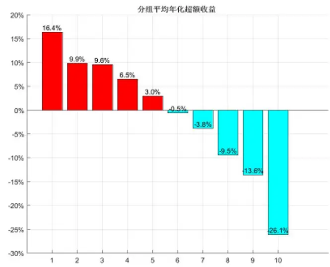
数据来源：东方证券研究所、Wind

图 8：DCAM 模型分数分布
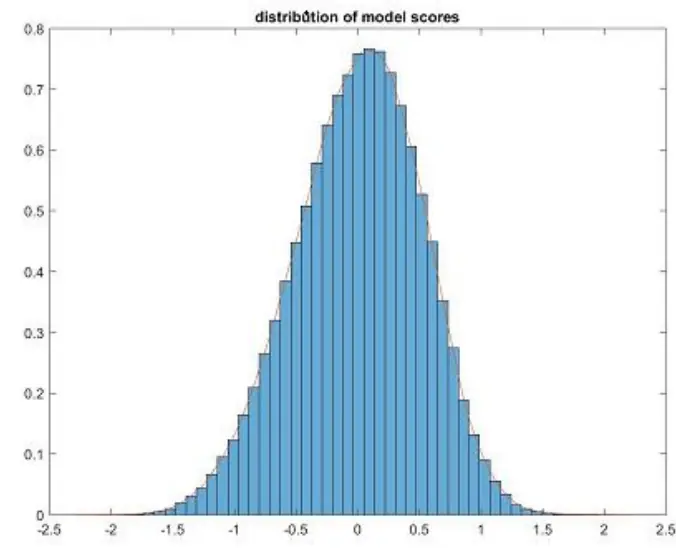
数据来源：东方证券研究所、Wind

从分组的平均年化超额收益来看，第1组高达16.4%，第10组为-26.1%. 同时超额收益单调下降。从分组组合的 IR 来看，第 1 组和第 3 组最高，第 2 组略低，换手率方面第 1 组和第 10 组稍低，中间的组合换手率非常高，月度单边都在 85%以上。TOP 组合在市场下跌时的胜率要高于市场上涨时的胜率，显示出一定的抗跌能力。此外，从图 9 可以看出，模型的 Rank IC 表现出极佳的稳定性，正显著比例一举突破 90%，更加难得的是负显著比例仅 1.8%，使得模型的 IC_IR一举突破1.60，创造了新的记录。

表 14：DCAM 模型的分组组合超额收益绩效情况

|  | Port_1 | Port_2 | Port_3 | Port_4 | Port_5 | Port_6 | Port_7 | Port 8 | Port_9 | Port_10 |
| --- | --- | --- | --- | --- | --- | --- | --- | --- | --- | --- |
| Alpha_Ret | 16.39% | 9.88% | 9.58% | 6.50% | 2.96% | -0.54% | -3.81% | -9.45% | -13.60% | -26.12% |
| Alpha_Tstat | 7.88 | 6.44 | 8.21 | 4.94 | 2.17 | -0.41 | -2.46 | -4.81 | -6.68 | -10.12 |
| Alpha_IR | 0.75 | 0.61 | 0.78 | 0.47 | 0.21 | (0.04) | (0.23) | (0.46) | (0.64) | (0.96) |
| Turnover | 61% | 81% | 85% | 87% | 87% | 87% | 87% | 86% | 83% | 64% |
| HitRate_All | 80% | 73% | 79% | 66% | 59% | 51% | 41% | 29% | 20% | 16% |
| HitRate_Up | 78% | 69% | 80% | 66% | 63% | 55% | 48% | 40% | 29% | 25% |
| HitRate_Down | 84% | 80% | 80% | 67% | 56% | 47% | 33% | 13% | 7% | 4% |

数据来源：东方证券研究所,Wind

图 9：DCAM 模型的 IC和多空组合收益率月度数据
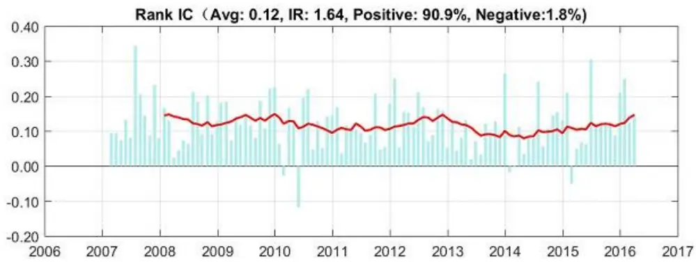

多空组合月度收益(均值:3.54%月度胜率:88.2%)
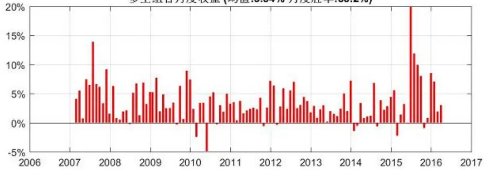
数据来源：东方证券研究所, Wind

最后，我们再来看以下 DCAM模型的 IC衰减速度，从图 10可以看出，当滞后一个月建仓时，模型的 Rank IC从 12%衰减到了5%左右，模型的 IC半衰期小于 1个月，说明模型的信息衰减较快，实际构建组合时可能需要进行周度级别的调仓来维持组合的 alpha暴露。

图 10：DCAM 模型的月度 IC衰减情况
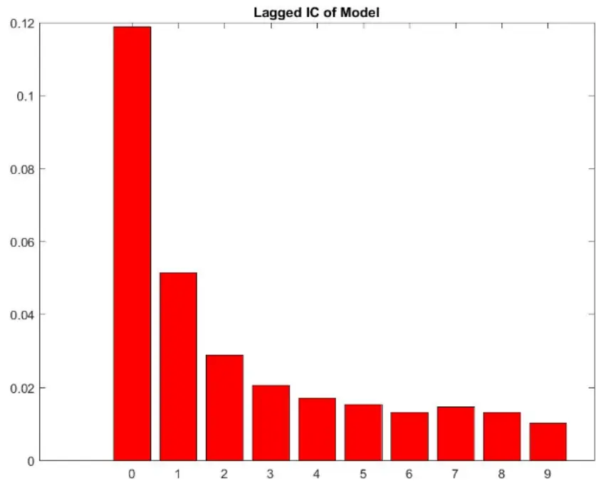
数据来源：东方证券研究所,Wind

## 3.1 Fama-Macbeth 资产定价检验

从上面的测试结果我们发现在所有的样本空间中，同静态和等权多因子模型相比，动态情景模型都具有更高的 Rank IC和 IR，同时具有更低的多空组合回撤和更高的多空组合夏普比，表现出了惊人的稳健性。但是直观的比较并不足以证明动态情景模型一定优于普通的静态 IR 加权模型，接下来，我们采用 Fama-Macbeth (1973) 的方法，检验 DCAM模型是否在普通的静态 IR加权模型上提供了新的有效定价信息。回归方程采用月度数据，从 2007 年 1 月到 2016 年 2 月共 110 个月，样本空间为中证全指成分股。

为了检验 DCAM模型和 SM模型之间的相互替代作用，检验分两步进行：

在第一个回归中，因变量为个股的下期的月收益率，自变量包括期初的 Beta, 市值对数 Size, SM模型的得分，动态模型的残差得分(每个月用动态模型的得分对静态模型得分回归，得到残差)。这种方法可以在控制静态模型的基础上，检验动态模型有没有增加额外的信息。从图 7 的 Panel A来看，动态模型的残差得分的确捕捉到了额外的信息，回归系数为正，并且在 1%水平上是显著的。

在第二个回归中，因变量仍然保持不变，自变量包括初的 Beta, 市值对数 Size, SM模型的残差得分(每个月用静态模型的得分对动态模型得分回归，得到残差)，动态模型的得分。这种方法可以在控制动态模型的基础上，检验静态模型有没有增加额外的信息。从图 7的 Panel B来看，SM模型的残差得分的回归系数不仅是负的，而且在统计上是显著的。

Fama-Macbeth 检验结果表明，DCAM 模型的确包含了超过 SM 模型的额外的定价信息，DCAM模型对 SM模型有替代作用。

图 11：DCAM 模型 Fama-Macbeth 资产定价检验

| Panel A: |  |  |  |  |  |
| --- | --- | --- | --- | --- | --- |
|  | Intercept | Beta | Size | Static | resid_Dynamic |
| Coeff | 0.023 | 0.000 | -0.010 | 0.010 | 0.038 |
| T_stat | 2.14 | -0.25 | -4.57 | 11.38 | 4.90 |
| Panel B: |  |  |  |  |  |
| Coeff | Intercept | Beta 0.000 | Size -0.010 | resid_Static -0.018 | Dynamic 0.010 |
|  | 0.023 |  |  |  |  |
| T_stat | 2.14 | -0.25 | -4.57 | -2.34 | 11.55 |

数据来源：东方证券研究所，Wind

## 3.2 量化指数增强策略

最后，我们将把动态情景 Alpha 模型应用在中证 500 指数增强策略上，进一步检验模型的实践效果。由于这里我们的主要目的是比较不同模型的差别，因此没有采用组合优化的方法，简单起见，仍然采用行业分层选股构建组合的方法，回测的相关假定如下：

1. 检验时间区间为 2007 年 1 月 31 日到 2016 年 3 月 31 日

2. 样本空间为每个月末的中证全指成分股，基准为中证 500指数

3. 构建组合时，剔除样本空间内的停牌股票，然后选择每个申万一级行业内 alpha 模型得分最高的 10%的股票，行业内采取等权配置，行业权重按照月末的基准行业权重配置。

4. 交易成本设置为单边千分之三

5. 检验的模型包括：动态情景 Alpha 模型 (DCAM), 静态 Alpha 模型(SM), 等权 Alpha 模型(EQM)

不同模型的分年份各项绩效如表 15-17 所示，从策略的年化超额收益率来看，DCAM 模型都要高于 SM 模型和 EQM模型， DCAM模型在提高年化超额收益率的同时还大幅提升了策略的稳定程度，从 2007 年 2 月到 2015 年末，策略的信息比率高达 4.06，远高于同期的 SM 模型(3.86) 和EQM 模型(3.47)。胜率方面，DCAM 模型的月度胜率高达 88%，远远超过 EQM 模型的 80%，也要超过 SM模型的 84%。

值得注意的是 2013 年的策略各项绩效。对于采用多因子模型进行量化对冲的投资者来说，2013年是一个极为特殊的年份。在前几年表现优异的估值类因子经历了长达半年的失效，而大家所依赖的反转因子也经历了连续几个月的回撤，这对于大多数不依靠超配小市值股票或缺超额收益的“真Alpha”策略的确是较为艰难的一年。而我们之间提到过，动态情景模型的一个优点就是对市场风格的切换具有较强的适应能力。从回测结果来看也的确如此，DCAM模型在 2013年仍然维持了高达 83%的月度胜率，远远超过 SM模型的 67%和 EQM模型的 58%。同时，DCAM模型的超额收益率和信息比等各项绩效也要远远超过其他两个模型。

表 15：动态情景模型的策略分段绩效

| DCAM | 基准收益率 | 策略收益率 | 超额收益 | 跟踪误差 | 信息比率 | 对冲收益率 | 最大回撤 | 月度胜率 |
| --- | --- | --- | --- | --- | --- | --- | --- | --- |
| 2007 | 130.9% | 199.3% | 68.4% | 6.99% | 4.29 | 30.0% | 1.79% | 91% |
| 2008 | -60.8% | -52.7% | 8.1% | 6.65% | 3.19 | 21.2% | 3.66% | 75% |
| 2009 | 131.3% | 194.7% | 63.5% | 5.09% | 5.38 | 27.4% | 2.37% | 100% |
| 2010 | 10.1% | 24.9% | 14.8% | 5.50% | 2.38 | 13.1% | 4.06% | 83% |
| 2011 | -33.8% | -22.9% | 11.0% | 3.93% | 4.19 | 16.5% | 2.13% | 83% |
| 2012 | 0.3% | 17.8% | 17.5% | 3.76% | 4.63 | 17.4% | 1.64% | 83% |
| 2013 | 16.9% | 32.2% | 15.3% | 4.13% | 3.13 | 12.9% | 2.30% | 83% |
| 2014 | 39.0% | 58.5% | 19.5% | 3.88% | 3.61 | 14.0% | 3.39% | 92% |
| 2015 | 43.1% | 124.9% | 81.8% | 10.11% | 6.03 | 60.9% | 4.68% | 92% |
| 07-15 | 12.4% | 39.0% | 26.5% | 5.91% | 4.06 | 24.0% | 4.68% | 88% |
| 2016Q1 | -19.2% | -13.4% | 5.8% | 5.39% |  | 7.7% | 1.23% |  |

数据来源：东方证券研究所,Wind

表 16：静态 IR加权模型的策略分段绩效

| SM | 基准收益率 | 策略收益率 | 超额收益 | 跟踪误差 | 信息比率 | 对冲收益率 | 最大回撤 | 月度胜率 |
| --- | --- | --- | --- | --- | --- | --- | --- | --- |
| 2007 | 130.9% | 199.2% | 68.3% | 6.97% | 4.29 | 29.9% | 1.84% | 91% |
| 2008 | -60.8% | -52.7% | 8.1% | 6.75% | 3.14 | 21.2% | 3.85% | 83% |
| 2009 | 131.3% | 189.3% | 58.1% | 5.35% | 4.69 | 25.1% | 2.64% | 100% |
| 2010 | 10.1% | 22.6% | 12.5% | 5.56% | 1.98 | 11.0% | 4.16% | 75% |
| 2011 | -33.8% | -22.0% | 11.8% | 3.96% | 4.48 | 17.8% | 2.05% | 83% |
| 2012 | 0.3% | 16.5% | 16.2% | 3.75% | 4.30 | 16.1% | 1.71% | 83% |
| 2013 | 16.9% | 30.3% | 13.4% | 4.21% | 2.70 | 11.4% | 3.01% | 67% |
| 2014 | 39.0% | 58.2% | 19.2% | 3.81% | 3.62 | 13.8% | 3.81% | 83% |
| 2015 | 43.1% | 120.9% | 77.8% | 10.16% | 5.72 | 58.1% | 4.68% | 92% |
| 07-15 | 12.4% | 37.9% | 25.4% | 5.96% | 3.86 | 23.0% | 4.68% | 84% |
| 2016Q1 | -19.2% | -13.4% | 5.8% | 5.26% |  | 7.6% | 1.26% |  |

数据来源：东方证券研究所,Wind

表 17：等权模型的策略分段绩效

| EQM | 基准收益率 | 策略收益率 | 超额收益 | 跟踪误差 | 信息比率 | 对冲收益率 | 最大回撤 | 月度胜率 |
| --- | --- | --- | --- | --- | --- | --- | --- | --- |
| 2007 | 130.9% | 203.8% | 72.9% | 8.65% | 3.58 | 31.0% | 3.46% | 91% |
| 2008 | -60.8% | -52.6% | 8.2% | 6.97% | 3.14 | 21.9% | 3.38% | 75% |
| 2009 | 131.3% | 177.0% | 45.8% | 4.51% | 4.37 | 19.7% | 2.24% | 92% |
| 2010 | 10.1% | 21.5% | 11.4% | 6.14% | 1.61 | 9.9% | 4.74% | 75% |
| 2011 | -33.8% | -23.4% | 10.4% | 4.32% | 3.57 | 15.4% | 2.30% | 67% |
| 2012 | 0.3% | 19.8% | 19.6% | 3.88% | 5.01 | 19.4% | 1.40% | 83% |
| 2013 | 16.9% | 24.9% | 8.1% | 4.80% | 1.36 | 6.5% | 6.15% | 58% |
| 2014 | 39.0% | 62.3% | 23.3% | 4.23% | 3.89 | 16.5% | 3.19% | 92% |
| 2015 | 43.1% | 114.4% | 71.3% | 10.10% | 5.27 | 53.2% | 3.89% | 83% |
| 07-15 | 12.4% | 36.7% | 24.3% | 6.28% | 3.47 | 21.8% | 6.15% | 80% |
| 2016Q1 | -19.2% | -13.7% | 5.5% | 5.06% |  | 7.1% | 0.75% |  |

数据来源：东方证券研究所,Wind

从图 12 也可以看出，在 2013 年各个模型的经历了一定程度的回撤，但是 DCAM 模型最为稳健，而等权模型 EQM 则经历了较大程度的回撤，进一步体现出 DCAM 模型的对市场风格切换较强的适应能力。此外，从表 18 页可以看出，动态情景模型策略的胜率，年化收益率，年化波动率和夏普比率均优于其他两个模型。

图 12：模拟对冲组合的净值曲线
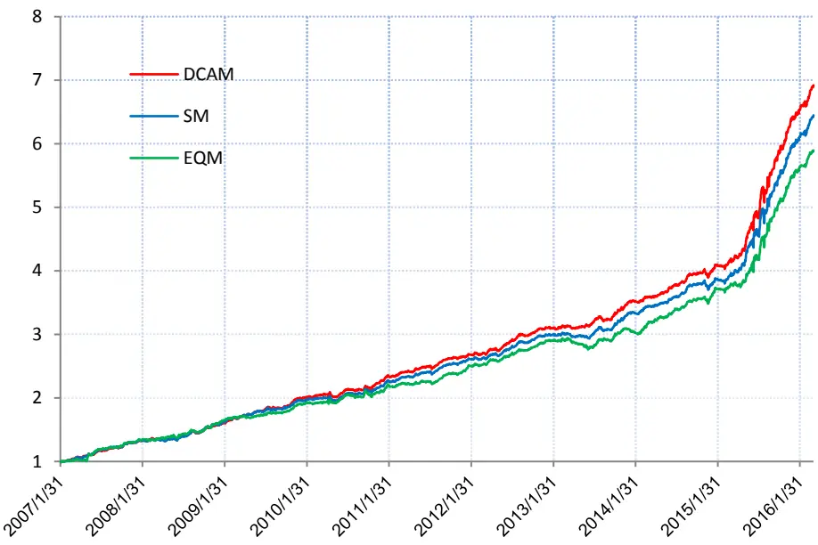
数据来源：东方证券研究所,Wind

表 18：不同模型的模拟对冲组合综合绩效对比

| 2007/1/31-2015/12/31 | 动态情景 | 静态IR 加权 | 等权多因子 |
| --- | --- | --- | --- |
| 对冲组合净值 | 6.922 | 6.446 | 5.895 |
| 日度胜率 | 60.8% | 60.2% | 58.0% |
| 月度胜率 | 88% | 84% | 80% |
| 年化收益率 | 24.0% | 23.0% | 21.8% |
| 年化波动率 | 5.9% | 6.0% | 6.3% |
| 夏普比率 | 4.06 | 3.86 | 3.47 |
| 最大回撤 | 4.68% | 4.68% | 6.15% |
| 最大回撤开始日期 | 20150820 | 20150817 | 20130403 |
| 最大回撤结束日期 | 20150825 | 20150825 | 20130703 |
| 换手率(月度单边) | 64% | 63% | 53% |

数据来源：东方证券研究所,Wind

最后，图 13 展示了 DCAM 模型增强策略的月度超额收益率，模拟月度对冲组合的净值和基准中证 500 的净值，其中左轴是净值，右轴是月度超额收益率。我们可以看到，策略表现出了超高的月度胜率和惊人的稳健性，在超过 88%的月份，策略都战胜了基准，而策略跑输基准的月份中，负的超额收益都非常小，很少有超过 1%的情况出现。2016年一季度三个月全部盈利。

图 13：DCAM 模型对冲策略历史净值和月度超额收益
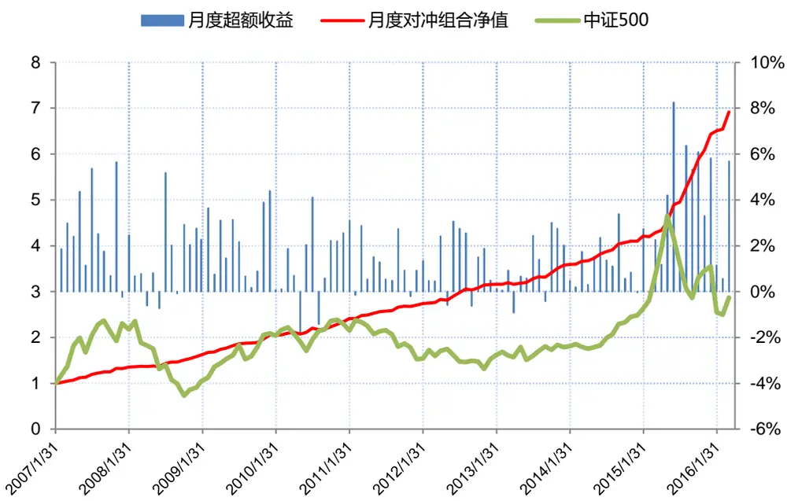
数据来源：东方证券研究所,Wind

## 4. 研究结论

本文首先对传统多因子 Alpha 模型中对所有股票一视同仁进行的打分体系提出质疑，指出基本面差异较大的股票不适合在模型中直接比较。然后借鉴国外同行的研究经验，并根据中国 A 股市场作出了相应调整，构建了一套动态情景 alpha模型。

模型的构建过程主要包括：

1. 选择恰当的情景分层因子来捕捉市场的风格切换。

2. 对每个股票在不同情景分层的相似度进行度量。

3. 决定每个情景分层内不同因子的最优权重。

实证检验表明，相比传统的 alpha模型，动态情景 alpha模型能够更加精确地捕捉横截面股票定价信息，并且大幅提升了模型对市场风格剧烈切换的适应能力，动态情景 alpha模型的月度 Rank IC高达 12%，IC_IR 一举突破 1.60。

依据该动态情景模型构建的中证 500 指数增强策略和模拟对冲组合在超额收益和稳定性方面都大幅战胜传统 alpha模型，模拟对冲组合最近 9年的夏普比率一举突破 4.0。

值得指出的是，由于沪深 300 指数的特殊性，情景 alpha 模型也并非一劳永逸的处理方式，对于某些特殊的行业，如银行和非银行金融业，仍然需要开发专门的行业选股模型(Industry Model)。

## 5. 参考文献

D.J.Orr, Igor M., Adam. N., “The Barra China Equity Model (CNE5) Empirical Notes.” July 2012. Fama, Eugene.,MacBeth, James., "Risk, Return, and Equilibrium: Empirical Tests". Journal of Political Economy 81 (3): 607–636, 1973

Sorensen, Eric H., Hua, Ronald, and Qian, Edward E., “Contextual Fundamentals, Models, and Active Management.” February 2005.

## 风险提示

Alpha 模型的有效性是基于全市场股票大样本数据的统计分析，是一个整体性的大概率结论，并不百分百保证得分高的股票未来一定获利。

- 量化模型基于历史数据分析而得，存在模型失效的风险，市场极端行情和黑天鹅事件也可能对模型效果造成较大冲击；股市有风险，投资须谨慎！

## 分析师申明

每位负责撰写本研究报告全部或部分内容的研究分析师在此作以下声明：

分析师在本报告中对所提及的证券或发行人发表的任何建议和观点均准确地反映了其个人对该证券或发行人的看法和判断；分析师薪酬的任何组成部分无论是在过去、现在及将来，均与其在本研究报告中所表述的具体建议或观点无任何直接或间接的关系。

## 投资评级和相关定义

报告发布日后的 12个月内的公司的涨跌幅相对同期的上证指数/深证成指的涨跌幅为基准；

## 公司投资评级的量化标准

买入：相对强于市场基准指数收益率15%以上；

增持：相对强于市场基准指数收益率5%～15%；

中性：相对于市场基准指数收益率在-5%～+5%之间波动；

减持：相对弱于市场基准指数收益率在-5%以下。

未评级——由于在报告发出之时该股票不在本公司研究覆盖范围内，分析师基于当时对该股票的研究状况，未给予投资评级相关信息。

暂停评级——根据监管制度及本公司相关规定，研究报告发布之时该投资对象可能与本公司存在潜在的利益冲突情形；亦或是研究报告发布当时该股票的价值和价格分析存在重大不确定性，缺乏足够的研究依据支持分析师给出明确投资评级；分析师在上述情况下暂停对该股票给予投资评级等信息，投资者需要注意在此报告发布之前曾给予该股票的投资评级、盈利预测及目标价格等信息不再有效。

## 行业投资评级的量化标准：

看好：相对强于市场基准指数收益率5%以上；

中性：相对于市场基准指数收益率在-5%～+5%之间波动；

看淡：相对于市场基准指数收益率在-5%以下。

未评级：由于在报告发出之时该行业不在本公司研究覆盖范围内，分析师基于当时对该行业的研究状况，未给予投资评级等相关信息。

暂停评级：由于研究报告发布当时该行业的投资价值分析存在重大不确定性，缺乏足够的研究依据支持分析师给出明确行业投资评级；分析师在上述情况下暂停对该行业给予投资评级信息，投资者需要注意在此报告发布之前曾给予该行业的投资评级信息不再有效。

## 免责声明

本证券研究报告（以下简称“本报告”）由东方证券股份有限公司（以下简称“本公司”）制作及发布。

本报告仅供本公司的客户使用。本公司不会因接收人收到本报告而视其为本公司的当然客户。本报告的全体接收人应当采取必要措施防止本报告被转发给他人。

本报告是基于本公司认为可靠的且目前已公开的信息撰写，本公司力求但不保证该信息的准确性和完整性，客户也不应该认为该信息是准确和完整的。同时，本公司不保证文中观点或陈述不会发生任何变更，在不同时期，本公司可发出与本报告所载资料、意见及推测不一致的证券研究报告。本公司会适时更新我们的研究，但可能会因某些规定而无法做到。除了一些定期出版的证券研究报告之外，绝大多数证券研究报告是在分析师认为适当的时候不定期地发布。

在任何情况下，本报告中的信息或所表述的意见并不构成对任何人的投资建议，也没有考虑到个别客户特殊的投资目标、财务状况或需求。客户应考虑本报告中的任何意见或建议是否符合其特定状况，若有必要应寻求专家意见。本报告所载的资料、工具、意见及推测只提供给客户作参考之用，并非作为或被视为出售或购买证券或其他投资标的的邀请或向人作出邀请。

本报告中提及的投资价格和价值以及这些投资带来的收入可能会波动。过去的表现并不代表未来的表现，未来的回报也无法保证，投资者可能会损失本金。外汇汇率波动有可能对某些投资的价值或价格或来自这一投资的收入产生不良影响。那些涉及期货、期权及其它衍生工具的交易，因其包括重大的市场风险，因此并不适合所有投资者。

在任何情况下，本公司不对任何人因使用本报告中的任何内容所引致的任何损失负任何责任，投资者自主作出投资决策并自行承担投资风险，任何形式的分享证券投资收益或者分担证券投资损失的书面或口头承诺均为无效。

本报告主要以电子版形式分发，间或也会辅以印刷品形式分发，所有报告版权均归本公司所有。未经本公司事先书面协议授权，任何机构或个人不得以任何形式复制、转发或公开传播本报告的全部或部分内容。不得将报告内容作为诉讼、仲裁、传媒所引用之证明或依据，不得用于营利或用于未经允许的其它用途。

经本公司事先书面协议授权刊载或转发的，被授权机构承担相关刊载或者转发责任。不得对本报告进行任何有悖原意的引用、删节和修改。

提示客户及公众投资者慎重使用未经授权刊载或者转发的本公司证券研究报告，慎重使用公众媒体刊载的证券研究报告。

## 东方证券研究所

地址：上海市中山南路 318 号东方国际金融广场 26 楼

联系人： 王骏飞

电话：021-63325888*1131

传真：021-63326786

网址： www.dfzq.com.cn

Email： wangjunfei@orientsec.com.cn