## 研究结论

随着技术的进步和竞争的加剧，越来越多的投资已经开始关注日内高频数据，高频数据一般指分笔数据（Tick）、快照数据（Quote）以及衍生出来的分钟数据、资金流量数据等，本文涉及主要是日内 5分钟行情数据。

本文主要想考察股票的日内价格行为特征和股票未来收益率之间关系，度量股票日内价格行为特征最简单的方法是计算日内收益率的高阶矩（波动率、偏度、峰度），考虑到股票的收益率受市场、市值等风格的影响，我们在计算高阶矩时收益率用 Fama-French 回归的残差替代，分别计算日内特质波动率、日内特质偏度、日内特质峰度三个指标，以 20日均值作为月度指标。

通过分析各因子的 Rank IC序列和分组的业绩表现，我们发现日内残差高阶矩因子（风格中性）的确有预测股票未来收益率的能力。日内特质波动率越低、特质偏度越小、特质峰度越低的股票，未来预期收益率越高。相对之下，日内特质偏度超额收益最明显，且稳定性最高，月度 Rank IC 均值 0.076，IC_IR -1.37，top 组合超额收益 10.0%，多空组合最大回撤 5.29%；

日内残差高阶矩因子信息衰减速度较快，月度 IC 半衰期在两周左右，因此在使用这些因子时应该适度提高调仓频率或者改进调仓方法，充分利用因子的效率。

- 分析日内残差高阶矩因子和其他常见因子的相关性结构，我们有如下发现：

（1）内特质波动率的超额收益来源可以被特异度完全解释；（2）日内特质偏度和日内特质峰度有很高的信息重叠，在控制日内特质偏度后，日内特质峰度几乎失效；（3）日内特质偏度和特异度、换手、价差偏离度等有少量的共有信息成分，但总体仍然相对独立

## 风险提示

- 本文的研究成果基于历史数据，如果未来风格发生重大变化，部分规律可能失效。

报告发布日期2016 年 08 月 11 日

证券分析师朱剑涛

021-63325888*6077

zhujiantao@orientsec.com.cn

执业证书编号：S0860515060001

联系人王星星

021-63325888-6108

wangxingxing@orientsec.com.cn

## 相关报告

| 动态情景多因子 Alpha 模型 | 2016-05-25 |
| --- | --- |
| 投机、交易行为与股票收益（下） | 2016-05-12 |
| 用组合优化构建更精确多样的投资组合 | 2016-02-19 |
| 剔除行业、风格因素后的大类因子检验 | 2016-02-17 |
| 基于交易热度的指数增强 | 2015-12-14 |
| 投机、交易行为与股票收益（上） | 2015-12-07 |
| 低特质波动，高超额收益 | 2015-09-09 |

因子分层多空组合月均收益

|  |  | 流通市值 | 账面市值比 | 特异度 | 市值调整换手 价差偏离度 |  | 日内iVol | 日内iSkew 日内iKur |  |
| --- | --- | --- | --- | --- | --- | --- | --- | --- | --- |
| 分层因子 | 不分层 | 4.02% | -0.44% | 2.48% | 3.19% | 2.47% | 2.09% | 2.14% | 1.77% |
|  | 流通市值 | 1.12% | -1.14% | 2.44% | 3.94% | 2.31% | 1.90% | 2.05% | 1.68% |
|  | 账面市值比 | 4.44% | 0.07% | 2.51% | 3.27% | 2.55% | 2.21% | 2.26% | 1.84% |
|  | 特异度 | 2.69% | 0.46% | 0.39% | 1.23% | 1.72% | 0.64% | 1.66% | 1.09% |
|  | 市值调整换手 | 4.38% | 0.41% | 2.09% | 0.90% | 1.92% | 1.39% | 1.69% | 1.47% |
|  | 价差偏离度 | 2.38% | 0.15% | 1.87% | 1.64% | 0.29% | 1.09% | 1.74% | 1.34% |
|  | 日内iVol | 2.83% | 0.50% | 2.03% | 1.42% | 1.84% | 0.03% | 1.57% | 1.26% |
|  | 日内iSkew 日内iKurt | 2.82% 2.88% | -0.03% 0.03% | 2.24% 2.35% | 1.55% 1.89% | 2.06% 2.38% | 1.18% 1.38% | 0.42% 1.40% | 0.46% 0.12% |

## 一、日内残差高阶矩

## 1.日内高频数据

股票的日内高频数据包括了上交所和深交所所有上市股票每个交易日的每笔交易和报价数据。由于高频的数据量较大，每日可以产生几个 GB的数据，开发利用的难度相对较大，之前多被国内的投资者忽视，远没有充分挖掘其价值。但近年来，随着计算机技术的发展和国内量化投资的竞争加剧，对新的 alpha源的需求越来越迫切，国内已有不少投资者已经开始重视高频数据这一尚未被过度开垦的金矿。

目前国内交易所主要提供两种高频数据：分笔数据（Trade）和快照数据（Quote），当然基于这两种数据，我们还可以衍生出分钟行情等其他数据。

分笔数据（Trade）：股票逐笔成交的数据，一般包括股票代码、交易时间、成交价格、成交量等字段；

快照数据（Quote）：详细的 10档买卖报价(bid/ask)数据，以及当天累计的成立量、成交额、成交笔数等；

衍生数据：由分笔和快照数据衍生出的分钟行情数据、资金流量数据等。

其中，上交所自 2006 年对外提供高频数据服务，深交所 2009 年底开始提供高频数据服务，因此，从全市场来看，真正有质量的高频数据自 2009年底开始。

本文中主要涉及的是由快照数据生成的 5分钟行情数据，数据来源于 wind咨询。

## 2.残差高阶矩

本文主要想考察股票的日内价格行为特征和股票未来收益率之间关系，度量股票日内价格行为特征最简单的方法就是计算日内收益率的高阶矩（波动率、偏度、峰度），考虑到股票的收益率受市场、市值等风格的影响，我们在计算收益率高阶矩之前先通过 Fama-French 方程剔除市场风格的影响，具体做法如下。

每只股票每天利用日内 5分钟收益率数据回归如下 Fama-French方程：

$$
r_{t,i}=\alpha_{t,i}+\beta_{t}MKT_{t,i}+s_{t}SMB_{t,i}+h_{t}HML_{t,i}+\varepsilon_{t,i}
$$

其中， $r_{t,i}$ 为股票在 t 日第 i 个 5 分钟收益率， $MKT_{t,i}、SMB_{t,i}、HML_{t,i}$ 分别为市场收益率、市值因子收益率、估值因子收益率。

然后，利用上述回归方程的残差项分别构建日内的特质波动率、特质偏度、特质峰度等指标。

## 日内特质波动率

日内特质波动率度量的是剔除市场风格后日内收益率的波动水平，交易日 t 的日内特质波动率为：

$$
iDVol_{t}=\sqrt{\sum_{i=1}^{N}\varepsilon_{t,i}^{2}}.
$$

其中， $\varepsilon_{t,i}$ 为 5 分钟收益率的 Fama-French 回归残差项，N 为一个交易日内 5 分钟线的个数。通过如下方程加总过去 20 个交易日的日内特质波动率为月均日内特质波动率：

$$
iVol_{t}=\left(\frac{1}{20}{\sum}_{j=0}^{19}iDVol_{t-j}\right)^{1/2}
$$

2010年以来 A股的日内特质波动率均值高达 2.28%，年化 35.5%，相对较高。

图 1：日内特质波动率分布
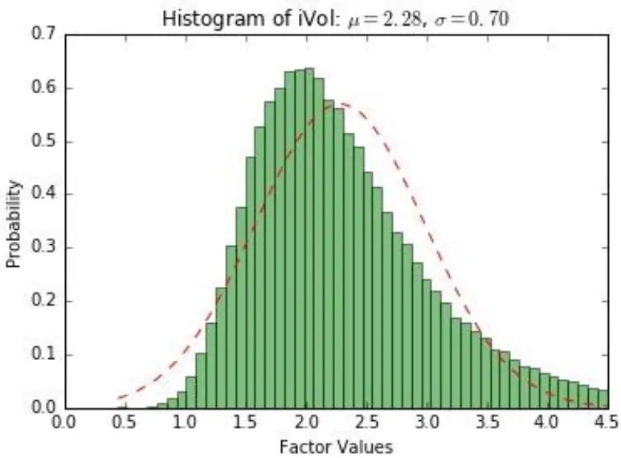
数据来源：wind 咨询, 东方证券研究所

## 特质偏度

偏度衡量了随机变量分布的对称性，日内特质偏度度量了在剔除市场风格后 5 分钟线是向上拉升还是向下打压。每个交易日的日内特质偏度度量方法如下：

$$
iDSkew_{t}=\frac{\sqrt{N}\sum_{i=1}^{N}\varepsilon_{t,i}^{3}}{iDVol_{t}^{3/_{2}}}
$$

其中， $\varepsilon_{t,i}$ 为 5 分钟收益率的 Fama-French 回归残差项，N 为一个交易日内 5 分钟线的个数，$iDVol_{t}$ 表示股票 t日的日内特质波动率。

通过如下方程加总过去 20 个交易日的日内特质偏度为月均日内特质偏度：

$$
iSkew_{t}=\frac{1}{20}{\sum}_{j=0}^{19}iDSkew_{t-j}.
$$

2010年以来 A股日内收益率的特质偏度平均为 0.36，剔除市场风格后呈右偏态，这意味着 A股日内形态大幅向上拉升的 5分钟线多于大幅向下打压的 5分钟线。

图 2：日内特质偏度分布
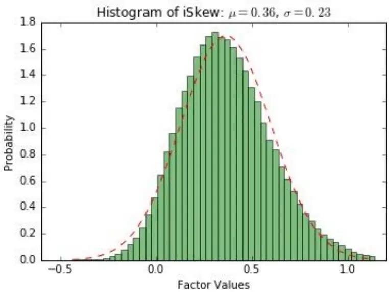
数据来源：wind 咨询, 东方证券研究所

## 特质峰度

峰度衡量的是随机变量的厚尾特性，峰度越高，尾部越厚。对日内收益率来说，日内特质峰度越高，意味着在剔除市场风格后，日内收益率呈现出大涨大跌的特征。每个交易日日内特质峰度的度量如下：

$$
iDKurt_{t}=\frac{N\sum_{i=1}^{N}\varepsilon_{t,i}^{4}}{iDVol_{t}^{2}}
$$

其中， $\varepsilon_{t,i}$ 为 $5$ 分钟收益率的 Fama-French回归残差项，N为一个交易日内 5分钟线的个数，$iDVol_{t}$ 表示股票 t日的日内特质波动率。

通过如下方程加总过去 20个交易日的日内特质峰度为月均日内特质峰度：

$$
iKurt_{t}=\frac{1}{20}{\sum}_{j=0}^{19}iDKurt_{t-j}
$$

2010年以来 A股日内特质峰度均值为 4.7，高于正态分布的 3，相对于正态分布呈厚尾特征。

图 3：日内特质偏度分布
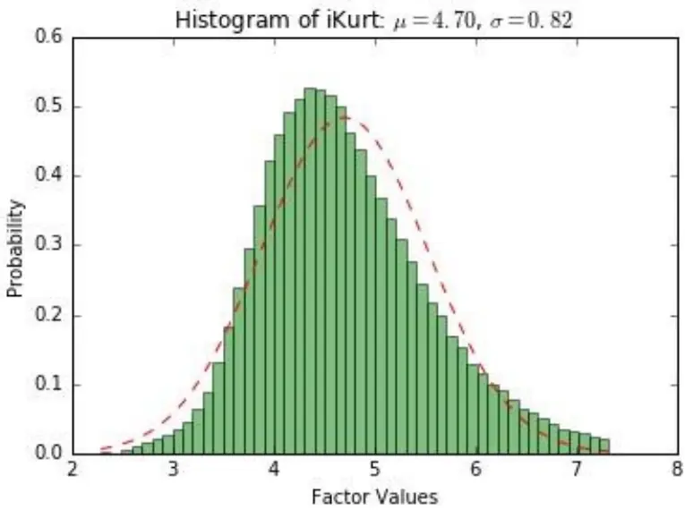
数据来源：wind 咨询, 东方证券研究所

## 二、因子有效性检验

股票日内高阶矩的度量对 5分钟收益率的波动和极值比较敏感，对于波动率和峰度尤其如此，一般而言，小市值股票和成长性行业的股票日内波动较大，容易产生比较大的波动率和峰度，偏度取值的波动也更大。为了考察各因子在风格中性下的表现，我们在检验因子之前采用了回归的方法对高阶矩因子（日内特质波动率、偏度、峰度）进行风格中性化处理，具体处理方法如下：

在每个月底的横截面上回归一下方程：

$$
M_{i}=const+\beta_{M}\cdot ln(MktVal_{i})+\sum_{j=1}^{N}\beta_{I,j}\cdot Ind_{j,i}+\varepsilon_{i}
$$

其中， $M_{i}$ 为股票 i的日内残差高阶矩因子（日内特质波动率、偏度、峰度的 20日均值）， $MktVal_{i}$ 为流通市值， $Ind_{j,i}$ 为行业虚拟变量（中信一级）

用上述回归方程的残差项作为相应的风格中性因子代理变量，下文的因子有效性检验和相关性结构采用的都是风格中性的代理变量。

在本章中，我们利用传统的 IC和分组检验的方法检验各日内残差高阶矩因子的有效性，同时考察了各因子的信息衰减速度。关于因子检验的细节，有必要进行一些说明：

（1） 因子检验区间为 2009 年 12 月 31 日至 2016 年 7 月 29 日；

（2） 样本空间为同时期的中证全指成分股，避免了新股的影响和退市带来的幸存者偏误（survivor bias）；

（3） 每个月计算当月因子值和次月收益率的 spearman 相关系数，各月底的均值我们称之为 Rank IC 均值，均值与标准差之比我们称之为 IC_IR，同时考察各月 IC的正/负显著比率；

（4） 分组检验时，我们每月底将样本空间中的所有股票按因子取值从小到大分为 10 组，等权构建组合，以市场等权作为基准，考察各分组的表现。

## 1.日内特质波动率

在《低特质波动，高超额收益》和《投机、交易行为和股票收益（上）》两篇报告中，我们多次验证了低特质波动率的股票拥有明显的正向超额收益，然而，前面几篇报告中提到的特质波动率都是基于日度收益率数据计算的各个交易日间的特质波动率，基于日内 5 分钟收益率计算的日内特质波动率是否依然有显著的收益率预测能力呢？

从 IC 的角度看，日内特质波动率的 RankIC 均值-0.075，IC_IR-0.752，正向显著比率 13.3%，负向显著比率 66.7%，日内特质波动率越高，股票平均的收益率越低，然而观察各分组具体的超额收益率，我们发现日内特质波动率的超额收益主要表现在高特质波动率端的负向超额收益，对低特质波动率端的正向超额相对较小。另外，从各分组的夏普比、信息比、月胜率等维度观察，日内特质波动率各分组的单调性也比较明显，日内特质波动率越大的组合综合表现越差。

表 1：日内特质波动率各分组业绩评价

|  | 年化收益率 年化超额收益 |  | 夏普比 | 信息比 | 月胜率 | 最大回撤 | 月均换手 |
| --- | --- | --- | --- | --- | --- | --- | --- |
| 中证全指 | 3.1% | -12.1% | 0.25 | -1.18 | 34.2% | -49.7% |  |
| 市场等权（基准） | 15.3% | 0.0% | 0.60 |  | 0.0% | -50.0% | 4.6% |
| 第1组 | 20.5% | 5.3% | 0.75 | 0.91 | 58.2% | -46.4% | 60.1% |
| 第2组 | 19.2% | 3.9% | 0.71 | 0.78 | 59.5% | -49.0% | 80.3% |
| 第3组 | 20.0% | 4.8% | 0.73 | 1.00 | 64.6% | -49.4% | 84.1% |
| 第4组 | 17.6% | 2.4% | 0.66 | 0.57 | 59.5% | -50.3% | 86.4% |
| 第5组 | 17.3% | 2.0% 口 | 0.65 | 0.62 | 59.5% | -52.4% | 86.8% |
| 第6组 | 14.6% | -0.7% | 0.58 | -0.07 | 53.2% | -54.5% | 86.8% |
| 第7组 | 13.1% | -2.2% | 0.54 | -0.45 | 44.3% | -55.2% | 86.6% |
| 第8组 | 10.5% | -4.8% | 0.46 | -0.74 | 44.3% | -56.8% | 84.6% |
| 第9组 | 8.6% | -6.7% | 0.41 | -0.72 | 44.3% | -57.7% | 81.1% |
| 第10组 | -3.3% | -18.5% | 0.09 | -2.15 | 22.8% | -61.4% | 66.9% |

数据来源：wind 咨询, 东方证券研究所

回溯日内特质波动率的历史表现，多空组合的稳健性一般，最大回撤 15.3%，年化收益率22.02%，但需要注意的是日内特质波动率的多空组合主要是空头端贡献的收益率，目前 A股由于做空的限制尚不能转化为实际的收益。

最后，需要提醒的是，日内特质波动率因子各分组换手水平较高，说明因子取值的稳定性差，组合构建时可能带来较高的换手，从而吞噬较多的收益。

图 4：日内特质波动率历史表现回溯
各月度信息系数(均值：-0.08.正显著比率:13.3%，负显著比率:66.7%)
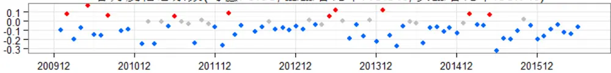

多空组合各月度收益(均值:1.72%，胜率:69.6%)
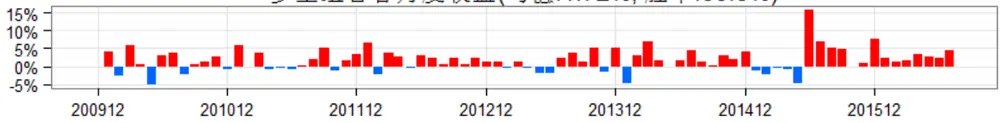

多空组合净值曲线(年化收益率:22.02%)
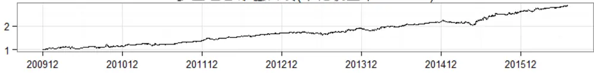

多空组合历史回撤(最大回撤:-15.26%)
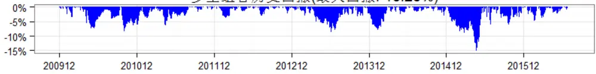
数据来源：wind 咨询, 东方证券研究所

## 2.日内特质偏度

日内特质偏度衡量的是剔除市场风格后日内收益率的对称性，偏度越大，意味着日内收益率更偏向于向上拉升。无论是从 IC 的角度，还是从分组的角度，都不难看出，日内特质偏度越小的股票，后期超额收益越高。日内特质偏度 RankIC的均值为-0.076，IC_IR却高达-1.37，正显著比率 2.7%，负显著比率 70.7%，我们发现日内特质偏度的 IC 均值不算特别之高，但其稳定性令我们震惊，IC 的波动相当之小，2010 年以来仅两个月 IC 出现正显著。从因子各分组的业绩来看，日内特质偏度最小的一个组合，相对市场等权超额收益高达 10.0%，偏度最大的一个组合负向超额收益更加明显，各分组间的单调性明显，从夏普比、信息比、月胜率等指标也不难发现，日内特质偏度越小的股票平均表现越好。

回溯日内特质偏度的历史表现，我们再次验证了其表现的稳定性，多空组合月胜率高达 88.6%，多空组合回撤仅 5.29%，其稳定性在单因子中毫无疑问的处于第一梯队。

和日内特质波动率一样，日内特质偏度各分组的换手率较高，在构建组合时需要引起注意。

表 2：日内特质偏度各分组业绩评价

|  | 年化收益率 | 年化超额收益 | 夏普比 | 信息比 | 月胜率 | 最大回撤 | 月均换手 |
| --- | --- | --- | --- | --- | --- | --- | --- |
| 中证全指 | 3.1% | -12.1% | 0.25 | -1.18 | 34.2% | -49.7% |  |
| 市场等权（基准） 第1组 | 15.3% | 0.0% | 0.60 |  | 0.0% | -50.0% | 4.6% |
| 第2组 | 25.3% | 10.0 | 0.86 | 2.28 | 73.4% | -49.7% | 84.9% |
|  | 21.5% | 6.3% | 0.76 | 1.56 | 72.2% | -51.0% | 88.2% |
| 第3组 | 21.3% | 6.1% | 0.75 | 1.88 | 72.2% | -52.0% | 88.7% |
| 第4组 | 17.6% | 2.3% | 0.66 | 0.68 | 59.5% | -51.8% | 89.8% |
| 第5组 | 16.2% | 0.9% | 0.62 | 0.37 | 46.8% | -51.4% | 90.5% |
| 第6组 | 13.5% | -1. % | 0.55 | -0.30 | 51.9% | -54.0% | 90.1% |
| 第7组 | 12.2% | -3.1 2 | 0.52 | -0.64 | 34.2% | -53.9% | 90.1% |
| 第8组 | 7.9% | 7.4 | 0.39 | -1.62 | 26.6% | -55.4% | 89.4% |
| 第9组 | 6.2% | -9.1 0 | 0.35 | -1.98 | 24.1% | -55.9% | 88.5% |
| 第10组 | -2.4% | -17. 0% | 0.10 | -2.99 | 16.5% | -59.7% | 79.7% |

数据来源：wind 咨询, 东方证券研究所

图 5：日内特质偏度历史表现回溯
各月度信息系数(均值：-0.08，正显著比率:2.7%，负显著比率:70.7%)
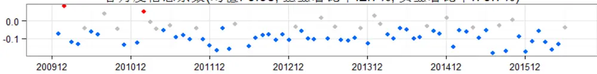

多空组合各月度收益(均值:2.04%，胜率:88.6%)
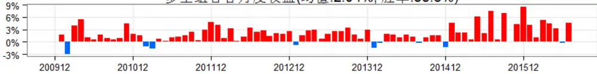

多空组合净值曲线(年化收益率:27.19%)
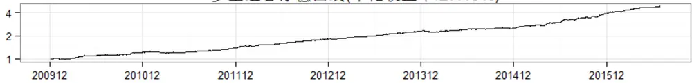

多空组合历史回撤(最大回撤:-5.29%)
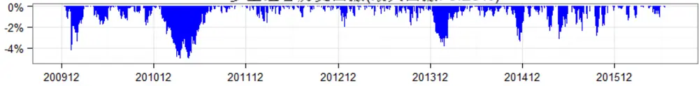
数据来源：wind 咨询, 东方证券研究所

## 3.日内特质峰度

日内特质峰度度量的是剔除市场风格后日内 5分钟收益率的厚尾程度，峰度越大，尾部越厚，意味着收益率的极值更常见。日内特质峰度月底 RankIC均值-0.060，IC_IR-1.27，从 IC的均值来看，其获取收益的能力一般，但其稳定性很高，这一点在 IC的显著性比例上（IC正显著比例 1.3%，负显著比率 65.3%）也得到了验证。观察日内特质峰度各分组的业绩评价指标，我们也不难发现，日内特质峰度越低的股票，未来的超额收益越高，

表 3：日内特质峰度各分组业绩评价

|  |  | 年化收益率 年化超额收益 | 夏普比 | 信息比 | 月胜率 |  | 最大回撤 月均换手 |
| --- | --- | --- | --- | --- | --- | --- | --- |
| 中证全指 | 3.1% | -12.1% | 0.25 | -1.18 | 34.2% | -49.7% |  |
| 市场等权（基准） | 15.3% | 0.0% | 0.60 |  | 0.0% | -50.0% | 4.6% |
| 第1组 | 24.1% | 8.8% | 0.83 | 1.58 | 67.1% | -50.1% | 75.6% |
| 第2组 | 19.0% | 3.7 | 0.69 | 1.02 | 59.5% | -50.0% | 87.3% |
| 第3组 | 17.9% | 2.7 a | 0.67 | 0.80 | 63.3% | -52.8% | 88.6% |
| 第4组 | 16.3% | 1.0à | 0.63 | 0.32 | 58.2% | -52.8% | 89.6% |
| 第5组 | 15.3% | 0.1% | 0.60 | 0.14 | 50.6% | -53.1% | 89.6% |
| 第6组 | 14.1% | -1.E% | 0.56 | -0.13 | 41.8% | -52.6% | 90.2% |
| 第7组 | 13.0% | -2.3% | 0.53 | -0.43 | 41.8% | -54.3% | 89.8% |
| 第8组 | 10.7% | -4.6% | 0.47 | -1.01 | 38.0% | -55.2% | 89.0% |
| 第9组 | 5.8% | -9.5% | 0.34 | -1.96 | 20.3% | -53.7% | 87.2% |
| 第10组 | 2.0% | -13.3% | 0.23 | -2.52 | 20.3% | -56.7% | 80.4% |

数据来源：wind 咨询, 东方证券研究所

日内特质峰度的历史表现我向我们展示了因子表现的稳定性，日内特质偏度多空组合 2010年以来月度胜率77.2%，最大回撤6.63%，和日内特质偏度相对不大，多空组合年化收益率20.78%，略逊于日内特质偏度。

最后，同样需要提醒的是，日内特质峰度各分组换手率较高，构建组合时可能带来较高的交易费用。

图 6：日内特质峰度历史表现回溯
各月度信息系数(均值:-0.06.正显著比率:1.3%.负显著比率:65.3%)
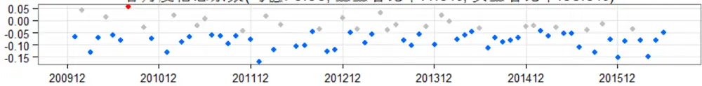

多空组合各月度收益(均值:1.60%，胜率:77.2%)
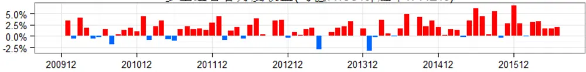

多空组合净值曲线(年化收益率:20.78%)
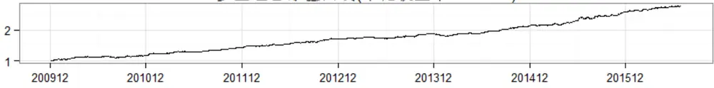

多空组合历史回撤(最大回撤:-6.63%)
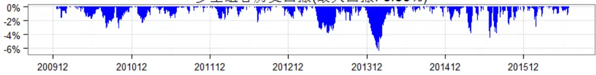
数据来源：wind 咨询, 东方证券研究所

## 4.信息衰减速度

日内残差高阶矩因子基于股票日内的交易数据构建，反应了股票的日内交易行为特征，大多数交易层面的因子都有一个特点：信息衰减速度太快。

我们通过不同滞后期的月度 RankIC均值反应因子的信息衰减速度，滞后期是指计算 IC时涉及到的因子值和次月收益率间的时间跨度， 比如，滞后期为 5 个交易日的 IC 就相对于以月底的因子值和次月 5个交易日后的一个月收益率做相关系数计算的 IC。IC的半衰期经常被用来度量因子的信息衰减速度，半衰期越短，信息衰减速度越快。

日内特质波动率、偏度、峰度等因子的 IC衰减速度都较快，月度半衰期都在两周左右，衰减速度和反转因子相差不大，因此使用日内残差高阶矩因子选股时检验适当提高调仓频率或者改进调仓方法，充分利用因子的效率。

图 7：日内高阶矩因子月度 IC衰减速度
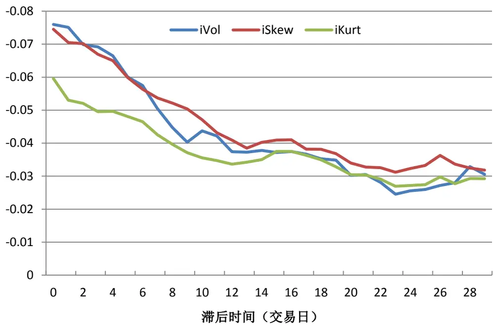
数据来源：wind 咨询, 东方证券研究所

## 5.小结

由于日内残差高阶矩因子的度量对行业、市值等风格比较敏感，我们在因子有效性检验前先对因子值进行了风格中性化处理。

通过考察各因子的 Rank IC 序列和分组的业绩表现，我们发现日内特质波动率、偏度、峰度等因子的确有预测股票未来收益率的能力。日内特质波动率月度 Rank IC均值-0.075，IC_IR-0.752，多空组合年化收益率 22.02%，但其超额收益主要是负端贡献， top 组合超额收益仅 5.3%；日内特质偏度不管是绝对超额收益还是稳定性都优于日内特质波动率，月度 Rank IC 均值-0.076，IC_IR-1.37，top 组合超额收益 10.0%，其稳定性也可以从 IC 的显著性比率和多空组合的最大回撤得到验证，IC正显著比率仅 2.7%，负显著比率 70.7%，多空组合最大回撤 5.29%；日内特质峰度的表现要略逊于日内特质偏度，月度 IC 均值-0.060，IC_IR-1.27，top 组合超额收益 8.8%，其超额收益也十分稳定，IC正显著比率仅 1.3%，负显著比率 65.3%，多空组合最大回撤 6.63%。

最后，需要提醒的是，日内特质波动率、特质偏度、特质峰度等指标信息衰减速度较快，月度IC 半衰期在两周左右，因此在使用这些因子时应该适度提高调仓频率或者改进调仓方法，充分利用因子的效率。

## 三、相关性结构

经过前文的分析，我们知道日内残差高阶矩因子的确对股票未来的收益率有一定的预期能力，然而分析各个高阶矩因子之间相互的关系以及高阶矩因子与其他常见因子间的相互关系同样非常重要，一方面，分析相关性关系有助于我们理解其收益背后的真实来源，另一方面，了解各因子相互之间的替代作用之后有助于我们更有效的选取因子构建模型。

我们主要通过各因子值的秩相关系数、因子分层后多空组合的表现，以及 Fama-Macbeth回归三个维度考察日内残差高阶矩因子和其他常见因子间的超额收益。需要提醒的是，下文中提及的日内残差高阶矩因子已做行业、市值中性化处理。

## 1.秩相关系数

通过观察各个因子值之间的秩相关系数（各横截面上 spearman 相关系数的均值，表 4），我们发现：

（1） 日内特质偏度和日内特质峰度秩相关系数高达 0.62，两者之间有很高的信息重叠部分；

（2）日内特质波动率和特异度高度相关（秩相关系数高达 0.49），与换手、价差偏度度、日内特质偏度、峰度也有一定的信息重叠。

表 4：因子值间的秩相关系数

|  | 流通市值 | 账面市值比 | 特异度 | 市值调整换手 | 价差偏离度 | 日内iVol | 日内iSkew | 日内iKurt |
| --- | --- | --- | --- | --- | --- | --- | --- | --- |
| 流通市值 | 1.000 | 0.168 | -0.029 | -0.251 | 0.073 | 0.013 | 0.023 | 0.020 |
| 账面市值比 | 0.168 | 1.000 | -0.283 | -0.269 | -0.135 | -0.347 | -0.112 | -0.185 |
| 特异度 | -0.029 | -0.283 | 1.000 | 0.248 | 0.336 | 0.491 | 0.212 | 0.253 |
| 市值调整换手 | -0.251 | -0.269 | 0.248 | 1.000 | 0.238 | 0.298 | 0.245 | 0.179 |
| 价差偏离度 | 0.073 | -0.135 | 0.336 | 0.238 | 1.000 | 0.393 | 0.222 | 0.123 |
| 日内iVol | 0.013 | -0.347 | 0.491 | 0.298 | 0.393 | 1.000 | 0.336 | 0.377 |
| 日内iSkew | 0.023 | -0.112 | 0.212 | 0.245 | 0.222 | 0.336 | 1.000 | 0.621 |
| 日内iKurt | 0.020 | -0.185 | 0.253 | 0.179 | 0.123 | 0.377 | 0.621 | 1.000 |

数据来源：wind 咨询, 东方证券研究所

## 2.因子分层

研究因子两两之间的替代作用，另一个比较常见的方法是因子分层的做法，具体做法如下：

在每个月底按分层因子大小将样本空间内的股票分为 10层，再在每一层内按分组因子的大小排序，选取每一层内分组因子最小的 1/10 股票作为第 1 组（top 组合），以此类推，每层内分组因子最大 1/10股票作为第 10组（bottom 组合），然后比较做多 top组合做空 bottom组合的多空组合月均收益率及其显著性。

通过分析因子分层前后多空组合收益率的变化，我们有如下发现：

（1）日内特质偏度可以解释日内特质峰度的绝大多数超额收益来源，反之则不能。根据日内特质偏度分层后，日内特质峰度多空组合月均收益大幅降低（由 1.77%降低至 0.46%），几乎接近于零，相反，在控制日内特质峰度后，日内特质峰度多空组合收益虽有一定回落，但剩余的超额收益依然很明显。

（2）日内特质波动率可以被特异度所替代。在根据特异度分层后，日内特质波动率多空组合月收益率已不显著，相反，在控制日内特质波动率后，特异度多空组合收益仅有小幅回落，因此，我们认为，特异度包含日内特质波动率的超额收益信息 而且拥有额外的能够带来超额收益的信息，特异度能够替代日内特质波动率。

（3）日内特质偏度和特异度、换手、价差偏度度等有部分超额收益源重叠。经过特异度、换手、价差偏离度分层后，日内特质偏度多空组合有小幅回落，相反，经过日内特质偏度分层后，换手率等因子的多空组合也有小幅回落，但剩余的超额收益依然很明显。

表 5：因子分层多空组合月均收益率

| 流通市值 账面市值比 市值调整换手 价差偏离度 | 特异度 日内iVol 日内iSkew |  |  |  |  |  |  |  |
| --- | --- | --- | --- | --- | --- | --- | --- | --- |
| 分层因子 | 不分层 | 4.02% | -0.44% | 2.48% 3.19% | 2.47% | 2.09% | 2.14% | 日内iKurt 1.77% |
|  | 流通市值 | 1.12% | -1.14% | 2.44% 3.94% | 2.31% | 1.90% | 2.05% | 1.68% |
|  | 账面市值比 | 4.44% | 0.07% | 2.51% 3.27% | 2.55% | 2.21% | 2.26% | 1.84% |
|  | 特异度 | 2.69% | 0.46% | 0.39% 1.23% | 1.72% | 0.64% | 1.66% | 1.09% |
|  | 市值调整换手 | 4.38% | 0.41% | 2.09% 0.90% | 1.92% | 1.39% | 1.69% | 1.47% |
|  | 价差偏离度 | 2.38% | 0.15% | 1.87% 1.64% | 0.29% | 1.09% | 1.74% | 1.34% |
|  | 日内iVol | 2.83% | 0.50% | 1.42% | 1.84% | 0.03% | 1.57% | 1.26% |
| 日内iSkew 日内iKurt | 2.82% 2.88% | -0.03% 0.03% | 2.03% 2.24% 2.35% | 1.55% 1.89% | 2.06% 2.38% | 1.18% 1.38% | 0.42% | 0.46% |

注：标红为 99%的置信度下显著
数据来源：wind 咨询, 东方证券研究所

## 3.Fama Macbeth 回归

因子分层的做法仅能判断因子两两间的解释或替代作用，为考察多个因子间的相互作用，我们采用了学术上Fama-Macbeth回归的方法，

分析 Fama-Macbeth的回归结果，我们可以得出如下结论：

（1）日内特质波动率、偏度、峰度，单独来看对未来收益率都有显著的预测能力。这一结论可以从方程（1）、（2）、（3）中的显著性看出。

（2）日内特质峰度的超额收益来源很大程度可以被日内特质偏度等因子解释。方程（4）在方程（3）的基础上加入了日内特质偏度、波动率两个变量后，日内特质峰度变得不显著，在添加其他的一些常见因子后，日内特质峰度也处在显著性的边缘。

（3）日内特质波动率的超额收益可以被特异度等因子所解释。方程（5）在方程（4）的基础上加入特异度等因子后，日内特质波动率变得不显著，在加入市场上常见的其他因子后，日内特质波动率项依然不显著。

表 6：Fama-Macbeth 回归结果

| intercept |  | iVol | iSkew | iKurt | ivr | adjto | SpredBias mktval |  | bm | peg |  | growth illiq |
| --- | --- | --- | --- | --- | --- | --- | --- | --- | --- | --- | --- | --- |
| (1) | -0.010 (-11.39) | -0.056 (-5.82) |  |  |  |  |  |  |  |  |  |  |
| (2) | -0.010 (-11.39) |  | -0.057 (-11.38) |  |  |  |  |  |  |  |  |  |
| (3) | -0.010 (-11.38) |  |  | -0.044 (-9.59) |  |  |  |  |  |  |  |  |
| (4) | -0.010 (-11.39) | -0.040 (-4.04) | -0.041 (-6.81) | -0.003 (-0.80) |  |  |  |  |  |  |  |  |
| (5) | -0.011 (-11.59) | -0.007 (-0.81) | -0.025 (-3.89) | -0.009 (-2.15) | -0.038 (-5.09) | -0.044 (-2.61) | -0.040 (-4.32) |  |  |  |  |  |
| (6) | -0.011 (-11.07) | -0.005 (-0.60) | -0.023 (-3.95) | -0.008 (-2.17) | -0.041 (-6.12) | -0.066 (-4.41) | -0.030 (-3.39) | -0.088 (-5.35) | -0.004 (-0.28) |  |  |  |
| (7) | -0.012 (-11.27) | -0.004 (-0.52) | -0.021 (-3.74) | -0.009 (-2.16) | -0.039 (-6.05) | -0.059 (-3.88) | -0.031 (-3.55) | -0.081 (-3.98) | -0.006 (-0.46) | -0.036 (-6.47) | 0.052 (5.03) | 0.007 (0.56) |

数据来源：wind 咨询, 东方证券研究所

## 4.小结

为了了解日内残差高阶矩因子内部以及与其他常见因子的相互关系，我们从秩相关系数、因子分层、Fama-Macbeth回归等多个维度考察了因子间的相关性结构，主要有如下发现：

（1）日内特质波动率的超额收益来源可以被特异度完全解释。在经过特异度分层后，日内特质波动率因子失效，在 Fama-Macbeth 回归中，控制了特异度等因子后日内特质波动率也变的不显著。

（2）日内特质偏度和日内特质峰度有很高的信息重叠，在控制日内特质偏度后，日内特质峰度几乎失效。日内特质偏度和日内特质峰度两者间秩相关系数高达 0.62，在经过日内特质偏度分层后，日内特质峰度多空组合收益骤减，几近失效，相反，在经过日内特质峰度分层后，日内特质偏度多空组合收益虽有回落，但依然很显著。在 Fama-Macbeth 回归方程中，解释变量同时加入日内特质偏度和日内特质峰度后，日内特质峰度处于显著的边缘，而日内特质偏度依然很显著。

（3）日内特质偏度和特异度、换手、价差偏离度等有少量的共有信息成分，但总体仍然相对独立。日内特质偏度和特异度、换手、价差偏离度等因子有弱相关性，而且经过因子分层后，多空组合的月均收益也有小幅回落，但依然很明显。在 Fama-Macbeth 回归中，日内特质偏度、特异度、换手、价差偏离度同时用来解释次月收益时，各个因子均十分显著。

## 风险提示

本文的结论基于对历史数据的研究，如果未来市场风格发生重大变化，部分规律可能会失效，另外高的预期超额收益并不代表 100%的胜率，市场有风险，投资需谨慎。

## 分析师申明

每位负责撰写本研究报告全部或部分内容的研究分析师在此作以下声明：

分析师在本报告中对所提及的证券或发行人发表的任何建议和观点均准确地反映了其个人对该证券或发行人的看法和判断；分析师薪酬的任何组成部分无论是在过去、现在及将来，均与其在本研究报告中所表述的具体建议或观点无任何直接或间接的关系。

## 投资评级和相关定义

报告发布日后的 12个月内的公司的涨跌幅相对同期的上证指数/深证成指的涨跌幅为基准；

## 公司投资评级的量化标准

买入：相对强于市场基准指数收益率15%以上；

增持：相对强于市场基准指数收益率5%～15%；

中性：相对于市场基准指数收益率在-5%～+5%之间波动；

减持：相对弱于市场基准指数收益率在-5%以下。

未评级——由于在报告发出之时该股票不在本公司研究覆盖范围内，分析师基于当时对该股票的研究状况，未给予投资评级相关信息。

暂停评级——根据监管制度及本公司相关规定，研究报告发布之时该投资对象可能与本公司存在潜在的利益冲突情形；亦或是研究报告发布当时该股票的价值和价格分析存在重大不确定性，缺乏足够的研究依据支持分析师给出明确投资评级；分析师在上述情况下暂停对该股票给予投资评级等信息，投资者需要注意在此报告发布之前曾给予该股票的投资评级、盈利预测及目标价格等信息不再有效。

## 行业投资评级的量化标准：

看好：相对强于市场基准指数收益率5%以上；

中性：相对于市场基准指数收益率在-5%～+5%之间波动；

看淡：相对于市场基准指数收益率在-5%以下。

未评级：由于在报告发出之时该行业不在本公司研究覆盖范围内，分析师基于当时对该行业的研究状况，未给予投资评级等相关信息。

暂停评级：由于研究报告发布当时该行业的投资价值分析存在重大不确定性，缺乏足够的研究依据支持分析师给出明确行业投资评级；分析师在上述情况下暂停对该行业给予投资评级信息，投资者需要注意在此报告发布之前曾给予该行业的投资评级信息不再有效。

## 免责声明

本证券研究报告（以下简称“本报告”）由东方证券股份有限公司（以下简称“本公司”）制作及发布。

本报告仅供本公司的客户使用。本公司不会因接收人收到本报告而视其为本公司的当然客户。本报告的全体接收人应当采取必要措施防止本报告被转发给他人。

本报告是基于本公司认为可靠的且目前已公开的信息撰写，本公司力求但不保证该信息的准确性和完整性，客户也不应该认为该信息是准确和完整的。同时，本公司不保证文中观点或陈述不会发生任何变更，在不同时期，本公司可发出与本报告所载资料、意见及推测不一致的证券研究报告。本公司会适时更新我们的研究，但可能会因某些规定而无法做到。除了一些定期出版的证券研究报告之外，绝大多数证券研究报告是在分析师认为适当的时候不定期地发布。

在任何情况下，本报告中的信息或所表述的意见并不构成对任何人的投资建议，也没有考虑到个别客户特殊的投资目标、财务状况或需求。客户应考虑本报告中的任何意见或建议是否符合其特定状况，若有必要应寻求专家意见。本报告所载的资料、工具、意见及推测只提供给客户作参考之用，并非作为或被视为出售或购买证券或其他投资标的的邀请或向人作出邀请。

本报告中提及的投资价格和价值以及这些投资带来的收入可能会波动。过去的表现并不代表未来的表现，未来的回报也无法保证，投资者可能会损失本金。外汇汇率波动有可能对某些投资的价值或价格或来自这一投资的收入产生不良影响。那些涉及期货、期权及其它衍生工具的交易，因其包括重大的市场风险，因此并不适合所有投资者。

在任何情况下，本公司不对任何人因使用本报告中的任何内容所引致的任何损失负任何责任，投资者自主作出投资决策并自行承担投资风险，任何形式的分享证券投资收益或者分担证券投资损失的书面或口头承诺均为无效。

本报告主要以电子版形式分发，间或也会辅以印刷品形式分发，所有报告版权均归本公司所有。未经本公司事先书面协议授权，任何机构或个人不得以任何形式复制、转发或公开传播本报告的全部或部分内容。不得将报告内容作为诉讼、仲裁、传媒所引用之证明或依据，不得用于营利或用于未经允许的其它用途。

经本公司事先书面协议授权刊载或转发的，被授权机构承担相关刊载或者转发责任。不得对本报告进行任何有悖原意的引用、删节和修改。

提示客户及公众投资者慎重使用未经授权刊载或者转发的本公司证券研究报告，慎重使用公众媒体刊载的证券研究报告。

## 东方证券研究所

地址：上海市中山南路 318 号东方国际金融广场 26 楼

联系人： 王骏飞

电话：021-63325888*1131

传真：021-63326786

网址： www.dfzq.com.cn

Email： wangjunfei@orientsec.com.cn