## 研究结论

国内量化发展已有十余年，各家机构投资者的 Alpha因子库也随之扩大，这时会面临两个问题：alpha信息源的重叠与因子间相关性处理。本报告将提供这两个问题的解决处理方法，

我们基于 Fama-MacBeth回归设计了一套 Alpha因子筛选流程，剔除信息重复的因子。在实证中，我们把 11 个 Alpha 因子筛选至 5 个，筛选过程几乎没有 alpha 信息的损失，筛选前后的多因子多空组合表现相当。因子筛选可以显著减少因子数量，继而减少需要估计的模型参数数量，提高估计量的准确性，从而提升模型选股表现。

Alpha优化采用的是 Qian(2007)的方法，这个方法有点类似股票组合优化，alpha 因子充当了个股的角色。该方法可以很好的处理因子相关性问题，实际运用的关键在于因子 IC 协方差矩阵的估计。传统样本协方差矩阵的估计方差太大，效果不佳，本报告中采用 Ledoit（2003）提出的压缩估计量方法和 Bootstrap方法来提升估计量准确性，alpha模型选股效果得到显著改善。

为便于叙述，本报告中采用的是alpha因子原始数据和原始收益率来计算IC，并未做风险中性化处理，但报告中的方法对风险中性的情况也适用，风险中性后可以获得更稳健的多空组合。

## 风险提示

- 量化模型失效风险

- 市场极端环境的冲击

改进统计方法的效用
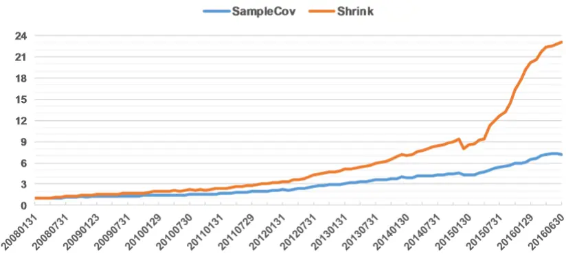

证券分析师朱剑涛

021-63325888*6077

zhujiantao@orientsec.com.cn

执业证书编号：S0860515060001

## 相关报告

| 日内残差高阶矩与股票收益 2016-08-12 动态情景多因子 Alpha 模型 2016-05-25 |
| --- |

量化选股模型可以分为 Alpha 模型、风险模型和组合优化三个模块。其中 Alpha 模型对组合收益起着决定性作用，后两者主要起辅助作用：风险模型负责控制风险、稳定收益，组合优化负责精确控制，使得组合满足换手率、跟踪误差等投资限制。因此机构投资者的大部分研究精力都放在Alpha 模型这一块，风险模型和组合优化器则采用外购商业软件（BARRA、Axioma等），或自行开发的简易版本模型。我们本报告主要探讨 Alpha 模型，风险模型和组合优化将在我们后续系列报告中覆盖。

从我们和机构投资者的交流情况来看，目前市场上做 Alpha 模型有两种方向：一种是“精英型”，即寻找 IC高、IR稳定、表现优秀的“精英”因子，用少量的这些因子来构建组合；另一种则是“群众型”，即建造一个大型 Alpha 因子库，单个 Alpha 因子可能表现不是非常出众，但是它能贡献独立的 Alpha信息源，有助于稳定收益。

两种方向对比而言，个人更偏向后者，因为这更符合分散风险的量化投资基本原理，但是大型Alpha 因子库在提供多样 Alpha源的同时，也带来大量无效和重复信息，若信息汇总处理不当，会使得不同 Alpha 源被人为的放大或缩小权重，最终影响组合表现。另外，面对一个大型 Alpha 因子库，投资者在找到一个新的 Alpha 因子时，有必要思考这个因子是否提供了新的 Alpha 源或只是把现有 Alpha 因子库的因子信息进行了切分重组。我们本报告将提供一些统计检验和优化工具来解决这些问题。在介绍这些工具之前，我们有必要对因子选股的理论基础---资产定价理论做简要阐述。

## 一、资产定价理论基础与实证检验

## 1.1 CAPM 和 APT

CAPM（Capital Asset Pricing Model）最早由 Treynor、Sharpe、Lintner 和 Mossin 四人分别独立提出，Sharpe 因此获得 1990 年的诺贝尔奖。不过由于模型假设太多而且过强，已经有非常多的实证研究发现 CAPM 在真实市场中并不成立( Fama & French 2003)，尽管如此，CAPM 理论的基本思想对当下研究仍然有很大借鉴意义。下面将简介 Sharpe-Lintner 的主要建模方法，具体理论证明过程可以参考郭(2006)和 Wijst(2013)。

CAPM 的核心假设有三条：

A1. 投资者基于 Mean-Variance 效用函数来构造组合，即在达到预期收益的限制条件下，让组合收益的方差最小。

A2. 市场处于均衡状态，即所有投资者基于 Mean-Variance 构造组合产生的对某项资产的需求总和等于该资产的总供给，也就是该资产的市值。

A3. 市场存在无风险资产，可以任意买卖。

Sharpe-Lintner 的证明流程如下图所示，这个证明针对的是有效前沿上的资产，对于非有效前沿上的一般资产也可以利用市场均衡特性（假设 A2）得到 CAPM 定价公式（参考 Sharpe (1964) 或Wijst (2013)）。

图 1：Sharpe-Lintner CAPM 证明基本流程
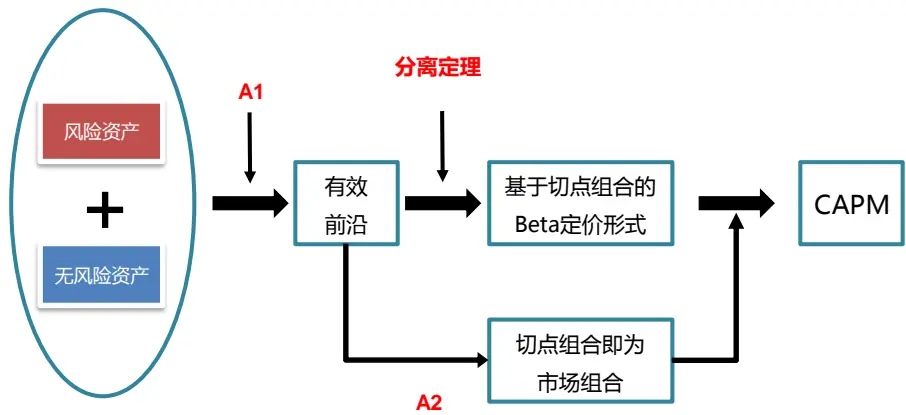
资料来源：东方证券研究所

APT（Arbitrage Pricing Theory）是 Ross(1976)提出的一种定价方法，它的模型假设相对 CAPM要弱很多，其中核心假设有两条：

A1. 市场上不存在无风险套利机会（或渐进套利机会）

A2. 风险资产的收益率由 K 个风险因素 $\cdot F_{1},F_{2}\ldots F_{K}$ 线性决定，即风险资产 的收益率可以表示为

$$
\mathbb{R}_{\mathrm{i}}=a_{i}+b_{i,1}F_{1}+b_{i,2}F_{2}+\cdots+b_{i,k}F_{K}+\epsilon_{i}\quad i=1,2\ldots N\quad(1.1)
$$

$$
\mathbb{E}(\epsilon_{\mathrm{i}})=0,\mathbb{E}\big(\epsilon_{\mathrm{i}}\epsilon_{j}\big)=0,E(F_{k})=0,E(\epsilon_{i}F_{k})=0,\mathbb{E}(F_{\mathrm{k}}F_{l})=0,1\leq\mathrm{i},\mathrm{j}\leq\mathbb{N},1\leq\mathrm{k},1\leq\mathrm{K}
$$

图 2：确定型 APT模型的证明流程
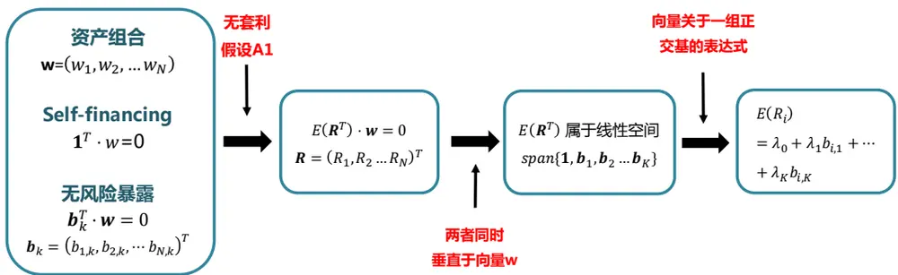
资料来源：东方证券研究所

如果式(1.1)无残差随机项，也就是所谓的确定型 APT 模型，证明过程比较容易（图 2）。首先构造 Self-financing且无风险暴露的资产组合，由无套利假设可以知道该预期组合收益率也和权重向量垂直，而权重向量和个股的因子暴露向量也都是垂直的，因此预期收益率向量应该属于因子暴露向量张成的线性空间，而因子暴露向量是线性不相关的，因此可以表示成因子暴露向量的线性组合，也就是图 2 最后的 APT 定价公式。

需要注意的是，在形式上，APT定价公式很容易被理解为直接在式（1.1）两边取期望，但事实并非如此。式(1.1)中不同股票的截距项 $\mathbf{\dot{a}_{i}}$ 可能是不同的，而 APT 定价公式中 $\mathbf{l}\mathbf{\lambda_{0}}.$ 对所有股票都是一样，在市场存在无风险资产的情况下，有 $\lambda_{0}=r_{f}$ $\mathbf{r_{f}}$ 为无风险利率。

$\lambda_{\mathbf{k}}$ 称为第 k个因子的风险溢价（risk premium），在确定型 APT模型下， $,\lambda_{\mathrm{k}}=E\big(R^{(k)}\big)-r_{f}$ ，其中  是因子 k 的特征因子组合收益率，该组合对 k 个因子的暴露度为 1，对其他因子的暴露度都是 0.

对于非确定型 APT模型，即式(1.1)的随机残差项不等于零，APT定价公式的证明需要加强假设，在无套利的基础上进一步要求市场无渐进套利机会（Asymptotic arbitrage opportunity），详细证明可以参考郭（2006）。此时风险溢价 $\lambda_{k}仍$ 可理解为其因子特征组合的超额收益，但需强化要求因子特征组合是一个完全分散化投资组合（Fully Diversified Portfolio）。

APT 模型假设的数量比 CAPM 少，而且更加合理。事实上，在 APT 模型里面，如果假设影响资产价格的因素只有一个，而且市场组合是完全分散投资组合，那么基于无套利假设就可以近似得到 CAPM 定价公式。CAPM 假设市场是均衡的，均衡的市场无套利机会，但反过来则不一定成立。量化实务中，不论是 P-quant还是 Q-quant，大多采用的是 APT理论框架1。

## 1.2 定价因子检验

APT 是一套非常完备的资产定价理论，但问题是它并没有说明资产价格的影响因素到底是什么，风险暴露和风险溢价怎么计算，因此实证过程产生了多种做法。

## 1.2.1 因子动物园（Factor Zoo）

运用 APT 的第一步是找到影响股价的因子，寻找的方法主要是基于市场实际观测到的价格差异现象和投资者使用的投资逻辑。这类研究中最有影响力的莫过于 Fama&French（1993）提出的三因子模型，在 CAPM市场因子的基础上增加了市值因子和 PB 估值因子，并构造了 SMB 和 HML两个多空组合，把两个组合的月度收益率用作市值因子和 PB 因子风险溢价的观测值，最后得到结论“股票价格的大部分波动都可以由市场、市值和估值三个因子解释“。在理解 Fama&French结论时，必须注意以下两点，否则可能会产生误解：

1) 因子对股价时间序列变化和横截面差异的解释程度不一样。实证过程中，我们每隔一段时间去收集市场上所有股票的数据，因此因子对股价的解释力会体现在时间序列和横截面两个方向，但因子在这两个方向的解释力度是不一样的。Fama & French 三因子时间序列上的方差解释度超过 90%，而横截面上的解释度大概在 75%左右。另外，我们之前的 A股实证研究发现时间序列方向上市场因子是解释度最大的因子，其次是市值因子；但通过截面回归分析会发现，横截面上，市值因子的解释力度要明显强于 Beta（市场因子的暴露度）。

2) Fama&French的结论并非针对个股股价波动。Fama&French的实证研究方法是先构造了两个多空组合，用它们的收益率作为风险溢价，再通过时间序列回归去估算因子的风险暴露。后面的回归检验过程需要用到风险暴露，但它是个估算值，本身带有误差，因此后续回归会产生 EIV（Errors in Variable）问题，回归得到的估计量在大样本下不一定收敛于目标参数，如果用个股的收益率作为因变量来回归，EIV 问题将十分明显，因此Fama&French用的是市值因子和PB估值因子做 交叉划分得到的25个组合的月收益率作为因变量进行回归，三因子解释的是这个 25 个股票组合的价格变动。不过Lewellen(2010)发现这种做法在实证中有非常大的问题，他会让与市值和 PB因子相关的因子易于通过统计检验，发现很多“伪因子“。近些年来有学者开发了新方法来避免 EIV问题，并用个股的个股收益率数据来做实证研究，但结果发现 Fama&French的三因子没有一个显著（Jegadeesh & Noh 2014）。

继 Fama & French 的开创性工作后，理论和学术界都开始了大规模的新因子寻猎，Fama&French 也于2015年在之前三因子的基础上加上了盈利（Profitability）和 投资( Investment)因子，推出五因子模型。根据 Harvey (2016)的搜集统计，发表在顶级金融学术期刊和 SSRN 上的定价因子多达 316个。这么多的定价因子已经构成了 Cochrane (2011)提出的“新因子动物园”（azoo of new factors），“到底有多少因子真正提供了新的信息源？”，“有多少只是现有信息的切分组合？”，有多少是数据挖掘的结果？“，这是目前资产定价理论界的一个研究热点，也和我们写这篇报告的初衷相符，因为我们在实际工作发现，有的 alpha 因子单个选股表现优异，但加入因子库做多因子选股时，结果却没多大变化，因此开始怀疑新发现的因子是否只是现有因子库内信息的切分重组。

## 1.2.2 风险溢价与风险暴露

在确定要考察的定价因子后，要到现实金融市场中去找数据来验证因子有效性，风险溢价或风险暴露必须有一个有对应的观察值。学术研究的做法大多从风险溢价出发，把个股按照因子大小做排序，用排在前面（例如 前 1/3）的股票市值加权组合与排在后面的股票市值加权组合的收益率的差额作为该因子风险溢价的观察值。当因子数量较少时，可以考虑采用 Fama & French 在构造SMB 和 HML 时使用的交叉划分法，来降低不同因子风险溢价之间的相关性。

实务界的做法（例如：BARRA）更多是从因子暴露出发，用因子数值的标准化得分作为因子暴露的观察值，但是这种做法只适合财务因子、技术因子、情绪因子等，对于一些宏观因素因子，仍然要对个股进行时间序列回归来估算因子暴露。

学术界和实务界的做法对比来看，从风险溢价出发需要知道与个股收益率同期的因子风险溢价，但真实投资中无法知道未来的因子风险溢价，因此学术界的做法偏向于“解释”收益率；而实务界做法里，个股收益率是和期初的因子暴露对应的，带有“预测”收益率的性质，实用性更强。

## 1.2.3 GRS 检验

GRS 检验由 Gibbons, Ross 和 Shaken 于 1989 年提出，它是一个时间序列上的检验。假设全市场有 N个资产，资产价格受 K个因子影响，现有过去 T期的因子风险溢价数据和资产收益率数据，市场无风险利率为 ，如果 APT模型成立，那么对每个资产 i做时间序列回归

$$
\mathrm{E}\big(\mathrm{R}_{\mathrm{i},t}\big)-r_{f}=a_{i}+b_{i,1}\lambda_{1,t}+b_{i,2}\lambda_{2,t}+\cdots+b_{i,k}\lambda_{K,t}+\epsilon_{i}\quad t=1{,}2\ldots T
$$

回归得到截距项应该为零。但是有 N 个资产，我们做了 N 个时间序列回归，在残差项满足多元正态分布的前提假设下，GRS 用下面统计量来检验回归截距项是否等于 0 (参考 Cochrane 2005)。

$$
\frac{T-N-K}{N}\big(1+\pmb{\lambda}^{\prime}\cdot\widehat{\Omega}^{-1}\cdot\pmb{\lambda}\big)^{-\mathbf{1}}\widehat{\alpha}^{\prime}\cdot\widehat{\Sigma}\cdot\widehat{\alpha}\sim\mathsf{F}_{\mathrm{N,T-N-K}}
$$

由于我们不可能知道所有股价影响因素，因此在实证中 GRS 检验基本上都是拒绝原假设的。有些研究人员用截距项的大小来判断不同因子模型解释力度的强弱，但这种比较缺乏统计检验显著性的支持。Harvey (2016) 提出了一种基于 Bootstrap，同时考虑 Multiple Testing 效应的 GRS 检验改进方法，通过截距项的分布来比较不同模型解释力度的强弱。Harvey (2016) 用个股作为资产检验了他之前收集的 316 个因子，他发现市场因子仍然是最显著的因子，其次是市值因子，再其次是估值因子，在控制了这三个因子后，其它因子变得都不显著，这个结论和之前提到的Jegadeesh & Noh （2014）的结论正好相反。

## 1.2.4 Fama-MacBeth 检验

该检验方法由 Fama & MacBeth (1973)年提出，它是一种截面回归检验方法。如果从风险溢价出发，Fama-MacBeth 检验是一个两步过程：

Step 1. 对每个资产做时间序列回归，计算各个资产的因子暴露估计量 $\hat{\mathbf{b}}_{i,k}$

Step 2. 在每个横截面上用当期的资产收益率对期初的因子暴露估计量做横截面回归，得到风险溢价的估计 $\hat{\lambda}_{k,t}$

对因子 k，对序列 $\{\hat{\lambda}_{k,t},t=1{,}2\ldots T\}$ 做传统 student-t 检验，如果该因子有效，序列的均值应该显著不等于零。如果是从风险暴露出发，则可免去第一步，直接从第二步开始。

Fama (2015a) 详细对比了两种统计检验方法的优劣，由于实务投资多从因子暴露出发，因此我们本报告的研究将基于 Fama-MacBeth 检验的思路。

## 1.3 Alpha 因子和风险因子

在本节中，我们区分三个概念：定价因子（Priced-in factor），Alpha因子和风险因子（RiskFactor）。定价因子即是通过上述统计检验，对股价由显著影响的因子。有些学术研究里面把定价因子也称做风险因子，这个容易和实务操作里的风险因子混淆，因此这里做出明确区别。

不同特点的定价因子在实际投资中的作用有所区别。在 Fama-MacBeth 检验中， $\{\hat{\lambda}_{k,t},t=$ 是因子 k 的风险溢价序列，可以近似的看成是每个月把股票按因子大小排序后，Top minusBottom 多空组合的月收益率数据。因子显著，即是这个多空组合的收益率序列均值显著不等于零。而 Student-t 统计量的分子是风险溢价的样本均值，分母是风险溢价的标准差除以样本数量的平方根，因此一个显著的定价因子可能会出现以下四种情形（图 3）：

图 3：Alpha 因子 与 风险因子
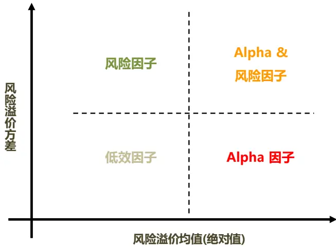
资料来源：东方证券研究所

1) Alpha 因子，这种因子的风险溢价均值的绝对值很大，方差很小，说明用这个因子来做选股可以获得显著而且稳定的超额收益。

2) 风险因子，风险因子的风险溢价均值的绝对值很小，甚至接近于零，用这个因子来做选股长期来看没有明显超额收益；但同时，由于它是一个显著定价因子，说明它对股价有影响；由于风险溢价的方差很大，因此在构建组合时，应该尽量剔除此类因子的影响来获得稳定收益。

3) Alpha 因子&风险因子. 这类因子的风险溢价均值很大，说明它的选股能力很强，但同时它的风险溢价方差很大，说明它的风险也很高，兼具 Alpha因子和风险因子的特征。A股市场上最明显的例子是市值因子，从09年以来的历史表现来看，把市值因子归为 alpha因子合理可行，但是它的风险溢价波动也非常之大，例如 14 年 12 月小盘股跑输大盘股近 30%，但 15 年 5月小盘股相对大盘股的超额收益超过 60%。拿这类因子做 alpha 还是风险因子，取决于投资者自己的选择；我们目前的研究里面把市值当作风险因子，这个决定更多的是基于对未来的考量。过去几年小盘股溢价的几个重要贡献因素，如：小盘成长股稀缺性、壳效应、大资金的操盘，未来可能随着注册制的推行、市场监管的趋严而失效，我们预防的是未来风格切换风险。

4) 低效因子。此类因子的风险溢价均值和方差都很小，在投资中实用价值不大。

在给定价因子分类的过程中，我们用的是“很大”、“很小”之类的定性说法，而没有给出明确定量标准，这时因为不同的投资者为了保证 alpha因子和风险因子达到一定程度的多样性，可能会设置不同的阈值，而且在不同的投资目标设定下，对 alpha因子的要求也会不一样（参考该系列下一篇报告），具体阈值设置多少存在人为主观性。Cox(2003) 对 alpha 因子和风险因子还提出了一些广度和可靠性方面的要求，详细内容可参考附录文献。

## 二、因子筛选与 Alpha 优化

## 2.1 因子筛选流程

Alpha 因子通过单因子的有效性检验后，下一步便是把这些 alpha因子含有的信息进行汇总合成；对于大型的 alpha 因子库，此时投资者可能会面临大量重复无效的信息，我们这里参考Fama-MacBeth检验流程，设计了一套因子筛选方法，可以剔除信息重复的因子。具体流程如下：

假设总共有K个备选的alpha因子 $\cdot\mathsf{F}_{1},F_{2}\dots F_{K}$ ，我们已经从中筛选出了s个因子 $\cdot\mathrm{F}_{\mathrm{i}_{1},}\mathrm{F}_{\mathrm{i}_{2}},\dots\mathrm{F}_{\mathrm{i}_{s},}$ （初始时 ），第 s+1次筛选流程如下：

Step 1. 对于剩余备选的 alpha 因子，每个因子每个月都对 $\mathrm{F}_{\mathrm{i}_{1}},\mathrm{F}_{\mathrm{i}_{2}},\dots\mathrm{F}_{\mathrm{i}_{s}},$ 做多元回归，计算残差项(s = 0 时不用做这一步)。记得到的 K-s 个残差项因子分别为 $\theta_{1},\theta_{2},\dots\theta_{K-s}$ 0

Step 2. 分别把 $\mathbb{I}\mathfrak{0}_{\mathfrak{j}},\ \mathfrak{j}=1\mathfrak{,}2\ldots\mathbb{K}-\mathfrak{s}和\mathbb{F}_{\mathfrak{i}_1,}\mathbb{F}_{\mathfrak{i}_2,}\ldots\mathbb{F}_{\mathfrak{i}_s,}$ 一起做自变量，做 Fama-MacBeth 回归，记录 $\mathrm{i}\theta_{\mathrm{j}}$ 系数的显著性，和每个月横截面回归  的平均值。

Step 3. 把系数不显著的因子剔除出备选 alpha 因子库。

Step 4. 选取系数显著且平均  最大的因子，假设为 $\theta_{\mathrm{h}}$ ，则把该因子作为第 $s{+}1$ 个筛选出的因 $\mathrm{F}_{\mathrm{i}_{s+1}}=\theta_{h}$ ，进入第 s+2次筛选；

Step 5. 如果所有因子的系数都不显著，则停止筛选过程。

每个横截面上备选因子对已筛选出因子做回归取残差项的方式可以让我们考察备选因子的“新增信息”，同时由于残差项和自变量和正交特性，这样做也避免了共线性对 Fama-MacBeth 回归里回归系数显著性的影响。

## 2.2 Alpha 优化

经过因子筛选，剔除不能贡献独立 alpha来源的因子后，下一步是要给各个 alpha因子赋予权重，把单个alpha因子的zscore加总成一个zscore。传统方法是做等权处理，但这显然忽视了alpha因子之间的相关性，使得因子的权重被人为的放缩。一种改进的方法是复合因子方法，先把同一类别的因子合成一个因子（例如：把 PE、PB 合成一个估值因子），再把这些复合因子进行等权加总，这样做可以降低但不能消除因子间相关性的影响，而且在合成复合因子过程中，基本面因子的逻辑比较清晰，比较好归类，但技术面因子的逻辑差别较大，很难分类；如果强行把所有技术面因子归为一类的话，会降低技术面因子的权重，而 A 股目前的现状是技术面因子表现整体强于基本面因子，因此这样做会降低模型表现。

我们这里采取的是 Qian(2007)的做法，这种方法能较好解决因子间的相关性问题，他先证明股票组合收益取决于加总因子的 IC，要获得稳定收益就需要加总因子的 IC足够稳定，因此他采取最大化复合因子 $1\mathsf{C}\_\mathsf{IR}$ 的方式来获得各个 alpha因子的权重。

假设有 K个因子，过去 T个月，每个月的因子 IC为 $\operatorname{IC}_{\operatorname{t},\operatorname{k}},t=1\ldots\operatorname{T},\operatorname{k}=1\ldots\operatorname{K}$ ；每个因子过去T 个月的 IC 均值 $\begin{array}{r}{\overline{{\mathrm{IC}}}_{k}=\sum_{1\leq t\leq T}IC_{t,k}/\mathrm{T}}\end{array}$ ，向量 $\overline{{\mathbf{I}\mathbf{C}}}\triangleq(\;\overline{{\mathrm{I}\mathbb{C}}}_{1},\overline{{\mathrm{I}\mathbb{C}}}_{2}\ldots\;\overline{{\mathrm{I}\mathbb{C}}}_{K})^{\prime}$ $\Sigma_{\mathrm{IC}}$ 为因子 IC 的协方差矩阵,alpha因子的权重向量 $\mathbf{w}=(w_{1},w_{2},\ldots w_{K})^{\prime}$ 。Qian(2007)的方法即是求解下列最优化问题：

$$
\max_{\mathbf{w}}IR_{IC}=\frac{\mathbf{w}'\cdot\overline{\mathbf{IC}}}{\sqrt{\mathbf{w}'\cdot\Sigma_{IC}\cdot\mathbf{w}}}
$$

通过计算目标函数一阶导数容易求得最优解可以表示为 $\begin{array}{r}{\mathsf{w}^{*}=\delta\cdot\Sigma_{IC}^{-1}\cdot\widehat{\mathbf{IC}},}\end{array}$ 为任意正数。

## 2.3 协方差矩阵估计

Qian(2007)的方法理论上可以很好解决 alpha因子间的相关性问题，但是实际运用中我们需要去估算 alpha因子间的协方差矩阵。最常用的估计量是样本协方差矩阵 $\hat{\Sigma}_{\mathrm{IC}}$ ，它是一个无偏估计量，而且在正态假设下还是极大似然估计。但样本协方差矩阵估计量的方差较大，而且如果因子数量较多，超过时间样本数量（K>T），样本协方差矩阵将变得不可逆，也就无法用上面的式子计算最优权重。另外，即使因子数量较少，或者事件样本较长（K<T），样本协方差矩阵可逆，代入上式计算因子权重也会有问题；因为我们计算用到的是 $\cdot\Sigma_{IC}^{-1}$ ，样本协方差矩阵是协方差矩阵的无偏估计，但样本协方差矩阵的逆并不是协方差矩阵逆的无偏估计，事实上在正态分布假设下可以证明

$$
\mathrm{E}\big(\hat{\Sigma}_{IC}^{-1}\big)=\frac{T}{T-K-2}\Sigma^{-1}.
$$

也就是说，如果 T 和 K 的大小比较接近，样本协方差矩阵逆的估计偏差将非常之大（Bai (2011)）。

本文采用的是 Ledoit(2004) 提出的压缩估计量方法，该方法我们之前在做股票组合优化时也有使用过。它的基本思想使用一个方差小但偏差大的协方差矩阵估计量 ̂作为目标估计量，和样本协方差矩阵做一个调和，牺牲部分偏差来获得更稳健的估计量，用数学式可以表示为

$$
\hat{\Sigma}_{shrink}=\lambda\Phi+(1-\lambda)\cdot\hat{\Sigma}_{\mathrm{IC}}
$$

参数 通过最小化估计量的二次偏差得到。至于目标估计量 ̂选择上，Ledoit 给出了适用于股票组合优化的三种形式：

1) Ledoit(2004) 单参数形式，可以表示为方差乘以一个单位矩阵。

2) Ledoit(2003b) CAPM 单因子结构化模型估计；

3) Ledoit(2003a) 平均相关系数形式；

其中第二种形式只适用于股票，第一种形式过于简单，需要牺牲较大的估计偏差，因此这里采用第三种形式作为压缩目标估计量。

## 三、实证结果

## 3.1 数据说明

实证中我们使用的是基于Wind FileSync 加工出来的 29个月频选股因子（图 4），数据时间段从 2006.01 到 2016.06。月度因子数据用偏度调整方法处理极值，个别因子通过取对数或求倒数的方法做正态转换（参考报告《选股因子数据的异常值处理和正态转换》）。

图 4：选股因子库

| 因子名称 | 说明 | 因子名称 | 说明 |
| --- | --- | --- | --- |
| BP_LF | Newest Book Value/Market Cap | OperatingProfitGrowth_Qr_YOY | 营业利润增长率（季度同比） |
| EP_TTM | TTM earnings/ MarketCap | EPS1YGrowth_YOY | 基本每股收益增长率(同比) |
| EP2_TTM | TTM earnings(after Non-recurring Iterms) / MarketCap | SalesGrowth_Qr_YOY | 营业收入增长率（季度同比） |
| SP_TTM | TTM Sales/ Market Cap | ProfitGrowth_Qr_YOY | 净利润增长率（季度同比） |
| CFP_TTM | TTM Operating Cash Flow / Market Cap | EquityGrowth_YOY | 净资产增长率（同比） |
| EBIT2EV | EBIT/Enterprise Value | OCFGrowth_YOY | 经营现金流增长率（同比） |
| ROA | 总资产收益率 | Debt2Asset | 债务资产比例 |
| ROE | 净资产收益率 | Ret1M | 1个月收益反转 |
| GrossMargin | 销售毛利率 | Ret3M | 3个月收益反转 |
| NetMargin | 净利润率 | PPReversal | 乒乓球反转因子 |
| AssetTurnover | 总资产周转率 | CGO_3M | Capital Gains Overhang (3M) |
| InvTurnover | 存货周转率 | TO | 以流通股本计算的1个月日均换手率 |
| GP2Asset | Gross Profit/Avg total Asset | ILLIQ | 每天一个亿成交量能推动的股价涨幅 |
| ROIC | (EBITDA- 资本支出)/(净资产+有息负债) | IRFF | Fama-French regression SSR/SST |
| Accrual2NI | (Net Income - CFO )/\|Net Income\| |  |  |

资料来源：东方证券研究所 & Wind 资讯

图 5：Alpha因子的月度平均 IC（绿色代表负数值)
因子月度平均IC绝对值
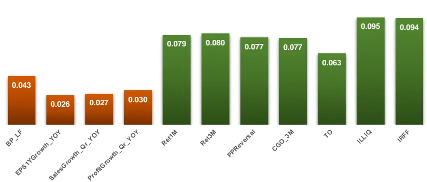
资料来源：东方证券研究所 & Wind 资讯

每个因子，每个月都用月初的因子数值和当月个股收益算一个 IC，把 IC 绝对值大于 0.02 且统计上显著的因子作为 alpha 因子。这样共有 11 个 alpha 因子。

需要说明的是，我们这里的 alpha 因子标准设定比较低，主要是为了留有足够数量的因子来说明上文介绍的方法的有效性，投资者可根据自己因子库的实际情况，设定更高的标准。另外，这里计算的是因子原始数据和个股原始收益的 IC，适用于全市场选股做多头组合；如果是做指数增强组合，有风险控制要求，那么需要计算的应该是风险调整后的 IC（详细说明参考系列下篇报告）。本报告采用原始 IC主要是为了说明问题的方便，报告中的 alpha因子筛选和优化方法同样适用于其它 IC 计算方法。

## 3.2 改进统计方法的效用

首先为了说明前文价绍的协方差矩阵压缩估计方法的效用，下面比较了它和样本协方差矩阵方法构建的全市场多空组合表现。

具体过程是在每个月月初，根据 11个 alpha因子过去 24个月的月度 IC数据，分别采用样本协方差矩阵方法（SampleCov）和压缩估计量方法（Shrink）估算协方差矩阵，再用第 2.2节里的优化公式计算 alpha 因子权重，并基于此计算全市场个股的 zscore 得分。把股票按 zscore 高低等分成 10组，每组股票等权配置，做多 Top组合，做空 Bottom组合，考察多空组合表现（图 6）。

图 6：SampleCov 和 Shrink 方法多空组合累积净值走势
改进统计方法的效用
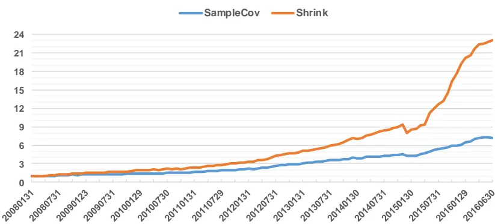

|  | 平均月收益 | 月胜率 | Sharpe Ratio |
| --- | --- | --- | --- |
| SampleCov | 0.020 | 81.6% | 2.39 |
| Shrink | 0.032 | 90.3% | 2.85 |

资料来源：东方证券研究所 & Wind 资讯

可以看到，SampleCov估计方差太大，估计值不准，而 Shrink方法牺牲了部分偏差，却获得了更稳健的估计量，因此优化得到的组合更符合做 alpha 优化时设定的目标，Sharpe 值、稳定性更高，平均月收益也更高则是附带的效果。

## 3.3 Alpha 优化的效用

此节主要说明 Alpha 优化相对传统等权 Alpha 模型的优势。为此，我们基于上述 11 个 alpha因子构造了等权 Alpha 模型（EqualWeight）的 Top minus Bottom 多空组合，和上节的 Shrink Alpha优化进行对比。结果如图 7所示，从多空组合月收益来看,等权 Alpha模型更高，但是 Shrink 优化后的多空组合的 Sharpe 值明显高于 EqualWeight，月胜率也要高很多，这主要是 Alpha 优化的方法考虑了因子间的相关性，剔除了重复信息的影响，而等权方法会人为的去变更这些重复信息的权重，增加收益的波动。Alpha 优化方法更符合量化投资对收益稳健性的要求。本报告采用的因子的原始数值，如果用 purified alpha方式剔除行业和市值风险影响，将得到更稳健多空组合。

图 7：EqualWeight 和 Shrink 方法多空组合累积净值走势
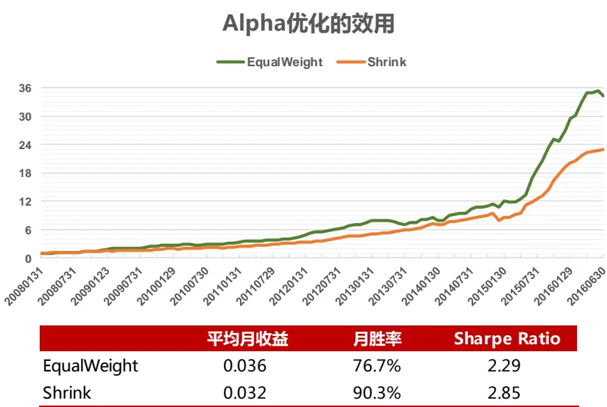

|  | 平均月收益 | 月胜率 | Sharpe Ratio |
| --- | --- | --- | --- |
| EqualWeight | 0.036 | 76.7% | 2.29 |
| Shrink | 0.032 | 90.3% | 2.85 |

资料来源：东方证券研究所 & Wind 资讯

## 3.4 因子筛选的效用

从上节可以看到，Alpha 优化可以起到剔除重复信息影响的作用，而 2.1 节介绍的Fama-MacBeth 因子筛选方法本质上也要剔除重复信息，两者理论上是在用不同的方法实现同一个目的。但实际操作中，因子筛选步骤是有现实意义的，它可以在不损耗 alpha信息的前提下减少因子数量，从而降低 Alpha 优化时需要估计的参数数量，提高估计准确性。下面将通过数据说明这一点。

首先我们用 2.1节介绍的因子筛选方法对 11个 alpha因子进行了筛选，最后剩下 6个因子，如图 8 所示，六个因子从左至右按照其被筛选出来的顺序排列，柱状图对应的是该因子别筛选进入后做横截面回归的  平均值。从图中可以看到，三个与反转效应相关的因子（Ret1M,Ret3M 和 PPRversal）最后只剩下 Ret3M，三个用来刻画个股成长性的季度同比财务指标最后只剩下 EPS1Ygrowth_YOY; 随着筛选得到的因子数量的增多，横截面回归的  平均值是在不断增大的，但是增速在不断放缓，说明因子达到一定数量后，新因子能带来的独立 alpha信息非常有限。

另外，由于我们用的是 alpha因子做回归，不包含行业和市值这两个 A股最明显的风险因子，因此横截面回归的  要低于市场在售的商业风险模型（这类模型的平均  在0.3-0.4左右）。把 alpha因子和股票收益里的风格因素剔除后将明显提升横截面回归的解释度。

图 8：因子筛选过程中的 Adjusted-R^2 平均值变化
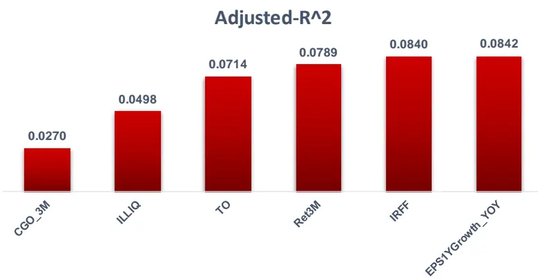
资料来源：东方证券研究所 & Wind 资讯

下面分别用初始的 11个因子和筛选得到的 6个因子通过 alpha优化得到多空组合，如果是用样本协方差矩阵做估计（图 9），可以非常明显的看到因子数量减少给参数估计带来的好处，6个因子的时候即使用样本协方差矩阵做估计也可以获得很好的结果；如果是用 Shrink方法估计协方差矩阵（图 10），可以看到用 6 个因子构造的组合和 11 个因子构成的组合表现基本相当，说明我们因子筛选的目的达到：在不损失 alpha 信息的前提下减少因子数量。我们目前的 alpha 因子库规模较小，如果投资者有更大的因子库，对比测试的结果可能会更明显。

图 9：SampleCov-11 和 SampleCov-6 的对比
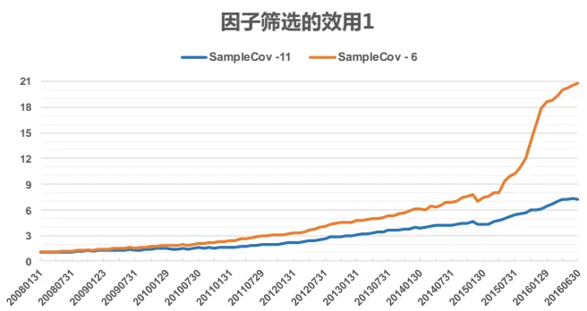

图 10：Shrink – 11 和 Shrink -6 的对比
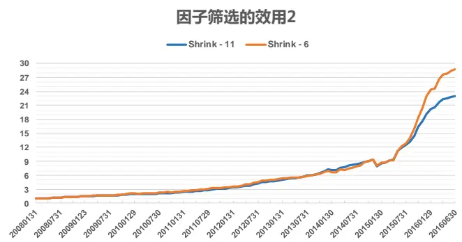

|  | 平均月收益 | 月胜率 | Sharpe Ratio |
| --- | --- | --- | --- |
| SampleCov -11 | 0.020 | 81.6% | 2.39 |
| SampleCov -6 | 0.030 | 87.4% | 2.80 |

资料来源：东方证券研究所 & Wind 资讯

|  | 平均月收益 | 月胜率 | Sharpe Ratio |
| --- | --- | --- | --- |
| Shrink -11 | 0.032 | 90.3% | 2.85 |
| Shrink -6 | 0.034 | 91.3% | 2.72 |

资料来源：东方证券研究所 & Wind 资讯

我们也可以用 Fama-MacBeth 回归的方法来检验因子筛选过程是否有信息损失。

首先把 11 个 Alpha 因子通过 Shrink 优化得到的 zscore 记为 Z11，对应 6 个因子得到的 zscore记为 Z6；再在每个月横截面上拿 Z11 对 Z6 回归得到残差项 Z_res，代表 11 个因子相对 6 个因子的信息增量；然后拿个股收益率做因变量，Z6 和 Z_res 做自变量做 Fama-MacBeth 回归。如果Z11 的信息能够完全 Z6 包含，那么对 Z_res 的系数做 Student-t 检验应该不显著。我们实证得到的 Z_res 系数 Student-t 检验 p-value 等于 0.23，在 5%置信度下不显著，这也能说明本报告里的因子筛选方法没有信息损失。

以上的结果都是针对我们现有的因子库，而投资者自己的因子库会各有不同，那么这种方法会对因子库的差异表现敏感吗？我们测试了以下 11 种情形， 表示把我们上述 11 个 alpha 因子里的第 i 个剔除，用剩下的 10 个因子做原始因子库；接着再用第 2.1 节的方法做因子筛选得到筛选后的因子库。两个因子库都用 Shrink 方法估计协方差矩阵，分别构造多空组合，比较组合表现，并用 Fama-MacBeth 回归检验筛选后的因子库是否有信息损失，结果如图 11 所示。

图 11：因子筛选方法对因子库的敏感性分析

| 原始因子库 |  |  |  | 筛选后因子库 |  |  |  |  | Fama-MacBeth pval |  |
| --- | --- | --- | --- | --- | --- | --- | --- | --- | --- | --- |
| 因子库 | 多空组合月收益 | 月胜率 | Sharpe Ratio |  | 筛选出的因子序号 | 多空组合月收益 | 月胜率 | Sharpe Ratio |  |  |
| CASE 1 | 0.033 | 91.3% | 2.97 | 2 6 | 8 9 | 10 11 | 0.034 | 91.3% | 2.72 | 0.50 |
| CASE 2 | 0.032 | 92.2% | 2.90 |  | 6 8 9 10 11 |  | 0.034 | 90.3% | 2.61 | 0.01 |
| CASE 3 | 0.030 | 87.4% | 2.64 |  | 2 6 8 | 9 10 11 | 0.034 | 91.3% | 2.72 | 0.70 |
| CASE 4 | 0.033 | 93.2% | 2.99 |  | 268 | 9 10 11 | 0.034 | 91.3% | 2.72 | 0.14 |
| CASE 5 | 0.033 | 90.3% | 3.07 |  | 2 6 8 9 | 10 11 | 0.034 | 91.3% | 2.72 | 0.10 |
| CASE 6 | 0.031 | 91.3% | 2.90 |  | 78 | 9 10 11 | 0.033 | 91.3% | 2.55 | 0.01 |
| CASE 7 | 0.032 | 90.3% | 2.97 |  | 2 6 8 9 | 10 11 | 0.034 | 91.3% | 2.72 | 0.09 |
| CASE 8 | 0.032 | 89.3% | 2.87 | F | 6 9 10 |  | 0.034 | 77.7% | 1.72 | 0.00 |
| CASE 9 | 0.029 | 91.3% | 2.53 | 23 | 4 5 67 | 8 10 11 | 0.029 | 90.3% | 2.61 | 0.29 |
| CASE 10 | 0.027 | 88.3% | 3.15 | ２３ | 5 6 7 | 8 9 11 | 0.028 | 87.4% | 3.02 | 0.05 |
| CASE 11 | 0.027 | 89.3% | 2.22 | 2 | 6 8 V | 9 10 | 0.031 | 77.7% | 1.91 | 0.00 |

资料来源：东方证券研究所 & Wind 资讯

可以看到，随着原始因子库的变化，本文的因子筛选方法确实有可能会到导致信息损失，11种情形里面，有五种情形的 Fama-MacBeth 回归检验 pval <0.05。但是从多空组合表现来看，经过筛选的因子库构建的多空组合表现和原始因子库相当，说明损失的信息量很小。比较特别情况的是 CASE8，由于筛选出的因子数量较少，导致多空组合收益变化不大，但 Sharpe Ratio降低明显。由于我们本报告中的因子未做中性化处理，因子少可能导致组合风险暴露增大，中性化处理后或许可以减少这种损失，有关 alpha中性化处理的问题我们将在下篇报告论述。

## 3.5 Bootstrap 方法

最后介绍一种进一步减小协方差矩阵估计方差对 Alpha 优化效果影响的方法，这种方法由Michaud（2008）提出，目的是降低组合优化得到个股权重的波动性。具体做法是对横截面数据样本进行 Bootstrap 抽样，每次抽样完成都用样本协方差矩阵或压缩估计量做一次 alpha优化，得到一个 Alpha 因子权重向量；如果 Bootstrap 抽样 1000 次，那么就可得到 1000 个 alpha 权重向量；把这些权重向量再平均得到最终的优化权重（结果如下图 12所示）。这种方法对本文中的小规模因子库改善不是很明显，对于大规模因子库的效果，感兴趣的投资者可自行测试。

图 12：Shrink-11 和 Bootstrap+Shrink-11 的对比
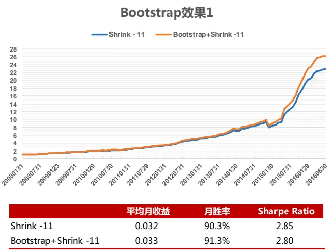

|  | 平均月收益 | 月胜率 | Sharpe Ratio |
| --- | --- | --- | --- |
| Shrink -11 | 0.032 | 90.3% | 2.85 |
| Bootstrap+Shrink -11 | 0.033 | 91.3% | 2.80 |

资料来源：东方证券研究所 & Wind 资讯

图 13：Shrink-6 和 Bootstrap+Shrink-6 的对比
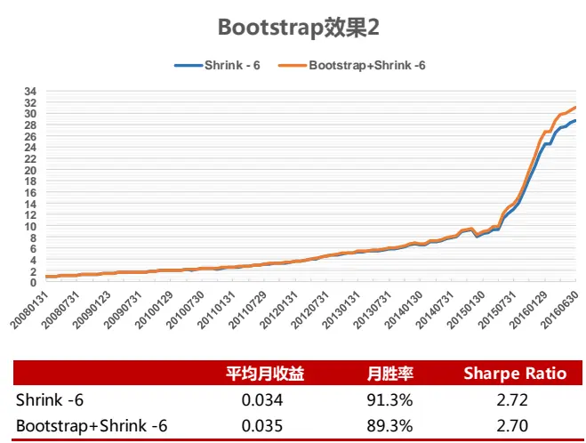

|  | 平均月收益 | 月胜率 | Sharpe Ratio |
| --- | --- | --- | --- |
| Shrink -6 | 0.034 | 91.3% | 2.72 |
| Bootstrap+Shrink-6 | 0.035 | 89.3% | 2.70 |

资料来源：东方证券研究所 & Wind 资讯

## 四、总结

本文我们提出了一种基于 Fama-MacBeth 回归的 Alpha 因子筛选方法，实证显示这种筛选方法基本没有信息损失或损失很少的信息，可以有效的帮助投资者剔除因子库里的重复信息，降低因子数量和后续 Alpha优化要估计的参数数量。Alpha优化的核心是因子间协方差矩阵的估计，压缩估计和 Bootstrap的方法可以很好的降低估计方差对优化结果的影响，从而获得稳健收益。本文中实证过程中使用的是 alpha 因子的 raw IC，但对 risk adjusted IC 和 purified alpha 同样适用。

## 风险提示

1. 量化模型基于历史数据分析得到，未来存在失效的风险，建议投资者紧密跟踪模型表现。

2. 极端市场环境可能对模型效果造成剧烈冲击，导致收益亏损。

## 参考文献

[1]. Bai, J., Shi, S., (2011), “Estimating High Dimensional Covariance Matrices and Its Appication”, Annals of Economics and Finance, 12-2, 199-215.

[2]. Cochrane, J.H., (2005), “Asset Pricing (Revised Edition)”, Princeton University Press.

[3]. Cochrane, J.H. , (2011), “Presidential address: Discount rates”. Journal of Finance, 66(4), 1047-1108.

[4]. Cox, B., (2003), “Equity Factors and Portfolio Management: Alpha Generation Versus Risk Control”， ABACUS ANALYTICS research paper.

[5]. Fama, E. F., (2015a), “Cross-Section Versus Time-Series Tests of Asset Pricing Models”, working paper, SSRN: http://ssrn.com/abstract=2685317

[6]. Fama, E. F., French, K. R. (1993). "Common risk factors in the returns on stocks and bonds". Journal of Financial Economics. 33: 3.

[7]. Fama, E.F., French, K.R., (2003), “The CAPM: Theory and Evidence”, working papers, http:/ssrn.com/abstract=440920.

[8]. Fama, E.F., French, K.R., (2015b), “ A five-factor asset pricing model”, Journal of Finance Economics, 116, 1-22.

[9]. Fama, E. F., MacBeth, J. D., (1973). "Risk, Return, and Equilibrium: Empirical Tests". Journal of Political Economy. 81 (3): 607–636.

[10]. Gibbons, R., Ross, S., Shanken, J., (1989), “A test of the efficiency of a given portfolio”, Econometrica, 57:1121- 1152.

[11]. Harvey, C. R., Y. Liu and H. Zhu, (2016), “... and the cross-section of expected returns”, Review of Financial Studies 29, 5-68.

[12]. Harvey, C. R., Y. Liu, (2016), “ Lucky Factors”, working paper, SSRN, http://ssrn.com/abstract=2528780.

[13]. Jegadeesh, N., Noh, J., (2013), “Empirical Tests of Asset Pricing Models with Individual Stocks”, working papers, http://papers.ssrn.com/sol3/papers.cfm?abstract_id=2382677.

[14]. Ledoit, O. and Wolf, M. (2003a)，” Honey, I shrunk the sample covariance matrix”, working paper , http://www.econ.upf.edu/docs/papers/downloads/691.pdf

[15]. Ledoit, O. and Wolf, M. (2003b). "Improved estimation of the covariance matrix of stock returns with an application to portfolio selection". Journal of Empirical Finance, 10(5):603–621

[16]. Ledoit, O. and Wolf, M. (2004). "A well-conditioned estimator for large-dimensional covariance matrices". Journal of Multivariate Analysis, 88(2):365–411.

[17]. Lewellena, J., Nagelb, S., Shankenc, J., (2010), “A skeptical appraisal of asset pricing tests”, Journal of Financial Economics, Vol (96), Issue 2, 175–194.

[18]. Michaud, R., (2008), “Efficient Asset Management: A Practical Guide to Stock Portfolio Optimization and Asset Alocation ( 2nd Edition)”, Oxford University Press.

[19]. Qian, E., Hua, R., Sorensen, E., (2007), “Quantitative Equity Portfolio Management: Modern Techniques and Applications”, Chapman & Hall/CRC Financial Mathematics Series.

[20]. Wijst, N., (2013), “Finance: A Quantitative Introduction”, Cambridge University Press.

[21]. 郭多祚, (2006), “数理金融：资产定价的原理与模型”, 清华大学出版社.

## 分析师申明

每位负责撰写本研究报告全部或部分内容的研究分析师在此作以下声明：

分析师在本报告中对所提及的证券或发行人发表的任何建议和观点均准确地反映了其个人对该证券或发行人的看法和判断；分析师薪酬的任何组成部分无论是在过去、现在及将来，均与其在本研究报告中所表述的具体建议或观点无任何直接或间接的关系。

## 投资评级和相关定义

报告发布日后的 12个月内的公司的涨跌幅相对同期的上证指数/深证成指的涨跌幅为基准；

## 公司投资评级的量化标准

买入：相对强于市场基准指数收益率15%以上；

增持：相对强于市场基准指数收益率5%～15%；

中性：相对于市场基准指数收益率在-5%～+5%之间波动；

减持：相对弱于市场基准指数收益率在-5%以下。

未评级——由于在报告发出之时该股票不在本公司研究覆盖范围内，分析师基于当时对该股票的研究状况，未给予投资评级相关信息。

暂停评级——根据监管制度及本公司相关规定，研究报告发布之时该投资对象可能与本公司存在潜在的利益冲突情形；亦或是研究报告发布当时该股票的价值和价格分析存在重大不确定性，缺乏足够的研究依据支持分析师给出明确投资评级；分析师在上述情况下暂停对该股票给予投资评级等信息，投资者需要注意在此报告发布之前曾给予该股票的投资评级、盈利预测及目标价格等信息不再有效。

## 行业投资评级的量化标准：

看好：相对强于市场基准指数收益率5%以上；

中性：相对于市场基准指数收益率在-5%～+5%之间波动；

看淡：相对于市场基准指数收益率在-5%以下。

未评级：由于在报告发出之时该行业不在本公司研究覆盖范围内，分析师基于当时对该行业的研究状况，未给予投资评级等相关信息。

暂停评级：由于研究报告发布当时该行业的投资价值分析存在重大不确定性，缺乏足够的研究依据支持分析师给出明确行业投资评级；分析师在上述情况下暂停对该行业给予投资评级信息，投资者需要注意在此报告发布之前曾给予该行业的投资评级信息不再有效。

## 免责声明

本证券研究报告（以下简称“本报告”）由东方证券股份有限公司（以下简称“本公司”）制作及发布。

本报告仅供本公司的客户使用。本公司不会因接收人收到本报告而视其为本公司的当然客户。本报告的全体接收人应当采取必要措施防止本报告被转发给他人。

本报告是基于本公司认为可靠的且目前已公开的信息撰写，本公司力求但不保证该信息的准确性和完整性，客户也不应该认为该信息是准确和完整的。同时，本公司不保证文中观点或陈述不会发生任何变更，在不同时期，本公司可发出与本报告所载资料、意见及推测不一致的证券研究报告。本公司会适时更新我们的研究，但可能会因某些规定而无法做到。除了一些定期出版的证券研究报告之外，绝大多数证券研究报告是在分析师认为适当的时候不定期地发布。

在任何情况下，本报告中的信息或所表述的意见并不构成对任何人的投资建议，也没有考虑到个别客户特殊的投资目标、财务状况或需求。客户应考虑本报告中的任何意见或建议是否符合其特定状况，若有必要应寻求专家意见。本报告所载的资料、工具、意见及推测只提供给客户作参考之用，并非作为或被视为出售或购买证券或其他投资标的的邀请或向人作出邀请。

本报告中提及的投资价格和价值以及这些投资带来的收入可能会波动。过去的表现并不代表未来的表现，未来的回报也无法保证，投资者可能会损失本金。外汇汇率波动有可能对某些投资的价值或价格或来自这一投资的收入产生不良影响。那些涉及期货、期权及其它衍生工具的交易，因其包括重大的市场风险，因此并不适合所有投资者。

在任何情况下，本公司不对任何人因使用本报告中的任何内容所引致的任何损失负任何责任，投资者自主作出投资决策并自行承担投资风险，任何形式的分享证券投资收益或者分担证券投资损失的书面或口头承诺均为无效。

本报告主要以电子版形式分发，间或也会辅以印刷品形式分发，所有报告版权均归本公司所有。未经本公司事先书面协议授权，任何机构或个人不得以任何形式复制、转发或公开传播本报告的全部或部分内容。不得将报告内容作为诉讼、仲裁、传媒所引用之证明或依据，不得用于营利或用于未经允许的其它用途。

经本公司事先书面协议授权刊载或转发的，被授权机构承担相关刊载或者转发责任。不得对本报告进行任何有悖原意的引用、删节和修改。

提示客户及公众投资者慎重使用未经授权刊载或者转发的本公司证券研究报告，慎重使用公众媒体刊载的证券研究报告。

## 东方证券研究所

地址：上海市中山南路 318 号东方国际金融广场 26 楼

联系人： 王骏飞

电话：021-63325888*1131

传真：021-63326786

网址： www.dfzq.com.cn

Email： wangjunfei@orientsec.com.cn