## 研究结论

量化策略回溯测试得到的“纸面收益”与实际交易“账面收益”最大差别在于交易成本控制，特别是对资金量大、换手率高的产品。在成交价格上加减一个固定比例的冲击成本的传统做法并不可行，它无法反应不同时点、不同股票、不同资金量造成冲击的差异。本报告基于A股主动买卖单数据，提供了一个可行的股票冲击成本模型，辅助投资者控制资金冲击，提升账面收益。

我们构建了幂指数模型来解释股票的冲击成本。一般来说股票的流通市值、波动率、市场的活跃程度都会影响冲击成的大小。通过对历史数据做拟合我们得到了冲击成本函数的参数在不同月份的数值，并可据此计算股票的冲击成本与主动交易金额的关系。

我们将冲击成本函数加入到组合优化目标函数中，并且模拟了初始资金量 1亿、2 亿、3 亿、5 亿和 10 亿的情况下组合的收益情况。实证发现，加入冲击成本函数做优化会降低策略的理论 alpha，但如果在计算组合收益时，把资金的冲击成本考虑进去，这种组合组合优化方式将能显著提升“账面收益”，对大资金的提升尤为明显（下表）。

## 风险提示

- 量化模型失效的风险

- 模型参数估计的误差风险

| 各类组合的超额收益率 | 1亿 | 2亿 | 3亿 | 5亿 | 10亿 |
| --- | --- | --- | --- | --- | --- |
| 未优化冲击成本组合（回测无冲击成本） | 13.78% | 13.78% | 13.78% | 13.78% | 13.78% |
| 调整系数0.4 组合（回测无冲击成本） | 12.81% | 12.05% | 11.20% | 9.67% | 7.89% |
| 优化冲击成本（回测无冲击成本）损失收益 | 0.97% | 1.73% | 2.58% | 4.11% | 5.89% |
| 未优化冲击成本组合（回测有冲击成本） | 11.32% | 9.64% | 8.01% | 5.33% | 0.34% |
| 含冲击成本的回测损失的超额收益率 | 2.46% | 4.14% | 5.77% | 8.55% | 13.44% |
| 最优调整系数组合（回测有冲击成本） | 11.96% | 10.27% | 9.51% | 7.80% | 5.08% |
| 优化冲击成本（回测有冲击成本）获取收益 | 0.66% | 0.63% | 1.50% | 2.47% | 4.74% |

报告发布日期2016 年 08 月 26 日

证券分析师朱剑涛

021-63325888*6077

zhujiantao@orientsec.com.cn

执业证书编号：S0860515060001

相关报告

| Alpha 因子库精简与优化 | 2016-08-12 |
| --- | --- |
| 日内残差高阶矩与股票收益 | 2016-08-12 |
| 动态情景多因子 Alpha 模型 | 2016-05-25 |
| 投机、交易行为与股票收益（下） | 2016-05-12 |
| 用组合优化构建更精确多样的投资组合 | 2016-02-19 |
| 剔除行业、风格因素后的大类因子检验 | 2016-02-17 |
| 基于交易热度的指数增强 | 2015-12-14 |
| 投机、交易行为与股票收益（上） | 2015-12-07 |
| 低特质波动，高超额收益 | 2015-09-09 |

## 一、 冲击成本模型

## 1.1 交易成本介绍

## 1.1.1 交易成本分类

交易成本会对投资的收益带来较大的影响，同时高额的交易成本也限制了组合频换调仓去追求更高alpha的可能，这两点都是研究人员和机构投资者关心的。通常来说交易成本可以分成容易度量的显性成本和难以度量的隐性成本两类（表1）。其中显性成本可以被很好的度量，同时在策略模拟的时候可以很好的被包含到模型当中，然而隐性成本是难以度量的，而其中的占比最高的冲击成本更是会对实际投资的结果造成很大的影响，这也就是为什么很多交易策略的模拟收益有时会好于策略的实际投资收益。在这篇报告中，我们将对股票的交易冲击成本进行建模，把其作为组合构建的一个考察因素，考察资金规模对量化策略收益的影响。

表1：交易成本分类

| 固定成本 |  | 变动成本 |
| --- | --- | --- |
| 显性成本 | 佣金费用 | 价差成本 |
|  | 交易税 |  |
|  | 手续费 |  |
| 隐性成本 |  | 延迟成本 |
|  |  | 冲击成本 |
|  |  | 价格变动成本 |
|  |  | 机会成本 |
|  |  | 时间风险 |

数据来源：东方证券研究所

## 1.1.2什么是冲击成本？

冲击成本作为显性成本中的主要部分指的是由订单或交易导致的价格变动所带来的成本。冲击成本主要分为永久性冲击和暂时性冲击，其中永久性冲击指的是订单对于价格的永久性影响，永久性冲击来源于订单释放信息导致的平衡价格偏移；暂时性冲击指得是订单对于价格的暂时性影响，这种影响会随着时间推移逐渐减小消失，暂时性冲击来源于市场短期供求关系的非平衡和流动性需求。如图1所示，一个订单会对市场的价格变动产生影响，其中永久性冲击将永久的改变股票的价格，而暂时性冲击的作用会在一定时间之后逐渐消失。

在国外市场，Bikker 等人（2007）研究了某家养老基金的交易数据，统计分析了冲击成本的大小大约为 40bps。在我国，根据上海证券交易所每年公布的《上海证券交易所市场质量报告》来看，2014年单笔交易额90万元的市价单冲击约为42bps（图 2），可以看到冲击成本相比于显性成本而言更大。

图1：永久性冲击与暂时性冲击对股价影响
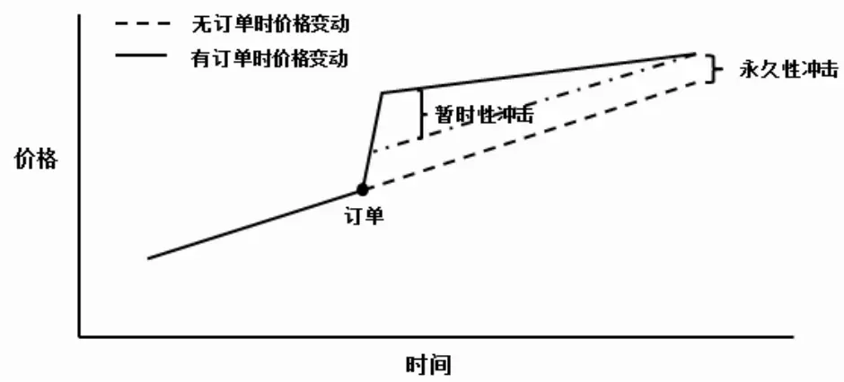
数据来源：东方证券研究所

图2：不同年份的价格冲击指数
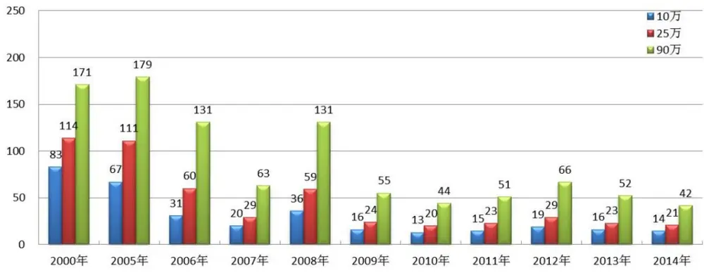
数据来源：东方证券研究所 & 上海证券交易所市场质量报告

## 1.1.3冲击成本的国外研究现状

目前国外研究人员对于冲击成本所做的主要研究有：

Breen等人（2002）运用线性模型研究了价格移动和净买卖量之间的关系：

$$
\begin{array}{r}{\mathrm{I}_{\mathrm{i},\mathrm{t}}=\mathrm{X}_{\mathrm{i},\mathrm{t}}\bar{\Gamma}NTO_{i,t}\times0.5(1-\frac{1}{n}),}\end{array}
$$

其中，因变量为股票 i 在 t 时刻的冲击成本， $NTO_{i,t}$ 为股票 i 在 t 时刻的交易数量， $\mathrm{X_{i,t}}$ 股票特有因素的回归系数， ̅为市场因素的回归系数。作者对这个模型做了截面回归并估计1993年1月到1997年5月美国股票的结果，接着用模型进行样本外的预测，发现平均有-71bps的预测误差。

Lillo 等人（2003）运用金融物理学方法统计分析了冲击成本与净买卖量之间的关系，发现它们是呈幂指数关系的特征：

$$
\begin{array}{r}{\Delta\mathtt{p}=\mathtt{C}^{-\gamma}sgn(w)\left|\frac{w}{C^{\delta}}\right|^{\beta},}\end{array}
$$

其中 是冲击成本， 为一个市值区间中股票平均市值， $,w$ 为交易量，估计出的参数大小为 $\gamma=\delta=0.3$ 在不同年份介于0.2-0.5之间。

Almgren 等人（2002,2003,2005）在三篇论文中分别建立了非线性的冲击成本模型并运用了花旗银行 2001.12-2003.6 的订单数据进行了实证数据的分析，统计出了冲击成本函数的参数（永久性冲击函数的指数： $\alpha=0.891$ ，暂时性冲击函数的指数： $\beta=0.6)$ ，这个模型相对于之前两个模型而言被业界的认可程度更高。

Chiyachantana 等人（2004）统计了 1997,1998 和 2001 年 37 个全球市场的数据发现影冲击成本受市场因素影响较大，在牛市期间买入的冲击成本通常要大于卖出的，在熊市期间则呈现相反的规律。Gatheral 等人（2011）建立了优化冲击成本的算法交易模型。Kissell等人（2013）提出了另一种描述冲击成本的非线性模型——I-star模型，与Almgren模型的主要区别是在波动率项上加上了指数。我们比较了两种模型的结果之后，采用 Almgren 建立的模型并用它来衡量分析中国股票市场的冲击成本大小。

## 1.2 冲击成本模型

## 1.2.1 模型变量

这里我们参考Almgren and Chriss (2000)和Almgren (2003)中所提出的衡量冲击成本的模型。首先我们对模型的输入变量作出定义。

对于一个订单而言，我们有订单发起时的市场价格 ${\cdot}S_{0}$ ；订单执行完后的市场价格 $S_{\mathrm{post}}$ $S_{\mathrm{post}}$ 指的是订单执行完一段时间之后暂时性冲击消失后的价格，也就是说 $S_{\mathrm{post}}$ 仅包含了订单的永久性冲击效果；平均执行价格 $\begin{array}{r}{\bar{s}=\sum x_{j}S_{j}/\sum x_{j},}\end{array}$ 其中 $\mid x_{j}$ 和 $S_{j}$ 分别为订单中第j部分执行的成交量和成交价格，̅度量了订单交易的平均价格，也就是永久性冲击和临时性冲击的共同效果。定义了价格以后，我们可以得到冲击变量：

$$
永久性冲击:$I=\frac{S_{post}-S_{0}}{S_{0}},$
$$

$$
冲击成本:$J=\frac{\bar{S}-S_{0}}{S_{0}}。$
$$

我们可以想象对于一个订单而言，在成交的过程中会始终受到发起时刻到当前的永久性冲击作用，因此综合整个订单的执行过程而言，冲击成本中的永久性冲击部分实际是I/2.因此我们可以定义暂时性冲击为：

$$
暂时性冲击:$P=J-\frac{I}{2}\mathrm{。}$
$$

同时，对于一个订单而言，交易量和交易的时间也是必须的，我们定义订单执行总 $量X=\textstyle\sum_{j=1}^{n}x_{j}$ 交易量时间 ， 指的是当天开始到时刻t时的交易量占一天总交易量的百分比，所以在开盘的时候$\tau=0$ ，在收盘的时候 $\tau=1$ ；订单交易量时间 $\mathbf{\tau}=\mathbf{\tau}_{\mathrm{n}}-\mathbf{\tau}_{0}$ ，其中 $\tau_{\pi}$ 和 $\tau_{0}$ 分别为订单开始和结束时的交易量时间，T也就是订单交易量占全天交易量的比重；冲击交易时间 $\mathtt{T_{post}}=\mathtt{\tau_{post}}-\mathtt{\tau_{0}}$ ，其中 $\tau_{\mathrm{post}}$ 为订单执行结束后暂时性冲击消失时的交易量时间。

在模型中，我们还会用到平均日交易量 V 和日内波动率 ，用 V 来对 X 做标准化，可以得到订单量与平均日交易量的比例，参数的估计在时间尺度上更加稳定， 是衡量日内股票交易活跃度的指标， 代表了股票价格日内的变 $动$ 剧烈程度，与冲击成本大小也有一定的关系。

## 1.2.2 动力学模型

假设股票价格的变化服从算数布朗运动，可以得包含永久性冲击的股价动力学方程为：

$$
dS=S_{0}g(\nu)d\tau+S_{0}\sigma dB
$$

其中 $g(\nu)$ 为永久性冲击函数， 是一个标准布朗运动变量， 为单位时间内的交易量。 $|\mathbf{g}(v)|$ |随着| |增大而增大，且 $\mathbf{.g}(0)=0$ 。把上式对 从0到T做积分，同时令 $\nu=\mathrm{X}/\mathrm{T}$ ，可以得到永久性冲击的表达式为：

$$
\begin{array}{r}{I=Tg\left(\frac{X}{T}\right)+\sigma\sqrt{T_{post}}\xi.}\end{array}
$$

其中ξ是一个标准正态分布的随机变量。

包含暂时性冲击的股价动力学方程为：

$$
\overline{{S}}(\tau)=S(\tau)+S_{0}h(\cfrac{X}{T})
$$

其中 $g(\nu)$ 为暂时性冲击函数，可以看到上述方程是一个连续交易量时间方程，对其做交易量时间加权平均可以得到：

$$
J-\cfrac{I}{2}=h\left(\cfrac{X}{T}\right)+\sigma\left(\sqrt{\cfrac{T}{12}\left(4-3\cfrac{T}{T_{post}}\right)}\chi-\cfrac{T_{post}-T}{2\sqrt{T_{post}}}\xi\right).
$$

其中 是独立于ξ的标准正态分布随机变量。

这样我们就得到了永久性冲击与暂时性冲击的表达式：

$$
I=Tg\left(\frac{X}{T}\right)+<\mathrm{noise}>_{\circ}
$$

$$
J-\frac{I}{2}=h\left(\frac{X}{T}\right)+<noise>
$$

## 1.2.3 冲击成本函数

根据 Almgren (2003),Lillo（2003）和 Barra (1997)等人的研究结果来看，学界通常认为冲击成本函数 )和 )都是 的幂函数，形式如下：

$$
\begin{aligned}&\mathsf{g}(\mathsf{v})=\pm\gamma^{\prime}|\mathsf{v}|^{\alpha},\\&\mathsf{h}(\mathsf{v})=\pm\mathsf{\eta}^{\prime}|\mathsf{v}|^{\beta}。\\\end{aligned}
$$

我们假设冲击成本函数是关于原点中心对称的，也就是说相同大小的买卖单对价格的冲击仅符号相反。接着我们把 除以平均交易量 V 来去除变量的量纲，把 变成日均交易量百分比的形式，这样可以让自变量在时间尺度上始终保持在0-1之间，参数估计的稳定性更好。此外，我们知道日内波动率是描述股价在天内波动情况的指标，这个指标与冲击成本也相关，所以我们从 和 中提取出并除到因变量上来对永久性冲击和暂时性冲击标准化。最后，根据 Breen 等人（2002）的实证研究结果，我们在永久性冲击函数上加上流动性因子 ，

$$
\begin{array}{r}{\mathcal{L}=\left(\frac{\theta}{V}\right)^{\delta},}\end{array}
$$

其中 为股票的流通股本数， $\frac{\theta}{V}^{-}$ 也就是平均换手率的倒数。

综合上述结果，我们最终得到了标准化的永久性冲击函数和标准化的暂时性冲击函数：

标准化的永久性冲击： $\begin{array}{r}{\frac{I}{\sigma}=\gamma Tsgn(X)\left|\frac{X}{VT}\right|^{\alpha}\left(\frac{\theta}{V}\right)^{\delta}+<noise>}\end{array}$

$$
\frac{1}{\sigma}\left(J-\frac{1}{2}\right)=\eta\mathrm{Tsgn}(X)\left|\frac{X}{\mathrm{VT}}\right|^{\beta}+<\mathrm{noise}>
$$

根据 Huberman and Stanzl（2004）的研究， $\mathbf{g}(\mathbf{v})$ 是 的线性函数，也即 $\alpha=1$ ，此时模型不存在无风险套利机会。根据Robert Almgren等人 (2005)的实证估计（花旗集团股票交易柜台2001.12-2003.07 的股票订单数据）得到 $|\beta=0.6$ 以及 $\delta=0.25$ 。在本文中，我们将根据日频的数据来对模型的参数进行估计。

## 1.3 冲击成本模型的实证研究

## 1.3.1 参数设定

在本文中，我们根据低频的日度数据来估计永久性冲击和暂时性冲击平均在一天内的效果。我们用每日的主动净流入量（正的代表流入，负的代表流出）来代替订单的大小，相当于把每日的主动净流入量看作为一个主动的交易订单，同时我们认为相同的主动买入量与主动卖出量的作用的相互抵消的，所以这个订单是在一天之内以成交量加权平均价（VWAP）来交易完成的，也就是说 T=1，̅=VWAP， $\mathsf{S}_{0}$ 为每日的开盘价格， $S_{\mathrm{post}}$ 为每日的收盘价格。

根据《上海证券交易所市场质量报告》中的统计结果可以看到，不同流通市值大小的股票的市场冲击大小不同（图 3），因此我们在估计参数的时候把股票按照流通市值划分为 7 个区间（表 2）。

图3：按流通市值分组的价格冲击指数（2014）单位：基点
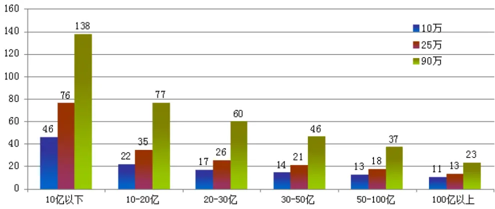
数据来源：东方证券研究所 & 上海证券交易所市场质量报告

表2：市值区间划分

| 时间 流通市值（亿元） |  |  |  |  |  |  |  |
| --- | --- | --- | --- | --- | --- | --- | --- |
| 2012年以前 | ≤10 | 10-30 | 30-50 | 50-100 | 100-200 | 200-500 | >500 |
| 2012年以后 | ≤30 | 30-50 | 50-100 | 100-200 | 200-500 | 500-1000 | >1000 |

数据来源：东方证券研究所

## 1.3.2 参数估计

我们估计了2008年 1月底到 2016 年 7月底的冲击成本函数的参数，对于上面提出的冲击成本函数，我们采用基于高斯-牛顿迭代法的优化迭代算法来拟合出各个参数，使得拟合结果满足残差最小化的标准。为了检验参数估计的稳定性，我们分别用历史三个月数据和历史一个月数据来进行参数估计，图 4-10 分别是不同市值区间的参数估计结果，可以看到用历史三个月数据估计的参数结果更加稳定。根据估计的结果， 都落在 0.5-1 之间， 都落在 0-1.5 之间，δ都落在了-0.3 到 0.3之间，而γ在不同月份的变动较大，可以看到参数在 2015 年后半年与 2008 年后半年大小接近，但这并非意味着两个时间的冲击成本大小类似，而指的是在这两段时间都买入交易量相同比例的股票数所造成的冲击成本类似，而由于交易量的增大和股价的变动，进行相同金额的交易在2015年会带来更小的冲击成本。特别需要注意的是，在某些股价变动极端的月份（2015 年7、8 月和2016年 1 月），暂时性冲击函数的拟合优度会出现小于 0 的情况，这是由于估计的函数没有截距项而实际的数据均值并不过原点，在这种极端情况下会导致模型失效，因此我们在后续操作时将用上月底估计的参数值作为替代。

图4：市值区间1的冲击成本函数参数
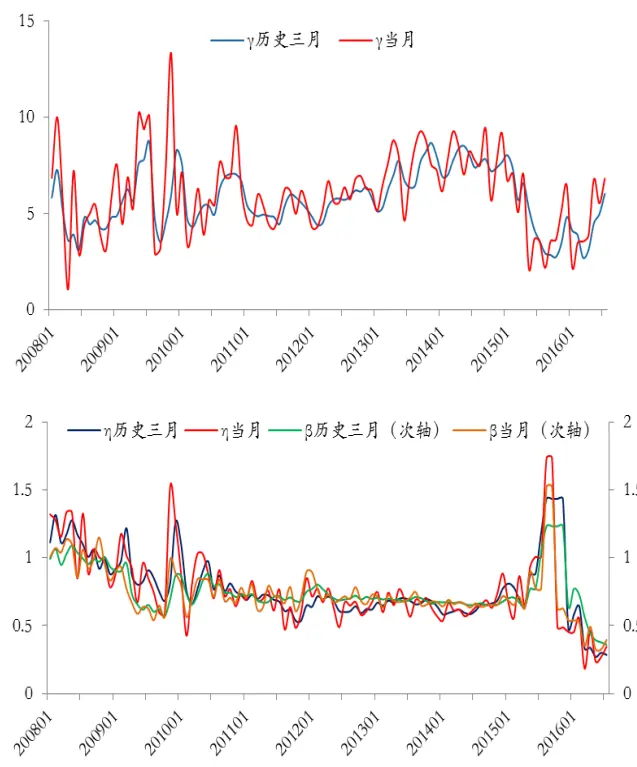
数据来源：东方证券研究所 & Wind资讯

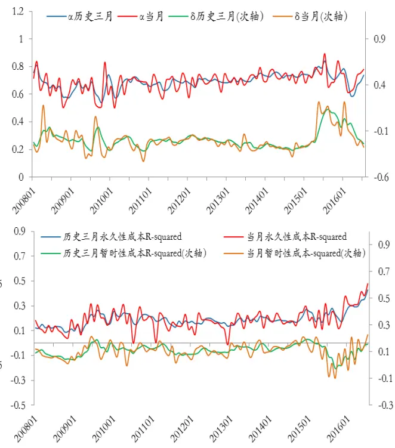

图5：市值区间2的冲击成本函数参数
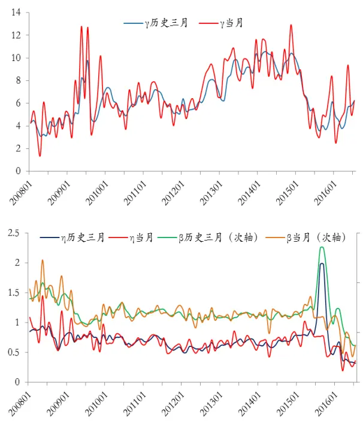

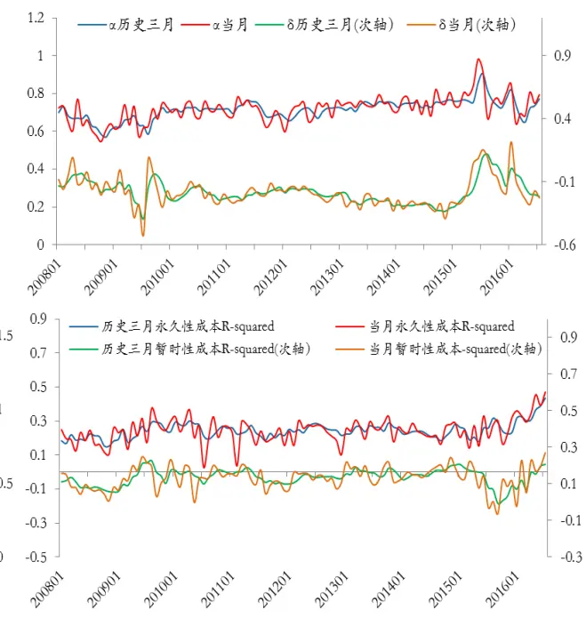
数据来源：东方证券研究所 & Wind资讯

图6：市值区间3的冲击成本函数参数
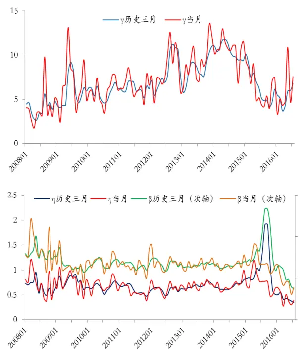
数据来源：东方证券研究所 & Wind资讯

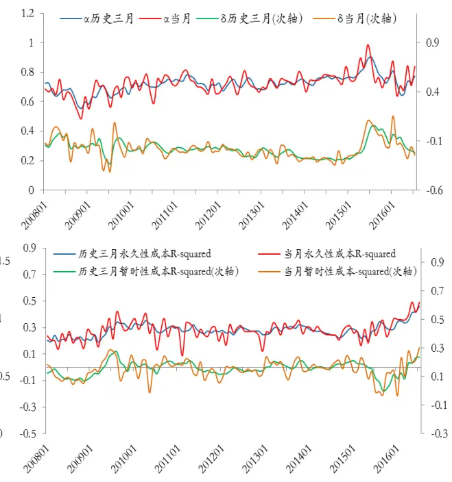

图7：市值区间4的冲击成本函数参数
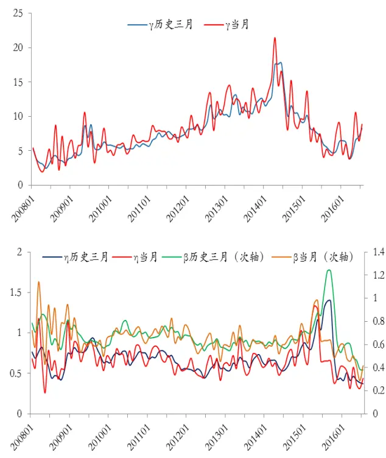
数据来源：东方证券研究所 & Wind资讯

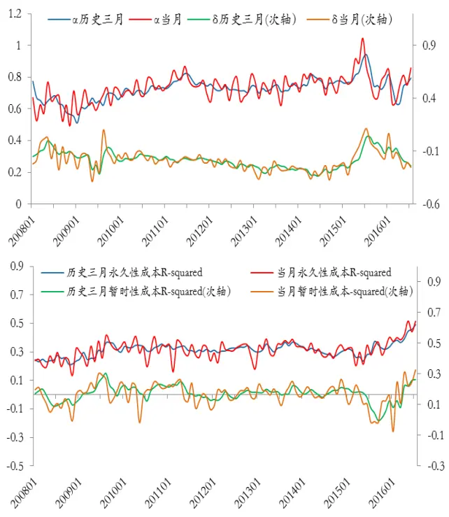

图8：市值区间5的冲击成本函数参数
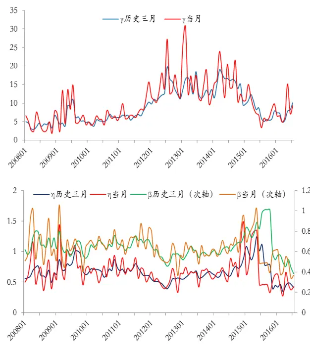
数据来源：东方证券研究所 & Wind资讯

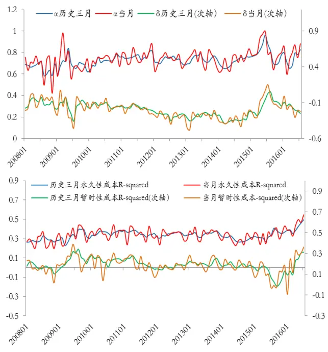

图9：市值区间6的冲击成本函数参数
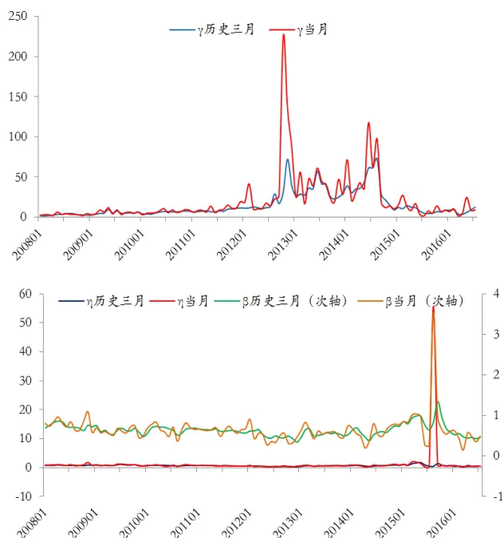
数据来源：东方证券研究所 & Wind资讯

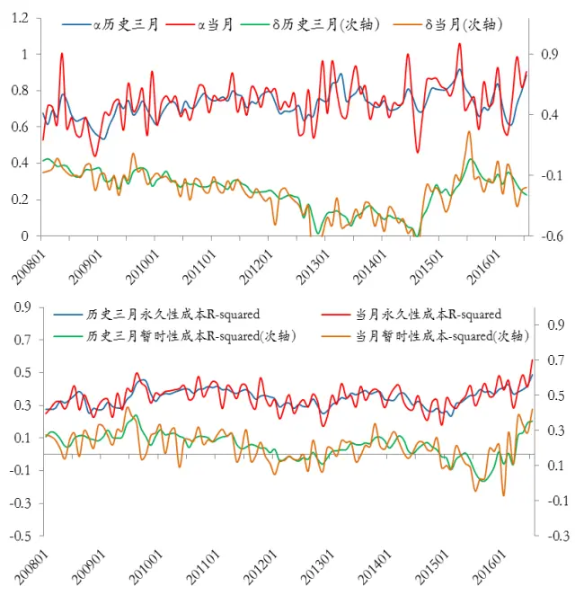

图10：市值区间7的冲击成本函数参数
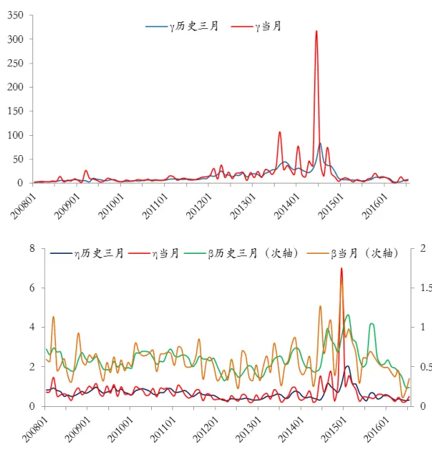
数据来源：东方证券研究所 & Wind资讯

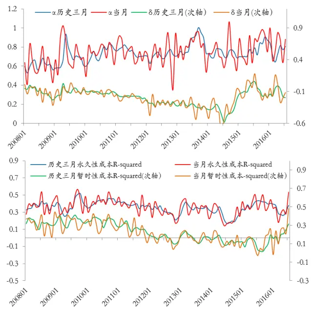

表 3、4 是根据历史 3 个月数据估计出的 2016 年 7 月 29 日的冲击成本函数参数值，可以看到永久性冲击函数拟合的  基本都在 0.4 以上，而暂时性冲击函数拟合的  基本都在 0.15-0.4 之间，说明模型对于衡量暂时性冲击还是存在一定的不足，但由于暂时性冲击相较于永久性冲击更小，所以冲击成本的计算结果还是比较可信的。我们可以根据表3、4的这些参数来估计下一个交易日的冲击成本与主动交易金额的关系。

表3：不同市值区间股票的永久性冲击函数参数（2016.7.29）

| 流通市值区间 | γ | α | δ | R2 | 数量 |
| --- | --- | --- | --- | --- | --- |
| 1 | 6.023±0.233 | 0.738±0.014 | -0.237±0.008 | 0.428 | 449 |
| 2 | 6.25±0.215 | 0.772±0.011 | -0.216±0.007 | 0.434 | 761 |
| 3 | 6.78±0.201 | 0.774±0.01 | -0.217±0.006 | 0.459 | 914 |
| 4 | 8.28±0.33 | 0.794±0.013 | -0.241±0.007 | 0.491 | 456 |
| 5 | 10.12±0.625 | 0.828±0.019 | -0.249±0.01 | 0.496 | 206 |
| 6 | 12.46±1.701 | 0.886±0.042 | -0.26±0.021 | 0.488 | 41 |
| 7 | 7.919±1.527 | 0.807±0.054 | -0.196±0.026 | 0.38 | 37 |

数据来源：东方证券研究所 & Wind资讯

表4：不同市值区间股票的暂时性冲击函数参数（2016.7.29）

| 流通市值区间 | η | β | R² | 数量 |
| --- | --- | --- | --- | --- |
| 1 | 0.286±0.012 | 0.361±0.021 | 0.156 | 449 |
| 2 | 0.317±0.009 | 0.364±0.014 | 0.206 | 761 |
| 3 | 0.345±0.008 | 0.373±0.012 | 0.236 | 914 |
| 4 | 0.373±0.011 | 0.38±0.015 | 0.263 | 456 |
| 5 | 0.407±0.015 | 0.384±0.02 | 0.312 | 206 |
| 6 | 0.502±0.037 | 0.462±0.042 | 0.352 | 41 |
| 7 | 0.326±0.026 | 0.242±0.041 | 0.315 | 37 |

数据来源：东方证券研究所 & Wind资讯

## 1.3.3冲击成本估计

根据表3、4的结果，绘制了市值大于1000亿股票的标准化永久性冲击 与标准化主动交易量和流动性因子 的关系图（图11），颜色代表标准化永久性冲击的大小。图12是不同市值区间股票标准化的暂时性冲击 $(\mathrm{J}-\frac{\mathrm{I}}{2})/\sigma$ 与标准化主动交易量关系图，可以看到由于不同市值区间的股票有不同的日内波动率和股票价格，所以标准化的暂时性冲击与流通市值大小并没有单调关系。

图11：标准化永久性冲击与标准化主动交易量（>1000 亿）
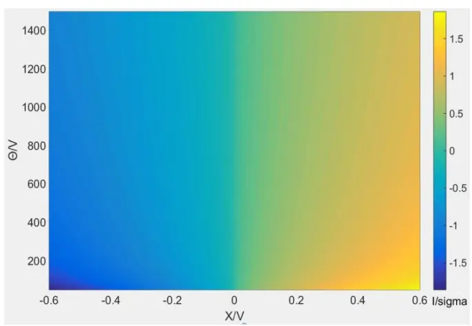
数据来源：东方证券研究所 & Wind资讯

图12：标准化暂时性冲击与标准化主动交易量的关系
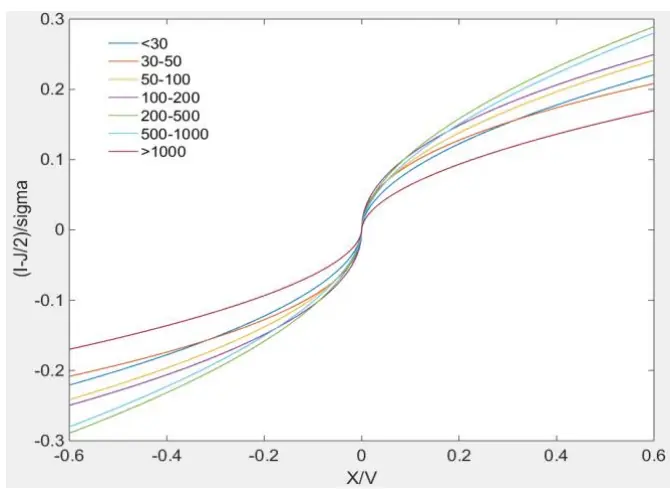
数据来源：东方证券研究所 & Wind资讯

我们选取了隶属于不同流通市值区间的7 只股票，按照流通市值有小到大排列分别为，603099长白山、601008 连云港、600260 凯乐科技、000878 云南铜业、002736 国信证券、600518 康美药业、600516 贵州茅台。图 13、14、15 分别是这 7 只股票的主动交易金额（元）与永久性冲击、暂时性冲击和冲击成本的关系，可以很明显的看到流通市值最小的 603099 长白山、601008 连云港冲击成本较大，在主动交易金额为 1000 万的时候冲击成本为 1.2%和 1.05%，这样的冲击成本大小在构建组合的时候会对组合的净值造成比较大的影响。

图13：单笔主动交易金额（元）与永久性冲击（%）关系
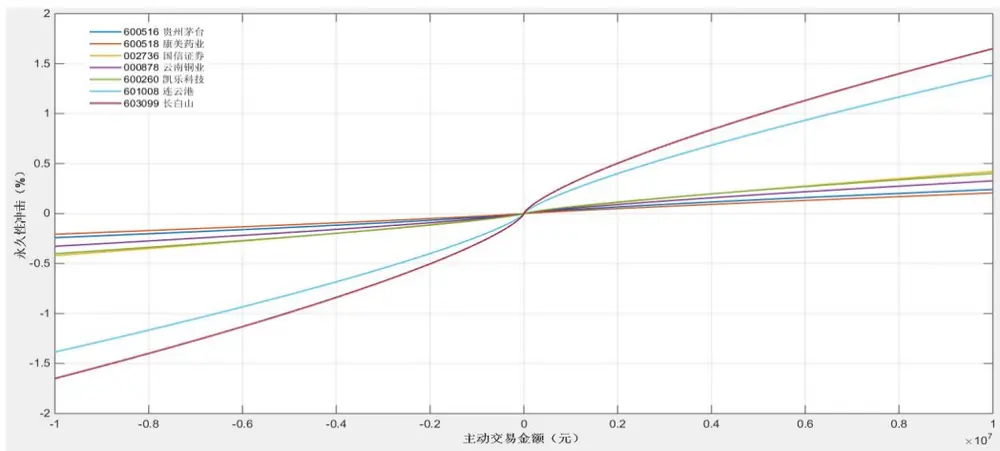
数据来源：东方证券研究所 & Wind资讯

图14：单笔主动交易金额（元）与暂时性冲击（%）关系
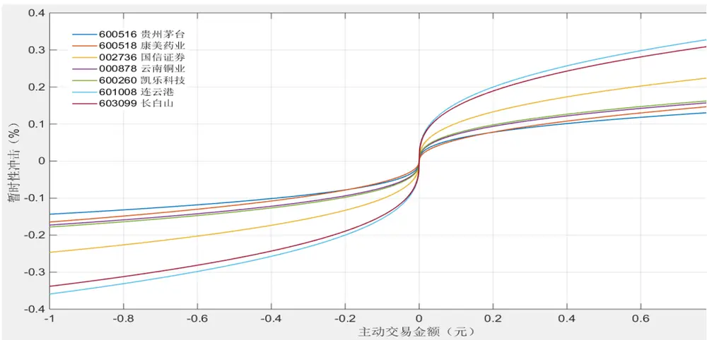
数据来源：东方证券研究所 & Wind资讯

图15：单笔主动交易金额（元）与冲击成本（%）关系
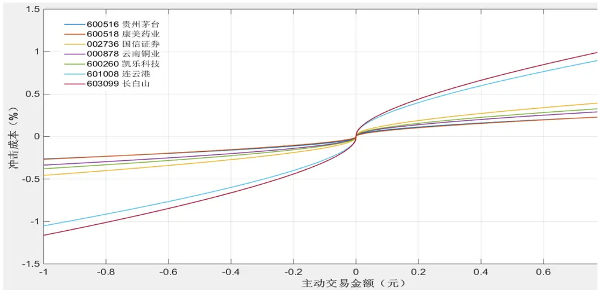
数据来源：东方证券研究所 & Wind资讯

## 二、加入冲击成本后的组合优化

## 2.1 投资组合优化

## 2.1.1 初始优化问题的设定

## Alpha 模型建立：

在多因子选股量化投资流程中，阿尔法模型的优劣直接决定了投资组合是否能够获得稳健的超额收益。根据我们之前的报告：“剔除行业、风格因素后的大类因子检验——《因子选股系列研究之五》”中的结果，我们从因子库中筛选出了如下5个因子作为阿尔法模型的组成部分：

表5：模型采用的Alpha因子

| 因子类别 | 因子名称 | 因子定义过去12个月息税前利润/总市值 |
| --- | --- | --- |
| 估值 | EBIT2EV |  |
| 成长 | PEG | TTM PE/预测未来2年净利润复合增长率 |
| 技术 | PPReversal | 5 日均价/60 日成交均价 |
| 风险 | TO | 以流通股本计算的 20 日日均换手率 |
| 风险 | IRFF | 1 - Fama-French 回归 R 方 |

数据来源：东方证券研究所

我们在每个月末首先计算因子的原始值，然后对原始值做中位数去极值和标准化处理，再对因子做行业中性处理和风格中性处理，剔除行业和规模的影响。

我们的目标是结合公司的基本面指标，风险指标和技术指标。投资逻辑是：购买具有相对低估值的高成长公司，同时这些公司前期没有被市场过度炒作而高估，并且技术面上反映出这些公司的股价已经出现超跌的现象。由于中国市场上小盘股效应较为明显，但波动较大，在alpha 模型中应当适量控制对小盘股的暴露。

接下来，可以采用不同的方法把多个因子的信息结合起来，构成合成因子。对于合成因子的构成，可以采用如下几种方式：

1. 在同类因子内部采取等权重加权，构成每类的合成因子。然后对每类的合成因子采取等权重加权，组成综合的合成因子。最后再对合成因子做标准化处理。

2. 利用历史面板数据进行回归，因变量是股票的月度收益，自变量是经过处理后的因子值。利用最新一期的因子值和估计出的参数得到单个股票预期收益的预测值。

## 风险模型建立：

本文将采取与之前报告“用组合优化构建更精确多样的投资组合——《因子选股系列研究之六》”中相同的通过构建协方差矩阵的压缩估计量(Shrinkage Estimator)来构建风险模型的方法，我们知道样本协方差矩阵虽然是总体协方差矩阵的无偏估计量，但是矩阵中异常高或者异常低的值实际包含了非常大的估计误差。直接将样本协方差矩阵应用到投资组合优化过程中会导致错误的权重分配。样本协方差矩阵的压缩估计量形式如下：

$$
\Sigma_{\mathrm{shrink}}=(1-\beta)\mathrm{F}+\beta\mathrm{S}
$$

其中S 是样本协方差矩阵，F 是一个高度结构化的风险模型，称为压缩强度(Shrink Intensity), 是一个取值在0 到1 之间的参数。样本协方差的压缩估计量 则是F 和S 的凸线性组合。

## 交易成本模型的构建:

交易成本也是多因子选股模型构建不可缺少的一环。交易成本与组合的权重变化和交易执行策略直接相关。这里我们只讨论交易成本与组合权重变化的关系。假定组合权重变化为 $\Delta\mathsf{w}=\mathsf{w}-\mathsf{w}_0$ ，其中 $\mathbf{w}_{0}$ 是调仓前的权重向量，w 是调仓后的权重向量。交易成本可以表示为 f( w) ，即一个关于权重变化 w的函数。根据上文的论述，交易成本通常可以分为显性成本和隐性成本。显性成本包括交易佣金，印花税和买卖价差(bid-ask spread)等。隐性成本则包括冲击成本和机会成本等。由显性成本的定义可知，显性成本与组合的权重变化的绝对值成线性关系，可以表示成如下：

$$
\mathbf{f}(\Delta\mathbf{w})=\mathbf{\tau}|\Delta\mathbf{w}|
$$

隐性成本在本文中仅考虑冲击成本的作用，冲击成本可以表示成如下：

$$
\begin{array}{r}{\mathbf{J}(\Delta\mathbf{w})=\lambda\sum_{\mathbf{i}=1}^{\mathbf{N}}\left(\mathbf{A}_{\mathbf{i}}|\mathbf{w}_{\mathbf{i}}-\mathbf{w}_{0\mathbf{i}}|^{\alpha_{\mathbf{i}}+1}+\mathbf{B}_{\mathbf{i}}|\mathbf{w}_{\mathbf{i}}-\mathbf{w}_{0\mathbf{i}}|^{\beta_{\mathbf{i}}+1}\right),}\end{array}
$$

其中 $w_{\mathrm{i}}$ 为第 i 支股票的权重， $\mathbf{w_{0i}}$ 为第 i 支股票的调整前权重， 为调整系数，其意义我们会在后面说明， $\mathrm{A_{i}}$ 和 $\mathtt{B_{i}}$ 分别为：

$$
\begin{array}{r}{\mathrm{A_{i}{=}\gamma_{i}\sigma_{i}\left(\frac{S}{P_{i}V_{i}}\right)^{\alpha_{i}}\left(\frac{\Theta_{i}}{V_{i}}\right)^{\delta_{i}},}}\end{array}
$$

$$
\mathrm{B_{i}{=}\eta_{i}\sigma_{i}\left(\frac{s}{P_{i}V_{i}}\right)^{\alpha_{i}},}
$$

其中S为组合的总市值， $\mathrm{P_{i1}}$ 是第i支股票的价格，引入这两个量是由于原来的冲击成本函数的变量是主动交易量X，而优化时的冲击成本函数以权重作为变量。

## 2.1.2加入冲击成本函数的组合优化

我们采用经过风险和交易成本调整后的alpha 作为优化的目标函数：

$$
\mathtt{Max}\colon f^{\prime}w-\tau|w-w_{0}|-\lambda\sum_{i=1}^{N}\bigl(A_{i}|w_{i}-w_{0i}|^{\alpha_{i}+1}+B_{i}|w_{i}-w_{0i}|^{\beta_{i}+1}\bigr).
$$

s.t.

$$
R^{\prime}w=R^{\prime}w_{bench},
$$

$$
\begin{array}{r}{(w-w_{bench})^{\prime}\varSigma\quad(w-w_{bench})\leq\frac{TE^{2}}{252},}\end{array}
$$

$$
0\leq w_{i}\leq\operatorname*{min}(maxposition,~w_{0i}+maxtradesize_{i}/booksize_{i}),
$$

其中  为预期 ， 为组合的期末权重， 为固定成本（0.15%）， 是调整系数（调整优化过程中冲击成本高估的问题，我们将在后面一节解释 的意义）， 是协方差矩阵的压缩估计量， 是基准的权重。

四个约束条件从上至下分别为：总权重为1；行业中性约束条件；显性风险约束条件，调整跟踪误差的大小；单个股票权重范围限制。

## 2.2 实证研究

下文中，我们选取了 2010 年 1 月 1 日到 2016 年 7 月 29 日的数据进行回测，通过上述组合优化的方式在中证 500 成分股内选股进行指数增强，考察带冲击成本的组合优化对策略理论 alpha 的损耗和对实际交易得到alpha的增强。

## 2.1.1冲击成本优化对组合的影响

首先我们模拟了调整系数为0-0.4（系数为 0 说明优化过程不考虑冲击成本）的情况下的优化组合在回测测试计算不考虑交易冲击成本下的净值曲线和收益情况，来研究比较冲击成本优化对组合Alpha的影响。图16-20是初始资金量为1 亿、2亿、3亿、5亿、10亿情况下的净值曲线，可以看到目标函数带冲击成本项做优化是会损失理论上Alpha的，且调整系数越大损失的Alpha越多，资金量越大损失越明显。这是因为在优化的过程中，调整系数越高，组合会越倾向于降低换手率来减少冲击成本的产生，这就造成了第一项获得的Alpha 越少。

图16：不同情况下组合的净值（初始资金1亿）
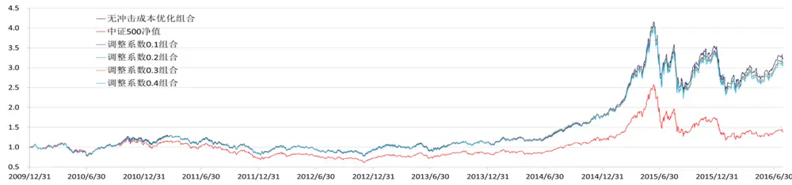
数据来源：东方证券研究所 & Wind资讯

图17：不同情况下组合的净值（初始资金2亿）
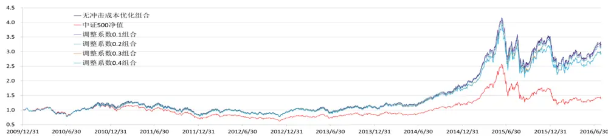
数据来源：东方证券研究所 & Wind资讯

图18：不同情况下组合的净值（初始资金3亿）
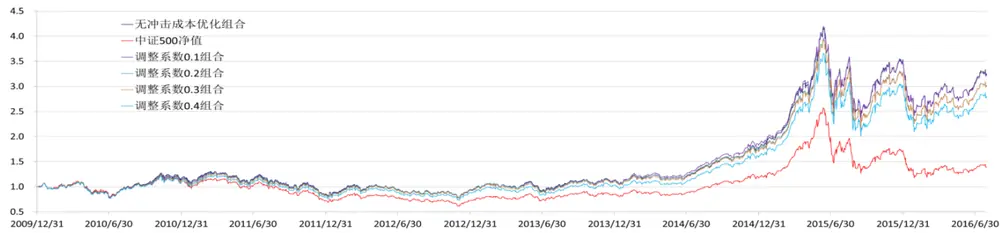
数据来源：东方证券研究所 & Wind资讯

图19：不同情况下组合的净值（初始资金5亿）
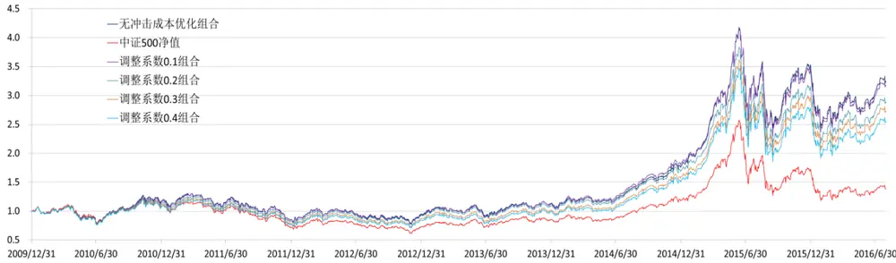
数据来源：东方证券研究所 & Wind资讯

图20：不同情况下组合的净值（初始资金10亿）
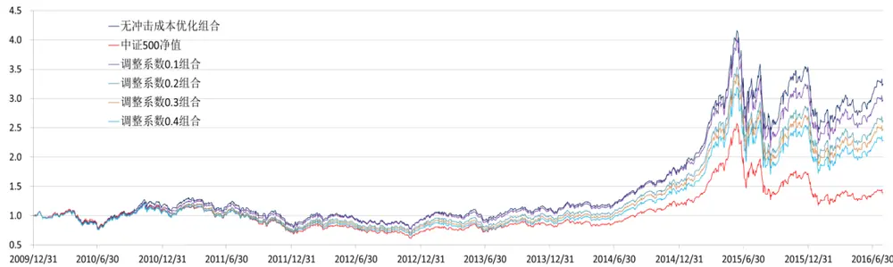
数据来源：东方证券研究所 & Wind资讯

表6：冲击成本优化对于组合收益的影响

| 组合 | 1亿 | 2亿 | 3亿 5亿 10亿 |  |  |
| --- | --- | --- | --- | --- | --- |
| 调整系数0组合 | 13.78% | 13.78% | 13.78% | 13.78% | 13.78% |
| 调整系数 0.1 组合调整系数 0.2 组合调整系数 0.3 组合 | 13.19% | 13.52% | 13.69% | 13.40% | 12.26% |
|  | 13.17% | 13.19% | 12.49% | 11.75% | 10.11% |
|  | 13.14% | 12.09% | 12.45% | 10.82% | 9.13% |
| 调整系数 0.4 组合 | 12.81% | 12.05% | 11.20% | 9.67% | 7.89% |

数据来源：东方证券研究所 & Wind资讯

上述回溯测试，在计算组合收益率时没有考虑交易冲击成本的影响，因而带冲击成本做优化会损失策略理论上的 alpha，但如果考虑真实交易冲击，含冲击成本优化得到的组合实际收益可能更佳。

## 2.1.2含冲击成本回测以及冲击成本优化对组合的影响

接下来我们模拟了不同初始资金量情况下，调整系数为0-0.4的优化组合在含冲击成本的回测下的净值曲线和收益情况，来研究比较含冲击成本的回测对于投资组合 Alpha 的影响和加入冲击成本的优化组合在含冲击成本的回测下对于投资组合 Alpha 的影响，其中调整系数为 0 的组合即为不考虑冲击成本优化的组合。

初始资金 1 亿：

图21：不同情况下的组合净值（初始资金1亿）
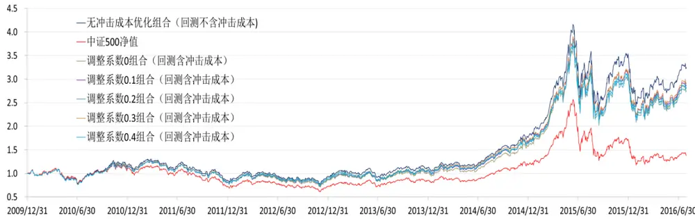
数据来源：东方证券研究所 & Wind资讯

图22：最优调整系数组合的回测情况（初始资金1亿）
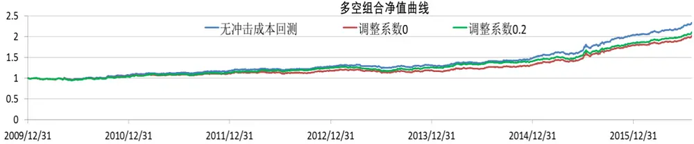

最优调整系数组合历史回撤
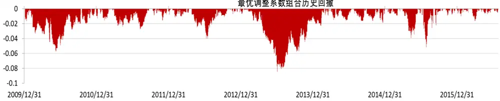
数据来源：东方证券研究所 & Wind资讯

表7：不同情况下组合的业绩评价（初始资金1亿）

| 组合 | 年化收益率 | 年化超额收益率 | 最大回撤 | 夏普比率 | 信息比率 | 月胜率 | 月均换手 |
| --- | --- | --- | --- | --- | --- | --- | --- |
| 理想组合 | 19.52% | 13.78% | 55.90% | 0.597 | 2.235 | 69.62% | 43.53% |
| 基准 | 5.05% | 0.00% | 45.65% | 0.120 | 0.000 | 0.00% | 0.00% |
| 调整系数0(回测含冲击成本） | 16.94% | 11.32% | 55.86% | 0.513 | 1.826 | 59.49% | 43.36% |
| 调整系数0.1(回测含冲击成本) | 17.34% | 11.70% | 55.32% | 0.525 | 1.917 | 65.82% | 42.30% |
| 调整系数0.2(回测含冲击成本) | 16.57% | 10.97% | 54.41% | 0.497 | 1.830 | 63.29% | 39.86% |
| 调整系数0.3（回测含冲击成本） | 17.62% | 11.96% | 54.82% | 0.534 | 2.021 | 64.56% | 37.48% |
| 调整系数0.4（回测含冲击成本） | 17.06% | 11.44% | 54.73% | 0.516 | 1.943 | 63.29% | 35.59% |

数据来源：东方证券研究所 & Wind资讯

图21、22和表 7展示了初始资金量为1亿的不同组合的收益情况，可以看到在优化的时候无冲击成本函数且回测时不含冲击成本的组合净值最高，而一旦在回测的时候包含了冲击成本，同样的组合（调整系数 0 组合）净值则有比较明显的下降，这两种组合的年化超额收益相差 2.46%，这部分可以认为是由于交易中的冲击成本所带来的 Alpha 损失。从表 6 中可以看到最优的组合是调整系数为 0.3 的组合，这一组合的年化超额收益比调整系数 0 组合高了 0.64%，这部分可以认为是由于优化函数包含冲击成本项所带来的Alpha。

## 初始资金 2 亿：

图23：不同情况下的组合净值（初始资金2亿）
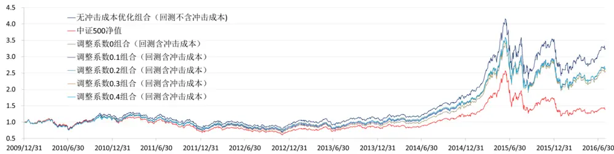
数据来源：东方证券研究所 & Wind资讯

图 23、24 和表 8 展示了初始资金量为 2 亿的不同组合的收益情况，可以看到相比于回测时不含有冲击成本的理想组合而言，所有其他组合的收益比初始资金为1亿的时候更低了，这是由于更大资金量会带来更高的冲击成本，而即使加入了冲击成本优化，也只能降低冲击成本对组合净值造成的损失而不能够规避。可以看到调整系数0组合相比于理想组合的年化超额收益相差4.14%，这部分是由于交易中的冲击成本所带来的 Alpha 损失。 从表 8 中可以看到最优的组合是调整系数为 0.2的组合，这一组合的年化超额收益比调整系数0组合高了0.61%，这部分可是由于优化函数包含冲击成本项所带来的Alpha。

图24：最优调整系数组合的回测情况（初始资金2亿）
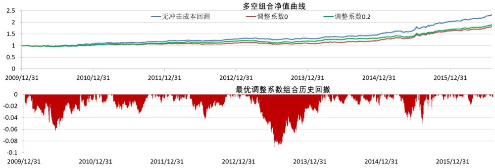
数据来源：东方证券研究所 & Wind资讯

表8：不同情况下组合的业绩评价（初始资金2亿）

| 组合 | 年化收益率 | 年化超额收益率 | 最大回撤 | 夏普比率 | 信息比率 | 月胜率 | 月均换手率 |
| --- | --- | --- | --- | --- | --- | --- | --- |
| 理想组合 | 19.52% | 13.78% | 55.90% | 0.597 | 2.235 | 69.62% | 43.53% |
| 基准 | 5.05% | 0.00% | 45.65% | 0.120 | 0.000 | 0.00% | 0.00% |
| 调整系数0（回测含冲击成本） | 15.18% | 9.64% | 54.21% | 0.455 | 1.523 | 58.23% | 43.40% |
| 调整系数0.1（回测含冲击成本） | 15.83% | 10.26% | 54.85% | 0.473 | 1.653 | 62.03% | 40.50% |
| 调整系数0.2（回测含冲击成本） | 15.84% | 10.27% | 54.39% | 0.474 | 1.694 | 62.03% | 37.09% |
| 调整系数0.3（回测含冲击成本） | 15.71% | 10.15% | 54.37% | 0.473 | 1.713 | 59.49% | 34.19% |
| 调整系数0.4（回测含冲击成本） | 15.78% | 10.21% | 53.77% | 0.472 | 1.718 | 59.49% | 32.21% |

数据来源：东方证券研究所 & Wind资讯

## 初始资金 3 亿：

图25：不同情况下的组合净值（初始资金3亿）
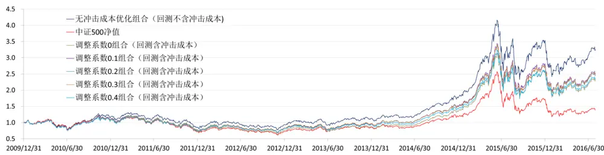
数据来源：东方证券研究所 & Wind资讯

图26：最优调整系数组合的回测情况（初始资金3亿）
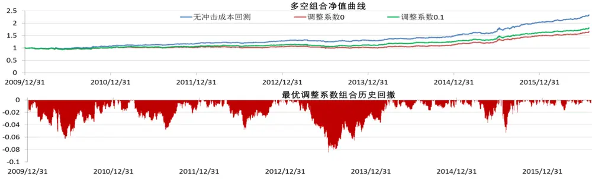
数据来源：东方证券研究所

表9：不同情况下组合的业绩评价（初始资金3亿）

| 组合 | 年化收益率 | 年化超额收益率 | 最大回撤 | 夏普比率 | 信息比率 | 月胜率 | 月均换手率 |
| --- | --- | --- | --- | --- | --- | --- | --- |
| 理想组合 | 19.52% | 13.78% | 55.90% | 0.597 | 2.235 | 69.62% | 43.53% |
| 基准 | 5.05% | 0.00% | 45.65% | 0.120 | 0.000 | 0.00% | 0.00% |
| 调整系数0（回测含冲击成本） | 13.46% | 8.01% | 52.61% | 0.396 | 1.236 | 55.70% | 43.41% |
| 调整系数0.1（回测含冲击成本） | 15.04% | 9.51% | 55.18% | 0.450 | 1.541 | 60.76% | 39.24% |
| 调整系数0.2(回测含冲击成本） | 14.64% | 9.13% | 53.95% | 0.434 | 1.491 | 59.49% | 35.46% |
| 调整系数0.3（回测含冲击成本） | 14.78% | 9.26% | 53.86% | 0.439 | 1.534 | 58.23% | 32.12% |
| 调整系数0.4(回测含冲击成本) | 13.79% | 8.33% | 54.14% | 0.409 | 1.395 | 58.23% | 29.34% |

数据来源：东方证券研究所 & Wind资讯

图 25、26 和表 9 展示了初始资金量为 3 亿时的不同组合的收益情况，可以看到调整系数 0 组合相比于理想组合的年化超额收益相差 5.77%，这部分是由于交易中的冲击成本所带来的 Alpha 损失。从表 8 中可以看到最优的组合是调整系数为 0.1 的组合，这一组合的年化超额收益比调整系数 0组合高了1.12%，这部分是由于优化函数包含冲击成本项所带来的Alpha。

图27：不同情况下的组合净值（初始资金5亿）
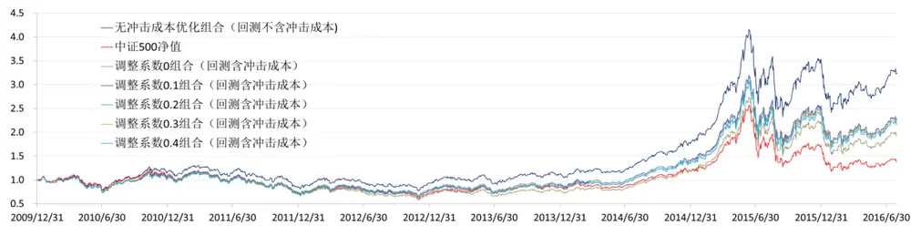
数据来源：东方证券研究所 & Wind资讯

图28：最优调整系数组合的回测情况（初始资金5亿）
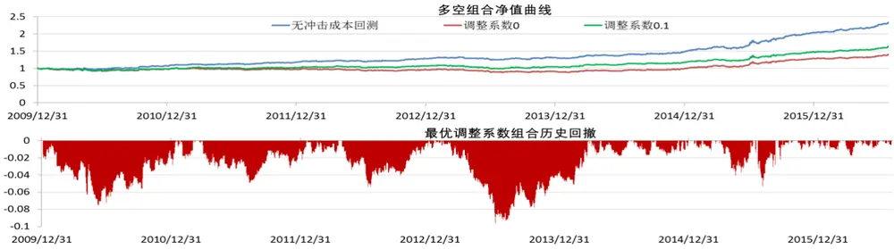
数据来源：东方证券研究所 & Wind资讯

表10：不同情况下组合的业绩评价（初始资金5亿）

| 组合 | 年化收益率 | 年化超额收益率 | 最大回撤 | 夏普比率 | 信息比率 | 月胜率 | 月均换手率 |
| --- | --- | --- | --- | --- | --- | --- | --- |
| 理想组合 | 19.52% | 13.78% | 55.90% | 0.597 | 2.235 | 69.62% | 43.53% |
| 基准 | 5.05% | 0.00% | 45.65% | 0.120 | 0.000 | 0.00% | 0.00% |
| 调整系数0（回测含冲击成本） | 10.65% | 5.33% | 49.29% | 0.303 | 0.788 | 53.16% | 43.41% |
| 调整系数0.1(回测含冲击成本) | 13.25% | 7.80% | 53.94% | 0.390 | 1.237 | 56.96% | 37.26% |
| 调整系数0.2(回测含冲击成本） | 13.13% | 7.70% | 53.87% | 0.385 | 1.264 | 56.96% | 32.67% |
| 调整系数0.3（回测含冲击成本） | 12.80% | 7.38% | 54.40% | 0.375 | 1.224 | 53.16% | 28.88% |
| 调整系数0.4(回测含冲击成本) | 12.49% | 7.08% | 53.43% | 0.365 | 1.199 | 54.43% | 25.73% |

数据来源：东方证券研究所 & Wind资讯

图 28、29 和表 10 展示了初始资金量为5 亿的不同组合的收益情况，可以看到调整系数0组合相比于理想组合的年化超额收益相差8.55%，这部分是由于交易中的冲击成本所带来的Alpha损失，这部分的损失已经超过了组合本身的超额收益了，说明在这样的初始资金量下，大部分的 Alphad 都由于冲击成本的存在而损失了。从表 10 中可以看到最优的组合是调整系数为 0.1 的组合，这一组合的年化超额收益比调整系数0组合高了2.47%，这部分是由于优化函数包含冲击成本项所带来的Alpha。

初始资金 10 亿：

图29：不同情况下的组合净值（初始资金10亿）
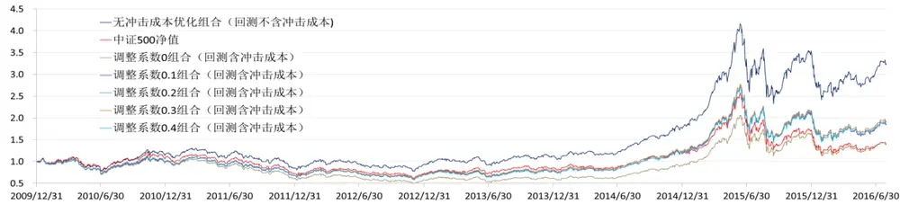
数据来源：东方证券研究所 & Wind资讯

图30：最优调整系数组合的回测情况（初始资金10亿）
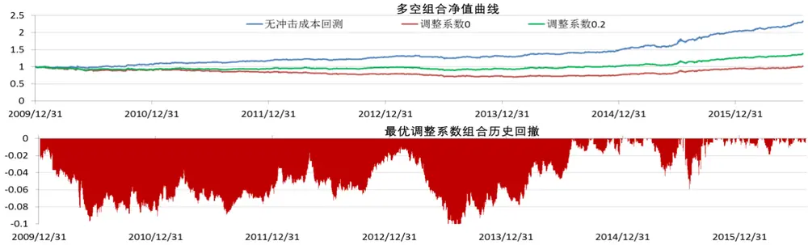
数据来源：东方证券研究所 & Wind资讯

表11：不同情况下组合的业绩评价（初始资金5亿）

| 组合 | 年化收益率 | 年化超额收益率 | 最大回撤 | 夏普比率 | 信息比率 | 月胜率 | 月均换手率 |
| --- | --- | --- | --- | --- | --- | --- | --- |
| 理想组合 | 19.52% | 13.78% | -55.90% | 0.597 | 2.235 | 74.68% | 43.53% |
| 基准 | 5.05% | 0.00% | -45.65% | 0.120 | 0.000 | 0.00% | 0.00% |
| 调整系数0（回测含冲击成本） | 5.40% | 0.34% | -43.58% | 0.129 | 0.045 | 46.84% | 43.42% |
| 调整系数0.1(回测含冲击成本) | 9.79% | 4.51% | -52.03% | 0.275 | 0.691 | 56.96% | 34.55% |
| 调整系数0.2（回测含冲击成本） | 10.38% | 5.08% | -52.84% | 0.295 | 0.818 | 60.76% | 28.57% |
| 调整系数0.3(回测含冲击成本) | 10.38% | 5.07% | -52.68% | 0.295 | 0.852 | 60.76% | 24.11% |
| 调整系数0.4(回测含冲击成本) | 9.99% | 4.71% | -50.72% | 0.282 | 0.811 | 56.96% | 20.45% |

数据来源：东方证券研究所 & Wind资讯

图 29、30 和表 11 展示了初始资金量为 10 亿的不同组合的收益情况，可以看到在这种情况下，不优化冲击的成本的组合已经基本不能战胜市场了，高额的冲击成本吞噬了13.44%的超额收益。在这种情况下，冲击成本的优化就显得尤为重要了，从表8中可以看到最优的组合是调整系数为0.2的组合，这一组合的年化超额收益比调整系数0组合高了5.08%，这部分是由于优化函数包含冲击成本项所带来的Alpha。

表12：冲击成本对于组合优化和回测的影响

| 各类组合的超额收益率 | 1亿 | 2亿 | 3亿 | 5亿 | 10亿 |
| --- | --- | --- | --- | --- | --- |
| 未优化冲击成本组合（回测无冲击成本） | 13.78% | 13.78% | 13.78% | 13.78% | 13.78% |
| 调整系数0.4组合（回测无冲击成本） | 12.81% | 12.05% | 11.20% | 9.67% | 7.89% |
| 优化冲击成本（回测无冲击成本）损失收益 | 0.97% | 1.73% | 2.58% | 4.11% | 5.89% |
| 未优化冲击成本组合（回测有冲击成本） | 11.32% | 9.64% | 8.01% | 5.33% | 0.34% |
| 含冲击成本的回测损失的超额收益率 | 2.46% | 4.14% | 5.77% | 8.55% | 13.44% |
| 最优调整系数组合（回测有冲击成本） | 11.96% | 10.27% | 9.51% | 7.80% | 5.08% |
| 优化冲击成本（回测有冲击成本）获取收益 | 0.66% | 0.63% | 1.50% | 2.47% | 4.74% |

数据来源：东方证券研究所 & Wind资讯

表 12 总结了回测不含冲击成本而优化含冲击成本的组合损失的超额收益率、回测含冲击成本而优化不含冲击成本的组合损失的超额收益率和回测含冲击成本且优化含冲击成本的组合获得的超额收益率结果。可以看到在回测不含冲击成本的情况下，随着初始资金量的上升，优化冲击成本会造成更多的Alpha 损失。而在回测含冲击成本的情况下，随着初始资金量的上升，不含冲击成本的优化组合会在交易中承担更多的冲击成本，当资金量达到10 亿时，这样的组合已经很难战胜市场了，在这种情况下，优化冲击成本则会随着资金量上升使组合获得更多的Alpha。

根据上面的结果我们还可以发现，增大调整系数会使得组合的换手率下降，这是由于更大的调整系数会增大优化函数中冲击成本项的比重，使得组合倾向于减少换手率来降低冲击成本。此外，随着初始资金量的提高，优化了冲击成本的组合会有着更低的换手率，这是由于更大的资金量同样会使得冲击成本项更大，使得组合倾向于减少换手率来降低冲击成本。

## 2.1.3 平均冲击成本

我们统计了各月度 100 万、500 万和 1000 万主动交易金额的对全市场股票的平均日冲击成本大小（图 31），可以明显看到，冲击成本大小与股票市场走势负相关。之前的实证研究，通常会在回溯过程中人为的设定 20-50个bp冲击成本，对比下图可以发现，这种估计在资金量较大时，是明显低估的，造成纸面收益和回溯收益的巨大差别。

图31：月度平均冲击成本与市场走势对比
不同资金量对个股平均日冲击成本变化（bp）
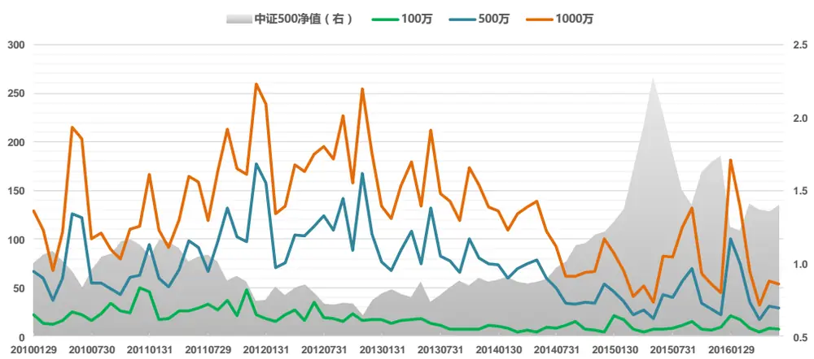
据来源：东方证券研究所 & Wind 资讯

## 三、总结

回溯测试得到的策略纸面收益与实际交易账面收益最大差别在于交易成本的控制，特别是对资金量大、换手率高的产品。从我们测试结果来看，资金规模达到5个亿的中证500增强型产品就有必要考虑冲击成本的问题。这个成本会随着市场行情而变化，在成交价格上加减一个固定比例的冲击成本的做法不可行，无法反应不同时点、不同股票、不同资金量的差异。本报告提供的含冲击成本的组合优化一种可行的组合构建方式，目标函数加入冲击成本虽然会在损失理论上的 alpha，但是它能让我们回避流动性差的股票，降低冲击成本，实际获得的账面收益可能更高。本报告采用的是全市场的主动买卖单数据来估算交易成本，有条件的投资者可以考虑采用委托下单数据来进行建模，或许能得到更精确的估计。

## 风险提示

1. 量化模型基于历史数据分析而得，随着市场的演进变化，模型存在失效的风险；

2. 模型参数估计误差所带来的风险。

## 参考文献

[1] Almgren R, Chriss N. Optimal execution of portfolio transactions[J]. Journal of Risk, 2001, 3: 5-40.

[2] Breen W J, Hodrick L S, Korajczyk R A. Predicting equity liquidity[J]. Management Science, 2002, 48(4): 470-483.

[3] Almgren R F. Optimal execution with nonlinear impact functions and trading-enhanced risk[J]. Applied mathematical finance, 2003, 10(1): 1-18.

[4] Lillo F, Farmer J D, Mantegna R N. Econophysics: Master curve for price-impact function[J]. Nature, 2003, 421(6919): 129-130.

[5]Ledoit O, Wolf M. Improved estimation of the covariance matrix of stock returns with an application to portfolio selection[J]. Journal of empirical finance, 2003, 10(5): 603-621.

[6]Chiyachantana C N, Jain P K, Jiang C, et al. International evidence on institutional trading behavior and price impact[J]. The Journal of Finance, 2004, 59(2): 869-898.

[7] Huberman G, Stanzl W. Price Manipulation and Quasi‐Arbitrage[J]. Econometrica, 2004, 72(4): 1247-1275.

[8] Almgren R, Thum C, Hauptmann E, et al. Direct estimation of equity market impact[J]. Risk, 2005, 18(7): 58-62.

[9]Gatheral J, Schied A. Optimal trade execution under geometric Brownian motion in the Almgren and Chriss framework[J]. International Journal of Theoretical and Applied Finance, 2011, 14(03): 353-368.

[10]Kissell R. The science of algorithmic trading and portfolio management[M]. Academic Press, 2013.

## 分析师申明

每位负责撰写本研究报告全部或部分内容的研究分析师在此作以下声明：

分析师在本报告中对所提及的证券或发行人发表的任何建议和观点均准确地反映了其个人对该证券或发行人的看法和判断；分析师薪酬的任何组成部分无论是在过去、现在及将来，均与其在本研究报告中所表述的具体建议或观点无任何直接或间接的关系。

## 投资评级和相关定义

报告发布日后的12个月内的公司的涨跌幅相对同期的上证指数/深证成指的涨跌幅为基准；

## 公司投资评级的量化标准

买入：相对强于市场基准指数收益率15%以上；

增持：相对强于市场基准指数收益率5%～15%；

中性：相对于市场基准指数收益率在-5%～+5%之间波动；

减持：相对弱于市场基准指数收益率在-5%以下。

未评级——由于在报告发出之时该股票不在本公司研究覆盖范围内，分析师基于当时对该股票的研究状况，未给予投资评级相关信息。

暂停评级——根据监管制度及本公司相关规定，研究报告发布之时该投资对象可能与本公司存在潜在的利益冲突情形；亦或是研究报告发布当时该股票的价值和价格分析存在重大不确定性，缺乏足够的研究依据支持分析师给出明确投资评级；分析师在上述情况下暂停对该股票给予投资评级等信息，投资者需要注意在此报告发布之前曾给予该股票的投资评级、盈利预测及目标价格等信息不再有效。

## 行业投资评级的量化标准：

看好：相对强于市场基准指数收益率5%以上；

中性：相对于市场基准指数收益率在-5%～+5%之间波动；

看淡：相对于市场基准指数收益率在-5%以下。

未评级：由于在报告发出之时该行业不在本公司研究覆盖范围内，分析师基于当时对该行业的研究状况，未给予投资评级等相关信息。

暂停评级：由于研究报告发布当时该行业的投资价值分析存在重大不确定性，缺乏足够的研究依据支持分析师给出明确行业投资评级；分析师在上述情况下暂停对该行业给予投资评级信息，投资者需要注意在此报告发布之前曾给予该行业的投资评级信息不再有效。

## 免责声明

本证券研究报告（以下简称“本报告”）由东方证券股份有限公司（以下简称“本公司”）制作及发布。

本报告仅供本公司的客户使用。本公司不会因接收人收到本报告而视其为本公司的当然客户。本报告的全体接收人应当采取必要措施防止本报告被转发给他人。

本报告是基于本公司认为可靠的且目前已公开的信息撰写，本公司力求但不保证该信息的准确性和完整性，客户也不应该认为该信息是准确和完整的。同时，本公司不保证文中观点或陈述不会发生任何变更，在不同时期，本公司可发出与本报告所载资料、意见及推测不一致的证券研究报告。本公司会适时更新我们的研究，但可能会因某些规定而无法做到。除了一些定期出版的证券研究报告之外，绝大多数证券研究报告是在分析师认为适当的时候不定期地发布。

在任何情况下，本报告中的信息或所表述的意见并不构成对任何人的投资建议，也没有考虑到个别客户特殊的投资目标、财务状况或需求。客户应考虑本报告中的任何意见或建议是否符合其特定状况，若有必要应寻求专家意见。本报告所载的资料、工具、意见及推测只提供给客户作参考之用，并非作为或被视为出售或购买证券或其他投资标的的邀请或向人作出邀请。

本报告中提及的投资价格和价值以及这些投资带来的收入可能会波动。过去的表现并不代表未来的表现，未来的回报也无法保证，投资者可能会损失本金。外汇汇率波动有可能对某些投资的价值或价格或来自这一投资的收入产生不良影响。那些涉及期货、期权及其它衍生工具的交易，因其包括重大的市场风险，因此并不适合所有投资者。

在任何情况下，本公司不对任何人因使用本报告中的任何内容所引致的任何损失负任何责任，投资者自主作出投资决策并自行承担投资风险，任何形式的分享证券投资收益或者分担证券投资损失的书面或口头承诺均为无效。

本报告主要以电子版形式分发，间或也会辅以印刷品形式分发，所有报告版权均归本公司所有。未经本公司事先书面协议授权，任何机构或个人不得以任何形式复制、转发或公开传播本报告的全部或部分内容。不得将报告内容作为诉讼、仲裁、传媒所引用之证明或依据，不得用于营利或用于未经允许的其它用途。

经本公司事先书面协议授权刊载或转发的，被授权机构承担相关刊载或者转发责任。不得对本报告进行任何有悖原意的引用、删节和修改。

提示客户及公众投资者慎重使用未经授权刊载或者转发的本公司证券研究报告，慎重使用公众媒体刊载的证券研究报告。

## 东方证券研究所

地址：上海市中山南路 318号东方国际金融广场 26楼

联系人： 王骏飞

电话： 021-63325888*1131

传真：021-63326786

网址： www.dfzq.com.cn

Email： wangjunfei@orientsec.com.cn