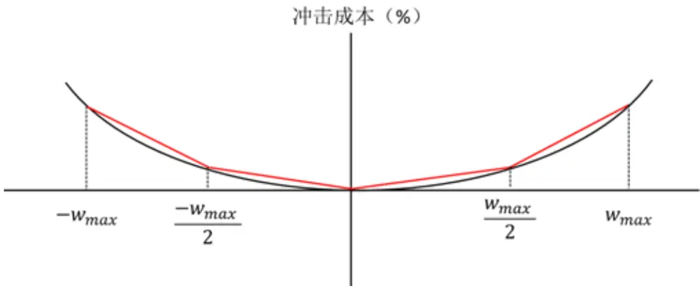
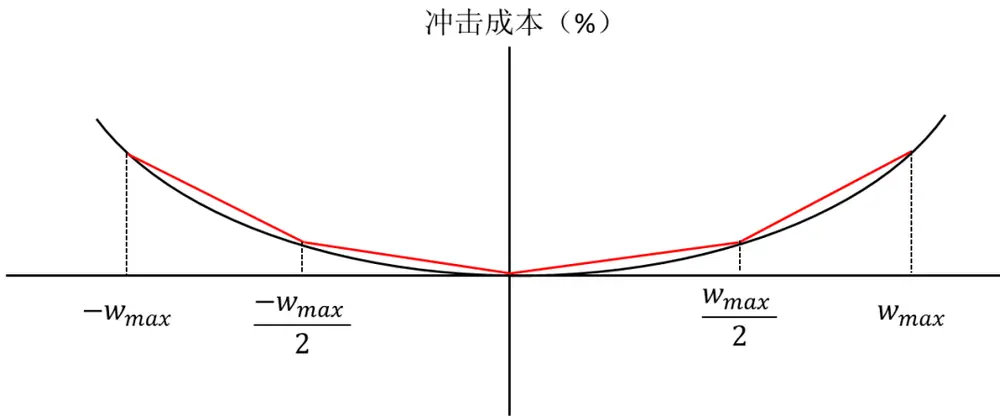

## 研究结论

对于大规模资金产品，30-50bp 的冲击成本估算在某些市场环境下远远不够，我们上篇报告引入了 Almgren(2005)的模型来估算冲击成本大小，并加入组合优化目标中，定量权衡组合alpha 与冲击成本的利害关系。

Almgren（2005）冲击模型采用的是幂函数非线性形式，导致数值求解组合优化问题耗时长，并且不能保证结果是最优解。我们本报告用分段线性函数逼近幂函数，把原来组合优化问题转换成二次规划问题，大幅提升了组合优化问题求解速度，且能保证数值解的全局最优性。实证结果显示，简化版模型得到的组合表现和原始模型得到的组合表现非常接近。

因为冲击成本是一个不可观测量，因此冲击成本模型没有必要去追求尽可能精确，本报告提供的线性近似也能提供很好的实用结果。

## 风险提示

- 量化模型失效的风险

- 模型参数估计的误差风险

报告发布日期2016 年 10 月 21 日

证券分析师朱剑涛021-63325888*6077zhujiantao@orientsec.com.cn执业证书编号：S0860515060001

联系人 张惠澍 021-63325888-6123 zhanghuishu@orientsec.com.cn

## 相关报告

资金规模对策略收益的影响2016-08-26

Alpha 因子库精简与优化2016-08-12

日内残差高阶矩与股票收益2016-08-12

寻找贡献真实 alpha 的事件2016-05-30

用组合优化构建更精确多样的投资组合 2016-02-19

## 单只股票对组合的冲击成本函数与交易权重的关系

## 一、冲击成本函数介绍

我们在上篇报告中采用用 Almgren(2005)开发的冲击成本模型来估算不同规模资金对股票价格的冲击成本大小，并把它加入到组合优化目标函数中，定量的权衡股票 alpha 收益和冲击成本的利害关系，使得模型回溯测试得到的纸面收益和实盘交易收益更加接近。

单只股票冲击成本可以分为永久性冲击成本和暂时性冲击成本，函数形式如下：

$$
\mathrm{J}=\frac{1}{2}\gamma\sigma T\mathrm{sgn}(X)\left|\frac{X}{\mathrm{V}T}\right|^{\alpha}\left(\frac{\theta}{\mathrm{V}}\right)^{\delta}+\eta\sigma\mathrm{Tsgn}(X)\left|\frac{X}{\mathrm{V}T}\right|^{\beta}
$$

其中 X为交易的订单大小，把 X替换为组合调仓时个股权重的变化：

$$
\mathrm{X}=\Delta\mathrm{w}*\mathrm{S}/\mathrm{P}
$$

其中 S为组合总规模，P 为股票的交易价格，单只股票对于整个组合的冲击成本影响为 ，因此单只股票对于整个组合的冲击成本函数为：

$$
\mathsf{J}\ast\Delta\mathsf{w}=\mathsf{A}|\Delta\mathsf{w}|^{\alpha+1}+B|\Delta\mathsf{w}|^{\beta+1},
$$

根据我们的统计，参数 与 都是介于 0 到1 之间的，所以单只股票对于整个组合的冲击是一个凸函数的形式。

## 二、冲击成本分段线性近似与二次规划转换

在上一篇相关报告《资金规模对策略收益的影响中》中我们采用经过风险和交易成本调整后的alpha 作为优化的目标函数：

$$
\begin{aligned}&Max:f'w-\tau|w-w_0|-\lambda\sum_{i=1}^{N}\left(A_i|w_i-w_{0i}|^{\alpha_i+1}+B_i|w_i-w_{0i}|^{\beta_i+1}\right)\\&\\&s.t.\quad i'w=1,\\&\\&\quad R'w=R'w_{bencch},\\&\\&\quad(w-w_{bencch})'\mathcal{E}\setminus(w-w_{bencch})\leq\frac{TE^2}{252},\\&\\&\quad0\leq w_i\leq\min(maxposition,\;w_{0i}+matrixadesize_i/bobsize_i),\\\end{aligned}
$$

其中 $f^{\prime}$ 为预期 ， $w_{0}$ 为调仓前组合个股权重， 为股票的固定交易成本（佣金+印花税，设为单边0.15%）， 是调整系数（调整优化过程中冲击成本高估的问题，我们将在后面一节解释 的意义），是协方差矩阵的压缩估计量， $w_{bench}$ 是基准指数成分股权重。

四个约束条件从上至下分别为：总权重为 1；行业中性约束条件；显性风险约束条件，调整跟踪误差的大小；单个股票权重范围限制。

在这个优化问题中，目标函数和第三个约束条件都是非线性的，如果采用通用的非线性优化算法，比较耗时间，同时数值算法的优化结果不一定能保证是全局最优值。

所以我们这里首先把控制跟踪误差的约束条件放到了目标函数中，调整下式参数 的值来隐性控制跟踪误差，再通过分段线性函数近似逼近冲击成本函数，把上述优化问题转换二次规划问题，大幅提升运算速度，同时保证全局最优解的存在性。

首先需要处理的是固定成本项绝对值的问题，在这里我们优化的目标权重 w 改写为 $w_{0}+\Delta w$ 的形式，并且把跟踪误差的约束条件放入到目标函数中，则目标函数变为：

$$
f^{\prime}(w_{0}+\Delta\mathsf{w})-\mu\quad(w_{0}+\Delta\mathsf{w})\quad^{\prime}\pounds\quad(w_{0}+\Delta\mathsf{w})\quad-\tau|\Delta\mathsf{w}|-\lambda\sum_{i=1}^{N}\bigl(A_{i}|\Delta\mathsf{w}_{\mathrm{i}}|^{\alpha_{i}+1}+B_{i}|\Delta w_{i}|^{\beta_{i}+1}\bigr)
$$

把其中的常数项去除后，目标函数变为:

$$
(f^{\prime}-2*\mu*{w_{0}}^{\prime}\mathcal{L})\Delta\mathsf{w}-\mu*\Delta\mathsf{w}^{\prime}\mathcal{L}\Delta\mathsf{w}-\tau|\Delta\mathsf{w}|-\lambda{\sum_{i=1}^{N}}\big(A_{i}|\Delta\mathsf{w}_{\mathrm{i}}|^{\alpha_{i}+1}+B_{i}|\Delta\mathsf{w}_{i}|^{\beta_{i}+1}\big)
$$

为了去掉绝对值的形式把目标函数转变为二次规划，我们可以把 向量改变为 $\langle\Delta{{\mathsf{w}}_{\mathsf{b}}}^{\prime},\Delta{{\mathsf{w}}_{\mathsf{s}}}^{\prime}\rangle$ 的形式，其中 $\Delta\mathbf{w_{b}}$ 是买入部分的权重（大于零）， $\Delta\mathbf{w}_{s}$ 为卖出部分的权重（小于零）。此时目标函数将变为：

$$
\begin{aligned}\left[(f^{\prime}f^{\prime})-2*\mathfrak{\mu}*0.5\right.&\left.*(w_0^{\phantom{0}'}w_0^{\phantom{0}'})\begin{pmatrix}\mathfrak{L}&\mathfrak{L}\\\mathfrak{L}&\mathfrak{L}\end{pmatrix}-(\tau\phantom{\mu}-\tau)\right]\Delta\mathbf{w}-\mathfrak{\mu}*\Delta\mathbf{w}^{\prime}\begin{pmatrix}\mathfrak{L}&\mathfrak{L}\\\mathfrak{L}&\mathfrak{L}\end{pmatrix}\Delta\mathbf{w}\\&-\lambda\sum_{i=1}^{N}(A_i|\Delta\mathbf{w}_{\mathrm{i}}|^{\alpha_i+1}+B_i|\Delta\mathbf{w}_{\mathrm{i}}|^{\beta_i+1})\end{aligned}
$$

这样固定成本项的绝对值符号就被去除了，代价是优化变量的个数增大了一倍。

图1：冲击成本函数的表示形式

数据来源：东方证券研究所

为了把目标函数转变成标准二次规划的形式，我们对最后一项的非线性冲击成本函数做分段的线性近似（图 1）。并且将 向量改变为 $\left({\Delta{{\bf{w}}_{{\bf{b}}{{1}}}}^{\prime}\:\Delta{{\bf{w}}_{{\bf{s}}{{1}}}}^{\prime}\:\Delta{{\bf{w}}_{{\bf{b}}{{2}}}}^{\prime}\:\Delta{{\bf{w}}_{{\bf{s}}{{2}}}}^{\prime}}\right)^{\prime}$ ，其中 $\Delta\mathbf{w}_{\mathbf{b}1}$ 是低斜率范围的买入量， $\Delta\mathbf{w}_{\mathbf{b}2}$ 是高斜率范围的买入量， $\Delta\mathsf{w}_{\mathsf{s1}}$ 为低斜率范围的卖出量， $\Delta\mathbf{w}_{s2}$ 为高斜率范围的卖出量。它们的斜率依次为 $k_{1},~-k_{1},~k_{2},~-k_{2}$ 。最终的目标函数和约束条件形式变为：

$$
\begin{array}{c}{max\colon\Bigg[(f^{\prime}f^{\prime}f^{\prime}f^{\prime})-2*\mu*0.25*({w_{0}}^{\prime}{w_{0}}^{\prime}{w_{0}}^{\prime}{w_{0}}^{\prime})\binom{\mathcal{E}\quad\cdots\quad\mathcal{E}}{\vdots\quad\ddots\quad\vdots}-(\tau-\tau\tau-\tau)}\\{-\lambda\left(k_{1}-k_{1}\quad k_{2}\quad-k_{2}\right)\Bigg]\Delta\mathbf{w}-\mu*\Delta\mathbf{w}^{\prime}\binom{\mathcal{E}\quad\cdots\quad\mathcal{E}}{\vdots\quad\ddots\quad\vdots}\Delta\mathbf{w}}\\\end{array}
$$

$$
\begin{aligned}\text{ s.t. }\quad&\mathrm{i}^{\prime}(\Delta\mathrm{w}+0.25*({w_{0}}^{\prime}{w_{0}}^{\prime}{w_{0}}^{\prime}{w_{0}}^{\prime})^{\prime})=1\\&R^{\prime}\Delta\mathrm{w}=R^{\prime}(w_{bench}-w_{0}),\\&0\leq\Delta{\mathrm{w}_{\mathrm{b}_{1}}}^{\prime}\leq\min(\max({w_{max}}-{\mathrm{w}_{0}}),{\mathrm{w}_{max}}/2),\\&-\min({\mathrm{w}_{0}},{\mathrm{w}_{max}}/2)\leq\Delta{\mathrm{w}_{\mathrm{s}_{1}}}^{\prime}\leq-\min(\max({w_{0}}-{\mathrm{w}_{max}},0),{\mathrm{w}_{max}}/2),\\&0\leq\Delta{\mathrm{w}_{\mathrm{b}_{2}}}^{\prime}\leq\max({\mathrm{w}_{max}}-{\mathrm{w}_{0}}-{\mathrm{w}_{max}}/2,0)\\&-({\mathrm{w}_{0}}+-\min({\mathrm{w}_{0}},{\mathrm{w}_{max}}/2))\leq\Delta{\mathrm{w}_{\mathrm{s}_{1}}}^{\prime}\leq-\max({\mathrm{w}_{0}}-3*{\mathrm{w}_{max}}/2,0)\\\end{aligned}
$$

因为冲击成本函数为凸函数，因此分段函数的斜率的递增的，斜率低的部分交易相同权重的股票冲击成本更低，这也就是说在优化的过程中，优化器会优先满足低斜率部分的权重，接着才会去增加高斜率部分的权重。通过这种方法，我们就将原本的非线性目标函数变成了一个标准的二次型，代价是优化变量的个数再增大一倍。

对于最后 4 个约束条件，我们举几个例子来说明，假设我们单只股票权重上限为 1.5%，对于初始权重 1.6%的股票我们可以得到 $\leq{\Delta{{\mathsf{w}}_{{\mathsf{b}}{1}{1}}}^{\prime}}\leq0,0\leq{\Delta{{\mathsf{w}}_{{\mathsf{b}}{2}{1}}}^{\prime}}\leq0$ ，也就是说这支股票已经不能再买入了；同时可以得到 $-0.75\%\leq\Delta{\mathsf{w}_{s11}}^{\prime}\leq-0.1\%,-0.85\%\leq\Delta{\mathsf{w}_{s21}}^{\prime}\leq0$ ，也就是说对于低斜率部分，这支股票至少要卖出 0.1%的权重以使得目标权重在权重上限范围内，且低斜率端加高斜率端总的卖出上限是 1.6%。对于初始权重 0.8%的股票我们可以得到 $\leq\Delta{\mathrm{w}_{\mathrm{b}11}}^{\prime}\leq0.7\%,0\leq\Delta{\mathrm{w}_{\mathrm{b}21}}^{\prime}\leq0$ 也就是说这支股票最多只能再买入 0.7%；同时可以得到 $-0.75\%\leq\Delta\mathrm{w_{s11}}^{\prime}\leq0\%,-0.05\%\leq$ ${\Delta{{\mathsf{w}}_{{\mathsf{S}}{21}}}^{\prime}}\le0$ ，也就是说这支股票最多可以卖出 0.8%，其中低斜率端最多可以卖出 0.75%，高斜率端最多可以卖出 0.05%。

优化完之后的目标权重 $w=w_{0}+\Delta w_{\mathrm{b}1}+\Delta w_{\mathrm{s}1}+\Delta w_{\mathrm{b}2}+\Delta w_{\mathrm{s}2}$

## 三、实证分析

用分段函数代替原来的冲击成本函数会损失一定的精度，所以我们用二次规划优化的组合的收益减去《资金规模对策略收益的影响》报告中的对应的组合收益来比较这两种方法优化结果的差异。

## 3.1 二段分段函数

我们首先把冲击成本函数用二段直线来近似，然后对整个目标函数做优化，得到与原组合收益情况的差异（表 1-5），整个回溯测试的环境设臵与上篇报告一致。

表 1：初始资金量 1亿组合在不同方法下收益的差异情况（二段线性近似）

| 组合 | 年化收益率 | 年化超额收益率 | 最大回撤 | 夏普比率 | 信息比率 | 月胜率 | 月均换手 |
| --- | --- | --- | --- | --- | --- | --- | --- |
| 理想组合 | 0.00% | 0.00% | 0.00% | 0.000 | 0.000 | 0.00% | 0.00% |
| 基准 | 0.00% | 0.00% | 0.00% | 0.000 | 0.000 | 0.00% | 0.00% |
| 调整系数0（回测含冲击成本） | 0.00% | 0.00% | 0.00% | 0.000 | 0.000 | 0.00% | 0.00% |
| 调整系数0.1(回测含冲击成本) | -0.25% | -0.24% | -0.29% | 0.002 | -0.099 | 3.80% | -3.32% |
| 调整系数0.2（回测含冲击成本） | 0.09% | 0.09% | 0.42% | 0.016 | -0.040 | 2.53% | -2.87% |
| 调整系数0.3（回测含冲击成本） | -0.63% | -0.60% | -0.59% | -0.011 | -0.194 | 3.80% | -2.33% |
| 调整系数0.4(回测含冲击成本） | -0.24% | -0.23% | -0.04% | 0.002 | -0.137 | 1.27% | -2.85% |

数据来源：东方证券研究所 & Wind 资讯

表 2：初始资金量 2亿组合在不同方法下收益的差异情况（二段线性近似）

| 组合 | 年化收益率 | 年化超额收益率 | 最大回撤 | 夏普比率 | 信息比率 | 月胜率 | 月均换手率 |
| --- | --- | --- | --- | --- | --- | --- | --- |
| 理想组合 | 0.00% | 0.00% | 0.00% | 0.000 | 0.000 | 0.00% | 0.00% |
| 基准 | 0.00% | 0.00% | 0.00% | 0.000 | 0.000 | 0.00% | 0.00% |
| 调整系数0（回测含冲击成本) | 0.00% | 0.00% | 0.00% | 0.000 | 0.000 | 0.00% | 0.00% |
| 调整系数0.1(回测含冲击成本） | -0.30% | -0.28% | -0.55% | 0.000 | -0.063 | 2.53% | -2.72% |
| 调整系数0.2（回测含冲击成本) | 0.02% | 0.02% | -0.04% | 0.012 | -0.040 | 3.80% | -2.69% |
| 调整系数0.3（回测含冲击成本） | 0.00% | 0.00% | -0.09% | 0.008 | -0.071 | 5.06% | -2.40% |
| 调整系数0.4(回测含冲击成本） | -0.15% | -0.15% | 0.43% | 0.007 | -0.065 | 3.80% | -2.68% |

数据来源：东方证券研究所 & Wind 资讯

表 3：初始资金量 3亿组合在不同方法下收益的差异情况（二段线性近似）

| 组合 | 年化收益率 | 年化超额收益率 | 最大回撤 | 夏普比率 | 信息比率 | 月胜率 | 月均换手率 |
| --- | --- | --- | --- | --- | --- | --- | --- |
| 理想组合 | 0.00% | 0.00% | 0.00% | 0.000 | 0.000 | 0.00% | 0.00% |
| 基准 | 0.00% | 0.00% | 0.00% | 0.000 | 0.000 | 0.00% | 0.00% |
| 调整系数0（回测含冲击成本） | 0.00% | 0.00% | 0.00% | 0.000 | 0.000 | 0.00% | 0.00% |
| 调整系数0.1(回测含冲击成本） | -0.30% | -0.28% | -1.17% | -0.004 | -0.090 | 1.27% | -2.58% |
| 调整系数0.2（回测含冲击成本） | -0.01% | -0.01% | -0.34% | 0.010 | -0.037 | 2.53% | -2.71% |
| 调整系数0.3（回测含冲击成本） | -0.08% | -0.07% | 0.28% | 0.008 | -0.056 | 6.33% | -2.50% |
| 调整系数0.4(回测含冲击成本) | 0.65% | 0.62% | -0.19% | 0.030 | 0.044 | 5.06% | -2.16% |

数据来源：东方证券研究所 & Wind 资讯

表 4：初始资金量 5 亿组合在不同方法下收益的差异情况（二段线性近似）

| 组合 | 年化收益率 | 年化超额收益率 | 最大回撤 | 夏普比率 | 信息比率 | 月胜率 | 月均换手率 |
| --- | --- | --- | --- | --- | --- | --- | --- |
| 理想组合 | 0.00% | 0.00% | 0.00% | 0.000 | 0.000 | 0.00% | 0.00% |
| 基准 | 0.00% | 0.00% | 0.00% | 0.000 | 0.000 | 0.00% | 0.00% |
| 调整系数0(回测含冲击成本） | 0.00% | 0.00% | 0.00% | 0.000 | 0.000 | 0.00% | 0.00% |
| 调整系数0.1(回测含冲击成本) | 0.17% | 0.16% | -0.61% | 0.012 | 0.010 | 2.53% | -2.02% |
| 调整系数0.2(回测含冲击成本) | 0.16% | 0.15% | -0.46% | 0.014 | -0.020 | 2.53% | -2.73% |
| 调整系数0.3(回测含冲击成本) | 0.65% | 0.62% | -1.10% | 0.029 | 0.045 | 8.86% | -2.37% |
| 调整系数0.4(回测含冲击成本） | 0.51% | 0.49% | 0.14% | 0.026 | 0.059 | 8.86% | -2.19% |

数据来源：东方证券研究所 & Wind 资讯

表 5：初始资金量 10 亿组合在不同方法下收益的差异情况（二段线性近似）

| 组合 | 年化收益率 | 年化超额收益率 | 最大回撤 | 夏普比率 | 信息比率 | 月胜率 | 月均换手率 |
| --- | --- | --- | --- | --- | --- | --- | --- |
| 理想组合 | 0.00% | 0.00% | 0.00% | 0.000 | 0.000 | 0.00% | 0.00% |
| 基准 | 0.00% | 0.00% | 0.00% | 0.000 | 0.000 | 0.00% | 0.00% |
| 调整系数0(回测含冲击成本） | 0.00% | 0.00% | 0.00% | 0.000 | 0.000 | -2.53% | 0.00% |
| 调整系数0.1(回测含冲击成本) | 0.79% | 0.75% | 0.64% | 0.033 | 0.096 | -2.53% | -2.72% |
| 调整系数0.2(回测含冲击成本) | 0.36% | 0.35% | 0.02% | 0.019 | 0.034 | -3.80% | -2.60% |
| 调整系数0.3（回测含冲击成本） | 0.97% | 0.93% | 0.15% | 0.041 | 0.109 | -3.80% | -2.36% |
| 调整系数0.4(回测含冲击成本） | 1.08% | 1.03% | 1.63% | 0.042 | 0.129 | -2.53% | -1.85% |

数据来源：东方证券研究所 & Wind 资讯

差异主要来自于两个部分，其一是我们把原来组合中跟踪误差限制的约束条件放到了目标函数中的差异，这部分的差异会造成组合的跟踪误差约束与目标函数的风险项无法完全匹配，但是从结果来看，二次规划优化组合的平均跟踪误差是 6.25%，相较于原来组合的平均跟踪误差 6.05%而言有了一定的提高；其二是用分段线性近似冲击成本函数的差异。从结果来看，由于用分段线性函数代替了原来凸的冲击成本函数，所以会导致冲击成本有一定的高估，因此组合的换手率都有了一定的下降，不过从收益、信息比率来看，这种近似的方法并不会带来显著的差别，甚至在某种程度上还可以有更高的优化准确度使得组合的收益提升，

## 3.2 三段分段函数

为了更加准确的近似冲击成本函数，我们也尝试了用三段直线来近似，但精确的代价是优化问题的变量数量增了两倍，不过二次优化问题的数值求解速度很快，变量增加的影响不大。然后对整个目标函数做优化，得到与原组合收益情况的差异（表 6-10）。

表 6：初始资金量 1亿组合在不同方法下收益的差异情况（三段线性近似）

| 组合 | 年化收益率 | 年化超额收益率 | 最大回撤 | 夏普比率 | 信息比率 | 月胜率 | 月均换手 |
| --- | --- | --- | --- | --- | --- | --- | --- |
| 理想组合 | 0.00% | 0.00% | 0.00% | 0.000 | 0.000 | 0.00% | 0.00% |
| 基准 | 0.00% | 0.00% | 0.00% | 0.000 | 0.000 | 0.00% | 0.00% |
| 调整系数0（回测含冲击成本） | 0.00% | 0.00% | 0.00% | 0.000 | 0.000 | 0.00% | 0.00% |
| 调整系数0.1(回测含冲击成本) | -0.32% | -0.30% | -0.88% | 0.000 | -0.122 | 5.06% | -3.70% |
| 调整系数0.2(回测含冲击成本) | 0.25% | 0.23% | -1.06% | 0.015 | -0.108 | 5.06% | -3.59% |
| 调整系数0.3（回测含冲击成本） | -0.82% | -0.78% | -1.18% | -0.023 | -0.310 | 3.80% | -3.09% |
| 调整系数0.4(回测含冲击成本） | -0.77% | -0.73% | -1.34% | -0.020 | -0.300 | 5.06% | -2.71% |

数据来源：东方证券研究所 & Wind 资讯

表 7：初始资金量 2亿组合在不同方法下收益的差异情况（三段线性近似）

| 组合 | 年化收益率 | 年化超额收益率 | 最大回撤 | 夏普比率 | 信息比率 | 月胜率 | 月均换手率 |
| --- | --- | --- | --- | --- | --- | --- | --- |
| 理想组合 | 0.00% | 0.00% | 0.00% | 0.000 | 0.000 | 0.00% | 0.00% |
| 基准 | 0.00% | 0.00% | 0.00% | 0.000 | 0.000 | 0.00% | 0.00% |
| 调整系数0（回测含冲击成本） | 0.00% | 0.00% | 0.00% | 0.000 | 0.000 | 0.00% | 0.00% |
| 调整系数0.1（回测含冲击成本） | 0.09% | 0.08% | -1.20% | 0.010 | -0.072 | 5.06% | -2.90% |
| 调整系数0.2(回测含冲击成本) | 0.11% | 0.10% | -0.85% | 0.013 | -0.089 | 6.33% | -3.09% |
| 调整系数0.3(回测含冲击成本) | -0.32% | -0.31% | -1.25% | -0.007 | -0.199 | 6.33% | -3.42% |
| 调整系数0.4(回测含冲击成本） | -0.71% | -0.67% | -0.61% | -0.014 | -0.241 | 7.59% | -4.01% |

数据来源：东方证券研究所 & Wind 资讯

表 8：初始资金量 3亿组合在不同方法下收益的差异情况（三段线性近似）

| 组合 | 年化收益率 | 年化超额收益率 | 最大回撤 | 夏普比率 | 信息比率 | 月胜率 | 月均换手率 |
| --- | --- | --- | --- | --- | --- | --- | --- |
| 理想组合 | 0.00% | 0.00% | 0.00% | 0.000 | 0.000 | 0.00% | 0.00% |
| 基准 | 0.00% | 0.00% | 0.00% | 0.000 | 0.000 | 0.00% | 0.00% |
| 调整系数0(回测含冲击成本) | 0.00% | 0.00% | 0.00% | 0.000 | 0.000 | 0.00% | 0.00% |
| 调整系数0.1(回测含冲击成本） | -0.30% | -0.29% | -1.66% | -0.006 | -0.132 | 2.53% | -2.77% |
| 调整系数0.2(回测含冲击成本） | 0.13% | 0.12% | -1.01% | 0.012 | -0.056 | 5.06% | -3.14% |
| 调整系数0.3（回测含冲击成本） | -0.22% | -0.21% | -0.97% | 0.001 | -0.137 | 6.33% | -3.58% |
| 调整系数0.4(回测含冲击成本） | 0.63% | 0.60% | -1.07% | 0.029 | -0.004 | 8.86% | -3.52% |

数据来源：东方证券研究所 & Wind 资讯

表 9：初始资金量 5 亿组合在不同方法下收益的差异情况（三段线性近似）

| 组合 | 年化收益率 | 年化超额收益率 | 最大回撤 | 夏普比率 | 信息比率 | 月胜率 | 月均换手率 |
| --- | --- | --- | --- | --- | --- | --- | --- |
| 理想组合 | 0.00% | 0.00% | 0.00% | 0.000 | 0.000 | 0.00% | 0.00% |
| 基准 | 0.00% | 0.00% | 0.00% | 0.000 | 0.000 | 0.00% | 0.00% |
| 调整系数0（回测含冲击成本） | 0.00% | 0.00% | 0.00% | 0.000 | 0.000 | 0.00% | 0.00% |
| 调整系数0.1（回测含冲击成本） | -0.30% | -0.29% | -1.08% | -0.006 | -0.114 | 5.06% | -2.90% |
| 调整系数0.2（回测含冲击成本） | 0.04% | 0.04% | -1.22% | 0.008 | -0.091 | 5.06% | -3.61% |
| 调整系数0.3（回测含冲击成本） | 0.20% | 0.19% | -1.43% | 0.016 | -0.064 | 7.59% | -3.74% |
| 调整系数0.4(回测含冲击成本） | 0.08% | 0.08% | -0.76% | 0.013 | -0.067 | 5.06% | -3.11% |

数据来源：东方证券研究所 & Wind 资讯

表 10：初始资金量 10 亿组合在不同方法下收益的差异情况（三段线性近似）

| 组合 | 年化收益率 | 年化超额收益率 | 最大回撤 | 夏普比率 | 信息比率 | 月胜率 | 月均换手 |
| --- | --- | --- | --- | --- | --- | --- | --- |
| 理想组合 | 0.00% | 0.00% | 0.00% | 0.000 | 0.000 | 0.00% | 0.00% |
| 基准 | 0.00% | 0.00% | 0.00% | 0.000 | 0.000 | 0.00% | 0.00% |
| 调整系数0（回测含冲击成本） | 0.00% | 0.00% | 0.00% | 0.000 | 0.000 | -2.53% | 0.00% |
| 调整系数0.1(回测含冲击成本） | -0.11% | -0.10% | -0.43% | 0.000 | -0.047 | -1.27% | -3.06% |
| 调整系数0.2（回测含冲击成本） | 0.21% | 0.20% | -0.77% | 0.013 | -0.027 | -3.80% | -3.67% |
| 调整系数0.3（回测含冲击成本） | 0.50% | 0.48% | -0.26% | 0.023 | 0.010 | -6.33% | -3.79% |
| 调整系数0.4（回测含冲击成本） | 1.23% | 1.17% | 0.97% | 0.048 | 0.133 | 0.00% | -2.85% |

数据来源：东方证券研究所 & Wind 资讯

根据表 6-10 的结果可以看到，差异的情况与二段分段函数近似基本相同，综合来看，我们可以运用分段线性近似的方法把经过风险和交易成本调整后的 alpha 目标函数转化为二次规划，从而可以在基本不损失优化准确度的前提下大幅提高组合优化的计算效率。

## 3.3 阶梯函数

最后，我们用比分段线性函数更简单的阶梯函数来近似冲击成本函数。阶梯函数的形式更符合投资者对冲击成本的描述，它把冲击成本函数按照单个股票权重上限分成 3 段，每段大小设为这一段冲击成本的均值，然后对新的目标函数做优化来比较新组合与原组合收益的差异（表 11-15）。

表 11：初始资金量 1 亿组合在不同方法下收益的差异情况（阶梯函数近似）

| 组合 | 年化收益率 | 年化超额收益率 | 最大回撤 | 夏普比率 | 信息比率 | 月胜率 | 月均换手 |
| --- | --- | --- | --- | --- | --- | --- | --- |
| 理想组合 | 0.00% | 0.00% | 0.00% | 0.000 | 0.000 | 0.00% | 0.00% |
| 基准 | 0.00% | 0.00% | 0.00% | 0.000 | 0.000 | 0.00% | 0.00% |
| 调整系数0（回测含冲击成本） | 0.00% | 0.00% | 0.00% | 0.000 | 0.000 | 0.00% | 0.00% |
| 调整系数0.1(回测含冲击成本) | -0.85% | -0.81% | -0.71% | -0.026 | -0.010 | 0.00% | 2.84% |
| 调整系数0.2(回测含冲击成本) | -0.02% | -0.02% | -0.12% | -0.001 | 0.114 | 1.27% | 4.66% |
| 调整系数0.3(回测含冲击成本) | -1.49% | -1.42% | 0.96% | -0.045 | -0.138 | 1.27% | 7.36% |
| 调整系数0.4(回测含冲击成本) | -1.03% | -0.98% | 0.38% | -0.032 | -0.093 | 3.80% | 8.71% |

数据来源：东方证券研究所 & Wind 资讯

表 12：初始资金量 2 亿组合在不同方法下收益的差异情况（阶梯函数近似）

| 组合 | 年化收益率 | 年化超额收益率 | 最大回撤 | 夏普比率 | 信息比率 | 月胜率 | 月均换手率 |
| --- | --- | --- | --- | --- | --- | --- | --- |
| 理想组合 | 0.00% | 0.00% | 0.00% | 0.000 | 0.000 | 0.00% | 0.00% |
| 基准 | 0.00% | 0.00% | 0.00% | 0.000 | 0.000 | 0.00% | 0.00% |
| 调整系数0（回测含冲击成本） | 0.00% | 0.00% | 0.00% | 0.000 | 0.000 | 0.00% | 0.00% |
| 调整系数0.1(回测含冲击成本) | -1.90% | -1.81% | -1.14% | -0.060 | -0.141 | 1.27% | 3.90% |
| 调整系数0.2(回测含冲击成本) | -2.70% | -2.57% | -1.35% | -0.094 | -0.394 | 0.00% | 6.64% |
| 调整系数0.3(回测含冲击成本) | -1.95% | -1.86% | -0.30% | -0.066 | -0.234 | -3.80% | 9.24% |
| 调整系数0.4(回测含冲击成本) | -1.81% | -1.72% | 0.54% | -0.061 | -0.248 | 1.27% | 12.36% |

数据来源：东方证券研究所 & Wind 资讯

表 13：初始资金量 3 亿组合在不同方法下收益的差异情况（阶梯函数近似）

| 组合 | 年化收益率 | 年化超额收益率 | 最大回撤 | 夏普比率 | 信息比率 | 月胜率 | 月均换手率 |
| --- | --- | --- | --- | --- | --- | --- | --- |
| 理想组合 | 0.00% | 0.00% | 0.00% | 0.000 | 0.000 | 0.00% | 0.00% |
| 基准 | 0.00% | 0.00% | 0.00% | 0.000 | 0.000 | 0.00% | 0.00% |
| 调整系数0（回测含冲击成本） | 0.00% | 0.00% | 0.00% | 0.000 | 0.000 | 0.00% | 0.00% |
| 调整系数0.1（回测含冲击成本） | -1.77% | -1.68% | -1.96% | -0.061 | -0.160 | 2.53% | 5.52% |
| 调整系数0.2（回测含冲击成本） | -1.15% | -1.10% | -0.71% | -0.037 | -0.095 | 0.00% | 7.34% |
| 调整系数0.3（回测含冲击成本） | -1.53% | -1.46% | -1.42% | -0.051 | -0.200 | 2.53% | 11.82% |
| 调整系数0.4(回测含冲击成本） | -0.49% | -0.46% | -0.83% | -0.023 | -0.122 | 0.00% | 13.66% |

数据来源：东方证券研究所 & Wind 资讯

表 14：初始资金量 4 亿组合在不同方法下收益的差异情况（阶梯函数近似）

| 组合 | 年化收益率 | 年化超额收益率 | 最大回撤 | 夏普比率 | 信息比率 | 月胜率 | 月均换手率 |
| --- | --- | --- | --- | --- | --- | --- | --- |
| 理想组合 | 0.00% | 0.00% | 0.00% | 0.000 | 0.000 | 0.00% | 0.00% |
| 基准 | 0.00% | 0.00% | 0.00% | 0.000 | 0.000 | 0.00% | 0.00% |
| 调整系数0(回测含冲击成本） | 0.00% | 0.00% | 0.00% | 0.000 | 0.000 | 0.00% | 0.00% |
| 调整系数0.1(回测含冲击成本) | -1.31% | -1.25% | -1.47% | -0.044 | -0.108 | -2.53% | 7.74% |
| 调整系数0.2(回测含冲击成本) | -2.03% | -1.94% | -1.82% | -0.064 | -0.283 | -5.06% | 10.13% |
| 调整系数0.3(回测含冲击成本) | -1.51% | -1.44% | -2.19% | -0.053 | -0.249 | 3.80% | 14.32% |
| 调整系数0.4（回测含冲击成本） | -1.92% | -1.83% | -1.05% | -0.066 | -0.348 | -1.27% | 16.94% |

数据来源：东方证券研究所 & Wind 资讯

表 15：初始资金量 10 亿组合在不同方法下收益的差异情况（阶梯函数近似）

| 组合 | 年化收益率 | 年化超额收益率 | 最大回撤 | 夏普比率 | 信息比率 | 月胜率 | 月均换手率 |
| --- | --- | --- | --- | --- | --- | --- | --- |
| 理想组合 | 0.00% | 0.00% | 0.00% | 0.000 | 0.000 | 0.00% | 0.00% |
| 基准 | 0.00% | 0.00% | 0.00% | 0.000 | 0.000 | 0.00% | 0.00% |
| 调整系数0（回测含冲击成本） | 0.00% | 0.00% | 0.00% | 0.000 | 0.000 | -2.53% | 0.00% |
| 调整系数0.1（回测含冲击成本） | -2.44% | -2.32% | -4.05% | -0.083 | -0.360 | -8.86% | 9.86% |
| 调整系数0.2(回测含冲击成本) | -3.14% | -2.99% | -3.51% | -0.106 | -0.508 | -15.19% | 15.14% |
| 调整系数0.3(回测含冲击成本) | -2.53% | -2.41% | -3.35% | -0.085 | -0.449 | -5.06% | 17.58% |
| 调整系数0.4(回测含冲击成本) | -2.97% | -2.82% | -2.78% | -0.101 | -0.523 | -7.59% | 20.14% |

数据来源：东方证券研究所 & Wind 资讯

从结果上可以看到，新组合的收益基本上都弱于原组合，用阶梯函数作为冲击成本函数的近似并不是很好，这是因为阶梯函数会放大每个区间小权重部分的冲击成本而缩小大权重部分的，这就会导致优化过程中优化器增大高权重配臵而降低小权重配臵，这一过程会带来较大的误差。另外非连续的目标函数也会影响数值优化算法的收敛速度和准确性。

## 四、总结

综合来看，通过分段线性近似的方法可以比较好的近似冲击成本函数，并且可以把原来复杂的非线性目标函数转化为二次型的形式，转化后便可以使用二次规划或者凸规划的方法对目标函数进行优化，相较于非线性规划来说全局最优解的准确度和优化的速度都有着一定的提升，实用性很高。

## 风险提示

1. 量化模型基于历史数据分析而得，随着市场的演进变化，模型存在失效的风险；

2. 模型参数估计误差所带来的风险。

## 分析师申明

每位负责撰写本研究报告全部或部分内容的研究分析师在此作以下声明：

分析师在本报告中对所提及的证券或发行人发表的任何建议和观点均准确地反映了其个人对该证券或发行人的看法和判断；分析师薪酬的任何组成部分无论是在过去、现在及将来，均与其在本研究报告中所表述的具体建议或观点无任何直接或间接的关系。

## 投资评级和相关定义

报告发布日后的12 个月内的公司的涨跌幅相对同期的上证指数/深证成指的涨跌幅为基准；

## 公司投资评级的量化标准

买入：相对强于市场基准指数收益率 15%以上；

增持：相对强于市场基准指数收益率5%～15%；

中性：相对于市场基准指数收益率在-5%～+5%之间波动；

减持：相对弱于市场基准指数收益率在-5%以下。

未评级——由于在报告发出之时该股票不在本公司研究覆盖范围内，分析师基于当时对该股票的研究状况，未给予投资评级相关信息。

暂停评级——根据监管制度及本公司相关规定，研究报告发布之时该投资对象可能与本公司存在潜在的利益冲突情形；亦或是研究报告发布当时该股票的价值和价格分析存在重大不确定性，缺乏足够的研究依据支持分析师给出明确投资评级；分析师在上述情况下暂停对该股票给予投资评级等信息，投资者需要注意在此报告发布之前曾给予该股票的投资评级、盈利预测及目标价格等信息不再有效。

## 行业投资评级的量化标准：

看好：相对强于市场基准指数收益率5%以上；

中性：相对于市场基准指数收益率在-5%～+5%之间波动；

看淡：相对于市场基准指数收益率在-5%以下。

未评级：由于在报告发出之时该行业不在本公司研究覆盖范围内，分析师基于当时对该行业的研究状况，未给予投资评级等相关信息。

暂停评级：由于研究报告发布当时该行业的投资价值分析存在重大不确定性，缺乏足够的研究依据支持分析师给出明确行业投资评级；分析师在上述情况下暂停对该行业给予投资评级信息，投资者需要注意在此报告发布之前曾给予该行业的投资评级信息不再有效。

## 免责声明

本证券研究报告（以下简称“本报告”）由东方证券股份有限公司（以下简称“本公司”）制作及发布。

本报告仅供本公司的客户使用。本公司不会因接收人收到本报告而视其为本公司的当然客户。本报告的全体接收人应当采取必要措施防止本报告被转发给他人。

本报告是基于本公司认为可靠的且目前已公开的信息撰写，本公司力求但不保证该信息的准确性和完整性，客户也不应该认为该信息是准确和完整的。同时，本公司不保证文中观点或陈述不会发生任何变更，在不同时期，本公司可发出与本报告所载资料、意见及推测不一致的证券研究报告。本公司会适时更新我们的研究，但可能会因某些规定而无法做到。除了一些定期出版的证券研究报告之外，绝大多数证券研究报告是在分析师认为适当的时候不定期地发布。

在任何情况下，本报告中的信息或所表述的意见并不构成对任何人的投资建议，也没有考虑到个别客户特殊的投资目标、财务状况或需求。客户应考虑本报告中的任何意见或建议是否符合其特定状况，若有必要应寻求专家意见。本报告所载的资料、工具、意见及推测只提供给客户作参考之用，并非作为或被视为出售或购买证券或其他投资标的的邀请或向人作出邀请。

本报告中提及的投资价格和价值以及这些投资带来的收入可能会波动。过去的表现并不代表未来的表现，未来的回报也无法保证，投资者可能会损失本金。外汇汇率波动有可能对某些投资的价值或价格或来自这一投资的收入产生不良影响。那些涉及期货、期权及其它衍生工具的交易，因其包括重大的市场风险，因此并不适合所有投资者。

在任何情况下，本公司不对任何人因使用本报告中的任何内容所引致的任何损失负任何责任，投资者自主作出投资决策并自行承担投资风险，任何形式的分享证券投资收益或者分担证券投资损失的书面或口头承诺均为无效。

本报告主要以电子版形式分发，间或也会辅以印刷品形式分发，所有报告版权均归本公司所有。未经本公司事先书面协议授权，任何机构或个人不得以任何形式复制、转发或公开传播本报告的全部或部分内容。不得将报告内容作为诉讼、仲裁、传媒所引用之证明或依据，不得用于营利或用于未经允许的其它用途。

经本公司事先书面协议授权刊载或转发的，被授权机构承担相关刊载或者转发责任。不得对本报告进行任何有悖原意的引用、删节和修改。

提示客户及公众投资者慎重使用未经授权刊载或者转发的本公司证券研究报告，慎重使用公众媒体刊载的证券研究报告。

## 东方证券研究所

地址： 上海市中山南路 318号东方国际金融广场 26楼

联系人： 王骏飞

电话： 021-63325888*1131

传真： 021-63326786

网址： www.dfzq.com.cn

Email： wangjunfei@orientsec.com.cn