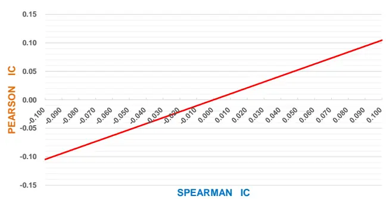
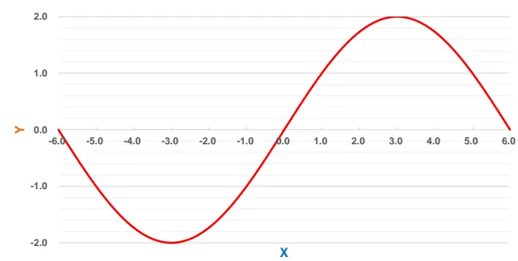
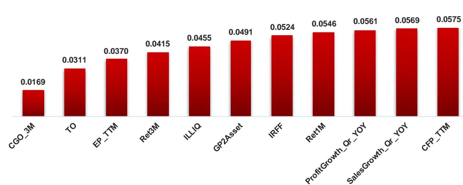
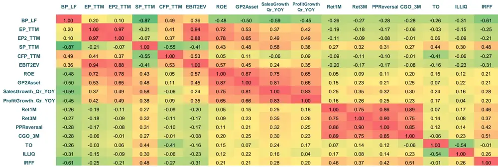
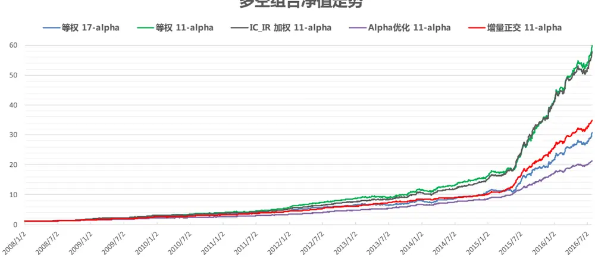
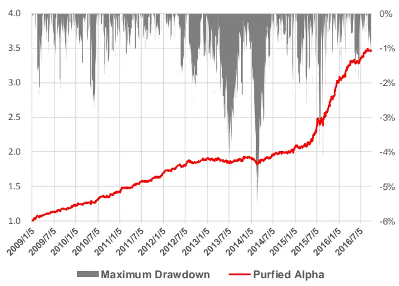
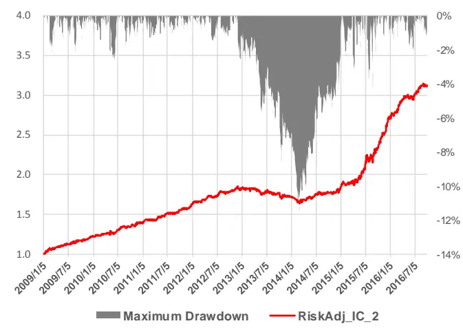
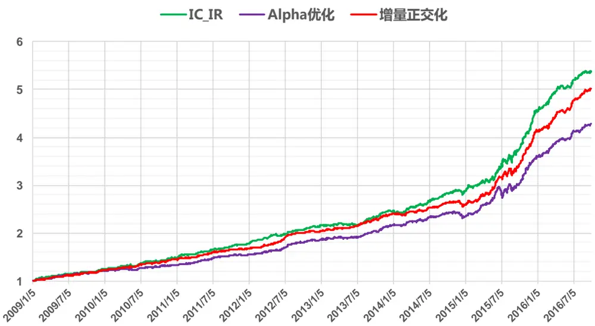

## 研究结论

策略 Alpha 收益的定义取决于投资者控制了哪些风险，Alpha 因子的ZSCORE 可以通过多期横截面回归取平均的方式转化成预测收益率，输入后续的组合优化过程。

- 在两个变量满足正态分布时，Pearson 和 Spearman 相关系数的数值很接近，但 Spearman 秩相关系数在做显著性检验时不依赖于变量的正态分布特性，更稳健，因此因子选股计算 IC时多采用后者。

Alpha 因子是否需要做风险中性化处理取决于做组合优化时是否做了对应的风险暴露控制，并非风险因素剔除的越多越好。当构建的组合完全控制了风险暴露时，风险调整 IC（risk adjusted IC）会比 Purifed alpha IC 更能准确反映组合的未来收益。但实际投资中，投资者或多或少都会暴露一些风险来获取更高的 alpha，个股权重也会有上下限限制，风险调整 IC的预测能力和理论有出入。再加上近些年 A 股市值效应明显，而风险调整 IC 更偏好大盘股数据，因此实证测试下来，Purified alpha 效果优于风险调整 IC。

Alpha 因子加权最麻烦的地方在于因子间的相关性处理。“因子按逻辑分类“的方法对技术类因子的适用性差，而且逻辑上同属一类的因子在做完风险中性化处理后，同类因子间相关性可能低于异类因子间相关性。Qian(2007)的 alpha 优化方法过于强调稳健性，会牺牲比较多的 alpha 收益，在无法做空、杠杆交易难度大的国内市场，这种方法的适用性有限。

我们在之前报告中提出的因子筛选方法可以很好的剔除重复信息的因子，降低因子数量。因子筛选过程产生了一系列相互正交的“残差因子“，用这些因子做 IC_IR加权可以规避因子间的共线性问题，也就是本报告的”增量正交化“方法。或者直接对筛选出的因子的原始 ZSCORE 做 IC_IR 加权，这两种方法用来做多空组合或指数增强表现都非常不错，但后者受因子数量、因子间共线性的影响更明显，在不同因子库上的效果需要做单独测试。

## 风险提示

- 量化模型失效风险

- 市场极端环境的冲击

报告发布日期2016 年 10 月 25 日

证券分析师朱剑涛

021-63325888*6077

zhujiantao@orientsec.com.cn

| 年化超额收益 信息比 月胜率 最大回撤 组合平均股票数量 月度单边换手率 |  |  |  |  |  |  |
| --- | --- | --- | --- | --- | --- | --- |
| IC_IR 加权 | 28.3% | 3.71 | 88.2% | -4.3% | 175.2 | 71.3% |
| Alpha 优化 | 23.7% | 3.26 | 90.3% | -7.3% | 179.0 | 63.4% |
| 增量正交化 | 26.8% | 3.52 | 92.5% | -4.7% | 175.5 | 68.4% |

## 相关报告

执业证书编号：S0860515060001

| 线性高效简化版冲击成本模型 | 2016-10-21 |
| --- | --- |
| 资金规模对策略收益的影响 | 2016-08-26 |
| Alpha 因子库精简与优化 | 2016-08-12 |
| 日内残差高阶矩与股票收益 | 2016-08-12 |
| 动态情景多因子 Alpha 模型 | 2016-05-25 |

中证 500增强组合表现（全市场选股，未扣费）

## 一、Alpha 定义与预测

## 1.1 Alpha 定义

Alpha 是量化投资的基础概念，但实际使用时存在模糊的地方。通常在大众媒体和私人聊天中用到的 alpha，例如：“XX基金的 alpha很高”，实际上指的是相对基准超额收益的意思。而在组合绩效分析中，股票组合收益可以分解为风险因子（市场因子、市值因子、估值因子等）带来的 beta收益和不能被这些风险解释的alpha收益，随着风险因子的选择不同，计算得到的alpha也会不同；如果任何风险都不控制，那么 alpha就等于组合收益率。因此严格的来讲，对于不同的投资者，由于风险控制的要求不一样，追求的 alpha 会有差别，只有在同一个风险控制要求下，比较不同策略间的 alpha 才有意义。

## 1.2 Alpha 因子与 Alpha 收益

实务投资研究中，我们采用 alpha 因子横截面分析的方式来判别股票未来 alpha 收益的高低，这可以表示成一个回归问题或预测问题。例如用 $\mathbf{r}_{i,t}$ 表示股票 i 在第 t个月的 alpha收益， $f_{\mathrm{i,t}}$ 表示月初某个 alpha 因子在股票 i 上的取值，并记向量 $\vec{\mathbf{r}}_{t}=(r_{1,t},r_{2,t},\dots r_{N,t})^{T},\quad\vec{\mathbf{f}}_{t}=(f_{1,t},f_{2,t},\dots f_{N,t})^{T}$ , 如果拿横截面上 alpha 收益对 alpha 因子做带常数项的单变量线性回归，用 OLS 方法易求得模型估计的 alpha 收益

$$
\begin{aligned}\mathrm{E}(\boldsymbol{r}_{t}|\boldsymbol{f}_{t})&=E(\vec{\mathbf{r}}_{t})+cov(\vec{\mathbf{r}}_{t},\vec{\mathbf{f}}_{t})\cdot\frac{\vec{\mathbf{f}}_{t}-E(\vec{\mathbf{f}}_{t})}{var(\ \vec{\mathbf{f}}_{t})}\\&\quad=E(\vec{\mathbf{r}}_{t})+error(\vec{\mathbf{r}}_{t},\vec{\mathbf{f}}_{t})\cdot std(\vec{\mathbf{r}}_{t})\cdot\frac{\vec{\mathbf{f}}_{t}-E(\vec{\mathbf{f}}_{t})}{std(\ \vec{\mathbf{f}}_{t})}\end{aligned}\tag{}
$$

上述等式的 $\mathrm{E}(\cdot),cov(\cdot,\cdot),corr(\cdot,\cdot),var(\cdot),std(\cdot)$ 均表示随机变量函数对应的样本函数。把 $\vec{\mathbf{f}}_{t}$ 换成最新一期的因子数值就能得到预测的 alpha收益。

假设投资者不做任何风险控制，那么这时 $\mathbf{\vec{T}}_{t}^{\mathrm{~i~}}$ 就是股票收益率，上述等式中 $E(\vec{\mathbf{r}}_{t})$ 由市场决定，对横截面上所有股票都一样，我们做相对收益或对冲组合更关心的是股票间的相对收益大小，也就是式(1.1)的第二部分。上式可以采用 Grinold (1999)的表示方法简单写作

$$
\mathbb{E}(\boldsymbol{r}_{t}|\boldsymbol{f}_{t})-E(\vec{\mathbf{r}}_{t})=error(\vec{\mathbf{r}}_{t},\vec{\mathbf{f}}_{t})\cdot std(\vec{\mathbf{r}}_{t})\cdot\frac{\vec{\mathbf{f}}_{t}-E(\vec{\mathbf{f}}_{t})}{std(\vec{\mathbf{f}}_{t})}\triangleq\mathbf{IC}\cdot\mathbf{Vol}\cdot\mathbf{z}\mathbf{score}\tag{}
$$

(1.2)

也就是说个股的 Alpha收益由三个因素决定：

1) IC (Information Coefficient)，alpha 因子和未来 alpha 收益的相关系数，代表因子预测能力，

2) Alpha 的波动率(Vol)，波动率越高，股票间的 alpha差异越大，能获得的 alpha也就越多。

3) Alpha 因子的 zscore，它用来衡量个股在这个信息维度上的信号强弱。

以上是单个 alpha因子在一个横截面上做回归，但实际投资中投资者往往会采用多个 alpha因子来获得更稳健收益。常用的做法是先把单个 alpha 因子的 zscore 通过某种加权方式合成一个总的 zscore（参考本报告第三节），然后用个股收益对汇总的 zscore 做上述的回归，把 zscore 转换成收益率，再输入到组合优化器中做组合构建。回归并非只在一个横截面上做，而是在多个横截面上同时进行（例如，历史滚动 24个月），把多个横截面预测的结果进行平均。

BARRA 采用的 ZSCORE 转 Alpha 收益方法（Gleiser & McKenna 2010）和上述模型有所差异，他们采用的是 Grinold (1999)的模型，先用个股收益对 alpha因子做时间序列上的回归，可以得到和式（1.2）类似的计算公式，但 IC, vol , zscore 的计算都是时间序列方向上的，再基于一些理论假设，将时间序列的数据用到横截面上。这种方法的好处是同时考虑了 alpha因子与 alpha收益在时间序列和横截面两个维度上的关系，分析更全面，但缺点是理论假设强、回归计算多、容易导致模型误差累积，实际使用效果不一定好。

## 二、Pearson VS Spearman IC

从上一节的分析可知，alpha 因子的 IC 可以用来衡量其对 alpha 收益的预测能力，IC 计算采用的是矩形式的 Pearson 线性相关系数，但实务中我们用的更多的是 Spearman秩相关系数，两者会有哪些差别？

首先，如果随机变量 X 和 Y 满足标准二元联合正态分布，相关系数为 ，则可以证明 Pearson相关系数 $\mathsf{(p_{p}(}X,Y\mathrm{)}$ 和 Spearman 秩相关系数 $(\mathsf{p}_{s}(X,Y)$ 满足下面等式

$$
\rho_{\mathrm{p}}(X,Y)=2\cdot\sin(\frac{\pi}{6}\cdot\rho_{s}(X,Y))
$$

如果将 在 0点 Taylor展开，可以计算得到 $\begin{array}{r}{\rho_{\mathtt{p}}(X,Y)\approx\frac{\pi}{3}\cdot\rho_{s}(X,Y)\approx1.0472\cdot\rho_{s}(X,Y)}\end{array}$ ，由于绝大部分 alpha 因子的 Spearman IC 绝对值不超过 0.1，因此 Pearson 和 Spearman 相关系数数值上相差非常小。这也可以下图 1看出，两者的关系几乎就是一条 y=x的直线，但放到全局看（图 2），这条“直线”其实是正玄函数的一段。

图 1： $\begin{array}{r}{\mathrm{y}=2\cdot\sin(\frac{\pi}{6}\cdot x)}\end{array}$ 在区间[-0.1, 0.1]上的图像

资料来源：东方证券研究所

图 2： $\begin{array}{r}{\mathrm{y}=2\cdot\sin(\frac{\pi}{6}\cdot x)}\end{array}$ 在区间[-6, 6]上的图像

资料来源：东方证券研究所

在我们前期的专题报告《选股因子极值处理与正态转换》中提到，为了避免因子数据偏度对zscore 计算的影响，有必要对偏度较高的选股因子的原始数据做正态转换；这种转换在每个时间横截面上进行，能够平均意义上使得转换后的因子更符合正态分布，但在个别月份，转换后的因子数据仍然会呈现极其显著的非正态特征，此时 Spearman IC 和 Pearson IC 数值上会差得比较多。

我们之所以采用 Spearman IC 来计算 IC，一方面是因为在数据都接近正态分布时，它的数值和 Spearman IC 很接近，可用作近似代替；另一方面是 Spearman IC 在数据非正态时会有更好的统计稳健性。由于 Spearman IC 是对数据的秩序做计算，因此不受数据里极端异常值影响，Pearson IC 则会，不过如果计算前做过数据异常值处理，这种影响并不大。Spearman IC 的稳健性更多体现在 IC 是否显著等于零的统计检验上。Pearson IC 的显著性检验有赖于数据的正态性假设，如果数据呈现明显的非正态特征，在某些情况下，例如分布满足中心极限定理的要求，则大样本下非正态特征影响有限；但在某些情况下，例如 Bradly(1977)做的混合正态分布仿真，Pearson IC 统计检验犯第一类错误的概率明显偏高，并且不会随着样本数量增加而减少。相比而言，Spearman IC 犯第一类错误的概率更接近置信度水平。由于股票数据的多样性和不可预测性，实务中使用更多的是 Spearman IC。

## 三、Alpha 因子加权方法

## 3.1 Alpha 因子风险中性化处理

用原始 alpha因子来做选股会面临较大的风险暴露，例如成长类因子会偏好高成长性行业，而估值类因子则偏好传统周期行业，技术类因子由于小盘股的股价波动更大，会更多的选出小市值股票。因此为了降低风险因子对股票组合收益的影响，有必要对原始 alpha因子数据做风险中性化处理。要中性化处理哪些风险因素取决于最后组合构建时的风险控制要求，我们将在后续报告中单独探讨 A 股市场的风险因素，就目前实证结果来看，控制行业和市值两个风险因素就可以获得非常稳健的量化组合。因此本报告中的风险中性化处理都是针对行业和市值两个风险因子，具体做法是通过横截面回归方式，

假设 $i\vec{\mathbf{f}}_{t}=(f_{1,t},f_{2,t},\dots f_{N,t})^{T}$ 为某个 alpha 因子第 t 个月在 N 个股票上的取值，全市场股票的一级行业数量有 D 个， $\vec{I}_{\mathrm{t}}^{(\mathrm{d})}=(\mathrm{I}_{1,\mathrm{t}}^{(\mathrm{d})},I_{2,t}^{(d)}\dots I_{N,t}^{(d)})^{T},\mathrm{d=1,}2\dots\mathrm{D}$ 表示 t 时刻第 d 个行业的示性函数取值，个股属于d行业，函数取值为1；不属于d行业，函数取值为0. $\overrightarrow{\mathbf{M}}_{\pmb{t}}=(m_{1,t},m_{2,t},\dots m_{N,t})^{T}$ 表示N 个股票总市值因子数据取自然对数后再做横截面标准化后的数值，代表个股的市值风险暴露程度，市值中性化处理即是在每个月横截面上，拿期初的 alpha因子对行业和市值暴露度做回归，

$$
\vec{\mathbf{f}}_{\mathbf{t}}\sim\vec{I}_{\mathbf{t}}^{(1)}+\vec{I}_{\mathbf{t}}^{(2)}+\cdots+\vec{I}_{\mathbf{t}}^{(\mathrm{D})}+\overrightarrow{\mathbf{M}}_{\mathbf{t}}+\vec{\pmb{\epsilon}}_{\mathbf{t}}
$$

取残差项 $\vec{\epsilon}_{t}$ 作为风险中性化处理后的 alpha 因子。

Alpha因子风险中性化处理后再和未来一期的股票收益计算 IC，这种做法被称作纯 alpha方法（Purified Alpha）。需要注意的是，Purfied Alpha 可以降低 alpha 因子选出的股票组合在对应风险因子上的暴露，但不能保证选出的股票组合风险暴露度为零，仍需在组合优化时做相应的风险暴露控制。

Alpha因子做风险中性化处理会改变alpha因子的IC和IC_IR，可能变好也可能变坏，视alpha因子而定。针对我们上篇报告中提到的 28 个因子构成的简单因子库（图 3，分析师预测未来一年EPS 增长率指标由于数据覆盖率的原因，本次研究并未采用），用 2006.01 – 2016.09的月度数据进行检验，把平均 IC 绝对值大于 0.02 且统计上显著的因子称为 alpha 因子，这样的因子共有十个（图 3中标红部分）。

图 3：选股因子库

| 因子名称 | 说明 | 因子名称 | 说明 |
| --- | --- | --- | --- |
| BP_LF | Newest Book Value/Market Cap | OperatingProfitGrowth_Qr_YOY | 营业利润增长率（季度同比） |
| EP_TTM | TTM earnings/ MarketCap | SalesGrowth_Qr_YOY | 营业收入增长率（季度同比） |
| EP2_TTM | TTM earnings(after Non-recurring Iterms) / MarketCap | ProfitGrowth_Qr_YOY | 净利润增长率（季度同比） |
| SP_TTM | TTM Sales/ Market Cap | EquityGrowth_YOY | 净资产增长率（同比） |
| CFP_TTM | TTM Operating Cash Flow / Market Cap | OCFGrowth_YOY | 经营现金流增长率（同比） |
| EBIT2EV | EBIT/Enterprise Value | Debt2Asset | 债务资产比例 |
| ROA | 总资产收益率 | Ret1M | 1个月收益反转 |
| ROE | 净资产收益率 | Ret3M | 3个月收益反转 |
| GrossMargin | 销售毛利率 | PPReversal | 乒乓球反转因子 |
| NetMargin | 净利润率 | CGO_3M | Capital Gains Overhang (3M) |
| AssetTurnover | 总资产周转率 | TO | 以流通股本计算的1个月日均换手率 |
| InvTurnover | 存货周转率 | ILLIQ | 每天一个亿成交量能推动的股价涨幅 |
| GP2Asset | Gross Profit/Avg total Asset | IRFF | Fama-French regression SSR/SST |
| ROIC | (EBITDA- 资本支出)/(净资产+有息负债) |  |  |
| Accrual2NI | (Net Income - CFO )/\|Net Income\| |  |  |

资料来源：东方证券研究所 & Wind 资讯

但如果对因子库里的 28 个因子先做行业和市值中性处理，再用月频数据做 IC 检验，在同样的 IC 标准下，alpha 因子数量将增加到 17 个，如图 4 所示。

图 4：风险中性化处理前后 Alpha因子 IC的变化

| 因子名称 | 原始因子 |  | 风险中性处理后 |  |
| --- | --- | --- | --- | --- |
|  | IC | IC_IR | IC | IC IR |
| BP_LF | 0.043 | 0.93 | 0.052 | 1.81 |
| EP_TTM |  |  | 0.045 | 1.71 |
| EP2_TTM |  |  | 0.044 | 1.73 |
| SP_TTM |  |  | -0.033 | -1.22 |
| CFP_TTM |  |  | 0.034 | 2.73 |
| EBIT2EV |  |  | 0.046 | 1.85 |
| ROE |  |  | 0.022 | 0.72 |
| GP2Asset |  |  | 0.031 | 1.30 |
| SalesGrowth_Qr_YOY | 0.026 | 1.07 | 0.031 | 1.80 |
| ProfitGrowth_Qr_YOY | 0.030 | 1.35 | 0.035 | 2.14 |
| Ret1M | -0.084 | -1.93 | -0.085 | -2.66 |
| Ret3M | -0.084 | -1.82 | -0.077 | -2.31 |
| PPReversal | -0.078 | -1.69 | -0.074 | -2.24 |
| CGO_3M | -0.078 | -1.63 | -0.075 | -2.09 |
| TO | -0.064 | -1.32 | -0.092 | -2.77 |
| ILLIQ | 0.095 | 2.08 | 0.055 | 2.03 |
| IRFF | -0.092 | -3.93 | -0.091 | -4.79 |

资料来源：东方证券研究所 & Wind 资讯

从上图可以看到，风险中性化对估值类指标和财务类指标影响最为显著，因为这些指标的原始数值会有非常明显的风险偏好，中性化处理后使得很多 IC 很低的因子转变成了 alpha 因子(EP_TTM, ROE 等)；原来有效的估值类 alpha 因子 BP_LF 和财务类因子 SalesGrowth_Qr_YOY、ProfitGrowth_Qr_YOY，中性化处理后 IC 和 IC_IR 也得到非常显著的提升。技术类因子里面，日均换手率因子 TO做风险中性化处理后 IC和 IC_IR改善明显，但非流动性指标 ILLIQ由于和市值因子的高相关性，中性化处理后 IC 反而变低，其它技术因子做中性化处理后，IC 变化不大，但 IC_IR都有或多或少的提升。

我们也可以按照上篇报告介绍的方法对风险中性化后 alpha因子进行筛选，剔除重复信息（图5），这样从 17个 alpha因子中筛选出了 11个 alpha因子，数量明显多于未中性化处理筛选出的alpha 因子数量（6 个）；未做中性化处理时，Ret1M 因子被剔除，Ret3M 指标被保留，但中性化处理后，这两个因子都被筛选保留下来，说明剔除 alpha因子的共同风险因素后，alpha因子之间的差异变得更显著。由于这些因子都剔除了风险因子的影响，其横截面回归的 adjusted R^2 相对未中性化处理的因子有所下降。

Adjusted R^2
图 5：风险中性化后 alpha因子的筛选

资料来源：东方证券研究所 & Wind 资讯

## 3.2 传统方法

Alpha 因子加权的最传统方法是等权，这种最简单的方法也是其它 alpha加权方法验证时必须比对的基准。不过这种方法受因子间的线性相关性影响严重。假如量化组合刚建仓时，投资者只用了 5 个 alpha 因子，其中只有一个估值类因子 BP_LF；组合建仓一段时间后，发现 CFP_TTM也是一个很有效的因子加入了 alpha 模型，此时仍采用等权方法，则估值类因子的权重会由 1/5 上升为 2/6，引起各类因子权重变化的原因是选择用多少个因子的人为因素，而并非基于这类因子对收益率的贡献大小，这会增加模型的不确定性, alpha因子数量较多时，这种现象会更加明显。

为了避免因子间共线性的影响，通常的做法是把相关性高的因子归为一类，通过一定的加权方式合成一个因子，或者用其中最有效的因子来代替这一类因子。但如何把因子合理分类，是一件十分棘手的事情。一种数据驱动的方法是根据因子间的相关性做聚类分析，把因子进行分类，但这种方法对数据会很敏感，随着因子间的相关性变化，聚出来的类可能会频繁变动，增加组合换手，效果不一定好。另一种是基于因子经济含义，把相同逻辑的因子归为一类，这种分类方法主观性较强，但因子类别稳定，有可能获得更好的结果，不过实际运用中也会碰到许多问题。例如估值类、成长类、盈利类因子经济逻辑较为明确，比较好归类，但技术类因子的逻辑不是很好区分，而 a 股市场上目前最有效的选股因子基本都是技术类因子，这类因子划分准确与否直接决定最终收益高低。

另外，因子数据的正态变换和风险中性化处理可能会使得同一类逻辑的因子相关性并不高，如下图 6 所示，我们计算了上述 17 个风险中性化处理后的 alpha 因子过去十年月度 IC 序列的相关系数矩阵。可以看到同为估值类因子，BP_LF 和 EP_TTM 风险中性化处理后，IC 只有 0.2，而BP_LF 和 ROE、GP2Asset 等其它类别指标的相关系数可以达到 0.5；SP_TTM 由于原始因子数据偏度较大，我们做了取倒数的正态化处理，因此它和其它同类指标的相关系数为负。

总的来说，alpha因子分类是一件非常艺术性的事情，主观因素影响多，不确定性大。

图 6：风险中性化处理后 17个 alpha因子的 IC相关性矩阵

资料来源：东方证券研究所 & Wind 资讯

我们上篇报告提出的因子筛选方法，可以剔除因子间的重复信息，从而部分降低因子间共线性的影响。如图 7和图 8所示，同样是采用等权加权方式，用筛选出的 11个 alpha因子做的多空组合不论是收益率还是稳定性上都明显强于原来的 17个 alpha因子。

IC_IR 加权是等权方式一种的改进，它把 alpha 因子过去一段时间（本报告中采用 24 个月）的 IC_IR 作为权重对各个 alpha 因子的 zscore 进行加权汇总，考虑到了因子表现的稳健性，对于筛选出的 11个 alpha因子，等权和 IC_IR加权的差别不大，IC_IR 加权方式略为更稳健。

图 7：不同 Alpha加权方式得到的多空组合净值走势
多空组合净值走势

资料来源：东方证券研究所 & Wind 资讯

图 8：不同 Alpha加权方式得到的多空组合业绩统计指标（无风险利率设定为 0.02，sharpe Ratio 和 IC_IR数据年化）

|  | 平均月收益 | 月胜率 | Sharpe Ratio | 最大回撤 | Zscore IC | Zscore IC_IR |
| --- | --- | --- | --- | --- | --- | --- |
| 等权 17-alpha | 0.035 | 82.7% | 2.70 | -0.115 | 0.118 | 4.28 |
| 等权 11-alpha | 0.041 | 91.3% | 3.26 | -0.091 | 0.131 | 4.94 |
| IC_IR 加权 11-alpha | 0.041 | 91.3% | 3.39 | -0.091 | 0.133 | 5.38 |
| Alpha优化 11-alpha | 0.030 | 93.3% | 4.21 | -0.062 | 0.104 | 6.79 |
| 增量正交11-alpha | 0.035 | 92.3% | 3.66 | -0.048 | 0.116 | 6.17 |

资料来源：东方证券研究所 & Wind 资讯

## 3.3 Alpha 优化方法

在上一篇报告中，我们为了考察 alpha因子相关性的影响，证明报告提出的因子筛选流程没有过多信息损失，采用了 Qian(2007)提出的 Alpha 优化方法来计算 alpha 因子的权重，优化结果有显式解 $\mathsf{w}^{*}=\delta\cdot\Sigma_{IC}^{-1}\cdot\overline{{\mathbf{IC}}}$ 。如果 alpha 因子之间都线性不相关，那么优化后第 i 个 alpha 因子的权重 $\begin{array}{r}{\mathbf{w}_{\mathrm{i}}^{*}=\delta\cdot\frac{\mathrm{IC_{i}}}{\sigma_{i}^{2}}}\end{array}$ , 为该 alpha 因子过去 24 个月的 IC 的标准差, 为 IC 均值。所以上节提到的IC_IR 加权方法可以看作 alpha 优化方法在因子线性不相关情况下的一个变种，弱化了 alpha 优化方法对风险的重视度。

对于风险中性化处理后的 alpha因子, Alpha优化方法的结果仍然如图 7和图 8所示，可以看到 Alpha 优化方法的多空组合收益率明显要比等权和 IC_IR 加权方法低，每个月差不多少了一个百分点，但是稳健性要高不少，多空组合 Sharpe 值可以提升到 4.21，多空组合的最大回撤也从9.1%降为 6.2%。

那么这种用收益率下降去换取稳健性提升的交换是否划算呢？如果投资者能够以较低成本去做空股票并提高资金杠杆，这种稳健性提升是有帮助的，因为采用 1.34 倍杠杆，alpha 优化得到的多空组合月收益率就可以达到等权和IC_IR加权组合的收益水平，但最大回撤只有8.3%，Sharpe值保持不变。但在国内，做空股票难度较大，杠杆资金成本高，投资者更关注的是组合稳健性达到一定水平后，超额收益最高能做到多少。就图 7、8中的数据而言，等权组合和 IC_IR加权组合的Shapre 值在 3.3左右，已经有很高的稳健性，每个月牺牲 1%的收益把 Sharpe值从 3.3提升到 4.2的意义不大。由于优化目标函数是复合 alpha因子的 IC_IR，Qian(2007)的方法过于强调稳健性，但稳健性的提高可能会牺牲过多收益，因此这种方法在国内目前的投资环境下实用性有限。

## 3.4 增量正交化法

我们在上篇报告设计的因子筛选流程，通过线性回归取残差的方式，对 alpha因子筛选的同时也在对这些alpha因子做了正交化，可以对这些正交化后的alpha因子的ZSCORE做IC_IR加权。

这种增量正交化方法和线性代数里常用的 Schmidt 正交化方法比较类似，但又有所差别：

1. 增量正交化方法通过比较横截面回归的平均 R-square确定了因子正交化的先后顺序。

2. Schmidt方法是对所有因子做正交化，但增量正交化方法只对筛选出的因子做正交化。

增量正交化方法做多空组合的表现如图 7 和图 8 所示，从收益和 Sharpe 值看，它正好处于简单 IC_IR加权和 Alpha优化方法之间，但回撤非常小，多空组合的历史最大回撤仅 4.8%。最后补充说明的是，因子正交化方法规避了因子间的共线性问题，但并没有解决这个问题；由于因子间相关性每个月都在发生变化，所有不同的月份，因子 F2 对因子 F1 回归得到的残差项可能是完全不一样的东西，不过我们这里使用的是因子过去 24个月数据的平均值，从实证结果看，这种相关性变化的影响并不大。

## 3.5 小结

以上介绍的 Alpha加权方法都是通过多空组合的方式来衡量该方法的好坏，这种衡量方法是和alpha 因子 IC 概念相对应的。但在 A 股实际投资中，股票做空交易难度大，成本高，投资者更关注的是组合相对业绩基准的超额收益，稳健的多空组合收益可能大部分来自于空头，多头效用并不明显。因此有观点认为我们在选择 alpha因子时应该尽量选择多头收益高的因子，而给空头收益高的因子较小权重，这种理解有失偏颇，因为做因子选股最终采用的是多因子打分而非单个因子选股，空头收益高的因子可以起到“剔除劣质股”的效用，从而变相增强多头组合收益。

为了和指数增强的 alpha投资模式匹配，我们需要的是一种alpha加权方式，它得到的 zscore和股票收益率的右尾相关性要高于左尾相关性，类似于 Gumbel Copula的分布。不过这一块目前理论和实证研究都很少，实际中用的更多的方法是直接用各种加权方式去做一个指数增强组合，比较哪个效果更好。在做这个比较之前，我们先介绍另外一个 IC 概念，它虽然在国内市场的使用效果不佳，但是可以帮助我们理解为什么 alpha因子要做风险中性化处理，该对哪些风险因子做处理。

## 四、风险调整 IC

## 4.1 风险调整 IC 的逻辑

Raw IC 和 Purified Alpha 是拿原始或中性化处理后的 alpha 因子去和股票收益率计算 IC，再选 alpha 因子，控制风险构造指数增强组合。它的逻辑是，一个 IC 高的 alpha 因子，表明它对个股未来收益有很好的预测排序能力，即使构建组合时做了行业中性的风险控制，但是它的排序能力仍将在行业内保持，由此可以得到一个很好的的指数增强组合。

但问题是，单个 alpha 因子的月频 IC 并不高，大部分绝对值都在 0.1 以下，多因子汇总的ZSCORE IC 很难超过 0.15，因此 alpha因子的对股票未来收益的排序能力非常有限，或者说它只在部分股票里适用。如果是做指数增强组合，做了行业中性控制，碰巧 alpha因子适用的股票行业在指数里权重很小，而不适用的股票行业在指数里权重很大，那么这样得到的指数增强组合表现不一定优秀。因此，做了行业中性的风险控制后，投资者更应关注的是行业中性后的 alpha 因子和行业中性化后的股票收益之间的相关性，也就是 Risk Adjusted IC的概念。

## 4.2 理论推导过程

上述投资逻辑可以在 Mean-Variance 框架下转换为严格理论推导，Zhou (2014)和 Qian(2007)都给了详细证明，我们这里采用 Zhou(2014)的矩阵形式来说明问题，这样表示更加简洁。

带风险控制的多空组合或指数增强组合构建可以表示成以下 Mean-Variance 优化问题：

$$
\operatorname*{max}_{w}~\alpha^{\prime}\cdot w-\frac{1}{2}\lambda w^{\prime}\cdot\Sigma\cdot w\qquad\ldots\ldots\tag{1.3}
$$

$$
\mathrm{s.t.}\quad\left[\begin{matrix}{e^{\prime}}\\{B^{\prime}}\end{matrix}\right]\cdot w=\tilde{B}\cdot w=0
$$

其中： 是一个 矩阵，表示预测的 N只股票的未来收益。

是一个 的单位 1 矩阵，如果是做多空组合， $\mathbf{e}^{\prime}\cdot\mathbf{w}=0$ 表示组合是资金中性的，多头和空头资金量相等；如果是做指数增强组合, w 表示组合的主动权重（active weight，组合权重和基准权重的差额）， $\mathbf{e}^{\prime}\cdot\mathbf{w}=0$ 表示在满仓做指数增强。

B 是 $\mathrm{N\times K\check{\mathfrak{f}}}$ 的风险暴露矩阵，K 为风险因子数量。基于这些风险因子可以对股票收益率的协
方差矩阵做出估计， $\Sigma=\mathrm{B}\cdot\mathrm{F}\cdot\mathrm{B}^{\prime}+S$ ， 是 K个风险因子的 协方差矩阵， 是 $|\mathrm{N}\times\mathrm{N}|$ 的
特质方差（Specific Risk）对角阵。记矩阵 $\tilde{B}^{\prime}=[e,B]$ o

带约束条件的优化问题（1.3）可以通过 Lagrange 算子转换成无约束优化问题，再通过一阶导数等于 0 的条件容易求得最优解 $\begin{array}{r}{\mathsf{I}\mathbf{w}^{\star}=\lambda^{-1}S^{-1}\left(I-\tilde{B}\big(\tilde{B}^{\prime}S^{-1}\tilde{B}\big)^{-1}\tilde{B}^{\prime}\cdot S^{-1}\right)\alpha,}\end{array}$

如果把预测收益率对风险因子做加权线性回归，权重为 $S^{-1}$ ，取残差项 $\pmb{\alpha}_{\perp}$

$$
\alpha=\tilde{B}\cdot f+\alpha_{\perp},\alpha_{\perp}\sim N(0,S)\Rightarrow\alpha_{\perp}=(I-\tilde{B}\big(\tilde{B}^{\prime}S^{-1}\tilde{B}\big)^{-1}\tilde{B}^{\prime}\cdot S^{-1})\cdot\alpha
$$

则上述最优解还可以表示成下面无约束优化问题（1.4）的解：

$$
\operatorname*{max}_{w}\alpha_{\perp}^{\prime}\cdot w-\frac{1}{2}\lambda w^{\prime}\cdot S\cdot w\Rightarrow w^{*}=\lambda^{-1}S^{-1}\alpha_{\perp}=\lambda^{-1}S^{-1}\left(I-\tilde{B}\big(\tilde{B}^{\prime}S^{-1}\tilde{B}\big)^{-1}\tilde{B}^{\prime}\cdot S^{-1}\right)\alpha
$$

如果拿个股真实收益率 也对风险因子做加权线性回归，权重也为 $S^{-1}$ ，取残差项 $\mathbf{r}_{\perp}$

$$
\mathbf{r}=\tilde{B}\cdot f_{r}+\mathbf{r}_{\perp},\mathbf{r}_{\perp}\sim N(0,S)\Rightarrow\mathbf{r}_{\perp}=(I-\tilde{B}\big(\tilde{B}^{\prime}S^{-1}\tilde{B}\big)^{-1}\tilde{B}^{\prime}\cdot S^{-1})\cdot r
$$

则在最优权重下，股票组合的收益率

$$
\mathbf{r}_{\mathtt{p}}=w^{\star^{\prime}}\cdot r=(\lambda^{-1}S^{-1}\alpha_{\perp})^{\prime}\cdot(\tilde{B}\cdot f+\mathbf{r}_{\perp})
$$

容易证明 $\boldsymbol{\alpha}_{\perp}^{\prime}\cdot\boldsymbol{S}^{-1}\cdot\tilde{\boldsymbol{B}}=0$ ，并记 $\mathbf{\tilde{\mathtt{Z}}}=(\tilde{\mathtt{z}}_{1},\tilde{\mathtt{z}}_{2}\dots\tilde{\mathtt{z}}_{\mathrm{N}})^{\prime},\tilde{\mathbf{r}}=(\tilde{r}_{1},\tilde{r}_{2}\dots\tilde{r}_{\mathrm{N}})^{\prime}$ $\begin{array}{r}{\tilde{\bf z}_{i}=\frac{\tilde{\bf u}_{\perp,i}}{\sqrt{S_{i}}},\quad\tilde{r}_{i}=\frac{{\bf r}_{\perp,i}}{\sqrt{S_{i}}}}\end{array}$ ，则：

$$
\begin{aligned}\mathbf{r}_{\mathbf{p}}&=\lambda^{-1}\boldsymbol{\alpha}_{\perp}^{\prime}\cdot\boldsymbol{S}^{-1}\cdot\mathbf{r}_{\perp}=\lambda^{-1}(\boldsymbol{\alpha}_{\perp}^{\prime}\cdot\boldsymbol{S}^{-\frac{1}{2}})\cdot(\boldsymbol{S}^{-\frac{1}{2}}\cdot\mathbf{r}_{\perp})=\frac{1}{\lambda}\sum_{i=1}^{N}(\tilde{\boldsymbol{z}}_{i}\times\tilde{\mathbf{r}}_{i})=\frac{N}{\lambda}\times Corr(\tilde{\mathbf{z}},\tilde{\mathbf{r}})\times\boldsymbol{\sigma}_{\tilde{\mathbf{z}}}\times\boldsymbol{\sigma}_{\tilde{\mathbf{r}}}\\&\approx\frac{N}{\lambda}\times error(\tilde{\mathbf{z}},\tilde{\mathbf{r}})\end{aligned}
$$

我们把 ̃ 称作风险调整 alpha， ̃称作风险调整收益， ̃ ̃ 称作风险调整 IC。容易证明，当所有股票的特质风险相同时，Purified Alpha IC 和 Risk Adjusted IC 相等。

另外，风险调整 IC 的推导引出了一个非常重要的概念“组合一致性管理”（Consistent PortfolioManagement, Stubbs(2013)），传统做量化组合管理，都是把 alpha 因子筛选、风险模型、组合优化当作三个独立的模块，分别进行，但是从上面推导可以看到，alpha因子应该对哪些风险因子做风险中性化处理取决于最终构建组合时控制了哪些风险暴露。风险因子并非控制得越多越好，每控制一个风险就可能损失一部分 alpha，实际要控制哪些风险需要拿数据来调试。

另一个需要做“组合一致性管理”的变量是“换手率”，传统方法是在最后做组合优化时控制换手率，但是很可能之前挑选 alpha因子时选的都是一些高换手因子，因此这样做其实是在“高换手背景”下强行做换手率控制，并不一定最优。更能保证一致性的方法是在挑选 alpha因子时就给高换手率因子一定的惩罚，和最终要构建的组合换手率水平保持一致。相关研究我们将在后续报告进行。

## 4.3 实证效果

风险调整 IC 完备的理论设定是否能带来更好的使用效果呢？并不一定，这里主要有两个问题：

1. 理论推导过程中，各种风险暴露是被完全控制的。但是实际如果这样操作，alpha会很低，因此我们在个别风险因子上会放开一些风险暴露。而且实际投资中，管理人也会对个股权重上下限做出规定，这样优化问题（1.3）的限制条件就会变成不等式，只能通过数值方法求解，Risk Adjusted IC与组合未来收益的关系没有明确的关系。

2. 特质风险矩阵 参数估计难度大。我们分别用两种方法估算 S，第一种是在每个月横截面上用个股收益率对市值和行业做风险中性处理，计算残差收益率，再用股票 i 过去 12个月的残差收益率的方差作为 的估计。第二种则是BARRA建议的方法（Menchero 2011），他们在实务中观测到美国市场上个股的特质方差的倒数和个股市值的平方根成正比。不过BARRA 模型中的特质方差剔除了行业和十类风格因子，而我们这里只剔除了行业和市值风险。

下图是基于之前同样的因子计算得到的各个 alpha因子的 Risk Adjusted IC数值，可以看到两种方法计算得到 Risk Adjusted IC 差别不大，和 Purified Alpha IC 的数值也很接近；但从 IC_IR稳健性来看，Purfied Alpha 整体略高于 Risk Adjusted IC，这可能是因为 Risk Adjusted IC 计算时增加了大盘股的权重，而 A股 alpha因子总体而言在小盘股更为有效。

图 9：Purified Alpha IC VS Risk Adjusted IC

| 因子名称 | Purified Alpha IC |  | RiskAdj_IC_1 |  | RiskAdj_IC_2 |  |
| --- | --- | --- | --- | --- | --- | --- |
|  | IC | IC_IR | IC | IC_IR | IC | IC IR |
| BP_LF | 0.052 | 1.81 | 0.054 | 1.64 | 0.056 | 1.67 |
| EP_TTM | 0.045 | 1.71 | 0.049 | 1.78 | 0.045 | 1.49 |
| EP2_TTM | 0.044 | 1.73 | 0.048 | 1.83 | 0.043 | 1.50 |
| SP_TTM | -0.033 | -1.22 | -0.037 | -1.22 | -0.039 | -1.29 |
| CFP_TTM | 0.034 | 2.73 | 0.037 | 2.35 | 0.041 | 2.54 |
| EBIT2EV | 0.046 | 1.85 | 0.049 | 1.87 | 0.048 | 1.69 |
| ROE | 0.022 | 0.72 | 0.021 | 0.74 | 0.017 | 0.55 |
| GrossMargin | 0.019 | 1.02 | 0.016 | 0.68 | 0.020 | 0.95 |
| GP2Asset | 0.031 | 1.30 | 0.024 | 0.85 | 0.029 | 1.08 |
| SalesGrowth_Qr_YOY | 0.031 | 1.80 | 0.028 | 1.59 | 0.031 | 1.68 |
| ProfitGrowth_Qr_YOY | 0.035 | 2.14 | 0.033 | 1.99 | 0.035 | 1.93 |
| Ret1M | -0.085 | -2.66 | -0.088 | -2.71 | -0.085 | -2.46 |
| Ret3M | -0.077 | -2.31 | -0.085 | -2.43 | -0.076 | -2.05 |
| PPReversal | -0.074 | -2.24 | -0.077 | -2.20 | -0.072 | -1.96 |
| CGO_3M | -0.075 | -2.09 | -0.078 | -2.12 | -0.075 | -1.93 |
| TO | -0.092 | -2.77 | -0.087 | -2.46 | -0.090 | -2.54 |
| ILLIQ | 0.055 | 2.03 | 0.056 | 1.93 | 0.059 | 1.98 |
| IRFF | -0.091 | -4.79 | -0.094 | -4.58 | -0.090 | -4.45 |

资料来源：东方证券研究所 & Wind 资讯

我们可以用第 1.2 节提到的方法，用个股收益率对 ZSCORE 横截面回归的方法把 ZSCORE转换成预测收益率，但此时回归不是原先的 OLS 回归，而是以  为权重的 WLS (Weighted LeastSquare)回归，这样预测收益率才和 risk adjusted IC 正相关。

为比较这种收益预测方式对组合收益的影响，我们用图 5中筛选出的 11个 alpha因子做了全市场选股的中证 500增强组合，因子的 ZSCORE 采用 IC_IR 加权，组合优化时（式 1.3）风险厌恶系数 ，组合行业暴露和市值暴露均限制为零，个股权重上限设为 1%。图 10 是用 OLS 回归将 ZSCORE转换成预测收益率，再输入到组合优化中得到的增强组合拿中证 500指数对冲后的净值表现；图 11则是采用WLS 回归把 ZSCORE 转换成预测收益率，  采用市值平方根的倒数。交易费用未扣除。

可以看到，两个组合的表现在 2013年之前基本一致，但从 13年开始，RiskAdj_IC_2组合的表现明显弱于 Purified Alpha 组合，净值回撤明显。造成这种结果的可能原始是WLS回归给大市值股票较多权重，但 A 股从 13 年开始进入了最明显的“小市值溢价期”，WLS 回归预测的收益和真实收益会有较大偏差，而组合优化又有“误差放大器”的效应，对输入的预测收益率数值比较敏感，导致最后的组合表现较差。

由于当前 A股市场的市值效应依然十分强劲，而 Risk Adjusted IC方法整体偏好大盘股的数据，因此在全市场选股做指数增强时，Risk Adjusted IC方法理论上虽然更合理，但实际效果反不如 Purifed Alpha。投资者可以尝试在一些市值效应较弱的股票池，例如沪深 300 成分股里面，进一步测试 Risk Adjusted IC 方法，但是此时 alpha 因子需要重新筛选。

图 10：Purified Alpha 中证 500 增强对冲净值

资料来源：东方证券研究所 & Wind 资讯

图 11：RiskAdj_IC_2 中证 500 增强对冲净值

资料来源：东方证券研究所 & Wind 资讯

## 五、指数增强效果比较

如前文所述，IC 和多空组合表现可以很好衡量 alpha 因子全市场的选股能力，但它不直接等同与投资实际中更需要的指数增强效果。不同因子加权方法用来做指数增强的效果必须用实证数据做比较。我们用图 5 的 11 个 alpha 因子，分别采取 IC_IR 加权、alpha 优化和增量正交化方法在全市场选股做指数增强。从 4.3节结果可知，如果把行业和市值风险完全控制住，alpha会损失非常严重，年化超额收益只有 20%，如果要进一步提升收益，必须部分暴露市值风险，经过测试，我们把市值风险暴露控制在 0.5 以内。个股权重不超过 1%，未扣交易费用，结果如下图表所示。

图 12：不同 Alpha加权方式中证 500指数增强组合对冲净值走势（未扣费）

| 年化超额收益 信息比 |  |  | 月胜率 最大回撤 组合平均股票数量 |  |  |  |
| --- | --- | --- | --- | --- | --- | --- |
| IC_IR 加权 | 28.3% | 3.71 | 88.2% | -4.3% | 175.2 | 71.3% |
| Alpha 优化 | 23.7% | 3.26 | 90.3% | -7.3% | 179.0 | 63.4% |
| 增量正交化 | 26.8% | 3.52 | 92.5% | -4.7% | 175.5 | 68.4% |

资料来源：东方证券研究所 & Wind 资讯

在本报告第三部分 alpha 因子多空组合结果分析中，Alpha 优化是 Sharpe 值最高、最稳健的方法，但是在做指数增强时，它的信息比却是最低的，回撤也最大，稳定性最差，由此可见多空组合的表现或指数增强的表现并不完全一致。

IC_IR加权和增量正交化方法的表现都非常优异，IC_IR相对更优，但严格的说，这种优势只能针对本例而言，无法推而广之，因为 alpha因子数量的变化、之间相关性的变化都会对 IC_IR 加权的结果产生非常大的影响，而增量正交化方法有配套的因子筛选和正交化流程，受到的影响会相对较小。因此 alpha 因子采用哪种方式做加权是一个“数据驱动”的选择，没法从原理上保证一种方式一定比另一种方式更优。我们需要先按照传统的 IC检验和多空组合的分析方法比较不同加权方式的全市场选股效果，从中选出达到一定的收益和稳健型要求的加权方式，进行指数增强效果实证测试，再从中挑出最适合目前因子库的加权方式。

## 六、总结

IC 和多空组合表现是 alpha 因子的传统分析方法，用来衡量因子全市场选股能力，但其分析结果和国内市场指数增强与对冲产品的实际需求有出入，需要通过实证方式来验证哪种 alpha加权方式最适合。alpha加权最难处理的是因子间的共线性，我们设计的增量正交化方法可以帮助投资者很好的筛选因子、降低因子共线性影响，筛选出的 alpha因子直接用 IC_IR加权的效果也很好。

鉴于 alpha预测过程中不可避免的人为因素和线性模型预测能力的局限，我们将在后续报告中尝试用机器学习方法来取代这个预测过程。

## 风险提示

1. 量化模型基于历史数据分析得到，未来存在失效的风险，建议投资者紧密跟踪模型表现。

2. 极端市场环境可能对模型效果造成剧烈冲击，导致收益亏损。

## 参考文献

[1]. Bradley, J., (1977). “A common situation conducive to bizarre distribution shapes”, American Statistician, 31(4), 147-150

[2]. Gleiser,I., McKenna, D., (2010), “Converting Scores into Alphas”, Barra Aegis Case Study

[3]. Grinold, R., Kahn, R. , (1999), “Active Portfolio Management: A Quantitative Approach for Producing Superior Returns and Selecting Superior Returns and Controlling Risk (2nd Edition)”, McGraw-Hill Education.

[4]. Menchero, J., Orr, D.J., Wang J., (2011), “ The Barra US Equity Model (USE4)”, MSCI Model Insight.

[5]. Qian, E., Hua, R., Sorensen, E., (2007), “Quantitative Equity Portfolio Management: Modern Techniques and Applications”, Chapman & Hall/CRC Financial Mathematics Series.

[6]. Stubbs, R.A., (2013), “ Consistent Portfolio Management: Alpha Construction”, Axioma Research Paper, N.O. 44.

[7]. Zhou, X.F., Jain, S., (2014), “ Active Equity Management”.

## 分析师申明

每位负责撰写本研究报告全部或部分内容的研究分析师在此作以下声明：

分析师在本报告中对所提及的证券或发行人发表的任何建议和观点均准确地反映了其个人对该证券或发行人的看法和判断；分析师薪酬的任何组成部分无论是在过去、现在及将来，均与其在本研究报告中所表述的具体建议或观点无任何直接或间接的关系。

## 投资评级和相关定义

报告发布日后的 12个月内的公司的涨跌幅相对同期的上证指数/深证成指的涨跌幅为基准；

## 公司投资评级的量化标准

买入：相对强于市场基准指数收益率15%以上；

增持：相对强于市场基准指数收益率5%～15%；

中性：相对于市场基准指数收益率在-5%～+5%之间波动；

减持：相对弱于市场基准指数收益率在-5%以下。

未评级——由于在报告发出之时该股票不在本公司研究覆盖范围内，分析师基于当时对该股票的研究状况，未给予投资评级相关信息。

暂停评级——根据监管制度及本公司相关规定，研究报告发布之时该投资对象可能与本公司存在潜在的利益冲突情形；亦或是研究报告发布当时该股票的价值和价格分析存在重大不确定性，缺乏足够的研究依据支持分析师给出明确投资评级；分析师在上述情况下暂停对该股票给予投资评级等信息，投资者需要注意在此报告发布之前曾给予该股票的投资评级、盈利预测及目标价格等信息不再有效。

## 行业投资评级的量化标准：

看好：相对强于市场基准指数收益率5%以上；

中性：相对于市场基准指数收益率在-5%～+5%之间波动；

看淡：相对于市场基准指数收益率在-5%以下。

未评级：由于在报告发出之时该行业不在本公司研究覆盖范围内，分析师基于当时对该行业的研究状况，未给予投资评级等相关信息。

暂停评级：由于研究报告发布当时该行业的投资价值分析存在重大不确定性，缺乏足够的研究依据支持分析师给出明确行业投资评级；分析师在上述情况下暂停对该行业给予投资评级信息，投资者需要注意在此报告发布之前曾给予该行业的投资评级信息不再有效。

## 免责声明

本证券研究报告（以下简称“本报告”）由东方证券股份有限公司（以下简称“本公司”）制作及发布。

本报告仅供本公司的客户使用。本公司不会因接收人收到本报告而视其为本公司的当然客户。本报告的全体接收人应当采取必要措施防止本报告被转发给他人。

本报告是基于本公司认为可靠的且目前已公开的信息撰写，本公司力求但不保证该信息的准确性和完整性，客户也不应该认为该信息是准确和完整的。同时，本公司不保证文中观点或陈述不会发生任何变更，在不同时期，本公司可发出与本报告所载资料、意见及推测不一致的证券研究报告。本公司会适时更新我们的研究，但可能会因某些规定而无法做到。除了一些定期出版的证券研究报告之外，绝大多数证券研究报告是在分析师认为适当的时候不定期地发布。

在任何情况下，本报告中的信息或所表述的意见并不构成对任何人的投资建议，也没有考虑到个别客户特殊的投资目标、财务状况或需求。客户应考虑本报告中的任何意见或建议是否符合其特定状况，若有必要应寻求专家意见。本报告所载的资料、工具、意见及推测只提供给客户作参考之用，并非作为或被视为出售或购买证券或其他投资标的的邀请或向人作出邀请。

本报告中提及的投资价格和价值以及这些投资带来的收入可能会波动。过去的表现并不代表未来的表现，未来的回报也无法保证，投资者可能会损失本金。外汇汇率波动有可能对某些投资的价值或价格或来自这一投资的收入产生不良影响。那些涉及期货、期权及其它衍生工具的交易，因其包括重大的市场风险，因此并不适合所有投资者。

在任何情况下，本公司不对任何人因使用本报告中的任何内容所引致的任何损失负任何责任，投资者自主作出投资决策并自行承担投资风险，任何形式的分享证券投资收益或者分担证券投资损失的书面或口头承诺均为无效。

本报告主要以电子版形式分发，间或也会辅以印刷品形式分发，所有报告版权均归本公司所有。未经本公司事先书面协议授权，任何机构或个人不得以任何形式复制、转发或公开传播本报告的全部或部分内容。不得将报告内容作为诉讼、仲裁、传媒所引用之证明或依据，不得用于营利或用于未经允许的其它用途。

经本公司事先书面协议授权刊载或转发的，被授权机构承担相关刊载或者转发责任。不得对本报告进行任何有悖原意的引用、删节和修改。

提示客户及公众投资者慎重使用未经授权刊载或者转发的本公司证券研究报告，慎重使用公众媒体刊载的证券研究报告。

## 东方证券研究所

地址：上海市中山南路 318 号东方国际金融广场 26 楼

联系人： 王骏飞

电话： 021-63325888*1131

传真：021-63326786

网址： www.dfzq.com.cn

Email： wangjunfei@orientsec.com.cn