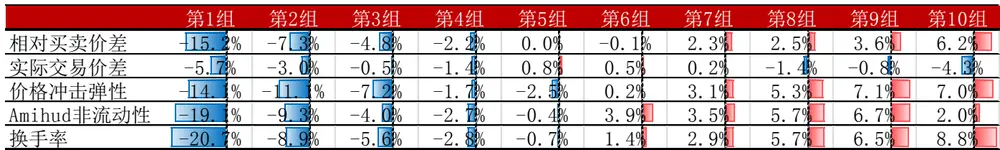
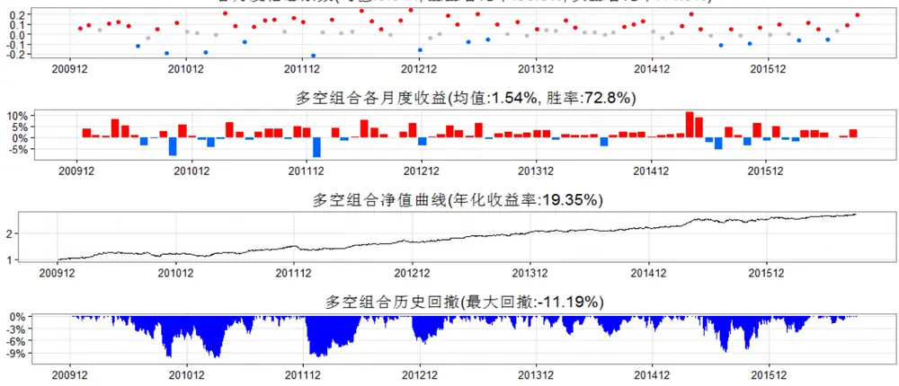
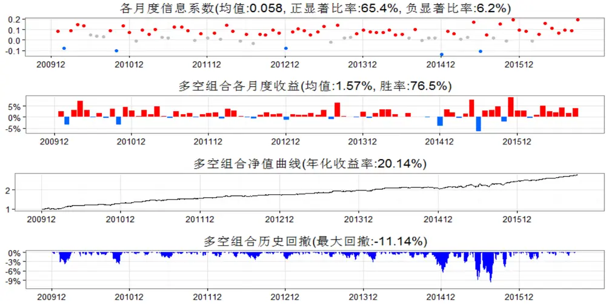
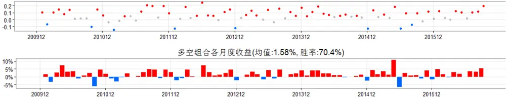
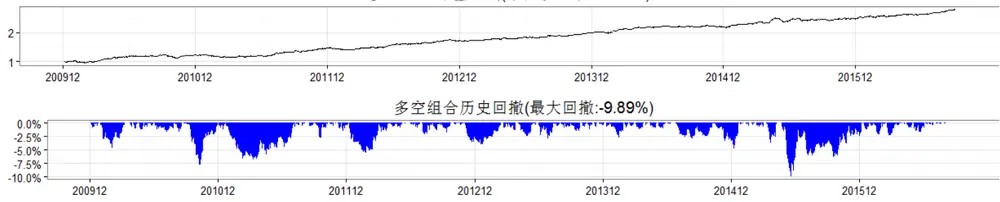
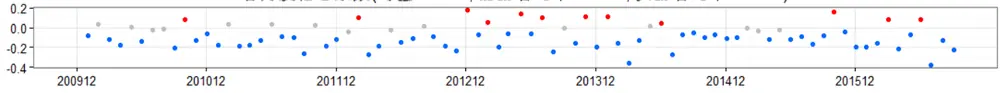
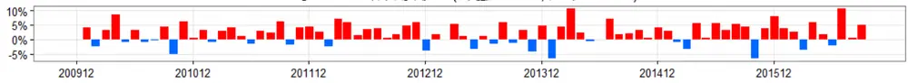
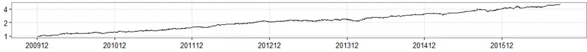
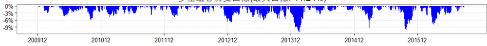

## 研究结论

流行差的股票有横截面溢价，但非流行性本身不能被直接观测，其一方面表示交易者若想立即成交必须对股价做出的让步，另一方面是单位主动订单对股价的冲击。

我们参考学术界的研究和投资界的习惯，选择了相对买卖价差（PercentQuoted Spread）、实际交易价差（Percent Effective Spread）、价格冲击弹性（Lambda）三个指标作为非流动性指标的微观度量，同时以 Amihud（2002）提出的 ILLIQ和换手率作为非流动性的低频代理变量。

通过考察各个非流动性因子的 alpha 属性，我们发现在风格中性下除实际交易价差外的其他非流动性指标均有预测横截面收益的能力，其中价格冲击弹性稳定性最高，IC_IR高达 3.15（年化），多空夏普比2.22，仅就超额收益大小而言，换手率和 Amihud非流动性表现最好。

相关系数和因子分层的结果显示，Amihud 非流动性与相对买卖价差、价格冲击弹性指标相关性高，在一定程度上可以作为其代理变量，换手率相对非流动性的微观度量指标较为独立；各类非流动性指标（换手率除外）和特异度、换手率等的关系不大。

通过回归分析，我们发现 Amihud 非流动性和换手率可以完全解释相对买卖价格，但不能完全解释价格冲击弹性，而且 Amihud 非流动性和换手率相对几个微观度量指标有额外的超额收益源。

- 换手率具有投机性泡沫和非流动性双重属性，而且可以被这两个维度的因子完全解释。

## 风险提示

- 流动性差的股票冲击成本较高，使用非流动性指标选股时需引起注意。

- 本文的研究成果基于历史数据，如果未来风格发生重大变化，部分规律可能失效。

报告发布日期2016 年 11 月 02 日

证券分析师朱剑涛

021-63325888*6077

zhujiantao@orientsec.com.cn

执业证书编号：S0860515060001

021-63325888-6108

wangxingxing@orientsec.com.cn

## 相关报告

| Alpha 预测 | 2016-10-25 |
| --- | --- |
| 线性高效简化版冲击成本模型 | 2016-10-21 |
| 资金规模对策略收益的影响 | 2016-08-26 |
| Alpha 因子库精简与优化 | 2016-08-12 |
| 日内残差高阶矩与股票收益 | 2016-08-12 |
| 动态情景多因子 Alpha 模型 | 2016-05-25 |
| 投机、交易行为与股票收益（下） | 2016-05-12 |

非流动性因子综合表现（风格中性，200912-201609）

|  | RankIC |  |  |  | 多空组合 |  |  |  |
| --- | --- | --- | --- | --- | --- | --- | --- | --- |
|  | 均值 t值 | IC_IR | 正显著比率 | 负显著比率 | 年化收益率 | 夏普比 | 月胜率 | 最大回测 |
| 相对买卖价差 | 0.044 4.10 | 1.58 | 50.6% | 14.8% | 19.3% | 1.54 | 72.8% | -11.2% |
| 实际交易价差 | -0.005 -0.54 | -0.21 | 30.9% | 29.6% | -1.6% | -0.11 | 45.7% | -31.6% |
| 价格冲击弹性 | 0.058 8.17 | 3.15 | 65.4% | 6.2% | 20.1% | 2.22 | 76.5% | -11.1% |
| Amihud非流动性 | 0.061 6.53 | 2.51 | 59.3% | 9.9% | 20.2% | 1.99 | 70.4% | -9.9% |
| 换手率 | -0.086 -6.62 | -2.55 | 14.8% | 66.7% | 27.4% | 2.02 | 71.6% | -11.2% |

## 一、非流动性的微观度量

流动性溢价现象已经被海内外投资者充分的注意到，但股票的非流动性本身是个十分隐晦的概念，其包括多层含义，而且不能被直接观测。一方面非流动性表示交易者若想当前立即成交必须对股价做出的让步，即买卖价差，另一方面，非流动性度量了单位主动订单流对股价的冲击。因为流动性直接涉及买卖价差和订单冲击，所以理论上非流动性的度量最好从微观交易数据（Tick andQuote）出发，本文选择最简单和直观的相对买卖价差（Percent Quoted Spread）、实际交易价差（Percent Effective Spread）、价格冲击弹性（Lambda）三个指标作为流动性指标的微观度量。

## 1. 相对买卖价差

相对买卖价差是十分直观的概念，其度量的是若要立即成交，在股价上必须做出的让步。某一股票在时间区间 s 的相对买卖价差（Percent Quoted Spread）定义如下：

$$
PercentEffectiveSpread_{s}=\left(Ask_{s}-Bid_{s}\right)/\left(\left(Ask_{s}+Bid_{s}\right)/2\right)
$$

其中， $Ask_{s}$ 为时间区间 s 的卖 1 价， $Bid_{s}$ 为买 1 价。月度的相对买卖价差为当月各个时间区间的相对买卖价差的交易时间长度加权。

需要注意的是，由于买卖价差 $Ask_{s}-Bid_{s}$ 只能取值 0.01 的整数倍，相对买卖买卖价差受股票绝对价格水平的影响较大，对于流动性较好的股票和低价股尤其如此。

## 2. 实际交易价差

相对买卖价差从时间维度上看买卖价差大小，实际交易价差从实际每笔的成交上看买卖价差的大小。某一股票第 k笔成交的买卖价差定义为：

$$
PercentEffecti\nu eSpread_{k}=2D_{k}\left(\ln(P_{k})-\ln(M_{k})\right)
$$

其中， $D_{k}$ 为示性函数，当该笔交易为主动买入时记+1，主动卖出时记-1，买卖方向根据 Leeand Read (1991) 算法判断， $P_{k}$ 为该笔交易的成交价， $M_{\scriptscriptstyle k}$ 的此时买 1 价和买一价的均值。月度的实际交易价差为该月每笔交易的实际交易价差根据每笔交易的成交额加权。

和相对买卖价差类似，实际交易价差受股票价格影响较大，后期分析需要做相应调整。

## 3. 价格冲击弹性

我们沿用 Hasbrouck(2006)和 Goyeneko, Holden, and Trzcinka(2009)的算法，定义价格冲击弹性 $\lambda$ 为如下回归方程的系数：

$$
r_{n}=\lambda\cdot S_{n}+\mu_{n}
$$

其中，对于第 n 个 5 分钟线， $r_{n}$ 为股票收益率， $S_{n}$ 为 5 分钟区间内的主动订单冲击，具体为， $S_{n}=\sum_{k}Sign(\nu_{_{kn}})\cdot\sqrt{|\nu_{_{kn}}|}$ $\nu_{_{kn}}$ 为第 5 个 5 分钟内第 k 笔成交的成交额（主动买入取正，主动卖出取负）， $\mu_{n}$ 为误差项。月度的价格冲击弹性为利用当月所有的 5分钟数据回归上述方程得到的系数项。

另外，在学术研究中私有信息比例 PIN和 VPIN也经常用来作为非流动性的代理变量，但 PIN和 VPIN度量的是买卖单信息流的对称性，表征的是交易中的私有信息占比，并非直接的价格冲击，本文并没有将其作为流动性的微观度量。（如若对其敢兴趣或有疑问请与报告联系人联系。）

## 二、非流动性的低频代理变量

虽然基于微观交易结构度量的非流动指标指标逻辑简单明了，可靠性相对较高，但由于高频数据可获得性差，处理难度相对较大， 基于低频数据计算非流动性的代理变量也受到国内外学者的高度重视，相关的研究也相对丰富。国内外学术界已经提出了多种非流动性的代理指标，例如Roll（1984）提升的 Roll 指标，Lesmond, Ogden, and Trzcinka (1999)，提出的 LOT 和 Zeros，Holden（2007）提出的 Effective Tick 和 Holden 指标以及 Fong, Holden, Trzcinka(2011)年提出的FHT。非流动性的低频代理指标如此之多，我们很难在报告中一一分析，在本篇报告中，我们主要讨论学术界和投资界认可度较高的 Amihud（2002）ILLIQ指标和月均换手率。

## 1. Amihud ILLIQ

Amihud（2002）在研究股票非流动性和未来收益的关系时提出了后来被广为接受的非流动性度量方法：

$$
AmihudILLIQ=A\nu erage(\mid r_{t}\mid/Volume_{t})
$$

其中， $r_{t}$ 为股票在 t 日的涨跌幅， $Volume_{t}$ 为 t 日的成交额，月度的 Amihud ILLIQ 为股票每日涨跌幅绝对值与成交额之比的月度简单平均。

Amihud ILLIQ捕捉的是股票单位的成交额对股价的冲击，逻辑上和价格冲击弹性接近，不过一个是区分了买卖方向，一个没有方向判断。但上述算法两点需要说明：1.开盘价相对于前收盘价的涨跌幅更多的是反映了夜间的信息变化，跟流动性冲击关联不大；2.股票日内价格走势有起伏，单纯的涨跌幅只是股价日内波动的近似。

## 2. 换手率

换手率我们在前期的专题报告《投机、交易行为与股票收益（上）》也有过研究，当时注意将换手率用作投机性泡沫的一个度量角度，但换手率具有双重属性，除了度量投机性泡沫还是股票流动性的一个重要参考，股票在过去一段时间换手率较高，意味着区间成交量大，单位成交对股价的冲击就较小。我们通过如下方式度量换手率：

$$
Turno\nu er=A\nu erage(Volume\mathrm{~/~}FloatShares_{t})
$$

其中， $Volume_{t}$ 表示股票在 t 日的成交量，FloatShares 表示 t 日的流通股本。月度的换手率为当月各交易日换手率的简单平均。

## 三、非流动性因子的横截面溢价

市场一般对流动性相对较差的股票有一定溢价，也就是学术界和业内常说的“流动性溢价”。因此，在业内非流动性因子也常用来作为 alpha因子，本章主要目的就是考察各个非流动性因子对横截面收益的预测能力。

由于非流动性的取值受风格尤其是市值的影响较大，同时为了考察因子在风格中性下的表现，我们在检验因子之前均做了风格中性化处理，具体处理方法如下：

在每个月底的横截面上回归一下方程：

$$
F_{i}=const+\beta_{M}\cdot ln(MktVal_{i})+\sum_{j=1}^{N}\beta_{I,j}\cdot Ind_{j,i}+\varepsilon_{i}
$$

其中， $F_{i}$ 为当月股票 i的非流动性因子（由于大多数非流动性因子分布与正太相差较大，我们在回归之前对因子进行了取根号或取对数处理。）， $MktVal_{i}$ 为股票总市值， $Ind_{j,i}$ 为行业虚拟变量（中信一级）。

用上述回归方程的残差项作为相应的风格中性因子代理变量，考虑到相对买卖价差和实际交易价差两个因子受股票的价格影响较大，我们在做风格中性化处理时，回归项也加入了当月均价的对数，以此剔除股价对买卖价差的影响。下文中因子表现和相关性分析中涉及的因子均是风格中性下的非流动性因子。

在本章中，我们利用传统的 IC和分组检验的方法检验各非流动性因子的有效性，关于因子检验的细节，有必要进行一些说明：

（1） 因子检验区间为 2009 年 12 月 31 日至 2016 年 9 月 30 日；

（2） 样本空间为同时期的中证全指成分股，避免了新股的影响和退市带来的幸存者偏误（survivor bias）；

（3）每个月计算当月因子值和次月收益率的 spearman相关系数，各月底的均值我们称之为 Rank IC 均值，均值与标准差之比年化后的取值我们称之为 IC_IR，同时考察各月 IC的正/负显著比率；

（4） 分组检验时，我们每月底将样本空间中的所有股票按因子取值从小到大分为 10 组，等权构建组合，以市场等权作为基准，考察各分组的表现。

从各个非流动性因子 RankIC和多空组合的综合表现来看（表 1），除实际交易价差外，其他非流动性因子对股票的横截面收益都有一定的预测能力，这也说明“流动性溢价”现象在 A 股市场也存在。多个非流动性因子中价格冲击弹性的稳定性最高，这一点从因子RankIC的t值、IC_IR，正负显著比率以及多空组合的夏普比、月胜率和最大回测等多个角度都可以看出；单从收益的角度来看，换手率因子表现最佳，换手率因子的RankIC均值高达-0.086，多空组合年化收益率27.4%。

表 1：各非流动因子综合表现

|  | RankIC |  |  |  |  | 多空组合 |  |  |  |  |
| --- | --- | --- | --- | --- | --- | --- | --- | --- | --- | --- |
|  | 均值 | t值 | IC IR | 正显著比率 | 负显著比率 | 年化收益率 | 夏普比 |  | 月胜率 | 最大回测 |
| 相对买卖价差 | 0.044 | 4.10 | 1.58 | 50.6% | 14.8% | 19.3% |  | 1.54 | 72.8% | -11.2% |
| 实际交易价差 | -0.005 | -0.54 | -0.21 | 30.9% |  | 29.6% | -1.6% | -0.11 | 45.7% | -31.6% |
| 价格冲击弹性 | 0.058 | 8.17 | 3.15 | 65.4% |  | 6.2% | 20.1% | 2.22 | 76.5% | -11.1% |
| Amihud非流动性 | 0.061 | 6.53 | 2.51 | 59.3% |  | 9.9% | 20.2% | 1.99 | 70.4% | -9.9% |
| 换手率 | -0.086 | -6.62 | -2.55 | 14.8% |  | 66.7% | 27.4% | 2.02 | 71.6% | -11.2% |

数据来源：wind 咨询、东方证券研究所

从各因子分组的年化超额收益来看，各类非流动性因子的超额收益主要体现在空头端，在缺乏个股做空机制的 A股，这部分超额很难获取，另外，Amihud非流动性因子取值最大的组合超额收益并非最高，而次高组合表现更好。

表 2：各非流动性因子分组超额收益（相对市场等权）

数据来源：wind 咨询、东方证券研究所

从各非流动性因子表现的历史序列来看，各因子在 2015 年股灾前后回测都较大，从回测的时序形态来看，相对买卖价差和 Amihud 非流动性较为接近。

图 1：相对买卖价差历史表现回溯
各月度信息系数(均值:0.044，正显著比率:50.6%，负显著比率:14.8%)

数据来源：wind 咨询、东方证券研究所

图 2：价格冲击弹性历史表现回溯

数据来源：wind 咨询、东方证券研究所

图 3：Amihud 非流动性指标历史表现回溯

各月度信息系数(均值:0.061.正显著比率:59.3%，负显著比率:9.9%)

多空组合净值曲线(年化收益率:20.18%)

数据来源：wind 咨询、东方证券研究所

## 图 4：月均换手率历史表现回溯

各月度信息系数(均值：-0.086，正显著比率:14.8%，负显著比率:66.7%)

多空组合各月度收益(均值:2.10%，胜率:71.6%)

多空组合净值曲线(年化收益率:27.36%)

多空组合历史回撤(最大回撤:-11.24%)

数据来源：wind 咨询、东方证券研究所

## 四、相关性结构

经过前文的分析，我们知道非流动性因子的确对股票未来的收益率有一定的预测能力，然而不同的非流动性因子仅是从不同的角度度量同一个概念，相互之间必然有很高的信息重叠， 通过分析各个非流动性因子间的相互关系，能够帮助我们了解因子间的相互替代关系，也有助于我们更有效的选取 alpha因子构建模型。

我们主要通过各因子值和 IC间的秩相关系数、因子分层后多空组合的表现分析两个因子的关系，通过回归的方法考察多个因子对某个因子的解释作用。需要提醒的是，下文中提及的所有因子（市值对数除外）已做行业、市值中性化处理。

## 1. 秩相关系数

通过分析各个因子取值和 IC 的秩相关系数（表 3、表 4），我们有如下发现：

（1）相对买卖价差和价格冲击弹性相对较为独立。两个基于微观度量的非流动性因子度量的是非流动性的两个维度，相互之间相关性较弱；

（2）Amihud非流动性可以作为相对买卖价差和价格冲击弹性的低频代理变量。Amihud非流动性和扩展的 Amihud 和两个微观度量的非流动性因子相关性大，IC 表现一致，在微观度量不可获得的情况下可以作为其代理变量；

（3）换手率因子和非流动性的两个微观度量关系不大，反而和 Amihud非流动性高度相关。这可能和因子自身的度量有关，换手率和 Amihud非流动性都受成交量/额影响。

（4）非流动性因子（换手率除外）和特异度、反转关系不大。尤其换手率的双重属于，换手率也是投机性泡沫的一个度量，这一点和特异度关联，所以两者之间有一定信息重叠。

表 3：各因子取值的秩相关系数

|  | 市值对数 | 特异度 | 月收益率 | 相对买卖价差 |  | 价格冲击弹性Amihud非流动性 | 月均换手 |
| --- | --- | --- | --- | --- | --- | --- | --- |
| 市值对数 | 1.000 | 0.013 | -0.006 | -0.032 | -0.028 | -0.033 | 0.002 |
| 特异度 | 0.013 | 1.000 | 0.318 | 0.059 | -0.010 | -0.078 | 0.255 |
| 月收益率 | -0.006 | 0.318 | 1.000 | 0.105 | 0.056 | 0.009 | 0.159 |
| 相对买卖价差 | -0.032 | 0.059 | 0.105 | 1.000 | 0.325 | 0.543 | -0.359 |
| 价格冲击弹性 | -0.028 | -0.010 | 0.056 | 0.325 | 1.000 | 0.557 | -0.332 |
| Amihud非流动性 | -0.033 | -0.078 | 0.009 | 0.543 | 0.557 | 1.000 | -0.481 |
| 月均换手 | 0.002 | 0.255 | 0.159 | -0.359 | -0.332 | -0.481 | 1.000 |

数据来源：wind 咨询、东方证券研究所

表 4：各因子 RankIC 的秩相关系数

|  | 市值对数 | 特异度 | 月收益率 |  |  | 相对买卖价差 价格冲击弹性 Amihud非流动性 | 月均换手 |
| --- | --- | --- | --- | --- | --- | --- | --- |
| 市值对数 | 1.000 | -0.095 | 0.013 | 0.151 | -0.185 | -0.035 | -0.296 |
| 特异度 | -0.095 | 1.000 | 0.527 | 0.328 | 0.131 | 0.128 | 0.194 |
| 月收益率 | 0.013 | 0.527 | 1.000 | 0.509 | 0.116 | 0.225 | 0.033 |
| 相对买卖价差 | 0.151 | 0.328 | 0.509 | 1.000 | 0.323 | 0.685 | -0.551 |
| 价格冲击弹性 | -0.185 | 0.131 | 0.116 | 0.323 | 1.000 | 0.634 | -0.328 |
| Amihud非流动性 | -0.035 | 0.128 | 0.225 | 0.685 | 0.634 | 1.000 | -0.510 |
| 月均换手 | -0.296 | 0.194 | 0.033 | -0.551 | -0.328 | -0.510 | 1.000 |

数据来源：wind 咨询、东方证券研究所

## 2. 因子分层

研究因子两两之间的替代作用，另一个比较常见的方法是因子分层的做法，具体做法如下：在每个月底按分层因子大小将样本空间内的股票分为 10层，再在每一层内按分组因子的大小排序，选取每一层内分组因子最小的 1/10股票作为第 1组（top组合），以此类推，每层内分组因子最大 1/10股票作为第 10组（bottom 组合），然后比较做多 top组合做空 bottom组合的多空组合月均收益率及其显著性。

通过分析因子分层前后多空组合收益率的变化，我们有如下发现：

（1）各个非流动性因子两两之间都有一定的解释作用。从广义上讲，各个因子度量的都是非流动性，只是角度不同，所以经过一个因子分层后，另一个因子具有明显回落；

（2）非流动因子和特异度、反转等因子相对独立，换手率除外。

表 5：因子分层多空组合月均收益率（%）

| 市值对数 特异度 | 月收益率 相对买卖价差 价格冲击弹性 |  |  |  |  |  |  |  |  |
| --- | --- | --- | --- | --- | --- | --- | --- | --- | --- |
| 层 | 不分层 | 3.25 | 2.34 | 2.46 |  | -1.53 | -1.56 | Amihud非流动性 -1.52 | 月均换手 2.32 |
|  | 市值对数 | 0.43 | 2.29 | 2.35 |  | -1.29 | -1.49 | -1.70 | 2.26 |
|  | 分特异度 | 3.10 | 0.23 | 1.77 |  | -1.60 | -1.47 | -1.49 | 1.68 |
|  | 月收益率 | 3.06 | 1.55 | 0.24 |  | -1.64 | -1.59 | -1.63 | 1.85 |
|  | 因相对买卖价差 | 3.03 | 2.46 | 2.67 |  | -0.03 | -1.28 | -1.21 | 1.94 |
|  | 子价格冲击弹性 | 3.12 | 2.34 | 2.59 |  | -0.86 | -0.02 | -0.86 | 1.77 |
|  | Amihud非流动性 | 3.00 | 2.17 | 2.51 |  | -0.68 | -0.89 | -0.53 | 1.53 |
|  | 月均换手 | 3.14 | 1.88 | 1.82 | -1.00 |  | -0.87 | -0.93 | 0.40 |

数据来源：wind 咨询、东方证券研究所

## 3. 回归分析

无论是相关系数还是分层的分析，都只能分析两个因子间的相互关系和替代作用，所以我们引入了回归的方法来考察控制了某些因子之后原因子的表现，具体做法如下：

在每个横截面上用因子 F 对控制变量因子回归，取其残差项，考察残差因子的选股表现，以此作为因子 F在控制控制变量因子后的表现。

通过分析非流动性因子在控制某些变量后的表现（表 6），我们发现：

（1）Amihud非流动性和换手率因子可以完全替代相对买卖价差，但不能完全替代价格冲击弹性（lambda）。Amihud 非流动性因子和换手率虽然和价格冲击弹性相关性高，但在控制了它们之后，价格冲击弹性依然十分显著【式（2）】，说明价格冲击弹性有存在的必要性，而同样的条件下，相对买卖价差已变得不显著【式（1）】。

（2）Amihud非流动性和换手率相对于流动性的微观度量指标有额外的超额收益来源。在控制了相对买卖价差和价格冲击弹性后，Amihud非流动性和换手率依然有显著的未来收益预测能力【式（3）、（4）】。

（3）Amihud非流动性的超额收益来源和特异度、换手率关系不大。在控制换手率或者特异度之后，Amihud 预测超额收益的能力依然显著【式（5）、（6）】。

（4）换手率可以被投机性泡沫和非流动性两个维度完全解释。换手率因子在控制特异度和其他非流动性因子的度量后已完全失效【式（7）、（8）】。

表 6：控制多个因子后的残差表现

| 控制变量 |  |  |  |  | 残差表现 |  |  |  |  |  |
| --- | --- | --- | --- | --- | --- | --- | --- | --- | --- | --- |
|  |  | 特异度 买卖价差 Lambda A |  | Amihud 换手 | RankIC | t值IC | IC IR | LS Ret LS SR |  |  |
| （1） 买卖价差 |  |  |  | √ | √ | 0.007 | 0.58 0.06 | 6.1% |  | 0.65 |
| (2) Lambda |  |  |  | √ | √ | 0.049 | 4.83 | 0.54 | 11.8% | 1.61 |
| (3) Amihud |  | √ | √ |  |  | 0.045 | 4.71 | 0.52 | 15.5% | 1.79 |
| (4) 月均换手 |  | √ | √ |  |  | -0.041 | -2.26 -0.25 |  | 6.9% | 0.29 |
| (5) Amihud |  | √ | √ |  | √ | 0.046 | 4.80 | 0.53 | 15.7% | 1.89 |
| (6) Amihud | √ | √ | √ |  |  | 0.038 | 3.87 | 0.43 | 13.6% | 1.58 |
| (7) 月均换手 | √ | √ | √ |  |  | -0.023 | -1.28 | -0.14 | 2.6% | 0.05 |
| (8) 月均换手 | √ |  |  | √ |  | -0.026 | -1.30 | -0.14 | -2.6% | -0.03 |

数据来源：wind 咨询、东方证券研究所

## 五、总结

近年来国内外投资者已经充分意识到了流动性溢价现象，但流动性的度量方法没有达成共识，我们参考国内外的学术研究成果和业内的习惯，选择了相对买卖价差、实际交易价差、价格冲击弹性、Amihud非流动性、换手率等多个维度度量非流动性。研究发现，除实际交易价差外其他因子均有预测横截面收益的能力，进一步分析其相关性结构，我们发现，价格冲击弹性和 Amihud非流动性信息源相对独立，换手率具有投机性泡沫和非流动性双重属性，而且可以被这两个维度的因子完全解释。

## 风险提示

流动性差的股票冲击成本较高，使用非流动性指标选股时需引起注意。

本文的结论基于对历史数据的研究，如果未来市场风格发生重大变化，部分规律可能会失效，另外高的预期超额收益并不代表 100%的胜率，市场有风险，投资需谨慎。

## 参考文献

[1]. Amihud Y. Illiquidity and stock returns[J]. Journal of Financial Markets, 2002(3).

[2]. Joel Hasbrouck. Trading Costs and Returns for US Equities: The Evidence from Daily Data[J]. Ssrn Electronic Journal, 2005.

[3]. 张峥, 刘力. 换手率与股票收益:流动性溢价还是投机性泡沫?[C]// 经济学.2006:871-892.

[4]. Goyenko R Y, Holden C W, Trzcinka C A. Do liquidity measures measure liquidity? ☆[J]. Journal of Financial Economics, 2009, 92(2):153-181.

[5]. Fong K Y L, Holden C W, Trzcinka C. What Are the Best Liquidity Proxies for Global Research?[J]. Ssrn Electronic Journal, 2016.

## 分析师申明

每位负责撰写本研究报告全部或部分内容的研究分析师在此作以下声明：

分析师在本报告中对所提及的证券或发行人发表的任何建议和观点均准确地反映了其个人对该证券或发行人的看法和判断；分析师薪酬的任何组成部分无论是在过去、现在及将来，均与其在本研究报告中所表述的具体建议或观点无任何直接或间接的关系。

## 投资评级和相关定义

报告发布日后的 12个月内的公司的涨跌幅相对同期的上证指数/深证成指的涨跌幅为基准；

## 公司投资评级的量化标准

买入：相对强于市场基准指数收益率15%以上；

增持：相对强于市场基准指数收益率5%～15%；

中性：相对于市场基准指数收益率在-5%～+5%之间波动；

减持：相对弱于市场基准指数收益率在-5%以下。

未评级——由于在报告发出之时该股票不在本公司研究覆盖范围内，分析师基于当时对该股票的研究状况，未给予投资评级相关信息。

暂停评级——根据监管制度及本公司相关规定，研究报告发布之时该投资对象可能与本公司存在潜在的利益冲突情形；亦或是研究报告发布当时该股票的价值和价格分析存在重大不确定性，缺乏足够的研究依据支持分析师给出明确投资评级；分析师在上述情况下暂停对该股票给予投资评级等信息，投资者需要注意在此报告发布之前曾给予该股票的投资评级、盈利预测及目标价格等信息不再有效。

## 行业投资评级的量化标准：

看好：相对强于市场基准指数收益率5%以上；

中性：相对于市场基准指数收益率在-5%～+5%之间波动；

看淡：相对于市场基准指数收益率在-5%以下。

未评级：由于在报告发出之时该行业不在本公司研究覆盖范围内，分析师基于当时对该行业的研究状况，未给予投资评级等相关信息。

暂停评级：由于研究报告发布当时该行业的投资价值分析存在重大不确定性，缺乏足够的研究依据支持分析师给出明确行业投资评级；分析师在上述情况下暂停对该行业给予投资评级信息，投资者需要注意在此报告发布之前曾给予该行业的投资评级信息不再有效。

## 免责声明

本证券研究报告（以下简称“本报告”）由东方证券股份有限公司（以下简称“本公司”）制作及发布。

本报告仅供本公司的客户使用。本公司不会因接收人收到本报告而视其为本公司的当然客户。本报告的全体接收人应当采取必要措施防止本报告被转发给他人。

本报告是基于本公司认为可靠的且目前已公开的信息撰写，本公司力求但不保证该信息的准确性和完整性，客户也不应该认为该信息是准确和完整的。同时，本公司不保证文中观点或陈述不会发生任何变更，在不同时期，本公司可发出与本报告所载资料、意见及推测不一致的证券研究报告。本公司会适时更新我们的研究，但可能会因某些规定而无法做到。除了一些定期出版的证券研究报告之外，绝大多数证券研究报告是在分析师认为适当的时候不定期地发布。

在任何情况下，本报告中的信息或所表述的意见并不构成对任何人的投资建议，也没有考虑到个别客户特殊的投资目标、财务状况或需求。客户应考虑本报告中的任何意见或建议是否符合其特定状况，若有必要应寻求专家意见。本报告所载的资料、工具、意见及推测只提供给客户作参考之用，并非作为或被视为出售或购买证券或其他投资标的的邀请或向人作出邀请。

本报告中提及的投资价格和价值以及这些投资带来的收入可能会波动。过去的表现并不代表未来的表现，未来的回报也无法保证，投资者可能会损失本金。外汇汇率波动有可能对某些投资的价值或价格或来自这一投资的收入产生不良影响。那些涉及期货、期权及其它衍生工具的交易，因其包括重大的市场风险，因此并不适合所有投资者。

在任何情况下，本公司不对任何人因使用本报告中的任何内容所引致的任何损失负任何责任，投资者自主作出投资决策并自行承担投资风险，任何形式的分享证券投资收益或者分担证券投资损失的书面或口头承诺均为无效。

本报告主要以电子版形式分发，间或也会辅以印刷品形式分发，所有报告版权均归本公司所有。未经本公司事先书面协议授权，任何机构或个人不得以任何形式复制、转发或公开传播本报告的全部或部分内容。不得将报告内容作为诉讼、仲裁、传媒所引用之证明或依据，不得用于营利或用于未经允许的其它用途。

经本公司事先书面协议授权刊载或转发的，被授权机构承担相关刊载或者转发责任。不得对本报告进行任何有悖原意的引用、删节和修改。

提示客户及公众投资者慎重使用未经授权刊载或者转发的本公司证券研究报告，慎重使用公众媒体刊载的证券研究报告。

## 东方证券研究所

地址：上海市中山南路 318 号东方国际金融广场 26 楼

联系人： 王骏飞

电话：021-63325888*1131

传真：021-63326786

网址： www.dfzq.com.cn

Email： wangjunfei@orientsec.com.cn