## 研究结论

机器学习容易给人“黑箱模型”和“过拟合”的印象，但事实上一些机器学习算法的逻辑和结果都非常直白，而且算法自身带有一套避免过拟合的参数估计机制。众多的实践研究说明，机器学习方法的预测能力大部分情况下都强于线性模型，很值得在量化投资中测试使用。本报告主要讲述机器学习的基本原理和用其来做量化选股的实证结果。

机器学习模型众多，不存在所谓的最强模型，不同的数据，不同的问题适用不同的模型。我们测试了 LASSO、SVM、增强型决策树、随机森林等几种常见机器学习方法，最终选择用随机森林，主要是因为它结构简单、参数少、过拟合概率低，同时还具有非常强的样本外预测能力。

机器选股模型省去了“因子筛选”、“因子加权”和“ZSCORE 转收益率”这三个步骤，直接通过随机森林做回归，由alpha 因子来预测收益率。需要说明的是，决策树本身也可以用来做变量筛选，但是我们并没有把这一步交给机器，而是仍然保留了“因子 IC 检验”这个步骤，保证随机森林的输入变量确确实实是符合我们传统意义的alpha 因子；如果把很多没有选股效用的因子混在一起作为输入变量，会导致数据噪音过大，产生“ Garbage in,Garbage out” 的问题，降低模型的预测能力。

- 实证结果显示，和传统 alpha 因子 IC_IR 加权方法相比，随机森林模型得到的多空组合收益率和稳健性都更高，处理alpha 因子间信息重叠的效果要比我们之前报告提出的线性方法好。

## 风险提示

- 量化模型失效风险

- 市场极端环境的冲击

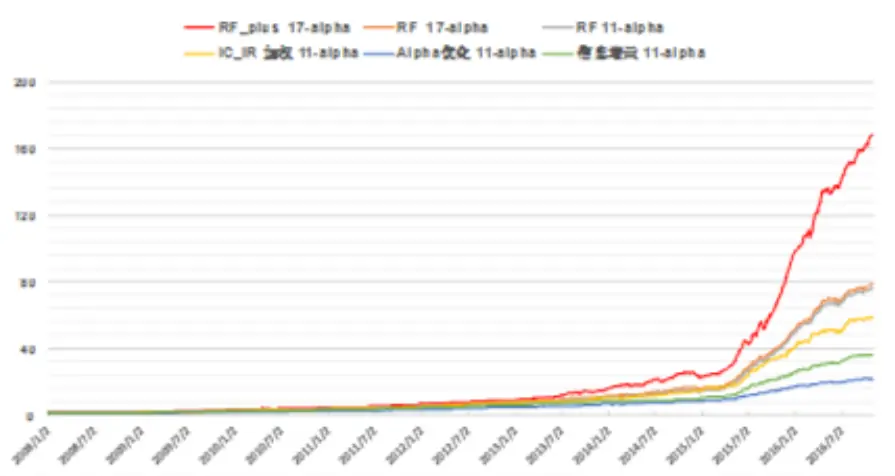

报告发布日期2016 年 11 月 07 日

证券分析师 朱剑涛

021-63325888*6077

zhujiantao@orientsec.com.cn

执业证书编号：S0860515060001

相关报告

| 非流动性的度量及其横截面溢价 | 2016-11-02 |
| --- | --- |
| Alpha 预测 | 2016-10-25 |
| 线性高效简化版冲击成本模型 | 2016-10-21 |
| 资金规模对策略收益的影响 | 2016-08-26 |
| Alpha 因子库精简与优化 | 2016-08-12 |
| 日内残差高阶矩与股票收益 | 2016-08-12 |
| 动态情景多因子 Alpha 模型 | 2016-05-25 |

## 一、机器学习简介

## 1.1 常见机器学习方法

机器学习（ML，Machine Learning）涵盖一大类算法，我们这里的讨论只针对适用于金融数据预测的常用有监督型机器学习（Supervised ML）算法。假设我们要去预测某个连续变量 Y未来的取值（例如，个股未来一个月的收益率），并找到了影响变量 Y取值的K 个变量 $(\mathrm{X}_{1},\mathrm{X}_{2}\cdots\mathrm{X}_{K})$ 这些变量也称为特征变量（Feature Variable）。ML 即是要找到一个拟合函数 $\operatorname{f}(\mathrm{X}_{1},\mathrm{}X_{2}\cdots X_{K}|\Theta)$ 去描述 Y和特征变量之间的关系， 为这个函数的参数。

要找到这样的函数，必须要足够量的观测数据，假设有 N 个样本数据 $\{y_{1},y_{2}\cdots y_{N}\}$ 和$\{\left(\mathrm{x}_{1,\mathrm{i}},\boldsymbol{x}_{2,i},\cdots\boldsymbol{x}_{K,i}\right),i=1,2\ldots N\}$ 。然后定义一个二元函数 来衡量真实观测数据和模型估计数据的偏差，函数 L 也称作损失函数（Loss Function）。基于历史观测数据，我们可以求解下列的最优化问题来得到参数 的估计值

$$
\widehat{\Theta}=\arg\operatorname*{min}_{\Theta}\sum_{i=1}^{N}L(y_{i},f(\mathrm{x_{1,i}},x_{2,i},\cdots x_{K,i}))\quad\cdots\cdots\ :\ :(1.1)
$$

求解过程称作模型训练（Model Traing）。基于特征变量的最新观测值和训练出来的模型参数就可以预测 y的数值。不同机器学习方法的差别在于函数 和 的选择，同时还会给上述优化问题加上限制条件避免模型过拟合，不同的选择需要不同的算法来求解。

我们报告这一章主要介绍几种常用ML模型的基本形式以及论述为什么 ML做预测效果更优的原理，详细的数理推导，建议投资者参阅 Hastie（2008）的经典教科书。

## 1.1.1 线性模型

如果采用线性拟合函数 $\mathrm{f}(\mathrm{X}_{1},\mathrm{}\mathrm{}_{1}\mathrm{}\mathrm{}\mathrm{}\mathrm{}\mathrm{}\cdots\mathrm{}\mathrm{}\mathrm{}X_{K}|\Theta)=a_{0}+a_{1}X_{1}+a_{2}X_{2}+\cdots a_{K}X_{K}$ 和二次损失函数$\operatorname{L}({\mathrm{a}},{\mathrm{b}})=({\mathrm{a}}-{\mathrm{b}})^{2}$ ，上述优化问题就变成了最常用的 OLS 线性回归。我们在上篇报告中就是采用简单的一元回归将 alpha 因子的zscore 转换为预测收益，线性模型的好处在于结构简单，可以基于此发展出完善的资产定价模型和风险分析工具，在 A 股实际使用下来效果也非常好，不比复杂的非线性模型差多少。但缺点是对于因子间共线性处理、变量选择效果一般。现在通行的做法是通过不同 alpha 因子的 IC 相关性分析，进行分类或正交化处理，因子数据预加工后再输入到回归模型中，这里面人为的主观因素会比较多。投资者可以尝试一些带压缩控制的线性模型，如 RidgeRegression，LASSO等，用数理手段处理问题，提升模型预测能力。

## 1.1.2 决策树模型

决策树（CART，Classification and Regression Tree）应该是一种结果最易于理解的机器学习模型，和很多投资者采用的因子逐步筛股法的思考方式很像。假设有两个特征变量 $\mathrm{X}_{1}\mp\sqcup\mathrm{X}_{2},\ -$ 个训练好的决策树模型可能是图1 的树状结构，它可以表示成一系列的二维示性函数的和

$$
\operatorname{f}(\mathrm{X}_{1},\mathrm{X}_{2})=\sum_{k=1}^{5}a_{k}\cdot1_{\{(\mathrm{X}_{1},\mathrm{X}_{2})\in A_{k}\}}
$$

其中 $\{\mathrm{A_{k}},k=1,2,3,4,5\}$ 对应图 2 中的矩阵区域。对于更多的特征变量，CART 的拟合函数也可以表示成类似的高维矩形块示性函数的和，这里矩形块的数量、划分点、划分顺序都是函数的参数，

CART 的损失函数也为二次损失函数，优化问题(1.1)的变量同时包含整数和实数，属于混合优化问题，没有显式解和高效的数值算法。因此，实际使用中，用得更多的是一种逐步搜索的贪婪算法寻求次优解（算法步骤参考 Hastie2008），运算效率非常之高。

图 1：二元决策树的树状结构
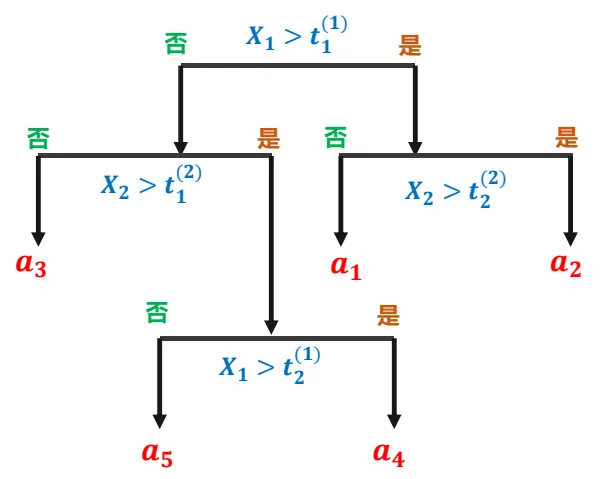
资料来源：东方证券研究所

图2：二元决策树的示性函数表示
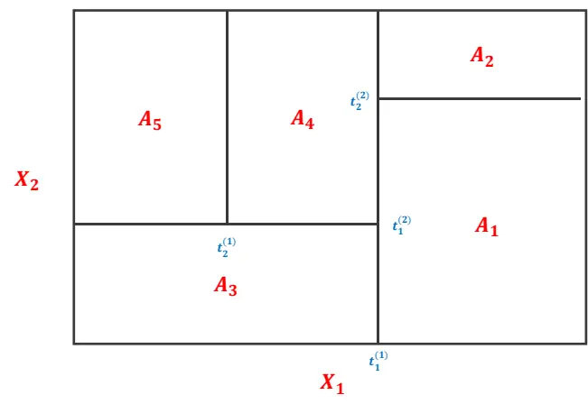
资料来源：东方证券研究所

决策树结构简单，符合人的逻辑思维习惯，而且不受样本异常值影响，计算速度快，在统计学习里属于“白盒（white box）”方法。但是它也有致命缺点：模型数据依赖性强，稳定性低，样本外预测能力差。

图3：传统决策树方法的不稳定性
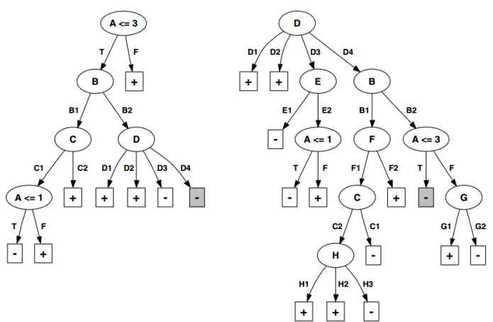
(a) Tree grown from 106 examples
(b) Tree grown from 107 examples
资料来源：东方证券研究所

Fig. 1. Decision trees grown from two subsets of the lymphography dataset that differ in a single training example. The shaded leaf in each tree highlights the only case in which both trees perform the same set of tests when predicting the class label上图是 Dwyer (2007)使用 UCI repository获得的医学数据做的决策树模型训练测试，他们从所有数据中随机抽取了 106 个样本训练出一个 CART（图 3 左），然后再随机加了 1 个样本，对这 107 个样本又训练了一个 CART（图 3 右）。可以直观看到，虽然只相差一个样本，但是两次训练出来的决策树结构完全迥异.

一种改进的方法是设置有关树结构复杂度的限制条件，提前结束模型训练过程，避免过拟合，这种方法相当于对原来的树形结构进行“修剪”，让枝叶上的数据样本变多。但这种方法对模型样本外预测能力的改善非常有限。CART 更多的是来做群体学习（参考第 1.5 节）的基本构成元素，很少单独使用。

## 1.1.3 神经网络

人工神经网络（ANN，Artificial Neural Network）是一种历史悠久的机器学习方法。它用的拟合函数比较特别，先对输入变量的线性组合做非线性转换，得到隐藏层的 M个变量

$$
\mathrm{Z_{m}}=\sigma\big(\alpha_{0,m}+\alpha_{1,m}\cdot X_{1}+\cdots\alpha_{N,m}\cdot\mathrm{X_{K}}\big),m=1,2\ldots M
$$

转换函数最早取得是 Heveside 阶梯函数，来模拟人生理上受到的刺激需要达到一定的量才会产生反应，但这是一个非连续函数，难以求解后续的优化问题，因此现在使用更多的是连续的 sigmoid函数 $\sigma(\mathrm{x})=1/(1+\mathrm{e}^{-\mathrm{x}})$ 或 GRBF（Gaussian Radial Basis Function） $\sigma(\mathrm{x})={\mathrm e}^{-{\mathrm a}\cdot{|\mathbf{x}|}|^{2}}$ 。对于回归问题，最后的输出变量是隐藏层变量的线性组合 $\mathrm{Y}=\beta_{0}+\beta_{1}\cdot Z_{1}+\beta_{2}\cdot Z_{2}+\cdots\beta_{M}\cdot Z_{M}$

图 4：ANN 基本架构
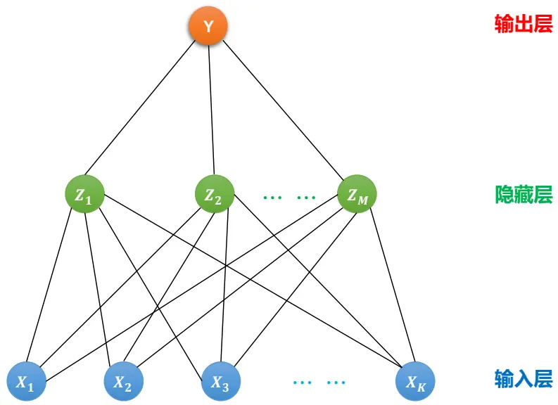
资料来源：东方证券研究所

ANN 同样使用二次损失函数，但它并非直接求解优化问题（1.1），这样会导致过拟合，而是类似于 Ridge Regression 的做法，对模型里面的参数 $\begin{array}{r}{\{\alpha_{\mathrm{i,m}},\beta_{\mathrm{m}},i=0,1,\ldots\mathrm{N,m}=1,.}\end{array}$ 的大小做出限制，让优化求解过程提前结束，提高模型样本外预测能力。

理论上可以证明 ANN 的这种结构可以拟合任意形式的连续函数，增加隐藏层和隐藏层变量的数量可以让模型能够描述更复杂的结构。ANN 的参数数量可以远多于输入变量的个数，因此很容易过拟合，在某些工程问题的样本外表现不如 SVM。近些年，GPU 技术的发展和超大规模服务器并行运算使得复杂结构的神经网络能够在有效时间内完成训练，以 Google AlphaGo 为代表的深度神经网络重回人们视线，不仅在围棋上战胜人类高手，也在许多工程问题的机器学习算法竞赛中摘得桂冠(Schmidhuber2015)。另一方面，网络大数据使得传统 ANN 模型，即使不改进算法，仅靠训练样本数量的大幅提升，效果也能得到显著改善。

## 1.1.4 支持向量机（SVM）

SVM 最早由 Vladimir N. Vapnik 和 Alexey Ya. Chervonenkis 于 1963 年提出，用来做分类，我们这里考察的是其对应的用来解决回归问题的模型 SVR（Support Vector Regression）。SVR先对原始数据做了非线性变换 $\mathrm{h}_{\mathrm{m}}(\cdot)$ ，把数据映射到高维空间，再做回归。其拟合函数可以表示为

$$
\mathrm{f}({\mathrm{X}}_{1},X_{2}\dots X_{K})=\sum_{m=1}^{M}\beta_{m}\cdot h_{m}(X_{1},X_{2},\dots X_{K})+\beta_{0}\quad{\mathrm{m}}=1,2\dots{\mathrm{M}}
$$

损失函数 L(a,b)通常采用下面 形式

$$
\mathrm{L}_{\epsilon}(\mathrm{a},\mathrm{b})=\left\{\begin{array}{c}{{0\qquad if|a-b|<\epsilon}}\\{{|a-b|-\epsilon\quad if|a-b|\geq\epsilon}}\end{array}\right.
$$

优化问题（1.1）需要带上类似 Ridge Regression 或 LASSO 的约束条件或惩罚项。当采用类似Ridge Regression 的二次惩罚项时，优化问题可写作

$$
\operatorname*{min}_{\beta}\sum_{i=1}^{N}L_{\epsilon}(y_{i},f(x_{1},x_{2},\dots x_{K}))+\frac{\lambda}{2}\sum_{m=1}^{M}\beta_{m}^{2}
$$

求解这个优化问题，得到的拟合函数可以写成如下形式

$$
\mathrm{f}\left(\vec{X}\right)=\sum_{i=1}^{N}a_{i}\cdot K(\vec{X},\vec{X_{i}})\ ,\mathrm{K}\left(\vec{X},\vec{Y}\right)=\sum_{m=1}^{M}h_{m}\left(\vec{X}\right)\cdot h_{m}(\vec{Y})
$$

因此 SVR 并没有设定转换函数 $\mathrm{h}_{\mathrm{m}}(\cdot)$ 的形式，而是直接选取不同形式的核函数 ，最常用的核函数有多项式函数和高斯核函数等；系数 $\mathsf{a}_{\mathrm{i}}\neq0$ 的数据样本点称为支持向量。

和 ANN 相比，SVR 的最大优势在于优化问题的求解，SVR 是一个凸优化问题，全局最优解唯一，模型训练速度快，而 ANN 优化问题求解得到的往往是局部解，和算法初始点取值有很大关系，不同初始点可能会收敛到不同的局部最优解。另外，基于 SRM（Structural Risk Minimization）理论，SVR参数 的调整可以用来控制模型预测偏差的上限，从而获得比传统 ANN更优的样本外表现。SVM在图像识别、文本分类、医药生物等不同领域有很广的运用，

我们尝试过使用 LIBSVM 工具箱（文献[3]）来做因子选股，但是发现 SVM 对模型参数的设置很敏感，工具箱开发人员建议用 Cross Validation +Grid Search 的方法来寻找最优参数，但我们不清楚 Grid Search时格点密度设置在什么水平比较合适，太密会导致运算量陡然增加，太稀会使得参数并非最优，工具箱默认推荐的幂函数形式格点设置方法效果不佳。

## 1.1.5 寻找最优机器学习模型？

ML 模型远不止上面介绍的几种基本类型，这样会引出一个很自然的问题，“是否存在一种最优模型？”。当前世界范围内有很多的机器学习比赛，但还没有哪一种方法能够称霸所有赛事，不同的数据、不同的问题适用的 ML模型也不同。但其中有一类算法使用非常广泛，这就是增强型决策树，据不完全统计，Kaggle 举办的机器学习比赛，一半以上的获胜算法使用了 XGBoost工具箱（一个增强型决策树工具箱，支持 Python 和 R 语言）。不过这只能说明增强型决策树是一种很有效的算法，但并不一定是最强算法，因为 Kaggle 是一个限时的比赛，参赛者为了在规定时间里完成比赛，更倾向于在现有工具基础上改进测试，因此在 Quora 上，也有一些做深度神经网络的研究人员认为，详细分析数据，合理设计网络结构，深度神经网络的效果将远胜于增强型决策树。

对于量化研究而言，从技术层面去寻找最适合股票投资的 ML模型会存在较大风险。因为复杂ML 模型的程序实现和模型训练耗时耗精力，而金融数据预测是一个低信噪比的问题，复杂 ML 模型的效果改善可能很有限，更重要的是复杂 ML 模型，像深度神经网络，数据经过多层加工，输出结果和输入变量之间的关系很难解释，投资者接受难度大。更经济实用的方法是找到一个预测能力还不错的 ML模型，多花时间去寻找能提供独立信息源的 alpha 因子，改进数据特征提取方法。

## 1.2 机器学习如何避免过拟合

从我们和机构客户的交流情况看，量化投研人员对机器学习的态度很复杂，一方面自己实际投资中发现选股因子和股票收益之间关系并非完全线性，需要能力更强的分析预测工具，另一方面又担心机器学习工具过于复杂，导致数据挖掘，样本内过拟合的结果外推性不强，经济含义也不好解释。我们这里想说明的是，ML 虽然没法完全避免过拟合的可能性，但配合使用一些方法是可以降低ML 过拟合的概率，提升样本外预测能力的。

假设输入变量 X 和输出变量 Y 的真实关系可以表示为 $\mathrm{Y}=\mathrm{f}\mathrm{(X)}+\epsilon$ ， 为误差项，满足$\mathrm{E}(\epsilon)=0,\mathrm{Var}(\epsilon)=\sigma_{\epsilon}^{2}$ 。投资者者通过 ML 方法找到了 的一个拟合函数 $\hat{f}(\mathrm{X})$ 。对于一个新的数据$\operatorname{su}\mathrm{X}=\mathbf{x}_{0}$ , 它的预测偏差定义为

$$
\begin{array}{rl}&{\mathrm{Err}(\mathbf{x}_{0})\triangleq E\left[\left(Y-\hat{f}(x_{0})\right)^{2}|\ X=x_{0}\right]}\\&{\quad\quad=\sigma_{\epsilon}^{2}+\left[E\hat{f}(x_{0})-f(x_{0})\right]^{2}+E\big[\hat{f}(x_{0})-E\hat{f}(x_{0})\big]^{2}}\\&{\quad\quad=\sigma_{\epsilon}^{2}+Bias^{2}\left(\hat{f}(x_{0})\right)+Var\left(\hat{f}(x_{0})\right)\quad\quad\cdots\cdots(1.2)}\end{array}
$$

ML 模型的预测偏差取决于(1.2)的三项，第一项取值与 ML 模型选择无关，第二项 Bias 和第三项Variance 都受 ML 模型复杂度的影响；一般来讲，模型复杂度越高，Bias 越小，但 Variance 越大；模型复杂度越低，Bias越大，Variance越小。因此要想提高 ML模型的预测能力，模型并不是越复杂越好，而是要在 Bias 和 Variance 间做权衡，降低总体预测误差，也就是所谓的 Bias-Variance tradeoff。ML 模型都有参数来控制模型的复杂度，通过合理设置该参数数值来提高 ML模型样本外预测能力，降低过拟合可能。、为了合理设置 ML 模型的复杂度参数，我们需要估算不同复杂度参数下，ML 模型的样本外预测误差，再选择最小预测误差对应的参数数值。ML 模型样本外预期预测误差的估计可以通过交叉验证（CV，Cross-Validation）方法来实现，根据数据样本数量的不同，最常用的是 5-fold CV 和10-fold CV。以 5-fold CV为例，它首先把数据样本平均分为 5 份，以第一份为测试数据集，以其它四份为模型训练集；用训练集的数据训练 ML 模型的参数，用测试集数据作为样本外数据，计算ML 模型的预测误差。然后再以第二份数据为测试集，其它四份数据做训练集。如此轮流，把所有计算得到的预测误差取平均作为 ML 样本外预期预测误差的估计值。

这里举一个简单例子，我们用上篇报告《Alpha 预测》里提到的 2016 年8 月底的17 个风险中性化后的 alpha 因子和对应的2016 年 9 月份股票收益率来训练一个 LASSO线性模型。LASSO和传统 OLS 线性回归的差别在于做（1.1）优化时，对回归系数的大小做了限制，此时需要求解的优化问题转换为：

$$
\underset{\beta}{\operatorname{argmin}}\left\{\sum_{i=1}^{N}\left(y_{i}-\beta_{0}-\sum_{k=1}^{17}\beta_{k}\cdot x_{k,i}\right)^{2}+\lambda\sum_{k=1}^{17}\lvert\beta_{k}\rvert\right\}
$$

数值越大，模型对回归系数的惩罚越大，训练得到的线性模型越简单（系数不为零的变量个数越少）。下图是使用 5-fold CV方法得到的不同 数值对应的模型预测误差，为了便于展示，横轴采用的是   ，从左到右， 的数值越来越小，模型的复杂度越来越高。可以看到，刚开始时，预测误差随着模型复杂度的提高而迅速减小，说明此时模型复杂度提高带来的 Bias 减少效应大于Variance 的增加；预测误差在达到图中红点处的最小值后，再增加模型复杂度，预测误差反而会变大，Bias 减小效应小于 Variance 的增加，模型开始过拟合。LASSO通过 CV方法来选择参数，使得模型的预测误差最小，也就是图中的红点位置，从而避免模型过拟合。

图5：LASSO模型预测误差和参数λ之间的关系
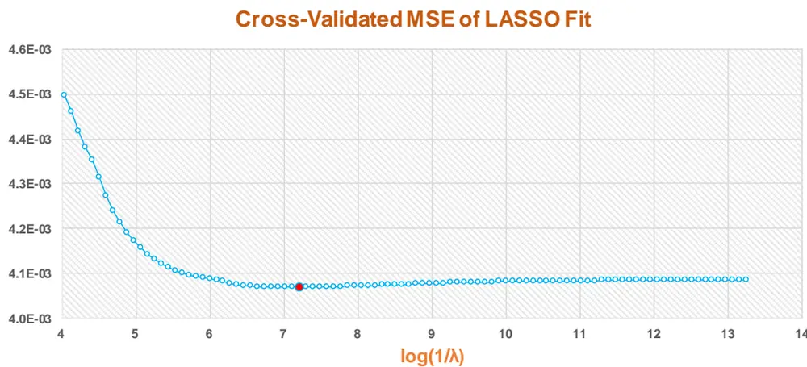
资料来源：东方证券研究所 & Wind 资讯

## 1.3 群体学习提高预测能力

前面提到，单个决策树的样本外预测能力十分有限，我们可以同时使用多个决策树进行群体学习（Ensemble Learning）来提高模型的预测能力，这里常用的方法有两种：

## 1.3.1 增强型决策树

增强型决策树（Boosted CART）使用多个决策树的线性组合来作为拟合函数

$$
\mathsf{f}\left(\vec{X}\right)=\sum_{m=1}^{M}\beta_{m}\cdot T_{m}(\vec{X};\boldsymbol{\Theta}_{m})
$$

其中 $\vec{X}$ 是输入变量， $\Theta_{\mathrm{m}}$ 为第m 个决策树的参数，增强型决策树即是要求解下列优化问题

$$
\operatorname*{min}_{\beta_{\mathrm{m}},\Theta_{m}}a\sum_{i=1}^{N}L\left(y_{i},\sum_{m=1}^{M}\beta_{m}\cdot T(\vec{x}_{i};\Theta_{m})\right)\cdots\cdots(1.3)
$$

优化问题（1.3）可以用 FSAM（Forward Stagwise Additive Modeling）算法（Hastie 2008）近似求解。对于分类问题，如果损失函数采用指数形式 $\operatorname{L}(\mathbf{a},\mathbf{b})=\exp(-a\cdot b)$ ，则 FSAM 算法等价于AdaBoost. 对于回归问题，如果损失函数采用二次损失函数，利用损失函数的可导性，可以采用Gradient Boosting 算法。增强型决策树的样本外预测能力要明显强于单个决策树，是当前使用最广的 ML 方法之一。

## 1.3.2 随机森林

随机森林（RF, Random Forrest）的方法也是同时用多个决策树来做预测，但树的生成方法略有不同。它首先对数据样本进行了 B 次 Bootstrap 抽样，用抽样的数据训练出一个 CART$T_{b}(\vec{X};\Theta_{b})$ ，而且训练 CART 的算法做了改变，在决定每个分叉点使用哪个变量时，不是遍历所有的K 个变量，而是从中随机抽取 G个变量用来分析（回归通常取 $\mathrm{G}=\left[\mathrm{K}/3\right])$ 。RF 最终的预测函数形式为

$$
\mathsf{f}\left(\vec{X}\right)=\frac{1}{B}\sum_{b=1}^{B}T_{b}(\vec{X};\boldsymbol{\Theta}_{b})
$$

前文提到，CART对数据很敏感，RF这种算法使得它生成的决策树预测结果的相关性很低，但 Bias变化不大，因此把多个低相关性的预测结果组合在一起，Variance 会明显降低。RF是通过降低预测结果的波动性来提升样本外的预测准确度。

## 1.3.3 增强型决策树VS 随机森林

关于这两种常用 ML 算法效果的比较，有过很多研究，包括：Caruana（2006），Delgado（2014）和 Hastie（2008）。总体来看，准确调整好参数的增强型决策树模型效果略好于随机森林（幅度非常有限），而且收敛速度更快，可以用较少数量的决策树就达到随机森林方法的预测精度。但增强型决策数的问题就在于参数调整，因为它有三个关键变量：决策树数量、树结构和学习速率；动一个，其它两个变量也要跟着变，调整难度较大。而随机森林受树结构的影响很小（Segal 2004），主要的变量只有一个，决策树的数量，调整起来容易很多，而且和增强型决策树相比，它更不容易过拟合。增强型决策树和随机森林两种方法的选股效果我们都测试过，相差不大。我们最终选择随机森林的原因主要是它结构简单，参数调整容易，过拟合的可能性更小，方便进一步改进研究。

## 二、机器选股模型

## 2.1 模型基本架构

和传统线性 alpha 模型（图6）相比，我们的机器选股模型省去了“因子筛选”、“因子加权”和“ZSCORE 转收益率”这三个步骤，直接通过随机森林做回归，由 alpha 因子来预测收益率。需要说明的是，决策树本身也可以用来做变量筛选，但是我们并没有把这一步交给机器，而是仍然保留了“因子 IC检验”这个步骤，保证随机森林的输入变量确确实实是符合我们传统意义的 alpha因子；如果把很多没有选股效用的因子混在一起作为输入变量，会导致数据噪音过大，产生“ Garbage in, Garbage out” 的问题，降低模型的预测能力。

图6：机器选股模型基本架构
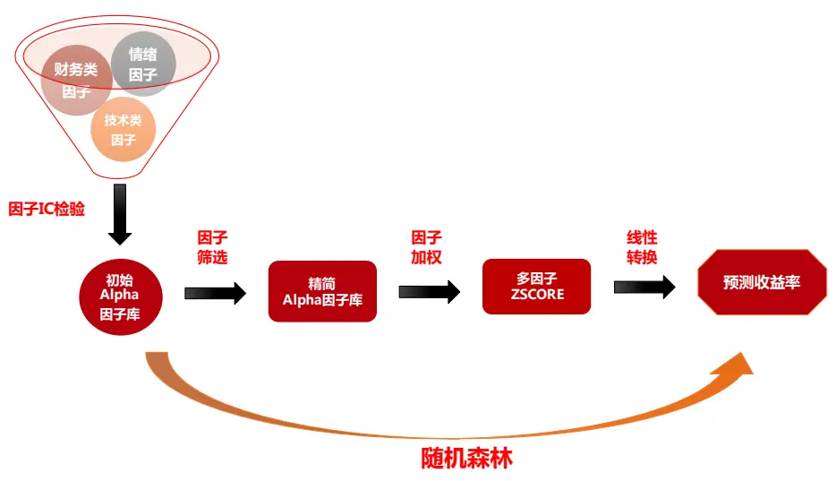
资料来源：东方证券研究所

## 2.2 IC 与多空组合表现

图 7 是随机森林模型做的 Top 10% - Bottom 10%多空组合的净值走势图，回溯时间段为2008.01.02 –2016.10.31。我们做了三个测试，首先是用《Alpha 预测》报告中最终精简筛选出的11 个 alpha 因子作为输入变量，和传统的三种方法比, RF 11-alpha 多空组合的收益率、月胜率、Sharpe 值和最大回撤都明显优于 IC_IR 加权方法。如果直接采用精简前的 17 个 alpha 因子，RF17-alpha 的收益和稳健性可以得到进一步提升，这可以部分说明 RF内部机制处理因子间相关性的效果要比我们前面报告提出的线性精简方法要好。另外如果是做主动量化产品，全市场选股，风险控制要求不高，可以把行业因子和市值因子也作为输入变量。在线性回归中，这两个风险因子的加入将显著提升回归方程的 R-square，对 RF 来说，加入这两个因子后，多空组合收益平均月收益可以显著提升到，但稳健性有所下降，不过也在可接受范围内。

图 7：不同方法得到的多因子多空组合净值表现
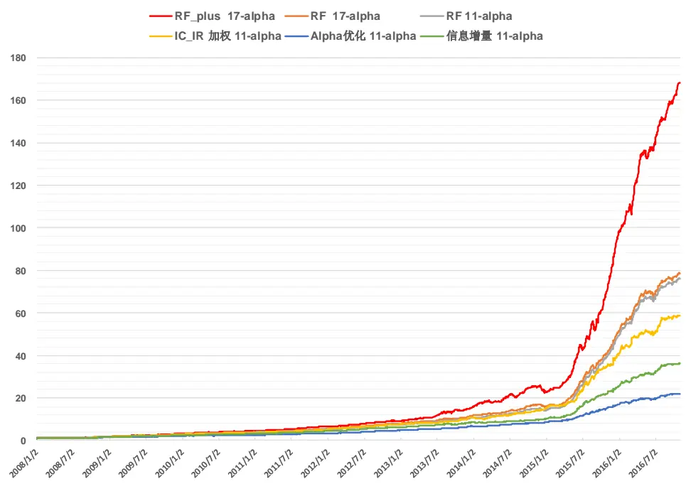

|  | 平均月收益 | 月胜率 | Sharpe Ratio | 最大回撤 | Zscore IC | Zscore IC_IR |
| --- | --- | --- | --- | --- | --- | --- |
| RF_plus 17-alpha | 0.050 | 92.5% | 3.24 | -0.136 | 0.144 | 4.84 |
| RF 17-alpha | 0.043 | 93.4% | 3.67 | -0.067 | 0.123 | 5.52 |
| RF 11-alpha | 0.042 | 93.4% | 3.44 | -0.077 | 0.124 | 5.68 |
| IC_IR 加权 11-alpha | 0.040 | 91.5% | 3.36 | -0.091 | 0.133 | 5.46 |
| Alpha优化 11-alpha | 0.030 | 92.5% | 4.17 | -0.062 | 0.105 | 6.91 |
| 信息增量 11-alpha | 0.035 | 92.5% | 3.64 | -0.048 | 0.116 | 6.22 |

资料来源：东方证券研究所 & Wind 资讯

## 2.3 中证 500 指数增强效果

Alpha 因子多空组合的表现和其指数增强表现会有差别，图 8 和图 9 比较了传统因子 IC_IR 加权方法做的中证 500 指数增强效果和 RF方法的差别，IC_IR 加权用的是精简后的 11 个alpha 因子，RF用的则是精简前的 17 个alpha 因子，另外，为了预测更加准确，RF预测时加入了市值和行业因子，选出的股票行业和市值风险暴露较高，在做组合优化时，我们采用了更严的市值风险控制，要求市值暴露不超过 0.3。测试时间段从 2009.01.05 到2016.10.31，在全市场范围内选股. 可以看到，在未扣费前 RF方法年化超额收益达到 31.2%，比 IC_IR 加权高2.8%，但最大回撤也多了0.6%，两个组合的稳健性水平基本相当。

图 8：IC_IR 加权中证 500 增强组合业绩表现（未扣费）
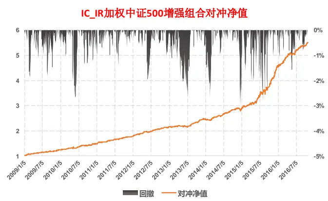

| 年化超额收益 | 信息比 | 月胜率 | 最大回撤 | 平均股票数量 | 月单边换手率 |
| --- | --- | --- | --- | --- | --- |
| 28.4% | 3.74 | 88.3% | -4.3% | 175.5 | 71.4% |

资料来源：东方证券研究所 & Wind 资讯

图9：RF 中证 500 增强组合业绩表现（未扣费）
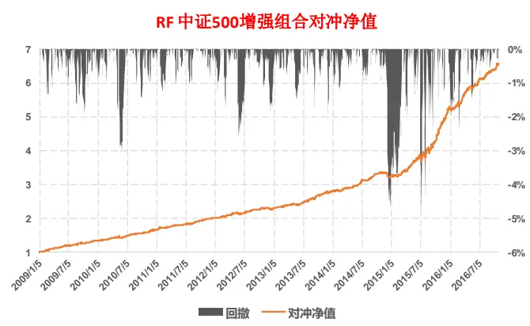

| 年化超额收益 | 信息比 | 月胜率 | 最大回撤 | 平均股票数量 | 月单边换手率 |
| --- | --- | --- | --- | --- | --- |
| 31.2% | 3.75 | 87.2% | -4.9% | 194.4 | 70.6% |

资料来源：东方证券研究所 & Wind 资讯

## 2.4 MACH-100 组合

我们以 17 个alpha 因子加上市值和行业两个风险因子作为输入变量，每个月用 RF模型预测一次个股未来一个月的收益，选取预测收益最高的 100 只股票（剔除停牌、月初涨停、ST 和上市不满三个月的股票）等权做组合，构造了月频调仓的 MACH-100 指数。从图 10 和图11 可以看到，这个指数在 2009.01.01-2016.10.31 近八年时间里，净值上涨了 41.7 倍，年化收益率 63.9%，84%的月份可以战胜中证 500；2016 年年初到 10 月31 日，策略指数获得了 18.7%的正绝对收益，表现非常优异。

图 10：MACH-100 指数净值表现
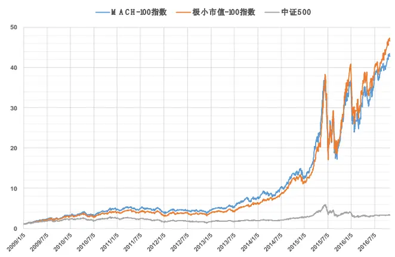
资料来源：东方证券研究所 & Wind 资讯

图 11：MACH-100 指数数据统计

|  | MACH-100指数 | 极小市值-100指数 | 中证500 |
| --- | --- | --- | --- |
| 年化收益率 | 63.9% | 65.8% | 17.1% |
| 月胜率 | 84.0% | 81.9% |  |
| 最大回撤 | -53.8% | -55.4% | -54.3% |
| Sharpe值 | 1.37 | 1.40 | 0.59 |
| 月单边换手率 | 64.2% | 20.4% | 5.6% |
| 2009 | 227.4% | 203.9% | 131.3% |
| 2010 | 45.8% | 31.3% | 10.1% |
| 2011 | -15.3% | -18.9% | -33.8% |
| 2012 | 12.3% | 18.6% | 0.3% |
| 2013 | 66.8% | 63.8% | 16.9% |
| 2014 | 65.2% | 81.2% | 39.0% |
| 2015 | 187.6% | 252.2% | 43.1% |
| 2016(截至10.31) | 18.7% | 16.1% | -15.3% |

资料来源：东方证券研究所 & Wind 资讯

作为对比，我们另外构造了一个最具 A股特征的“极小市值-100 指数”，即每个月底选取全市场总市值最小的 100 只股票（剔除停牌、月初涨停、ST和上市不满三个月的股票）等权构成的组合。MACH-100 指数和极小市值-100 指数的收益率基本相当，在2015 年有较大差距。极小市值-100 指数收益高，换手率低，但是成分股由于市值太小，流动性较差，可能大部分都不能进入投资机构的备选股票池。对比而言，MACH-100 指数成分股的市值中位数在全市场股票市值从大到小排序的分位数平均在 76%（图 12），市值水平和各家机构股票池里市值最小的股票相近；分位数最高的时候接近 40%，近几个月的分位数都在 80%之后，模型选出的股票切合市场风格，显著偏向于小市值股票。从成分股行业权重分布来看，计算机、医药、电子元器件、基础化工的权重最大，超配最多的五个行业分别是计算机、传媒、电子元器件、医药、通信。

图 12：MACH-100 成分股市值中位数在全市场的市值分位数
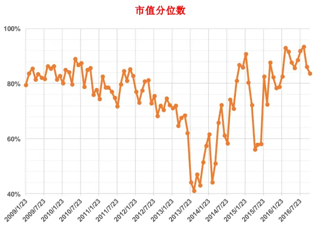
资料来源：东方证券研究所 & Wind 资讯

图13：MACH-100 成分股平均行业权重
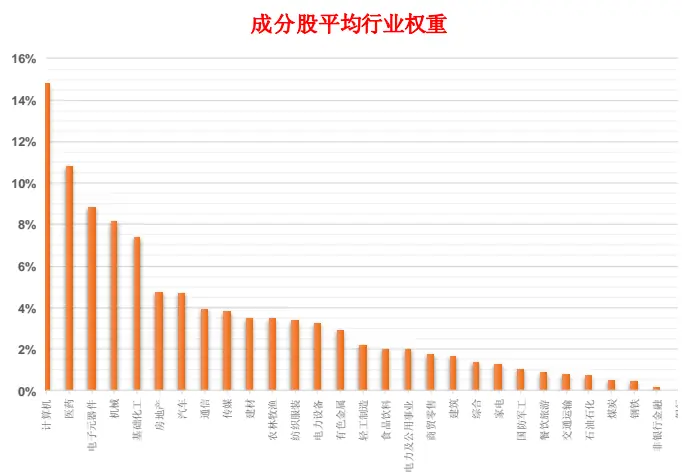
资料来源：东方证券研究所 & Wind 资讯

## 三、总结

对待机器学习，我们应该摆脱固有的“黑箱“和”过拟合“概念，一些 ML 算法的逻辑非常直白，而且 ML 在求解优化问题估计模型参数时，通常会带正则化约束条件，通过交叉验证的方式来选择参数，避免过拟合。众多的实践研究说明，ML 方法的预测能力大部分情况下都强于线性模型。我们最终选择使用随机森林方法，主要是因为它结构简单、参数少、过拟合概率低，同时还具有非常强的样本外预测能力。实证显示随机森林方法得到的多空组合，收益和稳健性上都要比传统的线性模型高，更重要的是它可以帮助我们省去中间”因子筛选“、”因子加权“和”线性转换“的过程，提升效率。我们现在使用的是标准版的随机森林模型，这个算法本身有改进的空间，同时，我们的 alpha 因子库在扩容，输入变量的不同预处理方式可能会对输出的结果有影响，后续我们将针对这些问题对机器选股模型做升级。

## 参考文献

[1]. Caruana, R., Mizil, A.N., (2006), “An Empirical Comparison of Supervised Learning Algorithms”, ICML '06 Proceedings of the 23rd international conference on Machine learning, pp 161-168.

[2]. Delgado, M.F., Cernadas, E., Barro, S., Amorim, D., (2014), “Do we Need Hundreds of Classifiers to Solve Real World Classification Problems ”, Journal of Machine Learning Research, Vol(15), pp 3133-3181.

[3]. Dwyer, K., Holte, R., (2007), “Decision Tree Instability and Active Learning ”，the series Lecture Notes in Computer Science, vol(4701), pp 128-139.

[4]. Hastie, T., Tibshirani, R., Friedman, J., (2008). “The Elements of Statistical Learning : Data Mining, Inference and Prediction (Second Edition)”, Springer.

[5]. R.-E. Fan, P.-H. Chen, and C.-J. Lin. (2005), „Working set selection using second order information for training SVM‟. Journal of Machine Learning Research 6, 1889-1918.

[6]. Schmidhuber, J., (2015), “Deep learning in neural networks: An overview”, Neural Networks, vol(61), pp 85–117.

[7]. Segal, M. (2004), “Machine Learning benchmarks and random forest regression”, Technical report, http://repositories.edlib.org/cbmb/bench_rf_regn.

## 风险提示

1. 量化模型基于历史数据分析得到，未来存在失效的风险，建议投资者紧密跟踪模型表现。

2. 极端市场环境可能对模型效果造成剧烈冲击，导致收益亏损。

## 分析师申明

每位负责撰写本研究报告全部或部分内容的研究分析师在此作以下声明：

分析师在本报告中对所提及的证券或发行人发表的任何建议和观点均准确地反映了其个人对该证券或发行人的看法和判断；分析师薪酬的任何组成部分无论是在过去、现在及将来，均与其在本研究报告中所表述的具体建议或观点无任何直接或间接的关系。

## 投资评级和相关定义

报告发布日后的12 个月内的公司的涨跌幅相对同期的上证指数/深证成指的涨跌幅为基准；

## 公司投资评级的量化标准

买入：相对强于市场基准指数收益率 15%以上；

增持：相对强于市场基准指数收益率5%～15%；

中性：相对于市场基准指数收益率在-5%～+5%之间波动；

减持：相对弱于市场基准指数收益率在-5%以下。

未评级——由于在报告发出之时该股票不在本公司研究覆盖范围内，分析师基于当时对该股票的研究状况，未给予投资评级相关信息。

暂停评级——根据监管制度及本公司相关规定，研究报告发布之时该投资对象可能与本公司存在潜在的利益冲突情形；亦或是研究报告发布当时该股票的价值和价格分析存在重大不确定性，缺乏足够的研究依据支持分析师给出明确投资评级；分析师在上述情况下暂停对该股票给予投资评级等信息，投资者需要注意在此报告发布之前曾给予该股票的投资评级、盈利预测及目标价格等信息不再有效。

## 行业投资评级的量化标准：

看好：相对强于市场基准指数收益率5%以上；

中性：相对于市场基准指数收益率在-5%～+5%之间波动；

看淡：相对于市场基准指数收益率在-5%以下。

未评级：由于在报告发出之时该行业不在本公司研究覆盖范围内，分析师基于当时对该行业的研究状况，未给予投资评级等相关信息。

暂停评级：由于研究报告发布当时该行业的投资价值分析存在重大不确定性，缺乏足够的研究依据支持分析师给出明确行业投资评级；分析师在上述情况下暂停对该行业给予投资评级信息，投资者需要注意在此报告发布之前曾给予该行业的投资评级信息不再有效。

## 免责声明

本证券研究报告（以下简称“本报告”）由东方证券股份有限公司（以下简称“本公司”）制作及发布。

本报告仅供本公司的客户使用。本公司不会因接收人收到本报告而视其为本公司的当然客户。本报告的全体接收人应当采取必要措施防止本报告被转发给他人。

本报告是基于本公司认为可靠的且目前已公开的信息撰写，本公司力求但不保证该信息的准确性和完整性，客户也不应该认为该信息是准确和完整的。同时，本公司不保证文中观点或陈述不会发生任何变更，在不同时期，本公司可发出与本报告所载资料、意见及推测不一致的证券研究报告。本公司会适时更新我们的研究，但可能会因某些规定而无法做到。除了一些定期出版的证券研究报告之外，绝大多数证券研究报告是在分析师认为适当的时候不定期地发布。

在任何情况下，本报告中的信息或所表述的意见并不构成对任何人的投资建议，也没有考虑到个别客户特殊的投资目标、财务状况或需求。客户应考虑本报告中的任何意见或建议是否符合其特定状况，若有必要应寻求专家意见。本报告所载的资料、工具、意见及推测只提供给客户作参考之用，并非作为或被视为出售或购买证券或其他投资标的的邀请或向人作出邀请。

本报告中提及的投资价格和价值以及这些投资带来的收入可能会波动。过去的表现并不代表未来的表现，未来的回报也无法保证，投资者可能会损失本金。外汇汇率波动有可能对某些投资的价值或价格或来自这一投资的收入产生不良影响。那些涉及期货、期权及其它衍生工具的交易，因其包括重大的市场风险，因此并不适合所有投资者。

在任何情况下，本公司不对任何人因使用本报告中的任何内容所引致的任何损失负任何责任，投资者自主作出投资决策并自行承担投资风险，任何形式的分享证券投资收益或者分担证券投资损失的书面或口头承诺均为无效。

本报告主要以电子版形式分发，间或也会辅以印刷品形式分发，所有报告版权均归本公司所有。未经本公司事先书面协议授权，任何机构或个人不得以任何形式复制、转发或公开传播本报告的全部或部分内容。不得将报告内容作为诉讼、仲裁、传媒所引用之证明或依据，不得用于营利或用于未经允许的其它用途。

经本公司事先书面协议授权刊载或转发的，被授权机构承担相关刊载或者转发责任。不得对本报告进行任何有悖原意的引用、删节和修改。

提示客户及公众投资者慎重使用未经授权刊载或者转发的本公司证券研究报告，慎重使用公众媒体刊载的证券研究报告。

## 东方证券研究所

地址： 上海市中山南路 318号东方国际金融广场 26楼

联系人： 王骏飞

电话： 021-63325888*1131

传真： 021-63326786

网址： www.dfzq.com.cn

Email： wangjunfei@orientsec.com.cn