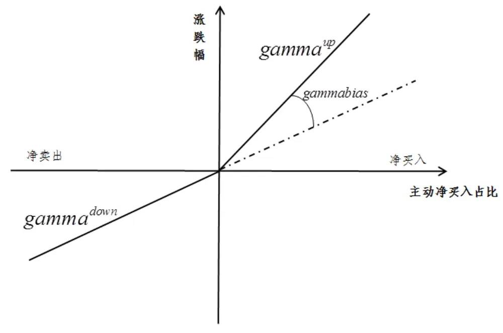
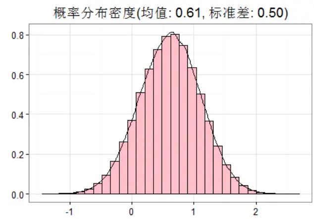
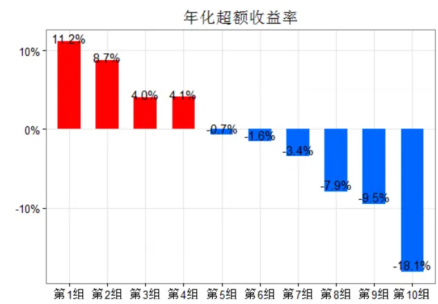
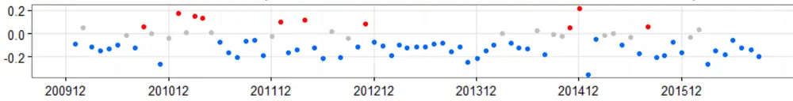
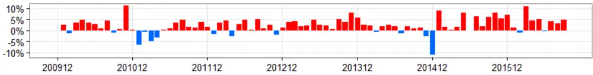
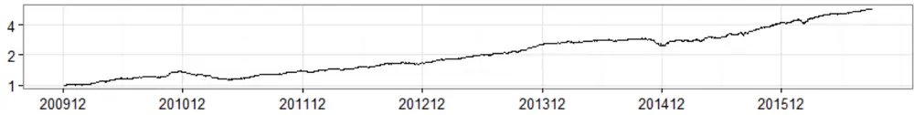
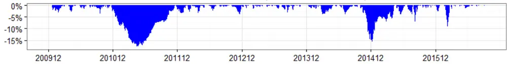

## 研究结论

相同比例的主动订单对股价向上的冲击和向下的冲击可能不太一样，向上冲击较大的股票表现出上涨容易、下跌困难的特征，向下冲击较大的股票表现出下跌容易、上涨困难的特征。我们基于股票5 分钟的资金流和行情数据提出了价格冲击偏差的概念，用于捕捉这一特征。

价格冲击偏差在横截面上有很好的选股能力，价格冲击偏差较小的股票表现较好，即前期容易下跌、上涨困难的股票后期表现更佳。因子 RankIC均值-0.081，IC_IR-2.62，价格冲击偏差最小的 1/10 组合相对市场等权年化超额收益高达 11.2%，信息比 1.53，月胜率 74.1%。

价格冲击偏差在市值和行业调整之后收益略有回落，但稳定性有所增强，虽然同属于反转大类的因子，但在控制住月收益率、特异度、日内特质偏度等alpha因子后价格冲击偏差的表现虽稍有回落，但因子的超额收益依然显著，说明其存在相对独立的超额收益来源，具有alpha的信息增量。

价格冲击偏差间接反映了股票在特定时间区间的乐观和悲观程度，情绪乐观时，卖单少，而且卖家也会延迟卖出，所以主动买单容易拉升股价，情绪悲观是，买单少，而且买家会延迟买入，所以主动卖单容易打压股价。

- 本文主要考察了价格冲击偏差在横截面上选股的应用，表现出来反转的特征，关于其在时间序列上的表现如何（个股交易、指数择时等）请关注我们后期的研究报告。

## 风险提示

- 本文的研究成果基于历史数据，如果未来风格发生重大变化，部分规律可能失效。

报告发布日期2016 年 11 月 10 日

证券分析师 朱剑涛

021-63325888*6077

zhujiantao@orientsec.com.cn

执业证书编号：S0860515060001

联系人王星星

021-63325888-6108

wangxingxing@orientsec.com.cn

## 相关报告

| 东方机器选股模型 Ver 1.0 2016-11-07 |
| --- |
| 非流动性的度量及其横截面溢价 2016-11-02 |
| Alpha 预测 2016-10-25 |
| 资金规模对策略收益的影响 2016-08-26 |
| Alpha 因子库精简与优化 2016-08-12 |
| 日内残差高阶矩与股票收益 2016-08-12 |

控制多个变量后价格冲击偏差的表现

| 控制变量 |  |  |  |  | 残差表现 |  |  |  |  |
| --- | --- | --- | --- | --- | --- | --- | --- | --- | --- |
|  | 市值对数 中信1级行业 月收益率 特异度 |  |  | 日内特质偏度 | RankIC | t值_IC | IC_IR | LS_Ret | LS_SR |
| (1) |  |  |  |  | -0.081 | -6.80 | -2.62 | 29.6% | 2.21 |
| (2) | ↓ | 4 |  |  | -0.064 | -7.98 | -3.07 | 23.6% | 2.63 |
| (3) | 1 | 1 | 1 |  | -0.048 | -5.85 | -2.25 | 15.9% | 1.91 |
| (4) | ↓ | 1 | 1 |  |  | -0.056 | -6.80 | -2.62 18.7% | 2.13 |
| (5) | 4 | 4 |  | √ |  | -0.038 | -5.04 | -1.94 13.1% | 1.70 |
| (6) | 1 | 1 | 1 | 4 | 4 | -0.030 | -3.87 | -1.49 | 9.5% 1.26 |

## 一、价格冲击的非对称性

众所周知，股价的涨跌尤其是短期内的涨跌主要是由主动买卖单推动的，在某一时间区间，如果大多数订单主动买入，则股票的价格大概率会上涨，相反，如果大多数订单主动卖出，则股票的价格大概率下行。然而，相同比例的买入订单和卖出订单对股价的冲击大小不一定相同，当卖出订单对股价向下的冲击不及买入订单对股价向上的冲击时，这只股票上涨相对容易，下跌较为困难；相反，当买入订单对股价向上的冲击不及卖出订单对股价向下的冲击时，这只股票下跌相对容易，上涨较为困难。

我们利用股票每日的 5 分钟线回归如下的方程：

$$
\begin{aligned}return_{i}=gamma^{up}\cdot I_{i}\cdot MF_{i}+gamma^{down}\cdot(1-I_{i})\cdot MF_{i}\\MF_{i}=MoneyFlow_{i}/Amount_{i}\end{aligned}\tag{1}
$$

其中， $return_{i}$ 为第 i 个5 分钟线的收益率， $MoneyFlow_{i}$ 为第 i 个 5 分钟内的主动净流入金额（正值为净流入， $负$ 值为净流出）， $Amount_{i}$ 为第 i 个 5 分钟内的成交金额， $MF_{i}$ 为主动净买入占比， $I_{i}$ 为示性函数，当 $MF_{i}$ 大 $于0$ 时取1，否则取 0。

本文主要想考察相同比例的主动净买入和主动净卖出对股价冲击带来的差异，所以上述回归方程（1）可以做如下变形：

$$
return_{i}=gamma^{down}\cdot MF_{i}+(gamma^{up}-gamma^{down})\cdot(I_{i}\cdot MF_{i})\tag{2}
$$

我们定义股票的价格冲击偏差 gammabias 如下：

$$
gammabias=\frac{gamma^{up}-gamma^{down}}{S_{gamma^{up}-gamma^{down}}}
$$

其中， $S_{gamma^{up}-gamma^{down}}为gamma^{up}-gamma^{down}的估计标准差$ 。

从以上分析和定义可知，某股票在特定交易日的价格冲击偏差（gammbias）等于用该交易日的 5 分钟收益率对序列 $MF_{i}$ 和 $|I_{i}\cdot MF_{i},$ 序列回归时的 $|I_{i}\cdot MF_{i}$ 系数项的 t值，考虑到成交额较大的 5分钟线蕴含的信息量相对更大，成交额较小的 5 分钟线随机性更大，所以我们采用了以成交额作为权重的加权最小二乘回归。

价格冲击弹性（gammabias）在一定程度上表征了股票在某一时间区间上涨或者下跌的难易程度，价格冲击弹性较大（正值）的股票，相同比例的主动订单对其股价向下的冲击小于向上的冲击，股票容易上涨，价格冲击弹性较小（负值）的股票，相同比例的主动订单对其股价向上的冲击小于向下的冲击，股票容易下跌。

图1：价格冲击的非对称性

数据来源：东方证券研究所

## 二、价格冲击偏差的选股表现

考虑到股票单个交易日的价格冲击偏差随机性较强，所以我们在考察其选股能力之前对其做了移动平滑处理，本文下面提到的价格冲击偏差均是其月度均值，也主要考察其在月度调仓频率下的表现。（关于价格冲击偏差的周度表现可咨询报告联系人。）

在本章中，我们利用传统的 IC 和分组检验的方法考察价格冲击偏度的选股能力，即因子有效性检验，关于因子检验的细节，有必要进行一些说明：

（1） 由于数据的可获得性，因子检验区间为 2009 年 12 月 31 日至 2016 年 9 月 30 日 ；

（2） 样本空间为同时期的中证全指成分股，避免了新股的影响和退市带来的幸存者偏误（survivor bias）；

（3）每个月计算当月因子值和次月收益率的 spearman相关系数，各月底的均值我们称之为 Rank IC 均值，均值与标准差之比年化后的取值我们称之为 IC_IR，同时考察各月 IC 的正/负显著比率；

（4） 分组检验时，我们每月底将样本空间中的所有股票按因子取值从小到大分为 10 组，等权构建组合，以市场等权作为基准，考察各分组的表现，不考虑交易费用。

2009 年以来 A股平均的价格冲击偏差均值为 0.61（图 2），66%的样本数据大于 0，说明 A股大多数股票大多数日期都是更加倾向于上涨的，即相同比例的主动订单对股价向上的冲击要高于对股价向下的冲击。

图 2：月均价格冲击偏差概率分布

数据来源：wind数据库，东方证券研究所

图3：价格冲击偏差分组超额收益

数据来源：wind数据库，东方证券研究所

从价格冲击偏差的分组表现来看，价格冲击偏差越小的组合表现越好，即容易下跌的股票的后期表现要明显优于容易上涨的股票，这和我们直觉相悖。而且，价格冲击偏差第 1 组至第 10 组（价格冲击偏差从小到大）的业绩表现十分单调，无论是年化超额收益、夏普比、信息比还是月胜率，随着价格冲击偏差的增大而变差。Top组合（第1 组，价格冲击偏差最小的 1/10 股票构建的等权组合）相对市场等权组合年化超额收益高达 11.2%，信息比 1.53，月胜率 74.1%，在单因子中的表现总体比较突出。

表 1：价格冲击偏差分组表现

|  | 年化收益率 | 超额收益 | 夏普比 | 信息比 | 月胜率 | 最大回测 | 月均换手 |
| --- | --- | --- | --- | --- | --- | --- | --- |
| 中证全指 | 3.4% | -12.1% | 0.26 | -1.19 | 33.3% | -49.7% |  |
| 市场等权(基准) | 15.5% | 0.0% | 0.61 |  | 0.0% | -50.0% | 4.5% |
| 第01组 | 26.7% | 11.2% | 0.87 | 1.53 | 74.1% | -48.0% | 79.3% |
| 第02组 | 24.3% | 8.7% | 0.82 | 1.47 | 71.6% | -51.4% | 84.5% |
| 第03组 | 19.6% | 4.0% | 0.70 | 0.81 | 59.3% | -52.6% | 87.3% |
| 第04组 | 19.6% | 4.1% | 0.71 | 0.92 | 59.3% | -52.7% | 88.4% |
| 第05组 | 14.8% | -0.7% | 0.58 | -0.07 | 50.6% | -52.8% | 89.1% |
| 第06组 | 13.9% | -1.6% | 0.56 | -0.28 | 46.9% | -53.9% | 89.0% |
| 第07组 | 12.1% | -3.4% | 0.51 | -0.84 | 35.8% | -55.5% | 88.6% |
| 第08组 | 7.6% | -7.9% | 0.39 | -1.82 | 27.2% | -53.0% | 86.3% |
| 第09组 | 6.0% | -9.5% | 0.34 | -1.62 | 29.6% | -53.7% | 84.3% |
| 第10组 | -2.6% | -18.1% | 0.08 | -2.39 | 19.8% | -56.5% | 74.7% |

数据来源：wind数据库，东方证券研究所

价格冲击偏差的 RankIC 均值-0.081，IC_IR-2.62，正显著比例 12.3%，负显著比比例 65.4%，IC均值小于0，再次说明，价格冲击偏差越小的股票未来收益越高，RankIC均值的绝对值高达0.081，在单因子中也属于相对较高的水平。

从时间序列上看，价格冲击偏差多空组合月胜率 80%，因子绝大多数时间能产生超额收益。回撤时间主要是 2011 年前半年和2014 年底，其中 2011 年为单边下跌行情，2014 年底的回撤主要是市值效应影响。

图 4：价格冲击偏差历史表现回溯
各月度信息系数(均值：-0.081，正显著比率:12.3%，负显著比率:65.4%)

多空组合各月度收益(均值:2.25%，胜率:80.2%)

多空组合净值曲线(年化收益率:29.62%)

多空组合历史回撤(最大回撤:-18.02%)

数据来源：wind数据库，东方证券研究所

## 三、与其他因子间的关系

从前文的分析中可以看出，价格冲击偏差越小的股票未来收益率越高，其可以作为一个选股的alpha 因子，然而，价格冲击偏差和其他常见的因子间存在什么样的关系，在控制其他因子后价格冲击偏差是否还有预测股票超额收益的能力？本章主要从因子的相关性、因子分层和回归分析等角度解答这一问题。

观察各因子值间的秩相关系数和各因子 RankIC 的相关系数，我们发现价格冲击偏差和日内特质偏度的取值高度相关，秩相关系数高达 0.402，说明这两者间存在一定的信息重叠。另一个值得注意的是，价格冲击偏差和市值对数的 RankIC 相关性较高，小票表现较好的时候价格冲击偏差表现一般也较好，这主要是价格冲击偏差因子选股还是略偏小市值股票。

表2：因子值（左下）和因子 RankIC（右上）的相关系数

| 市值对数 1个月收益 特异度 日内特质偏度 价格冲击偏差 |  |  |  |  |  |
| --- | --- | --- | --- | --- | --- |
| 市值对数 |  | 0.012 -0.026 |  | -0.254 | 0.433 |
| 1个月收益 | 0.025 |  | 0.563 | 0.406 | 0.204 |
| 特异度 | 0.032 0.316 |  |  | 0.263 | -0.100 |
| 日内特质偏度 | -0.039 | 0.310 | 0.204 |  | 0.341 |
| 价格冲击偏差 | 0.187 0.230 0.112 0.402 |  |  |  |  |

数据来源：wind数据库，东方证券研究所

研究因子两两之间的替代作用，另一个比较常见的方法是因子分层的做法，具体做法如下：

在每个月底按分层因子大小将样本空间内的股票分为 10 层，再在每一层内按分组因子的大小排序，选取每一层内分组因子最小的 1/10 股票作为第 1 组（top 组合），以此类推，每层内分组因子最大 1/10 股票作为第 10 组（bottom 组合），然后比较做多 top 组合做空bottom 组合的多空组合月均收益率及其显著性。

表3：因子分层多空组合月均收益率（%）

| 市值对数 1个月收益 特异度 日内特质偏度 价格冲击偏差 |  |  |  |  |  |  |
| --- | --- | --- | --- | --- | --- | --- |
|  | 不分层 | 3.247 | 2.368 | 2.498 | 1.883 | 2.417 |
|  | 分市值对数 | 0.244 | 2.302 | 2.284 | 1.905 | 1.981 |
|  | 层1个月收益 | 2.697 | 0.357 | 1.759 | 1.192 | 1.648 |
|  | 因特异度 | 2.982 | 1.632 | 0.426 | 1.378 | 2.083 |
|  | 子日内特质偏度 | 3.296 | 1.897 | 2.107 | 0.198 | 1.619 |
|  | 价格冲击偏差 | 2.851 | 1.757 | 2.188 | 0.943 | 0.276 |

数据来源：wind数据库，东方证券研究所

因子分层的结果展示了分组因子在控制了单个分层因子前后的表现差异，表 3 的结果显示，价格冲击偏差因子在控制市值、月收益、特异度、日内偏度等因子后，多空组合月均收益均稍有回落，但剩余的超额收益依然显著，这说明，以上任何单因子均无法完全揭示价格冲击偏差的超额收益来源。但相比较之下，在控制1 个月收益率或日内特质偏度后日内价格冲击偏差的回调最明显，意味着，价格冲击偏差和日内特质偏度、月收益率的信息重叠最大。

无论是相关系数还是因子分层都只能考察两个因子间的影响，为了考察多个因子对价格冲击偏差的解释作用，我们借助了回归的分析方法，具体做法如下：

在每个横截面上用价格冲击偏差对控制变量因子回归，取其残差项，考察残差因子的选股表现，以此作为价格冲击偏差在控制控制变量因子后的表现。

分析回归的结果（表 4），我们有如下发现：

1. 价格冲击偏差在做风格中性处理后，因子的收益水平变差，但稳定性有所增强, 回归方程（1）、（2）。在回归方程的控制变量中加入市值对数、行业后，因子的 IC_IR、多空组合的夏普比都有所改善，但 IC 的均值和多空组合的收益率回落明显。

2. 控制多个因子后，价格冲击偏差的超额收益依然显著，说明其超额收益的 alpha 源相对独立。在风险中性的基础上进一步加入控制变量月收益率、特异度、或者日内特质偏度其残差的表现虽稍有回落，但依然显著，回归方程（3）、（4）、（5），同时控制这几个因子后残差 RankIC 依然显著，仍然有显著的超额收益。

表 4：控制多个变量后价格冲击偏差的表现

| 控制变量 |  |  |  |  |  | 残差表现 |  |  |  |
| --- | --- | --- | --- | --- | --- | --- | --- | --- | --- |
|  | 市值对数 中信1级行业 月收益率 特异度 日内特质偏度 |  |  |  |  | RankIC | t值 IC IC IR | LS Ret | LS SR |
| (1) |  |  |  |  | -0.081 | -6.80 | -2.62 | 29.6% | 2.21 |
| (2) | √ | √ |  |  |  | -0.064 -7.98 | -3.07 | 23.6% | 2.63 |
| (3) | √ | √ | √ |  |  | -0.048 -5.85 | -2.25 | 15.9% | 1.91 |
| (4) | √ | √ | √ |  |  | -0.056 | -6.80 -2.62 | 18.7% | 2.13 |
| (5) | √ | √ |  |  | √ | -0.038 | -5.04 -1.94 | 13.1% | 1.70 |
| (6) | √ | √ | √ | √ | √ | -0.030 | -3.87 -1.49 | 9.5% | 1.26 |

数据来源：东方证券研究所

## 四、价格冲击偏差与投资者情绪

价格冲击偏差直接度量的是相同大小的主动净流入（流出）占比对股价向上（向下）的冲击是否显著差异。如果价格冲击偏差为较大的正值，意外着主动净买入订单对股价向上的冲击显著大于相同比例的主动净卖出订单对股价向下的冲击（股票容易上涨，下跌相对困难），相反，如果价格冲击偏差为较大负值，意味着主动净卖出订单对股价向下的冲击显著大于同比例的主动净买入订单对股价向上的冲击（股价容易下跌，上涨相对困难）。

价格冲击偏差间接反应的是每只股票在各个交易日的乐观和悲观情绪。在情绪较乐观的环境中，市场看涨预期较重，市场上挂的卖单较少，而且当交易员看到资金不断买入时也会选择暂缓卖出，此时主动买入订单对股价很容易产生向上的冲击；在情绪较悲观的环境中，市场看跌预期较重，市场上挂的买单较少，而且当交易员看到资金不断卖出时也会选择暂缓买入，此时主动卖出订单很容易对股价产生卖出的冲击。最后，我们需要说明的是，价格冲击偏差反映的市场情绪不是主动订单推动者的情绪，而且观望者及被动订单持有人的情绪。

从价格冲击偏差的选股表现我们可以看出，价格冲击偏差越小的股票后期表现越好，也就是是过去一段时间较悲观的股票后期表现越好，相反，过去一段时间较乐观的话后期可能会更差一些。也就是说，在横截面上价格冲击偏差表现出了反转的特征，广义上讲也属于反转类的因子，那么价格冲击偏差在时间序列上的表现如何，可不可以用来辅助交易，或者加总到指数层面，作为一个市场情绪的观测指标？关于这个问题，请关注我们后期的相关研究。

## 风险提示

本文的结论基于对历史数据的研究，如果未来市场风格发生重大变化，部分规律可能会失效，另外高的预期超额收益并不代表 100%的胜率，市场有风险，投资需谨慎。

## 分析师申明

每位负责撰写本研究报告全部或部分内容的研究分析师在此作以下声明：

分析师在本报告中对所提及的证券或发行人发表的任何建议和观点均准确地反映了其个人对该证券或发行人的看法和判断；分析师薪酬的任何组成部分无论是在过去、现在及将来，均与其在本研究报告中所表述的具体建议或观点无任何直接或间接的关系。

## 投资评级和相关定义

报告发布日后的12 个月内的公司的涨跌幅相对同期的上证指数/深证成指的涨跌幅为基准；

## 公司投资评级的量化标准

买入：相对强于市场基准指数收益率 15%以上；

增持：相对强于市场基准指数收益率5%～15%；

中性：相对于市场基准指数收益率在-5%～+5%之间波动；

减持：相对弱于市场基准指数收益率在-5%以下。

未评级——由于在报告发出之时该股票不在本公司研究覆盖范围内，分析师基于当时对该股票的研究状况，未给予投资评级相关信息。

暂停评级——根据监管制度及本公司相关规定，研究报告发布之时该投资对象可能与本公司存在潜在的利益冲突情形；亦或是研究报告发布当时该股票的价值和价格分析存在重大不确定性，缺乏足够的研究依据支持分析师给出明确投资评级；分析师在上述情况下暂停对该股票给予投资评级等信息，投资者需要注意在此报告发布之前曾给予该股票的投资评级、盈利预测及目标价格等信息不再有效。

## 行业投资评级的量化标准：

看好：相对强于市场基准指数收益率5%以上；

中性：相对于市场基准指数收益率在-5%～+5%之间波动；

看淡：相对于市场基准指数收益率在-5%以下。

未评级：由于在报告发出之时该行业不在本公司研究覆盖范围内，分析师基于当时对该行业的研究状况，未给予投资评级等相关信息。

暂停评级：由于研究报告发布当时该行业的投资价值分析存在重大不确定性，缺乏足够的研究依据支持分析师给出明确行业投资评级；分析师在上述情况下暂停对该行业给予投资评级信息，投资者需要注意在此报告发布之前曾给予该行业的投资评级信息不再有效。

## 免责声明

本证券研究报告（以下简称“本报告”）由东方证券股份有限公司（以下简称“本公司”）制作及发布。

本报告仅供本公司的客户使用。本公司不会因接收人收到本报告而视其为本公司的当然客户。本报告的全体接收人应当采取必要措施防止本报告被转发给他人。

本报告是基于本公司认为可靠的且目前已公开的信息撰写，本公司力求但不保证该信息的准确性和完整性，客户也不应该认为该信息是准确和完整的。同时，本公司不保证文中观点或陈述不会发生任何变更，在不同时期，本公司可发出与本报告所载资料、意见及推测不一致的证券研究报告。本公司会适时更新我们的研究，但可能会因某些规定而无法做到。除了一些定期出版的证券研究报告之外，绝大多数证券研究报告是在分析师认为适当的时候不定期地发布。

在任何情况下，本报告中的信息或所表述的意见并不构成对任何人的投资建议，也没有考虑到个别客户特殊的投资目标、财务状况或需求。客户应考虑本报告中的任何意见或建议是否符合其特定状况，若有必要应寻求专家意见。本报告所载的资料、工具、意见及推测只提供给客户作参考之用，并非作为或被视为出售或购买证券或其他投资标的的邀请或向人作出邀请。

本报告中提及的投资价格和价值以及这些投资带来的收入可能会波动。过去的表现并不代表未来的表现，未来的回报也无法保证，投资者可能会损失本金。外汇汇率波动有可能对某些投资的价值或价格或来自这一投资的收入产生不良影响。那些涉及期货、期权及其它衍生工具的交易，因其包括重大的市场风险，因此并不适合所有投资者。

在任何情况下，本公司不对任何人因使用本报告中的任何内容所引致的任何损失负任何责任，投资者自主作出投资决策并自行承担投资风险，任何形式的分享证券投资收益或者分担证券投资损失的书面或口头承诺均为无效。

本报告主要以电子版形式分发，间或也会辅以印刷品形式分发，所有报告版权均归本公司所有。未经本公司事先书面协议授权，任何机构或个人不得以任何形式复制、转发或公开传播本报告的全部或部分内容。不得将报告内容作为诉讼、仲裁、传媒所引用之证明或依据，不得用于营利或用于未经允许的其它用途。

经本公司事先书面协议授权刊载或转发的，被授权机构承担相关刊载或者转发责任。不得对本报告进行任何有悖原意的引用、删节和修改。

提示客户及公众投资者慎重使用未经授权刊载或者转发的本公司证券研究报告，慎重使用公众媒体刊载的证券研究报告。

## 东方证券研究所

地址： 上海市中山南路 318 号东方国际金融广场 26 楼

联系人： 王骏飞

电话： 021-63325888*1131

传真： 021-63326786

网址： www.dfzq.com.cn

Email： wangjunfei@orientsec.com.cn