## 研究结论

风险因子可以帮助投资者控制组合收益波动，提升稳健性。但学术和实务研究材料中都没有对风险因子做出准确定义，我们根据 BARRA CNE5 文档风险因子的统计特征，从因子稳定性、对股价影响显著、因子收益率波动大三个角度设计了一套风险因子定量判定程序。

个股在某个风险因子上的暴露度，我们建议采用 BARRA的市值加权方法，而不是简单的 zscore 标准化，因为全市场市值加权组合比等权组合更符合风险分散的特征。不过这两种计算方法对 alpha 因子风险中性化处理和股票组合优化结果没有影响，受影响的主要是组合的绩效分析。

风险模型的作用主要有三个：识别风险、估计股票收益率协方差矩阵和组合绩效分析。我们参考 BARRA CNE5 文档构建了一个月频的简单风险模型，从09年到现在，该简单风险模型对全市场股票的风险解释度平均在 20%左右，对沪深 300成份股的风险解释度最高，可以达到 34%；对中证 800外小盘股的解释度最小，只有 14%。（CNE5 文档里的 Rsquare数据并非针对 A股）

我们对比了简单风险模型和压缩估计量方法估算协方差矩阵的准确性。由于协方差是不可观测量，只能通过构造最小方差组合的方式看哪种方法得到组合的实际方差更小。实证结果显示，压缩估计量方法效果明显优于月频的简单风险模型。投资者可以参照 CNE5 文档对模型做细节上的改进，但研究开发和数据更新维护的投入较大，成本不一定比直接购买BARRA系统低。

风险因子并非控制越多越好，控制过多会导致 Alpha 损失过快，损失速度超过组合波动降低的速度，稳健性反而下降，因此优先控制哪些因子便是需要考量的问题。我们基于风险因子对股票收益率方差解释度的增量大小，设计了一套风险因子重要性排序方法。实证显示全市场范围内，行业和市值是最重要的风险因子；但在沪深 300成分股内，波动率和动量因子重要性要强于市值因子，优先控制重要性高的风险因子能获得更稳健的组合收益。

## 风险提示

- 量化模型失效风险

- 市场极端环境的冲击

控制不同风险的沪深 300 指数增强效果比较（2011.01 – 2016.10）

| 沪深300增强（成份股内） | 年化对冲收益 | 年化跟踪误差 | 信息比 | 月胜率 | 最大回撤 | 平均股票数量 | 月单边换手率 |
| --- | --- | --- | --- | --- | --- | --- | --- |
| No Risk Controlled | 5.0% | 3.7% | 1.34 | 62.9% | -6.2% | 123.3 | 41.2% |
| + Industry | 4.9% | 3.7% | 1.32 | 65.7% | -4.0% | 125.1 | 32.4% |
| +Volatility | 4.9% | 3.4% | 1.44 | 61.4% | -3.1% | 131.0 | 35.7% |
| +Momentum | 4.5% | 3.3% | 1.36 | 70.0% | -3.4% | 130.3 | 37.3% |
| + Size | 4.7% | 3.0% | 1.55 | 64.3% | -4.1% | 118.7 | 31.1% |
| All Risk Controlled | 3.7% | 2.5% | 1.47 | 68.6% | -3.3% | 138.9 | 29.3% |

报告发布日期2016 年 12 月 02 日

证券分析师朱剑涛

021-63325888*6077

zhujiantao@orientsec.com.cn

执业证书编号：S0860515060001

相关报告

| 非对称价格冲击带来的超额收益 | 2016-11-10 |
| --- | --- |
| 东方机器选股模型 Ver 1.0 | 2016-11-07 |
| 非流动性的度量及其横截面溢价 | 2016-11-02 |
| Alpha 预测 | 2016-10-25 |
| 线性高效简化版冲击成本模型 | 2016-10-21 |
| 资金规模对策略收益的影响 | 2016-08-26 |
| Alpha 因子库精简与优化 | 2016-08-12 |
| 日内残差高阶矩与股票收益 | 2016-08-12 |

## 一、风险因子模型介绍

## 1.1 风险因子定义

风险因子是指对股价有显著影响，且影响力度在时间序列上呈现剧烈波动的选股因子。参照我们前期报告《Alpha 因子库精简与优化》中的介绍，选股因子对股价影响的显著性可以使用Fama-MacBeth 回归检验，通过检验的因子的称为定价因子。定价因子中因子收益率较高的因子称为 Alpha 因子，因子收益率波动较大的因子的称为风险因子；两类因子有交集，交集中的因子既可以当 alpha因子，也可以当风险因子。需要说明的是，学术研究中经常把定价因子统称作风险因子，把 alpha 因子当作风险因子的一个子集，但实际投资中，风险和 alpha 的概念存在对立关系，因此我们采用上面的定义，把风险因子和 alpha 因子区分开以便叙述。

图 1：风险因子与 Alpha 因子
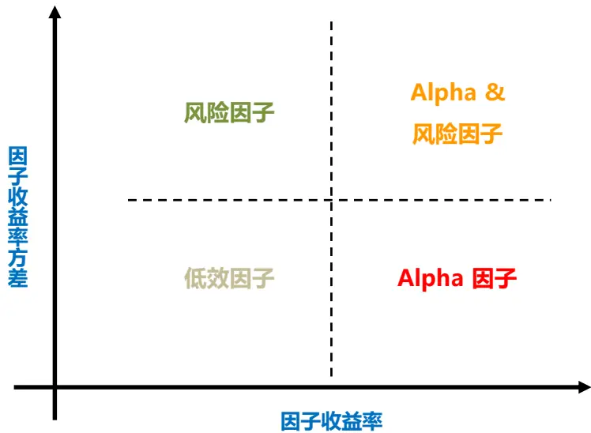
资料来源：东方证券研究所

## 1.2 因子收益率、纯因子收益率和风险溢价

本节先区分几个报告后续会用到的概念：因子收益率（Factor Return）、纯因子收益率（PureFactor Return）和因子风险溢价（Factor Risk Premium）。这里三个概念适用于所有定价因子。

因子收益率用来反映单个选股因子对股票未来收益的影响。我们在检验 alpha因子有效性时已经频繁使用到这个概念，也就是 alpha 因子选出来的 top 10% minus Bottom 10% 的多空组合收益率。但这个多空组合收益率反映的并不完全，因为它只用到顶部和底部的少量股票，无法反映因子在全市场股票里的效用。更全面反映因子收益率的方法是先把因子数据标准化，得到 ZSCORE，再以 ZSCORE 作为个股权重构造多空组合，这个组合的收益率称作因子收益率。

因子收益率和单因子的 Fama-Macbeth 横截面回归密切相关。假设有 N个股票， $\mathrm{X_{i}}$ 为股票 在某个因子上的 ZSCORE得分， $\mathrm{R_{i}}$ 表示未来一期的股票收益率，如果在横截面上做回归：

$$
\mathrm{R}_{\mathrm{i}}=\alpha+\beta\cdot\mathrm{X}_{\mathrm{i}}+\epsilon\quad\mathrm{i}=1,2\ldots\mathrm{N}
$$

的 OLS 估计可以写作 $\begin{array}{r}{\widehat{\beta}=\frac{\sum_{i=1}^{N}X_{i}R_{i}-\sum_{i=1}^{N}X_{i}\sum_{i=1}^{N}R_{i}/N}{\sum_{i=1}^{N}X_{i}^{2}-\left(\sum_{i=1}^{N}X_{i}\right)^{2}/N}}\end{array}$ ，因为 $\mathbf{X_{i}}$ 是标准化后的 ZSCORE， 所以$\begin{array}{r}{\sum_{i=1}^{N}X_{i}=0,\sum_{i=1}^{N}X_{i}^{2}=N}\end{array}$ 。代入前式，得到 $\begin{array}{r}{\widehat{\beta}=\frac{1}{N}\sum X_{i}\cdot R_{i}}\end{array}$ ，也就是说如果对单个因子做一元的Fama-Macbeth 回归，再在时间序列上检验 的显著性等价与直接对该因子的因子收益率做 t 检验。

纯因子收益率的大小和多因子模型对应，不同的多因子模型，单个因子的纯因子收益率不同。假设有 K个因子，某个股票组合对第 k个因子的暴露度等于 1，对其它因子的暴露度等于 0，（暴露度计算方法参考第 1.4节）则这个组合称为纯因子组合，其收益率称作纯因子收益率。实际投资中，一些专业的风险模型提供商（BARRA、Axioma、Northfield）包含的风险因子数量都在几十个的级别，但全市场的股票有几千个。求解风险因子纯因子组合的个股权重相当于求解几千个变量的线性方程，但等式条件只有几十个。因此实际投资中，风险因子纯因子组合并不唯一，有无穷多个，造成这种结果的原因是因为我们真实投资中无法穷尽列出所有的风险因子。

通过 Fama-Macbeth 多元回归，我们可以构造出一个纯因子组合。假设有 K 个定价因子，股票 在因子 k 上的暴露度为  , 记 矩阵 B 为暴露度矩阵 $\mathtt{B_{i,k}}=\mathtt{X_{i}^{k}}$ ，则做横截面回归

$$
\boldsymbol{\mathrm{R}}=\boldsymbol{\mathrm{B}}\cdot\boldsymbol{\mathrm{f}}+\epsilon
$$

可以得到 f的 OLS估 ${\hat{f}}=(\mathbf{B}^{\mathrm{T}}\cdot B)^{-1}\cdot\mathbf{B}^{\mathrm{T}}\cdot R$ ，如果记矩阵 $\mathbf{W}=(\mathbf{B}^{\mathrm{T}}\cdot B)^{-1}\cdot\mathbf{B}^{\mathrm{T}}$ ，则W 的第 k个行向量可以看作某个组合的权重，该组合的收益率就等于第 k个因子的回归系数。而

$$
(\mathrm{B}^{\mathrm{T}}\cdot B)^{-1}\cdot\mathrm{B}^{\mathrm{T}}\cdot\mathrm{B}=\mathrm{I}\quad\Rightarrow\quad\mathrm{H}\cdot\mathrm{B}=\mathrm{I}
$$

其中 I为单位阵，可知该组合对 k个因子的暴露度等于 1，对其它因子的暴露度等于零，是一个纯因子组合。因此横截面回归时，第k个因子的回归系数即是该因子的纯因子收益率。Fama-Macbeth多元回归检验即是在在检验因子的纯因子收益率是否显著。如果进一步假设上述回归的各个股票残差收益的方差不想等，分别记做 ，上述横截面回归以 $\mathsf{S}^{-1}=\mathrm{diag}(\mathsf{S}_{1}^{-1},S_{2}^{-1}\ldots S_{K}^{-1})$ 为权重做加权线性回归可以得到 f 的 WLS（Weighted Least Square）估计 ${\hat{f}}=(\mathrm{B}^{\mathrm{T}}\cdot S^{-1}\cdot B)^{-1}\cdot\mathrm{B}^{\mathrm{T}}\cdot S^{-1}\cdot R$ ，类似的可以证明这样得到的第 k 个因子回归系数也对应着一个 k 因子纯因子组合的收益率，而且这个组合还是 k 因子的所有纯因子组合中方差最小的，称作因子模拟组合（Factor Mimicking Portfolio），也称作因子特征组合（Factor Characteristic Portfolio）。

在套利定价模型（APT）里面，如果假设市场存在无风险资产，无风险收益率为 $\boldsymbol{\mathrm{r}}_{\mathrm{f}}$ ，则第 k个因子的风险溢价 $\mathbf{\nabla}\cdot\lambda_{\mathbf{k}}=E(f_{k})-r_{f},\mathbf{\nabla}\mathbf{f_{k}}$ 为第 k个因子的特征组合收益率（参考前期报告《Alpha因子库精简与优化》）。所以，纯因子组合不同的构造方式，会得到不同的纯因子收益率，也就有不同的风险溢价，但这并不和 APT理论里面风险溢价的唯一性矛盾，因为 APT理论是假设我们已经找到了所有的股票定价因子，但事实上这不可能做到。

在不引起误解的前提下，因子收益率、纯因子收益率、风险溢价几个概念在研究文献常被混用。

## 1.3 寻找风险因子

可以从以下三个维度判断一个因子是否是风险因子：

1) 因子对股价有显著影响。按我们之前的理解，风险因子应该是一个定价因子，因子收益率可以很小，但至少要显著。但按照 BARRA 研究人员 Menchero（2015）的说法，风险因子因子收益率可以等于零，也就是说风险因子可以不是定价因子。行业因子是最明显的例子，同行业的股票涨跌一致性高，但并不代表这个行业长期来看能获得风险溢价。BARRA 相关研究材料中并未给出风险因子筛选的定量标准。我们推测 BARRA可能更看重每个月横截面上因子收益率的显著性，也就是用单月数据回归，检验因子暴露前的回归系数是否显著，再看过去一段历史时间里面，系数显著的月份占比有多少。这样行业因子可能在大部分月份都显著，但因子收益率有时正，有时负，时间序列方向平均下来接近于零，没有风险溢价。相关实证数据参考本节后文分析。

2) 因子收益率波动大。这个是用来刻画因子的“风险”属性，因子收益率波动大，说明它会增加组合波动风险，因此应该尽量降低或中性化该因子的影响。至于波动达到什么水平才算风险因子，我们下文会对照 BARRA 十类风格因子给出参考值。对比而言，alpha因子更偏好因子收益率波动小的因子，但因子收益率波动大，Sharpe 值高的因子也会用作alpha 因子。

3) 因子数值稳定。风险因子的取值必须稳定，否则基于历史数据找到一个显著风险因子，但因子数据变化非常之大，那么未来构建组合时去控制这个因子的风险暴露会变得没有因子，因为因子数值已经完全变了。这点和 alpha因子差别非常大。A股是一个高换手市场，一些技术类因子数值变化快，但产生的 alpha也高，完全可以覆盖高换手的成本，这类因子只适合做 alpha因子，不能用作风险因子。风险因子数值的稳定性可以用前后两个横截面上因子数值的相关性来度量，BARRA 建议这个相关系数应不低于 0.9。

我们本报告参照 BARRA CNE5 (2012)附录里的说明构建了十类风格因子（图 2），并采用中信一级行业作为行业因子。这样做的原因主要有两个：

一是因子选股模型中, alpha 模型作用比风险模型大，这点可以从 Chopra（1993）的实证结果侧面反映，他发现 Mean-Variance 组合优化结果对输入的预期收益率的估计误差敏感度是协方差矩阵估计敏感度的 20多倍。改进 alpha模型，提升收益率预测准确性对组合表现的增强效果要比改进风险模型显著很多。在资源有限情况下，单独研究风险模型的增效不高。

二是鉴于 BARRA在风险模型研究领域的主导地位，直接测试他们推荐的风险因子相对从零开始要节省很多时间。我们无意仿制 BARRA 的风险模型，事实上我们报告的结论正好相反，如果投资者对风险模型有需求，建议直接购买 BARRA系统或者采用报告后文推荐的方法替代 BARRA部分功能。仿制 BARRA模型需要投入大量时间精力改进模型细节，维护更新后台数据，投入成本不一定比直接购买系统成本低，效果可能还没 BARRA系统好。我们后续研究会尝试在 BARRA 的十类风格风险因子之外再测试一些可能的风险因子。

图 2：十大类风格风险因子

| BARRA因子类别 BARRA因子简写 |  | BARRA因子说明 | 本报告使用的因子计算方法说明 | 纯因子收益率（年化） | 滞后一期相关系数 |
| --- | --- | --- | --- | --- | --- |
| Size | LNCAP | log of market cap | 使用总市值 | -14.9% *** | 0.99 |
| Beta | BETA | beta over 252 rolling trading days | 市场指数采用中证全指 | 0.0% | 0.93 |
| Momentum | RSTR | Relative Strength |  | -1.2% | 0.85 |
| Volatilty | DASTD | Daily Standard Deviation |  |  |  |
|  | CMRA | Cumulative Range |  | 1.7% | 0.95 |
|  | HSIGMA | CAPM residual volatility over 252 rolling trading days |  |  |  |
| Non-Linear Size | NLSIZE | Cube of Size |  | -3.0% *** | 0.92 |
| Book-to-Price | BTOP | Book-to-Price ration |  | 2.6% * | 0.98 |
| Liquidity | STOM | Share turnover , one month | 过去一个月日换手率的平均值 |  |  |
|  | STOQ | Average share turnover, trailing 3 months | 过去三个月日换手率的平均值 | -6.6% *** | 0.95 |
|  | STOA | Average share turnover, trailing 12 months | 过去12个月日换手率的平均值 |  |  |
| Earnings Yield | EPFWD | Predicted earnings-to-price ratio | 由于分析师数据覆盖率问题未使用 |  |  |
|  | CETOP | Cash earnings-to-price ratio | 未使用 | 2.7% *** | 0.97 |
|  | ETOP | Trailing earning-to-price ratio |  |  |  |
| Growth | EGRLF | long-term predicted earnings growth | 由于分析师数据覆盖率问题未使用 |  |  |
|  | EGRSF | Short-term predicted earnings growth | 由于分析师数据覆盖率问题未使用 | 1.9% *** |  |
|  | EGRO | Earnings growth (trailling five years) | 过去三年季度净利润同比增长率的平均值 |  | 0.99 |
|  | SGRO | Sales growth (trailing five years) | 过去三年季度销售收入同比增长率的平均值 |  |  |
| Leverage | MLEV | Market Leverage |  |  |  |
|  | DTOA | Debt-to-asset ratio |  | -0.5% | 0.99 |
|  | BLEV | Book Leverage |  |  |  |

资料来源：东方证券研究所 & Wind 资讯***, **, * 分别代表结果在 1%，5%，10%置信度下t检验显著

本报告简单风险模型用到的风格因子如上图所示，其中四个因子由于数据问题并未采用，个别因子的计算方法也基于我们现有因子库做了调整（其它风格类因子算法可参考 CNE5），十大类风格因子的方差膨胀因子（VIF）基本都小于 3，共线性对其回归系数的估计影响有限。CNE5 回溯测试区间是 1999.01-2011.12，我们本报告的测试时间是从 2009.01 到 2016.10，共 94 个月，测试标的范围是全市场股票。09年正好是 A股强小盘股效应起势之时，而今年小盘股的风格又异常强劲，因此这段时间的分析结果可能对目前市场更有参考价值，和 CNE5的结果会有明显差别。

在每个月横截面上我们用当月的股票收益率对起初的风险因子暴露做 WLS 回归（29 个中信一级行业因子和上述十个风格因子），样本数据权重为个股总市值的平方根，由此得到风险因子当月的纯因子收益率，再基于历史 94个月的数据计算得到该因子的年化纯因子收益率和波动率。和CNE5 的结果相比，最大的差别在于市值因子（Size）的纯因子收益率，年化高达-14.9%，而 CNE5中测得的结果是-2%至-1%之间，以至于和市值高度相关的 beta 因子的纯因子收益率不显著。造成这种差别的主要原因就是 2013.01至今的强劲小盘股效应。

我们这里回归采用 WLS，给市值大的股票数据更大的权重，剔除小盘股数据噪音的影响，由此得到回归 R-square 比 OLS 方法（平均高近 5%）。之所以用市值平方根做权重，主要是基于BARRA USE4 文档里提到的一个结论，个股的特质风险（Specific Risk）和其市值平方根倒数近似成比例，我们发现这个结论在 A 股也近似成立。下图是基于 94 个月历史数据计算得到的个股特质风险和市值平方根倒数的散点图分布。首先在每个月横截面上用收益率对个股期初风险暴露做OLS 回归，得到每个股票当期的残差收益（Residual Return），然后计算个股残差收益时间序列的方差即为个股的特质风险，股票市值采用这 94个月的平均市值。图 3的散点图剔除了特质风险大于36%的样本点（剔除数据量占比4.4%），如果做不带常数项的稳健回归（Robust Regression），回归的 Rsquare 达到 28.9%，回归系数在 1%置信度下显著。

图 3：A股特质风险和市值平方根倒数的散点图
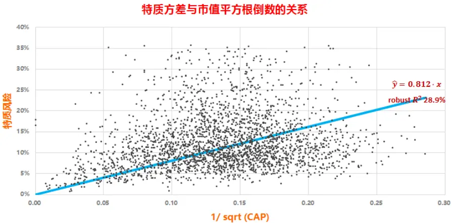
资料来源：东方证券研究所 & Wind 资讯

图 2 中的纯因子收益率是从时间序列上考查因子是否有风险溢价，但如前文所说，BARRA 不要求风险因子有风险溢价，更注重考查横截面上风险因子的显著性。因此我们在每个月横截面上用个股收益率对期初的 39个风险因子暴露（29个行业因子+10个风格因子）做单因子的一元加权线性回归，检验回归得到的因子收益率是否显著，然后再看历史 94个月里面，该因子收益率显著月份的数量占比。从图4可以看到，全市场范围内，这39个风险因子的显著月份比例大部分超过60%，说明它们对股价都有显著影响。因为我们这里没有像 CNE5 一样考虑国家因子（Country Factor，即线性回归常数项），行业因子的因子收益率包含了市场收益，因此因子收益的波动率较高。十个风格因子除了 Non-Linear Size 和 Growth 因子外，因子收益率年化波动率都在 5%以上，5%可以考虑用作判断因子收益率波动是否够大的阈值。

图 4：风险因子显著月份占比与因子收益率年化波动（全市场）
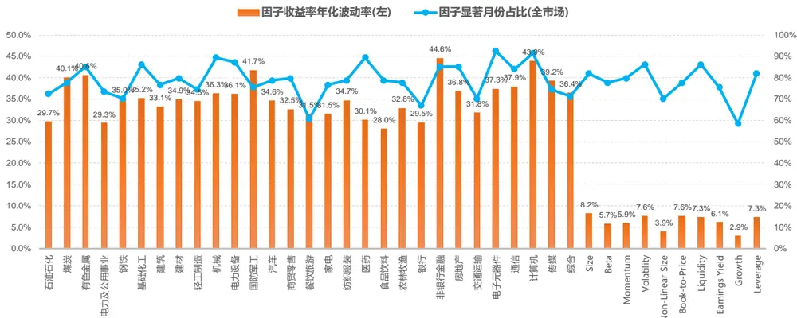
资料来源：东方证券研究所 & Wind 资讯

如果在不同的股票池检验上述 39个风险因子（图 5），Non-Linear Size 和 Growth 的显著性明显减弱，其它因子大部分时候仍然显著。

图 5：风险因子在不同股票池里的因子收益率月度显著比例
风险因子在不同股票池里的因子收益率月度显著比例
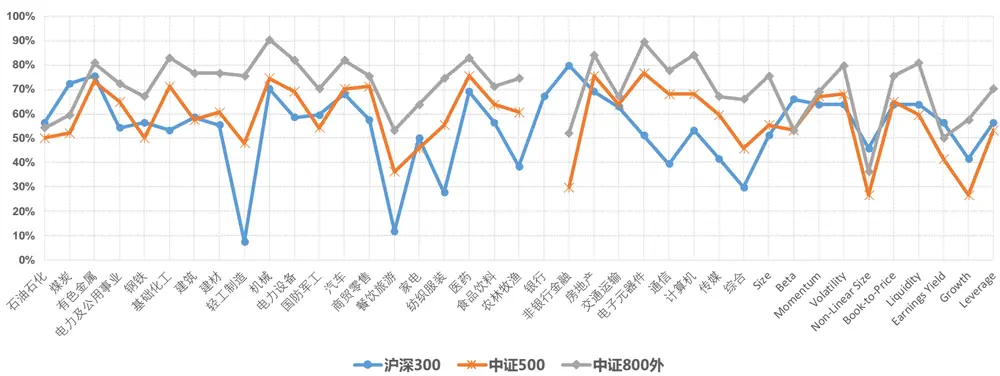
资料来源：东方证券研究所 & Wind 资讯

## 基于前面的结果，我们设计了一套风险因子评定流程：

1) 首先根据经济逻辑或投资经验选定某个选股因子，计算前后两期横截面因子数据的相关系数平均值，要求其大于 0.85；

2) 每个月横截面上，用个股收益率对该因子做回归，检验回归得到的因子收益率是否显著，要求在考察历史区间里，因子收益率显著月份的占比大于 50%；

3) 考察历史区间里，因子收益率年化波动率大于 5%；

4) 检验该因子和风险因子库里已有因子的相关性，如果相关性较高，则通过线性回归方式做正交化处理；

5) 在横截面上用收益率对新因子和原有风险因子一起做多元回归，看新因子加入后回归方程的 Adjusted R-square 是否有增加，有则纳入因子库

## 1.4 因子风险暴露度的计算

对于个股在某个风险因子上的暴露度，我们之前采取的是简单 ZSCORE 方法。例如，第 k 个股票在市值因子上的风险暴露度

$$
\mathrm{X}_{\mathrm{k}}={\frac{\log(CAP_{k})-\mu}{\sigma}}
$$

先对总市值指标 CAP 取对数做正态转换，然后减去横截面上对数市值的均值 再除以横截面标准差 。假设第 k个股票在某个组合中的权重为 $\mathbf{w}_{k}$ ，则该组合在市值因子上的暴露度为

$$
{\mathrm{X}}^{\mathrm{port}}=w_{1}\cdot X_{1}+w_{2}\cdot X_{2}+\cdots w_{N}\cdot X_{N}
$$

我们在参阅 BARRA Model Insight 相关研究材料时，发现他们计算风险暴露度的方法有所不同，计算μ 时，BARRA采用的是市值加权而非简单平均

$$
\mathsf{\Pi}\mathsf{\Pi}\mathsf{\Pi}\mathsf{\Pi}\mathsf{\Pi}\mathsf{\Pi}=\frac{CAP_{1}\cdot\log(CAP_{1})+CAP_{2}\cdot\log(CAP_{2})+\cdots CAP_{N}\cdot\log(CAP_{N})}{\sum CAP_{k}}
$$

从经济逻辑上讲，BARRA的方法更为合理，建议投资者采用。因为风险因子模型的核心假设是这些因子风险可以通过股票组合的方式分散掉。如果是采用简单平均方式，那么全市场等权组合（全市场股票做等权构成的组合）的市值风险暴露度等于零；如果采取 BARRA 的市值加权方法，那么全市场市值加权组合（可以近似看作中证全指或Wind全 A 指数）的市值风险暴露度等于 0. 目前市场上市值上总市值小于 100 亿的股票数量占比接近 60%（2016.10.31 日数据），等权组合的小市值风格明显；对比而言，市值加权组合的权重分布更为均匀，没有明显不均衡的市值偏好，更符合风险分散化组合的特征，因此全市场市值加权组合风险暴露度为零的假设更为合理；对应的，因子风险暴露度应采用 BARRA 的计算方法。

图 6：不同市值区间股票数量占比（2016.10.31）
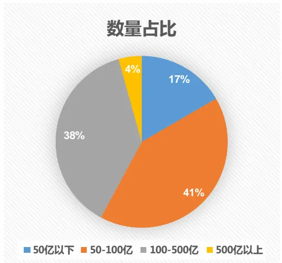
资料来源：东方证券研究所 & Wind 资讯

图 7：不同市值区间股票市值占比（2016.10.31）
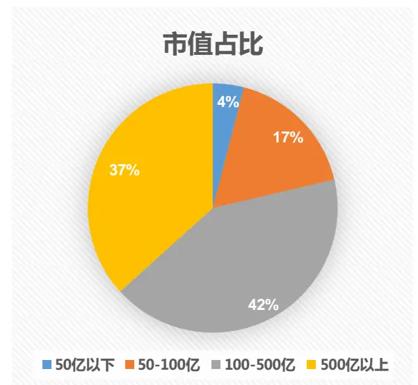
资料来源：东方证券研究所 & Wind 资讯

需要说明的是，风险因子暴露度计算采用简单 zscore 方法还是 BARRA 的市值加权法，对alpha 因子的风险中性化处理和指数增强组合的计算结果没有任何影响。因为这两种方法计算得到的因子暴露度只相差一个常数，alpha 因子通过横截面回归做风险中性化处理时，这种差别不会改变风险因子的回归系数，残差项的 zscore 相等。如果是做指数增强，通常需要控制组合整体的风险暴露，例如要求市值的风险暴露不超过 0.5，限制条件可写为

$$
\begin{array}{l}{{\displaystyle\sum_{k=1}^{N}w_{k}^{a}\cdot\frac{\log(CAP_{k})-\mu_{B}}{\sigma}\le0.5}}\\{{\displaystyle\sum_{k=1}^{N}w_{k}^{a}\cdot\log(CAP_{k})-\mu_{B}\sum_{k=1}^{N}w_{k}^{a}\le0.5\cdot\sigma}}\\{{\displaystyle\sum_{k=1}^{N}w_{k}^{a}\cdot\log(CAP_{k})\le0.5\cdot\sigma~(due~to~\sum_{k=1}^{N}w_{k}^{a}=0)}}\end{array}
$$

其中 $\mathbf{w_{k}^{a}}$ 为股票 k的主动权重，即个股在组合里的权重减去其在基准指数里的权重；如果是满仓投资，显然个股的主动权重之和等于 $0_{\circ}$ 。因此上述约束条件和风险因子的均值计算方法无关。受风险暴露度计算方式影响较大的主要是组合绩效分析。

## 1.5 因子风险模型的作用

因子风险模型的作用主要有三个：

1) 识别风险因子，降低组合收益受风险因子的影响程度。这可以通过组合优化时控制组合对某个因子的整体风险暴露度来实现，控制 BARRA目前提供的风险因子已经可以实现非常稳健的组合收益，找寻新风险因子的需求并不高，当然并不排除找到一个新风险因子能显著降低组合回撤同时又不会损失太多收益的可能性。按照 CNE5 附录的说明，投资者基本能自己实现这十类风险因子的计算。

2) 提供更准确的股票收益协方差矩阵估计。这一步主要是为后面的组合优化服务，传统的样本协防差矩阵估计是一个无偏高方差的估计量，预测效果差，而且在样本数据长度小于股票数量时，样本协方差矩阵不可求逆。通过风险因子模型这种结构化模型可以达到降维的效果，提升协方差矩阵的估计准确度。但是协方差矩阵估计并非只有结构化模型这一种，报告后文实证发现压缩估计也是一种非常有效的统计方法。

3) 组合绩效分析。这个功能主要分析组合过往业绩的业绩来源，以及当前面临的风险敞口大小。但这种分析往往都是事后的，对未来的预测意义不大，需要人为主观决定是否继续暴露或控制某个风险。

## 1.6 简单风险模型 VS BARRA

我们本报告采用的简单风险模型和 BARRA 在模型细节上有所差别。首先是风格大类因子的合成 比 例 ， 例 如 ： Volatility 因 子 ， CNE5 文 档 里 面 采 用 的 是 固 定 比 例 Volatility =0.74*DASTD+0.16*CMRA+0.1*HSIGMA。但我们实证发现这个比例随着时间变化比较大（图 8）。因此采用了 12 个月数据滚动计算的方法。计算方法是在每个月横截面用个股收益率对三个因子的暴露度做线性回归，同时加上约束条件：三个回归系数符号相同且加起来和等于 1或-1（取决于当月三个因子平均 IC 为正还是为负），当月成分因子权重为过往 12 个月权重的平均值。这种动态调整方法更能准确捕捉风险，而且合成的风格大类因子前后两期的因子数据相关性仍然很高，保证了风险因子稳定性。

图 8：Volatility 成分因子权重变化（12个月滚动）
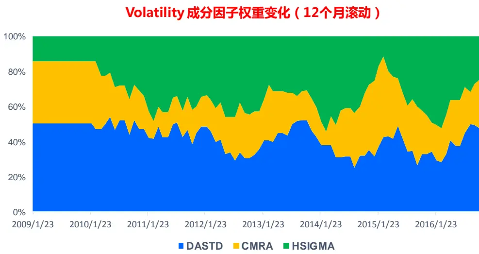
资料来源：东方证券研究所 & Wind 资讯

根据 1.2 节纯因子收益率的回归方程，股票收益率间的协方差矩阵可以写作

$$
\Sigma=\operatorname{cov}(\mathrm{\mathbb{R}},\mathrm{\mathbb{R}})=\operatorname{cov}(\mathrm{\mathbb{B}}\cdot\mathrm{\mathbf{f}}+\epsilon,\mathrm{\mathbb{B}}\cdot\mathrm{\mathbf{f}}+\epsilon)=\mathrm{\mathbb{B}}\cdot\mathrm{\mathbb{F}}\cdot\mathrm{\mathbb{B}}^{\prime}+\mathrm{\mathbb{S}}\quad\operatorname{where}\mathrm{\mathbb{F}}=\operatorname{cov}(\mathrm{\mathbb{f}},\mathrm{\mathbb{f}}),\qquad\mathrm{S=var}(\epsilon)
$$

F 为纯因子收益率的协方差矩阵，可以直接用样本协方差矩阵做估计，但后面实证发现效果一般，因此我们后面做了改进，用压缩估计量做估计。我们报告里采用的是过去 24个月的月频数据估计 ，BARRA 则是采用日频数据，并且给样本数据赋予了指数变化的权重，给近期数据更高权重，在日收益率协方差矩阵向月收益率协方差矩阵转换时，针对股票日收益率的自相关性，用Newey-West 方法做了调整。

BARRA CNE5 相对简单风险模型做的改进有很多，我们这里简单列示部分其中有差别的地方以便投资者分析参考。

1) 行业分类不一样。CNE5 采用的是全球行业行业分类标准（GICS），共 32 个行业，和中信一级行业划分有差别。

2) Country Factor 加入。也就是回归常数项的加入，由于已经有了行业虚拟变量，常数项的加入将造成共线性，无法估计参数，因此在求解残差二次平方和最小时，需带上一些限制条件。Country factor 的加入对回归方程 Rsquare 的影响不大，但是可以把市场组合收益率分离出来，此时行业虚拟变量前的纯因子收益率代表的是行业剔除掉市场和其它风格因子影响后的收益，以便更准确的做风险分析。

3) Eigenfactor Risk Adjustment。修正协方差矩阵的估计，以改善模型对组合风险的低估。

4) Volatility Regime adjustment。跟踪模型预测波动率与真实波动率的差别，如果模型一直高估或低估风险，则乘以相应的调整系数修正模型预测值。

## 二、风险模型有效性

## 2.1 风险因子对股票收益的解释度

CNE5 给出了 1997-2011 年间 BARRA 风险模型横截面回归 Adjusted Rsquare 的 12 个月滚动值，平均大概在 50%左右，但需要注意的是，这个实证结果并非在 A 股实证测试得到，而是基于 MSCI China IMI Index，这是一个海外市场的中概股指数，2016 年 10 月底有 577 只成分股，权重最大的十只股票如图 9 所示。另外，值得注意的是，CNE5 虽然相对 CHE2 有了很多技术上的改进，但从 Adjusted Rsquare 来看，变化并不大，在 2%以内。

图 9：MSCI China IMI Index 前十大权重股（2016.10）

|  | Mkt Cap (USD Billions) | Index Wt(%) | Sector |
| --- | --- | --- | --- |
| Tencent Holdings LI(CN) | 149.79 | 12.23 | Info Tech |
| Alibaba Group HLDG ADR | 114.19 | 9.32 | Info Tech |
| China Mobile | 70.38 | 5.75 | Telecom Srvcs |
| China Construction BK H | 61.63 | 5.03 | Financials |
| Baidu ADR | 47.99 | 3.92 | Info Tech |
| ICBC H | 44.43 | 3.63 | Financials |
| Bank of China H | 35.65 | 2.91 | Financials |
| Ping An Insurance H | 27.53 | 2.25 | Financials |
| CNOOC | 22.73 | 1.86 | Energy |
| Netease Com ADR | 20.27 | 1.66 | Info Tech |

资料来源：东方证券研究所 & Wind 资讯

我们分别在全市场、沪深 300成分股、中证 500成分股和中证 800外股票的范围内测试简单风险模型的横截面回归 Adjusted Rsquare，其 12 个月滚动值如图 10 所示。简单风险模型对沪深300 股票的解释度最高，平均能达到 34.0%，其次为中证 500 成分股的 18.2%，对中证 800 外小盘股的解释度最低，平均只有 13.7%。全市场来看，简单风险模型的平均 adjusted Rsquare 可以达到 20.1%。

图 10：简单风险模型在不同股票池的横截面回归 Adjusted Rsquare(12 个月滚动)
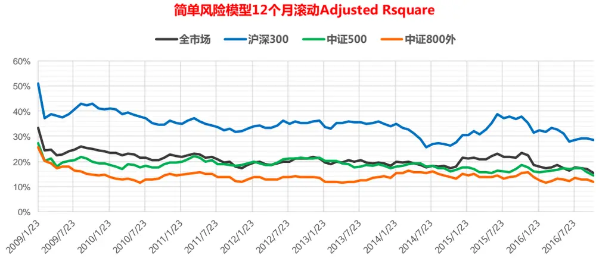
资料来源：东方证券研究所 & Wind 资讯

## 2.2 协方差矩阵估计效果

结构化因子风险模型一个重要作用就是通过降维的方式估计股票收益率的协方差矩阵。我们在之前报告《用组合优化构建更精确多样的投资组合》中提到另外一种估计协方差矩阵的方法：压缩估计量。这节我们主要实证比较这两种估计方法相对优劣。由于股票收益间的协方差是一个不可观测量，我们无法直接去比较那个方法预测的更“准”，只能比较两个方法的使用效果哪个更好。常用的比较方法是分别用两种协方差矩阵估计方法和股票真实收益数据构造一个全局最小方差组合（GMVP, Global Minimum Variance Portfolio），看 GMVP 样本外的真实方差哪个更小。

GMVP 组合可以通过组合优化的方式定义为

$$
\begin{array}{l}{\displaystyle\operatorname*{min}_{\mathbf{w}}w^{\prime}\cdot\Sigma\cdot w}\\{\mathrm{s.t.}\sum_{i=1}^{N}w_{i}=1}\end{array}
$$

这个二次规划问题有显式解 $\mathbf{w}^{*}=\Sigma^{-1}\cdot e/(e^{\prime}\cdot\Sigma^{-1}\cdot e)$ ，e 为常数 1向量。这个组合与股票预期收益率无关，完全由股票间的协方差决定。

另外补充说明一下压缩估计量，它是两个协方差矩阵的线性组合

$$
\Sigma^{\mathrm{shrink}}=\lambda\cdot\Sigma^{target}+(1-\lambda)\cdot\Sigma^{Sample}
$$

其中 $0<\lambda<1,\ \Sigma^{sample}$ 是样本协方差矩阵，是无偏估计量，但估计方差太大。因此要找一个估计方差小，允许有偏的估计量和其做中和。参数 可以通过渐进化方法最小化压缩估计量和真实协方差矩阵的样本内二次误差平方和得到。目标矩阵通常有三种选择（Ledoit 2003 & 2004）

a) 单位阵， $\Sigma^{\mathrm{target}}=(\sigma_{1},\sigma_{2}\dots\sigma_{N})^{\prime}\cdot I\cdot(\sigma_{1},\sigma_{2}\dots\sigma_{N})$ ，其中 I 为单位阵，这种结构最为简单，偏差最大，但只需要估计 N 个股票的方差即可，因此估计参数少，估计量方差小。

b) 平均相关系数矩阵。 $\Sigma^{\mathrm{target}}=(\sigma_{1},\sigma_{2}\dots\sigma_{N})^{\prime}\cdot M\cdot(\sigma_{1},\sigma_{2}\dots\sigma_{N})$ ，其中 $\mathbf{M}_{\mathrm{i,j}}=1\cdot(i==j)+\bar{\rho}$ ( )， ̅ 为股票间的平均相关系数。和单位阵比，它的结构复杂一些，估计偏差会减小，但需要多估计一个参数，估计量方差可能变大。

c) CAPM 单因素协方差矩阵。 $\Sigma^{\mathrm{target}}=\sigma_{m}^{2}\cdot(\beta_{1},\beta_{2}\dots\beta_{N})^{\prime}\cdot(\beta_{1},\beta_{2}\dots\beta_{N})+\Delta$ ，其中 $|\sigma_{\mathrm{m}}^{2}$ 为市场指数收益率方差， 为个股 beta系数， 为残差收益率方差对角阵。这个模型相对前两者结构最为复杂，估计偏度会降低，但估计方差会增大。

我们这里测试了五种方法得到 GMVP 组合，

M1. 用简单风险模型估计，因子收益率协防差矩阵 F用样本协方差估计

M2. 用简单风险模型估计，F用压缩估计量估计，压缩目标为平均相关系数矩阵。

M3. 用压缩估计量估计，压缩目标为单位阵。

M4. 用压缩估计量估计，压缩目标为平均相关系数矩阵。

M5. 用压缩估计量估计，压缩目标为 CAPM单因素协方差矩阵。

测试范围为全市场股票，测试时间从 2009.01到 2016.10.31，M1 和 M2 都是用滚动过去两年24 个月的月频数据估计模型参数，M3, M4, M5 则是用过去一年的日频数据估算。下图计算得到GMVP 样本外方差均为 2011.01-2016.10 间的数据。

图 11：不同模型得到的 GMVP 年化波动率
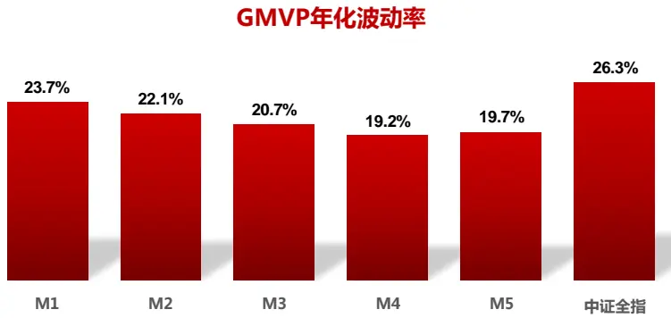
资料来源：东方证券研究所 & Wind 资讯

可以看到，GMVP 组合的样本外波动都小于中证全指，其中采用压缩估计的 M3,M4,M5 的波动率明显小于采用结构化模型的 M1,M2；M2 波动率小于 M1说明部分采用压缩估计也可以改善样本结构化风险模型估计效果。三个采用压缩估计量的模型中，M4 的波动率最小，说明它在模型复杂度和估计量方差之间取得了最好的平衡。我们之前的研究报告大多采用 M4 方法来估计协防差矩阵，实际使用效果较为满意。CNE5 的结构化风险模型是采用日频数据来估计协方差矩阵，并做了多项技术细节上的改进，我们没有购买 BARRA 系统，这里无法判断 CNE5 和压缩估计量方法孰优孰劣。M4 模型压缩系数变化如图 13所示，压缩估计量权重更偏向样本协方差矩阵。

图 12：M4 模型压缩系数λ的变化
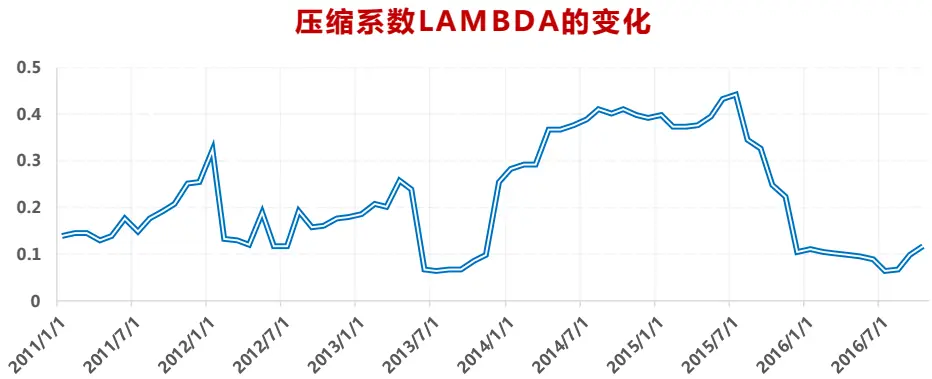
资料来源：东方证券研究所 & Wind 资讯

用因子风险模型另一个需要注意的地方是 Alpha错配（Alpha Misalignment）问题，也就是说用于预测股票收益的 alpha因子和用于预测组合风险的风险因子不一致，可能使得部分 alpha因子包含的信息在风险模型看来是无风险的，造成优化组合不必要的风险暴露（Lee 2008）。BARRA和 Axioma都设计了解决此类问题的方案，本质思路是扩展风险模型包含 alpha因子的信息，而采用压缩估计量则不需考虑这个问题。另外，估计协方差矩阵的统计方法不止压缩估计量一种，感兴趣的投资者可以参考 Bai(2011)的 review，Axioma 08 年（Renshaw 2008）还提出了一种把统计模型和结构化模型方法结合在一起的技术手段，这些方法有可能能进一步改进协方差矩阵估计。

## 2.3 风险因子重要性排序

之前报告《Alpha因子库精简与优化》中提出的因子筛选方法试用于任何定价因子，但 BARRA的风险因子并不要求是定价因子，因此原方法无法直接照搬过来使用，需要做几点修改：

1. 取消时间序列上因子收益率显著性检验。

2. 取消未选入因子对已选入因子的正交化处理。BARRA风险因子已经做过部分正交化处理，因子的 VIF较小，对参数估计影响不大，用原始因子的经济含义更直观。

3. OLS 回归改为以个股市值平方根为权重的 WLS 回归，和协方差矩阵估计过程保持一致。经过以上三个变动，新流程的作用不再是筛选因子，而是对于各个风险因子的 Rsqure 增量贡献做排序。模型在 2009.01- 2016.10 期间的测试结果如下图 11 所示。

可以看到，所有风险因子中，行业因子的作用最大，在沪深 300 和中证 500 成份股中解释的方差占比超过一半；对于中证 800 外的小市值股票，行业效应有所减弱，但仍然是最重要的风险因子。在沪深 300 和中证 500 成份股里面，除去行业因子，波动率和动量风险的作用强于市值因子；而在中证 800 外的股票里，市值因子的效用仅次于行业因子。由于 A 股小盘股的数量占绝大多数，因此造成了全市场来看市值风险仅次于行业风险的现象，如果投资者只是在沪深 300 成分股或中证 500成分股内做指数增强，控制波动率和动量风险的效果可能好于市值风险，

图 13：风险因子重要性排序

| 沪深300 |  | 中证500 |  | 中证800外 |  | 全市场 |  |
| --- | --- | --- | --- | --- | --- | --- | --- |
| 风险因子 | Adj-Rsquare | 风险因子 | Adj-Rsquare | 风险因子 | Adj-Rsquare | 风险因子 | Adj-Rsquare |
| Industry | 24.5% | Industry | 11.6% | Industry | 5.6% | Industry | 8.3% |
| + Volatility | 28.5% | + Momentum | 14.1% | + Size | 9.3% | + Size | 14.7% |
| + Momentum | 30.0% | + Volatility | 15.4% | + Liquidity | 11.0% | + Volatility | 16.9% |
| + Size | 31.0% | + Liquidity | 16.0% | + Volatility | 11.7% | + Book-to-Price | 17.6% |
| + Book-to-Price | 31.8% | + Size | 16.6% | + Earnings Yield | 12.2% | + Liquidity | 18.2% |
| + Earnings Yield | 32.5% | + Book-to-Price | 17.1% | + Momentum | 12.6% | + Momentum | 18.8% |
| + Beta | 33.1% | + Earnings Yield | 17.5% | + Book-to-Price | 13.0% | + Earnings Yield | 19.3% |
| + Leverage | 33.4% | + Beta | 17.9% | + Leverage | 13.3% | + Beta | 19.5% |
| + Growth | 33.7% | + Growth | 18.0% | + Beta | 13.4% | + Leverage | 19.8% |
| + Liquidity | 34.0% | + Non-Linear Size | 18.1% | + Non-Linear Size | 13.6% | + Non-Linear Size | 19.9% |
| + Non-Linear Size | 34.0% | + Leverage | 18.2% | + Growth | 13.7% | + Growth | 20.1% |

资料来源：东方证券研究所 & Wind 资讯

风险因子可以帮助投资控制风险，提升稳健性，但风险因子并非控制越多越好，控制过多会导致 Alpha 损失过快，损失速度超过组合波动降低的速度，稳健性反而下降，因此优先控制哪些因子便是需要考量的问题，图 13的风险因子重要性排序可以作为一个参考。例如在全市场选股增强中证 500 指数时，重要性最高的两个因子是行业和市值，过往实证研究显示控制行业和市值因子就可以获得非常稳健的超额收益。沪深 300 成份股的情况略有不同，波动率和动量因子的重要性强于市值因子，控制这些风险因子的指数增强效果是否会强于控制市值因子呢，下面做了一个测试。

测试时间从 2011.01-2016.10，在沪深 300成分股内选股做沪深 300指数增强，按照图 13的风险因子重要性排序逐步增加模型控制的风险因子数量，风险因子暴露度都控制到 0。需要注意的是，控制了哪些风险因子，alpha因子也应该相应的对这些风险因子做中性化处理（参考报告《Alpha预测》中有关风险调整 IC的论述），从中选出 IC高的 alpha因子，再用滚动过去两年的数据训练随机森林模型，预测下一个月股票收益。然后再用上一节的 M4模型估计股票收益间的协方差矩阵，和预测的股票收益一起，在风险暴露限制条件下做优化得到个股权重，回溯测试过程未扣费。结果如图 14和图 15所示.

图 14：控制不同风险因子沪深 300指数增强组合对冲净值曲线
控制不同风险的组合对冲净值曲线
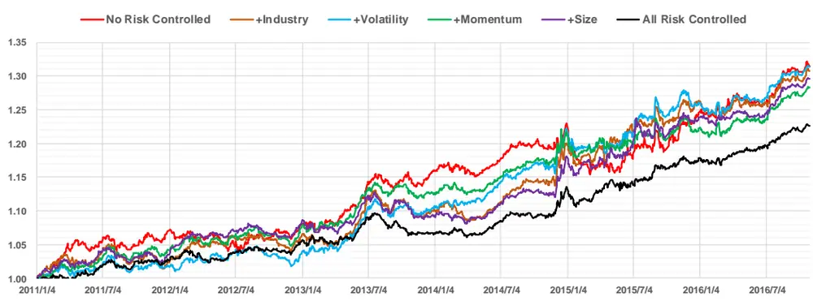
资料来源：东方证券研究所 & Wind 资讯

图 15：控制不同风险因子沪深 300指数增强组合数据统计

| 沪深300增强（成份股内） | 年化对冲收益 | 年化跟踪误差 | 信息比 | 月胜率 | 最大回撤 | 平均股票数量 | 月单边换手率 |
| --- | --- | --- | --- | --- | --- | --- | --- |
| No Risk Controlled | 5.0% | 3.7% | 1.34 | 62.9% | -6.2% | 123.3 | 41.2% |
| + Industry | 4.9% | 3.7% | 1.32 | 65.7% | -4.0% | 125.1 | 32.4% |
| +Volatility | 4.9% | 3.4% | 1.44 | 61.4% | -3.1% | 131.0 | 35.7% |
| +Momentum | 4.5% | 3.3% | 1.36 | 70.0% | -3.4% | 130.3 | 37.3% |
| + Size | 4.7% | 3.0% | 1.55 | 64.3% | -4.1% | 118.7 | 31.1% |
| All Risk Controlled | 3.7% | 2.5% | 1.47 | 68.6% | -3.3% | 138.9 | 29.3% |

资料来源：东方证券研究所 & Wind 资讯

可以看到，随着控制的风险因子数量的增多，增强组合的跟踪误差逐步减少，但是因为风险中性化处理对 alpha 因子的影响，组合的年化对冲收益并未呈现和跟踪误差一样的单调性。不过把所有风险因子暴露都控制到零后，组合的年化对冲收益最低，只有 3.7%，控制风险而导致的 alpha损失最高。另外控制风险后，对冲组合的净值最大回撤都有明显降低，但最大回撤指标不宜作为评判策略稳健性的唯一标准，因为这个指标对个股和市场行情的变化极度敏感，应结合跟踪误差指标一起判断。我们下面也比较了常用的控制Industry+Size策略和控制Industry+Volatility策略的效果，可以看到控制 Industry+Volatility 策略稳健性更高，建议投资者实际投资中优先控制对个股收益率解释度更高的风险因子。

图 16：控制 Industry+Volatility 沪深 300 增强效果
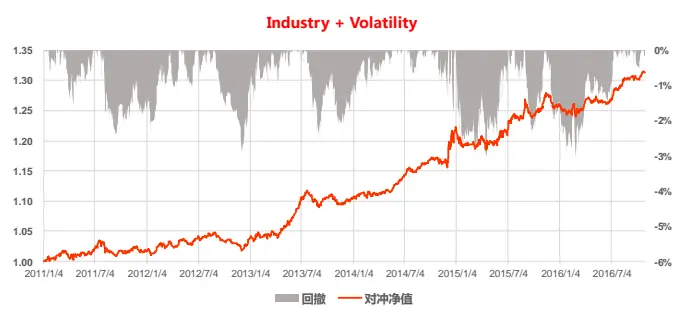

| 中证500增强（全市场） | 年化对冲收益 | 年化跟踪误差 | 信息比 | 月胜率 | 最大回撤 | 平均股票数量 | 月单边换手率 |
| --- | --- | --- | --- | --- | --- | --- | --- |
| Industry+Volatility | 4.9% | 3.4% | 1.44 | 61.4% | -3.1% | 131.0 | 35.7% |

资料来源：东方证券研究所 & Wind 资讯

图 17：控制 Industry+Size 沪深 300 增强效果
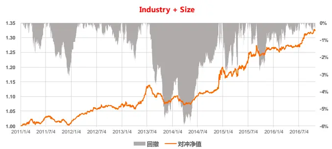

| 中证500增强（全市场） | 年化对冲收益 | 年化跟踪误差 | 信息比 | 月胜率 | 最大回撤 | 平均股票数量 | 月单边换手率 |
| --- | --- | --- | --- | --- | --- | --- | --- |
| Industry+Size | 5.1% | 3.5% | 1.45 | 68.6% | -6.0% | 114.8 | 30.5% |

资料来源：东方证券研究所 & Wind 资讯

## 三、总结

风险模型有三个功能，前两个功能对投资者的作用最为重要。BARRA CNE5文档的附录提到的十类风格风险因子基本覆盖了目前 A 股市场的主要风险，控制好这些风险已经可以让对冲组合获得非常稳健的收益，寻找新风险因子的需求不高。基于风险因子结构化模型去估算股票间的收益率协方差矩阵，计算十分复杂，用月频数据的简单风险模型效果不好，需要像 BARRA一样用日频数据，配合一些统计方法的改进，研究开发的成本很高，我们建议对风险模型有需求的投资者直接购买 BARRA系统或者采用报告里提到的压缩估计量方法来估计协方差矩阵，计算便捷高效，实际使用效果良好。

## 风险提示

1. 量化模型基于历史数据分析得到，未来存在失效的风险，建议投资者紧密跟踪模型表现。

2. 极端市场环境可能对模型效果造成剧烈冲击，导致收益亏损。

## 参考文献

[1]. Bai, J., Shi S., (2011), “ Estimating High Dimensional Covariance Matrices and Itrs Applications”, Annals of Economics and Finance, 12-2, pp:199-215.

[2]. Chopra, V.K., William, T.Z，(1993), “ The effect of errors in means, variance and covariance on optimal portfolio choice”, Journal of Portfolio Management, Winter , 6-11.

[3]. Ledoit, O. , Wolf, M. (2003). “Improved estimation of the covariance matrix of stock returns with an application to portfolio selection”, Journal of Empirical Finance, 10(5):603–621.

[4]. Ledoit, O. , Wolf, M. (2004). “Honey, I Shrunk the Sample Covariance Matrix”, Journal of Portfolio Management, Vol(30) pp :110–119.

[5]. Lee, J.H., Stefeck, D., (2008), “Do Risk Factors Eat Alphas?”, Journal of Portfolio Management.

[6]. Menchero, J., Lee, J.H., (2015), “Efficiently Combining Multiple Sources of Alpha”, Journal of Investment Management , Vol(13), pp 71-86.

[7]. Menchero, J., Orr, D.J., Wang J., (2011), “ The Barra US Equity Model (USE4)”, MSCI Model Insight.

[8]. Orr, D.j., Mashtaler, I., Nagy, A., (2012), “The Barra China Equity Mode (CNE5)”, MSCI Epirical Notes.

[9]. Renshaw A., (2008), “ Portfolio Construction Strategies Using More than One Risk Model”, Axioma Research Paper, N.O. 008.

## 分析师申明

每位负责撰写本研究报告全部或部分内容的研究分析师在此作以下声明：

分析师在本报告中对所提及的证券或发行人发表的任何建议和观点均准确地反映了其个人对该证券或发行人的看法和判断；分析师薪酬的任何组成部分无论是在过去、现在及将来，均与其在本研究报告中所表述的具体建议或观点无任何直接或间接的关系。

## 投资评级和相关定义

报告发布日后的 12个月内的公司的涨跌幅相对同期的上证指数/深证成指的涨跌幅为基准；

## 公司投资评级的量化标准

买入：相对强于市场基准指数收益率15%以上；

增持：相对强于市场基准指数收益率5%～15%；

中性：相对于市场基准指数收益率在-5%～+5%之间波动；

减持：相对弱于市场基准指数收益率在-5%以下。

未评级——由于在报告发出之时该股票不在本公司研究覆盖范围内，分析师基于当时对该股票的研究状况，未给予投资评级相关信息。

暂停评级——根据监管制度及本公司相关规定，研究报告发布之时该投资对象可能与本公司存在潜在的利益冲突情形；亦或是研究报告发布当时该股票的价值和价格分析存在重大不确定性，缺乏足够的研究依据支持分析师给出明确投资评级；分析师在上述情况下暂停对该股票给予投资评级等信息，投资者需要注意在此报告发布之前曾给予该股票的投资评级、盈利预测及目标价格等信息不再有效。

## 行业投资评级的量化标准：

看好：相对强于市场基准指数收益率5%以上；

中性：相对于市场基准指数收益率在-5%～+5%之间波动；

看淡：相对于市场基准指数收益率在-5%以下。

未评级：由于在报告发出之时该行业不在本公司研究覆盖范围内，分析师基于当时对该行业的研究状况，未给予投资评级等相关信息。

暂停评级：由于研究报告发布当时该行业的投资价值分析存在重大不确定性，缺乏足够的研究依据支持分析师给出明确行业投资评级；分析师在上述情况下暂停对该行业给予投资评级信息，投资者需要注意在此报告发布之前曾给予该行业的投资评级信息不再有效。

## 免责声明

本证券研究报告（以下简称“本报告”）由东方证券股份有限公司（以下简称“本公司”）制作及发布。

本报告仅供本公司的客户使用。本公司不会因接收人收到本报告而视其为本公司的当然客户。本报告的全体接收人应当采取必要措施防止本报告被转发给他人。

本报告是基于本公司认为可靠的且目前已公开的信息撰写，本公司力求但不保证该信息的准确性和完整性，客户也不应该认为该信息是准确和完整的。同时，本公司不保证文中观点或陈述不会发生任何变更，在不同时期，本公司可发出与本报告所载资料、意见及推测不一致的证券研究报告。本公司会适时更新我们的研究，但可能会因某些规定而无法做到。除了一些定期出版的证券研究报告之外，绝大多数证券研究报告是在分析师认为适当的时候不定期地发布。

在任何情况下，本报告中的信息或所表述的意见并不构成对任何人的投资建议，也没有考虑到个别客户特殊的投资目标、财务状况或需求。客户应考虑本报告中的任何意见或建议是否符合其特定状况，若有必要应寻求专家意见。本报告所载的资料、工具、意见及推测只提供给客户作参考之用，并非作为或被视为出售或购买证券或其他投资标的的邀请或向人作出邀请。

本报告中提及的投资价格和价值以及这些投资带来的收入可能会波动。过去的表现并不代表未来的表现，未来的回报也无法保证，投资者可能会损失本金。外汇汇率波动有可能对某些投资的价值或价格或来自这一投资的收入产生不良影响。那些涉及期货、期权及其它衍生工具的交易，因其包括重大的市场风险，因此并不适合所有投资者。

在任何情况下，本公司不对任何人因使用本报告中的任何内容所引致的任何损失负任何责任，投资者自主作出投资决策并自行承担投资风险，任何形式的分享证券投资收益或者分担证券投资损失的书面或口头承诺均为无效。

本报告主要以电子版形式分发，间或也会辅以印刷品形式分发，所有报告版权均归本公司所有。未经本公司事先书面协议授权，任何机构或个人不得以任何形式复制、转发或公开传播本报告的全部或部分内容。不得将报告内容作为诉讼、仲裁、传媒所引用之证明或依据，不得用于营利或用于未经允许的其它用途。

经本公司事先书面协议授权刊载或转发的，被授权机构承担相关刊载或者转发责任。不得对本报告进行任何有悖原意的引用、删节和修改。

提示客户及公众投资者慎重使用未经授权刊载或者转发的本公司证券研究报告，慎重使用公众媒体刊载的证券研究报告。

## 东方证券研究所

地址：上海市中山南路 318 号东方国际金融广场 26 楼

联系人： 王骏飞

电话：021-63325888*1131

传真：021-63326786

网址： www.dfzq.com.cn

Email： wangjunfei@orientsec.com.cn