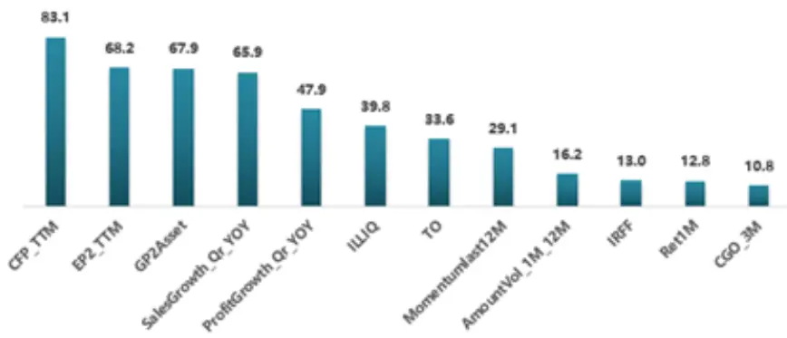
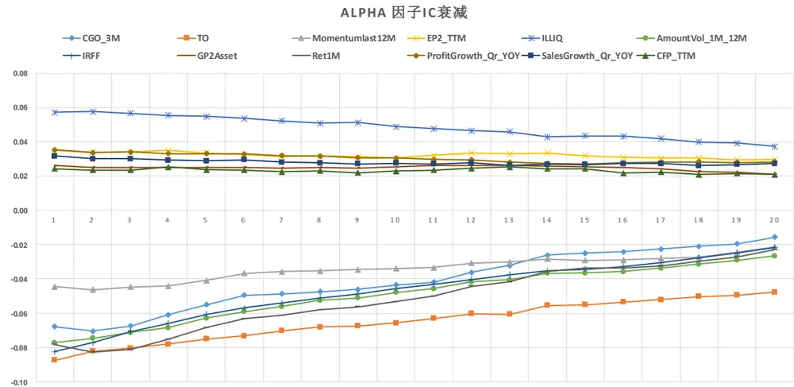
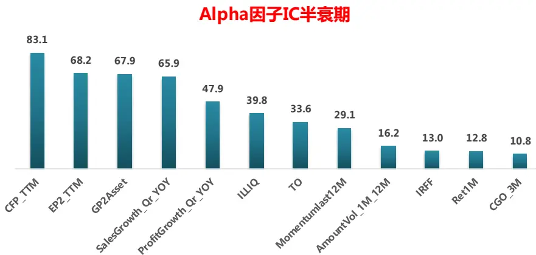
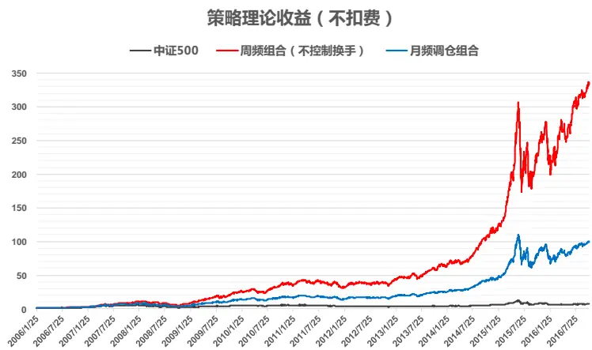
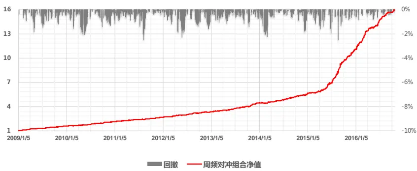
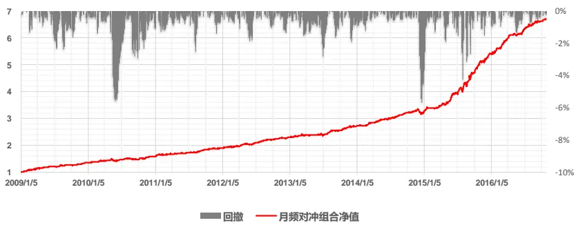
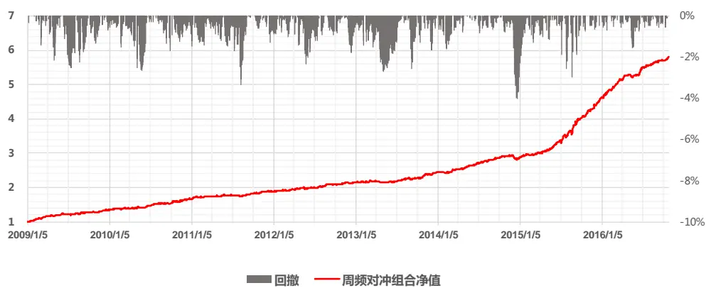
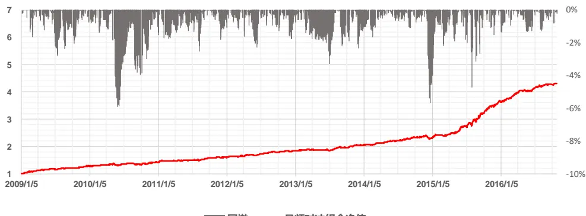

## 研究结论

因子选股研究通常采用月频调仓模式，但是Alpha 因子的效用并非在未来一个月均匀分布，而是呈现逐步衰减的形态，也就是说我们从月初获得的alpha要比月末获得的alpha 高，持仓一个月不动的调仓方式在当月后半段资金利用效率较低，有必要在alpha 衰退之前调仓

因子的alpha 衰减速度可以用其IC 的半衰期度量，基本面因子、估值因子的衰减速度较慢，例如 CFP_TTM指标的半衰期长达四个月；而技术类指标的衰减速度较快，CGO_3M指标11 天左右IC 即衰减了一半。

实证发现，不论是做主动量化还是做指数增强组合，周频调仓方式在交易成本较低的情况表现都明显优于月频调仓组合，但当单边交易成本达到 0.5%时，高频调仓带来的 alpha 增量将无法覆盖高换手带来的冲击成本，有必要人为主动控制换手率。

控制换手会降低组合的总体换手率，节约交易成本，但同时也会损耗alpha。当交易成本较低时，后者大于前者；交易成本较高时，前者大于后者。我们实证发现即使人为控制换手，使得周频组合换手率降至月频调仓组合的水平，在不同交易成本设臵下，周频组合的表现都要明显优于月频调仓组合。

周频调仓除了可以提升组合收益，也可以分散交易，降低冲击成本，增加策略资金容量。报告里的测试方法完全可以用作日频调仓，但需要注意的是，交易频率越高，策略对交易水平的要求越高，算法交易是非常有必要的辅助工具。

## 风险提示

- 量化模型失效风险

- 市场极端环境的冲击

Alpha因子IC半衰期

报告发布日期2016 年 12 月 05 日

证券分析师 朱剑涛

021-63325888*6077

zhujiantao@orientsec.com.cn

执业证书编号：S0860515060001

联系人张惠澍

021-63325888-6123

zhanghuishu@orientsec.com.cn

相关报告

| A 股市场风险分析 | 2016-12-02 |
| --- | --- |
| 非对称价格冲击带来的超额收益 | 2016-11-10 |
| 东方机器选股模型 Ver 1.0 | 2016-11-07 |
| Alpha 预测 | 2016-10-25 |
| 线性高效简化版冲击成本模型 | 2016-10-21 |
| 资金规模对策略收益的影响 | 2016-08-26 |
| Alpha 因子库精简与优化 | 2016-08-12 |
| 日内残差高阶矩与股票收益 | 2016-08-12 |
| 动态情景多因子 Alpha 模型 | 2016-05-25 |

## 一、Alpha 衰退

## 1.1 Alpha 衰退与调仓频率

Alpha来源自市场的失效，市场信息未得到充分利用，虽然无法像资产定价理论中那样假设所有投资者都是理性投资人，但是理性投资个体的存在会使得市场趋于有效，alpha信息的有效性会减弱，这种现象称之为 alpha衰退。

之前做因子选股模型我们大多采用的是月频调仓模式，这样做一方面可以降低交易频率，便于机构投资者操作，另一方面从研究角度讲，数据更新维护和程序开发的压力会小很多。但是 Alpha因子的效用并非在未来一个月均匀分布，而是呈现逐步衰减的形态，也就是说我们从月初获得的alpha要比月末获得的 alpha高，持仓一个月不动的调仓方式在当月后半段资金利用效率较低，有必要在 alpha衰退之前调仓。

## 1.2 Alpha 因子 IC 衰减

我们搜集整理了市场公开研究报告里提出的 alpha因子，将原有的 alpha因子库数量扩展至 41个，但使用之前报告《Alpha精简与优化》里提出的因子筛选方法把因子库精简后，发现因子库的扩大并未带来多少 alpha信息的增加，我们最终从中筛选出 12个 alpha因子（图 3）。

Alpha 因子有效性的衰退速度可以用其 IC 数值的变化来衡量，记 为 t 日 Alpha 因子的ZSCORE 取值， $\Gamma_{\mathrm{t}+\Delta\mathrm{t}}$ 为 天后的股票日收益率， $\mathrm{IC}_{\Delta\mathrm{t}}=corr(X_{t},r_{t+\Delta t})$ 。图 1 展示了 取值从 1到 20 时，12 个 alpha 因子的 $\mathrm{IC}_{\Delta\mathrm{t}}$ 的变化。

图 1：Alpha 因子 IC 衰减示意图（测试时间 2006.01.01 – 2016.10.28）

数据来源：东方证券研究所 & Wind资讯

从图 1 可以直观看到，基本面因子 CFP_TTM、GP2ASSET、ProfitGrowth_Qr_YOY 等指标的alpha衰减速度较慢，而 TO，IRFF，Ret1M等技术指标的衰减速度则要快很多。从IC 衰减曲线的形状看，IC 衰减近似指数形式，因此我们可以用用指数函数  去拟合 alpha因子的 IC数据，计算其半衰期。不过 20 天数据太短，曲线拟合 Rsquare 不高，我们采用了 60 天数据，Rsquare平均可以达到 90%，由此得到的各个 alpha 因子半衰期如下图所示。

图2：Alpha因子半衰期

数据来源：东方证券研究所 & Wind资讯

和图 1的直观结论类似，CFP_TTM指标的半衰期最长，衰减速度最慢；技术类指标 CGO_3M的衰减速度最快，11 天左右即衰减了一半。而 A 股目前有效的 alpha因子以技术类因子居多，因此月频调仓的组合在当月后半段时间赚取的 alpha 很少，应该在 alpha 衰退之前调仓，用最新的alpha因子数据重新选股，赚取衰退前的 alpha。

图3：Alpha因子周频 IC 检验（Alpha因子经过行业和市值中性化处理）

| 因子名称 | 因子定义 | rankIC | t统计量 | 年化IR |
| --- | --- | --- | --- | --- |
| CGO_3M | 三个月处置效应 | -0.073 | -12.5 | 3.63 |
| TO | 以流通股本计算的1个月日均换手率 | -0.057 | -12.5 | 3.61 |
| Momentumlast12M | 复权收盘价/复权收盘价12月前-1 | -0.036 | -7.7 | 2.24 |
| EP2_TTM | 剔除非经常性损益的过去12个月净利润/总市值 | 0.027 | 7.5 | 2.16 |
| ILLIQ | 每天一个亿成交量能推动的股价涨幅 | 0.031 | 7.7 | 2.24 |
| AmountVol_1M_12M | 过去一个月日均成交量/12个月日均成交量 | -0.058 | -15.1 | 4.36 |
| IRFF | 特异度 | -0.079 | -26.0 | 7.55 |
| Ret1M | 1个月收益反转 | -0.074 | -14.9 | 4.32 |
| GP2Asset | 毛利率/平均总资产 | 0.012 | 3.8 | 1.09 |
| CFP_TTM | 过去12个月经营性现金流/总市值 | 0.018 | 9.3 | 2.69 |
| SalesGrowth_Qr_YOY | 营业收入增长率（季度同比） | 0.018 | 8.1 | 2.34 |
| ProfitGrowth_Qr_YOY | 净利润增长率（季度同比） | 0.021 | 9.2 | 2.66 |

数据来源：东方证券研究所 & Wind资讯

报告下文实证测试了周频调仓的因子选股策略效果，其操作方式完全可以提升到日频，但需要说明的是交易频率越高，对交易水平要求也越高，交易员要能保证成交均价稳定在某个市场价格附近。因此能使用算法交易程序的私募和券商自营等机构在高频 alpha 策略执行层面占据明显优势，而目前公募和保险机构普遍采用的基金经理下达交易指令、交易员按委托下单的方式里面人为不确定因素较多，交易越频繁，累积的不确定性越高。另外，我们这里直接把月频 alpha因子拿来做周频交易，但事实可能存在一些周频有效，但月频无效的高频 alpha因子，需要再去单独寻找验证。

## 二、主动量化组合

首先，我们测试了全市场选股，不做任何风险控制的全市场 TOP100 组合。测试区间从2006.01.01 到 2016.10.28。每周（月）的最后一个交易日，我们用 12 个 alpha 因子的 IC_IR 加权得分对全市场股票排序，选取前 100 只股票等权构建组合，调仓成交价为下一个交易日的市场成交均价。在换仓的时候我们设定了跌停的不能卖、涨停不能买和停牌无法交易的条件。

## 2.1 不扣费情况下组合理论收益率

首先我们计算了月频调仓和周频调仓全市场 TOP100 等权组合在不考虑交易成本情况下的理想收益（图 4）。从结果上看，周频组合相对中证 500的年化超额收益达到 52%，远胜于月频组合的年化超额收益 31.3%，并且最大回撤和夏普率都优于月频调仓组合，这一结果说明周频组合确实能比月频组合提供更高更稳定的的 alpha。不过从换手率上来看，周频组合每年 21.09 倍的单边换手率要几乎是月频组合 8.64 倍的三倍，这样高的换手率在实际交易中会受交易成本影响很大，从而导致实际能获得的 alpha大打折扣。

图4：月频和周频全市场 TOP100 组合不扣费理论收益

|  | 中证500 | 周频组合（不控制换手） 月频调仓组合 |
| --- | --- | --- |
| 收益率 | 20.2% 72.2% | 53.5% |
| 最大回撤 | -72.4% | -59.3% -64.4% |
| 换手率 | 21.09 | 8.64 |
| Sharpe ratio | 0.56 | 2.12 1.58 |

数据来源：东方证券研究所 & Wind资讯

## 2.2 不同交易成本下周频和月频组合收益

从理论上看，周频组合换手率远大于月频组合，但更高的交易频率必然会导致更高的交易成本，因此我们比较了不同的单边交易成本下的组合收益率，这里我们分别取单边交易成本为千分之二、三、四、五并计算两类组合的收益(图5)。可以看到，随着交易费率的增加，周频组合相对月频组合的超额收益逐渐缩小，在单边 0.5%的费率下，两者收益基本相等。但是这只是纸面收益，实际投资中还涉及交易的问题，周频组合换手率是月频组合的两倍多，但收益没增加，频繁交易会增加交易结果的不确定性，此时月频调仓的方式更好。

图5：不同交易成本下周频和月频全市场 TOP100 组合的收益

|  | 中证500 | 单边0.2% |  | 单边0.3% |  | 单边0.4% |  | 单边0.5% |  |
| --- | --- | --- | --- | --- | --- | --- | --- | --- | --- |
|  |  | 周频 | 月频 | 周频 | 月频 | 周频 | 月频 | 周频 | 月频 |
| 收益率 | 20.2% | 58.5% | 48.3% | 52.0% | 45.8% | 45.9% | 43.3% | 40.0% | 40.9% |
| 最大回撤 | -72.4% | -61.3% | -65.2% | -62.4% | -65.7% | -63.6% | -66.1% | -64.7% | -66.5% |
| 换手率 |  | 21.08 | 8.63 | 21.08 | 8.64 | 21.08 | 8.63 | 21.07 | 8.63 |
| Sharpe ratio | 0.56 | 1.71 | 1.42 | 1.52 | 1.34 | 1.33 | 1.27 | 1.16 | 1.20 |

数据来源：东方证券研究所 & Wind资讯

## 2.3 控制换手率的周频和月频组合收益对比

由上面结果可知，如果组合资金规模较大，交易成本高，那么在进行周频调仓时，必须控制换手率。否则频繁交易产生的交易成本会完全吞噬周频调仓带来的额外 alpha。但是限制换手率肯定会损失 alpha，那么到底是损失的 alpha大，还是节省的交易成本多，这个就需要测算。

我们采用类似于安全垫的方法对周频组合的换手率进行控制，在每个调仓日，我们先选择持仓股票与新的 TOP100 股票池中非交集部分，然后在当中剔除不能卖出的停牌与跌停股票，卖出其中得分最低的 p%的股票，并换入相同数量的新股票池中得分最高且不在持仓股票中的非涨停个股。只要控制 p%，就可以起到控制换手率的作用。首先 p%=50%时，组合收益如下

图6：p%=50%，不同交易成本下周频和月频全市场 TOP100 组合的收益

|  | 中证500 | 单边0.2% |  | 单边0.3% |  | 单边0.4% |  | 单边0.5% |  |
| --- | --- | --- | --- | --- | --- | --- | --- | --- | --- |
|  |  | 周频 | 月频 | 周频 | 月频 | 周频 | 月频 | 周频 | 月频 |
| 收益率 | 20.2% | 55.2% | 48.3% | 51.7% | 45.8% | 48.2% | 43.3% | 44.8% | 40.9% |
| 最大回撤 | -72.4% | -63.3% | -65.2% | -63.9% | -65.7% | -64.5% | -66.1% | -65.1% | -66.5% |
| 换手率 |  | 11.72 | 8.63 | 11.73 | 8.64 | 11.73 | 8.63 | 11.73 | 8.63 |
| Sharpe ratio | 0.56 | 1.62 | 1.42 | 1.51 | 1.34 | 1.41 | 1.27 | 1.31 | 1.20 |

数据来源：东方证券研究所 & Wind资讯

可以看到，相对不控制换手率的周频组合，新周频组合的换手率降低了快一半。单边交易成本较低时(0.2%或 0.3%)，新组合收益率不及原组合，说明控制换手率导致的 alpha损耗超过交易成本的节省；单边交易成本较高时（0.4%或 0.5%）时，新组合收益明显优于原组合，说明控制换手带来的交易成本节省超出了 alpha损耗。

p%=30%时，周频组合换手率更低（图 7），基本和月频组合换手率基本保持一致，但是在不同交易成本下，月频调仓组合的收益都明显高于月频组合。在保证组合总体换手率不变的前提下，月频调仓组合不仅收益更高，而且把月频组合每个月底的调仓交易分散到了每周，降低了冲击成本，可以帮助提升组合资金容量。

图7：p%=30%，不同交易成本下周频和月频全市场 TOP100 组合的收益

|  | 中证500 | 单边0.2% |  | 单边0.3% |  | 单边0.4% |  | 单边0.5% |  |
| --- | --- | --- | --- | --- | --- | --- | --- | --- | --- |
|  |  | 周频 | 月频 | 周频 | 月频 | 周频 | 月频 | 周频 | 月频 |
| 收益率 | 20.2% | 51.9% | 48.3% | 49.3% | 45.8% | 46.8% | 43.3% | 44.3% | 40.9% |
| 最大回撤 | -72.4% | -64.9% | -65.2% | -65.3% | -65.7% | -65.7% | -66.1% | -66.1% | -66.5% |
| 换手率 |  | 8.64 | 8.63 | 8.64 | 8.64 | 8.64 | 8.63 | 8.64 | 8.63 |
| Sharpe ratio | 0.56 | 1.53 | 1.42 | 1.45 | 1.34 | 1.37 | 1.27 | 1.30 | 1.20 |

数据来源：东方证券研究所 & Wind 资讯

## 三、中证 500 指数增强组合

提高调仓频率，避免 Alpha衰退的思想同样可以用到指数增强组合。我们还是以之前 12个行业和市值中性化处理后的 alpha因子做全市场选股增强中证 500指数为例，通过 IC_IR加权得到个股ZSCORE 得分，再用之前报告《Alpha预测》中提到的方法线性转换成预测收益率 ，输入到组合优化中：

$$
\begin{array}{l}{\displaystyle\min_{\mathbf{w}}~\boldsymbol{w}^{\prime}\cdot\boldsymbol{f}-\frac{1}{2}\lambda\boldsymbol{w}^{\prime}\boldsymbol{\Sigma}\boldsymbol{w}}\\{\displaystyle\mathrm{s.t.}~\boldsymbol{\mathrm{IE}}\cdot\mathbf{w}=0}\\{\displaystyle~\left|MCE\cdot\boldsymbol{w}\right|\le0.5}\\{\displaystyle~0\le\mathbf{w}+\mathbf{w_{bench}}\le0.01}\end{array}
$$

其中 w 为个股主动权重，即个股在组合中权重减去其在基准指数中的权重。风险厌恶系数 ，IE为行业因子风险暴露矩阵，MCE为市值因子风险暴露矩阵， $\mathbf{w_{bench}}$ 为基准指数中的个股权重。

## 3.1 不扣费情况下组合理论收益率

周频和月频的中证 500 增强组合未扣费表现如下图 8所示

图8：周频&月频中证 500 增强组合不扣费理论收益

|  | 超额收益率 | 最大回撤 | 换手率 | IR |
| --- | --- | --- | --- | --- |
| 周频对冲组合（无成本） | 49.69% | -2.53% | 23.86 | 7.92 |
| 月频对冲组合（无成本） | 31.51% | -5.67% | 9.45 | 4.55 |

数据来源：东方证券研究所 & Wind资讯

因为要用过往数据来估计协方差矩阵和 ZSCORE 与预测收益率之间的关系，因此实证测试从2009.01.04 开始。可以看到在不扣费情况下，周频组合的年化超额收益比月频组合高 18%，最大回撤小了一半，信息比（采用日数据计算）更高，说明提高交易频率，充分利用衰退前的 alpha理论上能获得更优的收益和风险。但换手率是月频组合的 2.5 倍，交易成本是实际投资中不可回避的问题。

## 3.2 不同交易成本下周频和月频组合收益

和主动量化组合的结果类似，随着交易成本的升高，周频组合相对月频组合的优势越来越小，单边费率达到 0.4%时，两个组合表现基本相当；当单边费率达到 0.5%时，高换手带来的 alpha增量以无法覆盖其带来的交易成本，周频组合表现弱于月频组合。

图 9：不同交易成本下周频和月频全市场中证 500 增强组合

|  | 单边0.2% |  | 单边0.3% |  | 单边0.4% |  | 单边0.5% |  |
| --- | --- | --- | --- | --- | --- | --- | --- | --- |
|  | 周频 | 月频 | 周频 | 月频 | 周频 | 月频 | 周频 | 月频 |
| 年化超额收益 | 34.66% | 26.00% | 27.69% | 23.32% | 21.05% | 20.71% | 14.72% | 18.14% |
| 最大回撤 | -3.44% | -5.78% | -4.40% | -5.90% | -5.34% | -5.89% | -7.12% | -6.15% |
| 换手率 | 23.86 | 9.45 | 23.86 | 9.45 | 23.86 | 9.45 | 23.86 | 9.45 |
| IR | 5.34 | 3.68 | 4.14 | 3.24 | 3.04 | 2.86 | 2.05 | 2.40 |

数据来源：东方证券研究所 & Wind资讯

## 3.3 控制换手率的周频和月频组合收益对比

为降低冲击成本的影响，有必要降低组合换手率，这可以通过在上述组合优化的限制条件中加入换手率限制条件 $|w-w_{0}|\leq\delta$ ，其中 $\mathbf{w}_{0}$ 为调仓时上一期组合里的个股权重， 为调仓的双边换手率上限。这时组合优化问题可以通过辅助变量形式转换成二次规划问题快速求解，需要注意的是为设臵的双边换手率上限，但真实组合换手率可以远低于这个值。

下图是 时的组合绩效表现，和图 9 不控制换手率的组合相比，周频组合的换手率产不多降低了一半。交易成本较低时（单边 0.2%）时，控制换手的周频组合收益低于不控制换手组合，说明控制换手带来的 alpha损失大于节省的交易成本；若交易成本再增高，则控制换手的周频组合明显好于不控制换手的组合，说明此时控制换手带来的交易成本节省大于 alpha损失。

图10： 时 不同交易成本下周频和月频全市场中证 500 增强组合

|  | 单边0.2% |  | 单边0.3% |  | 单边0.4% |  | 单边0.5% |  |
| --- | --- | --- | --- | --- | --- | --- | --- | --- |
|  | 周频 | 月频 | 周频 | 月频 | 周频 | 月频 | 周频 | 月频 |
| 年化超额收益 | 33.71% | 26.00% | 30.34% | 23.32% | 26.70% | 20.71% | 23.34% | 18.14% |
| 最大回撤 | -4.21% | -5.78% | -4.15% | -5.90% | -4.64% | -5.89% | -4.78% | -6.15% |
| 换手率 | 12.25 | 9.45 | 12.34 | 9.45 | 12.27 | 9.45 | 12.29 | 9.45 |
| IR | 5.64 | 3.68 | 5.02 | 3.24 | 4.39 | 2.86 | 3.78 | 2.40 |

数据来源：东方证券研究所 & Wind资讯

减小 数值可以进一步降低周频组合换手率，当 时，周频组合换手率和月频组合基本相当（图 11），但不管交易成本大小，周频组合表现都明显优于月频组合。也就是说采用月频调仓方式的投资者，如果不想改变当前组合的换手率，通过周频调仓同时控制换手的方式，可以获得更好的组合表现，而且周频分期调仓可以显著降低交易冲击成本，提升策略资金容量。

图11： 时 不同交易成本下周频和月频全市场中证 500增强组合

|  | 单边0.2% |  | 单边0.3% |  | 单边0.4% |  | 单边0.5% |  |
| --- | --- | --- | --- | --- | --- | --- | --- | --- |
|  | 周频 | 月频 | 周频 | 月频 | 周频 | 月频 | 周频 | 月频 |
| 年化超额收益 | 32.22% | 26.00% | 29.12% | 23.32% | 26.76% | 20.71% | 23.96% | 18.14% |
| 最大回撤 | -3.77% | -5.78% | -4.04% | -5.90% | -4.10% | -5.89% | -4.59% | -6.15% |
| 换手率 | 9.40 | 9.45 | 9.24 | 9.45 | 9.36 | 9.45 | 9.46 | 9.45 |
| IR | 5.55 | 3.68 | 4.96 | 3.24 | 4.57 | 2.86 | 4.05 | 2.40 |

数据来源：东方证券研究所 & Wind资讯

图12： ，单边成本 0.3%时，周频和月频中证 500增强组合对冲净值表现

数据来源：东方证券研究所 & Wind资讯

## 四、总结

Alpha因子的效用并非在时间上均匀分布，而是会随着时间衰减，技术类因子的衰减速度会明显快于基本面因子，因此投资者应该提高交易频率，在 alpha衰退之前调仓。高频调仓会带来高换手，在交易成本较高的情况的下有必要人为控制换手率，我们实证研究发现不论是做主动量化组合还是做指数增强，即使周频调仓组合的换手率控制得和月频一致，周频组合的表现也更好。周频调仓方式不仅可以获得更高收益，而且可以分散交易，降低冲击成本，提升策略资金容量。报告里的测试方法可以进一步提升到日频，但是需要注意的是，交易频率越高，策略对交易水平的要求越高，算法交易是非常有必要的辅助工具。

## 风险提示

1. 量化模型基于历史数据分析得到，未来存在失效的风险，建议投资者紧密跟踪模型表现。

2. 极端市场环境可能对模型效果造成剧烈冲击，导致收益亏损。

## 分析师申明

每位负责撰写本研究报告全部或部分内容的研究分析师在此作以下声明：

分析师在本报告中对所提及的证券或发行人发表的任何建议和观点均准确地反映了其个人对该证券或发行人的看法和判断；分析师薪酬的任何组成部分无论是在过去、现在及将来，均与其在本研究报告中所表述的具体建议或观点无任何直接或间接的关系。

## 投资评级和相关定义

报告发布日后的12 个月内的公司的涨跌幅相对同期的上证指数/深证成指的涨跌幅为基准；

## 公司投资评级的量化标准

买入：相对强于市场基准指数收益率 15%以上；

增持：相对强于市场基准指数收益率5%～15%；

中性：相对于市场基准指数收益率在-5%～+5%之间波动；

减持：相对弱于市场基准指数收益率在-5%以下。

未评级——由于在报告发出之时该股票不在本公司研究覆盖范围内，分析师基于当时对该股票的研究状况，未给予投资评级相关信息。

暂停评级——根据监管制度及本公司相关规定，研究报告发布之时该投资对象可能与本公司存在潜在的利益冲突情形；亦或是研究报告发布当时该股票的价值和价格分析存在重大不确定性，缺乏足够的研究依据支持分析师给出明确投资评级；分析师在上述情况下暂停对该股票给予投资评级等信息，投资者需要注意在此报告发布之前曾给予该股票的投资评级、盈利预测及目标价格等信息不再有效。

## 行业投资评级的量化标准：

看好：相对强于市场基准指数收益率5%以上；

中性：相对于市场基准指数收益率在-5%～+5%之间波动；

看淡：相对于市场基准指数收益率在-5%以下。

未评级：由于在报告发出之时该行业不在本公司研究覆盖范围内，分析师基于当时对该行业的研究状况，未给予投资评级等相关信息。

暂停评级：由于研究报告发布当时该行业的投资价值分析存在重大不确定性，缺乏足够的研究依据支持分析师给出明确行业投资评级；分析师在上述情况下暂停对该行业给予投资评级信息，投资者需要注意在此报告发布之前曾给予该行业的投资评级信息不再有效。

## 免责声明

本证券研究报告（以下简称“本报告”）由东方证券股份有限公司（以下简称“本公司”）制作及发布。

本报告仅供本公司的客户使用。本公司不会因接收人收到本报告而视其为本公司的当然客户。本报告的全体接收人应当采取必要措施防止本报告被转发给他人。

本报告是基于本公司认为可靠的且目前已公开的信息撰写，本公司力求但不保证该信息的准确性和完整性，客户也不应该认为该信息是准确和完整的。同时，本公司不保证文中观点或陈述不会发生任何变更，在不同时期，本公司可发出与本报告所载资料、意见及推测不一致的证券研究报告。本公司会适时更新我们的研究，但可能会因某些规定而无法做到。除了一些定期出版的证券研究报告之外，绝大多数证券研究报告是在分析师认为适当的时候不定期地发布。

在任何情况下，本报告中的信息或所表述的意见并不构成对任何人的投资建议，也没有考虑到个别客户特殊的投资目标、财务状况或需求。客户应考虑本报告中的任何意见或建议是否符合其特定状况，若有必要应寻求专家意见。本报告所载的资料、工具、意见及推测只提供给客户作参考之用，并非作为或被视为出售或购买证券或其他投资标的的邀请或向人作出邀请。

本报告中提及的投资价格和价值以及这些投资带来的收入可能会波动。过去的表现并不代表未来的表现，未来的回报也无法保证，投资者可能会损失本金。外汇汇率波动有可能对某些投资的价值或价格或来自这一投资的收入产生不良影响。那些涉及期货、期权及其它衍生工具的交易，因其包括重大的市场风险，因此并不适合所有投资者。

在任何情况下，本公司不对任何人因使用本报告中的任何内容所引致的任何损失负任何责任，投资者自主作出投资决策并自行承担投资风险，任何形式的分享证券投资收益或者分担证券投资损失的书面或口头承诺均为无效。

本报告主要以电子版形式分发，间或也会辅以印刷品形式分发，所有报告版权均归本公司所有。未经本公司事先书面协议授权，任何机构或个人不得以任何形式复制、转发或公开传播本报告的全部或部分内容。不得将报告内容作为诉讼、仲裁、传媒所引用之证明或依据，不得用于营利或用于未经允许的其它用途。

经本公司事先书面协议授权刊载或转发的，被授权机构承担相关刊载或者转发责任。不得对本报告进行任何有悖原意的引用、删节和修改。

提示客户及公众投资者慎重使用未经授权刊载或者转发的本公司证券研究报告，慎重使用公众媒体刊载的证券研究报告。

## 东方证券研究所

地址： 上海市中山南路 318号东方国际金融广场 26楼

联系人： 王骏飞

电话： 021-63325888*1131

传真： 021-63326786

网址： www.dfzq.com.cn

Email： wangjunfei@orientsec.com.cn