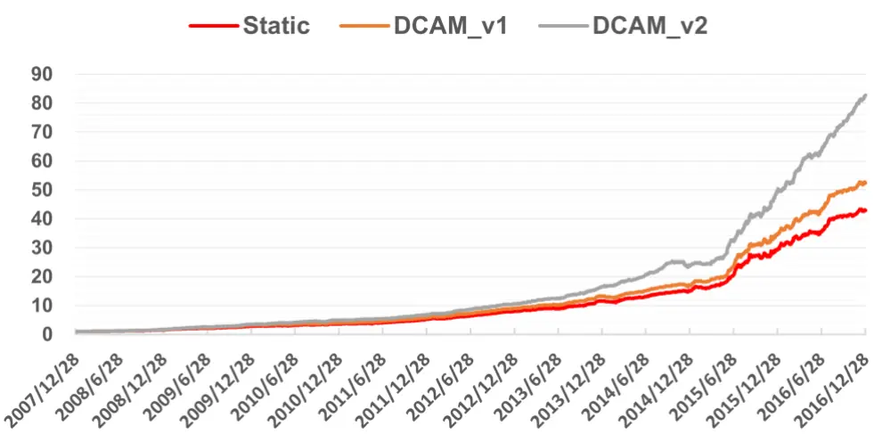
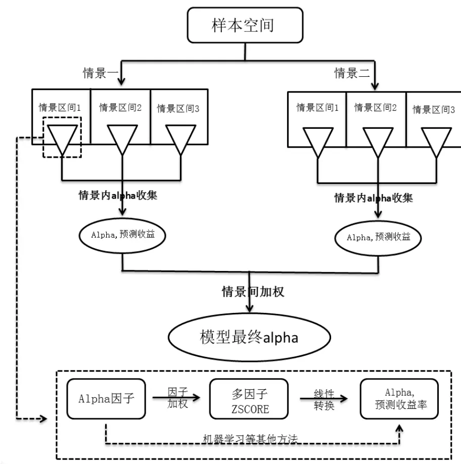
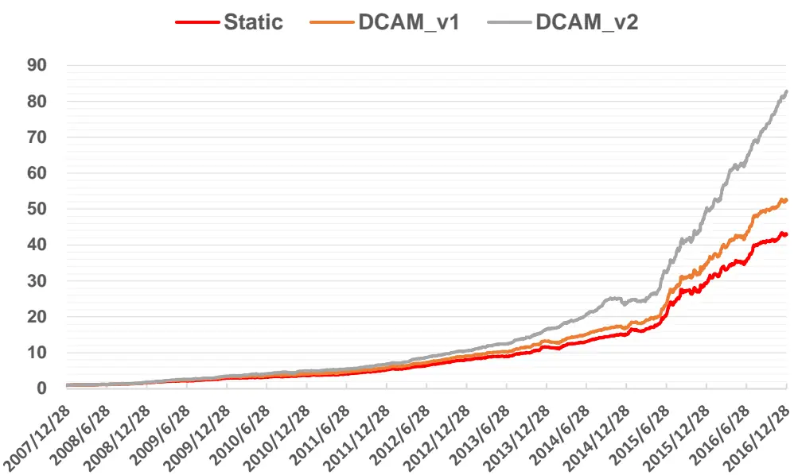
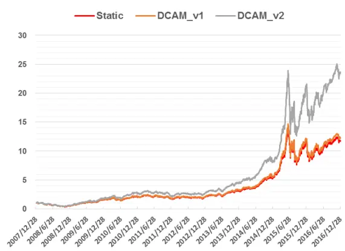
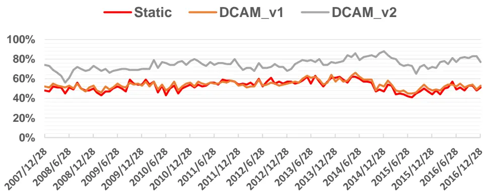
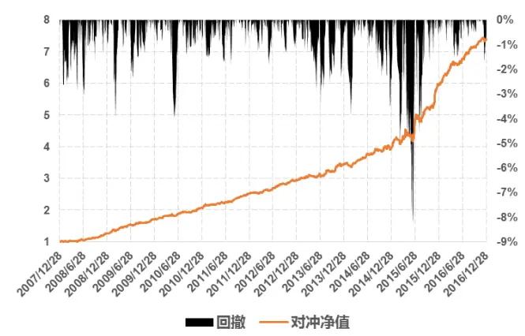
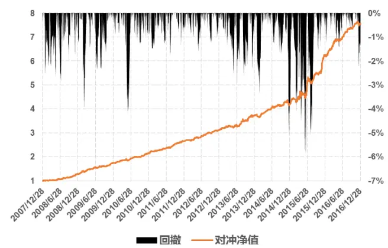
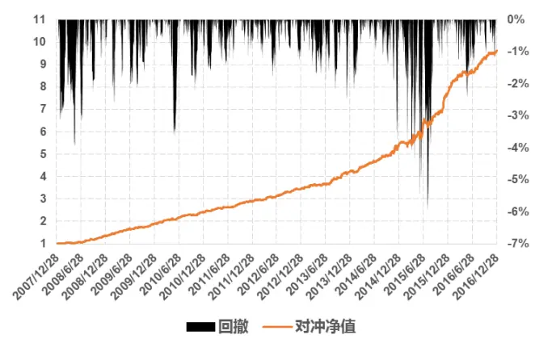

## 研究结论

抽象出了动态情景 Alpha模型（DCAM）的一般框架，DCAM是传统的静态模型的层次化叠加，当只有一个情景且该情景只有一个情景区间时 DCAM退化为静态模型。

衡量一个情景因子好坏的主要标准就是这个情景下不同区间的 alpha 模型的差异化程度，即该情景下不同区间股票预期收益的影响因素及其重要性是否差异明显。

DCAM 每个情景区间的 alpha 不一定一致，alpha 因子只要在部分情景区间内有效就能为总体模型创造价值，所以 DCAM下对 alpha因子的有效性检验提出了新的挑战。

模型应该把同一情景不同情景区间下的 alpha 或者预期收益放在一起比较，而不是标准化的 ZSCORE.情景区间内的 alpha 横截面差异性表示该区间模型的预测能力强弱，alpha的均值表示了该区间的 alpha偏好。

不同情景下 alpha 应该通过 alpha 估计的准确性进行加权，在准确性不好确定的情况下，我们建议采用情景对 alpha模型的区分度进行加权。

- 实证结果表明，本篇报告新提出的动态情景模型相对静态模型和老版模型的收益和稳定性均有明显提升，新模型在小市值有一定偏好，但在控制了市值和行业之后表现依然显著优于其他模型。

## 风险提示

- 本文的研究成果基于历史数据，如果未来风格发生重大变化，部分规律可能失效。

- 极端市场环境可能对模型效果造成冲击。

报告发布日期2017 年 02 月 17 日

证券分析师朱剑涛

021-63325888*6077

zhujiantao@orientsec.com.cn

执业证书编号：S0860515060001

联系人 王星星 021-63325888-6108 wangxingxing@orientsec.com.cn

相关报告

| 在 Alpha 衰退之前 | 2016-12-05 |
| --- | --- |
| A 股市场风险分析 | 2016-12-02 |
| 非对称价格冲击带来的超额收益 | 2016-11-10 |
| 东方机器选股模型 Ver 1.0 | 2016-11-07 |
| 非流动性的度量及其横截面溢价 | 2016-11-02 |
| Alpha 预测 | 2016-10-25 |
| 线性高效简化版冲击成本模型 | 2016-10-21 |
| 资金规模对策略收益的影响 | 2016-08-26 |
| Alpha 因子库精简与优化 | 2016-08-12 |
| 日内残差高阶矩与股票收益 | 2016-08-12 |
| 投机、交易行为与股票收益（下） | 2016-05-12 |
| 用组合优化构建更精确多样的投资组合 | 2016-02-19 |
| 剔除行业、风格因素后的大类因子检验 | 2016-02-17 |

东方证券股份有限公司经相关主管机关核准具备证券投资咨询业务资格，据此开展发布证券研究报告业务。

## 一、动态情景模型架构

传统的 alpha 模型大多在全市场（样本空间）范围内对所有的股票统一打分建模，忽略了不同类型股票 alpha模型的差异性，为了解决这个问题我们在东方金工因子选股系列研究之八《动态情景多因子 Alpha 模型》中提出了动态情景 alpha 模型（Dynamic Contextual Alpha Model），其收益和稳定性较 IR 加权等传统的静态模型均有一定的提升。然而，在上篇报告中我们并没有为广义的动态情景模型提出清晰的构建框架，本篇报告在深入剖析动态情景模型的基础上提出了新的动态情景模型。（我们称上篇报告中的动态情景模型为 DCAM_v1、本篇报告新提出的动态情景模型为 DCAM_v2，以此区别。）

图 1：动态情景模型基本架构

数据来源：东方证券研究所

我们在对上一篇报告中动态情景模型进行抽象后提出上述动态情景模型构建的基本框架，动态情景模型的核心问题是解决对不同类型股票的差异化建模问题，首先要面临的问题就是如何将股票归为不同类型，即情景因子的选取，DCAM_v1 中我们选取了规模、价值、成长、盈利、流动性5个维度的因子作为情景分层因子，以区分不同类型的股票；其次，在同一个情景下，将股票分为多少个情景区间，每个情景块如何建模，DCAM_v1 中我们根据每一个情景因子的大小将样本空间分为上下两个区间，在区间内采用滚动 IR 加权方法，再次，如何把同一情景下不同区间股票的评价得分放在同一个可比的标准下，DCAM_v1 并没有考虑这个层次的问题，直接将区间内的

ZSCORE 用于下一步情景间的加权，最后，每只股票在每个单一情景下都会有一个预测 alpha，不同情景下的alpha如何加权，DCAM_v1中我们根据股票的情景极端化程度设计了个股情景特征，作为不同情景间的权重。事实上，动态情景模型在任何一个情景下的任何一个情景区间内都是一个传统的 alpha 模型，当动态情景模型只有一个情景且该情景下只有一个情景区间时，动态情景模型便退化为一个传统的 alpha 模型，和动态情景模型（Dynamic Contextual Alpha Model）相对应，我们称之为静态模型（Static Alpha Model）。

关于动态情景模型，我们有如下思考：

## 1、 关于情景因子

情景因子是用来区分样本空间的一个股票属性，其存在是为了将样本空间内的股票划分为若干个区间，每个区间单独建模，假如情景因子的不同区间的 alpha模型差异化不大，这个情景因子就没有存在的意义，因此我们认为衡量一个股票属性适合做情景因子的主要标准就是这个情景下不同区间的alpha模型的差异化程度，即不同情景区间下的alpha因子及 alpha 因子权重是否相似等，通俗点讲就是该情景下不同区间股票预期收益的影响因素及其重要性是否相似。另外，一旦一个因子被作为情景因子，该情景下的不同区间内该因子的差异化就会比较小，所以该因子在该情景下的情景区间就不大可能再作为alpha因子发挥作用，但是可以通过调整不同情景区间的 alpha发挥作用，这个我们在第3点再详细讨论。

按照上面我们对情景因子的分析，模型并没有要求情景因子一定为连续变量，所以行业、板块等枚举型数据也可能作为一个情景因子。最后，需要情景需要划分多少个区间的问题，划分的区间越多，同一区间内股票的差异化程度越小，但同一区间内样本点就越少，对于区间内 alpha模型的估计就越困难，这是一个权衡问题。

## 2、 动态情景下的 alpha 因子

传统上我们在全市场的范畴内考察一个因子的有效性，而且要求因子的覆盖率不能太低，因为我们是在全市场的范围内建模，然而，在动态情景的框架下，我们完全可以进一步放宽对因子的要求。只要一个因子在一类股票中（情景区间）有效就可以为总体模型创造价值，而且某一些因子覆盖率较低也不会太影响模型，我们可以只在覆盖率较高的情景区间采用该因子。所以，理论上讲，在动态情景的框架下，alpha 因子的检验方法需要重新构建，主要考察因子在局部的有效性。

## 3、 同一情景下不同区间的股票如何对待

动态情景模型在同一情景下的不同情景区间都构建了独立的 alpha 模型，每个情景区间的股票都有自己区间模型预测出来的衡量股票好坏的得分，这些不同区间的股票得分如何放在同一基准上？有种很简单的方法就是在不同情景区间的股票得分标准化（即常见线性模型的 ZSCORE）然后放在一起，以此选出来的股票能够较均匀的分布在这个情景维度，但这样做忽略了不同区间股票的 alpha或预期收益的差异性和平均水平。

因此，在这里我们更建议将股票的 alpha取值或者预期收益而不是 ZSCORE作为同一情景不同区间内股票的优劣指标放在一起比较。举例来讲，小市值和大市值两个情景区间，小市值区间内的模型预测能力较强，股票 alpha/预期收益取值的差异化（横截面标准差）

较大，同时小股票整体的表现较好，alpha/预期收益平均（横截面均值）高于大股票，此时如果将小股票区间和大股票区间的 ZSCORE 放在一起或者将 alpha/预期收益标准化后再放在一起的话就会忽视这种差异性。其实这里的 alpha/预期收益差异性就代表了该情景区间内的模型预测能力和收益波动性，alpha/预期收益的均值就代表了这个情景区间自带的 apha/预期收益，所以可以通过调整这个 apha/预期收益均值在动态情景模型中嵌入情景区间的偏好，比如情景动量等。

## 4、 不同情景间 alpha的加权方法

对任意一只股票，在每个情景下都有一个预测的 alpha 或者预期收益，不同情景下的apha/预期收益如何合成最终的预测 apha/预期收益？理论上讲，对于任意一只股票，哪个情景下的 apha/预期收益预测准确性越高，该情景下 apha/预期收益的权重也应该越高，这其实也是贝叶斯的思想，我们可以从每个情景区间的 alhpa 模型出发估计出各只股票在各个维度下的 apha/预期收益估计误差，然后以此为基础，估计误差越大的情景 apha/预期收益权重应该越小。但是，这种从微观传导出来的 apha/预期收益估计误差计算难度较大，为简单起见，我们在 DCAM_v1 中根据股票在各个情景下的取值极端程度（个股情景特征）进行加权，显然，股票在某个情景下的取值越极端，并不代表在该情景下的 apha/预期收益预测越精确。相对而言，我们建议采用情景的模型区分度来作为股票在各情景间 apha/预期收益的权重，如果一个情景对模型的区分程度越高，其建模更加精细化，那么该情景下的 apha/预期收益估计可能更加精确。当然，情景的模型区分度只是我们没有其他更优解决办法时的权益之计，如果投资者有其他更加合理的加权方法，完全可以自行设计。

根据我们上面的分析，DCAM_v1 设计上尚有不足，首先，情景分区的选取尚有改进，将市值情景均分两份后大市值区间内市值差异依旧明显，其次在同一情景内简单的将不同情景区间的ZSCORE 等同对待，忽视了 apha/预期收益的差异性和平均水平， 另外，不同情景间的加权方式值得商酌。正是基于这些思考，我们在 DCAM_v1 的基础上提出了新的动态情景模型，其具体构建请参见下文。

## 二、动态情景模型构建

## 1. 情景因子

我们在第一部分分析情景因子时提出选取情景因子的核心标准是其不同区间 alpha 模型的差异性，即该因子对股票收益影响因素的区分能力，结合我们之间的因子研究和学术界的成果，我们绝对采用市值（年日均总市值）、价值（年日均账面市值比）、成长（净资产同比增长率）三个维度作为情景因子，样本空间按照每个情景因子均分为 5个情景区间。

市值是区分技术类因子有效性的重要维度，包括反转在内的大多数技术类因子在小市值股票内的表现显著优于大市值股票，而价值和成长则和公司的基本面信息紧密相连。Fama 和 French（1996）将账面市值比和公司的投资质量、财务状况联系起来，他们认为账面市值比较低的公司可能是因子其投资质量高，财务状况好，而不同的投资质量、不同财务状况的公司的基本面因子也会有所不同，成长也是股票的一个重要属性，高成长股票和低成长股票中影响预期收益的因素也会有所差异。

## 2. alpha 因子库

理论上讲不同情景区间的alpha因子不一定相同，应该为每一个情景区间定制化alpha因子，但考虑到工作量问题，目前我们在各个情景区间采用相同的 alpha因子，具体是使用前期《Alpha精简与优化》中提出的因子筛选方法精简后剩余的 12 个 alpha 因子（图 2，均经过行业和市值中性化处理）。

图 2：alpha 因子说明

| 因子名称 | 因子定义 |
| --- | --- |
| CGO_3M | 三个月处置效应 |
| TO | 以流通股本计算的1个月日均换手率 |
| Momentumlast12M | 复权收盘价/复权收盘价_12月前-1 |
| EP2_TTM | 剔除非经常性损益的过去12个月净利润/总市值 |
| ILLIQ | 每天一个亿成交量能推动的股价涨幅 |
| AmountVol_1M_12M | 过去一个月日均成交量/12个月日均成交量 |
| IRFF | 特异度 |
| Ret1M | 1个月收益反转 |
| GP2Asset | 毛利率/平均总资产 |
| CFP_TTM | 过去12个月经营性现金流/总市值 |
| SalesGrowth_Qr_YOY | 营业收入增长率（季度同比） |
| ProfitGrowth_Qr_YOY | 净利润增长率（季度同比） |

数据来源：东方证券研究所

## 3. 基础 alpha 模型

基础 alpha模型部分我们采用经典的 IC_IR加权的线性模型，具体做法如下，

## 1. IC_IR 加权因子排名分位数获取 ZSCORE

在单个情景区间中计算各个 alpha 因子过去 24 个月的风险调整 IC 的均值除以标准差作为各个 alpha 因子在情景区间分位数（采用分位数而不是因子值是因为单个情景区间内因子的分布可能有偏，和正太相差较大）的权重：

$$
w_{k}=\frac{mean(IC_{-}adj_{k})}{std(IC_{-}adj_{k})}
$$

## 2. ZSCORE 转换为预期收益率

在情景区间中，用个股的收益率对标准化后的 ZSCORE做横截面上的线性回归，估计出单期的截距项 a和系数项 b，然后取过去 12个月的均值作为 a和 b的最新估值值，然后再将股票最新的 ZSCORE带入下列方程计算该情景区间下各只股票的预期收益率

$$
ret_{i}=a+b\cdot ZSCORE_{i}
$$

同一情景下不同情景区间股票预期收益的横截面均值和标准差并不一定相等，过去总体表现较好的情景区间预期收益更高，ZSCORE 预测能力较强或者收益波动更大的情景区间预期收益率的横截面波动更大。

## 4. 情景间 alpha 加权

前文的分析中我们建议采用该情景下不同情景区间的模型区分度作为情景间预期收益率的权重，对于线性模型，我们定义如下两个模型的距离如下：

$$
d_{i,j}=\sqrt{\frac{\sum\bigl(w_{k}^{i}-w_{k}^{j}\bigr)^{2}}{K}}
$$

$d_{i,j}$ 模型 i和模型j间的距离，K为 alpha因子的个数。

我们定义同一情景因子下 5 个情景区间的模型两两距离均值为该情景的情景区分度，并以此为权重加权个股在各个情景下的预期收益率。

## 三、模型历史表现

为了展示本报告中提出的动态情景多因子 Alpha 模型的效果，我们基于相同的基础模型、情景因子和 alpha 因子构建了 IR 加权静态模型(Static)，报告《动态情景 alpha 模型》中展示的动态情景 Alpha 模型（DCAM_v1）和最新的动态情景模型（DCAM_v2）。回测的样本空间为同期中证全指成分股，时间 2007年 12月 28日至 2016年 12月 30日，月度调仓。

为了全面考察三种 alpha模型的效果，我们从 IC、多空组合、top100组合和 500增强组合等多方面全面考察。

## 1. IC 与多空组合

图 3 是 3 个 alpha 模型的预测收益率 Top10% - Bottom 10% 多空组合的净值表现，很明显DCAM_v2 模型的表现明显优于 DCAM_v2 和静态的 IR 加权模型 Static，DCAM_v1 模型稍优于Static 模型。DCAM_v2 的多空组合年复合收益率较静态组合 Static高 11.1%，同时回测并没有明显增加，月胜率高达 95.3%，2008 年以来 108 个月份仅有 5 个月多空组合收益为负。DCAM_v2模型预期收益率的 RankIC均值也高达 0.144，大幅大于另外两个模型，同时 RankIC_IR也处于较高水平，说明模型稳定性较高。

图 3：多空组合净值表现

| Sharpe Ratio |  |  |  |  |  |  |
| --- | --- | --- | --- | --- | --- | --- |
| Static | 年复合收益 52.3% | 月胜率 90.7% | 4.25 | 最大回撤 -7.0% | RankIC 0.129 | RankIC_IR 5.48 |
| DCAM_v1 | 55.7% | 91.6% | 4.46 | -6.7% | 0.133 | 5.74 |
| DCAM_v2 | 63.4% | 95.3% | 5.24 | -7.9% | 0.144 | 6.09 |

注：夏普比指标根据日收益率数据计算，后再年化，下同。
数据来源：wind 数据库，东方证券研究所

## 2. top100 组合表现

考虑到市场上不少量化产品直接选出多因子模型得分较高的股票等权构建组合，我们也比较了各个 alpha模型预测收益的 top100等权组合（同期中证全指成分股内选股）的表现，从图 4和图 5 的表现，我们发现 DCAM_v2 的 top100 组合 2007 年底至 2016 年底 9 年期间上涨了 29.5 倍，年化复合收益 42.1%，远高于同期的静态模型 Static 和 DCAM_v1，相比之下 DCAM_v1 和 Static的 top100组合几乎无差异。从各个年份的表现来看，除 2011年外，DCAM_v1 的 top100组合均跑赢静态模型和 DCAM_v1。

图 4：top 组合净值表现（未扣费）

数据来源：wind 数据库，东方证券研究所

图 5：top组合表现统计

| Static | DCAM_v1 | DCAM_v2 |
| --- | --- | --- |
| 年化收益率 31.5% | 32.1% | 42.1% |
| 月胜率 | 63.9% 64.8% | 64.8% |
| 最大回撤 -67.4% | -66.8% | -64.7% |
| Sharpe值 | 1.00 1.01 | 1.21 |
| 月单边换手率 | 71.9% 72.5% | 65.9% |
| 2008 | -49.7% -49.0% | -44.7% |
| 2009 | 220.4% 222.2% | 231.2% |
| 2010 29.1% | 29.0% | 47.3% |
| 2011 | -16.6% -15.9% | -18.1% |
| 2012 20.4% | 20.1% | 25.2% |
| 2013 | 51.6% 54.8% | 63.9% |
| 2014 67.2% | 66.3% | 79.4% |
| 2015 | 113.8% 115.2% | 160.4% |
| 2016 | 3.5% 3.5% | 11.6% |

数据来源：wind 数据库，东方证券研究所

需要提醒注意的是，DCAM_v2模型 top100组合小市值偏好十分明显，回测期间平均市值分位数高达 75%，top100 组合的表现有部分是由市值贡献。DCAM_v2 模型 top 组合偏好小市值主要有两方面的原因，一是小市值区间的预测收益率横截面波动更大，更容易出现在预期收益率排名的两端，二是过去小市值股票表现强势，小市值区间预测收益平均偏高。

图 6：top100组合平均市值中位数

数据来源：wind 数据库，东方证券研究所

## 3. 指数增强效果

Top100 组合的构建方式并没有考虑组合的市值等风险因子的暴露，因此 DCAM_v2 模型表现较好很有可能只是因为模型引入的市值因子的暴露。为了考察在控制市值、行业等风险因子后的模型表现，我们分别基于三个模型的预期收益率用组合优化的方式构建了 500 指数增强组合，选股空间为同期中证全指成分股。可以看到，DCAM_v1 模型相对 Static 模型收益提升不明显，但稳定性有所增强，月胜率和最大回测都有所改进，DCAM_v2 模型相对 Static 模型和 DCAM_v1收益和稳定性均有大幅提升，对冲组合收益 28.6%，较 Static 模型提升了 3.7 个百分点，月胜率高达90.7%，最大回测降低至 5.9%，夏普比提升至 3.59%。从风险控制后的 500增强组合表现我们可以看出，DCAM_v2虽然动态的引入了情景因子（尤其是市值）的偏好，但在控制市值行业风险后依然较静态模型和 DCAM_v1 有较强的 Alpha 收益。

图 7：Static 模型 500增强对冲净值（未扣费）

数据来源：wind 数据库，东方证券研究所

图 8：DCAM_v1 模型 500增强对冲净值（未扣费）

数据来源：wind 数据库，东方证券研究所

图 9：DCAM_v2 模型 500增强对冲净值（未扣费）

数据来源：wind 数据库，东方证券研究所

图 10：500增强组合表现统计

| Static | DCAM_v1 | DCAM_v2 |
| --- | --- | --- |
| 年对冲收益 24.9% | 25.2% | 28.6% |
| 月胜率 80.6% | 85.2% | 90.7% |
| 夏普比 3.23 | 3.35 | 3.59 |
| 最大回撤 -8.3% | -5.9% | -5.9% |
| 月单边换手 | 79.9% 79.8% | 77.1% |
| 2008 | 25.6% 27.7% | 35.4% |
| 2009 | 36.7% 36.9% | 40.7% |
| 2010 | 20.3% 21.9% | 26.0% |
| 2011 | 21.9% 24.2% | 20.5% |
| 2012 | 16.9% 17.9% | 19.5% |
| 2013 | 17.3% 19.6% | 22.7% |
| 2014 | 15.0% 12.5% | 27.8% |
| 2015 | 50.0% 48.7% | 42.7% |
| 2016 | 24.1% 20.9% | 24.7% |

数据来源：wind 数据库，东方证券研究所

## 四、总结

本篇报告在《动态情景 alpha 模型》的基础上抽象出了动态情景 Alpha 模型（DCAM）的一般框架，DCAM 是传统的静态模型的层次化叠加，当只有一个情景且该情景只有一个情景区间时DCAM 退化为静态模型。同时，我们分别从情景因子的选择、DCAM 下的 alpha 因子、同一情景不同区间内的归总、不同情景下的加权等多个角度讨论了 DCAM 的构建，并在此基础上构建了新的 DCAM 模型，其相对静态模型和老版模型的收益和稳定性均有明显提升，新模型在小市值有一定偏好，但在控制了市值和行业之后表现依然显著优于其他模型。

## 风险提示

- 本文的结论基于对历史数据的研究，如果未来市场风格发生重大变化，部分规律可能会失效，另外高的预期超额收益并不代表 100%的胜率，市场有风险，投资需谨慎。

- 极端市场环境可能对模型效果造成冲击。

## 分析师申明

每位负责撰写本研究报告全部或部分内容的研究分析师在此作以下声明：

分析师在本报告中对所提及的证券或发行人发表的任何建议和观点均准确地反映了其个人对该证券或发行人的看法和判断；分析师薪酬的任何组成部分无论是在过去、现在及将来，均与其在本研究报告中所表述的具体建议或观点无任何直接或间接的关系。

## 投资评级和相关定义

报告发布日后的 12个月内的公司的涨跌幅相对同期的上证指数/深证成指的涨跌幅为基准；

## 公司投资评级的量化标准

买入：相对强于市场基准指数收益率15%以上；

增持：相对强于市场基准指数收益率5%～15%；

中性：相对于市场基准指数收益率在-5%～+5%之间波动；

减持：相对弱于市场基准指数收益率在-5%以下。

未评级——由于在报告发出之时该股票不在本公司研究覆盖范围内，分析师基于当时对该股票的研究状况，未给予投资评级相关信息。

暂停评级——根据监管制度及本公司相关规定，研究报告发布之时该投资对象可能与本公司存在潜在的利益冲突情形；亦或是研究报告发布当时该股票的价值和价格分析存在重大不确定性，缺乏足够的研究依据支持分析师给出明确投资评级；分析师在上述情况下暂停对该股票给予投资评级等信息，投资者需要注意在此报告发布之前曾给予该股票的投资评级、盈利预测及目标价格等信息不再有效。

## 行业投资评级的量化标准：

看好：相对强于市场基准指数收益率5%以上；

中性：相对于市场基准指数收益率在-5%～+5%之间波动；

看淡：相对于市场基准指数收益率在-5%以下。

未评级：由于在报告发出之时该行业不在本公司研究覆盖范围内，分析师基于当时对该行业的研究状况，未给予投资评级等相关信息。

暂停评级：由于研究报告发布当时该行业的投资价值分析存在重大不确定性，缺乏足够的研究依据支持分析师给出明确行业投资评级；分析师在上述情况下暂停对该行业给予投资评级信息，投资者需要注意在此报告发布之前曾给予该行业的投资评级信息不再有效。

## 免责声明

本证券研究报告（以下简称“本报告”）由东方证券股份有限公司（以下简称“本公司”）制作及发布。

本报告仅供本公司的客户使用。本公司不会因接收人收到本报告而视其为本公司的当然客户。本报告的全体接收人应当采取必要措施防止本报告被转发给他人。

本报告是基于本公司认为可靠的且目前已公开的信息撰写，本公司力求但不保证该信息的准确性和完整性，客户也不应该认为该信息是准确和完整的。同时，本公司不保证文中观点或陈述不会发生任何变更，在不同时期，本公司可发出与本报告所载资料、意见及推测不一致的证券研究报告。本公司会适时更新我们的研究，但可能会因某些规定而无法做到。除了一些定期出版的证券研究报告之外，绝大多数证券研究报告是在分析师认为适当的时候不定期地发布。

在任何情况下，本报告中的信息或所表述的意见并不构成对任何人的投资建议，也没有考虑到个别客户特殊的投资目标、财务状况或需求。客户应考虑本报告中的任何意见或建议是否符合其特定状况，若有必要应寻求专家意见。本报告所载的资料、工具、意见及推测只提供给客户作参考之用，并非作为或被视为出售或购买证券或其他投资标的的邀请或向人作出邀请。

本报告中提及的投资价格和价值以及这些投资带来的收入可能会波动。过去的表现并不代表未来的表现，未来的回报也无法保证，投资者可能会损失本金。外汇汇率波动有可能对某些投资的价值或价格或来自这一投资的收入产生不良影响。那些涉及期货、期权及其它衍生工具的交易，因其包括重大的市场风险，因此并不适合所有投资者。

在任何情况下，本公司不对任何人因使用本报告中的任何内容所引致的任何损失负任何责任，投资者自主作出投资决策并自行承担投资风险，任何形式的分享证券投资收益或者分担证券投资损失的书面或口头承诺均为无效。

本报告主要以电子版形式分发，间或也会辅以印刷品形式分发，所有报告版权均归本公司所有。未经本公司事先书面协议授权，任何机构或个人不得以任何形式复制、转发或公开传播本报告的全部或部分内容。不得将报告内容作为诉讼、仲裁、传媒所引用之证明或依据，不得用于营利或用于未经允许的其它用途。

经本公司事先书面协议授权刊载或转发的，被授权机构承担相关刊载或者转发责任。不得对本报告进行任何有悖原意的引用、删节和修改。

提示客户及公众投资者慎重使用未经授权刊载或者转发的本公司证券研究报告，慎重使用公众媒体刊载的证券研究报告。

## 东方证券研究所

地址：上海市中山南路 318 号东方国际金融广场 26 楼

联系人： 王骏飞

电话：021-63325888*1131

传真：021-63326786

网址： www.dfzq.com.cn

Email： wangjunfei@orientsec.com.cn