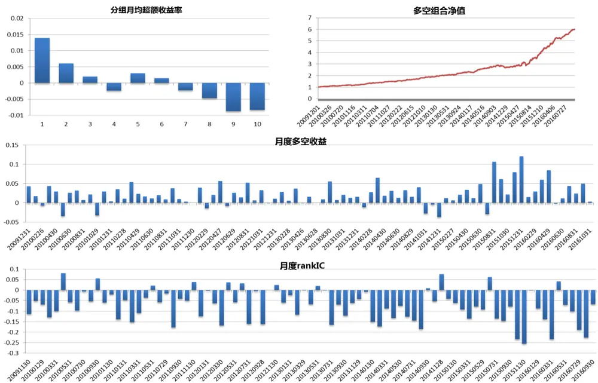
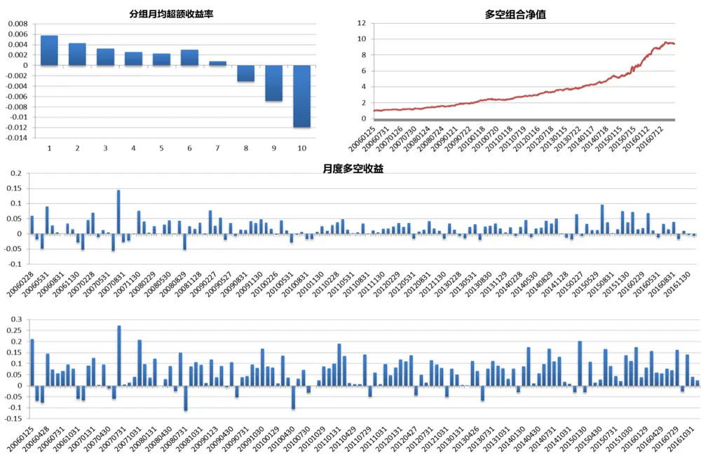
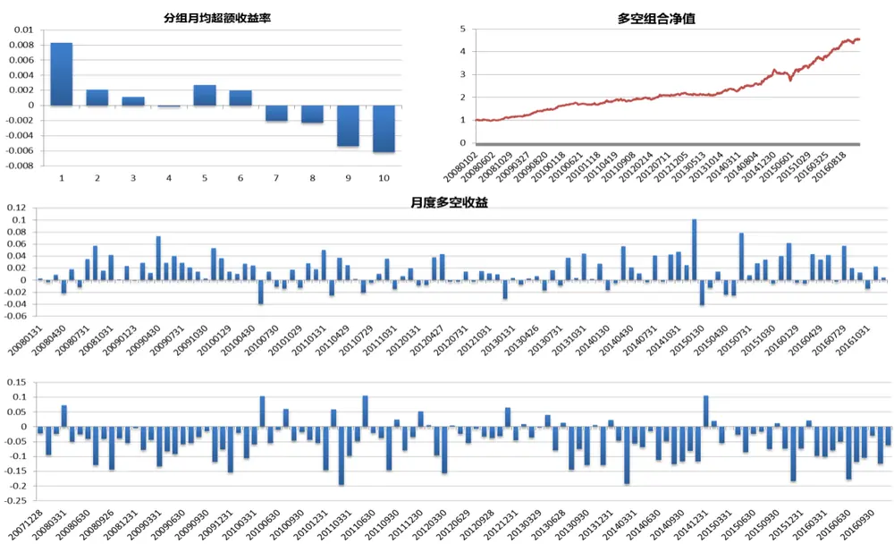
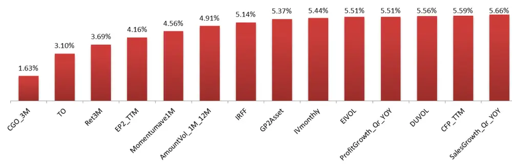

## 研究结论

这篇报告我们主要检验了 Harvey(2016)文章中统计的从2002年以后显著且独立的技术类因子共 16个。检验发现 16个中的大多数因子在 A股市场表现不佳，但其中分别是 DOWNILLIQ，UPILLIQ，NCSKEW，DUVOL 和IVmonthly 这 5 个因子表现较好，rankIC 的绝对值均大于 0.05，IR 的绝对值也都大于 2.5。

在这 5 个因子中 DOWNILLIQ 与 UPILLIQ 负相关性很高，说明 A 股市场不存在美股市场中的买卖非流动性的非对称现象，也就是说 A股市场中的亏损厌恶效果较弱，这点与美股市场中 DOWNILLIQ显著好于 UPILLIQ不同。同时，NCSKEW 和 DUVOL 这两个因子正相关性非常高，主要是因为这两个因子都是通过计算偏离平均收益的收益率的波动特征得到的，都是用来衡量股票的暴跌风险的指标。

- 通过 Fama-MacBeth 回归剔除了 12 个因子之后，5 个有效的新因子中还存在有一定信息增量的因子为 DOWNILLIQ，UPILLIQ 和 IVmonthly。

把新的因子（去除了时间较短的 DOWNILLIQ和 UPILLIQ因子）加入了到原因子库中做因子精简，与原来相比基本面因子并没有变化，ILLIQ 这个因子被从 12个因子中去除了，Ret1M 这一反转因子被 Ret3M和 DUVOL这两个反转类的因子所替代了，此外新增加的因子为 IVmonthly和 EIVOL。

## 风险提示

- 量化模型基于历史数据分析得到，未来存在失效风险，建议投资者紧密跟踪模型表现

- 极端市场环境可能对模型效果造成冲击

原因子库根因子据因子精简方法选出的因子

| 因子名称 | 因子定义 |
| --- | --- |
| CGO_3M | 三个月处置效应 |
| TO | 以流通股本计算的1个月日均换手率 |
| Momentumlast12M | 复权收盘价/复权收盘价_12月前-1 |
| EP2_TTM | 剔除非经常性损益的过去12个月净利润/总市值 |
| ILLIQ | 每天一个亿成交量能推动的股价涨幅 |
| AmountVol_1M_12M | 过去一个月日均成交量/12个月日均成交量 |
| IRFF | 特异度 |
| Ret1M | 1个月收益反转 |
| GP2Asset | 毛利率/平均总资产 |
| CFP_TTM | 过去12个月经营性现金流/总市值 |
| SalesGrowth_Qr_YOY | 营业收入增长率（季度同比） |
| ProfitGrowth_Qr_YOY | 净利润增长率（季度同比） |

报告发布日期2017 年 02 月 17 日

证券分析师朱剑涛

021-63325888*6077

zhujiantao@orientsec.com.cn

执业证书编号：S0860515060001

联系人张惠澍

021-63325888-6123

zhanghuishu@orientsec.com.cn

## 相关报告

| 对主动投资有益的量化结论 | 2016-12-21 |
| --- | --- |
| 在 Alpha 衰退之前 | 2016-12-05 |
| A 股市场风险分析 | 2016-12-02 |
| 非对称价格冲击带来的超额收益 | 2016-11-10 |
| 东方机器选股模型 Ver 1.0 | 2016-11-07 |

对 12 因子经过 Fama–MacBeth 检验后的因子 IC

| 因子 | rankIC | IR | t |
| --- | --- | --- | --- |
| EIVOL | -0.019 | -1.776 | -5.327 |
| COSKEW | -0.001 | -0.060 | -0.198 |
| DOWNILLIQ | -0.037 | -1.911 | -5.027 |
| UPILLIQ | 0.041 | 1.976 | 5.197 |
| NCSKEW | 0.011 | 0.860 | 2.843 |
| DUVOL | 0.012 | 0.900 | 2.975 |
| CVTURN | -0.006 | -0.471 | -1.557 |
| CVILLIQ | 0.004 | 0.362 | 1.197 |
| BSI | -0.035 | -2.745 | -8.571 |
| Dbeta | -0.008 | -0.599 | -1.958 |
| TSMON | -0.006 | -0.482 | -1.519 |
| EDR | 0.003 | 0.273 | 0.816 |
| IVmonthly | -0.015 | -1.316 | -3.949 |
| IVshort | 0.007 | 0.635 | 1.905 |
| IVlong | -0.007 | -0.499 | -1.649 |
| NEGILLIQ | -0.013 | -0.912 | -3.013 |

## 一、新因子介绍

我们在之前的报告《Alpha因子库精简与优化》提到，根据 Harvey (2016)的搜集统计，发表在顶级金融学术期刊和 SSRN 上的定价因子多达 316 个[1]。这么多的定价因子已经构成了 Cochrane(2011)提出的“新因子动物园（” a zoo of new factors）的概念了。本篇报告主要测试了 Harvey(2016)文章中统计的从 2002年以后显著且独立的技术类因子共 16个。这 16个因子分别是：

- EIVOL——期望的特质波动率（Expected idiosyncratic volatility）。根据 NYSE、Amex 和Nasaq从 1963-2006年的股票数据计算，特质波动率的变化较大，平均的波动率为 55%且相邻期的自相关性仅有 33%，因此仅仅使用特质波动率作为下一期股票期望收益率的预测并不是一个好的指标，因此在文中作者采用了 Egarch模型来估计期望的特质波动率，并发现期望的特质波动率与股票的期望收益率存在正相关的关系，这与上一期的特质波动率存在的反相关关系相反[2]。

- COSKEW——协偏度（Coskewness）。协偏度衡量了一个变量相对于另一个变量的变化的偏差情况:

$$
\begin{array}{r}{\mathrm{CS}=\frac{\sum_{\mathrm{t}=1}^{\mathrm{n}}\left[\left(\mathrm{r}_{1,\mathrm{t}}-\bar{\mathrm{r}}_{1}\right)\left(\mathrm{r}_{2,\mathrm{t}}-\bar{\mathrm{r}}_{2}\right)^{2}\right]}{\sum_{\mathrm{t}=1}^{\mathrm{n}}\left[\left(\mathrm{r}_{2,\mathrm{t}}-\bar{\mathrm{r}}_{2}\right)^{3}\right]},}\end{array}
$$

其中 ${|r_{1,\mathrm{t}}}$ 为股票在 t 时刻的收益率， $r_{2,\mathrm{t}}$ 为基准在 t 时刻的收益率。COSKEW 可以用来衡量股票相对于基准指数的风险非对称性。根据 NYSE 和 Amex从 1926-1997年的股票数据，作者研究发现买入过去低协偏度的股票组合可以获得超额收益[3]。

- SILLIQ——卖单非流动性（Sell-orderilliquidity）。卖单非流动性衡量了高频数据下主动卖出的交易金额对于股票价格变动的影响：

$$
\mathbf{r}_{\mathrm{i},\mathrm{t}}=\alpha+\beta_{1}*S_{i,t}+\beta_{2}*B_{i,t}+\epsilon_{it},
$$

其中 $1\beta_{1}$ 为卖出非流动性系数， $\beta_{2}$ 为买入非流动性系数， $S_{i,t}$ 为股票 i在 t时间区间内的主动卖出金额， $B_{i,t}$ 为股票 i 在 t 时间区间内的主动买入金额。根据 NYSE 从 1993-2008 年的股票订单数据，作者研究发现卖单非流动性在控制风险后的Fama-MacBeth截面回归对收益率显著，且卖单非流动性的预测效果要好于买单非流动性，这是主要是由于投资者存在亏损厌恶的心理[4]。

- BILLIQ——买单非流动性（Buy-order illiquidity）。买单非流动性衡量了高频数据下主买入的交易金额对于股票价格变动的影响。根据 NYSE 从 1993-2008年的股票订单数据，作者研究发现买单非流动性在控制风险后的 Fama-MacBeth截面回归对收益率显著，但买单非流动性的预测效果要弱于卖单非流动性，这是主要是由于投资者存在亏损厌恶的心理[4]。

- NCSKEW——负偏度系数（negative coefficient of skewness）。负偏度系数计算了股票收益率的历史负偏度：

$$
\mathrm{NCSKEW}_{i}=\frac{-(\mathrm{n}(\mathrm{n}-1))^{1.5}\sum(r_{it}-\bar{r}_{i})^{3}}{(\mathrm{n}-1)(\mathrm{n}-2)\sum(r_{it}-\bar{r}_{i})^{2})^{1.5}}
$$

其中 $r_{it}$ 是股票 i 在 t 时刻收益率。这是一个衡量股价暴跌可能性的指标，学界通常认为NCSKEW高的股票有着更高的暴跌可能，也就有着期望更高的风险溢价。根据NYSE和Amex从1962-1999年的股票数据计算，NCSKEW与未来的超额收益率有着显著的正相关关系[5]。

- DUVOL——上下行波动率（down to up volatility）。上下行波动率是历史收益率低于平均收益率的下行波动率比上历史收益率高平均收益率的上行波动率的比率:

$$
\mathrm{DUVDL}_{i}=\log\left(\frac{(n_{u}-1)\sum_{d}(r_{it}-\bar{r}_{i})^{2}}{(n_{d}-1)\sum_{u}(r_{it}-\bar{r}_{i})^{2}}\right),
$$

其中， $n_{u}$ 为大于平均复合收益率的天数， $n_{d}$ 为小于平均复合收益率的天数。这是一个衡量股价暴跌可能性的指标，学界通常认为 DUVOL 较高的股票有着更高的暴跌可能，因此也就有着期望更高的风险溢价。根据NYSE 和 Amex从 1962-1999年的股票数据计算，DUVOL与未来的超额收益率有着显著的正相关关系[5]。

- CVTURN——换手率的变异系数（Coefficient of Variation of turnover）。换手率的变异系数计算了换手率的波动率比上均值的比率:

$$
\mathrm{CVTURN}_{i}=\frac{\sigma(\mathrm{TURN}_{i})}{\mathrm{TURN}_{i}}
$$

如果 CVTURN 较高，说明换手率的波动较大，也就是说对于持有股票的投资者在未来卖出股票有着更高的交易成本不确定性，所以这类股票就需要有更高的风险溢价来补偿这些不确定性。根据 NYSE 和 Amex 从 1966-1995 年的股票数据计算，CVTURN 与未来的超额收益率有着显著的正相关关系[6]。

- CVILLIQ——非流动性的变异系数（Coefficient of Variation of ILLIQ）。非流动性的变异系数计算了非流动性指标的波动率比上均值的比率:

$$
\mathrm{ILLIQ}_{i,t}=\frac{|r_{i,t}|}{Amount_{i,t}},
$$

$$
\begin{array}{r}{\mathrm{CVILLIQ}_{i}=\frac{\sigma(\mathrm{ILLIQ}_{i})}{\overline{{\mathrm{ILLIQ}_{i}}}},}\end{array}
$$

其中 $Amount_{i,t}$ 为股票 i在 t时刻的交易金额，如果 CVILLIQ较高，说明非流动性的波动较大，也就是说对于持有股票的投资者在未来卖出股票有着更高的交易成本不确定性，所以这类股票就需要有更高的风险溢价来补偿这些不确定性。根据 NYSE 和 Amex 从 1964-2009 年的股票数据计算，CVTURN 与未来的超额收益率有着显著的正相关关系[7]。

- BSI——散户的买卖非平衡性(buy–sell imbalance)，散户的买卖非平衡性计算了散户买卖单的非平衡情况：

$$
\begin{array}{r}{\mathrm{BSI}=\cfrac{B-S}{B+S}.}\end{array}
$$

其中 是散户的买单金额，S是散户的买单金额。根据统计的结果来看，散户的交易情绪对于股票价格的影响较大，若 BSI 较大，说明散户在过去持续的买入，股票未来的短期收益率也较好，反之亦然。根据 1983-2001 的交易数据计算，BSI 与股票未来的短期收益率（一周）有着显著的正相关关系[8]。

- Dbeta——下行 beta (downside beta)，下行 beta 衡量了股票的下行风险:

$$
\beta^{-}=\frac{cov(r_{i},r_{m}|r_{m}<\mu_{m})}{var(r_{m}|r_{m}<\mu_{m})},
$$

其中 $|\mu_{m}$ 为相对于市场的平均超额收益率。对下行风险更加敏感的投资者对于下行 beta 高的股票会要求更大的风险补偿，所以理论上说 Dbeta越大，股票的期望收益率越高。根据 NYSE从 1963-2001 的股票数据，Dbeta 因子对当期收益率有很好的解释，但用于预测效果有限（过去的 downside beta 并不能很好预测未来）[9]。

- TSMON——时间序列动量(time series momentum)，传统动量因子考虑个股在行业内过去一段时间的相对表现，时间序列动量考虑个股本身过去一段时间的绝对表现：

$$
\begin{array}{r}{\mathrm{TSMOM}_{\mathrm{mi}}=sign\left(\frac{1}{N}(\sum_{j=1}^{12}\hat{r}_{m-j,i})*\hat{r}_{m,i}/\widehat{\sigma}_{m,i}\right)}\end{array}
$$

其中 m为月份，i 代表股票， $\hat{r}_{m,i}$ 表示股票 i第 m月相时间序列上的超额收益，计算方法为个股受益率减去之前月份收益率的指数移动平均值。

$$
\begin{array}{c}{\hat{r}_{m,i}=\mathbf{r}_{m,i}-\bar{\mathbf{r}}_{m,i},}\\{\bar{\mathbf{r}}_{mi}=\sum_{\mathrm{j}=0}^{\infty}(1-\delta)*\delta^{j}*\mathbf{r}_{m-j,i},}\\{\hat{\sigma}_{\mathrm{m},\mathrm{i}}^{2}=\sum_{j=0}^{\infty}(1-\delta)*\delta^{j}*\left(\mathbf{r}_{m-1-j,i}-\bar{\mathbf{r}}_{m-1-j,i}\right)^{2},}\end{array}
$$

根据期货市场 1963—2001 的数据，TSMON 与未来收益率有着显著的反相关关系[10]。

EDR——极端下行风险（Extreme Downside Risk），因子度量了股票收益率分布尾部厚度，利用个股过去两年 Fama-French三因子回归的残差收益率月极小值数据，通过极值分布和极大似然估计得到刻画分布尾部厚度的参数。极值分布函数可表示为：

$$
\begin{array}{rl}&{\mathrm{H(x)}=1-\exp[-\left(1-\gamma\ast\frac{x-\mu}{\sigma}\right)^{-\frac{1}{\gamma}}],}\\&{\quad1-\gamma\ast\frac{x-\mu}{\sigma}>0,\quad\gamma\neq0,}\end{array}
$$

其中 度量尾部厚度， 为均值， 为标准差。根据美股全市场股票从 1967-2005 年的数据，EDR与期望收益率有着显著的正相关关系[11]。

- IVmonthly——月度特质波动率（monthly idiosyncratic volatilities），特质波动率一般认为衡量了去过对股票投机的程度，与股票未来收益率呈现显著的负相关。这里的特质波动率是过去 24-60个月的 Fama-French三因子回归的残差收益率加权平方和：

$$
\begin{array}{r}{\mathrm{IV}_{t,\mathrm{i}}^{2}=\frac{1}{\sum w_{k}}\sum_{k=0}^{\tau}w_{k}*(\varepsilon_{m-k,i})^{2},}\end{array}
$$

其中权重 $\langle w_{k}=0.9^{\mathrm{k}},\quad\varepsilon_{m-k,i}$ 为第 i 个股票在第 m-k 月的三因子回归残差。根据 NYSE、Amex和 Nasaq 从 1963—2008 年的全部股票数据，IVmonthly 与股票的未来收益率有显著的负相关性[12]。

- IVlong——长期特质波动率（long-run idiosyncratic volatilities），特质波动率一般认为衡量了去过对股票投机的程度，与股票未来收益率呈现显著的负相关。学界认为特质波动率分为长期特质波动率（趋势项）和短期特质波动率（噪音项），市场给长期特质波动正的风险补偿，短期特质波动由市场中的噪声交易者带来，衡量了过去一段时间个股的投机程度，与未来收益率呈负相关。过去一至两年特质波动率为长期和短期特质波动的总和，两者效果相反，这也就是说单纯的特质波动率的效果会弱于同方向的短期特质波动率。

长期和短期特质波动通过对月度的特质波动做趋势噪声分解得到，分解方法为极小化均方误差与二阶差分（二次倒数的数值近似，衡量光滑程度）之和：

$$
\begin{array}{r}{\operatorname*{min}\sum_{\mathrm{k}=1}^{\mathrm{K}}\left[\left(\mathrm{IV}_{\mathrm{m},\mathrm{i}}-\mathrm{IV}\mathrm{long}_{\mathrm{m},\mathrm{i}}\right)^{2}+\lambda*\left(\mathrm{IV}\mathrm{long}_{\mathrm{m},\mathrm{i}}-2*\mathrm{IV}\mathrm{long}_{\mathrm{m}-1,\mathrm{i}}+\mathrm{IV}\mathrm{long}_{\mathrm{m}-2,\mathrm{i}}\right)\right].}\end{array}
$$

其中惩罚系数 一般取 40000。根据 NYSE、Amex 和 Nasaq 从 1963—2008 年的全部股票数据，IVlong与股票的未来收益率有显著的正相关性[12]。

- IVshort——短期特质波动率（short-run idiosyncratic volatilities），短期特质波动率是上一个因子中的加权特质波动率减去长期特质波动率得到的。根据 NYSE、Amex 和 Nasaq 从 1963—2008年的全部股票数据计算，IVshort与股票的未来收益率有显著的反相关性[12]。

- NEGILLIQ——负收益非流动性（Amihud measure of illiqudity when return is negtive），度量了股票收益率为负的时候的流动性：

$$
\begin{array}{r}{\mathrm{ILLIQ}_{i,t}=\frac{1}{n_{d}}{\sum_{k\in d}}\frac{\left|r\mathsf{d}_{i,t-k}\right|}{Amount_{i,t-k}}.}\end{array}
$$

其中 $\mathbf{n_{d}}$ 为下跌的天数，若股票负的非流动性较大，则需要更高的风险溢价来补偿非流动性风险。据 NYSE 和 Amex 股票从 1971-2009 年的数据计算，NEGILLIQ 与股票的未来收益率有显著的正相关性，且相关性的绝对数值远大于正收益非流动性，这是由于投资者的亏损厌恶所导致的[13]。

## 二、因子测试结果

本文中除了个别因子外，因子有效性检验的时间区间为2006年1月25日到2016年12月30日，为了检验因子的显著性，我们主要考察如下指标：因子 Rank IC、Rank IC 的 t 统计量、IR、IC 正显著比例、IC负显著比例、多空组合收益率、多空组合夏普比以及多空组合最大回撤等绩效指标，因子显著性检验的细节如下：

1. 因子检验时间区间为 2006 年 1 月 25 日到 2016 年 12 月 30 日，

2. 利用每个月末的中证全指的成分股作为回测的样本空间，

3. 对于原始因子值，我们首先采取中位数去极值的方法调整异常值，将原始因子值调整到 5 倍绝对偏离中位数的范围内。

4. 行业中性处理是将标准化 z-score 对行业虚拟变量回归的方法,取回归的残差作为因子值，行业划分采用中信一级行业。风格中性处理则是将标准化 z-score 对市值对数和进行回归，取回归的残差作为因子值。

5. 对于中性化后的因子进行横截面正态标准化处理得到标准化 z-score。

表 1描述了新因子的计算方法，计算因子的时间区间长度较文献当中略有修改。

表 1：因子的名称与计算方法

| 因子简称 | 因子全称 | 因子计算简介 |
| --- | --- | --- |
| EIVOL | Expected idiosyncratic volatility | 基于过去2年的月度数据用EGarch(1,1)模型估计的月度期望特质波动率 |
| COSKEW | Coskewness | 根据过去20个交易日计算的与市场指数的协偏度 |
| DOWNILLIQ | Downside illiquidity | 通过每个月把每个月的5分钟的涨跌幅与主动买入额和主动卖出额做回归的系数，衡量了卖出单的非流动性 |
| UPILLIQ | Upside illiquidity | 通过把每个月的5分钟的涨跌幅与主动买入额和主动卖出额做回归的系数，衡量了买入单的非流动性 |
| NCSKEW | negative coefficient of skewness | 过去20个交易日日收益的负三阶矩除以三阶化的标准差 |
| DUVOL | down to up volatility | 低于历史60日复合收益率的日收益波动除以高于历史60日复合收益率的日收益波动的对数 |
| CVTURN | Coefficient of Variation of turnover | 过去20个交易日日换手率的变异系数 |
| CVILLIQ | Coefficient of Variation of ILLIQ | 过去20个交易日每日的ILLIQ的变异系数 |
| BSI | buy - sell imbalance | 过去20个交易日小单净买入除以总的交易量 |
| Dbeta | downside beta | 市场下行条件下的beta，即取市场收益率为负时数据计算个股beta |
| TSMON | time series momentum | 过去12个月超额收益(基准收益为12个月历史数据的指数平均)的符号乘以上个月超额收益除以标准差（类似地通 |
| EDR | Extreme Downside Risk | 过指数平均超额收益平方和得到 基于极值分布和过去一个月日收益率最小值数据，通过MLE估计得到的极值分布中刻画尾部厚度的参数 |
| IVmonthly | Monthly—idiosyncratic volatilities | 过去24个月FAMA三因子残差平方指数加权和 |
| IVshort | short-run idiosyncratic volatilities | 对过去12个月的IVmontly做趋势噪声分解得到的噪声项，度量短期特质波动 |
| IVlong |  |  |
|  | long-run idiosyncratic volatilities | 对过去12个月的IVmontly做趋势噪声分解得到的趋势项，度量长期特质波动 |
| NEGILLIQ | Amihud measure of illiqudity when return is | 负的日收益率/负收益的当天的日成交量，按月取平均 |

数据来源：东方证券研究所 Wind 资讯

我们计算了因子的 绩效指标（表 2），可以看到通过 t检验并且 rankIC的绝对值大于 0.05的因子共有 5 个，分别是 DOWNILLIQ，UPILLIQ，NCSKEW，DUVOL 和 IVmonthly。其中 DOWNILLIQ的 IR绝对值最高为 3.383，其他几个因子的 IR绝对值也都在 2.5以上。

表 2：因子绩效指标（因子显著性）

| 因子 | rankIC | IR | t | 正显著比例 | 负显著比例 |
| --- | --- | --- | --- | --- | --- |
| EIVOL | -0.028 | -2.117 | -6.352 | 4.63% | 32.41% |
| COSKEW | -0.028 | -1.313 | -4.340 | 14.50% | 38.93% |
| DOWNILLIQ | -0.074 | -3.383 | -8.898 | 4.82% | 66.27% |
| UPILLIQ | 0.075 | 3.229 | 8.492 | 66.27% | 7.23% |
| NCSKEW | 0.068 | 3.034 | 10.024 | 61.07% | 6.87% |
| DUVOL | 0.062 | 3.029 | 10.009 | 58.02% | 8.40% |
| CVTURN | -0.024 | -1.468 | -4.849 | 9.92% | 32.82% |
| CVILLIQ | -0.004 | -0.271 | -0.894 | 12.21% | 14.50% |
| BSI | 0.002 | 0.094 | 0.293 | 25.64% | 23.93% |
| Dbeta | 0.003 | 0.109 | 0.356 | 26.56% | 28.91% |
| TSMON | -0.035 | -1.837 | -5.785 | 7.56% | 32.77% |
| EDR | 0.004 | 0.430 | 1.285 | 10.28% | 5.61% |
| IVmonthly | -0.053 | -2.871 | -8.613 | 7.41% | 50.93% |
| IVshort | -0.023 | -1.775 | -5.325 | 4.63% | 25.00% |
| IVlong | -0.024 | -1.293 | -4.272 | 12.98% | 36.64% |
| NEGILLIQ | 0.039 | 1.949 | 6.439 | 44.27% | 11.45% |

数据来源：东方证券研究所 Wind 资讯

由于基本面类因子普遍与技术因子相关性较低。所以我们统计了上面 5 个新因子与原因子库中 17个技术类因子的历史 rankIC 相关性程度（图 1）。

图 1：因子的 rankIC 相关性

| 序号 | 因子 |  | 1 | 2 | 3 | 4 | 5 | 6 | 7 | 8 | 9 | 10 11 |  | 12 | 13 | 14 | 15 | 16 | 17 | 18 19 |  | 20 21 22 |  |  |
| --- | --- | --- | --- | --- | --- | --- | --- | --- | --- | --- | --- | --- | --- | --- | --- | --- | --- | --- | --- | --- | --- | --- | --- | --- |
| 1 | Ret1M | 1 |  | 50% | 66% | 75% | 15% | 3% | 29% | -9% | 30% | 30% 6% |  | 0% | 40% | 42% | 76% | 34% | 23% | 8% | -2% | -56% | -45% | 2% |
| 2 | Ret3M | 2 | 50% |  | 67% | 63% | 19% | -4% | 29% | -5% | 42% | 42% | 26% | 5% | 31% | 55% | 40% | 62% | 42% | 9% | -6% | -30% | -26% | 9% |
| 3 | PPReversal | 3 | 66% | 67% |  | 78% | 17% | -3% | 32% | -6% | 41% | 41% | 12% | -1% | 36% | 51% | 55% | 46% | 31% | 9% | –5% | -42% | -35% | 3% |
| 4 | CGO 3M | 4 | 75% | 63% | 78% |  | 7% | 3% | 29% | -7% | 30% | 29% | 1% | -8% | 30% | 59% | 75% | 44% | 30% | 6% | -1% | -45% | -36% | 1% |
| 5 | TO | 5 | 15% | 19% | 17% | 7% |  | -45% | 20% | -35% | 45% | 45% | 50% | 41% | 39% | 7% | 6% | 19% | 18% | 34% | -39% | -15% | -12% | 25% |
| 6 | ILLIQ | 6 | 3% | -4% | -3% | 3% | -45% |  | -5% | -37% | -29% | -29% | -20% | -18% | -10% | -1% | 7% | -4% | -4% | -31% | 39% | -1% | -2% | -12% |
| 7 | IRFF | 7 | 29% | 29% | 32% | 29% | 20% | -5% |  | -7% | 33% | 33% | 16% | 8% | 30% | 25% | 19% | 27% | 24% | 16% | -11% | -33% | -30% | 19% |
| 8 | 1nF1oatCap | 8 | -9% | -5% | -6% | –7% | -35% | -37% | -7% |  | 4% | 3% | -7% | -9% | -7% | -6% | -11% | -4% | -4% | 5% | -8% | 7% | 5% | -1% |
| 9 | AmountAvg 1M 3M | 9 | 30% | 42% | 41% | 30% | 45% | -29% | 33% | 4% |  | 98% | 35% | 2% | 42% | 33% | 16% | 39% | 27% | 24% | -23% | -26% | -23% | 13% |
| 10 | AmountVol 1M 12M | 10 | 30% | 42% | 41% | 29% | 45% | -29% | 33% | 3% | 98% |  | 35% | 2% | 42% | 34% | 16% | 40% | 28% | 24% | -23% | -26% | -23% | 13% |
| 11 | RealizedVolatility 3M | 11 | 6% | 26% | 12% | 1% | 50% | -20% | 16% | –7% | 35% | 35% |  | 65% | 50% | -1% | 0% | 31% | 31% | 17% | -17% | -12% | -11% | 36% |
| 12 | RealizedVolatility 1Y | 12 | 0% | 5% | -1% | -8% | 41% | -18% | 8% | -9% | 2% | 2% | 65% |  | 32% | -17% | -4% | 14% | 29% | 13% | -16% | -4% | -4% | 39% |
| 13 | MaxRet | 13 | 40% | 31% | 36% | 30% | 39% | -10% | 30% | -7% | 42% | 42% | 50% | 32% |  | 17% | 30% | 27% | 24% | 20% | -15% | -54% | -47% | 19% |
| 14 | 52-Week High | 14 | 42% | 55% | 51% | 59% | 7% | -1% | 25% | -6% | 33% | 34% | -1% | -17% | 17% |  | 42% | 58% | 50% | 7% | -4% | -27% | -23% | 1% |
| 15 | Momentumave1M | 15 | 76% | 40% | 55% | 75% | 6% | 7% | 19% | -11% | 16% | 16% | 0% | -4% | 30% | 42% |  | 28% | 19% | 3% | 2% | -45% | -35% | 0% |
| 16 | Momentumlast6M | 16 | 34% | 62% | 46% | 44% | 19% | -4% | 27% | -4% | 39% | 40% | 31% | 14% | 27% | 58% | 28% |  | 62% | 9% | -7% | -23% | -20% | 16% |
| 17 | Momentumlast12M | 17 | 23% | 42% | 31% | 30% | 18% | -4% | 24% | -4% | 27% | 28% | 31% | 29% | 24% | 50% | 19% | 62% |  | 10% | -9% | -18% | -16% | 27% |
| 18 | DOWNILLIQ | 18 | 8% | 9% | 9% | 6% | 34% | -31% | 16% | 5% | 24% | 24% | 17% | 13% | 20% | 7% | 3% | 9% | 10% |  | -82% | -18% | -18% | 17% |
| 19 UPILLIQ |  | 19 | -2% | -6% | -5% | -1% | -39% | 39% | -11% | -8% | -23% | -23% | -17% | -16% | -15% | -4% | 2% | -7% | -9% | -82% |  | 9% | 10% | -18% |
| 20 NCSKEW |  | 20 | -56% | -30% | -42% | -45% | -15% | -1% | -33% | 7% | -26% | -26% | -12% | -4% | -54% | -27% | -45% | -23% | -18% | -18% | 9% |  | 85% | -8% |
| 21 DUVOL22 IV_mongth |  | 21 | -45% | -26% | -35% | -36% | -12% | -2% | -30% | 5% | -23% | -23% | -11% | -4% | -47% | -23% | -35% | -20% | -16% | -18% | 10% | 85% |  | -9% |
|  |  | 22 | 2% | 9% | 3% | 1% | 25% | -12% | 19% | -1% | 13% | 13% | 36% | 39% | 19% | 1% | 0% | 16% | 27% | 17% | -18% | -8% | -9% |  |

据来源：东方证券研究所 Wind 资讯

从相关性上可以看到，DOWNILLIQ与 UPILLIQ 负相关性非常高（-82%），也就是说这两个因子基本上就是对称的，说明 A 股市场与美股市场不同，不存在买卖非流动性的非对称现象，其中DOWNILLIQ 与 ILLIQ 因子相关性较 UPILLIQ 更低，所以我们选择 DOWNILLIQ 来进一步分析。两个衡量暴跌概率的指标 NCSKEW 和 DUVOL相关性也非常高（85%），说明这两个因子的本质效果比较类似，其中 DUVOL 相对于库中的其他因子相关性普遍低于 NCSKEW，所以我们选择DUVOL 来进一步分析。IVmonthly这个因子与 3个月和 1年的波动率有着 34%和 39%的相关性，与其他因子的相关性较低，值得一提的是，我们通过把 IVmonthly分解为趋势项和噪音项之后，趋势和噪音因子的 IC 方向相同且效果都比 IVmonthly 要弱，而美股市场中的趋势项与未来收益率呈现正相关的效果，噪音项则是反相关的效果，因此分解后的噪音项会比 IVmonthly 的效果要强，我们的这个结论说明 A股的月度特质波动率并不存在趋势特质。

## 2.1 DOWNILLIQ

DOWNILLIQ通过过去一个月的所有 5分钟收益率对主动买入、卖出金额做回归得到，测试的时间区间从 2009.9-2016.9。这个因子与我们库里的因子相关性绝对值普遍较低，其中与 DOWNILLIQ相关性绝对值高于 30%的因子有两个，分别是换手率和常规的非流动性因子，相关性分别为 34%和-31%。与常规的非流动性因子相比，DOWNILLIQ 因子的分组收益单调性更强且 IC 效果更好，这是因为常规的非流动性因子用收益率的绝对值除以交易金额，其中收益率是买入和卖出的共同作用，且效果是相互抵消的，分母的交易金额则是买入和卖出叠加的效果，而我们在计算 DOWNILLIQ的时候用回归把买入和卖出的效果剥离了开来，因此效果较常规的非流动性因子有了一定的提升。图 2 是因子的收益情况，因子分 10 档的组合收益单调性较好，且多头端的收益明显高于空头短。多空组合的年化收益率为 29.7%，最大回撤 9.9%，夏普比率 0.838，月胜率为 84.3%。

图 2：DOWNILLIQ 因子收益情况

数据来源：东方证券研究所 Wind 资讯

## 2.2 DUVOL

DUVOL因子计算了低于历史60日复合收益率的日收益波动除以高于历史60日复合收益率的日收益波动的对数，主要比较了下行风险的非平衡性，是衡量股票暴跌可能性的指标，因子值越大，投资者需要的风险补偿就越高，期望的收益率就越大，因此因子值于股票未来收益呈现显著的正相关性。DUVOL因子与我们的因子库里的反转大类因子相关性较高，所以可以把它归类到反转大类因子当中。图 3是因子多空组合的收益率情况，因子分 10档的组合收益单调性较好，但是多空端的收益要显著的高于多头端。多空组合的年化收益率为 22.8%，最大回撤 8.6%，夏普比率 0.53，月胜率为 83.2%。

图 3：DUVOL 因子收益情况

数据来源：东方证券研究所 Wind 资讯

## 2.3 IVmonthly

IVmonthly是通过过去 24个月根据月度数据的 FAMA 三因子回归残差平方做指数加权得到的，因此最近的数据在因子中所占的权重最高。因子测试时间从 2008 年 1 月-2016 年 12 月，主要衡量相对长期的股票投机程度，与股票未来收益率呈现显著的负相关。IVmonthly 与我们库中的 3个月和 1 年的波动率有着 34%和 39%的相关性，与其他因子相关性较低，也属于反转大类因子。图 4是因子多空组合的收益率情况，因子分 10档的组合收益单调性较好，且多头端的收益要大于空头端。多空组合的年化收益率为 18.4%，最大回撤 16%，夏普比率 0.49，月胜率为 68.5%。

图 4：IVmonthly 因子收益情况

数据来源：东方证券研究所 Wind 资讯

## 三、因子增量信息检验

图 5：原因子库根据因子精炼方法选出的因子

| 因子名称 | 因子定义 |
| --- | --- |
| CGO_3M | 三个月处置效应 |
| TO | 以流通股本计算的1个月日均换手率 |
| Momentumlast12M | 复权收盘价/复权收盘价_12月前-1 |
| EP2_TTM | 剔除非经常性损益的过去12个月净利润/总市值 |
| ILLIQ | 每天一个亿成交量能推动的股价涨幅 |
| AmountVol_1M_12M | 过去一个月日均成交量/12个月日均成交量 |
| IRFF | 特异度 |
| Ret1M | 1个月收益反转 |
| GP2Asset | 毛利率/平均总资产 |
| CFP_TTM | 过去12个月经营性现金流/总市值 |
| SalesGrowth_Qr_YOY | 营业收入增长率（季度同比） |
| ProfitGrowth_Qr_YOY | 净利润增长率（季度同比） |

数据来源：东方证券研究所 Wind 资讯

图 6：经过 Fama–MacBeth 检验后的因子 IC

| 因子 | rankIC IR | t |
| --- | --- | --- |
| EIVOL | -0.019 -1.776 | -5.327 |
| COSKEW | -0.001 -0.060 | -0.198 |
| DOWNILLIQ | -0.037 -1.911 | -5.027 |
| UPILLIQ | 0.041 1.976 | 5.197 |
| NCSKEW | 0.011 0.860 | 2.843 |
| DUVOL | 0.012 0.900 | 2.975 |
| CVTURN | -0.006 -0.471 | -1.557 |
| CVILLIQ | 0.004 0.362 | 1.197 |
| BSI | -0.035 -2.745 | -8.571 |
| Dbeta | -0.008 -0.599 | -1.958 |
| TSMON | -0.006 -0.482 | -1.519 |
| EDR | 0.003 0.273 | 0.816 |
| IVmonthly | -0.015 -1.316 | -3.949 |
| IVshort | 0.007 0.635 | 1.905 |
| IVlong | -0.007 -0.499 | -1.649 |
| NEGILLIQ | -0.013 -0.912 | -3.013 |

数据来源：东方证券研究所 Wind 资讯

我们对新因子做 12 因子（这 12 个因子是我们通过因子精简方法从原因子库中选出的因子，图 5是这 12 个因子的说明）的 Fama-MacBeth 检验，剔除了这 12 个因子的效果（图 6），结果我们可以看到 DOWNILLIQ 的 rankIC 还有-0.037 且 IR 依然有接近 2 的水平，IVmonthy 的效果降低较多，IC仅有-0.015，IR也下降至-1.32，而 DUVOL因子因为与反转类因子相关性较高，在剔除 12因子之后 IC不到 0.01且 IR也不到 1，可以认为这个因子相对于原来的 12个因子基本上没有增量信息。

图 7：加入了新因子的因子库精简结果

数据来源：东方证券研究所 Wind 资讯

最后，我们把新的因子加入了到原因子库中做因子精简（图 7），由于 DOWNILLIQ 和 UPILLIQ数据时间区间较短，所以在精简的过程中并没有加入，但是因为这两个因子与新因子相关性很低，且在剔除了原因子库精简因子后仍然有显著的增量信息，因此可以考虑人为的在因子中加入其中的一个因子。我们对因子库精简选出了 14 个有效的因子，相比于原来的 12 个，可以看到基本面因子并没有变化，ILLIQ 这个因子被从 12 个因子中去除了，Ret1M 这一反转因子被 Ret3M 和 DUVOL这两个反转类的因子所替代了，此外增加的因子为 IVmonthly和 EIVOL。

## 四、总结

这篇报告我们主要检验了 Harvey(2016)文章中统计的从 2002 年以后显著且独立的技术类因子共16个。检验发现16个中的大多数因子在A股市场表现不佳，但其中分别是DOWNILLIQ，UPILLIQ，NCSKEW，DUVOL 和 IVmonthly 这 5 个因子表现较好，rankIC 的绝对值均大于 0.05，IR 的绝对值也都大于 2.5。

对这 5个因子进一步经过相关性检验后发现 DOWNILLIQ与 UPILLIQ负相关性很高，说明 A 股市场不存在美股市场中的买卖非流动性的非对称现象，也就是说 A 股市场中的亏损厌恶效果较弱。同时，NCSKEW 和 DUVOL这两个因子正相关性非常高，主要是因为这两个因子都是通过计算偏离平均收益的收益率的波动特征得到的，都是用来衡量股票的暴跌风险的指标。

我们通过 Fama-MacBeth 回归从新因子中剔除了我们根据原因子库精简出的 12 个因子，发现DOWNILLIQ 与 UPILLIQ 因子 IC 绝对值依然大于 0.03 且 IR 的绝对值也接近 2，此外，IVmonthly在剔除之后 IC 也有 0.15 且 IR 等于-1.36.说明这几个因子在剔除了 12 因子后还存在有一定的增量信息。

最后，我们把新的因子加入了到原因子库中做因子精简，由于 DOWNILLIQ 和 UPILLIQ 数据时间区间较短，所以在精简的过程中并没有加入，但是因为这两个因子与新因子相关性很低，且在剔除了原因子库精简因子后仍然有显著的增量信息，因此可以考虑人为的在因子中加入其中的一个因子。我们对因子库精简选出了 14 个有效的因子，其中 Ret1M 这一反转因子被 Ret3M 和 DUVOL 这两个反转类的因子所替代了，此外新增的因子为 IVmonthly 和 EIVOL。

综合来看，DOWNILLIQ 和 UPILLIQ 这两个因子有显著的增量信息，因此可以在多因子模型中加入其中的一个，其中 DOWNILLIQ 与其他因子相关性较低，且在美股市场 DOWNILLIQ 表现显著好于 UPILLIQ，因此我们推荐DOWNILLIQ因子。DUVOL这个因子的表现在反转类因子中还是不错的，精简后也取代了原有的反转类因子被选入。此外，IVmonthly 因子有着一定的增量信息且能在精简后被选入，说明这个因子也提供了一定程度上不同维度的新信息。

## 风险提示

1. 量化模型基于历史数据分析而得，随着市场的演进变化，模型存在失效的风险；

2. 极端市场环境可能对模型效果造成冲击。

## 参考文献

1. Harvey, C. R., Liu, Y., & Zhu, H. (2016). ... And the cross-section of expected returns. Review of Financial Studies, hhv059.

2. Fu, F. (2009). Idiosyncratic risk and the cross-section of expected stock returns. Journal of Financial Economics, 91(1), 24-37.

3. Harvey, C. R., & Siddique, A. (2000). Conditional skewness in asset pricing tests. The Journal of Finance, 55(3), 1263-1295.

4. Brennan, M. J., Chordia, T., Subrahmanyam, A., & Tong, Q. (2012). Sell-order liquidity and the cross-section of expected stock returns. Journal of Financial Economics, 105(3), 523-541.

5. Chen, J., Hong, H., & Stein, J. C. (2001). Forecasting crashes: Trading volume, past returns, and conditional skewness in stock prices. Journal of financial Economics, 61(3), 345-381.

6. Chordia, T., Subrahmanyam, A., & Anshuman, V. R. (2001). Trading activity and expected stock returns. Journal of Financial Economics, 59(1), 3-32.

7. Akbas, F. (2011). The volatility of liquidity and expected stock returns (Doctoral dissertation, Texas A&M University).

8. Barber, B. M., Odean, T., & Zhu, N. (2009). Do retail trades move markets?. Review of Financial Studies, 22(1), 151-186.

9. Ang, A., Chen, J., & Xing, Y. (2006). Downside risk. Review of Financial Studies, 19(4), 1191-1239.

10. Moskowitz, T. J., Ooi, Y. H., & Pedersen, L. H. (2012). Time series momentum. Journal of Financial Economics, 104(2), 228-250.

11. Huang, W., Liu, Q., Rhee, S. G., & Wu, F. (2012). Extreme downside risk and expected stock returns. Journal of Banking & Finance, 36(5), 1492-1502.

12. Cao, X., & Xu, Y. (2010). Long-run idiosyncratic volatilities and cross-sectional stock returns.

13. Brennan, M., Huh, S. W., & Subrahmanyam, A. (2013). An analysis of the Amihud illiquidity premium. Review of Asset Pricing Studies, 3(1), 133-176.

## 分析师申明

每位负责撰写本研究报告全部或部分内容的研究分析师在此作以下声明：

分析师在本报告中对所提及的证券或发行人发表的任何建议和观点均准确地反映了其个人对该证券或发行人的看法和判断；分析师薪酬的任何组成部分无论是在过去、现在及将来，均与其在本研究报告中所表述的具体建议或观点无任何直接或间接的关系。

## 投资评级和相关定义

报告发布日后的 12个月内的公司的涨跌幅相对同期的上证指数/深证成指的涨跌幅为基准；

## 公司投资评级的量化标准

买入：相对强于市场基准指数收益率15%以上；

增持：相对强于市场基准指数收益率5%～15%；

中性：相对于市场基准指数收益率在-5%～+5%之间波动；

减持：相对弱于市场基准指数收益率在-5%以下。

未评级——由于在报告发出之时该股票不在本公司研究覆盖范围内，分析师基于当时对该股票的研究状况，未给予投资评级相关信息。

暂停评级——根据监管制度及本公司相关规定，研究报告发布之时该投资对象可能与本公司存在潜在的利益冲突情形；亦或是研究报告发布当时该股票的价值和价格分析存在重大不确定性，缺乏足够的研究依据支持分析师给出明确投资评级；分析师在上述情况下暂停对该股票给予投资评级等信息，投资者需要注意在此报告发布之前曾给予该股票的投资评级、盈利预测及目标价格等信息不再有效。

## 行业投资评级的量化标准：

看好：相对强于市场基准指数收益率5%以上；

中性：相对于市场基准指数收益率在-5%～+5%之间波动；

看淡：相对于市场基准指数收益率在-5%以下。

未评级：由于在报告发出之时该行业不在本公司研究覆盖范围内，分析师基于当时对该行业的研究状况，未给予投资评级等相关信息。

暂停评级：由于研究报告发布当时该行业的投资价值分析存在重大不确定性，缺乏足够的研究依据支持分析师给出明确行业投资评级；分析师在上述情况下暂停对该行业给予投资评级信息，投资者需要注意在此报告发布之前曾给予该行业的投资评级信息不再有效。

## 免责声明

本证券研究报告（以下简称“本报告”）由东方证券股份有限公司（以下简称“本公司”）制作及发布。

本报告仅供本公司的客户使用。本公司不会因接收人收到本报告而视其为本公司的当然客户。本报告的全体接收人应当采取必要措施防止本报告被转发给他人。

本报告是基于本公司认为可靠的且目前已公开的信息撰写，本公司力求但不保证该信息的准确性和完整性，客户也不应该认为该信息是准确和完整的。同时，本公司不保证文中观点或陈述不会发生任何变更，在不同时期，本公司可发出与本报告所载资料、意见及推测不一致的证券研究报告。本公司会适时更新我们的研究，但可能会因某些规定而无法做到。除了一些定期出版的证券研究报告之外，绝大多数证券研究报告是在分析师认为适当的时候不定期地发布。

在任何情况下，本报告中的信息或所表述的意见并不构成对任何人的投资建议，也没有考虑到个别客户特殊的投资目标、财务状况或需求。客户应考虑本报告中的任何意见或建议是否符合其特定状况，若有必要应寻求专家意见。本报告所载的资料、工具、意见及推测只提供给客户作参考之用，并非作为或被视为出售或购买证券或其他投资标的的邀请或向人作出邀请。

本报告中提及的投资价格和价值以及这些投资带来的收入可能会波动。过去的表现并不代表未来的表现，未来的回报也无法保证，投资者可能会损失本金。外汇汇率波动有可能对某些投资的价值或价格或来自这一投资的收入产生不良影响。那些涉及期货、期权及其它衍生工具的交易，因其包括重大的市场风险，因此并不适合所有投资者。

在任何情况下，本公司不对任何人因使用本报告中的任何内容所引致的任何损失负任何责任，投资者自主作出投资决策并自行承担投资风险，任何形式的分享证券投资收益或者分担证券投资损失的书面或口头承诺均为无效。

本报告主要以电子版形式分发，间或也会辅以印刷品形式分发，所有报告版权均归本公司所有。未经本公司事先书面协议授权，任何机构或个人不得以任何形式复制、转发或公开传播本报告的全部或部分内容。不得将报告内容作为诉讼、仲裁、传媒所引用之证明或依据，不得用于营利或用于未经允许的其它用途。

经本公司事先书面协议授权刊载或转发的，被授权机构承担相关刊载或者转发责任。不得对本报告进行任何有悖原意的引用、删节和修改。

提示客户及公众投资者慎重使用未经授权刊载或者转发的本公司证券研究报告，慎重使用公众媒体刊载的证券研究报告。

## 东方证券研究所

地址：上海市中山南路 318 号东方国际金融广场 26 楼

联系人： 王骏飞

电话：021-63325888*1131

传真：021-63326786

网址： www.dfzq.com.cn

Email： wangjunfei@orientsec.com.cn