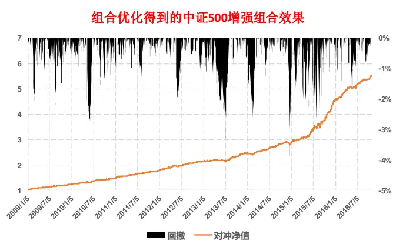
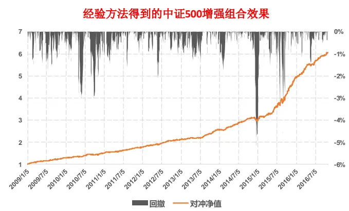
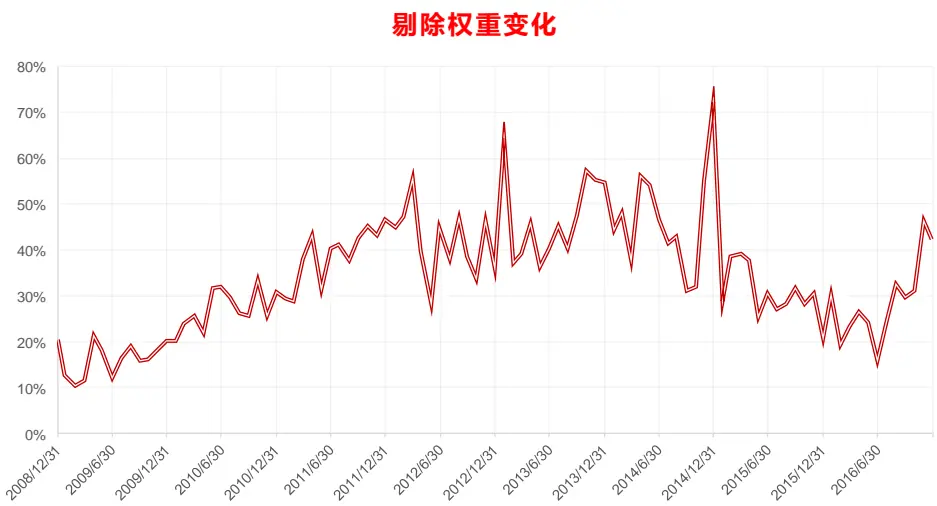

## 研究结论

过去几年A股alpha 空间较大，一些经验的简单组合构建策略就可以获得稳健组合，组合优化方法在提高策略收益和稳健性上并无明显优势。它的作用更多是提供一个平台，让投资者同时精确控制组合风险暴露、个股数量和权重、换手率、冲击成本等，同时还可以把投资者的主观信息融合同一个模型框架下来，包容性和扩展性强。

风险厌恶系数的设定取决于要做什么策略组合，报告正文给出了估算方法。当组合优化问题的约束条件较多时，约束条件对组合风险的控制作用更大，风险厌恶系数的变动只能实现微调。

实际使用中，绝大多数组合优化问题都要通过数值方法求解。没有适用所有问题的数值算法；同一个问题，不同算法的求解时间可能相差几倍甚至几十倍。凸二次规划是组合优化中最常见的优化问题形式，有非常高效的数值方法，我们建议尽可能把其它类型的组合优化问题转换成凸二次规划求解，并分析了常见优化问题的转换方法。

对于无约束条件的组合优化问题，优化结果对预期收益率和协方差矩阵的估计误差十分敏感。但真实投资中，会加上许多约束条件，降低敏感性；而且用 alpha 因子模型预测股票收益、用风险模型或压缩估计量预测协方差的方式可以减小估计误差，让组合优化结果具备实用价值。

近年来发展的稳健组合优化技术可以让投资者在优化目标函数中对参数估计误差直接做惩罚，降低误差敏感性，而且该优化问题可以转换成二阶锥规划（SOCP）快速求解。但一些实证发现这种方法对低信息比的策略改进明显，但对于高信息比问题的改进十分有限。

我们用alpha 因子模型预测的股票收益作为先验，投资者的主观观点作为观测值，通过Black-Litterman 公式计算得到经过主观观点调整的预期收益。报告中设计了一个简洁方法来表示主观观点的乐观程度，用今年1 月分的数据考察了不同主观观点，不同乐观程度对组合策略收益的影响。

## 风险提示

- 量化模型失效风险

- 市场极端环境的冲击

|  | AR | a - 0.1 | • 0.2 | 0 | a-0.4 | • 0.5 |  | • 0.7 | a - 02 | a - 0.9 |
| --- | --- | --- | --- | --- | --- | --- | --- | --- | --- | --- |
| ( | 609% | 6.45% | 624% | 6.26% | 6.20% | 614% | 609% | 601% | 5.97% | 528% |
| X81月堂 | -L.00% | -L20K | -124k | -1.00% | -1.14k | -0.25% | -0.70% | -0.71% | -0.92% | -0.72k |

|  | AIR | a • 0.1 | • 0.2 | a 03 | a • 0.4 | - 0.s | • 0.6 | • 0.7 | a - 0a | a - 0.9 |
| --- | --- | --- | --- | --- | --- | --- | --- | --- | --- | --- |
| (MA | 609% | 6.13% | 6.12% | 6.u1% | 6.10% | 6.09% | 608% | 608% | 6.07% | 606% |
| 关81月堂 | -L.00% | -L87k | -1.56% | -LALK | 0.26k | -0.72% | -0.85% | -0.24% | -0.51% | -0.48k |

主和1五估子名对一个月反因子如不

|  | AR | a + 0.1 | 日 • 0.2 | a - 03 | a + 0.4 | a • 0.5 | a + 0.6 | a • 0.7 | a • 03 | a - 0.9 |
| --- | --- | --- | --- | --- | --- | --- | --- | --- | --- | --- |
| ( | 609% | 6.20% | 6.17% | 6.15% | 6.13k | 611k | 609% | 608k | 6.06% | 603% |
| 关81月基 | -L.0% | -L78k | -L.57% | -L19% | -1.27k | -120% | -L00% | -0.54% | -023% | -043% |

报告发布日期2017 年 03 月 06 日

证券分析师 朱剑涛

021-63325888*6077

zhujiantao@orientsec.com.cn

执业证书编号：S0860515060001

相关报告

| 动态情景 Alpha 模型再思考 | 2017-02-17 |
| --- | --- |
| 技术类新 Alpha 因子的批量测试 | 2017-02-17 |
| 对主动投资有益的量化结论 | 2016-12-21 |
| 在 Alpha 衰退之前 | 2016-12-05 |
| A 股市场风险分析 | 2016-12-02 |
| 非对称价格冲击带来的超额收益 | 2016-11-10 |
| 东方机器选股模型 Ver 1.0 | 2016-11-07 |

## 一、组合优化方法的益处

我们之前在做指数增强研究时，偏好使用均值方差组合优化（MVO, Mean-VarianceOptimization）的方法。例如：图 1 所示结果是用报告《alpha 预测》中筛选出的11 个 alpha 因子，做 IC_IR 加权，以中证 500 指数为基准做均值方差优化，控制行业主动暴露为 0，市值主动暴露绝对值小于等于 0.5，单个股票权重不超过 1%，由此得到的全市场选股中证 500 月频增强组合。除了组合优化外，量化研究中也常用一种便捷的经验做法，即让策略组合和中证 500 指数的行业权重分布一致（主动行业暴露等于 0），在每个行业内，选多因子加权 zscore 得分最高的 10%的股票，把行业总权重等额分配到这些个股上，这样得到的中证 500 全市场选股增强策略效果如图 2所示（图 1 和图 2 回溯结果都未扣减交易费用）。

图 1：组合优化方法得到的中证 500 增强策略效果

图 2：经验方法得到的中证 500 增强策略效果

| 年化超额收益 | 信息比 | 月胜率 | 最大回撤 | 平均股票数量 | 月单边换手率 |
| --- | --- | --- | --- | --- | --- |
| 28.4% | 3.74 | 88.3% | -4.3% | 175.5 | 71.4% |

资料来源：东方证券研究所 & Wind 资讯

| 年化超额收益 | 信息比 | 月胜率 | 最大回撤 | 平均股票数量 | 月单边换手率 |
| --- | --- | --- | --- | --- | --- |
| 30.3% | 3.72 | 89.4% | -5.1% | 212.8 | 65.5% |

资料来源：东方证券研究所 & Wind 资讯

可以看到在测试区间 2009.01.05 –2016.10.31 内，两个策略的表现基本一致，经验方法的年化超额收益比组合优化方法略高（但统计上不显著），而且计算方便，因此一些量化研究更偏好使用经验方法。但需要注意的是，经验方法并没有主动控制组合的市值风险暴露，组合面临的市值风险暴露随机性强，因此虽然两者回溯测试的结果差不多，但是经验方法的“运气”成分更高。经验方法可以进一步改进来控制市值风险暴露，例如在每个行业内先把股票按市值大小进行分档，在每档里面选取 zscore 打分考前的股票构建组合，通过分档数量来控制市值风险暴露度大小，但这种控制方法并不精确，而且如果行业内股票数量较少，这种方法控制市值暴露的效果会非常粗糙。

总结来说，组合优化并不一定会提高组合业绩表现，但它能实现投资组合的精确控制，包括组合风险暴露、换手率、个股权重上下限、跟踪误差等，降低策略收益的不确定性。另外组合优化体系的扩展性强，可以把交易冲击成本（参考前期报告《资金规模对策略收益的影响》）、参数估计误差、主观投资调整（参考下文）等融入到一个体系中求解。因此，组合优化是一套结构完备、功能性强的理论，但好的理论并不能保证好的实践结果，投资使用中会碰到许多技术上的问题。

## 二、求解组合优化

## 2.1 风险厌恶系数的设定

假设有 N 只股票，无约束条件的组合优化问题可以表示成如下二次型函数形式：

$$
\operatorname*{max}_{\mathbf{w}}~w^{\prime}f-\lambda\cdot w^{\prime}\cdot\Sigma\cdot w\qquad\cdots\ (1)
$$

其中 为 向量，表示预期股票收益率； 为 矩阵，表示股票收益率的协方差； 为向量，如果是做绝对收益组合，w 表示 N 个股票在组合中的权重，如果是做指数增强，优化目标则是策略组合相对基准指数的超额收益，此时w 表示N个股票的主动权重（Active Weight），即个股在策略组合中的权重减去其在基准指数中的权重。 是人为设定的大于零的常数，称作风险厌恶系数（Risk Aversion Parameter），需要注意的是，为了求导计算方便，有很多文献在式（1）的二次项前面加 作为乘数，因此这两者之间可能会差一个倍数。为了求解组合优化问题，我们必须先设定风险厌恶系数。

直观的讲，风险厌恶系数代表投资者为了获得一个单位的收益愿意承担多少风险，风险采用组合收益率的方差作为度量；风险厌恶系数越大，得到的组合就越保守。风险厌恶系数的设定与要构建的策略组合有关。假设我们是做全市场选股的中证 500 指数增强，此时 w 为策略组合的主动权重， $\mathbf{w^{\prime}}\cdot\mathbf{f}$ 表示策略组合的超额收益， $\mathbf{w}^{\prime}\cdot\boldsymbol{\Sigma}\cdot\mathbf{w}=\sigma_{\mathrm{p}}^{2}$ $\sigma_{\mathrm{p}}^{2}$ 为策略组合的跟踪误差，策略组合的信息比 $\mathrm{IR}={\frac{w^{\prime}\cdot f}{\sigma_{p}}}.$ ，所以（1）式可以写作

$$
IR\cdot\sigma_{p}-\lambda\cdot\sigma_{p}^{2}\qquad\cdots\cdots\tag{2}
$$

容易求得（2）式在 ${\sigma}_{\mathbf{p}}=IR/(2\lambda)$ 时取最大值，由此反推出 $\lambda=\mathrm{IR}/(2\sigma_{\mathrm{p}})$ 。得益于 A 股近几年小盘风格的稳健持续，基于多因子选股的纯多头组合即使不做行业和市值风险控制，相对中证 500指数的信息比也可以达到 1.5 以上，但年化跟踪误差可能超过 30%。把这两个数值代入前式，得到 。如果是做一个纯多头组合，这时 w 表示个股的绝对权重，上面推导过程的 IR 可以近似理解成 Sharpe 值（分子项相差一个无风险收益率）， $\sigma_{\mathrm{p}}$ 则为组合收益的波动率。最近十年，中证全指的 Sharpe 值不超过 0.5，年化波动率接近 30%。代入上式可以得到 。

可以看到对于不同的组合问题，适用的风险厌恶系数也不一样。BARRA组合优化模块默认的风险厌恶系数是 0.75，它是基于 SP500 指数长期6%年化收益和 20%波动率估算得到（Liu & Xu,2010），Fabozzi（2007）建议风险厌恶系数的一般取值范围设为 2 到 4. 不过和成熟市场相比，国内股票市场目前有效性不高，alpha 空间更大，量化组合能获得更高的信息比或 Sharpe值，因此在测试时可能需要测试在这个区间之外更大的风险厌恶系数。

另外需要注意的是，上面的估算结果都是针对无约束条件的 Mean-Variance 优化，而实际投资会有很多投资限制，这些投资限制会把组合的收益和风险限制在一个区间范围内波动，此时会影响风险厌恶系数作用的发挥，这也是下节将探讨的问题。

## 2.2 组合约束条件对风险厌恶系数的影响

以上的估算是在无约束条件下进行的，而实际做组合时会有很多约束条件，例如图 1 中证 500增强策略对应的优化问题可以写作

$$
\begin{array}{rl}&{\underset{\mathbf{w}}{\operatorname*{max}}~w^{\prime}\cdot f-\lambda w^{\prime}\cdot\Sigma\cdot w\qquad\cdots(3)}\\&{\mathrm{s.t.}~\mathrm{IE}\cdot\mathrm{w}=0\qquad\cdots(\mathrm{c}1)}\\&{\quad\left|MCE\cdot w\right|\le0.5\qquad\cdots(c2)}\\&{\quad\quad0\le\mathbf{w}+\mathbf{w_{bench}}\le0.01\quad\cdots(c3)}\end{array}
$$

IE 为行业因子风险暴露矩阵，MCE 为市值因子风险暴露矩阵， $\mathbf{w_{bench}}$ 为基准指数中的个股权重。另外我们还会在优化做完后再对股票权重做调整，保证股票数量不超过200只(具体做法参考第 2.4节)。为了研究不同约束条件下风险厌恶系数对组合优化结果的影响，这里另外测试了两个策略

Model 3-A: 把优化问题(3)的风险约束条件 c1 和c2 去掉，c3 中的个股权重上限调为 1;

Model 3-B: 包含风险约束条件 c1 和 c2，c3 中的个股权重上限调为 1；

测试结果如下（仍使用之前 11 个 alpha 因子，测试时间为 2009.01 – 2017.01）：

图3：不同约束条件下风险厌恶系数对中证 500 增强策略（全市场选股）的影响Model 3-A：

| 风险厌恶系数 | 年化超额收益 | 信息比 | 年化跟踪误差 | 月胜率 | 最大回撤 | 平均股票数量 | 月单边换手率 |
| --- | --- | --- | --- | --- | --- | --- | --- |
| λ=0 | 65.9% | 1.40 | 36.34% | 61.9% | -32.56% | 1.0 | 87.1% |
| λ = 1 | 31.2% | 1.47 | 17.70% | 81.4% | -26.24% | 141.0 | 71.1% |
| λ=2 | 30.2% | 1.92 | 12.57% | 82.5% | -16.20% | 149.4 | 69.4% |
| λ= 4 | 32.1% | 2.17 | 11.75% | 82.5% | -11.50% | 138.3 | 72.1% |
| λ=8 | 32.0% | 2.82 | 8.90% | 84.5% | -7.90% | 145.5 | 68.9% |
| λ = 16 | 27.5% | 2.70 | 8.06% | 85.6% | -6.80% | 140.2 | 67.8% |

Model 3-B：

| 风险厌恶系数 | 年化超额收益 | 信息比 | 年化跟踪误差 | 月胜率 | 最大回撤 | 平均股票数量 | 月单边换手率 |
| --- | --- | --- | --- | --- | --- | --- | --- |
| λ=0 | 31.5% | 1.74 | 15.01% | 75.3% | -17.92% | 200.0 | 85.5% |
| λ = 1 | 32.1% | 1.71 | 15.41% | 72.2% | -20.38% | 200.0 | 83.8% |
| λ=2 | 31.1% | 1.84 | 13.71% | 73.2% | -19.40% | 200.0 | 83.2% |
| λ = 4 | 32.1% | 2.05 | 12.60% | 77.3% | -16.36% | 200.0 | 82.3% |
| λ=8 | 30.4% | 2.42 | 10.01% | 76.3% | -11.30% | 200.0 | 80.7% |
| λ = 16 | 28.8% | 2.59 | 8.86% | 79.4% | 7.43% | 200.0 | 78.7% |

Model 3：

| 风险厌恶系数 | 年化超额收益 | 信息比 | 年化跟踪误差 | 月胜率 | 最大回撤 | 平均股票数量 | 月单边换手率 |
| --- | --- | --- | --- | --- | --- | --- | --- |
| λ=0 | 29.3% | 3.50 | 6.61% | 86.6% | -4.74% | 16.4 | 73.2% |
| λ = 1 | 29.2% | 3.61 | 6.41% | 86.6% | -4.55% | 178.1 | 72.8% |
| λ=2 | 29.6% | 3.56 | 6.58% | 86.6% | -4.60% | 178.9 | 72.8% |
| λ = 4 | 29.1% | 3.67 | 6.29% | 86.6% | -4.46% | 178.4 | 72.5% |
| λ=8 | 28.7% | 3.65 | 6.22% | 87.6% | -4.36% | 181.6 | 72.1% |
| λ = 16 | 27.7% | 3.85 | 5.73% | 88.7% | -4.32% | 181.2 | 71.5% |

数据来源：东方证券研究所 & Wind资讯

上述三个策略在 时，优化问题变成线性规划问题，Model 3-A 不像 Model 3-B 和 Model 3 那样做了风险控制，因此优化结果就是选过去一个月收益最高的那只股票，组合每期持股数量都是一只。从图 3 的结果可以看到：

1) 不管约束条件如何设臵，随着风险厌恶系数提高，策略组合的跟踪误差总体在下降。不过下降幅度不一样，Model 3 的约束条件最严，控制了行业和市值风险的主动暴露，因此跟踪误差不会太大，存在一个上限；同时 Model 3 控制了个股权重上限和股票数量，因此其跟踪误差不可能无限降低达到指数全复制的效果，跟踪误差存在一个下限；在这个窄幅的上下限波动区间里，风险厌恶系数对策略组合跟踪误差的影响幅度十分有限。Model 3-A 和 Model 3-B 约束条件相对较松，跟踪误差受到风险厌恶系数的影响也相对较大。

2) 优化问题的约束条件设臵和风险厌恶系数共同影响策略的绩效表现，当约束条件较多时，约束条件设臵对结果的影响是最主要的，留给风险厌恶系数去调整的空间并不大。

3) Model 3-B相对 Model 3-A 而言，多做了行业和市值上的主动风险暴露，直觉上讲，它应该获得更稳健的策略表现，但事实上在同样的风险厌恶系数下（ 除外），Model 3-B的信息比和跟踪误差指标都弱于 Model 3-A。这是因为 Model 3-B在做风险控制的同时也限制了股票的选取空间，会降低模型获取 alpha和分散风险的能力。

4) 约束条件 C3 是明确定额限制个股的持仓上下限，这钟做法在做中证 500增强时影响不大，因为其成份股权重分布相对均匀。但如果做沪深 300 增强，成份股权重分布集中，个股的权重上下限设臵改为比例浮动方式可能会更好，例如：策略组合里沪深 300成份股权重不超过其在指数内权重的 200%，不低于指数内权重的 30%；

如果组合约束条件较多，投资者在调整参数时面临优先控制哪些约束条件的问题。Clarke(2002) 提出了转换系数（TC, Transfer Coefficient）的概念来衡量组合优化中过程中，约束条件整体对信息转换效率的影响，TC 定义为风险调整 alpha与主动权重的相关系数，当无约束条件时，TC=1。Stubbs(2009) 进一步利用组合优化问题的一阶 KKT条件（参考下一节），分解出单个约束条件对组合权重的影响。不过这些定量分析对结果的评判比较单一，而我们最终投资决定是基于收益率、信息比、最大回撤、换手率、持股数量等多标准的综合评价，因此还是需要去手动调整约束条件，观察策略组合绩效表现的变动。我们经验的做法是先设臵一个中度风险厌恶系数，例如 ，基于实际投资需求设定好个股权重的上下限，然后做风险中性约束看策略效果，再慢慢放开风险暴露，看组合表现，最后变动风险厌恶系数做策略的微调。这种调试很难一步到位，有些步骤可能需要反复做多次。

最后更正之前专题报告中的一处纰漏。我们现在估算股票月频收益率协方差矩阵 时，是基于过去一年股票的日频收益率数据，采用压缩估计量方法得到日频收益率协方差矩阵，再乘以 21（一个月按照 21 个交易日计算）得到月频收益率协方差矩阵。不过在阅读之前代码时，发现我们在把日度收益率协方差矩阵转换成月频收益率协方差矩阵时，不是乘以 21，而是乘以 21 的平方。受影响结果的主要是《Alpha 预测》报告中的图 10 至图12 和《东方机器选股模型 Ver 1.0》中的图 8、图 9。原报告中风险厌恶系数为 1 等价于本报告中风险厌恶系数等于 21。不过如图 3 所示，由于风险暴露和个股权重条件限制较严，风险厌恶系数变化对回测结果的影响并不大。（为和之前报告保持数据一致，本报告图 1 采用的是风险厌恶系数等于 21 的设臵）。

## 2.3 数值优化算法简述

报告第一章提到组合优化具有精确控制、扩展性的理论优势，但这个理论优势能否在实际投资中转换成更好的组合绩效取决于我们能否高效、精确的求解优化问题。这里有两个关键步骤，一是基于历史数据准确的估计出组合优化问题的输入变量：股票收益率 和收益率协方差矩阵 ，第二是用数值算法求出最优解。本节主要讨论第二个问题，第一个问题在第三章讨论。

优化问题的数值求解是一个大类学科，对于非专业人员，自己独立开发一套快速、高效优化算法程序的难度大、成本高，更经济的做法是使用第三方提供的工具包，包括免费的 Python CVXOPT包、R 的 Rdonlp2、Quadprog 工具包；付费的 MATLAB Optimization Toolbox、MOSEK；适合大型商务运用的 CPLEX、XPRESS；和专门针对组合优化的 Axioma、BARRA、Northfield 等。使用第三方工具包可以帮我们节省大量时间，但也让投研人员面临选择的问题，特别是一些付费商用软件，他们能提供复杂的约束条件和目标函数设臵并返回优化结果，不过对背后的算法讳莫如深，我们期望的是专业人员为每一个问题都设计了“最优”算法，但不是所有的优化问题都能数值求解，开发人员是否在后台做了一些近似简化、返回的结果是否满足收敛条件无从知晓，如果投资者想做改进会面临比较大的障碍。下面将简单介绍一些常用数值优化算法原理，以便说明第三方工具包中常见的专业术语和论述我们为什么建议把组合优化问题尽可能简化成二次规划，详细的算法和数学论证建议参考 Nocedal & Wright(2006)。

首先讨论无约束条件的优化问题。无限制优化问题可以简单表示为 $\mathrm{min}_{\mathrm{x}\in\mathrm{R}^{\mathrm{n}}}f(x)$ ，x 是一个 n维列向量，目标函数 通常要求是光滑函数，这样在数值求解的每一次步进中目标函数的变化在可控范围内。对于无法计算导数的目标函数，没有通用的优化算法，一种做法是用有限差分（FiniteDifference）近似逼近函数的导数，再使用类似光滑函数的优化求解。另一种是使用遗传算法（GA，Genetic Algorithm）这样的随机搜索方法，它对目标函数几乎没有任何限制，但是遗传算法没法从理论上保证它得到结果一定收敛于最优解，而且由于它没有用到任何函数结构的信息，运算速度很慢；运算过程涉及初始样本数量、交叉、变异等多个参数，受参数影响大，需要反复调试。遗传算法更适合用于一些确定性算法无法解决的问题。

求解无限制优化问题的方法通常可以分为两类，一类是线性搜索法（Line Search），它由一个初始点 $\mathbf{\Delta x}_{0}$ 出发，沿着一个目标函数数值下降的方向前进一定的步长，第 k+1 次迭代式可以表示为 $\mathbf{x}_{\mathbf{k}+1}=x_{k}+\alpha_{k}p_{k}$ ，其中 $\alpha_{\mathrm{k}}\frac{\varTheta}{\ A\varepsilon}$ 一个正数，表示步长； $\mathrm{p}_{\mathrm{k}}$ 是一个向量，沿这个方向函数的数值在下降 $\mathrm{p}_{\bf k}^{\mathrm{T}}\cdot\nabla f(x_{k})<0$ $\mathrm{p}_{\mathrm{k}}$ 最 直 接 的 选 择 是 最 速 递 降 方 向 (steepest descent direction) $\mathbf{p}_{\mathbf{k}}=$ $-\nabla f(x_{k})/\|\nabla f(x_{k})\|$ ，不过这种选择在一些问题上（例如条件数特别大的二次规划问题）收敛速度非常慢。另一种选择是牛顿法 $\mathfrak{p}_{\bf k}=-\nabla^{2}f_{k}^{-1}\cdot\nabla f_{k}$ ，这种方法的收敛速度很快，但是要用到目标函数的二次导数，计算复杂，而且极易 $\vec{\mathcal{P}}$ 生误差，因此实际中用的更多的是牛顿方法的变体Quasi-Newton 方法 $\mathsf{p}_{\bf k}=-B_{k}^{-1}\nabla f_{k}$ ， $\mathtt{B_{k}}$ 是一个正定矩阵，常用的选择有 SR1 和 BFGS 两种，在每次迭代时更新，这种方法可以保证一阶线性以上的收敛速度。对于一般的线性搜索方法，步长 $\alpha_{\mathrm{k}}$ 必须满足一定的条件（Wolfe 或 Goldstein 条件）才能保证每次迭代让目标函数数值有足够幅度的下降，最终算法收敛于局部最优值。

无限制优化问题另一种常用的算法类型叫信任域方法（Trust-Region Method），这类算法在大型优化问题中经常用到。算法先选定一个初始点，再给它设臵一个初始邻域，称作信任域，在这个邻域里通过二阶泰勒展开的方式对目标函数进行逼近，由于这个过程也涉及到目标函数二次求导的运算，因此和之前线性搜索中的 Quasi-Newton 方法类似，Hessian 矩阵通常会换做一些对称矩阵进行逼近。再在这个邻域上求解二次规划问题（二次规划问题有非常高效的数值算法，参考后文），得到一个递进方向 $\mathrm{p}_{\mathrm{k}}$ ，得到一个潜在迭代点 $\mathbf{\boldsymbol{x}}_{\mathbf{k}+1}=\boldsymbol{x}_{k}+\boldsymbol{p}_{k}$ 。下一步是判断在这个邻域内简化的二次型目标函数和原来的目标函数逼近效果如何，这可以使用原始目标函数和简化二次型函数在递进方向上的数值下降幅度的比例作为衡量。如果这个比例很小，说明信任域范围设臵的太大，简化二次型目标函数对原目标函数的逼近效果差，需要缩小信任域再重复上面的求解和判断过程；如果这个比例大到超过一定阈值，则可以进行下一步迭代，给点 $\mathbf{X}_{\mathbf{k}+1}$ 设臵同样大小的信任域，再重复上面的求解过程；如果这个比例非常大， 接近 1，则可以适当扩大信任域范围，增加算法的收敛速度。

量化投资碰到更多的是带约束条件的优化问题，一般形式可以写为

$$
\operatorname*{min}_{\mathbf{x}\in\mathrm{R}^{\mathrm{n}}}f(x)\quad\quad s.t\left\{{c_{i}(x)=0}\quad i\in\mathcal{E}\right.
$$

满足约束条件的点构成的集合称为可行域，对于一个可行域的一个点 x，编号集

$$
\mathcal{A}(\mathrm{x})=\mathcal{E}\cup\left\{\mathrm{i}\in\mathcal{I}\mid c_{i}(x)=0\right\}
$$

称作点 $\mathsf{x}$ 的有效集（Active Set）。对于光滑的目标函数和约束条件函数，如果存在局部最优解 $\mathbf{x}^{*}$ ，且限制函数在最优解处满足一定的线性独立条件，则存在 Lagrange 乘数 $\lambda^{*}$ 使得函数

$$
\mathcal{L}(\mathbf{x},\lambda)=\mathbf{f}(\mathbf{x})-\sum_{i\in\mathcal{E}\cup\mathcal{I}}\lambda_{i}\cdot c_{i}(x)
$$

满足下列 KKT（Karush-Kuhn-Tucker）条件：

$$
\begin{array}{rl}&{\nabla_{\mathbf x}\mathcal{L}(x^{*},\lambda^{*})=0;}\\&{\qquad\quad\mathrm{~c_i(}x^{*})=0~for~i\in\mathcal E}\\&{\qquad\mathrm{~c_i(}x^{*})\geq0~for~i\in\mathcal I}\\&{\qquad\quad\lambda^{*}\geq0~for~i\in\mathcal I}\\&{\qquad\quad\lambda^{*}c_{i}(x^{*})=0~for~i\in\mathcal E\cup\mathcal I}\end{array}
$$

KKT条件是局部最优解的必要条件，可以通过数值求解 Lagrange 函数的一阶条件等式来确定最优解的范围。带约束条件优化问题最常用的算法有两类：

一种是序列二次规划法（SQP, Sequential Quadratic Programming），如果上面的优化问题只有等式约束问题，可以证明用 Newton 法求解 KKT 一阶条件等式等价与求解一个由目标函数的梯度函数和Lagrange函数的Hessian矩阵构成的二次规划。对于带不等式约束条件的优化问题，可以类似对限制函数求梯度，求解对应的二次规划问题得到递进方向，这中间需要解决二次规划可行域可能为空集、Hessian 矩阵估计等技术问题。 ${\tt SQP}$ 算法一般可以获得高于一阶线性的收敛速度。

另一种叫内点法（Interior Point）。它首先考虑与原问题对应的一个优化问题

$$
\operatorname*{min}_{\mathbf x}~f(x)-\mu\cdot\sum_{i\in\mathcal I}\ln(c_{i}(x))~\mathrm{s.t.}~\mathrm{c.}_{\mathrm{i}}(x)=0~i\in\mathcal E
$$

其中 是一个大于零的常数。因为 $1_{\mathrm{X}\to0^{+}}\ln(x)=-\infty$ ，所以上述问题隐含要求原问题的不等式约束条件严格成立，它的解都在可行域内部，这也是内点法的名称由来。但它和原问题并不等价，需要需找一个收敛于零的序列 $\{\mu_{\mathrm{k}}\}0^{+}$ ，使得求解系列优化问题的解收敛于原问题的局部最优解，而这一系列优化问题都可以通过 prime-dual 方法求解 KKT一阶条件等式来寻找最优解。序列 ${\bf\dot{\mu}_{\bf k}}\}$ 收敛于零的速度必须适中，通常使用 Fiacco-McCormick 方法或 Adaptive Strategies 来生成。内点法也可以达到超线性的收敛速度，而且由于每一步优化过程不需要考虑所有约束条件，需要求解的线性系统结构相同，因此运算强度可能会低很多，很适合解决大型的优化问题，

我们组合优化中碰到最多是下面的二次规划问题：

$$
\begin{array}{r}{\operatorname*{min}_{{\bf x}\in{\bf R}^{n}}\frac{1}{2}{\boldsymbol x}^{\prime}\cdot{\boldsymbol\Sigma}\cdot{\boldsymbol x}+{\boldsymbol{\alpha}}^{\prime}\cdot{\boldsymbol x}{\bf\Sigma}~s.t.~a_{i}^{\prime}\cdot{\boldsymbol x}=b_{i}~for~i\in\mathcal{E},\quad a_{i}^{\prime}\cdot{\boldsymbol x}\geq b_{i}~for~i\in\mathcal{I},}\end{array}
$$

其中 表示协方差矩阵，是一个正定矩阵，因此目标函数是一个凸函数，而约束条件都是线性的。这种类型的二次规划称作凸二次规划，它在数值求解上有许多便利之处，比如说，股票权重大小一般在[0,1]之间，因此上述约束条件的可行域如果非空的话，是一个有界闭集，凸函数在欧式空间的有界闭集上一定有最小值，而且是全局最小值。此时 KKT条件也变成充分必要条件，它的一阶条件等式形式相对简单，有许多高效的数值算法。凸二次规划的算法可以分为内点法和有效集法两类，一些测试实验表明在求解大型凸二次规划优化问题时，内点法的速度一般会更快。商用的MATLAB,MOSEK, CPLEX, XPRES 都提供使用内点法的凸二次规划工具。

由上面的讨论可以看到，不是所有优化都有对应的数值求解方法，对于同一个问题不同的算法收敛速度可能相差很多，凸二次规划和线性规划是我们在做组合优化时会碰到的最易求解的优化问题类型，有快速收敛的数值算法，算法的高效性使得凸二次规划常作为复杂优化问题的子算法（例如：信任域和 SQP 方法）。在我们的个人电脑上，全市场三千多只股票用凸二次规划算法做一次图 1 的优化只需要 15 秒不到，而用针对一般问题的内点法优化工具包求解上面问题则需要近 10分钟（在同样的目标函数精度设臵下），速度相差明显。这个速度差距在低频率的实际投资中，影响并不大；但如果是做历史回溯，特别是针对周频甚至日频的高频策略，一般算法累积的时间消耗将非常惊人（很多量化策略无法通过并行计算减少程序运行时间），不利于策略的调试。因此我们建议做组合优化时尽可能的把问题转化成求解凸二次规划，幸运的是我们实际投资碰到的大多数问题都可以做到。

## 2.4 组合优化问题的简化

传统 Mean-Variance 组合优化中常碰到的约束条件有以下几种：

## a) 线性约束

在 2.2 节讨论的组合优化示例中，组合的风险暴露控制和个股权重上下限约束都属于线性约束条件，和均值方差形式的目标函数一起用标准的凸二次规划算法求解。

## b) 二次约束

一些投资经理可能对组合波动率或跟踪误差有明确的控制目标，例如某中证 500 指数增强基金经理要求增强组合的年化跟踪误差不超过 5%，这个约束条件可以用数学表达式写作

$$
\mathbf{w}^{\prime}\cdot\boldsymbol{\Sigma}\cdot\mathbf{w}\leq0.05^{2}
$$

其中 w 为策略组合的主动权重， 为收益率的协方差矩阵。对于标准 Mean-Variance 优化，目标函数里的二次项作用是用来控制跟踪误差，如果加入了上述二次约束条件，那么可以拿掉目标函数的二次项，使其变为线性函数，避免作用重复。在设定目标跟踪误差需要注意两点：

1. 目标跟踪误差设定要考虑组合优化里的其它约束条件。由 2.2 节的示例可以看到，策略组合能达到的跟踪误差水平跟约束条件有关，如果约束条件较多，策略能达到跟踪误差水平可能是一个很小的区间。这时如果设臵的目标跟踪误差太大，约束条件会起不到实际作用；如果设臵的太小，可能导致策略组合无法达到目标，可行域为空。

2. 目标跟踪误差会低估策略组合实际跟踪误差。这点在我们前期专题报告《用组合优化构建更精确多样的投资组合》有讨论过，优化问题中设臵的跟踪误差是 5%，但实际的跟踪误差是 7%。造成这种现象的可能原因是风险模型低估了市场风险，不管协方差矩阵是用压缩估计量这样的统计模型还是类似 BARRA的因子结构化模型做估计。为了保证设臵目标和实际效果一致，在设臵目标时需要人为的给原定目标乘上一个调整系数（不少商用组合优化软件已实现这个功能），使得实际跟踪误差和目标跟踪误差尽量接近。

如果除了二次约束条件，其它约束条件都是一阶线性，这类优化问题可以看作一个二阶锥规划（SOCP, Second-Order Cone Programming），它有对应的高效内点法算法，网上有许多工具包可使用，例如 MATLAB 的 CVX、SeDuMi，Python 的 CVXOPT，R 的 Rmosek、CLSOCP 等。如果投资者只是想达到控制跟踪误差的目的，完全可以把约束条件移到目标函数中，在标准凸二次规划中调节风险厌恶系数来控制跟踪误差，不过多大的风险厌恶系数对应多大的跟踪误差需要通过多次测试才能确定，不同的问题这种对应关系也会不一样。

## c) 非光滑约束

换手率控制是最常见的非光滑约束条件，它可以表示为 $|\mathbf{w}-\mathbf{w}_{0}|<\delta$ ，其中 $^{1}\mathrm{w}_{0}$ 表示调仓前组合的个股权重， 为双边换手率上限。带换手率控制约束条件的优化问题可以通过引入辅助变量转换成标准的凸二次规划，例如，对于如下优化问题：

$$
\begin{array}{rl}&{\quad\underset{\mathbf{w}}{\mathrm{max}}~w^{\prime}\cdot f-\lambda w^{\prime}\cdot\Sigma\cdot w\qquad\cdots\cdots(4)}\\&{\quad}\\&{\mathrm{s.t.}\quad\mathrm{A_{1}}\cdot\mathbf{w}\leq\mathbf{b}_{1}}\\&{\quad\quad\quad\mathrm{A_{2}}\cdot w=b_{2}}\\&{\quad\quad\quad\quad|\mathbf{w}-\mathbf{w}_{0}|\leq\delta}\end{array}
$$

其中 $\mathrm{A}_{1},\mathrm{A}_{2}$ 分别为 $\mathrm{K}_{1}\times N$ 和 $\mathrm{K}_{2}\times N$ 矩阵，代表 $\mathrm{K}_{1}$ 个不等式线性约束条件和 $\mathrm{K}_{2}$ 个线性等式约束条件。引入辅助变量 $\mathbf{\dot{w}}^{+}=\operatorname*{max}(0,w-w_{0}),\mathbf{w}^{-}=-\mathbf{min}(0,w-w_{0})$ ，问题（4）的不等式约束条件可写作：

$$
\begin{array}{rl}&{\quad\ A_{1}\cdot w=A_{1}\cdot\left(w-w_{0}+w_{0}\right)=A_{1}\cdot\left(w^{+}-w^{-}+w_{0}\right)\leq b_{1}}\\{}&{}\\{\implies}&{\quad A_{1}(\mathsf{w}^{+}-\mathsf{w}^{-})\leq\mathsf{b}_{1}-\mathsf{A}_{1}\cdot\mathsf{w}_{0}}\\{}&{}\\{\implies}&{\quad\mathsf{C}_{1}\cdot\mathrm{X}\leq\mathsf{b}_{1}-\mathsf{A}_{1}\cdot\mathsf{w}_{0}\quad\mathrm{where~}\mathsf{C}_{1}=\left(\begin{array}{ll}{A_{1}}&{0}\\{0}&{-A_{1}}\end{array}\right),X=\binom{w^{+}}{w^{-}}}\end{array}
$$

如果把 向量 X当成新变量，上式是关于变量 X 的一个线性约束条件。同理(4)的等式约束条件可表示为：

$$
\begin{array}{r}{\mathsf{C}_{2}\cdot X=b_{2}-A_{2}\cdot w_{0}\quad where\ \mathsf{C}_{2}=\left(\begin{array}{cc}{A_{2}}&{0}\\{0}&{-A_{2}}\end{array}\right)}\end{array}
$$

换手率约束条件可写作： $\mathsf C_{3}\cdot\boldsymbol X\le\delta\quad\mathrm{where~}\mathsf C_{3}=\left(\begin{array}{cc}{1_{1}\times\boldsymbol N}&{0}\\{0}&{1_{1}\times\boldsymbol N}\end{array}\right)$

此外还需加上一个约束条件 $\geq0_{\mathfrak{c}}$ 。目标函数同样可以转换成变量 X的二次型：

$$
{\mathrm{X}}^{\prime}\cdot{\mathrm{F}}-\lambda\cdot{\mathrm{X}}^{\prime}\cdot{\Phi}\cdot{\mathrm{X}}{\mathrm{~where~}}{\mathrm{F}}={\binom{f-2\lambda\Sigma\cdot w_{0}}{-f+2\lambda\Sigma\cdot w_{0}}},\quad{\Phi}={\binom{\Sigma}{-\Sigma}}\quad{\mathrm{\Sigma}}^{-\Sigma}{\Big)}
$$

经过如上变量替换，原问题转换成了一个标准凸二次规划，虽然变量的维度由 N 提升到了 2N，但考虑到求解凸二次规划算法的高效性，这种维度的提升最终有助于总运算量的降低和最优解精确度的提高。

## d) 整型约束

常用的整型约束有两种：一种是针对“碎股”效应，A 股交易有最小一手 100 股限制，因此实际交易的股票都是正整数，而并非优化结果里的实数。碎股的影响对小资金和高股价股票的影响较大。对与机构投资者而言，可以直接拿优化的实数结果取整即可，碎股影响很小。另一种是对组合持股数量的要求，例如：要求组合持股数量不超过 200 个，此类型约束可以用数学式表示为：

$$
\begin{array}{l}{\mathfrak{\eta}_{\mathrm{i}}=1\cdot(w_{i}>0)+0\cdot(w_{i}==0)\quad for\quad i=1,2\dots N}\\{\quad}\\{0\le\mathbf{w}_{\mathrm{i}}\le\eta_{i}\quad and\quad\sum_{i=1}^{N}\eta_{i}\le200}\end{array}
$$

凸二次规划若加上整型约束条件则转化为一个混合整型优化（MIP, Mixed Integer Programming）问题，可以用”Branch-and-Bound”方法求解，它的基本流程是先去掉整型约束求解连续优化问题，再对连续最优解的分量逐个进行取整，用这个整数点对可行域两分，求解子问题，递归获取数值解。要判定算法数值解是不是全局最优解，至少要把离散变量的取值域遍历一遍，这对于高维问题显然不可行，数值算法往往求得的是一个次优解。

为避免直接求解 MIP，我们可以先去除整型约束条件，在求解凸二次规划得到最优解后，用经验方法对最优解做一些处理来满足投资限制。如果一个股票对目标函数的贡献很小，二次规划不会直接把这个股票在策略组合里的权重调为零，而是会赋予一个接近于零的正数，因此直观的做法是设臵一个阈值，把权重低于这个阈值的股票抹去，然后把抹去的权重分配到剩余的股票中，看组合的持股数量能否达到要求。但这样处理的时候需要注意，有必要考察一下被抹去的股票权重占比有多少。例如，如果取阈值为 0.001，优化问题（3）对应的中证 500 指数增强策略（ ）每期被抹掉的股票权重占比变化如下图所示：

图4：阈值 0.001 下，每期被抹掉的组合权重占比变化

数据来源：东方证券研究所 & Wind资讯

可以看到 0.001 的阈值设臵明显偏高，大部分时间抹掉的权重占比都高于 30%，最高时甚至能超过 70%，需要降低阈值的设臵。

虽然每个月策略求解的是同样约束条件和目标函数的优化问题，但是预测收益率和协方差矩阵数据是基于历史数据滚动估算，估计误差会随时间变化，进而影响组合优化出权重的集中离散程度，固定阈值的做法较难适应这种变化。我们在实际操作中，是先把二次规划优化出的权重按照从大到小排序，逐步累加，找出累加权重超过 80%的点，把这个点往后的小权重抹掉，分配到剩余股票中。不过如果优化出的权重分布比较均匀，这样做选出的股票数量可能远远超出 200 的限制，是保证股票数量不超限还是保证被抹掉的权重不能太多，取决于投资者个人的选择。

另外，这种经验方式处理后的组合权重不再严格满足原来优化问题的约束条件，会产生多少偏离需要考察。如果想让处理后的组合权重依然严格满足约束条件，可以考虑求解另外一个优化问题，它的目标函数为 | |， 为二次规划优化得到股票权重，约束条件和原来的组合优化问题完全一样。这仍然是一个混合整型规划问题，但在约束条件只有线性约束和整型约束时，可以通过把绝对值拆分成正部和负部的方法（参考上文“非光滑约束条件”处理方式），使得这个问题转换成混合整型线性规划（MILP, Mixed Integer Linear Programming），数值求解相对容易。

## 三、组合优化使用中的问题与改进

## 3.1 参数估计误差与稳健优化

组合优化的目的是通过资产组合的方式实现风险的分散，在收益和风险间权衡。但实证研究发现，如果用历史收益率的均值和样本协方差作为预期收益率和协方差矩阵的估计去做均值方差优化，得到的最优组合里资产的权重并不分散，会有非常大的多头权重和空头权重集中在个别资产上。而且小幅变动单个资产的预期收益率数值将导致整个组合权重的大幅变动（Chopra (1993) &Kolusheva(2007)），这样的组合在实际投资中几乎没有使用价值。

在第 2.3 节介绍组合优化的数值算法时，我们假设模型的输入变量：预期收益率 和协方差矩阵 都是确定值，但实际操作中，这些值只能基于历史数据去估算，有很大的估计误差，而组合优化结果对这些误差十分敏感。相对而言，组合优化结果对预期收益率误差的敏感度要远高于协方差矩阵，Chopra & Ziemba（1993）实证发现，优化结果对预期收益率和协方差矩阵误差的敏感度与风险厌恶系数的选取相关，如果以组合的现金等价值变化量作为衡量指标，平均来看，优化结果对预期收益率估计误差的敏感度是方差的 11 倍，是协方差的 20 多倍。这个结论也得到后续DeMiguel (2009) 和 Palczewski(2014) 的证实，不过由于度量标准不一样，敏感度的倍数关系要小一些。资产的预期收益率预测难，估计误差高，对优化结果影响大，因此有不少研究发现，在做优化时如果把目标函数里的收益率部分去掉，只留下二次项做优化，得到的全局最小方差组合（GMV, Global Minimum Variance）的样本外表现比标准的 Mean-Variance 二次型优化得到的组合要好（Sharpe 值更高）。

上述实证结果大多是基于无约束条件或加了全额投资约束条件（资产的权重和等于 1）的mean-variance 优化结果，但实际投资中，我们对单个资产权重一般有上下限约束，如果给个股的权重加上约束，Jagannathan & Ma(2002) 通过计算优化问题的 KKT一阶条件发现，加上下限限制相当于对预期收益率和协方差矩阵做了压缩估计（Shrinkage Estimator），加入了先验信息，降低了估计误差。因此在实际投资中，加了多重约束条件后，前后两期组合优化出来的股票权重往往能保证一定的稳定性，具备实用价值。

想要改进组合优化结果必须提高预期收益率和协方差矩阵的估计。我们在前期报告《A股市场风险分析》中简单讨论过协方差矩阵估计的问题，类似 BARRA的因子结构化风险模型和压缩估计量这样的统计模型都可以降低估计误差，具备很强的实用价值，其它可行的协方差矩阵估计方法可以参考 Bai(2011)。估计预期收益率时，也可以定一个压缩目标，采用 Bayes-Stein 压缩估计量（参考 DeMiguel(2007) & Jorion (1986)）.我们在实际投资中更多是用 alpha 因子模型来预测股票收益率。在我们之前的实证研究中，“Alpha 因子模型+矩阵协方差矩阵压缩估计+组合优化”的模型体系取得了不错的回溯测试效果，但是也要注意到 alpha 因子对股票收益率的解释能力并不强，我们因子库里因子做完行业和市值的风险中性化处理后，如果拿每个月的股票收益率对因子做横截面多元回归，平均的 Adjusted Rsquare 不足 6%，用这些因子来预测未来的股票收益，误差还是会很大，因此如果能有办法能降低误差对组合优化结果的影响，还是很值得尝试。下面介绍两种降低误差影响的方法，这两种方法实现起来比较麻烦，而且有许多实证显示这两种方法的改进效果并不明显，所以我们暂时还未拿 A 股数据做测试，这里只介绍方法的思想、数学处理、海外实证结果和对应的软件工具包，以便感兴趣的投资者参考。

一种是 Michaud(1998)提出的重复抽样方法，对资产的收益率时间序列进行 bootstrap 重复抽样，每一抽样都可以得到一个预期收益率和协方差矩阵和估计，代入组合优化中得到一个优化后的组合权重。如果做了 1000 次抽样，就会得到 1000 个组合权重，把这些组合权重进行简单平均得到最终权重。实证显示这种方法会降低优化结果对估计误差的敏感度，得到的权重也更加分散。但需要注意的是，这是一种纯经验做法，无法从理论上证明重复抽样的结果会收敛与原问题的最优解，而且重复抽样的方法非常耗时，特别是在历史回溯的时候，把抽样得到的结果进行简单平均可能会导致某些约束条件不满足（例如：股票数量限制），因此这种方法对于量化选股而言实用价值不高。

另一种在实务投资中已得到运用的方法是稳健组合优化（Robust Portfolio Optimization）,这种方法起源于优化理论，用于处理某些变量存在不确定性的问题。对于组合优化而言，预期收益的估计误差影响是主要的，协方差矩阵估计误差的影响次之，因此这里主要讨论处理预期收益误差的稳健优化问题。假设股票预期收益的真实值 在估计值 f 附近做正态波动 $\mu\sim\Nu(\mathrm{f},\Sigma_{\mathrm{f}})$ ，则 的臵信域可以表示为

$$
\mathcal{D}{:}\quad(\mu-\mathrm{f})^{\prime}\cdot\Sigma_{\mathrm{f}}^{-1}\cdot(\mu-f)\le\kappa^{2}\quad where\quad\kappa^{2}=\chi_{n}^{2}(1-\theta\%)
$$

$\chi_{n}^{2}(\cdot)$ 是自由度为 n 的卡方累积分布函数的逆函数。 值越大，真实值 的波动空间就越广，估计值 f 就越不可靠。由于组合优化的“误差放大”作用，基于预测收益的均值方差有效前沿往往高于实际有效前沿，如果组合的权重 w 已知，那么在上述臵信域内，组合预期收益与实际收益的最大差额可以通过求解下面优化问题得到

$$
\operatorname*{max}_{\mathfrak{u}}f^{\prime}\cdot w-\mu\cdot w\quad s.t.\ :\ :(\mu-\mathfrak{f})^{\prime}\cdot\Sigma_{\mathsf{f}}^{-1}\cdot(\mu-f)\leq\kappa^{2}\quad\cdots\cdots(5)
$$

利用 KKT一阶条件，容易知道当 $\begin{array}{r}{\mathsf{\Pi}\mu=\mathbf{f}-\sqrt{\frac{\kappa^{2}}{w^{\prime}\cdot\Sigma_{\mathbf{f}}\cdot w}}\cdot\mathsf{T}_{\mathbf{f}}\cdot w}\end{array}$ 时，两个组合收益差额的最大值

$$
\mathbf{f}^{\prime}\cdot\mathbf{w}-\mathbf{\mu}\cdot\mathbf{w}=\kappa\cdot{\sqrt{w^{\prime}\cdot\Sigma_{f}\cdot w}}\quad\implies\quad\mu\cdot\mathbf{w}=\mathbf{f}^{\prime}\cdot\mathbf{w}-\kappa\cdot{\sqrt{w^{\prime}\cdot\Sigma_{f}\cdot w}}
$$

假设原优化问题的形式是（这里把方差控制放到约束条件中，方便后续问题的求解）

$$
\operatorname*{max}_{\mathbf{w}}f^{\prime}\cdot w\qquad s.t.\quad w^{\prime}\cdot\Sigma\cdot w\leq v,A_{1}w\leq0,\qquad A_{2}w=0
$$

其对应的稳健组合优化问题即是在真实收益“最坏”的情况下，对权重进行优化，即

$$
\operatorname*{max}_{\mathbf{w}}\quad(\operatorname*{min}_{\mu\in\mathcal{D}}\mu\cdot w)\qquad s.t.\quad w^{\prime}\cdot\Sigma\cdot w\leq v,A_{1}w\leq0,\qquad A_{2}w=0
$$

代入问题(5)的优化结果，上式变为

$$
\operatorname*{max}_{w}\boldsymbol{\mathrm{f}}^{\prime}\cdot\mathbf{w}-\kappa\cdot\sqrt{w^{\prime}\cdot\Sigma_{f}\cdot w}\qquad s.t.\quad w^{\prime}\cdot\Sigma\cdot w\leq v,\ A_{1}w\leq0,\qquad A_{2}w=0
$$

因此稳健优化相当于在目标函数加了一个误差惩罚项， 可理解成误差厌恶系数，引入辅助变量 ，上式可以进一步变换为

$$
\operatorname*{max}_{w,\gamma}{\boldsymbol f}^{\prime}\cdot{\mathbf{w}}-\kappa\cdot\boldsymbol{\gamma}\quad s.t.\quad w^{\prime}\cdot\Sigma\cdot w\leq v,A_{1}w\leq0,\qquad A_{2}w=0.\quad w^{\prime}\cdot\Sigma_{f}\cdot w\leq\gamma^{2}
$$

这是一个 SOCP 问题，可以用 2.4 节介绍的专门工具包快速求解。

需要注意的是 是预期收益率的协方差矩阵，并非真实收益率的协方差矩阵 。做量化股票组合时，预期收益由 alpha 因子模型给出，可以直接采用线性回归预测值的方差，而且把 简化成对角阵，只估计对角线上的方差也能获得不错的实用结果（Stubbs 2005）。稳健优化是对真实收益“最坏”情况进行优化，给各个股票的预期收益率统一做了向下修正，因此一些实证发现它得到的组合十分保守，有时候组合表现还不如标准的 Mean-Variance 优化(Scherer 2007)。因此 Ceria& Stubbs(2006) 对原来的方法做了修正，在优化问题(5)中再加入了一个线性条件，使得稳健优化对原来的预期收益率既有向上修正，也有向下修正，他们把这个方法称作”zero net alphaadjustment”，测试结果显示改进方法得到的组合更接近真实有效前沿，组合表现好于传统Mean-Variance 优化。不过 Santos(2010) 发现如果用仿真模拟数据，稳健组合优化的表现确实要显著好于传统优化方法，但如果用真实市场数据，这两者的表现基本差不多。Axioma 2008 年也做过一个测试(Renshaw 2008)，他们搜集了 9 个组合管理团队做历史回溯时用的预测 alpha 数据和组合优化参数，然后把其中的组合优化改成稳健组合优化，看看对原来策略有多大提升。改进结果与误差厌恶系数 的选择有很大关系，在最优选择下，稳健优化对信息比在 1 以下的策略有大幅的改善，对信息 1 以上策略的改进幅度很小，而且这是一个样本内的结果，样本外选择不同的 对结果会有影响。考虑到国内目前的中证 500 量化增强策略信息比可以做到 3 以上，沪深 300增强可以做到 1.5 以上，对比 Axioma 结果看，稳健优化对这些策略的改进可能非常有限。

## 3.2 变换风险度量指标

Mean-Variance 另一个和人们习惯不切合的地方在于风险的度量，Variance 衡量的是不确定性，包含了有利和不利两种情况，而在日常生活工作中，风险更多的是用来指不利情况。如果单纯从逻辑上讲，确实有很多比 Variance 更合适的风险度量指标，包括：Markowitz 提出的半方差（Semi-Variance，收益率低于历史均值部分的波动）、VaR 与 CVaR(Conditional VaR)、还有策略回溯测试中用的比较多的最大回撤指标等。但是 Variance 是资产定价理论的核心构成因素，例如：CAPM 理论假设投资者基于 Mean-Variance 做决定，APT 理论里渐进套利机会的定义需要用到 Variance。目前还没有基于其它风险指标的完备定价理论。因此其它风险度量指标只是在传统定价理论下作为一个附加项使用，无法完全替代 Variance。另外，若要在实际投资中使用其它风险指标作为优化目标或约束条件还需要考虑以下几点：

1. 风险指标衡量的风险能否通过资产组合的方式进行分散。风险管理中常用的 VaR 指标，在所有资产收益满足联合正态分布时，两个资产构成的组合的 VaR 小于等于单个资产VaR 的和；但在其它分布下则不一定，此时无法通过资产组合的方式来降低总体 VaR。考虑到股票收益率的厚尾特征，VaR 用作股票组合的优化目标不太合适。而后文介绍的CVaR 指标则可以通过组合的方式降低风险，满足这种性质的风险度量指标也称作一致风险测度（Coherent Risk Measure）。

2. 风险指标能否通过历史数据准确估计。Variance 的估计用到了所有样本数据，而半方差、VAR 的计算只用到了部分样本数据，估计误差更大，时变性更强。

## 3. 风险指标加入后，组合优化问题是否有高效算法求解。

近些年的研究发现 CVaR 是一个实用性比较强的风险度量，它是一致风险测度，衡量的了尾部风险，而且放到组合优化里面有可行的理论数值算法。

CVaR, 也称作期望亏损指标（Expectaion Shortfall），由 VaR 指标衍生而来。对于 ，一个资产组合的 表示一个最大亏损值 ，该组合损失超过此亏损值的概率小于 ，用数学式可以表示为

$$
\alpha_{\beta}(w)=\underset{\alpha\in\mathbb{R}}{\operatorname*{min}}\Psi(w,\alpha)\geq\beta,\quad where\quad\Psi(w,\alpha)=\underset{-w^{\prime}\cdot r\leq\alpha}{\int}p(r)\cdot dr
$$

其中 是 向量，表示 n 个资产的权重。 为n 个资产的收益率的联合分布密度函数。CVaR衡量的是组合亏损大于β-VaR 时的平均亏损，用数学式可以表示为

$$
\Phi_{\beta}(w)=(1-\beta)^{-1}\int_{-w^{\prime}\cdot r\geq\alpha_{\beta}(w)}(-w^{\prime}\cdot r)\cdot p(r)\cdot dr
$$

可以证明 CVaR 不依赖于资产收益分布，是一个一致风险测度。对应均值方差优化，我们也可以考虑如下的 CVaR 优化问题

$$
\operatorname*{min}_{\mathbf{w}}\phi_{\beta}(w)\mathrm{~}s.t.\mathrm{~}w\in\mathcal{W}
$$

Rockafellar & Uryasev（2000）证明上述优化问题可以通过 Monte-Carlo 模拟转换成线性规划问题。首先, 他们证明最小化 CVaR 等价于下列最优化问题

$$
\operatorname*{min}_{\mathbf{w}\in\mathcal{W}}\phi_{\beta}(w)=\operatorname*{min}_{(w,\alpha)\in\mathcal{W}\times R}F_{\beta}(w,\alpha)
$$

$$
F_{\beta}(w,\alpha)=\alpha+(1-\beta)^{-1}\int_{r\in R^{n}}[-w^{\prime}\cdot r-\alpha]^{+}\cdot p(r)\cdot dr
$$

函数 $F_{\beta}(w,\alpha)$ 的多元积分部分则可以通过 Monte-Carlo 方法求得近似值，即根据 n 元资产的联合分布，模拟生成 q 个 n 维收益率序列 $\left\{\boldsymbol{r}_{k}=\left(\boldsymbol{r}_{1,k},\boldsymbol{r}_{2,k},\ldots\boldsymbol{r}_{n,k}\right)^{\prime}\right\}_{k=1}^{q}$ ，则 $F_{\beta}(w,\alpha)$ 的近似值可以表示为

$$
\alpha+\frac{1}{q\cdot(1-\beta)}{\sum_{k=1}^{q}}[-w^{\prime}\cdot r_{k}-\alpha]^{+}
$$

引入辅助变量 $\mathbf{u}_{\mathrm{k}}=[-w^{\prime}\cdot r_{k}-\alpha]^{+}$ ， 最小化 CVaR 可以转换成求解如下线性规划

$$
\operatorname*{min}_{\alpha,{\bf w},{\mathrm u}}\ \alpha+\frac{1}{q(1-\beta)}\sum_{k=1}^{q}u_{k}
$$

$$
\begin{array}{r}{\mathrm{~s.t.~w\in\mathcal{W},~}\ \begin{array}{r}{\mathrm{u}_{\mathrm{k}}\geq0,\ \quad w^{\prime}\cdot r_{k}+\alpha+u_{k}\geq0,\ fork=1,2\ldots q}\end{array}}\end{array}
$$

CVaR 也可以放到约束条件，做类似线性化处理。

上面的方法从理论上解决了 CVaR 优化的计算，但实际使用中，要模拟生成收益率序列样本，必须先准确估计多个资产的联合分布，这对于 A 股 3000 只股票来说难度太大。为了保证Monte-Carlo 方法的结果尽快收敛，可能还需要使用 variance-reduction 或 quasi monte carlo 方法。因此从计算难度上讲，CVaR 优化可能更适用于大类资 $\colon{\vec{p}}$ 配臵，但此时大类资产的预期收益率较难估计，会让优化出的组合权重变化十分剧烈。CVaR 优化用于投资实践前还有许多难点需要解决。

## 3.3 主观与量化信息的融合

量化模型对即时市场信息反应迟钝，这既是它的优点也是它的缺点，因为一方面滞后反应降低了模型受到的市场噪音的干扰，另一方面在市场发生大的风格切换时，模型容易遭到较大的净值回撤。以因子选股模型为例，我们是基于过去滚动 24 个月的数据计算 IC，用 IC_IR 对 alpha 因子进行加权。2016 年下半年，估值因子随着周期股的崛起而迅速走强，反转因子效用弱化趋势明显，但再往前的两年时间段里，估值因子表现相对较弱，反转因子表现较强，因此反应到因子权重里面，反转类因子的权重还是最高，基于多因子打分选出的主动量化组合还是会偏成长股，结果跑输大盘。因此如果市场发生剧烈变动，投资者对未来走势有明确主管观点时，可以考虑把主观观点加到因子选股模型里面，而组合优化则为我们提供了把主观信息转换为股票权重的工具。

下文提到的模型主要还是基于 Black-Litterman 模型框架，我们在收益率先验分布选择，参数设定方面做了改进，使得观点表达更加便捷，选股因子信息也可以包含在内。BL 模型最早是用来做大类资产配臵，预期收益率较难估算，因此假设市场处于均衡状态，从市场组合中各类资产的权重反算出隐含预期收益率作为先验的预期收益。但对股票组合而言，alpha因子模型能提供的信息更多，把它的预测作为先验更为合适，而后面的 Bayes 推导过程和标准的 BL模型完全一致。

BL 模型的 Bayes 推导过程可以参考 Cheung(2009)，这里只陈述模型结果。假设股票的收益率满足多元正态分布 $\mathrm{r}{\sim}\mathrm{N}(\mu,\Sigma)$ ，期望收益 $\mu{\sim}\mathrm{N}(\pi,\Phi)$ ，在原始 BL 模型里， 是均衡市场隐含收益率，这里 代表 alpha 因子模型的预测收益。投资者的 k 个主观观点可以表示成如下矩阵形式

$$
\mathrm{P}\cdot\mu=\mathrm{q}+\epsilon\quad\mathrm{where~}\epsilon{\sim}\mathrm{N}(0,\Omega)
$$

其中 P 是一个 矩阵， 是一个 对角阵，认为投资者的主观观点都是不相关的，对角线上元素的大小衡量了观点的准确性, 可以看作已知 情况下的观察值，利用 Bayes 公式可以证明后验变量 $\mu\mid\mathsf{P}\cdot\mu$ 同样满足正态分布，其均值和方差分别为

$$
\begin{array}{rl}&{\mathrm{E}(\mu\mid P\cdot\mu)=(\Phi^{-1}+P^{\prime}\cdot\Omega^{-1}\cdot P)^{-1}\cdot(\Phi^{-1}\cdot\pi+P^{\prime}\cdot\Omega^{-1}\cdot q)}\\&{\qquad=\pi+\Phi\cdot P^{\prime}\cdot(P\cdot\Phi\cdot P^{\prime}+\Omega)^{-1}\cdot(q-P\cdot\pi)}\\&{\mathrm{Var}(\mu\mid P\cdot\mu)=(\Phi^{-1}+P^{\prime}\cdot\Omega^{-1}\cdot P)^{-1}}\end{array}
$$

BL 对 先验分布的方差做了进一步简化，假设 $\smash{\Phi=\tau\Sigma,\tau>0_{\circ}\tau}$ 值越小，说明先验信息，也就是alpha 因子预测收益更为可靠； 值越大，说明先验信息越不靠谱，主观信息对组合的影响也就越大。Black-Litterman 认为预期收益率的波动比收益率本身的波动要小很多，因此 应该是一个很小接近于零的值，但具体数值应该取多少没有定论。后续其他学者研究时, 的取值范围很多在0.025 至 0.05 之间，但也有学者认为 应该取 1 ( Satchell 2000)。Mankert(2011)通过抽样理论推导，得到 $\tau=\boldsymbol{\mathrm{k}}/N_{sample}$ ，k为前面提到的主观观点数量， $\mathrm{N_{sample}}$ 为 alpha 因子模型估算预期收益时用到的样本期数；同时 ${\mathbf{\mathopen{/{\vphantom{(\sum}\theta\kern-delimiterspace}\Omega}}}={\mathbf{\mathopen{\kern-delimiterspace}\Omega}}^{\prime}\cdot{\boldsymbol{\Sigma}}\cdot{\mathbf{\mathstrut}}\mathbf{P}$ ，即主观观点矩阵对应的股票组合历史收益的协方差矩阵，不一定是对角阵。下文的实证将采用 Mankert(2011)的方法。

量化模型大部分时间有效，只在市场突发剧烈变化时，才需要利用主观信息对模型进行调整。因此，BL 模型不需要在长样本内验证，只需挑一些市场发生突变的时段进行测试即可。我们这里选择的是今年 1 月作为测试月份，当月沪深 300 涨 2.35% ，中证 500 跌 0.64%，涨幅居前的四个行业分别是钢铁(6.1%)、国防军工(6.0%)、银行(4.3%)、有色金属(2.7%)，跌幅居前的四个行业分别是综合(-4.8%)，计算机(-4.6%)，通信(-4.3%)、纺织服装(-4.1%)。周期股崛起明显，估值类因子表现亮眼，反转类因子失效，但基于过去 24 个月因子的 IC_IR 加权的话，反转类因子的权重依然最大，所以采用 2.2 节 Model 3（ ）做全市场选股中证 500 增强策略组合时，策略组合当月收益-1%，跑输基准 0.36%。假设投资者在 1 月初计划用 BL 模型对量化模型做出主观调整，我们测试了不同类型观点和不同乐观程度下，主观调整对策略组合收益的影响。这里考察三类观点：

第一类主观观点：某行业未来一个月会表现的比市场强或弱。例如：投资者在一月初，通过基本面分析，认为有色金属行业未来一个月收益会比市场平均收益高 。那么假设全市场有 N 只股票， $\mathsf{N}_{1}$ 只有色股，那么此观点的观点矩阵 P 可以表示成两个 向量 $\mathrm{P}_{1},P_{2}$ 的差； $\mathrm{P}_{1}$ 在有色股对应下标的元素等于 $1/\mathsf{N}_{1},$ ，其它元素都是零； $\mathrm{P}_{2}$ 元素都是 ； 值的大小代表了投资者对有色股未来表现的乐观程度。为了定量去表达投资者的乐观程度，我们可以先计算有色行业等权指数相对全市场等权指数的历史月度超额收益，假设超额收益满足正态分布，基于历史数据估算得到均值 $\mu_{s}\dot{}$ 和标准差 ${\bf\sigma}_{:}\sigma_{s}$ ，令 $\theta\%=\mu_{s}+\sigma_{s}\cdot norminv(\alpha)$ ，norminv 为标准正态分布累计分布函数的逆函数， 为投资者设定的正态分布分位数，分位数数值越大，说明投资者越乐观。我们是用过去24个月的alpha因子数据来预测下一期的股票收益，因此取 $\textstyle{\mathfrak{T}}={\frac{1}{24}}$ ；测试结果如图 5 所示。

图5：不同主观观点、不同乐观程度对策略组合收益的影响

| 主观调整有巴行业预期收益 |  |  |  |  |  |  |  |  |  |  |
| --- | --- | --- | --- | --- | --- | --- | --- | --- | --- | --- |
|  | 未调整 | α = 0.1 | α = 0.2 | α = 0.3 | α = 0.4 | α = 0.5 | α = 0.6 | α = 0.7 | α = 0.8 | α = 0.9 |
| 预测误差(MAE) | 6.09% | 6.45% | 6.34% | 6.26% | 6.20% | 6.14% | 6.09% | 6.03% | 5.97% | 5.88% |
| 策略组合1月收益 | -1.00% | -1.39% | -1.34% | -1.00% | -1.14% | -0.85% | -0.70% | -0.71% | -0.93% | -0.78% |

| 主观调整估值因子预期表现 |  |  |  |  |  |  |  |  |  |  |
| --- | --- | --- | --- | --- | --- | --- | --- | --- | --- | --- |
|  | 未调整 | α = 0.1 | α = 0.2 | α = 0.3 | α = 0.4 | α = 0.5 | α = 0.6 | α = 0.7 | α = 0.8 | α = 0.9 |
| 预测误差(MAE) | 6.09% | 6.13% | 6.12% | 6.11% | 6.10% | 6.09% | 6.08% | 6.08% | 6.07% | 6.06% |
| 策略组合1月收益 | -1.00% | -1.87% | -1.56% | -1.41% | -0.86% | -0.72% | -0.85% | -0.84% | -0.51% | -0.46% |

| 主观调整估值因子相对一个月反转因子的预期表现 |  |  |  |  |  |  |  |  |  |  |
| --- | --- | --- | --- | --- | --- | --- | --- | --- | --- | --- |
|  | 未调整 | α = 0.1 | α = 0.2 | α = 0.3 | α = 0.4 | α = 0.5 | α = 0.6 | α = 0.7 | α = 0.8 | α = 0.9 |
| 预测误差(MAE) | 6.09% | 6.20% | 6.17% | 6.15% | 6.13% | 6.11% | 6.09% | 6.08% | 6.06% | 6.03% |
| 策略组合1月收益 | -1.00% | -1.78% | -1.57% | -1.19% | -1.27% | -1.20% | -1.00% | -0.64% | -0.83% | -0.43% |

数据来源：东方证券研究所 & Wind资讯

其中 MAE 表示主观调整过的因子模型预测收益同真实股票收益的偏差绝对值的平均。可以看到，因为未来一个月有色金属行业确实跑赢了大盘，所以看到 值越大，主观观点越乐观，MAE 下降的越多，调整后因子模型对未来收益的预测更准，策略组合的收益也在不断提高。但是因为策略组合做了行业中性控制，有色股在指数成份股里的权重只有 6.9%，因此策略收益随观点乐观度的提升幅度不明显。如果是做主动量化组合，不做风险控制，策略收益的变化可能更大。另外， $\alpha=0.5\mu\ J$ 投资者的主观观点中性，认为 和观点组合的历史收益的均值相等，而过去 24 个月里面，有色等权指数平均每个月跑输全市场等权指数-2.8%，也就是说投资者的主观观点错了，因此 MAE 相对未调整模型变大，预测变得不准，但策略组合收益却得到了增强，这也是由于策略组合做了风险控制的原因。另外，如果投资者过于乐观或者过于悲观，可能会出现一种情况，即时投资者看对了方向，但主观观点收益数值和真实收益比相差太多，导致 BL模型对原来因子模型预测值调整幅度过大，反而会使 MAE 增加，模型预测变得不准。因此，建议投资者在表达主观观点乐观程度时，把 的取值设定在区间(0.2, 0.8)内。

第二类观点，某 alpha 因子未来表现会更好或更差。Alpha 因子的表现通常可以 top 10%minus bottom 10% 多空组合的收益来衡量，但多空组合只覆盖了20%的股票，用到 BL 模型里面会被直接调整的股票范围太小（即使只主观调整个别股票收益，通过 BL 公式，其它股票的预期收益也会被间接调整），因此我们这里采用 top 1/3 minus bottom 1/3 的多空组合来衡量 alpha 因子的表现。假设投资者对 BP 估值因子未来一个月的表现做出主观判断，其观点矩阵就是该因子的多空组合，在不同乐观程度下的表现见图 5. 因为 BP因子 1 月份的真实多空组合收益是 3.8%，因此和之前类似，投资越乐观，其观点越正确，预测收益越准，策略组合收益随之提升。因为 BP做过行业和市值中性化处理，受策略组合约束条件的影响小，所以不同乐观程度对策略收益的影响幅度相对之前的行业观点要大。

第三类观点，某 alpha 因子未来的表现会比另一个 alpha 因子好或坏。这里以 BP 因子和一个月收益反转因子为例。两个因子表现的好坏可以用两个因子多空组合收益率的差额来衡量，观点矩阵可以仿照前面类似写出。因为 1 月份，BP 因子真实收益比反转因子真实收益高了 4.1%，因此结论和前面也类似，主观观点对策略收益的影响幅度和第二类观点近似。

上文的 BL 模型做法是拿 alpha 因子模型预测的股票收益作为先验，主观观点作为观测值来把两者结合。Cheung(2013) 提出了另一种做法（ABL, Augmented Black-Litterman model），把均衡市场隐含收益率作为先验，主观观点和因子模型的预测作为观测值，再用 Bayes 方法进行融合，但这样得到的后验收益率融合了三种信息，分析起来不如上文的方法明了。

## 四、总结

综上所述，组合优化并不能保证提升策略收益，它的作用更多是提供一个平台，可以让投资者同时精确控制组合风险暴露、个股数量和权重、换手率、冲击成本等，同时还可以把投资者的主观信息融合同一个模型框架下来，包容性和扩展性强。它的缺点更多在实际运用层面，包括输入变量的估计、误差敏感性和优化问题数值求解。报告里提到的方法不能完全测底解决这些问题，但已经显著减轻了这些问题的影响，让它的结果具备了很高的实用价值。对组合优化感兴趣的投资者，可以考虑直接购买 Axioma、BARRA 这样第三方开发商的成熟软件，也可以采用报告里介绍的技巧和一些网络工具包解决问题。

## 风险提示

1. 量化模型基于历史数据分析得到，未来存在失效的风险，建议投资者紧密跟踪模型表现。

2. 极端市场环境可能对模型效果造成剧烈冲击，导致收益亏损。

## 参考文献

[1]. Bai, J., Shi S., (2011), “ Estimating High Dimensional Covariance Matrices and Itrs Applications”, Annals of Economics and Finance, 12-2, pp:199-215.

[2]. Ceria, S., Stubbs, R., (2006), “Incorporating Estimation Error into portfolio selection: Robust Portfolio Construction”, Journal of asset management, 7(2), 109-127.

[3]. Cheung, W., (2009), “ The Black-Litterman Model Explained”, working paper, http://ssrn.com/abstract=13112664;

[4]. Cheung, W., (2013), “ The Augmented Black-Litterman model: a ranking-free approach to factor-based portfolio construction and beyond”, Quantitative Finance, Vol(13), pp:301-316.

[5]. Chopra, V., (1993) „Mean-variance revisited: Near-optimal Portfolios and Sensitivity to Input Variations‟, Russell Research Commentaries, December.

[6]. Chopra, V. and Ziemba, W. T. (1993) „The Effects of Errors in Means, Variances, and Covariances on Optimal Portfolio Choice‟, Journal of Portfolio Management, Winter, 6–11.

[7]. Clarke, R., H. de Silva, and S. Thorley, (2002), “Portfolio constraint and the fundamental law of active management”, Financial Analysts Journal , Vol(58), pp:48–66.

[8]. DeMiguel, V., L. Garlappi, and R. Uppal. (2009). “Optimal versus naive diversification: How inefficient is the 1/N portfolio strategy?”, Review of Financial Studies vol(22): 1915–1953.

[9]. Fabozzi, F.J., Kolm, P.N., Pachamanova, D.A., Focardi, S.M., (2007), “ Robust Portfolio Optimization and Management”, John Wiley & Sons, Inc.

[10]. Jagannathan, R., Ma, T., (2002), “Risk Reduction in Large Portfolios: Why Imposing the Wrong Constraints Helps?”, Working paper, http://www.nber.org/papers/w8922.

[11]. Jorion, P.,(1986), "Bayes-Stein Estimation for Portfolio Analysis",The Journal of Financial and Quantitative Analysis, Vol. 21, No. 3, pp. 279-292.

[12]. Kolusheva, D., (2008), “ Out-of-sample Performance of Asset allocation Strategies”, working paper, http://people.brandeis.edu/~danielak/.

[13]. Liu, S., Xu, R., (2010), “The Effects of Risk Aversion on Optimization: Demystifying Risk Aversion Parameters in the BARRA Optimizer”, MSCI BARRA Research.

[14]. Mankert, C., Seiler, M., (2011), “Mathematical Derivations and Practical Implications for the use of Black-Litterman Model”, Journal of Real Estate Portfolio Management, April 2011.

[15]. Michard, R., (1998). Efficient Asset Management: A Practical Guide to Stock Portfolio Optimization and Asset Allocation. Boston: Harvard Business School Press.

[16]. Nocedal, J., Wright, S.J., (2006), “Numerical Optimization”, Springer.

[17]. Palczewsk,A.,Palczewski,J.,(2014),"Theoretical and empirical estimates of mean-variance portfolio sensitivity", European Jounal of Operational Research, 234(2), pp: 402 -410.

[18]. Renshaw, A., (2008), “Real World Case Studies in Portfolio Construction Using Robust Optimization”, Axioma Research Paper, No.007.

[19]. Rockafellar, R.T., Uryasev, S., (2000), “Optimization of conditional value-at-risk”, Journal of Risk, Vol(2), 21-42.

[20]. Santos, A., (2010) "The Out-of-Sample Performance of Robust Portfolio Optimization", Brazilian Review of Finance, vol(8), issue 2, pages 141-166.

[21]. Satchell, S., Scowcroft, A., (2000), “A Demystification of the B-L model : Managing Quantitative and Tradingtional Portfolio Management”, Journal of Asset Management, 1(2), pp. 138-150;

[22]. Scherer, B., (2007), “Can Robust Portfolio optimization help to build bette r portfolios?”, Journal of Asset Management, 7(6), pp:374-387.

[23]. Stubbs, R.A., Vance, P., (2005), “computing return estimation error matrices for robust optimization”, Axiomal Research Paper, No.001.

[24]. Stubbs, R.A., Vandenbussche, D., (2009), “Constraint Attribution”, Axioma Research Paper, No.014.

## 分析师申明

每位负责撰写本研究报告全部或部分内容的研究分析师在此作以下声明：

分析师在本报告中对所提及的证券或发行人发表的任何建议和观点均准确地反映了其个人对该证券或发行人的看法和判断；分析师薪酬的任何组成部分无论是在过去、现在及将来，均与其在本研究报告中所表述的具体建议或观点无任何直接或间接的关系。

## 投资评级和相关定义

报告发布日后的12 个月内的公司的涨跌幅相对同期的上证指数/深证成指的涨跌幅为基准；

## 公司投资评级的量化标准

买入：相对强于市场基准指数收益率 15%以上；

增持：相对强于市场基准指数收益率5%～15%；

中性：相对于市场基准指数收益率在-5%～+5%之间波动；

减持：相对弱于市场基准指数收益率在-5%以下。

未评级——由于在报告发出之时该股票不在本公司研究覆盖范围内，分析师基于当时对该股票的研究状况，未给予投资评级相关信息。

暂停评级——根据监管制度及本公司相关规定，研究报告发布之时该投资对象可能与本公司存在潜在的利益冲突情形；亦或是研究报告发布当时该股票的价值和价格分析存在重大不确定性，缺乏足够的研究依据支持分析师给出明确投资评级；分析师在上述情况下暂停对该股票给予投资评级等信息，投资者需要注意在此报告发布之前曾给予该股票的投资评级、盈利预测及目标价格等信息不再有效。

## 行业投资评级的量化标准：

看好：相对强于市场基准指数收益率5%以上；

中性：相对于市场基准指数收益率在-5%～+5%之间波动；

看淡：相对于市场基准指数收益率在-5%以下。

未评级：由于在报告发出之时该行业不在本公司研究覆盖范围内，分析师基于当时对该行业的研究状况，未给予投资评级等相关信息。

暂停评级：由于研究报告发布当时该行业的投资价值分析存在重大不确定性，缺乏足够的研究依据支持分析师给出明确行业投资评级；分析师在上述情况下暂停对该行业给予投资评级信息，投资者需要注意在此报告发布之前曾给予该行业的投资评级信息不再有效。

## 免责声明

本证券研究报告（以下简称“本报告”）由东方证券股份有限公司（以下简称“本公司”）制作及发布。

本报告仅供本公司的客户使用。本公司不会因接收人收到本报告而视其为本公司的当然客户。本报告的全体接收人应当采取必要措施防止本报告被转发给他人。

本报告是基于本公司认为可靠的且目前已公开的信息撰写，本公司力求但不保证该信息的准确性和完整性，客户也不应该认为该信息是准确和完整的。同时，本公司不保证文中观点或陈述不会发生任何变更，在不同时期，本公司可发出与本报告所载资料、意见及推测不一致的证券研究报告。本公司会适时更新我们的研究，但可能会因某些规定而无法做到。除了一些定期出版的证券研究报告之外，绝大多数证券研究报告是在分析师认为适当的时候不定期地发布。

在任何情况下，本报告中的信息或所表述的意见并不构成对任何人的投资建议，也没有考虑到个别客户特殊的投资目标、财务状况或需求。客户应考虑本报告中的任何意见或建议是否符合其特定状况，若有必要应寻求专家意见。本报告所载的资料、工具、意见及推测只提供给客户作参考之用，并非作为或被视为出售或购买证券或其他投资标的的邀请或向人作出邀请。

本报告中提及的投资价格和价值以及这些投资带来的收入可能会波动。过去的表现并不代表未来的表现，未来的回报也无法保证，投资者可能会损失本金。外汇汇率波动有可能对某些投资的价值或价格或来自这一投资的收入产生不良影响。那些涉及期货、期权及其它衍生工具的交易，因其包括重大的市场风险，因此并不适合所有投资者。

在任何情况下，本公司不对任何人因使用本报告中的任何内容所引致的任何损失负任何责任，投资者自主作出投资决策并自行承担投资风险，任何形式的分享证券投资收益或者分担证券投资损失的书面或口头承诺均为无效。

本报告主要以电子版形式分发，间或也会辅以印刷品形式分发，所有报告版权均归本公司所有。未经本公司事先书面协议授权，任何机构或个人不得以任何形式复制、转发或公开传播本报告的全部或部分内容。不得将报告内容作为诉讼、仲裁、传媒所引用之证明或依据，不得用于营利或用于未经允许的其它用途。

经本公司事先书面协议授权刊载或转发的，被授权机构承担相关刊载或者转发责任。不得对本报告进行任何有悖原意的引用、删节和修改。

提示客户及公众投资者慎重使用未经授权刊载或者转发的本公司证券研究报告，慎重使用公众媒体刊载的证券研究报告。

## 东方证券研究所

地址： 上海市中山南路 318号东方国际金融广场 26楼

联系人： 王骏飞

电话： 021-63325888*1131

传真： 021-63326786

网址： www.dfzq.com.cn

Email： wangjunfei@orientsec.com.cn