## 研究结论

2016 年，周期股崛起，市场风格发生明显切换，各类 alpha 因子的相对强弱态势也发生剧烈变化。我们认为周期股是否会持续强势有待讨论，但随着IPO增速、市场监管加强以及量化产品规模的扩张，传统偏小盘、偏技术的低资金容量 alpha 因子的效用会减弱，估值、盈利等基本面因子的作用会相对增强，市场日趋成熟。因此此刻非常有必要定量考察一下海外成熟市场的因子模型的适用情况，为A股的因子选股研究提供前瞻性参考。

我们在美股罗素 3000 指数范围内测试了七大类24 个常见 alpha 因子的表现，发现美国市场上利润、估值和成长三个偏基本面指标最为有效，IC 都在0.04 左右，流动性和技术类指标的效用非常微弱。单从IC 值大小来看，这些指标在 A股同样有效，只是除此之外的技术指标和流动性指标效用太强，使得基本面指标的相对作用减弱。

美国市场也存在小盘股溢价，市值最小的股票平均比市值最大的股票每个月高0.28%，中间挡的组合收益和股票市值的单调性关系不是很强。但是如果在罗素 3000 成分股内计算市值因子的 IC，发现其为正数 2.5%，且统计上显著，说明股票收益和市值正相关。不过由于相关性太低，而且计算 IC 用的是秩相关系数，市值因子IC 为正的情况下，仍有可能会出现小盘股溢价

美股和A股一样，未来一个月的收益存在反转效应，但幅度要弱很多，IC 只有-0.02。如果剔除最近一个月的反转效应，美股在更长的3 到6 个月周期有明显的动量效应，而A股在不同周期上都呈现显著的反转效应。

A股目前的 alpha 空间相对美股而言要大很多，不论是主动量化组合的绝对收益和指数增强组合的信息比，都要比美国市场高，这主要得益于近些年市场小盘成长风格的持续强劲。2016 年，周期股崛起，市场开始发生变化，我们认为未来IPO加速和市场监管加强将会弱化小市值和高换手alpha因子的效用，基本面因子的重要性会提高，加强基本面因子的研究正当其时。

## 风险提示

• 量化模型失效风险
• 市场极端环境的冲击

|  | 因子偏称 | IC增值 | 植 | E_IR | 乌空组台 目收益 | 多空组台 目 | 多空组台 最大口常 | 多空组台 年化收益率 | 多空组台 显普比伴 |
| --- | --- | --- | --- | --- | --- | --- | --- | --- | --- |
| W 素 | Value | 3.80% | 11.41 | 2.56 | 163% | 73.64% | 1413% | 2077% | 1.74 |
|  | Profit | 4.21% | 8.85 | 1.98 | 156% | 67.36% | 4674% | 17.77% | 0.82 |
|  | Growth | 3.78% | 13.24 | 3.01 | 149% | 77.68% | 19.49% | 18 33% | 1.83 |
| m | O peration | 1.26% | 3.15 | 0.70 | 1.48% | 54.81% | 5107% | 5.10% | 0.29 |
|  | Liquidity | -0.91% | -347 | -478 | 1.27% | 56.07% | 40.25% | 2.69% | 0.10 |
|  | Tech&Reverse | -1.60% | -226 | -4 52 | 164% | 48.0Z% | 47.18% | 4.4Z% | 0.22 |
|  | Other | -4.19% | 418 | -1 38 | 111% | 63.18% | 5819% | 10.69% | 0.45 |

| 中证全指 | 因子偏称 | IC增值 | ł | E_IR | 乌空组台 目均收益 | 多空电台 目 | 多空组台 最大 | 多空组台 年化收赞率 | 多空组台 只普 |
| --- | --- | --- | --- | --- | --- | --- | --- | --- | --- |
|  | Value | 4.53% | 8.92 | 2.62 | 191% | 60.43% | 7.80% | 10 55% | 0.88 |
|  | Profit | 2.43% | 2.69 | 0.80 | 148% | 55.47% | 2440% | 4.80% | 0.24 |
|  | Growth | 3.76% | 7.15 | 2.09 | 110% | 69.29% | 1064% | 13 17% | 1.20 |
|  | Operation | 0.3Z% | 0.69 | 0.20 | 123% | 52.86% | 1279% | 2.54% | 0.02 |
|  | Liquidity | -8.50% | -1142 | -3 02 | 255% | 75.5Z% | 1859% | 3382% | 2.07 |
|  | Tech&/Reverse | -3.78% | -823 | -2 38 | 253% | 09.93% | 1452% | 32 79% | 1.57 |
| Other |  | -7.65% | -865 | -2.50 | 155% | 89.23% | 1555% | 19.14% | 1.24 |

报告发布日期2017 年 03 月 06 日

证券分析师 朱剑涛

021-63325888*6077

zhujiantao@orientsec.com.cn

执业证书编号：S0860515060001

联系人邱蕊

021-63325888*5091

qiurui@orientsec.com.cn

相关报告

| 组合优化是与非 | 2017-03-06 |
| --- | --- |
| 动态情景 Alpha 模型再思考 | 2017-02-17 |
| 技术类新 Alpha 因子的批量测试 | 2017-02-17 |
| 对主动投资有益的量化结论 | 2016-12-21 |
| 在 Alpha 衰退之前 | 2016-12-05 |
| A 股市场风险分析 | 2016-12-02 |
| 非对称价格冲击带来的超额收益 | 2016-11-10 |

## 一、 中美股市基本概况

1929 年经济大萧条之前，美股的散户投资者占了绝大多数，持股市值占比超过 85%，投机现象严重。但随着金融监管的增强，资产管理机构的兴起和衍生品市场的持续发展，市场竞争越来越充分，市场有效性增强。和当前 A 股市场对比来看，美股具备以下特点：

1. 机构投资者主导。如表 1 所示，到 2015 年，美国机构持股市值达到 61.62%，而 A 股机构投资者只掌握了 14.49%的市值。

2.换手率低。美国市场的总体换手率不高，近几年基本保持在两倍左右。而 A 股随着 2013 年小盘成长股风起，市场换手率明显提升，到 2015 年达到 6.4 倍的年换手，投机现象严重，与此同时，一些偏好小市值、高换手的 alpha因子在这期间表现优异。

3.入市退市机制完善。由图 2，3 可知，从近几年的数据来看，美股每年上市公司数量与退市公司数量相当，形成了大进大出的格局。而 A 股基本上是只进不出，IPO 也会不时暂停，一定程度强化了优质小盘股的稀缺和劣质股票的壳效应。

4.牛市长熊市短, 市场波动相对较小。美股当前还处在金融危机后的大牛市，持续时间已有八年；上一轮牛市则是 2002 年网络泡沫破灭后到 2007 年金融危机前，持续时间也有五年。而同期内 A 股的牛市最长也只持续了两年多一点，熊市持续时间平均是牛市的两倍。标普 500指数的年化波动率大概为 20%，而 A 股大概在 30%左右，暴涨暴跌现象更明显。

下文将对常用 alpha 因子在 A 股和美股的表现进行对比分析，方便投资者定量的把握两个市场的差异，同时着重对比讨论 A 股最显著的两个效应：市值效应和反转效应。

表1：美股和 A 股市场情况概览（2015 年底）

|  | 交易所(母公司口径) | 股票数量 | 市值(万亿元) | 持股市值占比 | 换手率 |
| --- | --- | --- | --- | --- | --- |
| 美股 | NASDAQ,NYSECHX, NSXBATS, Direct Edge | 5628 | 23.54 USD | 个人投资者：38.38%机构投资者：61.62% | 1.65 |
| A股 | 沪深 | 2808 | 41.55 RMB | 个人投资者：85.51%机构投资者：14.49% | 6.39 |

数据来源：东方证券研究所 & Bloomberg & Wind 资讯 & World Bank & 中证登

图1：美股与 A 股市场整体换手率
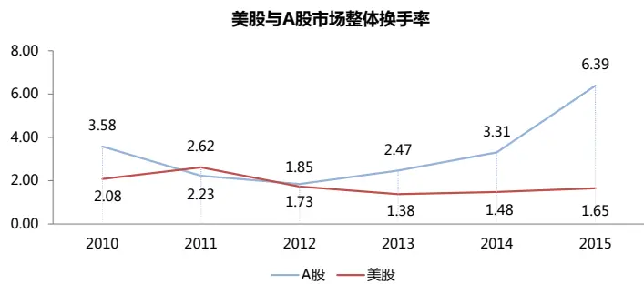
数据来源：东方证券研究所 & Wind资讯 & World Bank

图 2：近年美股上市退市情况（不含 OTC）
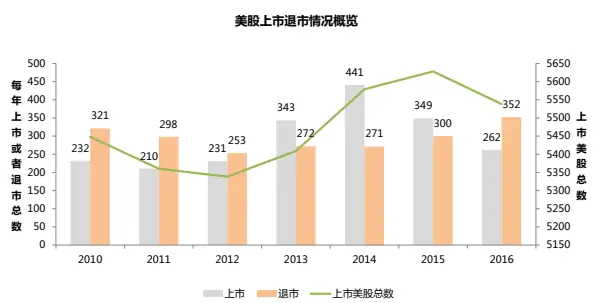
数据来源：东方证券研究所 & Bloomberg

图3：近年 A 股上市退市情况
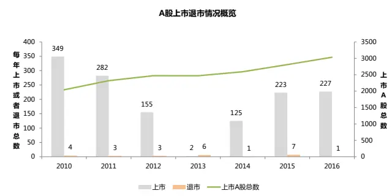
数据来源：东方证券研究所 & Wind资讯

## 二、 单因子检验流程

## 2.1 原始因子值处理

在检验单个因子有效性之前，对原始因子值进行数据处理是保证我们检验有效的关键步骤，数据处理流程如下图所示：

图4：原始因子值数据处理流程
资料来源：东方证券研究所

## 1. 选择数据集

针对美股我们选择了罗素（Russell）3000 成分股来代表全市场，标普（S&P）500 成分股来代表大盘股，A 股相对应地选择了中证全指和沪深 300。其中：

- 罗素 3000 指数涵盖了 98%的美国股票市值，剔除了交易价格小于$1，总市值少于$30,000,000 以及不在美国交易所上市的股票，采用市值加权。

- 中证全指剔除了上市不超过一个季度的（除非上市以来日均总市值在 A 股中排名前 30位），以及 ST，*ST，暂停上市的股票。

2. 在本篇报告的检验中，我们采取的是 Boxplot 方法去极值（参考报告《选股因子数据的异常值处理和正态转换》）。

3.和之前研究保持一致，我们对 SP、Sales2EV、换手率、ILLIQ、市值这几个因子做了取对数或者取倒数的正态转换，会让部分因子的 IC 符号发生改变。

4. 在本篇报告的检验中，用行业中位数填补缺失值。

5. Alpha因子都做行业和市值中性处理。

## 2.2 因子绩效检验

每一期在横截面上，用因子的 zscore 序列与下一期个股收益序列得出 Spearman 相关系数，求平均得到每个因子的 IC 均值。如果 IC 大于 0，成正相关，因子值按降序排列，如果小于 0，成负相关，因子值按升序排列。接着我们可以根据每一期 zscore 的排序选股，建立 top 10% minusbottom 10%的多空组合或者多头组合，通过观察组合的收益率、夏普比率、最大回撤等绩效指标来综合考察单个因子是否有效。

## 三、 中美因子绩效检验结果

我们分别对美股和 A股进行了 3 个时间段的测试。

第一个时段是我们所能获取数据的最长时间范围，美股是1997.1-2016.12（20年，240个月），A 股是 2005.1-2016.12（12 年，144 个月），

第二个时段是金融危机后，两个市场都选择 2009.1-2016.12（8 年，96个月）。

第三个时段是金融危机前，美股选择的是 1997.1-2008.12（12 年，144 个月），A股选择的是 2005.01 – 2008.12.

图5：Russell 3000 指数、中证全指历史走势图
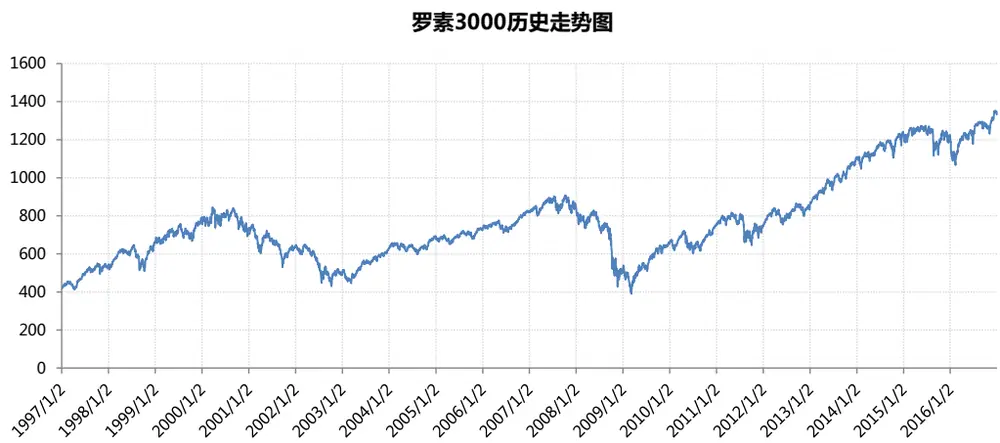

中证全指历史走势图
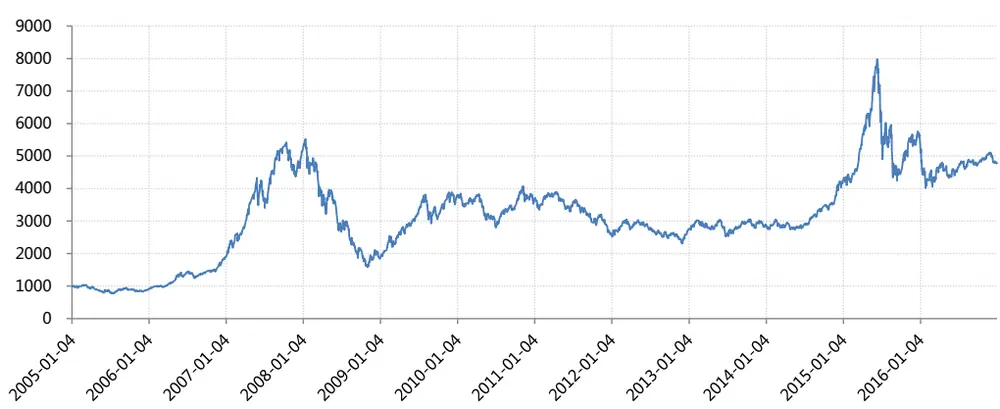
资料来源：东方证券研究所 & Bloomberg & Wind 资讯

我们检测的单个因子来源于东方因子库每一类具有代表性的因子，一共 24 个，在检验大类因子效用的时候，我们采取等权的方式合成各个大类因子，具体因子定义如下图所示。

表2：因子定义与说明

|  | 因子简称 | 因子全名 |
| --- | --- | --- |
| 估值 Value | BP_LF | Newest Book Value/Market Cap |
|  | EP_TTM | TTM earnings/ MarketCap |
|  | SP_TTM | TTM Sales/ Market Cap |
|  | CFP_TTM | TTM Operating Cash Flow / Market Cap |
|  | EBIT2EV | EBIT/Enterprise Value |
|  | Sales2EV | 营业收入_TTM/(总市值+非流动负债合计_最新财报-货币资金_最新财报) |
| 盈利能力 Profit | ROA | 总资产收益率 |
|  | ROE | 净资产收益率 |
|  | GrossMargin | 销售毛利率 |
| 成长 Growth | SalesGrowth_Qr_YOY | 营业收入增长率（季度同比） |
|  | ProfitGrowth_Qr_YOY | 净利润增长率(季度同比) |
|  | OCFGrowth_YOY | 经营现金流增长率（同比） |
| 营运质量 Operation | AssetTurnover | 总资产周转率 |
|  | Debt2Asset | 债务资产比例 |
| 流动性 Liquidity | TO_1M | 以流通股本计算的1个月日均换手率 |
|  | ILLIQ | 每天一个亿成交量能推动的股价涨幅 |
|  | AmountAvg_1M_3M | 过去一个月日均成交额/过去三个月日均成交额 |
| 技术反转 Tech&Reverse | Ret1M | 1个月收益反转 |
|  | Momentumlast6M | 复权收盘价/复权收盘价_6月前-1 |
|  | Momentumave1M | 股价相比最近1个月均价涨幅 |
|  | PPReversal | 乒乓球反转因子 |
|  | CGO_3M | Capital Gains Overhang (3M) |
| 其他 Other | RealizedVolatility_3M | 过去三个月日收益率数据计算的标准差 |
|  | MaxRet | 上月最大日收益 |

资料来源：东方证券研究所

## 3.1 全市场范围的因子检验

## 3.1.1 第一时段检测结果

第一个时段美股 1997.1-2016.12（20 年，240 个月），A 股 2005.1-2016.12（12 年，144个月），这个时段反应的是因子在整体上的效果。

如下图所示，从大类因子检测结果来看，估值类、盈利能力、成长性和其他类因子在美股全市场上作用显著，IC绝对值都超过3.5%，特别是估值类和成长性因子IC_IR分别达到2.56和3.01，年化收益达到 20.77%和18.33%，夏普比率也最高分别达到 1.74 和1.83，并且组合收益稳健，二者最大回撤也最小。而在中证全指上，流动性、技术反转和其他类因子效果最为显著，特别是流动性因子 IC 绝对值达到 8.50%，IC_IR 绝对值达到 3.02，年化收益率达到 33.82%，夏普比率 2.07，而美股的流动性和技术反转因子几乎没有效果，A股的估值类因子虽然没有流动性、技术反转效果显著，但是 IC 值也达到了 4.53%，并且最大回撤在所有类别中最小只有 7.8%非常稳健。

市场上有些偏见认为 A 股投资只听讲故事，不看公司基本面。但从 IC 测试结果看，A股投资也是看估值和成长性的，这两者的有效性和美股一致。只是除此之外，A股的市值效应和高换手的反转效应太强，造成前者的作用被忽视。

表3：罗素 3000、中证全指第一时段大类因子检测结果

| 罗素３０００ | 因子简称 | IC均值 | 值 | IC_IR | 多空组合 月均收益 | 多空组合 月胜率 | 多空组合 最大回撤 | 多空组合 年化收益率 | 多空组合 夏普比率 |
| --- | --- | --- | --- | --- | --- | --- | --- | --- | --- |
|  | Value | 3.80% | 11.41 | 2.56 | 1.63% | 73.64% | 14.13% | 20.77% | 1.74 |
|  | Profit | 4.21% | 8.85 | 1.98 | 1.56% | 67.36% | 46.74% | 17.77% | 0.82 |
|  | Growth | 3.78% | 13.24 | 3.01 | 1.49% | 77.68% | 19.49% | 18.33% | 1.83 |
|  | Operation | 1.26% | 3.15 | 0.70 | 0.48% | 54.81% | 51.07% | 5.10% | 0.29 |
|  | Liquidity | -0.91% | -3.47 | -0.78 | 0.27% | 56.07% | 40.25% | 2.69% | 0.10 |
|  | Tech&Reverse | -1.60% | -2.26 | -0.52 | 0.64% | 48.02% | 47.18% | 4.42% | 0.22 |
| 中证全指 | Other | -4.19% | -6.18 | -1.38 | 1.11% | 63.18% | 58.19% | 10.69% | 0.46 |
|  | 因子简称 | IC均值 | t值 | IC_IR | 多空组合 月均收益 | 多空组合 月胜率 | 多空组合 最大回撤 | 多空组合 年化收益率 | 多空组合 |
|  | Value | 4.53% | 8.92 | 2.62 | 0.91% | 60.43% | 7.80% | 10.56% | 夏普比率 0.88 |
|  | Profit | 2.43% | 2.69 | 0.80 | 0.48% | 55.47% | 24.40% | 4.80% | 0.24 |
|  | Growth | 3.76% | 7.15 | 2.09 | 1.10% | 69.29% | 10.64% | 13.17% | 1.20 |
|  | Operation | 0.32% | 0.69 | 0.20 | 0.23% | 52.86% | 12.79% | 2.54% | 0.02 |
|  | Liquidity | -8.50% | -10.42 | -3.02 | 2.55% | 75.52% | 18.59% | 33.82% | 2.07 |
|  | Tech&Reverse | -8.78% | -8.23 | -2.38 | 2.53% | 69.93% | 14.52% | 32.79% | 1.57 |
|  | Other | -7.65% | -8.65 | -2.50 | 1.55% | 69.23% | 15.55% | 19.14% | 1.24 |

资料来源：东方证券研究所 & Bloomberg & Wind 资讯

这种结果的差异和股票市场参与者结构有很大关系。机构投资者很难进行高换手操作，更关注股票的长期价值，对市场信息的反应更加理性。而散户平均资金量不大，便于交易换手，对预期信息反应更加敏感，容易过度反应。

具体再看每个类别的单个因子表现，如下图所示，估值类因子中美股最显著的是 CFP_TTM因子，IC 绝对值达到 7.63%，IC_IR 达到 4.26，年化收益 40.51%，夏普比率 2.29，遥遥领先其他因子，而 BP_LF因子表现最不佳，这反映了美国投资者更关注上市公司是否有能力产生现金流而不是清偿能力，并且这一指标相对来说不容易被操控更加客观。而 BP_LF因子在 A股地位明显提升，IC 绝对值达到 5.4%，年化收益 19.37%，夏普比率 1,27，虽然 CFP_TTM 收益率没有那么高，但是它的 IC_IR 和夏普比率相对来说较高，回撤率相对较小，说明 CFP_TTM 抵御风险的能力很强。而主动投资者更关注的 EP 估值指标，IC 和BP 因子差不多，但稳健性要差。

盈利能力类别的 ROA、ROE 因子在美股较为显著但是回撤非常大，夏普比率不高，在 A股的有效性较差。成长性因子美股比较关注营业收入的增长，夏普比率达到 1.63，而 A 股也同样关注营业收入的增长。营运质量类别美股的资产周转率比较显著，但回撤较大，而在 A 股该类因子集体失效。

流动性因子在美股上表现不佳，而A股的换手率因子表现最为显著，IC 绝对值 9.35%，IC_IR绝对值 2.97，夏普比率 1.87。

美股在短期一个月内也存在明显的反转效应。技术反转因子 Momentumave1M IC 均值可以达到 3.14%，Ret1M 因子也有一定效用，其他反转因子效果甚微，而 A股 Ret1M 因子效用最佳，IC 绝对值 8.13%，IC_IR 绝对值 2.43，夏普比率 1.76，不仅短期存在反转效应，A股在长期依然是反转效应。这个结果再次反映美股长期持有的特点，并且中长期还存在动量效应，具体内容我们会在下个章节阐述。

其他类因子在两个市场都有一定效果，但是在美国市场回撤很大，夏普比率较低，而 MaxRet因子在 A股效用显著，IC 绝对值达到 7.03%，IC_IR 绝对值在所有因子中最高达到 3.26，最大回撤是所有因子中最小的 5.18%，夏普比率 1.82。

表4：罗素 3000、中证全指第一时段单因子检测结果

|  | 因子简称 | IC均值 | 值 | IC_IR | 多空组合 月均收益 | 多空组合 月胜率 | 多空组合 最大回撤 | 多空组合 年化收益率 | 多空组合 夏普比率 |
| --- | --- | --- | --- | --- | --- | --- | --- | --- | --- |
|  | BP_LF | 1.70% | 3.71 | 0.83 | 0.97% | 59.00% | 39.58% | 10.95% | 0.60 |
|  | EP_TTM | 3.25% | 7.31 | 1.64 | 1.52% | 70.29% | 31.46% | 18.81% | 1.24 |
|  | SP_TTM | -4.54% | -8.83 | -1.98 | 1.70% | 73.64% | 44.66% | 21.30% | 1.38 |
|  | CFP_TTM | 7.63% | 19.00 | 4.26 | 2.98% | 82.43% | 23.46% | 40.51% | 2.29 |
|  | EBIT2EV | 4.37% | 10.14 | 2.27 | 1.72% | 76.57% | 21.54% | 22.06% | 1.83 |
|  | Sales2EV | -4.48% | -8.81 | -1.97 | 1.68% | 74.90% | 39.98% | 21.13% | 1.46 |
| ROA | 4.04% | 8.33 | 1.87 | 1.30% | 61.09% | 47.72% | 14.03% | 0.63 |  |
| ROE | 3.97% | 9.07 | 2.03 | 1.31% | 64.02% | 44.82% | 14.41% | 0.68 |  |
| 罗 GrossMargin | 1.56% | 4.37 | 0.98 | 1.13% | 67.78% | 12.57% | 13.78% | 1.10 |  |
| 素 SalesGrowth_Qr_YOY | 3.41% | 11.23 | 2.55 | 1.33% | 74.68% | 20.36% | 16.28% | 1.63 |  |
| 3 ProfitGrowth_Qr_YOY OCFGrowth_YOY | 2.24% | 9.27 | 2.10 | 0.61% | 63.52% | 12.59% | 7.03% | 0.72 |  |
| 0 0 | 2.75% | 13.09 | 2.93 | 0.36% | 58.58% | 18.78% | 4.24% | 0.39 |  |
| AssetTurnover 0 | 3.07% | 7.62 | 1.71 | 0.90% | 63.18% | 41.53% | 10.12% | 0.58 |  |
| Debt2Asset | -0.69% | -1.87 | -0.42 | 0.33% | 55.65% | 43.05% | 3.28% | 0.15 |  |
| TO_1M | -1.44% | -4.30 | -0.96 | 0.34% | 55.65% | 50.72% | 3.27% | 0.15 |  |
| ILLIQ | -1.35% | -3.20 | -0.72 | 0.54% | 53.56% | 52.27% | 5.53% | 0.30 |  |
| AmountAvg_1M_3M | 1.01% | 3.11 | 0.70 | 0.43% | 58.58% | 35.10% | 4.06% | 0.20 |  |
| Ret1M | -2.10% | -3.95 | -0.89 | 1.07% | 57.74% | 25.98% | 11.46% | 0.52 |  |
| Momentumlast6M | 0.59% | 0.82 | 0.18 | -0.05% | 56.49% | 85.47% | -5.00% | -0.10 |  |
| Momentumave1M | -3.14% | -6.19 | -1.39 | 1.77% | 61.51% | 17.45% | 20.96% | 0.91 |  |
| PPReversal | -0.90% | -1.47 | -0.33 | 0.49% | 51.46% | 54.46% | 3.29% | 0.16 |  |
| CGO_3M | 0.47% | 0.96 | 0.22 | -0.25% | 52.42% | 78.82% | -4.39% | -0.28 |  |
| RealizedVolatility_3M | -4.21% | -5.48 | -1.23 | 0.98% | 58.16% | 62.30% | 8.08% | 0.35 |  |
| MaxRet | -3.49% | -7.17 | -1.61 | 1.13% | 64.02% | 46.97% | 12.49% | 0.63 |  |
|  | 因子简称 | IC均值 | 埴 | IC_IR | 多空组合 月均收益 | 多空组合 月胜率 | 多空组合 最大回撤 | 多空组合 年化收益率 | 多空组合 夏普比率 |
|  | BP_LF | 5.40% | 6.62 | 1.92 | 1.56% | 67.83% | 13.13% | 19.37% | 1.27 |
|  | EP_TTM | 5.30% | 7.47 | 2.19 | 1.06% | 62.86% | 15.51% | 12.17% | 0.77 |
|  | SP_TTM | -3.54% | -4.92 | -1.44 | 1.25% | 64.29% | 10.25% | 15.14% | 1.28 |
|  | CFP_TTM | 3.62% | 10.76 | 3.15 | 0.98% | 67.86% | 7.71% | 11.72% | 1.25 |
|  | EBIT2EV | 5.27% | 7.71 | 2.26 | 1.16% | 65.71% | 15.39% | 13.60% | 0.93 |
|  | Sales2EV | -3.68% | -5.75 | -1.67 | 1.20% | 63.38% | 8.57% | 14.70% | 1.32 |
| 中证 全指 |  | 2.69% | 3.08 | 0.90 | 0.50% | 57.14% | 26.40% | 5.10% | 0.25 |
|  | ROA ROE | 3.01% | 3.51 | 1.03 | 0.51% | 56.43% | 26.30% | 5.14% | 0.25 |
|  | GrossMargin | 1.68% | 2.98 | 0.88 | 0.48% | 57.66% | 9.44% | 5.28% | 0.38 |
|  | SalesGrowth_Qr_YOY | 3.02% | 5.61 | 1.64 | 0.95% | 62.14% | 11.83% | 11.20% | 0.98 |
|  | ProfitGrowth_Qr_YOY | 3.59% | 6.28 | 1.84 | 0.75% | 67.14% | 10.78% | 8.60% | 0.64 |
|  | OCFGrowth_YOY | 1.60% | 7.10 | 2.08 | 0.51% | 66.43% | 9.99% | 5.95% | 0.61 |
|  | AssetTurnover | 1.05% | 2.60 | 0.76 | 0.36% | 54.29% | 10.13% | 4.00% | 0.23 |
|  | Debt2Asset | -0.28% | -0.47 | -0.14 | -0.10% | 50.00% | 25.55% | -1.51% | -0.50 |
|  | TO_1M | -9.35% | -10.24 | -2.97 | 2.61% | 74.13% | 19.54% | 34.52% | 1.87 |
|  | ILLIQ | 4.79% | 6.35 | 1.84 | 0.91% | 65.73% | 30.38% | 10.57% | 0.66 |
|  | AmountAvg_1M_3M | -7.47% | -10.65 | -3.09 | 2.25% | 81.12% | 15.60% | 29.51% | 2.04 |
|  | Ret1M | -8.13% | -8.40 | -2.43 | 2.60% | 74.83% | 10.77% | 34.22% | 1.76 |
| Momentumlast6M | -5.55% | -5.75 | -1.67 | 1.89% | 67.13% | 19.85% | 23.33% | 1.20 |  |
| Momentumave1M | -7.58% | -8.35 | -2.42 | 2.33% | 72.03% | 12.05% | 30.11% | 1.62 |  |
| PPReversal | -6.65% | -6.90 | -2.00 | 1.78% | 63.64% | 18.01% | 21.89% | 1.16 |  |
| CGO_3M | -7.22% | -6.45 | -1.87 | 2.34% | 63.64% | 14.93% | 29.31% | 1.27 |  |
| RealizedVolatility_3M | -6.26% | -6.09 | -1.77 | 1.14% | 65.73% | 22.44% | 13.22% | 0.72 |  |
| MaxRet |  | -7.03% | -11.25 | -3.26 | 1.59% | 74.83% | 5.18% | 20.22% | 1.82 |

资料来源：东方证券研究所 & Bloomberg & Wind 资讯

## 3.1.2 第二时段检测结果

第二个时段两个市场都选择 2009.1-2016.12（8 年，96 个月），这个时间段能够反映最近的市场风格。

如下图所示，从大类因子检测结果来看，美股估值类、盈利能力因子 IC 略微下降，成长性因子提升到 4.11%，IC_IR 也提升到 3.49，最大回撤降了 11%只有 8.09%，夏普比率提升到 2.07，在这 8 年慢牛期间美股的成长性因子最为显著，说明在牛市中成长性好业绩增速大的股票更容易获得关注。而其他类因子 IC 绝对值却下降 1.53%，几乎没有年化收益，

A股从大类因子检测结果来看，之前较为显著的流动性和技术反转因子的 IC 绝对值均有所下降，但是最大回撤降幅明显，夏普比率都略微提高，

表5：罗素 3000、中证全指第二时段大类因子检测结果

| 罗素 ３０００ | 因子简称 | IC均值 | t值 | IC_IR | 多空组合 月均收益 | 多空组合 月胜率 | 多空组合 最大回撤 | 多空组合 年化收益率 | 多空组合 夏普比率 |
| --- | --- | --- | --- | --- | --- | --- | --- | --- | --- |
|  | Value | 3.45% | 6.80 | 2.42 | 1.49% | 70.53% | 6.09% | 18.56% | 1.67 |
|  | Profit | 3.92% | 4.62 | 1.64 | 1.20% | 60.00% | 36.72% | 13.86% | 0.91 |
|  | Growth | 4.11% | 9.72 | 3.49 | 1.33% | 75.27% | 8.09% | 16.33% | 2.07 |
|  | Operation | 1.42% | 2.77 | 0.98 | 0.63% | 60.00% | 17.97% | 7.17% | 0.71 |
|  | Liquidity | -0.85% | -2.44 | -0.87 | 0.33% | 54.74% | 13.90% | 3.78% | 0.56 |
|  | Tech&Reverse | -1.23% | -1.23 | -0.44 | 0.09% | 46.32% | 47.18% | -0.48% | 0.04 |
| Other |  | -2.66% | -2.56 | -0.91 | 0.24% | 60.00% | 58.19% | 0.53% | 0.12 |

| 中证全指 | 因子简称 | IC均值 | 值 | IC_IR | 多空组合 月均收益 | 多空组合 月胜率 | 多空组合 最大回撤 | 多空组合 年化收益率 | 多空组合 夏普比率 |
| --- | --- | --- | --- | --- | --- | --- | --- | --- | --- |
|  | Value | 4.46% | 8.31 | 2.97 | 0.73% | 58.51% | 6.71% | 8.57% | 0.81 |
|  | Profit | 2.77% | 3.02 | 1.07 | 0.45% | 53.68% | 17.63% | 4.95% | 0.29 |
|  | Growth | 3.60% | 6.68 | 2.38 | 0.98% | 71.58% | 10.64% | 11.97% | 1.34 |
|  | Operation | 0.15% | 0.24 | 0.09 | 0.18% | 49.47% | 12.79% | 1.88% | -0.06 |
|  | Liquidity | -7.86% | -8.16 | -2.90 | 2.29% | 76.84% | 8.85% | 30.08% | 2.15 |
|  | Tech&Reverse | -8.51% | -7.35 | -2.61 | 2.35% | 71.58% | 6.55% | 30.39% | 1.72 |
| Other |  | -8.04% | -7.16 | -2.55 | 1.38% | 65.26% | 15.55% | 16.69% | 1.09 |

具体再看每个类别的单个因子表现，估值因子中，美股 CFP_TTM依然是最显著的因子，IC没有发生变化，但夏普比率提高了 0.96，不仅是 CFP 其他几个估值因子夏普比率都有所提升，并且该类因子最大回撤均大幅下降，普遍控制在 8%以内。而 A 股所有估值因子的 IC 绝对值都略有下降。

盈利能力和营运能力两类因子在两个市场的效用都没有明显改变。成长性因子方面，上文提到美股成长性因子有所提升，主要是由于 OCFGrowth_YOY因子效果增强，IC 均值提高了 0.4%，夏普比率提高了 0.4，并且 SalesGrowth_Qr_YOY因子也有显著提升，IC 均值提高了 0.6%，夏普比率大幅提升了 1.09 到2.72，而 A股的成长性因子没有太大变化。

流动性因子在美股上依然没有明显效用，A 股的流动性因子正如前文所说，最大回撤均明显下降，夏普比率都略微提升，多空组合收益更加稳健。

技术反转因子在两个市场上变化都不大，只是中长期反转在 A股上有所增强。其他类因子效用在美股上有所下降，在 A股变化不大。

表6：罗素 3000、中证全指第二时段单因子检测结果

|  | 因子简称 | IC均值 | 值 | IC_IR | 多空组合 月均收益 | 多空组合 月胜率 | 多空组合 最大回撤 | 多空组合 年化收益率 | 多空组合 夏普比率 |
| --- | --- | --- | --- | --- | --- | --- | --- | --- | --- |
|  | BP_LF | 1.49% | 2.13 | 0.76 | 1.11% | 60.00% | 13.63% | 12.89% | 0.86 |
|  | EP_TTM | 2.45% | 4.05 | 1.44 | 1.44% | 67.37% | 4.25% | 17.76% | 1.43 |
|  | SP_TTM | -4.49% | -6.15 | -2.19 | 1.87% | 77.89% | 7.87% | 23.96% | 2.18 |
|  | CFP_TTM | 7.63% | 13.04 | 4.63 | 3.03% | 85.26% | 7.92% | 41.70% | 3.25 |
|  | EBIT2EV | 3.52% | 6.48 | 2.30 | 1.25% | 71.58% | 3.44% | 15.60% | 2.13 |
|  | Sales2EV | -4.52% | -6.10 | -2.17 | 1.91% | 77.89% | 6.94% | 24.61% | 2.25 |
| ROA ROE | 3.70% | 4.36 | 1.55 | 0.80% | 54.74% | 34.98% | 8.54% |  | 0.58 |
| GrossMargin |  | 3.55% | 4.62 | 1.64 | 0.87% | 63.16% | 37.52% | 9.52% | 0.66 |
| 罗 素 |  | 1.27% | 2.07 | 0.74 | 0.85% | 67.37% | 11.85% | 10.27% | 1.25 |
| 3 | SalesGrowth_Qr_YOY | 4.09% | 8.62 | 3.10 | 1.56% | 77.42% | 3.52% | 19.40% | 2.72 |
| 0 | ProfitGrowth_Qr_YOY | 2.05% | 5.57 | 2.00 | 0.32% | 62.37% | 7.71% | 3.67% | 0.67 |
| 0 0 | OCFGrowth_YOY | 3.04% | 9.09 | 3.23 | 0.38% | 57.89% | 10.54% | 4.44% | 0.84 |
|  | AssetTurnover | 3.02% | 4.97 | 1.77 | 0.80% | 61.05% | 16.70% | 9.24% | 0.84 |
|  | Debt2Asset | -0.35% | -0.60 | -0.21 | -0.09% | 48.42% | 43.05% | -1.94% | -0.10 |
|  | TO_1M | -0.41% | -0.89 | -0.32 | -0.50% | 47.37% | 50.72% | -6.39% | -0.53 |
|  | ILLIQ | -1.16% | -2.17 | -0.77 | 0.46% | 56.84% | 18.06% | 5.19% | 0.60 |
|  | AmountAvg_1M_3M | 0.15% | 0.31 | 0.11 | -0.27% | 54.74% | 34.19% | -3.70% | -0.35 |
|  | Ret1M | -1.52% | -1.88 | -0.67 | 0.49% | 52.63% | 17.22% | 5.16% | 0.44 |
|  | Momentumlast6M | -0.22% | -0.21 | -0.07 | 0.72% | 45.26% | 47.06% | 6.40% | 0.36 |
|  | Momentumave1M | -2.55% | -3.61 | -1.28 | 0.81% | 57.89% | 17.45% | 9.21% | 0.75 |
|  | PPReversal | -0.99% | -1.07 | -0.38 | 0.28% | 49.47% | 39.49% | 2.18% | 0.20 |
|  | CGO_3M | 0.47% | 0.68 | 0.24 | 0.06% | 57.89% | 27.93% | -0.01% | 0.03 |
|  | RealizedVolatility_3M | -2.68% | -2.24 | -0.80 | 0.11% | 54.74% | 62.30% | -1.54% | 0.05 |
| MaxRet |  | -2.26% | -3.03 | -1.08 | 0.30% | 61.05% | 46.97% | 2.30% | 0.22 |
|  | 因子简称 | IC均值 | 埴 | IC_IR | 多空组合 月均收益 | 多空组合 月胜率 | 多空组合 最大回撤 | 多空组合 年化收益率 | 多空组合 夏普比率 |
|  | BP_LF | 4.99% | 5.06 | 1.80 | 1.32% | 65.26% | 13.13% | 15.92% | 1.01 |
|  | EP_TTM | 5.24% | 7.58 | 2.69 | 1.00% | 64.21% | 8.92% | 12.07% | 1.01 |
|  | SP_TTM | -2.97% | -3.04 | -1.08 | 1.03% | 60.00% | 10.25% | 12.37% | 0.94 |
|  | CFP_TTM | 3.41% | 8.34 | 2.96 | 0.75% | 64.21% | 7.71% | 9.11% | 0.99 |
|  | EBIT2EV | 5.19% | 7.77 | 2.76 | 1.04% | 66.32% | 7.62% | 12.63% | 1.10 |
|  | Sales2EV ROA | -3.17% | -3.56 | -1.27 | 0.92% | 57.45% | 8.57% | 10.93% | 0.90 |
| 中 证 全指 |  | 2.73% | 2.90 | 1.03 | 0.42% | 57.89% | 17.90% | 4.69% | 0.27 |
|  | ROE | 3.14% | 4.01 | 1.42 | 0.37% | 55.79% | 17.04% | 4.21% | 0.24 |
|  | GrossMargin | 1.60% | 2.32 | 0.83 | 0.41% | 57.89% | 7.56% | 4.64% | 0.31 |
|  | SalesGrowth_Qr_YOY | 2.80% | 4.71 | 1.67 | 0.67% | 61.05% | 11.83% | 7.97% | 0.83 |
|  | ProfitGrowth_Qr_YOY | 3.53% | 6.86 | 2.44 | 0.71% | 70.53% | 5.88% | 8.57% | 0.97 |
|  | OCFGrowth_YOY | 1.53% | 6.01 | 2.14 | 0.33% | 65.26% | 6.45% | 3.88% | 0.31 |
|  | AssetTurnover | 0.91% | 1.87 | 0.67 | 0.31% | 53.68% | 7.98% | 3.57% | 0.20 |
|  | Debt2Asset | -0.39% | -0.46 | -0.16 | -0.04% | 49.47% | 16.84% | -0.77% | -0.38 |
|  | TO_1M | -9.05% | -8.54 | -3.04 | 2.35% | 73.68% | 6.89% | 30.82% | 2.06 |
|  | ILLIQ | 5.60% | 6.73 | 2.39 | 1.29% | 72.63% | 15.89% | 15.81% | 1.23 |
|  | AmountAvg_1M_3M | -7.49% | -9.61 | -3.41 | 2.08% | 84.21% | 6.70% | 27.04% | 2.24 |
|  | Ret1M | -7.68% | -7.27 | -2.58 | 2.44% | 75.79% | 7.70% | 32.05% | 1.95 |
| Momentumlast6M | -6.12% | -5.89 | -2.09 | 2.09% | 69.47% | 11.00% | 26.66% | 1.57 |  |
| Momentumave1M | -7.09% | -7.38 | -2.62 | 2.22% | 73.68% | 8.41% | 28.77% | 1.82 |  |
| PPReversal | -6.69% | -6.22 | -2.21 | 1.74% | 64.21% | 12.74% | 21.70% | 1.38 |  |
| CGO_3M | -6.29% | -5.29 | -1.88 | 1.96% | 64.21% | 8.19% | 24.63% | 1.38 |  |
| RealizedVolatility_3M | -6.32% | -4.99 | -1.77 | 0.89% | 63.16% | 22.44% | 10.01% | 0.56 |  |
| MaxRet | -7.63% | -9.54 | -3.39 |  | 1.56% | 76.84% | 5.18% | 19.75% | 1.79 |

资料来源：东方证券研究所 & Bloomberg & Wind 资讯

## 3.1.3 第三时段检测结果

第三时段，美股 1997.1-2008.12（12 年，144 个月），A 股是 2005.1-2008.12（4 年，48个月），反映了两个市场早期因子效用情况。

如下图所示，从大类因子检验结果来看，这个阶段美股的因子检测结果与前两个时段有所不同，其他类因子 IC 绝对值最高，达到 5.19%。而估值类和盈利能力因子依然效用明显，并且 IC值比前两个时段都要高，但是成长性因子 IC 值却有所下降。

A股方面，变化最明显的是流动性因子，IC 值要比前两个时段都高，绝对值达到 9.96%。

表7：罗素 3000、中证全指第三时段大类因子检测结果

| 罗素 ３０００ | 因子简称 | IC均值 | t值 | IC_IR | 多空组合 月均收益 | 多空组合 月胜率 | 多空组合 最大回撤 | 多空组合 年化收益率 | 多空组合 夏普比率 |
| --- | --- | --- | --- | --- | --- | --- | --- | --- | --- |
|  | Value | 4.01% | 9.07 | 2.63 | 1.72% | 75.52% | 14.13% | 22.04% | 1.78 |
|  | Profit | 4.42% | 7.84 | 2.27 | 1.82% | 72.73% | 46.74% | 20.64% | 0.80 |
| Growth | 3.55% | 9.19 | 2.70 | 1.57% | 79.14% |  | 19.49% | 19.28% | 1.68 |
|  | Operation | 1.19% | 2.07 | 0.60 | 0.37% | 51.05% | 51.07% | 3.62% | 0.08 |
|  | Liquidity | -0.94% | -2.50 | -0.73 | 0.23% | 57.34% | 40.25% | 1.99% | -0.06 |
|  | Tech&Reverse | -1.76% | -1.78 | -0.54 | 0.94% | 48.85% | 44.75% | 6.73% | 0.26 |
| Other |  | -5.19% | -5.82 | -1.69 | 1.69% | 65.03% | 52.01% | 17.87% | 0.63 |

|  | 因子简称 | IC均值 | 值 | IC_IR | 多空组合 月均收益 | 多空组合 月胜率 | 多空组合 最大回撤 | 多空组合 年化收益率 | 多空组合 夏普比率 |
| --- | --- | --- | --- | --- | --- | --- | --- | --- | --- |
|  | Value | 4.39% | 4.01 | 2.09 | 1.13% | 63.64% | 7.80% | 12.50% | 0.91 |
| 中证全指 | Profit | 1.48% | 0.69 | 0.37 | 0.54% | 58.54% | 24.40% | 4.07% | 0.18 |
|  | Growth | 4.00% | 3.31 | 1.73 | 1.31% | 63.64% | 6.20% | 14.64% | 1.07 |
|  | Operation | 0.56% | 1.13 | 0.59 | 0.37% | 61.36% | 5.94% | 4.07% | 0.29 |
|  | Liquidity | -9.96% | -6.53 | -3.30 | 3.16% | 74.47% | 18.59% | 42.31% | 2.10 |
|  | Tech&Reverse | -8.73% | -3.99 | -2.02 | 2.67% | 65.96% | 14.52% | 33.34% | 1.33 |
|  | Other | -7.34% | -5.33 | -2.69 | 2.15% | 78.72% | 7.03% | 27.55% | 1.98 |

资料来源：东方证券研究所 & Bloomberg & Wind 资讯

从单个因子表现来看，正如上文所说，美股的估值类因子 IC 绝对值普遍提升，但是夏普比率并没有前两个时段高。盈利能力、成长性、营运质量类别在单个因子表现上变化不大。

流动性因子方面，美股的 1 个月换手率效用有所改变，第一时段 IC 值-1.44%，第二时段 IC值-0.41%，第三时段-2.09%，可见第三时段虽然不算特别显著，

技术反转方面，美股的一月反转因子效用显著提升，IC 绝对值升高到 3.99%，而前两个时段几乎没有效果，可见早期还是存在一部分美国投资者偏向短线持仓，而 A 股的中长期反转在这期间有所减弱。

表8：罗素 3000、中证全指第三时段单因子检测结果

|  | 因子简称 | IC均值 | 值 | IC_IR | 多空组合 月均收益 | 多空组合 月胜率 | 多空组合 最大回撤 | 多空组合 年化收益率 | 多空组合 夏普比率 |
| --- | --- | --- | --- | --- | --- | --- | --- | --- | --- |
|  | BP_LF | 1.82% | 2.97 | 0.86 | 0.84% | 58.04% | 39.58% | 9.01% | 0.40 |
|  | EP_TTM | 3.75% | 6.04 | 1.75 | 1.55% | 72.03% | 31.46% | 19.01% | 1.11 |
|  | SP_TTM | -4.59% | -6.45 | -1.87 | 1.59% | 70.63% | 44.66% | 19.39% | 1.05 |
|  | CFP_TTM | 7.65% | 13.93 | 4.03 | 2.95% | 80.42% | 23.46% | 39.46% | 1.92 |
|  | EBIT2EV | 4.90% | 7.91 | 2.29 | 2.02% | 79.72% | 21.54% | 26.06% | 1.79 |
|  | Sales2EV | -4.47% | -6.43 | -1.86 | 1.53% | 72.73% | 39.98% | 18.71% | 1.09 |
| ROA | 4.27% | 7.31 |  | 2.12 | 1.65% | 65.73% | 47.72% | 18.03% | 0.68 |
| ROE |  | 4.26% | 8.08 | 2.34 | 1.62% | 65.03% | 44.82% | 17.97% | 0.71 |
| 罗素 GrossMargin |  | 1.73% | 3.95 | 1.14 | 1.32% | 68.53% | 12.57% | 16.19% | 1.06 |
| 3 0 | SalesGrowth_Qr_YOY | 2.94% | 7.47 | 2.19 | 1.21% | 73.38% | 20.36% | 14.40% | 1.17 |
|  | ProfitGrowth_Qr_YOY | 2.34% | 7.29 | 2.14 | 0.76% | 64.03% | 12.59% | 8.79% | 0.72 |
| 0 0 | OCFGrowth_YOY | 2.56% | 9.42 | 2.73 | 0.36% | 59.44% | 18.78% | 4.18% | 0.15 |
| AssetTurnover |  | 3.14% | 5.82 | 1.69 | 0.99% | 65.03% | 41.53% | 10.80% | 0.49 |
| Debt2Asset |  | -0.90% | -1.89 | -0.55 | 0.65% | 60.84% | 27.70% | 7.36% | 0.40 |
| TO_1M |  | -2.09% | -4.50 | -1.30 | 0.90% | 60.84% | 26.24% | 10.20% | 0.54 |
| ILLIQ |  | -1.52% | -2.48 | -0.72 | 0.61% | 52.45% | 52.27% | 5.95% | 0.23 |
|  | AmountAvg_1M_3M | 1.62% | 3.72 | 1.08 | 0.92% | 61.54% | 31.01% | 9.87% | 0.46 |
| Ret1M |  | -2.42% | -3.42 | -0.99 | 1.41% | 60.84% | 25.98% | 15.16% | 0.56 |
| Momentumlast6M |  | 1.18% | 1.22 | 0.35 | 0.45% | 58.74% | 71.19% | -0.01% | 0.06 |
| Momentumave1M |  | -3.45% | -4.92 | -1.42 | 2.34% | 63.64% | 13.84% | 28.35% | 1.00 |
| PPReversal | -0.77% |  | -0.93 | -0.27 | 0.57% | 52.45% | 54.46% | 3.33% | 0.12 |
| CGO_3M | 0.49% |  | 0.72 | 0.22 | -0.46% | 48.85% | 75.58% | -7.16% | -0.41 |
| RealizedVolatility_3M |  | -5.20% | -5.19 | -1.50 | 1.56% | 60.14% | 55.78% | 14.97% | 0.51 |
|  | MaxRet | -4.29% | -6.72 | -1.95 | 1.67% | 65.73% | 32.92% | 19.56% | 0.85 |

|  | 因子简称 | IC均值 | t值 | IC_IR | 多空组合 月均收益 | 多空组合 月胜率 | 多空组合 最大回撤 | 多空组合 年化收益率 | 多空组合 夏普比率 |
| --- | --- | --- | --- | --- | --- | --- | --- | --- | --- |
|  | BP_LF | 6.03% | 4.08 | 2.06 | 2.04% | 72.34% | 4.83% | 26.01% | 1.86 |
|  | EP_TTM | 4.93% | 3.02 | 1.58 | 1.04% | 59.09% | 15.51% | 10.33% | 0.51 |
|  | SP_TTM | -4.59% | -5.37 | -2.81 | 1.72% | 72.73% | 3.30% | 20.26% | 2.24 |
|  | CFP_TTM | 4.01% | 6.63 | 3.46 | 1.48% | 77.27% | 2.43% | 17.14% | 1.77 |
|  | EBIT2EV | 5.03% | 3.16 | 1.65 | 1.29% | 63.64% | 15.39% | 13.64% | 0.74 |
|  | Sales2EV | -4.57% | -6.27 | -3.17 | 1.71% | 74.47% | 3.47% | 21.70% | 2.37 |
| 中 证 全指 |  | 2.47% | 1.30 | 0.68 | 0.65% | 54.55% | 26.40% | 5.52% | 0.24 |
|  | ROA ROE | 2.49% | 1.16 | 0.61 | 0.74% | 56.82% | 26.30% | 6.20% | 0.27 |
|  | GrossMargin | 1.88% | 1.84 | 1.00 | 0.66% | 58.54% | 9.44% | 6.56% | 0.51 |
|  | SalesGrowth_Qr_YOY | 3.49% | 3.06 | 1.60 | 1.50% | 63.64% | 4.68% | 17.05% | 1.23 |
|  | ProfitGrowth_Qr_YOY | 3.58% | 2.47 | 1.29 | 0.73% | 59.09% | 10.78% | 7.26% | 0.39 |
|  | OCFGrowth_YOY | 1.77% | 3.79 | 1.98 | 0.89% | 68.18% | 6.15% | 9.96% | 1.05 |
|  | AssetTurnover | 1.42% | 1.88 | 0.98 | 0.53% | 56.82% | 9.27% | 5.58% | 0.38 |
|  | Debt2Asset | -0.29% | -0.44 | -0.22 | -0.19% | 52.17% | 18.49% | -2.48% | -0.69 |
|  | TO_1M | -10.43% | -6.10 | -3.08 | 3.35% | 76.60% | 19.54% | 44.94% | 1.94 |
|  | ILLQ | 3.69% | 2.52 | 1.28 | 0.36% | 53.19% | 30.38% | 3.22% | 0.10 |
|  | AmountAvg_1M_3M | -7.52% | -5.20 | -2.63 | 2.67% | 76.60% | 15.60% | 34.89% | 1.91 |
|  | Ret1M | -8.53% | -4.31 | -2.18 | 2.75% | 72.34% | 10.77% | 35.05% | 1.48 |
| Momentumlast6M | -3.85% | -1.95 | -0.98 | 1.26% | 61.70% | 19.85% | 13.71% | 0.61 |  |
| Momentumave1M | -7.93% | -4.23 | -2.14 | 2.30% | 68.09% | 12.05% | 28.51% | 1.31 |  |
| PPReversal | -6.18% | -3.17 | -1.60 | 1.71% | 61.70% | 18.01% | 19.55% | 0.85 |  |
| CGO_3M | -8.54% | -3.63 | -1.83 | 2.86% | 61.70% | 14.93% | 34.84% | 1.18 |  |
| RealizedVolatility_3M | -6.81% | -4.09 | -2.07 | 1.96% | 72.34% | 8.02% | 24.35% |  |  |
| MaxRet |  | -5.99% -6.18 |  | -3.12 | 1.71% | 72.34% | 4.97% | 21.62% | 1.39 1.96 |

资料来源：东方证券研究所 & Bloomberg & Wind 资讯

## 3.2 标普 500 VS 沪深 300

这两个数据集的检验我们只测试了第一个时间段，也就是从整体上看两个指数成分股内因子的绩效情况。

如下图所示，从大类因子检测结果来看，与全市场不同的是美股的盈利能力类别因子失效，全市场盈利能力因子 IC 值达到 4.21%，而标普 500 内 IC 值骤降为 0.59%，能力估值类和成长性因子仍然显著。

A股方面，在全市场最为显著的流动性、技术反转、其他类因子 IC 绝对值在沪深 300 成分股中大幅下降，技术反转类 IC 绝对值最高达到 6.22%，而估值类因子效用基本不变，夏普比率还略有提升，可见在 A股大盘股当中，估值与成长因子的相对作用更大。

表9：标普 500、沪深 300 第一时段大类因子检测结果

| 标普５００ | 因子简称 | IC均值 | 值 | IC_IR | 多空组合 月均收益 | 多空组合 月胜率 | 多空组合 最大回撤 | 多空组合 年化收益率 | 多空组合 夏普比率 |
| --- | --- | --- | --- | --- | --- | --- | --- | --- | --- |
|  | Value | 3.19% | 6.45 | 1.44 | 0.78% | 61.09% | 11.94% | 9.43% | 0.97 |
|  | Profit | 0.59% | 0.96 | 0.21 | 0.12% | 51.88% | 34.21% | 0.83% | -0.07 |
|  | Growth | 2.52% | 5.97 | 1.35 | 0.49% | 61.37% | 15.29% | 5.59% | 0.56 |
|  | Operation | 0.08% | 0.19 | 0.04 | 0.00% | 47.28% | 35.99% | -0.33% | -0.30 |
|  | Liquidity | -0.66% | -1.61 | -0.36 | 0.18% | 55.65% | 13.73% | 2.03% | 0.01 |
|  | Tech&Reverse | -1.54% | -1.61 | -0.37 | 0.53% | 51.54% | 36.01% | 4.94% | 0.26 |
| Other |  | -1.29% | -1.63 | -0.36 | 0.13% | 49.37% | 53.80% | 0.44% | -0.04 |

| 沪深３００ | 因子简称 | IC均值 | t值 | IC_IR | 多空组合 月均收益 | 多空组合 月胜率 | 多空组合 最大回撤 | 多空组合 年化收益率 | 多空组合 夏普比率 |
| --- | --- | --- | --- | --- | --- | --- | --- | --- | --- |
|  | Value | 4.20% | 6.17 | 1.81 | 1.01% | 64.03% | 12.08% | 11.85% | 0.98 |
|  | Profit | 1.84% | 1.96 | 0.58 | 0.37% | 59.56% | 28.28% | 3.70% | 0.16 |
|  | Growth | 2.98% | 4.48 | 1.31 | 0.69% | 66.43% | 14.25% | 7.91% | 0.62 |
|  | Operation | 0.23% | 0.40 | 0.12 | 0.34% | 55.71% | 14.64% | 3.73% | 0.18 |
|  | Liquidity | -5.33% | -6.71 | -1.97 | 1.06% | 64.29% | 22.28% | 12.46% | 0.92 |
|  | Tech&Reverse | -6.22% | -6.02 | -1.76 | 1.68% | 66.43% | 15.48% | 20.34% | 1.27 |
| Other |  | -5.13% | -5.24 | -1.53 | 0.85% | 65.00% | 16.38% | 9.80% | 0.70 |

资料来源：东方证券研究所 & Bloomberg & Wind 资讯

具体再看单因子检测情况，如下图所示，估值类因子中，CFP_TTM 依然是美股最显著的因子，IC 值 4.84%，最大回撤 8.38%，夏普比率 1.62，A 股中的 BP_LF、EP_TTM、EBIT2EV 估值因子在沪深 300 中表现相对显著。盈利能力在两个市场效用均不明显。

成长性因子方面，美股的 OCFGrowth_YOY 因子在标普 500 中效果变得显著，IC 均值达到2.67%，说明美国投资者比较关注标普 500 成分股经营现金流的增长。而在沪深 300 上，成长性因子没有明显效用。营运质量在两个市场效用均不明显。

流动性因子方面，由于标普 500 和沪深 300 都是大盘股，流动性好于其他股票，因此流动性因子的选股能力会减弱，标普 500 与全市场一致，流动性因子均没有显著效果，而在沪深 300 上，换手率因子虽然效用有所减弱，IC 绝对值降至 5.45%，但相对依然显著，另外市值因子效用大幅衰减，IC 绝对值变为 2.73%，由于沪深 300 代表大盘股，市值差异缩小，市值因子便不再显著，反而基本面因子作用增强。

技术反转和其他类因子表现与全市场大体一致。只不过标普 500 的反转效应相对全市场有所下降。

表10：标普 500、沪深 300 第一时段单因子检测结果

|  | 因子简称 | IC均值 | t值 | IC_IR | 多空组合 月均收益 | 多空组合 月胜率 | 多空组合 最大回撤 | 多空组合 年化收益率 | 多空组合 夏普比率 |
| --- | --- | --- | --- | --- | --- | --- | --- | --- | --- |
|  | BP_LF | 1.27% | 2.09 | 0.47 | 0.48% | 56.07% | 34.04% | 5.28% | 0.33 |
|  | EP_TTM | 2.64% | 4.55 | 1.02 | 0.73% | 61.09% | 16.58% | 8.67% | 0.73 |
|  | SP_TTM | -2.23% | -3.77 | -0.84 | 0.61% | 62.76% | 22.70% | 7.04% | 0.53 |
|  | CFP_TTM | 4.84% | 10.59 | 2.37 | 1.19% | 71.55% | 8.38% | 14.86% | 1.62 |
|  | EBIT2EV | 3.17% | 5.88 | 1.32 | 0.83% | 64.44% | 16.71% | 10.00% | 0.98 |
|  | Sales2EV | -2.37% | -3.92 | -0.88 | 0.61% | 61.92% | 23.32% | 7.00% | 0.52 |
| ROA | 0.86% | 1.30 | 0.29 |  | 0.24% | 50.63% | 34.44% | 2.23% | 0.06 |
| ROE | 1.17% | 1.99 |  | 0.45 | 0.16% | 53.14% | 37.40% | 1.40% | -0.03 |
| GrossMargin SalesGrowth_Qr_YOY | 0.07% |  | 0.12 | 0.03 | 0.05% | 51.88% | 27.51% | 0.27% | -0.19 |
| 标普５ｏ０ ProfitGrowth_Qr_YOY |  | 0.98% | 2.43 | 0.55 | 0.33% | 57.87% | 16.23% | 3.70% | 0.28 |
|  |  | 1.37% | 3.39 | 0.77 | 0.32% | 59.23% | 20.53% | 3.57% | 0.25 |
| OCFGrowth_YOY AssetTurnover |  | 2.67% | 6.71 | 1.50 | 0.52% | 64.85% | 10.40% | 6.16% | 0.67 |
|  | 0.85% |  | 1.70 | 0.38 | 0.10% | 53.56% | 27.92% | 0.91% | -0.11 |
| Debt2Asset | -0.69% | -1.57 |  | -0.35 | 0.08% | 53.97% | 39.32% | 0.67% | -0.17 |
| TO_1M | -0.45% |  | -1.00 | -0.22 | -0.03% | 52.30% | 33.00% | -0.66% | -0.30 |
| ILLIQ |  | -0.66% | -1.36 | -0.30 | 0.18% | 51.46% | 22.44% | 1.87% | 0.00 |
| AmountAvg_1M_3M | -0.17% |  | -0.39 | -0.09 | 0.29% | 50.63% | 17.93% | 3.15% | 0.15 |
| Ret1M | -1.62% |  | -2.56 | -0.57 | 0.25% | 51.46% | 34.16% | 2.42% | 0.08 |
| Momentumlast6M | -0.23% | -0.26 |  | -0.06 | 0.05% | 47.70% | 49.53% | -0.59% | -0.10 |
| Momentumave1M | -1.94% | -3.29 | -0.74 |  | 0.40% | 56.49% | 25.83% | 4.37% | 0.26 |
| PPReversal | -1.46% | -2.05 | -0.46 |  | 0.36% | 50.21% | 31.54% | 3.54% | 0.17 |
| CGO_3M | -0.40% | -0.50 | -0.12 |  | 0.02% | 50.66% | 50.71% | -0.66% | -0.13 |
| RealizedVolatility_3M | -1.35% | -1.51 |  | -0.34 | 0.04% | 51.46% | 59.96% | -0.98% | -0.10 |
| MaxRet |  | -1.21% | -1.98 | -0.44 | 0.08% | 52.72% | 50.42% | 0.17% | -0.10 |

|  | 因子简称 | IC均值 | t值 | IC_IR | 多空组合 月均收益 | 多空组合 月胜率 | 多空组合 最大回撤 | 多空组合 年化收益率 | 多空组合 夏普比率 |
| --- | --- | --- | --- | --- | --- | --- | --- | --- | --- |
|  | BP_LF | 4.23% | 4.29 | 1.26 | 1.20% | 64.29% | 21.12% | 14.19% | 0.97 |
|  | EP_TTM | 5.06% | 5.83 | 1.71 | 1.11% | 62.86% | 12.09% | 13.06% | 0.91 |
|  | SP_TTM | -2.75% | -3.32 | -0.97 | 0.78% | 55.71% | 20.44% | 8.89% | 0.65 |
|  | CFP_TTM | 2.77% | 4.74 | 1.39 | 0.79% | 65.00% | 13.62% | 9.30% | 0.89 |
|  | EBIT2EV | 4.24% | 5.09 | 1.49 | 0.91% | 62.86% | 18.77% | 10.49% | 0.76 |
|  | Sales2EV ROA | -2.30% | -3.01 | -0.89 | 0.63% | 55.40% | 16.29% | 7.14% | 0.56 |
| 沪 深３００ |  | 1.78% | 2.14 | 0.63 | 0.18% | 54.29% | 24.68% | 1.52% | -0.05 |
|  | ROE | 1.86% | 1.95 | 0.57 | 0.37% | 55.71% | 31.15% | 3.65% | 0.14 |
|  | GrossMargin | 1.07% | 1.53 | 0.45 | 0.34% | 55.88% | 22.50% | 3.53% | 0.16 |
|  | SalesGrowth_Qr_YOY | 2.51% | 3.64 | 1.07 | 0.74% | 65.00% | 13.01% | 8.65% | 0.75 |
|  | ProfitGrowth_Qr_YOY | 2.98% | 4.48 | 1.31 | 0.80% | 70.00% | 13.42% | 9.30% | 0.78 |
|  | OCFGrowth_YOY | 1.21% | 2.41 | 0.71 | 0.38% | 59.29% | 10.49% | 4.27% | 0.27 |
|  | AssetTurnover | 0.66% | 1.23 | 0.36 | 0.18% | 52.86% | 12.07% | 1.91% | -0.07 |
|  | Debt2Asset | -0.25% | -0.41 | -0.12 | -0.20% | 51.43% | 42.42% | -2.62% | -0.67 |
|  | TO_1M | -5.45% | -6.18 | -1.81 | 1.08% | 69.29% | 23.20% | 12.54% | 0.83 |
|  | ILLIQ | 1.97% | 2.68 | 0.78 | 0.24% | 55.00% | 24.56% | 2.31% | 0.02 |
|  | AmountAvg_1M_3M | -4.22% | -5.16 | -1.51 | 0.84% | 65.71% | 27.49% | 9.55% | 0.65 |
|  | Ret1M | -5.94% | -6.64 | -1.94 | 1.56% | 67.86% | 9.32% | 19.00% | 1.35 |
| Momentumlast6M | -3.33% | -3.22 | -0.94 | 0.93% | 57.14% | 16.98% | 10.36% | 0.62 |  |
| Momentumave1M | -5.47% | -6.29 | -1.84 | 1.36% | 64.29% | 11.90% | 16.21% | 1.11 |  |
| PPReversal | -4.69% | -4.67 | -1.37 | 1.27% | 57.86% | 13.10% | 14.97% | 0.96 |  |
| CGO_3M | -6.04% | -5.56 | -1.63 | 1.55% | 66.43% | 19.26% | 18.52% | 1.11 |  |
| RealizedVolatility_3M | -4.57% | -4.14 | -1.21 | 0.60% | 62.86% | 25.49% | 6.44% | 0.36 |  |
| MaxRet | -4.15% | -5.41 | -1.59 | 0.62% | 62.14% | 10.45% | 7.10% | 0.58 |  |

资料来源：东方证券研究所 & Bloomberg & Wind 资讯

## 四、 市值效应与动量效应

本章节测试时间段都选择第一时段，也就是美股 1997.1-2016.12（20 年，240 个月），A股2005.1-2016.12（12 年，144 个月），数据集分别是罗素 3000 和中证全指成分股。我们考察多空组合收益，根据因子 IC 值将股票池分成 10 组，做多第 1 组赢家组合，做空第 10 组输家组合，第一组收益减去第 10 组收益即为我们本期多空组合收益。

## 4.1 市值效应

美国市场也存在小盘股溢价，市值最小的股票平均比市值最大的股票每个月高0.28%（图6），中间挡的组合收益和股票市值的单调性关系不是很强。但是如果在罗素 3000 成分股内计算市值因子的 IC，发现其为正数 2.5%，且统计上显著，说明股票收益和市值正相关。不过由于相关性太低，而且计算 IC 时用的是秩相关系数（只设计相互大小顺序），市值因子 IC 为正的情况下，仍有可能会出现图 6 所示的小盘股溢价。

图 6：罗素 3000 总市值的分组超额收益
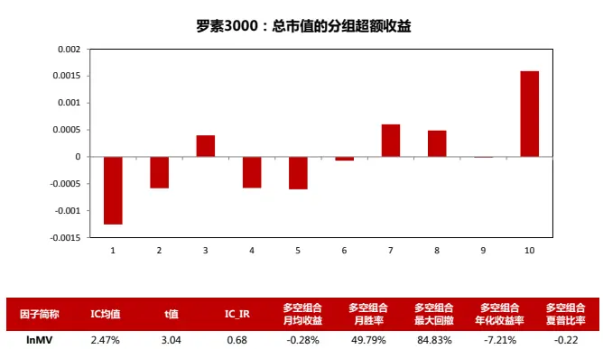

| 因子简称 | IC均值 | 埴 | IC_IR | 多空组合 月均收益 | 多空组合 月胜率 | 多空组合 最大回撤 | 多空组合 年化收益率 | 多空组合 夏普比率 |
| --- | --- | --- | --- | --- | --- | --- | --- | --- |
| InMV | 2.47% | 3.04 | 0.68 | -0.28% | 49.79% | 84.83% | -7.21% | -0.22 |

数据来源：东方证券研究所 &Bloomberg

图7：罗素 3000 总市值的多空组合净值曲线&月收益
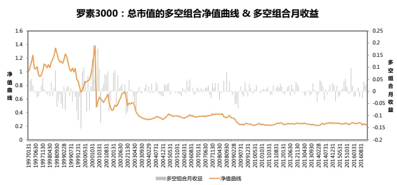
数据来源：东方证券研究所 &Bloomberg

对比而言，A股的市值效应要强劲稳健的多，市值因子 IC 值达到-7.45%，09 年后表现更为明显。市值效应的来源主要有以下几点：新兴成长行业的股票市值整体偏小，而同期市场风格偏好成长，小盘成长股具备稀缺性；小盘股的壳效应；大资金的违规操盘和散户跟风等。这些都有可能随着IPO提速和市场监管趋严而弱化，目前市值因子兼具 alpha 和风险属性，未来我们预计其 alpha属性会衰减，风险属性仍将保留。

图 8：中证全指总市值的分组超额收益
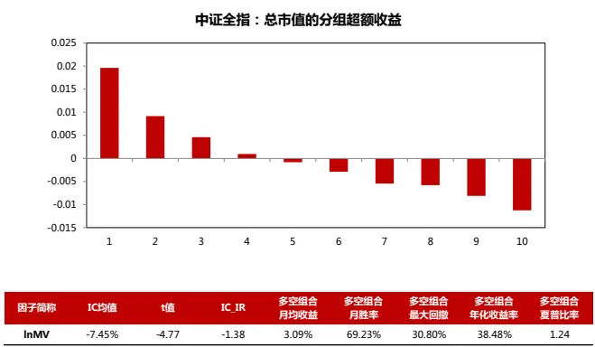

| 因子简称 | IC均值 | t值 | IC_IR | 多空组合 月均收益 | 多空组合 月胜率 | 多空组合 最大回撤 | 多空组合 年化收益率 | 多空组合 夏普比率 |
| --- | --- | --- | --- | --- | --- | --- | --- | --- |
| InMV | -7.45% | -4.77 | -1.38 | 3.09% | 69.23% | 30.80% | 38.48% | 1.24 |

数据来源：东方证券研究所 & Wind资讯

图9：中证全指总市值的多空组合净值曲线和月收益
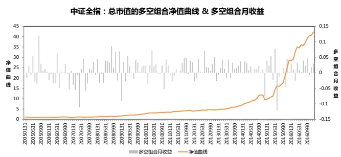
数据来源：东方证券研究所 & Wind资讯

## 4.2 动量效应

动量效应指的是资产价格按照原有的趋势继续运行的惯性 ，即过去一段时间表现良好的资产在将来一段时间内仍然表现良好，而过去表现较差的资产在将来一段时间内表现仍然较差。投资者通过购买过去表现良好的资产，同时卖出过去表现较差的资产构建动量套利组合，利用动量效应获得 Alpha。

股票市场的动量效应最早由 Jegadeesh 和 Titman (1993)发现，他们发现过去 3~12 个月收益高的股票在接下来 3~12 个月仍然表现较好，而过去 3~12 个月收益低的股票在接下来 3~12 个月仍然表现差，利用这一现象构造的套利组合能够获得持续显著的异常收益，大约为每月 1%。此后，Rouwenhorst(1998)研究发现在欧洲十二个国家的股票市场存在与美国类似的动量效应，并且他还发现在其他新兴市场也存在动量效应。

因此本章节我们研究了美股与 A股在月度上是否存在动量效应。动量效应的测度分为形成期(Ranking Period)和持有期(Holding Period)，在后文我们用 RP 和HP 两个简称来指代这两个区间，我们用下图为例来解释如何检验动量效应，每个月我们用 t 个月前的 m 个月的股票收益率来作为因子值，来检验接下来 n 个月的股票收益率是否与该月因子值相关，如果正相关并通过 t检验，就说明存在动量效应，若存在负相关并通过 t检验，说明存在反转效应。而之所以要有 t个月的间隔期，是为了剔除短期反转效应，t 值通常不超过 3 个月。在本篇报告实证检验中，我们把 m 和 n分别设臵为 1、3、6、9、12 进行交叉检验，而 t值，美股我们设臵 2 个月，A股设臵 1 个月，因为此时的检验结果在两个市场最为显著。

图10：动量效应测试方法
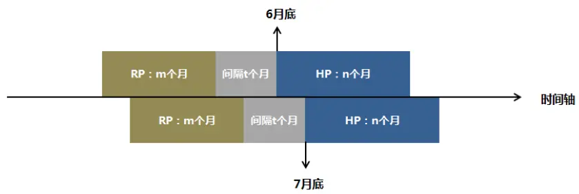
资料来源：东方证券研究所

关于美股的测试结果如下图所示，假设我们把显著水平设臵为 5%，我们用橙色标注了显著的组合，首先我们观察 IC 为正的组合，按照 IC 值从大到小排序，显著的组合依次为 (9,1) (6,1) (12,1)(6,3) (9,3) (3,3) (6,6) (3,6) (1,3)，由此可见当形成期为 6~9 月、持有期为 1~3 月时，美股的动量效应最明显，说明美股在中长期是存在动量效应的。而组合(12,12)(9,12)的 IC 值为负，可见随着持有期的增长，动量效应会转变为反转效应。

表 11：罗素 3000 成分股动量效应检测结果

| RP(m) HP(n) |  | 月度IC值 | t值 | IC_IR | 多空组合 月均收益 | 多空组合 月胜率 | 多空组合 最大回撤 | 多空组合 年化收益率 | 多空组合 夏普比率 |
| --- | --- | --- | --- | --- | --- | --- | --- | --- | --- |
| 1 | 1 | 0.80% | 1.83 | 0.41 | 0.25% | 53.56% | 45% | 1.39% | 0.05 |
| 1 | 3 | 0.50% | 1.99 | 0.45 | 0.24% | 55.70% | 54% | 1.42% | 0.04 |
| 1 | 6 | 0.35% | 1.76 | 0.40 | 0.12% | 55.98% | 55% | -0.06% | -0.05 |
| 1 | 9 | 0.23% | 1.34 | 0.31 | -0.04% | 55.56% | 67% | -1.80% | -0.17 |
| 1 | 12 | 0.02% | 0.12 | 0.03 | 0.30% | 57.46% | 61% | 2.01% | 0.08 |
| 3 | 1 | 1.03% | 1.83 | 0.41 | 0.20% | 59.41% | 65% | -0.59% | 0.01 |
| 3 | 3 | 0.76% | 2.49 | 0.56 | 0.00% | 55.70% | 73% | -2.51% | -0.10 |
| 3 | 6 | 0.54% | 2.24 | 0.51 | 0.07% | 55.56% | 69% | -1.19% | -0.07 |
| 3 | 9 | 0.27% | 1.28 | 0.29 | -0.09% | 53.42% | 84% | -3.12% | -0.17 |
| 3 | 12 | -0.08% | -0.44 | -0.10 | 0.07% | 52.19% | 71% | -0.97% | -0.08 |
| 6 | 1 | 1.63% | 2.59 | 0.58 | 0.35% | 62.34% | 78% | 0.30% | 0.08 |
| 6 | 3 | 1.17% | 3.14 | 0.71 | 0.28% | 60.34% | 74% | 0.37% | 0.05 |
| 6 | 6 | 0.64% | 2.32 | 0.53 | -0.19% | 55.13% | 85% | -4.41% | -0.22 |
| 6 | 9 | 0.18% | 0.73 | 0.17 | 0.03% | 53.42% | 79% | -1.77% | -0.09 |
| 6 | 12 | -0.23% | -1.08 | -0.25 | -0.32% | 46.93% | 84% | -5.27% | -0.34 |
| 9 | 1 | 2.07% | 3.06 | 0.69 | 0.43% | 62.34% | 77% | 1.56% | 0.12 |
| 9 | 3 | 1.05% | 2.64 | 0.59 | 0.27% | 59.49% | 80% | 0.36% | 0.05 |
| 9 | 6 | 0.35% | 1.19 | 0.27 | -0.17% | 53.85% | 82% | -4.20% | -0.21 |
| 9 | 9 | -0.09% | -0.36 | -0.08 | -0.11% | 56.84% | 81% | -3.50% | -0.17 |
| 9 | 12 | -0.48% | -2.19 | -0.50 | -0.34% | 49.12% | 86% | -5.55% | -0.33 |
| 12 | 1 | 1.41% | 2.18 | 0.49 | 0.01% | 56.49% | 86% | -3.02% | -0.09 |
| 12 | 3 | 0.61% | 1.55 | 0.35 | -0.09% | 52.74% | 86% | -3.56% | -0.15 |
| 12 | 6 | 0.01% | 0.05 | 0.01 | -0.29% | 51.71% | 85% | -5.48% | -0.27 |
| 12 | 9 | -0.31% | -1.23 | -0.28 | -0.47% | 49.57% | 89% | -7.50% | -0.38 |
| 12 | 12 | -0.54% | -2.50 | -0.57 | -0.42% | 51.32% | 87% | -6.38% | -0.39 |

资料来源：东方证券研究所 & Bloomberg

然而我们观察到所有多空组合的最大回撤都非常高，这是动量效应的“动量崩盘”现象，我们以其中一个组合(9,1)的分组超额收益以及多空组合净值曲线来分析这一现象，如下图所示，从分组超额收益来看，(9,1)组合的动量效应十分显著，做多第 1 组做空第 10 组有明显的超额收益，可是多空组合净值曲线经历了几次比较大的回撤。最早发现“动量崩盘”现象的是 Daniel 和Moskowitz(2013)，他们发现在美国证券市场上，尽管存在着显著的月度动量效应，但在长期熊市后的反弹行情里，动量组合遭遇了巨大的损失，动量组合有着相当大的尾部风险，收益率呈现严重的负偏形态。主要原因是，当市场处于熊市时，top 组合往往包含的是低 β 的股票，而 loss 组合往往包含的是那些高 β 的股票，因此一旦反弹，top 组合的收益会大幅度小于 loss 组合，使套利组合遭受损失。我们可以看下图的净值曲线，最大的回撤发生在 09 年 3 月，再回过头去看图 5 罗素3000 历史走势图，发现完全对应了熊市底部，市场正要反弹，可见“动量崩盘”现象确实存在，如何控制这一现象是保证动量策略有效的关键。

图 11：罗素 3000 (9,1)组合的分组超额收益
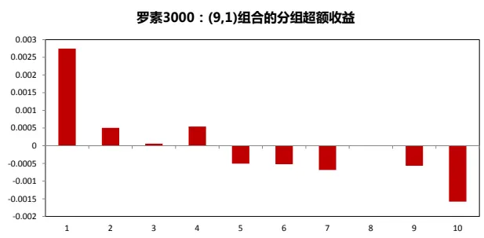
数据来源：东方证券研究所 &Bloomberg

图12：罗素 3000 (9,1)组合的多空组合净值曲线和月收益
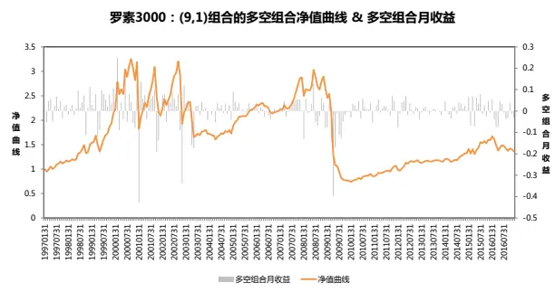
数据来源：东方证券研究所 &Bloomberg

A股方面，如下图所示，所有组合的 IC 值均为负，并且全部通过显著水平为 5%的t 检验，可见 A股无论是短期还是中长期都是反转效应，并不存在月度的动量效应。

表12：中证全指成分股动量效应检测结果

| RP(m) HP(n) |  | 月度IC值 | 埴 | IC_IR | 多空组合 月均收益 | 多空组合 月胜率 | 多空组合 最大回撤 | 多空组合 年化收益率 | 多空组合 夏普比率 |
| --- | --- | --- | --- | --- | --- | --- | --- | --- | --- |
| 1 | 1 | -2.39% | -2.92 | -0.85 | 1.13% | 61.54% | 14% | 13.40% | 0.82 |
| 1 | 3 | -1.18% | -3.13 | -0.91 | 0.61% | 53.19% | 12% | 6.64% | 0.37 |
| 1 | 6 | -0.64% | -2.73 | -0.81 | 0.14% | 50.00% | 36% | 1.09% | -0.09 |
| 1 | 9 | -0.39% | -2.16 | -0.64 | 0.21% | 51.11% | 28% | 1.90% | -0.02 |
| 1 | 12 | -0.36% | -2.31 | -0.70 | -0.02% | 46.97% | 31% | -0.62% | -0.30 |
| 3 | 1 | -1.72% | -1.99 | -0.58 | 1.05% | 60.14% | 15% | 12.13% | 0.68 |
| 3 | 3 | -1.30% | -3.29 | -0.96 | 0.89% | 56.03% | 14% | 9.98% | 0.59 |
| 3 | 6 | -0.60% | -2.28 | -0.67 | 0.22% | 52.17% | 21% | 1.93% | -0.01 |
| 3 | 9 | -0.44% | -2.02 | -0.60 | 0.41% | 50.37% | 17% | 3.98% | 0.18 |
| 3 | 12 | -0.59% | -3.27 | -0.98 | -0.09% | 47.73% | 37% | -1.32% | -0.41 |
| 6 | 1 | -1.77% | -2.13 | -0.62 | 0.96% | 65.03% | 23% | 10.96% | 0.63 |
| 6 | 3 | -1.21% | -3.01 | -0.88 | 0.61% | 58.87% | 24% | 6.51% | 0.35 |
| 6 | 6 | -0.67% | -2.37 | -0.70 | 0.15% | 51.45% | 26% | 0.91% | -0.07 |
| 6 | 9 | -0.80% | -3.48 | -1.04 | 0.53% | 54.81% | 23% | 5.45% | 0.31 |
| 6 | 12 | -0.99% | -4.94 | -1.49 | -0.22% | 44.70% | 37% | -3.00% | -0.48 |
| 9 | 1 | -1.81% | -2.13 | -0.62 | 0.84% | 61.54% | 24% | 9.43% | 0.52 |
| 9 | 3 | -1.32% | -3.00 | -0.88 | 0.60% | 58.16% | 25% | 6.35% | 0.33 |
| 9 | 6 | -1.16% | -3.80 | -1.12 | 0.34% | 55.80% | 30% | 3.12% | 0.10 |
| 9 | 9 | -1.29% | -5.13 | -1.53 | 0.61% | 59.26% | 19% | 6.43% | 0.39 |
| 9 | 12 | -1.37% | -6.14 | -1.85 | 0.12% | 52.27% | 28% | 0.56% | -0.11 |
| 12 | 1 | -2.00% | -2.43 | -0.70 | 0.81% | 59.44% | 26% | 9.08% | 0.51 |
| 12 | 3 | -1.83% | -4.35 | -1.27 | 0.68% | 55.32% | 22% | 7.43% | 0.42 |
| 12 | 6 | -1.70% | -5.70 | -1.68 | 0.51% | 56.52% | 25% | 5.25% | 0.27 |
| 12 | 9 | -1.64% | -6.46 | -1.93 | 0.68% | 56.30% | 19% | 7.13% | 0.43 |
| 12 | 12 | -1.56% | -7.24 | -2.18 | 0.32% | 54.55% | 24% | 2.81% | 0.08 |

资料来源：东方证券研究所 & Wind资讯

## 五、 多头组合构建

在A股由于做空限制，我们大多数时候只能做多股票，因此根据因子的zscore建立多头组合，考察多头组合的绩效指标，检验组合是否能够相对基准指数产生 Alpha，是我们检验因子在 A股有效性的重要步骤，因此我们对美股也做了相应的测试，我们建立了两大类组合，第一类是通过 IC_IR加权方式对所有大类因子的 zscore 综合打分，IC_IR 权重根据过去 5 年滚动数据计算，第二类根据大类因子原始 zscore 分别检验各个大类因子的组合表现。

在实证检验中，测试时间段为 2002.1-2016.12，我们根据 zscore 选出前 10%的股票按总市值加权构建多头组合，考虑停牌情况，不考虑交易费用，所有的超额收益都是相对罗素 3000 指数，结果如下图所示：

表13：多头组合绩效指标汇总

| 组合特征 | 多头组合 月均超额收益 | 多头组合 月胜率 | 多头组合 最大回撤 | 多头组合 年化收益率 | 多头组合 信息比率 | 多头组合 夏普比率 | 年化换手率 (双边) |
| --- | --- | --- | --- | --- | --- | --- | --- |
| IC_IR加权 | 1.73% | 63.33% | 44.86% | 20.51% | 1.06 | 0.99 | 3.30 |
| Value | 1.57% | 63.89% | 75.65% | 15.57% | 0.66 | 0.61 | 1.78 |
| Profit | 0.86% | 66.11% | 41.75% | 9.23% | 0.60 | 0.52 | 1.03 |
| Growth | 1.10% | 60.57% | 66.54% | 11.21% | 0.64 | 0.57 | 2.99 |
| Operation | -0.43% | 51.67% | 97.80% | -12.10% | -0.14 | -0.18 | 0.52 |
| Liquidity | 0.69% | 63.89% | 62.59% | 6.85% | 0.47 | 0.40 | 4.67 |
| Tech&Reverse | 0.55% | 56.07% | 78.10% | 1.67% | 0.21 | 0.17 | 5.36 |
| Other | 0.91% | 66.67% | 45.14% | 10.25% | 0.75 | 0.66 | 3.81 |

数据来源：东方证券研究所 & Bloomberg

我们看到IC_IR加权方式能够获得显著的超额收益，年化收益率达到20.51%，信息比率1.06，夏普比率 0.99，其次是估值类因子，年化收益达到 15.57%，信息比率 0.66，夏普比率 0.61，换手率相比 IC_IR 加权方式下降 50%，另外成长性，其他类，盈利能力也能获得一定的 Aphla，而 A股市场比较显著的流动性和技术反转类因子表现不佳，所有组合的最大回撤都比较大，可见多头组合相对于多空组合来说波动更大，尤其是 Operation 的最大回撤达到 97.8%，经数据查证该回撤发生在 2008 年9 月，Operation 因子选到了房地美和房利美两只股，而这两只股由于高市值被赋予了很大的组合权重，并且在 9 月跌幅均超过 80%，所以组合遭受了巨额回撤，下图是多头组合相对罗素 3000 指数的净值曲线以及各个组合每月超额收益情况。

图 13：多头组合相对罗素 3000 净值曲线以及各个组合每月超额收益（未扣费）
多头组合净值曲线
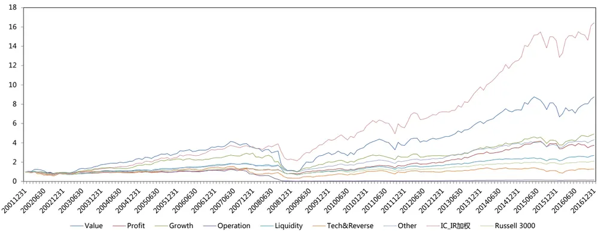

大类因子IC_IR加权每月多头组合超额收益
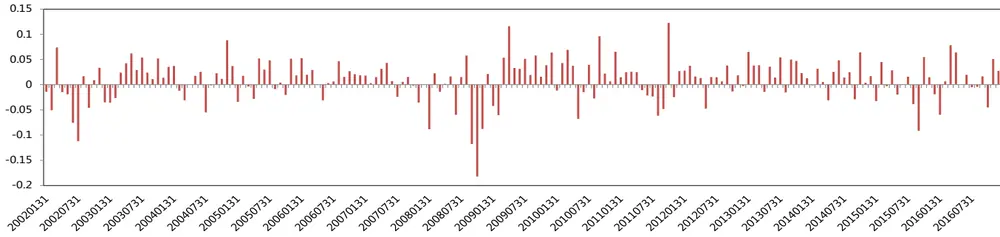

大类因子Profit的每月多头组合超额收益
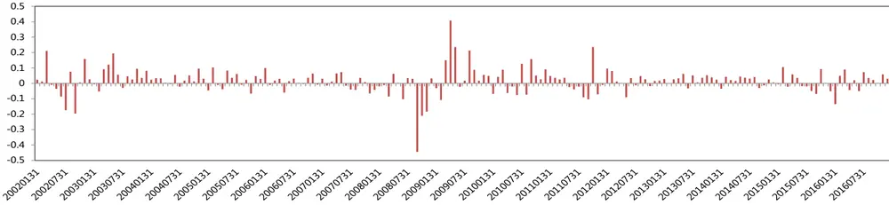

大类因子Growth的每月多头组合超额收益
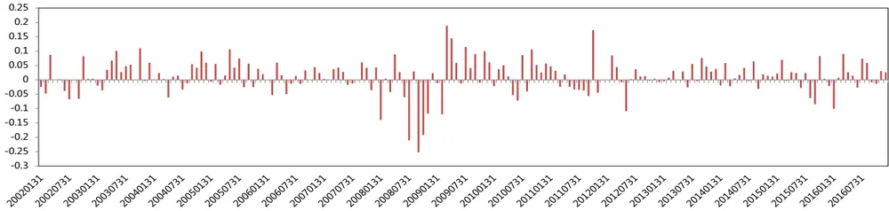

大类因子Operation的每月多头组合超额收益
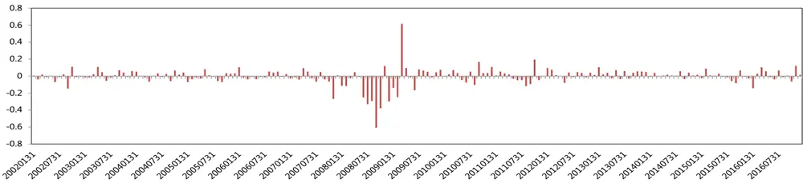

大类因子Liquidity的每月多头组合超额收益
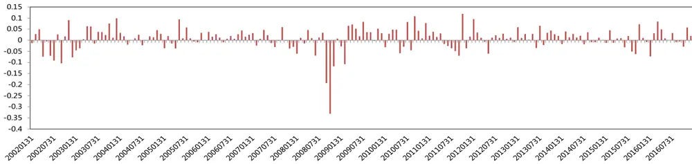

大类因子Tech&Reverse的每月多头组合超额收益
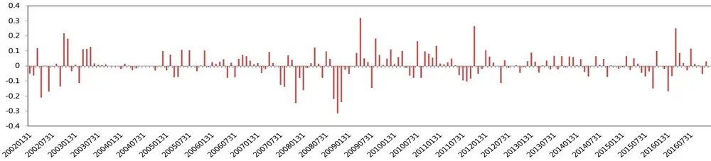

大类因子Other的每月多头组合超额收益
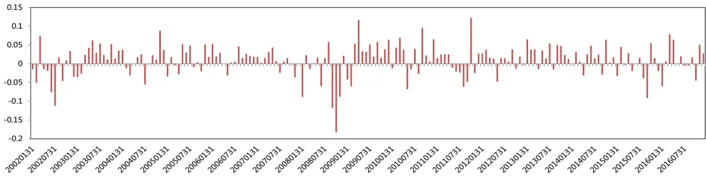
数据来源：东方证券研究所 & Bloomberg

相对而言，A 股的主动量化策略的绝对收益要高很多，很多策略历史回溯的年化收益可以达到50%。在需要控制风险的指数增强产品上，情况也比较类似，1998.01-2002.12，美国市场指数增强基金产品年化信息比率为 0.57，而根据 Wind 数据计算，国内沪深 300 增强基金的平均年化信息比为 1.04，中证 500 增强基金的平均信息比为 1.65，A股目前的 alpha 空间要大很多。

## 六、 总结

本篇报告主要检验了美股与 A股因子的有效性，我们测试了三个时间段，分别从整体上、近期以及早期来观察因子在两个市场的效用，总体来说美股的估值类因子最为显著，盈利能力和成长性表现也不错，而 A 股的流动性因子，技术反转表现最显著。接着我们重点研究了 A 股的市值效应以及美股的动量效应，发现 A 股偏小市值的市场风格近几年十分显著，美股虽然市值与收益率成正相关，但小市值股票依然有获得 Alpha 的空间。另外动量效应在美股确实存在，但是“动量崩盘”现象使得动量套利组合出现较大回撤，而 A 股不存在月度的动量效应，反转效应却非常显著。最后我们构建了几组多头产品来观测是否能够对于罗素 3000 指数产生 Alpha，在没有扣除交易成本的情况下，IC_IR 加权方式的超额收益最高，估值类因子也有明显的 Alpha。

## 风险提示

1. 因子有效性基于历史数据分析得到，未来市场可能发生较大的风格转换，建议投资者紧密跟踪因子表现。

2. 极端市场环境可能对因子效果和模型造成剧烈冲击，需进行严格的风险控制。

## 参考文献

[1]. Barry, C. B., Goldreyer, E., Lockwood, L., & Rodriguez, M. 2002. Robustness of size and value affects in emerging equity markets, 1985 -2000. Emerging Markets Review, 3(1) : 1-30.

[2]. Grinold, R. C., & Kahn, R. N. 2000. Active portfolio management. New York, NY: McGrew-Hill.

[3]. Jun, S., Marathe, A., & Shawky, H. A. 2003. Liquidity and stock returns in emerging equity markets. Emerging Market Review, 4(1) : 1-24.

[4]. Qian, E. E., Hua, R. H., & Sorensen, E. H. 2007. Quantitative equity portfolio management: modern techniques and applications. Boston, MA: Chapman & Hall/CRC Press.

[5]. Serra, A. P., 2002. The cross-sectional determinants of returns－evidence from emerging markets’ stocks. Journal of Emerging Market Finance, 2(2): 123 -162 .

[6]. Sorensen, E. H., Qian, E., Hua, R. and Schoen, R. 2004. Multiple alpha sources and active management. Journal of Portfolio Management, 30(2) : 39-45.

[7]. Daniel K D，Moskowitz T J 2013．Momentumcrashes．Swiss Finance Institute Research Pape~J]．14-16

## 分析师申明

每位负责撰写本研究报告全部或部分内容的研究分析师在此作以下声明：

分析师在本报告中对所提及的证券或发行人发表的任何建议和观点均准确地反映了其个人对该证券或发行人的看法和判断；分析师薪酬的任何组成部分无论是在过去、现在及将来，均与其在本研究报告中所表述的具体建议或观点无任何直接或间接的关系。

## 投资评级和相关定义

报告发布日后的12 个月内的公司的涨跌幅相对同期的上证指数/深证成指的涨跌幅为基准；

## 公司投资评级的量化标准

买入：相对强于市场基准指数收益率 15%以上；

增持：相对强于市场基准指数收益率5%～15%；

中性：相对于市场基准指数收益率在-5%～+5%之间波动；

减持：相对弱于市场基准指数收益率在-5%以下。

未评级——由于在报告发出之时该股票不在本公司研究覆盖范围内，分析师基于当时对该股票的研究状况，未给予投资评级相关信息。

暂停评级——根据监管制度及本公司相关规定，研究报告发布之时该投资对象可能与本公司存在潜在的利益冲突情形；亦或是研究报告发布当时该股票的价值和价格分析存在重大不确定性，缺乏足够的研究依据支持分析师给出明确投资评级；分析师在上述情况下暂停对该股票给予投资评级等信息，投资者需要注意在此报告发布之前曾给予该股票的投资评级、盈利预测及目标价格等信息不再有效。

## 行业投资评级的量化标准：

看好：相对强于市场基准指数收益率5%以上；

中性：相对于市场基准指数收益率在-5%～+5%之间波动；

看淡：相对于市场基准指数收益率在-5%以下。

未评级：由于在报告发出之时该行业不在本公司研究覆盖范围内，分析师基于当时对该行业的研究状况，未给予投资评级等相关信息。

暂停评级：由于研究报告发布当时该行业的投资价值分析存在重大不确定性，缺乏足够的研究依据支持分析师给出明确行业投资评级；分析师在上述情况下暂停对该行业给予投资评级信息，投资者需要注意在此报告发布之前曾给予该行业的投资评级信息不再有效。

## 免责声明

本证券研究报告（以下简称“本报告”）由东方证券股份有限公司（以下简称“本公司”）制作及发布。

本报告仅供本公司的客户使用。本公司不会因接收人收到本报告而视其为本公司的当然客户。本报告的全体接收人应当采取必要措施防止本报告被转发给他人。

本报告是基于本公司认为可靠的且目前已公开的信息撰写，本公司力求但不保证该信息的准确性和完整性，客户也不应该认为该信息是准确和完整的。同时，本公司不保证文中观点或陈述不会发生任何变更，在不同时期，本公司可发出与本报告所载资料、意见及推测不一致的证券研究报告。本公司会适时更新我们的研究，但可能会因某些规定而无法做到。除了一些定期出版的证券研究报告之外，绝大多数证券研究报告是在分析师认为适当的时候不定期地发布。

在任何情况下，本报告中的信息或所表述的意见并不构成对任何人的投资建议，也没有考虑到个别客户特殊的投资目标、财务状况或需求。客户应考虑本报告中的任何意见或建议是否符合其特定状况，若有必要应寻求专家意见。本报告所载的资料、工具、意见及推测只提供给客户作参考之用，并非作为或被视为出售或购买证券或其他投资标的的邀请或向人作出邀请。

本报告中提及的投资价格和价值以及这些投资带来的收入可能会波动。过去的表现并不代表未来的表现，未来的回报也无法保证，投资者可能会损失本金。外汇汇率波动有可能对某些投资的价值或价格或来自这一投资的收入产生不良影响。那些涉及期货、期权及其它衍生工具的交易，因其包括重大的市场风险，因此并不适合所有投资者。

在任何情况下，本公司不对任何人因使用本报告中的任何内容所引致的任何损失负任何责任，投资者自主作出投资决策并自行承担投资风险，任何形式的分享证券投资收益或者分担证券投资损失的书面或口头承诺均为无效。

本报告主要以电子版形式分发，间或也会辅以印刷品形式分发，所有报告版权均归本公司所有。未经本公司事先书面协议授权，任何机构或个人不得以任何形式复制、转发或公开传播本报告的全部或部分内容。不得将报告内容作为诉讼、仲裁、传媒所引用之证明或依据，不得用于营利或用于未经允许的其它用途。

经本公司事先书面协议授权刊载或转发的，被授权机构承担相关刊载或者转发责任。不得对本报告进行任何有悖原意的引用、删节和修改。

提示客户及公众投资者慎重使用未经授权刊载或者转发的本公司证券研究报告，慎重使用公众媒体刊载的证券研究报告。

## 东方证券研究所

地址： 上海市中山南路 318号东方国际金融广场 26楼

联系人： 王骏飞

电话： 021-63325888*1131

传真： 021-63326786

网址： www.dfzq.com.cn

Email： wangjunfei@orientsec.com.cn