## 研究结论

如果用因子打分分组后的多空组合收益衡量一个月收益反转因子的表现，我们发现反转因子在经历了 2015 年强势后，从 2016.04 开始衰弱，但多空组合收益整体保持为正，还未到失效阶段。不过如果把多空组合拆开，分别看多头组合和空头组合相对市场的超额收益，会发现空头组合一直持续跑输市场，而多头组合已经有一年时间左右和市场基本跑平。我们量化策略的 alpha收益主要来自于多头组合，因此从这个角度讲，反转因子已进入失效期。

特异度因子和反转因子类似，最近半年也未能跑赢市场，这些因子由于历史表现优异而在多因子打分中占了大幅权重，如果多头组合长期无法带来超额收益，那么技术类 alpha 因子的高额换手率导致的交易成本将可能使策略组合明显跑输业绩基准。

实证显示，舍弃技术类因子，只用基本面因子做多因子模型，在不扣交易费用的情况下，会让多因子打分的多空组合、主动量化组合和指数增强组合损失很大一部分收益，但这大部分损失发生在 2008、2009 和 2015 三个市场大波动的年份，其它年份的差额要小很多。而且包含技术因子的多因子策略组合的换手率是只含基本面因子组合的两到三倍，考虑进交易费用后，两种策略做出来的中证 500增强组合在小波动年份的收益基本相当。

市场产生反转效应的本质是资金在不同类别股票间的轮动，市场热点主题越多，个股差异性越大，反转效应越明显。我们可以用每个月横截面上股票收益率的标准差来衡量个股差异度。个股差异度和当月的反转因子收益呈正相关，相关系数 0.2左右。近半年以来，市场个股差异度处在历史低位，和 2011、2012年基本相当，情绪低迷；未来中长期看，经济复苏速度可能曲折反复，在美联储加息预期和金融去杠杆大背景下，国内货币紧缩压力大，股市很难吸引到资金来增加市场波动和个股差异度，反转因子的未来表现可能一般。

当前投资者做多因子投资时，可以考虑剔除技术类因子；这样做在低波动市场里不会损失太多 alpha，而且还能降低组合换手，节约交易成本，实际投资收益可能比加了技术类因子的策略组合更好。

## 风险提示

- 量化模型失效风险

- 市场极端环境的冲击

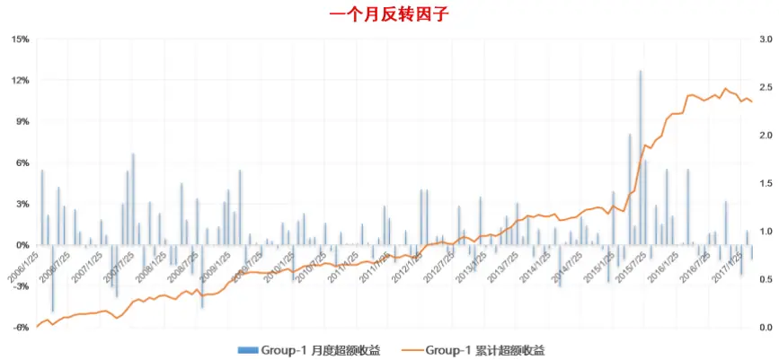
东方证券股份有限公司经相关主管机关核准具备证券投资咨询业务资格，据此开展发布证券研究报告业务。

报告发布日期2017 年 04 月 9 日

证券分析师朱剑涛

021-63325888*6077

zhujiantao@orientsec.com.cn

执业证书编号：S0860515060001

相关报告

| 中美市场因子选股效果对比分析 | 2017-03-06 |
| --- | --- |
| 组合优化是与非 | 2017-03-06 |
| 动态情景 Alpha 模型再思考 | 2017-02-17 |
| 技术类新 Alpha 因子的批量测试 | 2017-02-17 |
| 对主动投资有益的量化结论 | 2016-12-21 |
| 在 Alpha 衰退之前 | 2016-12-05 |
| A 股市场风险分析 | 2016-12-02 |

## 一、反转因子是否已失效？

一个月收益率反转因子是过去几年 A 股最为显著的 alpha 因子之一；更长期的反转因子，例如三个月、六个月和 12 个月收益率反转因子，alpha 绝大部分来自于一个月收益率反转，剔除最近一个月收益后，剩余 alpha 效应非常弱（参考前期报告《中美市场因子选股效果对比分析》）。如果按照过去一个月的股票收益，把全市场股票等分成 10组，做多过去一个月跑的最差的一组股票（G1），做空过去一个月跑的最好的一组股票（G10），其多空组合的月度收益如图 1所示（反转因子做了行业和市值中性化处理，报告里其它 alpha因子也做了同样处理）。反转因子在经历了2015年的强势后，从 2016.04开始有所衰弱，但多空组合收益整体保持为正值，因此图 1反映的情况是反转因子 alpha效应有所衰减，还没到失效的地步。

图 1：一个月收益率反转因子分组多空组合（G1-G10）收益
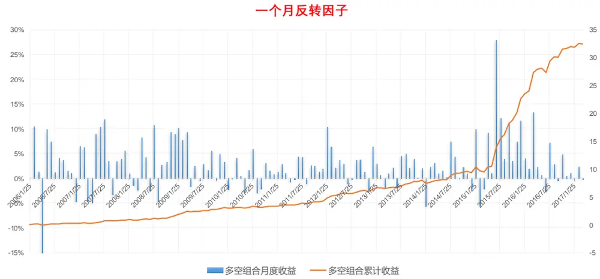
数据来源：东方证券研究所 & Wind 资讯

但是如果我们把多空组合的收益拆开，分别考察 G1 和 G10 两个组合相对全市场股票等权组合的超额收益，其结果如图 2 和图 3 所示。

图 2：一个月收益率反转因子G1相对全市场股票等权组合的超额收益
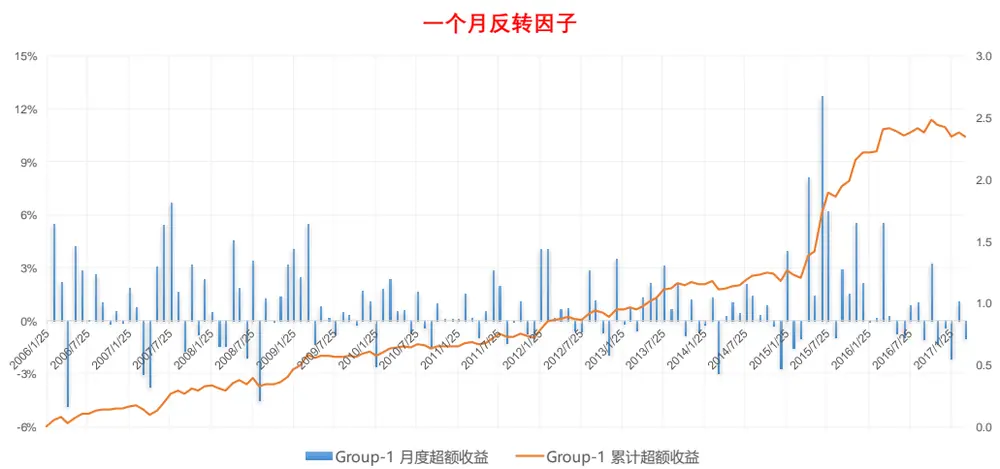
数据来源：东方证券研究所 & Wind 资讯

图 3：一个月收益率反转因子G10相对全市场股票等权组合的超额收益
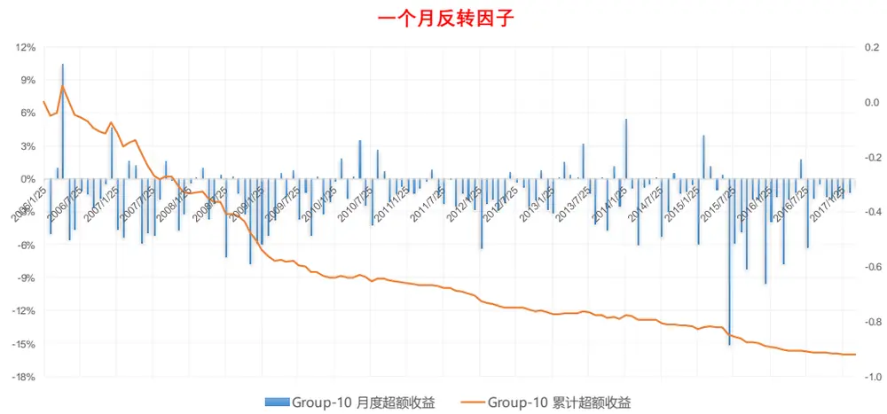
数据来源：东方证券研究所 & Wind 资讯

可以看到多头组合 G1 从 2016.04 开始，至今一年的时间基本没有跑赢市场，而空头组合 G10则稳健保持跑输市场的态势。也就是说在过去一年时间，过去一个月跑的好的股票未来一个月仍然会显著跑输市场，但过去一个月跑的差的股票未来一个月未能跑赢市场。反转因子的多头组合收益和空头组合收益存在不对称性。而目前国内不论是做主动量化、指数增强还是量化对冲，alpha收益主要来自于多头，因此从这个角度讲，反转因子已经进入失效期。

## 二、舍弃技术类因子的收益损失

除了反转因子，另一个和它相关性很高而且历史表现非常优异的因子，特异度，其多头组合最近半年多时间基本也没有跑赢大盘（图 4）。

图 4：特异度因子 G1相对全市场股票等权组合的超额收益
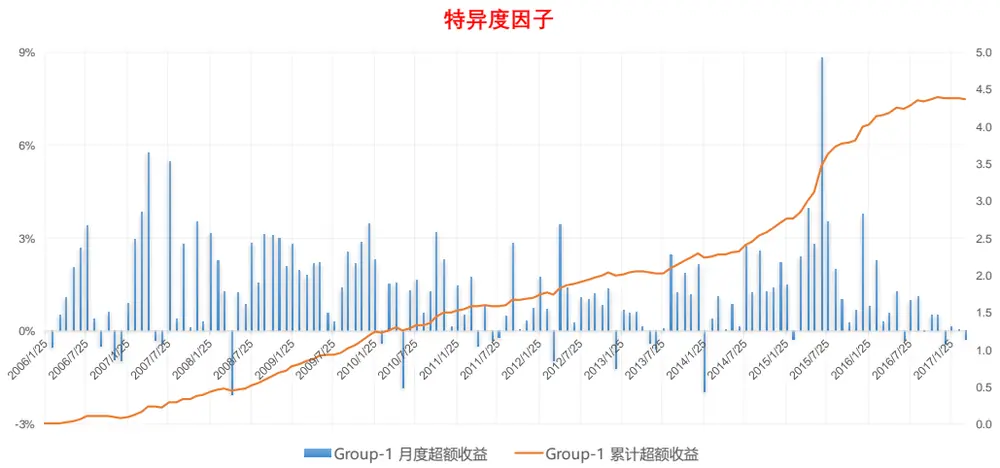
数据来源：东方证券研究所 & Wind 资讯

我们目前 alpha模型是采用 alpha因子过去两年的 IC_IR进行加权，这两个因子过往表现非常优异，因此其在多因子打分中的权重非常大。如果多头组合长期无法带来超额收益，那么技术类alpha 因子的高额换手率导致的交易成本将可能使策略组合明显跑输业绩基准。因此这里我们想测试一下，如果舍弃技术类 alpha因子，多因子策略的收益会损失多少。

下述回溯测试基于我们因子库里的五十个 alpha因子，测试时间段为 2006.01-2017.03。首先用先前报告《Alpha 因子库精简与优化》里提到的方法对因子库进行精简，剩余 11 个因子（图 5），其中五个为基本面因子，六个为技术面因子，一个月收益率反转因子被 Momentumave1M 替代。用这 11 个 alpha 因子进行多因子打分得到的组合在下文称作全因子组合，只用前面五个基本面因子打分得到的组合称作基本面因子组合。由于技术类因子过去几年表现的强势，所以在全因子组合中，技术类因子的权重占了大多数（图 6）。

图 5：精简剩余的 alpha因子

|  | 基本面因子 | 技术面因子 |  |
| --- | --- | --- | --- |
| 因子简写 | 因子解释 | 因子简写 | 因子解释 |
| EP2_TTM | 扣除非经常性损益的 TTM PE | CGO_3M | CapitalGainsOverhang(3M) |
| CFP_TTM | TTMOperatingCashFlow/MarketCap | TO | 以流通股本计算的1个月日均换手率 |
| GP2Asset | GrossProfit/AvgtotalAsset | IRFF | Fama-FrenchregressionSSR/SST |
| SalesGrowth_Qr_YOY | 营业收入增长率（季度同比） | AmountVol_1M_12M | 过去一个月日均成交量/12个月日均成交量 |
|  | ProfitGrowth_Qr_YOY 净利润增长率(季度同比） | Momentumave1M | 股价相比最近1个月均价涨幅 |
|  |  | Momentumlast12M | 复权收盘价/复权收盘价_12月前-1 |

数据来源：东方证券研究所 & Wind 资讯

图 6：全因子组合中两类因子的权重占比
因子权重占比
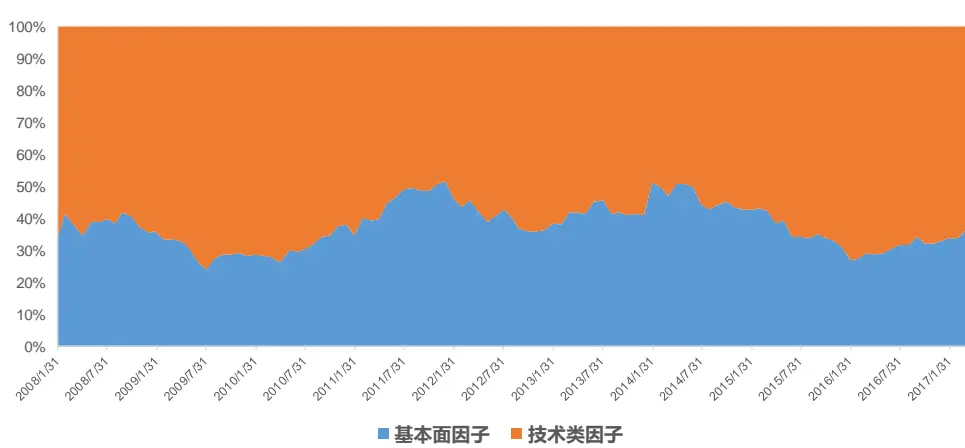
数据来源：东方证券研究所 & Wind 资讯

## 2.1 多空组合的收益损失

按照多因子打分把股票分为十组，考察做多得分最高组(G1)，做空得分最低组(G10)的多空组合收益。结果如图 7 所示，剔除基本面因子后，多空组合的收益下降了近 60%，除去 2010 年，全因子多空组合一直都强于基本面因子多空组合，2008、2009、2015 三个高波动年份尤为明显。

图 7：全因子多空组合与基本面因子多空组合的比较分析
全因子多空组合月收益 减去 基本面因子多空组合月收益
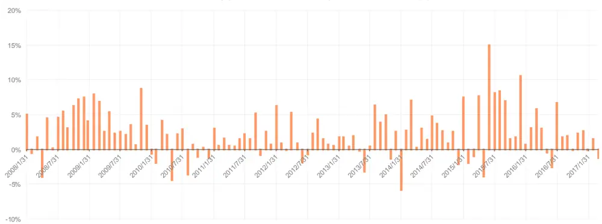

|  | 平均月收益 | 月胜率 | Sharpe Ratio | 最大回撤 | Zscore IC | Zscore IC_IR |
| --- | --- | --- | --- | --- | --- | --- |
| 全因子多空组合 | 0.038 | 94.6% | 3.35 | -0.074 | 0.130 | 5.45 |
| 基本面因子多空组合 | 0.015 | 75.7% | 2.05 | -0.072 | 0.056 | 2.98 |

| 年份 | 全因子多空组合 | 基本面多因子组合 差额 |
| --- | --- | --- |
| 2008 | 72.7% | 16.3% 56.5% |
| 2009 | 86.4% | 15.0% 71.4% |
| 2010 | 19.8% | 21.1% -1.3% |
| 2011 | 44.9% | 20.7% 24.2% |
| 2012 | 46.3% | 20.3% 26.0% |
| 2013 | 39.5% | 15.8% 23.7% |
| 2014 | 34.4% | 9.5% 24.8% |
| 2015 | 134.9% | 34.8% 100.1% |
| 2016 | 47.8% | 16.3% 31.4% |
| 2017 | 6.9% | 6.7% 0.2% |

数据来源：东方证券研究所 & Wind 资讯

## 2.2 主动量化组合的收益损失

下面用多因子打分最高的一组做为主动量化组合的代表，从图 8 可以看到，剔除技术类因子后，组合的月超额收益只下降了 40%，明显小于图 7 多空组合收益的变换，另一个角度说明技术类因子空头 alpha的贡献更高。和之前类似，在 2008、2009和 2015三个大波动年份，剔除技术类因子损失的收益最高，其它年份损失的收益平均下来在每年 3%左右。考虑到这是没有扣除交易费用的回溯测试，而加入了技术类因子的组合换手率是基本面因子的两到三倍，因此扣除实际交易费用后，低波动年份全因子组合和基本面因子组合的收益差别会更小（参考下一节的数据对比）。

图 8：全因子 G1 组合与基本面因子 G1 组合的比较分析
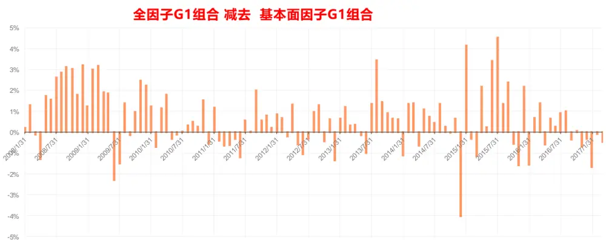

|  | 平均月超额收益 | 月胜率 | Sharpe Ratio |
| --- | --- | --- | --- |
| 全因子G1组合 | 0.014 | 83.8% | 2.21 |
| 基本面因子G1组合 | 0.008 | 63.1% | 1.23 |

| 年份 | 全因子G1超额收益 | 基本面多因子G1超额收益 差额 |
| --- | --- | --- |
| 2008 | 21.8% | -0.2% 22.0% |
| 2009 | 32.1% | 14.8% 17.3% |
| 2010 | 9.4% | 3.9% 5.5% |
| 2011 | 16.1% | 13.7% 2.4% |
| 2012 | 16.2% | 14.1% 2.1% |
| 2013 | 16.0% | 5.2% 10.8% |
| 2014 | 11.4% | 9.6% 1.7% |
| 2015 | 27.9% | 9.0% 18.9% |
| 2016 | 14.7% | 13.1% 1.6% |
| 2017 | 2.4% | 4.7% -2.3% |

数据来源：东方证券研究所 & Wind 资讯

## 2.3 指数增强组合的收益损失

本节尝试在全市场选股做中证 500 指数增强，组合构建时与中证 500 指数保证行业权重分布一致，每个行业内选多因子打分居前 10%的股票，行业内等权构建组合，每月调仓。因为中证 500指数行业权重和个股权重分布相对均衡，所以这种简单的指数增强组合构建方式和指数基准的主动风险暴露并不大，策略结果和通过组合优化的方式控制风险暴露差不多（参考报告《组合优化是与非》）。全因子组合与基本面因子组合在未扣交易费用时的对比如图 9 所示，扣除交易费用（按照佣金 5bp, 卖出印花税 10 bp，冲击成本 15bp 估算）的结果参考图 10

图 9：全因子指数增强组合与基本面因子指数增强组合的比较分析（未扣费）
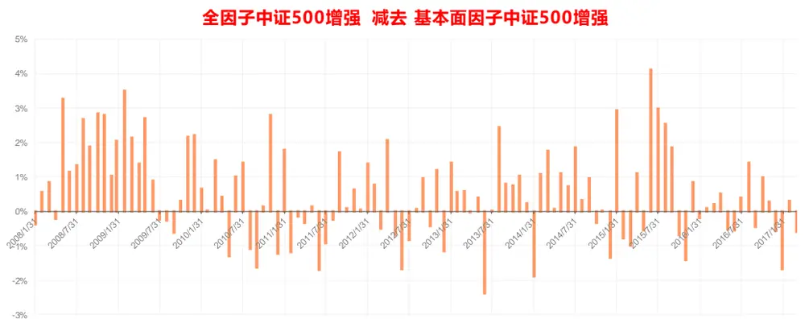

|  | 年化对冲收益 | 信息比 | 月胜率 | 最大回撤 | 平均股票数量 月单边换手率 |  |
| --- | --- | --- | --- | --- | --- | --- |
| 全因子中证500增强 | 25.1% | 3.94 | 89.2% | -4.6% | 210.2 | 65.3% |
| 基本面因子中证500增强 | 17.5% | 3.45 | 82.9% | -5.5% | 210.2 | 22.4% |

| 年份 | 全因子中证500增强 | 基本面因子中证500增强 差额 |
| --- | --- | --- |
| 2008 | 31.7% | 10.6% 21.0% |
| 2009 | 35.6% | 15.7% 19.9% |
| 2010 | 14.5% | 11.6% 2.9% |
| 2011 | 18.2% | 18.5% -0.2% |
| 2012 | 20.9% | 19.5% 1.4% |
| 2013 | 21.7% | 15.0% 6.7% |
| 2014 | 17.5% | 12.8% 4.8% |
| 2015 | 57.1% | 40.0% 17.0% |
| 2016 | 21.8% | 20.1% 1.8% |
| 2017 | -1.1% | 0.9% -2.0% |

数据来源：东方证券研究所 & Wind 资讯

图 10：全因子指数增强组合与基本面因子指数增强组合的比较分析（扣除交易费用）
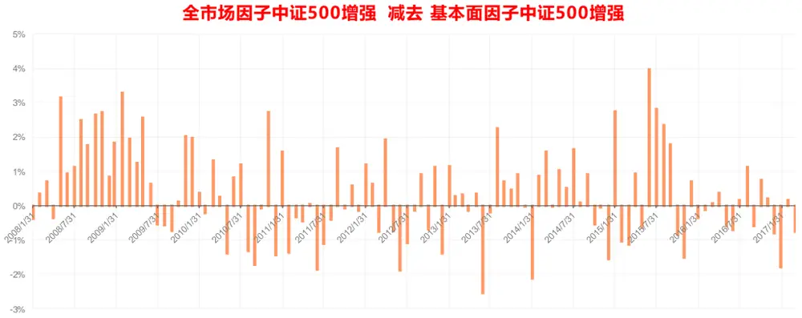

|  | 年化对冲收益 | 信息比 | 月胜率 | 最大回撤 | 平均股票数量 | 月单边换手率 |
| --- | --- | --- | --- | --- | --- | --- |
| 全因子中证500增强 | 20.3% | 3.26 | 85.6% | -4.9% | 210.2 | 65.3% |
| 基本面因子中证500增强 | 15.3% | 3.04 | 82.0% | -5.7% | 210.2 | 22.4% |

| 年份 | 全因子中证500增强 基本面因子中证500增强 | 差额 |
| --- | --- | --- |
| 2008 | 26.8% | 8.4% 18.4% |
| 2009 | 30.0% | 13.6% 16.4% |
| 2010 | 10.0% | 9.6% 0.4% |
| 2011 | 14.0% | 16.2% -2.2% |
| 2012 | 16.3% | 17.3% -1.0% |
| 2013 | 16.7% | 12.9% 3.9% |
| 2014 | 12.9% | 10.5% 2.4% |
| 2015 | 51.1% | 37.0% 14.1% |
| 2016 | 17.3% | 18.0% -0.8% |
| 2017 | -1.8% | 0.7% -2.4% |

数据来源：东方证券研究所 & Wind 资讯

从上图可以看到，在不扣费情况下，剔除技术类因子后，增强策略年化对冲收益从 25.1%降到了 17.5%，超额收益最大回撤从-4.6%增大到了-5.5%，信息比仍然维持在 3 以上，从绩效表现看，基本面因子组合虽然表现相对弱一些，但本身还是非常不错的策略。全因子组合换手率大概是基本面因子组合的三倍，如果扣除交易费用，两者的年化对冲收益差只有 5%；而且按年份看，扣除 2008、2009 和 2015 三个大波动年份，其它年份全因子组合和基本面因子组合基本持平。

报告中精简出的 5 个基本面因子，是把基本面因子和技术类因子合在一起做精简得到的结果，如果一开始就把因子库里的技术类因子剔除，只在基本面因子里做精简，有可能剩余更多的基本面因子，基本面因子组合的收益有可能进一步增强。

## 三、反转因子收益的预期走势

市场产生反转效应的本质是资金在不同类别股票间的轮动，市场热点主题越多，个股差异性越大，反转效应越明显，这种高速资金轮动带来的另一个效应是市场整体换手率的增加。我们可以用每个月横截面上股票收益率的标准差来衡量个股差异度，这个指标和当月的 A 股市场整体换手率高度正相关（图 11），相关系数达到 0.80；和当月的反转因子 G1组合超额收益率也是正相关（图12），相关系数 0.23。近半年以来，市场个股差异度处在历史低位，和 2011、2012 年基本相当（图 13），情绪低迷；未来中长期看，经济复苏速度可能曲折反复，在美联储加息预期和金融去杠杆大背景下，国内货币紧缩压力大，股市很难吸引到资金来增加市场波动和个股差异度，反转因子的未来表现可能一般。当前投资者做多因子投资时，可以考虑剔除技术类因子；这样做在低波动市场里不会损失太多 alpha，而且还能降低组合换手，节约交易成本，实际投资收益可能比加了技术类因子的策略组合更好。

图 11：个股差异度与市场换手率的关系
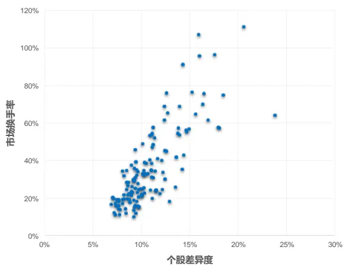
资料来源：东方证券研究所 & Wind 资讯

图 12：个股差异度与反转因子多空组合收益的关系
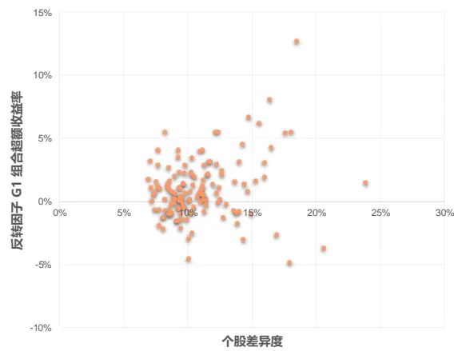
资料来源：东方证券研究所 & Wind 资讯

图 13：反转因子 G1组合超额收益与市场个股差异度走势
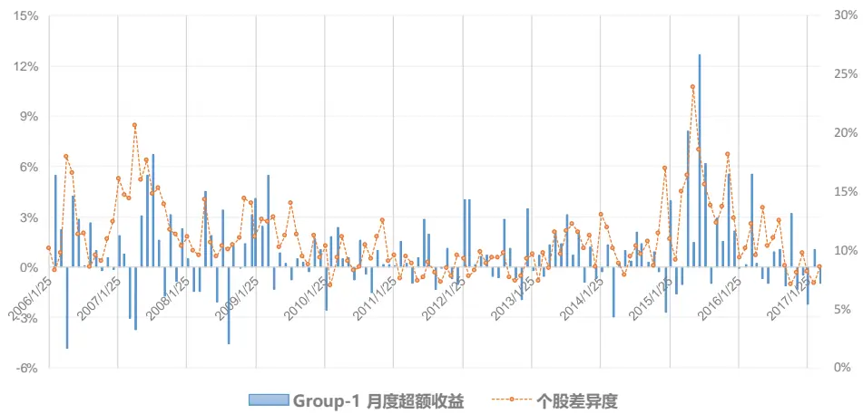
数据来源：东方证券研究所 & Wind 资讯

## 风险提示

1. 量化模型基于历史数据分析得到，未来存在失效的风险，建议投资者紧密跟踪模型表现。

2. 极端市场环境可能对模型效果造成剧烈冲击，导致收益亏损。

## 分析师申明

每位负责撰写本研究报告全部或部分内容的研究分析师在此作以下声明：

分析师在本报告中对所提及的证券或发行人发表的任何建议和观点均准确地反映了其个人对该证券或发行人的看法和判断；分析师薪酬的任何组成部分无论是在过去、现在及将来，均与其在本研究报告中所表述的具体建议或观点无任何直接或间接的关系。

## 投资评级和相关定义

报告发布日后的 12个月内的公司的涨跌幅相对同期的上证指数/深证成指的涨跌幅为基准；

## 公司投资评级的量化标准

买入：相对强于市场基准指数收益率15%以上；

增持：相对强于市场基准指数收益率5%～15%；

中性：相对于市场基准指数收益率在-5%～+5%之间波动；

减持：相对弱于市场基准指数收益率在-5%以下。

未评级——由于在报告发出之时该股票不在本公司研究覆盖范围内，分析师基于当时对该股票的研究状况，未给予投资评级相关信息。

暂停评级——根据监管制度及本公司相关规定，研究报告发布之时该投资对象可能与本公司存在潜在的利益冲突情形；亦或是研究报告发布当时该股票的价值和价格分析存在重大不确定性，缺乏足够的研究依据支持分析师给出明确投资评级；分析师在上述情况下暂停对该股票给予投资评级等信息，投资者需要注意在此报告发布之前曾给予该股票的投资评级、盈利预测及目标价格等信息不再有效。

## 行业投资评级的量化标准：

看好：相对强于市场基准指数收益率5%以上；

中性：相对于市场基准指数收益率在-5%～+5%之间波动；

看淡：相对于市场基准指数收益率在-5%以下。

未评级：由于在报告发出之时该行业不在本公司研究覆盖范围内，分析师基于当时对该行业的研究状况，未给予投资评级等相关信息。

暂停评级：由于研究报告发布当时该行业的投资价值分析存在重大不确定性，缺乏足够的研究依据支持分析师给出明确行业投资评级；分析师在上述情况下暂停对该行业给予投资评级信息，投资者需要注意在此报告发布之前曾给予该行业的投资评级信息不再有效。

## 免责声明

本证券研究报告（以下简称“本报告”）由东方证券股份有限公司（以下简称“本公司”）制作及发布。

本报告仅供本公司的客户使用。本公司不会因接收人收到本报告而视其为本公司的当然客户。本报告的全体接收人应当采取必要措施防止本报告被转发给他人。

本报告是基于本公司认为可靠的且目前已公开的信息撰写，本公司力求但不保证该信息的准确性和完整性，客户也不应该认为该信息是准确和完整的。同时，本公司不保证文中观点或陈述不会发生任何变更，在不同时期，本公司可发出与本报告所载资料、意见及推测不一致的证券研究报告。本公司会适时更新我们的研究，但可能会因某些规定而无法做到。除了一些定期出版的证券研究报告之外，绝大多数证券研究报告是在分析师认为适当的时候不定期地发布。

在任何情况下，本报告中的信息或所表述的意见并不构成对任何人的投资建议，也没有考虑到个别客户特殊的投资目标、财务状况或需求。客户应考虑本报告中的任何意见或建议是否符合其特定状况，若有必要应寻求专家意见。本报告所载的资料、工具、意见及推测只提供给客户作参考之用，并非作为或被视为出售或购买证券或其他投资标的的邀请或向人作出邀请。

本报告中提及的投资价格和价值以及这些投资带来的收入可能会波动。过去的表现并不代表未来的表现，未来的回报也无法保证，投资者可能会损失本金。外汇汇率波动有可能对某些投资的价值或价格或来自这一投资的收入产生不良影响。那些涉及期货、期权及其它衍生工具的交易，因其包括重大的市场风险，因此并不适合所有投资者。

在任何情况下，本公司不对任何人因使用本报告中的任何内容所引致的任何损失负任何责任，投资者自主作出投资决策并自行承担投资风险，任何形式的分享证券投资收益或者分担证券投资损失的书面或口头承诺均为无效。

本报告主要以电子版形式分发，间或也会辅以印刷品形式分发，所有报告版权均归本公司所有。未经本公司事先书面协议授权，任何机构或个人不得以任何形式复制、转发或公开传播本报告的全部或部分内容。不得将报告内容作为诉讼、仲裁、传媒所引用之证明或依据，不得用于营利或用于未经允许的其它用途。

经本公司事先书面协议授权刊载或转发的，被授权机构承担相关刊载或者转发责任。不得对本报告进行任何有悖原意的引用、删节和修改。

提示客户及公众投资者慎重使用未经授权刊载或者转发的本公司证券研究报告，慎重使用公众媒体刊载的证券研究报告。

## 东方证券研究所

地址：上海市中山南路 318 号东方国际金融广场 26 楼

联系人： 王骏飞

电话：021-63325888*1131

传真：021-63326786

网址： www.dfzq.com.cn

Email： wangjunfei@orientsec.com.cn