## 研究结论

银行的金融资产占比较大，运营模式独特，股票价格和其他行业指数相关性低，通过全市场测试选出的 alpha 因子可能在银行股内并不适用，有必要单独建模。而且银行股在沪深 300 和上证 50 指数里权重极高，做好银行行业内选股对指数增强效果的提升十分明显。

- 长期来看，EP2TTM、BPTTM、NPL 、NPC、CCAR、YOYSALES、YOYNETPROFIT、EQUITY RATIO 这几个因子在银行内的选股能力较好。

我们分别建立了仅采用估值成长两个大类因子和额外加入了银行专属因子的银行内增强组合，综合来看，由于最近经济下行压力较大且银行监管压力增大，所以加入了风险监管类因子的组合相对而言更好，该组合从2011.1.31-2017.1.26 的年化对冲收益为 7.52%，IR 为 1.33。

常规的建立沪深 300增强组合的方法并不能对银行内股票很好的建模，虽然整个沪深 300增强组合表现不错，但是其中的银行内组合表现很差，不但基本没有超额收益，最大回撤也很大。因此，对银行单独建模是有必要且可行的，在相同的跟踪误差条件下，单独建模的银行组合年化收益高于常规建模组合 6%左右，鉴于银行在沪深 300 指数内的高权重，对银行的分块建模大约能提升沪深 300增强组合收益 0.5%-1%。

## 风险提示

- 极端市场环境可能对模型效果造成剧烈冲击，导致收益亏损。

- 量化模型基于历史数据分析得到，未来存在失效风险，建议投资者紧密跟踪模型表现。

报告发布日期2017 年 04 月 25 日

证券分析师朱剑涛

021-63325888*6077

zhujiantao@orientsec.com.cn

执业证书编号：S0860515060001

联系人张惠澍

021-63325888-6123

zhanghuishu@orientsec.com.cn

## 相关报告

| 反转因子失效市场下的量化策略应对 中美市场因子选股效果对比分析 | 2017-04-09 |
| --- | --- |
|  | 2017-03-06 |
| 组合优化是与非 | 2017-03-06 |
| 动态情景 Alpha 模型再思考 | 2017-02-17 |
| 技术类新 Alpha 因子的批量测试 | 2017-02-17 |

常规沪深300指数增强组合银行部分表现（跟踪误差 5.62%）
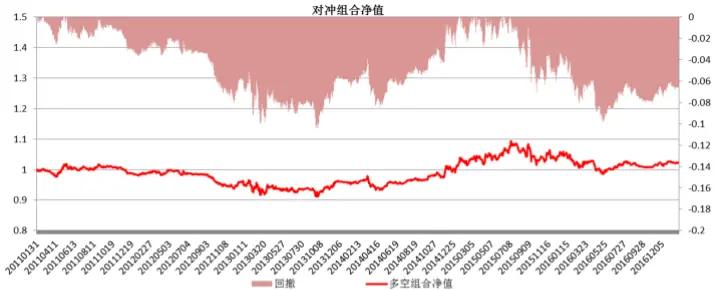

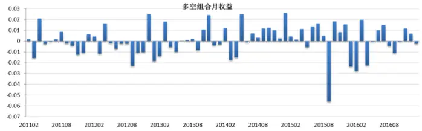

银行内增强组合表现（跟踪误差 5.18%）
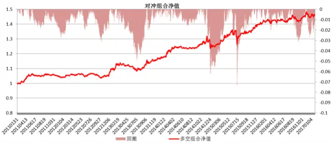

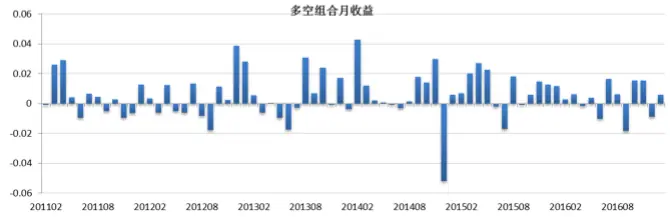

东方证券股份有限公司经相关主管机关核准具备证券投资咨询业务资格，据此开展发布证券研究报告业务。

东方证券股份有限公司及其关联机构在法律许可的范围内正在或将要与本研究报告所分析的企业发展业务关系。因此，投资者应当考虑到本公司可能存在对报告的客观性产生影响的利益冲突，不应视本证券研究报告为作出投资决策的唯一因素。

有关分析师的申明，见本报告最后部分。其他重要信息披露见分析师申明之后部分，或请与您的投资代表联系。并请阅读本证券研究报告最后一页的免责申明。

## 为什么要对银行股单独建模？

银行股在沪深 300 指数中权重较高，图 1 展示了 2005 年 4 月-2017 年 2 月沪深 300 成分股中银行股的数量和总权重，沪深 300 成分股中银行股的数量从 2005 年开始的 5 支，逐渐增加到 2010年底的 16 支，数量上虽然占比较少，但是从 2008 年 10 月开始，银行股在沪深 300 成分股中的总权重就始终处在 15%以上，对于指数的影响很大。而且，我们知道银行，非银金融等行业的选股逻辑和因子是与其他行业就较大差异的。因此，在做沪深 300 指数增强组合的时候，若能对于银行，非银金融等权重占比较大的行业进行独立的分块建模，就会使指数增强组合的整体效果有一定的提升。

图 1：银行股在沪深 300指数中的数量和总权重
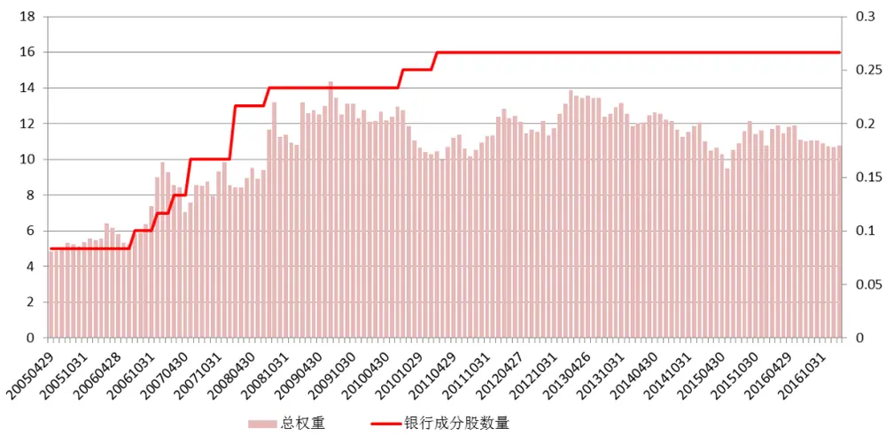
数据来源：东方证券研究所 Wind 资讯

图 2：
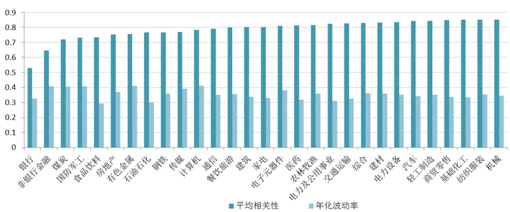
数据来源：东方证券研究所 Wind 资讯

此外，银行股和其他类型股票的平均相关性较低。图 2 展示了 2006.1.1-2017.3.31 中信一级行业指数的平均相关性，可以看到银行的平均相关性显著的低于其他行业，同时银行指数的波动率也不高。综合来看，银行股的走势与其他类型股票较不同步，说明银行股有其特别的性质。综合上述两点，我们有必要针对银行股单独进行建模以取得更好的整体增强效果。

## 单因子测试

本文主要对沪深 300 成分股中的银行股中的因子效果做了检验，并根据单因子检验的效果建立了动态的多因子模型，由于银行股的股票数量非常少，常规的计算 rankIC 的方法显然无法应用，因此这里我们通过统计多空组合（前 40%减去后 40%）的收益和稳定性来作为衡量单因子好坏的量度。

表 1：测试因子列表

| 估值 | EP2TTM BPTTM | 扣除非经常性损益的盈市率 账面价值比 |
| --- | --- | --- |
| 风险监管 | NPL | 不良贷款比率 |
|  | NPC | 不良贷款拨备覆盖率 |
|  | Equity Ratio | 杠杆比率 |
|  | CCAR | 核心一级资本充足率 |
|  | ROA | 资产收益率 |
| 盈利 |  |  |
|  | ROE | 净资产收益率 |
|  | ADMINEXPENSETOGR | 管理费用/总营业收入 |
|  | LDR | 存贷比 |
|  | NonIM | 非利息收入占比 |
|  | CIR | 成本收入比 |
|  | NIM | 净息差 |
| 成长 | YOYSALES | 营业收入环比增长 |
|  | YOYNETPROFIT | 净利润环比增长 |
| 资本结构 | IASSET2NIASSET | 总盈利资产/总非盈利资产 |
|  | LOAN2ASSET | 贷款净值/总资产 |

数据来源：东方证券研究所 Wind 资讯

## 估值因子

估值因子采用剔除非经常性损益的盈市率(EP2TTM)，账面价值比（BPTTM）这两个常见的估值类因子。

扣除非经常性损益的盈市率(EP2TTM)，盈市率是市盈率的倒数，与市盈率一样都是衡量公司估值高低的指标，但是盈市率对于净利润为负的公司的排序较市盈率更好。从结果可以看到，此因子的选股能力很强，因子值的大小和未来的收益率呈正相关关系，也就是说低估值的银行长期表现好于高估值的银行。

账面价值比(BPTTM)，账面价值比也是传统的衡量公司估值高低的指标。从结果可以看到，此因子的选股能力很强，因子值的大小和未来的收益率呈正相关关系，也就是说低估值的银行长期表现好于高估值的银行。相比较而言，此因子的多空组合无论回撤、年化收益还是IR均好于EP2TTM，说明此因子有着比EP2TTM更强的银行内选股作用。

图 3：估值因子效果
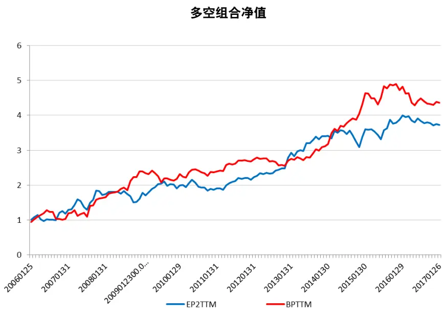

| 因子 | 多空方向 | 多空平均月收益 | IR | 年化收益 | 月最大回撤 | 多空胜率 | TOP8组合月单边换手率 (20101231以后) |
| --- | --- | --- | --- | --- | --- | --- | --- |
| EP2TTM | 1 | 1.11% | 0.769 | 12.60% | -19.08% | 57.14% | 11.13% |
| BPTTM | 1 | 1.23% | 0.864 | 14.20% | -21.52% | 57.14% | 11.61% |

数据来源：东方证券研究所 Wind 资讯

## 风险监管类因子

风险监管类因子考量了银行业内关注较多的衡量银行应对风险能力的指标，包括不良贷款率（NPL）、存贷比（LDR）、不良贷款拨备覆盖率（NPC）、核心一级资本充足率（CCAR）和产权比率（EquityRatio）。

不良贷款率（NPL），不良贷款率指金融机构不良贷款占总贷款余额的比重。金融机构不良贷款率是评价金融机构信贷资产安全状况的重要指标之一。不良贷款率高，可能无法收回的贷款占总贷款的比例越大；不良贷款率低，说明金融机构不能收回贷款占总贷款的比例越小。从结果来看，不良贷款率越低的银行长期表现更好，这点符合因子的经济逻辑，但是整体来说因子的的选股效果较好。

产权比率（Equity Ratio），产权比率反映由债权人提供的负债资金与所有者提供的权益资金的相对关系，这一比率是衡量企业长期偿债能力的指标之一，它也是企业财务结构稳健与否的重要标志。其计算公式为：产权比率=负债总额/股东权益。产权比率表示，股东每提供一元钱债权人愿意提供的借款额。在通货膨胀加剧时期，公司多借债可以把损失和风险转嫁给债权人；在经济繁荣时期，公司多借债可以获得额外利润。产权比率高，是高风险、高报酬的财务结构；产权比率低，是低风险、低报酬的财务结构。我国的银行都要受到比较严格的监管，因此在满足监管要求的情况下，产权比率较高的银行盈利能力相对较强。从结果来看，此因子选股能力较好，且更高产权比率的公司有着相对更高的投资回报率。

图 4：风险监管类因子效果
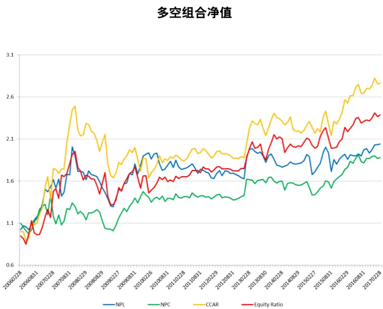

| 因子 | 多空方向 | 多空平均月收益 | IR | 年化收益 | 月最大回撤 | 多空胜率 | TOP8组合月单边换手率 (20101231以后) |
| --- | --- | --- | --- | --- | --- | --- | --- |
| NPL | -1 | -0.65% | -0.468 | 6.65% | -35.53% | 53.38% | 5.32% |
| NPC | 1 | 0.58% | 0.432 | 5.86% | -29.74% | 55.64% | 3.78% |
| CCAR | -1 | -0.94% | -0.554 | 9.76% | -34.19% | 53.44% | 3.08% |
| Equity Ratio | 1 | 0.81% | 0.496 | 8.16% | -32.56% | 60.15% | 6.21% |

数据来源：东方证券研究所 Wind 资讯

不良贷款拨备覆盖率（NPC），拨备覆盖率是实际上银行贷款可能发生的呆、坏账准备金的使用比率。不良贷款拨备覆盖率是衡量商业银行贷款损失准备金计提是否充足的一个重要指标。该项指标从宏观上反映银行贷款的风险程度及社会经济环境、诚信等方面的情况。依据《股份制商业银行风险评级体系（暂行）》，拨备覆盖率是实际计提贷款损失准备对不良贷款的比率，该比率最佳状态为100%。拨备覆盖率是银行的重要指标，这个指标考察的是银行财务是否稳健，风险是否可控。从结果来看，此因子选股能力较好，且更高不良贷款拨备覆盖率的公司有着相对更高的投资回报率。特别是从2015年来，经济发展减缓，银行资产质量受到投资者更大的关注，因此较高拨备覆盖率的公司相对而言资产质量更好，所以因子15年以后的收益情况较之前好。

核心一级资本充足率（CCAR），核心一级资本充足率是指核心一级资本与加权风险资产总额的比率，根据《商业银行资本管理办法》的规定，我国目前核心一级资本充足率需达到 5%，且需要额外 2.5%的储备资本，也就是说核心一级资本充足率的至少要大于等于 7.5%。理论上说，在满足规定核心资本充足率的标准下，较高的核心资本充足率会制约银行的发展，过高的资本量将会降低财务杠杆比率，增加筹集资金的成本，进而影响银行的利润，而且核心资本的大部分都占压在变现

能力弱的固定资产或亏损资产上，进一步降低了银行补资的能力，削弱了银行资本功能发挥的基础。
从结果上来看，核心资本充足率较低的银行有着相对更高的收益。

## 盈利能力因子

盈利能力因子考量了主流的指标，包括管理费用/总营业收入（ADMINEXPENSETOGR）、资产收益率（ROA）和净资产收益率（ROE）、非利息收入占比（NonIM）、成本收入比（CIR）、净息差（NIM）。

管理费用/总营业收入（ADMINEXPENSETOGR），近年来，由于银行总体利润增速持续下降，银行在费用控制上也做出诸多努力。如减员，网点智能化，扩展新表外业务等。此比率用来反映银行的经营效率，从理论上上说，比率低的银行经营效率更高，盈利能力更好。但从结果来看，此因子基本没有选股效果。

资产收益率（ROA），资产收益率是业界应用最为广泛的衡量银行盈利能力的指标之一，该指标越高，表明企业资产利用效果越好，说明企业在增加收入和节约资金使用等方面取得了良好的效果，否则相反。银行管理层出于战略管理的目的，通常非常密切地关注这一指标。银行监管人员在作盈利性分析的时候，也要关注这一指标。主要是将该指标与同组的银行进行横向比较，或者与该银行的历史状况进行纵向比较。从结果来看，此因子的大小与股票未来收益率呈现反相关的现象。

净资产收益率（ROE），净资产收益率是净利润与平均股东权益的百分比，是公司税后利润除以净资产得到的百分比率，该指标反映股东权益的收益水平，用以衡量公司运用自有资本的效率。指标值越高，说明投资带来的收益越高。该指标体现了自有资本获得净收益的能力。从结果来看，此因子的大小与股票未来收益率呈现正相关的关系，但 2010年以后选股效果一般。

存贷比（LDR），“存贷比”应该称为“贷存比”，是银行贷款余额与存款余额的比率，是商业银行用来衡量银行流动性风险的指标之一。。从银行盈利的角度讲，存贷比越高越好，因为存款是要付息的，即所谓的资金成本，如果一家银行的存款很多，贷款很少，就意味着它成本高，而收入少，银行的盈利能力就较差。从结果来看，存贷比高的银行长期表现相对更好，但是并不显著，也就是说存贷比因子选股效果较差。

非利息收入占比（NonIM），非利息收入是指商业银行除利差收入之外的营业收入，主要是中间业务收入和咨询、投资等活动产生的收入。非利息收入占比大增不同商业银行的收入构成都有所不同。就中国的银行目前收入结构来看，利息收入仍占据主体，一般都占主营收入 80％以上。然而，利息收入由于受利率变动和经济周期影响很大，具有不稳定的周期性特征，而且坏账风险较大。因此近些年来，国内银行开始加大对非利息收入业务的投入，这块业务相对稳定，安全，且利润率通常更高。对于中国银行股的投资者而言，非常看中银行非利息收入占比的提升速度，这不仅可以降低银行的运营风险，也是重要的业绩驱动力量。从结果来看，非利息收入越低的股票长期表现更好，这也就是说长期来看投资者依然更加关注银行的主营收入来源，整体来说因子的选股效果一般。

成本收入比（CIR），成本收入比率是银行营业费用与营业收入的比率,反映出银行每一单位的收入需要支出多少成本,该比率越低，说明银行单位收入的成本支出越低，银行获取收入的能力越强。

因此,成本收入比率是衡量银行盈利能力的重要指标。从结果上来看，成本收入比较高的银行确实表现较好，但是长期来看因子的选股效果一般。

净息差（NIM），净息差指的是银行净利息收入和银行全部生息资产的比值，用以衡量商业银行生息资产获取净利息收入的能力。净息差越高,反映商业银行运用生息资产的效率越高。净息差的高低取决于两方面因素。一是生息资产的收益能力高低, 二是与生息资产对应的资金成本高低。净息差水平高, 表明商业银行生息资产收益水平较高, 或者付息负债融资成本较低。从结果上来看，净息差高的银行确实表现较好，但是因子整体的选股效果较差。

图 5：盈利能力因子效果
多空组合净值
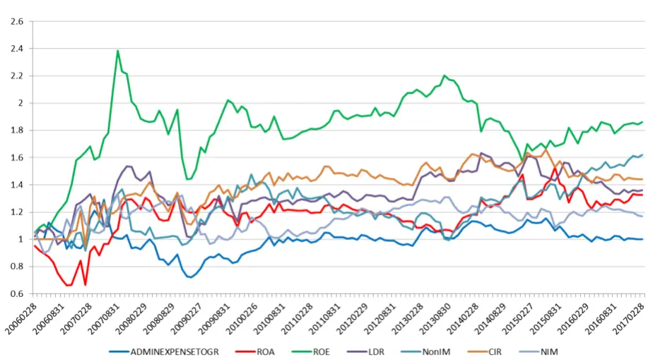

| 因子 | 多空方向 | 多空平均月收益 | IR | 年化收益 | 月最大回撤 | 多空胜率 | TOP8组合月单边换手率 (20101231以后) |
| --- | --- | --- | --- | --- | --- | --- | --- |
| ADMINEXPENSETOGR | 1 | 0.09% | 0.073 | 0.01% | -44.23% | 46.15% | 8.17% |
| ROA | -1 | -0.37% | -0.222 | 2.58% | -30.49% | 48.87% | 4.22% |
| ROE | 1 | 0.57% | 0.439 | 5.76% | -39.58% | 57.14% | 4.92% |
| LDR | 1 | 0.33% | 0.255 | 2.81% | -33.96% | 50.38% | 7.29% |
| NonlM | -1 | -0.47% | -0.354 | 4.74% | -32.55% | 56.00% | 4.91% |
| CIR | 1 | 0.39% | 0.279 | 3.58% | -22.05% | 51.20% | 8.19% |
| NIM | 1 | 0.20% | 0.171 | 1.41% | -27.47% | 51.13% | 9.88% |

数据来源：东方证券研究所 Wind 资讯

## 成长因子

成长性因子考量了营业收入同比增长率（YOYSALES）和净利润同比增长率（YOYNETPROFIT）这两个常见的成长性因子。

营业收入同比增长率（YOYSALES），营业收入同比增长率可以直观地反映企业本期取得的营业收入与上年同期数据对比取得的增长或下降幅度的大小，是经营情况好坏与否的一个直观反映。·由于很多企业处于不同的行业，其业务的经营带有很强的季节性，因此，简单按月或季度去比较营业收入并不客观，而营业收入同比增长率有效地剔除了这种季节性比较明显的企业按月或按季对比带来的偏颇，给企业营业收入的分析带来客观性。营业收入同比增长率越大，说明企业当期获得的营业收入相对去年同期增长越大，对企业盈利有正面影响。从结果来看，此因子多空组合的年化收益达到10.65%，月胜率60%，最大回撤-18.41%，整体的选股能力很强。

净利润同比增长率（YOYNETPROFIT），与营业收入同比增长率类似，净利润同比增长率也是企业经营情况好坏与否的一个直观反映。净利润同比增长率越大，说明企业当期获得的净利润相对去年同期增长越大，对企业盈利有正面影响。但是相比于营业收入，净利润受到其他因素影响过多，特别是较为主观的摊销成本等因素会对净利润产生较大的影响，因此整体来说，净利润同比增长率作为一个衡量企业成长性的因子，并没有营业收入同比增长率来的直观和客观。从结果来看，此因子多空组合的年化收益为7.56%，月胜率为53.4%，最大回撤为-18.92%，因子的选股能力较强，但从净值曲线可以看出此因子和营业收入同比增长率的相关性较高且选股效果相对较弱。

图 6：成长因子效果
多空组合净值
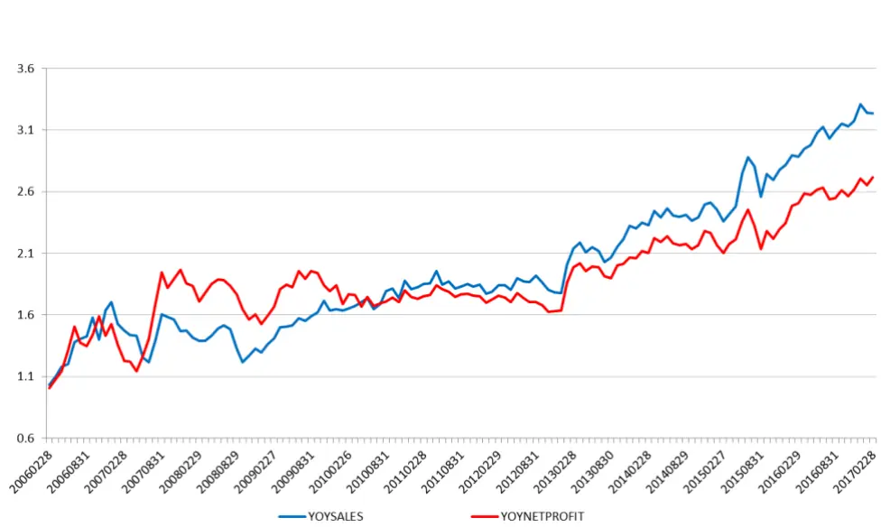

| 因子 | 多空方向 | 多空平均月收益 | IR | 年化收益 | 月最大回撤多空胜率 |  | TOP8组合月单边换手率 (20101231以后) |
| --- | --- | --- | --- | --- | --- | --- | --- |
| YOYSALES | 1 | 1.00% | 0.717 | 11.17% | -28.47% | 60.15% | 9.93% |
| YOYNETPROFIT | 1 | 0.88% | 0.592 | 9.44% | -28.02% | 53.40% | 10.23% |

数据来源：东方证券研究所 Wind 资讯

## 资本结构因子

资本结构因子考量了总盈利资产/总非盈利资产（IASSET2NIASSET）和贷款净值/总资产（LOAN2ASSET）这两个常见的或银行内的资本结构因子。

总盈利资产/总非盈利资产（IASSET2NIASSET），盈利资产是指能够直接为银行带来盈利的资产，包括贷款、短期投资、长期投资、拆放同业等资产。非盈利性资产指的是商业银行占用的不能生息的资产，具体包括应收利息、亏损、固定资产、库存现金、及其它项目中的在建工程、递延资产、拨付备付金、无形资产、兑付国债本息等。若此比率较高可能说明该银行更重视核心业务，若较低则可能说明了银行正被大量非盈利资产束缚，处于较弱的竞争地位，从而导致较低的资产回报率。然而从结果来看，此因子并没有选股能力。

贷款净值/总资产（LOAN2ASSET），贷款是一个银行最重要的资产，因此贷款净值在总资产中的比例高低直接决定了银行未来运营的健康程度。因子计算方法为（贷款总额-贷款损失准备）/总资产。然而从结果来看，此因子并没有选股能力。

图 7：资本结构因子效果
多空组合净值
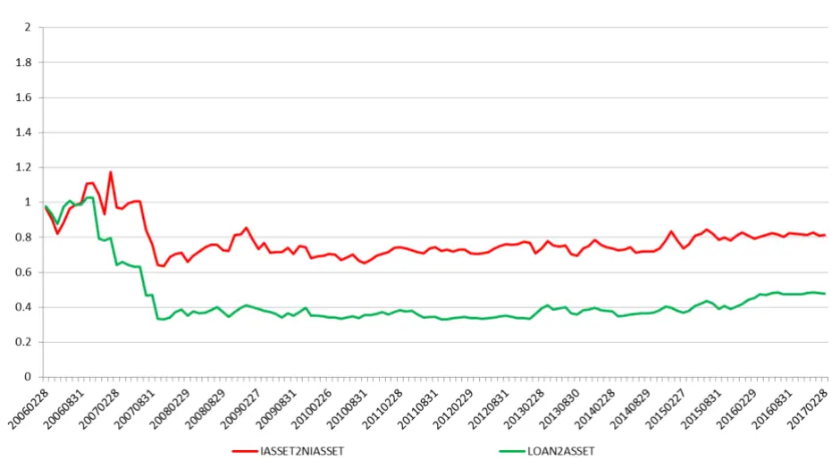

| 因子 | 多空方向 | 多空平均月收益 | IR | 年化收益 | 月最大回撤 | 多空胜率 | TOP8组合月单边换手率 (20101231以后) |
| --- | --- | --- | --- | --- | --- | --- | --- |
| IASSET2NIASSET | -1 | 0.02% | 0.013 | -1.85% | -45.79% | 56.39% | 3.83% |
| LOAN2ASSET | -1 | 0.36% | 0.214 | -6.42% | -67.79% | 54.14% | 4.54% |

数据来源：东方证券研究所 Wind 资讯

## 技术类因子

技术类因子采用因子库中的 17个技术类因子，测试结果可以看到，技术类因子普遍效果较差且换手率显著高于基本面因子，此外技术类因子除 ILLIQ 以外，空头端的收益基本都显著好于多头端，综合考虑以后我们可以认为技术类因子在银行内选股的效力很差。因此在针对银行股的建模中应该避免使用效果较差且高换手的技术类因子。

图 8：技术类因子效果

| 因子 | 多空方向 多空平均月收益 |  | TOP8组合月单边换手率 IR (20101231以后) |
| --- | --- | --- | --- |
| Ret1M | -1 | -0.49% | -0.269 47.92% |
| Ret3M | -1 | -0.33% -0.217 | 29.73% |
| PPReversal | -1 -0.47% | -0.312 | 33.90% |
| CGO_3M | -1 | -0.52% -0.361 | 35.18% |
| TO | -1 -0.46% | -0.282 | 12.14% |
| ILLIQ | 1 | 0.63% 0.343 | 14.62% |
| IVRFF | -1 | 0.00% -0.002 | 31.36% |
| IRFF | 1 | 0.35% 0.205 | 39.89% |
| AmountAvg_1M_3M | 1 | 0.00% 0.003 | 46.07% |
| AmountVol_1M_12M | -1 -0.53% | -0.585 | 32.32% |
| RealizedVolatility_3M | -1 -0.60% | -0.480 | 13.87% |
| RealizedVolatility_1Y | -1 -0.28% | -0.226 | 6.86% |
| MaxRet | 1 0.25% | 0.342 | 35.02% |
| 52-Week High | -1 -0.30% | -0.289 | 19.52% |
| Momentumave1M | -1 | -0.12% -0.134 | 50.64% |
| Momentumlast6M | -1 | -0.50% -0.463 | 29.72% |
| Momentumlast12M | -1 | -0.47% -0.479 | 18.24% |

数据来源：东方证券研究所 Wind 资讯

## 多因子模型

## 银行类因子能否产生额外收益？

根据上面列举的因子，我们以沪深 300 内银行股为样本空间构建月度调仓的多因子模型，基准为根据每月初沪深 300银行股权重计算的银行股全收益指数（未剔除分行）。组合的回测区间为 2011年 1 月 31 日到 2017 年 1 月 26 日，在这个时间区间上，沪深 300 的银行成分股数量始终保持在16支。回测的过程中，我们以第二天的 VWAP价格作为成交价，同时对停牌、涨停和跌停都做了相应的处理，交易成本为单边千分之三。

我们先选择比较常规的估值成长的 4 个因子构建的多因子模型，组合的对冲收益为 6.34%，IR 为1.28，整体的增强效果还是比较明显的（图 9）。

接着，我们在多因子模型中加入上述单因子表现较好的银行类因子，加入了银行专属因子的组合收益率和 IR比 2大类因子组合，但回撤较大（图 10）。

从整个历史来看，我们认为估值和成长两类因子组成的模型其实表现更加稳健。然而我们注意到 2大类因子模型 2016 年以来略有回撤，这是因为估值类因子在 2016 年以后表现不佳（图 3），我们分析了原因后认为这是由于整体经济表现不佳，所以整个银行的信贷成本率提升（图 11），导致投资者对于银行的资产质量重视程度提高，而大多数低估值银行资产质量不高，因此带来了较大的回撤。我们认为后续的经济难有大的起色且银行的监管将逐渐加强，所以加入了银行专属因子的组合相对而言更加适合当前和未来的经济状态。

年化对冲收益 IR 最大回撤 月胜率 跟踪误差 月均单边换手率 月均持股数7.52%1.33 -7.45% 62.50% 5.55%23.31%7.14

图 9：2大类因子模型收益情况
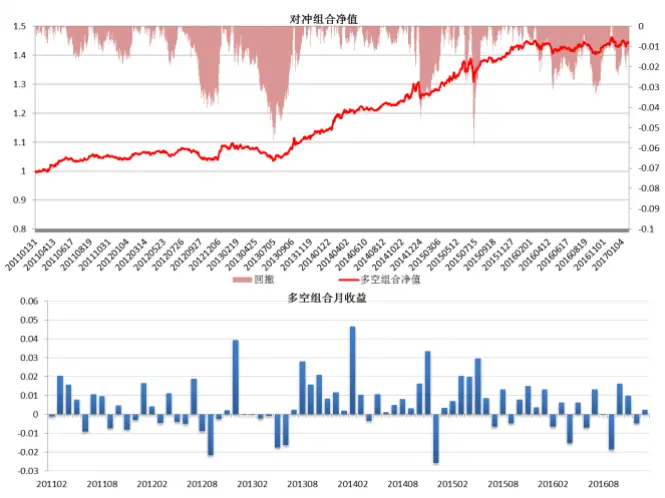
年化对冲收益 IR 最大回撤 月胜率 跟踪误差月均单边换手率 月均持股数6.34%1.28 -5.85% 62.50% 4.91%18.86%7.83
数据来源：东方证券研究所

图 10：3大类因子模型收益情况
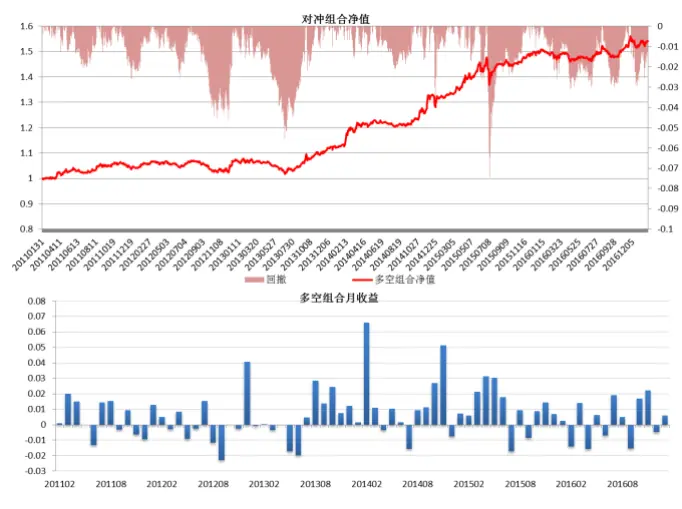
数据来源：东方证券研究所

除此之外，我们也可以看到，组合在 2013年前增强收益并没有 13-15年那么多，这是因为之前年份银行股月收益率的截面标准差（dispersion）较低(图 12)，alpha 模型的预期收益率大小直接和截面标准差成正比，因此在截面标准差较低的区间增强组合收益较低。

图 11：信贷成本率变化
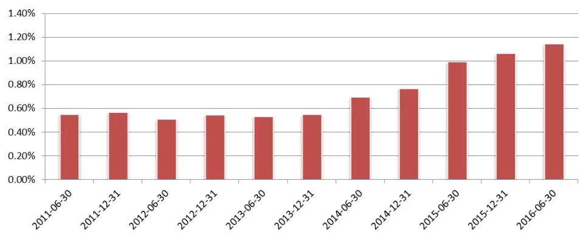
数据来源：东方证券研究所 Wind 资讯

图 12：6 个月滚动平均的银行内 dispersion
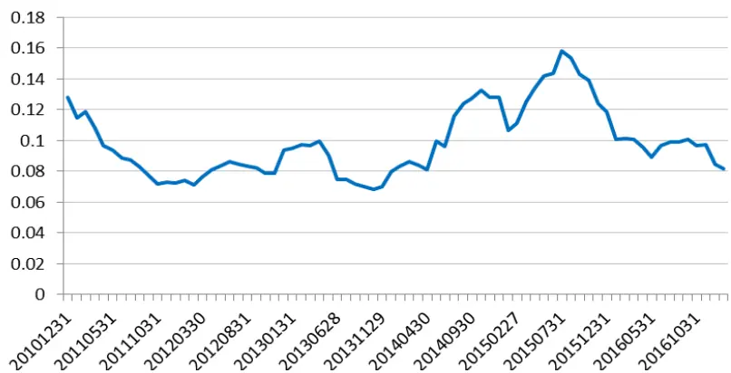
数据来源：东方证券研究所 Wind 资讯

## 银行单独建模的优势

我们构建了沪深 300成分内增强组合(组合费率为单边千分之 3)，组合优化的时候控制了银行、非银和地产的行业权重中性。图 16 为该模型从 2011.1.31-2017.1.26 的表现情况，组合的年化对冲收益为 9.16%，IR为 1.6，整体表现不错。

图 13：沪深 300成分内指数增强组合
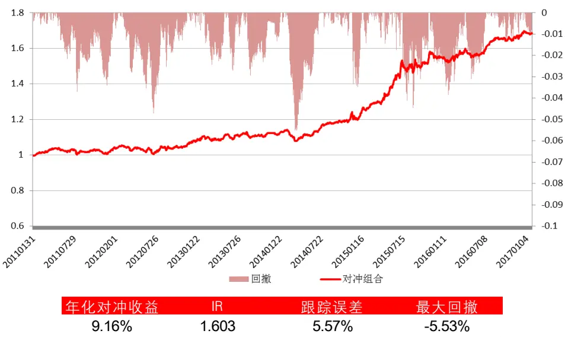
数据来源：东方证券研究所 Wind 资讯

我们把上述沪深 300组合的银行部分单独提取出来，以沪深 300银行业全收益指数作为基准得到了图 17 的对冲组合收益，可以很明显的看到，常规的整体建模方法虽然整体表现表现不错，但是银行内部的表现其实很差，年化收益仅为 0.4%，且最大回撤有 10.43%，换手率高达 37%。这就是说，常规的整体建模的方法对于某些特质性高的细分行业增强的效果是很差的，甚至还不如直接按照指数的权重来持有行业内的股票。而我们的 2大类因子细分模型，在跟踪误差相近的情况下能得到年化 6.34%的对冲收益，3大类因子模型的年化对冲收益有 7.52%，远好于整体建模的结果，且换手率也显著较低。

图 14：常规指数增强组合银行部分收益情况
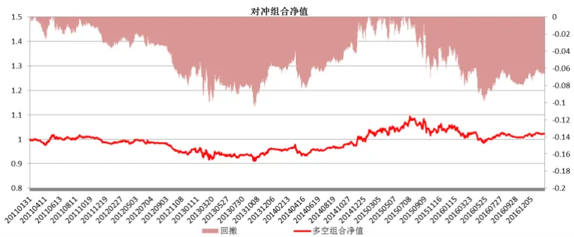

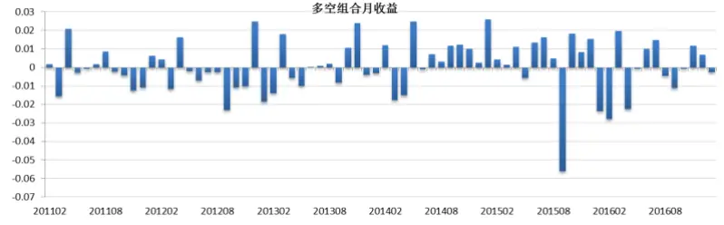
年化对冲收益 IR 最大回撤 月胜率 跟踪误差 月均单边换手率 月均持股数0.40%0.10 -10.43% 51.39%5.62%37.58%8.24
数据来源：东方证券研究所 Wind 资讯

从 2011 年以来，银行在沪深 300 指数的平均权重接近 20%，若细分建模相比于传统整体建模的方法还能再提高年化 5%左右的收益，那么整体的组合收益可以提高 1%左右。此外，银行的整体分红率较高且银行内的全收益指数包含了分红的收益，因此实际上指数增强组合相比于沪深 300内的银行部分会有更强的增强效果。

## 总结

本篇报告研究了银行内的选股因子的单因子效果，长期来看，EP2TTM、BPTTM、NPL、NPC、CCAR、YOYSALES、YOYNETPROFIT、EQUITY RATIO 这几个因子表现较好。据此我们分别建立了仅采用估值成长类因子和加入了风险监管类因子的银行内增强组合，综合来看，由于最近经济下行压力较大且银行监管压力增大，所以加入了风险监管类因子的组合相对而言更好，该组合组合的年化对冲收益为 7.52%，IR 为 1.33。

常规的建立沪深 300 增强组合的方法并不能对银行内股票很好的建模，虽然整个沪深 300 增强组合表现不错，但是其中的银行内组合表现很差，不但基本没有超额收益，最大回撤也很大。因此，对银行单独建模是有必要且可行的。在相同的跟踪误差条件下，单独建模的银行组合年化收益高于常规建模组合 6%左右，最大回撤也大幅降低，鉴于银行在沪深 300指数内的高权重，对银行的分块建模大约能提升沪深 300 增强组合收益 0.5%-1%，且最大回撤也可以有一定程度的降低。此外，银行的整体分红率较高(每年大约 3%-4%)且银行内的全收益指数包含了分红的收益，因此实际上指数增强组合相比于沪深 300内的银行部分会有更强的增强效果。

## 风险提示

- 极端市场环境可能对模型效果造成剧烈冲击，导致收益亏损。

- 量化模型基于历史数据分析得到，未来存在失效风险，建议投资者紧密跟踪模型表现。

## 分析师申明

每位负责撰写本研究报告全部或部分内容的研究分析师在此作以下声明：

分析师在本报告中对所提及的证券或发行人发表的任何建议和观点均准确地反映了其个人对该证券或发行人的看法和判断；分析师薪酬的任何组成部分无论是在过去、现在及将来，均与其在本研究报告中所表述的具体建议或观点无任何直接或间接的关系。

## 投资评级和相关定义

报告发布日后的 12个月内的公司的涨跌幅相对同期的上证指数/深证成指的涨跌幅为基准；

## 公司投资评级的量化标准

买入：相对强于市场基准指数收益率15%以上；

增持：相对强于市场基准指数收益率5%～15%；

中性：相对于市场基准指数收益率在-5%～+5%之间波动；

减持：相对弱于市场基准指数收益率在-5%以下。

未评级——由于在报告发出之时该股票不在本公司研究覆盖范围内，分析师基于当时对该股票的研究状况，未给予投资评级相关信息。

暂停评级——根据监管制度及本公司相关规定，研究报告发布之时该投资对象可能与本公司存在潜在的利益冲突情形；亦或是研究报告发布当时该股票的价值和价格分析存在重大不确定性，缺乏足够的研究依据支持分析师给出明确投资评级；分析师在上述情况下暂停对该股票给予投资评级等信息，投资者需要注意在此报告发布之前曾给予该股票的投资评级、盈利预测及目标价格等信息不再有效。

## 行业投资评级的量化标准：

看好：相对强于市场基准指数收益率5%以上；

中性：相对于市场基准指数收益率在-5%～+5%之间波动；

看淡：相对于市场基准指数收益率在-5%以下。

未评级：由于在报告发出之时该行业不在本公司研究覆盖范围内，分析师基于当时对该行业的研究状况，未给予投资评级等相关信息。

暂停评级：由于研究报告发布当时该行业的投资价值分析存在重大不确定性，缺乏足够的研究依据支持分析师给出明确行业投资评级；分析师在上述情况下暂停对该行业给予投资评级信息，投资者需要注意在此报告发布之前曾给予该行业的投资评级信息不再有效。

## 免责声明

本证券研究报告（以下简称“本报告”）由东方证券股份有限公司（以下简称“本公司”）制作及发布。

本报告仅供本公司的客户使用。本公司不会因接收人收到本报告而视其为本公司的当然客户。本报告的全体接收人应当采取必要措施防止本报告被转发给他人。

本报告是基于本公司认为可靠的且目前已公开的信息撰写，本公司力求但不保证该信息的准确性和完整性，客户也不应该认为该信息是准确和完整的。同时，本公司不保证文中观点或陈述不会发生任何变更，在不同时期，本公司可发出与本报告所载资料、意见及推测不一致的证券研究报告。本公司会适时更新我们的研究，但可能会因某些规定而无法做到。除了一些定期出版的证券研究报告之外，绝大多数证券研究报告是在分析师认为适当的时候不定期地发布。

在任何情况下，本报告中的信息或所表述的意见并不构成对任何人的投资建议，也没有考虑到个别客户特殊的投资目标、财务状况或需求。客户应考虑本报告中的任何意见或建议是否符合其特定状况，若有必要应寻求专家意见。本报告所载的资料、工具、意见及推测只提供给客户作参考之用，并非作为或被视为出售或购买证券或其他投资标的的邀请或向人作出邀请。

本报告中提及的投资价格和价值以及这些投资带来的收入可能会波动。过去的表现并不代表未来的表现，未来的回报也无法保证，投资者可能会损失本金。外汇汇率波动有可能对某些投资的价值或价格或来自这一投资的收入产生不良影响。那些涉及期货、期权及其它衍生工具的交易，因其包括重大的市场风险，因此并不适合所有投资者。

在任何情况下，本公司不对任何人因使用本报告中的任何内容所引致的任何损失负任何责任，投资者自主作出投资决策并自行承担投资风险，任何形式的分享证券投资收益或者分担证券投资损失的书面或口头承诺均为无效。

本报告主要以电子版形式分发，间或也会辅以印刷品形式分发，所有报告版权均归本公司所有。未经本公司事先书面协议授权，任何机构或个人不得以任何形式复制、转发或公开传播本报告的全部或部分内容。不得将报告内容作为诉讼、仲裁、传媒所引用之证明或依据，不得用于营利或用于未经允许的其它用途。

经本公司事先书面协议授权刊载或转发的，被授权机构承担相关刊载或者转发责任。不得对本报告进行任何有悖原意的引用、删节和修改。

提示客户及公众投资者慎重使用未经授权刊载或者转发的本公司证券研究报告，慎重使用公众媒体刊载的证券研究报告。

## 东方证券研究所

地址：上海市中山南路 318 号东方国际金融广场 26 楼

联系人： 王骏飞

电话：021-63325888*1131

传真：021-63326786

网址： www.dfzq.com.cn

Email： wangjunfei@orientsec.com.cn