## 研究结论

去年底至今，得益于南下资金的注入，以及经济复苏的预期，恒生综指涨幅已超过 10%，低估值、高股息的优质港股吸引了全球投资者前来配臵，随着沪港通、深港通的相继开放，港股与 A股的关系日益紧密，两地投资者可以更加便捷地投资对方的股市，研究因子选股模型在港股的应用能产生直接的投资收益。

我们分别在恒生综指和港股通成分股内进行了 7 大类 23 个 Alpha 因子的有效性检验，和美股类似，估值、盈利、成长因子在港股中都比较显著，IC 在3%左右，流动类因子中的 AmountAvg_1M_3M（过去一个月日均成交额/过去三个月日均成交额）表现优异，特别是在港股通成分股当中，夏普比率最高 0.99，十分稳健。

在港股中我们也检测出了一个月反转效应，IC 为-3.28%，但是 A 股的一个月反转因子 IC 能够达到-8%左右，另外我们也检测了港股的动量效应，与美股类似，港股在 3-12 个月都存在显著的动量效应，并且组合相对稳健，并没有美股的动量崩盘现象。而 A股并不存在月度的动量效应。

A 股偏小市值的市场风格十分显著，而港股的大市值股票表现更好，IC 为4.18%，这是因为港股以机构和海外投资者为主导，海外投资者往往通过配臵港股来分散风险，所以低估值、盈利能力强的蓝筹股备受青睐。

最后我们构建了主动量化组合和多空对冲组合，总的来看港股的Alpha 空间不大，除了估值大类因子，其他大类因子很难获得超额收益。年初至今，A股估值类因子持续强劲，规模因子、技术反转因子效用衰减，综合我们在美股和港股中的多因子研究，加强基本面因子的研究十分必要。

## 风险提示

- 量化模型失效风险

- 市场极端环境的冲击

恒生综指成分股内单因子检测结果

| 于尔 | x均值 | 堆 | JC_JR | 多空组合 月均收益 | 多空组合 月脏率 | 多空组合 是大回位 | 多空组合 年化收益率 | 多空组合 豆苗比李 |
| --- | --- | --- | --- | --- | --- | --- | --- | --- |
| BP_LF | 273% | 3.89 | 101 | 101% | 63.69% | 21.20% | 1213% | 1.05 |
| EP_TTIM | 283% | 4.43 | 113 | 0.64% | 56.42% | 2142% | 7.37% | 0.70 |
| SP_TTM | -1.72% | -228 | -0.59 | 0.93% | 59.22% | 20.41% | 10.95% | 0.86 |
| CFP_TTM | 276% | 5.02 | 130 | 0.54% | 60.34% | 27.43% | 6.17% | 0.60 |
| SaksZEV | -1.50% | -260 | -0.67 | 0.79% | 54.19% | 18.13% | 9.30% | 0.81 |
| ROA | 2.80% | 4.06 | 103 | 0.38% | 39.78% | 17.9% | 4.17% | 0.38 |
| ROE | 275% | 4.31 | 112 | 0.45% | 60.34% | 16.39% | .07% | 0.48 |
| GrassMargin | 216% | 3.72 | 0.9%6 | 0.36% | 58.10% | 23.04% | 3.92% | 0.38 |
| SakesGrowth_Qr_VOY | 113% | 1.87 | 0.50 | 0.33% | 33.36% | 29.83% | 3.68% | 0.36 |
| ProfnGrowth_Qr_vOY | 249% | 4.17 | 110 | 0.36% | 56.14% | 20.37% | 3.70% | 0.35 |
| aCFGrowth_YOY | 204% | 3.07 | 0.80 | 0.54% | 64.41% | 13.57% | 6.15% | 0.64 |
| AssetTumover | 185% | 3.50 | 0.91 | 0.45% | 16.98% | 2210% | 3.10% | 0.3Z |
| DebtzAsset | 0.49% | -0.65 | -0.17 | -0.3.3% | 46.37% | >6.02% | 4.37% | -0.42 |
| TO_1M4 | 0.02% | -0.02 | -0.01 | 0.36% | 50.28% | 2138% | 3.36% | 0.26 |
| JLUQ | 0.82% | -0.83 | -0.21 | -0.20% | 50.28% | 60.83% | -3.36% | -0.21 |
| AmountAvg_1M_3M | 177% | 3.09 | 0.80 | 0.67% | 62.01% | 16.02% | 7.86% | 0.81 |
| Ret1 M | -1.33% | -168 | -0.43 | 0.39% | 31.96% | 40.28% | 3.78% | 0.27 |
| Mom entumLast6M | 18Z% | 1.70 | 0.44 | 0.35% | 59.78% | >227% | 2.78% | 0.20 |
| Mom entumave1 M | 3.28% | -3.67 | -0.93 | 0.74% | 56.42% | 28.83% | 8.14% | 0.55 |
| PPReversal | 0.73% | 0.73 | 0.19 | 0.23% | 55.87% | 48.22% | 147% | 0.12 |
| CGO_3M | 0.50% | -0.54 | -0.14 | 0.06% | 50.Z9% | 58.73% | -0.31% | -0.02 |
| RealiedVoatility_3M | -2.92% | -233 | -0.6> | 0.09% | >1.40% | $3.02% | -0.39% | 0.01 |
| MaxRet | 2.04% | -247 | -0.64 | 0.38% | 55.87% | 33.65% | 3.91% | 0.31 |

报告发布日期2017 年 04 月 26 日

证券分析师 朱剑涛

021-63325888*6077

zhujiantao@orientsec.com.cn

执业证书编号：S0860515060001

联系人邱蕊

021-63325888*5091

qiurui@orientsec.com.cn

相关报告

| 细分行业建模之银行内因子研究 | 2017-04-25 2017-04-09 |
| --- | --- |
| 反转因子失效市场下的量化策略应对 |  |
| 中美市场因子选股效果对比分析 | 2017-03-06 |
| 组合优化是与非 | 2017-03-06 |
| 动态情景 Alpha 模型再思考 技术类新 Alpha 因子的批量测试 | 2017-02-17 |
|  | 2017-02-17 |

在《中美市场因子选股效果对比分析》报告中，我们发现估值、盈利、成长这些偏基本面的选股因子在美股中十分显著，低估值、高盈利、快成长的股票能够在美股中获得一定的 Alpha，这给 A股的多因子研究提供了前瞻性的参考，除了美股，随着沪港通和深港通的先后开放，港股和 A股的关系更加紧密，行情联动性加强，所以此时研究多因子在港股中的应用十分必要。

## 一、 港股基本概况

港股在亚洲地区历史十分悠久，至今已有 100 多年的发展史，早年香港作为国际金融与贸易中心，经济快速增长，外资不断涌入，股市也蓬勃发展，但是股市的暴涨和过度投机与实体经济并不匹配，因此港股在1973 年遭遇了暴跌，不过随着四大交易所的联合，众多金融法案的出台与完善，港股的国际地位不断提高，逐步稳固发展，特别是到了 90 年代初，随着中国大陆的改革开放，大陆雄厚的劳动力与香港有效的生产技术与管理效力相结合，大大促进了香港的经济发展，股市持续繁荣，但是后来的 1997 年亚洲金融危机以及 2008 年的全球金融危机，都让处于国际中心的港股遭遇了重挫，08 年后至今，香港经济增速放缓，股市也持续震荡。

和当前 A股市场对比来看，港股和美股有很多相似之处，具备以下特点：

1. 机构投资者主导，海外投资者占比大。 由下图可知，近几年，沪市投资者当中个人投资者成交占比在 85%左右，专业机构成交占比在 10%-15%，持股市值方面 07/08 年个人持股市值占比非常高超过 40%，近年有所下降稳定在 20%-25%，而机构投资者持股市值只有 15%左右，A 股的个人投资者持股市值虽然占比不算高，但却贡献了大多数的交易量。反观港股，和美股相似，以机构投资者主导，机构投资者交易占比在 50%-70%，特别是境外投资者占比很大，达到 30%-45%，这得益于港股国际金融中心的地位。

图 1：沪市投资者交易占比
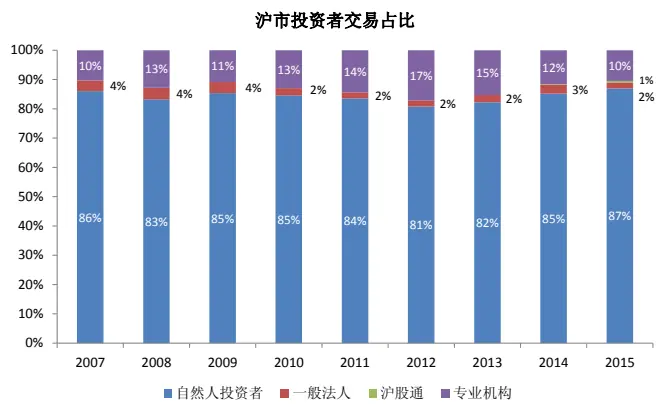
数据来源：东方证券研究所 & 上海证券交易所

图 2：沪市投资者持股市值占比
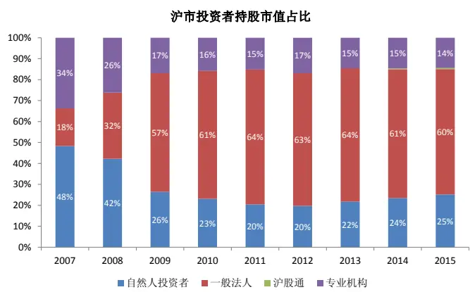
数据来源：东方证券研究所 & 上海证券交易所

图3：港股投资者交易占比
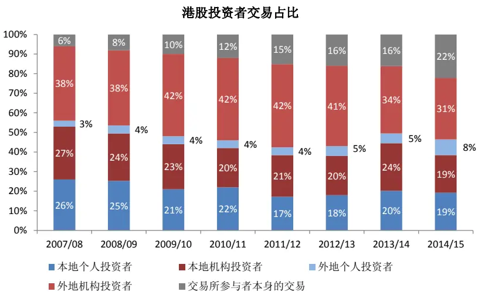
数据来源：东方证券研究所 & 香港证券交易所

2. 换手率低。在之前报告中我们发现美股市场整体换手率在 1.5 倍左右，A股的换手率通常在 2到 3 倍，2015 年甚至达到 6 倍，港股的换手率跟美股类似，总体来说比较低，接近 1 倍，这与其机构主导的市场特征有关。

图4：港股与A 股市场整体换手率
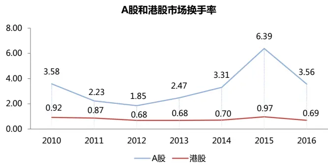
数据来源：东方证券研究所 & Wind资讯 & 香港证券交易所

3. 估值水平整体偏低。如下图所示，可以看到在不同的市值分布中，港股的 PE中位数没有特别大的区别，都在 10-14 的区间，超大票和超小票的估值中位数基本一致，而 A 股的 PE 中位数明显随着市值的减小而上升，超大票的 PE 中位数为 15.15，超小票的 PE 中位数为 74.22，并且大多数股票都少于 100 亿元，A股市场显然估值偏高，相对港股存在一定的泡沫。

图5：港股与 A 股市值与 PE分布（2016 年底数据）

| 市值分布（亿元） | 港股(港币) |  |  | A股（人民币） |  |
| --- | --- | --- | --- | --- | --- |
|  | 个数 | 占比 | PE中位数 | 个数 占比 | PE中位数 |
| >800 | 85 | 12.6% | 10.43 | 75 2.5% | 15.15 |
| 400-800 | 84 | 12.5% | 13.29 | 108 3.6% | 27.73 |
| 100-400 | 193 | 28.7% | 11.85 | 1064 35.3% | 44.17 |
| 50-100 | 157 | 23.4% | 13.58 | 1262 41.9% | 57.68 |
| 30-50 | 153 | 22.8% | 10.47 | 504 16.7% | 74.22 |

数据来源：东方证券研究所 & Wind资讯 & 香港证券交易所

4.易受其他市场的干扰。香港是亚太金融中心，作为高度开放的资本市场，港股的核心投资者来自于全球各地，这也导致了港股容易受到其他股票市场的影响，带来波动，如下图所示，根据几个指数的月收益率计算了不同时间段美股、港股、A股的相关系数，总体来看美股和港股的相关性大于 A股和港股的相关性，特别是 08 年金融危机期间，美股和港股的相关性上升到0.73，不过最近 5 年港股和 A股的相关性明显上升，特别是恒生国企与港股通和 A股的相关性均超过 0.7。

图6：美股、港股、A 股在不同时段的相关系数（月频）

|  | 2005-2016 | 2007-2009 | 2012-2016 | 2014-2016 |
| --- | --- | --- | --- | --- |
| 罗素3000 VS 恒生综指 | 0.69 | 0.73 | 0.58 |  |
| 中证全指 VS 恒生综指 | 0.56 | 0.55 | 0.63 |  |
| 中证全指 VS 罗素3000 | 0.34 | 0.39 | 0.31 |  |
| 中证全指 VS 恒生国企 | 0.59 | 0.55 | 0.70 |  |
| 中证全指 VS 港股通 |  |  |  | 0.79 |

数据来源：东方证券研究所 & Wind资讯

## 二、 港股因子绩效检验

## 2.1 因子检测说明

我们分别对恒生综指和港股通的成分股进行因子检测，恒生综指按流通市值排序，选出前95%的市值，而沪港通、深港通的先后开放，使得大陆投资者能够直接投资部分港股，所以检测 Alpha因子在港股通成分股里的效果也十分必要。

因子测试区间为2002.01-2016.12，我们对原始因子值进行了一系列的数据处理，包括Boxplot方法去极值，对少数因子进行正态转换，用行业中位数填补缺失值，对市值和行业虚拟变量回归取残差来保持 Alpha 因子的市值和行业中性，最后得到标准化的 zscore。

我们分别检测单个因子的绩效以及等权合成的大类因子的绩效，根据 IC，IC_IR，多空组合年化收益率，多空组合最大回撤，多空组合月胜率，多空组合夏普比率等指标综合考察因子效用情况，值得注意的是检测因子效用的多空组合我们分成了 5 组，这里不考虑交易费用、停牌、融券等问题，不过我们会在第四章节中考虑这些因素，建立贴近实际交易的多空组合。

图 7：因子定义与说明

|  | 因子简称 | 因子全名 |
| --- | --- | --- |
| 估值 Value | BP_LF | Newest Book Value/Market Cap |
|  | EP_TTM | TTM earnings/ MarketCap |
|  | SP_TTM | TTM Sales/ Market Cap |
|  | CFP_TTM | TTM Operating Cash Flow / Market Cap |
|  | Sales2EV | 营业收入_TTM/(总市值+非流动负债合计_最新财报-货币资金_最新财报) |
| 盈利能力 Profit | ROA | 总资产收益率 |
|  | ROE | 净资产收益率 |
|  | GrossMargin | 销售毛利率 |
| 成长 Growth | SalesGrowth_Qr_YOY | 营业收入增长率(季度同比） |
|  | ProfitGrowth_Qr_YOY | 净利润增长率（季度同比） |
|  | OCFGrowth_YOY | 经营现金流增长率（同比） |
| 营运质量 Operation | AssetTurnover | 总资产周转率 |
|  | Debt2Asset | 债务资产比例 |
| 流动性 Liquidity | TO_1M | 以流通股本计算的1个月日均换手率 |
|  | ILLIQ | 每天一个亿成交量能推动的股价涨幅 |
|  | AmountAvg_1M_3M | 过去一个月日均成交额/过去三个月日均成交额 |
| 技术反转 Tech&Reverse | Ret1M | 1个月收益反转 |
|  | Momentumlast6M | 复权收盘价/复权收盘价_6月前-1 |
|  | Momentumave1M | 股价相比最近1个月均价涨幅 |
|  | PPReversal | 乒乓球反转因子 |
|  | CGO_3M |  |
| 其他 Other | RealizedVolatility_3M | Capital Gains Overhang (3M) 过去三个月日收益率数据计算的标准差 |
|  | MaxRet | 上月最大日收益 |

资料来源：东方证券研究所

## 2.2 绩效检测结果

## 2.2.1 恒生综指成分股

图 8：恒生综指成分股大类因子&单因子检测结果

| 因子简称 | IC均值 | 值 | IC_IR | 多空组合 月均收益 | 多空组合 月胜率 | 多空组合 最大回撤 | 多空组合 年化收益率 | 多空组合 夏普比率 |
| --- | --- | --- | --- | --- | --- | --- | --- | --- |
| Value | 3.33% | 4.24 | 1.10 | 0.94% | 60.34% | 24.95% | 11.07% | 0.89 |
| Profit | 2.76% | 4.16 | 1.08 | 0.45% | 55.31% | 13.77% | 5.05% | 0.46 |
| Growth | 2.77% | 4.26 | 1.13 | 0.50% | 62.35% | 41.49% | 4.51% | 0.35 |
| Operation | 1.50% | 2.09 | 0.54 | 0.13% | 58.10% | 30.92% | 0.93% | 0.06 |
| Liquidity | 2.60% | 4.07 | 1.05 | 0.70% | 62.57% | 16.50% | 8.20% | 0.76 |
| Tech&Reverse | 5.74% | 5.58 | 1.45 | 1.01% | 66.48% | 39.75% | 11.43% | 0.73 |
| Other | 2.84% | 2.68 | 0.70 | 0.18% | 50.28% | 48.03% | 0.96% | 0.08 |
| 因子简称 | IC均值 | t值 | IC_IR | 多空组合 月均收益 | 多空组合 月胜率 | 多空组合 最大回撤 | 多空组合 年化收益率 | 多空组合 夏普比率 |
| BP_LF | 2.73% | 3.89 | 1.01 | 1.01% | 63.69% | 25.20% | 12.13% | 1.05 |
| EP_TTM | 2.83% | 4.43 | 1.15 | 0.64% | 56.42% | 21.42% | 7.37% | 0.70 |
| SP_TTM | -1.72% | -2.28 | -0.59 | 0.93% | 59.22% | 20.41% | 10.95% | 0.86 |
| CFP_TTM | 2.76% | 5.02 | 1.30 | 0.54% | 60.34% | 27.43% | 6.17% | 0.60 |
| Sales2EV | -1.80% | -2.60 | -0.67 | 0.79% | 54.19% | 18.13% | 9.30% | 0.81 |
| ROA | 2.80% | 4.06 | 1.05 | 0.38% | 59.78% | 17.96% | 4.17% | 0.38 |
| ROE | 2.75% | 4.31 | 1.12 | 0.45% | 60.34% | 16.39% | 5.07% | 0.48 |
| GrossMargin | 2.16% | 3.72 | 0.96 | 0.36% | 58.10% | 25.04% | 3.92% | 0.38 |
| SalesGrowth_Qr_YOY | 1.13% | 1.87 | 0.50 | 0.35% | 55.56% | 29.83% | 3.68% | 0.36 |
| ProfitGrowth_Qr_YOY | 2.49% | 4.17 | 1.10 | 0.36% | 56.14% | 20.37% | 3.70% | 0.35 |
| OCFGrowth_YOY | 2.04% | 3.07 | 0.80 | 0.54% | 64.41% | 13.57% | 6.15% | 0.64 |
| AssetTurnover | 1.85% | 3.50 | 0.91 | 0.45% | 56.98% | 22.10% | 5.10% | 0.52 |
| Debt2Asset | -0.49% | -0.65 | -0.17 | -0.33% | 46.37% | 56.02% | -4.57% | -0.42 |
| TO_1M | -0.02% | -0.02 | -0.01 | 0.36% | 50.28% | 21.38% | 3.56% | 0.26 |
| ILLIQ | -0.82% | -0.83 | -0.21 | -0.20% | 50.28% | 60.83% | -3.56% | -0.21 |
| AmountAvg_1M_3M | 1.77% | 3.09 | 0.80 | 0.67% | 62.01% | 16.02% | 7.86% | 0.81 |
| Ret1M | -1.55% | -1.68 | -0.43 | 0.39% | 51.96% | 40.28% | 3.78% | 0.27 |
| Momentumlast6M | 1.82% | 1.70 | 0.44 | 0.35% | 59.78% | 52.27% | 2.78% | 0.20 |
| Momentumave1M | -3.28% | -3.67 | -0.95 | 0.74% | 56.42% | 28.83% | 8.14% | 0.55 |
| PPReversal | 0.73% | 0.73 | 0.19 | 0.23% | 55.87% | 48.22% | 1.47% | 0.12 |
| CGO_3M | -0.50% | -0.54 | -0.14 | 0.06% | 50.29% | 58.73% | -0.31% | -0.02 |
| RealizedVolatility_3M | -2.92% | -2.53 | -0.65 | 0.09% | 51.40% | 55.02% | -0.39% | 0.01 |
| MaxRet | -2.04% | -2.47 | -0.64 | 0.38% | 55.87% | 33.65% | 3.91% | 0.31 |

资料来源：东方证券研究所 & Wind资讯

如上表所示，从大类因子检测结果来看，港股和美股相似，偏基本面的因子效用明显，估值大类因子 IC 为3.33%，多空组合夏普比率最高 0.89，其中 BP_LF的夏普比率最高 1.05，EP_TTM的 IC 最高 2.83%，CFP_TTM的 IC_IR 最高 1.30；盈利大类因子的 IC 为 2.76%，最大回撤是最小的 13.77%，其中 ROA，ROE，GrossMargin 三个因子表现都比较显著；成长性大类因子的 IC为 2.77%，其中净利润和经验现金流同比增长效用明显；运营能力中 AssetTurnover 相对显著。

之前在《中美市场因子选股效果对比分析》的报告中我们就分析过，由于 A股是以散户为主导的投资者结构，羊群效应明显，金融监管与法案都不完善，股票只进不出，市场换手率较高、投机性较强，所以规模因子、换手率因子以及技术反转因子在 A 股的历史表现中非常优异。而港股和美股的投资理念和投资者结构非常类似，都是以机构投资者主导，港股对于经济基本面的反映非常灵敏，随着经济变暖，企业盈利转好，港股就会以上涨来反映基本面的变化，并且在全球范围内，港股的估值长期偏低，安全边际高，海内外投资者都偏好持有低估值、盈利能力强的蓝筹股。

流动性大类因子 IC 为 2.60%，夏普比率较高 0.76，单个因子来看 TO_1M和ILLIQ均没有通过 t检验，但是 AmountAvg_1M_3M（过去一个月日均成交额/过去三个月日均成交额）表现优异，港股市场流动性相对较低，换手率也不高，如果最近一个月流动性相对最近三个月有明显好转，说明股票收到了市场的关注，那么股票下期上涨的概率比较大。 而在 A 股这个因子的符号是负的，这主要是因为 A股以散户投资者为主导，投机现象严重，高换手往往预示着股价的反转下跌。

技术反转大类因子效用十分明显，IC 为5.74%，是所有大类因子中最高的，年化收益率也是最高 11.43%，但是不同于 A股显著的反转效应，港股只有 Momentumave1M（股价相对于最近一个月均价涨幅）是显著有效的，IC 为-3.28%，说明港股在短期一个月内是存在反转效应的，其他测量中长期反转的因子均没有通过 5%的 t检验，这个结果跟美股十分类似，因此我们怀疑港股是否像美股一样存在中长期的动量效应，我们根据《中美市场因子选股效果对比分析》报告中介绍的检测动量效应的方法在港股当中进行检验，剔除了最近一个月的收益，用前面 M 个月的股票收益率作为因子值，观察 N 个月持有期的股票收益率，M和 N 分别取 1、3、6、9、12 个月进行交叉验证，检测结果如下：

图 9：恒生综指成分股动量效应检测结果

| RP(m) | HP(n) | 月度IC值 | t值 | IC_IR | 多空组合 月均收益 | 多空组合 月胜率 | 多空组合 最大回撤 | 多空组合 年化收益率 | 多空组合 夏普比率 |
| --- | --- | --- | --- | --- | --- | --- | --- | --- | --- |
| 1 | 1 | 0.37% | 0.34 | 0.09 | 0.03% | 55.69% | 55.00% | -1.00% | -0.04 |
| 1 | 3 | 0.66% | 1.13 | 0.31 | 0.51% | 59.39% | 33.21% | 4.80% | 0.33 |
| 1 | 6 | 1.16% | 2.97 | 0.81 | 0.82% | 59.26% | 29.27% | 8.53% | 0.53 |
| 1 | 9 | 0.89% | 2.60 | 0.71 | 0.54% | 55.56% | 26.19% | 5.14% | 0.38 |
| 1 | 12 | 0.85% | 2.85 | 0.79 | 0.64% | 60.26% | 26.76% | 6.12% | 0.42 |
| 3 | 1 | 1.84% | 1.57 | 0.42 | 0.28% | 58.08% | 40.21% | 1.80% | 0.17 |
| 3 | 3 | 1.68% | 2.71 | 0.73 | 0.44% | 60.61% | 45.69% | 3.95% | 0.24 |
| 3 | 6 | 1.90% | 3.98 | 1.08 | 0.38% | 56.17% | 50.34% | 3.26% | 0.28 |
| 3 | 9 | 1.86% | 4.33 | 1.19 | 0.92% | 60.49% | 28.28% | 9.86% | 0.67 |
| 3 | 12 | 1.31% | 3.58 | 0.99 | 0.27% | 58.97% | 57.01% | 1.75% | 0.15 |
| 6 | 1 | 3.53% | 2.72 | 0.73 | 0.64% | 62.28% | 54.97% | 5.75% | 0.35 |
| 6 | 3 | 2.63% | 3.37 | 0.91 | 0.85% | 64.24% | 54.96% | 8.53% | 0.51 |
| 6 | 6 | 2.46% | 4.14 | 1.13 | 0.63% | 61.11% | 59.98% | 5.63% | 0.39 |
| 6 | 9 | 2.02% | 4.18 | 1.15 | 0.96% | 64.81% | 61.20% | 9.71% | 0.60 |
| 6 | 12 | 1.18% | 2.95 | 0.82 | 0.38% | 58.97% | 63.96% | 2.86% | 0.22 |
| 9 | 1 | 3.46% | 2.40 | 0.64 | 0.39% | 59.88% | 71.82% | 2.11% | 0.19 |
| 9 | 3 | 3.00% | 3.50 | 0.94 | 0.86% | 64.24% | 67.65% | 8.08% | 0.46 |
| 9 | 6 | 2.29% | 3.63 | 0.99 | 0.49% | 59.26% | 70.31% | 3.51% | 0.29 |
| 9 | 9 | 1.60% | 3.10 | 0.85 | 0.63% | 61.73% | 53.91% | 5.65% | 0.40 |
| 9 | 12 | 0.98% | 2.35 | 0.65 | 0.24% | 55.77% | 61.75% | 1.12% | 0.12 |
| 12 | 1 | 3.72% | 2.66 | 0.71 | 0.59% | 61.68% | 70.33% | 4.74% | 0.33 |
| 12 | 3 | 2.27% | 2.64 | 0.71 | 0.56% | 61.82% | 73.48% | 4.31% | 0.31 |
| 12 | 6 | 1.59% | 2.47 | 0.67 | 0.56% | 60.49% | 67.05% | 4.50% | 0.36 |
| 12 | 9 | 1.21% | 2.39 | 0.66 | 0.37% | 57.41% | 62.78% | 2.50% | 0.23 |
| 12 | 12 | 0.87% | 2.19 | 0.61 | 0.32% | 55.77% | 65.87% | 1.78% | 0.16 |

资料来源：东方证券研究所 &Wind资讯

图 10：（3,9）动量组合多空分组超额收益
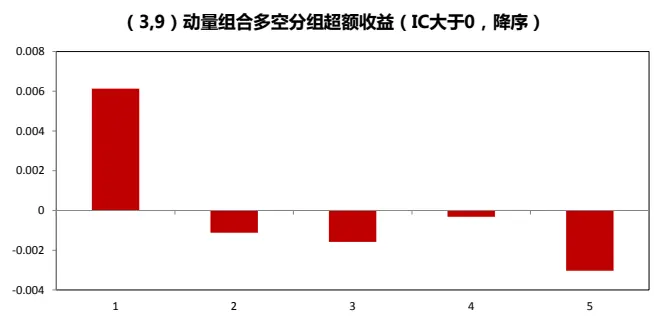
资料来源：东方证券研究所 & Wind资讯

图 11：（3,9）动量组合多空净值曲线 & 多空月收益
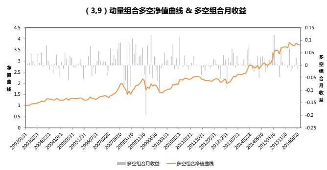
数据来源：东方证券研究所 &Wind资讯

我们发现大多数动量组合都通过了 5%的 t 检验，并且 IC 值都为正，说明港股的动量效应在各个周期都十分显著，总的来看当形成期为 3-9 个月，持有期为 1-6 个月的时候港股的动量效应最明显，这也跟 Joseph W. Cheng 和 Hiu-fung Wu(2010)的研究结果相一致。对比之前美股的检测结果，美股各个动量组合的 IC 都低于港股，并且港股动量组合的年化收益也比较高。再看其中一个组合的多空组合净值曲线，如上图所示，相比美股的动量组合非常稳健，虽然其他有些港股的动量组合会产生一些比较大的回撤，但主要原因是 07-09 年的暴跌，其余时间段回撤不大，并没有美股的动量崩盘现象，因此我们认为动量策略可以应用于港股。

最后，其他类因子虽然 IC 绝对值较高，但是组合的波动也很大，很难获得稳健的超额收益。

## 2.2.2 港股通成分股

沪港通下的股票交易始于2014年11月17日，深港通下的股票交易始于2016年12月5日，如下图所示，深市港股通标的范围有所扩大，包含了部分恒生综合小型股指数成分股。随着沪港通、深港通的先后开放，香港和大陆的金融经济关系越来越紧密，大陆投资者可以更加便捷地投资港股，港股的低估值和优质蓝筹股吸引了很多大陆资金的涌入。

图 12：港股通标的范围

| 港股通标 的范围 | 上交所 | 深交所 （一）恒生综合大型股指数的成份股； |
| --- | --- | --- |
|  | (一）恒生综合大型股指数的成份股； (二)恒生综合中型股指数的成份股； (三)A+H股上市公司的H股。 | (二)恒生综合中型股指数的成份股； (三)恒生综合小型股指数成份股，且成份股定期调整 考察截止日前十二个月港股平均月末市值不低于港币50 亿元，上市时间不足十二个月的按实际上是时间计算市 值； (四)A+H股上市公司的H股。 |

资料来源：东方证券研究所 & 上海证券交易所 & 深圳证券交易所

截止到 2017 年4 月21 日，港股通成分股个数为 421，根据恒生一级行业分类，金融业总市值占比最大达到 39%，其次是地产建筑业 12%，能源业9%，消费品制造业 8%，资讯科技业 8%，原材料业占比最小 2%。

从沪市港股通成交金额上看，买入卖出的总金额呈现阶段性上涨，2015 年4 月总成交金额最高达到 1859.40 亿元，然后连续下降了几个月，从 2015 年 11 月开始成交额开始上升，特别是 201年 3 月总成交金额创了近一年新高，达到 1230.61 亿元，这得益于年初至今港股的持续上涨。

图 13：港股通成分股行业市值分布（根据恒生一级行业分类）
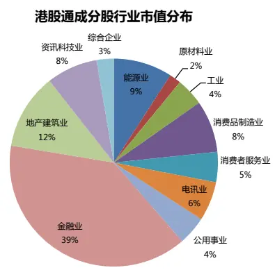
资料来源：东方证券研究所 & Wind资讯

图 14： 沪市港股通每月总买入卖出成交额（亿元）
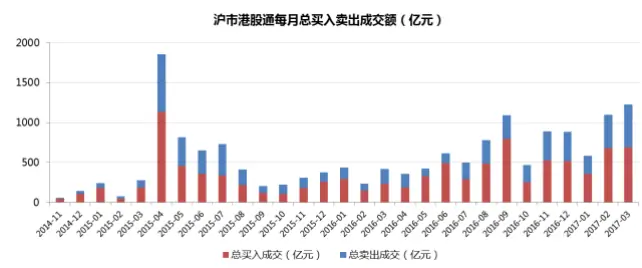
数据来源：东方证券研究所 & 上海证券交易所

港股通标的受到越来越多的投资者的关注，测试 Alpha 因子在港股通成分股中的作用十分必要，我们选用 2017 年 4 月21 日的港股通成分股作为股票池，每个月剔除了总市值少于 50 亿港币的股票，测试时间段为 2002.01-2016.12，检测结果如下：

图 15：港股通成分股大类因子&单因子检测结果

| 因子简称 | IC均值 | 值 | IC_IR | 多空组合 月均收益 | 多空组合 月胜率 | 多空组合 最大回撤 | 多空组合 年化收益率 | 多空组合 夏普比率 |
| --- | --- | --- | --- | --- | --- | --- | --- | --- |
| Value | 3.04% | 3.89 | 1.01 | 0.35% | 55.87% | 33.27% | 3.56% | 0.28 |
| Profit | 2.52% | 3.25 | 0.84 | 0.45% | 56.42% | 27.95% | 4.91% | 0.42 |
| Growth | 2.53% | 3.21 | 0.87 | 0.48% | 59.76% | 13.16% | 4.93% | 0.51 |
| Operation | 0.28% | 0.35 | 0.09 | -0.23% | 48.60% | 52.39% | -3.22% | -0.34 |
| Liquidity | 1.99% | 2.37 | 0.61 | 0.37% | 56.98% | 36.40% | 3.62% | 0.27 |
| Tech&Reverse | 3.73% | 3.82 | 0.99 | 1.36% | 65.36% | 22.09% | 16.48% | 1.14 |
| Other | 0.94% | 0.85 | 0.22 | -0.45% | 53.07% | 70.55% | -6.43% | -0.39 |

| 因子简称 | IC均值 | 值 | IC_IR | 多空组合 月均收益 | 多空组合 月胜率 | 多空组合 最大回撤 | 多空组合 年化收益率 | 多空组合 夏普比率 |
| --- | --- | --- | --- | --- | --- | --- | --- | --- |
| BP_LF | 0.73% | 0.97 | 0.25 | 0.24% | 54.19% | 35.66% | 2.29% | 0.18 |
| EP_TTM | 1.77% | 2.44 | 0.63 | 0.46% | 57.54% | 23.88% | 5.14% | 0.46 |
| SP_TTM | 0.02% | 0.03 | 0.01 | -0.34% | 49.16% | 68.00% | -4.84% | -0.38 |
| CFP_TTM | 2.28% | 3.64 | 0.94 | 0.66% | 60.34% | 17.80% | 7.71% | 0.72 |
| Sales2EV | 0.34% | 0.41 | 0.11 | -0.14% | 49.16% | 57.79% | -2.49% | -0.21 |
| ROA | 2.65% | 3.32 | 0.86 | 0.36% | 58.10% | 21.51% | 3.81% | 0.33 |
| ROE | 2.08% | 2.92 | 0.76 | 0.34% | 53.63% | 17.89% | 3.70% | 0.34 |
| GrossMargin | 2.17% | 3.08 | 0.80 | 0.28% | 56.42% | 36.16% | 2.88% | 0.25 |
| SalesGrowth_Qr_YOY | 0.62% | 0.92 | 0.25 | 0.26% | 52.98% | 31.86% | 2.51% | 0.23 |
| ProfitGrowth_Qr_YOY | 1.94% | 2.98 | 0.80 | 0.37% | 60.00% | 31.86% | 3.71% | 0.37 |
| OCFGrowth_YOY | 1.16% | 1.34 | 0.35 | 0.23% | 55.93% | 22.93% | 2.21% | 0.18 |
| AssetTurnover | -0.20% | -0.32 | -0.08 | -0.01% | 49.16% | 32.63% | -0.42% | -0.12 |
| Debt2Asset | -0.15% | -0.17 | -0.04 | -0.52% | 44.69% | 68.50% | -6.70% | -0.58 |
| TO_1M | 0.90% | 1.24 | 0.32 | -0.22% | 58.10% | 54.93% | -3.19% | -0.34 |
| ILLIQ | -0.45% | -0.49 | -0.13 | -0.43% | 51.40% | 69.71% | -6.14% | -0.41 |
| AmountAvg_1M_3M | 2.33% | 3.20 | 0.83 | 0.90% | 62.01% | 9.29% | 10.70% | 0.99 |
| Ret1M | -2.54% | -2.46 | -0.64 | 0.33% | 53.07% | 35.39% | 2.99% | 0.21 |
| Momentumlast6M | 0.54% | 0.47 | 0.12 | 0.38% | 56.98% | 50.92% | 3.05% | 0.21 |
| Momentumave1M | -3.63% | -3.56 | -0.92 | 0.59% | 51.40% | 29.59% | 6.12% | 0.42 |
| PPReversal | 0.07% | 0.06 | 0.01 | 0.28% | 56.42% | 39.47% | 2.08% | 0.16 |
| CGO_3M | -1.10% | -1.07 | -0.28 | -0.01% | 44.57% | 44.38% | -1.23% | -0.07 |
| RealizedVolatility_3M | -1.01% | -0.86 | -0.22 | -0.46% | 50.28% | 72.77% | -6.84% | -0.37 |
| MaxRet | -0.70% | -0.76 | -0.20 | -0.19% | 49.16% | 51.19% | -3.00% | -0.25 |

从大类因子检测结果来看，估值、盈利、成长类因子的 IC 均有所下降，但依然相对显著，估值类因子中 CFP_TTM的 IC 最高 2.28%，年化收益率 7.71%，夏普比率 0.72，EP_TTM其次 IC为 1.77%，而 BP_LF 在港股通中明显失效。盈利类因子 ROA 最为显著，IC 为 2.65%，ROA 和GrossMargin 表现也不错，IC 分别为 2.08%和 2.17%。成长性因子中只有净利润同比增长通过了5%的 t检验，IC 为1.94%，运营能力在港股通成分股中并不显著。

流动性因子中，我们之前说过 AmountAvg_1M_3M因子在恒生综指中表现优异，在港股通中效用更加明显，IC 上升到 2.33%，多空组合最大回撤最小 9.29%，年化收益率最高 10.70%，夏普比率 0.99，我们给出了这个因子在港股通中的多空组合分组超额收益，净值曲线和每月多空收益来方便投资者观察该因子的历史表现。

图 16：AmountAvg_1M_3M 多空分组超额收益
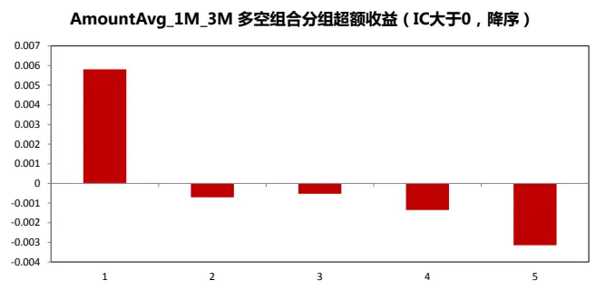
数据来源：东方证券研究所 &Wind资讯

图 17：AmountAvg_1M_3M 多空净值曲线 & 多空月收益
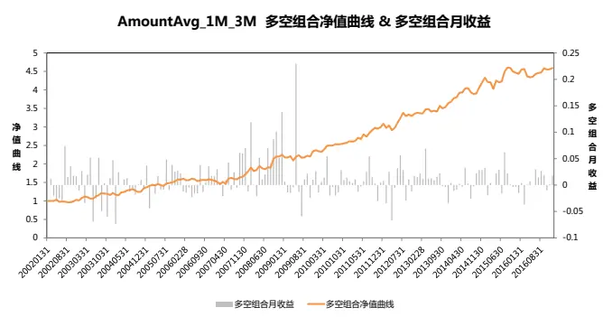
数据来源：东方证券研究所 &Wind资讯

技术反转因子中，Ret1M的 IC 绝对值有显著提升，为-2.54%，Momentumave1M依然效用明显，IC 为-3.63%，说明一个月反转效应在港股通成分股中更加明显。

而其他类因子在港股通中均不显著。

## 三、 市值效应

在《中美市场因子选股效果对比分析》报告中我们发现美股的市值因子 IC 为正，但从多空组合分组超额收益和净值曲线来看，美股是存在一定的小盘股溢价的，市值最小的股票平均比市值最大的股票每个月高 0.28%。而 A股从 2009 年开始偏小市值的市场风格持久不衰，从历史回测结果来看做多小市值股票能够产生显著的超额收益。

下图是港股的市值效应检测结果：

图 18：市值因子的分组超额收益
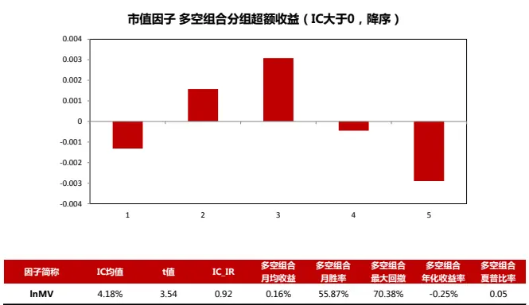

| 因子简称 | IC均值 | t值 | IC_IR | 多空组合 月均收益 | 多空组合 月胜率 | 多空组合 最大回撤 | 多空组合 年化收益率 | 多空组合 夏普比率 |
| --- | --- | --- | --- | --- | --- | --- | --- | --- |
| InMV | 4.18% | 3.54 | 0.92 | 0.16% | 55.87% | 70.38% | -0.25% | 0.05 |

数据来源：东方证券研究所 &wind资讯

图 19：市值因子的多空组合净值曲线&月收益
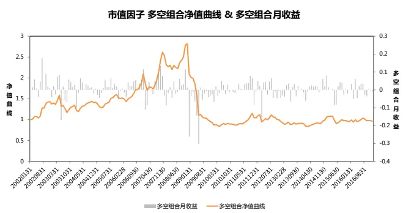
数据来源：东方证券研究所 &wind资讯

图 20：市值因子第一组和第五组月超额收益
做多大市值的月超额收益，胜率52%
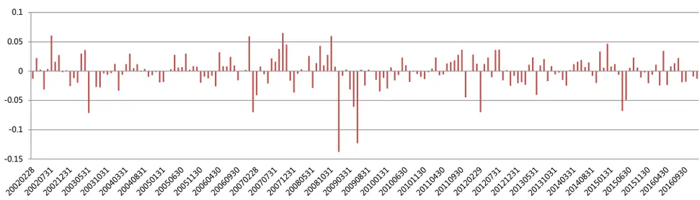

做多小市值的月超额收益，胜率39%
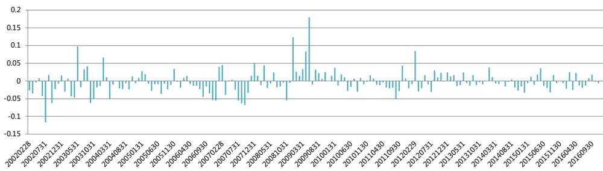
资料来源：东方证券研究所 &wind资讯

首先我们看到市值因子的 IC 为4.18%，和美股一样 IC 均大于 0，也就是港股的市值和股票收益率成正相关，从多空组合净值曲线来看，2002 年至 2007 年大市值效应十分显著，这段期间是港股的大牛市，受益于全球经济复苏，尤其是中国大陆经济的飞速增长，由下图可知，在牛市期间金融、房地产等周期性行业领涨，涨幅远远超过电信业务、医疗保健、信息技术等成长性行业，所以大市值股票表现明显优于小市值股票。

图 21：2003-2007 牛市各行业平均涨跌幅（按照香港 GICS行业分类）
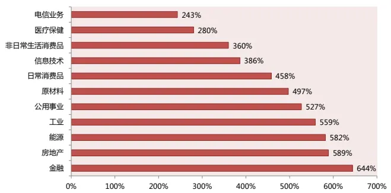
数据来源：东方证券研究所 &wind资讯

图 22：2009 年熊市反弹各行业平均涨跌幅（按照香港 GICS行业分类）
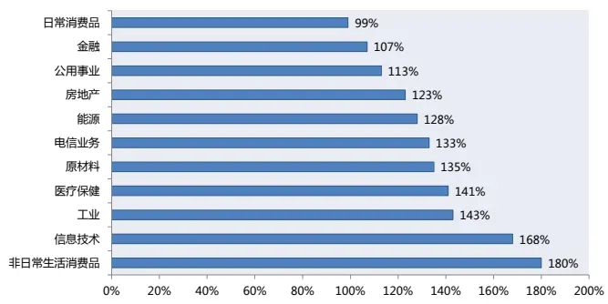
数据来源：东方证券研究所 &wind资讯

但是从多空组合分组超额收益看，做多大市值和小市值都产生了负的超额收益，然而做多大市值产生的负的超额收益十分微弱只有-0.18%，这不得不怀疑是否是有些月份产生了比较大的负超额收益，才把月平均值拉低，于是我们分别画了做多第一组大市值和做多第五组小市值的每月超额收益图，我们发现从 08 年底到 09 年 5 月期间做多大市值产生了比较大的负超额收益，而小市值股票相应的在这期间表现较好，这主要是因为熊市期间小股票通常跌幅较大，大市值股票比较抗跌，而 09 年之后港股开始了熊市反弹，小市值股票通常波动大，Beta 高，所以在反弹行情里会表现得比大票好，我们从上图的熊市反弹期间各行业的涨跌幅也可知，反弹期间非日常生活消费品、信息技术、医疗保健、电信业务这些成长性的行业涨幅居前，这里面往往有众多小市值的股票，而包含大市值的金融、房地产等行业表现一般。另外从月超额收益胜率来看，做多大市值的胜率是51.4%，做多小市值的概率 41.9%，再结合 IC 值，整体来看港股的大市值股票比小市值股票表现更好。

这主要是因为，港股以机构和海外投资者主导，作为全球资产配臵的核心，投资者更青睐低估值业绩良好的蓝筹股，小市值股票往往无人问津，而 A 股的市值效应主要是因为新兴成长行业的股票市值整体偏小，而同期市场风格偏好成长，小盘成长股具备稀缺性；小盘股的壳效应；大资金的违规操盘和散户跟风等。这些都有可能随着 IPO 提速和市场监管趋严而弱化，目前市值因子兼具 Alpha 和风险属性，未来我们预计其 Alpha 属性会衰减，风险属性仍将保留。

## 四、 组合构建

因子的有效性检验完成后，需要建立贴近实际交易的投资组合来反映好的因子是否真的能产生显著的超额收益，我们分别模拟了主动量化组合、多空对冲组合来满足不同投资者的需求。我们对所有的组合统一做了如下设臵：月度调仓，根据前一个月底的因子值，在每个月的第一天建仓，成交价设臵为全天 VWAP，扣除双边交易费用（买卖单边均设臵为0.2%佣金+0.1%印花税），考虑停牌情况，无风险利率为香港国债一个月收益率。

## 4.1 主动量化组合

在A股由于做空限制，我们大多数时候只能做多股票，因此根据因子的zscore建立多头组合，考察多头组合的绩效指标，检验组合是否能够相对基准指数产生 Alpha，是我们检验因子在 A股有效性的重要步骤，因此我们对港股也做了相应的测试。

在实证检验中，测试时间段为 2002.2-2016.12，我们根据 zscore 选出前 20%的股票按市值加权构建多头组合，基准指数选择恒生综指，结果如下所示：

图23：多头组合绩效指标汇总

| 组合特征 | 年化超额收益 | 年化收益率 | 月胜率 | 最大回撤 | 信息比率 | 夏普比率 | 年化换手率 (双边) |
| --- | --- | --- | --- | --- | --- | --- | --- |
| Value | 4.17% | 10.04% | 57.54% | 72.04% | 0.38 | 0.46 | 1.08 |
| Profit | -0.22% | 5.80% | 56.98% | 71.51% | 0.03 | 0.32 | 1.04 |
| Growth | -7.35% | -1.86% | 50.28% | 74.57% | -0.68 | 0.01 | 2.24 |
| Operation | -1.63% | 4.33% | 55.31% | 72.48% | -0.10 | 0.26 | 1.14 |
| Liquidity | -6.42% | -1.27% | 54.19% | 79.83% | -0.51 | 0.05 | 5.16 |
| Tech&Reverse | -0.80% | 4.81% | 56.42% | 70.14% | -0.06 | 0.28 | 2.46 |
| Other | 0.41% | 7.61% | 62.01% | 70.47% | 0.09 | 0.43 | 3.64 |

数据来源：东方证券研究所 & wind 资讯

图 24：多头组合相对恒生综指净值曲线以及大类因子 Value每月超额收益（已扣费）
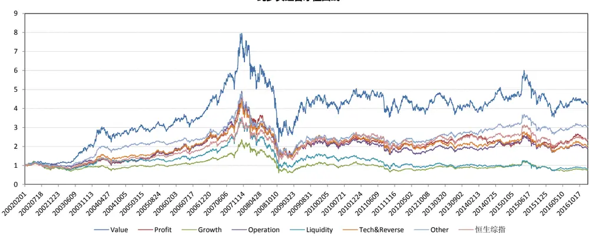

大类因子Value纯多头组合月超额收益（相对恒生综指）
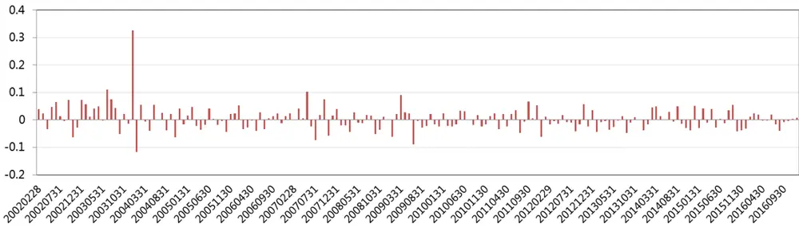
数据来源：东方证券研究所 & wind 资讯

由上图可知，估值类因子合成的大类因子表现最好，纯多头组合年化收益率 10.04%，年化超额收益 4.17%，信息比 0.38，夏普比率 0.46，可见低估值的港股具有较强的表现力，表现最差的是成长大类因子，纯多头组合年化收益率-1.86%，年化超额收益-7.35%，这主要是因为港股主板的大多上市公司只公布年报和中报，并不强制披露季报，只有创业板和少数自愿公布季报的主板公司才会公布季报，所以成长性因子值很长时间都不会发生改变，这样就无法对市场的新信息及时反应，有滞后性。

## 4.2 多空对冲组合

与 A股不同的是，香港金融市场高度开放，可利用的金融工具很多，投资者通常可以通过融券（交易成本高）或者通过认沽证（交易成本低）来做空股票，在本小节，我们也试图根据大类因子建立几个多空组合，但是并不是所有的港股都可以做空，我们在回测时需要注意调仓时可以做空的股票名单，港股的融券渠道很多，不同的资源融券费用也不尽相同，我们统一设臵融券年化费用为 3%，以及做多做空的比例为 1:1，测试区间为 2010.01-2016.12，结果如下所示：

图25：多空组合绩效指标汇总

| 组合特征 | 年化超额收益 | 年化收益率 | 月胜率 | 最大回撤 | 夏普比率 | 年化换手率 (双边) |
| --- | --- | --- | --- | --- | --- | --- |
| Value | 3.43% | 7.05% | 59.52% | 13.35% | 0.21 | 1.58 |
| Profit | -1.67% | 3.48% | 52.38% | 13.64% | -0.17 | 1.49 |
| Growth | 1.14% | 5.70% | 55.95% | 7.33% | 0.09 | 2.80 |
| Operation | -5.94% | -0.36% | 54.76% | 14.84% | -0.53 | 1.11 |
| Liquidity | -2.16% | 3.17% | 54.76% | 19.23% | -0.23 | 9.49 |
| Tech&Reverse | 1.66% | 7.01% | 63.10% | 19.73% | 0.20 | 8.37 |
| Other | -2.54% | 3.53% | 50.00% | 18.10% | -0.09 | 6.15 |

数据来源：东方证券研究所 & wind 资讯

图 26：大类因子相对恒生综指多空组合净值曲线以及大类因子 Value每月超额收益（已扣费）
大类因子多空组合净值曲线
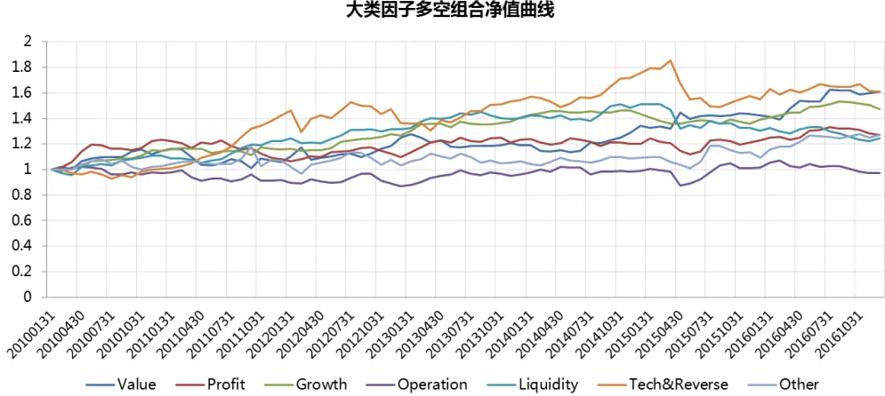

大类因子Value多空组合月超额收益（相对恒生综指）
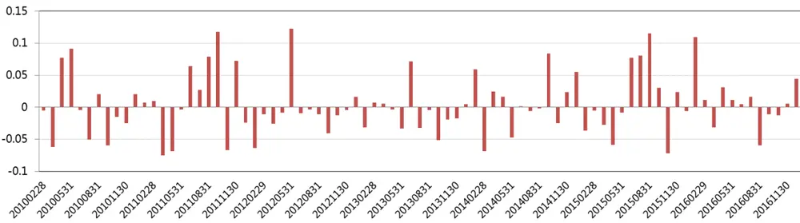
数据来源：东方证券研究所 & wind 资讯

总的来看，多空组合比纯多头组合稳健很多，波动没有那么大，最大回撤均大幅下降。多空组合中表现最好的依然是估值类因子，年化收益率 7.05%，年化超额收益 3.43%，其次有超额收益的是成长性因子和技术反转类因子，年化超额收益分别为 1.14%和 1.66%，可是在前一小节中，成长性因子的纯多头组合表现是最差的，如果我们观察成长性因子的多空组合分组超额收益图的话，会发现空头端的超额收益明显大于多头端，也就是说虽然我们在之前分析过成长因子值有滞后性，但是成长性不好的港股之后会大概率持续体现在股价的下跌，而成长性好的股票股价上涨的可持续性不强。值得一提的是，多空组合的换手率明显高于纯多头组合，这会产生更多的交易费用导致收益的损失。

## 五、 总结

本篇报告主要研究了多因子模型在港股中的应用，首先我们总结了港股市场的四个特点：以机构投资者主导、海外投资者占比大，市场换手率低，估值水平偏低，容易受到其他市场影响。接下来我们检测了恒生综指和港股通成分股内单因子和大类因子的效用，和美股类似，港股的基本面因子比较显著，并且存在一个月反转效应，另外流动性大类里的 AmountAvg_1M_3M因子意外得获得了良好的表现。接着我们深入地检测了动量效应，发现港股在 3-12 个月存在明显的动量效应，且组合表现比美股稳健。

接着我们重点研究了 A股显著的市值效应在港股有何体现，结果发现大市值的股票要比小市值的股票表现更好，尤其是在 2002-2007 年港股大牛市期间，总体来看港股投资者更偏好投资低估值、高股息的优质蓝筹股。

最后我们依据大类因子分别构建了主动量化组合和多空对冲组合，总体来看，港股的 Alpha空间并不大，不过估值类因子的纯多头组合和多空组合都获得了显著的超额收益。

## 风险提示

1. 因子有效性基于历史数据分析得到，未来市场可能发生较大的风格转换，建议投资者紧密跟踪因子表现。

2. 极端市场环境可能对因子效果和模型造成剧烈冲击，需进行严格的风险控制。

## 分析师申明

每位负责撰写本研究报告全部或部分内容的研究分析师在此作以下声明：

分析师在本报告中对所提及的证券或发行人发表的任何建议和观点均准确地反映了其个人对该证券或发行人的看法和判断；分析师薪酬的任何组成部分无论是在过去、现在及将来，均与其在本研究报告中所表述的具体建议或观点无任何直接或间接的关系。

## 投资评级和相关定义

报告发布日后的12 个月内的公司的涨跌幅相对同期的上证指数/深证成指的涨跌幅为基准；

## 公司投资评级的量化标准

买入：相对强于市场基准指数收益率 15%以上；

增持：相对强于市场基准指数收益率5%～15%；

中性：相对于市场基准指数收益率在-5%～+5%之间波动；

减持：相对弱于市场基准指数收益率在-5%以下。

未评级——由于在报告发出之时该股票不在本公司研究覆盖范围内，分析师基于当时对该股票的研究状况，未给予投资评级相关信息。

暂停评级——根据监管制度及本公司相关规定，研究报告发布之时该投资对象可能与本公司存在潜在的利益冲突情形；亦或是研究报告发布当时该股票的价值和价格分析存在重大不确定性，缺乏足够的研究依据支持分析师给出明确投资评级；分析师在上述情况下暂停对该股票给予投资评级等信息，投资者需要注意在此报告发布之前曾给予该股票的投资评级、盈利预测及目标价格等信息不再有效。

## 行业投资评级的量化标准：

看好：相对强于市场基准指数收益率5%以上；

中性：相对于市场基准指数收益率在-5%～+5%之间波动；

看淡：相对于市场基准指数收益率在-5%以下。

未评级：由于在报告发出之时该行业不在本公司研究覆盖范围内，分析师基于当时对该行业的研究状况，未给予投资评级等相关信息。

暂停评级：由于研究报告发布当时该行业的投资价值分析存在重大不确定性，缺乏足够的研究依据支持分析师给出明确行业投资评级；分析师在上述情况下暂停对该行业给予投资评级信息，投资者需要注意在此报告发布之前曾给予该行业的投资评级信息不再有效。

## 免责声明

本证券研究报告（以下简称“本报告”）由东方证券股份有限公司（以下简称“本公司”）制作及发布。

本报告仅供本公司的客户使用。本公司不会因接收人收到本报告而视其为本公司的当然客户。本报告的全体接收人应当采取必要措施防止本报告被转发给他人。

本报告是基于本公司认为可靠的且目前已公开的信息撰写，本公司力求但不保证该信息的准确性和完整性，客户也不应该认为该信息是准确和完整的。同时，本公司不保证文中观点或陈述不会发生任何变更，在不同时期，本公司可发出与本报告所载资料、意见及推测不一致的证券研究报告。本公司会适时更新我们的研究，但可能会因某些规定而无法做到。除了一些定期出版的证券研究报告之外，绝大多数证券研究报告是在分析师认为适当的时候不定期地发布。

在任何情况下，本报告中的信息或所表述的意见并不构成对任何人的投资建议，也没有考虑到个别客户特殊的投资目标、财务状况或需求。客户应考虑本报告中的任何意见或建议是否符合其特定状况，若有必要应寻求专家意见。本报告所载的资料、工具、意见及推测只提供给客户作参考之用，并非作为或被视为出售或购买证券或其他投资标的的邀请或向人作出邀请。

本报告中提及的投资价格和价值以及这些投资带来的收入可能会波动。过去的表现并不代表未来的表现，未来的回报也无法保证，投资者可能会损失本金。外汇汇率波动有可能对某些投资的价值或价格或来自这一投资的收入产生不良影响。那些涉及期货、期权及其它衍生工具的交易，因其包括重大的市场风险，因此并不适合所有投资者。

在任何情况下，本公司不对任何人因使用本报告中的任何内容所引致的任何损失负任何责任，投资者自主作出投资决策并自行承担投资风险，任何形式的分享证券投资收益或者分担证券投资损失的书面或口头承诺均为无效。

本报告主要以电子版形式分发，间或也会辅以印刷品形式分发，所有报告版权均归本公司所有。未经本公司事先书面协议授权，任何机构或个人不得以任何形式复制、转发或公开传播本报告的全部或部分内容。不得将报告内容作为诉讼、仲裁、传媒所引用之证明或依据，不得用于营利或用于未经允许的其它用途。

经本公司事先书面协议授权刊载或转发的，被授权机构承担相关刊载或者转发责任。不得对本报告进行任何有悖原意的引用、删节和修改。

提示客户及公众投资者慎重使用未经授权刊载或者转发的本公司证券研究报告，慎重使用公众媒体刊载的证券研究报告。

## 东方证券研究所

地址： 上海市中山南路 318号东方国际金融广场 26楼

联系人： 王骏飞

电话： 021-63325888*1131

传真： 021-63326786

网址： www.dfzq.com.cn

Email： wangjunfei@orientsec.com.cn