## 研究结论

传统用超额收益衡量事件效应大小的方法容易受行业和市值风格影响，错误的识别出一些“伪事件”，我们建议采用横截面回归方式剔除行业和市值影响计算事件导致的异常收益，再配合秩检验来识别能真正贡献 alpha的事件。

如果策略组合对各个风险因子的主动暴露控制为零，那么用中性化后的alpha 因子预测残差收益和预测收益率得到的组合优化结果一致；现实操作中，为了获得更高 alpha，投资者一般会主动暴露少量风险，因此上面两种预测方法得到的结果会有部分差别。本报告采用预测残差收益的方法，以便和事件驱动策略整合。

事件驱动并非多因子模型之上的额外 alpha，而是两个模型给出了两个不同的未来残差收益预测值，最终结果应该是两个模型预测值的加权，而不是直接相加。预测能力更强的模型应该给予更高的权重。 我们借鉴Black-Litterman模型的 Bayes推导过程，以多因子模型预测残差收益为先验分布，事件驱动模型预测结果为观察值，得到残差收益的后验分布。后验分布均值具有非常简洁的表达形式，它是多因子模型预期残差收益和事件预期残差收益的线性加权，权重为预期残差收益方差的倒数。

我们用多因子月频中证 500成份股内增强策略、四个利空事件和两个利好事来考察模型整合的效果。实证显示，由于 A 股缺乏做空机制，利空事件的alpha 非常稳健，残差收益预测能力强，整合后可以增强多因子模型的预测能力；而利好事件由于大部分 alpha在公告前反应玩，公告后alpha不显著，残差收益预测能力弱，整合后反而会降低多因子模型的预测能力。因此，事件策略库并非越大越好，只有能提供稳健 alpha 收益、对残差收益的预测能力强于多因子模型的事件整合到多因子模型中才是有益的。

目前来看，A 股利空类事件的使用价值最高，但数量有限，事件在股票池里的覆盖率低，对月频多因子模型的增强幅度有限。实际操作中，投资者可以考虑提高调仓频率，多挖掘一些短线事件来提升事件的增强效果

## 风险提示

- 量化模型失效风险

- 市场极端环境的冲击

报告发布日期2017 年 06 月 01 日

证券分析师朱剑涛

021-63325888*6077

zhujiantao@orientsec.com.cn

执业证书编号：S0860515060001

## 相关报告

| 多因子模型在港股中的应用 | 2017-04-26 |
| --- | --- |
| 细分行业建模之银行内因子研究 | 2017-04-25 |
| 反转因子失效市场下的量化策略应对 | 2017-04-09 |
| 中美市场因子选股效果对比分析 | 2017-03-06 |
| 组合优化是与非 | 2017-03-06 |

## 一、理论介绍

## 1.1 事件效应的度量与统计检验

有关事件效应度量和检验的问题在我们之前专题报告《区分真事件与伪事件：事件效应的准确度量与高效统计检验》和《寻找贡献真实 alpha的事件》有过详细讨论。这里只回顾其中一些重要结论以便报告读者参考。

传统事件研究采用触发事件个股在事件日前后相对某个市场基准指数的平均超额收益来衡量事件对个股收益的影响。但 A 股行业和市值效应明显，这样计算出来的超额收益里面很多其实是市场风格的贡献，因此对超额收益进行统计检验犯第一类错误的概率会大增，也就是说会识别出很多“伪事件”，事件本身对个股收益没有影响，但是由于事件选出的个股偏好某个行业或某种风格而被认定为是一个有效的事件。因此有必要剔除个股收益率里的风格因素来考察事件效应。

学术上通常是采取类似 Fama-French 三因子模型的做法，在时间序列上用个股收益率对同期的市场收益率、市值因子收益率和估值因子收益率做回归，取残差项作为异常收益率，也就事件贡献的 alpha，来考察事件效应。不过三因子模型在时间序列方向上对个股收益率的解释度并不高，而且系数很不稳定，对市场风格的剔除不是很干净，统计检验时犯第一类错误的概率仍然偏高。更有效的方法是在横截面上剔除行业和市值风格的影响，常用的方法有 CBBM 和横截面回归方法，这两种方法统计检验的效能接近，CBBM 方法略优，不过我们推荐使用横截面回归方法，因为这种方法计算得到的异常收益在形式上相当于因子选股中个股收益率风险中性处理后得到的残差收益，便于两个模型的整合。

统计检验方法上，传统的 Student-t检验隐含假设各个股票异常收益率的波动相同，和真实情况有出入，导致其犯第一类错误概率偏高，检验效能较弱；BMP-t 检验把收益率先标准化，可以降低异常收益率差异的影响，提高检验效能，但仍受异常收益率正态分布假设的制约。最稳健的方法是 Kolari(2010)提出的非参秩检验方法，犯第一类错误频率接近设臵的臵信度，统计检验效能最高。

我们汇总分析了 A股常见的 26个事件，发现剔除市值和行业风格后，很少有利好事件能在信息公布后还能获得显著 alpha，大部分的 alpha 都在信息公布前一个月反应完毕。正向 alpha收益最显著的两个事件分别是：三季度结束后的高送转概念股炒作和每年的沪深 300 指数成份股定期调整。这两个事件都需要投资者去做预测，前者预测准确率较低，在 70%左右，而后者可以达到90%。不过最近随着监管机构对上市公司高送转的关注，高送转炒作有弱化迹象；而沪深 300 指数成份股调整，可能由于参与者较多，最近两年的超额收益和 alpha都明显衰减。

与利好事件形成鲜明对比的是利空事件，像上市公司业绩不达预期、分析师下调盈利预测等，在信息公告后，能够贡献长期稳健持续的 alpha。这种现象可能与 A股缺乏做空机制，市场无法充分利用利空机会有关，不过对于指数增强和alpha对冲而言，利空事件可以修正股票的alpha预期，提高策略的相对收益。利空事件也是本报告将重点利用的事件。

## 1.2 Alpha 预测与组合优化

在之前报告《alpha 预测中》中，我们介绍了风险调整 IC 的定义。投资者在构建指数增强、量化对冲组合时，往往会控制组合的风险暴露。带风险控制的多空组合或指数增强组合构建可以表示成以下 Mean-Variance 优化问题：

$$
\operatorname*{max}_{\mathbf{w}}\alpha^{\prime}\cdot w-\frac{1}{2}\lambda w^{\prime}\cdot\Sigma\cdot w\quad\cdots\cdots(1)
$$

$$
\quad\mathrm{s.t.}\quad\left[{\boldsymbol{\mathrm{e^{\prime}}}}\right]\cdot\boldsymbol{w}=\tilde{B}\cdot\boldsymbol{w}=0
$$

其中： 是一个 矩阵，表示预测的 N只股票的未来收益。

是一个 的单位 1 矩阵，如果是做多空组合， $\mathbf{e^{\prime}}\cdot\mathbf{w}=0$ 表示组合是资金中性的，多头和空头资金量相等；如果是做指数增强组合, w 表示组合的主动权重（active weight，组合权重和基准权重的差额）， $\mathbf{e^{\prime}}\cdot\mathbf{w}=0$ 表示在满仓做指数增强。

B是 $\Nu\times$ 的风险暴露矩阵，K 为风险因子数量。基于这些风险因子可以对股票收益率的协方差矩阵做出估计， $\Sigma={\bf{B}}\cdot{\bf{F}}\cdot{\bf{B}}^{\prime}+S$ ， 是 K 个风险因子的 $\mathrm{K}\times\mathrm{K}$ 协方差矩阵， 是 的特质方差（Specific Risk）对角阵。记矩阵 $\tilde{B}^{\prime}=[e,B]$ C

可以证明此带风险控制组合的预期收益和预测收益 的风险调整 IC 正比例相关，风险调整 IC的计算公式为

$$
\mathrm{IC_{risk-adj}}=corr(\tilde{z},\tilde{r}),\tilde{z}_{i}=\frac{\alpha_{\perp,i}}{\sqrt{S_{i}}}\mathrm{~,~}\tilde{r}_{i}=\frac{\Gamma_{\perp,i}}{\sqrt{S_{i}}}
$$

其中 $\alpha_{\perp,i}$ 、 $\mathrm{r}_{\perp,i}$ 为风险中性化处理后的预期收益和真实收益， $\mathrm{S_{i}}$ 为股票 i的特质方差。

需要注意的是这里 是预测的个股收益率，而并非个股的多因子 zscore 打分，为把多因子得分转换成个股预测收益率，还需要做以下横截面回归

$$
\mathbf{R}_{\mathrm{t}}=\theta_{t}+{\boldsymbol{\beta}}_{t}\cdot{\boldsymbol{X}}_{t}+\epsilon_{t}
$$

其中 $\mathbf{R_{t}}$ 为第 t 月的个股收益率 ${,}X_{\mathrm{t}}$ 为 t 月初因子的多因子 zscore 打分。由于 的样本是一个中心化的数据样本（样本均值等于 0），所以容易求得 ${.\theta_{\mathrm{t}}}$ 的 OLS 估计 $\widehat{\theta_{t}}=\bar{R}_{t}$ ，即横截面上个股收益率的样本均值。不过个股收益率和股票多因子 zscore打分的这种线性关系并不稳定，随时间变化剧烈，需要在长期历史数据中做多次横截面回归再取平均来过滤市场噪音的影响。实践中我们通常采用过去两年，也就是 24个月数据，每个月做一次横截面回归得到回归系数，再做时间序列上的平均

$$
\bar{\theta}=\frac{1}{24}\cdot\sum_{j=0}^{23}\theta_{t-j},\bar{\beta}=\frac{1}{24}\cdot\sum_{j=0}^{23}\beta_{t-j}
$$

然后代入第 t+1个月月初的多因子 zscore得分 $\Chi_{\tplus1}$ ，得到第 t+1个月的预测个股收益率

$$
\alpha_{\mathrm{t}+1}=\bar{\theta}+\bar{\beta}\cdot X_{t+1}\dots\dots(2)
$$

(2)式中前半部分 ̅代表模型预测的市场平均收益率，后半部分代表多因子打分预测的个股相对市场平均的超额收益。

把 $\alpha=\alpha_{\mathrm{{t}}+1}$ 代入优化问题(1)的目标函数中

$$
\begin{array}{l}{{\alpha_{t+1}^{\prime}\cdot w-\displaystyle\frac{1}{2}\lambda w^{\prime}\cdot\mathsf{cov}(\alpha_{\mathsf{t}+1},\alpha_{t+1})\cdot w=\bar{\theta}\cdot e^{\prime}\cdot w+\bar{\beta}\cdot X_{t+1}^{\prime}\cdot\mathsf{w}-\displaystyle\frac{1}{2}\lambda w^{\prime}\cdot\mathsf{cov}\big(\bar{\beta}\cdot X_{t+1},\bar{\beta}\cdot X_{t+1}\big)\cdot w}}\\{{\phantom{\alpha_{t+1}^{\prime}\cdot w-\displaystyle\frac{1}{2}\lambda w^{\prime}\cdot\mathsf{cov}\big(}\bar{\beta}\cdot X_{t+1},\bar{\beta}\cdot X_{t+1}\big)\cdot w}}\\{{\phantom{\alpha_{t+1}^{\prime}\cdot w-\displaystyle\frac{1}{2}\lambda w^{\prime}\cdot\mathsf{cov}\big(}\bar{\beta}\cdot X_{t+1},\bar{\beta}\cdot X_{t+1}\big)\cdot w}}\end{array}
$$

所以组合优化结果只和多因子模型预测的个股相对市场平均的超额收益有关，而和整个市场的绝对平均收益水平无关。而这个超额收益和个股的多因子打分只相差一个倍数，计算多因子模型预测个股收益的风险调整 IC等价于计算多因子打分的风险调整 IC。

风险调整 IC的推导是在完全控制组合主动风险暴露的前提进行，而从 A股过去今年的历史经验看，构建组合时适度暴露一些市值风险，可以获得更高的收益，同时让风险在可接受范围内。因此实际策略组合的预期收益和风险调整 IC并非成比例的正相关，风险调整 IC此时用作一种近似度量。不过最近半年，市值效应弱化明显，风险大于收益，未来随着 IPO 加速和监管加强，市值因子的风险特性可能会表现的更加强烈，组合的主动市值风险暴露要降低，策略组合会更接近于“完全控制风险”的状态。

另外风险调整 IC 的推导告诉我们，alpha 因子要对哪些风险因子做中性化处理取决于构建组合时控制了哪些风险；如果控制所有风险，策略组合的 alpha收益会很低，目前来看，一般控制好行业和市值风险，就能获得不错的风险调整收益。风险调整 IC 的计算需要用到个股的特质方差数据，在前期报告《A股市场风险分析》中，我们发现个股剔除了行业风险和十大类风格风险后，特质方差和个股的市值平方根倒数有较强的正比例关系。如果只剔除行业和市值风险，两者的比例关系依然近似成立（图 1）。

图 1：特质方差（只剔除行业和市值风险）和市值平方根倒数的关系
特质方差与市值平方根倒数的关系
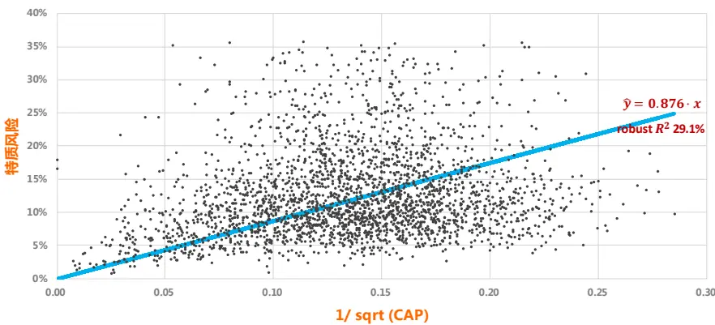
资料来源：东方证券研究所 & Wind 资讯

在报告《Alpha 预测中》我们尝试用风险调整 IC 构建 alpha 模型，但效果不佳，特质方差估计不准可能是一个原因，另外用特质方差倒数作为权重进行 WLS 回归时，大盘股的数据权重更高，因此在 2013-2015市值效应显著时，风险调整 IC方法得到的策略组合表现并不理想。更方便的处理方式是 Purified Alpha 的做法，即假设各只股票的特质方差相等，此时风险调整 IC 等于算风险中性化的 alpha因子和股票收益率的相关系数，需要注意的是，此时由于 alpha因子已经做了风险中性化处理，股票收益率是否做风险中性化处理计算出来的相关系数相等。Purified Alpha 的理论假设更强，与实际情况偏差较大，但不用去估计个股特质方差，大幅减少了模型参数，降低了估计误差对结果的影响，有得有失。从历史回溯测试结果看，Purfified Alpha方法的效果十分不错，不过，如前所说，最近半年市值因子效应衰减，未来有继续衰减的趋势；风险调整 IC方法历史表现差的原因之一是因为降低了小盘股的数据权重，损失了 alpha，但降低小盘股的数据权重也有减少数据噪音影响的好处，如果未来市值效应不再明显，降噪带来的好处作用可能会更突出，使用风险调整 IC方法得到的策略效果可能更好。因此当前时点下，建议投资者对两者方法都做详细测试。

另外在路演时，客户提到两个问题：

1. 风险调整 IC和 Purfified alpha中对 alpha因子都做了风险中性化处理，那么在用线性回归把多因子打分转换成个股预期收益时，加上风险因子作为控制变量是否会预测更准？

2. 现在通过横截面回归的方式用个股的多因子打分来预测股票收益率，如果改为预测风险中性化后的残差收益，代入到组合优化中是否效果更好？

对于第一个问题，假设第 t个月个股的风险暴露矩阵为 $\mathrm{B_{t}}$ ，加上风险因子后，每个月横截面回归可以得到风险因子的当月的纯因子收益率 $\mathrm{.f_{t}}$

$$
\mathbf{R}_{\mathrm{t}}={\boldsymbol{B}}_{t}\cdot{\boldsymbol{f}}_{t}+{\boldsymbol{\beta}}_{t}\cdot{\boldsymbol{X}}_{t}+\epsilon_{t}
$$

为降低市场噪音影响，我们可以同样采取过去 24 个月的数据得到因子收益率的估计值 ̅ 和 $\hat{\beta}$ ，那么此时第 t+1个月的预测股票收益率变为

$$
\alpha_{{\sf t}+1}=\boldsymbol{B}_{t+1}\cdot\bar{f}+\bar{\boldsymbol{\beta}}\cdot\boldsymbol{X}_{t+1}
$$

如果是像优化问题（1）那样做主动风险暴露的完全控制，把上式代入到目标函数中，由于风险中性化的 alpha 因子和风险暴露矩阵的列向量都正交，所以目标函数等于

$$
\begin{array}{rl}&{(B_{t+1}\cdot\bar{f}+\bar{\beta}\cdot X_{t+1})^{\prime}\cdot w-\displaystyle\frac{1}{2}w^{\prime}\cdot cov(B_{t+1}\cdot\bar{f}+\bar{\beta}\cdot X_{t+1},B_{t+1}\cdot\bar{f}+\bar{\beta}\cdot X_{t+1})\cdot w}\\&{}\\&{=\bar{f}^{\prime}\cdot B_{\quad t+1}^{\prime}\cdot w+X_{\quad t+1}^{\prime}\cdot\bar{\beta}^{\prime}\cdot w-\displaystyle\frac{1}{2}w^{\prime}\cdot cov\big(\bar{\beta}\cdot X_{t+1},\bar{\beta}\cdot X_{t+1}\big)\cdot w}\\&{}\\&{=X_{\quad t+1}^{\prime}\cdot\bar{\beta}^{\prime}\cdot w-\displaystyle\frac{1}{2}w^{\prime}\cdot cov\big(\bar{\beta}\cdot X_{t+1},\bar{\beta}\cdot X_{t+1}\big)\cdot w}\end{array}
$$

同样也是由于正交性，而且 alpha因子都做过标准化处理，上面的 $\mathbb{J}\bar{\beta}$ 和直接用收益率对 alpha因子回归得到的系数相等。因此，如果策略组合完全控制了主动风险暴露，这两种方法结果一样。不过实际操作中，都会适度暴露部分风险，因此理论上这两种方法的结果会有差别；在主动风险暴露不是很大的情况下，这两种方法的结果相差不多。

对于第二个问题，可以类似的证明，在组合完全控制主动风险暴露的情况下，预测残差收益和直接预测股票收益率得到的组合优化结果是一样的；如果组合有主动风险暴露，两者会有差别。为了和事件驱动策略整合，我们本篇报告实证时是采用 alpha因子预测残差收益的方法。

## 1.3 因子选股与事件驱动的 Bayes 融合

承接上文，为了更纯净的度量融入事件驱动因素对多因子模型的影响，本报告的实证采用alpha 因子预测个股风险中性化处理后的残差收益，而不是之前报告里直接预测股票收益的方法。考虑了事件驱动因素后，我们有了两个关于残差收益的预测值，一个来自于多因子模型，一个来自于事件驱动策略，需要把它们合成一个预测值输入到后续的组合优化中。两个预测值直接相加不是一种理想的处理方式，因为 alpha 因子稳定性高、数据样本多，预测结果更可靠，而个别事件驱动策略效果随时间变化大，数据样本少，波动高，两个预测结果的可靠性不一样。另外，如果一个股票同时发生了很多事件，直接相加的方法会让残差收益趋于无穷大，产生逻辑谬误。本报告提供一种 Bayes 处理方法，把多因子模型预测当作先验数据，事件驱动作为观测值，通过 Bayes公式得到后验数据，模型思想来自于 Black-Litterman 模型的 Bayes推导过程。

假设个股的残差收益率满足多元正态分布 $\mathbb{R}^{\mathrm{e}}{\sim}\mathbb{N}(\mu^{\mathrm{e}},\Sigma^{\mathrm{e}})$ ，期望收益的先验分布也为正态$\mu^{\mathrm{e}}{\sim}\mathrm{N}(\pi^{\mathrm{e}},\Phi^{\mathrm{e}})$ 。有 m 个股票处在某事件效应的有效作用期内，事件效应造成其未来的预期残差收益记为 $\mathbf{m}\times1$ 向量 $\boldsymbol{\mathsf{q}}^{\mathrm{{e}}}$ ，预期收益的方差为对角阵 $\Omega^{\mathrm{e}}$ ，事件效应的预测结果可以写成 BL 模型里面的观点矩阵的形式， $\mathrm{P^{e}}\cdot\mu^{e}=q^{e}+\epsilon,\epsilon{\sim}N(0,\Omega^{e})$ ，  是一个 矩阵，N 为股票数量。所以根据Bayes 公式，期望收益的后验分布函数

$$
\begin{array}{l}{\displaystyle\mathsf{pdf}(\mu^{\mathrm{e}}|P^{e}\cdot\mu^{e})\propto pdf(P^{e}\cdot\mu^{e}|\mu^{e})\cdot pdf(\mu^{e})}\\{\displaystyle\propto\exp\left(-\frac{1}{2}(q^{e}-P^{e}\cdot\mu^{e})^{\prime}\cdot\Omega^{\mathrm{e}-1}\cdot(q^{e}-P^{e}\cdot\mu^{e})-\frac{1}{2}(\mu^{e}-\pi^{e})^{\prime}\cdot\Phi^{e-1}\cdot(\mu^{e}-\pi^{e})\right)}\end{array}
$$

整理后可以得到和 BL 模型一样的计算式：

$$
\begin{array}{c}{{\mathrm{E}(\mu^{\mathrm{e}}\mid P^{e}\cdot\mu^{e})=\left(\Phi^{\mathrm{e}^{-1}}+P^{e^{\prime}}\cdot\Omega^{\mathrm{e}^{-1}}\cdot P^{e}\right)^{-1}\cdot\left(\Phi^{\mathrm{e}^{-1}}\cdot\pi^{e}+P^{e^{\prime}}\cdot\Omega^{\mathrm{e}^{-1}}\cdot q^{e}\right)}}\\{{=\pi^{e}+\Phi^{\mathrm{e}}\cdot P^{e^{\prime}}\cdot\left(P^{e}\cdot\Phi^{\mathrm{e}}\cdot P^{e^{\prime}}+\Omega^{\mathrm{e}}\right)^{-1}\cdot\left(q^{e}-P^{e}\cdot\pi^{e}\right)}}\end{array}
$$

$$
\mathrm{Var}(\mu^{\mathrm{e}}|P^{e}\cdot\mu^{e})=\left(\Phi^{\mathrm{e}^{-1}}+P^{e^{\prime}}\cdot\Omega^{\mathrm{e}^{-1}}\cdot P^{e}\right)^{-1}\ \cdots\cdots(3)
$$

和原始的 BL模型对比，有两点需要注意：

1) 原始的 BL模型是用来做大类资产配臵，而上面的模型是用来做股票组合管理，中间的公式推导过程一致，但股票数量远远多于大类资 $\colon{\vec{p}}^{*}$ 数量，收益率满足多元联合正态分布的假设更难满足，模型偏离真实市场的情况会更严重。

2) 原始 BL 模型预测的是收益率，而上面模型预测的是剔除行业和市值风险因素后的残差收益。可以进一步假设  为对角阵，也就是说残差收益之间没有相关性。因此如果类似 BL模型假设$\Phi^{\mathbf{e}}=\pmb{\tau}\pmb{\Sigma}^{e}$ ，那么根据上述计算公式(3)，事件效应对个股残差收益的调整只会发生在这个股票上，而传统 BL模型里面由于股票收益率相关性的存在，对一个股票收益的主观调整会通过协方差矩阵传递到跟它相关性高的股票上。对于事件效应而言，这种对角阵形式的协方差矩阵更符合逻辑，例如沪深 300 的指数样本股调整会给个股带来异常收益，但这个事件效应只限于事件内的个股，即使从历史上看某些事件外股票和事件内个股相关性很高，它们也不会从这个事件受益，残差收益应该不受影响。不过有些事件，像年报业绩不及预期，特别是如果行业龙头由于行业不景气年报业绩不及预期，这个事件肯定会对行业内股票价格产生影响，事件效应会通过相关性进行传导。但如果真的是由于行业不景气导致的行业龙头业绩不及预期，那么后续应该还有一系列同行业公司业绩不及预期事件的发生，对角阵型协方差矩阵也还是可以捕捉到同行业股票的业绩相关性的，只是时间点上可能会有滞后或提前，这也是模型存在的一个缺陷。另外，对角阵假设可以显著降低模型需要估计的参数数量，降低估计误差对模型的影响。

如果  为对角阵，(3)式可以进一步简化，记  对角线第 i 个元素为 ，也就是第 个股票的特质方差。假设股票 处在k个事件的有效作用期内，事件造成的异常收益期望值分别为 ${\mathfrak{q}}_{\mathrm{i},1},q_{i,2},\dots q_{i,k}$ 异常收益方差分别为 $\Omega_{\mathrm{i},1},\Omega_{i,2},\ldots\Omega_{i,k}$ ，则事件效应调整后股票 i 残差收益为

$$
\mathrm{E}(\mu_{\mathrm{i}}^{\mathrm{e}}\mid P^{e}\cdot\mu^{e})=\frac{(\tau s_{i})^{-1}\pi_{i}+\Omega_{\mathrm{i},1}^{-1}q_{i,1}+\Omega_{\mathrm{i},2}^{-1}q_{i,2}+\cdots\Omega_{\mathrm{i},\mathrm{k}}^{-1}q_{i,k}}{(\tau s_{i})^{-1}+\Omega_{\mathrm{i},1}^{-1}+\Omega_{\mathrm{i},2}^{-1}+\cdots\Omega_{\mathrm{i},\mathrm{k}}^{-1}}
$$

没发生事件股票的预期收益不变。事件效应调整后的股票残差收益协方差矩阵也为对角阵，其第对角线第 i个元素

$$
\operatorname{Var}(\mu_{\mathrm{i}}^{\mathrm{e}}\mid P^{e}\cdot\mu^{e})={\frac{1}{(\tau s_{i})^{-1}+\Omega_{\mathrm{i},1}^{-1}+\Omega_{\mathrm{i},2}^{-1}+\cdots\Omega_{\mathrm{i},\mathrm{k}}^{-1}}}
$$

没有发生事件股票的特质方差不变。

可以看到，事件调整后的预期收益是多因子模型预期残差收益和事件预期残差收益的线性加权，权重为预期残差收益方差的倒数。如果一个事件样本太少，则其预期残差收益的方差会很大，预测结果不可靠，在最终结果里的权重占比会很小。另外，由于权重之和等于 1，即是一个股票处在多个事件的有效作用期内，也不会出现预期残差收益趋于无穷大的逻辑缪误。

是一个需要人为设定的参数，它直接决定了多因子策略预期收益和事件驱动策略预期收益的相对权重大小。 越小，多因子策略模型预期收益方差越小，可靠性越高，相应在最终结果中的权重也越大，事件效应的影响相对也就越小。有关 值的大小设定业界尚无统一结论，经验上讲，期望收益的波动应该小于收益率自身的波动，因此 $0\leq\tau\leq1$ 。Black-Litterman 建议 取接近于零的数值，赋予市场隐含的均衡收益率更大权重，后续学者研究很多也采用的是 0.025至 0.05的取值，但也有学者认为 应该取 1 ( Satchell 2000)。我们上篇报告《组合优化是与非》中提到Mankert(2011)基于抽样理论的做法，取 $\tau=\mathrm{k}/\mathrm{N}_{\mathrm{sample}}$ ，但是某个时点上可能有很多股票发生很多事件，也就是说 k 的数值可能很大，导致 的数值远大于 1，和经验不符。因此我们这里把 当作是一个需要回溯测试择优的参数，不同的 alpha模型、不同的事件策略库会对应不同的最优 值。另外把 当作一个可调整参数在实际投资中也是有必要的。假设投资者的事件策略库只有高送转四季度炒作和沪深 300 成份股调整两个事件策略，历史上看这两个事件策略都非常显著，可以通过历史回溯找到最优值  ，但是近期这两个策略都有明显失效迹象，而且未来由于监管机构对高送转的特别关注、市场对样本股调整策略的广泛认识，这两个策略有进一步失效的可能，因此可以设臵一个小于  的值来反映这种预期。

以上方法可以得到个股事件效应调整后的残差收益，适用与指数增强策略；残差收益再加上个股风险暴露与风险因子收益的乘积就可以得到预测的个股绝对收益，基于预测的绝对收益对个股进行排序可以得到需要的主动量化组合。

## 二、实证分析

## 2.1 多因子策略

考虑到实证过程中组合优化过程耗费的时间，本文采用中证 500 成份股内多因子选股指数增强策略来说明叠加事件效应的影响。选股采用的 alpha因子参见下图，因子加权采用同类因子等权，大类因子 IC_IR加权的方式，这种因子归类的方式更容易分析某类因子失效对策略的影响。

图 2：中证 500 成份股内增强策略用到的 alpha 因子

|  | BP_LF | NewestBookValue/MarketCap | Ret1M |  |
| --- | --- | --- | --- | --- |
|  | EP_TTM | TTMearnings/MarketCap | Ret3M | 3个月收益反转 |
| EP2_TTM |  | TTMearnings(afterNon-recurringIterms)/MarketCap | PPReversal | 乒乓球反转因子 |
| 估值 | SP_TTM | TTMSales/MarketCap | CGO_3M | CapitalGainsOverhang(3M) |
|  | CFP_TTM | TTMOperatingCashFlow/MarketCap | IRFF | Fama-FrenchregressionSSR/SST |
|  | EBIT2EV | EBIT/EnterpriseValue | 52-WeekHigh | 收盘价/过去一年中的最高价 |
|  | Sales2EV | 营业收入_TTM/企业价值 | Momentumave1M | 股价相比最近1个月均价涨幅 |
|  | ROA | 总资产收益率 | Momentumlast6M | 复权收盘价/复权收盘价6月前-1 |
| 盈利 | ROE | 净资产收益率 | Momentumlast12M | 复权收盘价/复权收盘价_12月前-1 |
|  | GrossMargin | 销售毛利率 | TO 流动性 | 以流通股本计算的1个月日均换手率 |
|  | NetMargin | 净利润率 | ILLIQ | 每天一个亿成交量能推动的股价涨幅 |
|  | SalesGrowth_Qr_YOY | 营业收入增长率（季度同比） | AmountAvg_1M_3M | 过去一个月日均成交额/过去三个月日均成交额 |
|  | ProfitGrowth_Qr_YOY | 净利润增长率（季度同比） | AmountVol 1M 12M | 过去一个月日均成交量/12个月日均成交量 |
| 成长 | EquityGrowth_YOY | 净资产增长率（同比） | RealizedVolatility_3M | 过去三个月日收益率数据计算的标准差 |
|  |  |  | RealizedVolatility_1Y | 过去一年日收益率数据计算的标准差 |

资料来源：东方证券研究所

采用六大类因子的指数增强效果如下图 3所示，回溯测试时间为 2009.01 – 2017.04，未扣交易手续费，组合优化时采用报告《组合优化是与非》中的混合整型线性规划方法控制组合股票数量不超过 100个（个别月份优化出来的股票权重过于分散，最终选取数量还是会超过 100），停牌、跌停股票不可卖出、涨停股票不可买入，每月调仓。

图 3：中证 500成份股内增强策略（六类因子）
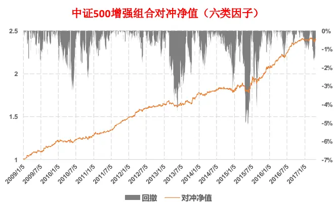
资料来源：东方证券研究所 & Wind 资讯

图 4：中证 500成份股内增强策略（四类因子）

| 年化超额收益 | 信息比 | 月胜率 | 最大回撤 | 平均股票数量 | 月单边换手率 |
| --- | --- | --- | --- | --- | --- |
| 12.94% | 2.32 | 79.0% | -5.9% | 113.1 | 47.8% |

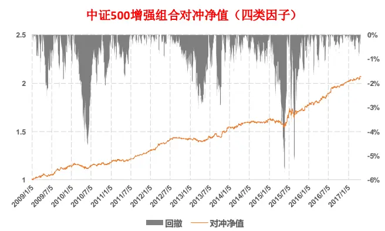

| 年化超额收益 | 信息比 | 月胜率 | 最大回撤 | 平均股票数量 | 月单边换手率 |
| --- | --- | --- | --- | --- | --- |
| 10.85% | 2.01 | 71.0% | -5.7% | 110.0 | 33.8% |

资料来源：东方证券研究所 & Wind 资讯

图 5：两个策略月度超额收益对比
指数增强策略月度超额收益
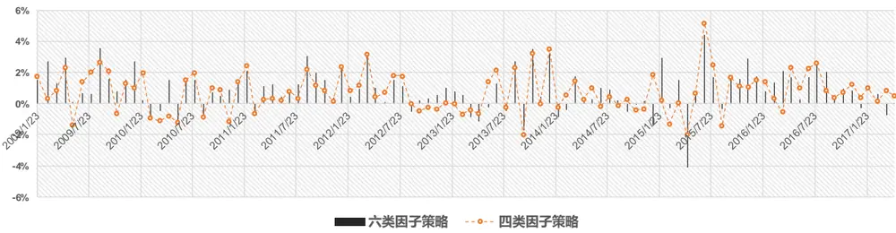
资料来源：东方证券研究所

随着反转和流动性因子的失效，策略今年表现一般，和基准基本持平；如果拿掉这两类因子，用剩下的四类因子构建策略，将损失年化约 2%的超额收益，但组合换手率下降明显，策略今年以来四个月跑赢指数 2.5%。与之前报告《反转因子失效市场下的量化策略应对》观点一致，在当前市场状态下，我们仍然推荐使用四类因子构建的多因子策略组合，下文的测试也基于此策略。

## 2.2 事件驱动策略

事件策略我们选取前期报告《寻找贡献真实 alpha 的事件》里提到的六个事件，分别为：1.业绩预增、 2. 业绩扭亏、 3. 业绩预减、4. 业绩快报低于预期、5. 年报大幅低于预期、6. 分析师盈利预测大幅下调。各个策略的累积异常收益如下图所示，统计区间从 2009.01到 2017.04，可以看到，利空事件的 alpha 幅度和持续时间都强于利好事件，不同年份事件策略的表现差异较大，利空事件在个别年份甚至可以获得正向 alpha，因此有必要对事件效应进行滚动窗口动态检验，挑出近期表现有效的事件，我们实证中采用的是过去两年滚动窗口非参秩检验的方法。

图 6：业绩预增策略平均累积异常收益
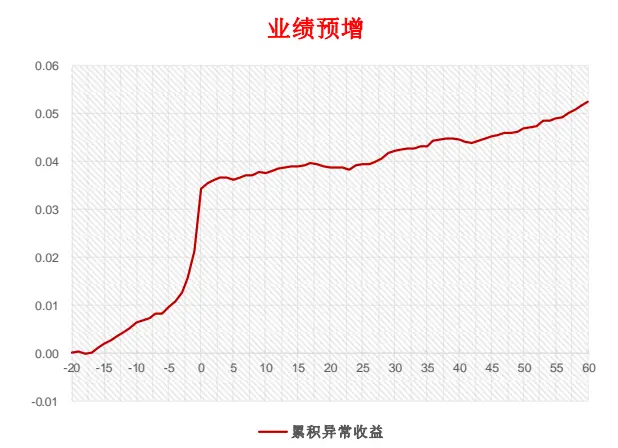
资料来源：东方证券研究所 & Wind 资讯

图 7：业绩预增策略累积异常收益（分年）
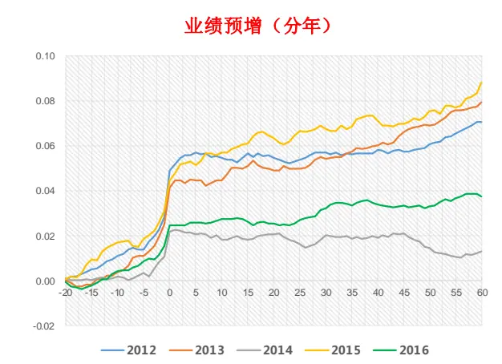
资料来源：东方证券研究所 & Wind 资讯

图 8：业绩扭亏策略平均累积异常收益
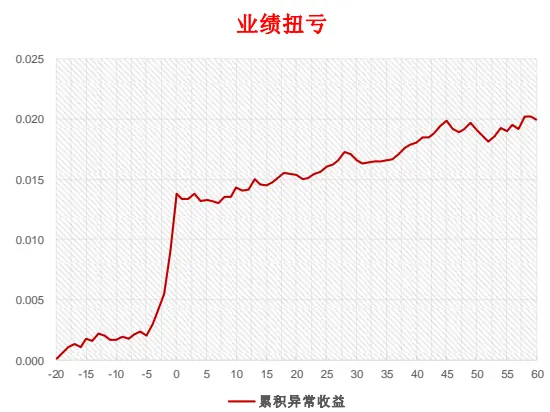
资料来源：东方证券研究所 & Wind 资讯

图 9：业绩扭亏策略累积异常收益（分年）
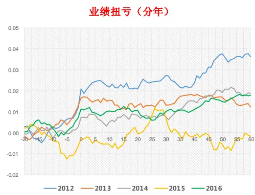
资料来源：东方证券研究所 & Wind 资讯

图 10：业绩预减策略平均累积异常收益
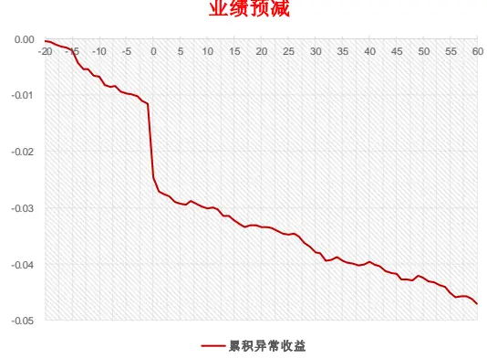
资料来源：东方证券研究所 & Wind 资讯

图 11：业绩预减策略累积异常收益（分年）
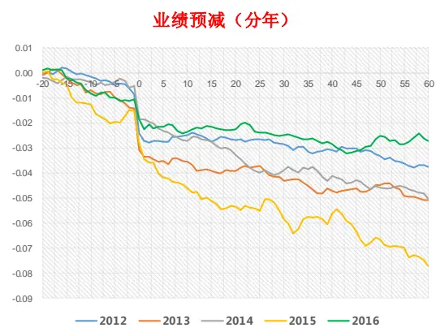
资料来源：东方证券研究所 & Wind 资讯

图 12：业绩快报低于预期策略平均累积异常收益
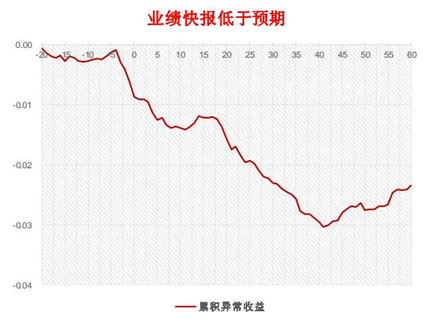
资料来源：东方证券研究所 & Wind 资讯

图 13：业绩快报低于预期策略累积异常收益（分年）
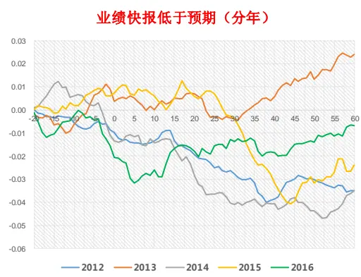
资料来源：东方证券研究所 & Wind 资讯

图 14：年报低于预期策略平均累积异常收益
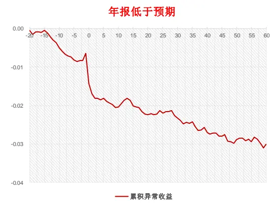
资料来源：东方证券研究所 & Wind 资讯

图 15：年报低于预期策略累积异常收益（分年）
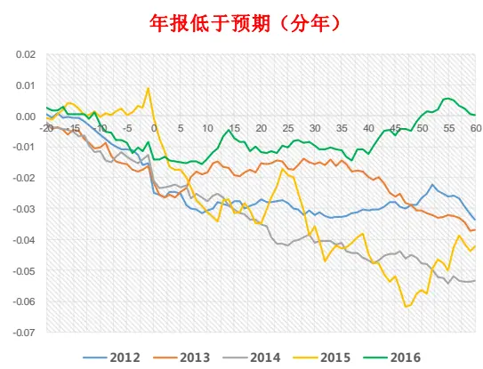
资料来源：东方证券研究所 & Wind 资讯

图 16：盈利预测大幅下调策略平均累积异常收益
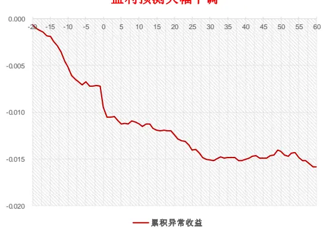
资料来源：东方证券研究所 & Wind 资讯

图 17：盈利预测大幅下调策略累积异常收益（分年）
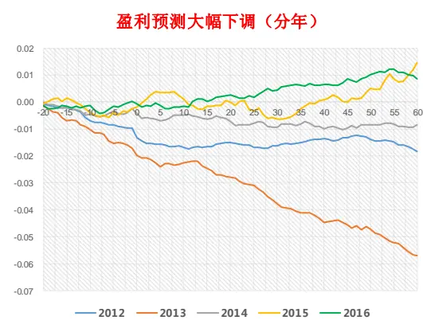
资料来源：东方证券研究所 & Wind 资讯

## 需要补充说明的是，

1. 在之前报告我们计算个股异常收益时发生代码错误，用的是横截面上个股当天的收益率对当天收盘时的个股市值和行业分类做回归，本报告里更改为上一个交易日的收盘市值和行业分类。这个变化对之前报告里的定性结论基本不影响，但策略的累积异常收益数量大小会发生改变，大部分策略的变化在 1%左右，但个别事件像分析师盈利预测大幅下调和年报大幅低于预期事件，累积异常收益相差 2%以上。

2. 事件效应是否需要分股票池测试？本报告里的中证 500 成份股增强策略是在成份股内进行，严格的讲，事件效应也应该在成份股内进行；不过这样会使事件样本数量锐减，统计检验效能降低，事件驱动模型预测的异常收益变得不可靠。因此，上面的统计检验仍然是在全市场进行。因为计算异常收益时剔除了行业和市值效应，股票池不匹配产生的影响会减弱。

3. 事件效应是否需要按照事件强度进行细分？比如说分析师下调盈利预测事件，是否需要把其中大幅下调盈利的样本单独拿出来作为事件研究。这个问题没有确定答案，一般来讲，事件划分的细一些，事件的 alpha效应可能更明显，但对应的样本数量减少，异常收益的方差增大，事件效应在上述 bayes 计算式中的权重会降低。细分的处理方式是带来“得”多还是“失”多，不同的事件不一样，需要实证测试。

4. 事件异常收益和多因子模型里的残差收益并不相等。本报告里的多因子模型采用月频调仓，需要预测的是月频的残差收益，但事件效应里的异常收益是每天计算的。我们实证过程中把未来一个月的事件异常收益累加起来作为未来一个月残差收益的预测值，不过收益率序列可能有自相关性和异方差性，而且风险因子的数值每天在变，因此严格的讲，累加得到的数值和未来一个月残差收益不完全相等。这是多因子和事件驱动两个策略研究方法不同导致的差异，无法避免，提高多因子模型的调仓频率可以降低这种差异的影响；当提高到日频调仓时，异常收益即是残差收益。

## 2.3 整合策略的表现

首先考察事件 3 至事件 6 四个利空事件加入对多因子策略的影响。由于 A 股做空机制缺乏，目前来看，利空事件是 A 股最稳健的能够真实贡献 alpha 的事件；投资者无法通过直接做空的方式获取这部分 alpha，但是可以通过剔除策略里的“利空股”获取更高相对收益，再用股指期货对冲的方式把这部分收益拿到手。2009年以来，四个利空事件共有 11307个样本，总量较多，但在时间轴上进行分摊后，每个月受到事件影响的股票在指数成分股里权重并不高；这个数值我们称作事件覆盖率，其随时间变化如图18所示。少数月份事件覆盖率能超过10%，但平均下来只有3.2%，因此可以预期加入事件后，对多因子策略的总体影响将非常有限。

图 18：中证 500成份股的利空事件覆盖率变化
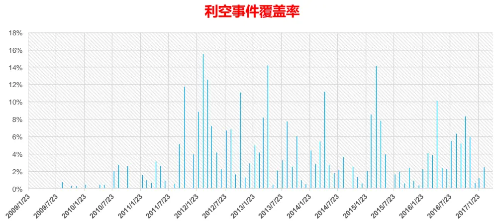
资料来源：东方证券研究所 & Wind 资讯

本报告多因子模型采用的是 Purified Alpha方法，默认假设各个股票的特质方差相等，因此特质方差可以通过横截面上特质收益率的方差估算得到，其变化如图 19所示，历史平均值为 0.0086，

图 19：股票月度特质方差变化
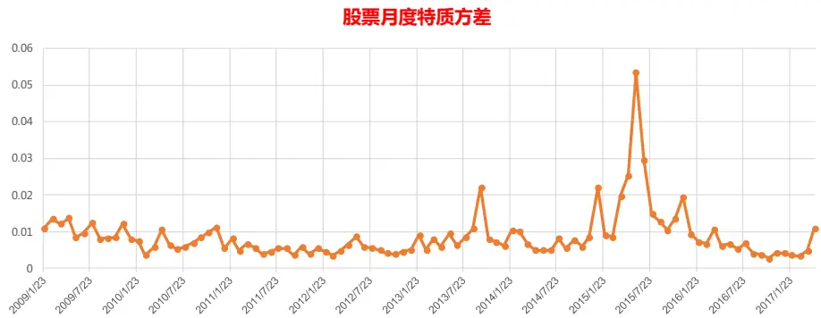
有关分析师的申明，见本报告最后部分。其他重要信息披露见分析师申明之后部分，或请与您的投资代表联系。并请阅读本证券研究报告最后一页的免责申明。

基于历史数据也可以计算事件日后一个月个股累积异常收益的方差（图 20），可以看到利空事件的方差明显更小，预测的残差收益数值更加可靠。

图 20：事件日后一个月累积异常收益的方差

|  | 业绩预增 | 业绩扭亏 | 业绩预减 | 业绩快报低于预期 | 年报低于预期 | 盈利预测大幅下调 |
| --- | --- | --- | --- | --- | --- | --- |
| 事件日后一个月 累积异常收益的方差 | 0.0098 | 0.0104 | 0.0088 | 0.0088 | 0.0078 | 0.0067 |

资料来源：东方证券研究所 & Wind 资讯

第 1.3 节 Bayes 计算式中参数 用来调节最终预测结果中多因子模型和事件驱动模型的权重，下面遍历测试了 0到 1之间的 10个数值，结果如图 21所示。

我们希望加入事件驱动因素后，模型对残差收益的预测能够更准，从而获得更高的策略收益。模型预测的准确度，可以用模型预测值与真实值的平均绝对偏差（MAE, Mean Absolute Error）来衡量。图 21 中 表示纯多因子模型，不考虑事件因素。可以看到随着 数值的增大，整合模型的 MAE 越来越小，说明加入利空事件驱动因素确实可以明显提高多因子模型对残差收益的预测精度；而且 值越大，Bayes 计算式中事件驱动因素的权重越大，而此时 MAE 越小，说明利空事件对残差收益的预测能力比多因子模型更强。

MAE 衡量的是模型的 alpha 预测能力，在经过后续组合优化过程后，只有少量股票进入最终的策略组合，因此策略组合的表现和 MAE 的大小排序会有出入。从测试结果看， 取值在 0.5附近时表现最好，其分别取 0.4, 0.5, 0.6 的结果平均下来比纯多因子模型年化收益高 19bp，最大回撤略有下降，组合换手率变化很小。这是在事件覆盖率平均只有 3%的情况下取得的结果，假设说我们构建了一个巨大的事件策略库，把事件覆盖率提升到了60%，是原来的 20倍，那么直观的感觉会认为事件加入后多因子模型的年化收益增强幅度也将提升 20倍，到 380bp，不过通过后续实证我们会发现事实并非如此简单。另外，由于事件覆盖率低，数据噪音的影响很容易覆盖掉事件效应的作用，因此图 21中策略超额收益的数据统计意义并不强，建议主要还是参考 MAE数据。

图 21：整合四个利空事件的多因子中证 500增强策略表现

|  | MAE | 年化超额收益 | 信息比 | 月胜率 | 最大回撤 | 平均股票数量 | 月单边换手率 |
| --- | --- | --- | --- | --- | --- | --- | --- |
| τ=0 | 0.0592 | 10.85% | 2.01 | 71.0% | -5.7% | 110.0 | 33.8% |
| τ=0.1 | 0.0588 | 10.85% | 2.04 | 73.0% | -5.3% | 109.9 | 34.2% |
| τ=0.2 | 0.0585 | 10.76% | 2.03 | 73.0% | -5.3% | 109.8 | 34.5% |
| τ=0.3 | 0.0584 | 10.85% | 2.04 | 73.0% | -5.5% | 110.1 | 34.7% |
| τ=0.4 | 0.0582 | 11.10% | 2.08 | 73.0% | -5.3% | 110.3 | 34.7% |
| τ=0.5 | 0.0581 | 10.98% | 2.06 | 73.0% | -5.4% | 109.9 | 34.8% |
| τ=0.6 | 0.0580 | 11.03% | 2.05 | 73.0% | -5.4% | 110.3 | 34.8% |
| τ=0.7 | 0.0580 | 10.97% | 2.04 | 73.0% | -5.5% | 110.3 | 34.9% |
| τ=0.8 | 0.0579 | 10.90% | 2.04 | 73.0% | -5.5% | 111.2 | 34.9% |
| τ=0.9 | 0.0579 | 10.77% | 2.00 | 73.0% | -5.4% | 109.5 | 34.9% |
| τ=1.0 | 0.0579 | 10.84% | 2.03 | 73.0% | -5.5% | 110.4 | 34.9% |

资料来源：东方证券研究所 & Wind 资讯

以上实证只采用了四个利空事件，如果把两个利好事件也加进来，将增加 7381 个事件样本，事件覆盖率提高到 5.8%。在不同的 设臵下（图 22），模型的 MAE 反而增大。也就是说事件库里的事件并非越多越好，只有当事件对残差收益的预测能力强于多因子模型时，这种整合才是有益的；而两个利好事件，正如图 6 和图 8 所示，绝大部分 alpha 在公告日前就反应完毕，公告日后并不显著，对 alpha贡献不大，反而增加了数据噪音，降低了模型的预测能力。另外由于回溯测试过程中并未考虑交易费用，真实投资中还需考虑到策略换手率增加对收益的损耗。

图 22：整合四个利空+两个利好事件的多因子中证 500增强策略表现

|  | MAE | 年化超额收益 | 信息比 | 月胜率 | 最大回撤 | 平均股票数量 | 月单边换手率 |
| --- | --- | --- | --- | --- | --- | --- | --- |
| τ=0 | 0.0592 | 10.85% | 2.01 | 71.0% | -5.7% | 110.0 | 33.8% |
| τ=0.1 | 0.0609 | 11.26% | 2.09 | 71.0% | -5.4% | 111.2 | 34.2% |
| τ=0.2 | 0.0608 | 11.28% | 2.15 | 72.0% | -5.3% | 111.5 | 35.6% |
| τ=0.3 | 0.0608 | 11.40% | 2.12 | 69.0% | -5.4% | 110.8 | 36.5% |
| τ=0.4 | 0.0608 | 11.39% | 2.09 | 70.0% | -5.3% | 109.5 | 37.3% |
| τ=0.5 | 0.0608 | 11.15% | 2.07 | 71.0% | -5.4% | 108.9 | 38.0% |
| τ=0.6 | 0.0608 | 11.27% | 2.11 | 71.0% | -5.5% | 108.2 | 38.6% |
| τ=0.7 | 0.0609 | 11.17% | 2.07 | 72.0% | -5.3% | 107.4 | 39.0% |
| τ=0.8 | 0.0609 | 11.19% | 2.09 | 74.0% | -5.5% | 106.5 | 39.4% |
| τ=0.9 | 0.0609 | 10.98% | 2.06 | 72.0% | -5.3% | 107.3 | 39.8% |
| τ=1.0 | 0.0610 | 11.00% | 2.05 | 71.0% | -5.6% | 107.8 | 40.1% |

资料来源：东方证券研究所 & Wind 资讯

A 股市场信息监管有待加强，未来一段时间内可能还是散户占交易主导，利好信息急促反应的现象还是会存在，想根据公开信息从利好事件获得稳健正向 alpha的难度较大。相反由于做空机制的匮乏，利空事件的负 alpha可能会长期存在，目前来看其预测残差收益的准确度要强于多因子模型，这也是我们想挖掘多因子模型之外的 alpha时要重点研究的对象。本报告中利空事件只有四个，事件覆盖率 3.2%，未被市场挖掘到的利空事件估计不会太多，假设理想情况下，事件库的事件覆盖率能达到 15%，我们估计整合事件驱动后，相对纯多因子的月频中证 500 成份股内增强策略，收益提升幅度最多在 1%左右，空间不是很大。对于沪深 300或上证 50这种个股权重较为集中的指数，整合事件驱动的效果有可能会更好。

本报告实证中多因子策略采用的是月频调仓，但投资实务中，事件的发生时点是随机的，提高调仓频率可以增强事件 alpha的利用效率，一些短线事件（例如：定增破发）也可以用起来，但这样也会使模型预测的残差收益频繁调整，导致换手率增加，组合优化时有必要加上换手率控制条件。

## 2.4 多因子选股+事件驱动研究框架

结合我们之前的多因子和事件驱动系列研究，下面汇总整理了一个框架结构图以供投资者参考，事件驱动和多因子的这种 Bayes整合方式也可以部分解决之前做多因子时碰到的一些问题，例如：我们研究中很少用分析师的预测数据构造因子，一方面是因为数据覆盖度不够，另一方面是因为分析师上调盈利预测并不能贡献正 alpha，下调预测却可贡献稳健负 alpha，不对称性明显，但通过事件方式，分析师数据可以用到最终的 alpha预测中。另外，上市公司年报公布时间不同步，导致因子数据只能部分更新，现在可以考虑四月底出完年报统一更新因子数据，之前有出年报的公司，以事件的形式进入到模型中。

图 23：东方金工多因子选股+事件驱动研究框架结构
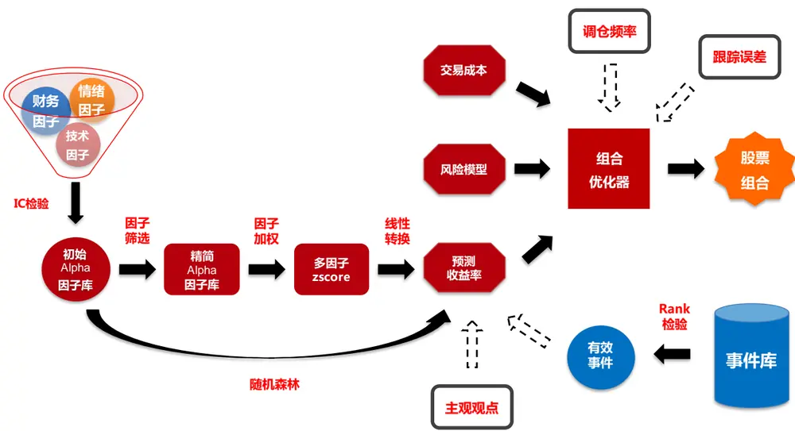
资料来源：东方证券研究所

## 三、总结

事件驱动是我们在多因子模型之外可以寻求的 alpha来源，但事件驱动并不一定能在收益上增强多因子模型，只有能提供稳健 alpha收益、对残差收益的预测能力强于多因子模型的事件整合到多因子模型中才是有益的。目前来看，A股利空类事件的使用价值最高，但数量有限，事件覆盖率低，对月频多因子模型的增强幅度有限。实际操作中，投资者可以考虑提高调仓频率，多挖掘一些短线事件来提升事件的增强效果。

## 风险提示

1. 量化模型基于历史数据分析得到，未来存在失效的风险，建议投资者紧密跟踪模型表现。

2. 极端市场环境可能对模型效果造成剧烈冲击，导致收益亏损。

## 分析师申明

每位负责撰写本研究报告全部或部分内容的研究分析师在此作以下声明：

分析师在本报告中对所提及的证券或发行人发表的任何建议和观点均准确地反映了其个人对该证券或发行人的看法和判断；分析师薪酬的任何组成部分无论是在过去、现在及将来，均与其在本研究报告中所表述的具体建议或观点无任何直接或间接的关系。

## 投资评级和相关定义

报告发布日后的 12个月内的公司的涨跌幅相对同期的上证指数/深证成指的涨跌幅为基准；

## 公司投资评级的量化标准

买入：相对强于市场基准指数收益率 15%以上；

增持：相对强于市场基准指数收益率 5%～15%；

中性：相对于市场基准指数收益率在-5%～+5%之间波动；

减持：相对弱于市场基准指数收益率在-5%以下。

未评级——由于在报告发出之时该股票不在本公司研究覆盖范围内，分析师基于当时对该股票的研究状况，未给予投资评级相关信息。

暂停评级——根据监管制度及本公司相关规定，研究报告发布之时该投资对象可能与本公司存在潜在的利益冲突情形；亦或是研究报告发布当时该股票的价值和价格分析存在重大不确定性，缺乏足够的研究依据支持分析师给出明确投资评级；分析师在上述情况下暂停对该股票给予投资评级等信息，投资者需要注意在此报告发布之前曾给予该股票的投资评级、盈利预测及目标价格等信息不再有效。

## 行业投资评级的量化标准：

看好：相对强于市场基准指数收益率 5%以上；

中性：相对于市场基准指数收益率在-5%～+5%之间波动；

看淡：相对于市场基准指数收益率在-5%以下。

未评级：由于在报告发出之时该行业不在本公司研究覆盖范围内，分析师基于当时对该行业的研究状况，未给予投资评级等相关信息。

暂停评级：由于研究报告发布当时该行业的投资价值分析存在重大不确定性，缺乏足够的研究依据支持分析师给出明确行业投资评级；分析师在上述情况下暂停对该行业给予投资评级信息，投资者需要注意在此报告发布之前曾给予该行业的投资评级信息不再有效。

## 免责声明

本证券研究报告（以下简称“本报告”）由东方证券股份有限公司（以下简称“本公司”）制作及发布。

本报告仅供本公司的客户使用。本公司不会因接收人收到本报告而视其为本公司的当然客户。本报告的全体接收人应当采取必要措施防止本报告被转发给他人。

本报告是基于本公司认为可靠的且目前已公开的信息撰写，本公司力求但不保证该信息的准确性和完整性，客户也不应该认为该信息是准确和完整的。同时，本公司不保证文中观点或陈述不会发生任何变更，在不同时期，本公司可发出与本报告所载资料、意见及推测不一致的证券研究报告。本公司会适时更新我们的研究，但可能会因某些规定而无法做到。除了一些定期出版的证券研究报告之外，绝大多数证券研究报告是在分析师认为适当的时候不定期地发布。

在任何情况下，本报告中的信息或所表述的意见并不构成对任何人的投资建议，也没有考虑到个别客户特殊的投资目标、财务状况或需求。客户应考虑本报告中的任何意见或建议是否符合其特定状况，若有必要应寻求专家意见。本报告所载的资料、工具、意见及推测只提供给客户作参考之用，并非作为或被视为出售或购买证券或其他投资标的的邀请或向人作出邀请。

本报告中提及的投资价格和价值以及这些投资带来的收入可能会波动。过去的表现并不代表未来的表现，未来的回报也无法保证，投资者可能会损失本金。外汇汇率波动有可能对某些投资的价值或价格或来自这一投资的收入产生不良影响。那些涉及期货、期权及其它衍生工具的交易，因其包括重大的市场风险，因此并不适合所有投资者。

在任何情况下，本公司不对任何人因使用本报告中的任何内容所引致的任何损失负任何责任，投资者自主作出投资决策并自行承担投资风险，任何形式的分享证券投资收益或者分担证券投资损失的书面或口头承诺均为无效。

本报告主要以电子版形式分发，间或也会辅以印刷品形式分发，所有报告版权均归本公司所有。未经本公司事先书面协议授权，任何机构或个人不得以任何形式复制、转发或公开传播本报告的全部或部分内容。不得将报告内容作为诉讼、仲裁、传媒所引用之证明或依据，不得用于营利或用于未经允许的其它用途。

经本公司事先书面协议授权刊载或转发的，被授权机构承担相关刊载或者转发责任。不得对本报告进行任何有悖原意的引用、删节和修改。

提示客户及公众投资者慎重使用未经授权刊载或者转发的本公司证券研究报告，慎重使用公众媒体刊载的证券研究报告。

## 东方证券研究所

地址：上海市中山南路 318 号东方国际金融广场 26 楼

联系人： 王骏飞

电话：021-63325888*1131

传真：021-63326786

网址： www.dfzq.com.cn

Email： wangjunfei@orientsec.com.cn