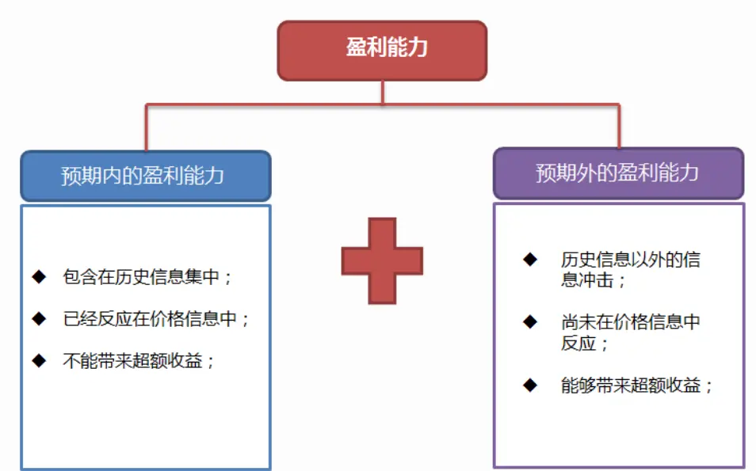
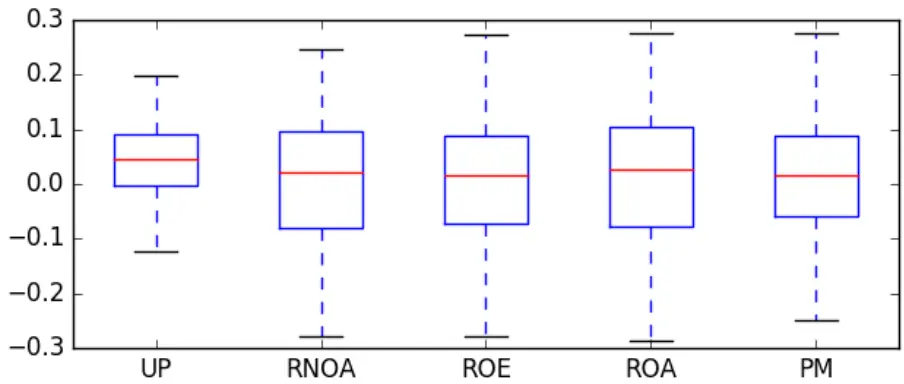
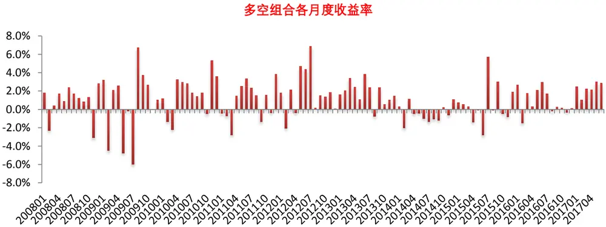
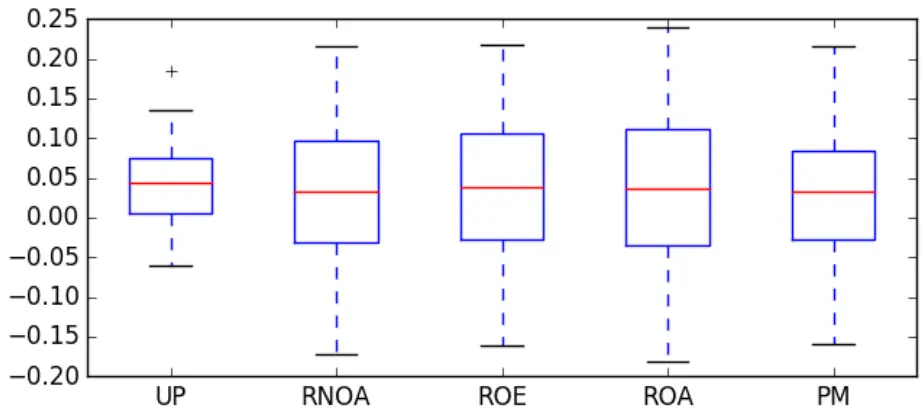
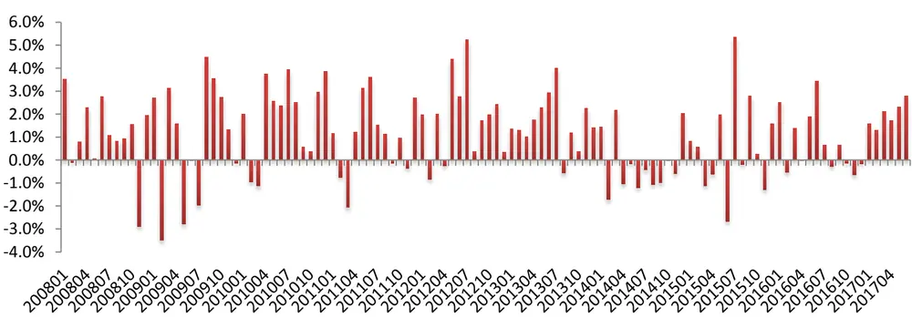
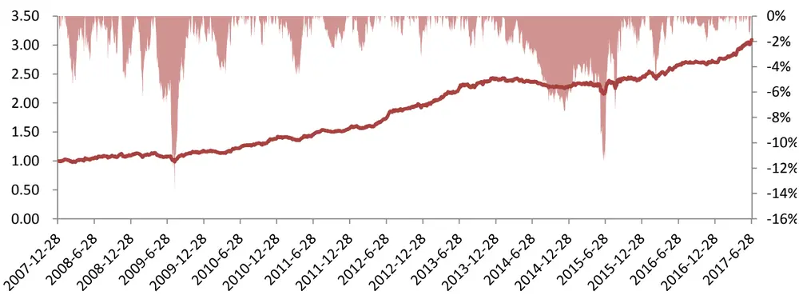

## 研究结论

- 未来盈利能力越强的企业，内在价值越高，但预期内的盈利能力已经反应在价格中，不能带来超额收益，相反，预期外的盈利能力才是盈利能力 alpha的真实来源。

Nissim 和 Penman(2001)从 ROE 出发，将净利润和股东权益完全拆分成经营活动部分和金融活动部分，提出了RNOA（净经营资产收益率）的概念，RNOA 相对于传统的 ROE、ROA 指标更加客观地表示了企业经营的盈利能力，而且不易受企业财务政策影响，本文选取RNOA作为盈利能力的度量。

- 我们采用横截面回归模型（Fama and French, 2000, 2006; Hou andRobinson, 2006）预测企业季度的 RNOA，RNOA 的实现值和预测值之差我们定义为预期外的盈利能力（UP，unexpected profitability）。

预期外盈利能力 UP 在选股上能带来明显的超额收益，风险中性化后在中证全指成分内（剔除金融股）的 RankIC 均值 4.15%，年化 IC_IR3.04，多空组合年化收益 14.02%，最大回测 7.7%，另外，因子有效性对样本空间的依赖性低，对大中小市值股票均有很强的区分能力，中性化后的因子在沪深 300（剔除金融股）中 Rank IC 均值 4.77%，年化 IC_IR 为 1.60。因子原始值的表现在基本面因子中也属于较高水平。

预期外盈利能力因子UP和 RNOA、ROE、ROA、PM等盈利能力因子有很高的信息重叠，在控制 UP 后其他盈利能力因子均失效，但其他盈利能力因子并不能解释 UP的 alpha来源。

预期外盈利能力 UP和 BP、EP 等估值因子相关性低，信息相对独立，但是和盈利成长因子高度相关，盈利能力超预期一般伴随着盈利的增长，通过相关性分析，我们发现盈利成长能够带来超额收益可能是因为其盈利能力超预期，但预期外盈利能力UP指标能够捕捉到盈利成长之外的超预期信息。

- 预期外盈利能力 UP 的度量涉及到盈利预测模型，通过稳健性分析我们发现UP 的表现对模型的因变量选取不敏感，不存在过度挖掘现象。

报告发布日期2017 年 07 月 09 日

证券分析师朱剑涛

021-63325888*6077

zhujiantao@orientsec.com.cn

执业证书编号：S0860515060001

联系人王星星

021-63325888-6108

wangxingxing@orientsec.com.cn

## 风险提示

- 量化模型失效风险

- 市场极端环境的冲击

预期外盈利能力因子中性值在不同样本空间的表现（剔除金融股）

|  | 覆盖度 | RankIC |  | 多空组合 |  |  |  |  |
| --- | --- | --- | --- | --- | --- | --- | --- | --- |
|  |  | 均值 | IC_IR | t值 | 年化收益 | 夏普比 | 月胜率 | 最大回撤 |
| 沪深300 | 93.9% | 4.77% | 1.60 | 4.93 | 13.38% | 1.45 | 64.9% | 23.9% |
| 中证500 | 94.6% | 3.73% | 1.81 | 5.57 | 10.30% | 1.56 | 66.7% | 12.0% |
| 中证800 | 94.3% | 4.36% | 2.25 | 6.93 | 11.72% | 1.91 | 71.1% | 13.9% |
| 中证全指 | 87.4% | 4.31% | 3.04 | 9.37 | 12.60% | 2.66 | 76.3% | 6.6% |

东方证券股份有限公司及其关联机构在法律许可的范围内正在或将要与本研究报告所分析的企业发展业务关系。因此，投资者应当考虑到本公司可能存在对报告的客观性产生影响的利益冲突，不应视本证券研究报告为作出投资决策的唯一因素。

## 一、关于盈利能力

## 1.盈利能力与股票价值

Ohlson(1995)在前人的研究基础上（Preinreich, 1938; Kay, 1976; Edwards and Bell, 1961）根据净盈余关系(clean surplus)由股利折现模型推到导出了剩余收益模型:

$$
V_{t}^{*}=B_{t}+\sum_{i}^{\infty}\frac{E_{t}[(ROE_{t+i}-r)B_{t+i-1}]}{(1+r)^{i}}
$$

其中，  为股票在 t时刻的内在价值， $\mathrm{B_{t}}$ 为股票在 t时刻的账面净资产， $\mathrm{ROE}_{\mathrm{t+i}}$ 表示 t+i时刻的净资产收益率，r表示权益的资本成本。

剩余收益模型很好的阐述了账面价值、预期未来盈利能力和折现率之间的关系，在账面价值和折现率一定的情况下，股票内在价值和预期盈利能力正相关，预期盈利能力（ROE）越强的公司，其权益的内在价值越高。然而在一个相对有效的市场中，预期的盈利能力已经反应在股价中，买入盈利能力强的股票并不能带来超额收益，但是，预期外的盈利能力在公告后会改变原有预期推动股价变动从而带来超额收益。

图 1：预期内和预期外的盈利能力

数据来源：东方证券研究所

## 2.盈利能力的度量

本文主要研究一般企业的盈利能力，金融企业的业务性质、财务报表和一般生产性企业有很大差别，所以金融企业并不在本文的研究范围之内。要想考察预期外的盈利能力首先要解决的问题是如何度量盈利能力，传统上投资者喜欢采用 ROE（净资产收益率）作为盈利能力的度量，但是ROE 容易受企业杠杆的影响，一般情况下，高杠杆的企业 ROE 取值较高。ROA（总资产收益率）

虽然剥离了财务杠杆的影响，但仍然受企业金融活动的影响，比如总资产中可能会有大量的投资性房地产、可供出售金融资产、正常经营活动需求以外的现金等金融资产，这些金融资产并不对经营活动产生影响，但对 ROA指标的计算产生了干扰。

为了完全剥离金融活动对企业盈利能力度量的影响，Nissim和Penman(2001)从ROE出发，将净利润和股东权益（净资产，不含优先股）完全拆分成经营活动部分和金融活动部分，提出了RNOA（净经营资产收益率）的概念。

$$
\ P_{\mathrm{\Phi}}[\Phi]\dot{\Sigma}[\exists NI~=~\frac{\ell\Xi}{\Xi\Xi}\Xi^{\pm\pm}\vec{\Sigma}^{\|}]\dot{\Sigma}[\mathbf{\Sigma}]OI~-~\widehat{\Xi}\widehat{\Xi}\widehat{\Xi}\Xi\Xi^{\pm}\Xi\stackrel{\pm}{\Sigma}\downarrow+NFE
$$

$$
A_{\sf X}^{n}\mathop{\mathcal{Z}}_{\sf X}^{\prime}\mathop{\mathcal{Z}}\mathop{\mathcal{Z}}\mathop{\mathcal{Z}}\mathop{S}E=\mathrm{~\forall~}\oint\mathrm{d}\mathrm{~\underset{\sf X}{\mathrm{R}}~}I\partial\mathrm{~\neq~}N\partial A\mathrm{~-~}\mathrm{~\underset{\sf X}{\mathrm{R}}~}I\partial\mathrm{~\neq~}NFO
$$

其中：

$$
\frac{1}{12}\frac{m}{12}\times\frac{4}{3}\times11NFE=\frac{3}{12}\times\frac{m}{12}\times\frac{4}{3}\times11-\frac{3}{12}\times\frac{m}{12}\times11\times\Lambda
$$

$$
\sharp\sharp\sharp\sharp\sharp\sharp\sharp\sharp\wedge\varkappa\partial_{\varphi}^{\star}NOA=\sharp\sharp\sharp\sharp\partial_{\varphi}^{\star\pm}\partial_{\varphi}^{\star}\partial_{\varphi}^{\star}OA-\sharp\sharp\sharp\partial_{\varphi}^{\star\pm}\partial_{\varphi}^{\star}O\mathsf{L}
$$

$$
\sharp\sharp\sharp\sharp\sharp\sharp\varkappa\sharp/\sharp\Lambda FO=\lesssim\sharp\sharp\sharp\underline{{\varphi}}_{\sharp}\sharp\sharp\sharp\in F0\ -\sharp\sharp\sharp\sharp\varphi\qquad\mathrm{FA}
$$

经营性负债是指企业由于经营性活动所导致的负债，如应付账款、应付职工薪酬等，金融性资产是指与企业主要经营活动无关的、可以用来抵偿债务的资产项目，主要是经营活动正常需求以外的现金及存款，可供出售金融资产、投资性房地产等。根据会计恒等式上述资产项满足下列关系：

经营资产 金融资产 经营负债 金融负债 股东权益 总资产

| 资产 负债和权益 |  |
| --- | --- |
| +经营性资产（OA） | +经营性负债（OL）+金融性负债（FO） |
| + 金融性资产（FA） |  |
|  | +股东权益（SE） |
| = 总资产TA | = 总资产TA |

稍作变形即可得：

经营资产 经营负债 股东权益 金融负债 金融资产 净经营资产

| 经营性项目 金融性项目 |  |
| --- | --- |
| +经营性资产（OA） | +股东权益（SE）+ 金融性负债（FO） |
| - 经营性负债（OL） |  |
|  | - 金融性资产（FA） |
| = 净经营资产NOA | = 净经营资产NOA |

金融支出是指企业由于融资等金融活动导致的各项支出，主要包括企业的应付利息、优先股股息和金融资产金融负债公允价值变动带来的损失，金融收入主要包括企业现金或者存款带来的利息收入或者金融资产负债项价值变动带来的收益。金融净支出可以抵税，所以真实的金融净支出应该再乘以（1-所得税率）。

，定义表示经营性资产盈利能力的指标 RNOA和表示净融资成本的指标 NBC如下：

$$
\mathtt{P4}\underbrace{\frac{4}{2}\underline{{\lambda}}\underline{{\lambda}}}_{\ge\underline{{\lambda}}}\mathtt{r}\mathtt{k}\mathtt{i}\underbrace{\dot{\gamma}\overline{{\lambda}}}_{\ge\underline{{\lambda}}}\mathtt{\dot{j}}\mathtt{K}\mathtt{i}\underbrace{\frac{\partial}{\partial\mathrm{i}}\mathrm{\partial}\mathrm{i}}_{\ge\underline{{\lambda}}}\mathtt{k}\underline{{\lambda}}\mathtt{k}\underline{{\lambda}}\mathtt{m}A=\\frac{\frac{4}{2}\underline{{\lambda}}\underline{{\lambda}}\underline{{\lambda}}+\underline{{\lambda}}}{\mathtt{k}\sharp\underline{{\lambda}}\underline{{\lambda}}}\mathtt{r}\mathtt{i}\underline{{j}}\underline{{\lambda}}\mathtt{i}\underline{{\lambda}}\mathtt{j}OI
$$

$$
\begin{array}{c}\mathtt{\backslash\Psi\underbrace{\Xi}_{\mathtt{H}\mathtt{d}\mathtt{d}}\underbrace{\mathtt{\backslash}\mathtt{A}}_{\mathtt{\langle P\mathtt{d}}}\mathtt{\backslash}\mathtt{\partial}\mathtt{\backslash}\mathtt{\partial}\mathtt{\backslash}\mathtt{NPC}=\mathtt{\frac{\ I_{\mathtt{N}}\Xi}{\mathtt{\backslash}\mathtt{A}}\Pi\Sigma}\mathtt{\backslash}\mathtt{NFE}}\end{array}
$$

其中，经营利润 OI（OI=NI+NFE）是从净经营资产中赚取的所有经营性利润（税后），金融净支出为所有金融支出与所有金融收入之差（税后），主要是利息净支出和金融资产公允价值变动的收益。

RNOA 不同于传统的 ROE、ROA 等指标，ROE、ROA等把企业的经营性活动和金融性活动混为一谈，而金融性活动更多是企业的选择而不是能力，而 RNOA 指标的分子和分母均为纯经营性业务的部分，更客观的反应了企业真实的盈利能力。

由于净利润等于经营利润 OI 和金融净支出 NFE 之差，所以传统的 ROE 可以做如下改写：

$$
ROE={\frac{NOA}{SE}}\times RNOA-{\frac{NFO}{SE}}\times NBC
$$

ROE 从某种意义上讲就是 RNOA 和 NBC的加权平均，上式再做变形，我们可以得到：

$$
ROE=RNOA+[FLEV\times SPREAD]
$$

其中：

$$
\begin{array}{r}{\underline{{\widehat{\mathbb{P}}}}\underline{{\mathbb{E}}}\underline{{\mathbb{d}}}\underline{{\sf t}}{\sf T}{\sf t}{\sf T}{\sf F}{\sf E}{\sf E}{\sf V}=\frac{\gamma\underline{{\sf4}}}{\mathbb{R}_{\sf4}^{2}\underline{{\sf t}}_{\sf4}}\underline{{\sf\Sigma}}\breve{\sf T}\breve{\sf\Sigma}\breve{\sf P}{\cal F}O}{\mathbb{R}_{\sf4}^{n}\underline{{\sf t}}_{\sf4}\breve{\sf R}_{\sf4}^{2}\underline{{\sf t}}_{\sf4}}\sf X\breve{\sf\Sigma}\breve{\sf E}\end{array}
$$

$$
\Delta E\cong\Delta RPEAD=\Delta E\cong\Delta EP\cong\Delta EP.(\Delta EPS\cong\Delta EPS)
$$

从 ROE的分解可以看出，公司的净资产收益率可以拆分成净经营资产的收益率 RNOA和金融活动产生的调整项[ ]，当净经营资产的收益率高于净借贷成本时（SPREAD>0），金融活动对 ROE 产生正的贡献，当净经营资产的收益率低于净借贷成本时（SPREAD<0），金融活动对 ROE产生负的贡献，

由于 RNOA 指标更好的捕捉了公司经营活动的盈利能力，同时不受企业金融/财务活动的影响，所以在后期的研究中得到了广泛的应用 (Fairfield and Yohn, 2001; Nissim and Penman, 2001;Penman and Zhang, 2003; Fairfield et al. 2003a; Richardson et al. 2006; Soliman, 2007)。鉴于此，本文也采用 RNOA指标作为企业盈利能力的度量。

## 3.RNOA 的计算明细

如前所述，我们定义净经营资产收益率 RNOA 为经营利润 OI 与净经营资产 NOA 之比，但是经营利润 OI 和净经营资产 NOA 并不是企业财报披露的科目，那么就要涉及到哪些会计科目归为经营性科目，哪些归为金融性科目的问题。海外学术研究中一般从 Compustat 数据库中提取财务数据，而国内一般数据 wind 底层数据库（wind_dbsync 或者 wind_filesync），本文在基于对各会计科目的理解上详细对比 Compustat 和 wind 数据库，设计净经营资产 NOA 和经营利润 OI 的详细算法如下：

图 2：净经营性资产 NOA 计算明细

| 类别 科目 |  |  | wind_filesync字段 |
| --- | --- | --- | --- |
| + | 股东权益 | + 股东权益合计(含少数股东权益) | TOT_SHRHLDR_EQY_INCL_MIN_INT |
| + | 金融负债FO | + 短期借款 | ST_BORROW |
|  |  | + 交易性金融负债 | TRADABLE_FIN_LIAB |
|  |  | + 应付票据 | NOTES_PAYABLE |
|  |  | + 一年内到期的非流动负债 | NON_CUR_LIAB_DUE_WITHIN_1Y |
|  |  | + 长期借款 | LT_BORROW |
|  |  | + 应付债券 | BONDS_PAYABLE |
|  |  | - 货币资金 | MONETARY_CAP |
|  |  | - 交易性金融资产 | TRADABLE_FIN_ASSETS |
|  |  | 可供出售金融资产 | FIN ASSETS_AVAIL FOR_SALE |
|  | - 金融资产FA | 持有至到期投资 | HELD_TO_MTY_INVEST |
|  |  | 投资性房地产 | INVEST_REAL_ESTATE |
|  |  | 定期存款 | TIME_DEPOSITS |
|  |  | - 其他资产 | OTH_ASSETS |
|  | - 长期应收款 |  | LONG_TERM_REC |
| 三 净经营性资产NOA |  |  |  |

数据来源：东方证券研究所

图 3：经营利润 OI 计算明细

| 类别 | 科目 | wind_filesync字段 |
| --- | --- | --- |
| + | 净利润NI + 净利润(含少数股东损益) | NET_PROFIT_INCL_MIN_INT_INC |
|  | 非经常性损益 - 非经常性损益 | S_FA_EXTRAORDINARY |
| + | + 财务费用 *（1 - 25%) 净利息支出 | LESS_FIN_EXP * (1 - 25%) NET_INT_INC * (1 - 25%) |
| 三 | - 利息净收入*（1-25%） 经营利润 |  |

数据来源：东方证券研究所

净经营性资产 NOA 的计算可以从资产端出发（经营资产 - 经营负债），也可以从权益负债端出发（股东权益 + 金融负债 – 金融资产），本文从权益负债端出发计算 NOA，其中长期应收款我们归为金融资产主要是因为长期应收款主要和融资租赁相关联，而长期股权投资我们归为经营资产而不是金融资产主要是因为没并表的子公司均属于长期股权投资，多为企业经营活动所需。

经营利润 OI的计算可以用直接法（从营收出发扣除各项经营活动产生的成本费用），也可以用间接法（从净利润出发剔除金融活动的影响），本文采用间接法计算 OI，在新会计准则下，利息支出收入计在财务费用科目下，而且财务费用主要是净利息支出，同时部分资产的利息收入会开单独科目，因此我们用财务费用和利息净收入之差作为净利息支出。又因为大多数金融资产的损益（比如房地产投资收入、公允价值变动损失等）都属于非经常性损益，所以我们在计算经营利润时也扣除了非经常性损益部分。

## 4.小结

盈利能力强的企业应该有更高的内在价值，但预期内的盈利能力已经反应在股价中，在选股上不能带来超额收益，相反，预期外的盈利能力并没有被定价，可能带来显著的 alpha。在研究预期外的盈利能力之前，我们首先要解决盈利能力的度量问题，传统的 ROE、ROA等指标并没有将企业的经营活动和金融/融资活动区分对待，受企业财务政策影响明显，Nissim 和 Penman(2001)将企业的金融活动部分从 ROE 中剥离出来，提出了 RNOA 的概念，表现企业经营活动的盈利能力，在后来的研究中得到了广泛的应用，鉴于此，我们也采用 RNOA来度量企业的盈利能力。

## 二、盈利能力预测

本文主要考察预期外的盈利能力对股票收益的影响，前文所述，我们采用净经营资产收益率RNOA 作为企业盈利能力的度量，那么如何将盈利能力 RNOA 划分为预期内的和预期外的部分，这就涉及到盈利能力预测的问题。

## 1.研究现状

早期对盈利能力预测的研究（Lev , 1969; Brooks and Buckmaster, 1976; Freeman, Ohlson,and Penman, 1982）主要采用时间序列模型，但时间序列模型一般需要采用十年以上的数据进行参数估计，这样不可避免地带来了幸存者偏差（Survivor Bias），同时，大大缩小了可研究的股票范围，另外，在如此长时间的区间经济环境和股票自身的特性可能已经发生变化，导致参数估计的可靠性不足。

另外比较流行的一种方法是横截面回归（Fama and French, 2000, 2006; Hou and Robinson,2006; Hou and Van Dijk, 2010），用滞后期的盈利能力或者其他财务指标、市场指标根据横截面回归方程去预测盈利能力，用回归的拟合值或者预测值去作为盈利能力预期内部分的代理变量，相应的，已实现的的预期能力与预期值的差作为预期外的盈利能力。横截面回归的方法解决了时序模型对存续时间要求的问题，避免了幸存者偏差，对于比较年轻的 A 股更是如此，因此我们也选用横截面回归的方法预测盈利能力，将盈利能力划分为预期内和预期外的部分。

同样是横截面回归的方法，Fama 和 French（2000, 2006）采用回归模型的拟合值作为盈利能力的预期值，也就是说用 T 年度的盈利能力对 T-1 年度的因子值回归，方程的拟合值作为预期盈利能力的代理变量，而其他一些学者（Hou and Robinson, 2006; Hou and Van Dijk, 2010）则基于模型的预测值作为预期盈利能力的代理变量，在这种情况下，用 T-1年度的因子值和上一期估计出来的回归系数去预测 T 年度的盈利能力，以该预测值作为预期内盈利能力的代理变量。前者侧重于解释，后者侧重于预测，虽然两者数值上相差不大（A 股数据测算结果两者相关系数高达96%），但后者由于更加直观，我们选择后者作为本文预期内盈利能力和预期外预期能力的度量。

在预测变量的选取上我们沿用了 Fama和 French（2006）年的做法，选取了（1）账面市值比的对数、（2）市值对数、（3）投资、（4）上年同期的盈利能力、（5）上年盈利能力的变化量、（6）分红和（7）应计盈余偏差等多个维度去预测下一期的盈利能力。账面市值比高的公司未来的盈利能力较差，选择市值对数是因为大公司的盈利能力普遍强于小公司（Fama and French,1995）。盈利能力和投资具有一定的持续性 (Penman 1991, Lakonishok, Shleifer, and Vishny1994, Fama and French 1995)，往期盈利能力比较强的公司后期相应也会较好，往期资产增长较快的公司预期未来资产也会延续增长，持续投资，增加资本支出，相应的减少利润。盈利能力的变化主要用来捕捉盈利的均值回复特性（Fama and French, 2000），盈利水平较高会导致竞争的加剧最后恢复到正常水平。有分红的公司一般比不分红的公司盈利能力更强，分红比例高也是盈利能力较强的一种信息（Fama and French 2001）。应计盈余偏差和未来的盈利呈显著的负相关(Sloan,1996; Fairfield, Whisenant, and Yohn, 2002, 2003; Richardson, Sloan, Soliman, and Tuna,2004,2005)，应计盈余比现金流更容易操控，应计盈余小于现金流意味着企业藏有利润，未来账面盈余增加，相反，应计盈余大于现金流意味着当前利润可能有虚高，后期账面盈余减少。Fama和 French(2006)在估计盈利能力预期值时也尝试添加股票过去 1 年、2-3 年收益率、一致预期盈利和 OH 指标（Ohlson ,1980）、PT（Piotrosk,2000）等，但是添加这些指标之后模型的解释程度不仅没有增加，甚至还有所回落，故本文在选择盈利能力的解释变量并没有考虑这些维度，这和后来的一些研究一致（Hou and Robinson, 2006; Hou and Van Dijk, 2010）。

## 2.RNOA 年度预测方程

学术上对盈利能力的预测一般都是以年度为单位的，为了考察 A 股公司年度盈利能力的可预测性以及为进一步的季度预测做基础，我们首先研究盈利能力指标 RNOA在年度区间的可预测性。

我们采用如下横截面回归方程预测年度的盈利能力 RNOA：

$$
RNOA_{y}=a+b_{1}\cdot ln\frac{B_{ly}}{M_{ly}}+b_{2}\cdot lnMC_{ly}+b_{3}\cdot\frac{dNOA_{ly}}{NOA_{ly}}+b_{4}\cdot RNOA_{ly}+
$$

$$
b_{5}\cdot dRNOA_{ly}+b_{6}\cdot\frac{ACC_{ly}}{NOA_{ly}}+b_{7}\cdot NODIVD_{ly}+b_{8}\frac{DIVD_{ly}}{NOA_{ly}}+\varepsilon_{y}
$$

其中， $RNOA_{y}$ 表示 $\mathsf{y}$ 年度的净经营资产净利率，下标 ly表示上一年度的数据，各个解释变量均由上一年度报告期公告截止日（即 4月 30日）及之前可获得的数据计算可得，各个解释变量具体定义如下：

（1） $\frac{B_{ly}}{M_{ly}}.$ ，上一年度报告公告截止日前可获得的最新的账面市值比对数；

（2） $lnMC_{ly}$ ，上一年度报告公告截止日前可获得的最新的总市值对数；

（3） $\cdot\frac{dNOA_{ly}}{NOA_{ly}}.$ ，上一年度净经营资产的同比增长；

（4） $RNOA_{ly}$ ，上一年度的净经营资产收益率；

（5） $dRNOA_{ly}$ ，上一年度的净经营资产收益率的同比变化量；

（6） $\frac{ACC_{ly}}{NOA_{ly}}.$ ，上一年度的应计盈余偏差（Accrual，用营业利润减去经营活动现金净流量表示），经净经营资产调整；

（7） $NODIVD_{ly}$ ，上一年度是否分红的哑变量，不分红取 1，分红取 0，4 月 30 日前未公告分红预案的视为不分红；

（8） $\frac{DIVD_{ly}}{NOA_{ly}}$ ，上一年度的分红金额，经净经营资产调整；

从盈利能力预测方程过去 10 年年度回归结果来看，模型的调整 R 方高达 63%，总体拟合结果较好，而且从各年度来看，各解释变量的系数整体比较稳健，时间序列上显著异于零。具体来看，对未来盈利能力 RNOA 影响最大的是去年同期的 RNOA ，这一点很好理解，往年盈利能力强的企业未来盈利能力普遍也更好；RNOA的变化量和未来的 RNOA 有显著的负相关关系，这在一定程度上验证了盈利能力在年度上有均值回复的特征，另外一点比较有意思的是，未来的 RNOA 和NOA 的增长率显著负相关，说明资产快速膨胀的企业一般会带来未来盈利能力的下滑；应计盈余偏差 Accrual 越大的企业，当前盈余越不可持续，未来账面盈利能力可能变差；从其他维度来看，结果和海外的研究也保持一致，资产高估值的企业、大公司、分红的企业的盈利能力一般会更好。

图 4：RNOA年度预测回归结果

|  | InBM | InMC | dNOA/NOA | RNOA | dRNOA | ACC/NOA | NODIVD | DIVD/NOA | adj_Rsq |
| --- | --- | --- | --- | --- | --- | --- | --- | --- | --- |
| 2007年 | -0.033 | 0.000 | -0.027 | 0.622 | 0.020 | -0.004 | -0.023 | 1.058 | 0.47 |
| 2008年 | -0.033 | -0.006 | -0.017 | 0.806 | -0.198 | -0.081 | -0.013 | 0.443 | 0.55 |
| 2009年 | -0.008 | 0.012 | -0.012 | 0.676 | -0.171 | -0.075 | -0.004 | 0.640 | 0.60 |
| 2010年 | -0.017 | 0.015 | -0.028 | 0.712 | -0.096 | -0.096 | 0.000 | 0.507 | 0.72 |
| 2011年 | -0.023 | 0.009 | -0.025 | 0.651 | -0.088 | -0.010 | -0.015 | 0.302 | 0.63 |
| 2012年 | -0.019 | 0.007 | -0.021 | 0.575 | -0.065 | 0.003 | -0.002 | 0.379 | 0.66 |
| 2013年 | -0.004 | 0.012 | -0.016 | 0.626 | -0.041 | -0.013 | -0.015 | 0.245 | 0.69 |
| 2014年 | -0.014 | 0.012 | -0.028 | 0.612 | -0.075 | -0.038 | -0.004 | 0.570 | 0.69 |
| 2015年 | -0.015 | 0.009 | -0.016 | 0.611 | 0.001 | -0.019 | -0.011 | 0.584 | 0.60 |
| 2016年 | -0.013 | 0.012 | -0.014 | 0.618 | -0.124 | -0.043 | 0.002 | 0.462 | 0.64 |
| 均值 | -0.018 | 0.008 | -0.020 | 0.651 | -0.084 | -0.038 | -0.008 | 0.519 | 0.63 |
| 值 | -5.932 | 4.068 | -10.335 | 30.895 | -3.846 | -3.381 | -3.330 | 7.237 |  |

数据来源：wind 数据库，东方证券研究所

## 3.从年度预测到季度预测

本文主要考察预期外的盈利能力在选股中的作用，预期外的盈利能力尚未反应在股价中，所以在公告后会逐步改变预期，推动股价上涨，从而带来超额收益。由于年度数据分多个季报公告，在年报发布时，已公告的季度数据可能已经反应在股价中，如果直接预测年度的盈利能力，用已实现的年度盈利能力减去预测值作为预期外盈利能力，那么在年度报告公告时，已经有 3 个季度的数据早在数月前已经公告，这 3 个季度的超预期部分可能已经被股价吸收，此时用这个年度的预期外盈利能力的选股效果可能会大打折扣。因此，对盈利能力进行季度的预测，并以此为基础度量预期外的盈利能力对于选股研究来说很有必要。

本文采用下列回归方程预测季度的盈利能力：

$$
\begin{array}{c}{{RNOA_{q}^{MRQ}=a+b_{1}\cdot ln\displaystyle\frac{B_{lq}}{M_{lq}}+b_{2}\cdot ln{\cal M}C_{lq}+b_{3}\cdot\displaystyle\frac{dNOA_{lq}}{NOA_{lq}}+b_{4}\cdot RNOA_{ly}^{MRQ}+}}\\{{{}}}\\{{b_{5}\cdot dRNOA_{ly}^{MRQ}=b_{6}\cdot dRNOA_{lq}^{MRQ}+b_{7}\cdot\displaystyle\frac{ACC_{lq}^{TTM}}{NOA_{lq}}+b_{8}\cdot NODIVD_{lq}+b_{9}\displaystyle\frac{DIVD_{lq}}{NOA_{lq}}+\varepsilon_{y}}}\end{array}
$$

其中， $RNOA_{q}^{MRQ}$ 表示季度 q 的季度 RNOA， 上标 MRQ 表示季度值、上标 TTM 表示 TTM值，下标 lq 表示上一季度（由于数据的可获得性、这里一季度的上一季度 lq 指前一年三季度），下标 ly 表示去年同期。季度盈利能力 RNOA 回归预测方程的各个解释变量均由上一季度（一季报为去年三季报）报告期公告截止日及之前可获得的数据计算可得，各个解释变量的具体定义如下：

（1） $\begin{array}{r}{ln\frac{B_{lq}}{M_{lq}},}\end{array}$ 上一季度报告期公告截止日的账面市值比对数；

（2） $lnMC_{lq}$ ，上一季度报告期公告截止日的总市值对数；

（3） $\frac{dNOA_{lq}}{NOA_{lq}}$ ，上一季度净经营资产的同比增长率；

（4） $RNOA_{ly}^{MRQ}$ ，去年同期的净经营资产收益率，季度值；

（5） $dRNOA_{ly}^{MRQ}$ ，去年同期的同比变化量，季度值；

（6） $dRNOA_{lq}^{MRQ}$ ，上季度的同比变化量，季度值；

（7） $\frac{ACC_{l\mathbf{q}}^{TTM}}{NOA_{lq}}.$ ，上季度的应计盈余偏差，TTM值；

（8） $NODIVD_{lq}$ ，上一季度报告期公告截止日前可获取的最近年度是否分红的哑变量；

（9） $\frac{DIVD_{lq}}{NOA_{lq}}.$ ，上一季度报告期公告截止日前可获取的最近年度分红金额，，经净经营资产调整。

季度预测方程的回归方程由年度预测方程继承而来，账面市值比、总市值、净经营资产增量率和应计盈余偏差由于不存在季节效应，均使用上一季度（一季度的上一季度是全年三季度）的取值，RNOA 的变化量采用了去年同期和上一季度两个变量，由于上市公司中报和季报的分红极少，所以均是采用可获得最近年度的分红数据。

从 RNOA季度预测的回归结果来看，大多数结果和年度预测一致，但也有不同。本季度的盈利能力 RNOA与上一季度的 RNOA 同比变化高度正相关，意味着，上一季度盈利能力大幅提高的企业本季度大概率维持高的 RNOA，说明盈利能力在季度上表现为惯性，而在年度上表现为反转。净经营资产增量率和未来 RNOA 负相关的显著性远远不如年度结果，说明资产的扩张对未来盈利能力的影响主要表现在长期。最后，还有一个有意思的现象，一季度、二季度、三季度的模型 R方都高达 65%，但四季度的 R方只有 45%，四季度盈利的可预测性远远低于其他季度，暗示四季度的财务操作的可能性远远大于其他三个季度。

图 5：RNOA 季度预测回归结果

|  | InBM | InMC | dNOA/NOA | RNOA | dRNOA_ly | dRNOA_lq | ACC/NOA | NODIVD | DIVD/NOA | adj_Rsq |
| --- | --- | --- | --- | --- | --- | --- | --- | --- | --- | --- |
| 季度 |  |  |  |  |  |  |  |  |  |  |
| 均值 -0.001 | 0.002 |  | -0.001 | 0.663 | 0.020 | 0.166 | -0.004 | 0.000 | 0.133 | 0.69 |
| t值 | -1.050 5.069 |  | -1.420 | 35.984 | 2.640 | 8.322 | -2.182 | 0.606 | 7.766 |  |
| 二季度 |  |  |  |  |  |  |  |  |  |  |
| 均值 | -0.003 | 0.003 | -0.005 | 0.534 | 0.011 | 0.361 | -0.003 | -0.002 | 0.232 | 0.67 |
| t值 | -1.851 | 12.240 | -3.252 | 25.034 | 0.850 | 14.475 | -2.649 | -3.460 | 11.920 |  |
| 三季度 |  |  |  |  |  |  |  |  |  |  |
| 均值 | -0.003 | 0.003 | -0.001 | 0.520 | 0.088 | 0.253 | -0.003 | -0.001 | 0.235 | 0.66 |
| t值 | -3.958 | 3.094 | -1.132 | 22.885 | 3.665 | 16.212 | -4.091 | -0.638 | 4.097 |  |
| 四季度 |  |  |  |  |  |  |  |  |  |  |
| 均值 | -0.004 | 0.005 | 0.003 | 0.460 | -0.049 | 0.383 | -0.012 | -0.002 | 0.262 | 0.45 |
| t值 | -4.315 | 8.052 | 1.904 | 30.984 | -4.702 | 16.177 | -4.963 | -1.757 | 7.525 |  |

数据来源：wind 数据库，东方证券研究所

## 4.小结

预期外盈利能力的度量涉及到预期能力的预测问题，本章回顾了相关的学术研究，最后采用横截面回归的方法预测 RNOA。从横截面回归的年度预测模型估计结果来看，各个维度对盈利能力的影响和海外现有研究保持一致，盈利能力的可预测性高，模型 R 高达 63%。考虑到年度数据分季度公告，以此度量的预期外盈利能力可能已经被市场部分定价，我们在年度预测模型的基础上提出了盈利能力的季度预测模型，结果和年度大致相当，但盈利能力在季度上表现为惯性，而在年度为反转，另外，我们发现四季度盈利能力的可预测性明显低于其他季度，说明四季度利润操纵的可能性更高。

## 三、预期外盈利能力的选股表现

本章主要讨论盈利外预期能力在选股中的效果，我们主要从因子 IC和多空组合的表现两个角度考察因子的有效性，我们有必要做如下说明：

（1）我们同时考察因子的原始值和中性值（行业市值中性）以满足不同投资者的需求；

（2）因子检验的时间区间为 2007年 12月 28日至 2017年 6月 30日；2007年新会计准则正式实施，2007 年前后部分会计科目口径不一致；

（3）不作特殊说明的情况下，样本空间为同期中证全指成分股（剔除金融股），对于不同样本空间的表现下文会有专门的比较，

（4）因子 IC我们采用月底的因子值和次月收益的秩相关系数（spearman）计算，所以本文中提到的 IC 是 Raw IC 和 Purified Alpha IC 的概念，相关系数采用 spearman 算法是因为 spearman受极值影响较小，结果更加稳定；

（5）因子分组时，我们将样本空间内所有股票分为 10 组，等权构建组合，基准为样本空间等权，多空组合做多第 10组做空第 1组，在考察不同样本空间表现时考虑到部分样本空间成分股较少，此时统一分为 5组，多空组合也做相应调整。

## 1.因子说明

本文主要考察预期外的盈利能力，其定义为盈利能力 RNOA实现值与预测值之差。A股主要有 4 月 30 日、8 月 30 日、10 月 31 日三个报告披露节点，我们也仅在这三个时间点更新数据，以 2017 年 4 月 30 日为例，预期外盈利能力（UP，unexpected profitability）的计算过程如下：

（1）计算 2016 年一季报的 RNOA 指标，及其相应的解释变量，并以此估计预测一季度 RNOA的横截面回归参数；

（2）计算预测 2017 年一季度 RNOA 所需的指标，结合（1）估计出来的参数预测 2017 年一季报的 RNOA；

（3）计算 2017 年一季度的 RNOA，减去（2）中的预测值，得到我们需要的 2017 年一季度的预期外盈利能力（UP）。

为了考察预期外盈利能力和其他常见的盈利能力指标的相对表现，我们也计算其他常见的盈利能力指标，具体如下：

图 6：盈利能力相关因子介绍

| 因子名称 | 因子说明 | 因子定义 |
| --- | --- | --- |
| UP | 预期外的盈利能力(单季) | 当季已实现的RNOA-横截面回归预测的RNOA |
| RNOA | 净经营资产收益率（单季） | 单季经营利润/（期初净经营资产+期末净经营资产）*2 |
| ROE | 净资产收益率（单季，扣非） | 扣非净利润/（期初净资产+期末净资产）*2 |
| ROA | 总资产收益率（单季，扣非） | 扣非净利润/（期初总资产+期末总资产）*2 |
| PM | 销售净利率（单季，扣非） | 扣非净利润/主营业务收入 |

数据来源：东方证券研究所

从过去 10年的因子数据看，预期外盈利能力 UP正负基本相当，均值和中位数均接近于零（预期外盈利能力全样本均值为-0.01%，中位数-0.04%，单季值），相比之下，已实现的单季盈利能力 RNOA全样本均值为 1.88%，中位数 1.34%。从各行业的统计结果来看，过去建筑、医药、商贸零售、家电、餐饮旅游等行业的盈利能力超预期较多，而综合、钢铁、农林牧渔、通信、煤炭等行业盈利能力低于预期较多。总体来说，盈利能力强的行业超预期较多，盈利能力比较差的行业低于预期较多，但也不绝对，比如，煤炭和计算机过去盈利能力均高于市场平均水平，但预期外的盈利能力却排名倒数，另外，超预期最多是建筑行业而不是盈利能力最强的食品饮料、传媒、商贸零售等。

图 7：各行业预期外盈利能力的统计量

| 中信一级行业 | 盈利能力实现值RNOA（%） |  |  |  | 预期外盈利能力UP（%） |  |  |
| --- | --- | --- | --- | --- | --- | --- | --- |
|  | 样本数 | 均值 | 标准差 | 中位数 | 均值 | 标准差 | 中位数 |
| 建筑 | 5784 | 3.04 | 4.06 | 1.78 | 0.36 | 1.80 | 0.18 |
| 医药 | 18769 | 3.06 | 3.81 | 2.30 | 0.32 | 1.94 | 0.17 |
| 商贸零售 | 11568 | 3.48 | 5.34 | 1.88 | 0.28 | 2.12 | 0.11 |
| 家电 | 4576 | 2.99 | 4.42 | 1.84 | 0.20 | 1.84 | 0.12 |
| 餐饮旅游 | 3483 | 2.17 | 4.29 | 1.41 | 0.17 | 1.94 | -0.01 |
| 传媒 | 4254 | 3.75 | 5.76 | 2.46 | 0.14 | 2.47 | 0.08 |
| 食品饮料 | 6793 | 3.98 | 6.82 | 1.92 | 0.11 | 2.46 | 0.02 |
| 电力及公用事业 | 11215 | 1.82 | 2.25 | 1.63 | 0.03 | 1.60 | 0.02 |
| 电力设备 | 9697 | 1.80 | 2.47 | 1.38 | 0.03 | 1.45 | 0.03 |
| 汽车 | 11428 | 1.91 | 3.19 | 1.45 | 0.02 | 1.86 | 0.06 |
| 交通运输 | 9769 | 2.17 | 2.20 | 1.81 | -0.01 | 1.38 | 0.01 |
| 纺织服装 | 8065 | 1.54 | 2.90 | 1.17 | -0.03 | 1.61 | -0.03 |
| 电子元器件 | 12281 | 1.52 | 2.74 | 1.24 | -0.06 | 1.68 | -0.03 |
| 基础化工 | 19543 | 1.29 | 2.71 | 1.11 | -0.06 | 1.77 | -0.01 |
| 机械 | 17692 | 1.51 | 2.99 | 1.04 | -0.07 | 1.67 | -0.10 |
| 房地产 | 17784 | 1.33 | 3.30 | 0.82 | -0.10 | 2.69 | -0.24 |
| 石油石化 | 3648 | 1.69 | 2.41 | 1.25 | -0.13 | 1.90 | -0.22 |
| 轻工制造 | 5936 | 1.14 | 2.42 | 1.11 | -0.14 | 1.69 | -0.02 |
| 国防军工 | 3428 | 1.54 | 2.51 | 1.02 | -0.14 | 1.48 | -0.27 |
| 建材 | 7677 | 1.12 | 2.47 | 1.11 | -0.15 | 1.76 | 0.00 |
| 有色金属 | 8384 | 1.53 | 2.95 | 1.08 | -0.17 | 2.03 | -0.18 |
| 计算机 | 7943 | 1.99 | 3.89 | 1.46 | -0.17 | 2.02 | -0.16 |
| 煤炭 | 4436 | 2.33 | 4.26 | 1.42 | -0.18 | 2.31 | -0.27 |
| 通信 | 6755 | 1.16 | 2.80 | 1.08 | -0.23 | 2.07 | -0.18 |
| 农林牧渔 | 8454 | 1.09 | 3.25 | 0.89 | -0.26 | 2.03 | -0.16 |
| 钢铁 | 5909 | 1.16 | 2.42 | 1.02 | -0.31 | 2.16 | -0.27 |
| 综合 | 4141 | 0.78 | 3.32 | 0.75 | -0.36 | 2.49 | -0.30 |
| 汇总 | 239412 | 1.88 | 3.35 | 1.34 | -0.01 | 1.93 | -0.04 |

数据来源：wind 数据库，东方证券研究所

## 2.因子原始值表现

按照“组合一致性管理的原则”，组合构建时如果不做风险控制，其在因子检验时也不应做风险调整，相反，如果组合构建时控制了哪些风险变量，那么在因子检验是也应做相应的调整。考虑到市场上有部分量化工作者在选股时并未做任何风险控制，我们在本小节主要汇报盈利能力相关因子原始值的表现，因子中性值（行业市值中性）的表现，请见下一小节。

从因子原始值的 IC（Raw IC）的箱体图来看，预期外盈利能力（UP）的稳定性明显强于其他常见的盈利能力因子，而且预期外盈利能力 UP 的 IC 平均水平较其他盈利能力更高，一定程度上讲，预期外的盈利能力是 Alpha 因子，而传统的盈利能力因子更像是风险因子。（下列箱体图的上下两个短横线表示最大值和最小值，箱体上下两边表示 1/4分位数和 3/4分位数，中间的红线表示中位数。）

图 8：因子 Raw IC 箱体图

数据来源：wind 数据库，东方证券研究所

从因子原始值的 IC和多空组合来看，预期外盈利能力 UP展现出了显著的选股能力，预期外的盈利能力越高，股票未来的横截面收益越高。UP的 RankIC 均值为 4.15%，年化的 IC_IR 达到2.20，多空组合年化收益 12.6%，回测 13.8%，综合来看，预期外盈利能力 UP的选股能力在基本面因子中处于相对较高的水平。而其他盈利能力因子的 IC 均值虽然大于零，但均不显著，多空组合的收益比较低，对股票几乎没有区分能力。

图 9：盈利能力相关因子原始值表现汇总

|  | 覆盖度 （中证全指） | RankIC |  | 多空组合 |  |  |  |  |
| --- | --- | --- | --- | --- | --- | --- | --- | --- |
|  |  | 均值 | IC_IR | t值 | 年化收益 | 夏普比 | 月胜率 | 最大回撤 |
| UP | 87.4% | 4.15% | 2.20 | 6.77 | 12.62% | 1.76 | 69.3% | 13.8% |
| RNOA | 100.0% | 1.30% | 0.37 | 1.15 | 0.59% | 0.11 | 53.5% | 36.8% |
| ROE | 100.0% | 1.42% | 0.42 | 1.29 | 2.26% | 0.26 | 53.5% | 36.3% |
| ROA | 100.0% | 1.53% | 0.43 | 1.32 | 2.10% | 0.24 | 56.1% | 34.4% |
| PM | 99.8% | 1.05% | 0.34 | 1.03 | 0.70% | 0.12 | 53.5% | 28.4% |

数据来源：wind 数据库，东方证券研究所

从各分组的表现来看，预期外盈利能力对股票的区分程度非常明显，而且各分组的超额收益十分显著，各分组的年化收益、夏普比均呈现出明显的单调性，但第 10组的信息比、月胜率略低于第 9 组，说明预期外盈利能力最高的部分股票超额收益的稳定性反而有所回落，可能是因为大幅超预期的股票市场反应过度，到期后期稳定性反而变差。

图 10：预期外盈利能力因子原始值分组表现

|  | 年化收益 | 对冲收益 | 夏普比 | 信息比 | 月胜率 | 对冲回撤 | 月均换手 |
| --- | --- | --- | --- | --- | --- | --- | --- |
| 等权（基准） | 9.3% |  | 0.43 |  |  |  | 8% |
| G01 | 2.2% | -6.4% | 0.24 | -1.61 | 27.2% | -44.5% | 27% |
| G02 | 4.3% | -4.7% | 0.30 | -1.27 | 34.2% | -35.6% | 29% |
| G03 | 4.4% | -4.4% | 0.30 | -1.35 | 32.5% | -37.7% | 29% |
| G04 | 6.2% | -2.8% | 0.35 | -0.93 | 41.2% | -23.3% | 30% |
| G05 | 7.3% | -1.7% | 0.38 | -0.56 | 39.5% | -19.3% | 29% |
| G06 | 9.9% | 0.7% | 0.45 | 0.23 | 49.1% | -8.9% | 29% |
| G07 | 12.9% | 3.4% | 0.53 | 1.10 | 65.8% | -5.3% | 30% |
| G08 | 13.2% | 3.7% | 0.53 | 1.11 | 64.9% | -6.3% | 29% |
| G09 | 16.0% | 6.1% | 0.61 | 1.60 | 69.3% | -8.2% | 29% |
| G10 | 16.7% | 6.5% | 0.63 | 1.40 | 62.3% | -10.9% | 25% |

数据来源：wind 数据库，东方证券研究所

从 UP 因子原始值的历史表现来看，预期外盈利能力因子在市场比较冷清的熊市（2010 年-2013年，2016年以来）表现较好，而在市场比较火热的牛市（2014年-2015年）表现相对一般，这也暗示了市场在熊市时更加注重盈利，而在牛市中对盈利关注反而不是很高。

图 11：预期外盈利能力原始值历史表示回溯

多空组合净值及回撤

数据来源：wind 数据库，东方证券研究所

## 3.因子中性值表现

对于组合构建中约束风险的投资者（比如指数增强基金经理）来说，可能会更关心风险中性后的因子表现，这里我们主要考察行业和市值风险，因子中性时也只对行业和市值对数做了相应调整。

和因子的原始值相似，在因子中性化之后，预期外盈利能力UP 的 IC稳定性明显高于其他盈利能力因子，而且 UP的 IC平均水平也较其他盈利能力因子更高。

图 12：因子 Purified Alpha IC 箱体图

数据来源：wind 数据库，东方证券研究所

从因子中性化之后的 RankIC 和多空组合来看，预期外盈利能力在中性化之后的表现较原始值更加稳健，而且 IC的均值和多空组合的收益率也有所提升，其他盈利能力因子在中性化之后 IC的均值显著大于零，但总体稳定性相对较差，表现为 IC_IR相对较低，而且多空组合回测较大。

图 13：盈利能力相关因子中性值表现汇总

|  | 覆盖度 （中证全指） | RankIC |  |  | 多空组合 |  |  |  |
| --- | --- | --- | --- | --- | --- | --- | --- | --- |
|  |  | 均值 | IC_IR | t值 | 年化收益 | 夏普比 | 月胜率 | 最大回撤 |
| UP | 87.4% | 4.31% | 3.04 | 9.37 | 14.02% | 2.25 | 68.4% | 7.7% |
| RNOA | 100.0% | 3.14% | 1.20 | 3.71 | 5.28% | 0.64 | 57.0% | 30.6% |
| ROE | 100.0% | 3.66% | 1.40 | 4.30 | 9.19% | 1.07 | 60.5% | 27.2% |
| ROA | 100.0% | 3.13% | 1.11 | 3.41 | 6.86% | 0.77 | 58.8% | 27.7% |
| PM | 99.8% | 2.58% | 1.09 | 3.35 | 5.47% | 0.72 | 63.2% | 20.7% |

数据来源：wind 数据库，东方证券研究所

从各分组表现来看，中性后的预期外盈利能力相对其原始值表现总体有有小幅提升，表现为top 组合收益能力的增强以及稳定性的提高。各分组收益依然具备明显的单调性，第 10 组的稳定性依然略低于第 9组，暗示大幅超预期公司表现的相对不稳定。

图 14：预期外盈利能力因子中性值分组表现

|  | 年化收益 | 对冲收益 | 夏普比 | 信息比 | 月胜率 | 对冲回撤 | 月均换手 |
| --- | --- | --- | --- | --- | --- | --- | --- |
| 等权（基准） | 9.3% |  | 0.43 |  |  |  | 8% |
| G01 | 1.7% | -6.9% | 0.22 | -1.87 | 24.6% | -47.5% | 27% |
| G02 | 4.2% | -4.8% | 0.29 | -1.44 | 30.7% | -36.6% | 30% |
| G03 | 4.5% | -4.5% | 0.30 | -1.41 | 34.2% | -36.1% | 32% |
| G04 | 5.8% | -3.1% | 0.34 | -1.04 | 33.3% | -26.6% | 32% |
| G05 | 8.0% | -1.2% | 0.40 | -0.38 | 45.6% | -19.9% | 32% |
| G06 | 9.2% | 0.1% | 0.43 | 0.03 | 55.3% | -10.0% | 33% |
| G07 | 11.8% | 2.4% | 0.50 | 0.80 | 61.4% | -4.8% | 32% |
| G08 | 14.7% | 5.0% | 0.57 | 1.57 | 71.1% | -3.1% | 31% |
| G09 | 16.3% | 6.5% | 0.61 | 1.92 | 75.4% | -6.1% | 30% |
| G10 | 17.1% | 7.0% | 0.64 | 1.67 | 64.0% | -8.3% | 26% |

数据来源：wind 数据库，东方证券研究所

从 UP 因子中性值的历史表现来看，我们同样可以发现，预期外盈利能力因子在市场比较冷清的熊市（2010年-2013年，2016年以来）表现较好，而在市场比较火热的牛市（2014年-2015年）表现相对一般，这和特质波动率、特异度、反转等传统的技术面因子刚好可以很好的相互补充。

图 15：预期外盈利能力原始值历史表示回溯
多空组合各月度收益率

多空组合净值及回撤

数据来源：wind 数据库，东方证券研究所

## 4.不同样本空间的表现

上次因子原始值和中性值的表现都是相对于中证全指成分股而言的，考虑到有部分投资者更关注因子在中大票中的表现或者选股空间有有一定限制，比如 300 和 500 增强型产品。因此，我们简要汇报下，预期外盈利能力在沪深 300、中证 500、中证 800 和中证全指 4 个样本空间内的表现，所有样本空间均剔除金融股。另外，考虑到部分样本空间成分股数量相对较少，我们这里计算多空组合时均将样本空间分为 5组而不是前面的 10组。

无论是预期外盈利能力 UP 的原始值还是中性值，其在各个样本空间表现相差不大，甚至在大盘中收益的强度还要更高些，表现为因子 IC的均值和多空组合的收益率在沪深 300中最强，从数值上看，IC_IR和多空组合的夏普、回撤、胜率等表示稳定性的指标似乎在沪深 300中相对较差，但主要原因可能是因为 300成分股相对较少，更容易受股票的特质风险影响。

总体而言，预期外盈利能力 UP 并不像其他大多数因子一样，在全市场看表现很好，而在沪深 300 等大市值股票中相对一般，甚至无效。盈利能力因子的有效性对样本空间的依赖性低，对大中小市值股票均有很强的区分能力，因子原始值在沪深 300 中 RankIC 均值高达 5.44%，年化IC_IR为 1.47，多空组合年化收益高达 13.10%，其中性值也相差不大。

图 16：预期外盈利能力在不同样本空间表现（剔除金融股）
因子原始值

|  | 覆盖度 | RankIC |  | 多空组合 |  |  |  |  |
| --- | --- | --- | --- | --- | --- | --- | --- | --- |
|  |  | 均值 | IC_IR | t值 | 年化收益 | 夏普比 | 月胜率 | 最大回撤 |
| 沪深300 | 93.9% | 5.44% | 1.47 | 4.53 | 13.10% | 1.24 | 65.8% | 26.5% |
| 中证500 | 94.6% | 4.09% | 1.66 | 5.13 | 10.75% | 1.45 | 66.7% | 11.7% |
| 中证800 | 94.3% | 4.62% | 1.79 | 5.53 | 12.28% | 1.67 | 67.5% | 16.5% |
| 中证全指 | 87.4% | 4.15% | 2.20 | 6.77 | 11.56% | 2.03 | 70.2% | 13.0% |

因子中性值

|  | 覆盖度 | RankIC |  |  | 多空组合 |  |  |  |
| --- | --- | --- | --- | --- | --- | --- | --- | --- |
|  |  | 均值 | IC_IR | t值 | 年化收益 | 夏普比 | 月胜率 | 最大回撤 |
| 沪深300 | 93.9% | 4.77% | 1.60 | 4.93 | 13.38% | 1.45 | 64.9% | 23.9% |
| 中证500 | 94.6% | 3.73% | 1.81 | 5.57 | 10.30% | 1.56 | 66.7% | 12.0% |
| 中证800 | 94.3% | 4.36% | 2.25 | 6.93 | 11.72% | 1.91 | 71.1% | 13.9% |
| 中证全指 | 87.4% | 4.31% | 3.04 | 9.37 | 12.60% | 2.66 | 76.3% | 6.6% |

数据来源：wind 数据库，东方证券研究所

## 5.小结

本章考察了预期外盈利能力因子 UP 原始值和行业市值中性后的表现，作为对比也展示了RNOA、ROE、ROA 和 PM 的结果，我们发现预期外盈利能力 UP 的表现明显优于一般的盈利能力指标，在全市场（中证全指成分股）UP 的 Raw IC 均值 4.1%，IC_IR 年化 3.04，其中性值相差不大，相比之下，其他盈利能力因子原始值不具备显著的选股能力，中性值的 IC 虽然显著，但稳定性依然较差。另外，预期外盈利能力因子的有效性对样本空间的依赖性低，对大中小市值股票均有很强的区分能力，在沪深 300 中 Raw IC 均值高达 5.44%，年化 IC_IR 为 1.47。

## 四、与其他因子的关系

预期外盈利能力本身也是盈利能力的一部分，那么它和其他常见的盈利能力因子是什么关系，目前估值和成长是最有效的基本面因子，预期外盈利能力和估值、成长的关系如何，剔除这些影响后还有没有独立的 alpha来源？下面我们主要探讨这些问题。另外，为避免冗余本章仅考察因子中性化之后的相关性结构，因此对做行业和市值中性控制的组合更有参考意义，因子原始值的相关性结构相差不大，如有需要，请联系报告联系人。

## 1.与其他盈利能力的关系

RNOA 可以拆分为预期内的 RNOA 和预期外的盈利能力 UP，所以预期外盈利能力 UP 和RNOA 的相关系数最高，因子中性值相关系数高达 59%，IC相关系数 78%，另外，预期外盈利能力 UP和 ROE、ROA的相关性都处于高位，因为 ROE、ROA 和 RNOA一样，属于资产收益率的概率，相比之下，PM属于销售收益率的概念，和预期外盈利能力 UP的相关性相对较低，但依然有很高的信息重叠。

图 17：与其他盈利因子取值相关系数（左下）和 IC相关系数（右上）

| UP RNOA ROE ROA PM |
| --- |
| UP 0.78 0.79 0.77 0.72 |
| RNOA 0.59 0.98 0.99 0.95 |
| ROE 0.55 0.88 0.98 0.94 |
| ROA 0.51 0.90 0.92 0.97 |
| PM 0.44 0.76 0.77 0.86 |

数据来源：东方证券研究所

为了考察因子两两之间的替代关系，我们采用了因子分层的方法，具体做法如下，（1）在不分层的情况下，每个月底按照因子取值（这里取中性值）大小将中证全指成分股分为 10组，等权构建组合，考察多空组合（做多第 10 组、做空第 1 组）的月均收益及其显著性；（2）为了考察控制某个因子（称为分层因子）后其他因子的表现，我们首先根据分层因子将中证全指成分股分为10 层，在每一层内按照因子取值大小再分组，最后将各个分层内的各分组股票汇总，构建多空组合，观察多空组合月均收益及其显著性。由于分层之后各个分组股票的分层因子取值比较均匀，因此此时多空组合表现相当于控制了分层因子的影响，对比不做分层时的多空组合表现，大致可以看出分层因子对我们待考察因子超额收益的影响。

从预期外盈利能力 UP 和其他盈利因子的分层结果来看，在经过预期外盈利能力 UP 分层之之后，其他盈利能力盈利因子多空组合月均收益率均在零附近，t 值均小于 1，处于不显著状态，相反，无论经过哪一个盈利因子的分层，预期外盈利能力多空组合月收益的虽稍有回落，但分层后的多空组合月均收益均显著大于零。也就是说，在控制预期外盈利能力后其他盈利能力指标均变动无效，盈利能力的选股能力可能主要来源于预期外的部分，相反，控制任何一个盈利能力指标预期外盈利能力的对股票的区分程度依然显著，任何单个盈利能力指标均不能解释预期外盈利能力 UP的超额收益来源。

图 18：与其他盈利因子分层前后的多空组合月均收益（%）

|  | UP RNOA | ROE | ROA PM |
| --- | --- | --- | --- |
| 均值 不分层 | 0.98 0.48 1.78 | 0.76 | 0.58 0.38 |
| UP | t值. 6.07 均值 0.24 0.00 | 2.55 0.24 | 1.93 1.50 -0.01 -0.01 |
| t值 均值 | 1.98 0.00 0.84 0.21 | 0.90 0.37 | -0.03 -0.05 0.10 -0.14 |
| RNOA t值. | 6.41 1.86 | 2.28 | 0.61 -0.98 |
| 均值 ROE t值 | 0.56 -0.04 4.53 -0.29 | 0.18 1.87 | -0.40 -0.28 -2.63 -2.22 |
| 均值 ROA | 0.76 0.22 | 0.59 | 0.08 -0.26 |
| 均值 PM | t值 6.15 1.75 0.79 0.45 | 4.34 0.62 | 0.65 -1.94 0.54 0.10 |

数据来源：东方证券研究所

## 2.与估值、成长的关系

常见的 BP、EP 等估值因子和盈利成长（下文中的 EGROWTH 指扣非净利润的季度同比增长）等成长因子是目前最常用也是最有效的两类基本面因子，本小节主要探讨预期外盈利能力和估值、成长的关系。

从因子值和 IC的相关系数来看，预期外盈利能力和 BP弱负相关，与 EP弱正相关，这一点从 的关系中可以看出，但总体而言，预期外盈利能力和 BP、EP 等估值因子相关性较弱，信息相对比较独立。 需要注意的是，预期外盈利能力和盈利成长因子高度相关，因子值的相关系数高度 60%，IC的相关系数更是高度 80%，这也比较容易理解，盈利能力超预期一般伴随着盈利的大幅增长。

图 19：与估值、成长因子取值相关系数（左下）和 IC 相关系数（右上）

| UP | BP EP | EGROWTH |
| --- | --- | --- |
| UP | -0.42 0.32 | 0.80 |
| BP -0.05 | 0.30 | -0.52 |
| EP 0.18 | 0.27 | 0.33 |
| EGROWTH 0.60 | -0.09 0.18 |  |

数据来源：东方证券研究所

为了进一步考察预期外盈利能力 UP估值、成长的两两替代关系，我们也采用了因子分层的做法。从因子分层前后的表现来看，预期外能力盈利 UP在控制 BP或者 EP前后多空组合月收益变化不大，均显著异于零，说明传统的估值因子并不能解释 UP的超额收益来源。 相反，在控制UP 之后，BP多空组合稍有增强，EP多空组合稍有回落，但整体影响不大，注意 EP多空组合月收益在UP分层后变得不显著主要是因为EP 的top组合较弱，多空组合本身就处于显著性的边缘，实际上 EP和 UP的信息重叠并不高，这一点从上面的相关系数和下文的回归分析中都可以看出。另外，在经过预期外盈利能力 UP 分层后，盈利成长多空组合的月收益大幅回落，甚至变得不显著，相反，经过盈利成长分层之后，UP虽稍有回落，但依然有显著的正收益，这意味着，盈利成长因子的超额收益主要由预期外盈利能力贡献，但预期外盈利能力拥有盈利成长之外能够带来超额收益的信息。

图 20：与估值、成长因子分层前后的多空组合月均收益（%）

|  | UP | BP | EP | EGROWTH |
| --- | --- | --- | --- | --- |
| 均值 不分层 | 0.98 | 1.04 | 0.62 | 0.68 |
|  | t值 6.07 | 3.05 | 2.19 | 3.46 |
| 均值 UP | 0.24 | 1.25 | 0.42 | 0.25 |
|  | t值 1.98 | 3.71 | 1.46 | 1.64 |
| 均值 BP | 1.11 | 0.04 | 0.37 | 0.77 |
|  | t值 7.40 | 0.37 | 1.40 | 4.25 |
| 均值 EP | 0.75 | 0.82 | -0.12 | 0.58 |
|  | t值 5.19 | 2.78 | -1.10 | 3.98 |
| 均值 EGROWTH | 0.55 | 1.24 | 0.71 | 0.10 |
|  | t值 4.42 | 3.64 | 2.80 | 0.98 |

数据来源：东方证券研究所

由于相关系数和因子分层的做法只能分析因子两两之间的关系，为了考察多个因子对预期外盈利能力的解释作用，我们采用了回归的方法剔除某些因子影响，之后再考察残差因子的表现。

从残差因子的表现来看，在同时控制 BP和 EP两个估值因子前后，预期外盈利能力表现相差不大，RankIC均值由 4.3%回落到 3.6%，但 IC_IR几乎没有变化，从因子分层来看，控制UP 后EP 选股能力丧失，但从回归分析的结果看，在控制 UP 之后，EP 的残差因子的选股效果相对不做任何控制虽稍有回落，但依然较为显著。这再次说明，预期外盈利能力和估值因子信息重叠较少，alpha 源相对独立。从回归分析的结果来看，无论控制 UP 前后 EGROWTH 的表现，还是控制EGROWTH前后 UP的表现，均存现明显的回落，不同的是，控制 EGROWTH之后 UP虽回落明显，但 IC依然很显著，年化的IC_IR仍高达 2.50，但在控制UP 之后 EGROWTH的 IC处于显著性的边缘，这和前面因子分层的结果一致，预期外盈利能力包含盈利成长的主要 alpha 源，但盈利成长却不能完全解释预期外盈利能力的超额收益来源。最后，在同时控制了估值、成长等指标后，预期外盈利能力的残差依然高达显著，这也说明预期外盈利能力能够带来估值、成长外新的 alpha信息。

图 21：回归残差因子表现

| 考察因子 | 控制变量 |  |  | 残差RankIC |  |  | 残差多空组合 |  |  |
| --- | --- | --- | --- | --- | --- | --- | --- | --- | --- |
|  | BP EP | EGROWTH | RNOA ROE ROA | 均值 | IC_IR | t值 | 年化收益 | 夏普比 | 最大回撤 |
| UP |  |  |  | 4.3% | 3.04 | 9.37 | 14.0% | 2.25 | 7.7% |
| UP |  | √ √ |  | 3.6% | 3.02 | 9.30 | 10.7% | 1.89 | 9.6% |
| UP |  |  | √ | 2.6% | 2.50 | 7.70 | 7.7% | 1.39 | 11.4% |
| UP |  | √ √ |  | 2.4% | 2.34 | 7.20 | 6.6% | 1.27 | 11.3% |
| EP |  |  |  | 4.5% | 1.75 | 5.40 | 5.6% | 0.63 | 17.8% |
| EP |  |  |  | √ 3.8% | 1.52 | 4.68 | 3.3% | 0.39 | 16.6% |
| EGROWTH |  |  |  | 3.6% | 2.20 | 6.79 | 8.2% | 1.34 | 7.8% |
| EGROWTH |  |  |  | 0.8% | 0.68 | 2.09 | 4.3% | 0.79 | 11.0% |

数据来源：wind 数据库，东方证券研究所

## 3.小结

本章主要考察了预期外盈利能力 UP 和其他盈利能力因子、估值、成长间的关系。因为盈利能力本身等于预期内的和预期外的这两部分之和，所以预期外盈利能力因子 UP和其他盈利能力高度相关，但是从因子分层的结果来看，控制住预期外盈利能力之后，盈利能力因子均丧失选股的有效性，相反，控制其他的盈利能力，预期外盈利能力的超额收益仍在，这说明，盈利能力的超额收益主要来源于预期外的部分。预期外盈利能力 UP 和 BP、EP 等估值因子相关性低，相互之间信息比较独立，但 UP和成长高度相关，盈利能力超预期一般伴随着盈利的大幅增长，在控制 UP之后，盈利成长因子的选股能力几乎丧失，相反，在控制盈利成长之后，预期外盈利能力的依然有显著的 alpha，这意味着，盈利成长能够带来超额收益可能主要就是因为其盈利能力超预期，但预期外盈利能力 UP指标能够捕捉到盈利成长之外的超预期信息。

## 五、稳健性分析

预期外盈利能力定义为 RNOA的季度实现值与预测值之差，我们采用横截面回归模型预测季度的 RNOA，但回归模型因变量的选取有一定的主观性，不同的因变量组合会计算出不同数值的预期外盈利能力。为了考察预期外盈利能力的选股效果对预测模型因变量组合的敏感性，我们在原有因变量组合的基础上分别剔除账面市值比、市值对数等变量构建新的因变量组合（比如下图中的UP_4 表示从原有因变量中剔除上年同期 RNOA 后计算出来预期外盈利能力指标），并以此为基础计算新的预期外盈利能力因子，考察它们的选股表现。

图 22：不同因变量组合下的预期外盈利能力

| InBM InMC dNOA/NOA RNOA dRNOA_ly dRNOA_Iq ACC/NOA NODIVD DIVD/NOA |
| --- |
| UP |
| UP_1 X |
| UP_2 |
| UP_3 X |
| UP_4 X |
| UP_5 X X |
| UP_6 X |
| UP_7 |

数据来源：wind 数据库，东方证券研究所

从因子原始值的表现来看，当市值对数（UP_2）或者去年同期 RNOA（UP_4）从预测模型因变量变量中剔除时，因子表现受到的影响较大，而其他维度的缺失对因子最后表现影响不大。市值对数一方面影响 RNOA 预测的准确性，一方面相对于变相对市值做了风险控制，因此对因子原始值表现影响较大，但对因子中性值的表现关系不大；去年同期 RNOA对未来 RNOA的解释作用最强，也是投资者预期重要的参考维度，剔除 RNOA 预测精度大幅降低，因此因子表现大幅回落可以理解。

图 23：不同预期外盈利能力原始值表现汇总

|  | RankIC |  |  | 多空组合 |  |  |  |
| --- | --- | --- | --- | --- | --- | --- | --- |
|  | 均值 | IC_IR | t值 | 年化收益 | 夏普比 | 月胜率 | 最大回撤 |
| UP | 4.15% | 2.20 | 6.77 | 12.62% | 1.76 | 69.3% | 13.8% |
| UP_1 | 3.89% | 1.97 | 6.06 | 11.87% | 1.64 | 67.5% | 18.6% |
| UP_2 | 2.89% | 1.40 | 4.33 | 8.40% | 1.17 | 60.5% | 19.2% |
| UP_3 | 4.15% | 2.21 | 6.82 | 12.72% | 1.79 | 67.5% | 14.4% |
| UP_4 | 3.71% | 1.92 | 5.92 | 7.69% | 1.06 | 63.2% | 21.9% |
| UP_5 | 4.51% | 2.18 | 6.71 | 13.13% | 1.76 | 72.8% | 17.6% |
| UP_6 | 4.18% | 2.20 | 6.77 | 12.64% | 1.76 | 69.3% | 15.5% |
| UP_7 | 4.63% | 2.10 | 6.48 | 12.87% | 1.66 | 67.5% | 16.5% |

数据来源：wind 数据库，东方证券研究所

从因子中性化之后的表现来看，依然是去年同期RNOA对因子最后的表现影响最大（UP_4），账面市值比（UP_1）其次，总体来看，预期外盈利能力的选股表现对盈利预测模型因变量选取的敏感性并不高，即使预测模型稍有变化，本文大多数结果依然成立。

图 24：不同预期外盈利能力中性值表现汇总

|  | RankIC |  |  | 多空组合 |  |  |  |
| --- | --- | --- | --- | --- | --- | --- | --- |
|  | 均值 | IC_IR | t值 | 年化收益 | 夏普比 | 月胜率 | 最大回撤 |
| UP | 4.31% | 3.04 | 9.37 | 14.02% | 2.25 | 68.4% | 7.7% |
| UP_1 | 3.94% | 2.62 | 8.07 | 12.71% | 2.03 | 68.4% | 13.2% |
| UP_2 | 4.22% | 3.09 | 9.52 | 13.30% | 2.20 | 72.8% | 7.6% |
| UP_3 | 4.31% | 3.07 | 9.48 | 13.62% | 2.20 | 71.1% | 7.3% |
| UP_4 | 3.84% | 2.55 | 7.87 | 8.73% | 1.40 | 68.4% | 19.7% |
| UP_5 | 4.57% | 2.91 | 8.97 | 14.63% | 2.21 | 73.7% | 11.0% |
| UP_6 | 4.34% | 3.05 | 9.39 | 14.42% | 2.30 | 70.2% | 7.3% |
| UP_7 | 4.59% | 2.84 | 8.76 | 14.41% | 2.20 | 71.9% | 9.7% |

数据来源：wind 数据库，东方证券研究所

## 六、总结

未来盈利能力越强的企业，内在价值越高，但预期内的盈利能力已经反应在价格中，不能带来超额收益，相反，预期外的盈利能力才是盈利能力 alpha的真实来源。Nissim 和 Penman(2001)从 ROE出发，将净利润和股东权益完全拆分成经营活动部分和金融活动部分，提出了 RNOA（净经营资产收益率）的概念，RNOA 相对于传统的 ROE、ROA指标更加客观地表示了企业经营的盈利能力，而且不易受企业财务政策影响，因此本文选取 RNOA 作为盈利能力的度量。

盈利能力的预测主要分为时间序列模型和横截面回归模型两种，前者对股票上市时间有较高要求，容易带来生存偏差（Survivor Bias），因此我们采用横截面回归模型（Fama and French, 2000,2006; Hou and Robinson, 2006）预测企业季度的 RNOA，RNOA 的实现值和预测值之差我们定义为预期外的盈利能力（UP，unexpected profitability）。

预期外盈利能力UP在选股上能带来明显的超额收益，其表现明显优于一般的盈利能力指标，在全市场（中证全指成分股，剔除金融股）UP的 Raw IC均值 4.1%，IC_IR年化 3.04，其中性值相差不大，相比之下，其他盈利能力因子原始值不具备显著的选股能力，中性值的 IC 虽然显著，但稳定性依然较差。另外，预期外盈利能力因子的有效性对样本空间的依赖性低，对大中小市值股票均有很强的区分能力，在沪深 300 中 Raw IC 均值高达 5.44%，年化 IC_IR 为 1.47

预期外盈利能力因子 UP 和 RNOA、ROE、ROA、PM等盈利能力因子有很高的信息重叠，在控制 UP后其他盈利能力因子均失效，但其盈利能力因子并不能解释 UP的 alpha来源。预期外盈利能力 UP 和 BP、EP 等估值因子相关性低，信息相对独立，但是和盈利成长因子高度相关，盈利能力超预期一般伴随着盈利的增长，在控制 UP之后，盈利成长因子的选股能力几乎丧失，相反，在控制盈利成长之后，预期外盈利能力的依然有显著的 alpha，这意味着，盈利成长能够带来超额收益可能主要就是因为其盈利能力超预期，但预期外盈利能力 UP指标能够捕捉到盈利成长之外的超预期信息。

预期外盈利能力UP的度量涉及到盈利预测模型，为了考察UP的表现对预测模型的敏感性，我们依次剔除模型因变量的各个维度计算不同的预期外盈利能力因子，不同的预期外盈利能力大多表现优异，说明 UP的表现对模型的因变量选取不敏感，不存在过度挖掘现象。

## 参考文献

[1]. Fama, Eugene F., and Kenneth R. French. "Forecasting profitability and earnings." The Journal of Business 73.2 (2000): 161-175.

[2]. Fama, Eugene F., and Kenneth R. French. "Profitability, investment and average returns." Journal of Financial Economics 82.3 (2006): 491-518.

[3]. Nissim, Doron, and Stephen H. Penman. "Ratio analysis and equity valuation: From research to practice." Review of accounting studies 6.1 (2001): 109-154.

[4]. Hou, Kewei, and Mathijs A. Van Dijk. "Profitability shocks and the size effect in the cross-section of expected stock returns." Fisher College of Business Working Paper (2010): 03-001.

[5]. Gebhardt, William R., Charles Lee, and Bhaskaran Swaminathan. "Toward an implied cost of capital." Journal of accounting research 39.1 (2001): 135-176.

[6]. Soliman, Mark T. "The use of DuPont analysis by market participants." The Accounting Review 83.3 (2008): 823-853.

[7]. Richardson, Scott A., et al. "Accrual reliability, earnings persistence and stock prices." Journal of accounting and economics 39.3 (2005): 437-485.

## 风险提示

1. 量化模型基于历史数据分析得到，未来存在失效的风险，建议投资者紧密跟踪模型表现。

2. 极端市场环境可能对模型效果造成剧烈冲击，导致收益亏损。

## 分析师申明

每位负责撰写本研究报告全部或部分内容的研究分析师在此作以下声明：

分析师在本报告中对所提及的证券或发行人发表的任何建议和观点均准确地反映了其个人对该证券或发行人的看法和判断；分析师薪酬的任何组成部分无论是在过去、现在及将来，均与其在本研究报告中所表述的具体建议或观点无任何直接或间接的关系。

## 投资评级和相关定义

报告发布日后的 12个月内的公司的涨跌幅相对同期的上证指数/深证成指的涨跌幅为基准；

## 公司投资评级的量化标准

买入：相对强于市场基准指数收益率 15%以上；

增持：相对强于市场基准指数收益率 5%～15%；

中性：相对于市场基准指数收益率在-5%～+5%之间波动；

减持：相对弱于市场基准指数收益率在-5%以下。

未评级——由于在报告发出之时该股票不在本公司研究覆盖范围内，分析师基于当时对该股票的研究状况，未给予投资评级相关信息。

暂停评级——根据监管制度及本公司相关规定，研究报告发布之时该投资对象可能与本公司存在潜在的利益冲突情形；亦或是研究报告发布当时该股票的价值和价格分析存在重大不确定性，缺乏足够的研究依据支持分析师给出明确投资评级；分析师在上述情况下暂停对该股票给予投资评级等信息，投资者需要注意在此报告发布之前曾给予该股票的投资评级、盈利预测及目标价格等信息不再有效。

## 行业投资评级的量化标准：

看好：相对强于市场基准指数收益率 5%以上；

中性：相对于市场基准指数收益率在-5%～+5%之间波动；

看淡：相对于市场基准指数收益率在-5%以下。

未评级：由于在报告发出之时该行业不在本公司研究覆盖范围内，分析师基于当时对该行业的研究状况，未给予投资评级等相关信息。

暂停评级：由于研究报告发布当时该行业的投资价值分析存在重大不确定性，缺乏足够的研究依据支持分析师给出明确行业投资评级；分析师在上述情况下暂停对该行业给予投资评级信息，投资者需要注意在此报告发布之前曾给予该行业的投资评级信息不再有效。

## 免责声明

本证券研究报告（以下简称“本报告”）由东方证券股份有限公司（以下简称“本公司”）制作及发布。

本报告仅供本公司的客户使用。本公司不会因接收人收到本报告而视其为本公司的当然客户。本报告的全体接收人应当采取必要措施防止本报告被转发给他人。

本报告是基于本公司认为可靠的且目前已公开的信息撰写，本公司力求但不保证该信息的准确性和完整性，客户也不应该认为该信息是准确和完整的。同时，本公司不保证文中观点或陈述不会发生任何变更，在不同时期，本公司可发出与本报告所载资料、意见及推测不一致的证券研究报告。本公司会适时更新我们的研究，但可能会因某些规定而无法做到。除了一些定期出版的证券研究报告之外，绝大多数证券研究报告是在分析师认为适当的时候不定期地发布。

在任何情况下，本报告中的信息或所表述的意见并不构成对任何人的投资建议，也没有考虑到个别客户特殊的投资目标、财务状况或需求。客户应考虑本报告中的任何意见或建议是否符合其特定状况，若有必要应寻求专家意见。本报告所载的资料、工具、意见及推测只提供给客户作参考之用，并非作为或被视为出售或购买证券或其他投资标的的邀请或向人作出邀请。

本报告中提及的投资价格和价值以及这些投资带来的收入可能会波动。过去的表现并不代表未来的表现，未来的回报也无法保证，投资者可能会损失本金。外汇汇率波动有可能对某些投资的价值或价格或来自这一投资的收入产生不良影响。那些涉及期货、期权及其它衍生工具的交易，因其包括重大的市场风险，因此并不适合所有投资者。

在任何情况下，本公司不对任何人因使用本报告中的任何内容所引致的任何损失负任何责任，投资者自主作出投资决策并自行承担投资风险，任何形式的分享证券投资收益或者分担证券投资损失的书面或口头承诺均为无效。

本报告主要以电子版形式分发，间或也会辅以印刷品形式分发，所有报告版权均归本公司所有。未经本公司事先书面协议授权，任何机构或个人不得以任何形式复制、转发或公开传播本报告的全部或部分内容。不得将报告内容作为诉讼、仲裁、传媒所引用之证明或依据，不得用于营利或用于未经允许的其它用途。

经本公司事先书面协议授权刊载或转发的，被授权机构承担相关刊载或者转发责任。不得对本报告进行任何有悖原意的引用、删节和修改。

提示客户及公众投资者慎重使用未经授权刊载或者转发的本公司证券研究报告，慎重使用公众媒体刊载的证券研究报告。

## 东方证券研究所

地址：上海市中山南路 318 号东方国际金融广场 26 楼

联系人： 王骏飞

电话： 021-63325888*1131

传真：021-63326786

网址： www.dfzq.com.cn

Email： wangjunfei@orientsec.com.cn