## 研究结论

在某个时点上的股票的横截面市值基本上都可以被公司的财务指标和市场因素所解释，也就是说市值解释模型依据了市场上股票的情况，给出了每个公司当期投资者认为的内生市场价值，而解释模型的残差部分，也就是当前市值和内生市值的差，代表了不可解释的部分。残差值越大，代表公司当前的市值向上偏离内生市值越多，那么公司的市值越倾向于回复到其内生市值，也就是说公司股价下跌的可能性越大，反之亦然，特异市值（残差值）是一个相对估值指标，因子值较小的股票在未来表现更好。

我们用线性模型构建了特异市值指标，发现虽然因子表现较好，但是增量信息不明显，究其原因是因为线性的方法没有办法解释市值与财务指标之间的非线性关系，所以导致回归的残差里面的信息不纯。

我们用随机森林模型构建了特异市值指标，从 2007.1.1-2017.6.30，特异市值因子在中证全指的IC均值为-0.071，IR为-2.92，在中证 500样本空间内，平均 IC 为-0.0569，IR 为-2.26，在沪深 300 样本空间内，平均 IC 为-0.052，IR 为-1.76，表现都非常好。

- 在剔除了传统的估值、成长、反转、非流动性等因子后，特异市值因子在中证全指的 IC 均值为有-0.023，IR 为-1.81，多空组合年化收益率 11.45%，信息比 1.78，依然有着比较好的选股作用，说明特异市值是有增量信息的。

传统的机器学习通常应用在预测收益率上，然而信噪比较低，提升效果有限。本文把机器学习算法应用到了解释市值上，同期的财务数据对市值的解释度高达 96%，且得到的特异市值因子表现优秀，算是一种把机器学习应用到金融领域的拓展。

## 风险提示

- 量化模型基于历史数据分析而得，随着市场的演进变化，模型存在失效的风险；

- 极端市场环境可能对模型效果造成冲击。

报告发布日期2017 年 08 月 04 日

证券分析师朱剑涛

021-63325888*6077

zhujiantao@orientsec.com.cn

执业证书编号：S0860515060001

联系人张惠澍

021-63325888-6123

zhanghuishu@orientsec.com.cn

## 相关报告

| 预期外的盈利能力 | 2017-07-09 |
| --- | --- |
| 因子选股与事件驱动的 Bayes 整合 | 2017-06-01 |
| 多因子模型在港股中的应用 | 2017-04-26 |
| 细分行业建模之银行内因子研究 | 2017-04-25 |
| 反转因子失效市场下的量化策略应对 | 2017-04-09 |

机器学习特异市值因子表现：

|  | rankIC | IR | 多空年化收益 | 最大回撤 | 信息比 |
| --- | --- | --- | --- | --- | --- |
| 中证全指表现 | -0.071 | -2.92 | 33.43% | -13.24% | 2.81 |
| 中证500表现 | -0.057 | -2.26 | 19.29% | -10.50% | 2.08 |
| 沪深300表现 | -0.052 | -1.76 | 18.03% | -17.54% | 1.78 |
| 剔除信息后中证全指表现 | -0.023 | -1.81 | 11.45% | -14.41% | 1.78 |

## 学术界对市值的分解研究

学术界传统的解释公司市场价值的模型有很多，比如衡量股票绝对估值的分红贴现模型（DCF），自由现金流贴现模型（FCFF），剩余收入模型等（RI）；衡量相对估值的各类估值指标，P/E，P/B 等。

Matthew Rhodes-Kropf，David T. Robinson 和 S. Viswanathan（2005）以剩余收入模型为基础，把股票市值分解成如下的 3 因子模型：

$$
m_{it}=\alpha_{0t}+\alpha_{1t}b_{it}+\alpha_{2t}\mathrm{ln}(NI)_{it}^{+}+\alpha_{3t}\mathrm{I}_{(<0)}\mathrm{ln}(NI)_{it}^{-}+\alpha_{4t}\mathrm{LEV}_{it}+\varepsilon_{it}
$$

其中 $m_{it}$ 为股票 i 在 t 时刻的对数市值， $b_{it}$ 为股票的对数净资产（去除了净资产小于零的公司），NI 为公司净利润，这里把净利润按照正负拆成了个变量， $\mathrm{LEV}_{it}$ 为公司的财务杠杆（负债除以资产）。作者用这个模型对于1977-2000年美国市场上所有参与过并购和收购活动的上市公司按照12个行业进行截面上的拟合，拟合的平均  在 80%-94%，也就是说在某一时点上，大多数样本公司的市值都可以被这 3个财务指标所解释。

Hulten, Charles R., and X. Hao （2014）研究了 422 个美国市场上 R&D 强度很高的公司从1997-2002 年的表现，并且通过回归模型对这些公司的市值进行解释：

$$
M_{it}=\alpha_{0t}+\alpha_{1t}B_{it}+\alpha_{2t}RD_{it}+\alpha_{3t}O_{it}+\alpha_{4t}\mathrm{PE}_{it}+\varepsilon_{it}
$$

其中 $\alpha_{0t}$ 为年度虚拟变量矩阵， $M_{it}$ 为股票 i 在 t 时刻的总市值， $B_{it}$ 为股票的净资产， $RD_{it}$ 为开发支出， $O_{it}$ 为组织资本(organizational capital)， $\mathrm{PE}_{it}$ 为股票的 PE 值，研究表明，这几个自变量中显著性最高的为 R&D和净资产，拟合的 $\mathrm{R}^{2}$ 为 79%，如果把除了 PE以外的所有变量都取对数，那么拟合的  可以达到 94%，也就是说这些 R&D强度很高的公司的价值主要是由净资产和 R&D所解释的。

Cho, Hee Jae, and V. Pucik（2005）采用结构方程模型（Structural equation modeling,SEM）研究了创新能力，质量，盈利能力，成长和市值直接的关系，研究发现很好得平衡创新能力和质量能够推动公司的盈利能力和成长，从而推动公司的市值。也就是说，公司市值与这些变量之间都有着紧密的联系。

## 市值解释模型与因子构建

综合上文的结果，我们认为在某个时点上的股票的横截面市值基本上都可以被公司的财务指标和市场因素所解释，也就是说市值解释模型依据了市场上股票的情况，给出了每个公司当期投资者认为的内生市场价值，而解释模型的残差部分，也就是当前市值和内生市值的差，代表了不可解释的部分。残差值越大，代表公司当前的市值向上偏离内生市值越多，那么公司的市值越倾向于回复到其内生市值，也就是说公司股价下跌的可能性越大；反之残差值越小，代表公司当前的市值向下偏离内生市值越多，那么公司的股价上涨的可能性越大。理论上说，特异市值（残差值）是一个相对估值指标，因子值较小的股票在未来表现应该更好。

综合上面的文献，我们选择以下财务指标作为解释市值的自变量：对数净资产，对数 TTM净利润（正负号经过虚拟变量调整），公司财务杠杆，营业收入增长率（季度同比）、对数开发支出（R&D）。其中 R&D数据覆盖率较低，因此把这个指标作为虚拟变量来使用。除此之外，我们采用行业虚拟变量作为截距项，这是因为不同行业的市值均值是有差异的，比如两个财务指标类似的公司，但是隶属于不同行业所以市值大小不同，若不对行业进行划分，那么截距项的估计会产生较大的误差。

## 线性市值解释模型

模型构建

首先我们构建线性多元回归模型来对市值做解释，模型的形式为：

$$
m_{it}=\alpha_{0t}\mathrm{IND}_{it}+\alpha_{1t}b_{it}+\alpha_{2t}\mathrm{In}(NI)_{it}^{+}+\alpha_{3t}\mathrm{I}_{(<0)}\mathrm{In}(NI)_{it}^{-}+\alpha_{4t}\mathrm{LEV}_{it}+\alpha_{5t}\mathrm{g}_{it}+\alpha_{6t}\mathrm{RD}_{it}+\varepsilon_{it}
$$

其中 $m_{it}$ 为股票 i 在 t 时刻的对数市值， $\mathrm{IND}_{it}$ 为行业虚拟变量矩阵（调整不同行业整体市值的高低差异）， $b_{it}$ 为股票的对数净资产（去除了净资产小于零的公司），NI 为公司净利润，这里把净利润按照正负拆成了个变量， $\mathrm{LEV}_{it}$ 为公司的财务杠杆（负债除以资产）， ${\bf{g}}_{it}$ 为营业收入增长率（季度同比）， $\mathrm{RD}_{it}$ 为对数开发支出（若没有则取为 0）

我们对每期回归系数做了时间序列上的 t检验，其中所有的行业虚拟变量均是显著的，其他变量的检验效果如表1，可以看到对数净资产b和对数净利润ln(NI)都是非常显著地，其次是财务杠杆LEV和对数开发支出 RD，显著性最低的是营业收入增长率 g，说明营业收入增长率与市值大小并没有显著的线性关系。我们知道传统的绝对估值模型，基本都涉及到未来现金的贴现和，其中贴现率和长期增长率是两个非常重要的指标，也就说增长率对于市值的影响非常大，但是根据公式来看，增长率与市值的关系是非线性的，所以常规的线性回归并不能很好的把成长因素对于市值的影响表现出来。

表 1：线性回归系数显著性

| factor | b | LEV | ln(NI)⁺ | ln(NI)⁻ | g | RD |
| --- | --- | --- | --- | --- | --- | --- |
| t-test | 6.377 | 1.985 | 7.140 | -6.762 | 0.554 | 1.850 |

数据来源：东方证券研究所 Wind 资讯

拟合的平均  平方为 78.57%，也就是说基本上大部分的公司市值都可以被财务指标和市场因素所解释。

## 因子测试

我们把线性回归得到的特异市值因子进行如下的调整：

1. 因子检验时间区间为 2007 年 1 月 1 日到 2017 年 5 月 31 日，

2. 利用每个月末的中证全指的成分股作为回测的样本空间，

3. 对于原始因子值，我们首先采取中位数去极值的方法调整异常值，将原始因子值调整到 5 倍绝对偏离中位数的范围内。

4. 行业中性处理是将标准化 z-score 对行业虚拟变量回归的方法,取回归的残差作为因子值，行业划分采用申万一级行业。风格中性处理则是将标准化 z-score 对市值对数进行回归，取回归的残差作为因子值。

5. 对于中性化后的因子进行横截面正态标准化处理得到标准化 z-score。

图 1 是因子测试的效果，从单因子效果来看，因子表现较好，IC 的均值为-0.0591，IR 为-2.33，分档超额收益单调性较好，多空组合年化收益 25.24，信息比 2.22，整体来看，该因子在估值因子中属于相当出色的因子了。但是我们还不能确定这个因子是否能够带来增量信息，因此我们检验了新因子和一些不同类型表现比较出色的常用因子（因子定义见图 3）的 IC相关性（图 2），从图 2的结果来看，这个因子与 BP_LP 因子呈现出极高的 IC相关性，达到-0.938，也就是说这两个因子基本上属于同一类型的因子。

图 1：线性回归特异市值因子在中证全指中表现
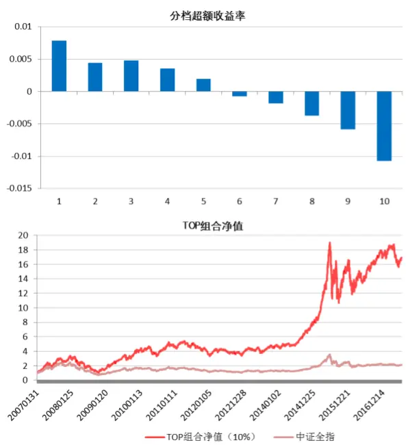

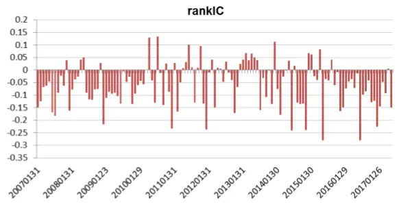

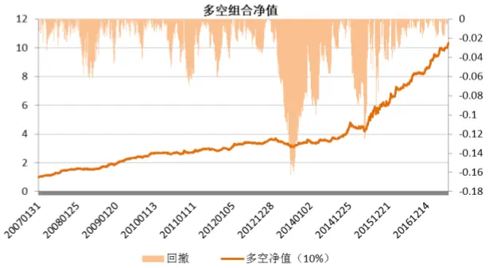

| 组合 | 年化收益 | 最大回撤 | 夏普率 |
| --- | --- | --- | --- |
| TOP组合 | 31.36% | -69.07% | 0.95 |
| 中证全指 | 7.52% | -71.48% | 0.36 |

| 组合 | 年化收益 | 最大回撤 | 信息比 |
| --- | --- | --- | --- |
| 多空组合 | 25.24% | -16.24% | 2.22 |

数据来源：东方证券研究所 Wind 资讯

图 2：因子说明

| 序号 | 因子简称 | 因子计算 | 因子类型 |
| --- | --- | --- | --- |
| 1 | BP_LF | 最新的净资产/市值 | 估值 |
| 2 | EP_TTM | TTM的净利润/总市值 |  |
| 3 | SalesGrowth_Qr_YOY | 营业收入增长率(季度同比） | 成长 |
| 4 | ProfitGrowth_Qr_YOY | 净利润增长率(季度同比） |  |
| 5 6 | Ret1M | 1个月收益反转 | 反转 |
| 7 | IRFF TO | Fama—French回归1-SSR/SST 以流通股本计算的1个月日均换手率 | 非流动性 |

数据来源：东方证券研究所 Wind 资讯

图 3：因子 IC相关性矩阵

| rankIC相关性矩阵 | New_Factor | BP_LF | EP_TTM | SalesGrowth ProfitGrowth Ret1M TO IRFF |  |  |  |  |
| --- | --- | --- | --- | --- | --- | --- | --- | --- |
| New_Factor | 1.000 | -0.938 | -0.500 | 0.544 | 0.360 | 0.282 0.263 |  | 0.466 |
| BP_LF |  | 1.000 | 0.243 | -0.651 | -0.473 | -0.180 -0.228 |  | -0.515 |
| EP_TTM |  |  | 1.000 | 0.217 | 0.284 | -0.313 -0.132 |  | -0.140 |
| SalesGrowth_Qr_YOY |  |  |  | 1.000 | 0.842 | 0.086 0.192 |  | 0.277 |
| ProfitGrowth_Qr_YOY |  |  |  |  | 1.000 | 0.000 | 0.176 | 0.156 |
| Ret1MTOIRFF |  |  |  |  |  | 1.000 | -0.097 | 0.465 |
|  |  |  |  |  |  |  | 1.000 | -0.097 |
|  |  |  |  |  |  |  |  | 1.000 |

数据来源：东方证券研究所 Wind 资讯

为了检查这个因子的增量信息，我们采用 fama-macbeth回归，把上述用来检验相关性因子的因子信息从新因子中剔除，剔除完这些因子的信息之后，新因子的效果大幅减弱，IC为-0.0096，IR为-0.75，可以认为这个因子基本没有什么增量信息。也就是说我们通过线性模型计算的特异市值虽然本身表现不错，但是相比于传统的 alpha因子并没有提供什么额外的信息。

然而，市值和财务变量的关系究竟是什么形式并没有人知道，常规的线性模型虽然  不低，但是并不能解释诸如市值中包含的成长因素等非线性关系。而我们期望的是尽可能的解释公司的市值，这样无法解释的部分才真正是相对高估和低估的部分，因此，我们采用随机森林的算法来对截面的数据进行拟合，以期找到一种解释度最高的映射，使得市场上公司的市值尽可能的被财务数据和市场因素所解释，这样得到的残差值才能真正代表不能被财务数据和市场因素解释的信息。

## 随机森林市值解释模型

这里我们采用随机森林的算法对截面数据进行回归。随机森林和使用决策树作为基本分类器的（bagging）有些类似。以决策树为基本模型的 bagging 在每次 bootstrap 放回抽样之后，产生一棵决策树，抽多少样本就生成多少棵树，在生成这些树的时候没有进行更多的干预。而随机森林也是进行 bootstrap抽样，但它与 bagging的区别是：在生成每棵树的时候，每个节点特征都仅仅在随机选出的少数特征中产生（一般约为总特征的 1/3）。因此，不但样本是随机的，连每个节点特征（Features）的产生都是随机的。在随机森林中，我们将生成很多的决策树，并不像在增强型决策树（CART）模型里一样只生成唯一的树。当在基于某些属性对一个新的对象进行分类判别时，随机森林中的每一棵树都会给出自己的分类选择，并由此进行“投票”，森林整体的输出结果将会是票数最多的分类选项；而在回归问题中，随机森林的输出将会是所有决策树输出的平均值。

随机森林算法有很多的优点：

1. 在数据集上表现良好，两个随机性的引入，使得随机森林不容易陷入过拟合。

2. 在当前的很多数据集上，相对其他算法有着很大的优势，两个随机性的引入，使得随机森林具有很好的抗噪声能力。

3. 它能够处理很高维度（feature 很多）的数据，并且不用做特征选择，对数据集的适应能力强：既能处理离散型数据，也能处理连续型数据，数据集无需规范化。

4. 在创建随机森林的时候，对 generlization error 使用的是无偏估计。

5. 训练速度快，可以得在对数据进行分类的同时，还可以给出各个变量（基因）的重要性评分，评估各个变量在分类中所起的作用。

6. 容易做成并行化方法。

7. 实现比较简单。

详细的机器学习算法介绍请参考我们的报告《东方机器选股模型 Ver 1.0》。

## 模型构建

与线性模型类似，我们把上文中的自变量作为特征输入到随机森林模型中，并设定树的数量为 500，然后分别对每个时间截面的数据进行拟合，表 2 是除了行业虚拟变量外，各个因子的在时间序列上的 importance 均值 ，某个特征的 importance 是包含这个特征的模型 MSE 减去了把这个特征随机打乱后模型的 MSE 得差值，是用来衡量单个特征重要性的指标。I/SST是用 Importance除以整个模型的 SST 的数值，可以用来衡量单个特征特征对于整体模型解释的程度。理论上说，在非线性拟合中，由于特征和残差并不是完全正交的，因此特征的 MSE 总和加上残差的 MSE 总和是不严格等于 SST的，但是实际上，这个模型每期的 Importance总和加上残差 MSE 近似等于 SST（平均差距在 1%以内），因此我们可以近似的把 I/SST看成是单个特征对于被解释变量的解释程度，并且把常规的  近似的看做整个模型的解释度的量度。

表 2：因子重要性和解释度

| Factor | b | LEV | ln(NI)+ | ln(NI)⁻ | g | RD |
| --- | --- | --- | --- | --- | --- | --- |
| Importance | 814.6 | 94.0 | 720.1 | 31.6 | 71.6 | 34.0 |
| I/SST | 40.62% | 4.66% | 36.06% | 1.63% | 3.57% | 1.59% |

数据来源：东方证券研究所 Wind 资讯

从表 2可以看到，在这些特征当中，对数净资产对市值的解释度最高，大约 40.62%的市值被它所解释了，特征重要性也最高，其次是净利润为正的对数净利润，大约 36.06%的市值被它所解释了，重要性最低的是 RD，但是仍然能解释大约 1.59%的市值，所以 RD变量也是有必要加入到模型中的。整体而言，随机森林模型的  均值等于 96.05%，相比于线性模型提升了 18%左右的解释程度，因此这个模型残差里面剩余的基本面信息也就更少，因子的纯净度更高，理论上说因子的效用也会更好。

## 因子测试

我们采用与上文同样的方法对原始因子进行预处理后得到 purified factor， 测试区间依然为2007.1.1-2017.6.30，新的特异市值因子在全市场的 IC 均值为-0.071，IR 为-2.92，表现相当出色，且相比于线性模型有了很大幅度的提升。图 4 是因子在全市场中的测试效果，可以看到分档超额收益的单调性非常好，多空组合年化收益达到了 33.43%，信息比有 2,81，相比于线性模型有了较大的提升，综合来看说明传统的线性模型并不能解释市值中所包含得非线性的财务信息，导致残差因子的信息不纯，因此选股效果明显不如采用机器学习模型。

图 4：机器学习特异市值因子在中证全指中表现情况
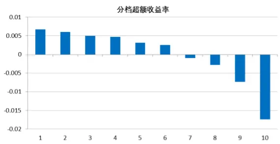

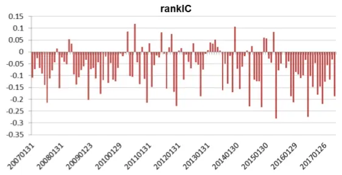

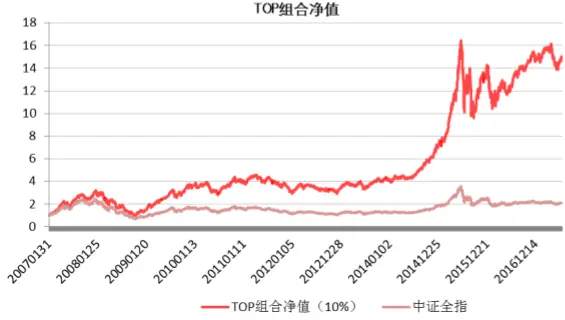

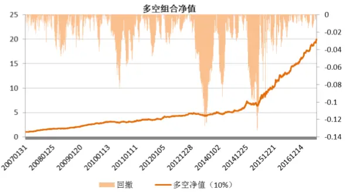

| 组合 | 年化收益 | 最大回撤 | 夏普率 |
| --- | --- | --- | --- |
| TOP组合 | 29.87% | -69.60% | 0.93 |
| 中证全指 | 7.52% | -71.48% | 0.36 |

| 组合 | 年化收益 | 最大回撤 | 信息比 |
| --- | --- | --- | --- |
| 多空组合 | 33.43% | -13.24% | 2.81 |

数据来源：东方证券研究所 Wind 资讯

我们同样检验了新因子和一些不同类型表现比较出色的常用因子的 IC 相关性（图 5）。从图 5 的结果来看，这个因子与 BP_LP 因子呈现出极高的 IC 相关性，达到-0.85%，虽然较线性模型有所下降，但是还是可以基本认为新因子和 BP_LP因子属于同一类型的因子。

那么机器学习得到的特异市值因子究竟有没有增量信息呢？我们同样用 Fama-macbeth 回归剔除了上述因子的信息，剔除信息后的因子平均 IC 为-0.0231，IR 为-1.81，说明这个因子的增量信息还是比较可观的，图 6 是剔除信息后的因子表现情况，可以看到分档收益率依然呈现出一定的单调性，且多空组合的年化收益率依然还有 11.45%，信息比 1.78，可以说即使剔除了上述各类因子的信息，特异市值因子还是有较好的选股作用。

图 5：机器学习特异市值因子和其他因子的平均 IC相关性

| rankIC相关性矩阵 | New_Factor | BP_LF | EP_TTM | SalesGrowth ProfitGrowth Ret1M TO IRFF |  |  |  |  |
| --- | --- | --- | --- | --- | --- | --- | --- | --- |
| New_Factor | 1.000 | -0.850 | -0.621 | 0.425 | 0.270 | 0.255 | 0.353 | 0.370 |
| BP_LF |  | 1.000 | 0.243 | -0.651 | -0.473 | -0.180 | -0.228 | -0.515 |
| EP_TTM |  |  | 1.000 | 0.217 | 0.284 | -0.313 | -0.132 | -0.140 |
| SalesGrowth_Qr_YOY |  |  |  | 1.000 | 0.842 | 0.086 | 0.192 | 0.277 |
| ProfitGrowth_Qr_YOY |  |  |  |  | 1.000 | 0.000 | 0.176 | 0.156 |
| Ret1M |  |  |  |  |  | 1.000 | -0.097 | 0.465 |
| TO |  |  |  |  |  |  | 1.000 | -0.097 |
| IRFF |  |  |  |  |  |  |  | 1.000 |

数据来源：东方证券研究所 Wind 资讯

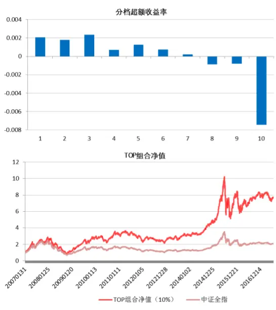

图 6：剔除了各类信息后的因子在中证全指的表现情况

| 组合 | 年化收益 | 最大回撤 | 夏普率 |
| --- | --- | --- | --- |
| TOP组合 | 21.82% | -71.05% | 0.74 |
| 中证全指 | 7.52% | -71.48% | 0.36 |

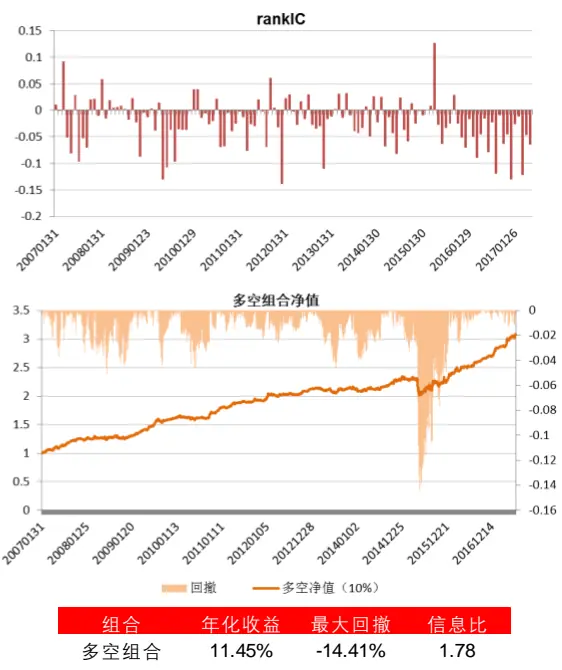

| 组合 | 年化收益 | 最大回撤 | 信息比 |
| --- | --- | --- | --- |
| 多空组合 | 11.45% | -14.41% | 1.78 |

数据来源：东方证券研究所 Wind 资讯

## 图 7：中证 500 内因子表现

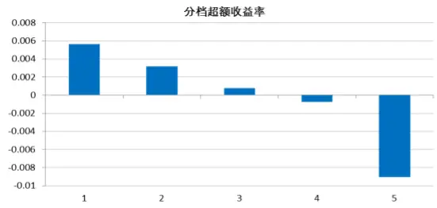

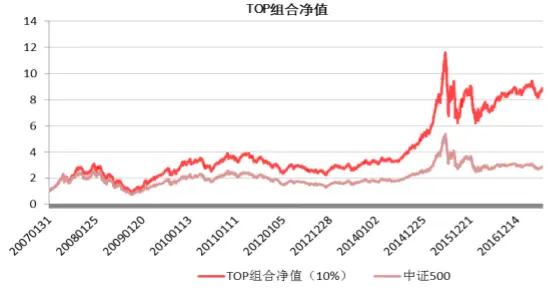

| 组合 | 年化收益 | 最大回撤 | 夏普率 |
| --- | --- | --- | --- |
| TOP组合 | 23.44% | -71.28% | 0.76 |
| 中证500 | 10.68% | -72.12% | 0.44 |

数据来源：东方证券研究所 Wind 资讯

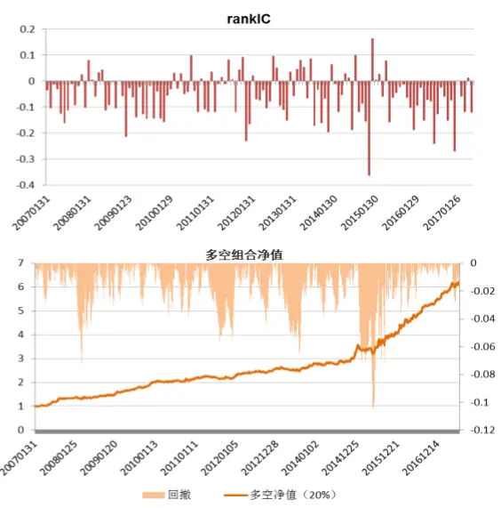

| 组合 | 年化收益 | 最大回撤 | 信息比 |
| --- | --- | --- | --- |
| 多空组合 | 19.29% | -10.50% | 2.08 |

接下来我们测试了特异市值因子在中证 500和沪深 300成分内的表现（图 7,8）。在中证 500样本空间内，特异市值因子的平均 IC 为-0.0569，IR 为-2.26，而同期的 BP_LP 因子的平均 IC 为 0.0401，IR 为 1.43；在沪深 300 样本空间内，特异市值因子的平均 IC 为-0.052，IR 为-1.76，而同期的 BP_LP因子的平均 IC 为 0.0446，IR为 1.34，特异市值因子的表现均一定幅度好于 BP_LP。因子在中证500 内和沪深 300 内的分档单调性较好，在中证 500 内的多空组合年化收益 19.29%，信息比为2.08.在沪深 300 内的多空组合年化收益 18.03%，信息比为 1.74，整体表现都不错。

图 8：沪深 300内因子表现
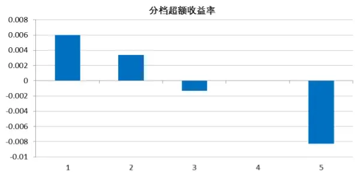

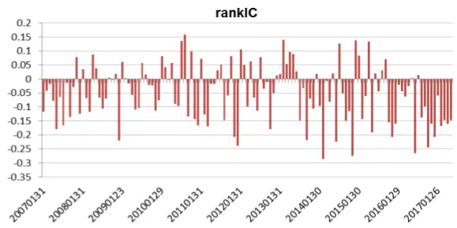

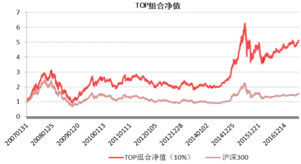

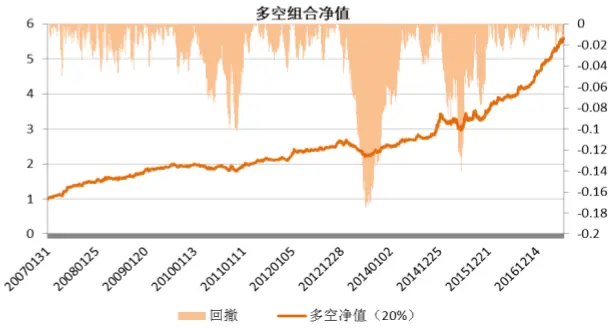

| 组合 | 年化收益 | 最大回撤 | 夏普率 |
| --- | --- | --- | --- |
| TOP组合 | 17.08% | -70.65% | 0.63 |
| 沪深300 | 0.18% | -72.30% | 0.25 |

数据来源：东方证券研究所 Wind 资讯

| 组合 | 年化收益 | 最大回撤 | 信息比 |
| --- | --- | --- | --- |
| 多空组合 | 18.03% | -17.54% | 1.78 |

## 总结

公司的价值取决于市场因素和财务指标，本文对公司的市值进行分解，找到了不能被市场因素和财务指标解释的特异市值，这个因子属于相对估值指标，特异市值较大的股票倾向于下跌，反之亦然。我们对比了传统的线性模型和随机森林模型构建的特异市值因子的效果，相较于线性模型，机器学习的方法能够描述公司市值和财务数据之间的非线性关系，解释程度更高，因子更加纯净，表现更好，且有明显的增量信息。

特异市值与 BP_LP 呈现比较高的 IC 反相关关关系，我们认为他们属于同一类型的因子，但是特异市值表现明显好于BP_LP，因此在做构建多因子模型的时候，可以考虑用特异市值代替BP_LP。

机器学习模型通常被用来学习股票的收益率和因子的关系，但是由于这是一个低信噪比的问题，预测的效果并不是那么强，本文中用机器学习模型解释市值的问题属于高信噪比的问题，同期的财务

数据对市值的解释度高达 96%，且得到的特异市值因子表现较好，算是一种把机器学习应用到金融领域的拓展。

## 风险提示

1. 量化模型基于历史数据分析而得，随着市场的演进变化，模型存在失效的风险；

2. 极端市场环境可能对模型效果造成冲击。

## 参考文献

Rhodes–Kropf, M., Robinson, D. T., & Viswanathan, S. (2005). Valuation waves and merger activity: The empirical evidence. Journal of Financial Economics, 77(3), 561-603.

Hulten, C. R., & Hao, X. (2008). What is a Company Really Worth? Intangible Capital and the" Market to Book Value" Puzzle (No. w14548). National Bureau of Economic Research.

Cho, H. J., & Pucik, V. (2005). Relationship between innovativeness, quality, growth, profitability, and market value. Strategic management journal, 26(6), 555-575.

## 分析师申明

每位负责撰写本研究报告全部或部分内容的研究分析师在此作以下声明：

分析师在本报告中对所提及的证券或发行人发表的任何建议和观点均准确地反映了其个人对该证券或发行人的看法和判断；分析师薪酬的任何组成部分无论是在过去、现在及将来，均与其在本研究报告中所表述的具体建议或观点无任何直接或间接的关系。

## 投资评级和相关定义

报告发布日后的 12个月内的公司的涨跌幅相对同期的上证指数/深证成指的涨跌幅为基准；

## 公司投资评级的量化标准

买入：相对强于市场基准指数收益率 15%以上；

增持：相对强于市场基准指数收益率 5%～15%；

中性：相对于市场基准指数收益率在-5%～+5%之间波动；

减持：相对弱于市场基准指数收益率在-5%以下。

未评级——由于在报告发出之时该股票不在本公司研究覆盖范围内，分析师基于当时对该股票的研究状况，未给予投资评级相关信息。

暂停评级——根据监管制度及本公司相关规定，研究报告发布之时该投资对象可能与本公司存在潜在的利益冲突情形；亦或是研究报告发布当时该股票的价值和价格分析存在重大不确定性，缺乏足够的研究依据支持分析师给出明确投资评级；分析师在上述情况下暂停对该股票给予投资评级等信息，投资者需要注意在此报告发布之前曾给予该股票的投资评级、盈利预测及目标价格等信息不再有效。

## 行业投资评级的量化标准：

看好：相对强于市场基准指数收益率 5%以上；

中性：相对于市场基准指数收益率在-5%～+5%之间波动；

看淡：相对于市场基准指数收益率在-5%以下。

未评级：由于在报告发出之时该行业不在本公司研究覆盖范围内，分析师基于当时对该行业的研究状况，未给予投资评级等相关信息。

暂停评级：由于研究报告发布当时该行业的投资价值分析存在重大不确定性，缺乏足够的研究依据支持分析师给出明确行业投资评级；分析师在上述情况下暂停对该行业给予投资评级信息，投资者需要注意在此报告发布之前曾给予该行业的投资评级信息不再有效。

## 免责声明

本证券研究报告（以下简称“本报告”）由东方证券股份有限公司（以下简称“本公司”）制作及发布。

本报告仅供本公司的客户使用。本公司不会因接收人收到本报告而视其为本公司的当然客户。本报告的全体接收人应当采取必要措施防止本报告被转发给他人。

本报告是基于本公司认为可靠的且目前已公开的信息撰写，本公司力求但不保证该信息的准确性和完整性，客户也不应该认为该信息是准确和完整的。同时，本公司不保证文中观点或陈述不会发生任何变更，在不同时期，本公司可发出与本报告所载资料、意见及推测不一致的证券研究报告。本公司会适时更新我们的研究，但可能会因某些规定而无法做到。除了一些定期出版的证券研究报告之外，绝大多数证券研究报告是在分析师认为适当的时候不定期地发布。

在任何情况下，本报告中的信息或所表述的意见并不构成对任何人的投资建议，也没有考虑到个别客户特殊的投资目标、财务状况或需求。客户应考虑本报告中的任何意见或建议是否符合其特定状况，若有必要应寻求专家意见。本报告所载的资料、工具、意见及推测只提供给客户作参考之用，并非作为或被视为出售或购买证券或其他投资标的的邀请或向人作出邀请。

本报告中提及的投资价格和价值以及这些投资带来的收入可能会波动。过去的表现并不代表未来的表现，未来的回报也无法保证，投资者可能会损失本金。外汇汇率波动有可能对某些投资的价值或价格或来自这一投资的收入产生不良影响。那些涉及期货、期权及其它衍生工具的交易，因其包括重大的市场风险，因此并不适合所有投资者。

在任何情况下，本公司不对任何人因使用本报告中的任何内容所引致的任何损失负任何责任，投资者自主作出投资决策并自行承担投资风险，任何形式的分享证券投资收益或者分担证券投资损失的书面或口头承诺均为无效。

本报告主要以电子版形式分发，间或也会辅以印刷品形式分发，所有报告版权均归本公司所有。未经本公司事先书面协议授权，任何机构或个人不得以任何形式复制、转发或公开传播本报告的全部或部分内容。不得将报告内容作为诉讼、仲裁、传媒所引用之证明或依据，不得用于营利或用于未经允许的其它用途。

经本公司事先书面协议授权刊载或转发的，被授权机构承担相关刊载或者转发责任。不得对本报告进行任何有悖原意的引用、删节和修改。

提示客户及公众投资者慎重使用未经授权刊载或者转发的本公司证券研究报告，慎重使用公众媒体刊载的证券研究报告。

## 东方证券研究所

地址：上海市中山南路 318 号东方国际金融广场 26 楼

联系人： 王骏飞

电话：021-63325888*1131

传真：021-63326786

网址： www.dfzq.com.cn

Email： wangjunfei@orientsec.com.cn