## 研究结论

价值投资不等于低估值投资，低估值股票可能是由于公司质地真的很烂，只考虑股票估值因素容易调入所谓的“估值陷阱”。 所以价值投资一个必要过程是判断上市公司质地是否优良，再看公司质地是否配得上它的估值。我们这篇报告要解决的问题是如何用定量指标来衡量A股上市公司的质量优劣，验证一下 A股是否真如一些市场偏见所言“只听故事，不看基本面”，“优质+合理估值”的价值投资方式能否在 A股挣钱。

公司质量的定义维度有很多，我们从盈利能力、成长性、财务稳健、公司治理角度定量测试了一些选股因子的有效性，具体结果可以参考报告正文，整体来说，基于市场历史公开数据，投资者是可以发现质地优良股票并获得显著超额收益的。

我们用 IC_IR加权的方式把盈利、成长、财务稳健和公司治理四个因子合成一个质量因子，来反应公司基本面的好坏。这个因子的 IC 有 0.04，IC_IR达到 2.7，选股能力强劲，而且非常稳健。上市公司的质地优良属性在时间序列上有延续性，也就是说 A股虽然有个别股票会业绩变脸，但总体看，当前质地优良的股票未来一到三年仍然很可能质地优良。

质量因子可以估值因子结合，形成“寻找质量优良且估值合理”的价值投资方式，合成因子的 IC可以提升到 0.065，IC_IR高达 3.3，指标能力提升显著。考虑到 A股散户交易占比高，投机性强，我们可以再结合投机性指标剔除一些投机性强的股票，这样可以进一步指标的选股能力。

质量因子是基于历史财报信息计算，而市场估值反应的是投资者对公司的预期，两者并非总是相符，例如：2009 年四万亿政策刺激、2014 年底开始的短暂疯狂资金牛市、2015年的国家队救市。这些时段市场估值与公司质量是脱节的，但过去十年总体来看，A股优质公司还是获得了显著估值溢价。在低估值股票里，质量因素导致的估值溢价更明显。

若投资者完全基于质量因子，每个月选质量最优的 50只股票等权构建组合，从 2007.04到 2017.07，年化收益率可达 22%。如果再结合估值因子选股，策略年化收益率可提升到 29%，收益非常可观。把股票池缩小到中证 800成分股后，“质量+估值”的投资策略年化收益有所下降，但仍有 24%，非常适合大型长线机构投资者。

- 公募机构可以考虑以“质量”或“质量+价值”的方式推出相应的因子量化投资产品，与现有主动量化产品形成差异化。

- 量化模型失效风险

- 市场极端环境的冲击

报告发布日期2017 年 08 月 31 日

证券分析师朱剑涛

021-63325888*6077

zhujiantao@orientsec.com.cn

执业证书编号：S0860515060001

相关报告

| 用机器学习解释市值：特异市值因子 | 2017-08-04 |
| --- | --- |
| 预期外的盈利能力 | 2017-07-09 |
| 因子选股与事件驱动的 Bayes 整合 | 2017-06-01 |
| 多因子模型在港股中的应用 | 2017-04-26 |
| 细分行业建模之银行内因子研究 | 2017-04-25 |
| 中美市场因子选股效果对比分析 | 2017-03-06 |
| 组合优化是与非 | 2017-03-06 |

## 一、质优股投资概述

## 1.1 质优股投资与价值投资

价值投资，简单讲就是买入被市场低估的股票，这里涉及两个变量：股票价格和股票价值的比较。实际投资中，质地好、价值高的股票往往价格也高，价格低的股票很可能是一些没有什么价值的股票，因此“低估”表示的是一种相对便宜而非绝对便宜。这个概念在巴菲特 1989年致股东信件有过明确表述：

“ … It's far better to buy a wonderful company at a fair price than a fair company at a wonderful price..."

价值投资不同于量化投资中的估值因子选股，后者是通过 PB、PE 这些指标来选择当前市场状态下估值最低的股票，这样很容易掉入所谓的“估值陷阱”（Value Trap），也就是说股票估值低可能是因为公司真的烂。所以价值投资一个必要过程是判断上市公司质地是否优良，再看公司质地是否配得上它的估值。

我们这篇报告要解决的问题是如何用定量指标来衡量 A 股上市公司的质量优劣，验证一下 A股是否真如一些市场偏见所言“只听故事，不看基本面”，“优质+合理估值”的价值投资方式能否在 A 股挣钱。对于量化投研人员而言，这篇报告的大部分的内容属于基本面 alpha 因子效果测试，我们会对因子的逻辑、计算和分类做详细分析。

## 1.2 质优股应具备的特征

质优股是价值投资者向往的标的，但它是一个模糊的概念，不同的人有不同的质量标准。Novy-Marx (2014) 总结了价值投资之父 Benjiamin Graham 的七个选股判定标准：

1) 公司足够大以应对经济波动；

2) 公司财务稳健、流动比率大于 2，流动资产净额超过长期负债；

3) 过去十年每年都盈利；

4) 过去 20 年每年都有现金分红；

5) 过去十年 EPS 累积增长至少超过 33%

6) PE 不超过 15；

7) PB 不超过 1.5；

其中后两个是估值指标，前五个是用于判断公司优劣的质量指标。但可能由于是年代过于久远，Graham 定义的优质股在美国市场并没有跑赢劣质股（回溯测试时间段 1963.06 – 2013.12），学术研究中用的比较多，而且多次实证有效的指标是 Piotroski (2000)年提出的 F-Score，这是一个多因子综合得分指标，其中有盈利因子指标 4个、债务与资本运作能力指标 3个、公司营运效率 2个（具体参考图 1）,美国市场上 F-Score 得分高的质优股比得分低的劣质股平均每年收益率高2.2%。

目前质量指标定义最全面的应该是AQR首席投资官Asness (2017) 提出的一套多因子打分体系（SSRN 现在提供的是作者 2017 年更新过的 working paper，网上也可以找到更早期的 2013年版本），这套质量打分体系在全球 24个发达国家的股票市场都适用，质优股收益显著高于劣质股。但通过后文的实证会发现，其中很多指标在 A 股没有什么效果，而且因子分类上也有值得商榷的地方。值得一提的是，作者仿照 Fama-French 三因子模型里的市值因子收益率 SMB 和估值因子收益率 HML，构建了 QMJ（Quality minus Junk）组合，用来度量投资组合在质量因子上的风格暴露。Frazzini(2013) 发现 QMJ 可以用来解释股神 Buffet 的 alpha 来源。通过对 BerkshireHathaway 1976.11- 2011.12 年的投资业绩的回归分析，作者发现 Buffet 的投资收益主要来自于挑选安全的（低 beta, 低波动）、便宜的（低 PB）、质优的（质量指标得分高）股票，而不是追踪强势股（美国市场有显著动量效应），然后再利用资金杠杆（作者估计资金杠杆率在 100%-160%之间）放大组合收益。剔除掉这些风格暴露后，Buffet 的 alpha 不再显著。

另外，指数公司已经基于质量指标开发了系列质量指数（图 1），不过这些指数用到的选股指标的有效性需要测试，不能完全只基于因子的经济逻辑，否则会影响策略指数效果。

图 1：质量指标的不同定义

| Quality 指标 指标定义 | 参考资料 |
| --- | --- |
| Graham Score 3) 过去十年每年都盈利 | 1) 流动比率是否大于2； 2)流动资产净额是否超过长期负债 4) 过去十年每年都给股东现金分红 Novy-Marx (2014) 5) 每股盈利相对十年前至少增长30% |
| Piotroski F-Score | 1) 盈利指标4个：ROA，ROA变动，经营现金流/总资产，应计项目(Accruals)/总资产 2)债务与资本运作能力指标3个：资产负债率变动、流动比率变化、去年是否发行普通股 Piotroski (2000) 3)公司运营效率指标：销售毛利率变动，总资产周转率变动 |
| AQR Quality Score | 1)盈利指标6个：毛利/总资产、ROE、ROA、经营现金流/总资产、毛利率、净利润中的现金占比 2)成长指标6个：对应上述六个盈利指标过去五年的平均增长 Asness (2017) 3)安全指标6个：beta、特质波动率、杠杠率、ROE波动率、低破产率(O-score 和 Z-score） 4) Payout指标 3个：净股票发行量、净债务发行量、payout净额/净利润 |
| MSCI Quality Indices 1) ROE 2) 总负债/净资产 | 3)过去五年利润增长率的标准差 MSCI (2013) |
| S&P Quality Indices 1) ROE | 2)总负债/净资产 3)最近一年的净营运资产变化率 S&P Dow Jones Indices (2017) |
| 中证CS质量 1) ROA | 2) 经营活动现金流/ 总负债 3) RACCUAL 盈利质量指标 中证指数公司 |

数据来源：东方证券研究所

我们基于上市公司的利润创造过程（图 2）和因子有效性分析，设计了一套质量因子打分体系，主要从六个方面考虑：盈利、成长、财务稳健、治理优良、分红和投机适度。和 Asness(2017)的分类体系相比，我们把“安全指标”里的低波动、低 beta 拿了出来，因为这两个指标与投资者的投机程度相关，更多反应的是市场对个股的看法；payout 系列指标在国内基本无效，没有采用；另外鉴于国内市场机制和监管机制待完善，我们还加入了公司治理相关的指标。

图 2：上市公司利润创造过程
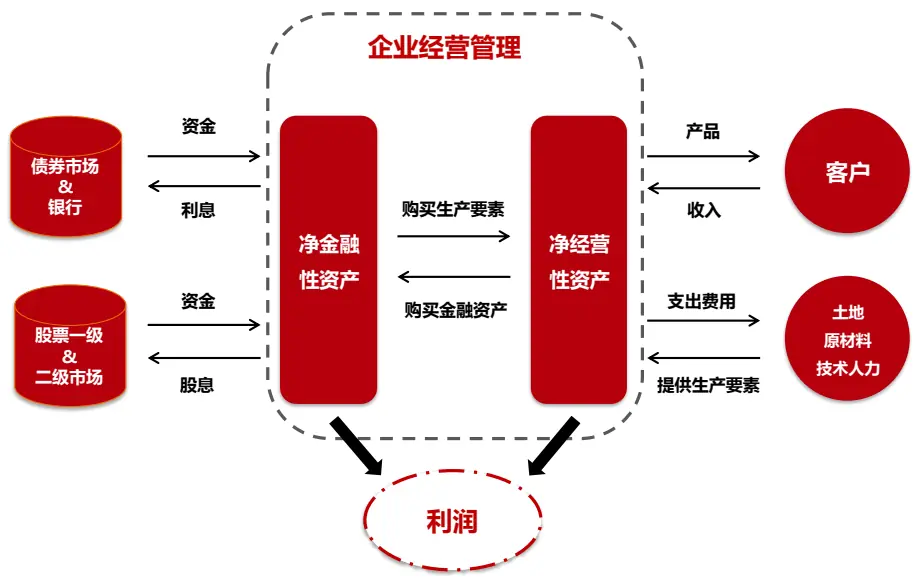
数据来源：东方证券研究所

## 二、质量因子的定义

## 2.1 盈利能力

盈利是投资者最为关注的指标，也是质量因子里其它几类指标的考核基础。按照利润表从上之下的顺序，利润可以分为毛利润、营业利润和净利润。净利润是最为综合的指标，考虑到了各种收入与费用，是股票分红的基础，未分配部分将进入股东权益，常用的 PE、ROE指标也是基于此计算。但也有学者推荐使用另外两个指标，例如：Novy-Marx(2013) 推荐使用毛利润，因为在计算营业利润和净利润时，研发投入和营销费用（广告费、分销商佣金等）是作为营业费用被剔除的，它们会降低当期营业利润和净利润，但事实这些费用可能对上市公司长期竞争力和市场地位的保持有利，因此毛利更能反应公司的真实盈利状况（考虑到 A 股上市公司整体研发投入不大，这个理由在 A 股的有效性可能有限）。而 Fama-French (2015) 推出的五因子资产定价模型里盈利因子的计算使用的是营业利润。三个利润指标反应了上市公司不同的盈利层面，无法互相取代，我们这里都进行了测试，计算净利润时扣除了当期的非经常性损益。

为了使不同大小公司的数据具有可比性，利润指标要除以一个分母，当分母选为营业收入时，可以得到三个常用的选股指标：毛利率(GPM, Gross Profit Margin)、营业利润率（OPM,Operating Profit Margin）和净利率（NPM, Net Profit Margin）。分母也可以是总资产或股东权益，这里我们考察三个指标 ROA、ROE 和 Novy-Marx(2013)建议的 GPOA（Gross Profit OnAsset）。

ROE 是主动投资中使用最为广泛的盈利指标之一，但指标的分母是股东权益，易受上市公司财务杠杆的影响。因此我们也加入测试了 Greenblatt（2010）在他书中提到的一个盈利指标：投资资本回报率（ROIC，Return on Investment Capital），分子是：息税前利润*（1-有效税率）；分母是投资资本，也就是股东权益+有息负债-非经营性资产-超额现金。该指标衡量的是单位投入资本获得的收益，可以和公司的加权资金成本（WACC, Weighted Average Capital Cost）做比较，以判断公司投入的资本是否在创造价值。如果上市公司不存在任何非核心资产和核心收益，可以推导得到

$$
\mathsf{ROE}{=}\mathsf{ROIC}{+}(\mathsf{ROIC}{-}\mathrm{\Delta R_{aftertax}}\mathrm{\Delta})\mathrm{\Sigma}^{\star}\mathsf{NFL}
$$

其中 是税后净利息率（税后利息/净负债）, NFL 是净财务杠杆（净负债/净资产）。财务杠杆可能让 ROIC低的股票出现 ROE 虚高。

需要注意的是 ROIC 的计算方法，Wind 客户端和 FileSync 数据库目前的指标算法有缺陷：一是分子用的是净利润，已经扣掉了利息和所得税，而不是上式的息前税后利润，这样没法和资金成本 WACC 比较；二是投资资本的计算只用到了股东权益+有息负债，没有扣除非经营性资产和超额现金，这种计算方式对超额现金较多的公司影响很大，例如：2017年 7月底，贵州茅台的 TTM平均超额现金达到了 512 亿，按照 Wind 的算法，它的 ROIC 只有 20.7%，但按照标准算法，贵州茅台的 ROIC高达 50.7%，这两个数据是“好公司”与“非常好公司”的差别。

图 3 是个各个行业内股票盈利指标平均值的对比，可以看到行业间差别十分明显，行业因素会干扰指标全市场选股效果。我们在后续实证测试时，选股因子都做了行业和市值的风险中性化处理。另外银行和非银金融两个行业和其它行业在会计计量有所不同，例如资金借贷和证券买卖在一般生产性企业中属于金融活动，但它们却是这两个行业的主营业务；而且这两个行业没有毛利润（银行可以用利差收入替代）、流动资产和流动负债等会计项目，无法计算 GPM、GPOA 和 ROIC 指标。为保证统一，我们在测试选股因子表现时，都把这两个行业的股票拿掉。

图 3：各个行业股票盈利指标的平均取值（2017.07，指标采用 TTM算法）

| 行业 | GrossProfitMargin | OpeatingProfitMargin | NetProfitMargin |  | ROA | ROE | GPOA | ROIC |
| --- | --- | --- | --- | --- | --- | --- | --- | --- |
| 银行 |  | 40.5% | 32.2% |  | 0.8% | 12.7% |  |  |
| 非银行金融 |  | 37.6% | 24.2% |  | 1.8% | 6.3% |  |  |
| 医药 | 49.7% | 16.3% | 11.7% |  | 6.2% | 8.8% | 27.0% | 8.4% |
| 传媒 | 40.0% | 16.6% | 11.6% |  | 5.1% | 7.6% | 18.3% | 6.4% |
| 计算机 | 42.0% | 12.4% | 10.6% |  | 5.1% | 7.3% | 21.4% | 6.8% |
| 交通运输 | 27.6% | 16.9% | 10.5% |  | 3.4% | 5.8% | 10.2% | 5.5% |
| 电力及公用事业 | 29.1% | 14.1% | 9.3% |  | 3.1% | 5.9% | 10.1% | 5.6% |
| 通信 | 31.9% | 10.1% | 8.1% |  | 4.6% | 6.3% | 18.3% | 6.2% |
| 家电 | 27.8% | 10.7% | 7.7% |  | 5.4% | 8.8% | 22.7% | 8.0% |
| 食品饮料 | 41.0% | 12.7% | 7.7% |  | 5.4% | 7.6% | 27.3% | 7.7% |
| 房地产 | 32.7% | 15.7% | 7.2% |  | 1.6% | 4.3% | 8.0% | 4.4% |
| 轻工制造 | 27.8% | 9.8% | 7.1% |  | 5.6% | 8.6% | 20.4% | 8.1% |
| 基础化工 | 25.9% | 10.0% | 7.0% |  | 4.4% | 6.4% | 15.8% | 6.1% |
| 电子元器件 | 26.2% | 9.1% | 6.8% |  | 4.5% | 6.8% | 16.1% | 6.4% |
| 汽车 | 23.3% | 9.7% | 6.5% |  | 4.3% | 7.2% | 15.9% | 6.4% |
| 机械 | 30.0% | 8.6% | 6.2% |  | 3.2% | 4.2% | 14.2% | 4.7% |
| 建材 | 27.0% | 9.1% | 5.9% |  | 2.5% | 4.0% | 12.6% | 4.5% |
| 餐饮旅游 | 44.6% | 11.6% | 5.9% |  | 2.3% | 3.3% | 17.5% | 4.4% |
| 电力设备 | 27.1% | 8.1% |  | 5.8% | 3.0% | 4.9% | 13.8% | 4.9% |
| 农林牧渔 | 23.8% | 7.8% | 5.6% |  | 3.6% | 5.0% | 13.8% | 5.0% |
| 建筑 | 20.6% | 8.2% | 5.5% |  | 3.3% | 7.5% | 11.7% | 6.2% |
| 纺织服装 | 32.9% | 8.9% | 5.1% |  | 3.9% | 5.3% | 22.8% | 5.6% |
| 国防军工 | 28.7% | 7.7% | 4.6% |  | 2.1% | 3.5% | 12.9% | 3.5% |
| 综合 | 26.4% | 10.1% | 4.2% |  | 1.6% | 2.8% | 9.2% | 3.9% |
| 有色金属 | 20.8% | 10.2% | 3.9% |  | 2.4% | 3.7% | 11.0% | 4.3% |
| 商贸零售 | 22.9% | 7.8% | 3.4% |  | 1.8% | 3.3% | 18.4% | 4.0% |
| 石油石化 | 17.7% | 4.8% | 3.3% |  | 2.8% | 5.3% | 13.1% | 4.6% |
| 煤炭 | 24.0% | 8.0% | 1.8% |  | 1.2% | 2.5% | 10.7% | 3.4% |
| 钢铁 | 15.7% | 4.7% | 1.3% |  | 1.5% | 3.6% | 9.8% | 3.4% |

数据来源：东方证券研究所 & Wind 资讯

图 4：毛利率（GPM）因子测试结果(2006.01- 2017.07)

|  | 原始因子 |  |  | 行业和市值中性化因子 |  |  |  |  |  |  |
| --- | --- | --- | --- | --- | --- | --- | --- | --- | --- | --- |
|  | IC | IC_IR | p-val | IC | IC_IR p-val 多空组合月收益 月胜率 |  |  |  | 夏普值 | 最大回撤 |
| 中证全指 | 0.008 | 0.26 | 0.383 | 0.014 | 0.70 | 0.019 | 0.5% | 59.4% | 0.40 | -14.6% |
| 沪深300 | 0.023 | 0.48 | 0.104 | 0.012 | 0.52 | 0.080 | 0.2% | 52.9% | 0.00 | -33.6% |
| 中证500 | 0.014 | 0.44 | 0.140 | 0.020 | 0.99 | 0.001 | 0.4% | 53.6% | 0.31 | -26.1% |

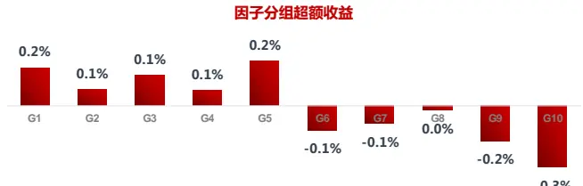

图 5：营业利润率（OPM）因子测试结果(2006.01- 2017.07)

|  | 原始因子 |  |  | 行业和市值中性化因子 |  |  |  |  |  |  |
| --- | --- | --- | --- | --- | --- | --- | --- | --- | --- | --- |
|  | IC | IC_IR | p-val | IC | IC_IR p-val 多空组合月收益 月胜率 |  |  |  | 夏普值 | 最大回撤 |
| 中证全指 | 0.000 | 0.00 | 0.998 | 0.021 | 0.83 | 0.006 | 0.2% | 55.8% | 0.05 | -34.4% |
| 沪深300 | 0.017 | 0.37 | 0.218 | 0.008 | 0.34 | 0.257 | 0.0% | 48.6% | -0.14 | -42.4% |
| 中证500 | 0.011 | 0.34 | 0.250 | 0.031 | 1.30 | 0.000 | 0.5% | 58.0% | 0.31 | -29.1% |

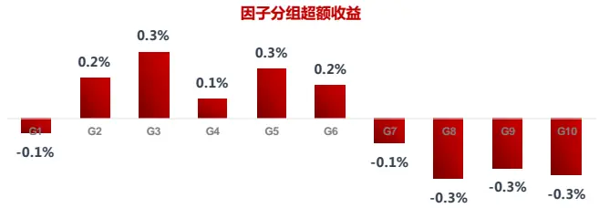

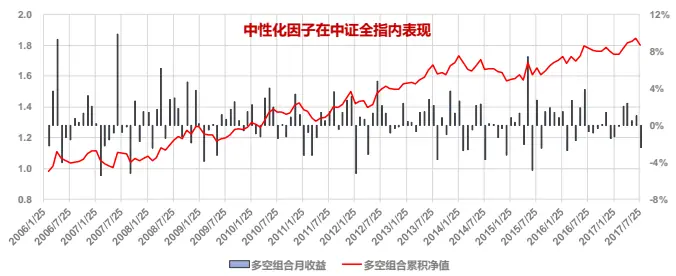
资料来源：东方证券研究所 & Wind 资讯

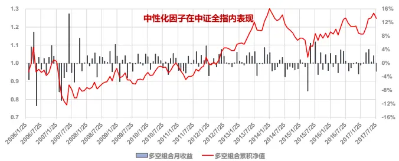
资料来源：东方证券研究所 & Wind 资讯

图 6：净利率（NPM）因子测试结果(2006.01- 2017.07)

|  | 原始因子 |  |  | 行业和市值中性化因子 |  |  |  |  |  |  |
| --- | --- | --- | --- | --- | --- | --- | --- | --- | --- | --- |
|  | IC | IC_IR | p-val | IC | IC_IR p-val 多空组合月收益 月胜率 |  |  |  | 夏普值 | 最大回撤 |
| 中证全指 | 0.003 | 0.09 | 0.763 | 0.020 | 0.76 | 0.011 | 0.3% | 53.6% | 0.13 | -31.9% |
| 沪深300 | 0.018 | 0.41 | 0.168 | 0.010 | 0.39 | 0.189 | -0.1% | 50.7% | -0.24 | -45.4% |
| 中证500 | 0.009 | 0.27 | 0.369 | 0.027 | 1.06 | 0.000 | 0.5% | 58.0% | 0.31 | -32.0% |

图 7：ROA 因子测试结果(2006.01- 2017.07)

|  | 原始因子 |  |  | 行业和市值中性化因子 |  |  |  |  |  |  |
| --- | --- | --- | --- | --- | --- | --- | --- | --- | --- | --- |
|  | IC | IC_IR | p-val | IC | IC_IR p-val 多空组合月收益 月胜率 |  |  |  | 夏普值 | 最大回撤 |
| 中证全指 | 0.006 | 0.14 | 0.634 | 0.026 | 0.88 | 0.003 | 0.4% | 52.9% | 0.23 | -36.6% |
| 沪深300 | 0.016 | 0.35 | 0.242 | 0.019 | 0.67 | 0.026 | 0.3% | 55.8% | 0.07 | -41.2% |
| 中证500 | 0.013 | 0.32 | 0.277 | 0.032 | 1.11 | 0.000 | 0.7% | 56.5% | 0.47 | -37.5% |

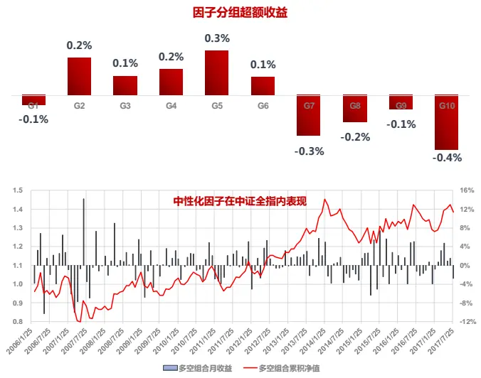
资料来源：东方证券研究所 & Wind 资讯

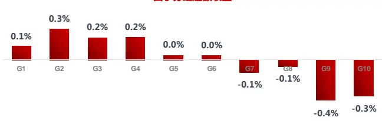

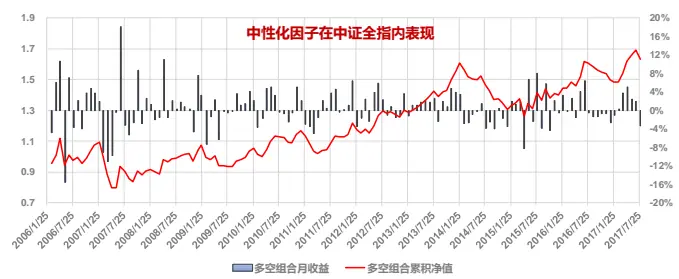
资料来源：东方证券研究所 & Wind 资讯

图 8：ROE 因子测试结果(2006.01- 2017.07)

|  | 原始因子 |  |  | 行业和市值中性化因子 |  |  |  |  |  |  |
| --- | --- | --- | --- | --- | --- | --- | --- | --- | --- | --- |
|  | IC | IC_IR | p-val | IC | IC_IR p-val 多空组合月收益 月胜率 |  |  |  | 夏普值 | 最大回撤 |
| 中证全指 | 0.004 | 0.11 | 0.722 | 0.029 | 1.02 | 0.001 | 0.5% | 56.5% | 0.30 | -35.3% |
| 沪深300 | 0.027 | 0.57 | 0.056 | 0.019 | 0.63 | 0.035 | 0.6% | 60.9% | 0.34 | -41.6% |
| 中证500 | 0.014 | 0.34 | 0.256 | 0.033 | 1.11 | 0.000 | 0.7% | 58.7% | 0.47 | -31.6% |

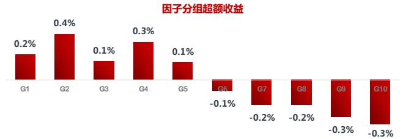

图 9：GPOA 因子测试结果(2006.01- 2017.07)

|  | 原始因子 |  |  | 行业和市值中性化因子 |  |  |  |  |  |  |
| --- | --- | --- | --- | --- | --- | --- | --- | --- | --- | --- |
|  | IC | IC_IR | p-val | IC IC_IR p-val |  | 多空组合月收益月胜率 |  |  |  | 夏普值 最大回撤 |
| 中证全指 | 0.014 | 0.35 | 0.243 | 0.027 | 1.13 | 0.000 | 0.7% | 59.4% | 0.55 | -25.6% |
| 沪深300 | 0.023 | 0.45 | 0.128 | 0.027 | 0.98 | 0.001 | 0.6% | 58.7% | 0.37 | -32.1% |
| 中证500 | 0.017 | 0.37 | 0.213 | 0.028 | 1.09 | 0.000 | 0.8% | 55.8% | 0.57 | -26.0% |

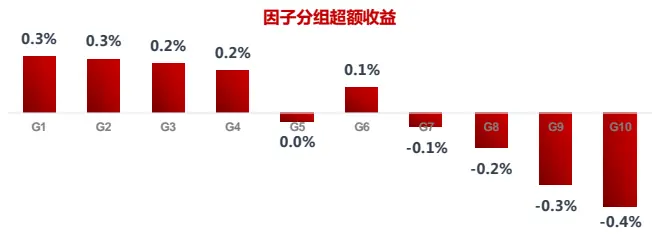

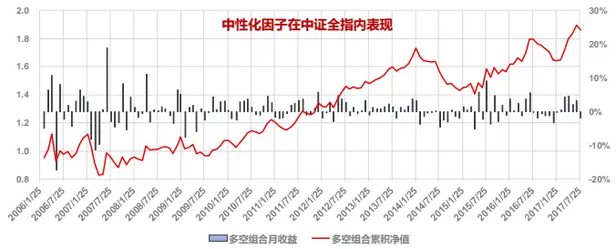
资料来源：东方证券研究所 & Wind 资讯

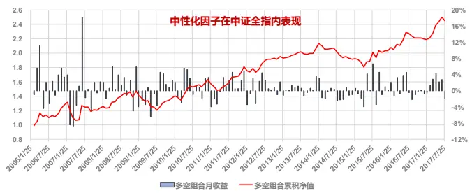
资料来源：东方证券研究所 & Wind 资讯

图 10：ROIC 因子测试结果(2006.01- 2017.07)

|  | 原始因子 |  |  | 行业和市值中性化因子 |  |  |  |  |  |  |
| --- | --- | --- | --- | --- | --- | --- | --- | --- | --- | --- |
|  | IC | IC_IR | p-val | IC | IC_IR p-val 多空组合月收益 月胜率 |  |  | 夏普值 |  | 最大回撤 |
| 中证全指 | 0.006 | 0.14 | 0.637 | 0.029 | 1.10 | 0.000 | 0.7% | 54.3% | 0.45 | -31.5% |
| 沪深300 | 0.018 | 0.36 | 0.228 | 0.021 | 0.76 | 0.011 | 0.5% | 60.1% | 0.24 | -39.6% |
| 中证500 | 0.014 | 0.34 | 0.253 | 0.035 | 1.31 | 0.000 | 0.7% | 62.3% | 0.43 | -29.2% |

图 11：RONOA 因子测试结果(2006.01- 2017.07)

|  | 原始因子 |  |  | 行业和市值中性化因子 |  |  |  |  |  |  |
| --- | --- | --- | --- | --- | --- | --- | --- | --- | --- | --- |
|  | IC | IC_IR | p-val | IC | IC_IR p-val 多空组合月收益 月胜率 |  |  |  | 夏普值 | 最大回撤 |
| 中证全指 | 0.006 | 0.13 | 0.651 | 0.029 | 1.10 | 0.000 | 0.6% | 55.8% | 0.41 | -30.8% |
| 沪深300 | 0.030 | 0.62 | 0.036 | 0.019 | 0.70 | 0.020 | 0.4% | 54.3% | 0.24 | -35.8% |
| 中证500 | 0.014 | 0.35 | 0.242 | 0.035 | 1.34 | 0.000 | 0.6% | 58.0% | 0.42 | -28.2% |

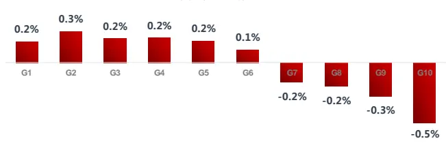

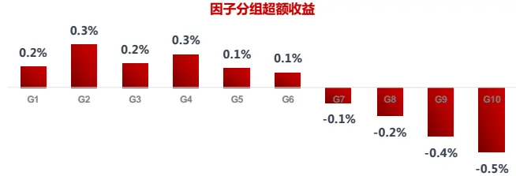

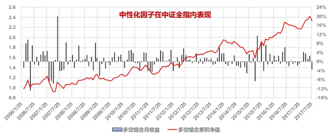
资料来源：东方证券研究所 & Wind 资讯

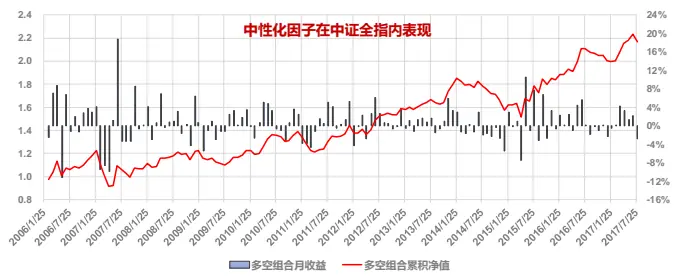
资料来源：东方证券研究所 & Wind 资讯

图 4 至图 10 是我们对以上七个盈利因子选股能力的实证测试。可以看到

1) 原始因子因为受到行业和市值因素的影响，基本上没有什么选股能力，中性化处理后因子IC 和 IC_IR 明显提升。

2) 七个盈利因子都是在中证 500 成份股里面 IC 最高，沪深 300 成份股里 IC 最低。中证全指可以近似看作沪深 300+中证 500+其它小股票的总和，盈利因子在中证全指里的 IC介于沪深 300和中证 500之间。盈利因子在以中证 500为代表的中盘股里选股效果最好。

3) 不同盈利因子构建的多空组合在 2014 年都经历了一次大幅回撤。这可能和当年资本市场借壳上市的需求飙升有关，50家企业计划通过借壳曲线上市，并有 20家左右企业当年成功实现借壳，这两个数字分别是 2013年的三倍和两倍，业绩差的壳资源公司受到市场热炒，导致盈利因子表现大幅回撤。

4) 三个利润率指标里，OPM 表现最好，但这三个指标在沪深 300 里基本都没有什么选股能力。GPOA 的表现比 ROA 更稳健，特别是在沪深 300成份股里面。从证券估值角度讲，ROIC 比 ROE更能准确判断上市公司是否在创造价值，但是实际的选股能力相差不大。

另外我们在上期报告中把净资产进一步划分为净经营资产和净金融资产，考察经营利润和净经营资产的比值（RONOA），更能准确的反映上市公司经营活动的盈利能力。需要注意的是，之前报告在计算 NOA 时，把所有现金作为金融资产全部剔除，但现金中有一部分是用来填补流动负债的缺口，属经营活动所必需；填补缺口后的超额现金（见下式）再作为金融资产剔除可能更合适。

$$
\begin{array}{rlr}{\frac{\pm\beta}{2\sqrt{16}}\frac{\hbar}{2}\pmb{\mathbb{E}}[\pmb{\frac{\hbar}{2}}]}&{=}&{\pm\pmb{\mathbb{M}}\frac{\hbar}{2}-\boldsymbol{m}\Delta\mathbf{\times}(\frac{\hbar}{2\sqrt{16}}\frac{-1}{2}\hbar\frac{\hbar}{2}\pmb{\frac{\hbar}{2}}-(\sqrt{26}\frac{-1}{2}\hbar\frac{\hbar}{2}\hbar\frac{\hbar}{2}-\hbar\frac{\hbar}{2}\pmb{\frac{\hbar}{2}}),0)}\end{array}
$$

这种计算方法的差别对现金充裕的公司影响很大，例如格力电器，如果剔除全部现金，NOA 将变为负值；如果是剔除超额现金，2017.07.31 日的 NOA 接近 700 亿。不过 RONOA 的选股能力和其它盈利因子比并无明显优势（图 11）。

上市公司 RONOA 相对稳定，可以用上期的财务数据来预测。在之前报告《预期外的盈利能力》中，我们通过线性回归的方式得到下一期的 RONOA 预测值，用真实值减去预测值作为预期外的盈利能力（URONOA, Unexpected RONOA），选股能力十分优秀（中性化后因子 IC 等于0.043, IC_IR 达到 3）。之前报告采用的是季度数据进行回归计算，这里为了保证一致，我们用TTM数据构建了 URONOA，选股能力弱于季度数据得到的因子（图 12），但明显强于 RONOA，IC_IR从 1.1 提升到 2.1， 多空组合最大回撤从-30.8%将为-18.2%。如果把预测方法从线性回归改为随机森林，因子的效果可以进一步提升，多空组合的 Sharpe 值从 0.7 提升到 1.0，最大回撤从 18.2% 降为 -12%。

我们在之前报告《东方机器选股模型 Ver 1.0》中发现，预测标的是股票收益率时，随机森林相对简单线性模型并无显著优势，主要是因为股票收益率的数据噪音大、时变性强。但当预测标的是 RONOA 这样相对稳定的数据、或者像在报告《用机器学习解释市值：特异市值因子》中不是做预测性模型，而是做解释性模型时，机器学习方法相对线性模型有明显优势。因此，投资者在构建类似 URONOA 这种残差型因子时都可以考虑采用机器学习方法。不过，需要注意的是，模型的输入变量因尽量避免使用因子库里同期的其它 alpha因子，否则后续在做多因子模型时，因子间的关系会变得杂糅，残差型因子对整个因子库也可能没有信息增量。

图 12：URONOA - Linear 因子测试结果(2008.01- 2017.07)

|  | 原始因子 |  |  | 行业和市值中性化因子 |  |  |  |  |  |  |
| --- | --- | --- | --- | --- | --- | --- | --- | --- | --- | --- |
|  | IC | IC_IR | p-val | IC | IC_IR p-val 多空组合月收益 月胜率 |  |  |  | 夏普值 | 最大回撤 |
| 中证全指 | 0.021 | 1.12 | 0.001 | 0.028 | 2.08 | 0.000 | 0.6% | 63.2% | 0.70 | -18.2% |
| 沪深300 | 0.037 | 1.14 | 0.001 | 0.022 | 0.95 | 0.004 | 0.5% | 59.6% | 0.33 | -24.1% |
| 中证500 | 0.025 | 0.97 | 0.004 | 0.036 | 1.96 | 0.000 | 1.0% | 64.9% | 1.15 | -18.7% |

图 13：URONOA – RF 因子测试结果(2008.01- 2017.07)

|  | 原始因子 |  |  | 行业和市值中性化因子 |  |  |  |  |  |  |
| --- | --- | --- | --- | --- | --- | --- | --- | --- | --- | --- |
|  | IC | IC_IR | p-val | IC | IC_IR p-val | 多空组合月收益月胜率 |  | 夏普值 |  | 最大回撤 |
| 中证全指 | 0.024 | 1.36 | 0.000 | 0.029 | 2.23 | 0.000 | 0.7% | 63.2% | 0.97 | -12.0% |
| 沪深300 | 0.037 | 1.26 | 0.000 | 0.024 | 1.16 | 0.001 | 0.6% | 60.5% | 0.52 | -22.7% |
| 中证500 | 0.024 | 1.01 | 0.002 | 0.033 | 1.91 | 0.000 | 1.1% | 66.7% | 1.26 | -19.4% |

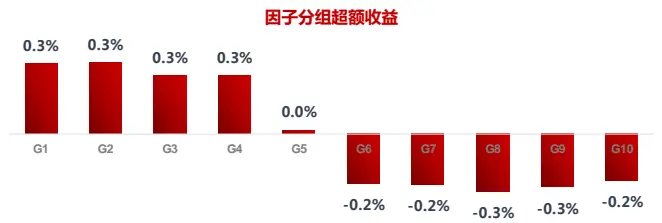

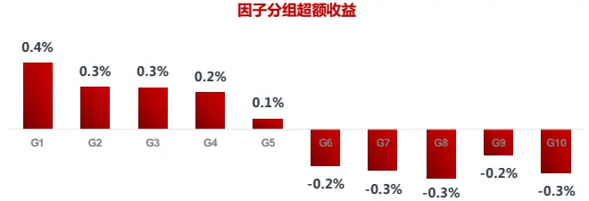

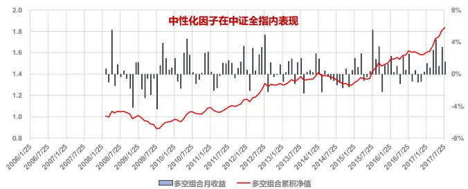
资料来源：东方证券研究所 & Wind 资讯

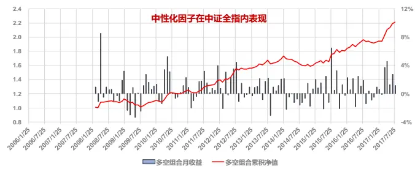
资料来源：东方证券研究所 & Wind 资讯

与盈利紧密相关的一个指标是盈利质量（EQ, Earnings Quality），它关注的是财务报表中的应计项目、折旧和摊销等会计处理方式选择可能带来的财报利润操控。盈利质量是主动投资中常用的概念，需要去分析这些可操控项目的每一笔变动，但量化投资的研究对象是往往是一个大股票池，按主动的做法工作量巨大，我们更需要的是一个汇总的指标。Sloan(1996)最早发现了财报中应计项目大小对股票收益的影响，他把应计项目（Accruals）定义为非现金营运资本变动与折旧费的差额比上总资产，实证显示应计项目高的股票未来收益要低于应计项目低的股票。这种应计项目导致异常收益的现象（Accruals Anomaly）在全球市场都存在，不受各地会计准则差异的影响（LaFond(2005)），而且无法被常见的风险因子所解释（Fama & French (2008)）。应计项目异象的一种解释是：高应计项目会导致未来收入的不确定性增高, 而这点往往被大多数投资者忽视，造成盈利预期过于乐观，股价高估，未来会经历一个价值回复的过程。

盈利质量度量的方式有很多, Decaw(2010) 做过一个很完备的review，我们测试了其中两种：一种是把 Accrual 定义为营业利润和经营现金流的差额，另一种是用这个 Accrual 对同期的营业收入变动、应收项目变动和固定资产做回归，取残差项作为异常应计项目（Abnormal Accruals）。两种方法定义的盈利质量因子表现都不好，IC 仅 0.01，而且 t 检验不显著。造成这种现象的可能原因是：盈利质量低的股票往往都是一些小股票，A 股过去几年的强市值效应掩盖了盈利质量因子，随着市值效应的降低，投资者有必要把盈利质量因子加入备选 alpha因子库做持续跟踪观察。

与盈利相关而且行之有效的一个因子是营业利润占比（营业利润/总利润），营业外收入占比过高的公司，盈利很难稳定持续。实证发现确实营业外收入占比高的公司表现更差，这个因子的IC 虽然不高，只有 0.023，但 IC_IR达到 1.43，多空组合最大回撤只有 12.7%，比较稳健。

图 14：营业利润占比因子测试结果(2006.01- 2017.07)

|  | 原始因子 |  |  | 行业和市值中性化因子 |  |  |  |  |  |  |
| --- | --- | --- | --- | --- | --- | --- | --- | --- | --- | --- |
|  | IC | IC_IR | p-val | IC | IC_IR | p-val | 多空组合月收益月胜率 |  | 夏普值 | 最大回撤 |
| 中证全指 | -0.002 | -0.09 | 0.754 | 0.023 | 1.43 | 0.000 | 0.6% | 57.2% | 0.60 | -12.7% |
| 沪深300 | 0.010 | 0.28 | 0.339 | -0.001 | -0.03 | 0.922 | -0.1% | 50.7% | -0.22 | -41.1% |
| 中证500 | 0.006 | 0.27 | 0.358 | 0.022 | 1.29 | 0.000 | 0.6% | 56.5% | 0.58 | -17.7% |

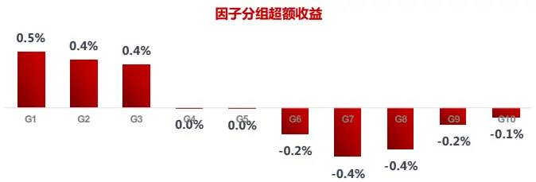

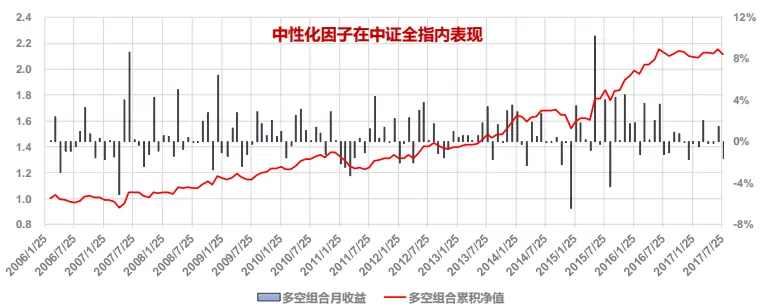
数据来源：东方证券研究所 & Wind 资讯

## 2.2 成长性

成长是公司盈利向未来的延伸，是未来现金流的保障。成长最直接的度量方式是净利润的同比增长，但需要注意的是上一期净利润为负时，净利润增长率的计算方式，因为个别时期亏损公司的占比很高（图 15）。常用的方法是用对分母取绝对值，但这样会产生逻辑谬误。例如：假设 A公司去年亏损 2 亿，今年亏损一亿；B 公司去年盈利 1 亿，今年盈利 1.5 亿，按照取绝对值的方法，A 和 B公司的净利增长率都是 50%，但显然投资者更愿意选择 B公司。我们现在的做法是把去年净利润小于 100 万的都作为缺省值，后面测试因子表现时用行业中位数填补缺省值，这样做相当于认为去年微利和亏损的公司，今年的净利增长都能达到行业平均水平，是一种不可能合理前提下尽可能合理的处理方式。实证来看（图 17），净利增长率的选股能力一般，按净利增长率分组后股票收益的单调性不强：净利增长最快的股票收益并非最高（这可能和财报信息的提前泄漏有关，参考前期报告《寻找贡献真实alpha 的事件》，也有可能是上市公司像掌趣科技那样牺牲 ROE 来获取净利高速增长），增长最慢的股票收益并非最差；倒是增长速度处于中间档的股票，股票收益随着净利增长率提升而增大。营业收入增长率因子（图 18）的 IC和 IC_IR都要比净利增长率因子差，但是营收增速最高的股票和最差的股票收益差异明显，多空组合相对更稳健。

另一种计算成长能力的方法，是用利润的变动值做分子，分母则取为总资产、净资产等大概率为正数的指标。这样可以避免上述增长率指标计算时分母为负值的问题，但得到的成长指标揉入了上市公司盈利能力的影响，没有上面两个增长率指标纯净。图 19-图 22测试了 GPOA变动，ROE变动、ROIC 变动和 URONOA 变动四个指标（计算时用当期指标 TTM 数值减去一年前的 TTM 数值），其中 GPOA变动因子的整体表现最好；URONOA 变动因子虽然 IC不高，但最稳定，IC_IR达到 2.2，多空组合回撤仅 6.8%。值的注意的是 ROE 变动的分组超额收益图，ROE 增量最大的股票收益并非最高，仅属于中等略微偏上的水平。另外我们也测试了 Cooper(2008)提到的总资产增长率指标，表现一般，可能原因是总资产这个指标概念太大，涵盖了太多因素，这些因素的相互影响方式在海外和国内市场可能很不一样。

图 15：TTM 净利率为负公司的占比(2006.01- 2017.07)
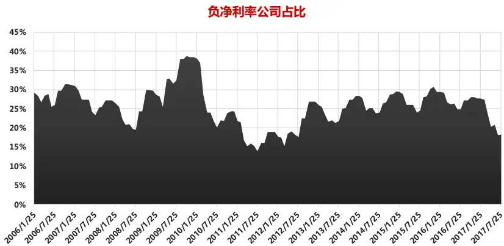
数据来源：东方证券研究所 & Wind 资讯

图 16：各个行业股票成长指标的平均取值（2017.07，指标采用 TTM算法）

| 行业 净利润增长率 |  | 营收增长率 总资产增长率 |  | GPOA变动 | ROE变动 | ROIC变动 | URONOA变动 |
| --- | --- | --- | --- | --- | --- | --- | --- |
| 煤炭 | 164.4% | 28.7% | 5.3% | 4.7% | 4.8% | 3.0% | 2.5% |
| 有色金属 | 65.8% | 20.4% | 17.0% | 1.9% | 3.0% | 2.0% | 2.1% |
| 房地产 | 55.8% | 36.4% | 29.4% | 0.1% | 1.1% | 1.4% | 1.5% |
| 基础化工 | 44.0% | 24.6% | 27.3% | -0.1% | 0.0% | 0.1% | 0.3% |
| 农林牧渔 | 43.6% | 22.5% | 19.5% | 0.0% | 0.6% | 0.8% | -0.1% |
| 石油石化 | 42.3% | 13.8% | 13.3% | 0.8% | 1.1% | 0.9% | 0.3% |
| 汽车 | 41.6% | 26.2% | 27.0% | 0.0% | 0.0% | 0.3% | 0.3% |
| 电子元器件 | 40.7% | 31.7% | 32.0% | -0.5% | -0.1% | -0.1% | 0.9% |
| 综合 | 38.0% | 30.1% | 30.5% | -0.1% | 0.8% | 0.9% | 0.5% |
| 家电 | 37.4% | 18.3% | 30.3% | -1.1% | -0.4% | 0.6% | 1.2% |
| 传媒 | 33.1% | 32.5% | 44.6% | -1.9% | -1.7% | -1.0% | -0.4% |
| 轻工制造 | 31.8% | 18.7% | 25.2% | -1.0% | -0.9% | -0.1% | -0.4% |
| 交通运输 | 31.3% | 28.1% | 27.0% | 0.2% | 0.6% | 0.6% | 0.7% |
| 钢铁 | 29.4% | 28.0% | 12.3% | 3.2% | 3.8% | 2.5% | 3.9% |
| 建筑 | 27.2% | 15.3% | 25.9% | -2.2% | -1.5% | -1.5% | -0.2% |
| 医药 | 26.9% | 20.3% | 26.8% | -0.6% | -0.6% | -0.7% | 0.7% |
| 机械 | 24.8% | 21.4% | 25.9% | -0.7% | -0.9% | -0.8% | 0.7% |
| 电力及公用事业 | 23.7% | 23.1% | 28.6% | -1.3% | -0.9% | -0.5% | -0.7% |
| 商贸零售 | 23.0% | 8.6% | 18.4% | -0.9% | 0.2% | -0.1% | 1.1% |
| 食品饮料 | 22.4% | 15.0% | 14.9% | -0.3% | 0.2% | 0.6% | 1.0% |
| 计算机 | 22.1% | 24.7% | 36.7% | -1.9% | -1.6% | -1.9% | 0.4% |
| 纺织服装 | 21.7% | 12.6% | 17.5% | -1.3% | -1.4% | -1.3% | -0.3% |
| 电力设备 | 21.0% | 18.5% | 25.4% | -1.3% | -1.6% | -1.3% | -1.5% |
| 建材 | 20.7% | 26.1% | 16.8% | 0.5% | 0.9% | 0.4% | 1.3% |
| 餐饮旅游 | 15.9% | 25.0% | 33.7% | -1.3% | -0.6% | -0.7% | -0.8% |
| 通信 | 14.3% | 18.9% | 34.3% | -2.5% | -2.2% | -1.6% | -0.8% |
| 国防军工 | 7.8% | 19.6% | 18.6% | -0.5% | -0.7% | -0.9% | -1.4% |
| 银行 | 5.7% | 3.6% | 17.4% |  | -1.6%-4.9% |  |  |
| 非银行金融 | -14.1% | -7.2% | 14.1% |  |  |  |  |

数据来源：东方证券研究所 & Wind 资讯

图 17：净利润增长率因子测试结果(2007.01- 2017.07)

|  | 原始因子 |  |  | 行业和市值中性化因子 |  |  |  |  |  |  |
| --- | --- | --- | --- | --- | --- | --- | --- | --- | --- | --- |
|  | IC | IC_IR | p-val | IC | IC_IR p-val 多空组合月收益 月胜率 |  |  |  |  | 夏普值 最大回撤 |
| 中证全指 | 0.013 | 0.52 | 0.096 | 0.027 | 1.82 | 0.000 | 0.3% | 54.0% | 0.27 | -17.7% |
| 沪深300 | 0.027 | 0.67 | 0.031 | 0.020 | 0.90 | 0.004 | 0.6% | 61.1% | 0.45 | -17.9% |
| 中证500 | 0.015 | 0.53 | 0.090 | 0.029 | 1.52 | 0.000 | 0.4% | 55.6% | 0.26 | -28.4% |

图 18：营业收入增长因子测试结果(2007.01- 2017.07)

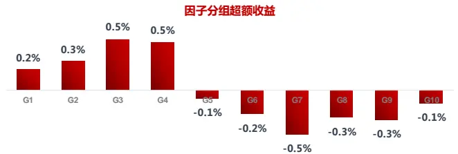

|  | 原始因子 |  |  | 行业和市值中性化因子 |  |  |  |  |  |  |
| --- | --- | --- | --- | --- | --- | --- | --- | --- | --- | --- |
|  | IC | IC_IR | p-val | IC | IC_IR p-val 多空组合月收益 月胜率 |  |  |  | 夏普值 最大回撤 |  |
| 中证全指 | 0.007 | 0.29 | 0.349 | 0.019 | 1.00 | 0.002 | 0.4% | 57.1% | 0.37 | -11.7% |
| 沪深300 | 0.019 | 0.50 | 0.106 | 0.018 | 0.88 | 0.005 | 0.5% | 55.6% | 0.37 | -15.6% |
| 中证500 | 0.007 | 0.25 | 0.411 | 0.024 | 1.17 | 0.000 | 0.7% | 58.7% | 0.54 | -25.2% |

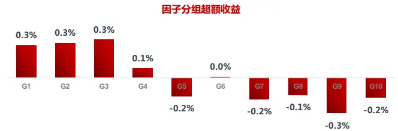

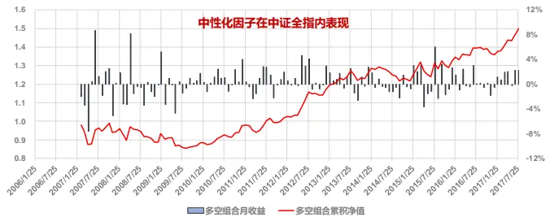
资料来源：东方证券研究所 & Wind 资讯

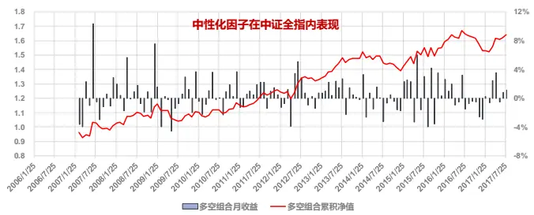
资料来源：东方证券研究所 & Wind 资讯

图 19：GPOA 变动因子测试结果(2007.01- 2017.07)

|  | 原始因子 |  |  | 行业和市值中性化因子 |  |  |  |  |  |  |
| --- | --- | --- | --- | --- | --- | --- | --- | --- | --- | --- |
|  | IC | IC_IR | p-val | IC | IC_IR | p-val 多空组合月收益 月胜率 |  |  | 夏普值 | 最大回撤 |
| 中证全指 | 0.026 | 1.30 | 0.000 | 0.024 | 1.70 | 0.000 | 0.8% | 61.1% | 0.91 | -14.4% |
| 沪深300 | 0.036 | 1.21 | 0.000 | 0.021 | 1.16 | 0.000 | 0.5% | 55.6% | 0.40 | -23.4% |
| 中证500 | 0.024 | 0.93 | 0.003 | 0.023 | 1.30 | 0.000 | 0.7% | 60.3% | 0.54 | -26.2% |

图 20：ROE 变动因子测试结果(2007.01- 2017.07)

|  | 原始因子 |  |  | 行业和市值中性化因子 |  |  |  |  |  |  |
| --- | --- | --- | --- | --- | --- | --- | --- | --- | --- | --- |
|  | IC | IC_IR | p-val | IC | IC_IR p-val 多空组合月收益 月胜率 |  |  |  | 夏普值 | 最大回撤 |
| 中证全指 | 0.021 | 1.04 | 0.001 | 0.025 | 1.81 | 0.000 | 0.5% | 56.3% | 0.54 | -16.1% |
| 沪深300 | 0.031 | 0.93 | 0.003 | 0.018 | 0.82 | 0.009 | 0.4% | 55.6% | 0.24 | -21.0% |
| 中证500 | 0.022 | 0.83 | 0.008 | 0.026 | 1.48 | 0.000 | 0.8% | 61.1% | 0.87 | -11.8% |

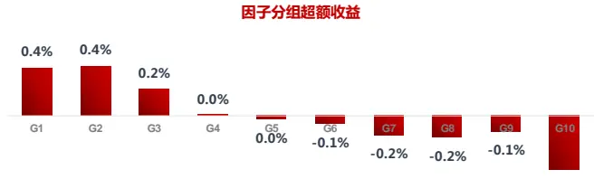

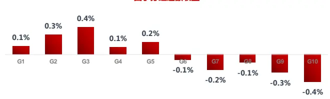

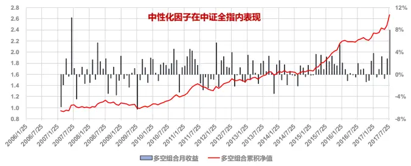
资料来源：东方证券研究所 & Wind 资讯

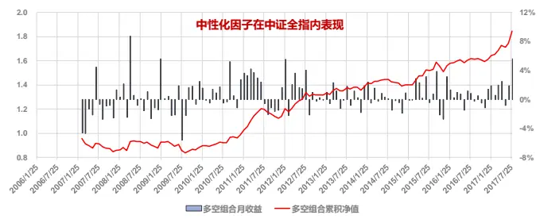
资料来源：东方证券研究所 & Wind 资讯

图 21：ROIC 变动因子测试结果(2007.01- 2017.07)

|  | 原始因子 |  |  | 行业和市值中性化因子 |  |  |  |  |  |  |
| --- | --- | --- | --- | --- | --- | --- | --- | --- | --- | --- |
|  | IC | IC_IR | p-val | IC | IC_IR p-val 多空组合月收益 月胜率 |  |  |  | 夏普值 | 最大回撤 |
| 中证全指 | 0.011 | 0.56 | 0.071 | 0.019 | 1.54 | 0.000 | 0.4% | 59.5% | 0.44 | -11.2% |
| 沪深300 | 0.027 | 0.96 | 0.002 | 0.015 | 0.71 | 0.024 | 0.3% | 54.0% | 0.20 | -22.8% |
| 中证500 | 0.014 | 0.67 | 0.032 | 0.028 | 1.79 | 0.000 | 0.8% | 61.1% | 0.85 | -19.1% |

图 22：URONOA 变动因子测试结果(2007.01- 2017.07)

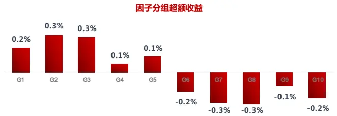

|  | 原始因子 |  |  | 行业和市值中性化因子 |  |  |  |  |  |  |
| --- | --- | --- | --- | --- | --- | --- | --- | --- | --- | --- |
|  | IC | IC_IR | p-val | IC | IC_IR p-val 多空组合月收益 月胜率 |  |  |  | 夏普值 | 最大回撤 |
| 中证全指 | 0.022 | 1.83 | 0.000 | 0.018 | 2.19 | 0.000 | 0.6% | 66.7% | 1.25 | -6.8% |
| 沪深300 | 0.030 | 1.22 | 0.001 | 0.019 | 0.92 | 0.009 | 0.6% | 59.8% | 0.60 | -16.7% |
| 中证500 | 0.023 | 1.31 | 0.000 | 0.024 | 1.99 | 0.000 | 0.9% | 69.6% | 1.06 | -12.0% |

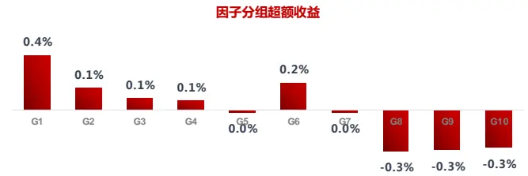

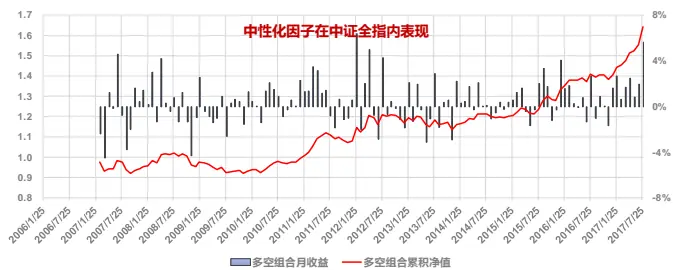
资料来源：东方证券研究所 & Wind 资讯

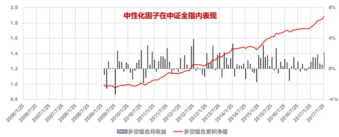
资料来源：东方证券研究所 & Wind 资讯

以上选股因子都是考察个股过去一年的成长性，我们也测试过对应的三年期成长因子，并以这些因子的波动又构建了成长稳健度因子，但表现都不佳，IC 不显著。全市场对成长的认识比较短视，长期稳定成长的股票未获得明显溢价。

## 2.3 财务安全

财务风险衡量的是上市公司偿还债务的能力，财务分析类教材上介绍过很多指标，另外我们也参 考 了 在 财 务 困 境 （ Financial Distress ） 中 常 用 的 Altman Z-Score (1968) 和 OlhsonO-Score(1980)，测试了以下五个指标：财务杠杆（总资产/股东权益）、流动比率（流动资产/流动负债）、负债有形资产比（总负债/有形资产）、利息覆盖率（EBIT/利息费用）、现金流利息覆盖率（经营现金流/有形资产）。比较有效的是后面两个有关利息覆盖率的指标，结果如图23、24所示。

另外，投资者也可以考虑使用类似 KMV 的结构化信用风险模型（Structural Credit Risk Model），它是基于 Merton(1974)的公司债定价模型，把公司总资产当作标的资产，公司债务当作行权价，股东权益看作是这样一个认购期权的现值，资不抵债时认为违约。上市公司违约概率的相对大小可以用违约距离（DD, Distance to Default）来度量，违约距离越小，违约概率越大。

$$
\mathrm{DD}={\frac{V_{a}-DP}{V_{a}\cdot\sigma_{a}}}
$$

其中 $\mathtt{V_{a}}$ 是当前时刻的总资产市值、违约点 DP = 流动负债 +0.5*长期负债， $\sigma_{\mathrm{a}}.$ 代表总资产市值的波动率。相对传统财务指标而言，违约距离指标考虑了公司资产的波动水平，但公司资产的波动水平不可观测，需要通过权益和债务的市场价值变动做估计，不同估计方法得到的结果差异比较大

（Duan (2012)）。Campbell(2008)基于 1963-2003 年的美国市场数据实证发现违约概率小的公司相对违约概率高的公司有明显溢价，总资产的波动率估计用的是 Volatility Restriction Method. 我们也用这个方法在 A 股进行了初步测试，因子从 2008.01 至今的 IC 在 0.04 至 0.05 之间，但问题是这个因子通过横截面回归的方式剔除掉股价波动率因子后，IC 不再显著，说明这个因子的 alpha主要来自于买入低波动的股票。波动率因子会在后文讨论，因此这里不采用违约距离因子。

图 23：利息覆盖率因子测试结果(2006.01- 2017.07)

|  | 原始因子 |  |  | 行业和市值中性化因子 |  |  |  |  |  |  |
| --- | --- | --- | --- | --- | --- | --- | --- | --- | --- | --- |
|  | IC | IC_IR | p-val | IC | IC_IR p-val 多空组合月收益月胜率 |  |  |  | 夏普值 | 最大回撤 |
| 中证全指 | 0.005 | 0.14 | 0.632 | 0.025 | 1.72 | 0.000 | 0.6% | 60.1% | 0.67 | -15.0% |
| 沪深300 | 0.019 | 0.43 | 0.143 | 0.008 | 0.34 | 0.250 | 0.1% | 52.2% | -0.03 | -34.3% |
| 中证500 | 0.016 | 0.41 | 0.169 | 0.023 | 1.13 | 0.000 | 0.5% | 58.0% | 0.51 | -19.9% |

图 24：现金流利息覆盖率因子测试结果(2006.01- 2017.07)

|  | 原始因子 |  |  | 行业和市值中性化因子 |  |  |  |  |  |  |
| --- | --- | --- | --- | --- | --- | --- | --- | --- | --- | --- |
|  | IC | IC_IR | p-val | IC | IC_IR p-val |  | 多空组合月收益月胜率 |  | 夏普值 | 最大回撤 |
| 中证全指 | 0.012 | 0.51 | 0.084 | 0.024 | 2.23 | 0.000 | 0.6% | 66.7% | 0.92 | -11.8% |
| 沪深300 | 0.029 | 0.84 | 0.005 | 0.015 | 0.73 | 0.015 | 0.1% | 51.4% | -0.11 | -27.3% |
| 中证500 | 0.021 | 0.75 | 0.012 | 0.024 | 1.56 | 0.000 | 0.5% | 56.5% | 0.47 | -27.3% |

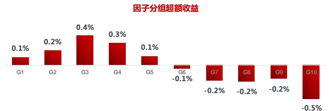

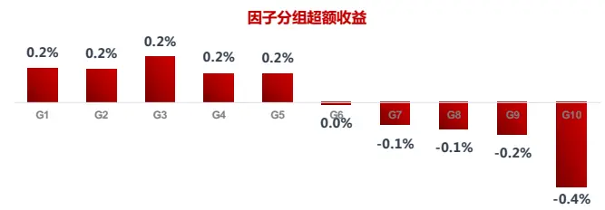

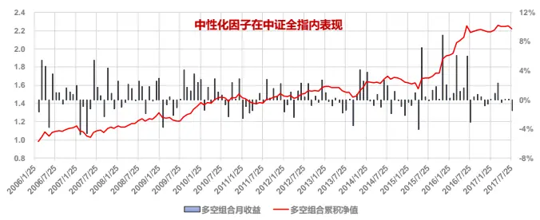
资料来源：东方证券研究所 & Wind 资讯

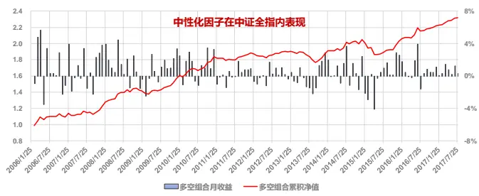
资料来源：东方证券研究所 & Wind 资讯

## 2.4 治理优良

国内股市历史不长，法律法规有待完善，市场上不时出现高管大股东侵害小股东权益的事件；另外 A 股国有成分较高，国有企业有时为了完成政治目标（例如控制失业率、响应国家区域产业发展政策等），采取的行动并不一定是以股东利益最大化为目的。因此在选择股票时，公司治理能力也是一个必要考察因素。

Gompers(2003)最早发现治理优良的公司在二级市场上也能获得溢价，他们基于上市公司拥有的保护投资者条款（例如：召开紧急股东会议需要更高的投票比例、限制部分股东投票权等）数量构建了一个 G-Index，发现 1990 至 1999 年间，美国市场上得分高的股票相对得分低的股票年均有 8.5%的超额收益。但需要注意的是，公司治理带来做的这种溢价效应有可能随着投资者对其认识程度的提升而迅速衰减。Bebchuk(2013) 发现 2000-2008年这段时间里，美国市场的公司治理溢价完全消失了，这可能和法规的完善以及 2000 年后媒体和分析师对公司治理的关注度的迅速增加有关。

学术上的公司治理研究大多数是考察公司治理指标能否对公司的会计表现（例如：ROA）或市场估值（例如：TobinQ）产生影响。这里主要检查这些指标的选股效力，我们测试过的因子有六个：独立董事占比、董事人数、高管持股比例、高管前三名薪酬总额、前十大股东持股集中度、股东总数。其中有效的指标只有一个，高管前三名薪酬总额（图 26）。这个因子对个股的利好作用可以从三个方面理解：1. 公司有足够的盈利来支持高额薪酬发放；2. 董事会对管理层的认可；3. 公司良好的市场激励机制，有助于效率提升。不过不同行业公司盈利能力有差异，高管薪酬水平也不同（图 25）,这个指标无法跨行业比较。比较有意思的是，这个因子虽然年度更新数据，但月度 IC仍有 0.026，IR高达 2.6，多空组合的 sharpe值接近 1.2，最大回撤仅 8.7%，表现非常稳健。

图 25：不同行业的高管前三名薪酬（基于 2016年年报）
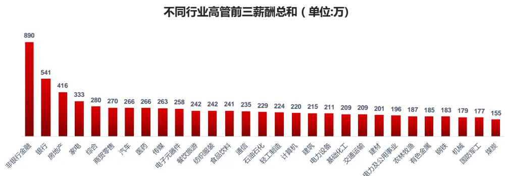
数据来源：东方证券研究所 & Wind 资讯

图 26：高管前三名薪酬因子测试结果(2006.01- 2017.07)

|  | 原始因子 |  | 行业和市值中性化因子 |  |  |  |  |  |  |
| --- | --- | --- | --- | --- | --- | --- | --- | --- | --- |
|  | IC | IC_IR | p-val | IC IC_IR | p-val | 多空组合月收益月胜率 |  | 夏普值 | 最大回撤 |
| 中证全指 | -0.008 | -0.28 | 0.347 | 0.026 | 2.59 0.000 | 0.8% | 65.7% | 1.18 | -8.7% |
| 沪深300 | 0.025 | 0.61 | 0.043 | 0.019 | 0.98 0.001 | 0.3% | 53.0% | 0.10 | -27.1% |
| 中证500 | 0.014 | 0.69 | 0.023 | 0.022 | 1.60 0.000 | 0.6% | 65.7% | 0.72 | -13.3% |

因子分组超额收益
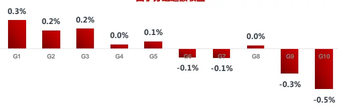

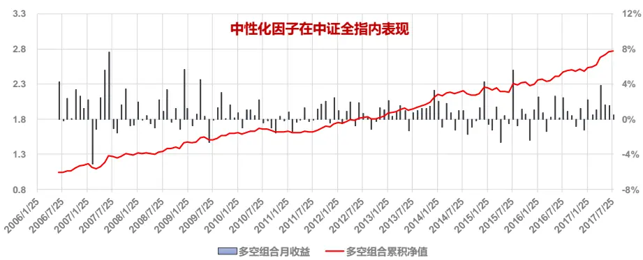
数据来源：东方证券研究所 & Wind 资讯

## 2.5 现金分红

从理论上讲，稳定的现金分红可以减小个股未来现金流的不确定性，降低投资者要求的必要回报率，提升未来现金流的折现价值，对股价形成利好。从实务上讲，有稳定现金分红的往往都是一些盈利良好、现金流充足的公司，不过当公司管理层绝对投资收益率达不到投资者的必要回报率时，可能也会采取现金分红。把现金分红作为选股因子在国内使用的最大问题是，A股很多公司不现金分红（图 27）.即使现金分红，分红率也不高。如图 28所示，如果在 2017.07.31 日，把中证全指内所有股票按分红率从大到小分十组，计算每组股票的平均年度分红率（TTM），会发现从第三组开始分红率就小于 1%，而且如果从分红率历史变动来看（图 28），市场整体分红率呈下行趋势。

图 27：分红率大于零的股票占比
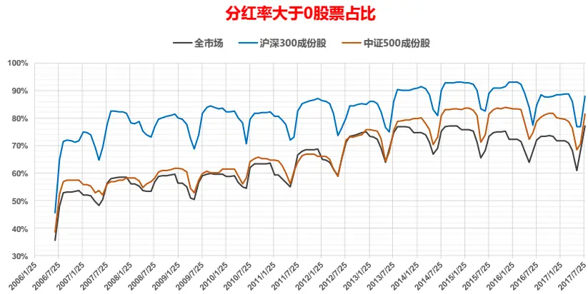
数据来源：东方证券研究所 & Wind 资讯

图 28：不同组股票的平均分红率（TTM）

不同组股票分红率（2017.07.31)
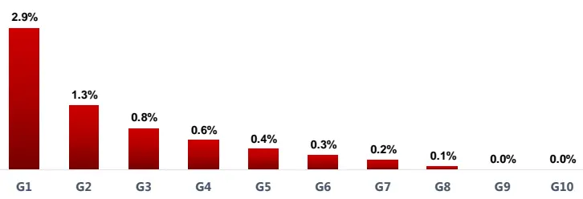

不同组股票分红率的变化
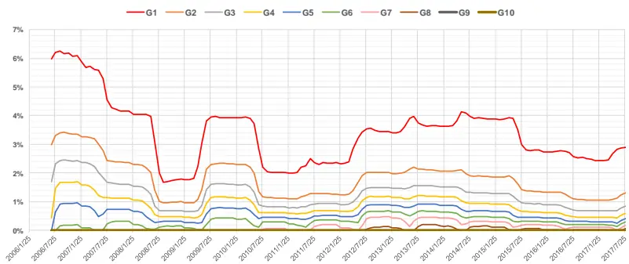
数据来源：东方证券研究所 & Wind 资讯

分红因子做中性化处理后，在全市场的选股能力很不错，因子 IC 和多空组合收益都很高，而且很稳健，回撤很小；2013 年开始，分红因子的选股能力尤为突出。不过要注意的是，从图 27可以看到，整个历史样本内，基本上每个月全市场都有 30%甚至更多的股票不分红，这些股票的排序会成问题；另外，即使分红的股票，一半多的股票分红率绝对值也很小，它们之间的相对排序受数据噪音的影响较大，因此图 29 里中证全指测试结果可信度相对不是很高。我们更建议把分红率仅用作沪深 300成份股内的 alpha因子，因为这个股票池内，分红股票的占比接近 90%，分红率的绝对数值也比较大（2017.07.31 日沪深 300 成份股的平均分红率是 1.4%，中证 500 成份股是 0.8%），实证结果更可靠。

图 29：分红率因子测试结果(2006.01- 2017.07)

|  | 原始因子 |  | 行业和市值中性化因子 |  |  |  |  |  |  |
| --- | --- | --- | --- | --- | --- | --- | --- | --- | --- |
|  | IC | IC_IR p-val | IC |  | IC_IR p-val 多空组合月收益 月胜率 |  |  | 夏普值 最大回撤 |  |
| 中证全指 | 0.007 | 0.24 | 0.421 | 0.032 | 2.30 0.000 |  | 1.0% | 72.2% 1.67 | -8.6% |
| 沪深300 | 0.031 | 0.73 | 0.016 | 0.024 | 1.17 0.000 | 0.6% | 55.6% | 0.47 | -21.5% |
| 中证500 | 0.021 | 0.82 | 0.007 | 0.027 | 1.43 0.000 | 0.7% | 60.2% | 0.68 | -28.4% |

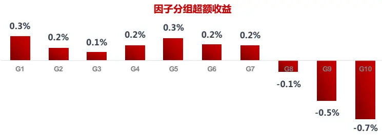

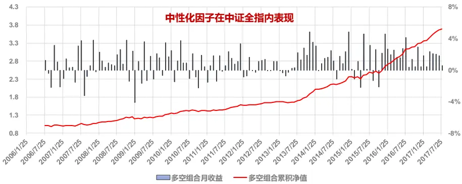
数据来源：东方证券研究所 & Wind 资讯

## 2.6 投机适度

投资中经常提到的一句话是“高风险高收益”，这句话在 CAPM 理论中是正确的，因为风险因子只有一个，风险大小完全有 beta决定，beta越大，预期收益越高。但事实上，在全球成熟证券市场，包括：股票、利率债、公司债和商品期货市场，低 beta 证券收益都要超过高 beta 证券(Frazzini, (2014))。这种异象最常用的解释是 Black(1993)提出的资金杠杆限制说法，认为实际投资中投资者受到法规条款和资本金约束无法像 CAPM 模型假设的那样无限制使用杠杆，因此为了提高收益而被迫追逐高 beta 资产，导致高 beta 资产价格高估。

Beta 是一种股票风险度量方式，但它和市值高度相关，做完行业和市值中性化处理后基本没有什么选股能力，没法当作 alpha 因子使用。另外一种常用的风险度量方式是波动率，波动率和beta高度相关，但也有差异，最明显的是非银金融，从波动率看过去五年在 29个行业里面排第八，属于高波动行业，但行业的 beta值只有 1.08，排名 24。在全球市场上，低波动股票相对高波动股票都有明显溢价（Blitz (2007)），这种低波动溢价可以类似 Black(1993)放松 CAPM 理论假设或者基于行为金融学结论修改投资者效用函数的方式（Blitz(2014)）来解释。对散户交易占主导的 A股而言，值得注意的一种解释是，高波动股票出现极大正收益的可能性更高，更具备“彩票型”特征，会受到投机性强的投资者追捧。股票的彩票型特征还可以通过收益率的偏度和历史最大单日收益数值(Bali (2011))度量。图 30-图 34的因子测试结果告诉我们，回避投机性强的股票是一种有效的获取超额收益方式。

下面我们测试了五个 alpha因子：波动率、特质波动率、收益率偏度、过去六个月最大日收益均值、日均换手率。这些因子在我们之前报告中都有使用，但这里为了降低换手率，和前面基本面指标保持一致，我们在计算因子时都采用了过往半年的数据。从下图的测试结果可以看到，计算周期的拉长会降低这些因子的 IC，但总体上仍然是非常优秀的因子；另外，从因子分组的超额收益图可知，投机性因子的空头负超额收益数值明显超过多头，因此这类因子对投资最大的帮助在于剔除投机性强股票获取相对超额收益。

图 30：波动率因子测试结果(2006.01- 2017.07)

|  | 原始因子 |  | 行业和市值中性化因子 |  |  |  |  |  |
| --- | --- | --- | --- | --- | --- | --- | --- | --- |
|  | IC IC_IR | p-val | IC | IC_IR p-val | 多空组合月收益 | 月胜率 | 夏普值 | 最大回撤 |
| 中证全指 | -0.047 | -0.91 0.003 | -0.057 | -1.53 | 0.000 | 1.0% | 64.7% 0.61 | -38.2% |
| 沪深300 | -0.058 | -0.86 0.005 | -0.044 | -1.12 | 0.000 | 0.7% | 64.7% 0.35 | -35.6% |
| 中证500 | -0.062 | -1.27 0.000 | -0.049 | -1.35 | 0.000 | 0.7% | 57.1% 0.45 | -32.5% |

因子分组超额收益
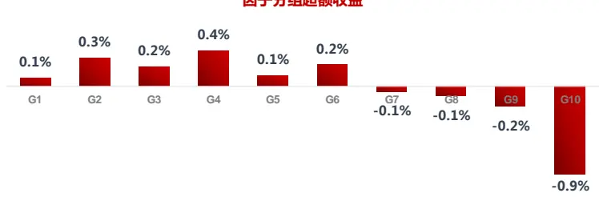

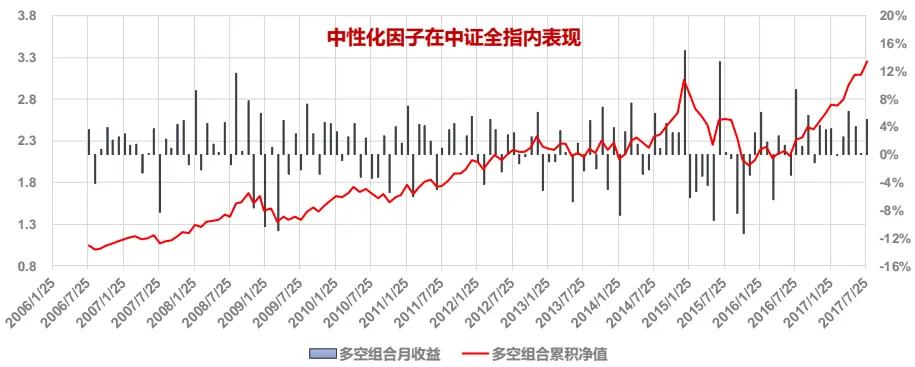
数据来源：东方证券研究所 & Wind 资讯

图 31：特质波动率因子测试结果(2006.01- 2017.07)

|  | 原始因子 |  |  | 行业和市值中性化因子 |  |  |  |  |  |  |
| --- | --- | --- | --- | --- | --- | --- | --- | --- | --- | --- |
|  | IC | IC_IR | p-val | IC IC_IR | p-val 多空组合月收益 月胜率 |  |  |  | 夏普值 | 最大回撤 |
| 中证全指 | -0.054 | -1.22 | 0.000 | -0.065 | -2.03 | 0.000 | 1.4% | 65.4% | 1.07 | -31.2% |
| 沪深300 | -0.058 | -1.12 | 0.000 | -0.048 | -1.66 | 0.000 | 1.1% | 61.7% | 0.85 | -20.7% |
| 中证500 | -0.069 | -1.66 | 0.000 | -0.055 | -1.87 | 0.000 | 1.0% | 60.9% | 0.75 | -25.5% |

图 32：收益率偏度因子测试结果(2006.01- 2017.07)

|  | 原始因子 |  |  | 行业和市值中性化因子 |  |  |  |  |  |  |
| --- | --- | --- | --- | --- | --- | --- | --- | --- | --- | --- |
|  | IC | IC_IR | p-val | IC IC_IR |  | p-val 多空组合月收益 月胜率 |  |  | 夏普值 | 最大回撤 |
| 中证全指 | -0.046 | -1.71 | 0.000 | -0.032 | -1.92 | 0.000 | 0.8% | 68.4% | 0.88 | -18.0% |
| 沪深300 | -0.011 | -0.29 | 0.334 | -0.011 | -0.54 | 0.073 | 0.1% | 51.1% | -0.11 | -22.1% |
| 中证500 | -0.040 | -1.43 | 0.000 | -0.023 | -1.26 | 0.000 | 0.7% | 59.4% | 0.61 | -14.7% |

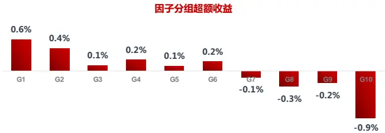

资料来源：东方证券研究所 & Wind 资讯

资料来源：东方证券研究所 & Wind 资讯

图 33：最大日收益率均值因子测试结果(2006.01- 2017.07)

|  | 原始因子 |  | 行业和市值中性化因子 |  |  |  |  |  |  |
| --- | --- | --- | --- | --- | --- | --- | --- | --- | --- |
|  | IC | IC_IR | p-val IC | IC_IR | p-val | 多空组合月收益月胜率 |  | 夏普值 | 最大回撤 |
| 中证全指 | -0.065 | -1.52 | 0.000 | -0.069 | -2.20 | 0.000 | 1.6% | 64.7% 1.26 | -21.3% |
| 沪深300 | -0.062 | -1.01 | 0.001 -0.051 | -1.46 | 0.000 | 1.2% | 64.7% | 0.83 | -28.7% |
| 中证500 | -0.073 | -1.69 | 0.000 | -0.056 | -1.88 0.000 | 1.1% | 62.4% | 0.92 | -21.9% |

图 34：换手率因子测试结果(2006.01- 2017.07)

|  | 原始因子 |  |  | 行业和市值中性化因子 |  |  |  |  |  |  |
| --- | --- | --- | --- | --- | --- | --- | --- | --- | --- | --- |
|  | IC | IC_IR | p-val | IC IC_IR | p-val | 多空组合月收益月胜率 |  | 夏普值 |  | 最大回撤 |
| 中证全指 | -0.032 | -0.63 | 0.036 | -0.062 | -2.00 | 0.000 | 1.5% | 66.9% | 1.02 | -23.4% |
| 沪深300 | -0.044 | -0.74 | 0.015 | -0.039 | -1.29 | 0.000 | 0.9% | 57.1% | 0.51 | -32.7% |
| 中证500 | -0.055 | -1.34 | 0.000 | -0.058 | -1.92 | 0.000 | 1.5% | 67.7% | 1.09 | -20.7% |

资料来源：东方证券研究所 & Wind 资讯

资料来源：东方证券研究所 & Wind 资讯

## 三、质优股的表现

## 3.1 质量因子表现

这里首先把第二节里介绍的部分 alpha因子通过因子 IC_IR加权的方式合成一个大类因子，考察大类因子的表现，大类因子的构成如下：

盈利因子：净利率、ROA、ROE、GPOA、ROIC、RONOA、URONOA_RF、营业利润占比；

成长因子：净利润增长、GPOA 变动、ROE 变动、ROIC 变动、URONOA 变动

财务安全：利息覆盖率、经营现金流利息覆盖率

公司治理：高管薪酬

投机因子：换手率、波动率、收益率偏度、最大收益均值、特质波动率

估值因子：PB、PE、PS、PCF、EBIT2EV、Sales2EV

分红因子由于数据覆盖率的问题，我们认为更适合做沪深 300 成份股内选股，因此这里没有采用，另外也加入了估值大类因子以便下文分析。

图 35：大类因子测试结果(2007.04- 2017.07，中证全指剔除银行和非银金融)

|  | IC | IC_IR | p-val | 多空组合月收益 | 月胜率 | 夏普值 | 最大回撤 |
| --- | --- | --- | --- | --- | --- | --- | --- |
| 估值 | 0.066 | 2.77 | 0.000 | 1.8% | 66.9% | 1.71 | -11.2% |
| 盈利 | 0.028 | 1.07 | 0.001 | 0.6% | 54.8% | 0.40 | -29.3% |
| 成长 | 0.029 | 1.97 | 0.000 | 0.8% | 62.9% | 1.01 | -16.5% |
| 财务安全 | 0.027 | 2.41 | 0.000 | 0.6% | 66.1% | 0.90 | -8.9% |
| 公司治理 | 0.027 | 2.73 | 0.000 | 0.8% | 65.3% | 1.21 | -5.8% |
| 投机 | 0.072 | 2.20 | 0.000 | 1.6% | 65.3% | 1.16 | -20.6% |

大类因子 IC 相关性矩阵

|  | 估值 | 盈利 | 成长 | 财务安全 | 公司治理 | 投机 |
| --- | --- | --- | --- | --- | --- | --- |
| 估值 |  | -0.203 | 0.089 | 0.127 | 0.441 | 0.524 |
| 盈利 | -0.203 |  | 0.227 | 0.428 | 0.172 | -0.109 |
| 成长 | 0.089 | 0.227 |  | 0.186 | 0.043 | -0.068 |
| 财务安全 | 0.127 | 0.428 | 0.186 |  | 0.295 | 0.136 |
| 公司治理 | 0.441 | 0.172 | 0.043 | 0.295 |  | 0.407 |
| 投机 | 0.524 | -0.109 | -0.068 | 0.136 | 0.407 |  |

数据来源：东方证券研究所 & Wind 资讯

为保证所有的因子都有数据，这里把因子的测试区间改为 2007.04到 2017.07，从图 35可以看到，盈利是投资者最为关心的指标，但实际上盈利因子的 IC和 IC_IR都最小，选股能力和稳定性最差，对比来看成长、财务安全和公司治理因子虽然 IC和盈利因子差不多，可是 IC_IR基本上都有盈利因子的两倍，稳健性要强很多。估值因子表现十分强劲，投机因子虽然 IC比估值因子高，但是稳健性要比估值因子弱。从因子相关性上讲，估值因子和盈利因子是负相关，和成长、财务安全因子低相关、把估值和这些基本面因子结合在一起有可能获得更稳定的选股能力。

我们把盈利、成长、财务安全和公司治理四个大类因子再通过 IC_IR 加权的方式合成质量因子来衡量上市公司基本面的好坏，把投机因子作为和质量因子并列的大类。这种做法和Asness(2017)不同，他是把波动率因子和财务安全因子合在一起作为安全类因子融入到质量因子中，但我们认为质量因子从概念上讲应该是指上市公司自身的质地，而波动率所在的投机类因子更多反映的是投资者对上市公司质地的认识程度（认识的越清楚、投机性越小），而并非公司自身的特质，因此我们没有把波动率加入到质量因子中，而是和其它因子一起构成投机类因子，与质量因子并列。

图 36：质量因子的稳定性

资料来源：东方证券研究所 & Wind 资讯

图 37：质量因子分组月度超额收益

资料来源：东方证券研究所 & Wind 资讯

上市公司的质量优劣会有延续性，如果我们拿当月的全市场股票的质量因子数据和半年、一年、两年、三年、五年后的质量因子数据计算相关性（图 36），会发现相关性很高，半年后的相关性高达 0.66，一年至三年后的相关性也在 0.4 左右。也就是说 A 股虽然存在业绩变脸的个股案例，但总体来看，好公司的质量可以维持一段时间，当前质地优良的公司，未来一到三年内有很大可能仍然保持优质；长期来看，优质股在 A股的收益显著高于劣质股，单调性十分明显（图 37）。

质量因子的 IC 有 0.04，IC_IR 高达 2.7(图 38)，非常稳健；如果把质量因子与估值因子结合在一起，因子 IC可以提高到 0.065，IR达到 3.34，选股能力和稳健性得到进一步提升。从逻辑上讲“质量+估值”是要在上市公司质量和其市场估值之间做出权衡，选出估值不是太高的优质公司，这和报告首页巴菲特对价值投资理念的描述相符，这么高的因子 IC和 IC_IR说明 A股虽然投机性很强，但价值投资长期来看还是非常行之有效的，这个结论也就否定了那些认为 A 股纯粹就是个赌场的市场偏见。考虑到 A 股散户交易占比很高，因此在投资决策时，除了考虑个股的基本面和市场估值，有必要再考察一下这个股票是不是已经被市场过度投机了，避开那些过度投机的股票。在质量和估值因子基础上再加投机因子可以进一步提高因子选股能力（IC 提高），但投机因子属于技术类因子，稳定性略差，加入后会略微降低因子选股的稳健性（IC_IR 下降）。

图 38：质量因子与其它因子的组合(2007.04- 2017.07，中证全指剔除银行和非银金融)

|  | IC | IC_IR | p-val | 多空组合月收益 | 月胜率 | 夏普值 | 最大回撤 |
| --- | --- | --- | --- | --- | --- | --- | --- |
| 质量 | 0.040 | 2.66 | 0.000 | 1.2% | 71.8% | 1.60 | -7.6% |
| 质量+估值 | 0.065 | 3.34 | 0.000 | 2.0% | 78.2% | 2.18 | -11.0% |
| 质量+估值+投机 | 0.081 | 3.22 | 0.000 | 2.1% | 77.4% | 2.02 | -15.3% |

因子多空组合累计净值表现

数据来源：东方证券研究所 & Wind 资讯

## 3.2 质优股的估值溢价

另一种考察质优股市场溢价的方式是看优质的股票是否可以获得更高的市场估值。我们在每个月横截面上拿标准化后的 BP 因子（PB 的倒数）对标准化后的质量因子做线性回归，考察回归系数的变化（图 39）。

图 39：BP 对质量因子回归系数的变化

数据来源：东方证券研究所 & Wind 资讯

图中红色的点表示横截面回归系数在 5%臵信度下统计检验显著，绿色的点则不显著。可以看到回归系数总体上是负值，也就是说质量因子得分越高，BP 越小，PB 估值越高，A 股过去十年总体来看，市场都会给与高质量的公司高估值。在 2011.01至 2013.03，回归系数整体在走低，市场给予优质股的估值溢价在提升，但 2013.03 之后，市场投机风起，投资者对公司质量的关注越来越低，优质公司的估值溢价越来越少，反应到图上就是回归系数的逐渐抬升；待到 2014年底股市开始进入亢奋时，回归系数便不再显著，也就是说这个时候的市场已经完全不看基本面来给公司估值了；股灾过后国家队入场救市，往后一直持续到 2016.05，回归系数也都不显著，基本面和市场估值完全脱钩。从今年 1 月份开始，回归系数又开始下降，说明整个市场又开始对优质股给予高估值溢价。另一个质量因子和估值脱钩的时间段是 2008.09到 2009.06，可能的原因是四万亿刺激政策的干扰，质量因子是基于历史财报信息，刺激政策的推出让财报业绩较差的周期股的未来盈利预期发生大幅改变，市场的估值跟着预期走。

公司质量对个股估值的提升作用会因为个股估值水平的高低而不同。这可以拿 BP对质量因子做横截面的分位数回归（quantile regression）来验证。图 40从左到右展示是高 PB估值到低 PB估值股票的回归系数（横坐标是分位数回归中设臵的分位数），可以看到，股票估值水平越低，回归系数越小，公司质量对估值的提升作用越大；在估值最高的股票里面，公司质量带来的估值差异非常小。

图 40：BP对质量因子做分位数回归的系数

数据来源：东方证券研究所 & Wind 资讯

## 3.3 量化投资组合

这节主要考察用上面的选股因子来做纯多头投资的收益如何。每个月我们把股票池（中证全指提出银行和非银金融）的股票按照选股因子的得分从高到低排序，选出得分前 50的股票，等权构建组合，持有到下个月再调仓。组合的收益如图 41所示，从 2007.04至 2017.07，完全基于质量因子选股，策略组合的年化收益高达 22.3%；剔除 2007、2008、2009和 2015这几个大涨大跌的年份后，平均年收益仍有 11.8%；如果再结合估值因子做“价值投资”，策略年化收益率可以提升到 29%，剔除大涨大跌年份后仍有 15.7%；加入投机因子后组合收益和 Sharpe 值得改善幅度不是很明显。从这组数据我们可以更直接的验证，价值投资在 A股行之有效，且收益可观。

大型机构投资者对个股流动性会有要求，我们也尝试了在中证 800 成分股内（剔除银行和非银金融）测试了因子选股策略（图 42），策略的收益和全市场选股比都有不同程度的降低，但策略本身的收益率还是非常可观的，而且在中证 800 成分股内，投机因子的加入，对质量和估值因子的改善非常明显。

图 41：中证全指（剔除银行和非银金融）内量化因子选股组合表现（2007.04 – 2017.07）

|  | 质量 | 质量+估值 | 质量+估值+投机 | 沪深300 | 中证500 | 中证全指 |
| --- | --- | --- | --- | --- | --- | --- |
| 年化收益率 | 22.3% | 29.0% | 29.7% | 3.0% | 7.9% | 5.6% |
| 月胜率 | 67.7% | 74.2% | 75.8% |  |  |  |
| Sharpe值 | 0.710 | 0.850 | 0.883 | 0.179 | 0.337 | 0.267 |
| 最大回撤 | -68.4% | -67.0% | -64.7% | -72.3% | -72.4% | -71.5% |
| 2007 | 87.7% | 112.3% | 84.0% | 91.9% | 69.1% | 83.8% |
| 2008 | -56.5% | -51.8% | -48.6% | -65.9% | -60.8% | -64.1% |
| 2009 | 135.2% | 199.5% | 187.3% | 96.7% | 131.3% | 106.5% |
| 2010 | 25.1% | 9.9% | 13.1% | -12.5% | 10.1% | -3.8% |
| 2011 | -31.0% | -28.4% | -25.2% | -25.0% | -33.8% | -28.0% |
| 2012 | 11.7% | 13.8% | 16.8% | 7.6% | 0.3% | 4.6% |
| 2013 | 37.5% | 35.7% | 39.9% | -7.6% | 16.9% | 5.2% |
| 2014 | 42.7% | 63.2% | 78.5% | 51.7% | 39.0% | 45.8% |
| 2015 | 108.5% | 83.4% | 84.1% | 5.6% | 43.1% | 32.6% |
| 2016 | -6.0% | 7.2% | 7.7% | -11.3% | -17.8% | -14.4% |
| 2017 | 2.3% | 8.6% | 3.0% | 12.9% | 0.5% | 0.8% |

数据来源：东方证券研究所 & Wind 资讯

图 42：中证 800（剔除银行和非银金融）内量化因子选股组合表现（2007.04 – 2017.07）

|  | 质量 | 质量+估值 | 质量+估值+投机 | 沪深300 | 中证500 | 中证全指 |
| --- | --- | --- | --- | --- | --- | --- |
| 年化收益率 | 18.1% | 23.8% | 29.3% | 3.0% | 7.9% | 5.6% |
| 月胜率 | 62.9% | 71.0% | 67.7% |  |  |  |
| Sharpe值 | 0.616 | 0.741 | 0.877 | 0.179 | 0.337 | 0.267 |
| 最大回撤 | -68.0% | -68.3% | -66.9% | -72.3% | -72.4% | -71.5% |
| 2007 | 90.6% | 114.2% | 86.3% | 91.9% | 69.1% | 83.8% |
| 2008 | -56.9% | -54.6% | -50.8% | -65.9% | -60.8% | -64.1% |
| 2009 | 135.2% | 184.9% | 188.1% | 96.7% | 131.3% | 106.5% |
| 2010 | 24.9% | 1.3% | 7.8% | -12.5% | 10.1% | -3.8% |
| 2011 | -28.3% | -23.8% | -23.9% | -25.0% | -33.8% | -28.0% |
| 2012 | 10.1% | 13.4% | 13.1% | 7.6% | 0.3% | 4.6% |
| 2013 | 19.6% | 16.6% | 15.9% | -7.6% | 16.9% | 5.2% |
| 2014 | 28.0% | 66.9% | 70.4% | 51.7% | 39.0% | 45.8% |
| 2015 | 72.8% | 54.4% | 62.3% | 5.6% | 43.1% | 32.6% |
| 2016 | -7.8% | 0.4% | 5.8% | -11.3% | -17.8% | -14.4% |
| 2017 | 15.2% | 17.2% | 12.7% | 12.9% | 0.5% | 0.8% |

数据来源：东方证券研究所 & Wind 资讯

最后来看看具体个股在上述因子体系下的得分情况（图 43）。我们从不同行业抽取了十只今年股价涨幅较大的股票，另外从传媒行业选了两只表现较差的股票。可以看到今年涨的好的股票基本面大多非常不错，质量因子得分的排序很靠前；在 4月 30日，一季报出完后，一些优质股票的估值任然相对较低，例如：万华化学、方大特钢、昊华能源，这些质地优良、估值又低的股票在后面几个月收益非常惊人。但也有一些股票，像贵州茅台，一季度显示它的公司质量依然非常好，但同时个股估值已经很高了，而且也表现出了一定的投机性，因此它的总得分并不靠前，属于中等偏上水平。对比来看，乐视网和掌趣科技两只曾经的明星股，一季报显示他们的质地已经属于较差水平了，同时估值又高、投机性又强，股价的走势自然也不乐观。总体而言，我们这套打分体系和主动投资的基本面分析结果还是比较契合的。

图 43： 个股的因子得分（2017.04.30）

数据来源：东方证券研究所 & Wind 资讯

## 3.4 寻找 A 股的动量效应

A 股有非常强烈的反转效应，也就是说过去跑的差的股票未来一个月会跑得更好，这个结论在国内量化领域已广为知晓。但和一些主动投资基金经理聊，他们都认为 A 股应该是动量效应，强者恒强。我们认为造成这种认知差异的一个可能原因是股票池的不同，量化研究是在全市场范围，或者其它一些比较大的股票池内进行，而主动投资经理可能会先从基本面角度分析选出一个小股票池，再在这个股票池里精选个股。所以我们这里想考察一下，在基本面优良的个股里，是否存在动量效应。

图 44： 质优股里的动量效应验证

| 动量策略参数 |  | 动量分组 |  |  |  |  | G3 - G5 | t-test pvalue |
| --- | --- | --- | --- | --- | --- | --- | --- | --- |
|  |  | G1 | G2 | G3 | G4 | G5 |  |  |
| K=3 | H=1 | 2.4% | 2.8% | 3.0% | 2.8% | 2.7% | 0.3% | 0.33 |
|  | H=3 | 2.3% | 2.8% | 2.8% | 3.1% | 2.6% | 0.1% | 0.61 |
|  | H=6 | 2.6% | 2.9% | 2.6% | 2.8% | 2.5% | 0.1% | 0.66 |
|  | H=12 | 2.6% | 2.8% | 2.7% | 2.7% | 2.2% | 0.5% | 0.09 |
| K=6 | H=1 | 2.2% | 2.8% | 2.9% | 3.0% | 2.5% | 0.4% | 0.08 |
|  | H=3 | 2.4% | 2.6% | 2.8% | 2.9% | 2.4% | 0.5% | 0.04 |
|  | H=6 | 2.3% | 2.5% | 2.5% | 2.8% | 2.3% | 0.2% | 0.41 |
|  | H=12 | 2.1% | 2.4% | 2.5% | 2.8% | 2.5% | -0.1% | 0.79 |
| K=12 | H=1 | 2.1% | 2.3% | 2.8% | 2.8% | 2.5% | 0.3% | 0.19 |
|  | H=3 | 1.9% | 2.3% | 2.7% | 2.8% | 2.5% | 0.2% | 0.32 |
|  | H=6 | 1.8% | 2.2% | 2.5% | 2.6% | 2.4% | 0.1% | 0.54 |
|  | H=12 | 1.7% | 2.2% | 2.3% | 2.6% | 2.4% | 0.0% | 0.87 |

数据来源：东方证券研究所 & Wind 资讯

验证的方法和传统动量效应方法一样，把股票池里个股按照过去 K 个月的涨跌幅（剔除最近一个月的反转效应）从高到低排序，等分成 5 个组，组内股票等权构建组合，持有 H 个月后，再采用同样方法调仓，一直滚动下去。但我们验证的股票池不是全市场，而是每期质量因子得分在前30%的股票。结果如图 44所示，反转效应在质优股里消失了，但也没有明显的动量效应，倒是过往涨幅居中的股票未来表现更好，而且在 K=6, H=3的设臵下，这种差异在统计上显著。

## 四、总结

“基本面质优+估值合理”的价值投资方式在 A股是可行的，而且收益颇丰，非常适合长线投资的大型机构投资者，关键之处在于投资者怎么去度量上市公司的质量。生搬硬套成熟市场的指标体系不可行，很多在海外有效的选股因子在国内无效，或者效用差很多；A股的弱有效性也为我们提供了不少 A 股市场有效，而海外市场无效的因子。因子的有效性必须拿数据验证，而且由于各个行业财务指标大小差异巨大，为降低选股因子受行业和市值效应的影响，建议投资者先对选股因子做风险中性化处理。

传统主动量化产品在对外宣传时，主打的往往是因子库的庞大和完整，但由于去年底开始的风格切换，这类产品的总体业绩表现欠佳，销售难度增大。公募基金公司可以考虑一下适时推出专注某类因子的量化产品与现有产品形成差异竞争，目前来看“质量因子”和“质量+估值”的方式非常适合，这类策略的逻辑清晰、历史收益可观、换手率低，适合保险等大型长线机构投资者。

1. 量化模型基于历史数据分析得到，未来存在失效的风险，建议投资者紧密跟踪模型表现。

2. 极端市场环境可能对模型效果造成剧烈冲击，导致收益亏损。

## 参考文献

[1]. Asness, C. S., Frazzini, A., and Pedersen, L.H., (2017), “Quality Minus Junk”, AQR working paper, Available at SSRN: https://ssrn.com/abstract=2312432.

[2]. Bali,T.G., Cakici, N., Whitelaw, R.F., (2011), "Maxing out: Stocks as lotteries and the cross-section of expected returns",Journal of Financial Economic,Vol(99), Issue 2, pp: 427- 446

[3]. Bebchuk, L.A., Cohen, A., Wang, C.,(2013),"Learning and the disappearing association between governance and returns",Journal of Financial Economics,Vol 108(2), pp: 323–348

[4]. Blitz, D., P. van Vliet., (2007) “The Volatility Effect: Lower Risk Without Lower Return.” The Journal of Portfolio Management, Vol(34), pp: 102-113。

[5]. Blitz, D., E. Falkenstein, P. van Vliet., (2014), “Explanations for the Volatility Effect: An Overview Based on the CAPM Assumptions.” The Journal of Portfolio Management, Vol(40), pp: 61-76.

[6]. Campbell,J.Y., Hilscher,J., Szilagyi,J., (2008), "In Search of Distress Risk",the Journal of Finance, Vol(63), Issue 6, pp: 2899 -2939

[7]. Cooper, J.M., Gulen G., Schill, M.J., (2008), “Asset Growth and the Cross Section of Stock Returns”, The Journal of Finance, Vol(4), pp:1609- 1651.

[8]. Dechow, P., Ge, P.,Schrand,C. (2010), "Understanding earnings quality: A review of the proxies, their determinants and their consequences",Journal of Accounting and Economics,Vol(50), Issues 2–3, pp: 344-401

[9]. Duan, J.,Wang, T., (2012), "Measuring Distance-to-Default for Financial and Non-Financial Firms", Global Credit Review, Vol(2)

[10]. Fama,E., French, K., (2008) , “Dissecting Anomalies”, Journal of Finance, Vol63, Issue 4, pp:1653–1678

[11]. Fama,E., French, K., (2015), "A five-factor asset pricing mode", Journal of Financia Economics, Vol(108), issue 1, pp: 1-28

[12]. Frazzini, A., Kabiller, D., Pedersen, L.H., (2013), “Buffett's Alpha”, NBER Working Paper No. w19681. Available at SSRN: https://ssrn.com/abstract=2360949

[13]. Frazzini, A., and Pedersen, L.H., (2014), “Betting Against Beta”, Journal of Financial Economics, Vol(111), pp: 1-25

[14]. Gompers, P.A., Ishii, J.L., Metrick, A., (2001), "Corporate Governance and Equity Prices", The Quarterly Journal of Economics, MIT Press, Vol. 118(1), pages 107-155

[15]. Greenblatt, J. (2010). “The Little Book that Still Beats the Market”. John Wiley & Sons, Hoboken, New Jersey

[16]. Kozlov, M. and Petajisto, A. (2013). “Global Return Premiums on Earnings Quality, Value, and Size (January 7, 2013)”. working paper,Available at http://ssrn.com/abstract=2179247.

[17]. LaFond, R., (2005), "Is the Accrual Anomaly a Global Anomaly? ", MIT Sloan Research Paper No. 4555-05. Available at SSRN: https://ssrn.com/abstract=782726

[18]. MSCI, (2013), “MSCI Quality Indices Methodology”.

[19]. Novy-Marx, R. (2013). “The Other Side of Value: Good Growth and the Gross Profitability Premium”. Journal of Financial Economics, Vol(108), pp: 1-28.

[20]. Novy-Marx, R., (2013), “The other side of value: The gross profitability premium”, Journal of Financial Economics, Vol(108), issue 1, pp: 1-28

[21]. Novy-Marx, R., (2014), “ Quality Investing “, working paper, Available at: http://rnm.simon.rochester.edu/research/QDoVI.pdf

[22]. Ohlson, J. A. (1980), “Financial Ratios And The Probabilistic Prediction Of Bankruptcy.” Journal of Accounting Research, Vol(18) , 109-131.

[23]. Piotroski, J. (2000). “Value Investing: The Use of Historical Financial Statement Information to Separate Winners from Losers”. Journal of Accounting Research, Vol(38), pp: 1-41.

[24]. Sloan, R. G., (1996), “Do stock prices fully reflect information in accruals and cash flows about future earnings?”, The Accounting Review, 71 (3), pp: 289–315.

[25]. S&P Dow Jones Indices, (2017), “ S&P Quality Indices Methodology”.

## 分析师申明

每位负责撰写本研究报告全部或部分内容的研究分析师在此作以下声明：

分析师在本报告中对所提及的证券或发行人发表的任何建议和观点均准确地反映了其个人对该证券或发行人的看法和判断；分析师薪酬的任何组成部分无论是在过去、现在及将来，均与其在本研究报告中所表述的具体建议或观点无任何直接或间接的关系。

## 投资评级和相关定义

报告发布日后的 12个月内的公司的涨跌幅相对同期的上证指数/深证成指的涨跌幅为基准；

## 公司投资评级的量化标准

买入：相对强于市场基准指数收益率 15%以上；

增持：相对强于市场基准指数收益率 5%～15%；

中性：相对于市场基准指数收益率在-5%～+5%之间波动；

减持：相对弱于市场基准指数收益率在-5%以下。

未评级——由于在报告发出之时该股票不在本公司研究覆盖范围内，分析师基于当时对该股票的研究状况，未给予投资评级相关信息。

暂停评级——根据监管制度及本公司相关规定，研究报告发布之时该投资对象可能与本公司存在潜在的利益冲突情形；亦或是研究报告发布当时该股票的价值和价格分析存在重大不确定性，缺乏足够的研究依据支持分析师给出明确投资评级；分析师在上述情况下暂停对该股票给予投资评级等信息，投资者需要注意在此报告发布之前曾给予该股票的投资评级、盈利预测及目标价格等信息不再有效。

## 行业投资评级的量化标准：

看好：相对强于市场基准指数收益率 5%以上；

中性：相对于市场基准指数收益率在-5%～+5%之间波动；

看淡：相对于市场基准指数收益率在-5%以下。

未评级：由于在报告发出之时该行业不在本公司研究覆盖范围内，分析师基于当时对该行业的研究状况，未给予投资评级等相关信息。

暂停评级：由于研究报告发布当时该行业的投资价值分析存在重大不确定性，缺乏足够的研究依据支持分析师给出明确行业投资评级；分析师在上述情况下暂停对该行业给予投资评级信息，投资者需要注意在此报告发布之前曾给予该行业的投资评级信息不再有效。

## 免责声明

本证券研究报告（以下简称“本报告”）由东方证券股份有限公司（以下简称“本公司”）制作及发布。

本报告仅供本公司的客户使用。本公司不会因接收人收到本报告而视其为本公司的当然客户。本报告的全体接收人应当采取必要措施防止本报告被转发给他人。

本报告是基于本公司认为可靠的且目前已公开的信息撰写，本公司力求但不保证该信息的准确性和完整性，客户也不应该认为该信息是准确和完整的。同时，本公司不保证文中观点或陈述不会发生任何变更，在不同时期，本公司可发出与本报告所载资料、意见及推测不一致的证券研究报告。本公司会适时更新我们的研究，但可能会因某些规定而无法做到。除了一些定期出版的证券研究报告之外，绝大多数证券研究报告是在分析师认为适当的时候不定期地发布。

在任何情况下，本报告中的信息或所表述的意见并不构成对任何人的投资建议，也没有考虑到个别客户特殊的投资目标、财务状况或需求。客户应考虑本报告中的任何意见或建议是否符合其特定状况，若有必要应寻求专家意见。本报告所载的资料、工具、意见及推测只提供给客户作参考之用，并非作为或被视为出售或购买证券或其他投资标的的邀请或向人作出邀请。

本报告中提及的投资价格和价值以及这些投资带来的收入可能会波动。过去的表现并不代表未来的表现，未来的回报也无法保证，投资者可能会损失本金。外汇汇率波动有可能对某些投资的价值或价格或来自这一投资的收入产生不良影响。那些涉及期货、期权及其它衍生工具的交易，因其包括重大的市场风险，因此并不适合所有投资者。

在任何情况下，本公司不对任何人因使用本报告中的任何内容所引致的任何损失负任何责任，投资者自主作出投资决策并自行承担投资风险，任何形式的分享证券投资收益或者分担证券投资损失的书面或口头承诺均为无效。

本报告主要以电子版形式分发，间或也会辅以印刷品形式分发，所有报告版权均归本公司所有。未经本公司事先书面协议授权，任何机构或个人不得以任何形式复制、转发或公开传播本报告的全部或部分内容。不得将报告内容作为诉讼、仲裁、传媒所引用之证明或依据，不得用于营利或用于未经允许的其它用途。

经本公司事先书面协议授权刊载或转发的，被授权机构承担相关刊载或者转发责任。不得对本报告进行任何有悖原意的引用、删节和修改。

提示客户及公众投资者慎重使用未经授权刊载或者转发的本公司证券研究报告，慎重使用公众媒体刊载的证券研究报告。

## 东方证券研究所

地址：上海市中山南路 318 号东方国际金融广场 26 楼

联系人： 王骏飞

电话： 021-63325888*1131

传真：021-63326786

网址： www.dfzq.com.cn

Email： wangjunfei@orientsec.com.cn

## 研究结论

从 2013年开始，券商股在沪深 300成分股中的总权重就始终处在 8%以上，最高的时候甚至能达到12%，对于指数有着不低的影响。此外，券商指数与其他行业指数走势的同步率较低，说明券商行业有其独特之处。因此，在构建沪深 300增强组合的时候，若能对于券商、银行等权重占比较大的独特行业进行独立的分块建模，理论上可以使指数增强组合的效果有一定的提升。

从券商内单因子选股效果来看，估值类因子：BP_LF、EP_TTM、SP_TTM、BP_LF_M、EP_TTM_M 和 SP_TTM_M 在券商里有非常好的选股效果，不论是 IR 还是扣费后多空月收益都大幅高于其他因子，其中用月报数据计算的估值因子整体表现会更好一些。此外，TO、ILLIQ、RealizedVolatility_1Y、SP_F也有一定的选股作用。

我们分别建立了估值和非流动性的二大类因子模型和纯估值大类因子模型，从对冲组合的表现来看，纯估值大类因子模型的表现显著好于二大类因子模型，在控制了 5%跟踪误差的情况下，对冲组合 2010.12.31-2017.9.29 的年化收益率为9.5%，最大回撤-4.03%，IR为 1.88，表现十分出色。

常规的建立沪深300增强组合的方法并不能对券商内股票很好的建模，我们对比了常规建模、银行单独建模和银行券商单独建模的表现，常规方法构建的对冲组合年化对冲收益为 7.51%，IR 为 1.82，最大回撤为-5.46%，银行单独建模的对冲组合年化收益为8.76%，IR 为 2.18最大回撤为-5.55%，同时对银行券商单独建模的对冲组合年化收益为 9.13%，IR 为 2.43，最大回撤为-3.33%，对银行和券商单独建模都对整体模型有着显著的提升。

## 风险提示:

极端市场环境可能对模型效果造成剧烈冲击，导致收益亏损。

量化模型基于历史数据分析得到，未来存在失效风险，建议投资者紧密跟踪模型表现。

常规建模、银行单独建模和银行券商单独建模沪深 300成分内增强组合表现对比

东方证券股份有限公司经相关主管机关核准具备证券投资咨询业务资格，据此开展发布证券研究报告业务。

报告发布日期2017 年 10 月 26 日

证券分析师朱剑涛

021-63325888*6077

zhujiantao@orientsec.com.cn

执业证书编号：S0860515060001

联系人张惠澍

021-63325888-6123

zhanghuishu@orientsec.com.cn

## 相关报告

| 质优股量化投资 | 2017-08-31 |
| --- | --- |
| 用机器学习解释市值：特异市值因子 | 2017-08-04 |
| 预期外的盈利能力 | 2017-07-09 |
| 因子选股与事件驱动的 Bayes 整合 | 2017-06-01 |
| 多因子模型在港股中的应用 | 2017-04-26 |

## 为什么要对券商股单独建模？

1.券商股在沪深 300指数中权重较高，图 1展示了 2010年 6月-2017年 9月沪深 300成分股中券商股的数量和总权重，沪深 300 成分内的券商占上市 3个月券商比重平均约为 95%，也就是说几乎所有的上市满 3个月的券商都在沪深 300内，沪深 300成分股中券商股的数量从 2010.6年开始的 13支，逐渐增加到 2017.9的 26支，数量上虽然占比较少，但是从 2013年开始，券商股在沪深 300 成分股中的总权重就始终处在 8%以上，权重最高的时候甚至能达到 12%，对于指数有着一定的影响。因此，在做沪深 300 指数增强组合的时候，若能对于非银金融、银行等权重占比较大的行业进行独立的分块建模，就会使指数增强组合的整体效果有一定的提升。而非银金融中，保险虽然权重不低，但样本太少，很难通过量化的手段进行研究，因此我们这里主要针对非银中的券商股做量化选股的研究。

图 1：券商股在沪深 300指数中的数量和总权重

数据来源：东方证券研究所 Wind 资讯

图 2：不同行业指数收益率的平均相关性

数据来源：东方证券研究所 Wind 资讯

2.券商股和其他类型股票的平均相关性较低。图 2展示了 2010.6-2017.9中信行业指数的平均相关性，其中我们把券商行业指数也作为一个行业加入到里面，可以看到券商指数的平均相关性和非银指数类似，是除了银行以外平均相关性最低的行业。同样显著的低于其他行业。因此，券商股的走势与其他类型股票较不同步，说明券商股有其特别的性质。

综合上述两点，我们有必要针对券商股单独进行建模以取得更好的整体增强效果。

## 单因子测试

本文主要对沪深 300 券商成分股中的因子效果做了检验(2010.6.30-2017.9.29)，并根据单因子检验的效果建立了动态的多因子模型，由于券商股的股票数量较少，常规的计算 rankIC和 ICIR 的方法会受小样本影响较大，因此这里我们通过统计等权多空组合（前 40%减去后 40%）的收益和多空组合 IR 的方法来作为衡量单因子好坏的量度。在估计的时候，因为不同因子的换手率水平差异较大，因此仅仅看多空组合月收益和 IR 并不能很好的反映因子真实的表现，所以我们用多空平均月收益的绝对值扣除换手率调整的费率（单边千 3）作为扣费后收益的近似，以期综合考虑因子的表现。

图 3：测试因子列表

| 类型 | 因子简称 | 因子说明 |
| --- | --- | --- |
| 估值 | BP_LF | Newest Book Value/Market Cap |
|  | EP_TTM | TTM earnings/ MarketCap |
|  | SP_TTM | TTM Sales/ Market Cap |
|  | BP_LF_M | 根据月报数据计算的BP_LP |
|  | EP_TTM_M | 根据月报数据计算的EP_TTM |
| 成长 | SP_TTM_M | 根据月报数据计算的SP_TT |
|  | SalesGrowth_Qr_YOY | 营业收入增长率(季度同比） |
|  | ProfitGrowth_Qr_YOY | 净利润增长率(季度同比） |
|  | SalesGrowth_M_YOY | 营业收入增长率（月度同比） |
| 盈利 | ProfitGrowth_M_YOY | 净利润增长率（月度同比） 净资产收益率 |
|  | ROE ROA | 总资产收益率 |
|  | ROE_M |  |
|  | ROA_M | 根据月报数据计算的净资产收益率 |
| 反转 | Ret1M | 根据月报数据计算的总资产收益率 1个月收益反转 |
|  | Ret3M | 3个月收益反转 |
|  | PPReversal | 乒乓球反转因子 |
|  | CGO_3M |  |
|  | IRFF | Capital Gains Overhang (3M) 1-Fama-French regression SSR/SST |
| 非流动性 | TO | 以流通股本计算的1个月日均换手率 |
|  | ILLIQ | 每天一个亿成交量能推动的股价涨幅 |
| 低波动 | Beta | 252个交易日对中证全指滚动回归 |
|  | RealizedVolatility_3M | 过去三个月日收益率数据计算的标准差 |
|  | RealizedVolatility1Y | 过去一年日收益率数据计算的标准差 |
| 预期估值 | SP_F | 预期的SP |
|  | EP_F | 预期的EP |
| 其他预期 | Earingings_Changes | 过去三个月盈利预测上调家数-下调家数 |
|  | Rate | 平均的评级 |
|  | Rate_Changes |  |
|  | FP2P | 过去三个月评级上调家数-下调家数 预期目标价除以当前股价 |
| 预期成长 | SalesGrowth_F | 预期营业收入增长 |
|  | ProfitGrowth_F | 预期净利润增长 |

数据来源：东方证券研究所

值得注意的是，上市券商会在每个月公布未经审计的月报，所以我们这里也基于最新公告的月报数据构建了几个估值、成长和盈利因子。由于月报从 2010.7 才开始公布，而且计算 TTM 和成长因子时需用到历史一年的数据，因此缺失的月报数据我们用季报数据进行补充。

此外，不同的因子选股的方向是不同的，因此在下文构建多空组合累积净值的时候，我们都根据因子的方向进行了调整，以保证多空组合的方向都是一致的。

## 估值因子

估值因子中，我们分别测试了用季报计算的BP_LF、EP_TTM和SP_TTM，以及用月报数据计算的BP_LF_M、EP_TTM_M和SP_TTM_M。计算因子的时候，TTM是过去4季度或12月总和。

图 4：估值因子多空净值和表现

| 因子简称 | 多空平均月收益 | IR | 多空月单边换手率 | 扣费后的平均月收益 |
| --- | --- | --- | --- | --- |
| BP_LF | 0.77% | 0.645 | 24.50% | 0.62% |
| EP_TTM | 0.96% | 0.719 | 28.27% | 0.80% |
| SP_TTM | 1.11% | 0.787 | 29.20% | 0.93% |
| BP_LF_M | 0.99% | 0.801 | 26.52% | 0.83% |
| EP_TTM_M | 0.84% | 0.608 | 31.82% | 0.65% |
| SP_TTM_M | 1.41% | 1.061 | 35.55% | 1.19% |

数据来源：东方证券研究所 Wind 资讯

从因子表现可以看出，SP_TTM_M 和 BP_LF_M 都显著的好于 SP_TTM 和 BP_LP。然而EP_TTM_M表现较 EP_TTM 差，但是从累积净值上可以看到这两个因子差距比其他两个因子小。综合来看，虽然说月报数据未经过审计，但是相较于季报数据而言，仍然是更好的数据来源，可以使得估值因子更新更加及时，从而获得更好的表现。

整体来看，估值因子在券商股中的选股效果很好，且换手率较低，因此在扣除了成本后仍然有较高的收益水平，其中 SP_TTM_M的 IR 有 1 以上，且扣费后还有 1.19%的多空月收益，选股效果很好。

我们分别计算了对应的季报数据估值因子和月报数据估值因子的多空相关性水平，除了 SP_TTM和 SP_TTM_M 的多空组合相关性为 89%，其它两个均在 90%以上，因此在构建多因子模型的时候，我们将倾向于使用月报数据计算的估值作为因子。

## 成长类因子

成长因子中，我们分别测试了用季报计算的单季同比增长SalesGrowth_Qr_YOY和ProfitGrowth_Qr_YOY，以及用月报数据计算的单月同比增长SalesGrowth_M_YOY和ProfitGrowth_M_YOY。

图 5：成长类因子多空净值和表现

| 因子简称 | 多空平均月收益 | IR | 多空月单边换手率 | 扣费后的平均月收益 |
| --- | --- | --- | --- | --- |
| SalesGrowth_Qr_YOY | -0.03% | -0.030 | 51.70% | -0.28% |
| ProfitGrowth_Qr_YOY | -0.16% | -0.158 | 49.12% | -0.14% |
| SalesGrowth_M_YOY | 0.42% | 0.362 | 104.56% | -0.21% |
| ProfitGrowth_M_YOY | 0.24% | 0.194 | 107.43% | -0.41% |

数据来源：东方证券研究所 Wind 资讯

成长因子在券商选股中整体表现不佳，其中月度同比成长相对 IR 较高，但是换手率非常高，扣费以后都是负的收益，因此成长因子在券商股中并没有选股作用。

## 盈利能力因子

在盈利因子中，我们分别测试了用季报计算的ROE和ROA，以及用月报数据计算的ROE_M和ROA_M。这里ROE_M是用过去12个月的净利润除以平均的Book Value来计算的，ROA_M用过去12个月的净利润除以4季度平均的总资产计算的。

图 6：盈利能力因子多空净值和表现

| 因子简称 | 多空平均月收益 | IR | 多空月单边换手率 | 扣费后的平均月收益 |
| --- | --- | --- | --- | --- |
| ROE | 0.19% | 0.141 | 32.07% | 0.00% |
| ROA | 0.32% | 0.295 | 32.56% | 0.13% |
| ROE_M | -0.11% | -0.103 | 32.85% | -0.09% |
| ROA_M | 0.34% | 0.302 | 36.97% | 0.12% |

数据来源：东方证券研究所 Wind 资讯

盈利因子中相对表现较好的是 ROA 和 ROA_M，两者相差很小，但是扣除了费率后没有收益，因此盈利因子在券商选股中整体表现不佳，基本没有什么选股作用。

## 反转因子

反转因子中，我们分别测试了Ret1M、Ret3M、PPReversal、CGO_3M和IRFF这几个反转因子的表现。

图 7：反转因子多空净值和表现

| 因子简称 | 多空平均月收益 | IR | 多空月单边换手率 | 扣费后的平均月收益 |
| --- | --- | --- | --- | --- |
| Ret1M | -0.59% | -0.492 | 122.25% | -0.14% |
| Ret3M | -0.81% | -0.730 | 79.56% | 0.34% |
| PPReversal | -0.54% | -0.502 | 89.91% | 0.00% |
| CGO_3M | -0.89% | -0.708 | 92.54% | 0.33% |
| IRFF | -0.55% | -0.488 | 93.21% | -0.01% |

数据来源：东方证券研究所 Wind 资讯

从净值和IR来看Ret3M和CGO_3M表现较好，但是反转因子整体换手率很高，扣除了费用后这两个因子的平均多空月收益仅有0.3%，并且因子从2016年4月开始有比较大的回撤，其中Ret3M和CGO_3M在没扣费情况下的回撤幅度都大于15%，实际的表现会更差。所以我们不推荐在券商选股的时候加入反转因子。

## 非流动性和低波动因子

非流动性和低波动因子虽然属于两种类型的因子，但是其有一定的相关性，因此这里我们把它们放在一起比较。非流动性因子中，我们分别测试了TO和ILLIQ，低波动因子中，我们分别测试了Beta、RealizedVolatility_3M和RealizedVolatility_1Y。

图 8：非流动性和低波动因子多空组合净值和表现

| 因子简称 | 多空平均月收益 | IR | 多空月单边换手率 | 扣费后的平均月收益 |
| --- | --- | --- | --- | --- |
| TO | -0.87% | -0.784 | 41.90% | 0.62% |
| ILLIQ | 0.74% | 0.608 | 45.27% | 0.46% |
| Beta | -0.55% | -0.448 | 30.27% | 0.36% |
| RealizedVolatility_3M | -0.47% | -0.387 | 44.82% | 0.20% |
| RealizedVolatility_1Y | -0.73% | -0.599 | 27.83% | 0.56% |

数据来源：东方证券研究所 Wind 资讯

综合 IR 和扣费后平均收益来看，TO、ILLIQ 和 RealizedVolatility_1Y 在券商内都有一定的选股作用，但是 ILLIQ 和 RealizedVolatility_1Y 扣费后收益不高，且 ILLIQ 今年有很大的回撤，相较而言，TO 的选股作用更好一些。

## 预期类因子

预期因子中，我们分别测预期估值因子：SP_F和EP_F，其他预期类因子：Earingings_Changes、Rate、Rate_Changes和FP2P，以及预期成长因子：SalesGrowth_F、ProfitGrowth_F。

从因子表现上来看，IR大于 0.6的因子有 SP_F和 FP2P，但是其中 FP2P的多空单边换手率高达64.37%，因此扣费后多空收益下降至 0.48%，选股效果大幅减弱。所以，在预期类因子中，仅有SP_F有着相对较好的券商内选股作用。

我们知道预期的营业收入和净利润很大程度上是依赖于现在的公司营业收入和净利润了，因此我们比较 SP_F和 SP_TTM_M以及 EP_F和 EP_TTM_M的多空组合相关性，发现其相关性高达 83.33%和 89.97%，然而 SP_F 和 EP_F 的表现均显著不如 SP_TTM_M 和 EP_TTM_M，对于这种相关性极高表现却有显著差异的因子，若进行相互合成反而会拉低表现好的那个因子的效果，而如果把这两个因子当成两个独立因子来使用有会放大相应的因子权重，因此我们不认为把 SP_F 和SP_TTM_M同时用来构建多因子模型是一种很好的选择。

图 9：预期类因子多空净值和表现

| 因子简称 | 多空平均月收益 | IR | 多空月单边换手率 | 扣费后的平均月收益 |
| --- | --- | --- | --- | --- |
| SP_F | 1.06% | 0.778 | 36.21% | 0.84% |
| EP_F | 0.70% | 0.502 | 32.68% | 0.50% |
| Earingings_Changes | -0.34% | -0.302 | 54.08% | 0.02% |
| Rate | -0.21% | -0.200 | 47.27% | -0.08% |
| Rate_Changes | 0.36% | 0.360 | 42.12% | 0.11% |
| FP2P | 0.86% | 0.938 | 64.37% | 0.48% |
| SalesGrowth_F | 0.01% | 0.009 | 47.99% | -0.28% |
| ProfitGrowth_F | 0.26% | 0.213 | 43.30% | 0.00% |

数据来源：东方证券研究所 Wind 资讯

## 多因子模型和组合构建

## 构建券商内选股模型

根据上面列举的因子，我们以沪深 300 内券商股为样本空间构建月度调仓的多因子模型，基准为根据每月初沪深 300 券商股权重计算的券商股全收益指数。组合的回测区间为 2010 年 12 月 31日到 2017 年 9 月 29 日。回测的过程中，我们以第二天的 VWAP 价格作为成交价，同时对停牌、涨停和跌停都做了相应的处理，交易成本为单边千分之三。

组合优化的目标函数和约束条件为：

$$
\begin{array}{c}{\mathrm{max:f^{\prime}w}}\\{}\\{\mathrm{s.t.~w^{\prime}{Zw}\leq t^{2}/12}}\end{array}
$$

其中 f为股票的预期收益率矩阵，w为主动权重， 为预测的协方差矩阵，t为年跟踪误差上限。

我们以 IR大于等于 0.6，扣费后多空月收益大于等于 0.6%作为标准选择因子，符合条件的因子为全部的估值因子和 TO。因为在估值因子内，月报数据计算的估值整体好于季报数据计算的估值，且两者对应因子的多空组合相关性很高，所以我们这里仅使用月报数据计算的估值因子。

首先我们构建把 BP_TTM_M、EP_TTM_M 和 SP_TTM_M 等权的合成估值大类因子，与 TO 等权的合成组成二大类因子模型。我们在 5%跟踪误差约束下构建了二大类因子增强组合和对冲组合。

图 10：二大类因子增强组合和对冲组合表现（跟踪误差控制在 5%）

|  | 年化收益 | 最大回撤 | 夏普率 | 跟踪误差换手率 |  |
| --- | --- | --- | --- | --- | --- |
| 基准 | 6.49% | -60.47% | 0.35 |  |  |
| 增强组合 | 14.03% | -60.50% | 0.53 |  |  |
| 对冲组合 | 7.47% | -7.51% | 1.52 | 4.82% | 17.10% |

数据来源：东方证券研究所 Wind 资讯

图 10 展示了二大类组合的表现，对冲组合的年化收益为 7.47%，IR 为 1.52，最大回撤-7.51%，从图上可以观察到两次回撤大于-4%均发生在 2014年，其他时间的回撤较小。组合的实际跟踪误差为 4.82%，被控制在了 5%以内。分年来看，对冲组合的年收益每年都是正的，且今年以来 3个季度的收益高达 11.98%，整体表现较好。

然而这个组合虽然收益、IR 都不错，但是仍然有回撤较大，且换手率略高的问题。我们知道在大样本选股中 TO因子有个问题，虽然它 rankIC和 ICIR较高，但是其收益的主要来源在空头端，因此虽然因子有着剔除表现较差股票的作用，但是对于纯多头的增强组合而言贡献较为有限。因此，我们有必要考量 TO因子在券商中的分档单调性情况，然而在小样本中我们无法检查因子分档的好坏，所以我们这里把 TO 因子多空组合的比例从 40%逐渐调整到 20%，然后分别观察多头和空头组合的收益表现。图 11展示了测试的结果，可以看到随着百分比逐渐下降，空头组合的收益单调下降，说明 TO因子对于空头端的选股作用单调性明显，然而多头端的收益也单调下降，也就是说TO因子对于多头端的选股作用是反的，不但没有贡献正的收益，反而产生了负效果。也就是说高换手的券商往往后续要下跌，而低换手的券商未必会上涨。

图 11：TO多头和空头组合在不同百分比下的表现

| 组合 | 20% | 30% | 40% |
| --- | --- | --- | --- |
| 多头 | 9.06% | 9.58% | 11.25% |
| 空头 | -4.11% | -2.61% | -0.12% |

数据来源：东方证券研究所 Wind 资讯

根据上面的结果，我们认为换手率因子 TO 对于增强组合的贡献其实较弱，对于多头端的排序不但没有起到增强的作用，反而带来了反效果，所以这里我们尝试仅以 BP_TTM_M、EP_TTM_M 和SP_TTM_M构成纯估值的大类组合。

图 12是纯估值大类因子组合的表现，组合的对冲收益为 9.5%，IR为 1.88，最大回撤-4.03%，月单边换手率为 13.15%，相较于上面的二大类因子模型均有了很大的提升。对冲组合跟踪误差为4.9%，也在 5%的目标跟踪误差以内。

我们进一步把跟踪误差约束控制在 3%水平，此时对冲组合的实际跟踪误差在 3.36%，对冲收益为5.62%，IR为 1.64，且最大回撤下降到了-3.54%，依然有着很好的增强效果（图 13）。

图 12：纯估值大类因子增强组合和对冲组合表现（跟踪误差控制在 5%）

|  | 年化收益 | 最大回撤 | 夏普率 | 跟踪误差 换手率 |  |
| --- | --- | --- | --- | --- | --- |
| 基准 | 6.49% | -60.47% | 0.35 |  |  |
| 增强组合 | 15.98% | -60.59% | 0.58 |  |  |
| 对冲组合 | 9.50% | -4.03% | 1.88 | 4.90% | 13.15% |

数据来源：东方证券研究所 Wind 资讯

图 13：纯估值大类因子增强组合和对冲组合表现（跟踪误差控制在 3%）

|  | 年化收益 | 最大回撤 | 夏普率 | 跟踪误差 换手率 |  |
| --- | --- | --- | --- | --- | --- |
| 基准 | 6.49% | -60.47% | 0.35 |  |  |
| 增强组合 | 12.14% | -60.54% | 0.49 |  |  |
| 对冲组合 | 5.62% | -3.54% | 1.64 | 3.36% | 10.29% |

数据来源：东方证券研究所 Wind 资讯

## 券商单独建模的优势

这一小节我们将比较券商单独建模和整体构建 alpha模型的差异。我们以大类因子的方式构建沪深300 成分内增强模型，分别用了估值大类因子：BP_LF、EP_TTM、EP2_TTM、EBIT2EV；成长大类因子：SalesGrowth_Qr_YOY、ProfitGrowth_Qr_YOY；盈利大类因子：ROA、ROE；非流动大类因子：TO、IVRFF 和 RealizedVolatility_3M；预期大类因子：Earingings_Changes 和 FP2P。大类因子和内和大类因子间都以等权的方式进行合成。在因子中性化的时候，我们对市值，行业，动量和波动率 4 个风险因子进行中性化，同时在组合优化时，我们控制了这 4 个风险因子中性。此外，我们在上面模型的基础上，还构建了单独对银行进行建模和同时对银行和券商建模的 300成分内增强组合的表现，并比较了 3 种方法的对冲组合表现，在构建银行券商单独建模组合时，我们在优化时额外对券商行业单独控制了行业中性。

图 14：常规建模对冲组合和券商单独建模对冲组合表现对比

| 组合 | 年化收益率 | 最大回撤 | IR | 月单边换手率 |
| --- | --- | --- | --- | --- |
| 常规对冲组合 | 7.51% | -5.46% | 1.82 | 34.25% |
| 银行单独建模对冲组合 | 8.75% | -5.55% | 2.18 | 33.04% |
| 银行券商单独建模对冲组合 | 9.13% | -3.31% | 2.43 | 32.58% |

数据来源：东方证券研究所 Wind 资讯

图 14为三种方法构建的组合从 2010.12.31-2017.8.31的表现情况，常规方法构建的对冲组合的年化对冲收益为 7.51%，IR为 1.82，最大回撤为-5.46%，整体表现不错。银行单独建模的对冲组合年化收益为 8.76%，IR为 2.18最大回撤为-5.55%，相比于常规建模的组合，收益率提升了 1.25%，IR 提升了 0.36，最大回撤虽然没变但是 2015 年的回撤降低了很多，整体提升效果非常明显。在银行单独建模的基础上再对券商单独建模的对冲组合年化收益为 9.13%，IR为 2.43，最大回撤为-3.33%，相比于银行单独建模方法构建的组合，额外对券商单独建模确实使得组合的整体表现也有明显的提升，年化收益提升 0.37%，IR提升 0.25，最大回撤降低 2.22%。对比的结果进一步证明了对于银行、券商这种比较独特且权重较大的行业单独建模的重要性。

## 总结

本篇报告首先研究了券商内的选股因子的单因子效果，从单因子效果来看，估值类因子：BP_LF、EP_TTM、SP_TTM、BP_LF_M、EP_TTM_M 和 SP_TTM_M 在券商里有非常好的选股效果，不论是 IR 还是扣费后多空月收益都大幅高于其他因子，其中，用月报数据计算的估值因子整体表现会更好一些。此外，TO、ILLIQ、RealizedVolatility_1Y、SP_F 也有一定的选股作用，但是这些因子中，TO 在多头端选股效果较差，ILLIQ 和 RealizedVolatility_1Y 扣费后收益率远低于估值因子，SP_F和 SP_TT_M相关性很高且表现较差，因此都不是很适合加入到多因子模型中。

根据单因子测试的结果，我们分别建立了估值和非流动的二大类因子模型和纯估值大类因子增强组合，从对冲组合的表现来看，纯估值大类因子模型的表现显著好于二大类因子模型，其控制了 5%跟踪误差的对冲组合从 2010.12.31-2017.9.29 的年化收益率为 9.5%，最大回撤-4.03%，IR 为 1.88，增强效果十分明显，且稳定性很好。

常规的建立沪深 300 增强组合的方法并不能对券商内股票很好的建模，我们对比了常规建模、银行单独建模和银行券商单独建模的表现，常规方法构建的对冲组合的年化对冲收益为 7.51%，IR为 1.82，最大回撤为-5.46%，整体表现不错。银行单独建模的对冲组合年化收益为 8.76%，IR为2.18最大回撤为-5.55%，相比于常规建模的组合，收益率提升了 1.25%，IR提升了 0.36，最大回撤虽然没变但是 15年的回撤小了很多，整体提升效果非常明显。进一步同时对银行和券商单独建模的对冲组合年化收益为 9.13%，IR为 2.43，最大回撤为-3.33%，相比于银行单独建模方法构建的组合，额外对券商单独建模确实使得组合的整体表现有明显的提升，年化收益提升 0.37%，IR提升 0.25，最大回撤降低 2.22%。综合来看，对于券商、银行这种在 300 内权重较大且走势比较独特的行业来说，单独建模是有意义且必要的。

- 极端市场环境可能对模型效果造成剧烈冲击，导致收益亏损。

- 量化模型基于历史数据分析得到，未来存在失效风险，建议投资者紧密跟踪模型表现。

## 分析师申明

每位负责撰写本研究报告全部或部分内容的研究分析师在此作以下声明：

分析师在本报告中对所提及的证券或发行人发表的任何建议和观点均准确地反映了其个人对该证券或发行人的看法和判断；分析师薪酬的任何组成部分无论是在过去、现在及将来，均与其在本研究报告中所表述的具体建议或观点无任何直接或间接的关系。

## 投资评级和相关定义

报告发布日后的 12个月内的公司的涨跌幅相对同期的上证指数/深证成指的涨跌幅为基准；

## 公司投资评级的量化标准

买入：相对强于市场基准指数收益率 15%以上；

增持：相对强于市场基准指数收益率 5%～15%；

中性：相对于市场基准指数收益率在-5%～+5%之间波动；

减持：相对弱于市场基准指数收益率在-5%以下。

未评级——由于在报告发出之时该股票不在本公司研究覆盖范围内，分析师基于当时对该股票的研究状况，未给予投资评级相关信息。

暂停评级——根据监管制度及本公司相关规定，研究报告发布之时该投资对象可能与本公司存在潜在的利益冲突情形；亦或是研究报告发布当时该股票的价值和价格分析存在重大不确定性，缺乏足够的研究依据支持分析师给出明确投资评级；分析师在上述情况下暂停对该股票给予投资评级等信息，投资者需要注意在此报告发布之前曾给予该股票的投资评级、盈利预测及目标价格等信息不再有效。

## 行业投资评级的量化标准：

看好：相对强于市场基准指数收益率 5%以上；

中性：相对于市场基准指数收益率在-5%～+5%之间波动；

看淡：相对于市场基准指数收益率在-5%以下。

未评级：由于在报告发出之时该行业不在本公司研究覆盖范围内，分析师基于当时对该行业的研究状况，未给予投资评级等相关信息。

暂停评级：由于研究报告发布当时该行业的投资价值分析存在重大不确定性，缺乏足够的研究依据支持分析师给出明确行业投资评级；分析师在上述情况下暂停对该行业给予投资评级信息，投资者需要注意在此报告发布之前曾给予该行业的投资评级信息不再有效。

## 免责声明

本证券研究报告（以下简称“本报告”）由东方证券股份有限公司（以下简称“本公司”）制作及发布。

本报告仅供本公司的客户使用。本公司不会因接收人收到本报告而视其为本公司的当然客户。本报告的全体接收人应当采取必要措施防止本报告被转发给他人。

本报告是基于本公司认为可靠的且目前已公开的信息撰写，本公司力求但不保证该信息的准确性和完整性，客户也不应该认为该信息是准确和完整的。同时，本公司不保证文中观点或陈述不会发生任何变更，在不同时期，本公司可发出与本报告所载资料、意见及推测不一致的证券研究报告。本公司会适时更新我们的研究，但可能会因某些规定而无法做到。除了一些定期出版的证券研究报告之外，绝大多数证券研究报告是在分析师认为适当的时候不定期地发布。

在任何情况下，本报告中的信息或所表述的意见并不构成对任何人的投资建议，也没有考虑到个别客户特殊的投资目标、财务状况或需求。客户应考虑本报告中的任何意见或建议是否符合其特定状况，若有必要应寻求专家意见。本报告所载的资料、工具、意见及推测只提供给客户作参考之用，并非作为或被视为出售或购买证券或其他投资标的的邀请或向人作出邀请。

本报告中提及的投资价格和价值以及这些投资带来的收入可能会波动。过去的表现并不代表未来的表现，未来的回报也无法保证，投资者可能会损失本金。外汇汇率波动有可能对某些投资的价值或价格或来自这一投资的收入产生不良影响。那些涉及期货、期权及其它衍生工具的交易，因其包括重大的市场风险，因此并不适合所有投资者。

在任何情况下，本公司不对任何人因使用本报告中的任何内容所引致的任何损失负任何责任，投资者自主作出投资决策并自行承担投资风险，任何形式的分享证券投资收益或者分担证券投资损失的书面或口头承诺均为无效。

本报告主要以电子版形式分发，间或也会辅以印刷品形式分发，所有报告版权均归本公司所有。未经本公司事先书面协议授权，任何机构或个人不得以任何形式复制、转发或公开传播本报告的全部或部分内容。不得将报告内容作为诉讼、仲裁、传媒所引用之证明或依据，不得用于营利或用于未经允许的其它用途。

经本公司事先书面协议授权刊载或转发的，被授权机构承担相关刊载或者转发责任。不得对本报告进行任何有悖原意的引用、删节和修改。

提示客户及公众投资者慎重使用未经授权刊载或者转发的本公司证券研究报告，慎重使用公众媒体刊载的证券研究报告。

## 东方证券研究所

地址：上海市中山南路 318 号东方国际金融广场 26 楼

联系人： 王骏飞

电话：021-63325888*1131

传真：021-63326786

网址： www.dfzq.com.cn

Email： wangjunfei@orientsec.com.cn