## 研究结论

今年因子收益最高且显著高于历史平均的是投机和估值类因子，截止到 11月 10 日，因子收益率分别已经达到了 43.1%和 32.2%，而过去十年这两类因子的年化收益大概只有 17.8%和 20.5%。考虑今年股票市场的波动率水平处于历史低位，在低波动市场环境下却能获得显著高于历史均值的表现，可见推测两类因子的 IC十分之高，实际上这两类因子今年以来的月度IC均值达到 0.12和 0.09，显著高于历史均值的 0.08和 0.06。流动性因子今年的因子收益率也达到了 37.1%，但和历史均值 31.4%相比并不明显。

由于 A股缺乏有效的股票做空机制，因子收益率无法完全转换为投资收益；对于纯多头投资，alpha因子的空头组合可以起到帮投资者筛选股票的作用，但收益的主要收益还是来自多头。如果把因子得分前 10%的股票做成等权组合，能获取正收益的只有估值因子，流动性和投机因子的多头组合都是亏钱的，它们高额因子收益率主要来自于组合的空头

估值、盈利和成长这三类基本面因子属于“国际通行”的因子，在我们测试过的美国、香港和国内市场都有效，而且因子的 IC相差不大，这些因子是 alpha 的基本来源，而且更多体现的是投资者承担市场风险而获得的收益补偿，而并非市场错误定价导致的短期套利收益，可以长期稳定存在。有不少学术文献尝试从一些宏观和行为金融层面去解释这些因子收益，但目前来看结果并不理想，难以用作因子择时，而这些基本面因子又是成熟市场最有效的选股因子，这可能也是为什么一些海外大型机构投资者反对做因子择时的原因。

国内和海外市场 alpha因子最大的不同之处在于反转效应强劲，它和市场资金面、流动性高度相关，被预测从而做择时的可能性相对较高。我们实证发现之后的市场资金敏感度对未来一期的反转因子收益率有显著解释作用，市场资金敏感度越高的时候，反转效应越明显，可以用作反转因子择时的一个参考指标。

2017 年市场大盘蓝筹风格明显，主动量化类基金对风格切换的把握不够及时，整体表现不佳，2017 年平均收益率只有 5.4%，而指数增强产品由于大多限制了选股股票池，受风格切换影响相对较小，整体收益不错，达到了 17.1%。量化对冲产品受账户持仓股票范围、保证金比例和 alpha因子失效的影响，整体表现较为一般，今年平均收益只有 1.2%

## 风险提示

- 量化模型失效风险

- 市场极端环境的冲击

报告发布日期2017 年 11 月 27 日

证券分析师朱剑涛

021-63325888*6077

zhujiantao@orientsec.com.cn

执业证书编号：S0860515060001

联系人邱蕊

021-63325888*5091

qiurui@orientsec.com.cn

相关报告

| 细分行业建模之券商内因子研究 质优股量化投资 | 2017-10-26 2017-08-31 |
| --- | --- |
| 用机器学习解释市值：特异市值因子 | 2017-08-04 |
| 预期外的盈利能力 | 2017-07-09 |
| 因子选股与事件驱动的 Bayes 整合 | 2017-06-01 |
| 多因子模型在港股中的应用 | 2017-04-26 |
| 细分行业建模之银行内因子研究 | 2017-04-25 |
| 反转因子失效市场下的量化策略应对 | 2017-04-09 |
| 中美市场因子选股效果对比分析 | 2017-03-06 |
| 动态情景 Alpha 模型再思考 | 2017-02-17 |
| 技术类新 Alpha 因子的批量测试 | 2017-02-17 |

## 一、alpha 因子 2017 年表现

## 1.1 不同成分股内大类因子表现

首先，我们回顾一下各类alpha因子在全市场的表现，考察对象是Top 10% 减去 Bottom10%的多空组合收益，具体使用到哪些alpha因子可以参考附录1，因子都做了行业和市值中性化处理。从图 1 可以看到今年因子收益最高且显著高于历史平均的是投机和估值类因子，截止到 11 月 10日，因子收益率分别已经达到了 43.1%和 32.2%，而过去十年这两类因子的年化收益（参考附录 2）大概只有 17.8%和 20.5%。考虑今年股票市场的波动率水平处于历史低位，在低波动市场环境下却能获得显著高于历史均值的表现，可见推测两类因子的 IC 十分之高，实际上这两类因子今年以来的月度 IC均值达到 0.12和 0.09，显著高于历史均值的 0.08和 0.06。流动性因子今年的因子收益率也达到了 37.1%，但和历史均值 31.4%相比并不明显。

图 1：最近一年大类因子多空组合表现（中证全指内）
最近一年大类因子多空组合净值曲线 - 中证全指
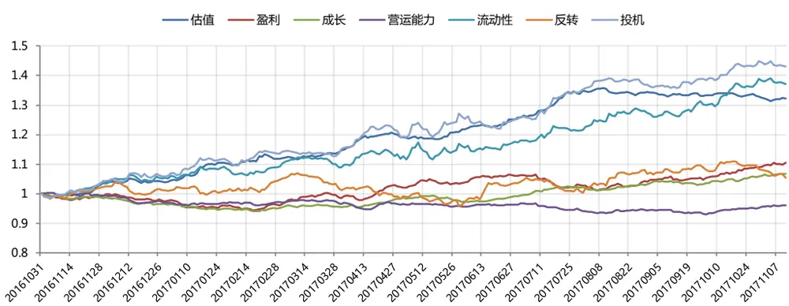

|  | 估值 | 盈利 | 成长 | 营运能力 | 流动性 | 反转 | 投机 |
| --- | --- | --- | --- | --- | --- | --- | --- |
| 涨跌幅 | 32.2% | 10.4% | 6.8% | -3.9% | 37.1% | 5.3% | 43.1% |
| 最大回撤 | 3.4% | 5.7% | 5.9% | 7.3% | 4.9% | 10.4% | 4.1% |
| 年化信息比 | 4.4 | 1.6 | 1.6 | -0.9 | 3.1 | 0.6 | 3.6 |

资料来源：东方证券研究所 & wind 资讯

由于 A股缺乏有效的股票做空机制，因子收益率无法完全转换为投资收益；对于纯多头投资，alpha因子的空头组合可以起到帮投资者筛选股票的作用，但收益的主要收益还是来自多头。如果把因子得分前 10%的股票做成等权组合，其表现如图 2 所示。可以看到多头组合能获取正收益的只有估值因子，流动性和投机因子的多头组合都是亏钱的，它们高额因子收益率主要来自于组合的空头。反转因子多头组合亏损达到 12.3%，而这类因子的历史表现强劲；如果量化组合采用的是完全基于历史的纯量化模式，今年的业绩表现会比较糟糕。

图 2：最近一年大类因子多头组合表现（中证全指内）
最近一年大类因子纯多头组合净值曲线 - 中证全指
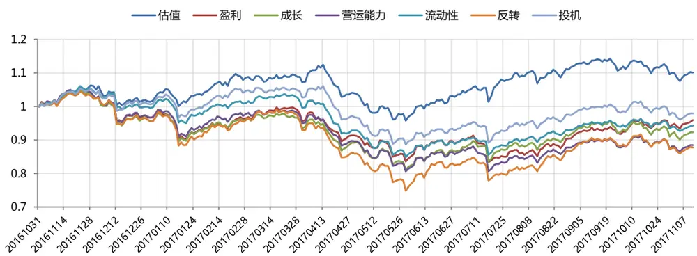

|  | 估值 | 盈利 | 成长 | 营运能力 | 流动性 | 反转 | 投机 |
| --- | --- | --- | --- | --- | --- | --- | --- |
| 涨跌幅 | 10.1% | -4.1% | -7.7% | -11.5% | -5.8% | -12.3% | -2.1% |
| 最大回撤 | 14.9% | 20.5% | 22.9% | 23.9% | 20.0% | 28.5% | 16.5% |
| 年化夏普比 | 0.5 | -0.3 | -0.6 | -0.8 | -0.5 | -0.8 | -0.2 |

资料来源：东方证券研究所 & wind 资讯

在沪深 300 成份股内，因子收益率的相对大小排序和全市场的情况比较接近，但是由于股票池的缩小，股票间差异度降低，因子收益率的绝对值有所下降。另外今年市场大盘价值风格明显，所以在沪深 300 成份股内所有因子的多头收益都为正，估值因子的多头收益更是高达 27.1%，业绩可以进入所有主动量化基金里的前五。2017年量化投资选风格比选 alpha 因子的作用大。中证500成份股内，投机因子表现较沪深 300和全市场弱，成长因子表现更好。

图 3：最近一年大类因子多空组合表现 – 沪深 300
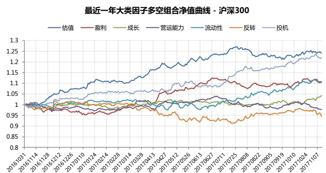

图 4：最近一年大类因子纯多头组合表现 – 沪深 300
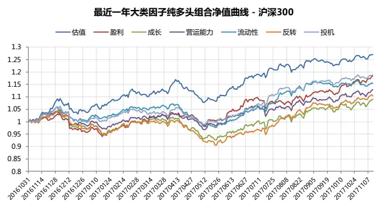
数据来源：东方证券研究所 & wind 资讯

|  | 估值 | 盈利 | 成长 | 营运能力 | 流动性 | 反转 | 投机 |
| --- | --- | --- | --- | --- | --- | --- | --- |
| 涨跌幅 | 24.2% | 10.9% | 4.2% | -2.3% | 10.2% | -5.5% | 22.1% |
| 最大回撤 | 4.7% | 5.1% | 2.6% | 6.1% | 4.8% | 10.3% | 2.7% |
| 年化信息比 | 3.2 | 1.6 | 0.8 | -0.4 | 1.3 | -0.6 | 2.9 |

|  | 估值 | 盈利 | 成长 | 营运能力 | 流动性 | 反转 | 投机 |
| --- | --- | --- | --- | --- | --- | --- | --- |
| 涨跌幅 | 27.1% | 18.5% | 9.0% | 12.9% | 15.5% | 10.4% | 18.8% |
| 最大回撤 | 7.8% | 8.9% | 11.6% | 7.1% | 8.9% | 13.4% | 6.8% |
| 年化夏普比 | 2.1 | 1.4 | 0.6 | 1.0 | 1.4 | 0.8 | 1.7 |

数据来源：东方证券研究所 & wind 资讯

图 5：最近一年大类因子多空组合表现 – 中证 500
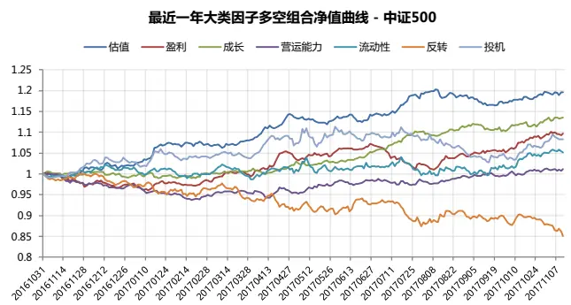

|  | 估值 | 盈利 | 成长 | 营运能力 | 流动性 | 反转 | 投机 |
| --- | --- | --- | --- | --- | --- | --- | --- |
| 涨跌幅 | 19.6% | 9.6% | 13.6% | 1.2% | 5.1% | -14.9% | 8.3% |
| 最大回撤 | 3.1% | 5.7% | 1.7% | 6.5% | 4.2% | 15.0% | 7.7% |
| 年化信息比 | 3.1 | 1.6 | 2.8 | 0.3 | 0.7 | -1.7 | 1.0 |

数据来源：东方证券研究所 & wind 资讯

图 6：最近一年大类因子纯多头组合表现 – 中证 500
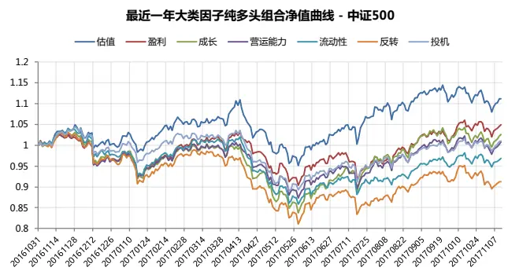

|  | 估值 | 盈利 | 成长 | 营运能力 | 流动性 | 反转 | 投机 |
| --- | --- | --- | --- | --- | --- | --- | --- |
| 涨跌幅 | 11.2% | 4.9% | 2.6% | 0.7% | -3.2% | -8.8% | 1.0% |
| 最大回撤 | 14.3% | 12.5% | 18.7% | 15.3% | 17.6% | 21.4% | 14.8% |
| 年化夏普比 | 0.6 | 0.2 | 0.1 | -0.1 | -0.3 | -0.7 | 0.0 |

数据来源：东方证券研究所 & wind 资讯

## 1.2 市值和反转效应

过去十年 A 股和海外成熟市场相比最大的差别在于，A 股有非常显著的小市值效应和反转效应，这也是国内 alpha策略过去几年异常强劲的主要原因，但今年这两者都发生根本性的改变。从市值分组来看（图 7），只有市值最大的两组股票今年能跑赢市场平均水平，70%的股票都是跑输市场，这和市场资金今年过于集中在大盘周期和行业白马龙头有关。这种资金过于集中的现象还导致反转因子多头组合的失效（图 11），过往一个月涨的好的股票由于短期市场过度反应，未来一个月相对表现还是会更差；不过这些出来的资金没有像以往一样去买那些过去一个月涨的少的股票，使得反转因子虽然因子收益为正，但多头组合却跑不赢市场。

图 7：最近一年市值因子分组超额收益（第一组为小市值）最近一年市值因子分组超额收益
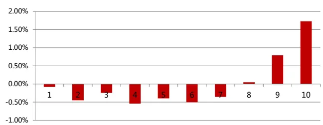
数据来源：东方证券研究所 & wind 资讯

图 8：最近一年市值效应多空表现（小市值减大市值）
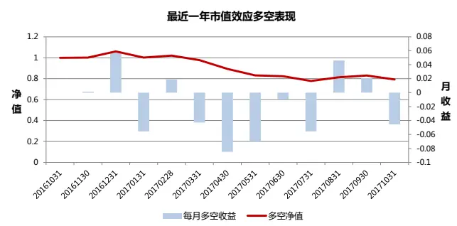
数据来源：东方证券研究所 & wind 资讯

图 9：最近一年小市值纯多头组合表现
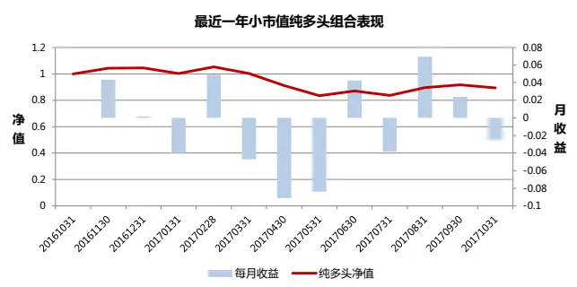
数据来源：东方证券研究所 & wind 资讯

图 10：最近一年大市值纯多头组合表现
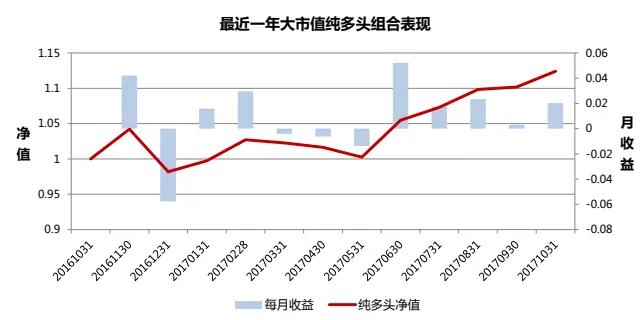
数据来源：东方证券研究所 & wind 资讯

图 11：最近一年反转因子分组超额收益（第一组为最小值）
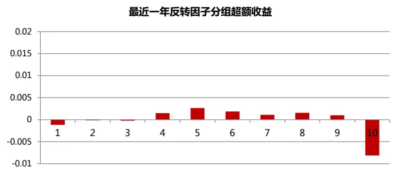
数据来源：东方证券研究所 & wind 资讯

图 12：最近一年反转因子多空表现
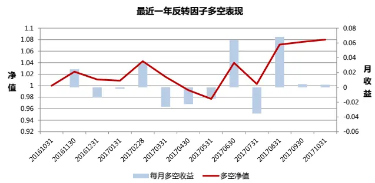
数据来源：东方证券研究所 & wind 资讯

图 13：最近一年反转因子第一组纯多头组合表现
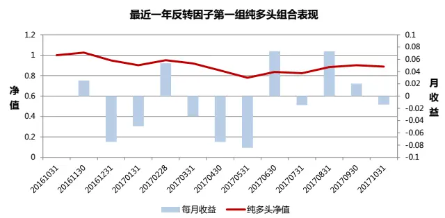
数据来源：东方证券研究所 & wind 资讯

图 14：最近一年反转因子第十组组合表现
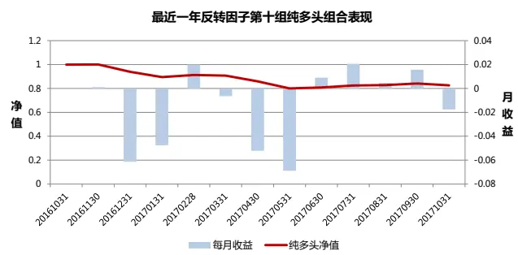
数据来源：东方证券研究所 & wind 资讯

## 1.3 Alpha 因子选择

对于市值因子，小市值股票的制度红利正在逐渐消失，但成长性相对优势还在，大盘股经过一年的大张后，估值优势已不明显，这种极端的“极大市值”行情难以长期延续，但重现 2013-2015那样的“极小市值”行情的概率也很小，市值的 apha属性会慢慢向成熟市场的风险属性转变，更多呈现震荡特征。对于量化投资而言，市值因子还是建议作为风险因子处理，严格控制风险暴露。

alpha 因子里面，估值、盈利和成长这三类基本面因子属于“国际通行”的因子，在我们测试过的美国、香港和国内市场都有效（图 15），而且因子的 IC 相差不大，这些因子是 alpha 的基本来源，而且更多体现的是投资者承担市场风险而获得的收益补偿，而并非市场错误定价导致的短期套利收益，可以长期稳定存在（参考图 16美国市场的因子长期表现，因子收益率的累计净值曲线做了对数处理以避免基数效应看不清涨跌幅度）。有不少学术文献尝试从一些宏观和行为金融层面去解释这些因子收益，但目前来看结果并不理想，难以用作因子择时，而这些基本面因子又是成熟市场最有效的选股因子，这可能也是为什么一些海外大型机构投资者反对做因子择时的原因（参考 AQR Cliff's perspective）。

图 15：美国、香港和国内市场的因子表现

| 罗 | 选股因子 | IC均值 | 值 | IC_IR | 多空组合 |  |  |
| --- | --- | --- | --- | --- | --- | --- | --- |
|  |  |  |  |  | 月均收益 | 最大回撤 | Sharpe值 |
| 素 3 | 估值 | 0.038 | 11.4 | 2.6 | 1.6% | 14.1% | 1.74 |
| 0 | 盈利 | 0.042 | 8.9 | 2.0 | 1.6% | 46.7% | 0.82 |
| 0 | 成长 | 0.038 | 13.2 | 3.0 | 1.5% | 19.5% | 1.83 |
| 0 | 市值 | 0.025 | 3.0 | 0.7 | -0.3% | -84.8% | -0.22 |
|  | 反转 | -0.021 | -4.0 | -0.9 | 1.1% | 26.0% | 0.52 |

|  | 选股因子 | IC均值 | 值 | IC_IR | 多空组合 |  |  |
| --- | --- | --- | --- | --- | --- | --- | --- |
|  |  |  |  |  | 月均收益 | 最大回撤 | Sharpe值 |
| 恒 生 综 指 | 估值 | 0.033 | 4.2 | 1.1 | 0.9% | 25.0% | 0.89 |
|  | 盈利 | 0.028 | 4.2 | 1.1 | 0.5% | 13.8% | 0.46 |
|  | 成长 | 0.028 | 4.3 | 1.1 | 0.5% | 41.5% | 0.35 |
|  | 市值 | 0.042 | 3.5 | 0.9 | 0.2% | 70.4% | 0.05 |
|  | 反转 | -0.016 | -1.7 | -0.4 | 0.4% | 40.3% | 0.27 |

| 中 估值 证 全 指 | 选股因子 0.045 | IC均值 | 值 | IC_IR | 多空组合 |  |  |
| --- | --- | --- | --- | --- | --- | --- | --- |
|  |  |  |  |  | 月均收益 | 最大回撤 | Sharpe值 |
|  |  |  |  |  | 2.6 | 0.9% 7.8% | 0.88 |
|  | 盈利 | 0.024 | 8.9 2.7 | 0.8 | 0.5% | 24.4% | 0.24 |
|  | 成长 | 0.038 | 7.2 | 2.1 | 1.1% | 10.6% | 1.20 |
|  | 市值 | -0.074 | -4.8 | -1.4 | 3.1% | 30.8% | 1.24 |
|  | 反转 | -0.081 | -8.4 | -2.4 | 2.6% | 10.8% | 1.76 |

资料来源：东方证券研究所 & wind 资讯 & Bloomberg

图 16：市值（SMB）、估值（HML）、动量（WML）因子在美国市场过去百年里的表现
美国市场的因子收益表现
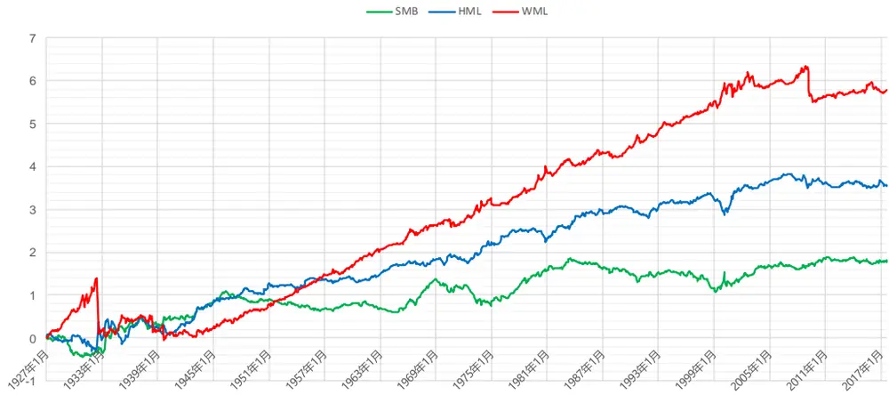
资料来源：东方证券研究所 & wind 资讯

但国内和海外市场 alpha 因子最大的不同之处在于反转效应强劲，它和市场资金面、流动性高度相关，被预测从而做择时的可能性相对较高。Doron, A., Si, C., & Allaudeen, H. (2015)在文中指出月末的资金敏感性 MKTILLIQ （计算方式为市值加权的 Amihud‘s ILLIQ）可以显著的解释下个月动量多空组合收益，若当前的市场的资金敏感性较低，则动量因子之后的表现会较好。

我们测试了 2007.12.31-2017.10.30 的中证全指成分股的数据，由于 A 股市场并没有动量效应，所以我们这里测试了 MKTILLIQ 对于 1 个月反转因子未来表现的预测作用。这里 ILLIQ 定义为过去 20 个交易日每天一个亿成交金额推动的涨跌幅的均值，并且剔除了停牌天数或涨跌停天数大于 10天的股票。

如下图所示，在时间序列上，WML 在经过 Fama-French 三因子分解后还有明显的alpha(1.13%，t 值为 2.2），说明反转因子的选股作用不能被这 3 个因子所完全解释。

图 17：WML 经过 Fama-French 三因子分解的结果

|  | 截距项 | MKT | SMB | HML |
| --- | --- | --- | --- | --- |
| 系数 | 0.01 | -0.02 | 0.28 | 0.11 |
| t值 | 2.25 | -0.4 | 3.15 | 0.94 |

资料来源：东方证券研究所 & wind 资讯

接着我们在三因子模型中加入了滞后一期的 MKTILLIQ，发现上个月末的 MKTILLIQ 可以显著的解释下个月反转因子多空组合WML的收益(系数 0.78，t 值为 2.3）。此外，月末的 MKTILLIQ和下个月的 WML 有着 22.36%的线性相关性。可以认为，月末的市场资金敏感性对于下个月反转因子的表现有着明显的预测作用，当市场资金敏感性高的时候，反转因子表现更佳。

图 18：加入 MKTILLIQ 后 WML 分解结果

|  | 截距项 | 上个月MKT-ILLIQ | MKT | SMB | HML |
| --- | --- | --- | --- | --- | --- |
| 系数 | -0.01 | 0.78 | -0.01 | 0.27 | 0.11 |
| 埴 | -0.54 | 2.35 | -0.16 | 3.03 | 0.89 |

资料来源：东方证券研究所 & wind 资讯

图 19：不同月份的 MKTILLIQ 与反转因子多空组合WML
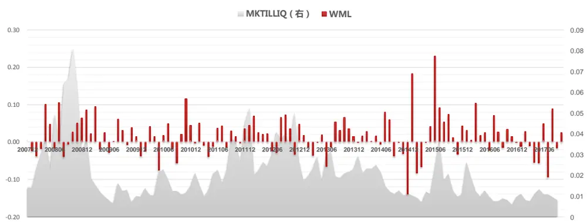
资料来源：东方证券研究所 & wind 资讯

由上图可知，从 2016 年 11 月开始至今，WML 的收益率相对于历史数据一直偏低，而上一期的 MKTILLIQ 也处于历史低位，通过观察当前的市场资金敏感性状态，可以在一定程度上告诉我们是否要在之后选择反转因子作为 alpha因子。

## 二、量化产品的表现

## 2.1主动量化、量化对冲、指数增强产品的表现

2017年市场大盘蓝筹风格明显，主动量化类基金对风格切换的把握不够及时，整体表现不佳，2017年平均收益率只有 5.4%，而指数增强产品由于大多限制了选股股票池，受风格切换影响相对较小，整体收益不错，达到了 17.1%。量化对冲产品受账户持仓股票范围、保证金比例和 alpha因子失效的影响，整体表现较为一般，今年平均收益只有 1.2%。

图 20：2017 年初以来基金平均收益以及主要指数收益率（截止于 2017 年 11 月 10 日）

2017年初以来基金平均收益以及主要指数收益率

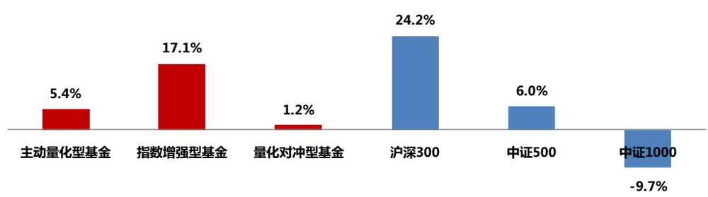
资料来源：东方证券研究所 & wind 资讯

下图展示了不同类型量化基金今年以来涨跌幅排名前 10的基金产品，主动量化产品中上投摩根阿尔法排名第一，年初至今涨跌幅为 36.70%，规模达到 24.03亿元，另外华泰柏瑞量化A 的规模最大，达到 67.51 亿元；指数增强型产品中景顺长城沪深 300 排名第一，年初至今涨跌幅为35.10%，规模达到 57.69 亿元，在同类产品中规模最大；量化对冲产品中海富通阿尔法对冲排名第一，年初至今涨跌幅为 5.63%，规模 4.40亿元。

图 21：不同类型量化基金今年以来涨跌幅排名前 10的基金产品（截止于 2017年 11月 10日）

| 主动 量化型 基金 | 基金名称 | 2017年初以来涨跌幅 | 合计基金规模（亿元） |
| --- | --- | --- | --- |
|  | 上投摩根阿尔法 | 36.70% | 24.03 |
|  | 景顺长城量化新动力 | 35.64% | 5.20 |
|  | 华泰柏瑞量化优选 | 28.31% | 13.85 |
|  | 嘉实研究阿尔法 | 25.98% | 5.41 |
|  | 华泰柏瑞量化驱动 | 25.70% | 16.62 |
|  | 华泰柏瑞量化A | 25.21% | 67.51 |
|  | 华泰柏瑞量化先行 24.00% | 49.31 |  |
| 华泰柏瑞量化智慧 | 23.53% | 13.37 |  |
| 东吴安享量化 | 21.17% | 2.40 |  |
| 工银瑞信量化策略 | 20.70% | 2.02 |  |
| 指数 增强型 基金 | 基金名称 | 2017年初以来涨跌幅 | 合计基金规模（亿元） |
|  | 景顺长城沪深300 | 35.10% | 57.69 |
|  | 兴全沪深300 | 33.20% | 9.97 |
|  | 易方达沪深300量化 | 33.20% | 10.78 |
|  | 华安沪深300量化A | 32.31% | 7.53 |
|  | 华宝沪深300 | 29.44% | 3.48 |
|  | 富国沪深300 | 28.33% | 21.59 |
|  | 浦银安盛沪深300 | 26.48% | 1.35 |
|  | 创金合信沪深300A | 25.66% | 2.63 |
|  | 安信沪深300A | 25.63% | 1.56 |
|  | 申万菱信中证500优选 | 23.79% | 2.62 |

| 量化 对冲型 基金 | 基金名称 | 2017年初以来涨跌幅 | 合计基金规模（亿元） |
| --- | --- | --- | --- |
|  | 海富通阿尔法对冲 | 5.63% | 4.40 |
|  | 泰达宏利绝对收益策略 | 5.18% | 1.31 |
|  | 华泰柏瑞量化收益 | 3.64% | 9.21 |
|  | 南方绝对收益策略 | 3.37% | 2.78 |
|  | 工银瑞信绝对收益A | 3.33% | 2.42 |
|  | 富国绝对收益多策略 | 3.05% | 1.55 |
|  | 华泰柏瑞量化对冲 | 3.02% | 4.73 |
|  | 嘉实绝对收益策略 | 3.00% | 1.25 |
|  | 华宝量化对冲A | 2.83% | 6.98 |
|  | 南方卓享绝对收益策略 | 2.29% | 1.00 |

资料来源：东方证券研究所 & wind 资讯

## 2.2 新发的量化产品规模、特点

下图展示了 2017年新成立的 57只量化基金，产品依然是已主动量化型为主，只有 6只基金的规模超过 10亿元，其中华泰柏瑞量化阿尔法的基金规模最大，达到 51.70亿元。而今年首批成立的 6 只 FOF 公墓基金吸引了大量资金，5 只规模在 20 亿元以上，其中华夏聚惠稳健目标的规模最大，达到 46.93亿元。

图 22：2017年新成立的量化基金（截止于 2017年 11月 10日）

| 基金代码 | 基金名称 | 合计基金规模（亿元） | 基金类型 | 基金成立日 | 基金代码 | 基金名称 | 合计基金规模（亿元） | 基金类型 | 基金成立日 |
| --- | --- | --- | --- | --- | --- | --- | --- | --- | --- |
| 005055.OF | 华泰柏瑞量化阿尔法 | 51.6971 | 主动量化 | 2017-09-26 | 004192.OF | 招商中证500A | 2.1714 | 指数增强 | 2017-05-17 |
| 005218.OF | 华夏聚惠稳健目标A | 46.9258 | FOF | 2017-11-03 | 004768.OF | 申万菱信价值优享 | 2.1125 | 主动量化 | 2017-07-12 |
| 005215.OF | 南方全天候策略A | 33.0934 | FOF | 2017-10-19 | 004945.OF | 长信中证500 | 2.1043 | 指数增强 | 2017-08-30 |
| 005156.OF | 嘉实领航资产配置A | 28.6893 | FOF | 2017-10-26 | 004536.OF | 嘉实中小企业量化活力 | 2.0699 | 主动量化 | 2017-07-04 |
| 005217.OF | 建信福泽安泰 | 27.9263 | FOF | 2017-11-02 | 004194.OF | 招商中证1000A | 1.5756 | 指数增强 | 2017-03-03 |
| 005220.OF | 海富通聚优精选 | 21.5965 | FOF | 2017-11-06 | 161036.SZ | 富国中证娱乐主题 | 1.2196 | 指数增强 | 2017-03-13 |
| 004641.OF | 万家量化睿选 | 9.4250 | 主动量化 | 2017-08-04 | 004212.OF | 中融量化智选A | 1.1515 | 主动量化 | 2017-03-22 |
| 005221.OF | 泰达宏利全能优选A | 8.2933 | FOF | 2017-11-02 | 004250.OF | 银河量化优选 | 0.9074 | 主动量化 | 2017-04-27 |
| 004394.OF | 华泰柏瑞量化创优 | 7.5088 | 主动量化 | 2017-05-12 | 005037.OF | 银华新能源新材料量化A | 0.8692 | 主动量化 | 2017-09-15 |
| 005000.OF | 泰康泉林量化价值精选A | 7.3549 | 主动量化 | 2017-09-29 | 004716.OF | 信诚量化阿尔法 | 0.7617 | 主动量化 | 2017-07-12 |
| 004606.OF | 上投摩根优选多因子 | 5.6825 | 主动量化 | 2017-08-23 | 003311.OF | 大摩睿成大盘弹性 | 0.7555 | 主动量化 | 2017-04-12 |
| 004135.OF | 申万菱信量化成长 | 5.6436 | 主动量化 | 2017-03-10 | 161037.SZ | 富国中证高端制造 | 0.7270 | 指数增强 | 2017-04-27 |
| 002983.OF | 长信国防军工 | 5.2379 | 主动量化 | 2017-01-05 | 167702.SZ | 德邦量化优选A | 0.6933 | 主动量化 | 2017-03-24 |
| 005053.OF | 银河量化价值 | 4.4083 | 主动量化 | 2017-10-13 | 004209.OF | 大成智惠量化多策略 | 0.6216 | 主动量化 | 2017-03-21 |
| 519212.OF | 万家宏观择时多策略 | 3.9452 | 主动量化 | 2017-03-30 | 004397.OF | 长盛信息安全量化策略 | 0.5236 | 主动量化 | 2017-05-03 |
| 005062.OF | 博时中证500 | 3.8382 | 指数增强 | 2017-09-26 | 004489.OF | 鹏华量化策略 | 0.4892 | 主动量化 | 2017-06-21 |
| 003658.OF | 长盛量化多策略 | 3.5833 | 主动量化 | 2017-02-22 | 004272.OF | 中融量化小盘A | 0.4476 | 主动量化 | 2017-05-17 |
| 004484.OF | 泰达宏利业绩驱动A | 3.5109 | 主动量化 | 2017-09-06 | 005084.OF | 平安大华量化先锋A | 0.4119 | 主动量化 | 2017-11-01 |
| 004023.OF | 广发量化稳健 | 3.4288 | 主动量化 | 2017-08-04 | 005005.OF | 中金金泽A | 0.3659 | 主动量化 | 2017-09-01 |
| 004925.OF | 长信低碳环保行业量化 | 3.2369 | 主动量化 | 2017-11-09 | 005237.OF | 银华医疗健康A | 0.3373 | 主动量化 | 2017-11-09 |
| 161038.SZ | 富国新兴成长量化精选 | 2.9987 | 主动量化 | 2017-07-21 | 002495.OF | 前海开源量化优选A | 0.3318 | 主动量化 | 2017-07-03 |
| 004576.OF | 新华恒益量化 | 2.9918 | 主动量化 | 2017-09-01 | 003959.OF | 平安大华量化A | 0.2049 | 主动量化 | 2017-01-23 |
| 001771.OF | 南方量化 | 2.9639 | 主动量化 | 2017-08-24 | 005035.OF | 银华信息科技量化A | 0.1612 | 主动量化 | 2017-09-15 |
| 004359.OF | 创金合信量化核心A | 2.8696 | 主动量化 | 2017-03-27 | 005033.OF | 银华智能汽车A | 0.1391 | 主动量化 | 2017-09-15 |
| 003986.OF | 申万菱信中证500优选 | 2.6186 | 指数增强 | 2017-01-10 | 005239.OF | 银华文体娱乐A | 0.1378 | 主动量化 | 2017-11-09 |
| 004190.OF | 招商沪深300A | 2.5467 | 指数增强 | 2017-02-10 | 005235.OF | 银华食品饮料A | 0.1353 | 主动量化 | 2017-11-09 |
| 004730.OF | 建信量化事件驱动 | 2.4404 | 主动量化 | 2017-09-13 | 004592.OF | 安信量化多因子 | 0.1237 | 主动量化 | 2017-07-03 |
| 004951.OF 001789.OF | 申万菱信价值优利 国泰量化收益 | 2.2589 2.1963 | 主动量化 主动量化 | 2017-09-21 2017-05-19 | 501003.SH | 长信量化优选 | 0.0253 | 主动量化 | 2017-04-14 |

资料来源：东方证券研究所 & Wind 资讯

由于今年市场风格偏价值，许多以价值投资为目标的量化基金相继推出，例如泰康泉林量化价值精选 A、银河量化价值、申万菱信价值优利等。我们认为这可能是未来量化产品的一个主流趋势，因为它们的 alpha 收益来源更稳定，长期收益可观，资金容量足够大。另外，随着公募 FOF产品的正式推出，公募基金对行业指数产品也更加重视，例如：长信国防军工、长信低碳环保行业量化、富国中证娱乐主题、银华新能源新材料量化 A等，这些指数产品可以在 FOF投资中起到很好的配臵作用。

## 风险提示

1. 因子有效性基于历史数据分析得到，未来市场可能发生较大的风格转换，建议投资者紧密跟踪因子表现。

2. 极端市场环境可能对因子效果和模型造成剧烈冲击，需进行严格的风险控制。

## 附录 1, 东方 alpha 因子库

目前我们使用的 Alpha因子库，之前报告中基于高频数据计算得到的 alpha因子由于数据源的问题暂未加入到定期更新中。

图 11：东方 Alpha因子列表

| 因子简称 |  | 因子全名 细节说明 |
| --- | --- | --- |
| 估值 | BP_LF | Newest Book Value/Market Cap Market Cap 为总市值 |
|  | EP_TTM | TTM earnings/ MarketCap |
|  | EP2_TTM | TTM earnings(after Non-recurring Iterms) / MarketCap 扣除非经常性损益 |
|  | SP_TTM | TTM Sales/ Market Cap |
|  | CFP_TTM |  |
|  | EBIT2EV | TTM Operating Cash Flow / Market Cap EBIT/Enterprise Value |
|  | Sales2EV | 营业收入_TM/(总币值+非流动贝债合计_取新财报-员币资金_取新财 |
| 盈利能力 | ROA | 坦 总资产收益率 |
|  | ROE | 净资产收益率 |
|  | GrossMargin | 销售毛利率 |
|  | NetMargin | 净利润率 |
|  | GP2Asset | 总资产利润率 |
| 成长 | SalesGrowth Qr YOY | 营业收入增长率（季度同比） |
|  | ProfitGrowth_Qr_YOY | 净利润增长率(季度同比) |
|  | EquityGrowth_YOY | 净资产增长率(同比） |
|  | OCFGrowth_YOY | 经营现金流增长率（同比） |
| 营运 能力 | AssetTurnover | 总资产周转率 |
|  | InvTurnover | 存货周转率 |
|  | Debt2Asset | 债务资产比例 |
| 流动性 | TO_1M | 以流通股本计算的1个月日均换手率 |
|  | TO_3M | 以流通股本计算的3个月日均换手率 |
|  | ILLIQ | 每天一个亿成交量能推动的股价涨幅 |
|  | AmountAvg_1M_3M |  |
|  | AmountVol_1M_12M | 过去一个月日均成交额/过去三个月日均成交额 |
| 技术反转 | Ret1M | 过去一个月日均成交量/12个月日均成交量 1个月收益反转 |
|  | Ret3M |  |
|  | Momentumlast6M | 3个月收益反转 |
|  | Momentumlast12M | 复权收盘价/复权收盘价_6月前-1 复权收盘价/复权收盘价_12月前-1 |
|  | Momentumave1M | 股价相比最近1个月均价涨幅 用的复权收盘价 |
|  | PPReversal | 乒乓球反转因子 |
|  | CGO_3M |  |
|  | 52-Week High | Capital Gains Overhang (3M) 用的复权收盘价 |
| 投 机 | IRFF | 收盘价/过去一年中的最高价 Fama-French regression SSR/SST |
|  | RealizedVolatility_3M | 特异度指标 过去三个月日收益率数据计算的标准差 |
|  | RealizedVolatility_1Y |  |
|  | MaxRet | 过去一年日收益率数据计算的标准差 上月最大日收益 |

数据来源：东方证券研究所 & Wind 资讯

## 附录 2, 过去十年大类因子表现

测试区间为 2007 年 1 月至 2017 年 10 月

图 12：过去十年大类因子表现

| 中证全指 | 因子类别 | IC均值 | t值 | IC_IR | 多空组合 月均收益 | 多空组合 月胜率 | 多空组合 最大回撤 | 多空组合 年化收益率 | 多空组合 信息比率 |
| --- | --- | --- | --- | --- | --- | --- | --- | --- | --- |
|  | 估值 | 6.31% | 8.55 | 2.61 | 1.71% | 65.89% | 10.33% | 21.54% | 1.70 |
|  | 盈利 | 2.51% | 2.97 | 0.90 | 0.58% | 57.36% | 25.88% | 6.32% | 0.56 |
|  | 成长 | 2.93% | 5.62 | 1.71 | 0.92% | 63.57% | 9.98% | 11.18% | 1.29 |
|  | 营运能力 | 0.56% | 1.18 | 0.36 | -0.02% | 51.16% | 21.15% | -0.44% | -0.03 |
|  | 流动性 | 9.11% | 10.88 | 3.32 | 2.62% | 80.62% | 21.72% | 34.81% | 2.25 |
|  | 反转 投机 | 8.40% 7.70% | 7.75 7.12 | 2.37 2.17 | 2.55% 1.48% | 67.44% 66.67% | 15.23% 20.73% | 33.07% 17.76% | 1.72 1.16 |

| 沪 深 | 因子类别 | IC均值 | t值 | IC_IR | 多空组合 月均收益 | 多空组合 月胜率 | 多空组合 最大回撤 | 多空组合 年化收益率 | 多空组合 信息比率 |
| --- | --- | --- | --- | --- | --- | --- | --- | --- | --- |
|  | 估值 | 5.49% | 5.84 | 1.78 | 1.46% | 68.22% | 17.19% | 18.09% | 1.51 |
|  | 盈利 | 1.91% | 2.18 | 0.67 | 0.30% | 54.26% | 24.17% | 2.99% | 0.32 |
| 3 0 0 | 成长 | 2.25% | 3.33 | 1.02 | 0.47% | 60.47% | 15.12% | 5.36% | 0.71 |
|  | 营运能力 | 1.11% | 1.92 | 0.59 | -0.01% | 54.26% | 22.31% | -0.44% | -0.02 |
|  | 流动性 | 4.84% | 5.45 | 1.66 | 0.91% | 65.12% | 28.62% | 10.55% | 0.85 |
|  | 反转 | 4.86% | 4.46 | 1.36 | 1.31% | 60.47% | 16.83% | 15.64% | 1.11 |
|  | 投机 | 5.64% | 4.72 | 1.44 | 0.85% | 63.57% | 21.36% | 9.79% | 0.83 |

| 中 证 | 因子类别 | IC均值 | t值 | IC_IR | 多空组合 月均收益 | 多空组合 月胜率 | 多空组合 最大回撤 | 多空组合 年化收益率 | 多空组合 信息比率 |
| --- | --- | --- | --- | --- | --- | --- | --- | --- | --- |
|  | 估值 | 5.12% | 6.40 | 1.95 | 1.05% | 60.47% | 11.48% | 12.72% | 1.31 |
|  | 盈利 | 3.42% | 3.83 | 1.17 | 0.53% | 58.91% | 24.56% | 5.88% | 0.57 |
| 5 0 0 | 成长 | 4.10% | 7.42 | 2.26 | 1.02% | 72.87% | 12.58% | 12.57% | 1.62 |
|  | 营运能力 | 0.64% | 1.07 | 0.33 | 0.02% | 50.39% | 17.76% | -0.02% | 0.03 |
|  | 流动性 | 7.58% | 8.19 | 2.50 | 1.53% | 72.09% | 23.91% | 18.94% | 1.48 |
|  | 反转 | 6.53% | 6.06 | 1.85 | 1.63% | 67.44% | 12.55% | 20.05% | 1.36 |
|  | 投机 | 6.39% | 6.09 | 1.86 | 0.81% | 63.57% | 16.26% | 9.44% | 0.92 |

数据来源：东方证券研究所 & Wind 资讯

## 分析师申明

每位负责撰写本研究报告全部或部分内容的研究分析师在此作以下声明：

分析师在本报告中对所提及的证券或发行人发表的任何建议和观点均准确地反映了其个人对该证券或发行人的看法和判断；分析师薪酬的任何组成部分无论是在过去、现在及将来，均与其在本研究报告中所表述的具体建议或观点无任何直接或间接的关系。

## 投资评级和相关定义

报告发布日后的 12个月内的公司的涨跌幅相对同期的上证指数/深证成指的涨跌幅为基准；

## 公司投资评级的量化标准

买入：相对强于市场基准指数收益率 15%以上；

增持：相对强于市场基准指数收益率 5%～15%；

中性：相对于市场基准指数收益率在-5%～+5%之间波动；

减持：相对弱于市场基准指数收益率在-5%以下。

未评级——由于在报告发出之时该股票不在本公司研究覆盖范围内，分析师基于当时对该股票的研究状况，未给予投资评级相关信息。

暂停评级——根据监管制度及本公司相关规定，研究报告发布之时该投资对象可能与本公司存在潜在的利益冲突情形；亦或是研究报告发布当时该股票的价值和价格分析存在重大不确定性，缺乏足够的研究依据支持分析师给出明确投资评级；分析师在上述情况下暂停对该股票给予投资评级等信息，投资者需要注意在此报告发布之前曾给予该股票的投资评级、盈利预测及目标价格等信息不再有效。

## 行业投资评级的量化标准：

看好：相对强于市场基准指数收益率 5%以上；

中性：相对于市场基准指数收益率在-5%～+5%之间波动；

看淡：相对于市场基准指数收益率在-5%以下。

未评级：由于在报告发出之时该行业不在本公司研究覆盖范围内，分析师基于当时对该行业的研究状况，未给予投资评级等相关信息。

暂停评级：由于研究报告发布当时该行业的投资价值分析存在重大不确定性，缺乏足够的研究依据支持分析师给出明确行业投资评级；分析师在上述情况下暂停对该行业给予投资评级信息，投资者需要注意在此报告发布之前曾给予该行业的投资评级信息不再有效。

## 免责声明

本证券研究报告（以下简称“本报告”）由东方证券股份有限公司（以下简称“本公司”）制作及发布。

本报告仅供本公司的客户使用。本公司不会因接收人收到本报告而视其为本公司的当然客户。本报告的全体接收人应当采取必要措施防止本报告被转发给他人。

本报告是基于本公司认为可靠的且目前已公开的信息撰写，本公司力求但不保证该信息的准确性和完整性，客户也不应该认为该信息是准确和完整的。同时，本公司不保证文中观点或陈述不会发生任何变更，在不同时期，本公司可发出与本报告所载资料、意见及推测不一致的证券研究报告。本公司会适时更新我们的研究，但可能会因某些规定而无法做到。除了一些定期出版的证券研究报告之外，绝大多数证券研究报告是在分析师认为适当的时候不定期地发布。

在任何情况下，本报告中的信息或所表述的意见并不构成对任何人的投资建议，也没有考虑到个别客户特殊的投资目标、财务状况或需求。客户应考虑本报告中的任何意见或建议是否符合其特定状况，若有必要应寻求专家意见。本报告所载的资料、工具、意见及推测只提供给客户作参考之用，并非作为或被视为出售或购买证券或其他投资标的的邀请或向人作出邀请。

本报告中提及的投资价格和价值以及这些投资带来的收入可能会波动。过去的表现并不代表未来的表现，未来的回报也无法保证，投资者可能会损失本金。外汇汇率波动有可能对某些投资的价值或价格或来自这一投资的收入产生不良影响。那些涉及期货、期权及其它衍生工具的交易，因其包括重大的市场风险，因此并不适合所有投资者。

在任何情况下，本公司不对任何人因使用本报告中的任何内容所引致的任何损失负任何责任，投资者自主作出投资决策并自行承担投资风险，任何形式的分享证券投资收益或者分担证券投资损失的书面或口头承诺均为无效。

本报告主要以电子版形式分发，间或也会辅以印刷品形式分发，所有报告版权均归本公司所有。未经本公司事先书面协议授权，任何机构或个人不得以任何形式复制、转发或公开传播本报告的全部或部分内容。不得将报告内容作为诉讼、仲裁、传媒所引用之证明或依据，不得用于营利或用于未经允许的其它用途。

经本公司事先书面协议授权刊载或转发的，被授权机构承担相关刊载或者转发责任。不得对本报告进行任何有悖原意的引用、删节和修改。

提示客户及公众投资者慎重使用未经授权刊载或者转发的本公司证券研究报告，慎重使用公众媒体刊载的证券研究报告。

## 东方证券研究所

地址：上海市中山南路 318 号东方国际金融广场 26 楼

联系人： 王骏飞

电话：021-63325888*1131

传真：021-63326786

网址： www.dfzq.com.cn

Email： wangjunfei@orientsec.com.cn