## 研究结论

分析师研报数据是相对独立的信息源，本报告基于朝阳永续的盈利预测、评级和目标价等研报明细数据，研究分析师预期相关的属性，一致预期加总方法以及相应的 alpha因子，供投资者参考。

由于分析师选择性发布报告等原因，分析师覆盖多的股票未来表现更好，但因子使用时需要做风险中性处理。分析师预期分歧比较大的公司更容易高估，未来收益较差，但该因子覆盖率较低，不适合全市场选股使用。

分析师盈余预测的准确性跟预测时间、公司的信息不确定以及分析师属性有关。大公司、价值股、业绩稳定、跟踪分析师多、分歧度小的公司预测偏差和误差更小；有经验的、跟踪行业少、往年预测精度高、雇主规模大的分析师的预测更加准确。

我们比较了 wind、朝阳永续、等权、最近预测、预测精度排序加权和预测精度加权 6种分析师一致预期加权方法，发现预测精度加权和朝阳永续的预测精度显著高于其他加权方法，但这两者之间差距并不显著，考虑到加权方法透明度，我们建议采用预测精度加权。

我们基于预测精度加权构建了一致预期净利润、一致预期评级，一致评级目标价，并基于此构建了 EP_FY1、PEG、一致预期评级 SCORE 和目标价隐含收益率4个 alpha因子，检验发现 4个 alpha因子在各个样本空间中均有显著的选股效果，

传统上用一致预期净利润的变化率来表示分析师预期的调整，但是这种处理方法忽视了各个分析师的特质性，我们建议使用分析师预测精度加权各个分析师相对于自己前期的预测调整得到加权的预期调整，相比于一致预期的调整，中证全指内 IC_IR 从 1.04 提升到 2.99。

剔除估值、成长、盈利、流动性、投机性等因子后除预期分歧度由于覆盖率较低导致选股效果不显著外，其他因子在中证全指（非金融）内依然有显著的选股效果，分析师大类因子在剔除其他影响后，中证全指内IC_IR依然高达 3.44，加入分析预期后沪深 300增强收益率可提升 1%左右。

## 风险提示

- 量化模型失效风险

- 市场极端环境的冲击

分析师残差因子在中证全指（非金融）中的表现

|  | RankIC |  |  | 多空组合 |  |  |  |
| --- | --- | --- | --- | --- | --- | --- | --- |
|  | 均值 | IC_IR | t值 | 年化收益 | 夏普比 | 月胜率 | 最大回撤 |
| COV | 2.47% | 1.09 | 3.06 | 11.66% | 1.62 | 67.0% | 11.2% |
| -DISP | 0.80% | 0.66 | 1.85 | 0.71% | 0.17 | 54.3% | 18.2% |
| EP_FY1 | 1.78% | 1.31 | 3.68 | 4.10% | 0.85 | 57.4% | 12.3% |
| -PEG | 2.24% | 2.15 | 6.03 | 8.45% | 1.88 | 73.4% | 6.0% |
| TPER | 2.24% | 2.05 | 5.75 | 10.23% | 2.07 | 73.4% | 7.4% |
| SCORE | 2.35% | 1.74 | 4.87 | 11.43% | 2.22 | 71.3% | 6.7% |
| WFR | 2.56% | 2.84 | 7.96 | 10.26% | 2.40 | 75.5% | 5.6% |
| ANALYST | 4.60% | 3.44 | 9.64 | 18.92% | 3.71 | 85.1% | 5.0% |

东方证券股份有限公司经相关主管机关核准具备证券投资咨询业务资格，据此开展发布证券研究报告业务。

东方证券股份有限公司及其关联机构在法律许可的范围内正在或将要与本研究报告所分析的企业发展业务关系。因此，投资者应当考虑到本公司可能存在对报告的客观性产生影响的利益冲突，不应视本证券研究报告为作出投资决策的唯一因素。

报告发布日期2017 年 12 月 03 日

证券分析师朱剑涛

021-63325888*6077

zhujiantao@orientsec.com.cn

执业证书编号：S0860515060001

王星星

021-63325888-6108

wangxingxing@orientsec.com.cn

执业证书编号：S0860517100001

联系人王星星

021-63325888-6108

wangxingxing@orientsec.com.cn

021-63325888*5091

qiurui@orientsec.com.cn

## 相关报告

| 风险模型在时间序列上的改进 | 2017-12-01 |
| --- | --- |
| 细分行业建模之券商内因子研究 | 2017-10-26 |
| 质优股量化投资 | 2017-08-31 |

## 一、关于分析师预期

分析师预期是相对独立于股票交易数据、财务报告数据的第三方信息源，本篇报告主要探讨分析师预期相关的属性，一致性预期加权方法以及相关的 alpha因子。在开篇之前本章先介绍一下分析师预期的数据来源、分析师预期的覆盖率以及以及一些必要的说明项。

## 1.1 数据来源

目前Wind、同花顺、朝阳永续等数据提供商都有提供分析师预期数据，其中朝阳永续的特色就是分析师预期数据，而Wind目前在国内机构投资者中更加普及。而且，每家数据提供商除了提供基础的盈利预测、评级、目标价等报告明细数据之外，还提供一些衍生数据，比如一致预期净利润、一致预期评级等等，由于衍生数据源于预测明细，所以我们仅比较其预测明细数据的差异。

图 1：Wind和朝阳永续报告数量比较
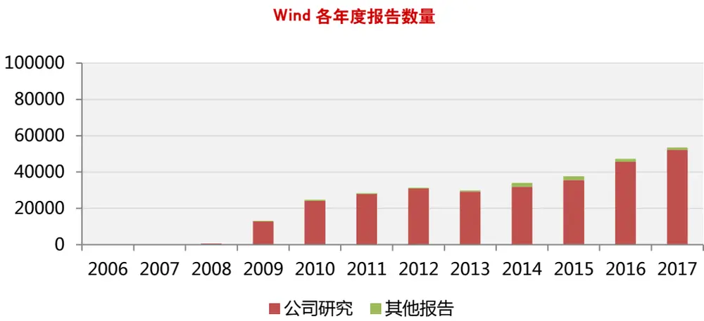

朝阳永续各年度报告数量
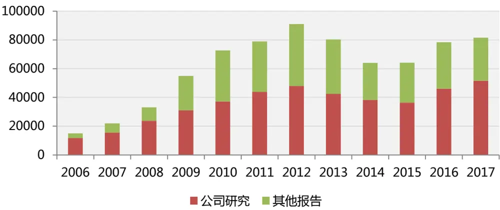
注：2017 年数据截止于 10 月 31 日
数据来源：wind、朝阳永续、东方证券研究所

从上图的两者的对比中，不难看出，2015 年以前，wind 收录的公司研究报告数量明显少于朝阳永续，但 2015年及以后的差异并不明显，但其他报告部分（报告行业报告、主题报告、晨会等非公司研究报告，但内有公司盈余预测的报告，一篇报告同时有 N 家公司的盈余报告处理为 N篇）朝阳永续收录的明显多于 wind。需要提醒的是上图统计的报告数量限制了报告录入时间和撰写时间之差不超过 7个自然日，主要是为了尽量避免券商给数据供应商选择性推送报告的影响。

从两家数据商各年度收录报告中的股票数量来看，朝阳永续覆盖的股票数量一直多于 wind，但近几年的领先优势已不明显。

图 2：Wind和朝阳永续各年度覆盖股票数量
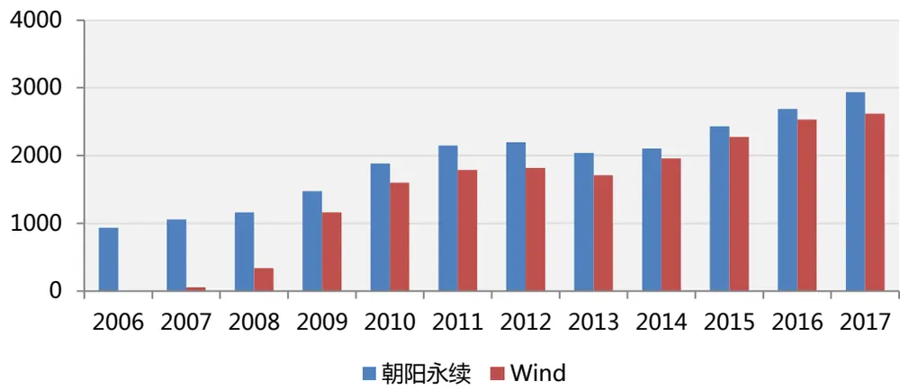
注：2017 年数据截止于 10 月 31 日
数据来源：wind、朝阳永续、东方证券研究所

由于朝阳永续的数据收集更加全面，尤其 2015 年以前，本篇报告的研究基于朝阳永续收集的分析师预期数据，相关的结论投资者在基于 wind预期数据计算时也可以参考。对于朝阳永续分析师预期数据的使用，我们制定了如下筛选原则：

（1）无论是公司报告还是其他报告均纳入考察范围，只要盈利预测、评级、目标价三者不全为空值；

（2）仅考虑标的为 A股的报告，剔除 B股、港股报告；

（3）仅考察卖方机构报告，包括境内券商、港台、境外卖方研究机构，下文统称券商/机构；

（4）报告录入时间和撰写时间相差不超过 7个自然日，相差太多的报告有选择性推送的嫌疑；

（5）涉及盈利预测时仅考察对年报的预测；

满足（1）-（4）标准的报告占收录总报告数量的 83.7%，满足（1）-（5）标准的报告占总收录报告数的 82.4%，本报告使用的数据截止于 2017 年 10 月 31 日。

从各个月份的报告数量分布来看，3 月、4 月、8 月、10 月的报告数量明显多于其他月份，主要因为 3 月、4 月是年报和 1 季报密集发布期，8 月份公告中报的上市公司比较多，10 月份 3季报发布，分析师一般在财报发布后及时更新观点和盈余预测数据，相应的基于财报数据的选股策略或选股因子在财报发布期换手会更高。

图 3：各个月份报告数量
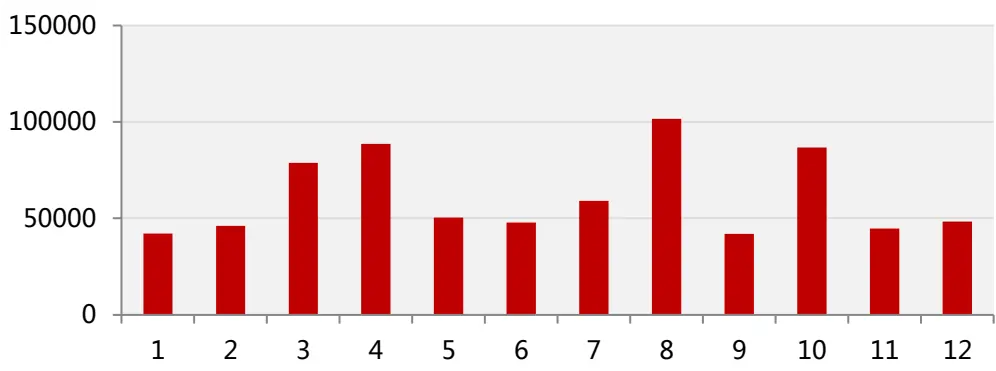
数据来源：朝阳永续、东方证券研究所

## 1.2 数据覆盖率

投资者在使用分析师预期数据时比较关心的一个问题是预期数据覆盖率问题，我们主要从盈利预测、评级、目标价三个维度考察分析师预期数据在各个样本空间的覆盖情况，某只股票在过去3个月有一个有效数据，我们就定义为有覆盖。无论是盈利预测、评级还是目标价，毫无疑问都是沪深 300 覆盖率最高，中证 800 其次，中证全指最低。盈利预测、评级和目标价三者中，盈利评级的覆盖率一般高于评级，评级的覆盖率高于目标价。对于中证全指，盈利预测和评级近几年的覆盖率都在 70%左右，目标价的覆盖率相对较低，在 50%附近；对于沪深 300，即使覆盖率最低的目标价 08年以来覆盖率也在 80%以上。

图 4：朝阳永续分析师预期数据季度
盈利预测季度覆盖率
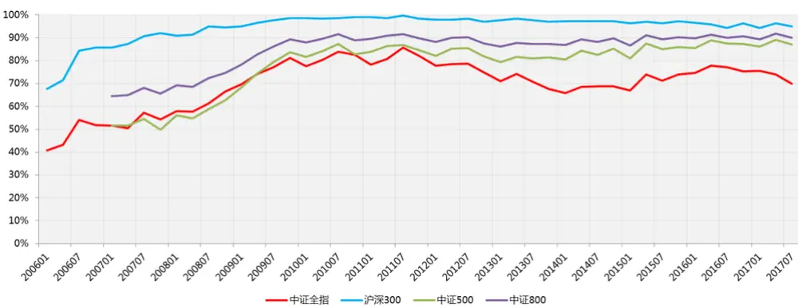

评级数据季度覆盖率
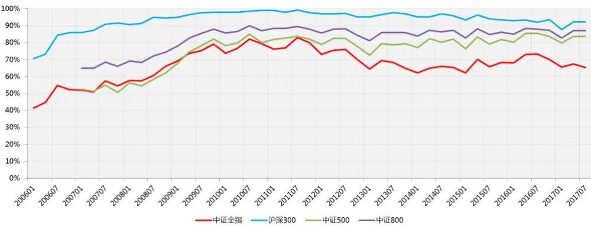

目标价数据季度覆盖率
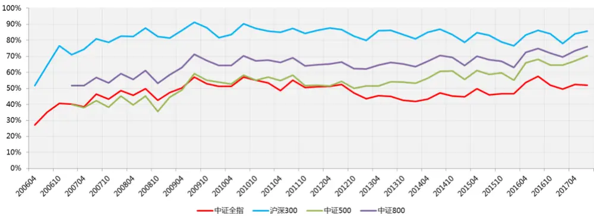
数据来源：朝阳永续、东方证券研究所

## 1.3 几个关键时点

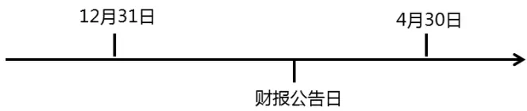

分析师预期有几个关键节点需要说明，一般而言分析师会对多个报告期同时进行预测，预测的最近的一个报告期我们称为 FY1，后面依次为 FY2、FY3 等，这种类型的划分依据就是财报公告日，举例来讲，2016年 3.月 10日某公司公告 2015年年度报告，那么 3月 10日之前预测的 FY1就是 2015年年报，3月 10日及之后预测的 FY1就是 2016年年报，由于不同公司公告的公告期并不是同一天，所以在 12月 31日和 4月 30日之间不同公司 FY1可能会不一致。在相关因子计算时如果严格按照 FY1预测计算指标就可能导致不同公司的不可比问题，为了解决这个问题，原则上有关一致预期盈余（净利润）的计算，我们在 4 月 30 日再切换 FY1 对应的报告期，之前盈余公告之后，一致预期盈余取实际公告值，原则上涉及到各个券商预测明细的计算，我们在 12 月 31日起就将 FY1切换至下一财年。

另外每一篇报告均有撰写时间和数据商录入时间两个时间属性，撰写时间指研究报告中写明的发布时间，录入时间指数据商采集入库时间，一般两者差异很小（对于朝阳永续数据，2天以内占比 75.6%，7天以内占比 93.4%），而且本报告为了避免券商对数据商选择性推送报告的影响，剔除了两者相差 7天以上的数据。为避免引入未来信息，除了预测类型 FY1、FY2、FY3的判定，本报告中涉及报告时间维度的问题均以报告录入时间为准。

## 1.4 关于因子检验

朝阳永续从 2006 年期开始收集分析师预期收益，但是下文中自定义的一致预期加总涉及到预测误差估计方程中参数的估计以及相应的因子计算，因子于 2009 年 4 月 30 日开始有数据，考虑到某些指标会涉及到一致预期的变化量，所以下文中因子检验和组合回测统一时间区间为 2009年 12月 31日至 2017年 10月 31日。我们主要考察因子在中证全指（非金融）成分股内的表现，（部分因子在中证全指内覆盖率过低，我们主要探讨其在沪深 300非金融成分股内的选股效果），但同时也会列出其他样本空间内的主要业绩指标，供投资者参考。金融股内部建模详见我们细分行业建模报告《细分行业建模值银行内因子研究》和《细分行业建模值券商内因子研究》，本篇报告主要考察非金融股票池内的 alpha效果。由于大多数量化从业者在组合构建时均控制了行业和市值风险，所以我们在因子检验时没做特殊说明均做了行业和市值中性处理。考察因子分组时，对于中证全指，我们分为 10组，其他样本空间我们分为 5组，等权构建组合。

## 二、分析师覆盖与分歧程度

跟踪分析师数量和不同分析师盈利预测的分歧程度是公司信息不确定度量的两个重要指标（Zhang,2006），某只股票跟踪的分析师数量越多，信息传递越充分，信息确定性越高，信息不确定程度高的公司，分析师盈利预测的分歧也越大。但除了信息不确定性，两者均有自己特有的属性和特征，下面我们分别介绍这两个维度。

## 2.1 分析师覆盖

分析师由于精力有限，更优先覆盖未来机会更多的公司，当分析师对公司的未来不乐观时，为了维持和上市公司及股票持有人的关系，一般会选择不公开发声，这样分析师的覆盖行为（发布报告）就会有选择性偏差，基本面好、未来机会多、预期收益高的股票会有更多的分析师选择覆盖（Terence Lim，2001；Charles Lee，2016），关于分析师覆盖和未来收益的关系，也有另外两种解释，Zhang（2006）认为分析师覆盖是公司信息不确定性的度量，覆盖率高的公司信息确定性越强，越不容易被高估，也有人认为，分析师覆盖率高的公司可能被过度关注，短期过热，未来有回调风险。因此，从分析师选择性覆盖和信息确定性的角度看，覆盖分析师越多的股票未来预期收益越高，从交易热度的角度看，覆盖分析师多的股票未来收益反而会更差，具体哪种影响占主导，需要数据佐证。

## 分析师覆盖的定义

分析师覆盖（Analyst Coverage，COV）最直观的理解就是过去一段时间（本文综合考虑分析师的覆盖率和信息的及时性，这里取过去 3 个月）有报告覆盖的券商数量，另外 Lee（2016）也提出了用券商-报告期数据对的数量表示分析师覆盖，定义为分析师总覆盖（Total AnalystCoverage, TCOV，相应的传统的分析师覆盖我们成为简单分析师覆盖），比如过去 3个月内券商A 和券商 B 都发布了某家公司的报告，但 A 仅对公司未来 1 个财年做了盈利预测，而 B 对未来 2个财年均做了盈利预测，那么这里 COV应该取 2，而 TCOV 应该取 3.

Lee（2016）在研究分析师覆盖和股票预期收益的关系时也提出了分析师异常覆盖（abnormalCoverage）的概念，Lee 通过一个简单的特征方程，将分析师覆盖拆分为股票的本该有的覆盖数量和异常的覆盖数量，能够被市值、换手和动量解释的部分是预期内的分析师固有覆盖，残差部分为异常覆盖。异常覆盖更能够反映分析师的选择性偏差等行为，股票的超额收益主要和异常覆盖有关。异常覆盖的具体计算方法如下：

在每个月底在全市场（中证全指成分股）用分析师覆盖的对数对同期的市值对数、换手的对数，和动量因子做横截面回归，取残差作为异常覆盖，

$$
ln\bigl(1+COV_{i,m}\bigr)=\beta_{0}+\beta_{1}\cdot SIZE_{i,m}+\beta_{2}\cdot LNTO_{i,m}+\beta_{1}\cdot MOM_{i,m}+\varepsilon_{i,m}
$$

其中， $COV_{i,m}$ 为第 i 值股票第 m 个月底是的简单分析师覆盖或者分析师总覆盖，对应的异常覆盖我们分别称为异常简单分析师覆盖（abnormal simple coverage, aCOV）和异常分析师总覆盖（abnormal total coverage, aTCOV）， $SIZE_{i,m}$ 为第 m 个月底的总市值对数， $LNTO_{i,m}$ 为截止 m月底时过去 3 个月日均换手率对数， $MOM_{i,m}$ 为截止 m月底时过去 3个月收益率，我们按照上述方法计算了简单分析师覆盖 COV 和分析师总覆盖 TCOV 的月度取值（经对数化处理 ( )，也可以取根号处理，两者结果几乎一致），以及相应的异常分析师覆盖因子 aCOV 和 aTCOV。COV、TCOV、aCOV、aTCOV 四个因子的行业市值中性化之后的表现如下表所示，由于行业市值中性化之后的分析师覆盖因子也类似于一种“异常覆盖”，为了对比原始分析师覆盖和异常分析师覆盖的差异，我们也计算了原始因子表现。

图 5：分析师覆盖相关因子表现（中证全指，非金融）

|  | 覆盖度 （中证全指） | RankIC |  |  | 多空组合 |  |  |  |
| --- | --- | --- | --- | --- | --- | --- | --- | --- |
|  |  | 均值 | IC_IR | t值 | 年化收益 | 夏普比 | 月胜率 | 最大回撤 |
| COV原始 | 100.0% | -1.21% | -0.30 | -0.84 | 4.49% | 0.43 | 54.3% | 33.3% |
| TCOV原始 | 100.0% | -1.05% | -0.26 | -0.73 | 4.13% | 0.41 | 58.5% | 30.9% |
| aCOV原始 | 100.0% | 3.52% | 1.20 | 3.35 | 17.45% | 1.98 | 68.1% | 14.0% |
| aTCOV原始 | 100.0% | 3.67% | 1.22 | 3.42 | 19.28% | 2.17 | 69.1% | 14.8% |
| COV中性 | 100.0% | 3.20% | 1.11 | 3.10 | 15.95% | 1.88 | 68.1% | 13.1% |
| TCOV中性 | 100.0% | 3.25% | 1.12 | 3.13 | 18.20% | 2.10 | 66.0% | 13.5% |
| aCOV中性 | 100.0% | 3.46% | 1.29 | 3.61 | 18.21% | 2.29 | 71.3% | 11.8% |
| aTCOV中性 | 100.0% | 3.60% | 1.34 | 3.76 | 20.01% | 2.49 | 73.4% | 12.1% |

数据来源：wind、朝阳永续、东方证券研究所

从上图不难发现，如果不做风险中性化，异常分析师覆盖明显优于原始值，但在行业市值中性化之后，两者的差异已不明显（IC 序列和多空月收益序列差异均不显著），事实上行业市值中性化的过程就类似于对分析师覆盖的固有部分进行了剔除。考虑到量化投资者大多数均会做行业市值中性化处理，我们认为分析师覆盖原始值就可以达到我们期望的效果，无需先做回归取其异常部分。另外COV和TCOV的表现也无显著差异，事实上COV和TCOV横截面秩相关系数高达99%，因此在实际应用中，COV和 TCOV 两者只取其一即可，或者求两者平均作为一个加总的分析师覆盖因子。下面我们以行业市值中性化后的简单分析师覆盖 COV 为例回看分析师覆盖因子的历史表现。

图 6：COV因子在各样本空间的表现（非金融）

|  | RankIC |  |  | 多空组合 |  |  |  |
| --- | --- | --- | --- | --- | --- | --- | --- |
|  | 均值 | IC_IR | t值 | 年化收益 | 夏普比 | 月胜率 | 最大回撤 |
| 沪深300 | 2.87% | 0.74 | 2.08 | 6.04% | 0.64 | 52.1% | 31.3% |
| 中证500 | 3.37% | 1.04 | 2.92 | 8.53% | 1.10 | 60.6% | 24.1% |
| 中证800 | 3.21% | 1.07 | 3.01 | 8.30% | 1.17 | 57.4% | 21.7% |
| 中证全指 | 3.20% | 1.11 | 3.10 | 15.95% | 1.88 | 68.1% | 13.1% |

数据来源：wind、朝阳永续、东方证券研究所

从各个样本空间的表现来看，分析师覆盖因子虽然 RankIC 均值较高，但稳定性较差，多空组合回测较大，沪深 300中的表现相对较差，这可能与沪深 300成分股中分析师覆盖率普遍较高，分析师覆盖因子对股票的区分程度相对较弱。下面进一步介绍因子在中证全指（非金融）的表现。

从 COV因子的分组表现来看，因子各分组的单调性并不十分明显，但 top组合明显有超额收益，而 bot组合明显跑输市场。另外，覆盖率因子的换手相对较低，top组合月度单边换手仅 30%。

图 7：COV 因子各分组表现（中证全指，非金融）

|  | 年化收益 | 对冲收益 | 夏普比 | 信息比 | 月胜率 | 对冲回撤 | 月均换手 |
| --- | --- | --- | --- | --- | --- | --- | --- |
| 等权（基准） | 11.3% |  | 0.51 |  |  |  | 8% |
| G01 | 0.5% | -9.8% | 0.17 | -2.48 | 22.3% | -55.7% | 31% |
| G02 | 7.5% | -3.3% | 0.39 | -0.82 | 40.4% | -24.4% | 46% |
| G03 | 12.9% | 1.5% | 0.55 | 0.45 | 47.9% | -10.3% | 53% |
| G04 | 11.4% | 0.1% | 0.51 | 0.04 | 51.1% | -11.2% | 59% |
| G05 | 11.5% | 0.2% | 0.52 | 0.07 | 48.9% | -7.1% | 64% |
| G06 | 13.6% | 1.9% | 0.58 | 0.72 | 56.4% | -6.5% | 67% |
| G07 | 9.5% | -1.7% | 0.46 | -0.57 | 47.9% | -17.6% | 67% |
| G08 | 11.8% | 0.5% | 0.52 | 0.17 | 55.3% | -12.7% | 63% |
| G09 | 16.9% | 5.1% | 0.67 | 1.32 | 61.7% | -7.7% | 56% |
| G10 | 17.2% | 5.5% | 0.67 | 1.12 | 58.5% | -10.9% | 30% |

数据来源：wind、朝阳永续、东方证券研究所

从多空组合的历史表现来看，15年及其之后因子表现更好，17年以来每个月均取得正收益，在近年来技术面 alpha因子相对弱势的情况下可以作为有效补充。

图 8：COV 因子多空组合历史表现
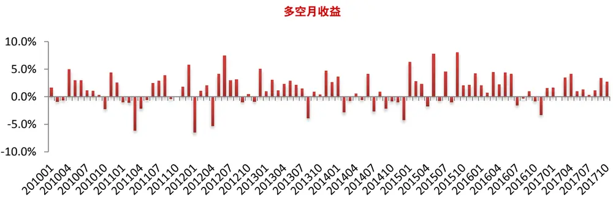

多空净值及回撤
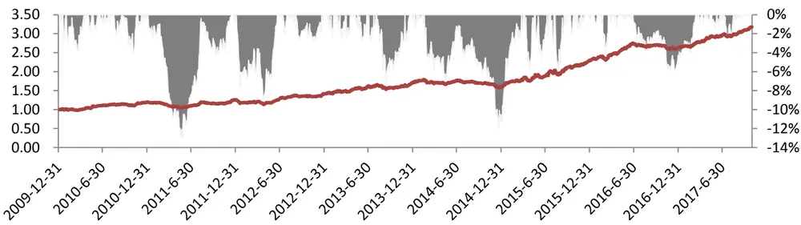
数据来源：wind、朝阳永续、东方证券研究所

## 2.2 预期分歧程度

由于做空机制的限制，市场上股票的价格仅反映了乐观投资者的预期，当市场对某种股票的分歧较大时，乐观者的预期相对更高，股价一般也会更加高估，未来预期收益更低，而分析师预期的分歧程度是市场对某只股票分歧程度的一种直观的代理变量，因此分析师预期分歧程度较高的股票未来收益一般更低（Diether等，2002）。

## 预期分歧度定义

本文讨论的分析师预期分歧程度是指对某只股票盈利预测的分歧程度（Dispersion，DISP），具体计算为过去 3 个月各家券商/机构对该股票最新盈余预测的标准差除以均值，除以均值是为了让不同公司预期分歧程度具有可比性。但是分析师会同时对公司的多个报告期进行盈利预测，我们该以哪个报告期为准？一般在做分析师预期相关的研究时，大多数均是以最近报告期（FY1）为准，因为最近报告期的预测可靠性最高。然而如果简单以 FY1 为基准将导致不同公司分歧程度不可比的问题，举例来讲，2016年 3月 1日，公司 A的 2016年年报已公布，公司 B尚未公告，如果以FY1 作为依据，此时公司 A应该考察对 2017年的预期分歧度，而公司 B考察的是 2016年的分歧度，由于 2016 年已经过去，前三季度财报已经公告，信息更加充分，确定性更高，2016 年年报的预期分歧程度大概率小于2017年年报的分歧程度，这样不同公司预期分歧程度可比性就比较差，为了解决这个问题，我们在度量预期分歧度时以 12 月 31 日为节点，仅考察对当年盈余的预测，举例来讲，股票在 2016年 12月 31日，预期分歧度定义为过去 3个月各家机构对公司 2016年年报最新预测净利润的标准差除以均值，在 2017年 1 月 31日时，预期分歧度定义为过去 3个月各家机构对公司 2017 年年报最新预测净利润的标准差除以均值，即使公司 2016 年年报尚未公告。最后需要说明的是，为了标准差的计算有意义，我们要求过去 3 个月至少有 5 家券商对相应年份的盈余做出有效预测，因此预期分歧度因子的覆盖率相对较低。2009 年底以来，沪深 300、中证500、中证 800、中证全指的非金融部分的平均覆盖率分别为 77%，45%，56%，37%，

图 9：DISP 因子不同样本空间覆盖率（非金融）
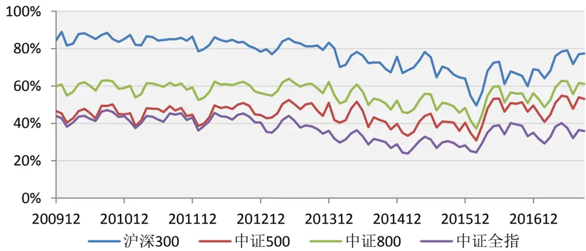
数据来源：wind、朝阳永续、东方证券研究所

对比各个样本空间的变现，我们发现 DISP因子在沪深 300中 IC_IR高于中证 800，中证 800高于，中证 500，中证全指最低，这大多数因子相反。事实上这主要受因子覆盖率的影响，我们在因子检验时缺失值用行业中位数填充，中证全指缺失值占比较多，而沪深 300覆盖率最高。

图 10：DISP因子在各样本空间的表现

|  | RankIC |  |  | 多空组合 |  |  |  |
| --- | --- | --- | --- | --- | --- | --- | --- |
|  | 均值 | IC_IR | t值 | 年化收益 | 夏普比 | 月胜率 | 最大回撤 |
| 沪深300 | -4.16% | -1.59 | -4.45 | 8.89% | 1.07 | 64.9% | 12.4% |
| 中证500 | -1.66% | -0.85 | -2.38 | 5.12% | 0.82 | 60.6% | 9.2% |
| 中证800 | -2.74% | -1.55 | -4.32 | 7.54% | 1.27 | 62.8% | 6.3% |
| 中证全指 | -1.24% | -0.99 | -2.77 | 6.86% | 1.28 | 68.1% | 6.7% |

数据来源：wind、朝阳永续、东方证券研究所

由于在覆盖率较低的情况下缺失值填充对因子的表现影响较大，下面我们主要考察预期分歧度（DISP）因子在沪深 300（非金融）成分股内的表现。

DISP 因子在沪深 300 成分股（非金融）中月度 RankIC 均值为-4.16%，IC_IR 为-.59，多空组合年化收益 8.9%，夏普比 1.07，最大回测 12.4%，而且因子的换手不高，top 组合月度单边平均换手 36%。从各分组的表现来看，top组合超额收益明显，bot组合大幅跑输基准，但中间档超额收益不明显，从因子的历史表现来看，13 年及之前的 alpha 比较稳定，收益也较高，但近年来alpha的波动有所加大，今年以来虽然仍有超额收益，但 7月份回撤明显。

图 11：DISP 因子分组表现（沪深 300，非金融）

|  | 年化收益 | 对冲收益 | 夏普比 | 信息比 | 月胜率 | 对冲回撤 | 月均换手 |
| --- | --- | --- | --- | --- | --- | --- | --- |
| 等权（基准） | 2.5% |  | 0.23 |  |  |  | 7% |
| G01 | 7.2% | 4.4 4% | 0.40 | 0.90 | 56.4% | -8.2% | 36% |
| G02 | 3.3% | 0.7 1% | 0.26 | 0.17 | 52.1% | -18.1% | 60% |
| G03 | 2.1% | -0.3% | 0.21 | -0.04 | 48.9% | -20.8% | 58% |
| G09 | 2.1% | -0.% | 0.21 | -0.03 | 45.7% | -18.7% | 60% |
| G10 | -2.6% | -4.8% | 0.04 | -0.93 | 35.1% | -35.0% | 34% |

数据来源：wind、朝阳永续、东方证券研究所

多空净值及回撤
图 12：DISP因子多空组合历史表现（沪深 300，非金融）
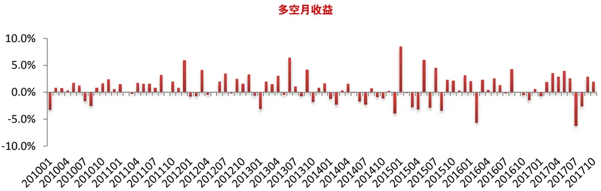

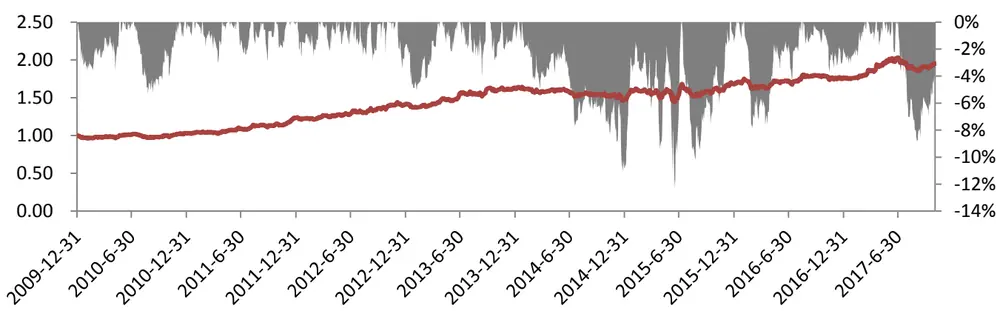
数据来源：wind、朝阳永续、东方证券研究所

## 2.3 小结

本章主要探讨了股票关于分析师预期的两个属性，分析师覆盖 COV和预期分歧度 DISP。由于分析师选择性发布报告等原因，分析师异常覆盖较多的股票未来收益更好， 但考虑到量化从业人员在选股时一般会采用行业市值中性化处理，所以并没有必要事前进行回归处理计算分析师异常覆盖因子。由于做空限制，分析师分歧度大的股票容易高估，未来收益也更低，但预期分歧度因子在全市场覆盖率较低，比较适合做沪深 300 成分股内的选股因子。关于这两个因子和其他常见因子的相关性，我们将在第六章统一分析。

## 三、盈余预测的准确性

盈余预测的准确性是分析师预期的一个重要属性，也是分析师预期相关学术研究中的热点。本章讨论预期预测的准确性一方面为了让投资者更加深入的了解分析师的盈余预测行为，另一方面盈余预测的准确性也是不同分析师预期加权的基础，预测更准确的分析师/券商在加权时应该给予更高的权重。本章首先讨论盈余预测准确性的度量问题，接着从时间维度、信息不确定性和分析师/券商特征三方面探讨盈余预测的准确性。信息不确定性主要是回答哪些公司更容易被预测的问题，分析师/券商特征主要是回答哪些分析师/券商预测更准的问题。

## 3.1 准确性度量问题

传统上一般用盈余预测值和公告值之差的绝对值除以预测期初的股价作为预测误差的度量（absolute forecast error, AFE），预测误差越小，精确性越高，当然分母上除了选择股价也可以用实际公告的净利润、总资产等变量，目的主要是让不同股票、报告期的预测误差相对具有可比性。但是不管用哪个变量做归一化，传统预测准确性的度量都和不同公司、不同报告期有很强的相关性，某些公司在某些年份更加难以预测等等，这样在计量分析中必须加入一些变量来控制公司-报告期的固定效应，大大增加了分析的复杂程度和困难程度，Clement（1998, 1999）提出了 PMAFE（proportional mean absolute forecast error）用于度量分析师预期的精确程度，后来也被学界广泛采用。PMAFE 的具体计算方法如下：

$$
PMAFE_{ijt}=DAFE_{ijt}/\overline{{AFE_{yt}}}
$$

其中， $DAFE_{ijt}=AFE_{ijt}-\overline{{AFE_{_{Jt}}}},AFE_{ijt}$ 是第 i 个分析师/券商对第 j 家公司第 t 个报告期净利润的预测误差（传统的预测误差度量方法）， $\overline{{AFE_{Jt}}}$ 是对 j 家公司第 t 个报告期所有分析师预测误差的平均。

可以看出 PMAFE 的度量与 AFE 分母上采用哪个变量无关，所有公司-报告期的平均预测误差均一样，这种度量方法主要用来研究不同分析师/券商属性对预测误差的影响，如果涉及到不同公司或者不同报告期的比较，PMAFE 将丧失意义。

所以报告中我们将同时使用 AFE 和 PMAFE 两种方法度量盈余预测的准确性，AFE 主要用于不同报告期和不同股票间的比较和一些简单的统计，而 PMAFE 主要考察分析师属性对预测精度影响时采用，计算 AFE时分母我们取总资产，主要是因为 A股价格波动剧烈而实际公告净利润又受负值影响。具体计算方法如下：

$$
AFE_{ijt}=\left|F_{ijt}-E_{jt}^{a}\right|/A_{jt}
$$

其中， $F_{ijt}$ 表示分析师的预测净利润， $E_{jt}^{a}$ 实际公告净利润， $A_{jt}$ 表示总资产。

同时，我们也度量了各个分析师的预测偏差（forecast bias，FB），预测偏差的绝对值就是预测误差。

$$
FB_{ijt}=\big(F_{ijt}-E_{jt}^{a}\big)/A_{jt}
$$

在下文中我们也会简单描述分析师预测偏差相关的特点，主要为了增加投资者对于盈余预测行为的理解。

## 3.2 时间维度

盈余预测准确性最重要的维度就是时间，分析师在 2016 年 11 月预测 16 年年报盈余的准确性大概率比 2016 年 1 月时预测更高，因为前三季度的财报已经公告，2017 年 3 月再预测（如果还没公告）就会更准，因为此时公司可能公告预告或者其他有用信息。同样，在同一个时间点较近报告期的预测准确性大幅高于较远报告期，这也是大多数盈余预测相关的研究仅考虑对 FY1 预测的原因。随着报告公告期的临近，分析师可利用的信息更充分，不确定性因素更少，盈利预测的可靠性也就更高。

我们统计了分析师 2006 年以来的预测偏差和预测准确性（为了避免并购重组和数据录入错误等原因导致的异常数据，我们对每个报告期剔除了两端各 1%的极值），结果和直觉相符，不管从AFE均值还是中位数的角度看，FY1的预测精确性大幅高于FY2，FY2的精确性大幅高于FY3，但比较有意思的现象是，对于各种预测类型，分析师的预测偏差 FB均大于零（即高估实际盈余），对于 FY2 和 FY3 更是如此，预测偏差 FB 的均值和中位数几乎和预测误差 AFE 相差不多，说明对于一些较远期的盈余预测，分析师大多数都是高估实际利润的。

图 13：不同预测类型预测偏差 FB和预测误差 AFE统计

| 预测类型 均值 |  | 1/4分位数 | 中位数 | 3/4中位数 |
| --- | --- | --- | --- | --- |
| FB | FY1 | 0.78% | -0.09% 0.34% | 1.31% |
|  | FY2 | 2.05% | -0.08% 1.25% | 3.51% |
|  | FY3 | 3.45% | 0.13% 2.29% | 5.67% |
| AFE | FY1 | 1.21% | 0.22% 0.66% | 1.57% |
|  | FY2 | 2.81% | 0.67% 1.78% | 3.81% |
|  | FY3 | 4.26% | 1.10% 2.82% | 5.85% |

数据来源：wind、朝阳永续、东方证券研究所

对于盈余偏差的原因，Lim（2001）和 Scherbina（2003）等均做了详细的探讨，主要有如下几种：1.为了和上市公司及买方客户保持良好关系，分析师一般会刻意高估公司的盈利，维持股价在高位；2.分析师的选择性报告，高估公司盈余预测的分析师会更大概率的认为该公司有机会，从而发布报告，低估的分析师选择了沉默，从而使发布出来的报告平均高估；3.非经常性损益的影响，分析师做盈余预测时很少考虑非经常性损益，而非经常性损益大概率为负，从而拉低了公告的实际利润。

由于预测期和报告期间隔过大时分析师的预期偏差和预测误差较大，可信度比较差，所以大和多数学术研究一致，我们的因子构建仅涵盖 FY1和部分 FY2 的盈利预测，为了保持一致性，同时为了避免过大的预测误差数据对我们研究的影响，下文中的盈余预测准确性的研究中对任一年度报告盈余的预测我们仅考察当年和来年分析师做出的盈利预测，举例来讲，对于 2016年年度报告的预测我们仅考察 2016年 1月 1日以来分析师做出的盈余预测（包括所有的 FY1预测和 2016年以来的 FY2 预测）。

下图描述了随着报告期临近分析师预测偏差 FB和预测误差 AFE 的变化趋势，随着报告期临近，分析师的预测偏差和预测误差均有明显下行趋势，主要有两方面的因素影响，1，随着报告期临近，更高的盈利预测很快就会被证伪，另外为了让上市公司盈利符合预期，分析师的主观高估倾向会减弱，2.随着报告期临近分析师可利用的信息更加充分，更充分的信息有助于分析师做出更加精确的预测。

图 14：分析师预测偏差 FB和预测误差 AFE时间衰减
预测偏差 FB
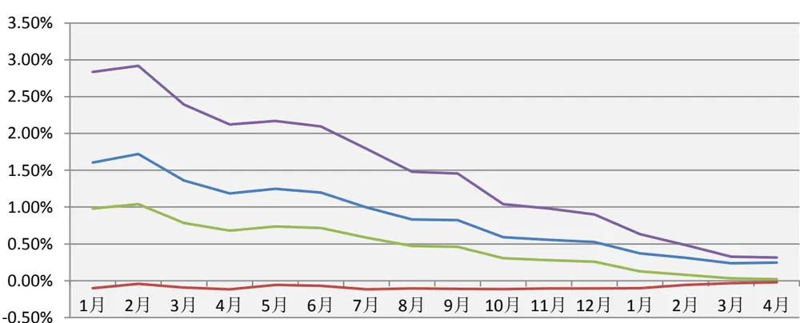
均值 1/4分位数 中位数 3/4分位数

预测误差 AFE
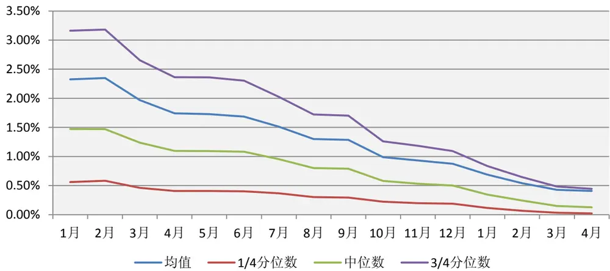
数据来源：wind、朝阳永续、东方证券研究所

## 3.3 信息不确定性

Lim（2001）从理论上阐述了对信息不确定性高的公司分析师更加倾向高估其盈利，另外信息不确定性程度比较高的预测难度更大，由于主观偏好和信息限制两方面的原因，导致信息不确定性较高的公司的盈余预测误差较大，为了实证信息不确定性和预测误差的关系，我们借鉴Lim（2001）和 Zhang（2006）的做法，采用如下 5个维度度量信息不确定性：

（1）市值 MC，以总市值的对数度量，大公司的市场关注度更高，信息传递效率更高，另外，大公司的上下游、消费者、供应商、投资者也更多，信息获取更加容易，因此大公司的信息确定性更高。

（2）价值成长 BM，以账面市值比度量，价值股业务生态更加稳定，信息确定性更高，可预测性也更强。

（3）历史 ROE 波动 SDROE，以过去 5 年 ROE 的标准差除以均值，历史盈利稳定性高的公司未来大概率会保持这种稳定性，因此历史数据借鉴意义强，盈余预测也更加容易。

（4）分析师覆盖 COV，过去 3 个月覆盖的券商数量，覆盖的分析师越多，信息传递效率更高，信息确定性也就更高。

（5）预期分歧度 DISP，过去 3个月盈余预测的分歧程度，分析师预期分歧越大，该公司的信息不确定性也越强。

从信息不确定性的各个度量指标和预测偏差 FB、预测误差 AFE 的相关系数来看，结论支持我们的判断，信息不确定性高的公司的预测偏差更大，预测误差也更大。具体体现为，小公司、成长股、历史盈利波动大、分析师覆盖少、分析师预期分歧大的公司平均预测偏差和预测误差也更大。

图 15：信息不确定性与预测偏差 FB、预测误差 AFE 相关系数

|  | FB | AFE | MC | BM | SDROE | COV | DISP |
| --- | --- | --- | --- | --- | --- | --- | --- |
| FB | 1.00 | 0.60 | -0.13 | -0.10 | 0.05 | -0.11 | 0.09 |
| AFE | 0.60 | 1.00 | -0.16 | -0.18 | 0.11 | -0.13 | 0.13 |
| MC | -0.13 | -0.16 | 1.00 | 0.06 | -0.13 | 0.60 | -0.12 |
| BM | -0.10 | -0.18 | 0.06 | 1.00 | 0.07 | -0.07 | 0.11 |
| SDROE | 0.05 | 0.11 | -0.13 | 0.07 | 1.00 | -0.25 | 0.44 |
| COV | -0.11 | -0.13 | 0.60 | -0.07 | -0.25 | 1.00 | -0.22 |
| DISP | 0.09 | 0.13 | -0.12 | 0.11 | 0.44 | -0.22 | 1.00 |

注：为了避免时间维度的影响，我们将数据按报告期-预测期所在季度分组，组内分别计算相关系数，最后取平均值，信息不确定性取上季度数据
数据来源：wind、朝阳永续、东方证券研究所

从各个各个信息不确定度量维度的分组结果来看，大体也支持信息确定性高的公司平均预测偏差和预测误差更小。

图 16：信息确定性各分组的平均预测偏差 PE和平均预测误差 AFE
平均预测偏差 PE

| 最低组 第2组 第3组 第4组 第5组 第6组 第7组 第8组 第9组 最高组 |  |  |  |  |  |  |
| --- | --- | --- | --- | --- | --- | --- |
| MC | 1.16% 0.99% 0.98% | 0.99% 0.87% | 0.95% | 0.87% | 0.76% 0.72% | 0.33% |
| BM | 1.00% 0.98% 0.92% | 0.95% | 0.90% 0.85% | 0.78% | 0.65% 0.50% | 0.38% |
| 1/SDROE | 0.98% 0.84% 0.87% | 0.87% 0.76% | 0.83% | 0.81% | 0.66% 0.64% | 0.53% |
| COV | 0.68% 0.92% 1.05% | 1.04% 0.98% | 0.86% | 0.76% | 0.70% 0.65% | 0.51% |
| 1/DISP | 1.01% 1.00% 0.92% | 0.93% 0.83% | 0.84% | 0.80% | 0.65% 0.53% | 0.50% |

平均预测误差 AFE

| 最低组 |  | 第2组 第3组 | 第4组 | 第5组 | 第6组 | 第7组 | 第8组 | 第9组 | 最高组 |
| --- | --- | --- | --- | --- | --- | --- | --- | --- | --- |
| MC | 1.53% | 1.36% | 1.40% 1.44% | 1.31% | 1.37% | 1.32% | 1.21% | 1.18% | 0.75% |
| BM | 1.60% | 1.50% | 1.36% 1.39% | 1.35% | 1.23% | 1.19% | 1.07% | 0.87% | 0.64% |
| 1/SDROE | 1.52% | 1.33% | 1.37% 1.34% | 1.21% | 1.25% | 1.25% | 1.09% | 1.04% | 0.87% |
| COV | 1.21% | 1.44% 1.45% | 1.42% | 1.38% | 1.34% | 1.23% | 1.12% | 1.09% | 0.85% |
| 1/DISP | 1.52% | 1.43% 1.39% | 1.34% | 1.27% | 1.25% | 1.21% | 1.05% | 0.96% | 0.94% |

注：信息不确定性分组取上季度数据
数据来源：wind、朝阳永续、东方证券研究所

## 3.3 分析师属性

盈余预测的准确性也会随着不同的分析师而有所差异，Clement（1999） 的研究发现分析师经验、雇主规模和难易程度（通过分析师同时跟踪的公司和行业数量度量）均会影响盈余预测的准确性，更有经验、来自于大公司、同时关注公司和行业少的分析师的盈余预测更加精确。，Sticke（1992）等发现明星分析师（Institutional Investor “All-Star”）的头衔和盈余预测预测准确性有一定的正相关性，另外，Abarbanell 等（1992）认为分析师的预测准确性有一定的自相关性，历史上预测比较准确的分析师未来预测也更加精确。结合前人的研究，我们从如下几个维度考察分析师的属性及其预测准确性的关系。

（1）分析师经验。成熟的分析师在行业内积累了更多的资源，对行业、公司的认识也更加深刻，预测的技巧可能也会更加成熟，我们通过分析师的从业时间 GEXP 和分析师跟踪某只公司时间 FEXP作为其经验的代理变量。

GEXP，一般工作经验，以分析师首份报告撰写日期计算其从业时间（天数），取根号处理

FEXP，公司特定工作经验，以分析师首份该公司的报告撰写日期计算其从业时间（天数），取根号处理

（2）精力分散程度，同时跟踪多个公司或者行业的分析师精力更加分散，对单个公司或行业投入的时间和资源可能更加有限，导致其盈利预测的误差可能较大。

NCOMP：分析师过去 1年报告中覆盖的公司个数，取根号处理

NINDS：分析师过去 1年报告中覆盖的行业个数（中信二级行业），取根号处理

（3）雇主规模：根据雇佣的分析师个数度量，一般认为，大的研究机构相对而言会有更多的资源可以调用，从而可以获取更多的私有信息，预测的精度也相对更高。

NAUT：所在单位过去一年发布过报告的分析师数量，取根号处理

（4）新财富：预测精确的分析师更容易获取新财富，同时新财富团队在行业的资源可能更加丰富，从而预测的精度可能更高。

XCF：虚拟变量，指示过去一年新财富有没有上榜，每年 1月 1日更新数据

（5）历史预测精度：假设分析师的预测精度有一定连续性，历史预测准确的分析师未来可能延续更加准确的预测。

ACC：分析师对上一年度做出的所有盈利预测相对准确性的平均，每年 4 月 30 日更新数据

我们采用回归的方法研究分析师属性和预期准确性的关系，用分析师的预测误差对预测时间维度 HORIZON和分析师属性回归，考察各个分析师属性变量对预测准确性的影响。

关于数据和计量方法我们有必要做出如下说明：

（1）对于任一公司-报告期（比如对于平安银行 2016 年报告期），我们将当年以来（2016年 1月 1日以来）所有关于该公司-报告期的预测作为样本点，一家券商/分析师期间发布多家报告算多个样本点，样本点涵盖 2008 年年报至 2016 年年报共 10 年的年报数据，由于朝阳永续数据收集始于 2006 年，而大多数分析师相关因子计算基于历史的盈利预测，所以我们从 2008 年年报开始考察。

（2）一份报告由多个分析师共同撰写时，只要有一个是新财富分析师，该报告的 XCF 属性就标记为 1，其他属性取各个分析师属性的平均值。

（3）计量方法上我们和 Clement（1999）和 Jacob（1999）类似，通过选取 PMAFE 指标作为预测误差的度量已消除数据在公司-报告期上的异方差性，同时，解释变量也通过公司-报告期的均值调整，由于所有变量均经过均值调整，所以回归方程并不需要截距项。

（4）传统上一般取报告预测日期和预测期报告公告日期的时间差（天数）作为时间维度HORIZON 的度量，但这样自变量就会涉及未来信息，由于本章研究目的不仅是解释分析师预测精度，更是为了利用该方程估计预测精度从而为预期的加权做准备，所以为了在利用该方程做预测时不涉及未来信息，我们取报告预测日期相对于任一基准日期的天数作为该报告的时间维度度量，由于自变量需要经过均值调整，所以基准日期的选择并不会影响结果，最后，需要注意的是，公司-报告期上的均值调整也会在 X变量上引入未来信息，但这个均值对同一公司-报告期的所有报告是相同的，所以预测时并不会影响估计值的相对大小。

从分析师预测属性对各个分析师属性的单个回归结果来看，和前人的研究大体一致。XCF 变量系数显著为负，意味着新财富分析师撰写的研究报告的预测误差显著比非新财富分析师低，ACC变量系数显著为负，往年预测准确性高的分析师的盈利预测准确性更高，GEXP 和 FEXP 两者均显著为负，意味着分析师的经验对盈余预测准确性也有一定贡献。比较有意思的是 NCOMP 系数为负值不显著，而 NINDS显著为正，说明分析师同时跟踪多个公司并不影响其预测准确性，但同时跟踪多个行业却对其盈利预测的准确性有一定影响。最后，NAUT 系数显著为负，验证了大公司的分析师盈利预测更加准确的假设。

图 17：各个分析师属性对预测误差的影响

|  | HORIZON | XCF | ACC | GEXP | FEXP | NCOMP | NINDS | NAUT |
| --- | --- | --- | --- | --- | --- | --- | --- | --- |
| 系数 t值 | -0.17 | -1.27 |  |  |  |  |  |  |
| 系数 | -278.88 -0.17 | -7.62 | -9.81 |  |  |  |  |  |
| t值 | -278.84 |  | -11.61 |  |  |  |  |  |
| 系数 t值 | -0.17 |  |  | -0.10 |  |  |  |  |
| 系数 | -278.12 -0.17 |  |  | -10.80 | -0.09 |  |  |  |
| t值 | -277.12 |  |  |  | -12.38 |  |  |  |
| 系数 t值 | -0.17 |  |  |  |  | -0.06 |  |  |
| 系数 | -277.90 |  |  |  |  | -1.51 |  |  |
|  | -0.17 |  |  |  |  |  | 0.43 |  |
| t值 | -278.49 |  |  |  |  |  | 4.53 |  |
| 系数 | -0.17 |  |  |  |  |  |  | -0.41 |
| t值 | -276.20 |  |  |  |  |  |  | -12.77 |

注：回归系数均放大了 100 倍方便显示
数据来源：wind、朝阳永续、东方证券研究所

由于 GEXP 和 FEXP 高度相关，我们进一步取两者平均合成分析师的综合经验 GFEXP，进一步考察各个预测年度分析师预期准确性和各个分析师属性的关系。我们发现除新财富 XCF 之外，其他影响因素对盈余预测准确性的影响均十分显著，新财富属性变得不显著很可能是因为新财富对盈余预测准确性的解释作用可以被其他因素所解释，新财富分析师一般经验更加丰富、来自大的研究机构，而且往年的预测精度也相对更高。

图 18：各报告期盈余预测准确性回归分析

| HORIZON | XCF |  | ACC | GFEXP | NINDS | NAUT |
| --- | --- | --- | --- | --- | --- | --- |
| 2008年 | -0.23 | 0.43 | -9.99 | -0.09 | -0.13 | -0.41 |
| 2009年 | -0.18 | -2.02 | -5.53 | -0.16 | 0.78 | -0.65 |
| 2010年 | -0.17 | -0.46 | -5.80 | -0.03 | 0.82 | -0.66 |
| 2011年 | -0.20 | 0.40 | -3.97 | -0.17 | 1.38 | -0.31 |
| 2012年 | -0.19 | -1.07 | -9.47 | -0.16 | 1.12 | -0.41 |
| 2013年 | -0.13 | -1.68 | -9.66 | -0.13 | 1.14 | -0.23 |
| 2014年 | -0.14 | -0.19 | -14.92 | -0.03 | 0.33 | -0.13 |
| 2015年 | -0.16 | -0.71 | -11.48 | -0.14 | 0.69 | 0.21 |
| 2016年 | -0.16 | 0.58 | -13.11 | -0.11 | 0.56 | -0.02 |
| 均值 | -0.18 | -0.52 | -9.33 | -0.11 | 0.74 | -0.29 |
| t值 | -16.50 | -1.58 | -7.23 | -6.05 | 4.57 | -2.88 |

注：回归系数均放大了 100 倍方便显示
数据来源：wind、朝阳永续、东方证券研究所

## 3.4 小结

本章主要讨论了分析师盈利预测的准确性度量及影响因素，我们同时采用 AFE和 PMAFE 度量盈利预测的准确性，前者主要用于不同公司和报告期的比较和一些统计性描述，后者主要用于研究预测准确性和分析属性的关系。预测时间是影响分析师预测准确性的重要维度，后期的盈利预测比前期更加准确；大市值、价值型、盈利稳定、跟踪分析师多、预期分歧少的公司，信息确定性强，分析师的预测更加准确。有经验、往年预测准确性高、同时跟踪行业少、来自大研究机构的分析师做出的盈利预测倾向于更加准确。

## 四、一致预期加总与相关指标

本章探讨的一致预期加总更准确的说应该是将各个分析师/券商对某只股票的盈利预测加权合成一个综合的盈利预测，目的是让这个加总的盈利预测的预测误差更小，因此我们这里探讨的“一致预期”应该是“更准确的加权盈利预测”而不是反应市场预期的“一致预期”。本章首先将基于基于盈利预测比较几种加权方法，而后基于我们构建的一致预期加权方法构建一致预期净利润、一致预期评级和一致预期目标价，在此基础上介绍几个一致预期的衍生因子。

## 4.1 预期加总方法

目前Wind默认采用各机构在过去180天内最新预测净利润的算术平均值作为wind一致预期；朝阳永续采用时间和机构双加权的方法构建一致预期，而且臵信度不高的部分非公司报告和部分机构发布的研究报告不参与加权。学术研究中对预期加权方法的研究相对较少，有部分学者在涉及到一致预期时采用取各家机构中最后一个预测值作为预期值的做法，Brown 和 Mohammad（2001）采用估计预测精度的排序进行加权，Slavin（2007）进一步在 Brown 和 Mohammad（2001）的基础上改进了加权方法，考虑了估计预测精度的数值大小，实证表明加权后的预测精度更高。无论采用 Brown 和 Mohammad（2001）的方法还是 Slavin（2007）的方法，均需要估计每次的预测精度。所以，我们先讨论预测精度的估计问题。

## 预测精度估计

第三章我们研究发现时间维度变量 HORIZON、往年的预测精度 ACC、分析师经验 GFEXP、分析师同时跟踪的行业数量 NINDS 以及雇主规模 NAUT对分析师的预测精度均有显著影响，所以我们根据这 5个变量利用线性方程估计预测误差（以 PMAFE 度量）。线性模型的参数根据已公告的最近报告期的所有当年预测估计，由于每年 4 月 30 日才能确保所有公司的年报已公布，所以模型参数每年4月30日调整。举例来讲，2016年7月加权一致预期时用到的估计预测精度根据2015年报的所有当年预测（2015 年 1 月 1 日至 2016 年 4 月 30 日期间所有对 2015 年报数据的预测）估计出来的参数计算。

$$
PMAFE=\beta_{1}\cdot HORIZON+\beta_{2}\cdot ACC+\beta_{3}\cdot GFEXP+\beta_{4}\cdot NINDS+\beta_{5}\cdot NAUT+\varepsilon
$$

需要提醒的是，估计上述方程参数时各解释变量均根据股票-报告期均值调整，而利用上述方程参数计算估计的 PMAFE 时，并不知道各解释变量对应的股票-报告期期均值，只能利用各解释变量原始值计算，这样对于同一公司报告期，所有 PMAFE 的估计均相差一个常数，但只要加权一致预期时仅使用估计 PMAFE 的相对值，不使用绝对值，对结果并没有影响。

图 19：各年度 PMAFE与解释变量关系

| HORIZON | ACC | GFEXP | NINDS | NAUT |
| --- | --- | --- | --- | --- |
| 2008年 | -0.23 -9.98 | -0.09 | -0.10 | -0.40 |
| 2009年 | -0.18 -5.71 | -0.19 | 0.91 | -0.72 |
| 2010年 | -0.17 -5.90 | -0.04 | 0.82 | -0.67 |
| 2011年 | -0.20 -3.92 | -0.16 | 1.38 | -0.29 |
| 2012年 | -0.19 -9.53 | -0.17 | 1.11 | -0.46 |
| 2013年 | -0.13 -9.85 | -0.15 | 1.10 | -0.31 |
| 2014年 | -0.14 -14.95 | -0.03 | 0.32 | -0.14 |
| 2015年 | -0.16 -11.67 | -0.15 | 0.64 | 0.18 |
| 2016年 | -0.16 -13.26 | -0.10 | 0.59 | 0.00 |
| 均值 | -0.18 -9.42 | -0.12 | 0.75 | -0.31 |
| t值 | -16.45 -7.28 | -5.82 | 4.72 | -3.01 |

数据来源：wind、朝阳永续、东方证券研究所

## 不同加权算法

在已知各报告盈余预测 PMAFE 估计值 ̂ 的前提下我们提出如下 4 种加权方法：

（1） Average 等权构建方法，取过去 3 个月各机构最近一次预测值的平均。

（2） Latest 近期报告法，取过去 3 个月各机构所有预测中最近的一次预测。

（3）Accwt1 预测精度排序加权，根据过去 3 个月各机构最近一次预测的 ̂ 序加权，预测的准确性越高，权重越大。

（4）Accwt2 预测精度加权，将过去 3 个月各机构最近一次预测的 ̂ 标准化，取标准化后 ̂ 小于零的部分，按绝对值加权，只有一家机构预测时，取该机构最近一次预测值。

## 不同方法预测准确性

不同加权算法计算的一致预期净利润的预测误差 AFE均值见如下表所示，由于我们对于一致预期的使用过程中主要使用 FY1和 FY2 的数据，我们仅比较了 FY1和 FY2的预测误差。

从FY1的预测结果来看，朝阳永续Gogo和Accwt2的一致预期预测误差最小，Gogo比Accwt2低 0.009%，但两者之间差异不显著（t值 0.51），在 5%的臵信度下，Gogo的预测误差显著小于除 Accwt2 以外的其他加权方法，Accwt2 的预测误差显著小于除 Gogo以外的其他加权方法，Wind一致预期的预测误差显著大于其他所有的加权方法，Wind 和 Average 同为等权加总，但预测误差更大的原因是 Wind 采用了过去 180 天内所有机构最近一次预测的平均，而 Average 是过去 3 个月的平均，而且 Average计算采用的是朝阳永续收录的预测数据，基础计算数据也有所不同。

从 FY2 预测的数据来看，除 Accwt2 和 Accwt1 预测误差显著小于 Latest 加权方法外，其余两两之间均不显著，这可能与各个分析师对 FY2的预测误差均较大，此时相对差异性不明显有关。

另外，需要提醒的是，图 20中基于一致预期净利润统计的 AFE 明显高于图 13基于加总前各个分析师预期净利润的 AFE，很容易让人产生加总后一致预期净利润的预测准确性反而比单个分析师预测更低的误解，产生这样的结果是因为，图 13基于的样本点是每篇研报的盈利预测，信息确定性更强的大公司覆盖的研报更多，对应的样本点更多，而信息确定性强的大公司 AFE 平均更低。

综上分析，我们比较的 6 种加权方法（含 wind，gogo）中，Accwt2 和 Gogo 相对更优，但考虑到 Gogo 的具体算法并未公开，透明度不如 Accwt2，所以我建议使用 Accwt2 方法进行加权。下文中提到的一致预期我们均采用 Accwt2方法进行加权，除了加权预测净利润之外，我们用同一套加权方法也可以加权评级和目标价，以及第五章提到的盈余调整。

图 20：一致预期不同加权方法对各年度预测的 AFE
FY1 各年度预测的 AFE

| Wind Gogo Average Latest Accwt1 Accwt2 |  |  |  |  |  |
| --- | --- | --- | --- | --- | --- |
| 2009年 | 1.96% | 1.90% | 1.96% 1.98% | 1.93% | 1.92% |
| 2010年 | 2.14% | 2.00% | 2.05% 2.07% | 2.02% | 2.02% |
| 2011年 | 2.26% | 2.00% | 2.06% | 2.05% 2.02% | 1.98% |
| 2012年 | 1.92% | 1.73% | 1.76% | 1.68% 1.72% | 1.67% |
| 2013年 | 1.70% | 1.50% | 1.58% | 1.53% 1.54% | 1.49% |
| 2014年 | 1.84% | 1.69% | 1.77% | 1.76% 1.75% | 1.74% |
| 2015年 | 2.51% | 2.32% | 2.46% | 2.44% 2.43% | 2.40% |
| 2016年 | 1.96% | 1.84% | 1.86% | 1.84% 1.83% | 1.82% |
| 平均 | 2.03% | 1.87% | 1.94% | 1.92% 1.91% | 1.88% |
| 全样本 | 2.05% | 1.88% | 1.95% | 1.93% 1.91% | 1.89% |

FY2 各年度预测的 AFE

| Wind Gogo Average Latest Accwt1 Accwt2 |  |  |  |  |  |  |
| --- | --- | --- | --- | --- | --- | --- |
| 2010年 | 3.02% | 2.94% | 2.98% | 3.07% | 2.98% | 3.02% |
| 2011年 | 4.04% | 5.45% | 5.39% | 5.57% | 5.42% | 5.50% |
| 2012年 | 4.56% | 4.32% | 4.38% | 4.36% | 4.34% | 4.29% |
| 2013年 | 3.64% | 3.42% | 3.42% | 3.39% | 3.38% | 3.35% |
| 2014年 | 2.98% | 2.91% | 2.93% | 2.96% | 2.91% | 2.91% |
| 2015年 | 3.61% | 3.60% | 3.58% | 3.60% | 3.57% | 3.58% |
| 2016年 | 3.47% | 3.50% | 3.45% | 3.50% | 3.45% | 3.47% |
| 平均 | 3.62% | 3.73% | 3.73% | 3.78% | 3.72% | 3.73% |
| 全样本 | 3.64% | 3.73% | 3.73% | 3.77% | 3.72% | 3.72% |

数据来源：wind、朝阳永续、东方证券研究所

图 21：不同加权方法预测误差两两检验（左下 FY1，右上 FY2）

|  |  | Wind | Gogo | Average | Latest | Accwt1 | Accwt2 |
| --- | --- | --- | --- | --- | --- | --- | --- |
| Wind | 均值 |  | -0.116% | -0.117% | -0.162% | -0.105% | -0.114% |
|  | t值 |  | -0.50 | -0.52 | -0.65 | -0.45 | -0.46 |
| Gogo | 均值 | -0.163% |  | -0.001% | -0.045% | 0.011% | 0.003% |
|  | t值 | -7.25 |  | -0.03 | -1.82 | 0.82 | 0.13 |
| Average | 均值 | -0.095% | 0.068% |  | -0.045% | 0.012% | 0.003% |
|  | t值 | -3.95 | 4.63 |  | -1.54 | 1.25 | 0.12 |
| Latest | 均值 | -0.115% | 0.048% | -0.020% |  | 0.057% | 0.048% |
|  | t值 | -3.55 | 2.49 | -1.59 |  | 2.80 | 6.10 |
| Accwt1 | 均值 | -0.129% | 0.034% | -0.034% | -0.014% |  | -0.008% |
|  | t值 | -4.98 | 2.34 | -8.77 | -1.37 |  | -0.46 |
| Accwt2 | 均值 | -0.154% | 0.009% | -0.059% | -0.039% | -0.025% |  |
|  | t值 | -4.85 | 0.51 | -5.59 | -5.38 | -3.60 |  |

注：每一对数据均是行对应的加权方法相对于列对应的加权方法的检验结果，这里的 t 值为以各年度预测的平均 AFE 为样本的检验结果。
数据来源：wind、朝阳永续、东方证券研究所

## 4.2 一致预期相关因子

采用上述的 Accwt2 加权方法，我们可以在任一时点加权每只股票各家机构预测的净利润、评级和目标价，得到一致预期的净利润、评级和目标价。基于此，我们构建了几个常见的一致预期相关因子，并检验其选股有效性。

## 因子定义

这里主要讨论一致预期数据本身相关的因子，预期调整因子在下一章详细讨论。具体包括预期估值因子 EP_FY1，PEG 因子、一致预期评级 SCORE 和目标价隐含收益率 TPER 四个 alpha因子，具体定义如下：

EP_FY1:

一致预期 FY1净利润/总市值，因子取值越高，估值越低。

PEG：

一致预期 FY1 净利润/预期净利润增长率，该指标最先由 Slater 在 1960 年提出，后被彼得林奇推广，这里的预期净利润增长率理论上应该是永续增长率，这里我们用 FY2 一致预期净利润相对于 FY0 的年化增长率替代，之所以用 FY2 是因为 FY3 的预测可靠性更差，而用 FY1 仅一年的增长随机性太大，FY2 的选择和 wind、朝阳永续等数据商保持一致，是一种经验选择。

SCORE：

一致预期评级，评级高的公司分析师更加看好，一般基本面更好，未来空间更大。TPER：

$$
\mathsf{TPER}=\mathsf{consensus~target~price/~current~stock~price}\cdot\mathsf{1}
$$

目标价隐含收益率（Target price expected return,TPER），由 Da and Schaumburg（2011）提出，隐含目标价收益越高，预期未来的收益率也更高。

需要注意的一个细节是 EP_FY1 和 PEG 计算中涉及的 EP_FY1 对应的报告期在 4 月 30 日集中更换至下一报告期，在这之前如果有公司年报或快报已经公告，用公告值替代，类似的在 PEG计算中增长率估计涉及的 EP_FY2 对应的报告期也在 4月 30日集中更换至下一报告期。

纵观 4个一致预期相关因子在各个样本空间的表现，从 Rank_IC的时间序列 t值看，无论哪个因子在哪个样本空间内均有十分显著的选股能力，另外也有其他几点发现：（1）PEG虽然在中证全指内看 IC_IR高达 3.27，远高于其他因子，但在沪深 300中的比较优势并不明显；（2）EP_FY1因子的 IC 虽然很高，但稳定性却一般，多空回测也比较明显；（3）SCORE 因子在沪深 300 内的 RankIC均值远高于其他样本空间，比较适用于大市值股票选股。

图 22：一致预期相关因子在各样本空间表现（非金融）

|  |  | RankIC |  |  | 多空组合 |  |  |  |
| --- | --- | --- | --- | --- | --- | --- | --- | --- |
|  |  | 均值 | IC_IR | t值 | 年化收益 | 夏普比 | 月胜率 | 最大回撤 |
| EP_FY1 | 沪深300 | 6.70% | 1.56 | 4.37 | 12.92% | 1.08 | 60.6% | 22.1% |
|  | 中证500 | 5.60% | 2.01 | 5.63 | 14.22% | 1.59 | 58.5% | 10.1% |
|  | 中证800 | 5.87% | 1.84 | 5.14 | 14.03% | 1.46 | 66.0% | 13.4% |
|  | 中证全指 | 4.93% | 2.13 | 5.97 | 12.83% | 1.40 | 59.6% | 21.8% |
| PEG | 沪深300 | -4.39% | -1.57 | -4.40 | 15.14% | 1.77 | 75.5% | 11.3% |
|  | 中证500 | -3.45% | -1.85 | -5.19 | 12.27% | 2.00 | 72.3% | 5.7% |
|  | 中证800 | -3.67% | -1.91 | -5.36 | 13.32% | 2.34 | 71.3% | 6.6% |
|  | 中证全指 | -4.02% | -3.27 | -9.15 | 17.64% | 3.50 | 81.9% | 4.9% |
| TPER | 沪深300 | 3.57% | 1.35 | 3.77 | 6.65% | 0.80 | 58.5% | 18.4% |
|  | 中证500 | 3.74% | 1.93 | 5.41 | 12.83% | 1.95 | 71.3% | 13.6% |
|  | 中证800 | 3.60% | 1.84 | 5.14 | 10.69% | 1.74 | 66.0% | 15.7% |
|  | 中证全指 | 3.36% | 2.57 | 7.20 | 16.41% | 2.59 | 77.7% | 7.6% |
| SCORE | 沪深300 | 4.38% | 1.46 | 4.10 | 12.40% | 1.49 | 63.8% | 11.5% |
|  | 中证500 | 2.14% | 1.06 | 2.97 | 6.31% | 1.03 | 57.4% | 11.2% |
|  | 中证800 | 2.89% | 1.41 | 3.94 | 8.97% | 1.59 | 68.1% | 10.6% |
|  | 中证全指 | 2.94% | 1.69 | 4.72 | 13.01% | 2.23 | 71.3% | 7.7% |

数据来源：wind、朝阳永续、东方证券研究所

图 23：一致预期相关因子分组对冲收益（中证全指，非金融）
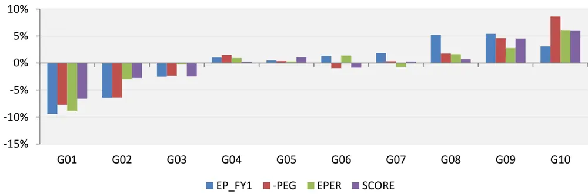
数据来源：wind、朝阳永续、东方证券研究所

图 24：EP_FY1因子历史表现（中证全指，非金融）
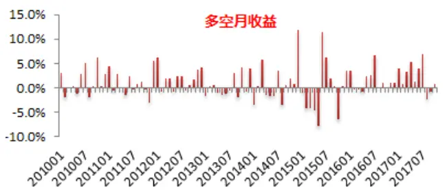

图 25：PEG盈利历史表现（中证全指，非金融）
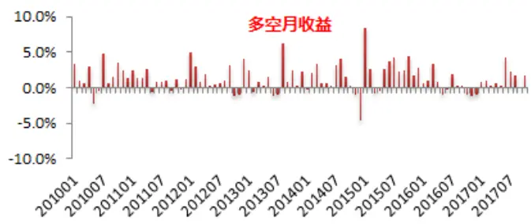

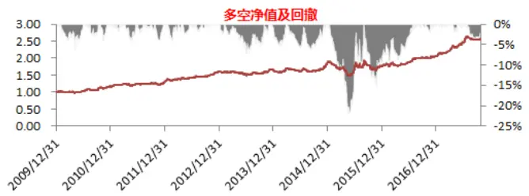
数据来源：wind、朝阳永续、东方证券研究所

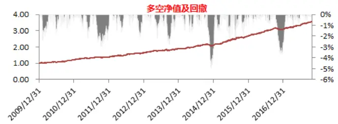
数据来源：wind、朝阳永续、东方证券研究所

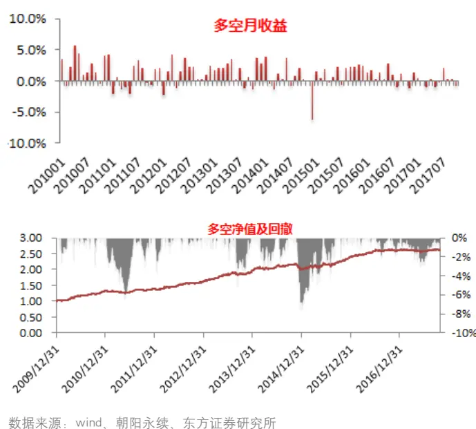

图 26：TPER因子历史表现（中证全指，非金融）
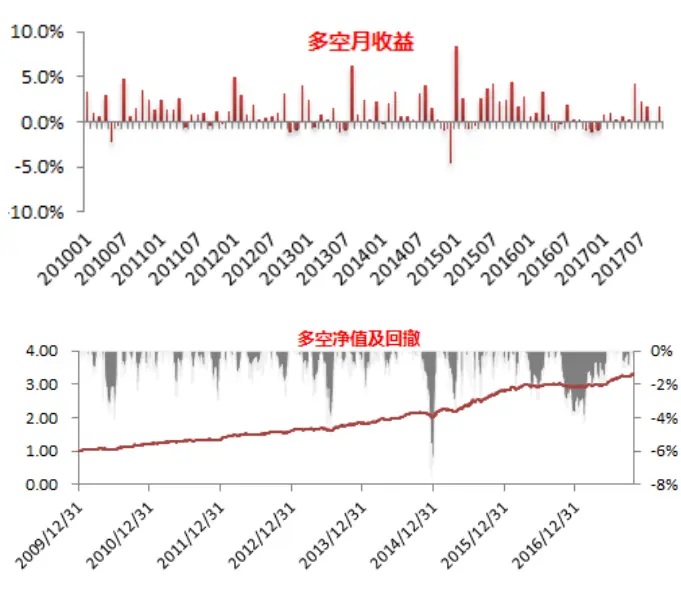
数据来源：wind、朝阳永续、东方证券研究所
图 27：SCORE因子历史表现（中证全指，非金融）
数据来源：wind、朝阳永续、东方证券研究所

## 4.3 小结

本章首先比较了 wind、朝阳永续和我们自定义的 4种一致预期加权方法，结果发现预测精度加权accwt2和朝阳永续的一致预期净利润的预测误差最小，但这两者预测误差的差异并不不显著，而 wind的一致预期净利润预测误差显著高于其他加权方法，考虑到加权算法的透明度，我们建议采用预测精度加权 accwt2。基于 accwt2 算法我们加权了预测净利润、分析师评级和目标价，并提出了 EP_FY1、PEG、一致预期评级 SCORE 和目标价隐含收益率 TPER 等 4 个一致预期相关的alpha因子，4个 alpha因子在各个样本空间内均有十分显著的选股能力。

## 五、预期调整

分析师预期调整也是分析师报告中的重要信息，由于评级和目标价调整较少，本章主要讨论分析师预测净利润的调整。

## 5.1 预测盈余调整的度量

一般情况下，一只股票有多个分析师覆盖，每个分析师都有可能对其盈余预测进行调整，那么如何用一个加总的指标去度量分析师近期的盈余调整情况？目前各大数据商和业内最常见的方法就是利用当前的一致预期净利润相对于过去一段时间之前（比如 3 个月）的一致预期净利润的变化率进行度量。但是这种做法忽略了各个分析师的特质性，一致预期净利润的变化可能完全是由于分析师 A的预测被纳入分析师 B的预测被剔除，而 B比 A一致性高估或者低估而导致的。为了解决这个问题，我们考虑用各个分析师预测净利润相对于自己之前预测的调整比例按照第四章提出的 Accwt2 方法进行加权构建加权的盈余调整度量（Weighted Forecast Revision，WFR）。因子具体计算步骤如下：

1. 计算过去 3个月每个机构最后一次盈余预测的调整幅度，调整幅度计算方法为，本次盈余预测相对于 1 个月前 6 个月内的同报告期最新一次预测的百分比（为避免分母过小甚至为负，当上次预测盈余低于 100 万元时，取 100 万元，该部分占比不高，占总样本的 1%），分析师可能对多个报告期进行预测，这里取计算时点的当年报告期，比如 20160101-20161231 计算调整幅度时取对 2016年的盈余预测，之所以留有一个月空档期主要是为了减少短期重复报告的影响。

2.按照 Accwt2 方法加权过去 3个月每家机构的最后一次盈余的调整幅度，得到加权的盈余调整幅度（Weighted Forecast Revision，WFR）。

作为对比我们也计算了 accwt2 一致预期盈余过去 3 个月的变化率（当上期一致预期净利润不足 100 万元时做与 WFR 类似处理）作为一致预期调整（Consensus Forecast Revision, CFR）与加权预期调整WFR作为对比。

## 5.2 盈余调整因子表现

纵观 CFR和WFR两个因子在各个样本空间的表现，CFR的 RankIC时间序列 t值仅在中证全指（非金融）中显著，而 WFR 在各个样本空间内均有显著的选股能力。即使在中证全指中，WFR 的 IC_IR 为 2.99，大幅高于 CFR 的 1.04，而且 WFR 在各个样本空间的多空组合回撤均明显低于 CFR 因子。

图 28：预期调整因子在各样本空间表现表现（非金融）

|  |  | RankIC |  |  | 多空组合 |  |  |  |
| --- | --- | --- | --- | --- | --- | --- | --- | --- |
|  |  | 均值 | IC_IR | t值 | 年化收益 | 夏普比 | 月胜率 | 最大回撤 |
| CFR | 沪深300 | 1.73% | 0.60 | 1.69 | 6.79% | 0.86 | 60.6% | 18.5% |
|  | 中证500 | 0.47% | 0.27 | 0.75 | 3.46% | 0.58 | 50.0% | 14.2% |
|  | 中证800 | 0.89% | 0.47 | 1.31 | 4.89% | 0.88 | 59.6% | 12.7% |
|  | 中证全指 | 1.71% | 1.04 | 2.92 | 9.36% | 1.54 | 66.0% | 10.1% |
| WFR | 沪深300 | 4.33% | 1.91 | 5.33 | 12.65% | 1.62 | 70.2% | 8.4% |
|  | 中证500 | 3.08% | 1.99 | 5.56 | 11.58% | 1.97 | 72.3% | 8.1% |
|  | 中证800 | 3.53% | 2.44 | 6.83 | 12.67% | 2.39 | 74.5% | 4.1% |
|  | 中证全指 | 3.29% | 2.99 | 8.36 | 13.34% | 2.60 | 76.6% | 5.4% |

数据来源：wind、朝阳永续、东方证券研究所

从中证全指（非金融）成分股内各分组的结果看，无论 CFR还WFR预测盈余向上调整幅度最大的一组并不是收益最明显的一组，虽然预期上调的股票有超额收益，但大幅上调并不一定更好。纵观因子历史的表现，15年以前预期调整因子的表现好，近两年有走平的趋势。

综合来看，WFR调整因子的表现略优于 CFR，在 alpha层面我们更建议采用WFR去度量分析师预期盈余调整。

图 29：预期调整因子分组对冲收益（中证全指，非金融）
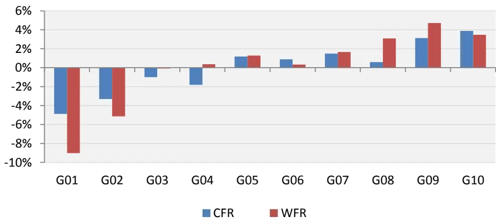
数据来源：wind、朝阳永续、东方证券研究所

图 30：CFR因子历史表现（中证全指，非金融）
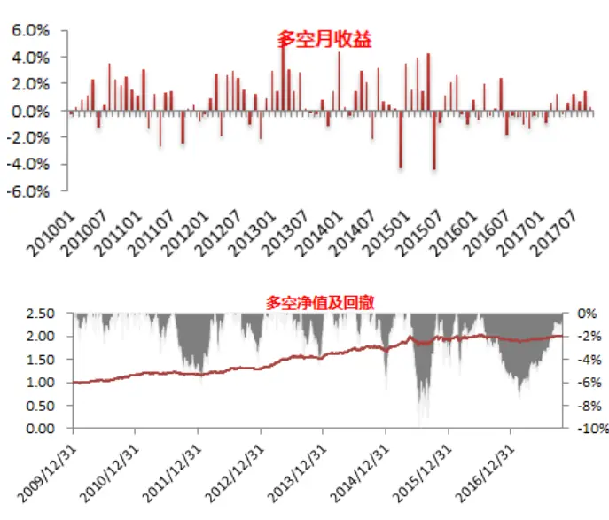
数据来源：wind、朝阳永续、东方证券研究所

图 31：WFR因子历史表现（中证全指，非金融）
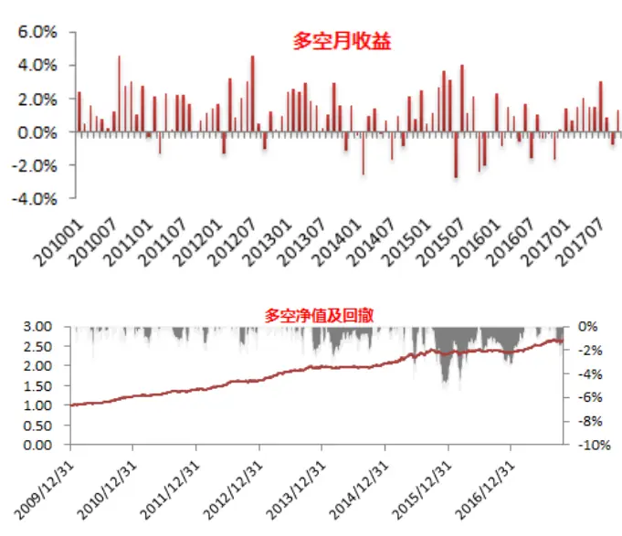
数据来源：wind、朝阳永续、东方证券研究所

## 5.3 盈余预测大幅上调

我们在事件系列报告之四《寻找真实事件的 alpha》中有提到，分析师大幅上调盈利虽然短期内有显著的 alpha但中长期的异常收益并不可观，而我们上述因子测试结果表明，分析师盈余上调超额收益明显，两者之间是否存在矛盾？事件研究中我们采用分析师相对一致预期大幅上调预期作为研究的事件，这里面有两点需要注意，一是相对一致预期，二是大幅上调。从下图的不同事件结果来看，相对于自己上次预测的盈余调整事件的异常收益显著大于相对于一致预期事件的超额收益，这一结果和 Lee（2002）一致，主要原因是每个分析师都有自己的异质性，通过和自己上次预测比较可以消除异质性，另外大幅上调盈余（>30%）的事件的中长期异常收益不如一般性的上调，但短期（1周以内）异常收益更加明显，这可能是因为大幅上调预期的这种股票一般处于风口，市场关注度高，一旦有利好信息市场会立刻反应，甚至过度反应，这在一定程度上也解释了预期调整因子 top 组合的超额收益并不是最高的原因。

图 32：不同盈余调整事件日前后个股累积异常收益
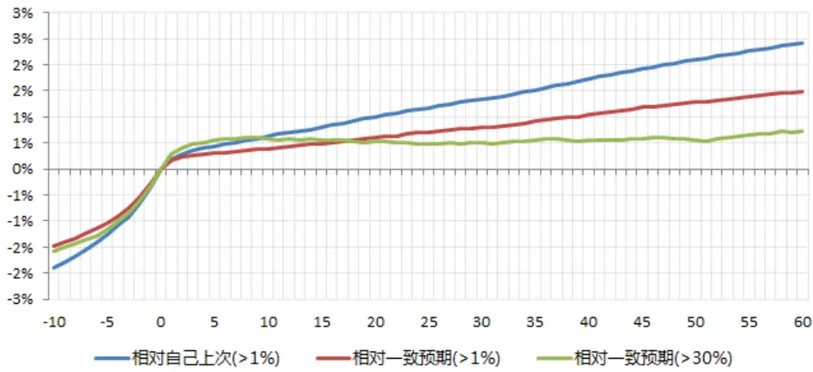
数据来源：wind、朝阳永续、东方证券研究所

## 5.4 小结

本章主要探讨了预测盈余调整和股票收益的关系，传统上一般采用一致预期净利润的变化率作为股票盈余调整的度量（CFR），而这种做法忽视了各个分析师预测的异质性，本文提出用预测精度加权各个分析师相对于自己之前预测的调整比例作为加权的预测盈余调整（WFR），因子检验发现 CFR 仅在中证全指（非金融）中有显著的选股效果，而 WFR 在各个样本空间内均有显著的选股能力，即使在中证全指中，WFR的 IC_IR也远高于 CFR，因此从 alpha层面我们建议采用WFR度量盈余调整。另外，通过对事件的研究，我们发现，相对于一致预期的预期盈余调整事件异常收益明显低于相对于分析师自己上次的调整，而且大幅调整的异常收益并不是最高，这也部分解释了预期调整因子 top组合收益并不是最高的原因。

## 六、信息增量分析

前面的研究中我们提出分析师覆盖 COV、预期分歧度 DISP、一致预期估值 EP_FY1、PEG、一致预期评级 SCORE、目标价预期收益率 TPER 以及加权预期调整WFR等 7个 alpha因子，且均有显著的选股效果，但是这些 alpha因子超额收益的信息来源是否独立于现有的 alpha因子，剔除其他因子之后，这些基于分析师预期数据的 alpha因子是否还有超额收益，这是本章主要探讨的内容。

为了降低数据的维度，我们将现有的 alpha 因子分为 5 大类，加上本篇报告介绍的分析师预期类共 6 大类因子。由于有些因子取值越大超额收益越强，有些则相反，为统一计算和描述，我们通过取相反数的方法将所有因子统一为取值越大 alpha越高。

图 33：因子库说明

| 大类 因子 | 定义 |  | 序 |
| --- | --- | --- | --- |
| 估值 Value | BP | 股东权益(不含少数股东)/总市值 | 1 |
|  | EP | 扣非后的净利润TTM/总市值 | 1 |
|  | CFP | 经营性现金流TTM/总市值 | 1 |
|  | EBIT2EV | 息税前利润与企业价值之比 | 1 |
| 成长 Growth | PROFIT_GROWTH_YOY | 归属母公司的净利润季度同比 | 1 |
|  | SALES_GROWTH_YOY | 营业收入季度同比 | 1 |
|  | UP | 预期外的RNOA，详见报告《预期外的盈利能力》 | 1 |
| 盈利能力 Profitability | RNOA | 净经营资产收益率 | 1 |
|  | CFROI | 投资现金收益率 | 1 |
|  | GPOA | 总资产毛利率 | 1 |
| 流动性 | LNTO | 过去20个交易日日均换手率对数 | -1 |
|  | LNILLIQ | 20日Amihud非流动性的自然对数 | 1 |
| 投机性 Liquidity | IVOL | 过去20个交易日计算的FF三因子特质波动率 | -1 |
|  | IVR | 过去20个交易日计算的特异度 | -1 |
|  | Ret | 过去20个交易日涨跌幅 | -1 |
| 分析师预期 Analyst | COV | 过去3个月覆盖的机构数量，取根号处理 | 1 |
|  | DISP | 过去3个月分析师盈利预测的分歧度 | -1 |
|  | EP_FY1 | FY1一致预期净利润/总市值 | 1 |
|  | PEG | FY1一致预期净利润/FY2隐含增长率 | -1 |
|  | SCORE | 一致预期评级 | 1 |
|  | TPER | 目标价隐含收益率 | 1 |
|  | WFR |  |  |
|  |  | 加权盈余调整 | 1 |

数据来源：东方证券研究所

为了考察分析师预期因子和其他 alpha 因子的相关性，我们首先将上表中的各个 alpha 因子去极值标准化等权合成大类因子，然后每月月底在中证全指（非金融）成分股内用行业市值中性化后的分析师大类因子和各个分析师因子对其他行业中性化后的大类因子做回归，之后在时间序列上求系数均值、计算时间序列的t 值，为了让系数大小具有可比性，我们在回归之前将因子进行了标准化处理，结果如下表所示。

图 34：分析师因子与其他大类因子相关分析（中证全指，非金融）

|  |  | Value | Growth | Profitability | Liquidity | Lottery |
| --- | --- | --- | --- | --- | --- | --- |
| COV | 系数 | 0.09 | 0.06 | 0.29 | -0.04 | -0.02 |
|  | t值 | 14.65 | 19.31 | 52.60 | -4.51 | -2.77 |
| -DISP | 系数 | 0.15 | 0.12 | 0.29 | 0.02 | 0.01 |
|  | t值 | 36.21 | 15.53 | 75.37 | 4.99 | 2.25 |
| EP_FY1 | 系数 | 0.67 | 0.07 | 0.01 | -0.02 | 0.03 |
|  | t值 | 115.69 | 12.12 | 2.39 | -5.52 | 10.98 |
| -PEG | 系数 | 0.11 | 0.26 | -0.05 | 0.01 | 0.00 |
|  | t值 | 17.31 | 45.41 | -5.38 | 1.46 | 0.42 |
| TPER | 系数 | 0.03 | 0.02 | -0.03 | -0.01 | 0.22 |
|  | t值 | 4.58 | 3.39 | -5.86 | -1.77 | 32.81 |
| SCORE | 系数 | 0.03 | 0.11 | 0.13 | -0.01 | -0.07 |
|  | t值 | 5.40 | 27.90 | 22.69 | -2.21 | -15.79 |
| WFR | 系数 | 0.00 | 0.23 | 0.04 | 0.00 |  |
|  | t值 | -0.75 | 35.28 | 7.80 |  | -0.06 |
| ANALYST | 系数 | 0.20 | 0.18 |  | -0.77 | -14.68 |
|  | t值 | 36.24 | 44.78 | 0.12 18.67 | 0.00 0.15 | 0.03 6.56 |

数据来源：wind、朝阳永续、东方证券研究所

分析上图的系数和 t 值，我们不难发现：

（1）总体而言，无论是从加总的 ANALYST 因子看还是各个分析师因子，除 TPER 外分析预期因子和基本面因子的相关性更高，从相关性看，TPER 和投机性因子比较接近。

（2）低估值、高成长、盈利能力强的企业分析师覆盖更多，分析师给予评级时看公司盈利性和成长性较多，估值水平关注的相对较少，另外公司评级比较高的公司投机性一般较强。

（3）EP_FY1 和估值高度相关，而 PEG 更像是一个成长因子，

（4）WFR因子和成长因子相关性较高，但容易买到投机性比较强的股票。

（5）分析师分歧比较大的公司一般高估比较严重，对于盈利能力比较强的公司分析师预期比较一致。

从上面的分析中，我们发现无论哪个分析师因子或多或少都和其他因子有一定的关系，那么在剔除其他因子之后是不是还有超额收益，为了验证这一点，我们用行业市值中性化后的各个分析师因子对其他中性化后的大类因子回归得到各个分析师因子的残差因子，各个残差因子在中证全指（非金融）中的选股表现如下表：

各个分析师因子在剔除其他大类因子之后，除 DISP之外其他分析师因子的时间序列 IC依然显著，事实上DISP之所以表现不好，很大程度上因为DISP因子在中证全指的覆盖率低（不足40%）需要大量的填值，在沪深 300（非金融）样本空间内 DISP 残差因子 IC 达到 1.9%，IC 的 t 值为2.76。另外需要注意的是，EP_FY1 表现回落特别明显，IC 从 4.9%降低到 1.8%，如果放在沪深300 样本空间，EP_FY1 的残差因子的 IC 时间序列 t 值已不显著。

图 35：分析师残差因子表现（中证全指，非金融）

|  | RankIC |  |  | 多空组合 |  |  |  |
| --- | --- | --- | --- | --- | --- | --- | --- |
|  | 均值 | IC_IR | t值 | 年化收益 | 夏普比 | 月胜率 | 最大回撤 |
| COV | 2.47% | 1.09 | 3.06 | 11.66% | 1.62 | 67.0% | 11.2% |
| -DISP | 0.80% | 0.66 | 1.85 | 0.71% | 0.17 | 54.3% | 18.2% |
| EP_FY1 | 1.78% | 1.31 | 3.68 | 4.10% | 0.85 | 57.4% | 12.3% |
| -PEG | 2.24% | 2.15 | 6.03 | 8.45% | 1.88 | 73.4% | 6.0% |
| TPER | 2.24% | 2.05 | 5.75 | 10.23% | 2.07 | 73.4% | 7.4% |
| SCORE | 2.35% | 1.74 | 4.87 | 11.43% | 2.22 | 71.3% | 6.7% |
| WFR | 2.56% | 2.84 | 7.96 | 10.26% | 2.40 | 75.5% | 5.6% |
| ANALYST | 4.60% | 3.44 | 9.64 | 18.92% | 3.71 | 85.1% | 5.0% |

数据来源：wind、朝阳永续、东方证券研究所

## 七、指数增强

为了考察分析师预期因子对沪深 300 增强效果的边际贡献，我们比较了加入分析师预期前后沪深 300指数增强的表现，关于沪深 300指数增强有如下技术细节需要说明：

（1）银行和非银单独建模，具体请参见因子专题报告《细分行业建模值银行内因子研究》和《细分行业建模值券商内因子研究》。

（2）加入分析因子前非金融部分采用 5 个大类因子等权加总 ZSCORE，加入之后采用含分析师大类的 6个大类因子等权加总 ZSCORE。

（3）换手年化 2 倍约束，跟踪误差 4%，行业市值完全中性。

（4）测试区间：2009 年 12 月 31 日至 2017 年 10 月 31 日。

图 36：加入分析师因子前后沪深 300增强表现
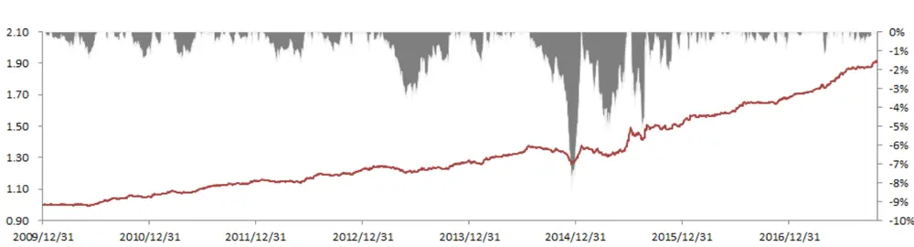
加入后对冲净值及回撤

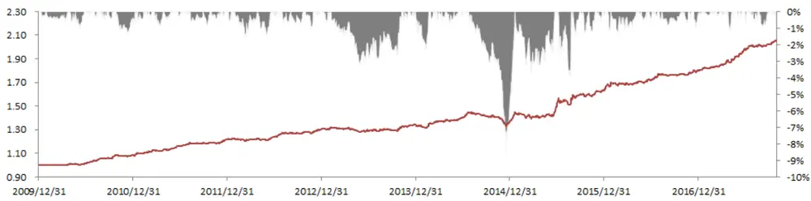

对冲组合业绩

|  | 年化收益 | 年化波动 | 夏普比 | 月胜率 | 最大回撤 |
| --- | --- | --- | --- | --- | --- |
| 加入分析师前 | 8.65% | 4.00% | 2.09 | 72.34% | 8.37% |
| 加入分析师后 | 9.62% | 3.92% | 2.36 | 72.34% | 8.25% |

据来源：wind、朝阳永续、东方证券研究所

加入分析师预期数据后，沪深 300对冲组合年化收益由原来的 8.65%提高到 9.62%，提升近1%，跟踪误差前后几乎没有变化，由原来的 4.0%小幅降低到 3.9%，最大回测也从 8.37%小幅降低至 8.25%，总体而言，策略的收益收益性尚可，但最大回测较大，后面可从风险因子入手寻求改进方案。

需要提醒的是本文沪深 300增强相对于《细分行业建模值券商内因子研究》中的沪深 300增强回撤更大的原因是后者在组合构建时控制了行业、市值、动量和波动率 4 个风险因子，本文中仅控制了行业和市值两个风险因子。

## 八、总结

分析师研报数据是相对独立的信息源，本报告基于朝阳永续的盈利预测、评级和目标价等研报明细数据，研究分析师预期相关的属性，一致预期加总方法以及相应的 alpha因子，供投资者参考。

由于分析师选择性发布报告等原因，分析师覆盖多的股票未来表现更好，但因子使用时需要做风险中性处理。分析师预期分歧比较大的公司更容易高估，未来收益较差，但该因子覆盖率较低，不适合全市场选股使用。

分析师盈余预测的准确性跟预测时间、公司的信息不确定以及分析师属性有关。大公司、价值股、业绩稳定、跟踪分析师多、分歧度小的公司预测偏差和误差更小；有经验的、跟踪行业少、往年预测精度高、雇主规模大的分析师的预测更加准确。

我们比较了 wind、朝阳永续、等权、最近预测、预测精度排序加权和预测精度加权 6种分析师一致预期加权方法，发现预测精度加权和朝阳永续的预测精度显著高于其他加权方法，但这两者之间差距并不显著，考虑到加权方法透明度，我们建议采用预测精度加权。

我们基于预测精度加权构建了一致预期净利润、一致预期评级，一致评级目标价，并基于此构建了 EP_FY1、PEG、一致预期评级 SCORE和目标价隐含收益率 4个 alpha因子，检验发现 4个 alpha因子在各个样本空间中均有显著的选股效果，

传统上用一致预期净利润的变化率来表示分析师预期的调整，但是这种处理方法忽视了各个分析师的特质性，我们建议使用分析师预测精度加权各个分析师相对于自己前期的预测调整得到加权的预期调整，相比于一致预期的调整，中证全指内 IC_IR从 1.04提升到 2.99。

剔除估值、成长、盈利、流动性、投机性等因子后除预期分歧度由于覆盖率较低导致选股效果不显著外，其他因子在中证全指（非金融）内依然有显著的选股效果，分析师大类因子在剔除其他影响后，中证全指内 IC_IR 依然高达 3.44，加入分析预期后沪深 300 增强收益率可提升 1%左右。

## 风险提示

1. 量化模型基于历史数据分析得到，未来存在失效的风险，建议投资者紧密跟踪模型表现。

2. 极端市场环境可能对模型效果造成剧烈冲击，导致收益亏损。

## 参考文献

[1] Kothari S P, So E, Verdi R. Analysts' Forecasts and Asset Pricing: A Survey[J]. Annual Review of Financial Economics, 2016, 8(1):197-219.

[2] Scherbina A. Analyst Disagreement, Forecast Bias and Stock Returns[J]. Social Science Electronic Publishing, 2004.

[3] Clement M B. Analyst forecast accuracy: Do ability, resources, and portfolio complexity matter? ☆[J]. Journal of Accounting & Economics, 1999, 27(3):285-303.

[4] Jacob J, Lys T Z, Neale M A. Expertise in forecasting performance of security analysts ☆[J]. Journal of Accounting & Economics, 1999, 28(1):51-82.

[5] Frankel R, Kothari S P, Weber J. Determinants of the informativeness of analyst research ☆[J]. Journal of Accounting & Economics, 2006, 41(1–2):29-54.

[6] Diether K B, Malloy C J, Scherbina A. Differences of Opinion and the Cross Section of Stock Returns[J]. Social Science Electronic Publishing, 2002, 57(5):2113-2141.

[7] Zhang X F. Information Uncertainty and Analyst Forecast Behavior[J]. Contemporary Accounting Research, 2006, 23(2):565–590.

[8] Zhang X F. Information Uncertainty and Stock Returns[J]. Journal of Finance, 2006, 61(1):105-137.

[9] Lim T. Rationality and Analysts' Forecast Bias[J]. Journal of Finance, 2010, 56(1):369-385.

[10] Lee C M C, So E C. Uncovering expected returns: Information in analyst coverage proxies ☆[J]. Journal of Financial Economics, 2017, 124(2):331-348.

[11] Gleason C A, Lee C M C. Analyst Forecast Revisions and Market Price Discovery[J]. Accounting Review, 2003, 78(1):193-225.

[12] Slavin G. Aggregating Earnings per Share Forecasts[J]. 2014.

[13] Conroy R, Harris R. CONSENSUS FORECASTS OF CORPORATE EARNINGS: ANALYSTS' FORECASTS AND TIME SERIES METHODS[J]. Management Science, 1987, 33(6):725-738.

[14] Lang M H, Lundholm R J. Corporate Disclosure Policy and Analyst Behavior[J]. Accounting Review, 1996, 71(4):467-492.

[15] O'Brien P C. Analysts' forecasts as earnings expectations ☆[J]. Journal of Accounting & Economics, 2006, 10(1):53-83.

## 分析师申明

每位负责撰写本研究报告全部或部分内容的研究分析师在此作以下声明：

分析师在本报告中对所提及的证券或发行人发表的任何建议和观点均准确地反映了其个人对该证券或发行人的看法和判断；分析师薪酬的任何组成部分无论是在过去、现在及将来，均与其在本研究报告中所表述的具体建议或观点无任何直接或间接的关系。

## 投资评级和相关定义

报告发布日后的 12个月内的公司的涨跌幅相对同期的上证指数/深证成指的涨跌幅为基准；

## 公司投资评级的量化标准

买入：相对强于市场基准指数收益率 15%以上；

增持：相对强于市场基准指数收益率 5%～15%；

中性：相对于市场基准指数收益率在-5%～+5%之间波动；

减持：相对弱于市场基准指数收益率在-5%以下。

未评级——由于在报告发出之时该股票不在本公司研究覆盖范围内，分析师基于当时对该股票的研究状况，未给予投资评级相关信息。

暂停评级——根据监管制度及本公司相关规定，研究报告发布之时该投资对象可能与本公司存在潜在的利益冲突情形；亦或是研究报告发布当时该股票的价值和价格分析存在重大不确定性，缺乏足够的研究依据支持分析师给出明确投资评级；分析师在上述情况下暂停对该股票给予投资评级等信息，投资者需要注意在此报告发布之前曾给予该股票的投资评级、盈利预测及目标价格等信息不再有效。

## 行业投资评级的量化标准：

看好：相对强于市场基准指数收益率 5%以上；

中性：相对于市场基准指数收益率在-5%～+5%之间波动；

看淡：相对于市场基准指数收益率在-5%以下。

未评级：由于在报告发出之时该行业不在本公司研究覆盖范围内，分析师基于当时对该行业的研究状况，未给予投资评级等相关信息。

暂停评级：由于研究报告发布当时该行业的投资价值分析存在重大不确定性，缺乏足够的研究依据支持分析师给出明确行业投资评级；分析师在上述情况下暂停对该行业给予投资评级信息，投资者需要注意在此报告发布之前曾给予该行业的投资评级信息不再有效。

## 免责声明

本证券研究报告（以下简称“本报告”）由东方证券股份有限公司（以下简称“本公司”）制作及发布。

本报告仅供本公司的客户使用。本公司不会因接收人收到本报告而视其为本公司的当然客户。本报告的全体接收人应当采取必要措施防止本报告被转发给他人。

本报告是基于本公司认为可靠的且目前已公开的信息撰写，本公司力求但不保证该信息的准确性和完整性，客户也不应该认为该信息是准确和完整的。同时，本公司不保证文中观点或陈述不会发生任何变更，在不同时期，本公司可发出与本报告所载资料、意见及推测不一致的证券研究报告。本公司会适时更新我们的研究，但可能会因某些规定而无法做到。除了一些定期出版的证券研究报告之外，绝大多数证券研究报告是在分析师认为适当的时候不定期地发布。

在任何情况下，本报告中的信息或所表述的意见并不构成对任何人的投资建议，也没有考虑到个别客户特殊的投资目标、财务状况或需求。客户应考虑本报告中的任何意见或建议是否符合其特定状况，若有必要应寻求专家意见。本报告所载的资料、工具、意见及推测只提供给客户作参考之用，并非作为或被视为出售或购买证券或其他投资标的的邀请或向人作出邀请。

本报告中提及的投资价格和价值以及这些投资带来的收入可能会波动。过去的表现并不代表未来的表现，未来的回报也无法保证，投资者可能会损失本金。外汇汇率波动有可能对某些投资的价值或价格或来自这一投资的收入产生不良影响。那些涉及期货、期权及其它衍生工具的交易，因其包括重大的市场风险，因此并不适合所有投资者。

在任何情况下，本公司不对任何人因使用本报告中的任何内容所引致的任何损失负任何责任，投资者自主作出投资决策并自行承担投资风险，任何形式的分享证券投资收益或者分担证券投资损失的书面或口头承诺均为无效。

本报告主要以电子版形式分发，间或也会辅以印刷品形式分发，所有报告版权均归本公司所有。未经本公司事先书面协议授权，任何机构或个人不得以任何形式复制、转发或公开传播本报告的全部或部分内容。不得将报告内容作为诉讼、仲裁、传媒所引用之证明或依据，不得用于营利或用于未经允许的其它用途。

经本公司事先书面协议授权刊载或转发的，被授权机构承担相关刊载或者转发责任。不得对本报告进行任何有悖原意的引用、删节和修改。

提示客户及公众投资者慎重使用未经授权刊载或者转发的本公司证券研究报告，慎重使用公众媒体刊载的证券研究报告。

## 东方证券研究所

地址：上海市中山南路 318 号东方国际金融广场 26 楼

联系人： 王骏飞

电话： 021-63325888*1131

传真：021-63326786

网址： www.dfzq.com.cn

Email： wangjunfei@orientsec.com.cn