## 相关报告

## 研究结论

本文主要研究了影响反转因子的表现的因素，包括市场状态和宏观因素，从结果上来看，MKTILLIQ（市场资金敏感性）、MKTTO（市场换手率）、MKTVOL（市场波动率）和 BAS（Bid-Ask Spread）这 4 个市场状态指标能够显著的预测下个月反转因子多空组合的表现。综合来看，这 4个指标越低的时候，反转因子表现越差。

我们通过逐步回归的方法在中证全指、中证500和沪深 300这 3个样本空间中进行拟合，得到了我们对于反转因子多空组合月收益的预测模型，预测模型的 Adjusted R-square 均在 20%左右，预测效果明显。

我们通过过去5年历史数据构建动态调整的预测模型，并依据预测的多空组合收益率在历史分布中的分位水平构建了了曲线调整和阈值调整两种方法来调整反转因子的权重。

加入了动态预测模型的4个组合，对冲年化收益、信息比和换手率均有所改进。其中曲线调整的全市场增强 500组合年化对冲收益 17.46%，相比于常规组合提升 1.13%，其中 15 年提升 4%，17 年提升 3%；曲线调整的 500成分内增强组合年化对冲收益 10.95%，相比于常规组合提升0.92%，其中15年提升 2%，17年提升 3%；曲线调整的全市场增强 300组合年化对冲收益 12.51%，相比于常规组合提升 1.66%，其中 15 年提升 3%，17 年提升4%；曲线调整的 300 成分内增强组合年化对冲收益 10.51%，相比于常规组合提升 0.62%，其中 15年提升 0.5%，17年提升 3%。上述组合在其他年份表现均与常规组合几乎相同，说明整体的提升来源于15和 17年对于反转因子表现的正确预测。

## 风险提示

- 极端市场环境可能对模型效果造成剧烈冲击，导致收益亏损。

- 量化模型基于历史数据分析得到，未来存在失效风险，建议投资者紧密跟踪模型表现。

中证全指范围内实际和预测的多空组合月收益率以及大类反转因子权重占比
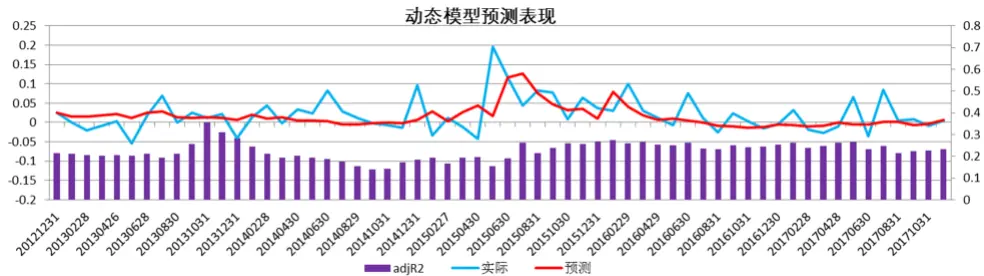

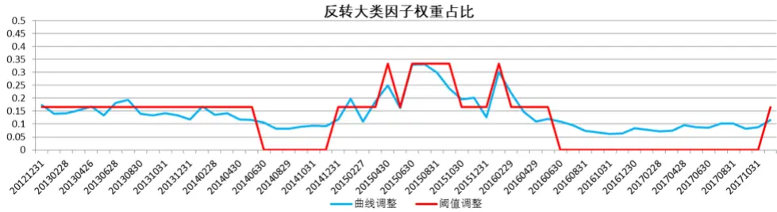
东方证券股份有限公司经相关主管机关核准具备证券投资咨询业务资格，据此开展发布证券研究报告业务。

报告发布日期2018 年 02 月 21 日

证券分析师朱剑涛

021-63325888*6077

zhujiantao@orientsec.com.cn

执业证书编号：S0860515060001

联系人张惠澍

021-63325888-6123

东方证券股份有限公司及其关联机构在法律许可的范围内正在或将要与本研究报告所分析的企业发展业务关系。因此，投资者应当考虑到本公司可能存在对报告的客观性产生影响的利益冲突，不应视本证券研究报告为作出投资决策的唯一因素。

zhanghuishu@orientsec.com.cn

| 分析师研报的数据特征与 alpha | 2017-12-03 |
| --- | --- |
| 风险模型在时间序列上的改进 | 2017-12-01 |
| 细分行业建模之券商内因子研究 | 2017-10-26 |
| 质优股量化投资 | 2017-08-31 |
| 用机器学习解释市值：特异市值因子 | 2017-08-04 |
| 预期外的盈利能力 | 2017-07-09 |
| 因子选股与事件驱动的 Bayes 整合 | 2017-06-01 |

有关分析师的申明，见本报告最后部分。其他重要信息披露见分析师申明之后部分，或请与您的投资代表联系。并请阅读本证券研究报告最后一页的免责申明。

## 学界对于动量（反转）影响因素的研究

股票的反转特性主要指的是过去短时间（3个月以内）表现比较差的股票未来有较大的概率表现较好，在 A 股市场中反转因子长期来看一直是十分有效的 alpha 因子，即使是在美国市场这样的成熟市场，短期反转依然是有一定的效果的（参考我们的报告《中美市场因子选股效果对比分析》）。虽然反转因子长期来看表现出色，但是从 2017年开始反转因子表现不佳，不但带来了负向的 alpha贡献，还增加了整体组合的换手率水平，对整体组合的表现带来很大的负面影响。那么我们是否能找到一种方法对未来的反转因子表现进行预测呢？学界通常认为，反转（动量）因子产生的原因的投资者的过度反应（反应不足），那么如果我们能提前对市场当前的投资者情绪状态进行监控的话，很有可能我们就可以对随后的反转(动量)因子表现进行预测和判断了。

由于美国市场主要是动量效应较强，因此主流的学术研究也主要以研究动量效应为主，Cooper,Gutierrez 和 Hameed （2004）研究发现市场状态和动量因子表现有着很强的相关性，其中描述市场过去上涨下跌状态的 DOWN（若过去市场的动量因子方向为负，则说明市场处在下行状态，DOWN 的值为 1，否则为 0）对于未来动量因子表现有一定的预测作用。Avramov, Cheng 和Hameed（2016）研究发现市场的整体非流动性、市场的波动率、换手率对动量因子的未来表现有着显著的预测作用，当市场整体非流动性、波动率，换手率较低情况下动量因子的表现较好，此文献中效果最为显著的市场非流动性，我们在 2017年实证过其在 A股中对反转因子的表现的预测作用，效果非常显著。Smith, Wang 和 Zychowicz（2016）研究了主要的市场情绪对于技术分析的影响（其中市场情绪指标来源于 Baker 和 Wurgler（2006）的研究），研究发现在市场情绪比较好的市场状态下，技术分析的表现会变好。Cooper, Gulen和 Vassalou（2002）研究了宏观指标对于市场风格的影响，作者发现历史的市场风格和宏观指标对于未来的市场风格有一定的预测作用，本文也将参考文中的一些宏观指标。Cakici 和 Tan（2014）根据 1990-2012 的数据，计算了全世界 23个市场调整了市值效果的一年期动量因子效果，我们提取了其中的数据，并且计算了世界银行网站得到的相应年份的平均换手率（图 1）。两者的相关性水平为-34.8%，呈现出比较高的反相关性，说明了换手率较高的市场整体来说动量因子表现较低，与其他文献的结果也一致。

图 1：不同市场平均换手率和动量因子表现

| Country | 市场平均换手（%） | WML |
| --- | --- | --- |
| Austria | 40.3 | 0.97 |
| Belgium | 37.9 | 1.24 |
| France | 100.9 | 0.33 |
| Germany | 126.7 | 0.72 |
| Greece | 35.4 | 0.48 |
| Ireland | 20.1 | 0.38 |
| Italy | 117.9 | 0.59 |
| Netherlands | 102.2 | 0.61 |
| Norway | 82.2 | 0.42 |
| Portugal | 58.3 | -0.33 |
| Spain | 104.2 | 0.33 |
| Sweden | 33.8 | 0.59 |
| Switzerland | 72.7 | 0.54 |
| Australia | 72.6 | 1.18 |
| Japan | 95.8 | -0.14 |
| New Zealand | 18.6 | 1.06 |
| Singapore | 56.6 | 0.48 |
| Canada | 63.1 | 0.74 |
| United States | 170.4 | 0.12 |

数据来源：东方证券研究所 Wind 资讯

## 构建反转因子表现预测模型

## 影响反转表现的因素测试

我们首先研究了单个市场状态和宏观因子对于反转因子未来一个月表现的预测效果，这里的反转因子我们先进行了行业市值中性化，然后再通过等权加权的方式把下面 5 个主要的反转因子进行合成（图 2）来生成大类反转因子。测试区间为 2007.1-2017.12。

图 2：反转因子列表

| 因子 | 因子说明 |
| --- | --- |
| Ret1M | 1个月收益反转 |
| Ret3M | 3个月收益反转 |
| PPReversal | 乒乓球反转因子 |
| CGO_3M | Capital Gains Overhang (3M) |
| IRFF | Fama—French regression 1—SSR/SST |

数据来源：东方证券研究所 Wind 资讯

我们通过线性回归的方法检验单个月末的状态因子对于下个月的大类反转因子多空组合收益率的显著性，这里我们分别测试了中证全指（多空各 10%）、中证 500（多空各 20%）和沪深 300（多空各 20%）这 3个样本空间里的结果（图 3）。这里我们注意到 MKTILLIQ、MKTTO 和 MKTVOL这 3 个因子可以在成分内进行计算，我们计算了这 3 个指标在成分内的因子值，发现它们和全市场计算的指标相关性均在 90%以上，而且市场状态其实反映的是整个市场的一种特性，因此综合考虑后，我们都统一采用中证全指样本空间计算的全市场状态指标。

图 3：反转因子影响因素测试结果

| 计算方法 | pvalue |  |  |  |
| --- | --- | --- | --- | --- |
| 因子 | 市值加权的ILLIQ | 中证全指 | 中证500 | 沪深300 |
| MKTILLIQ |  | 0.06% | 0.10% | 3.38% |
| DOWN CEFD | 过去6个月的涨跌幅（去除最近一个月）若涨幅为负则为1，否则为0 | 1.44% | 2.70% | 36.39% |
| MKTTO | 过去20个交易日封闭式基金平均折价率 过去20个交易日的自由流通市值计算的换手率 | 67.61% 4.02% | 31.59% | 7.71% 0.09% |
| RIPO | 过去半年上市股票平均连续最大涨跌幅 | 39.67% | 3.54% |  |
| S |  |  | 89.32% | 50.56% |
| NIPO | 过去半年增发加IPO市值占当前总市值的比重 | 74.47% | 39.27% | 55.89% |
| D-ND | 过去半年IPO数量取对数 log(过去一年有分红股票PB-无分红股票PB) | 66.34% 69.26% | 57.01% | 70.30% |
| MKTVOL | 中证全指过去20个交易日的波动率 | 0.00% | 42.52% | 4.70% |
| SOV2V |  | 98.52% | 0.00% | 0.02% |
| BAS | 过去20个交易日小单成交金额占总成交金额占比 |  | 66.87% | 6.07% |
| TBILL | 过去20个交易日的平均bid-ask spread 一个月国债收益率 | 0.81% 14.94% | 6.70% | 2.00% |
| DEF | 5年AAA债券和AA-的spread | 4.54% | 9.92% | 6.41% |
| HB3 | 3个月国债到期收益率-1个月国债到期收益率 | 88.35% | 2.13% | 31.79% |
| TERM |  |  | 63.04% | 89.17% |
|  | 10年期国债到期收益率-3个月国债到期收益率 | 23.16% | 12.39% | 3.52% |
| M1g | M1同比增速 | 5.44% | 4.54% | 23.35% |
| M2g | M2同比增速 | 51.70% | 91.71% | 54.16% |
| CPIg | CPI同比增速 | 88.10% | 93.06% | 96.24% |
| PPIg | PPI同比增速 工业增加值YOY | 15.61% | 8.47% | 18.00% |
| IVAg RDR | 存款准备金率 | 15.98% | 19.70% | 62.13% |
|  |  | 95.84% | 88.75% | 25.65% |
| USDCNY | 美元兑人民币汇率 | 45.36% | 34.60% | 79.67% |

数据来源：东方证券研究所 Wind 资讯

从结果上看，对于三个样本空间内反转因子表现都有显著预测能力的单因子有 4 个 MKTILLIQ、MKTTO、MKTVOL 和 BAS。而其他的指标诸如 DOWN、TBILL、DEF、M1g 只在其中的两个样本空间有显著的效果，说明他们虽然也能够预测反转的效果，但是并没有前面 4 个指标来的那么效果显著。

## 构建预测模型

我们选择上面测试的 4 个最显著的指标来构建预测模型，我们采用逐步回归的方法分别用这 4 个指标在三个样本空间中构建回归模型（图 4），模型的 Adjusted R-square均在 20%以上，整体预测效果非常明显，其中中证 500 用到了 MKTILLIQ、MKTTO 和 MKTVOL 三个指标。从方向上来看这三个指标和反转因子多空收益率均呈现反相关性，也就是说这 3 个指标越低，反转的表现越差（反转因子本身的方向为负）。这一结果也符合理论，反转通常被认为是市场反映过度所导致的，当市场非流动性变低，也即市场的资金敏感度变低，那么同样的信息需要市场反映的资金量也变大了，因此市场较不容易发生过度反映。同样的，低换手的市场环境说明市场的交易活跃度变低，这样的市场也不容易发生过度反映，而市场波动率除了反映了市场的振幅，也和因子整体的dispersion 有着较高的相关性，因此当波动率降低后，除了对市场反映程度的影响，也影响了因子本身的 alpha。

图 4：对三个样本空间逐步回归结果

|  | INTERCEPT | MKTILLIQ | MKTTO | MKTVOL | ADJ R2 |
| --- | --- | --- | --- | --- | --- |
| 中证全指 | 0.044 (0.001) | -1.457 (0.000) | -0.070 (0.000) |  | 20.83% |
| 中证500 | 0.036 (0.001) | -0.784 (0.010) | -0.038 (0.021) | -0.834 (0.078) | 21.56% |
| 沪深300 | 0.042 (0.001) | -0.949 (0.000) | -0.066 (0.000) |  | 20.44% |

数据来源：东方证券研究所 Wind 资讯

因为中证 500 和沪深 300 是中证全指的子空间，所以理论上说对于反转因子的影响因素应该是类似的，所以我们倾向于尽量保证模型的一致性，于是我们都以 MKTILLIQ、MKTTO 和 MKTVOL三个指标对反转因子多空月收益进行拟合（图 5）。可以看到中证全指模型的 MKTVOL 的系数虽然不是很显著，但是整体的 Adjusted R-square 有所提升，且所有系数的方向都符合逻辑，因此我们可以考虑用 3因子模型作为新的中证全指内反转预测模型，而沪深 300模型 MKTVOL 的系数非常不显著且整体的 Adjusted R-square反而下降了，所以我们还是选择采用原模型。

图 5：三因子回归结果

|  | INTERCEPT | MKTILLIQ | MKTTO | MKTVOL | ADJ R2 |
| --- | --- | --- | --- | --- | --- |
| 中证全指 | 0.042 (0.001) | -1.151 (0.002) | -0.055 (0.008) | -0.713 (0.225) | 21.16% |
| 中证500 | 0.036 (0.001) | -0.784 (0.010) | -0.038 (0.021) | -0.834 (0.078) | 21.56% |
| 沪深300 | 0.041 (0.000) | -0.885 (0.003) | -0.063 (0.000) | -0.149 (0.748) | 19.28% |

数据来源：东方证券研究所 Wind 资讯

## 预测模型在构建组合中的应用

## 动态预测模型

上文计算的预测模型，是基于整个历史区间的，虽然我们找到可以显著预测反转因子多空收益的模型，但是无法应用到组合当中。因此这里我们对模型进行一些修正，我们在每个月月末用过去 5年的数据滚动地拟合系数，然后对下个月的反转因子多空收益进行预测。这里我们假定反转因子多空收益是服从正态分布的，所以就可以根据累计的历史数据统计每个时点分布的均值和标准差，然后就可以计算出预测多空收益在这个分布中的分位水平。这里我们引入两种动态调整权重的方法：

## 1. 曲线动态调整

假定原来的基本权重为 w，则调整后的 分位数 ，也就是说若预测多空收益的分位数水平为 80%，则调整后的权重为基本权重的 1.6 倍。

## 2. 阈值动态调整

假定原来的基本权重为 w，若分位数低于 1/3，则 w设定为 0；若分位数高于 2/3，则 w设定为基本权重的 2 倍；其他情况下，w 保持为基本权重不变。

这两种调整方法，第一种是连续的在正态分布累计概率密度曲线上进行调整的，相对而言调整幅度较低，更加稳定。第二中方法的调整比较激进，相对而言波动更大，但是也更适合作为因子权重低配，均配或是超配的判断参考。动态预测模型的预测效果和两种权重调整方法的变动曲线我们将在下文展示组合表现时一同展示

## 加入动态预测模型后的组合表现

我们这里测试了动态预测模型在全市场增强中证 500、中证 500成分内、全市场增强沪深 300、沪深 300 成分内四个组合的效果，组合均采用大类内等权、大类间等权的加权方式，组合的测试区间为 2011.12.31-2017.12.29，之所以时间区间较短是因为需要过去 5年的数据来构建反转因子表现的预测模型。对于沪深 300的增强组合，我们采用的因子是（图 6）：

图 6：沪深 300 增强组合因子

| 类型 | 因子简称 | 因子说明 |
| --- | --- | --- |
| 估值 | BP_LF | Newest Book Value/Market Cap |
|  | EP_TTM | TTM earnings/ MarketCap |
|  | CFP_TTM | TTM Operating Cash Flow / Market Cap |
|  | EBIT2EV | EBIT/Enterprise Value |
| 盈利 | GP2ASSET | 总资产收益率 |
|  | CFROI | 投资现金收益率 |
|  | RNOA | 税后经营收益净额除净经营资产 |
| 成长 | SalesGrowth_Qr_YOY | 营业收入增长率(季度同比) |
|  | URONOA | 预期外盈利 |
|  | ProfitGrowth_Qr_YOY | 净利润增长率(季度同比) |
| 非流动性 | TO | 以流通股本计算的1个月日均换手率 |
|  | ILLIQ | 每天一个亿成交量能推动的股价涨幅 |
| 预期 | COV | 过去3个月有覆盖的机构数量，取对数 |
|  | DISP | 过去3个月盈利预测的分歧度 |
|  | EP_FY1 | 预期的估值 |
|  | PEG | PE_FY1/FY2隐含的利润增量率 |
|  | SCORE | 综合评价 |
|  | TPER | 目标价隐含的收益率 |
|  | WFR | 加权的预期调整 |
| 其他 | DR | 过去一年的股息率 |
|  | MR | 高管薪酬前三总和的对数 |
| 反转 | Ret1M | 1个月收益反转 |
|  | Ret3M | 3个月收益反转 |
|  | PPReversal | 乒乓球反转因子 |
|  | CGO_3M | Capital Gains Overhang (3M) |
|  | IRFF | Fama-French regression 1-SSR/SST |

数据来源：东方证券研究所

对于中证 500 的增强组合，我们采用的因子是（图 7）：

图 7：中证 500 增强组合因子

| 类型 | 因子简称 | 因子说明 |
| --- | --- | --- |
| 估值 | BP_LF | Newest Book Value/Market Cap |
|  | EP_TTM | TTM earnings/ MarketCap |
|  | CFP_TTM | TTM Operating Cash Flow / Market Cap |
|  | EBIT2EV | EBIT/Enterprise Value |
| 成长 | SalesGrowth_Qr_YOY | 营业收入增长率(季度同比) |
|  | ROEGrowth_YOY | ROE_TTM/一年前ROE_TTM |
|  | ProfitGrowth_Qr_YOY | 净利润增长率（季度同比） |
| 非流动性 | TO | 以流通股本计算的1个月日均换手率 |
|  | ILLIQ | 每天一个亿成交量能推动的股价涨幅 |
| 预期 | COV | 过去3个月有覆盖的机构数量，取对数 |
|  | DISP | 过去3个月盈利预测的分歧度 |
|  | EP_FY1 | 预期的估值 |
|  | PEG | PE_FY1/FY2隐含的利润增量率 |
|  | SCORE | 综合评价 |
|  | TPER | 目标价隐含的收益率 |
|  | WFR | 加权的预期调整 |
| 其他 | DR | 过去一年的股息率 |
|  | MR | 高管薪酬前三总和的对数 |
| 反转 | Ret1M | 1个月收益反转 |
|  | Ret3M | 3个月收益反转 |
|  | PPReversal | 乒乓球反转因子 |
|  | CGO_3M | Capital Gains Overhang (3M) |
|  | IRFF | Fama-French regression 1-SSR/SST |

数据来源：东方证券研究所

## 全市场增强 500 组合

图 8展示了全市场样本空间中动态预测模型的表现。可以看到实际的反转因子多空收益率在 15年表现很好，而在 17年表现较差，其他年份的效果比较平均，而同期的预测模型整体来说预测效果还是很不错的，特别是在 15 和 17 年都与实际多空收益比较一致。从权重的变化可以看到，曲线调整模型在 14年后半年降低了反转的权重，在 15年大幅提高反转权重，随后在 16年后半年开始逐渐降低反转权重，整个 17年反转的权重均从等权权重的 16.7%降低至 10%以内；阈值调整模型也有着类似的结果，只不过调整的幅度更加激进，整个 17 年除了 12 月，其他月份的反转权重均下降至 0%。

图 9 展示了全市场增强 500 组合的表现，从净值曲线上可以看到，两类加入动态预测模型后的组合从 2015年开始表现就逐渐的好于常规组合。其中曲线调整组合年化收益 17.46%，信息比2.86，阈值调整组合的年化收益 18.03%，信息比 2.94，这两个组合无论是年化收益，回撤、信息比还是换手率均好于常规组合。我们采用 Ledoit 和 Wolf (2008)提出的检验信息比的 HAC 检验对 15-17年的月收益差进行检验，发现两种动态调整组合均显著好于常规组合。

分年来看的结果也非常明显，在 15年动态调整组合均好于常规组合 4%以上，在 17年曲线动态调整组合跑赢常规组合 3%，阈值动态调整组合跑赢 6%以上，而在其他年份，动态调整组合与常规组合表现类似。

图 8：实际和预测的多空组合月收益率以及大类反转因子权重占比
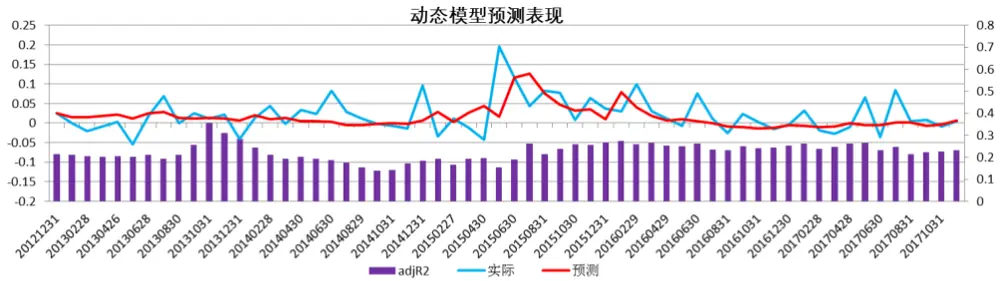

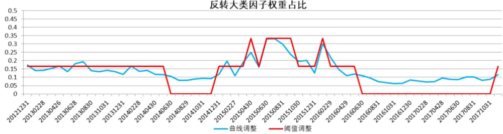
数据来源：东方证券研究所 Wind 资讯

## 图 9：全市场增强 500组合表现

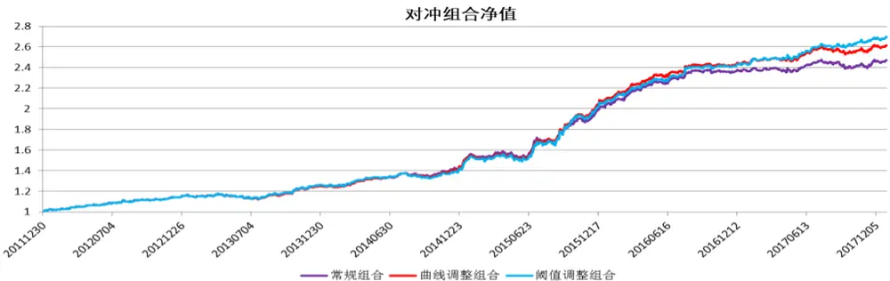

对冲组合分年收益
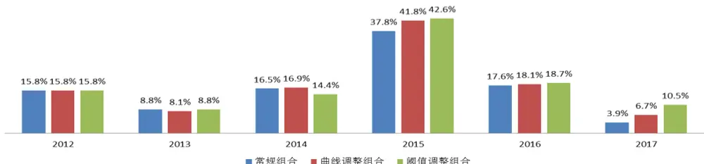

| 组合表现 | 常规组合 曲线调整组合 阈值调整组合 |  |  |
| --- | --- | --- | --- |
| 年化对冲收益 | 16.33% | 17.46% | 18.03% |
| 最大回撤 | -4.77% | -4.44% | -4.38% |
| 月平均单边换手 | 49.46% | 47.87% | 47.28% |
| 信息比 | 2.74 | 2.86 | 2.94 |
| HACp(15-17) |  | 5.65% | 4.04% |

数据来源：东方证券研究所 Wind 资讯

## 中证 500 成分内增强组合

图 10展示了中证 500样本空间中动态预测模型的表现。可以看到与全市场类似，反转因子多空收益率在 15 年表现很好，而在 17 年表现较差，其他年份的效果比较中庸，我们的预测模型依然展现出较好的预测效果，特别是在 15 和 17 年都与实际多空收益很一致。从权重的变化可以看到，曲线调整模型在 14后半年降低了反转的权重，在 15年大幅提高反转权重，随后在 16年后半年开始逐渐降低反转权重，整个 17年反转的权重均从基准的 16.7%降低至 10%以内；阈值调整模型也有着类似的结果，只不过调整的幅度更加激进，从 16年后半开始，就不在有反转因子的权重配臵了。

图 11展示了中证 500成分内增强组合的表现，从净值曲线上可以看到，两类加入动态预测模型后的组合从 2015 年开始表现就逐渐的好于常规组合。其中曲线调整组合年化收益 11.95%，信息比2.6，阈值调整组合的年化收益 11.80%，信息比 2.56，这两个组合无论是年化收益，回撤、信息比还是换手率均好于常规组合。但是我们采用 HAC检验对 15-17的月收益差进行检验，发现提升效果不显著。

分年来看的结果也非常明显，曲线调整组合在 15年跑赢常规组合 2%以上，在 17年跑赢常规组合3%，而阈值调整组合在 17跑赢常规组合 4%。在其他年份，这两个组合与常规组合表现类似。

图 10：实际和预测的多空组合月收益率以及大类反转因子权重占比
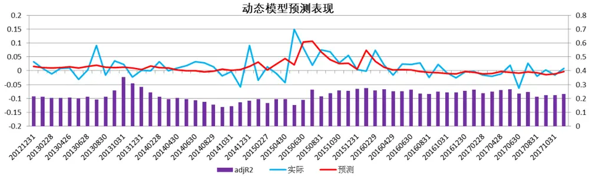

反转大类因子权重占比
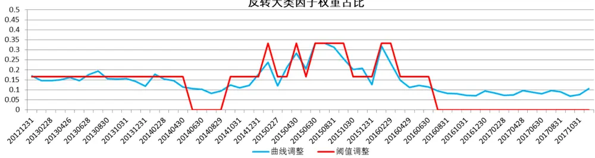
数据来源：东方证券研究所 Wind 资讯

图 11：中证 500成分内增强组合表现
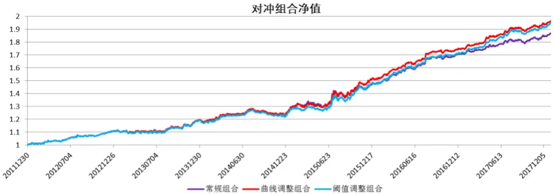

对冲组合分年收益
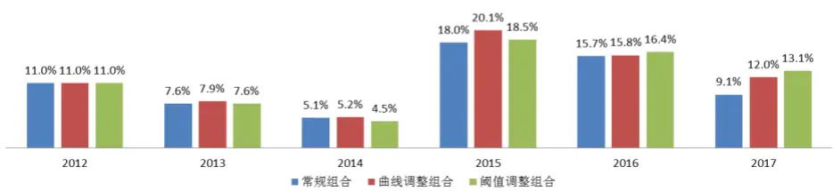

| 组合表现 | 常规组合 | 曲线调整组合 阈值调整组合 |  |
| --- | --- | --- | --- |
| 年化对冲收益 | 11.03% | 11.95% | 11.80% |
| 最大回撤 | -4.33% | -4.16% | -4.43% |
| 月平均单边换手 | 35.91% | 34.87% | 34.59% |
| 信息比 | 2.39 | 2.60 | 2.56 |
| HACp |  | 17.44% | 41.30% |

数据来源：东方证券研究所 Wind 资讯

## 全市场增强 300 组合

图 12展示了全市场样本空间中动态预测模型的表现，这里的结果除了等权权重的设臵与全市场增强 500 组合中不一致，别的结果都没有区别，所以就不做赘述了。

图 12：实际和预测的多空组合月收益率以及大类反转因子权重占比
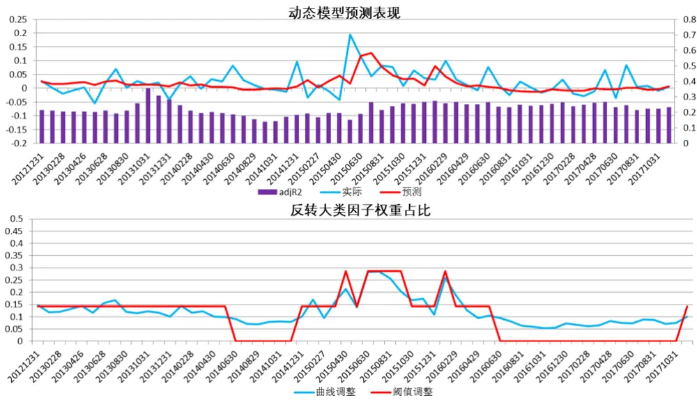
数据来源：东方证券研究所 Wind 资讯

图 13：全市场增强 300组合表现
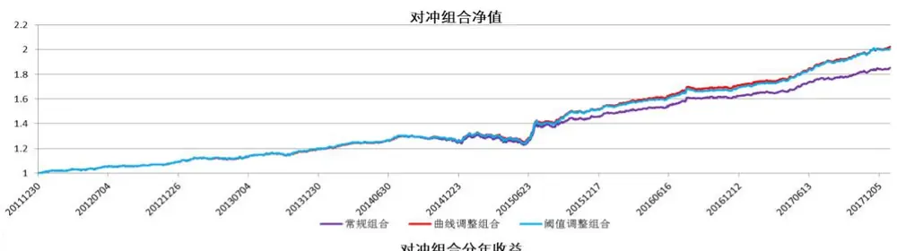

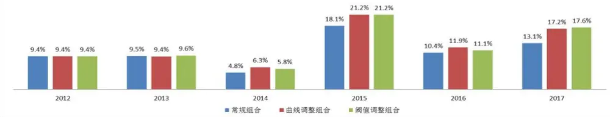

| 组合表现 |  | 常规组合曲线调整组合 阈值调整组合 |  |
| --- | --- | --- | --- |
| 年化对冲收益 | 10.85% | 12.51% | 12.38% |
| 最大回撤 | -5.99% | -5.79% | -6.19% |
| 月平均单边换手 | 28.24% | 27.80% | 27.66% |
| 信息比 | 2.79 | 3.13 | 3.04 |
| HACp |  | 4.96% | 13.55% |

数据来源：东方证券研究所 Wind 资讯

图 13 展示了全市场增强 300 组合的表现，从净值曲线上可以看到 15 年后半年开始动态调整组合的表现就逐渐的强于常规组合了，其中曲线调整组合年化对冲收益 12.51%，信息比 3.13，阈值调整组合年化对冲收益 12.38%，信息比 3.04，均好于常规的组合。我们采用 HAC检验对 15-17的月收益差进行检验，发现曲线调整组合的 IR提升显著。

分年来看，在动态调整组合在 15年提升 3%以上，在 17年提升 4%以上，而在其他年份未有大的差别，总体表现不错。

## 沪深 300 成分内增强组合

图 14 展示了沪深 300 成分股样本空间中动态预测模型的表现。可以看到整体的表现与全市场和500 内类似，但是在 15 年以前，动态预测模型的 Adjusted R-square 较低，有些时点会低于 10%，这与反转因子在 300 内的效果较弱有关。从权重上来看，模型在 15 年超配了反转的权重，从 16年后半年开始，反转权重就处在一个较低的水平。

图 14：实际和预测的多空组合月收益率以及大类反转因子权重占比
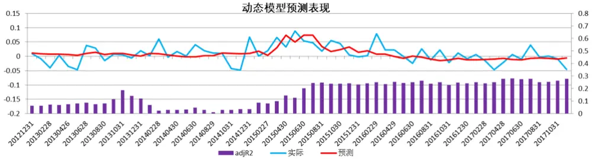

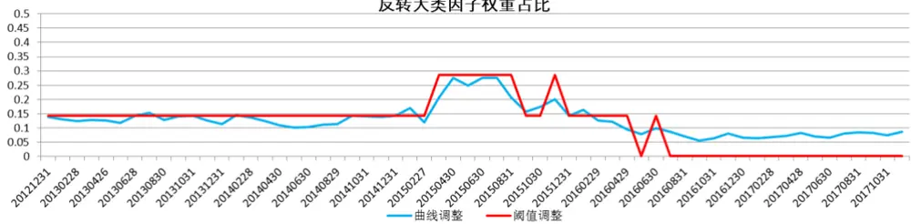
数据来源：东方证券研究所 Wind 资讯

图 15：沪深 300成分内增强组合表现
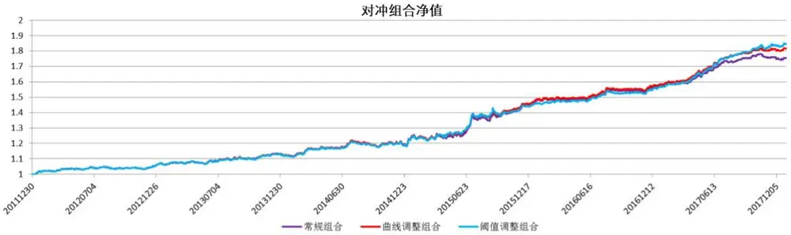

对冲组合分年收益
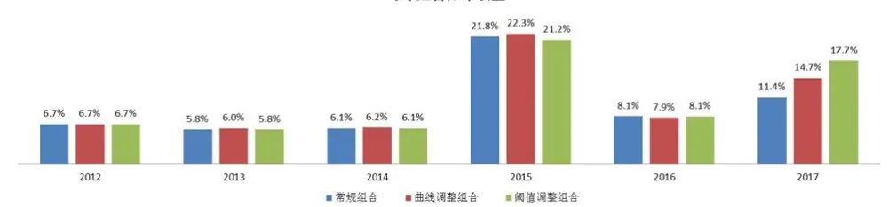

| 组合表现 |  | 常规组合 曲线调整组合 阈值调整组合 |  |
| --- | --- | --- | --- |
| 年化对冲收益 | 9.89% | 10.51% | 10.81% |
| 最大回撤 | -3.19% | -3.43% | -3.35% |
| 月平均单边换手 | 30.92% | 30.10% | 29.77% |
| 信息比 | 2.29 | 2.44 | 2.49 |
| HACp |  | 36.57% | 51.96% |

数据来源：东方证券研究所 Wind 资讯

图 15 展示了全市场增强 300 组合的表现，从净值曲线上可以看到 17 年开始动态调整组合的表现逐渐的强于常规组合了，其中曲线调整组合年化对冲收益 10.51%，信息比 2.44，阈值调整组合年化对冲收益 10.81%，信息比 2.49，均好于常规的组合。然而我们采用 HAC 检验对 15-17 的月收益差进行检验，发现曲线调整组合的 IR提升不显著。

分年来看，动态调整组合主要在 17 年有着比较明显的提升，其中曲线调整组合跑赢 3%，阈值调整组合跑赢 6%以上，别的年份差异很小。

## 总结

本文主要研究了影响反转因子的表现的因素，包括市场状态和宏观因素，从结果上来看，MKTILLIQ、MKTTO、MKTVOL和BAS这4个市场状态指标能够显著的预测下个月反转因子多空组合的表现。综合来看，这 4 个指标越低的时候，反转因子表现越差。这是因为反转因子在学界通常认为是反映过度而产生的，当市场非流动性变低，也即市场的资金敏感度变低，那么同样的信息需要市场反映的资金量也变大了，因此市场较不容易发生过度反映。同样的，低换手的市场环境说明市场的交易活跃度变低，这样的市场也不容易发生过度反映，而市场波动率除了反映了市场的振幅，也和因子整体的 dispersion 有着较高的相关性，因此当波动率降低后，除了对市场反映程度的影响，也影响了因子本身的 alpha。BAS 指标与 MKTILLIQ 类似，都描述了市场整体的非流动性水平，因此对于反转因子表现的解释逻辑也都一致。

我们通过逐步回归的方法在中证全指、中证 500 和沪深 300 这 3 个样本空间中进行拟合，得到了我们的预测模型，预测模型的 Adjusted R-square 均在 20%左右，预测效果明显。

我们通过过去 5 年历史数据构建动态调整的预测模型，并通过曲线调整和阈值调整两种方法把预测模型加入到了组合构建当中，加入了动态预测模型的 4 个组合，对冲年化收益、信息比和换手率均有所改进。其中曲线调整的全市场增强 500 组合年化对冲收益 17.46%，相比于常规组合提升 1.13%，其中 15 年提升 4%，17 年提升 3%；曲线调整的 500 成分内增强组合年化对冲收益10.95%，相比于常规组合提升 0.92%，其中 15年提升 2%，17年提升 3%；曲线调整的全市场增强 300 组合年化对冲收益 12.51%，相比于常规组合提升 1.66%，其中 15 年提升 3%，17 年提升4%；曲线调整的 300成分内增强组合年化对冲收益 10.51%，相比于常规组合提升 0.62%，其中15年提升 0.5%，17年提升 3%。上述组合在其他年份表现均与常规组合几乎相同，说明整体的提升来源于 15和 17年对于反转因子表现的正确预测。

## 风险提示

- 极端市场环境可能对模型效果造成剧烈冲击，导致收益亏损。

- 量化模型基于历史数据分析得到，未来存在失效风险，建议投资者紧密跟踪模型表现。

## 文献参考

Avramov, D., Cheng, S., & Hameed, A. (2016). Time-varying liquidity and momentum profits. 
Journal of Financial and Quantitative Analysis, 51(6), 1897-1923.

Baker, M., & Wurgler, J. (2006). Investor sentiment and the cross‐section of stock returns. The Journal of Finance, 61(4), 1645-1680

Butt, H. A., & Virk, N. S. (2017). Momentum profits and time varying illiquidity effect. Finance Research Letters, 20, 253-259.

Cakici, N., & Tan, S. (2014). Size, value, and momentum in developed country equity returns: Macroeconomic and liquidity exposures. Journal of International Money and Finance, 44, 179-209.

Cooper, M., Gulen, H., & Vassalou, M. (2002). Investing in size and book-to-market portfolios: Some new trading rules. manuscript, Purdue University.

Cooper, M. J., Gutierrez, R. C., & Hameed, A. (2004). Market states and momentum. The Journal of Finance, 59(3), 1345-1365.

Smith, D. M., Wang, N., Wang, Y., & Zychowicz, E. J. (2016). Sentiment and the effectiveness of technical analysis: Evidence from the hedge fund industry. Journal of Financial and Quantitative Analysis, 51(6), 1991-2013.

Zhao, Y., Yang, Z., & Qian, X. (2015). Investor Sentiment and Chinese A-Share Stock Markets Anomalies. International Journal of Economics and Finance, 7(9), 293.

## 分析师申明

每位负责撰写本研究报告全部或部分内容的研究分析师在此作以下声明：

分析师在本报告中对所提及的证券或发行人发表的任何建议和观点均准确地反映了其个人对该证券或发行人的看法和判断；分析师薪酬的任何组成部分无论是在过去、现在及将来，均与其在本研究报告中所表述的具体建议或观点无任何直接或间接的关系。

## 投资评级和相关定义

报告发布日后的 12个月内的公司的涨跌幅相对同期的上证指数/深证成指的涨跌幅为基准；

## 公司投资评级的量化标准

买入：相对强于市场基准指数收益率 15%以上；

增持：相对强于市场基准指数收益率 5%～15%；

中性：相对于市场基准指数收益率在-5%～+5%之间波动；

减持：相对弱于市场基准指数收益率在-5%以下。

未评级——由于在报告发出之时该股票不在本公司研究覆盖范围内，分析师基于当时对该股票的研究状况，未给予投资评级相关信息。

暂停评级——根据监管制度及本公司相关规定，研究报告发布之时该投资对象可能与本公司存在潜在的利益冲突情形；亦或是研究报告发布当时该股票的价值和价格分析存在重大不确定性，缺乏足够的研究依据支持分析师给出明确投资评级；分析师在上述情况下暂停对该股票给予投资评级等信息，投资者需要注意在此报告发布之前曾给予该股票的投资评级、盈利预测及目标价格等信息不再有效。

## 行业投资评级的量化标准：

看好：相对强于市场基准指数收益率 5%以上；

中性：相对于市场基准指数收益率在-5%～+5%之间波动；

看淡：相对于市场基准指数收益率在-5%以下。

未评级：由于在报告发出之时该行业不在本公司研究覆盖范围内，分析师基于当时对该行业的研究状况，未给予投资评级等相关信息。

暂停评级：由于研究报告发布当时该行业的投资价值分析存在重大不确定性，缺乏足够的研究依据支持分析师给出明确行业投资评级；分析师在上述情况下暂停对该行业给予投资评级信息，投资者需要注意在此报告发布之前曾给予该行业的投资评级信息不再有效。

## 免责声明

本证券研究报告（以下简称“本报告”）由东方证券股份有限公司（以下简称“本公司”）制作及发布。

本报告仅供本公司的客户使用。本公司不会因接收人收到本报告而视其为本公司的当然客户。本报告的全体接收人应当采取必要措施防止本报告被转发给他人。

本报告是基于本公司认为可靠的且目前已公开的信息撰写，本公司力求但不保证该信息的准确性和完整性，客户也不应该认为该信息是准确和完整的。同时，本公司不保证文中观点或陈述不会发生任何变更，在不同时期，本公司可发出与本报告所载资料、意见及推测不一致的证券研究报告。本公司会适时更新我们的研究，但可能会因某些规定而无法做到。除了一些定期出版的证券研究报告之外，绝大多数证券研究报告是在分析师认为适当的时候不定期地发布。

在任何情况下，本报告中的信息或所表述的意见并不构成对任何人的投资建议，也没有考虑到个别客户特殊的投资目标、财务状况或需求。客户应考虑本报告中的任何意见或建议是否符合其特定状况，若有必要应寻求专家意见。本报告所载的资料、工具、意见及推测只提供给客户作参考之用，并非作为或被视为出售或购买证券或其他投资标的的邀请或向人作出邀请。

本报告中提及的投资价格和价值以及这些投资带来的收入可能会波动。过去的表现并不代表未来的表现，未来的回报也无法保证，投资者可能会损失本金。外汇汇率波动有可能对某些投资的价值或价格或来自这一投资的收入产生不良影响。那些涉及期货、期权及其它衍生工具的交易，因其包括重大的市场风险，因此并不适合所有投资者。

在任何情况下，本公司不对任何人因使用本报告中的任何内容所引致的任何损失负任何责任，投资者自主作出投资决策并自行承担投资风险，任何形式的分享证券投资收益或者分担证券投资损失的书面或口头承诺均为无效。

本报告主要以电子版形式分发，间或也会辅以印刷品形式分发，所有报告版权均归本公司所有。未经本公司事先书面协议授权，任何机构或个人不得以任何形式复制、转发或公开传播本报告的全部或部分内容。不得将报告内容作为诉讼、仲裁、传媒所引用之证明或依据，不得用于营利或用于未经允许的其它用途。

经本公司事先书面协议授权刊载或转发的，被授权机构承担相关刊载或者转发责任。不得对本报告进行任何有悖原意的引用、删节和修改。

提示客户及公众投资者慎重使用未经授权刊载或者转发的本公司证券研究报告，慎重使用公众媒体刊载的证券研究报告。

## 东方证券研究所

地址：上海市中山南路 318 号东方国际金融广场 26 楼

联系人： 王骏飞

电话：021-63325888*1131

传真：021-63326786

网址： www.dfzq.com.cn

Email： wangjunfei@orientsec.com.cn