## 研究结论

传统多因子模型采用月频调仓，但实盘中提高调仓频率会带来两个好处：一是减小技术类alpha因子的IC衰减、二是提高风控频率降低风险。随着2016年底开始的技术类因子失效，前者的作用减弱，但后者的作用仍在。

固定月频的调仓模式忽略了月中组合的风险敞口变化，所以有必要在月中实施风险监控，提升组合的调仓频率，从而同时改善组合的收益与风险。动态调仓监控风险的核心策略是：在原有固定月频的调仓基础上，在月中每日监控市值因子的暴露情况，如果市值因子敞口超过一定的阈值，我们就在下一个交易日调仓，从而使得组合风险再次中性。

和固定周频调仓模式比，在市场低波动、组合风险敞口变化不大时，动态调仓方法可以避免很多由于组合优化误差带来的不必要调仓，降低交易成本。但在市场高波动情况下，市值因子暴露可能会频繁促发阈值，导致较高换手率，所以在实际操作中建议加入换手率控制，节约交易成本。

我们以中证500增强组合（成分内）为例，比较了传统月频组合、周频组合以及动态组合的表现，不扣费情况下，动态组合年化超额收益 16.8%，信息比 3.33，最大回撤-3.70%；月频组合年化超额收益 14.5%，信息比 2.97，最大回撤-5.67%，动态组合从收益和风险上来看都明显好于月频组合。如果不控制换手率，周频组合收益19.50%，动态调仓组合收益 16.82%，但是周频组合换手率为 8.80，动态组合 5.89.在控制了这两个组合的换手率后，动态调仓组合依然好于周频组合。

我们也在沪深 300增强组合（成分内）进行了测试，由于沪深 300成份股波动相对较小，增强组合相对基准的市值风险主动暴露波动范围也较小，再加上沪深 300成份股内市值因子收益率的波动率更低（300成分股内市值因子收益率为 0.3%，年化波动率为 7.2%，500 成分股内市值因子收益率为-12.2%，年化波动率为 8.8%），动态控制市值因子风险的作用不明显，和月频调仓组合基本相当。

## 风险提示

- 量化模型失效风险

- 市场极端环境的冲击

中证500增强组合（成分内，动态调仓，控制换手，不扣费）
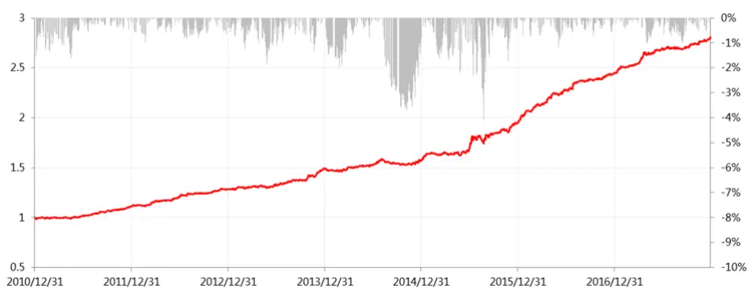

东方证券股份有限公司经相关主管机关核准具备证券投资咨询业务资格，据此开展发布证券研究报告业务。

报告发布日期2018 年 02 月 22 日

证券分析师朱剑涛

021-63325888*6077

zhujiantao@orientsec.com.cn

执业证书编号：S0860515060001

联系人邱蕊

021-63325888*5091

qiurui@orientsec.com.cn

相关报告

| 反转因子择时研究 | 2018-02-21 |
| --- | --- |
| 港股简史与现状 | 2018-01-22 |
| 分析师研报的数据特征与 alpha | 2017-12-03 |
| 风险模型在时间序列上的改进 | 2017-12-01 |
| 量化因子选股回顾与展望 | 2017-11-27 |
| 细分行业建模之券商内因子研究 | 2017-10-26 |
| 质优股量化投资 | 2017-08-31 |

东方证券股份有限公司及其关联机构在法律许可的范围内正在或将要与本研究报告所分析的企业发展业务关系。因此，投资者应当考虑到本公司可能存在对报告的客观性产生影响的利益冲突，不应视本证券研究报告为作出投资决策的唯一因素。

有关分析师的申明，见本报告最后部分。其他重要信息披露见分析师申明之后部分，或请与您的投资代表联系。并请阅读本证券研究报告最后一页的免责申明。

## 一、多因子组合调仓频率

我们曾经在《在 Alpha 衰退之前》报告中测算过一些代表性的选股因子 Alpha 的衰减速度，实证发现基本面因子的衰减速度较慢，衰减周期可以长达几个月，而技术类因子的衰减速度较快，有些因子两周后就能衰减一半。而 2017年之前，技术类因子在 A股的 Alpha十分显著，多因子组合通常也给予了技术类因子比较大的权重，如果以固定月频的调仓模式，那么很多技术类因子在后半月赚取的 Alpha 较少，所以我们当时在报告中提出用周频的调仓模式来替代原有的月频调仓模式，能够大大提升技术类因子的使用效率，明显提升组合收益。

2017年开始，技术类因子表现衰弱，此时通过固定周频调仓模式不一定会比固定月频调仓在收益上有明显优势，我们在 2017年周报中跟踪了中证 500周频与月频增强组合表现，周频组合（不控制换手）收益普遍不如月频组合。但是提高组合调仓频率除了能防止 Alpha 因子衰减过快，还能够随时调节组合风险，可以通过监控某些风险因子的敞口进行调仓，使得组合在此风险因子上的风险再平衡。而传统固定月频的调仓方式，在月中没有风险监控，很可能已经偏离了月初时的风险中性，从而使得组合在月中时有较大的风险敞口。

## 二、动态监控风险流程

## 2.1 组合构建方法

本节我们以中证 500 增强组合（成分内）为例，来说明动态监控风险的流程。首先，概述一下增强组合构建方法，我们选择如下七大类因子来构建多因子模型（图 1），：

图 1：组合构建所用 Alpha 因子

|  | 因子简称 | 因子全名 |
| --- | --- | --- |
| 估值 | BP_LF EP2_TTM | Newest Book Value/Market Cap TTM earnings(after Non-recurring Iterms) / MarketCap |
|  | EBIT2EV | EBIT/Enterprise Value |
| 盈利 | ROE | 净资产收益率 |
|  | RNOA | 净经营资产收益率 |
|  | GP2Asset | 总资产利润率 |
| 成长 | SalesGrowth_Qr_YOY ProfitGrowth_Qr_YOY | 营业收入增长率（季度同比） |
|  | UP | 净利润增长率（季度同比） 预期外的RNOA |
| 流动性 | TO_1M ILLIQ | 以流通股本计算的1个月日均换手率 每天一个亿成交量能推动的股价涨幅 |
| 技术反转 | IVOL20 | 过去20个交易日的特质波动率 |
|  | IVR20 | 过去20个交易日的特异度 |
| 其他 | RET20 | 过去20个交易日的收益率 |
|  | DP | 过去一年分红/总市值，以分红预案公告日为准 |
|  | MR | 高管薪酬前三之和的对数 |
|  | COV | 过去6个月覆盖的机构数量 |
|  | DISP |  |
|  |  | 过去6个月分析师盈利预测的分歧度 |
|  | EP_FY1 | FY1一致预期净利润/总市值 |
|  | 分析师预期 PEG | FY1一致预期净利润/FY2隐含增长率 |
|  | SCORE | 综合评级 |
|  | TPER | 目标价隐含收益率 |
|  | WFR | 加权盈余调整(各家机构相对上次盈利预测调整幅度的加权平均） |

数据来源：东方证券研究所

单因子均做了去极值以及行业市值中性处理，大类内部等权合成大类因子，大类间等权合成ZSCORE。风险模型采用压缩估计量的方法，组合优化的目标函数以及约束条件如下：

$$
\begin{array}{l}{\displaystyle\mathop{\operatorname*{min}}_{\mathbf{w}}~w^{\prime}\cdot f-\frac{1}{2}\lambda w^{\prime}\Sigma w}\\{\displaystyle}\\{\mathrm{s.t.}~\mathrm{IE}\cdot\mathbf{w}=0}\\{\displaystyle MCE\cdot w=0}\\{\displaystyle~0\leq\mathbf{w}+\mathbf{w_{bench}}\leq0.012}\end{array}
$$

其中 为预期收益率，w为个股主动权重，即个股在组合中权重减去其在基准指数中的权重。风险厌恶系数λ=5，IE为行业因子风险暴露矩阵，MCE 为市值因子风险暴露矩阵， $\mathbf{w_{bench}}$ 为基准指数中的个股权重。成交价设臵为下一个交易日的全天 VWAP，停牌、涨跌停的股票不予考虑。组合回测区间为 2011 年 1 月至 2017 年 12 月。

## 2.2 交易策略设置

我们动态监控的核心策略是在原有固定月频的调仓基础上，在月中每日监控市值因子的暴露情况，如果市值因子敞口超过一定的阈值，我们就在下一个交易日调仓，从而使得组合风险再次中性。因此需要解决如下两个问题：

1) 如何根据市值因子历史敞口来调仓？

## 2) 触发调仓的阈值如何选择？

在解决这两个问题之前有必要观察一下原始月频组合市值因子暴露情况，结果如下图所示：

图 2：中证 500 增强组合（成分内）固定月频调仓市值因子暴露
固定月频调仓下市值因子变化情况
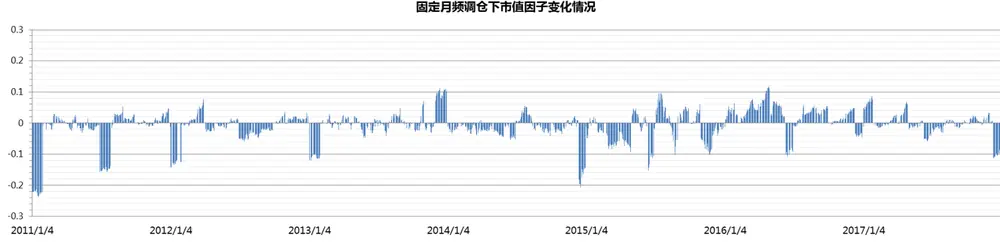
数据来源：东方证券研究所 & wind 资讯

关于第一个问题如何根据市值因子历史敞口来调仓，我们测试了如下几种方法：1.根据过去 n天市值因子暴露绝对值的平均值 2.根据过去n天市值因子暴露的波动 3.过去n天市值因子暴露绝对值连续达到一定阈值。前两种方法受极端值影响较大，所以我们选择的是第三种方法，即过去n天市值因子暴露绝对值连续达到一定阈值我们就在下一个交易日调仓，这种方法可以较好的反映过去一段时间的风险变化情况。另外观测期天数设臵在 3-5天比较理想，时间过短无法判断风险偏离程度，时间过长无法及时捕捉风险。

关于第二个问题如何选择触发调仓的阈值，虽然动态调仓组合的市值因子暴露情况会与图 2不同，但是我们可以从图 2 大体推断出市值因子暴露变化范围，80%多的时间里市值因子暴露的绝对值都在 0.05以下，所以阈值可以在 0.01~0.05 中进行测试。我们测试了过去 3~5天市值因子暴露绝对值连续达到一定阈值，组合触发阈值的次数，结果如图 3 所示。可以看到当阈值设定小于 0.02 时，组合在 2016 年触发阈值次数会达到 100 次以上，平均下来每两个交易日就要调一次仓，如此频繁的调仓对交易水平有很高的要求，而如果阈值设定的过低，触发阈值次数较少，所以综上所述我们把策略设臵为如果市值因子暴露绝对值连续超过 3 天达到 0.03，在下一交易日就进行调仓。

图 3：不同参数设置下，动态调仓组合触发阈值次数统计

| 3天 | 0.01 | 0.02 | 0.03 | 0.04 | 0.05 |
| --- | --- | --- | --- | --- | --- |
| 2011 | 30 | 14 | 4 | 3 | 3 |
| 2012 | 22 | 7 | 4 | 4 | 2 |
| 2013 | 43 | 11 | 5 | 3 | 2 |
| 2014 | 69 | 16 | 7 | 4 | 1 |
| 2015 | 84 | 52 | 31 | 31 | 19 |
| 2016 | 148 | 124 | 67 | 45 | 9 |
| 2017 | 43 | 28 | 12 | 5 | 5 |
| 平均 | 63 | 36 | 19 | 14 | 6 |
| 合计 | 439 | 252 | 130 | 95 | 41 |
| 4天 | 0.01 | 0.02 | 0.03 | 0.04 | 0.05 |
| 2011 | 21 | 7 | 3 | 2 | 2 |
| 2012 | 15 | 8 | 4 | 4 | 1 |
| 2013 | 35 | 9 | 4 | 3 | 2 |
| 2014 | 74 | 42 | 6 | 4 | 1 |
| 2015 | 78 | 48 | 29 | 26 | 14 |
| 2016 | 136 | 111 | 48 | 25 | 6 |
| 2017 | 38 | 20 | 5 | 4 | 4 |
| 平均 | 57 | 35 | 14 | 10 | 4 |
| 合计 | 397 | 245 | 99 | 68 | 30 |
| 5天 | 0.01 | 0.02 | 0.03 | 0.04 | 0.05 |
| 2011 | 30 | 13 | 3 | 2 | 2 |
| 2012 | 16 | 6 | 4 | 3 | 1 |
| 2013 | 33 | 7 | 4 | 2 | 2 |
| 2014 | 61 | 38 | 4 | 3 | 1 |
| 2015 | 60 | 51 | 34 | 18 | 11 |
| 2016 | 130 | 102 | 67 | 53 | 6 |
| 2017 | 54 | 11 | 4 | 4 | 3 |
| 平均 | 55 | 33 | 17 | 12 | 4 |
| 合计 | 384 | 228 | 120 | 85 | 26 |

数据来源：东方证券研究所 & wind 资讯

## 2.3 中证 500 增强组合（成分内）表现对比

我们根据前两节所讲述的方法进行组合回测，分别对比了原始固定月频调仓、固定周频调仓以及动态监控风险调仓的组合表现，结果如下图所示：

图 4：不同调仓频率组合表现对比（不扣费）

|  | 固定月频 | 固定周频 | 动态调仓 |
| --- | --- | --- | --- |
| 对冲收益 | 14.55% | 19.50% | 16.82% |
| 最大回撤 | -5.67% | -5.16% | -3.70% |
| 跟踪误差 | 4.61% | 4.80% | 4.70% |
| 信息比 | 2.97 | 3.73 | 3.33 |
| 单边换手率 | 4.10 | 8.80 | 5.89 |

|  | 分年收益率 |  |  | 分年单边换手率 |  |  |
| --- | --- | --- | --- | --- | --- | --- |
|  | 固定月频 | 固定周频 | 动态调仓 | 固定月频 | 固定周频 | 动态调仓 |
| 2011 | 11.2% | 17.6% | 12.8% | 4.2 | 9.1 | 4.9 |
| 2012 | 14.5% | 15.9% | 14.7% | 4.3 | 8.8 | 4.8 |
| 2013 | 13.3% | 20.2% | 15.2% | 4.2 | 8.7 | 5.2 |
| 2014 | 6.4% | 8.7% | 6.3% | 4.1 | 8.6 | 5.0 |
| 2015 | 18.4% | 24.7% | 24.0% | 3.8 | 8.8 | 7.0 |
| 2016 | 22.1% | 30.4% | 28.6% | 3.7 | 8.3 | 8.7 |
| 2017 | 16.7% | 20.3% | 17.5% | 4.4 | 9.3 | 5.6 |

中证500增强组合（成分内，固定月频，不扣费）
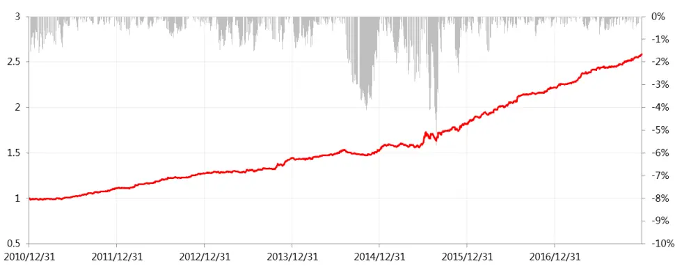

中证500增强组合（成分内，固定周频，不扣费）
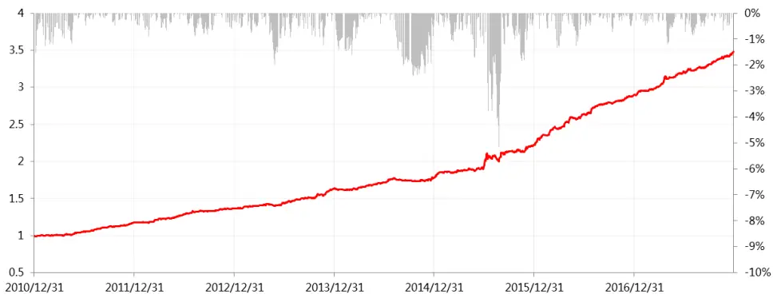

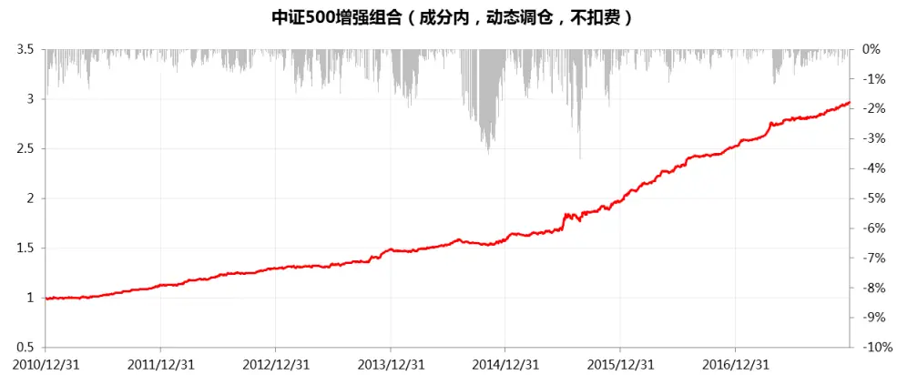
数据来源：东方证券研究所 & wind 资讯

图 5：固定月频 vs动态调仓市值因子变化情况
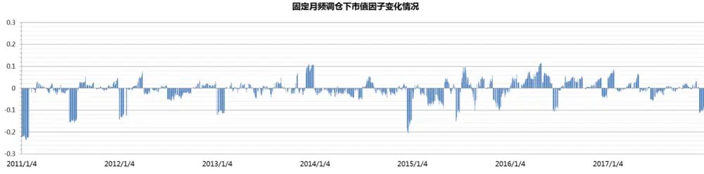

动态调仓下市值因子变化情况
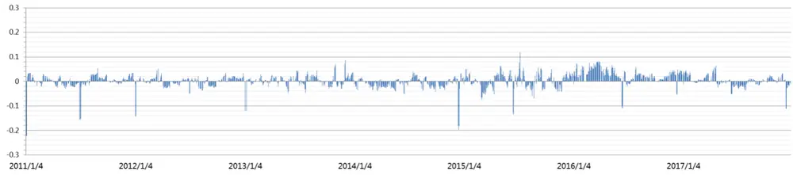
数据来源：东方证券研究所 & wind 资讯

从市值因子暴露变化情况来看，动态调仓组合的市值因子暴露极端值较少，80%以上的因子暴露绝对值小于 0.03。

从组合表现上来看，周频组合的对冲收益是最高的为 19.50%，这得益于周频组合较高的调仓频率，有效的防止了 Alpha 的衰减，动态组合的收益（16.82%）虽然不及周频组合，但是最大回撤只有-3.70%，优于月频（-5.67%）和周频组合（-5.16%），并且换手率平均下来 5.89 倍，比月频组合略高一些，但比周频组合的 8.8 倍小很多。动态组合的信息比也较高为 3.33，我们运用了Oliver Ledoit and Michael Wolf (2008)中介绍的检验信息比的方法，对动态组合以及月频组合的信息比进行了统计检验，结果 p-value为 0.0039，说明动态组合的信息比是显著高于月频组合的。

周频组合的换手率是月频组合的 2 倍多，过高的换手率会带来交易成本的问题，我们在《在Alpha衰退之前》也实证过控制了换手率之后的周频组合也依然显著好于月频组合，另外动态调仓组合虽然平均下来换手率不算很高，但是在某些市场波动比较剧烈的时候换手率比较高，例如 2015年换手率 7.0 倍，2016 年换手率 8.7 倍，所以动态调仓组合也需要加上一定的换手率控制，来应对极端情况下较高的调仓频率。

## 2.4 控制换手率的中证 500 增强组合（成分内）表现对比

如 2.3 节所说，我们对比了控制换手率的组合表现，这可以通过在 2.1 节中的组合优化的限制条件中加入 $\begin{array}{r}{|\mathbf{w}-\mathbf{w}_{0}|\leq\delta\dot{\mathfrak{z}}}\end{array}$ 一步控制换手率，其中 $\mathbf{w}_{0}$ 为调仓时上一期组合里的个股权重， 为调仓的双边换手率上限，这时组合优化问题可以通过辅助变量形式转换成二次规划问题快速求解。我们将两个组合的换手率控制到了和月频组合换手率（4.1 倍）相接近，控制了换手后的动态组合从收益和回撤上面依然优于控制换手后的周频组合。结果如下图所示：

图 6：控制换手率的组合表现对比（不扣费）

|  | 固定周频，控制换手 | 动态调仓，控制换手 |
| --- | --- | --- |
| 对冲收益 | 14.60% | 15.86% |
| 最大回撤 | -5.34% | -4.11% |
| 跟踪误差 | 4.55% | 4.58% |
| 信息比 | 3.02 | 3.24 |
| 单边换手率 | 4.01 | 4.58 |

| 分年收益率固定周频，控制换手动态调仓，控制换手固定周频，控制换手动态调仓，控制换手 |  | 分年收益率 |  |
| --- | --- | --- | --- |
|  |  | 固定周频，控制换手动态调仓，控制换手 | 4.5 3.5 |
| 2011 | 11.5% 11.3% |  |  |
| 2012 | 14.0% 15.2% | 4.1 3.2 |  |
| 2013 | 17.2% 16.3% | 4.3 4.2 |  |
| 2014 | 5.6% 5.6% | 4.0 3.9 |  |
| 2015 | 15.8% 24.0% | 3.4 6.1 |  |
| 2016 | 22.3% 25.4% | 3.8 7.6 |  |
| 2017 16.7% 14.6% |  | 3.9 3.5 |  |

中证500增强组合（成分内，固定周频，控制换手，不扣费）
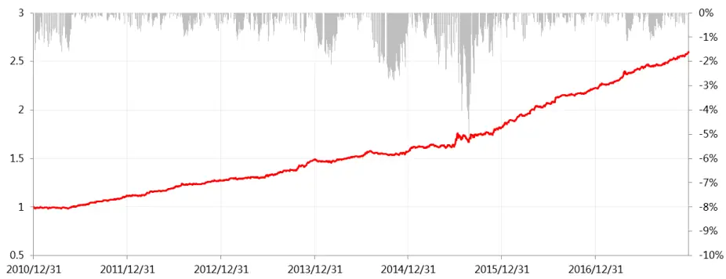

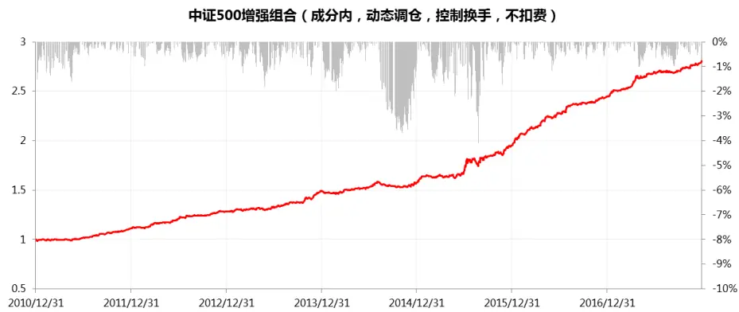
数据来源：东方证券研究所 & wind 资讯

## 三、沪深 300 增强组合（成分内）表现

沪深 300增强组合我们所选用的 Alpha因子和上一章节一致（图 1），值得注意的是沪深 300由于银行和非银行业的股票权重较大，我们采取了分行业建模的方式，具体可以参考《细分行业建模之银行内因子研究》和《细分行业建模之券商内因子研究》。

首先我们还是要设定观测历史天数和市值因子暴露阈值，如下图所示，300 成分内市值因子偏离程度明显比 500 成分内（图 2）好很多，不过阈值为 0.01 的策略下触发阈值频率偏高，所以阈值设臵在 0.02 比较合适，观测天数 3~5 天在阈值为 0.02 的情况下相差不大，我们最后设臵动态调仓交易策略为如果市值因子暴露绝对值连续超过 5天达到 0.02，在下一交易日就进行调仓。

图 7：固定月频调仓下市值因子变化情况
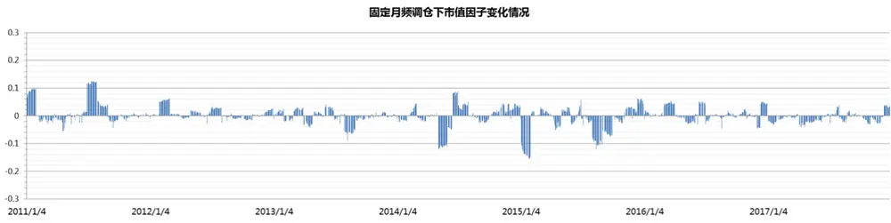
数据来源：东方证券研究所 & wind 资讯

图 8：不同参数设置下，动态调仓组合触发阈值次数统计

| 3天 | 0.01 | 0.02 | 0.03 |
| --- | --- | --- | --- |
| 2011 | 29 | 8 | 4 |
| 2012 | 11 | 4 | 1 |
| 2013 | 33 | 10 | 3 |
| 2014 | 43 | 24 | 7 |
| 2015 | 121 | 39 | 17 |
| 2016 | 31 | 12 | 11 |
| 2017 | 36 | 5 | 1 |
| 平均 | 43 | 15 | 6 |
| 合计 | 304 | 102 | 44 |
| 4天 | 0.01 | 0.02 | 0.03 |
| 2011 | 25 | 2 | 2 |
| 2012 |  |  | 1 |
| 2013 | 11 | 3 |  |
|  | 22 | 19 | 7 |
| 2014 | 43 | 24 | 6 |
| 2015 | 95 | 35 | 10 |
| 2016 | 28 | 17 | 9 |
| 2017 | 32 | 3 | 1 |
| 平均 | 37 | 15 | 5 |
| 合计 | 256 | 103 | 36 |
| 5天 | 0.01 | 0.02 | 0.03 |
| 2011 | 19 | 4 | 3 |
| 2012 | 9 | 3 | 2 |
| 2013 | 24 | 15 | 9 |
| 2014 | 37 | 24 | 3 |
| 2015 | 77 | 40 | 12 |
| 2016 | 25 | 17 | 9 |
| 2017 | 22 | 2 | 1 |
| 平均 | 30 | 15 | 6 |
| 合计 | 213 | 105 | 39 |

数据来源：东方证券研究所 & wind 资讯

在不控制换手率的情况下，动态组合从收益和信息比上都优于固定月频的组合，如果把动态组合的换手率加以控制，可以看到回测结果与固定月频组合相差不大，这主要因为技术类因子在沪深 300 成分内的效用相对较弱，并且我们用的 Alpha 因子中，技术类因子权重较低，所以提升调仓频率不一定能带来显著的收益，从风险角度来看，我们原始的月频组合回撤仅-2.72%，图 7 也能看出月频组合的市值因子暴露极端值情况较少，所以动态组合提升效果不明显。

图 9：沪深 300增强组合表现（不扣费）

| 固定月频 | 动态调仓 | 动态调仓，控制换手 |
| --- | --- | --- |
| 对冲收益 | 14.27% 16.04% | 14.48% |
| 最大回撤 | -2.72% -2.82% | -2.67% |
| 跟踪误差 | 4.24% 4.25% | 4.27% |
| 信息比 | 3.17 3.52 | 3.19 |
| 单边换手率 | 3.84 | 5.20 4.34 |

|  | 分年收益率 |  |  | 分年单边换手率 |  |  |
| --- | --- | --- | --- | --- | --- | --- |
|  | 固定月频 | 动态调仓 | 动态调仓，控制换手 | 固定月频 | 动态调仓 | 动态调仓，控制换手 |
| 2011 | 14.1% | 14.7% | 12.7% | 4.3 | 5.1 | 4.0 |
| 2012 | 12.2% | 13.2% | 13.1% | 3.5 | 4.0 | 3.7 |
| 2013 | 10.0% | 12.3% | 9.9% | 3.8 | 5.1 | 3.8 |
| 2014 | 14.9% | 13.7% | 13.7% | 3.7 | 5.9 | 5.2 |
| 2015 | 24.1% | 31.9% | 27.7% | 3.8 | 6.7 | 5.3 |
| 2016 | 13.7% | 15.3% | 13.6% | 3.6 | 5.3 | 4.5 |
| 2017 | 11.5% | 12.4% | 11.5% | 4.2 | 4.4 | 3.9 |

沪深300增强组合（成分内，固定月频，不扣费）
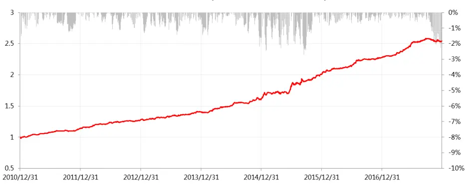

沪深300增强组合（成分内，动态调仓，不扣费）
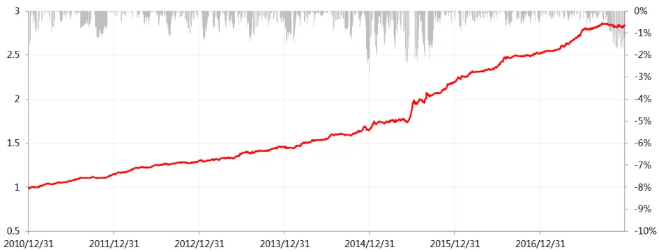

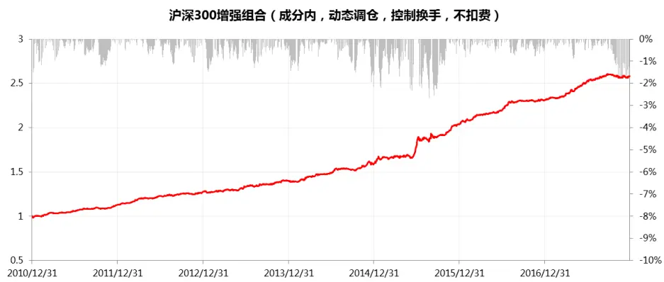
数据来源：东方证券研究所 & wind 资讯

## 四、总结

本篇报告主要提出了一种动态监控风险的调仓策略，即在原有的月频调仓基础上，每日监控市值因子的暴露情况，如果市值因子敞口超过一定阈值，就在下一个交易日调仓，这种做法的换手率比月频组合高，但远小于周频组合，提升调仓频率不仅能防止 Alpha 衰减赚取更高的收益，还能够随时监控风险，降低组合回撤，提升信息比。

我们将该策略应用到中证 500 增强组合（成分内）中，动态组合相对于月频组合信息比得到了显著的提升，回撤也有所下降，就算是控制了换手率动态组合的表现依然好于控制了换手率的周频组合。

## 风险提示

1. 因子有效性基于历史数据分析得到，未来市场可能发生较大的风格转换，建议投资者紧密跟踪因子表现。

2. 极端市场环境可能对因子效果和模型造成剧烈冲击，需进行严格的风险控制。

## 分析师申明

每位负责撰写本研究报告全部或部分内容的研究分析师在此作以下声明：

分析师在本报告中对所提及的证券或发行人发表的任何建议和观点均准确地反映了其个人对该证券或发行人的看法和判断；分析师薪酬的任何组成部分无论是在过去、现在及将来，均与其在本研究报告中所表述的具体建议或观点无任何直接或间接的关系。

## 投资评级和相关定义

报告发布日后的 12个月内的公司的涨跌幅相对同期的上证指数/深证成指的涨跌幅为基准；

## 公司投资评级的量化标准

买入：相对强于市场基准指数收益率 15%以上；

增持：相对强于市场基准指数收益率 5%～15%；

中性：相对于市场基准指数收益率在-5%～+5%之间波动；

减持：相对弱于市场基准指数收益率在-5%以下。

未评级——由于在报告发出之时该股票不在本公司研究覆盖范围内，分析师基于当时对该股票的研究状况，未给予投资评级相关信息。

暂停评级——根据监管制度及本公司相关规定，研究报告发布之时该投资对象可能与本公司存在潜在的利益冲突情形；亦或是研究报告发布当时该股票的价值和价格分析存在重大不确定性，缺乏足够的研究依据支持分析师给出明确投资评级；分析师在上述情况下暂停对该股票给予投资评级等信息，投资者需要注意在此报告发布之前曾给予该股票的投资评级、盈利预测及目标价格等信息不再有效。

## 行业投资评级的量化标准：

看好：相对强于市场基准指数收益率 5%以上；

中性：相对于市场基准指数收益率在-5%～+5%之间波动；

看淡：相对于市场基准指数收益率在-5%以下。

未评级：由于在报告发出之时该行业不在本公司研究覆盖范围内，分析师基于当时对该行业的研究状况，未给予投资评级等相关信息。

暂停评级：由于研究报告发布当时该行业的投资价值分析存在重大不确定性，缺乏足够的研究依据支持分析师给出明确行业投资评级；分析师在上述情况下暂停对该行业给予投资评级信息，投资者需要注意在此报告发布之前曾给予该行业的投资评级信息不再有效。

## 免责声明

本证券研究报告（以下简称“本报告”）由东方证券股份有限公司（以下简称“本公司”）制作及发布。

本报告仅供本公司的客户使用。本公司不会因接收人收到本报告而视其为本公司的当然客户。本报告的全体接收人应当采取必要措施防止本报告被转发给他人。

本报告是基于本公司认为可靠的且目前已公开的信息撰写，本公司力求但不保证该信息的准确性和完整性，客户也不应该认为该信息是准确和完整的。同时，本公司不保证文中观点或陈述不会发生任何变更，在不同时期，本公司可发出与本报告所载资料、意见及推测不一致的证券研究报告。本公司会适时更新我们的研究，但可能会因某些规定而无法做到。除了一些定期出版的证券研究报告之外，绝大多数证券研究报告是在分析师认为适当的时候不定期地发布。

在任何情况下，本报告中的信息或所表述的意见并不构成对任何人的投资建议，也没有考虑到个别客户特殊的投资目标、财务状况或需求。客户应考虑本报告中的任何意见或建议是否符合其特定状况，若有必要应寻求专家意见。本报告所载的资料、工具、意见及推测只提供给客户作参考之用，并非作为或被视为出售或购买证券或其他投资标的的邀请或向人作出邀请。

本报告中提及的投资价格和价值以及这些投资带来的收入可能会波动。过去的表现并不代表未来的表现，未来的回报也无法保证，投资者可能会损失本金。外汇汇率波动有可能对某些投资的价值或价格或来自这一投资的收入产生不良影响。那些涉及期货、期权及其它衍生工具的交易，因其包括重大的市场风险，因此并不适合所有投资者。

在任何情况下，本公司不对任何人因使用本报告中的任何内容所引致的任何损失负任何责任，投资者自主作出投资决策并自行承担投资风险，任何形式的分享证券投资收益或者分担证券投资损失的书面或口头承诺均为无效。

本报告主要以电子版形式分发，间或也会辅以印刷品形式分发，所有报告版权均归本公司所有。未经本公司事先书面协议授权，任何机构或个人不得以任何形式复制、转发或公开传播本报告的全部或部分内容。不得将报告内容作为诉讼、仲裁、传媒所引用之证明或依据，不得用于营利或用于未经允许的其它用途。

经本公司事先书面协议授权刊载或转发的，被授权机构承担相关刊载或者转发责任。不得对本报告进行任何有悖原意的引用、删节和修改。

提示客户及公众投资者慎重使用未经授权刊载或者转发的本公司证券研究报告，慎重使用公众媒体刊载的证券研究报告。

## 东方证券研究所

地址：上海市中山南路 318 号东方国际金融广场 26 楼

联系人： 王骏飞

电话：021-63325888*1131

传真：021-63326786

网址： www.dfzq.com.cn

Email： wangjunfei@orientsec.com.cn