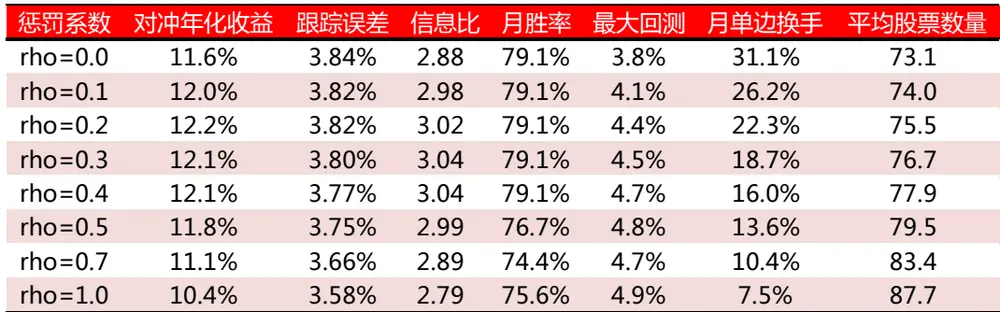
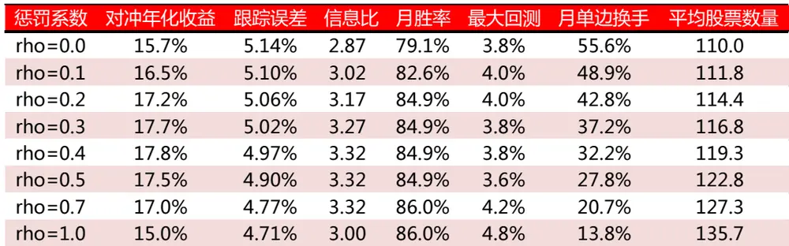
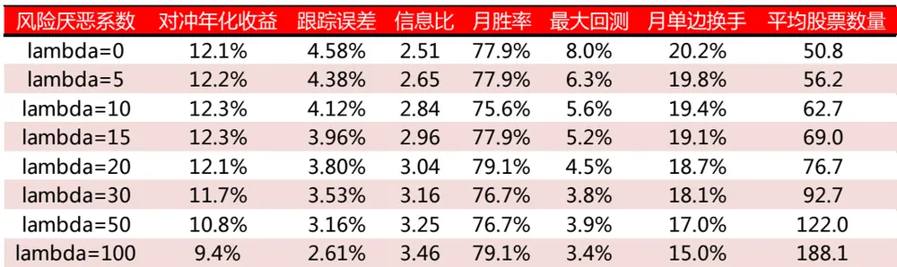
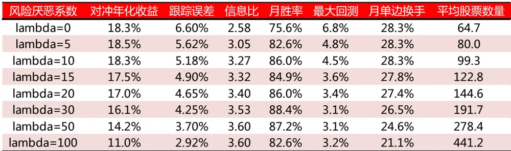
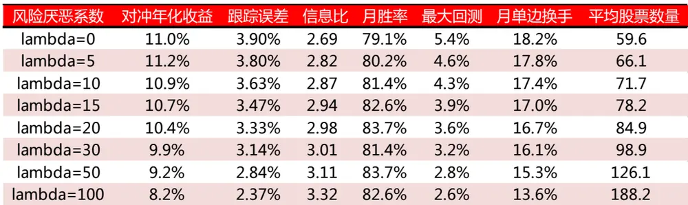
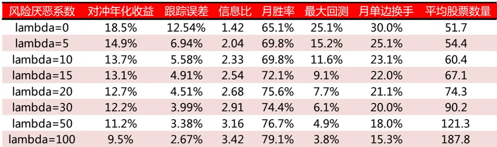
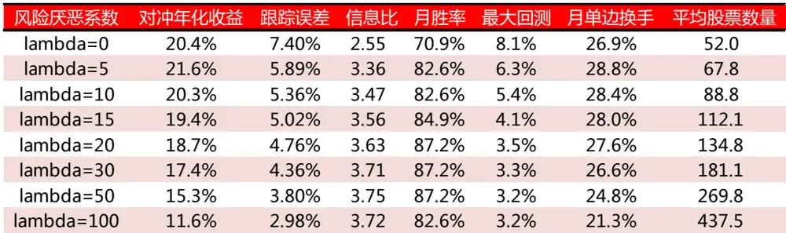
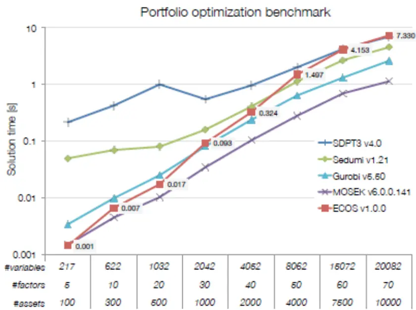
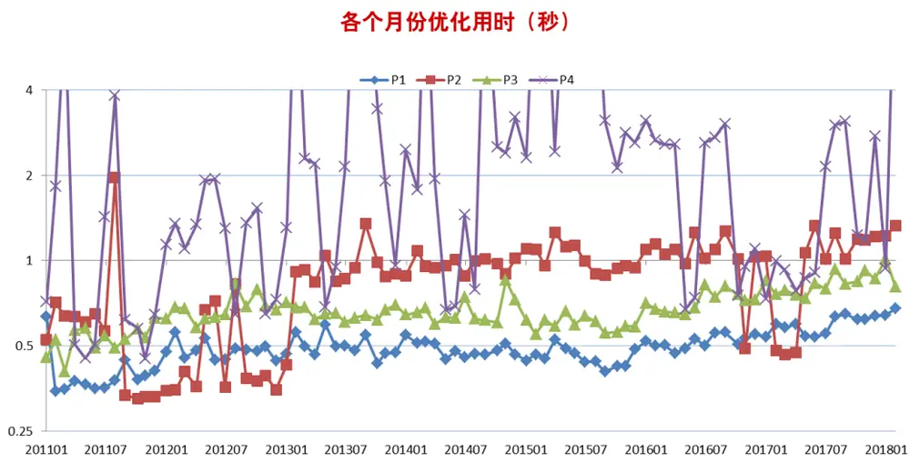
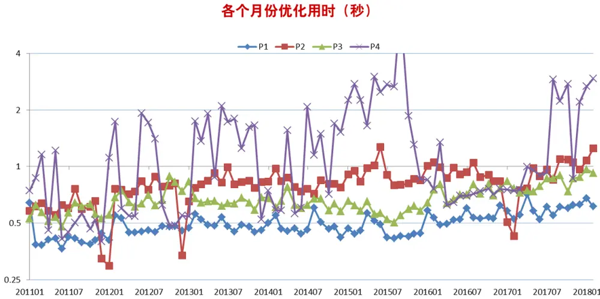

## 研究结论

本文回顾了组合优化的一般框架，讨论了组合优化中相关参数的意义和选择，包括交易成本惩罚与换手约束、风险惩罚系数与跟踪误差约束、权重上下限、风格因子暴露约束、股票数量约束，以及各约束之间的冲突等问题。

不同的风险水平对应着不同的预期收益，可以通过风险厌恶系数或者跟踪误差的调整实现不同的风险或收益水平，但是如果风格因子暴露约束过于严格时，投资者可选的风险、收益范围变窄，此时可以适当放松风格约束。

组合优化的性能除了与算法的收敛速度有关，还与目标函数、约束条件的计算效率有关，通过引入股票协方差的因子化结构，组合方差的计算复杂度从原来的O n2 降低到O nk ，（n为股票数量、k为风险因子数量）,全市场组合优化计算性能提升两个数量级左右。

通过引入股票协方差的因子化结构，利用ECOS求解组合优化问题，对于简单的 QP问题，全市场增强沪深 300和中证 500平均单次优化时间 0.6秒，对于约束较复杂的 SOCP问题，平均单次优化时间 1-3秒，（Intel i5-2400CPU 3.10GHz）。

带股票数量约束的组合优化问题，可以转化为混合布尔型优化问题，利用”Branch-and-Bound”方法求解，但对于股票数量较多的组合优化问题收敛速度太慢，可行性差，为此我们建议采用二步优化法，根据无股票数量约束的优化结果对原问题的可行域进行限制以降低 BB 算法的迭代次数，大幅减少优化时间。

我们在 CVXPY、ECOS 的基础上封装了一个 python版本的组合优化函数，集成了交易成本惩罚、风险惩罚、换手约束、跟踪误差约束、权重上下限约束、风格暴露约束、股票数量约束以及成分股内权重占比约束等常见的组合优化问题，如有需求请与报告联系人或对口销售联系。

## 风险提示

- 量化模型失效风险

- 市场极端环境的冲击

带股票数量约束的全市场沪深300增强优化用时（秒）

| 优化参数 |  | 优化次数 | 均值 | 最小值 | 1/4分位数 | 中位数 | 3/4分位数 | 最大值 |
| --- | --- | --- | --- | --- | --- | --- | --- | --- |
| n1=0.7nmax | niters=100 | 86 | 6.57 | 0.63 | 3.83 | 7.16 | 8.90 | 17.79 |
|  | niters=1000 | 86 | 36.04 | 0.54 | 3.30 | 23.53 | 62.76 | 178.11 |
| n1=0.8nmax | niters=100 | 86 | 4.92 | 0.75 | 2.27 | 3.67 | 7.24 | 19.13 |
|  | niters=1000 | 86 | 17.96 | 0.58 | 1.79 | 2.69 | 11.98 | 157.47 |
| n1=0.9nmax | niters=100 | 86 | 3.23 | 0.48 | 1.16 | 1.72 | 2.37 | 19.21 |
|  | niters=1000 | 86 | 13.23 | 0.44 | 0.95 | 1.22 | 2.02 | 150.01 |

报告发布日期2018 年 03 月 01 日

证券分析师朱剑涛

021-63325888*6077

zhujiantao@orientsec.com.cn

执业证书编号：S0860515060001

王星星

021-63325888-6108

wangxingxing@orientsec.com.cn

执业证书编号：S0860517100001

联系人王星星

021-63325888-6108

wangxingxing@orientsec.com.cn

## 一、关于组合优化

我们在前期报告《组合优化是与非》中对组合优化有过系统介绍，本章在回顾前期报告内容的基础上，主要探讨组合优化的一般框架以及相应参数的意义与选择，内容和前期报告可能有所重复，请投资者知晓。

## 组合优化的一般框架

均值-方差的组合优化框架（Mean-Variance Optimization，MVO）由 Markowitz 于 1952 年提出，至今已有 60 余年历史，虽然也有不少学者提出 MVO 的诸多不足，但目前尚没有比较成熟的、可以替代 MVO 的框架，MVO 也是目前业界普遍使用的组合优化框架，因此，我们采用的组合优化也是以 MVO 为基础。

maximize

$$
x^{T}r-c^{T}|w-w_{0}|-\lambda x^{T}\Sigma x\quad\quad\forall\Sigma\subsetneqq\overline{{\uparrow}}\overline{{\uparrow}}\overline{{\Sigma}}\overline{{\downarrow}}\overline{{\Sigma}}\overline{{\downarrow}}
$$

subj ct to

$$
\pmb{w}=\pmb{w}^{b}+\pmb{x}\qquad\pounds\llap/\lVert\lVert\lVert\pmb{\equiv}\pmb{\chi}\rVert_{\pmb{\mathcal{\bar{A}}}}
$$

$$
x^{T}\Sigma x\leq\sigma^{2}\quad{\underset{\operatorname{\mathbb{L}}}{\operatorname{\mathbb{Q}}}}{\underset{\operatorname{\mathbb{L}}}{\operatorname{\mathbb{Q}}}}{\underset{\operatorname{\mathbb{L}}}{\operatorname{\mathbb{Q}}}}{\big)}{\underset{\operatorname{\mathbb{L}}}{\operatorname{\mathbb{Q}}}}\quad{\overset{\partial}{\geq}}
$$

$$
\begin{array}{rl}{||w-w_{0}||\leq\delta}&{{}\ddag{\underline{{\mu}}}\mp{\underline{{\mu}}}\VDash}\end{array}
$$

$$
w_{min}\leq w\leq w_{max}\quad\mathrm{\#\mathbb{Z}\mathbb{E}\mathbb{Z}\mathrm{\#\mathbb{Z}\mathrm{\#\mathbb{R}\mathbb{Z}\mathrm{\#\mathbb{Z}\mathrm{\#\mathbb{Z}\mathrm{\#\mathbb{Z}\mathrm{\#\mathbb{Z}\mathrm{\#\mathbb{Z}\mathrm{\#\mathbb{Z}\mathrm{\#\mathbb{Z}\mathrm{\#\mathbb{Z}\mathrm{\#\mathbb{Z}\mathrm{\#\mathbb{Z}\mathrm{\#\mathbb{Z}\mathrm{\#\mathbb{Z}\mathrm{\#\mathbb{Z}\mathrm{\mu\mathbb{Z}\mathrm}}}}}}}}}}}}}}}}}
$$

$$
\pmb{f}_{min}\pmb{\Sigma}\pmb{X}_{f}^{T}\pmb{x}\leq\pmb{f}_{max}\quad\forall\forall b\pmb{\Sigma}|\pmb{\Sigma}|\mp\mpb{\Sigma}\equiv c
$$

$$
\begin{array}{rl}{\mathbf{1}^{T}(\boldsymbol{w}>\mathbf{0})\le n_{max}}&{{}\mathbb{H}_{\times}^{\underline{{\pi}}}\underline{{\overline{{\operatorname*{m}}}}}\underline{{\hat{w}}}\chi\equiv\underline{{\zeta}}\underline{{\zeta}}\mathbb{1}\overline{{\jmath}}}\end{array}
$$

上述优化问题是指数增强的组合优化框架，其中 ，w， ${\pmb w}_{\mathbf0}$ $w^{b}$ 分别是样本空间中各股票的目标主动权重向量、目标绝对权重向量、初始权重向量和基准组合的权重向量，当 ${\pmb w}^{b}={\pmb0}$ 且组合国家因子（country factor）暴露等于 1 时，指数增强组合的优化框架退化为一般组合的优化框架。

上述组合优化涉及到四个模块，alpha模型、风险模型、交易成本模型和其他组合约束部分，其中，alpha 模型在组合优化中表现为r，r表示预期收益率或者 alpha 的预测值，风险模型表现为股票的协方差矩阵预测Σ，交易成本模型影响交易成本惩罚项和换手约束的设定。关于组合优化中各个参数的设定我们将逐一讨论。

## 交易成本惩罚与换手约束

交易成本惩罚项和换手约束的设臵和股票交易成本的估计有关，我们在前期报告《资金规模对策略收益的影响》探讨了交易成本的估计问题，构建了幂指数模型来解释股票的冲击成本，为简化我们问题，我们以线性交易成本模型为例介绍交易成本惩罚和换手约束的设臵问题。

关于带交易成本的组合优化问题，Zhou（2014）在《Active Equity Management》中有过简单探讨。假设各个股票的交易成本与权重变化成正比例关系，即由初始权重 ${\bf{\sigma}}_{w_{0}}$ 到目标权重w的调仓过程中交易成本为 ${\pmb{C}}^{T}|{\pmb{w}}-{\pmb{w}}_{0}|$ ，考虑交易成本后，投资者很容易直观的从组合优化目标函数的预期收益项直接减去交易成本（如下），因为交易成本直接损失组合的收益。

$$
x^{T}r-\lambda x^{T}\Sigma xx^{T}r-C^{T}|w-w_{0}|-\lambda x^{T}\Sigma x
$$

但这种做法忽视了组合调仓的长期收益。股票的交易成本属于一次性成本，调仓之后就不存在了，而调仓之后的股票除了在当期能够带来收益，后期仍然会带来收益，而我们的组合优化只考虑了当期收益率。有一个解决方案是采用多期优化模型（Multi-Period Portfolio Optimization），但多期优化模型过于复杂，目前仅存于理论讨论阶段，实际使用起来比较困难。另外一种经验的方法是在交易成本惩罚项乘以一个 0到 1间的惩罚系数 ，以降低交易成本的惩罚。

$$
x^{T}r-\lambda x^{T}\Sigma xx^{T}r-\mathbf{c}^{T}|w-w_{0}|-\lambda x^{T}\Sigma x,c=\rho\cdot C,\mathbf{0}\leq\rho\leq\mathbf{1}
$$

当 = 0时，优化模型不考虑交易成本，当 = 1时不考虑模型后续收益， 的取值跟模型考察的时间尺度有关（日度、周度、月度、季度等），时间尺度越长， 的取值也应该越大，另外 与alpha模型的衰减也有关，衰减比较快的 alpha模型后续收益率较低， 应该取值更高，具体 应该取多少没有解析表达式，可以通过对组合历史表现的回测确定。我们简单测算了月度调仓的全市场增强沪深 300和中证 500组合随着 的不同取值的业绩的变化，模型采用的 alpha模型和组合优化的相关参数见附录， 沪深 300 增强 lambda 取 20，中证 500 增强 lambda 取 15，股票数量不做约束，假设交易成本固定为单边 3‰，回测区间为 20101231-20180214，结果如下。

图 1：交易成本惩罚系数对组合业绩的影响
全市场沪深 300增强：

中证 500 增强：

数据来源：东方证券研究所

比较沪深 300 和中证 500 增强组合随着 从 0 到 1 逐渐增大，月单边换手逐渐变低，两个增强组合的收益和信息比都出现先增大后减小的趋势，沪深 300 组合在 =0.2 时收益最高， =0.4 时信息比最高，中证 500组合在 =0.4时收益最高， =0.6时信息比最高，综合考虑，我们在下文沪深 300增强中 取 0.3，中证 500增强 取 0.5，另外比较有意思的是交易成分惩罚越高，组合平均持股数量越高，由于交易成本较高，组合一旦持有股票，只要预期收益率变动不大，组合将继续持有该股票，导致组合平均持有股票更多。

由于交易成本的估计比较困难，所以有些投资经理会选择直接对组合换手率进行控制，当假设所有股票的交易成本都为相同的常数时，换手率控制和交易成本惩罚两者可以达到类似的效果，所以一般来说，换手率约束和交易成本惩罚两者只需其一即可。对于单期优化，交易成本惩罚项和换手率约束两者存在着一一对应的关系，交易成本惩罚项越大，换手率约束越低。

## 风险厌恶系数与跟踪误差约束

我们在前期报告《组合优化是与非》中对风险厌恶系数的设定有过详细探讨，我们这里只简要介绍其主要结论，关于其详细探讨请参见原报告。

风险厌恶系数反应了投资经理对组合风险的忍受程度，风险厌恶系数越高，得到的组合越保守，跟踪误差越小。在不存在约束的理想情况下，可以通过下式估计，通常情况下指数增强的信息

$$
IR\cdot\sigma_{p}-\lambda\sigma_{p}^{2}\enspace\longrightarrow\enspace\lambda=IR/\big(2\sigma_{p}\big)
$$

比在 2-3之间，那么要求 5%的跟踪误差意味着 lambda取值在 20-30区间，但上式的结果仅限于无约束的理想情形，实际构建组合时会有一些风格因子暴露的约束，实际 lambda的取值应该低于理想值，具体取值可以根据组合历史回测确定，我们简单测试了不同 lambda 取值下全市场增强沪深 300和中证 500两个组合的表现，回测区间为 20101231-20180214，结果如图 2所示。

从结果来看，随着 lambda 取值逐渐变大，增强组合的跟踪误差和最大回撤逐渐变低，相应的组合收益率也变低，但信息比一般随着随着 lambda的提升先快速增加而后的增加速度变慢，另外，随着风险要求越来越高，组合的持股数量也越来越分散以保证足够小的跟踪误差。不同的lambda 取值意味着不同的收益风险取舍，没有好与坏之分，投资者应该根据自己的需求选择适合自己的 lambda。例如我们要求在跟踪误差和最大回撤都不超过 5%的条件下尽可能的追求收益，那么我们沪深 300 组合 lambda 应当取 20，中证 500 组合 lambda 应该取 15。当然，这里 lambda的取值是基于历史回测的结果，这里需要我们假设同样的 lambda在未来也能起到类似的风险控制作用。

与交易成本惩罚和换手约束的关系类似，风险厌恶系数和跟踪误差约束同样发挥着相似的作用，两者一般只取其一即可，在单期优化中，风险厌恶系数和跟踪误差约束存在着一一对应关系，风险厌恶系数越大相当于约束的跟踪误差越小。

图 2：不同风险厌恶系数对组合业绩的影响
沪深 300 增强：

中证 500 增强：

数据来源：东方证券研究所

## 权重上下限和风格因子暴露约束

权重上下限和风格因子暴露约束是对组合风险控制的再次保险，组合的绝对权重的下限一般是零，由于 A 股市场不能做空，上限控制主要是为了防止组合过度集中，这种情况在在 lambda取值较小或者跟踪误差约束较弱的情况下更为重要。单纯依赖协方差矩阵会对协方差矩阵过度依赖，协方差矩阵的估计误差如果较大，风险控制效果也堪忧，为了加强风险的控制，在实际操作过程中我们也会对组合风险因子暴露进行控制，但对哪些因子进行控制，暴露显著在什么水平尚没有定论，经验上我们会控制组合的行业和市值因子的暴露在一个较小的范围内。

一般而言，组合允许的跟踪误差和回撤越大，相应的预期收益率也会更高，选择不同的风险水平可以得到相应的预期回报，但如果对风格因子暴露约束过严，即使选择较小的风险厌恶系数，组合的的跟踪误差和最大回撤也比较小，其相应的收益也较低，因此风险和收益的可选范围也会变小。以不同风格因子暴露约束下的沪深 300 增强为例，如果行业市值完全控制，那么跟踪误差最大也就在 4%左右，收益最大也只能达到 11 左右，如何投资者愿意承受更多的风险来博取收益，那么行业市值完全约束的情形将无法满足需求，相比之下，如果行业市值完全不做约束，那么投资者可选的风险收益范围最广，但这样组合的风险控制将过度依赖协方差矩阵，因此我们更加建议投资者根据自己的风险偏好，对风格因子暴露限制在一个合理的范围内。

图 3：沪深 300不同风格因子暴露约束下的风险收益特征
行业市值完全中性

银行、非银完全中性，其他行业暴露不超过 2%，市值暴露不高于 0.2

| 风险厌恶系数 对冲年化收益 跟踪误差 信息比 月胜率 最大回测 月单边换手 |  |  |  |  |  |  |  |
| --- | --- | --- | --- | --- | --- | --- | --- |
| lambda=0 | 12.1% | 4.58% | 2.51 | 77.9% | 8.0% | 20.2% | 平均股票数量 50.8 |
| lambda=5 | 12.2% | 4.38% | 2.65 | 77.9% | 6.3% | 19.8% | 56.2 |
| lambda=10 | 12.3% | 4.12% | 2.84 | 75.6% | 5.6% | 19.4% | 62.7 |
| lambda=15 | 12.3% | 3.96% | 2.96 | 77.9% | 5.2% | 19.1% | 69.0 |
| lambda=20 | 12.1% | 3.80% | 3.04 | 79.1% | 4.5% | 18.7% | 76.7 |
| lambda=30 | 11.7% | 3.53% | 3.16 | 76.7% | 3.8% | 18.1% | 92.7 |
| lambda=50 | 10.8% | 3.16% | 3.25 | 76.7% | 3.9% | 17.0% | 122.0 |
| lambda=100 | 9.4% | 2.61% | 3.46 | 79.1% | 3.4% | 15.0% | 188.1 |

行业市值不做约束

数据来源：东方证券研究所

图 4：中证 500不同风格因子暴露约束下的风险收益特征
行业市值完全中性

| 风险厌恶系数 对冲年化收益 跟踪误差 信息比 月胜率 最大回测 月单边换手 平均股票数量 |  |  |  |  |  |
| --- | --- | --- | --- | --- | --- |
| lambda=0 | 16.7% | 6.25% | 2.50 75.6% | 9.5% | 28.5% |
| lambda=5 | 16.2% | 5.40% 2.81 | 81.4% | 6.7% 28.0% | 73.7 90.8 |
| lambda=10 | 15.8% | 5.01% 2.95 | 84.9% | 5.8% 27.8% | 113.5 |
| lambda=15 | 15.6% | 4.72% 3.09 | 86.0% | 4.7% | 27.5% 136.8 |
| lambda=20 | 15.0% | 4.48% 3.13 | 86.0% | 4.4% | 27.0% 160.7 |
| lambda=30 | 13.9% | 4.09% 3.20 | 83.7% | 4.2% | 25.9% 209.4 |
| lambda=50 | 12.2% | 3.55% 3.26 | 84.9% | 3.5% | 24.0% 297.1 |
| lambda=100 | 9.2% | 2.79% 3.16 | 79.1% | 2.6% | 20.4% 454.0 |

行业暴露不超过 2%，市值暴露不高于 0.2

行业市值不做约束

数据来源：东方证券研究所

## 股票数量的约束

股票数量的约束跟基金管理的规模和风险要求有关，一般而言，如果管理规模过大，那么股票数量不能过少，因为平均每只股票承载的资金规模有限，股票数量过少会带来较大的冲击成本，另外，如果组合要求很低的跟踪误差，如果股票数量强行限制在较小的范围，那么组合约束可能无法实现，或者为了实现约束可能损失较高的预期收益。实际交易过程中，我们建议投资者先不对股票数量约束进行组合优化考察有多少只股票，股票数量的限制不应比初次优化得到股票数量少太多，以免损失过多的组合附加值。

考察不同股票数量约束下的组合业绩，我们发现在相同的 lambda 下股票数量限制的越少，跟踪误差和回撤越大，而年化收益相差不大，相应的信息比会下降。

图 5：不同股票数量约束下组合业绩表现
沪深 300 增强（lambda=20）：

| 股票数量约束 | 对冲年化收益 | 跟踪误差 | 信息比 | 月胜率 | 最大回测 | 月单边换手 | 平均股票数量 |
| --- | --- | --- | --- | --- | --- | --- | --- |
| 无约束 | 12.1% | 3.80% | 3.04 | 79.1% | 4.5% | 18.7% | 76.7 |
| nmax=70 | 12.1% | 3.82% | 3.00 | 77.9% | 4.6% | 18.8% | 68.4 |
| nmax=60 | 12.1% | 3.86% | 2.99 | 77.9% | 5.0% | 19.0% | 60.7 |
| nmax=50 | 11.8% | 3.93% | 2.85 | 75.6% | 5.6% | 19.4% | 51.3 |

中证 500 增强（lambda=15）：

| 股票数量约束 | 对冲年化收益 | 跟踪误差 | 信息比 | 月胜率 | 最大回测 | 月单边换手 | 平均股票数量 |
| --- | --- | --- | --- | --- | --- | --- | --- |
| 无约束 | 17.5% | 4.90% | 3.32 | 84.9% | 3.6% | 27.8% | 122.8 |
| nmax=100 | 17.6% | 5.00% | 3.27 | 84.9% | 3.6% | 28.0% | 100.0 |
| nmax=80 | 17.7% | 5.11% | 3.22 | 86.0% | 4.3% | 28.4% | 82.4 |
| nmax=60 | 18.2% | 5.34% | 3.16 | 84.9% | 4.5% | 29.4% | 62.6 |

数据来源：东方证券研究所

## 不同约束条件的冲突

需要提醒的是，在设臵组合优化的约束时，需考虑潜在的冲突问题，常见的约束条件冲突包括但不限于如下几种情形：

（1）跟踪误差约束过低，当存在股票数量约束或者换手约束时跟踪误差不可能无限接近于零，当跟踪误差过低时原始问题可能无解，即使有解，组合为了满足约束条件也可能损失了过多的预期收益。

（2）股票数量约束与权重上限、跟踪误差的冲突，当权重上限设臵过低，股票数量不可能太少，个股权重不高于 1%，但要求持股数量少于 100 只是不可能的。跟踪误差的情况类似，如果组合要求跟踪误差太小，那么股票数量太少也不可能实现。

（3）停牌股的影响，由于停牌股的权重不能交易，停牌股的存在可能直接导致约束条件没法满足，一种常见的情形是，初始权重中某个小行业只有一只股票且停牌，但由于该股票前期表现较好，此时其权重已经超过基准中该行业的权重，如果优化是要求行业市值完全中性，那么此时约束条件将无法满足。

为了避免约束条件冲突的问题，一种可能的解决方法是将跟踪误差约束和换手约束转换为目标函数的惩罚项，优化时暂不考虑停牌股，仅对交易部分进行优化，具体怎么处理跟投资者的偏好有关。

## 二、组合优化的计算性能

第一章中的一般优化问题随着不同参数或约束的组合将退化成不同的优化问题，如果存在股票数量约束则是一个混合整形优化（MIP, Mixed Integer Programming）问题，否则是一个凸优化（CO, Convex Optimization）问题，如果约束条件没有二次项（即跟踪误差约束），则原问题是一个二次优化（QP, Quadratic Problems）问题，否则是个二阶锥规划（SOCP, Second-Order ConeProgramming）问题，当然，二次优化 $\mathsf{QP}$ 也可以通过引入辅助变量的方法转换为二阶锥规划 SOCP问题，但是对于大规模优化问题， $\mathsf{QP}$ 有更高效的数值算法。关于各种优化问题的数值算法我们在前期报告《组合优化是与非》中有过简单介绍，对于 $\mathsf{QP}$ 和 ${\tt SOCP}$ 都有比较高效的内点解算法，混合整形优化 MIP 可以通过”Branch-and-Bound”方法求解。

## 股票协方差结构的影响

不同算法的计算复杂度和收敛速度差异很大，合理的算法实现对计算速度影响很大。但无论哪一种算法都避免不了对原始目标函数和约束条件的反复迭代，因此组合优化中的目标函数和约束的计算效率也尤其重要。组合优化的目标函数和不等于约束大多都是简单的一维向量乘法，计算复杂度为O n ，其中 n 为股票数量，计算复杂度较高的为组合方差的计算 $\mathbf{w}^{\mathrm{T}}\cdot\boldsymbol{\Sigma}\cdot\mathbf{w}$ ，计算复杂度为$0(n^{2})$ ，在结构化因子模型的假设下 $\Sigma=\mathrm{X_{f}.F\cdot X_{f}^{T}+D}$ ，组合方差的计算可以分为两步进行，首先计算组合的风险因子暴露 $\mathrm{f}=\mathrm{X}_{\mathrm{f}}^{\mathrm{T}}\cdot\mathrm{w}$ ，计算复杂度为O nk ，k 为风险因子数量，其次，分别组合的因子风险部分 $\cdot\mathbf{f}^{\mathrm{T}}$ 和残差风险部分 $\mathbf{\nabla}\cdot\mathbf{w}^{\mathrm{T}}\cdot\mathbf{D}\cdot\mathbf{w}$ ，前者计算复杂度为O 2 ，后者由于 是对角阵，所以计算复杂度为O n ，综上分析，在引入结构化风险模型之后，组合风险的计算复杂将为$0(\mathrm{nk})+0(k^{2})+0(n)=0(\mathrm{nk})$ ，速度提升 $\mathsf{n}/\mathsf{k}$ ，全市场三千多只股票优化时速度提升近 2 个数量级，我们利用 python 的 numpy 进行矩阵运算，直接根据股票协方差矩阵计算分析和根据结构化因子分布计算两者分别用时 6.45ms 和 43.9us（n=3438，k=40，Intel i5-2400 CPU 3.10GHz），和理论相差倍数接近。

$$
\begin{array}{rl}{risk=w^{T}\cdot\Sigma\cdot\mathbf{w}}&{\xrightarrow{\Sigma=X_{f}.F\cdot X_{f}^{T}+D}\quad\left\{\begin{array}{ll}{\begin{array}{rl}{f=X_{f}^{T}\cdot w}&{\mathrm{~i~f~}}\\{risk=f^{T}\cdot F\cdot f+w^{T}\cdot\mathbb{D}\cdot\mathbf{w}}&{\mathrm{~i~f~}}\end{array}}\end{array}\right.}\end{array}
$$

我们利用借助 python 的 cvxpy 调用了 ECOS 和 SCS 两个开源优化器测算了两种不同的协方差矩阵矩阵传递方式的性能差异，分别测算了如下 3个组合优化问题：

maximize

$$
x^{T}r-c|w-w_{0}|-\lambda x^{T}\Sigma x
$$

subj ct to

$$
\begin{array}{rl}&{w=w^{b}+x\quad\quad\ldots\left(\mathrm{c1}\right)}\\&{\quad\quad x^{T}\Sigma x\leq\sigma^{2}\quad\ldots\ldots\left(\mathrm{c2}\right)}\\&{\quad\quad\left|\left|w-w_{0}\right|\right|\leq\delta\quad\ldots\ldots\left(\mathrm{c3}\right)}\\&{\quad w_{min}\leq w\leq w_{max}\quad\ldots\ldots\left(\mathrm{c4}\right)}\\&{\quad\quad f_{min}\leq X_{f}^{T}x\leq f_{max}\quad\ldots\ldots\left(\mathrm{c5}\right)}\end{array}
$$

P1: 取消跟踪误差约束 $\mathtt{c2}$ 、取消换手约束 $^{\mathtt{c3}}$ ，换手惩罚项 $c{=}0$ ，风险厌恶系数 $\lambda{=}15$

P2: 取消换手约束 c3，换手惩罚项c=0，风险厌恶系数λ=0，

P3: 取消跟踪误差约束 c2、取消换手约束 c3，换手惩罚项 $c{=}0.03^{\star}0.3.$ , 风险厌恶系数 $\lambda{=}15$

P4: 换手惩罚项c=0，风险厌恶系数λ=0，换手约束δ = ，跟踪误差约束 $\sigma=3\%$

对某一期全市场增强沪深 300（n=3438，k=40）的结果如下（T 表示直接传递 $\mathsf{n}^{\star}\mathsf{n}$ 的协方差矩阵，S 表示直接传入协方差矩阵的结构，Intel i5-2400 CPU 3.10GHz，默认精度）：

图 6：不同协方差传递方式的优化时间（秒）

|  | P1_ECOS 1090.58 | P1_SCS 231.74 | P2_ECOS 1387.56 | P2_SCS 1943.67 | P3_ECOS 1253.96 | P3_SCS 51.71 | P4_ECOS 1314.19 | P4_SCS 350.93 |
| --- | --- | --- | --- | --- | --- | --- | --- | --- |
| T S | 0.75 | 1.80 | 1.80 | 3.20 | 0.97 | 2.56 | 0.98 | 12.11 |
| T/S | 1456.83 | 128.65 | 772.44 | 606.69 | 1296.51 | 20.19 | 1336.80 | 28.97 |

其中，T 表示直接传入 n*n 的协方差矩阵，S 表示直接传入协方差矩阵的结构
数据来源：东方证券研究所

在此我们先对 ECOS 和 SCS 做简单介绍，ECOS（Embedded Conic Solver）定位嵌入式的凸优化器，采用内点法求解，单线程计算、由于定位嵌入式所以没有采用较占空间的 Intel MKL 进行矩阵运算，另外对于二次优化 QP，ECOS没有专门实现其快速收敛的算法，而是将 $\mathsf{QP}$ 问题转换为 SOCP 问题求解。SCS (Splitting Conic Solver)是大规模凸优化设计的开源凸优化器，该优化器最大的特点是的将原始问题分裂成若干子块，然后并行优化。用 Python解凸优化问题还有一个使用较多的开源优化器 CVXOPT，计算性能和稳定性都较高，针对二次优化 $\mathsf{QP}$ 有专门的算法实现，但我们没有找到比较合适的直接传递协方差结构的方法，故我们没有做比较。

根据以上的测试结果，我们惊讶的发现，通过传入协方差的结构，ECOS和 SCS均有十分显著的优化性能提升，ECOS 大约可以提升 3个数量级，而 SCS 大约可以提升 2个数量级。通过协方差计算复杂度的分析，协方差计算的性能提升仅有 2 个数量级，因此我们估计在协方差传递方式发生变化后 ECOS 自身算法的复杂度也所降低。对比 ECOS 和 SCS 性能，我们发现在协方差结构后以上 4 个优化问题，ECOS 的求解速度更快，而且 ECOS 的计算精度更高，在采用结构化模型的条件我们更加建议采用 ECOS 求解组合优化。需要提醒的是，如果股票协方差矩阵没有做因子化分解，ECOS 的计算效率较低，对于 3000多只股票的 QP和 SOCP大概都需要 20分钟左右（Intel i5-2400 CPU 3.10GHz），而同样的情况下 python 的 CVXOPT 求解 $\mathsf{QP}$ 和 SOCP 大概只需要 30秒和 7分钟。

在 ECOS 的技术论文（Domahidi，2013）中，作者也测试了不同优化器对单线程求解如下简单组合优化的速度，

$$
\begin{array}{rl}{max}&{\mu^{T}x-\gamma(x^{T}\Sigma x),~\Sigma=FF^{T}+D}\\&{}\\{max}&{\mu^{T}x-\gamma(x^{T}\Sigma x)}\end{array}
$$

对比不同优化器的求解速度，对于股票数量低于 4000 的组合优化问题，ECOS 的单线程优化速度并不比商用优化器 MOSEK 和 Gurobi要慢很多，MOSEK 和 Gurobi的优点在于其实现了优化的并行算法，通过并行可能进一步大幅提高计算性能，而 ECOS 并没有并行的实现。

图 7：不同优化器组合优化速度比较

Fig. 1. Timing results for portfolio problem (17) on a MacBook Pro with Intel Core i7 2.6 GHz CPU.
数据来源：Domahid（2013），东方证券研究所

由于上述测试只涉及某一期的组合优化，而组合优化受股票数量、约束条件等因素的影响，为了考察组合优化效率的稳定性，我们考察了全市场增强沪深 300 和中证 500 组合在上述 4 种不同参数组合下的优化效率，从结果来看，虽然各个月份优化时间会有不同，但总体性能依然较好，P1、P2、P3 的平均优化时间均在 1 秒以内，P2 一般会比 P1 慢，P4 一般会比 P2 慢。

图 8：不同参数组合下沪深 300全市场增强优化性能

有关分析师的申明，见本报告最后部分。其他重要信息披露见分析师申明之后部分，或请与您的投资代表联系。并请阅读本证券研究报告最后一页的免责申明。

不同参数组合优化用时的统计特征（秒）

| 优化次数 均值 最小值 1/4分位数 中位数 3/4分位数 |  |  |  |  |  |  |  |
| --- | --- | --- | --- | --- | --- | --- | --- |
| P1 | 86 | 0.49 | 0.35 | 0.45 | 0.49 | 0.54 | 最大值 0.68 |
| P2 | 86 | 0.87 | 0.32 | 0.63 | 0.94 | 1.06 | 1.96 |
| P3 | 86 | 0.67 | 0.41 | 0.61 | 0.65 | 0.73 | 1.01 |
| P4 | 86 | 3.24 | 0.45 | 0.91 | 1.86 | 2.81 | 14.63 |

数据来源：东方证券研究所

图 9：不同参数组合下中证 500全市场增强优化性能

不同参数组合优化用时的统计特征（秒）

| 优化次数 均值 最小值 1/4分位数 中位数 3/4分位数 |  |  |  |  |  |  | 最大值 |
| --- | --- | --- | --- | --- | --- | --- | --- |
| P1 | 86 | 0.50 | 0.37 | 0.44 | 0.48 | 0.54 | 0.71 |
| P2 | 86 | 0.81 | 0.30 | 0.75 | 0.83 | 0.91 | 1.27 |
| P3 | 86 | 0.67 | 0.48 | 0.61 | 0.65 | 0.74 | 0.96 |
| P4 | 86 | 1.31 | 0.40 | 0.63 | 0.91 | 1.73 | 7.03 |

数据来源：东方证券研究所

## 股票数量约束的处理

对于股票数量约束，可以通过引入布尔变量的方法转为为混合整型优化（MIP, Mixed IntegerProgramming），更准确的说是混合布尔型凸优化（Mixed Boolean-convex problem），具体方法如下式所示，我们在前期报告《组合优化是与非》中也有详细说明，

$$
{\bf1}^{T}(w>0)\leq n_{max}\ \longrightarrow\ 0\leq w\leq\eta,\eta\in Bool,{\bf1}^{T}(\eta>0)\leq n_{max}
$$

对于混合布尔型凸优化可以采用” Branch-and-Bound”方法求解，BB 方法的核心是可行域的

拆分方法和目标函数最优值  上下限的估计算法 $\big(\ \Phi_{lb},\Phi_{ub}\ \big)$ ，对于下列优化问题

$$
\begin{array}{ll}{minimize}&{\ f_{0}(x,z)}\\{subject\ to}&{\ f_{i}(x,z)\leq0,\qquad i=1,\dots,\mathrm{m}}\end{array}
$$

$$
z_{j}\in\{0,\ 1\},\ j=1,\ldots,n
$$

求解步骤如下：

（1）估算初始可行域 $\mathcal{Q}_{init}$ 内  的下限 $\mathrm{L}_{1}=\Phi_{lb}(\mathcal{Q}_{init})$ 和上限 $\mathrm{U}_{1}=\Phi_{ub}(\mathcal{Q}_{init})$ 如果 $\mathrm{U}_{1}-\mathrm{L}_{1}<\varepsilon$ ，终止计算

（2）将初始可行 $\pm\hat{\boldsymbol{\chi}}Q_{init}$ 拆分为两个可行域 和 ， $\mathcal{Q}_{init}=\mathcal{Q}_{1}\cup\mathcal{Q}_{2}$ 2

（3） 在子可行域中计算该可行域内最优目标函数的的上下限 $\Phi_{lb}(\boldsymbol{Q}_{i})$ $\Phi_{ub}(\mathcal{Q}_{i})$ ，i=1,2

（4） 计算全局最优值  的上下限，

下限 $.L_{2}=min\big(\Phi_{lb}(\mathcal{Q}_{1}),\Phi_{lb}(\mathcal{Q}_{2})\big)$

下限 ${\cal I}_{2}=min\big(\Phi_{ub}(\mathcal{Q}_{1}),\Phi_{ub}(\mathcal{Q}_{2})\big)$

如果 $\mathrm{U}_{2}-\mathrm{L}_{2}<\varepsilon$ ，终止计算

如果 $\mathrm{L}_{i}>\mathrm{U}_{1}$ ，舍弃可行域 $\mathcal{Q}_{\mathrm{i}}$

（5） 拆分 $\cdot\mathcal{Q}_{1}$ 或者 $\mathcal{Q}_{2}$ ，重复步骤（3）和步骤（4）

BB 算法的核心在于目标函数最优值上下限的算法 $\langle\Phi_{lb},\Phi_{ub}\rangle$ ，以及可行域拆分的规则（拆分哪个子可行域，从哪个节点拆分等），目标函数最优值上下限影响算法是否终止的阈值条件，而拆分的规则决定了算法收敛的速度。目标函数最优值的下限可以通过凸松弛（Convex Relaxation），即将布尔型约束 ∈ ，放松至 0 到 1 的连续约束 $0<\mathfrak{n}<1$ ，将原问题转换为非凸问题求解；目标函数上限主要通过对布尔变量取一组特例实现，拆分时一般优先拆分下限最小的子可行域。对于组合优化问题，理论上讲可以为其设计特定的上下限算法和可行域拆分规则，但是需要自己实现一套高效算法，开发难度相对较大。幸运的是 Han Wang2015年在 ECOS 的基础上封装了针对一般混合整形优化问题 MIP 的 Branch-and-Bound 算法，但直接调用 BB 算法求解组合优化问题特别是全市场增强组合的组合优化问题不具有可行性，因为上述优化问题的节点 过多，对于 3000 只股票的全市场优化，上述优化问题 n=3000，在我们的个人电脑上迭代一个小时不一定能找到可行解，更不用说最优解。一个可行的方案就是提前对原始可行域进行限制，以减少算法迭代次数，具体做法如下：

（1） 假设股票数量没有约束，求解组合优化，得到绝对权重向量 $w_{1}$ ，

（2）对股票数量不过 $n_{max}$ 的原始可行域进行限制

选股空间为 $w_{1}$ 中有权重（>1e-6），数量为 $n_{1}$

强制保留 $w_{1}$ 中各行业最大权重股以及其他权重靠前的股票，数量为 $n_{2},n_{2}\leq nmax$

（3） 在第（2）步限制后的可行域内运用 BB 算法求解最优权重，设臵最大迭代次数 niters，超过迭代次数返回截止目前的最优解。

通过上述处理，将混合整形优化 MIP 中的布尔型变量数量由样本空间股票总数 n，降低至$n_{1}-n_{2}$ ，通过这种简化处理虽然不一定能得到最优值，但大幅减小计算量。关于其中的两个参数 $\scriptstyle n_{2}$ 和 niters，理论上讲，如果 MIP 能够解出最优解， $n_{2}$ 越小越好，但如果算法达到最大迭代次数提前终止的话， $n_{2}$ 的取值越小越容易提前终止，此时优化的可靠性将降低。对于n 较大的情形，上述优化问题一般都会提前终止，所以我们建议 $n_{2}$ 取值较高，比如的 0.8倍、0.9倍，下文我们测算了$n_{2}$ 取 $\boldsymbol{n_{max}}$ 的 0.7 倍、0.8 倍、0.9 倍，niters=100,1000，3*2 共六种组合下的优化时间和组合表现，沪深 300增强约束股票在 60只以内，中证 500增强约束股票数量在 100只以内。

图 10：不同优化参数设置下的 MIP优化性能
全市场沪深 300增强优化用时（秒）

| 优化参数 |  | 优化次数 | 均值 | 最小值 | 1/4分位数 | 中位数 | 3/4分位数 | 最大值 |
| --- | --- | --- | --- | --- | --- | --- | --- | --- |
| n1=0.7nmax | niters=100 | 86 | 6.57 | 0.63 | 3.83 | 7.16 | 8.90 | 17.79 |
|  | niters=1000 | 86 | 36.04 | 0.54 | 3.30 | 23.53 | 62.76 | 178.11 |
| n1=0.8nmax | niters=100 | 86 | 4.92 | 0.75 | 2.27 | 3.67 | 7.24 | 19.13 |
|  | niters=1000 | 86 | 17.96 | 0.58 | 1.79 | 2.69 | 11.98 | 157.47 |
| n1=0.9nmax | niters=100 | 86 | 3.23 | 0.48 | 1.16 | 1.72 | 2.37 | 19.21 |
|  | niters=1000 | 86 | 13.23 | 0.44 | 0.95 | 1.22 | 2.02 | 150.01 |

全市场中证 500增强优化用时（秒）

| 优化参数 |  | 优化次数 | 均值 | 最小值 | 1/4分位数 | 中位数 | 3/4分位数 | 最大值 |
| --- | --- | --- | --- | --- | --- | --- | --- | --- |
| n1=0.7nmax | niters=100 | 86 | 4.92 | 0.44 | 0.81 | 1.31 | 9.36 | 18.63 |
|  | niters=1000 | 86 | 33.82 | 0.46 | 0.71 | 1.02 | 80.81 | 179.39 |
| n1=0.8nmax | niters=100 | 86 | 4.18 | 0.44 | 0.75 | 1.16 | 7.01 | 18.38 |
|  | niters=1000 | 86 | 26.20 | 0.44 | 0.75 | 1.04 | 21.94 | 149.12 |
| n1=0.9nmax | niters=100 | 86 | 2.71 | 0.45 | 0.59 | 0.76 | 1.42 | 16.74 |
|  | niters=1000 | 86 | 17.50 | 0.50 | 0.77 | 0.97 | 2.28 | 137.73 |

数据来源：东方证券研究所

分析不同参数设臵下的 MIP 组合优化性能，我们有如下两点发现

（1） n1 取值越小平均优化时间越长，主要是因子 n1 取值越小，BB 算法提前终止的概率越大，平均迭代次数越多；

（2）niter 迭代次数决定了最长的 MIP 优化用时，当 niter 提升一个数量级，优化用时的最大值也提升一个数量级。

对比发现，不同优化参数设臵对指数增强组合业绩表现的影响很小，沪深 300和中证 500增强的不同优化参数下的年化对冲收益相差均在 0.2%以内，跟踪误差相差均在 0.3%以内，信息比相差也较小，这主要是因为组合的权重主要集中在前面较大的股票上，这些股票才是组合业绩的决定因素，不同的优化参数主要影响比较边缘的小权重股票。当然，不同优化参数下的组合业绩跟限制的股票数量有关，如果股票数量限制的过少，不同优化参数下的差异会变大。最后，我们认为，股票数量约束下的组合优化只需要在可行域下找到一个相对可靠的可行解即可，完全没有必要为了追求全局的最优解浪费大量的优化时间。

图 11：不同优化参数设置下的业绩表现
全市场沪深 300 增强

| 优化参数 |  | 对冲年化收益 | 跟踪误差 | 信息比 | 月胜率 | 最大回测 | 月单边换手 | 平均股票数量 |
| --- | --- | --- | --- | --- | --- | --- | --- | --- |
| 无股票数量约束 |  | 12.1% | 3.80% | 3.04 | 79.1% | 4.5% | 18.7% | 76.7 |
| n1=0.7nmax | niters=100 | 12.1% | 3.89% | 2.96 | 76.7% | 5.0% | 20.1% | 61.2 |
|  | niters=1000 | 12.2% | 3.88% | 2.99 | 77.9% | 5.1% | 19.2% | 61.6 |
| n1=0.8nmax | niters=100 | 12.2% | 3.87% | 2.99 | 77.9% | 5.1% | 19.2% | 61.1 |
|  | niters=1000 | 12.3% | 3.87% | 3.02 | 79.1% | 4.8% | 19.0% | 61.3 |
| n1=0.9nmax | niters=100 | 12.2% | 3.86% | 3.01 | 77.9% | 4.7% | 19.1% | 60.6 |
|  | niters=1000 | 12.1% | 3.86% | 2.99 | 77.9% | 5.0% | 19.0% | 60.7 |

全市场中证 500增强

| 优化参数 |  | 对冲年化收益 | 跟踪误差 | 信息比 | 月胜率 | 最大回测 | 月单边换手 | 平均股票数量 |
| --- | --- | --- | --- | --- | --- | --- | --- | --- |
| 无股票数量约束 |  | 17.5% | 4.90% | 3.32 | 84.9% | 3.6% | 27.8% | 122.8 |
| n1=0.7nmax | niters=100 | 17.7% | 5.01% | 3.27 | 84.9% | 3.6% | 28.2% | 100.4 |
|  | niters=1000 | 17.6% | 5.01% | 3.26 | 84.9% | 3.6% | 28.2% | 100.3 |
| n1=0.8nmax | niters=100 | 17.5% | 4.98% | 3.27 | 84.9% | 3.5% | 28.1% | 100.2 |
|  | niters=1000 | 17.6% | 4.98% | 3.28 | 84.9% | 3.6% | 28.1% | 100.2 |
| n1=0.9nmax | niters=100 | 17.6% | 5.00% | 3.27 | 84.9% | 3.6% | 28.0% | 100.0 |
|  | niters=1000 | 17.6% | 5.01% | 3.27 | 84.9% | 3.7% | 28.0% | 100.0 |

数据来源：东方证券研究所

另外，需要提醒的是我们在前期报告《组合优化是与非》中提到组合优化得到的权重结果有很多小量，而在本篇报告的研究中并没有发现这个问题，经检查发现这主要是优化函数精度的影响。上篇报告中组合优化我们采用的优化函数的默认精度是 10^-8，该精度为对偶优化问题的精度，对于一般的组合优化问题，10^-8 的默认精度下原问题实际可达到的精度过低，离最优解有一定差距，这就会导致组合中出现很多小权重的股票，以全市场增强沪深 300的一期优化为例，10^-8的默认精度下，优化结果小于 0.1%权重的股票总权重为 30%，而将精度调整为 10^-10 后，小于 0.1%权重的股票总权重下降为 9.6%。本期报告的优化我们基于 python 实现，主要使用 ECOS 优化器，原问题的目标函数精度和边界约束精度均为 10^-7，故没有出现大量股票权重小量的问题。

## 三、总结

本文回顾了组合优化的一般框架，讨论了组合优化中相关参数的意义和选择，包括交易成本惩罚与换手约束、风险惩罚系数与跟踪误差约束、权重上下限、风格因子暴露约束、股票数量约束，以及各约束之间的冲突等问题。

不同的风险水平对应着不同的预期收益，可以通过风险厌恶系数或者跟踪误差的调整实现不同的风险或收益水平，但是如果风格因子暴露约束过于严格时，投资者可选的风险、收益范围变窄，此时可以适当放松风格约束。

组合优化的性能除了与算法的收敛速度有关，还与目标函数、约束条件的计算效率有关，通过引入股票协方差的因子化结构，组合方差的计算复杂度从原来的 O(n^2 )降低到 O(nk)，（n为股票数量、k为风险因子数量）,全市场组合优化计算性能提升两个数量级左右。

通过引入股票协方差的因子化结构，利用 ECOS 求解组合优化问题，对于简单的 QP 问题，全市场增强沪深 300和中证 500平均单次优化时间 0.6秒，对于约束较复杂的 SOCP问题，平均单次优化时间 1-3 秒，（Intel i5-2400 CPU 3.10GHz）。

带股票数量约束的组合优化问题，可以转化为混合布尔型优化问题，利用”Branch-and-Bound”方法求解，但对于股票数量较多的组合优化问题收敛速度太慢，可行性差，为此我们建议采用二步优化法，根据无股票数量约束的优化结果对原问题的可行域进行限制以降低 BB 算法的迭代次数，大幅减少优化时间。

我们在 CVXPY、ECOS 的基础上封装了一个 python版本的组合优化函数，集成了交易成本惩罚、风险惩罚、换手约束、跟踪误差约束、权重上下限约束、风格暴露约束、股票数量约束以及成分股内权重占比约束等常见的组合优化问题，如有需求请与报告联系人或对口销售联系。

## 风险提示

1. 量化模型基于历史数据分析得到，未来存在失效的风险，建议投资者紧密跟踪模型表现。

2. 极端市场环境可能对模型效果造成剧烈冲击，导致收益亏损。

## 参考文献

[1]. CVXPY 0.4.11 documentation.

[2]. Domahidi, Alexander, Eric Chu, and Stephen Boyd. "ECOS: An SOCP solver for embedded systems." Control Conference (ECC), 2013 European. IEEE, 2013.

[3]. Domahidi, Alexander. Methods and tools for embedded optimization and control. ETH Zurich, 2013.

[4]. O’Donoghue, Brendan, et al. "Conic optimization via operator splitting and homogeneous self-dual embedding." Journal of Optimization Theory and Applications 169.3 (2016): 1042-1068.

## 附录：指数增强模型说明

本文涉及全市场增强沪深 300和全市场增强中证 500两个指数增强模型。两个 alpha模型均采用银行、非银分别建模的方法，具体方法参见前期报告《细分行业建模值银行内因子研究》和《细分行业建模值券商内因子研究》，非金融部分采用采用大类等权的方法构建，大类内部因子等权构建大类因子，大类间等权构建 ZSCORE，其中沪深 300增强采用估值、成长、盈利、流动性、投机性、分析师预期和公司治理 7 个大类因子，中证 500 采用除盈利之外的 6 个大类因子，各大类因子详细定义见下表。

图 12：各大类 alpha 因子介绍

| 大类 | 因子 | 定义 | 序 |
| --- | --- | --- | --- |
| 估值 Value | BP | 股东权益(不含少数股东)/总市值 | 1 |
|  | EP | 扣非后的净利润TTM/总市值 | 1 |
|  | CFP | 经营性现金流TTM/总市值 | 1 |
|  | EBIT2EV | 息税前利润与企业价值之比 | 1 |
|  | DP | 股息率，公司分红金额与总市值之比 | 1 |
| 成长 Growth | PROFIT_GROWTH_YOY | 归属母公司的净利润季度同比 | 1 |
|  | SALES_GROWTH_YOY | 营业收入季度同比 | 1 |
|  | UP | 预期外的RNOA，详见报告《预期外的盈利能力》 | 1 |
| 盈利能力 Profitability | RNOA | 净经营资产收益率 | 1 |
|  | CFROI | 投资现金收益率 | 1 |
|  | GPOA | 总资产毛利率 | 1 |
| 流动性 Liquidity | LNTO | 过去20个交易日日均换手率对数 | -1 |
|  | LNILLIQ | 20日Amihud非流动性的自然对数 | 1 |
| 投机性 Lottery | IVOL | 过去20个交易日计算的FF三因子特质波动率 | -1 |
| 分析师预期 | IVR | 过去20个交易日计算的特异度 | -1 |
|  | COV | 过去3个月覆盖的机构数量，取根号处理 | 1 |
|  | DISP | 过去3个月分析师盈利预测的分歧度 | -1 |
|  | EP_FY1 | FY1一致预期净利润/总市值 | 1 |
|  | PEG | FY1一致预期净利润/FY2隐含增长率 | -1 |
|  | SCORE | 一致预期评级 | 1 |
|  | TPER | 目标价隐含收益率 | 1 |
|  | WFR | 加权盈余调整 | 1 |
| 公司治理 Governance | MR | 高管薪酬前三之和的对数 | 1 |

数据来源：东方证券研究所

关于指数增强模型还有如下几点需要说明：

（1）选股样本空间为同期中证全指成分股；

（2） 模型月度调仓，回测区间 20101231-20180214；

（3） 沪深 300 指数增强风险厌恶系数 lambda=20，交易成本惩罚 = ，中证500指数增强风险厌恶系数 lambda=15，交易成本惩罚 = ；

（4） 银行和银行行业完全中性，其他行业权重偏差不高于 2%，市值暴露不高于 0.2；

（5）个股超额权重不超过 2%和指数权重一半的较大值；

（6）历史回测交易成本单边 3‰。

## 分析师申明

每位负责撰写本研究报告全部或部分内容的研究分析师在此作以下声明：

分析师在本报告中对所提及的证券或发行人发表的任何建议和观点均准确地反映了其个人对该证券或发行人的看法和判断；分析师薪酬的任何组成部分无论是在过去、现在及将来，均与其在本研究报告中所表述的具体建议或观点无任何直接或间接的关系。

## 投资评级和相关定义

报告发布日后的 12个月内的公司的涨跌幅相对同期的上证指数/深证成指的涨跌幅为基准；

## 公司投资评级的量化标准

买入：相对强于市场基准指数收益率 15%以上；

增持：相对强于市场基准指数收益率 5%～15%；

中性：相对于市场基准指数收益率在-5%～+5%之间波动；

减持：相对弱于市场基准指数收益率在-5%以下。

未评级——由于在报告发出之时该股票不在本公司研究覆盖范围内，分析师基于当时对该股票的研究状况，未给予投资评级相关信息。

暂停评级——根据监管制度及本公司相关规定，研究报告发布之时该投资对象可能与本公司存在潜在的利益冲突情形；亦或是研究报告发布当时该股票的价值和价格分析存在重大不确定性，缺乏足够的研究依据支持分析师给出明确投资评级；分析师在上述情况下暂停对该股票给予投资评级等信息，投资者需要注意在此报告发布之前曾给予该股票的投资评级、盈利预测及目标价格等信息不再有效。

## 行业投资评级的量化标准：

看好：相对强于市场基准指数收益率 5%以上；

中性：相对于市场基准指数收益率在-5%～+5%之间波动；

看淡：相对于市场基准指数收益率在-5%以下。

未评级：由于在报告发出之时该行业不在本公司研究覆盖范围内，分析师基于当时对该行业的研究状况，未给予投资评级等相关信息。

暂停评级：由于研究报告发布当时该行业的投资价值分析存在重大不确定性，缺乏足够的研究依据支持分析师给出明确行业投资评级；分析师在上述情况下暂停对该行业给予投资评级信息，投资者需要注意在此报告发布之前曾给予该行业的投资评级信息不再有效。

## 免责声明

本证券研究报告（以下简称“本报告”）由东方证券股份有限公司（以下简称“本公司”）制作及发布。

本报告仅供本公司的客户使用。本公司不会因接收人收到本报告而视其为本公司的当然客户。本报告的全体接收人应当采取必要措施防止本报告被转发给他人。

本报告是基于本公司认为可靠的且目前已公开的信息撰写，本公司力求但不保证该信息的准确性和完整性，客户也不应该认为该信息是准确和完整的。同时，本公司不保证文中观点或陈述不会发生任何变更，在不同时期，本公司可发出与本报告所载资料、意见及推测不一致的证券研究报告。本公司会适时更新我们的研究，但可能会因某些规定而无法做到。除了一些定期出版的证券研究报告之外，绝大多数证券研究报告是在分析师认为适当的时候不定期地发布。

在任何情况下，本报告中的信息或所表述的意见并不构成对任何人的投资建议，也没有考虑到个别客户特殊的投资目标、财务状况或需求。客户应考虑本报告中的任何意见或建议是否符合其特定状况，若有必要应寻求专家意见。本报告所载的资料、工具、意见及推测只提供给客户作参考之用，并非作为或被视为出售或购买证券或其他投资标的的邀请或向人作出邀请。

本报告中提及的投资价格和价值以及这些投资带来的收入可能会波动。过去的表现并不代表未来的表现，未来的回报也无法保证，投资者可能会损失本金。外汇汇率波动有可能对某些投资的价值或价格或来自这一投资的收入产生不良影响。那些涉及期货、期权及其它衍生工具的交易，因其包括重大的市场风险，因此并不适合所有投资者。

在任何情况下，本公司不对任何人因使用本报告中的任何内容所引致的任何损失负任何责任，投资者自主作出投资决策并自行承担投资风险，任何形式的分享证券投资收益或者分担证券投资损失的书面或口头承诺均为无效。

本报告主要以电子版形式分发，间或也会辅以印刷品形式分发，所有报告版权均归本公司所有。未经本公司事先书面协议授权，任何机构或个人不得以任何形式复制、转发或公开传播本报告的全部或部分内容。不得将报告内容作为诉讼、仲裁、传媒所引用之证明或依据，不得用于营利或用于未经允许的其它用途。

经本公司事先书面协议授权刊载或转发的，被授权机构承担相关刊载或者转发责任。不得对本报告进行任何有悖原意的引用、删节和修改。

提示客户及公众投资者慎重使用未经授权刊载或者转发的本公司证券研究报告，慎重使用公众媒体刊载的证券研究报告。

## 东方证券研究所

地址：上海市中山南路 318 号东方国际金融广场 26 楼

联系人： 王骏飞

电话：021-63325888*1131

传真：021-63326786

网址： www.dfzq.com.cn

Email： wangjunfei@orientsec.com.cn