## 研究结论

全球主要股票市场的大小盘风格差异较大。美国市场在上世纪八十年代前小市值股票溢价明显，但最近十年大小盘表现基本持平；欧洲市场近些年的大小盘风格也不显著，日本市场从 09 年开始小盘股持续走强，而其它亚太地区则是长期大盘股强势。

市值效应在 A 股全市场和中证 500 成份股内都很强，在沪深 300 成份股内较弱，2007-2011年间沪深 300内相对较小的股票还有明显溢价，但从 2011年开始基本上消失。行业因素对小市值溢价有影响，但绝大部分行业内部市值效应也非常明显。

上市公司的规模大小可以通过账面价值或市面价值度量。历史上看，账面净资产小的公司在 A股也可以获得溢价，但幅度要比小市值公司的溢价幅度少很多。可能的原因是净资产与股票估值的负相关性要比市值强，小公司的高估值会抵消掉部分溢价。

我们借用屈源育（2016）的“壳含量”指标来度量 A股壳效应的大小，发现壳含量高的股票在A股可以获得长期溢价。壳含量和公司市值大小高度相关，但两者贡献的 alpha 收益并不重叠，通过横截面回归的方式剔除壳价值对市值的影响后，市值效应依然很显著。壳效应影响最直接的是市值最小的那组股票，但没有对 A股造成全局影响。

- 同行业看，最近十年小股票的盈利能力和总体质量相对大股票而言在不断改善，但还是大股票占优，所以当市场回归基本面，考察公司质量时，质量因素会和小盘股溢价发生冲突。

过去十一年市值因子收益率累计达到 121.7%，通过绩效归因分析发现其中基本面因素能解释的部分很少，行业因素总共贡献了 19.5%；行业内股票质量因素贡献了 -3%，剩余部分不能解释的收益很可能与市场整体的投机氛围有关。我们可以通过市场波动率、PPI、经济政策不确定性指数来预测这部分不能解释的剩余收益，回归方程的调整R方可以达到 15%，波动率的预测作用最为显著。

## 风险提示

- 量化模型失效风险

- 市场极端环境的冲击

报告发布日期2018 年 03 月 04 日

证券分析师朱剑涛

021-63325888*6077

zhujiantao@orientsec.com.cn

执业证书编号：S0860515060001

相关报告

| 组合优化的若干问题 | 2018-03-01 |
| --- | --- |
| 基于风险监控的动态调仓策略 | 2018-02-22 |
| 反转因子择时研究 | 2018-02-21 |
| 港股简史与现状 | 2018-01-22 |
| 分析师研报的数据特征与 alpha | 2017-12-03 |
| 风险模型在时间序列上的改进 | 2017-12-01 |
| 细分行业建模之券商内因子研究 | 2017-10-26 |
| 质优股量化投资 | 2017-08-31 |

## 一、 全球市场市值效应对比

市值效应，或者说小盘股溢价效应，最早由 Banz(1981)在美国市场发现，随着 Fama-French三因子定价模型的推广，逐渐称为权益市场资产定价理论的核心定价因子，也是 A 股过去十年收益贡献最大的一类因子。不过 A 股去年市场风格切换剧烈，市值风格偏小的投资者损失惨重，小市值溢价的收益来源是哪些值得研究。

首先，我们在全球范围内比较一下各个主要股票市场的市值效应差异（图 1）。

亚太(日本除外)
图 1：全球范围内的市值效应（小市值相对大市值股票超额收益的累计净值）
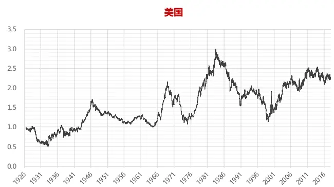

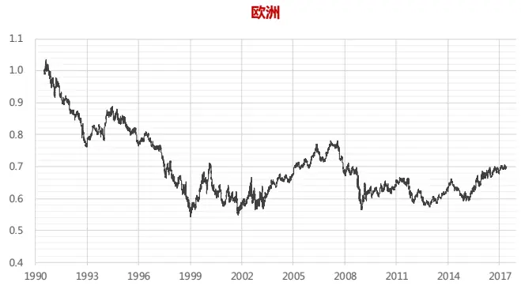

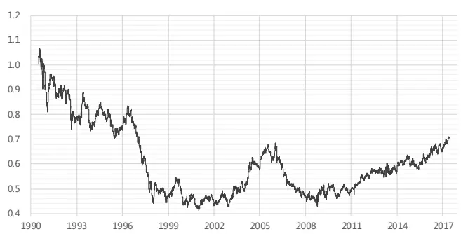

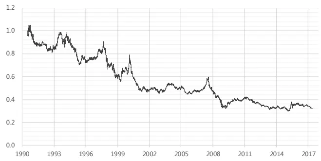

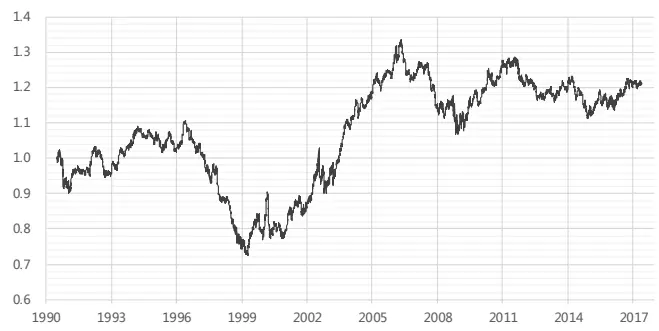
数据来源：东方证券研究所整理

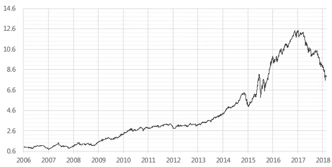

市值效应的大小可以用小盘股相对大盘股的超额收益来衡量，学术上最常用的做法是计算SMB（Small minus Big）组合收益率，它可以近似看作做多全市场市值最小的 50%股票，同时做空另外市值最大的 50%股票的多空组合收益率，股票组合按市值加权（标准做法里，还会对估值因子做一定的中性化处理）。

上图是基于 Fama-French 三因子模型创始人之一 Kenneth R. French 个人网页上下载得到的SMB 组合收益率数据构建的累积净值曲线。可以看到，美国市场 1984年前近 60年时间里，小市值溢价整体比较明显，SMB 组合的年化复合收益率有 1.7%，但之后十五年市场风格陡然切换，Schwert(2003) 认为这和该时间段内机构指数化投资的兴起有很大关系，小盘股的流动性较差，很容易被新成立基金买成高价†，降低未来收益；而机构的指数化产品里，偏大盘股的占比高，对大盘股上涨有持续资金支持。小盘股直到 1999 年才开始恢复强势。市值效应在最近十年明显变弱，2004年初至 2017年底，SMB 组合年化复合收益仅 0.6%。

欧洲和亚太地区的数据从 1990 年开始，和美国市场同步，1999 年前这两个市场也是大盘股行情，但之后市场出现分化，欧洲市场没有显著的市值效应，而日本市场从 2009年起，市值效应明显，SMB组合年化复合收益达到 4.4%；亚太地区其它成熟市场，包括香港、澳大利亚、新西兰、新加坡，则整体上仍然维持了大盘股风格，SMB 收益率持续为负。

和这些成熟市场相比，A股市值效应带来的收益则要丰厚而且稳定得多，SMB组合2006.01.01– 2016.12.31 间复合年化收益高达 26.5%，算上最近一年的大跌，截至 2018.02.26，仍有 19.2%

Fama-French 三因子模型的影响力让市值因子在资产定价领域获得了核心地位，但如上图所示市值效应随时间和地域的变化极其剧烈，长期看远不如估值（HML）和动量因子（WML）稳定（参考图 2）.因此越来越多的人开始质疑市值作为定价因子的可靠性。

图 2：美国市场主要定价因子的长期历史表现
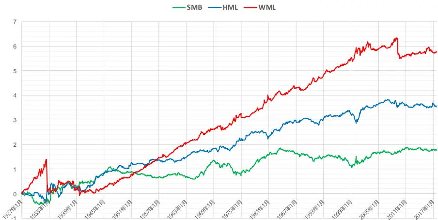
数据来源：东方证券研究所整理

除了不稳定外，市值效应还有两个比较大的问题。一个是市值效应分布不均匀，主要集中在小股票里面，中盘、大盘股票里不明显。Horowitz(2000) 发现如果剔除市值在五百万美元以下的股票，1963- 1997 年间，美国市场市值效应将不再显著；Fama-French(2008)在美国市场的研究也表明，1963-2005 年间，如果用回归系数绝对值大小作为度量，市值最小的 20%股票里的市值效应是其它股票的五倍；Asness(2015)，发现如果控制了常见市场定价因子后，市值因子的 alpha在不同市值分组的股票中无单调规律可循。假如市值效应只是集中在某一个小股票池里，那么用它来作为一个全市场定价因子就不太合适。

另外一个问题是美国市场市值效应的日历现象，小市值溢价几乎都集中在每年的一月份，剔除掉一月后，市值效应将不再显著（图 3）。对比来看，A股则没有明显的日历现象，而且其它市场也没有这种现象，这似乎是美国市场特有的。而且如 Crain(2011)所示，1982年后美国市场的市值效应已经很弱了，但一月份的市值效应依然很强。这种日历现象目前还没有很好的解释，但不论怎样，市值效应在月份分布上如此不均，很难让人信服的长期把它作为一个定价因子。

图 3：美国市场市值效应的日历现象
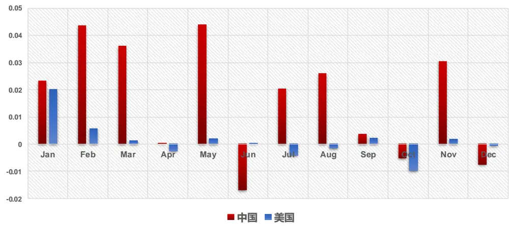
数据来源：东方证券研究所整理

## 二、 A 股的市值效应大小

## 2.1 不同指数成份股的差别

在做指数增强和量化对冲时，为了控制策略跟踪误差和最大回撤，一般都会把市值当作风险因子进行控制；但事实上从过去十年的历史表现看，市值绝对是 A 股里一个合格且优秀的 alpha 因子。图 4-图 6 按照标准的 alpha 因子测试方法对总市值因子分别在全市场（剔除上市不到半年和下个月停牌天数太多的股票）、沪深 300 和中证 500 成分股内的表现进行了历史回溯测试。图 4左上方红色柱状图代表全市场股票按市值从小到大等量分成十组后，每组股票等权组合相对全市场等权组合的平均月度超额收益。中间的柱状图表示市值最小 10%股票组合相对市值最大 10%组合的超额收益；最下方的曲线图是对超额收益累积得到的净值曲线，为了避免基数过大导致看不清涨跌幅，这里取了对数，阴影部分代表净值曲线的最大回撤。在测试沪深 300 和中证 500 时，股票数量较少，市值分组数量将为 5.

图 4：总市值因子在全市场的历史表现（2006.01.01 – 2018.02.26）
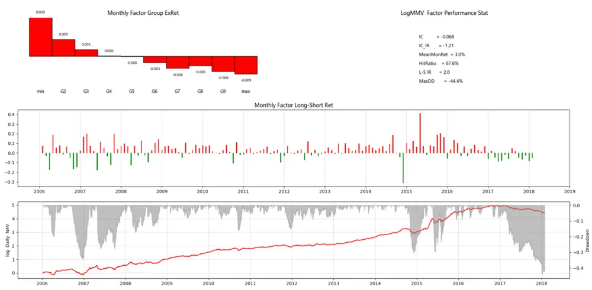
数据来源：Wind 资讯 & 东方证券研究所

图 5：总市值因子在沪深 300 成份股的历史表现(2006.01.01 – 2018.02.26)
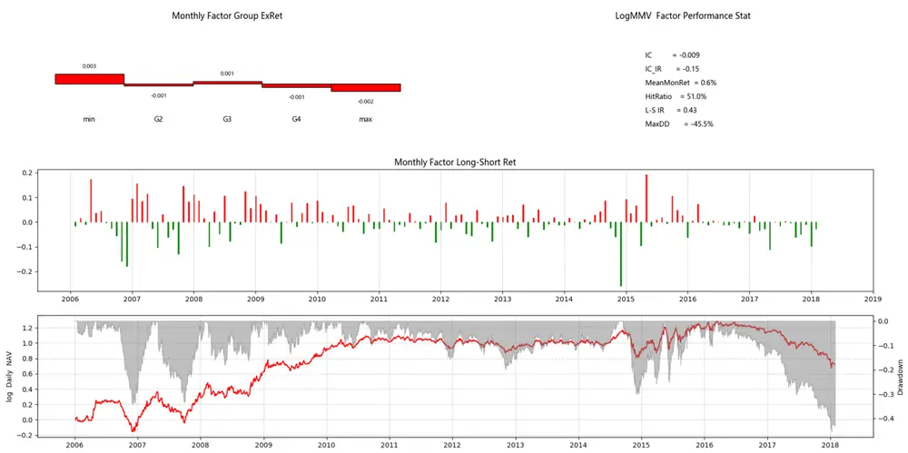
数据来源：Wind 资讯 & 东方证券研究所

图 6：总市值因子在中证 500 成份股的历史表现 ( 2007.01.01 – 2018.02.26)
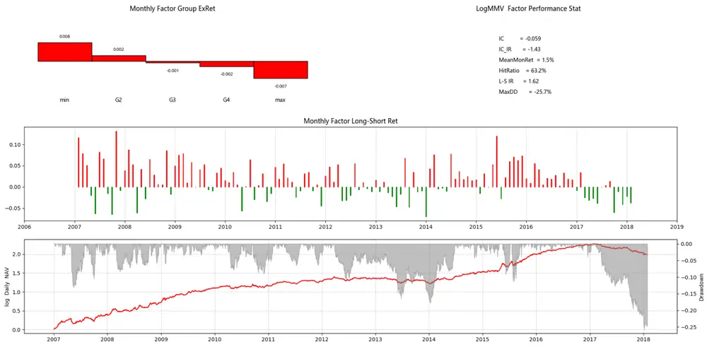
数据来源：Wind 资讯 & 东方证券研究所

从上图可以看到，全市场来看，市值因子的 IC 可以达到-0.07，非常之高，市值最小的 10%股票比最大的 10%股票每个月平均跑赢 3%，但稳定性较差，IC_IR 只有 1.25；中证 500 成分内市值效应也很强，IC接近 -0.06，但是因为中证 500成份股的差异度（dispersion）没有全市场那么大，因子收益只有全市场的一半。对比来看沪深 300 成分内，2007-2011 四年间还有较明显的市值效应，但从 2011年开始基本上就消失了；沪深 300成份内大市值股票从 2016年年中开始就表现出强势，而全市场和中证 500成分内，大盘股的相对优势从 2007年初才开始确立。

## 2.2 不同行业内的差别

在中信一级行业内部，我们也进行了测试，用行业内市值最小 30%的股票减去市值最大的 30%股票构建等权多空组合，其表现如图 7、图 8所示。除了银行、非银和机械三个行业外，其它行业内部都有非常强的市值效应，以综合、通信、基础化工、传媒、建材最为明显。之前有说法认为 A股传统周期行业内股票市值偏大，而新兴行业市值偏小，过去几年市场对成长风格的偏好造成了小市值溢价。但从图 7 和图 8 可以明显看到，行业对市值效应只贡献了一部分，行业内部仍有非常强的市值效应。

图 7：不同行业内的市值效应（行业内市值最小 30%股票 – 最大 30%股票， 多空组合对数净值曲线）
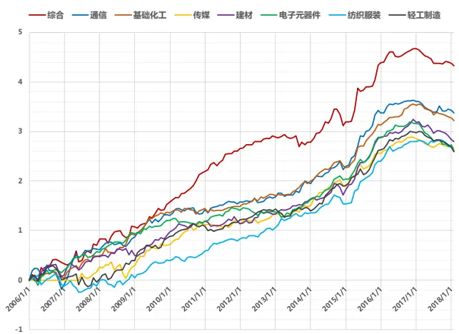

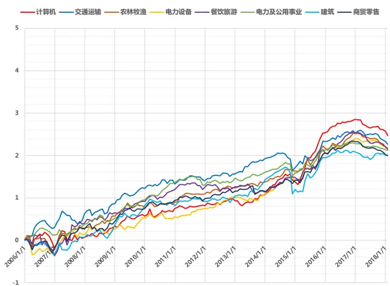

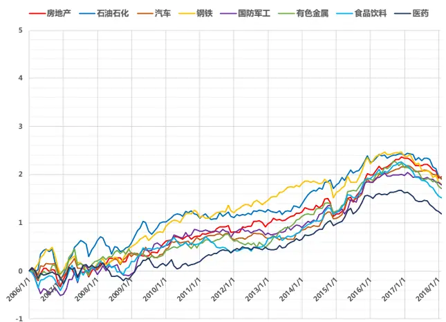
数据来源：Wind 资讯 & 东方证券研究所

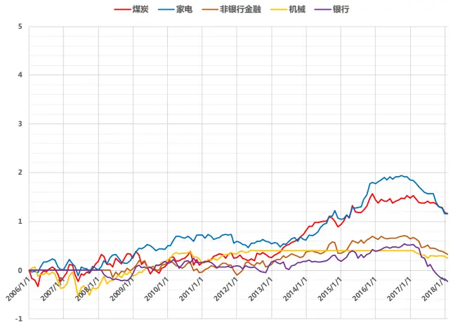

图 8：不同行业内市值多空组合（30%小市值 – 30%大市值）表现
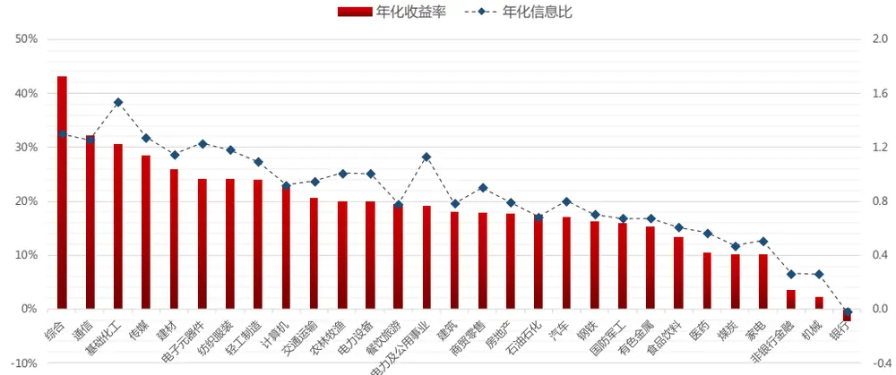
数据来源：Wind 资讯 & 东方证券研究所

## 2.3 小市值溢价还是小公司溢价？

上市公司的规模大小，有两种评判标准，一种是账面上的，像：净资产、营业收入等，另一种是市面上的，例如总市值。两者正相关，相差了一个市场估值作为倍数，那么 A 股给小市值公司这么高的溢价是否是因为上市公司本身很小，账面价值低呢？我们以公司净资产为例做了测试，结果如图 6所示，可以看到，净资产小的公司过去十二年里也是有稳定溢价的，但是因子只有 -0.02，多空组合月收益只有 -1.4%，溢价幅度要比市值因子小很多。把净资产换成营业收入的话，效果会差一些。这点与美国市场不同，Berk(1997)实证发现如果用非价格指标度量上市公司大小的话，“公司小”和“未来收益高”之间并无关联。

图 9：净资产因子在全市场的历史表现 ( 2006.01.01 – 2018.02.26)
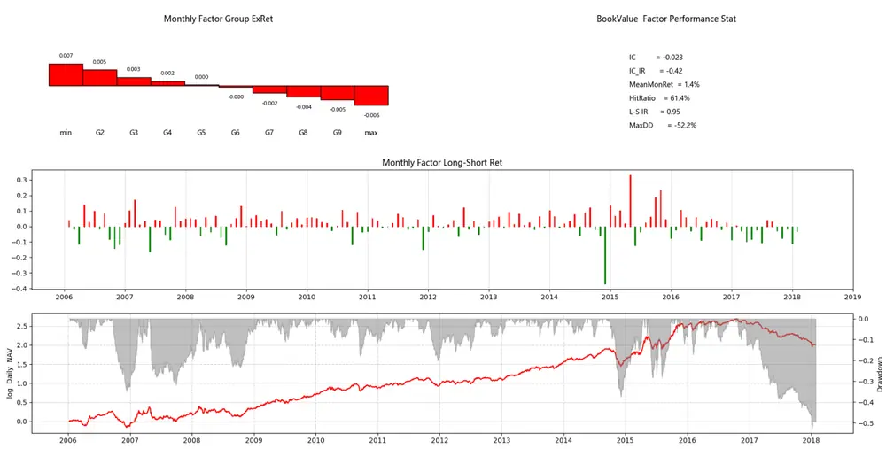
数据来源：Wind 资讯 & 东方证券研究所

图 10：因子间横截面相关系数随时间的变化
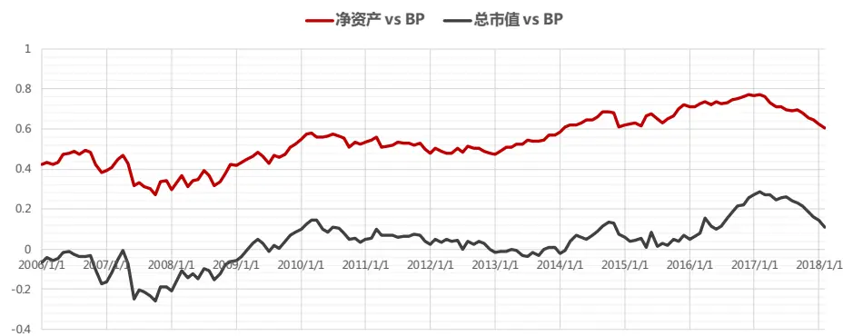
数据来源：Wind 资讯 & 东方证券研究所

账面价值小的公司没有太多市场溢价的原因之一可能是它们的高估值，如果在每个月横截面上计算净资产和 BP 的相关系数，平均有 0.54，相关性非常高，也就是说公司规模越小，BP 越小，反过来 PB 估值越高，而且这个相关系数从 08 年起开始爬升，表明市场给小公司的估值溢价在提升。对比来看，市值和估值在全市场范围的相关性则没有那么强，虽然 2014年后明显提升，但历史平均来看仅 0.03，也就是说小公司也有非常多估值低、不被市场认可的股票；不过在同行业内，小市值股票估值还是明显更高。所以过去十年长期来看，A股小公司有估值溢价，但小市值公司则不一定，而 A股的低估值股票有明显溢价，一定程度上抵消了小公司的溢价水平。

## 2.4 市值效应和壳效应的差别

A 股的 IPO 管制导致上市公司的上市资格产生壳溢价，借壳前后二级市场的巨幅超额收益又让壳公司和疑似壳公司受到市场追捧，而市值小、基本面差、有退市风险的公司最容易被借壳，因此壳效应对市值效应有一定的收益贡献，也有观点把市值效应等同于壳效应。本节将对两者的区别和影响做定量分析。

屈源育（2016a, 2016b）对壳价值的度量和影响因素做了细致的实证研究，我们这里直接引用他们的实证结果。

首先，他们手动整理除了 2007年到 2015年间 257 个借壳上市样本，借壳上市的界定标准和证监会的规定略有差异（具体参考原文，Wind客户端整理的同期借壳上市样本只有 100 多个）。

其次，上市公司壳价值定义为非上市公司借壳上市需支付的成本减去上市获得的收益。成本包括：非上市公司股权的稀释、存量股份转让交易成本；收益包括：通过借壳获取的上市公司部分非经营性资产和现金对价。257个借壳样本的平均壳价值在 40亿左右。

市值是影响壳价值的最核心因素，两者间的关系非线性，通过样本数据回归得到下式：

$$
\ln(\mathrm{SV})=-10.508+4.814*\ln(\mathrm{MktCap})-0.304*\ln(\mathrm{MktCap})^{2}-0.542*SOE+\epsilon
$$

其中 SV 代表壳价值，MktCap 代表市值, SOE 表示上市公司是否是国企。式子右边前三项是一个二次函数，在市值接近 30 亿时，上市公司壳价值最大。

另外在加入一些市场状态变量做 logit回归，可以估算上市公司被借壳的概率:

$$
\begin{array}{c}{{\mathrm{Prob}=1/(1+\exp(-(-19.769-1.779*\mathrm{realsize}-11.269*\mathrm{EBIT}+0.718*\mathrm{ST}}}\\{{}}\\{{-0.871*\mathrm{SalesGrowth}+0.008*\mathrm{IPOrejectratio}+1.76*insiderholding}}\\{{}}\\{{+0.527*adjreturn-0.018*holdingconcentration))}}\end{array}
$$

变量的具体含义请参考原文。最后作者定义了一个“壳含量”指标

$$
\mathrm{Shell}=\mathrm{SV}*\mathrm{Prob}/\mathrm{MktCap}
$$

需要注意的是，屈源育（2016a, 2016b）提供的回归公式是基于全样本内数据计算得到，历史回溯时存在前视偏差；而且作者在实证时剔除了银行、非银、以及创业板股票，而这里我们是直接运用于全市场，会有些差异。更严谨的参数估计需要知道作者使用的样本数据。壳含量指标的横截面数据偏度较大，我们对它做了取对数处理，然后进行了标准的 alpha 测试（图 11），可以看到它的历史表现也是非常不错的，壳含量高的股票表现明显更加优异。

图 11：壳含量因子在全市场的历史表现 ( 2006.01.01 – 2018.02.26)
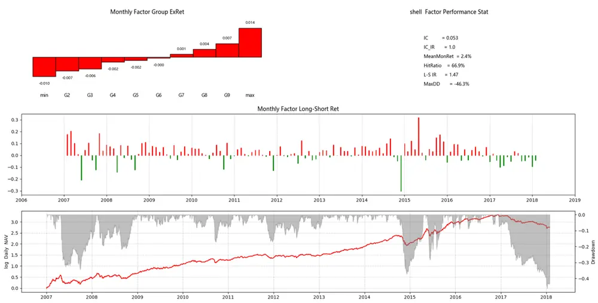
数据来源：Wind 资讯 & 东方证券研究所

图 12：市值剔除壳含量影响后在全市场的历史表现 ( 2006.01.01 – 2018.02.26)
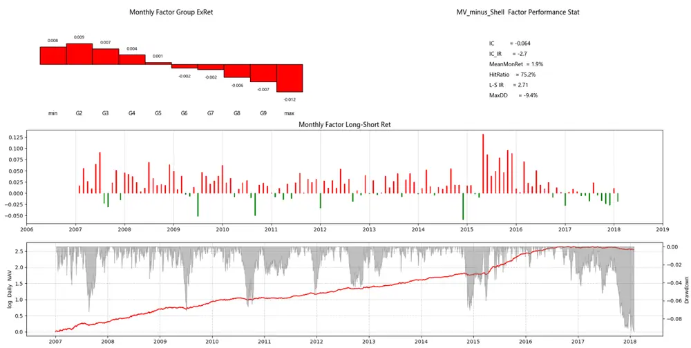
数据来源：Wind 资讯 & 东方证券研究所

壳含量和市值高度相关，两个指标横截面数据的相关系数平均可以达到-0.9，但它们带来的alpha收益并不完全重叠。我们可以通过横截面回归取残差的方式，考察剔除壳含量影响后的市值效应。如图 12所示，剔除壳价值的影响后，市值因子的 IC略微下降，但稳定性（IC_IR）提高不少，特别是 2017 年后并未出现明显回撤；降幅较多的主要是多空组合收益率，从月度平均 3.0%降到了 1.9%，这个降幅主要来自于市值最小的一组股票，剔除壳效应后，其月度超额收益从 2.0%降到了 0.8%，说明壳价值主要影响的是市值最小的股票。这个结论也符合实际感受，壳价值并没有对 A股产生全局影响。图 12用到的横截面回归剔除壳价值的方法是一种全局方法，而壳价值的定义过程中用到了许多跟公司“质量”相关的指标，这种剔除方法会让结论变得不明确。因此我们更推荐用的方法是缩减股票池，即每个月剔除全市场壳含量最高的 10%股票，在剩余股票池里检查市值效应，结果如图 13所示，受影响的主要还是市值最小的那一组股票，平均月度超额收益降了 0.3%。我们后面的实证都将在剔除全市场壳含量最高 10%股票的股票池中进行。

图 13：市值在全市场（剔除含壳量最高的 10%股票）的历史表现 ( 2006.01.01 – 2018.02.26)
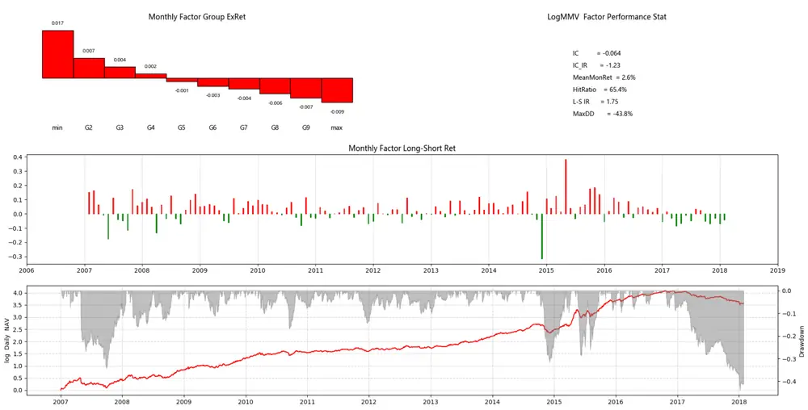
数据来源：Wind 资讯 & 东方证券研究所

## 三、 市值因子收益的归因分析

## 3.1 市值大小与股票基本面间的关系

这里主要从盈利能力和成长能力两个方面考虑股票基本面和市值的关系。盈利能力采用前期报告《质优股量化投资》里的定义方法，是净利率、ROE、ROIC、预期外盈利能力等多个盈利指标的综合打分，采用等权加权方式（避免损失过多历史数据）；成长能力包含：净利润增长率、销售收入增长率、ROE变化量等因素。每个月横截面上我们用盈利能力（多因子 zscore打分）对市值对数（zscore）做回归，并通过哑变量（dummy variabel）控制行业的影响。市值变量的回归系数变化如图 14红线所示，回归系数都是正的，说明在同行业里，市值大的股票相对来说盈利能力更好一些，不过回归系数最近十年一直在变小，反应了小盘股这段时间的盈利能力在不断改善。用同样的方法可以分析成长能力（图 14绿线），回归系数数值要比盈利能力小很多，行业内股票成长能力和市值大小的相关性较弱，大票略好；市场上有关小盘股成长性好的认识，更多来自于股票所在行业的成长性，同行业内，小票的成长性并无优势。下一步，我们在盈利和成长类指标基础上，再加入财务安全和公司治理指标，等权合成一个反应公司基本面质量的质量因子（具体参考前期专题报告）。回归结果和盈利能力很相似，行业内大盘股的质量整体占优，最近十年小盘股的质量相对改善明显。

图 14：股票基本面与市值的关系
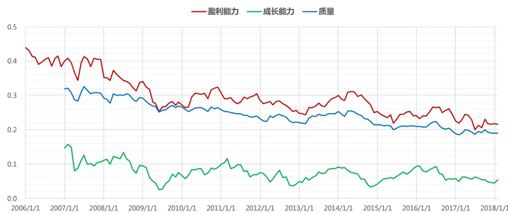
数据来源：Wind 资讯 & 东方证券研究所

## 3.2 市值因子收益率绩效归因分析

上文 alpha 因子测试结果里的多空组合是用市值最小的 10%的股票组合收益减去市值最大的10%股票，净值曲线的变化可以反映市值效应的大小，但反映的是市值两端尾部的情况，并不全面。可全面的方法是通过因子收益率做度量（参考我们前期报告《A股市场风险分析》），也就是横截面上拿当月股票收益率对月初市值对数的 zscore 做回归的回归系数，因子收益率等价于一个以zscore 大小加权的多空组合的收益率，为了保证和上面研究的方向一致，我们对因子收益率组合的权重取了负值，保证做多小盘股，做空大盘股，然后用 Menchero(2000)年的方法对这个多空组合做因子绩效归因分析。这里主要考察行业和股票质量两个基本面因素对市值因子收益的贡献。

如下图所示，2007.02 – 2018.02十一年间，市值因子收益率累计达到 121.7%，但其中基本面因素能解释的占比很少，行业因素总共贡献了 19.5%；行业内股票质量的贡献为 -3%，这主要是因为 2016年开始市场对行业内股票质量的关注，而同行业里，大股票的质量相对较高。A股市场的小市值溢价绝大部分都不是由基本面因素决定的。结合 A 股散户交易占比高的特点，可以推断这些非基本面决定的部分很可能与市场的投机氛围有关。2017年初至 2018.02.26，市场风格反转，期间市值因子收益率为 -24.2%，其中行业因素仅贡献了– 1.9%，行业内股票的质量因素贡献了-5.6%，质量因素对市场风格反转的作用比行业因素大；非基本面因素贡献了 -16.7%。

图 15：市值因子收益率的拆解
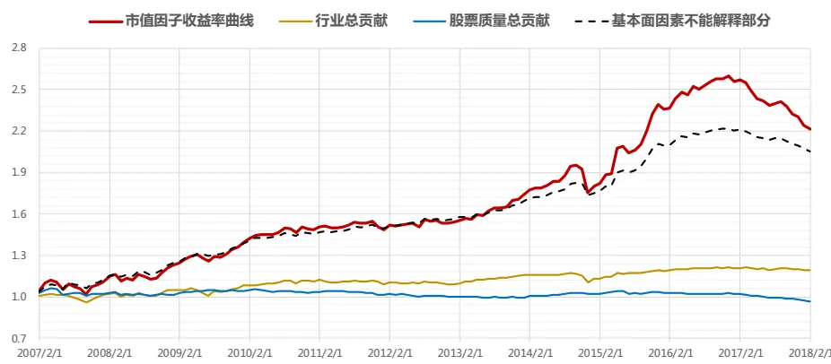

行业和质量对市值因子收益的贡献
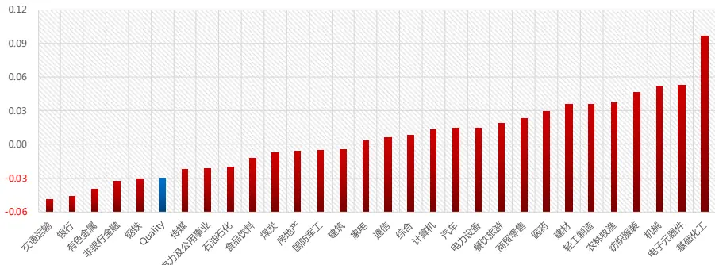
数据来源：Wind 资讯 & 东方证券研究所

## 3.3 市场情绪和宏观因素的影响

本节我们尝试用一些市场情绪指标和宏观面指标来预测市值因子收益率中的非基本面部分，这里测试的指标很多来自于前期报告《反转因子择时研究》，具体定义可以参考原报告，包括：市场资金敏感度（MKT_ILLIQ），过去一个月市场换手率（MKT_TO），过去一个月市场波动率（MKT_VOL），小单成交额（单笔 4万元以下）占比、买卖价差（Bid-Ask Spread），一个月国债收益率、M1 同比增速、M2 同比增速、CPI 同比、PPI 同比、工业增加值、人民币兑美元汇率等。另外，我们还测试了 M2 和 M1 的增速差（M2-M1），消费者信心指数同比（CCI）和经济政策不确定性指数（EPU）。测试方法是通过时间序列方向上的线性回归方式，用这些指标的月度数据预测下一个月市值因子收益率（非基本面解释部分），先做一元回归，为了避免数据噪音的影响，这些指标都做了滚动三期的移动平均，其中系数在 5%臵信度下显著的指标如图 17 所示，它们和市值因子收益率（非基本面部分）随时间变化的关系见图 16.

图 16：市值因子收益率（非基本面部分）与各个预测变量之间的关系
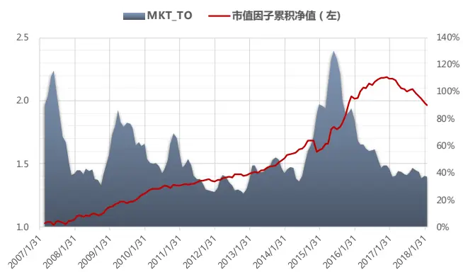

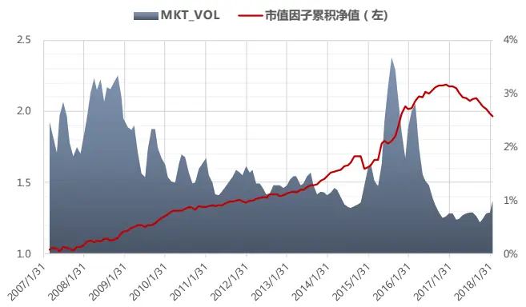

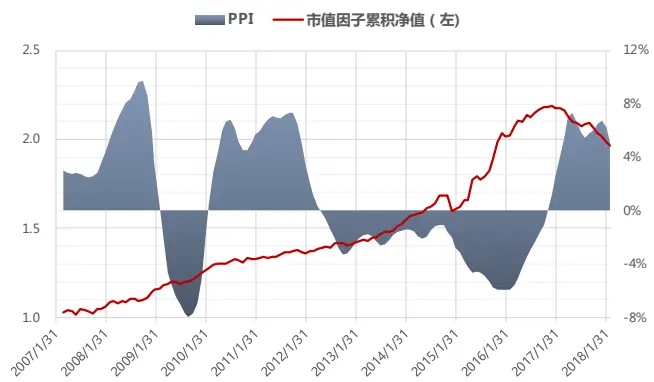

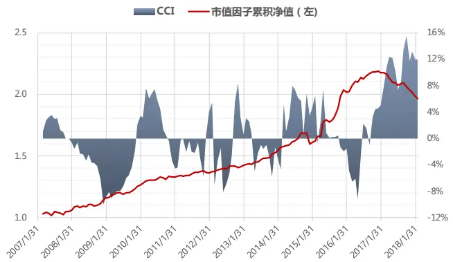

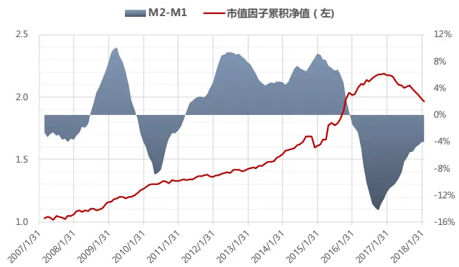
数据来源：Wind 资讯 & 东方证券研究所

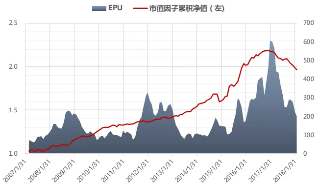

|  | MKT_TO | MKT_VOL | PPI | CCI | M2-M1 | EPU |
| --- | --- | --- | --- | --- | --- | --- |
| beta | 0.012 | 0.546 | -0.079 | -0.063 | 0.043 | -0.002 |
| pval | 0.022 | 0.001 | 0.001 | 0.008 | 0.016 | 0.067 |
| rsquared | 0.040 | 0.088 | 0.076 | 0.054 | 0.044 | 0.026 |
|  | MKT_TO | MKT_VOL | PPI | CCI | M2-M1 | EPU |
| MKT_TO | 1.00 | 0.39 | -0.46 | -0.06 | 0.12 | -0.27 |
| MKT_VOL | 0.39 | 1.00 | 0.00 | -0.44 | 0.18 | -0.27 |
| PPI | -0.46 | 0.00 | 1.00 | 0.32 | -0.38 | 0.07 |
| CCI | -0.06 | -0.44 | 0.32 | 1.00 | -0.39 | 0.22 |
| M2-M1 | 0.12 | 0.18 | -0.38 | -0.39 | 1.00 | -0.37 |
| EPU | -0.27 | -0.27 | 0.07 | 0.22 | -0.37 | 1.00 |

图 17：一元回归的相关统计量和解释变量间的相关系数矩阵
数据来源：Wind 资讯 & 东方证券研究所

首先，预测反转因子收益率非常有效的资金敏感度指标，对于市值因子的预测没有显著的作用。市场波动率指标（MKT_VOL）的预测能力最强，市场高波动、投机性强的时候，小市值股票表现更优。市场换手率（MKT_TO）和波动率指标高度相关，在多元回归时基本不显著。PPI 同比上升时，市值因子收益率会下降；可能的解释是 PPI 上升会改善上游行业的盈利能力，这里周期行业大股票居多；同时中下游行业大公司议价能力更强，能更好应对上游传递过来的成本增加，相对小股票而言盈利能力此时会更好。PPI 和 CCI、M2-M1 的相关性很高，在做多元回归时后两者不显著，我们最终只采用 PPI指标，降低变量数目，提高回归方程的调整 R方。EPU（EconomicPolicy Uncertainty）指数由 Baker(2013)提出，他们基于新闻媒体中出现的类似有关“经济政策”等关键字的频率来判断一国的经济政策不确定性，指数越大，不确定性越高，可以看到 2017年开始这个指数明显下降，和大小盘风格切换的时点契合。这个指数构建时只参考了南华早报和香港的一些英文报纸，数据量有限，采用国内数据做文本挖掘的话，可能还有改进空间，因此虽然一元回归的时候 p值略大于 0.05，我们还是纳入多元回归，提供一个独立的信息源。最终我们采用市场波动率、PPI 和 EPU 三者做多元回归，回归方程的 R 方有 16.8%，调整 R 方有 14.8%。这些指标对市值因子收益率的非基本面部分有比较强的预测能力。

## 四、 美股市值效应消失的可能解释

从图 1 可以看到，美国市场最近十年期间小市值溢价基本消失，很多研究都注意到了这个现象，但目前来看还没有一个合理的解释。我们最近看了几篇相关的研究文献，把其中的结论联系在一起可以为我们提供一个可能性较高的研究思路。

首先是 Hou(2014)的研究，他们用横截面回归的方式来预测下一期全市场股票的盈利（可以参考我们前期报告《预期外的盈利能力》），等财报报告出来后，计算真实值和预测值间的差额作为预期外的盈利。他们实证发现，1963-1982 年间，美国市场大股票和小股票之间的预期外盈利无显著差别，但 1983-2010 年间，大股票的预期外盈利平均是 3.24%，而小股票只有 -1.81%。造成这种现象的可能原因是 20 世纪八十年代起，美国 IPO 股票数量的迅速增加，三大交易所上市的股票数量在 20 世纪末最多时超过 7000 只，而这些新上市小股票的质量比较差（预期外盈利显著更低），大量被市场淘汰，目前三大交易所的上市公司仅存 4000只左右。另一个可能是全球化的进程，让上市公司的竞争加剧，大公司的应对竞争和产业变化的能力更强。如果剔除掉预期外盈利的影响，1983-2010 年间美国市场的小市值溢价还是非常显著的，也就是说预期外盈利差的因素抵消掉了小市值溢价。

第二篇是 Asness(2015)研究，他们把预期外盈利替换成之前定义的股票质量指标（盈利、成长、安全等指标的多因子打分）在全球市场测试，结论和 Hou(2014)一致，控制了股票质量因素后，小市值溢价变得非常显著，而且也没有了之前提及的“日历效应”。

第三篇是 Grullon(2017)有关美国市场行业集中度的研究，他们发现从 21世纪初开始，美国市场 75%行业的行业集中度在提升，平均提升幅度达到 90%。集中度更高行业里的股票盈利能力（ROA）更强，盈利能力的提升主要来自于利润率的增加，而非营运能力的提高。盈利能力和行业集中度的正相关关系从 2001年开始才变得显著。行业集中度提升的可能原因有两个，一是政府反垄断力度的减弱，二是计算机和网络技术的广泛运用，使得行业的技术壁垒增加，2000 年后上市公司申请的专利数量越来越向大公司集中。

以上三篇研究，作者用到的数据时间段和指标都不太一样，但综合三人的结论，从逻辑上我们可以推导出美国市值效应消失的一个可能解释。上世纪八十年代，401K计划的推出让机构投资者的市场占比逐渐提升，之后互联网泡沫的破灭进一步强化了机构投资者的主导地位，质量优良的股票更多受到市场追捧，投机因素带给小市值股票的溢价逐步萎缩。另一方面，科技进步和全球化加剧了企业竞争，提升了行业集中度和大公司的盈利能力。大公司相对小公司而言，质量变得更好，机构投资者主导的市场给予优质股票的溢价抵消了市值效应。逻辑上的推断有待实证数据的支撑，后续我们整理好海外市场数据源后会做进一步研究。

## 五、 总结

市场上对于 A 股小市值溢价的常见解释有三种：a) 小市值股票的壳价值， b) 小股票成长性更好，c) 散户主导市场导致的投机氛围。报告里的实证结果显示：壳价值影响的是市值最小的那一部分股票的收益，没有造成全局影响。小股票的成长性更多来自于它所在的行业，同行业比较的话并没有明显优势。市场整体投机氛围对市值效应的影响最大，波动率指标可以作为一个很好的先行指示变量。

## 风险提示

1. 量化模型基于历史数据分析得到，未来存在失效的风险，建议投资者紧密跟踪模型表现。

2. 极端市场环境可能对模型效果造成剧烈冲击，导致收益亏损。

## 参考文献

[1]. Baker, S., Nicholas B., Steven J. D, and Wang,X., (2013). "A Measure of Economic Policy Uncertainty for China," work in progress, University of Chicago

[2]. Banz, R., (1981), “The Relationship between Return and Market Value of Common Stocks.”, Journal of Financial Economics, vol. 9 (1), pp. 3-18

[3]. Berk, J., (1997), “Does Size Really Matter?” Financial Analysts Journal, 53 (5), pp. 12-18

[4]. Crain, M. A.,(2011), “ A Literature Review of the Size Effect”. Available at SSRN: https://ssrn.com/abstract=1710076

[5]. Dimson, E., Marsh, P. (1999), „Murphy‟s law and market anomalies‟, Journal of Portfolio Management 25(2), 53(1)

[6]. Grullon,G., Larkin,Y., Michaely,R., (2017), “ Are U.S Industry Becoming More Concentrated?”, Available at SSRN: https://ssrn.com/abstract=2612047

[7]. Horowitz, J. L., Loughran, T., Savin, N. E., (2000), „The disappearing size effect‟, Research in Economics 54(1), pp. 83–100

[8]. Hou,K., Mathijs, A., (2014), “ Resurrecting the size effect: Firm size, profitability shocks and expected returns”, Fisher College Business working paper series, available at: http://www.ssrn.con/abstract=1536804

[9]. Menchero, J., (2004), "Multiperiod Arithmetric Attribution", Financial Analyst Journal, Vol 60 (4), pp: 76-91

[10]. Schwert, G. W., (2003), “Anomalies and Market Efficiency.” Chapter 15 in the Handbook of the Economics of Finance, Eslevier.

[11]. 屈源育、沈涛，(2016a)，“借壳上市、壳价值与资源配臵效率”，中国经济学学术资源网

[12]. 屈源育、沈涛，(2016b), “壳溢价：错误定价还是管制风险？”，清华大学经济管理学院

## 分析师申明

每位负责撰写本研究报告全部或部分内容的研究分析师在此作以下声明：

分析师在本报告中对所提及的证券或发行人发表的任何建议和观点均准确地反映了其个人对该证券或发行人的看法和判断；分析师薪酬的任何组成部分无论是在过去、现在及将来，均与其在本研究报告中所表述的具体建议或观点无任何直接或间接的关系。

## 投资评级和相关定义

报告发布日后的 12个月内的公司的涨跌幅相对同期的上证指数/深证成指的涨跌幅为基准；

## 公司投资评级的量化标准

买入：相对强于市场基准指数收益率 15%以上；

增持：相对强于市场基准指数收益率 5%～15%；

中性：相对于市场基准指数收益率在-5%～+5%之间波动；

减持：相对弱于市场基准指数收益率在-5%以下。

未评级——由于在报告发出之时该股票不在本公司研究覆盖范围内，分析师基于当时对该股票的研究状况，未给予投资评级相关信息。

暂停评级——根据监管制度及本公司相关规定，研究报告发布之时该投资对象可能与本公司存在潜在的利益冲突情形；亦或是研究报告发布当时该股票的价值和价格分析存在重大不确定性，缺乏足够的研究依据支持分析师给出明确投资评级；分析师在上述情况下暂停对该股票给予投资评级等信息，投资者需要注意在此报告发布之前曾给予该股票的投资评级、盈利预测及目标价格等信息不再有效。

## 行业投资评级的量化标准：

看好：相对强于市场基准指数收益率 5%以上；

中性：相对于市场基准指数收益率在-5%～+5%之间波动；

看淡：相对于市场基准指数收益率在-5%以下。

未评级：由于在报告发出之时该行业不在本公司研究覆盖范围内，分析师基于当时对该行业的研究状况，未给予投资评级等相关信息。

暂停评级：由于研究报告发布当时该行业的投资价值分析存在重大不确定性，缺乏足够的研究依据支持分析师给出明确行业投资评级；分析师在上述情况下暂停对该行业给予投资评级信息，投资者需要注意在此报告发布之前曾给予该行业的投资评级信息不再有效。

## 免责声明

本证券研究报告（以下简称“本报告”）由东方证券股份有限公司（以下简称“本公司”）制作及发布。

本报告仅供本公司的客户使用。本公司不会因接收人收到本报告而视其为本公司的当然客户。本报告的全体接收人应当采取必要措施防止本报告被转发给他人。

本报告是基于本公司认为可靠的且目前已公开的信息撰写，本公司力求但不保证该信息的准确性和完整性，客户也不应该认为该信息是准确和完整的。同时，本公司不保证文中观点或陈述不会发生任何变更，在不同时期，本公司可发出与本报告所载资料、意见及推测不一致的证券研究报告。本公司会适时更新我们的研究，但可能会因某些规定而无法做到。除了一些定期出版的证券研究报告之外，绝大多数证券研究报告是在分析师认为适当的时候不定期地发布。

在任何情况下，本报告中的信息或所表述的意见并不构成对任何人的投资建议，也没有考虑到个别客户特殊的投资目标、财务状况或需求。客户应考虑本报告中的任何意见或建议是否符合其特定状况，若有必要应寻求专家意见。本报告所载的资料、工具、意见及推测只提供给客户作参考之用，并非作为或被视为出售或购买证券或其他投资标的的邀请或向人作出邀请。

本报告中提及的投资价格和价值以及这些投资带来的收入可能会波动。过去的表现并不代表未来的表现，未来的回报也无法保证，投资者可能会损失本金。外汇汇率波动有可能对某些投资的价值或价格或来自这一投资的收入产生不良影响。那些涉及期货、期权及其它衍生工具的交易，因其包括重大的市场风险，因此并不适合所有投资者。

在任何情况下，本公司不对任何人因使用本报告中的任何内容所引致的任何损失负任何责任，投资者自主作出投资决策并自行承担投资风险，任何形式的分享证券投资收益或者分担证券投资损失的书面或口头承诺均为无效。

本报告主要以电子版形式分发，间或也会辅以印刷品形式分发，所有报告版权均归本公司所有。未经本公司事先书面协议授权，任何机构或个人不得以任何形式复制、转发或公开传播本报告的全部或部分内容。不得将报告内容作为诉讼、仲裁、传媒所引用之证明或依据，不得用于营利或用于未经允许的其它用途。

经本公司事先书面协议授权刊载或转发的，被授权机构承担相关刊载或者转发责任。不得对本报告进行任何有悖原意的引用、删节和修改。

提示客户及公众投资者慎重使用未经授权刊载或者转发的本公司证券研究报告，慎重使用公众媒体刊载的证券研究报告。

## 东方证券研究所

地址：上海市中山南路 318 号东方国际金融广场 26 楼

联系人： 王骏飞

电话：021-63325888*1131

传真：021-63326786

网址： www.dfzq.com.cn

Email： wangjunfei@orientsec.com.cn