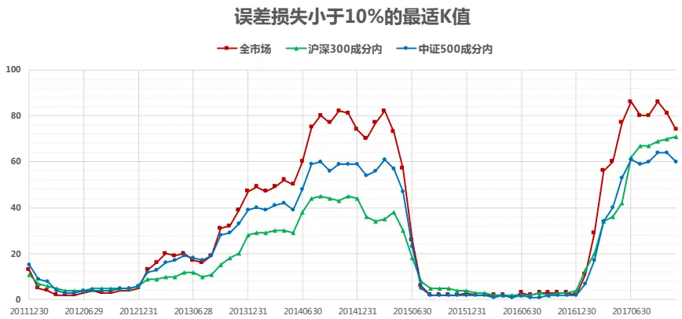

## 研究结论

上篇报告我们提出的协方差矩阵谱分解近似方法可以兼顾统计模型的高效便捷和因子模型的组合优化提速，不过其中 K值（保留的最大特征值数量）的设定比较偏经验，本报告通过数学推导给出了此方法近似误差上限的简洁表达式，并基于此动态调整K值，保证理论一致性，同时可以在不显著影响策略表现的条件下，实现组合优化过程的大幅提速。

压缩估计量方法是基于个股收益率在时间序列上独立同分布的假设，对近期市场变化反应迟钝。我们借鉴 CCC-Garch 模型的思想，设计了一套波动率调整方案，可以让压缩估计量对近期市场变化更加敏感。用波动率调整后的风险模型可以降低策略跟踪误差和回撤。

跟踪误差惩罚项可以放在约束条件中，这时需要设置一个跟踪误差上限 δ。这样的处理看上去更直观，显性控制组合跟踪误差。但需要注意的是，协方差矩阵都是基于历史数据估算得到，组合未来的跟踪误差大小由未来的市场波动决定，不论用什么模型，历史和未来之间总会有偏差，因此把跟踪误差项放在约束条件中并不能保证实现“设定多少就实现多少”的效果，在某些情况下，设定值和实现值会有较大偏差，即使协方差矩阵估计量做了波动率调整。

## 风险提示

- 量化模型失效风险

- 市场极端环境的冲击

报告发布日期2018 年 04 月 05 日

证券分析师朱剑涛

021-63325888*6077

zhujiantao@orientsec.com.cn

执业证书编号：S0860515060001

## 相关报告

| 风险模型提速组合优化的另一种方案 | 2018-03-28 |
| --- | --- |
| A股小市值溢价的来源 | 2018-03-04 |
| 组合优化的若干问题 | 2018-03-01 |
| 基于风险监控的动态调仓策略 | 2018-02-22 |
| 反转因子择时研究 | 2018-02-21 |
| 港股简史与现状 | 2018-01-22 |

在上一篇报告《风险模型提速组合优化的另一种方案》中，我们提供了一种可以兼顾统计模型的高效便捷和因子模型的计算提速的协方差矩阵估计方法。先用统计模型估算协方差矩阵，再用矩阵谱分解方法，将协方差矩阵近似拆解成一个因子模型结构，从而实现组合优化提速。本篇报告严格给出了谱分解方法近似误差上界的简洁数学表达式，动态选择保留特征值数量可以让近似误差保留在指定范围内。另外，我们也设计了一个波动率动态调整方法，让模型对市场风险的变动更敏感，降低策略的回撤和跟踪误差。

## 一、谱分解近似方法的误差

协方差矩阵谱分解近似方法中 K 的取值（保留矩阵前多少个最大特征值）最为关键，K 取值越大，误差损失越小，组合优化结果更接近直接用压缩估计量，但会增加运算复杂度，减慢组合优化速度；K取值小的话，则会反之。我们之前的做法是参照主成份分析里面方差解释度的概念，统计前 K个最大的特征值之和占所有特征值之和的比例 $\begin{array}{r}{\mathrm{~p~=~}\sum_{i=1}^{K}\lambda_{i}/\sum_{i=1}^{N}\lambda_{i}}\end{array}$ ，用这个指标来近似估量近似过程中可能的误差。这种方法偏经验，不严谨，这里用数学推导严格给出近似误差的上界，可基于此动态选取 K值。

## 1. 数学推导

沿用上篇报告的记号，对于月频调仓的多因子组合，每月底我们基于 N 个股票过去一年的收益率数据，用统计方法（报告采用的是 Ledoit(2003)线性压缩估计）可以给出协方差矩阵估计值 ，其特征值记为 $\lambda_{\mathrm{i}},\mathrm{i}=1,2\dots\mathrm{N}$ ，并按照从大到小排列； $\mathrm{u_{i}}$ 是 $\cdot\lambda_{\mathrm{i}}$ 对应的特征向量，其元素记为 $\mathbf{u}_{\mathrm{i}}=\left(u_{i,1},u_{i,2}\ldots u_{i,N}\right)^{T}$ ；线性压缩估计量 是正定阵，所以$\lambda_{\mathrm{i}}>0,\mathrm{i}=1,2\ldots\mathrm{N}$ ；实对称阵 可以谱分解（Spectral Decomposition）表示为:

$$
\Sigma=\sum_{i=1}^{N}\lambda_{i}\cdot u_{i}\cdot u_{i}^{T}
$$

股票数量较多时， 的大部分特征值都很小，我们的近似方法是把谱分解拆成两块：

$$
\Sigma=\sum_{i=1}^{K}\lambda_{i}\cdot u_{i}\cdot u_{i}^{T}+\sum_{i=K+1}^{N}\lambda_{i}\cdot u_{i}\cdot u_{i}^{T}
$$

然后将第二部分直接取对角阵得到 的近似值 $\hat{\Sigma}$

$$
\hat{\Sigma}=\sum_{i=1}^{K}\lambda_{i}\cdot u_{i}\cdot u_{i}^{T}+\sum_{i=K+1}^{N}\lambda_{i}\cdot diag(u_{i}\cdot u_{i}^{T})
$$

这样 $\widehat{\Sigma}$ 可以表示成类似因子模型的结构，降低计算复杂度，输入到组合优化中实现提速。

为度量近似误差，矩阵范数( norm) 取为 Frobenius 范数，

$$
||{\Sigma}||_{F}^{2}=\mathrm{tr}({\Sigma}{\Sigma}^{T})={\sum_{i=1}^{N}}\lambda_{i}^{2}
$$

上式中 tr 表示求矩阵的迹（trace）。 ̂ 的近似误差可以写作下式，括号中的求和项记为 Z

$$
\left|\left|\Sigma-{\hat{\Sigma}}\right|\right|_{F}^{2}={\mathrm{tr}}\left(\left[\sum_{i=K+1}^{N}\lambda_{i}\left({\boldsymbol u}_{i}\cdot{\boldsymbol u}_{i}^{T}-diag{\boldsymbol(u_{i}\cdot{\boldsymbol u}_{i}^{T})}\right)\right]^{2}\right)\triangleq{\mathrm{tr}}({\mathrm{Z}})
$$

利用特征向量的正交特性 $\mathrm{u_{i}^{T}}\cdot u_{i}=1,\mathrm{\ u_{i}^{T}}\cdot u_{j}=0,\ 1\leq i\neq j\leq N$ ，将 Z 展开

$$
\mathrm{Z}=\sum_{i=K+1}^{N}\lambda_{i}^{2}\left(u_{i}\cdot u_{i}^{T}-2u_{i}\cdot u_{i}^{T}\cdot diag(u_{i}\cdot u_{i}^{T})+diag(u_{i}\cdot u_{i}^{T})^{2}\right)
$$

$$
+2\sum_{k+1\le j\le i\le N}^{N}\lambda_{i}\lambda_{j}\left(-u_{j}\cdot u_{j}^{T}\cdot diag(u_{i}\cdot u_{i}^{T})-u_{i}\cdot u_{i}^{T}\cdot diag\big(u_{j}\cdot u_{j}^{T}\big)+diag(u_{i}\cdot u_{i}^{T})\cdot diag\big(u_{j}\cdot u_{j}^{T}\big)\right)
$$

矩阵的迹函数是矩阵空间上的线性算子，有 $\operatorname{tr}(\mathrm{aX}+\mathrm{bY})=a\cdot tr(X)+b\cdot tr(Y)$ ，对 Z 求迹等于对其展开式里面的每一项求迹：

$$
\mathrm{tr(Z)}=\sum_{i=K+1}^{N}{\lambda_{i}}^{2}\left(1-\sum_{h=1}^{N}u_{ih}{^{4}}\right)-2\sum_{k+1\le j<i\le N}^{N}\lambda_{i}\lambda_{j}\sum_{h=1}^{N}{u_{ih}{^{2}}u_{jh}{^{2}}}
$$

$$
=\sum_{i=K+1}^{N}{\lambda_{i}}^{2}-\sum_{i=K+1}^{N}{\lambda_{i}}^{2}\sum_{h=1}^{N}{u_{ih}}^{4}-2\sum_{k+1\le j<i\le N}^{N}{\lambda_{i}}{\lambda_{j}}\sum_{h=1}^{N}{u_{ih}}^{2}{u_{jh}}^{2}&<\sum_{i=K+1}^{N}{\lambda_{i}}^{2}
$$

因此可以得到谱分解近似方法的百分比误差（Percentage Error）的上限：

$$
\frac{||\Sigma-\widehat\Sigma||_{F}}{||\Sigma||_{F}}<\sqrt{\frac{\sum_{i=K+1}^{N}{\lambda_{i}}^{2}}{\sum_{i=1}^{N}{\lambda_{i}}^{2}}}
$$

我们定义后 N-K 个特征值的平方和占总特征值平方和的比例的平方根 $\sqrt{\frac{\sum_{i=K+1}^{N}{\lambda_{i}}^{2}}{\sum_{i=1}^{N}{\lambda_{i}}^{2}}}$ 为谱分解近似法的误差损失。

基于上述推导，我们每个月调仓时，可以动态的选择最小的 K 使得误差损失不超过设定的阈值，例如:10%。下面我们分别在沪深 300 成分股、中证 500 成分股、全市场范围中，分别统计控制误差损失在 10%以下时的最小 K值。结果如图 1所示，可以看到不同时期的 K值差异较大，如果投资者采用我们上篇报告中提出的固定 K 值方法，建议把 K 值设定为 80。

图 1：控制误差损失的 K值动态变化

数据来源：东方证券研究所 &Wind 资讯

## 2. 实证效果

下面我们还是用四个策略：沪深 300 增强（成分内）、沪深 300 增强（全市场）、中证 500 增强（成分内）、中证 500 增强（全市场），分别测试不同风险模型下策略的表现。组合优化问题设置如下：

$$
\begin{array}{rl}&{\operatorname*{max:}\mathrm{~f^{\prime}w}-\lambda\mathbf{w}^{\prime}\Sigma\mathbf{W}}\\&{\quad\mathrm{st}:\quad\mathrm{~w'I}=0}\\&{\quad\quad\quad\mathrm{w'Indus}=\mathbf{0}}\\&{\quad\quad\quad\mathrm{w'MV}=0}\\&{\quad\quad\quad\quad\mathrm{wmin}<\mathbf{w}\index{max}}\end{array}
$$

协方差矩阵的估计直接使用 Ledoit(2003)的线性压缩估计量方法（目标阵取为对角阵）得到，风险厌恶系数取 10，个股权重上限分段设置，行业和市值完全中性。协方差矩阵在做谱分解近似时动态选择 K，控制误差损失在 10%以内，结果如图 2 所示，谱分解近似方法和直接用压缩估计量方法效果接近，但组合优化速度提升明显。

图 2：不同风险模型做指数增强的效果对比（2012.01- 2018.02）

| 沪深300增强(成分内) | 因子模型 +波动率调整 | 压缩估计量 | 压缩估计量 +谱分解近似 | 压缩估计量 +谱分解近似 +波动率调整 |
| --- | --- | --- | --- | --- |
| IR | 2.42 | 2.51 | 2.41 | 2.41 |
| 年化对冲收益 | 8.98% | 9.49% | 9.15% | 8.94% |
| 最大回撤 | -2.95% | -2.27% | -2.32% | -2.25% |
| 跟踪误差 | 3.59% | 3.64% | 3.65% | 3.58% |
| 单期优化用时(s) | 0.05 | 0.44 | 0.05 | 0.05 |

| 中证500增强(成分内) | 因子模型 +波动率调整 | 压缩估计量 | 压缩估计量 +谱分解近似 | 压缩估计量 +谱分解近似 +波动率调整 |
| --- | --- | --- | --- | --- |
| IR | 2.42 | 2.20 | 2.24 | 2.32 |
| 年化对冲收益 | 10.88% | 10.34% | 10.59% | 10.75% |
| 最大回撤 | -4.48% | -5.22% | -4.99% | -4.74% |
| 跟踪误差 | 4.31% | 4.52% | 4.55% | 4.45% |
| 单期优化用时(s) | 0.08 | 2.07 | 0.07 | 0.07 |

数据来源：东方证券研究所 & Wind 资讯

| 沪深300增强(全市场) | 因子模型 +波动率调整 | 压缩估计量 | 压缩估计量 +谱分解近似 | 压缩估计量 +谱分解近似 +波动率调整 |
| --- | --- | --- | --- | --- |
| IR | 2.84 | 2.80 | 2.76 | 2.77 |
| 年化对冲收益 | 10.44% | 10.54% | 10.28% | 10.07% |
| 最大回撤 | -4.49% | -5.35% | -5.27% | -5.19% |
| 跟踪误差 | 3.53% | 3.60% | 3.57% | 3.49% |
| 单期优化用时(s) | 0.62 | 468.60 | 0.89 | 0.89 |

| 中证500增强(全市场) | 因子模型 +波动率调整 | 压缩估计量 | 压缩估计量 +谱分解近似 | 压缩估计量 +谱分解近似 +波动率调整 |
| --- | --- | --- | --- | --- |
| IR | 2.83 | 2.90 | 2.83 | 2.92 |
| 年化对冲收益 | 14.69% | 15.88% | 15.50% | 15.67% |
| 最大回撤 | -4.29% | -4.89% | -4.78% | -3.98% |
| 跟踪误差 | 4.89% | 5.13% | 5.16% | 5.02% |
| 单期优化用时(s) | 0.61 | 384.95 | 0.62 | 0.62 |

## 二、波动率调整

Ledoit(2003)线性压缩估计量方法的前提假设是股票收益率在时间序列上独立同分布，但实际上股票的波动率变化明显，这种假设会让模型对近期市场风险的变化反应迟钝，下面我们设计了一套波动率调整策略，让压缩估计量模型对近期市场变化更敏感。

首先还是通过线性压缩方法得到协方差矩阵估计量 $\Sigma\triangleq\left(\Sigma_{\mathrm{i,j}}\right)_{\mathrm{N\times N}}$ ，后续步骤如下：

1. 基于 计算相关系数矩阵

$$
\begin{array}{r}{\Phi=\mathrm{diag}\left(\frac{1}{\sqrt{\Sigma_{1,1}}},\frac{1}{\sqrt{\Sigma_{2,2}}},\cdots\frac{1}{\sqrt{\Sigma_{\mathrm{N,N}}}}\right)\cdot\Sigma\cdot\mathrm{diag}\left(\frac{1}{\sqrt{\Sigma_{1,1}}},\frac{1}{\sqrt{\Sigma_{2,2}}},\cdots\frac{1}{\sqrt{\Sigma_{\mathrm{N,N}}}}\right)}\end{array}
$$

2. 假设 不随时间变化，股票间的协方差随时间的变化完全由股票自身的波动率变化引起。这个假设借鉴了 CCC-Garch 模型（参考报告《风险模型在时间序列上的改进》），假设很强，和实际情况有偏差；但模型要估计的参数大幅减少，估计误差降低；一些容许相关系数动态变化的模型，例如 DCC-Garch 模型，要估计的参数多，估计误差大，在股票数量较多时，一些实证发现它和 CCC-Garch模型使用效果并无显著差别。

3. 对每个股票，在时间序列上用 EWMA模型估算当前时刻 t 股票 j 的近期波动率

$$
\sigma_{j}^{2}=\sum_{h=1}^{T}\alpha_{h}(r_{t-h}-\bar{\bf r})^{2},\alpha_{h}=\frac{\lambda^{h-1}}{\sum_{h=1}^{T}\lambda^{h-1}},\lambda=0.94
$$

4. 乘以 EWMA估算的波动率即可得到波动率调整后的协方差矩阵估计量

$$
\Sigma^{\mathrm{vol\_adj}}=\mathrm{diag}(\sigma_{1},\sigma_{2}\dots\sigma_{N})\cdot\Phi\cdot\mathrm{diag}(\sigma_{1},\sigma_{2}\dots\sigma_{N})
$$

通过调整 数值可以调整模型对市场近期变化的敏感度。另外实际计算时，因为个股的波动较大，我们并没用用 EWMA模型去估算每个股票的波动率，而是先按股票历史波动率的大小排序等分成 G组（票数量大于 3000时设置为 G=40组，股票数量 2000-3000时设置为 30 组，股票数量 1000-2000 时设置为 20 组，50-1000 时设置为 10 组，小于 50时设置为 1 组），每组内的股票等权构建一个组合，用 EWMA 模型估算这个组合的波动率，组内股票都采用这个波动率数值，这样可以降低个股数据噪音的影响，同时大幅降低运算量。

波动率调整后的协方差矩阵再用谱分解方法近似，输入后续组合优化中，如上图 2所示，这样做可以有效降低策略的回撤和跟踪误差。

## 三、风险惩罚项的设置

指数增强策略中，跟踪误差惩罚项 可以放置在目标函数中，也可以放在约束条件中。报告上文都是放在目标函数中，这是标准的 Mean-Variance 优化理论的做法，需要人为设置风险厌恶系数 ，实务研究中的通常做法是先取一个适度的 数值（例如），然后调试其它组合约束条件（风险暴露、个股权重，换手率等），让组合绩效表现达到自己满意的区域附近，然后再变动 数值实现组合绩效的“微调”。

跟踪误差惩罚项放在约束条件时，优化问题可以表述为：

$$
\begin{array}{c}{\mathrm{max:~f^{\prime}w}}\\{\mathrm{}}\\{\mathrm{st:~}\quad\mathrm{w^{\prime}I}=0}\\{\mathrm{w^{\prime}Indus}=\bf{0}}\\{\mathrm{w^{\prime}MV}=0}\\{\mathrm{wmin}<\bf{w}<\it{wmax}}\\{\mathrm{w^{\prime}Zw}<\delta^{2}}\end{array}
$$

需要设置一个跟踪误差上限 。这样的处理看上去更直观，显性控制组合跟踪误差。但需要注意的是，协方差矩阵都是基于历史数据估算得到，组合未来的跟踪误差大小由未来的市场波动决定，不论用什么模型，历史和未来之间总会有偏差，因此把跟踪误差项放在约束条件中并不能保证实现“设定多少就实现多少”的效果，在某些情况下，设定值和实现值会有较大偏差，即使协方差矩阵估计量做了波动率调整。

图 3 测试了四个指数增强策略的效果，其中“调整”指的是谱分解方法是否做波动率调整。可以看到当把跟踪误差上限设置为 0.03时，中证 500增强组合时都控不住跟踪误差，要组合实现误差在 0.03 以内，约束条件中的跟踪误差上限可能要设置成 0.02或更低，这个上限值也需要反复调试，个别情况下可能会出现跟踪误差约束同其它约束条件冲突，无可行解的情况。跟踪误差上限设置为 0.05时，沪深 300 增强组合的实际跟踪误差都小于 0.04，这是因为其它风险暴露、个股约束条件设置好后，组合的跟踪误差已经可以控制在较小范围内波动，跟踪误差上限起到的约束作用不明显。

图 3：不同风险模型做指数增强的效果对比（2012.01- 2018.02）

| 沪深300成分内 | δ = 0.03 |  | δ = 0.04 |  | δ = 0.05 |  |
| --- | --- | --- | --- | --- | --- | --- |
|  | 不调整 | 调整 | 不调整 | 调整 | 不调整 | 调整 |
| IR | 2.41 | 2.43 | 2.29 | 2.24 | 2.30 | 2.33 |
| 年化收益 | 8.85% | 8.46% | 9.05% | 8.46% | 9.14% | 9.08% |
| 最大回撤 | -2.45% | -2.29% | -2.52% | -2.50% | -2.63% | -2.51% |
| 跟踪误差 | 3.55% | 3.37% | 3.81% | 3.65% | 3.84% | 3.76% |

| 沪深300全市场 | sigma=0.03 |  | sigma=0.04 |  | sigma=0.05 |  |
| --- | --- | --- | --- | --- | --- | --- |
|  | 不调整 | 调整 | 不调整 | 调整 | 不调整 | 调整 |
| IR | 2.68 | 2.61 | 2.66 | 2.58 | 2.65 | 2.64 |
| 年化收益 | 9.70% | 9.07% | 10.39% | 9.65% | 10.46% | 10.10% |
| 最大回撤 | -5.10% | -4.64% | -5.39% | -5.37% | -4.62% | -5.68% |
| 跟踪误差 | 3.48% | 3.35% | 3.75% | 3.60% | 3.78% | 3.67% |

| 中证500成分内 | sigma=0.03 |  | sigma=0.04 |  | sigma=0.05 |  |
| --- | --- | --- | --- | --- | --- | --- |
|  | 不调整 | 调整 | 不调整 | 调整 | 不调整 | 调整 |
| IR | 2.29 | 2.54 | 2.31 | 2.41 | 2.29 | 2.28 |
| 年化收益 | 10.74% | 10.59% | 11.00% | 10.99% | 11.05% | 10.73% |
| 最大回撤 | -4.95% | -3.55% | -4.81% | -4.29% | -4.73% | -4.38% |
| 跟踪误差 | 4.50% | 4.00% | 4.57% | 4.38% | 4.63% | 4.52% |

数据来源：东方证券研究所 & Wind 资讯

| 中证500全市场 | sigma=0.03 |  | sigma=0.04 |  | sigma=0.05 |  |
| --- | --- | --- | --- | --- | --- | --- |
|  | 不调整 | 调整 | 不调整 | 调整 | 不调整 | 调整 |
| IR | 2.86 | 2.87 | 2.81 | 2.93 | 2.80 | 2.85 |
| 年化收益 | 14.41% | 13.71% | 15.68% | 15.19% | 16.26% | 15.55% |
| 最大回撤 | -3.33% | -3.23% | -4.85% | -3.53% | -5.34% | -4.56% |
| 跟踪误差 | 4.75% | 4.52% | 5.23% | 4.87% | 5.43% | 5.12% |

## 风险提示

1. 量化模型基于历史数据分析得到，未来存在失效的风险，建议投资者紧密跟踪模型表现。

2. 极端市场环境可能对模型效果造成剧烈冲击，导致收益亏损。

## 分析师申明

每位负责撰写本研究报告全部或部分内容的研究分析师在此作以下声明：

分析师在本报告中对所提及的证券或发行人发表的任何建议和观点均准确地反映了其个人对该证券或发行人的看法和判断；分析师薪酬的任何组成部分无论是在过去、现在及将来，均与其在本研究报告中所表述的具体建议或观点无任何直接或间接的关系。

## 投资评级和相关定义

报告发布日后的 12个月内的公司的涨跌幅相对同期的上证指数/深证成指的涨跌幅为基准；

## 公司投资评级的量化标准

买入：相对强于市场基准指数收益率 15%以上；

增持：相对强于市场基准指数收益率 5%～15%；

中性：相对于市场基准指数收益率在-5%～+5%之间波动；

减持：相对弱于市场基准指数收益率在-5%以下。

未评级——由于在报告发出之时该股票不在本公司研究覆盖范围内，分析师基于当时对该股票的研究状况，未给予投资评级相关信息。

暂停评级——根据监管制度及本公司相关规定，研究报告发布之时该投资对象可能与本公司存在潜在的利益冲突情形；亦或是研究报告发布当时该股票的价值和价格分析存在重大不确定性，缺乏足够的研究依据支持分析师给出明确投资评级；分析师在上述情况下暂停对该股票给予投资评级等信息，投资者需要注意在此报告发布之前曾给予该股票的投资评级、盈利预测及目标价格等信息不再有效。

## 行业投资评级的量化标准：

看好：相对强于市场基准指数收益率 5%以上；

中性：相对于市场基准指数收益率在-5%～+5%之间波动；

看淡：相对于市场基准指数收益率在-5%以下。

未评级：由于在报告发出之时该行业不在本公司研究覆盖范围内，分析师基于当时对该行业的研究状况，未给予投资评级等相关信息。

暂停评级：由于研究报告发布当时该行业的投资价值分析存在重大不确定性，缺乏足够的研究依据支持分析师给出明确行业投资评级；分析师在上述情况下暂停对该行业给予投资评级信息，投资者需要注意在此报告发布之前曾给予该行业的投资评级信息不再有效。

## 免责声明

本证券研究报告（以下简称“本报告”）由东方证券股份有限公司（以下简称“本公司”）制作及发布。

本报告仅供本公司的客户使用。本公司不会因接收人收到本报告而视其为本公司的当然客户。本报告的全体接收人应当采取必要措施防止本报告被转发给他人。

本报告是基于本公司认为可靠的且目前已公开的信息撰写，本公司力求但不保证该信息的准确性和完整性，客户也不应该认为该信息是准确和完整的。同时，本公司不保证文中观点或陈述不会发生任何变更，在不同时期，本公司可发出与本报告所载资料、意见及推测不一致的证券研究报告。本公司会适时更新我们的研究，但可能会因某些规定而无法做到。除了一些定期出版的证券研究报告之外，绝大多数证券研究报告是在分析师认为适当的时候不定期地发布。

在任何情况下，本报告中的信息或所表述的意见并不构成对任何人的投资建议，也没有考虑到个别客户特殊的投资目标、财务状况或需求。客户应考虑本报告中的任何意见或建议是否符合其特定状况，若有必要应寻求专家意见。本报告所载的资料、工具、意见及推测只提供给客户作参考之用，并非作为或被视为出售或购买证券或其他投资标的的邀请或向人作出邀请。

本报告中提及的投资价格和价值以及这些投资带来的收入可能会波动。过去的表现并不代表未来的表现，未来的回报也无法保证，投资者可能会损失本金。外汇汇率波动有可能对某些投资的价值或价格或来自这一投资的收入产生不良影响。那些涉及期货、期权及其它衍生工具的交易，因其包括重大的市场风险，因此并不适合所有投资者。

在任何情况下，本公司不对任何人因使用本报告中的任何内容所引致的任何损失负任何责任，投资者自主作出投资决策并自行承担投资风险，任何形式的分享证券投资收益或者分担证券投资损失的书面或口头承诺均为无效。

本报告主要以电子版形式分发，间或也会辅以印刷品形式分发，所有报告版权均归本公司所有。未经本公司事先书面协议授权，任何机构或个人不得以任何形式复制、转发或公开传播本报告的全部或部分内容。不得将报告内容作为诉讼、仲裁、传媒所引用之证明或依据，不得用于营利或用于未经允许的其它用途。

经本公司事先书面协议授权刊载或转发的，被授权机构承担相关刊载或者转发责任。不得对本报告进行任何有悖原意的引用、删节和修改。

提示客户及公众投资者慎重使用未经授权刊载或者转发的本公司证券研究报告，慎重使用公众媒体刊载的证券研究报告。

## 东方证券研究所

地址：上海市中山南路 318 号东方国际金融广场 26 楼

联系人： 王骏飞

电话：021-63325888*1131

传真：021-63326786

网址： www.dfzq.com.cn

Email： wangjunfei@orientsec.com.cn