## 研究结论

由于投资者对信息的反应具有滞后性，业绩公告超预期的股票后期有正向的异常收益，低于预期的股票后期有负向的异常收益，学界先后在全球不同市场均发现了盈利公告的价格漂移现象（PEAD）。

我们基于季节性随机游走模型预测的净利润和营业收入计算标准化的预期外净利润（SUE）和营业收入（SUR），用来度量业绩超预期的程度，根据模型是否带漂移项，我们计算了 SUE0、SUE1、SUR0 和 SUR1 共 4 个业绩超预期类指标。

基于 4个业绩超预期类指标的事件研究一致支持 PEAD在 A股的存在，基于净利润的指标累计异常收益高于基于营业利润的结果，虽然公告前的累计异常收益更高，但公告后的异常收益依然显著，大概有3-4 个月的存续期，而且在存续内异常收益的衰减并不明显。

业绩超预期类因子也有很好的选股效果，可以作为 alpha 因子纳入多因子选股体系，其中 SUE0 行业市值中性的 RankIC 均值 4.02%，IC_IR 高达 3.49，多空月均收益 1.53%，回撤仅 7.27%。

- 业绩超预期类因子与成长因子的因子取值和 IC 的相关系数均在 50%以上，信息重叠较多，通过回归方法剔除业绩超预期因子后成长因子没有显著的选股效果，但剔除含成长在内的其他大类因子后业绩超预期因子在全市场的RankIC均值依然有 3.93%，IC_IR 提升至 3.79，选股效果依然十分显著。

指数增强时用业绩超预期因子替代成长因子后，在风险和换手等变化不大的前提下，组合业绩均有比较稳定的提升，其中全市场增强中证500组合的年化对冲收益提升 4.37%，而跟踪误差和最大回撤相差不到 0.2%，信息比从2.73 提升至 3.48。

## 风险提示

- 量化模型失效风险

- 市场极端环境的冲击

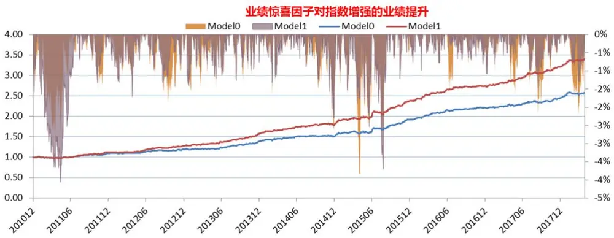
东方证券股份有限公司经相关主管机关核准具备证券投资咨询业务资格，据此开展发布证券研究报告业务。

报告发布日期2018 年 05 月 18 日

证券分析师朱剑涛

021-63325888*6077

zhujiantao@orientsec.com.cn

执业证书编号：S0860515060001

王星星

021-63325888-6108

wangxingxing@orientsec.com.cn

执业证书编号：S0860517100001

联系人王星星

021-63325888-6108

wangxingxing@orientsec.com.cn

## 相关报告

预期外的盈利能力 2017-07-09

东方证券股份有限公司及其关联机构在法律许可的范围内正在或将要与本研究报告所分析的企业发展业务关系。因此，投资者应当考虑到本公司可能存在对报告的客观性产生影响的利益冲突，不应视本证券研究报告为作出投资决策的唯一因素。

有关分析师的申明，见本报告最后部分。其他重要信息披露见分析师申明之后部分，或请与您的投资代表联系。并请阅读本证券研究报告最后一页的免责申明。

## 一、关于 PEAD

## 1.研究概述

Ball 和 Brown(1968)在美国市场首次发现了盈余公告后的价格偏移现象（Post-EarningsAnnouncement Drift， PEAD），即对于盈利超预期（Positive Eanings Surprise）的股票在公告后有持续正向的异常收益，相反，盈利低于预期的股票后期有持续负向的异常收益。自 Ball 和Brown(1968)之后，大量研究学者在不同的国家、采用不同的研究或度量方法均发现了类似的结论，早期的研究主要集中于对净利润的研究，Ertimur 等（2003）和 Jegadeesh 等（2006）的研究则将关注点从净利润转移到营业收入上，结果表明营业收入的预期外部分在公告后也有显著的异常收益，而且这部分异常收益并不能被盈利的预期外部分解释，说明营业收入相对于盈利有额外的信息。

关于 PEAD现象的解释，早期分为两大流派，一者从风险补偿或者交易成本摩擦的角度去解释，另外一派则认为 PEAD 是投资者对盈余公告的延迟反应，是市场无效的结果。Bernard 和Thomas（1990）专门写了一篇文章论证 PEAD 的可能原因，作者并没有发现盈利超预期的股票风险更高，即使考虑了风险可能的度量偏差问题，另外，交易成本也并不能完全解释 PEAD 的成因，考虑交易成本后基于 PEAD 的套利策略依然有显著的异常收益，作者的证据一致认为 PEAD主要源于市场对盈利公告的反应不及时。

虽然学术界对 Earnings Surprise 和 Revenue Surprise 的度量细节有所不同，但几乎均采用实际公告值减去预期值除以规模数的框架，各家度量的差异在于预期值的产生方法和规模数的选取上，早期包括最近的研究大多采用时间序列模型去产生盈利或者营收的预期数据，比如 Bernard等（1990）、Bartov 等（2000）和 Jegadeesh 等（2006），近期也有部分学者采用分析师预期数据作为预期值，Livnat等（2006）等采用分析师预期计算 Earnings Surprise，发现基于分析师预期的 PEAD 异常收益相比于基于传统时序模型要更高，而且策略特征也有所不同。关于本文采用何种度量方法，我们将在下一节详细探讨。

## 2.业绩超预期的度量

上文我们提到绝大多数学者均采用公告值减去预期值除以规模数的框架度量 EarningsSurprise 或者 Revenue Surprise，差别主要在于预期数的选取上，产生预期数主要有三种方法，时间序列建模、分析师预期和横截面回归建模。国内的分析师基于年报预测进行预测（美国基于季度预测），而年报中包含的前三季报信息已经被市场充分吸收，基于此构建的业绩超预期指标很难捕捉实际预期差，我们也尝试过基于年报预期数据构建业绩超预期指标，但效果较差。基于横截面回归方法生成预期数的方法我们在前期报告《预期外的盈利能力》已有详细介绍，而且构建了预期外的 RNOA指标，在此也不在赘述。本文主要采用时间序列模型产生净利润和营业收入的预期数，并以此为基础构建业绩超预期指标。

我们定义公司 i 在季度 t 的标准化预期外盈利（standardized unexpected earnings， SUE）作为 Earnings Surprise 的度量，具体如下：

$$
SUE_{i,t}=\frac{Q_{i,t}-E\left(Q_{i,t}\right)}{\sigma_{i,t}}
$$

其中， $Q_{i,t}$ 表示公司实际公告的净利润， $E\left(Q_{i,t}\right)$ 表示 $Q_{i,t}$ 公告前的预期值， $\sigma_{i,t}$ 表示 $Q_{i,t}$ 的预测标准差。 $E\left(Q_{i,t}\right)$ 和 $\sigma_{i,t}$ 均通过季节性时间序列模型估计。虽然早期有部分学者建议采用 AR（1）对净利润同比差值建模，但是我们采用 Narasimhan（2006）、Sadka（2006）等采用的季节性随机游走模型估计，主要原因有以下两点：（1）Freeman和 Tse (1989)的研究表明公告后的价格偏移和季节性随机游走模型估计出来的结果相关性更高，（2）随机游走模型需要估计的参数最少，这样估计准确性更高，需要的样本点更少，从而避免了长样本带来的生存偏差和公司发生实质变化的情形。

根据季节性随机游走模型是否带漂移项，我们计算了两个 SUE 指标，SUE0假设随机游走模型含漂移项，其中漂移项可以根据过去两年盈利同比变化 $Q_{i,t}-Q_{i,t-4}$ 的均值估计，预测的标准差 $\cdot\varepsilon_{t}$ 可以通过 $Q_{i,t}-Q_{i,t-4}$ 的标准差估计，SUE1不含漂移项，预测的标准差 $\varepsilon_{t}$ 可以通过 $Q_{i,t}-Q_{i,t-4}$ 的不带均值的标准差估计。SUE0和 SUE1的差别在于假设市场是否会根据历史业绩增长对未来产生预期。

$$
\begin{array}{r}{Q_{i,t}=Q_{i,t-4}+c_{i,t}+\varepsilon_{t}\qquad\quad(\frac{++}{\uparrow\uparrow},\frac{\ast\oplus}{\uparrow\downarrow},\frac{\ast\not\ G}{\downarrow\downarrow},\frac{\ast}{\downarrow\downarrow})\underset{\mathrm{~d~}}{\overbrace{\pm\pm\frac{1}{\uparrow}\uparrow}}+\frac{1+}{\downarrow\downarrow}\langle\frac{\ast\not\in\frac{1}{\uparrow}}{\downarrow\downarrow},\frac{\ast\not\in\frac{1}{\uparrow}}{\uparrow\downarrow}\rangle\underset{\mathrm{~d~}}{\overbrace{\pm\frac{1}{\uparrow}\uparrow}}+\frac{1+}{\downarrow\downarrow}\langle\frac{1}{\uparrow\uparrow},\frac{\ast\not\in\frac{1}{\uparrow}}{\uparrow\downarrow}\rangle\underset{\mathrm{~d~}}{\overbrace{\pm\frac{1}{\uparrow}\uparrow}})}\end{array}
$$

$$
Q_{i,t}=Q_{i,t-4}+\varepsilon_{t}\qquad(\overline{{{\mathcal{K}}}}_{\mathrm{rfy}}^{\scriptscriptstyle++},\underline{{{\sqrt{3}}}},\overline{{{\xi}}}_{\mathrm{rfy}}^{\scriptscriptstyle+}\underline{{{\bar{\mathcal{K}}}}})\underline{{{\bar{\mathcal{K}}}}}_{\mathrm{i}}\pm\pm,|\underline{{{\bar{\mathcal{K}}}}}_{\mathrm{i}}\pm\underline{{{\bar{\mathcal{K}}}}}|[\gamma]\widetilde{{\mathcal{H}}}\pm\pm\pm|\underline{{{\bar{\mathcal{K}}}}}_{\mathrm{reff}}^{\scriptscriptstyle+}\pm\underline{{{\bar{\mathcal{K}}}}}_{\mathrm{reff}}^{\scriptscriptstyle+}\rangle
$$

由于参数估计过程中涉及到去年同期的数据，因此计算 SUE0 和 SUE1 默认需要过去 12 个季度的净利润数据，为了提高 SUE 在样本空间的覆盖率我们要求只要有 8个有效的季度数据就计算指标，另外由于 A 股公告财报时会同时公告去年同期的调整报表，因此上市满一年的股票基本都可以计算该指标，指标的覆盖率较高。

类似的我们也可以计算 SUR0 和 SUR1 两个标准化预期外营收（standardized unexpectedrevenue， SUR）作为 Revenue Surprise 的度量。

$$
\mathit{SUR}_{i,t}=\frac{REV_{i,t}-E\big(REV_{i,t}\big)}{\xi_{i,t}}
$$

$E\left(REV_{i,t}\right)$ 表示预期的营业收入， $\xi_{i,t}$ 表示预期营业收入的标准差， $E\big(REV_{i,t}\big)\mp\mathbb{A}\xi_{i,t}$ 通过对季度营业收入建立季节性随机游走模型估计，SUR0指标假设模型含漂移项，SUR1指标假设模型不含漂移项，参数估计和 SUE类似。

最后，需要说明的 SUE 和 SUR 的度量方法并不唯一，不同度量方法在具体数字上会有不一样，但从学界的研究结果来看，主要结论基本一致。

## 二、PEAD 的收益特征

## 1.数据与方法

本文基于季度的净利润和营业收入数据计算了 SUE0、SUE1、SUR0 和 SUR1 共 4 个业绩超预期指标，为了考察 4 个业绩超预期指标公告后的股票表现，我们首先采用标准化的事件研究方法，在本章第 3节我们将讨论 4个业绩超预期指标的选股效果。事件研究的报告期涵盖 20050930至 20170930 共 49 个报告期，涉及共 3421 只 A 股上市公司股票，之所以选择 20050930 为起始点是 A股从 2003年 6月开始才公告一季报和三季报的去年同期调整报表数据，而业绩超预期指标的计算需要 2 年的数据，20171231 和 20180331 的数据刚公告不久，后续的异常收益尚不清楚，事件研究时暂不考虑。计算的细节还要如下几点需要说明：

1． 为了避免会计准则调整、并购重组等外在因素影响业绩超预期的度量，计算中涉及到的同比数据我们均采用当季数据相对去年同期的调整数据计算；

2． 对于部分有业绩快报的公司，四季报业绩超预期指标更新于业绩快报公告时间而非年报公告时间；

3． 事件研究中涉及到业绩超预期指标的分组，为避免引入未来信息，我们基于上一报告期（一季度取上一年三季报）的 10分位数将股票分为 10档（G0、G1、… G9，G0到 G9业绩由低预期到超预期）；

4． 区间累计异常收入的计算我们采用区间内每日异常收益求和的方法计算，每日的异常收益采用股票当日收益率对行业和市值对数横截面回归的残差替代；

5． 事件研究时剔除了业绩公告当天停牌的股票。

## 2.累计异常收益

我们统计了业绩公告前 60 个交易日和业绩公告后 120 个交易日 4 个业绩超预期指标各分组的累计异常收益 CAR情况（图 1-图 4），其中表格的红色字体表示 CAR在 5%的臵信区间下显著异于零，下次公告期是指下一个报告期公告前后共20个交易日（前10个交易日+后10个交易日），统计该字区间的 CAR 主要是为了考察 PEAD 的收益是否主要产生在下次业绩公告期。对比分析各分组的累计异常收益，我们不难发现如下几点：

1. 不管是基于净利润还是营收，业绩公告前后均有显著的异常收益，业绩超预期的股票在业绩公告前后均有显著的正向异常收益，业绩低于预期的股票在业绩公告前后均有显著的负向异常收益。

2. 业绩公告前的累计异常收益明显高于业绩公告后的异常超额收益，比如 SUE0 的 G9 分组在业绩公告前 20 个交易日的累计异常收益高达 2.09%，而公告后的 20 个交易日累计异常收益仅 0.66%，说明在业绩公告前可能已经有部分市场参与者已经提前获取信息。

3. 基于净利润指标计算的业绩超预期指标（SUE0、SUE1）比基于营收指标计算的指标（SUR0、SUR1）异常收益更加明显。

4. 业绩公告后的异常收益大约可以持续 3-4个月，公告日及之后一两个交易日异常收益高，之后的异常收益衰减并不明显，大幅超预期组合在业绩公告后第 2 个月的累计异常收益甚至低于第 3个月，这可能 A股的反转效应有关，超预期股票在业绩公告前后涨幅较大，一个月后可能会有所回调。

5. 大幅高于预期和低于预期的股票在下一个财报期公告期没并有显著的异常收益，这一结论和美国市场并不一致，说明 A 股的业绩 PEAD现象更多的是由于投资者对业绩公告信息的滞后反应，而非不是因为业绩超预期或低于预期的公司后续报告期会持续高于或低于预期。

6. 无论业绩超于预期还是低于预期，股票在业绩公告前一两个交易日均有一定的超额收益，说明在业绩公告前一两个交易日可能会有交易者买入以赌博公司的业绩。需要提醒的是，美国市场没不存在这种现象。

图 1：SUE0的各分组累计异常收益
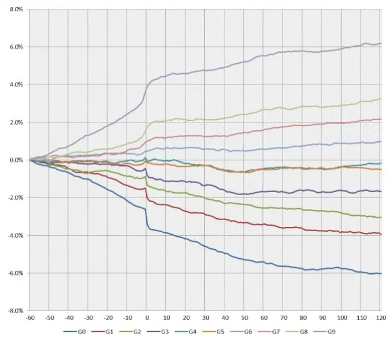

图 2：SUE1 的各分组累计异常收益
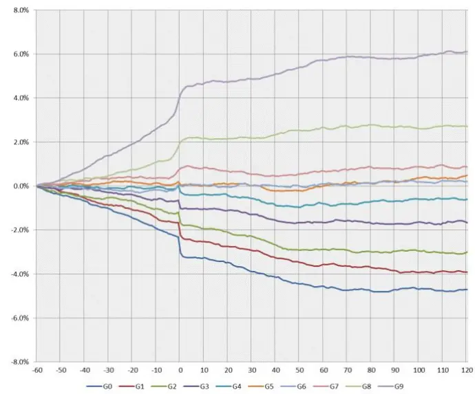

|  | 下次公告期 | [-59,-20] | [-21,-40] | [-19, 0] | [1, 20] | [21,40] | [41,60] | [61,80] | [81,100] | [101,120] |
| --- | --- | --- | --- | --- | --- | --- | --- | --- | --- | --- |
| G0 | 0.02 | -0.64 | -0.90 | -1.83 | -0.77 | -0.78 | -0.46 | -0.36 | 0.01 | -0.25 |
| G1 | 0.07 | -0.48 | -0.46 | -1.10 | -0.70 | -0.42 | -0.25 | -0.26 | -0.16 | -0.11 |
| G2 | -0.09 | -0.48 | -0.10 | -0.78 | -0.38 | -0.58 | -0.24 | -0.09 | -0.18 | -0.22 |
| G3 | -0.13 | -0.12 | -0.07 | -0.59 | -0.35 | -0.44 | -0.06 | 0.05 | 0.01 | -0.05 |
| G4 | -0.13 | -0.10 | 0.00 | 0.02 | -0.13 | -0.35 | 0.10 | 0.02 | 0.07 | 0.20 |
| G5 | -0.07 | -0.12 | -0.05 | 0.00 | -0.21 | -0.24 | 0.08 | 0.04 | 0.09 | -0.11 |
| G6 | 0.11 | 0.21 | 0.13 | 0.12 | 0.17 | -0.10 | 0.03 | 0.19 | 0.11 | 0.12 |
| G7 | -0.08 | 0.12 | 0.15 | 0.68 | 0.28 | -0.02 | 0.34 | 0.19 | 0.15 | 0.20 |
| G8 | -0.08 | 0.29 | 0.25 | 1.18 | 0.38 | 0.09 | 0.47 | 0.14 | 0.08 | 0.36 |
| G9 | 0.06 | 0.74 | 1.06 | 2.09 | 0.66 | 0.35 | 0.62 | 0.25 | 0.12 | 0.27 |

注：1.下次公告期是指下一报告期前后共 20 个交易日区间的累计异常收益；
2.红色表示在 5%的臵信区间下显著异于零。

数据来源：wind 数据库、东方证券研究所

|  | 下次公告期 | [-59,-20] | [-21,-40] | [-19, 0] | [1, 20] | [21,40] | [41,60] | [61,80] | [81,100] | [101,120] |
| --- | --- | --- | --- | --- | --- | --- | --- | --- | --- | --- |
| G0 | 0.09 | -0.64 | -0.77 | -1.58 | -0.45 | -0.67 | -0.41 | -0.21 | 0.09 | -0.02 |
| G1 | -0.08 | -0.58 | -0.53 | -1.16 | -0.50 | -0.52 | -0.29 | -0.14 | -0.22 | 0.01 |
| G2 | -0.03 | -0.47 | -0.22 | -0.99 | -0.43 | -0.57 | -0.20 | -0.13 | 0.05 | -0.05 |
| G3 | -0.11 | -0.08 | -0.28 | -0.63 | -0.09 | -0.46 | -0.10 | -0.02 | 0.06 | -0.03 |
| G4 | -0.09 | -0.06 | 0.02 | -0.25 | -0.16 | -0.45 | 0.08 | 0.10 | 0.11 | -0.01 |
| G5 | -0.09 | 0.03 | 0.14 | -0.15 | 0.03 | -0.29 | 0.22 | 0.11 | 0.26 | 0.12 |
| G6 | 0.10 | -0.15 | -0.10 | 0.24 | -0.07 | 0.05 | 0.09 | 0.03 | 0.07 | 0.02 |
| G7 | 0.00 | 0.21 | 0.11 | 0.44 | -0.12 | -0.23 | 0.23 | 0.18 | 0.01 | 0.01 |
| G8 | -0.06 | 0.35 | 0.39 | 1.27 | 0.12 | 0.19 | 0.33 | 0.12 | -0.18 | 0.10 |
| G9 | -0.04 | 0.76 | 1.13 | 2.27 | 0.55 | 0.37 | 0.63 | 0.11 | 0.06 | 0.21 |

注：1.下次公告期是指下一报告期前后共 20 个交易日区间的累计异常收益；
2.红色表示在 5%的臵信区间下显著异于零。

数据来源：wind 数据库、东方证券研究所

图 3：SUR0的各分组累计异常收益
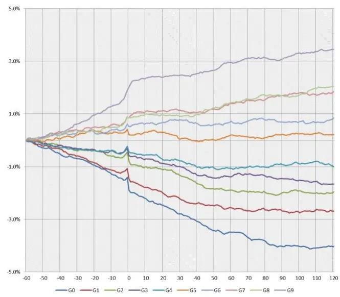

图 4：SUR1 的各分组累计异常收益
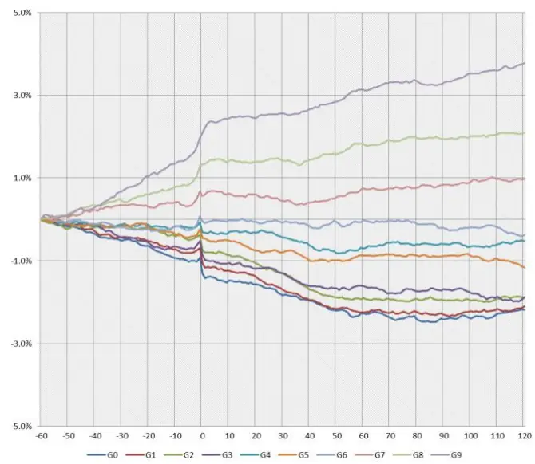

|  | 下次公告期 | [-59,-20] | [-21,-40] | [-19, 0] | [1, 20] | [21,40] | [41,60] | [61,80] | [81,100] | [101,120] |
| --- | --- | --- | --- | --- | --- | --- | --- | --- | --- | --- |
| G0 | -0.07 | -0.53 | -0.41 | -0.95 | -0.58 | -0.61 | -0.40 | -0.34 | -0.20 | -0.01 |
| G1 | 0.07 | -0.34 | -0.52 | -0.61 | -0.53 | -0.40 | -0.17 | -0.08 | -0.11 | 0.06 |
| G2 | 0.02 | -0.22 | -0.18 | -0.40 | -0.32 | -0.53 | -0.24 | -0.09 | 0.07 | -0.05 |
| G3 | 0.03 | -0.15 | -0.17 | -0.23 | -0.30 | -0.44 | -0.06 | 0.02 | -0.16 | -0.15 |
| G4 | -0.03 | -0.25 | -0.10 | -0.06 | -0.30 | -0.29 | -0.04 | 0.05 | 0.12 | -0.11 |
| G5 | 0.15 | 0.03 | 0.31 | -0.15 | 0.09 | -0.32 | 0.22 | -0.10 | 0.15 | -0.04 |
| G6 | -0.16 | 0.18 | 0.08 | 0.25 | 0.14 | -0.04 | 0.09 | 0.04 | -0.05 | 0.14 |
| G7 | -0.13 | 0.29 | 0.20 | 0.35 | 0.27 | -0.07 | 0.33 | 0.16 | 0.25 | 0.04 |
| G8 | -0.07 | 0.17 | 0.11 | 0.54 | 0.09 | 0.03 | 0.44 | 0.27 | 0.02 | 0.33 |
| G9 | -0.07 | 0.29 | 0.65 | 1.07 | 0.36 | 0.14 | 0.42 | 0.18 | 0.18 | 0.14 |

注：1.下次公告期是指下一报告期前后共 20 个交易日区间的累计异常收益；2.红色表示在 5%的臵信区间下显著异于零。
数据来源：wind 数据库、东方证券研究所

|  | 下次公告期 | [-59,-20] | [-21,-40] | [-19, 0] | [1, 20] | [21,40] | [41,60] | [61,80] | [81,100] | [101,120] |
| --- | --- | --- | --- | --- | --- | --- | --- | --- | --- | --- |
| G0 | 0.09 | -0.35 | -0.28 | -0.68 | -0.25 | -0.39 | -0.30 | -0.14 | 0.02 | 0.21 |
| G1 | 0.17 | -0.33 | -0.23 | -0.54 | -0.33 | -0.56 | -0.30 | 0.01 | 0.02 | 0.11 |
| G2 | -0.10 | -0.16 | -0.01 | -0.55 | -0.32 | -0.63 | -0.20 | -0.02 | -0.05 | 0.05 |
| G3 | -0.13 | -0.13 | -0.44 | -0.30 | -0.31 | -0.42 | -0.01 | -0.13 | -0.03 | -0.09 |
| G4 | 0.12 | -0.16 | 0.03 | -0.17 | -0.01 | -0.31 | -0.07 | 0.10 | -0.05 | 0.12 |
| G5 | -0.01 | -0.11 | -0.09 | -0.23 | -0.31 | -0.24 | 0.13 | -0.01 | 0.00 | -0.28 |
| G6 | -0.03 | -0.13 | -0.13 | 0.19 | -0.02 | -0.11 | 0.15 | -0.10 | -0.07 | -0.20 |
| G7 | -0.19 | 0.22 | 0.07 | 0.27 | 0.04 | -0.20 | 0.33 | 0.02 | 0.16 | 0.06 |
| G8 | -0.04 | 0.32 | 0.27 | 0.72 | 0.06 | 0.06 | 0.38 | 0.14 | 0.04 | 0.09 |
| G9 | -0.14 | 0.27 | 0.74 | 1.06 | 0.35 | 0.22 | 0.46 | 0.22 | 0.19 | 0.24 |

注：1.下次公告期是指下一报告期前后共 20 个交易日区间的累计异常收益；2.红色表示在 5%的臵信区间下显著异于零。
数据来源：wind 数据库、东方证券研究所

## 3.因子化尝试

虽然国内外对于业绩公告后的价格偏移现象的研究大多数是基于事件的，但是为了更好的纳入多因子选股的框架，本节我们将从单因子有效性检验的角度看业绩公告后的价格偏移现象，理论上讲，不同时间点公告的业绩超预期信息即使幅度一样对股票 alpha 的意义也不同，较早期公告的信息可能衰减的更多，对 alpha的影响幅度较小，因此需要一个衰减函数调整不同公告时间点的业绩超预期数据，但上一节的结果表明 PEAD 在异常收益存续期内衰减并不明显，为简化问题，我们不考虑衰减调整和多个报告期影响叠加的问题，仅取每只股票最新的业绩超预期指标 SUE0、SUE1、SUR0、SUR1 的取值作为 alpha 因子值，考察业绩超预期的选股效果。因子检验的时间区间 20051230 至 20180427。

从因子检验的结果来看（图 5-图 9），和事件研究的结果一致，财报公告后，业绩超预期的股票有正向的超额收益，业绩低于预期的股票有负向的异常收益，基于净利润的业绩超预期因子SUE0 和 SUE1 的超额收益幅度要明显高于基于营业收入的 SUR0 和 SUR1，在不同样本空间内的检验结果均支持该结论。因子原始值和行业市值中性化后的取值均有十分显著的选择效果，但中性化后的因子选股稳定性更高。另外，带有漂移项的业绩超预期因子 SUE0和 SUR0相对于不带漂移项的 SUE1和 SUR1稳定性更高（IC_IR和多空组合的回撤均能反应这一点），但收益略弱于后者（RankIC的均值和多空组合收益），这也说明两种随机游走模型假设下的业绩超预期因子虽然高度一致，但特点并不完全相同。无论从因子的 IC_IR还是多空组合的历史表现，我们均发现 4个业绩超预期因子在选股方面的稳定性很高，业绩超预期的股票持续跑赢业绩低于预期的股票，中证全指内的多空组合在过去十几年几乎没有较大幅度的回撤。

图 5：业绩超预期因子在不同样本空间的表现
基于净利润的 SUE0 因子

|  | 原始因子 |  | 行业市值中性化因子 |  |  |  |  |  |  |
| --- | --- | --- | --- | --- | --- | --- | --- | --- | --- |
|  | RankIC IC_IR | t_value | IC | IC_IR | t_value | 多空月收益 | 夏普率 | 月胜率 | 最大回撤 |
| 中证全指 | 4.14% | 2.68 9.43 | 4.02% | 3.49 | 12.25 | 1.53% | 2.55 | 83.78% | -7.27% |
| 沪深300 | 5.27% | 1.79 6.29 | 3.96% | 2.09 | 7.33 | 1.35% | 1.67 | 71.62% | -20.89% |
| 中证500 | 4.63% | 2.21 7.76 | 4.91% | 3.17 | 11.15 | 1.40% | 2.02 | 72.30% | -6.70% |

基于净利润的 SUE1 因子

|  | 原始因子 |  | 行业市值中性化因子 |  |  |  |  |  |  |
| --- | --- | --- | --- | --- | --- | --- | --- | --- | --- |
|  | RankIC IC_IR | t_value | IC | IC_IR | t_value | 多空月收益 | 夏普率 | 月胜率 | 最大回撤 |
| 中证全指 | 4.15% | 1.53 5.38 |  | 4.83% 2.85 | 10.01 | 1.54% | 2.19 | 76.35% | -9.29% |
| 沪深300 | 6.13% | 1.56 5.48 | 4.13% | 1.89 | 6.63 | 1.41% | 1.84 | 67.57% | -11.14% |
| 中证500 | 4.98% | 1.58 5.56 | 6.04% | 3.11 | 10.91 | 1.61% | 1.97 | 69.59% | -11.91% |

基于营业收入的 SUR0 因子

|  | 原始因子 |  |  | 行业市值中性化因子 |  |  |  |  |  |  |
| --- | --- | --- | --- | --- | --- | --- | --- | --- | --- | --- |
|  | RankIC IC_IR | t_value |  | IC | IC_IR | t_value | 多空月收益 | 夏普率 | 月胜率 | 最大回撤 |
| 中证全指 | 3.30% | 2.22 | 7.78 | 2.99% | 2.89 | 10.17 | 1.10% | 2.12 | 72.97% | -5.96% |
| 沪深300 | 4.59% | 1.76 | 6.18 | 3.12% | 1.81 | 6.36 | 0.88% | 1.13 | 64.86% | -22.25% |
| 中证500 | 3.32% | 1.59 | 5.58 | 3.31% | 2.14 | 7.51 | 1.00% | 1.32 | 67.57% | -13.90% |

基于营业收入的 SUR1 因子

|  | 原始因子 |  | 行业市值中性化因子 |  |  |  |  |  |  |
| --- | --- | --- | --- | --- | --- | --- | --- | --- | --- |
|  | RankIC | IC_IR t_value | IC | IC_IR | t_value | 多空月收益 | 夏普率 | 月胜率 | 最大回撤 |
| 中证全指 | 3.15% | 1.28 4.51 | 3.58% | 2.12 | 7.43 | 1.10% | 1.71 | 72.97% | -7.85% |
| 沪深300 | 5.14% | 1.47 5.17 | 3.46% | 1.71 | 5.99 | 1.02% | 1.16 | 66.22% | -14.49% |
| 中证500 | 3.52% | 1.16 4.07 | 4.17% | 2.03 | 7.13 | 0.89% | 1.05 | 61.49% | -13.72% |

数据来源：wind 数据库、东方证券研究所

图 6：SUE0历史表现回溯（中证全指，行业市值中性）
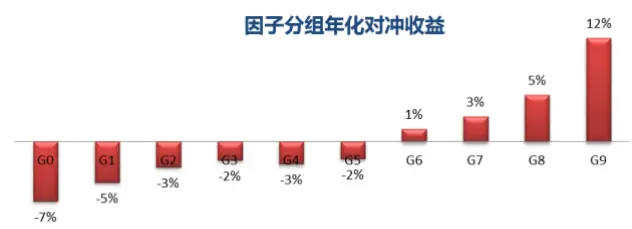

图 7：SUE1 历史表现回溯（中证全指，行业市值中性）
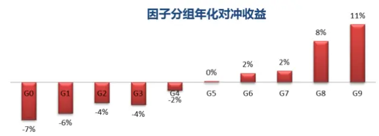

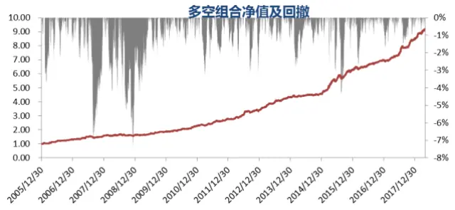
数据来源：wind 数据库、东方证券研究所

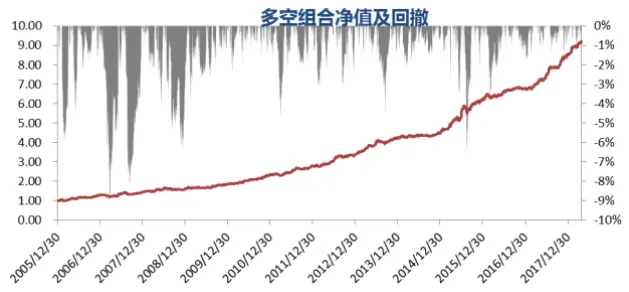
数据来源：wind 数据库、东方证券研究所

图 8：SUR0历史表现回溯（中证全指，行业市值中性）
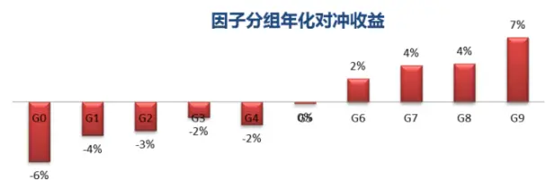

图 9：SUR1 历史表现回溯（中证全指，行业市值中性）
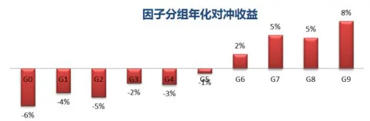

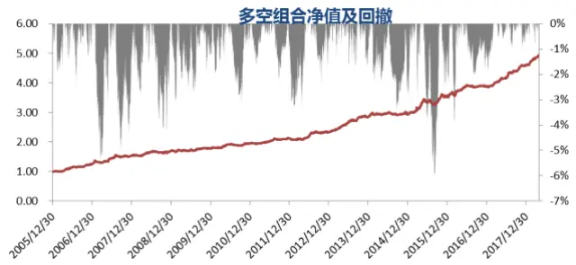
数据来源：wind 数据库、东方证券研究所

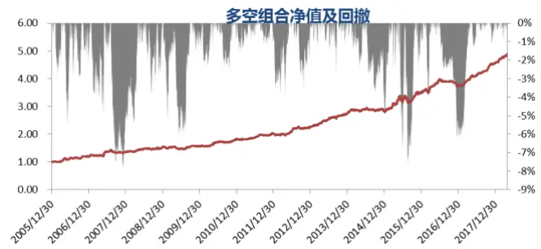
数据来源：wind 数据库、东方证券研究所

## 三、信息增量与指数增强

## 1、因子说明

本章主要考察业绩超预期因子相对现有 alpha因子是否有增量信息，为了降低问题的复杂度，我们把现有的 alpha因子分为估值、成长、盈利能力、营运治理、流动性、技术反转、分析师预期共 7 大类，等权合成大类因子，上文中主要介绍的 4 个业绩超预期因子和前期报告《预期外的盈利能力》中介绍的预期外的 RNOA 共 5 个因子等权合成业绩超预期因子。由于部分因子就在金融股中没有取值，且分析师因子仅在 2006年 6月后有取值，所以本章考察的样本空间为中证全指成分股的非金融部分，时间区间为 20060630 至 20180427。

图 10：因子库说明

| 大类 | 因子 | 定义 | 序 |
| --- | --- | --- | --- |
| 估值 Value | BP | 股东权益（不含少数股东)/总市值 | 1 |
|  | EP | 扣非后的净利润TTM/总市值 | 1 |
|  | CFP | 经营性现金流 TTM/总市值 | 1 |
|  | EBIT2EV | 息税前利润与企业价值之比 | 1 |
|  | DP | 过去一年分红/总市值，以分红预案公告日为准 | 1 |
| 成长 Growth | SalesGrowth_Qr_YOY | 营业收入增长率（季度同比） | 1 |
|  | ProfitGrowth_Qr_YOY | 净利润增长率（季度同比） | 1 |
|  | SalesGrowth_TTM | 营业收入增长率(当前TTM 和一年前 TTM 比较) | 1 |
|  | ProfitGrowth_TTM | 净利润增长率(当前TTM 和一年前 TTM 比较) | 1 |
|  | delta_ROA_TTM | ROA 变动(当前 TTM 和一年前 TTM 比较) | 1 |
|  | delta_ROE_TTM | ROE 变动(当前 TTM 和一年前 TTM 比较) | 1 |
|  | delta_GPOA_TTM | GPOA 变动(当前 TTM 和一年前 TTM 比较) | 1 |
|  | delta_RNOA_TTM | RNOA 变动(当前 TTM 和一年前 TTM 比较) | 1 |
| 盈利能力 Profitability | ROA | 总资产收益率 | 1 |
|  | ROE | 净资产收益率 | 1 |
|  | GrossMargin | 销售毛利率 | 1 |
|  | NetMargin | 净利润率 | 1 |
|  | RNOA | RNOA，详见报告《预期外的盈利能力》 | 1 |
|  | GPOA | 总资产毛利率 | 1 |
|  | CFROI | 投资现金收益率 | 1 |
| 营运治理 Operation | MBS-top3 | 高管薪酬前三总和的对数 | 1 |
| 流动性 | LNTO | 过去20个交易日日均换手率对数 | -1 |
| Liquidity | LNILLIQ | 20 日 Amihud 非流动性的自然对数 | 1 |
| 投机反转 | IVOL | 过去 60 个交易日计算的FF 三因子特质波动率 | -1 |

有关分析师的申明，见本报告最后部分。其他重要信息披露见分析师申明之后部分，或请与您的投资代表联系。并请阅读本证券研究报告最后一页的免责申明。

| Lottry | IVR | 过去20 个交易日计算的特异度 | -1 |
| --- | --- | --- | --- |
|  | MaxRet_3M | 过去三个月内涨幅最大的三天的平均涨幅 | -1 |
|  | Ret | 过去20 个交易日涨跌幅 | -1 |
| 分析师预期 Analyst | COV | 过去3个月覆盖的机构数量，取根号处理 | 1 |
|  | DISP | 过去3个月分析师盈利预测的分歧度 | -1 |
|  | EP_FY1 | FY1一致预期净利润/总市值 | 1 |
|  | PEG | FY1一致预期净利润/FY2 隐含增长率 | -1 |
|  | SCORE | 一致预期评级 | 1 |
|  | TPER | 目标价隐含收益率 | 1 |
|  | WFR | 加权盈余调整 | 1 |
| 业绩超预期 Surprise | UP | 预期外的RNOA，详见报告《预期外的盈利能力》 | 1 |
|  | SUEO | 基于带漂移项季节性随机游走模型的标准化预期外净利润 | 1 |
|  | SUE1 | 基于不带漂移项季节性随机游走模型的标准化预期外净利润 | 1 |
|  | SURO | 基于带漂移项季节性随机游走模型的标准化预期外营业收入 | 1 |
|  | SUR1 | 基于不带漂移项季节性随机游走模型的标准化预期外营业收入 | 1 |

数据来源：东方证券研究所

## 2、相关性分析

我们计算了上述各大类因子值和月度 RankIC的秩相关系数（图 11），从因子值的相关系数来看，业绩超预期因子和成长因子的取值高度相关，原始值、中性值的相关系数均达到 50%以上，意味着这两者之间可能存在很强的信息重叠，除了成长因子之外，业绩超预期因子和盈利能力、分析师因子的因子值也有一定的相关性，取值在 20%左右，总体可控，和其他大类因子几乎不相关。从因子 RankIC的相关性来看，也有类似的结果，即业绩超预期因子和成长因子历史表现的同步性较强，成长因子表现好时业绩超预期因子一般也表现较好，除了成长因子之外，业绩超预期指标和盈利、分析师因子表现的同步性也较强。

图 11：各大类因子因子值（左下）和 RankIC（右上）秩相关系数
大类因子原始值：

|  | Value | Growth | Profitability | Operation | Liquidity | Lottery | Analyst | Surprise |
| --- | --- | --- | --- | --- | --- | --- | --- | --- |
| Value |  | 0.298 | 0.140 | 0.762 | 0.114 | 0.448 | 0.584 | 0.094 |
| Growth | 0.176 |  | 0.575 | 0.459 | -0.148 | -0.152 | 0.706 | 0.786 |
| Profitability | 0.443 | 0.333 |  | 0.470 | -0.070 | -0.240 | 0.700 | 0.761 |
| Operation | 0.299 | 0.067 | 0.259 |  | 0.002 | 0.136 | 0.723 | 0.327 |
| Liquidity | 0.076 | -0.079 | -0.057 | -0.051 |  | 0.538 | 0.038 | -0.027 |
| Lottery | 0.321 | -0.038 | 0.021 | 0.083 | 0.366 |  | 0.064 | -0.270 |
| Analyst | 0.329 | 0.271 | 0.381 | 0.213 | -0.033 | 0.077 |  | 0.654 |
| Surprise | 0.068 | 0.537 | 0.216 | 0.021 | -0.045 | -0.074 | 0.218 |  |

行业市值中性值：

|  | Value | Growth | Profitability | Operation | Liquidity | Lottery | Analyst | Surprise |
| --- | --- | --- | --- | --- | --- | --- | --- | --- |
| Value |  | 0.105 | 0.136 | 0.570 | 0.333 | 0.570 | 0.429 | 0.060 |
| Growth | 0.141 |  | 0.497 | 0.054 | -0.009 | -0.169 | 0.579 | 0.735 |
| Profitability | 0.412 | 0.306 |  | 0.214 | 0.159 | -0.212 | 0.740 | 0.693 |
| Operation | 0.205 | -0.007 | 0.117 |  | 0.322 | 0.379 | 0.357 | 0.070 |
| Liquidity | 0.112 | -0.040 | 0.046 | 0.057 |  | 0.462 | 0.325 | 0.198 |
| Lottery | 0.322 | -0.032 | 0.027 | 0.092 | 0.329 |  | 0.013 | -0.244 |
| Analyst | 0.296 | 0.211 | 0.331 | 0.078 | 0.042 | 0.086 |  | 0.626 |
| Surprise | 0.043 | 0.518 | 0.195 | -0.018 | -0.013 | -0.071 | 0.189 |  |

数据来源：wind 数据库、东方证券研究所

## 3、回归分析

前面的相关性分析显示，业绩超预期因子和成长等因子有一定的信息重叠，为了考察剔除成长等其他因子后业绩超预期因子是否还有显著的选股效果，我们在每个横截面上通过回归的方法剔除其他 7 个大类因子，得到业绩超预期的残差因子，比较原因子和残差因子的表现差异。除了考察业绩超预期大类因子外，我们也同时考察了业绩超预期的细分因子在剔除其他各类因子前后的表现差异。从结果来看（图 12），业绩因子的大类因子和各个细分因子在剔除其他大类因子后 RankIC的均值和多空组合的收益率会稍有降低，但 IC_IR 和多空组合的信息比丝毫没有回落，甚至还有所提升。无论是因子的原始值还是行业中性值在剔除其他大类因子后依然有十分显著的选股能力，说明业绩超预期因子相对现有的 alpha 因子在选股方面具有明显的信息增量，选股效果几乎不受其他大类因子影响。

我们也采用了回归的方法考察了其他大类因子在剔除业绩超预期大类因子前后的表现（图13），结果发现和业绩超预期因子有较高相关性的成长因子在剔除业绩超预期因子后丧失了选股的有效性，无论是因子原始值还是因子中性值结果均支持这一观点。和业绩超预期因子有一定相关性的盈利能力因子原始值本身就没有选股效果，盈利能力中性值在剔除业绩超预期之后 RankIC均值和多空组合收益均有所回落，但 RankIC的时间序列 t值依然显著。分析师因子的原始值和中性值在剔除业绩超预期因子后的 RankIC均值和多空组合收益也有小幅回落，但影响总体不大，其他alpha因子在剔除业绩超预期因子前后的选股效果差异都很小。

图 12：业绩超预期因子剔除其他大类前后的表现
剔除其他各大类因子前（因子原始值）：

|  | RankIC |  |  | 多空组合 |  |  |  |
| --- | --- | --- | --- | --- | --- | --- | --- |
|  | 均值 | IC_IR | t值 | 月均收益 | 信息比 | 月胜率 | 最大回撤 |
| UP | 4.08% | 2.16 | 7.42 | 0.97% | 1.27 | 67.61% | -18.03% |
| SUEO | 4.16% | 2.73 | 9.40 | 1.45% | 2.16 | 78.87% | -11.45% |
| SUE1 | 3.21% | 2.22 | 7.64 | 1.10% | 1.79 | 69.72% | -9.12% |
| SURO | 4.13% | 1.60 | 5.49 | 1.34% | 1.44 | 66.20% | -18.84% |
| SUR1 | 3.01% | 1.30 | 4.47 | 0.95% | 1.25 | 63.38% | -12.89% |
| Surprise | 4.75% | 2.11 | 7.24 | 1.71% | 1.91 | 71.83% | -12.78% |

剔除其他各大类因子后（因子原始值）：

|  | RankIC |  |  | 多空组合 |  |  |  |
| --- | --- | --- | --- | --- | --- | --- | --- |
|  | 均值 | IC_IR | t值 | 月均收益 | 信息比 | 月胜率 | 最大回撤 |
| UP | 3.04% | 2.55 | 8.76 | 0.82% | 1.79 | 75.35% | -9.13% |
| SUEO | 3.91% | 3.33 | 11.47 | 1.25% | 2.23 | 77.46% | -7.19% |
| SUE1 | 2.68% | 2.43 | 8.37 | 1.00% | 2.15 | 73.94% | -5.83% |
| SURO | 3.56% | 2.76 | 9.48 | 1.13% | 1.85 | 75.35% | -7.67% |
| SUR1 | 2.28% | 1.51 | 5.20 | 0.70% | 1.31 | 63.38% | -11.09% |
| Surprise | 4.23% | 3.11 | 10.70 | 1.51% | 2.57 | 79.58% | -5.55% |

剔除其他各大类因子前（行业市值中性值）：

|  | RankIC |  |  | 多空组合 |  |  |  |
| --- | --- | --- | --- | --- | --- | --- | --- |
|  | 均值 | IC_IR | t值 | 月均收益 | 信息比 | 月胜率 | 最大回撤 |
| UP | 3.91% | 3.01 | 10.36 | 1.01% | 1.73 | 69.01% | -10.02% |
| SUEO | 4.06% | 3.58 | 12.33 | 1.47% | 2.55 | 83.80% | -7.27% |
| SUE1 | 2.90% | 2.92 | 10.04 | 1.05% | 2.09 | 72.54% | -5.96% |
| SURO | 4.82% | 3.04 | 10.45 | 1.50% | 2.26 | 76.76% | -9.29% |
| SUR1 | 3.48% | 2.21 | 7.60 | 1.05% | 1.74 | 73.24% | -7.85% |
| Surprise | 4.92% | 3.22 | 11.09 | 1.75% | 2.61 | 76.06% | -7.12% |

剔除其他各大类因子后（行业市值中性值）：

|  | RankIC |  |  | 多空组合 |  |  |  |
| --- | --- | --- | --- | --- | --- | --- | --- |
|  | 均值 | IC_IR | t值 | 月均收益 | 信息比 | 月胜率 | 最大回撤 |
| UP | 2.50% | 2.71 | 9.32 | 0.63% | 1.50 | 71.13% | -10.34% |
| SUEO | 3.70% | 3.79 | 13.05 | 1.23% | 2.38 | 78.17% | -4.98% |
| SUE1 | 2.36% | 2.73 | 9.38 | 0.91% | 2.18 | 78.87% | -5.06% |
| SURO | 3.57% | 3.61 | 12.43 | 1.22% | 2.40 | 76.76% | -4.41% |
| SUR1 | 2.14% | 1.88 | 6.47 | 0.72% | 1.59 | 70.42% | -7.24% |
| Surprise | 3.93% | 3.79 | 13.05 | 1.44% | 2.76 | 78.87% | -4.61% |

数据来源：wind 数据库、东方证券研究所

图 13：各大类因子在剔除业绩超预期前后表现差异
剔除业绩因子前（因子原始值）：

|  | RankIC |  |  | 多空组合 |  |  |  |
| --- | --- | --- | --- | --- | --- | --- | --- |
|  | 均值 | IC_IR | t值 | 月均收益 | 信息比 | 月胜率 | 最大回撤 |
| Value | 4.26% | 1.00 | 3.44 | 0.66% | 0.42 | 50.70% | -34.74% |
| Growth | 2.54% | 1.00 | 3.44 | 0.72% | 0.67 | 57.75% | -35.24% |
| Profitability | 1.02% | 0.24 | 0.84 | 0.23% | 0.15 | 51.41% | -45.36% |
| Operation | -0.36% | -0.12 | -0.42 | -0.25% | -0.22 | 45.07% | -62.63% |
| Liquidity | 10.34% | 2.86 | 9.84 | 2.81% | 1.84 | 71.13% | -24.56% |
| Lottery | 10.73% | 3.21 | 11.05 | 2.48% | 1.95 | 73.94% | -19.86% |
| Analyst | 4.65% | 1.45 | 4.98 | 1.51% | 1.24 | 59.86% | -21.15% |

剔除业绩因子后（因子原始值）：

|  | RankIC |  |  | 多空组合 |  |  |  |
| --- | --- | --- | --- | --- | --- | --- | --- |
|  | 均值 | IC_IR | t值 | 月均收益 | 信息比 | 月胜率 | 最大回撤 |
| Value | 3.99% | 0.95 | 3.25 | 0.54% | 0.35 | 49.30% | -35.62% |
| Growth | -0.40% | -0.20 | -0.69 | -0.01% | -0.02 | 47.18% | -35.52% |
| Profitability | -0.07% | -0.02 | -0.06 | -0.06% | -0.04 | 48.59% | -55.01% |
| Operation | -0.45% | -0.16 | -0.54 | -0.30% | -0.27 | 45.07% | -65.69% |
| Liquidity | 10.62% | 2.98 | 10.25 | 2.88% | 1.93 | 71.83% | -24.34% |
| Lottery | 11.12% | 3.41 | 11.72 | 2.61% | 2.09 | 75.35% | -18.77% |
| Analyst | 3.61% | 1.22 | 4.19 | 1.13% | 0.98 | 54.23% | -23.08% |

剔除业绩因子前（行业市值中性值）：

|  | RankIC |  |  | 多空组合 |  |  |  |
| --- | --- | --- | --- | --- | --- | --- | --- |
|  | 均值 | IC_IR | t值 | 月均收益 | 信息比 | 月胜率 | 最大回撤 |
| Value | 6.23% | 2.69 | 9.24 | 1.35% | 1.43 | 64.79% | -16.46% |
| Growth | 3.34% | 1.97 | 6.79 | 0.91% | 1.13 | 63.38% | -22.14% |
| Profitability | 2.80% | 0.98 | 3.37 | 0.67% | 0.63 | 54.23% | -32.89% |
| Operation | 2.51% | 2.59 | 8.89 | 0.52% | 1.13 | 67.61% | -9.68% |
| Liquidity | 8.77% | 3.01 | 10.35 | 2.45% | 1.97 | 75.35% | -28.00% |
| Lottery | 11.06% | 4.45 | 15.29 | 2.84% | 2.86 | 84.51% | -11.27% |
| Analyst | 6.63% | 3.02 | 10.40 | 1.83% | 2.20 | 76.76% | -14.57% |

剔除业绩因子后（行业市值中性值）：

|  | RankIC |  |  | 多空组合 |  |  |  |
| --- | --- | --- | --- | --- | --- | --- | --- |
|  | 均值 | IC_IR | t值 | 月均收益 | 信息比 | 月胜率 | 最大回撤 |
| Value | 6.05% | 2.63 | 9.04 | 1.30% | 1.40 | 65.49% | -15.65% |
| Growth | 0.55% | 0.40 | 1.38 | 0.22% | 0.32 | 54.23% | -27.00% |
| Profitability | 1.86% | 0.69 | 2.37 | 0.35% | 0.34 | 52.11% | -35.58% |
| Operation | 2.62% | 2.69 | 9.26 | 0.58% | 1.23 | 64.79% | -9.15% |
| Liquidity | 8.90% | 3.06 | 10.52 | 2.49% | 2.01 | 75.35% | -28.64% |
| Lottery | 11.43% | 4.68 | 16.09 | 2.99% | 3.08 | 85.92% | -10.78% |
| Analyst | 5.60% | 2.74 | 9.44 | 1.53% | 1.90 | 69.72% | -13.89% |

数据来源：wind 数据库、东方证券研究所

## 4、指数增强

上述的研究发现业绩超预期因子在剔除其他大类因子后在选股方面依然有额外的信息，而成长因子在剔除业绩超预期因子后没有了选股能力，如此以来，在指数增强策略中用业绩超预期因子替代成长因子理应增强策略的表现。为了验证业绩超预期因子替代成长因子的组合效果，我们验证了如下两个模型在成长股内增强沪深 300、全市场增强沪深 300、成分股内增强中证 500、全市场增强中证 500 共 4 组组合内在 20101231-20180427 的表现。

Model0：估值、成长、盈利、营运能力、流动性、投机反转、分析师共 7 大类因子等权合成ZSCORE，月度调仓，风险厌恶系数 lambda=20，单边费率千三，交易成本惩罚为费率的 0.3 倍。

Model1：用业绩超预期因子替代 Model0 中的成长因子，其他和 Model0 一致。

对比 Model0 和 Model1 在成分股内增强沪深 300 的表现，Model1 相对 Model0 年化对冲收益提升 0.88%，跟踪误差、最大回撤等风险指标并没有提升，两者的换手率相差也不大。Model除今年小幅跑输 Model0，其余每年均跑赢 Model0，模型效果稳定提升。

图 14：沪深 300 成分股内增强组合
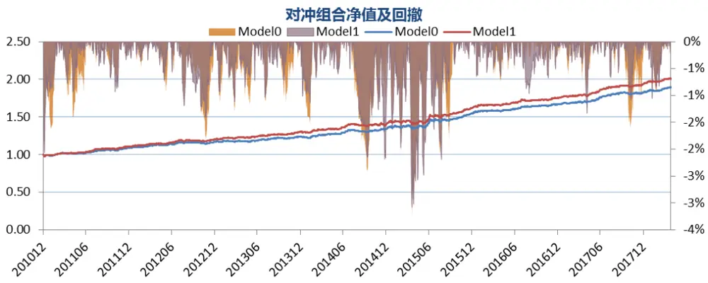

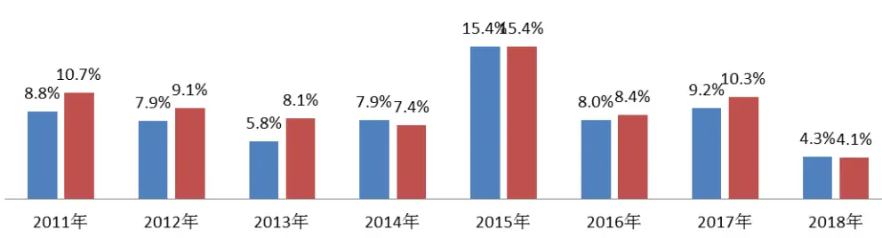

|  | 对冲年化收益 | 跟踪误差 | 信息比 | 月胜率 | 最大回测 | 月均换手 |
| --- | --- | --- | --- | --- | --- | --- |
| Model0 | 9.16% | 3.45% | 2.56 | 71.59% | 3.26% | 16.6% |
| model1 | 10.04% | 3.47% | 2.78 | 77.27% | 3.08% | 17.4% |

数据来源：wind 数据库、东方证券研究所

对于全市场增强沪深 300，Model1相对 Model0的收益率提升更加明显，年化对冲收益率提升 1.54%，跟踪误差两者几乎一样，最大回撤小幅降低，换手率也相差不大，除今年外 Model1每年的收益率均跑赢 Model0，相对收益比较稳定，但今年以来的收益回落比较明显，Model1 相对于 Model0 今年以来的对冲收益率减少了 1.6%。

图 15：沪深 300 全市场增强组合
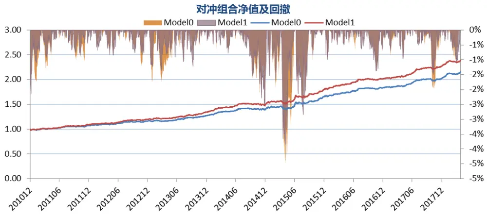

各年度对冲收益
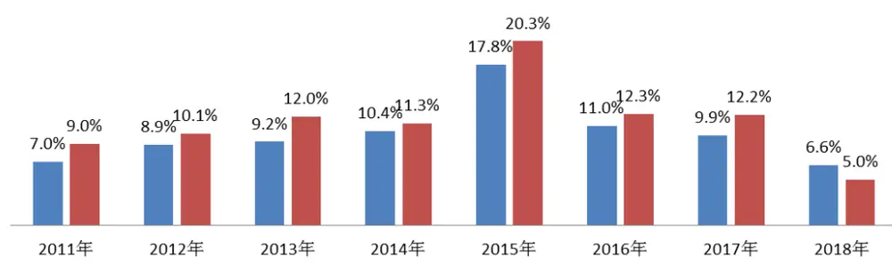

|  | 对冲年化收益 | 跟踪误差 | 信息比 | 月胜率 | 最大回测 | 月均换手 |
| --- | --- | --- | --- | --- | --- | --- |
| Model0 | 11.05% | 3.71% | 2.84 | 76.14% | 4.50% | 15.0% |
| model1 | 12.59% | 3.73% | 3.20 | 80.68% | 3.86% | 16.4% |

数据来源：wind 数据库、东方证券研究所

对于成长股内增强中证 500，Model1 相对 Model0的对冲组合收益也有明显提升，但跟踪误差和最大回测有所增大，总体而言模型的信息比还是有所提升，从 2.14提升至 2.43， 2011年以来除 2014 年跑输 Model0 约 1.5%，其他年份的收益率均高于 Model0，Model1 相对于 Model1 的收益依然较稳定。

图 16：中证 500成分股内增强组合
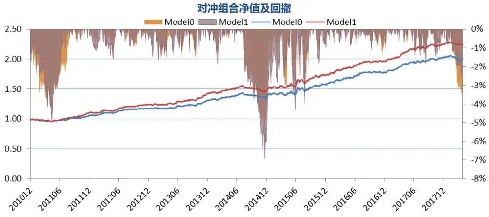

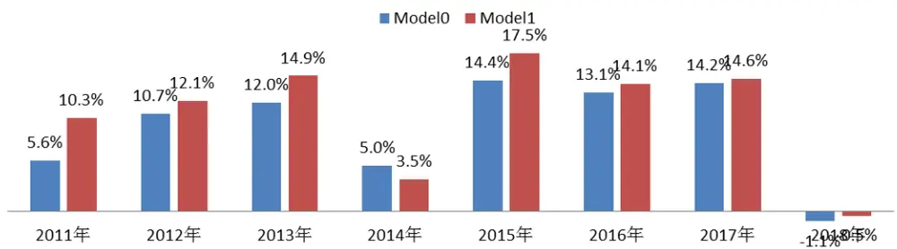

| 对冲年化收益 跟踪误差 |  |  | 信息比 | 月胜率 | 最大回测 | 月均换手 |
| --- | --- | --- | --- | --- | --- | --- |
| Model0 | 9.99% | 4.49% | 2.14 | 75.00% | 5.89% | 21.3% |
| model1 | 11.70% | 4.59% | 2.43 | 73.86% | 6.96% | 23.1% |

数据来源：wind 数据库、东方证券研究所

中证500全市场增强组合Model1相对Model0的收益率提升相当明显，年化对冲收益从13.78%大幅提升至 18.15%，而跟踪误差和最大回撤变化不大，相应的模型信息比大幅提升，而且 Model1各个年份的收益均高于 Model0，尤其 2011年至 2015年成长股较好的年份相对收益更加明显。

图 17：中证 500 全市场增强组合
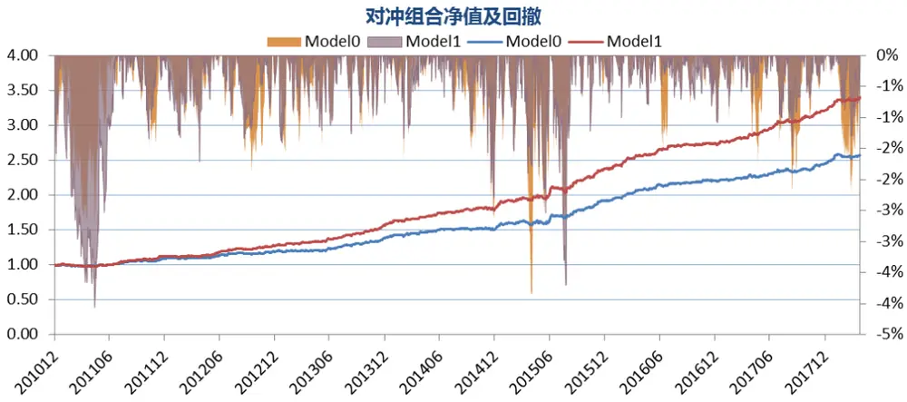

各年度对冲收益
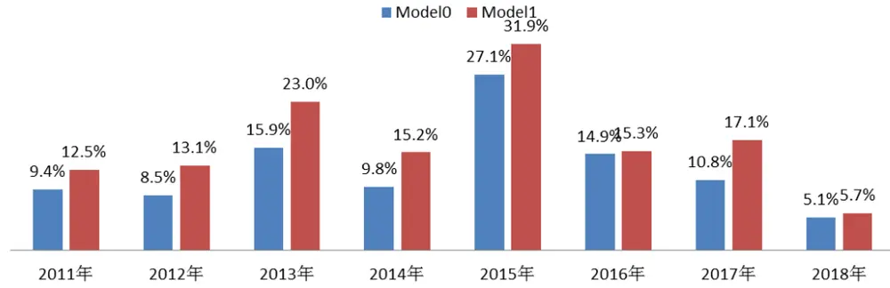

|  | 对冲年化收益 | 跟踪误差 | 信息比 | 月胜率 | 最大回测 | 月均换手 |
| --- | --- | --- | --- | --- | --- | --- |
| Model0 | 13.78% | 4.77% | 2.73 | 82.95% | 3.86% | 24.3% |
| model1 | 18.15% | 4.83% | 3.48 | 85.23% | 4.06% | 27.2% |

数据来源：wind 数据库、东方证券研究所

总体而言，对于各个增强组合在风险和换手相差不大的情况下，Model1 相对 Model0的对冲组合收益率均有一定幅度的提升，尤其是全市场增强中证500组合，年化对冲收益大幅提升4.37%，而且 Model1 相对 Model0的收益提升非常稳定，几乎每年均有所提升，这在一定程度上也说明了业绩超预期因子对组合增强业绩有明显的边际增量，而成长因子由于和业绩超预期因子信息重叠较大，在使用业绩超预期因子的前提下没有必要再用成长因子。

## 风险提示

1. 量化模型基于历史数据分析得到，未来存在失效的风险，建议投资者紧密跟踪模型表现。

2. 极端市场环境可能对模型效果造成剧烈冲击，导致收益亏损。

## 参考文献

[1]. Ball, R., & Brown, P. (1968). An empirical evaluation of accounting income numbers. Journal of accounting research, 159-178.

[2]. Bernard, V. L., & Thomas, J. K. (1989). Post-earnings-announcement drift: delayed price response or risk premium?. Journal of Accounting research, 1-36.

[3]. Jegadeesh, N., & Livnat, J. (2006). Revenue surprises and stock returns. Journal of Accounting and Economics, 41(1-2), 147-171.

[4]. Sadka, R. (2006). Momentum and post-earnings-announcement drift anomalies: The role of liquidity risk. Journal of Financial Economics, 80(2), 309-349.

[5]. Skinner, D. J., & Sloan, R. G. (2002). Earnings surprises, growth expectations, and stock returns or don't let an earnings torpedo sink your portfolio. Review of accounting studies, 7(2-3), 289-312.

[6]. Livnat, J., & Mendenhall, R. R. (2006). Comparing the post–earnings announcement drift for surprises calculated from analyst and time series forecasts. Journal of accounting research, 44(1), 177-205.

[7]. Ertimur, Y., Livnat, J., & Martikainen, M. (2003). Differential market reactions to revenue and expense surprises. Review of Accounting Studies, 8(2-3), 185-211.

## 分析师申明

每位负责撰写本研究报告全部或部分内容的研究分析师在此作以下声明：

分析师在本报告中对所提及的证券或发行人发表的任何建议和观点均准确地反映了其个人对该证券或发行人的看法和判断；分析师薪酬的任何组成部分无论是在过去、现在及将来，均与其在本研究报告中所表述的具体建议或观点无任何直接或间接的关系。

## 投资评级和相关定义

报告发布日后的 12个月内的公司的涨跌幅相对同期的上证指数/深证成指的涨跌幅为基准；

## 公司投资评级的量化标准

买入：相对强于市场基准指数收益率 15%以上；

增持：相对强于市场基准指数收益率 5%～15%；

中性：相对于市场基准指数收益率在-5%～+5%之间波动；

减持：相对弱于市场基准指数收益率在-5%以下。

未评级——由于在报告发出之时该股票不在本公司研究覆盖范围内，分析师基于当时对该股票的研究状况，未给予投资评级相关信息。

暂停评级——根据监管制度及本公司相关规定，研究报告发布之时该投资对象可能与本公司存在潜在的利益冲突情形；亦或是研究报告发布当时该股票的价值和价格分析存在重大不确定性，缺乏足够的研究依据支持分析师给出明确投资评级；分析师在上述情况下暂停对该股票给予投资评级等信息，投资者需要注意在此报告发布之前曾给予该股票的投资评级、盈利预测及目标价格等信息不再有效。

## 行业投资评级的量化标准：

看好：相对强于市场基准指数收益率 5%以上；

中性：相对于市场基准指数收益率在-5%～+5%之间波动；

看淡：相对于市场基准指数收益率在-5%以下。

未评级：由于在报告发出之时该行业不在本公司研究覆盖范围内，分析师基于当时对该行业的研究状况，未给予投资评级等相关信息。

暂停评级：由于研究报告发布当时该行业的投资价值分析存在重大不确定性，缺乏足够的研究依据支持分析师给出明确行业投资评级；分析师在上述情况下暂停对该行业给予投资评级信息，投资者需要注意在此报告发布之前曾给予该行业的投资评级信息不再有效。

## 免责声明

本证券研究报告（以下简称“本报告”）由东方证券股份有限公司（以下简称“本公司”）制作及发布。

本报告仅供本公司的客户使用。本公司不会因接收人收到本报告而视其为本公司的当然客户。本报告的全体接收人应当采取必要措施防止本报告被转发给他人。

本报告是基于本公司认为可靠的且目前已公开的信息撰写，本公司力求但不保证该信息的准确性和完整性，客户也不应该认为该信息是准确和完整的。同时，本公司不保证文中观点或陈述不会发生任何变更，在不同时期，本公司可发出与本报告所载资料、意见及推测不一致的证券研究报告。本公司会适时更新我们的研究，但可能会因某些规定而无法做到。除了一些定期出版的证券研究报告之外，绝大多数证券研究报告是在分析师认为适当的时候不定期地发布。

在任何情况下，本报告中的信息或所表述的意见并不构成对任何人的投资建议，也没有考虑到个别客户特殊的投资目标、财务状况或需求。客户应考虑本报告中的任何意见或建议是否符合其特定状况，若有必要应寻求专家意见。本报告所载的资料、工具、意见及推测只提供给客户作参考之用，并非作为或被视为出售或购买证券或其他投资标的的邀请或向人作出邀请。

本报告中提及的投资价格和价值以及这些投资带来的收入可能会波动。过去的表现并不代表未来的表现，未来的回报也无法保证，投资者可能会损失本金。外汇汇率波动有可能对某些投资的价值或价格或来自这一投资的收入产生不良影响。那些涉及期货、期权及其它衍生工具的交易，因其包括重大的市场风险，因此并不适合所有投资者。

在任何情况下，本公司不对任何人因使用本报告中的任何内容所引致的任何损失负任何责任，投资者自主作出投资决策并自行承担投资风险，任何形式的分享证券投资收益或者分担证券投资损失的书面或口头承诺均为无效。

本报告主要以电子版形式分发，间或也会辅以印刷品形式分发，所有报告版权均归本公司所有。未经本公司事先书面协议授权，任何机构或个人不得以任何形式复制、转发或公开传播本报告的全部或部分内容。不得将报告内容作为诉讼、仲裁、传媒所引用之证明或依据，不得用于营利或用于未经允许的其它用途。

经本公司事先书面协议授权刊载或转发的，被授权机构承担相关刊载或者转发责任。不得对本报告进行任何有悖原意的引用、删节和修改。

提示客户及公众投资者慎重使用未经授权刊载或者转发的本公司证券研究报告，慎重使用公众媒体刊载的证券研究报告。

## 东方证券研究所

地址：上海市中山南路 318 号东方国际金融广场 26 楼

联系人： 王骏飞

电话：021-63325888*1131

传真：021-63326786

网址： www.dfzq.com.cn

Email： wangjunfei@orientsec.com.cn