## 研究结论

反转和市值因子的失效触发了国内对因子择时的研究需求。海外市场和A股类似，因子择时研究的兴起也是由 2007.08 的“量化危机”和 2008 年金融危机触发。危机后估值、动量和质量因子的效果明显下降。报告汇总讨论了AQR、BlackRock、GSAM等几家大机构有关因子择时的研究成果。有乐观者、有悲观者。但Corbett(2016)实证发现风格切换频繁的基金经理的风格择时能力并不比一般基金经理强，而且业绩往往更差，这一定程度上展示了现实投资中因子择时的难度。

传统 OLS 方法不能用于金融时间序列的预测，因为金融数据中常见的变量内生性和持续性问题，会导致 OLS 估计有篇，且统计检验失效。报告采用了 Kostakis(2015)的 IVX回归法，可以应对前述问题，而且运算速度快，推荐投资者使用。

本报告用 1998.01 – 2018.04长达二十年的数据做实证研究，和之前业界做的比较多的近十年 Alpha因子研究相比，2000 – 2010十一年间估值因子的稳健表现、2000 – 2007 六年间小市值溢价的持续大幅回撤、2002 – 2016十五年间反转因子的持续强劲让人印象深刻。

基于全样本的 IVX回归分析显示，除去波动率因子外，其它 alpha因子都能在样本内找到显著的宏观或市场指标来预测下一个月的因子收益率。也就是说每个因子都有可能设计出一个样本内有效的因子择时策略，投资者需要区分择时模型样本内和样本外的表现。

- 在八大类因子中，市值因子的可预测性最强，2008.01 -2018.04 十年间，月度因子收益率有效预测占比有80.6%，方向准确率达到 73%，预测精度显著强于简单的滚动均值预测方法。当前市场环境下，市场波动率、换手率和PPI三个指标对下个月的市值因子收益率有显著预测作用。

- 对于反转因子，预测未来一个季度的收益率比预测未来一个月的因子收益率更准，有效预测占比 80.3%，方向准确率达到 73.5%。对反转因子有预测作用的都是偏技术的市场指标，目前需要关注市场波动率和换手率。

行业和市值风险中性化处理后，反转因子收益率仍有很强的可预测性，月度预测准确率可以达到 77%，但是有显著预测作用的预测指标变化较大，从这个角度讲，风险中性化让alpha因子变得更“复杂”。

总体来看，A股特有的反转和市值因子的可预测性较强，其它类 Alpha因子较弱。报告里用的都是一些常见宏观和市场指标来预测因子收益率，这里不排序某一类因子有因子专属且特别有效的预测指标的可能性，我们后续研究将持续关注

## 风险提示

- 量化模型失效风险

- 市场极端环境的冲击

报告发布日期2018 年 06 月 01 日

证券分析师朱剑涛

021-63325888*6077

zhujiantao@orientsec.com.cn

执业证书编号：S0860515060001

相关报告

| 业绩超预期类因子 2018-05-18 |
| --- |
| 协方差矩阵谱分解近似方法的补充 2018-04-04 |
| 风险模型提速组合优化的另一种方案 2018-03-28 |
| A 股小市值溢价的来源 2018-03-04 |
| 组合优化的若干问题 2018-03-01 |
| 基于风险监控的动态调仓策略 2018-02-22 |
| 反转因子择时研究 2018-02-21 |

## 一、研究现状和机构观点

反转和小市值这两个 A 股过去十年收益最高的因子在 2016 年底开始持续表现走弱甚至反向，投资者对市场风格择时的关注度陡然上升。和 A股类似，按照 Hua(2012) 和 Luo(2017) 的观点，海外投资者对因子择时的关注也主要是由两场危机触发：2007 年八月的“量化危机”（参考Khandani 2011）和 2008年的金融危机，危机后的因子收益和稳健性明显下降。

为比较海外市场选股因子在金融危机危机前后表现的变化，我们从对冲基金 AQR 官方网页上下载了几个常见选股因子的月度收益数据，这些因子包括：SMB(小市值 vs大市值), HML(低 PBvs 高 PB), UMD(强势股 vs 弱势股，动量效应), BAB (低 beta vs 高 beta）, QMJ（优质股 vs 劣质股），因子的具体定义可以参考 Asness(2017b)和 Frazzini(2014)。然后把月度收益率累积成净值数据，并取对数以方便比较，结果如图 1。

图 1：全球市场选股因子表现（累积对数净值）
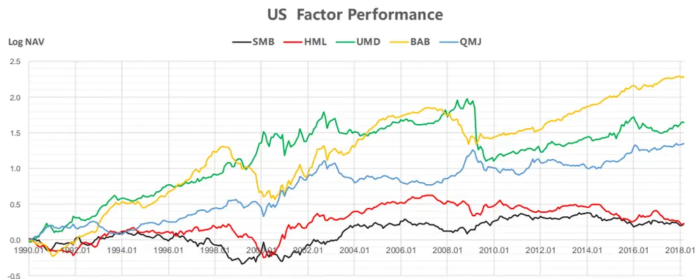

Global (Ex US) Factor Performance
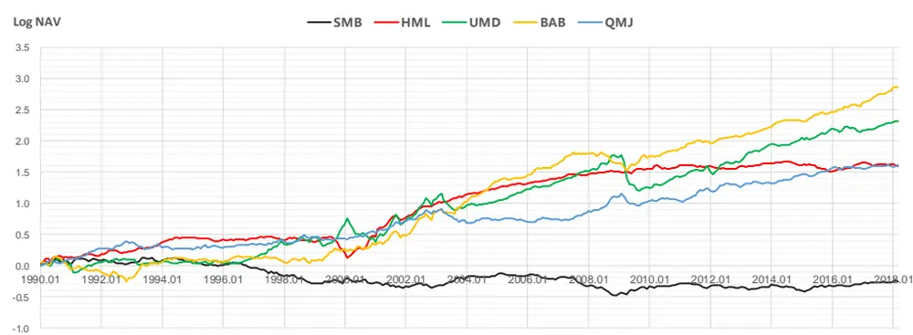
数据来源：东方证券研究所 & AQR.com

图 2 是图 1 对应的统计数据，可以看到 1990 年后美国市场的小市值溢价(SMB)已经非常弱，金融危机前比较有效的估值（HML）、动量（UMD）和质量（QMJ）因子的因子收益率和信息比都出现非常显著的下降。其中动量因子尤为明显，不过这主要是由于 2009.03 -2009.05 间的“动量崩盘”(Momentum Crash, Daniel (2013) )，系统性风险释放后，2010 年开始动量因子的平均年收益仍有 6.6%，但和金融危机前比降了 40%。 金融危机后唯一有提升的是 beta 因子（BAB），收益和稳定性提升显著。其它成熟市场(Global Ex US)上，估值因子在金融危机后也下降非常明显，几乎失效；动量和质量因子有所下降，但幅度不大;beta 因子危机后表现也大幅提升。数据直观上看，金融危机后，成熟市场投资者更偏好低风险（低 beta）股票。

图 2：全球市场选股因子金融危机前后表现统计

|  |  |  | SMB | HML | UMD | BAB | QMJ |
| --- | --- | --- | --- | --- | --- | --- | --- |
| US | 1990.01 -2008.12 | 平均年收益 | 1.1% | 3.0% | 11.4% | 8.1% | 6.7% |
|  |  | 信息比 平均年收益 | 0.11 1.5% | 0.31 -2.6% | 0.72 | 0.56 | 0.67 |
|  | 2009.01 -2018.03 | 信息比 | 0.21 | -0.32 | -1.2% -0.07 | 10.7% 1.27 | 2.3% 0.25 |
| Global (Ex US) | 1990.01 -2008.12 | 平均年收益 | -2.3% | 8.3% | 10.0% | 9.2% | 6.0% |
|  |  | 信息比 | -0.34 | 1.07 | 0.81 | 0.87 | 0.87 |
|  | 2009.01 -2018.03 | 平均年收益 | 2.6% | 1.1% | 7.0% | 13.7% | 5.8% |
|  |  | 信息比 | 0.48 | 0.22 | 0.55 | 1.90 | 0.81 |

数据来源：东方证券研究所 & AQR.com

因子收益率的下降引发了市场对量化投资是否趋同、过于拥挤的讨论。从目前最新的实证研究看，结论比较乐观。Gustafson(2010) 发现当前市场上量化基金收益率的相关性确实要比基本面型基金要强，但是和历史数据比，当前相关性并不算高；而且不同量化基金的因子风险暴露差异较大。Cahan(2013) 从因子投资机构的融券需求和因子组合内股票日内收益相关性入手分析，研究发现08年金融危机前，量化投资确实存在一定程度的拥挤现象，但当前市场（2012年底）的拥挤程度要比金融危机前好很多。不过严格的讲，这些实证报告大多是分析量化投资拥挤程度在时间序列上的变化，至于他们定义的拥挤程度指标和因子收益率之间是否有统计上的显著关系并没有验证。

早期因子择时相关文献中被引用较多的一篇是 AQR Asness(2000)，他从 Gorden 模型出发，股票预期收益可以表示为 ( ) ，其中 EP 是 PE 估值的倒数，g 是公司盈利的长期增长率。因子收益率多空组合的预期收益等于 top 组合预期收益减去 bottom 组合预期收益，利用上式可以表示为:

$$
\begin{array}{rl}{\mathrm{E}\big(\mathrm{R}_{\mathsf{top}}-R_{bot}\big)}&{{}=\big(EP_{top}-EP_{bot}\big)+(g_{top}-g_{bot})}\end{array}
$$

右式第一项称作估值价差（Value Spread），第二项称作成长价差（Growth Spread）。因此可以考虑用这两项来预测因子收益率。文献中，作者用 EP、BP、SP 复合因子来计算 Value Spread, 用IBES 数据库分析师的盈利预测值计算 Growth Spread，用他们来预测估值因子因子收益率。基于1982.01 至 1999.11 的数据，作者通过线性回归分析得到结论，这两个指标合在一起可以很好的预测未来一年的估值因子收益率，线性回归的 Adjusted R-Square 可以达到 38.7%，并据最新数据推断估值因子未来依然有效。需要注意的是，Asness(2000)在他们的报告中并未详细说明他们使用的线性回归分析方法，事实上从本文 2.3，2.4节的分析可以知道，回归分析方法对结论影响巨大；做金融时间序列长线预测时，因变量（未来一年因子收益率）数据之间有重叠(Overlap)，再加上自变量内生性(endogeneity) 和持续性(Persistence)问题，简单的 OLS 估计可能会有巨大偏差，无法使用传统方法做统计检验，R-Squared 也会虚高。因此 Asness(2000)的结果可能有待进一步验证。

Asness(2000)的报告引出了一个很重要的概念 Value Spread，它等于因子 top 组合和 bottom组合的估值差额。如果投资者在某段时间内集中使用同一个因子，买入因子 top 组合，卖空因子bottom 组合，会增加 top 组合和 bottom 组合的估值差，减小 Value Spread，因此它可以作为“因子的因子”来度量一个因子是不是太贵了，Value Spread 高的因子和高估值的股票一样，长期应该有回复均值的趋势，这是后续很多因子择时研究的一个出发点。

SSGA （ State Street Global Advisors ） 的 Thomas(2014) 和 Research Affiliates 的Arnott(2016, 2017) 沿用了这种思想，并开发了一种因子择时策略，把因子当前的 Value Spread 和其历史均值作比较，剔除那些估值较贵的因子，剩余因子等权处理。在他们的回溯测试中，这种动态模型相对静态模型，表现都有不同幅度的提升。Asness(2017a)参照这种择时方法，也进行了一个类似的测试，不过结论与前面两家机构差别较大，他发现 Value Spread 择时是一种反转型策略，它高度依赖于估值因子自身的表现，对于个别和估值负相关的因子，例如动量因子，这种择时策略比较有效。但对于风险已经足够分散的多因子组合，其改善不明显。而且投资者是用 EP 还是用BP 来计算 Value Spread 因子，得到的结论可能完全不一样。在 Clifford S. Asness 另外一篇有关因子择时的文章中( Asness 2016)，他对因子择时的建议是在 Value Spread 和历史相比处于极端状态使用，一般情况下不宜采用，在实际投资中给因子择时的权重不能太大。总体而言，CliffordS. Asness 虽然不排除因子择时的可能性，但对因子择时的观点偏悲观。不过也需要注意的是，Asness 关于因子择时的公开研究资料大多是基于 ValueSpread 这一种方法，由此得到的结论存在一定的局限性。

另外一家因子投资巨擘机构BlackRock的三位MD于2017年联合发表了一篇因子择时的文章（Hodges 2017），文章并没有说明模型的具体构建方法，只展示了原理和主要实证结论。他们用宏观经济周期相关指标、因子估值指标、因子强度指标（衡量因子收益率的动量效应）等来给估值、动量、质量、市值、波动率五个因子打分，然后输入到风险模型中进行优化得到因子配臵权重，实证发现这种动态因子配臵方法效果显著好于等权配臵。

花旗两位 MD 于 2015 年展示了一个因子择时模型（Miller 2015），他们基于一些宏观指标、和因子的基本面指标用决策树方法来预测因子未来的 IC值，舍弃预测 IC为负的因子，剩余因子等权，历史回溯显示该方法由于因子等权模型。

高盛资产管理（Goldman Sachs Asset Management）前 CIO Ronald Hua 于 2012 年推出过一个因子择时模型（Hua 2012），把因子的 IC 预测和 Qian(2004)提出的因子 IC_IR 最大化结合在一起。不过这个模型一个很大的缺陷是要求预测因子 IC 的变量满足多元联合正态分布，通过本文后面的实证分析可以看到，这个假设在真实数据中很难成立。而且我们在之前报告《Alpha因子库精简与优化》验证过因子 IC_IR 优化的方法，发现该方法提升复合因子 IC_IR 的代价是降低复合因子 IC，这个交换在追求收益、难加资金杠杆的 A股市场并不划算。

从公开发表论文的数量看，业界似乎对因子择时的观点总体偏乐观。但需要注意的是，公开文献存在选择性偏差，有比较好实证结果的文章更容易发表；对于那些没公布细节的模型，也很难仅从实证结果去判断模型的稳健性。Corbett(2016)实证分析了海外市场基金经理的风格择时能力，发现那些风格因子暴露经常变化、风格切换频繁的基金经理的风格择时能力并不比一般基金经理强，而且业绩往往更差，这一定程度上展示了现实投资中风格择时的难度。

## 二、研究方法

## 2.1 对 Alpha 因子还是风险因子择时？

实际股票量化投资中有两套因子体系：Alpha因子和风险因子，对其中任何一类择时都可以改变组合收益。Alpha因子择时是要决定用那些因子来给股票打分，风险因子择时是要决定是否严格控制组合在某个风险因子上的暴露。Alpha因子和风险因子并非两个互斥的概念，两者有重叠（参考前期报告《A股市场风险分析》），Alpha因子考察的是因子收益率在时间序列方向上的显著性，风险因子考察的是因子收益率在横截面上的显著性，时间序列上可以往复波动，不一定显著（例如行业因子）。而我们主要在时间序列方向上做因子择时（参考下一小节的讨论），alpha因子稳定性更强，比风险因子更适合做因子择时。

## 2.2 横截面选因子还是时间序列上做预测?

前面提到，ValueSpread 可以作为“因子的因子”看待。参考因子选股票的方法，我们可以在横截面上计算因子库里因子的 ValueSpread 数值和下一个月因子收益率的 IC，考察这个 IC 在时间序列方向上的显著性，依此判断这个“因子的因子”可否用来选因子。然后用多个“因子的因子”对因子进行打分，每期选出得分高的因子。这种横截面选因子的方法在 Hodges(2017) 和 Luo(2017)的报告里都有测试。

直觉上，这种用“因子的因子”选因子和用因子选股票的思路相同，而且机构的 Alpha 因子库里的因子数量可以扩展到 100个以上，因子样本量也足够。不过我们在前期报告《Alpha因子库精简与优化》中实证发现，Alpha因子数量虽然多，但实际上能提供独立信息源的 alpha因子非常有限；用我们报告里提出的逐步 Fama-MacBeth 回归方法可以得到一组正交化的 alpha因子，数量在二十个以内，且可以覆盖整个因子库的 alpha 信息。Feng(2017)的海外市场研究也能说明这一点，他们结合 LASSO 和 Fama-MacBeth 回归开发了一种检测方法考察新因子相对已有因子是否有信息增量，在 1994-2016年间发现的 99个因子中，如果控制对应文献发布前已有的因子，能通提供额外信息的因子只有14个。也就是说因子库数量虽然可以做的很大，但独立信息源并不多，横截面策略的有效广度不够。另外横截面方法里，“因子的因子”和因子之间的关系有时会很繁杂，例如 ValueSpread 和 Value 因子，这种叠加效应不易理清。我们更推荐序列上预测未来因子表现、继而决定是否使用该因子的择时方法。

## 2.3 OLS 线性回归方法是否可行？

因子选股属于横截面模型，OLS 线性回归是其中最常用、也是非常有效的一种建模方法，但在做时间序列预测时，这种方法可能会产生较大的估计偏差，得到错误的统计检验结论。造成这种现象的主要原因是金融时间序列数据会经常违背经典线性回归假设。

在经典线性回归中，因变量 Y和自变量 X假设为线性关系 ，为保证样本数量足够多时，OLS估计能够收敛于真实的 值（OLS估计量的一致性），需要做两个重要假设：

一个是自变量 X 的外生性（exogeneity），即 ( | ) ，此时 X 的变动和误差项 不相关，这个结论在金融时间序列预测时经常不成立，产生变量内生性（endogeneity）问题，例如学术研究中经常用股票市场的 EP（自变量 X）来预测未来一段时间的股市收益(因变量 Y)，这里 EP 包含了价格数据，而价格在时间序列上的变动即是收益率，因此和因变量 Y 之间会产生一定程度的关联。但在多因子选股，用横截面股票的 EP指标预测下一个月的股票收益，做横截面回归时不会出现这样的内生性问题，因为不同股票的价格和收益率之间不存在“价格变动等于收益率”这种关系。

另一个重要假设是变量X是平稳时间序列，方差不能趋于无穷大，否则OLS估计量不会收敛。但金融数据经常会呈现出非常强的近似非平稳性，例如后面实证中我们用了一些宏观指标和市场指标来预测因子收益，这些指标如果在时间序列上做 AR(1)自回归 $\mathtt{X_{t}}=\rho\cdot X_{t-1}+\epsilon$ ，其回归系数如下图所示。回归系数 很多都非常接近 1，也就是说这些序列都非常接近随机游走的非平稳状态。

图 3：常见宏观指标和市场指标的 AR(1)自回归系数

|  | EP | PPI | M2-M1 | 市场换手率 | 市场波动率 | ValueSpread | 上期因子 收益率 | 利率 |
| --- | --- | --- | --- | --- | --- | --- | --- | --- |
| ρ | 0.9994 | 0.9799 | 0.9282 | 0.9326 | 0.9199 | 0.9968 | 0.9818 | 0.9990 |

数据来源：东方证券研究所 & Wind 资讯

AR(1) 自回归的系数 $\rho$ 可以用来度量时间序列的持续性（Persistence）, $\mathbf{p}$ 值越大，时间序列前期数据扰动对后期的影响越大，持续性越强。为应对金融时间序列预测中经常出现的变量内生性和变量持续性问题，当前计量经济学中建模采用的多是下面这种预测回归（Predictive Regession）的形式：

$$
\mathbf{y_{t}}=\mu+A\cdot x_{t-1}+\epsilon_{t}
$$

$$
\mathbf{x}_{\mathsf{t}}=R_{n}\cdot x_{t-1}+u_{t},\quad R_{n}=I_{r}+C/n^{\alpha}
$$

其中 $\mathbf{l}\mathbf{X_{t}}$ 是一个 r维度向量, $I_{r}$ 是一个 r 维单位阵，回归变量的内生性可以通过 $\mathbf{\dot{\varepsilon}_{t}}$ 和 $\mathbf{]u_{t}}$ 的相关性表示，设臵不同的参数 C和 数值可以得到不同持续性的时间序列，此时 OLS估计是一个有偏估计。

Kostakis(2015) 扩展了 Phillips (2009)使用工具变量（Instrumental Variable）的参数估计方法（IVX），可以应对回归中的内生性问题，适用于几种常见持续性强度的时间序列（平稳序列、协整序列、近似协整序列、近似平稳序列），并且可以便捷的使用 Wald 统计量做假设检验。这种借用工具变量的回归方法在金融时间序列预测中普适性非常强，但代价是会降低估计量收敛于真实值的速度，作者通过 Monte-Carlo 模拟设定了工具变量的最优参数，使得收敛速度的下降仅从OLS 估计量的 ( ) 降为 ( ( ) )，影响非常有限。在有限样本数量下，统计检验犯第一类错误的概率接近预先设臵的臵信度水平。IVX回归的运算速度非常快，投资者可以考虑把它作为金融时间序列预测的一个基本工具。

## 2.4 长线预测结果是否更佳？

“长期来看”四个字估计国内证券投资界最常用的词汇之一，这个词隐含的是一种“动态均衡”的思想，短期市场会有非理性波动，长期来看会理性的回归到市场均衡；也就是说，市场的长期收益相对短期收益而言更具可预测性。事实上早期的实证研究确实支持这个结论。例如 Fama(1988)里提到的股票分红率、Campbell(1998) 提到的 EP 指标，回归结果显示它们对未来几年的市场收益率有显著预测作用，而且做长线预测（两年以上）时回归方程的 Rsquare 很高，可以达到 20%以上，但如果是做短线预测（月度或季度收益），回归方程的 Rsquare 不到 5%。不过后续的实证研究发现，之前这些结论可能只是统计方法上的谬误。

假设我们用当前的股市分红率 $\mathbf{x}_{\mathbf{t}-1}$ 预测未来一个月的股市收益 $\mathbf{r_{t}}$ ，回归方程表示为：

$$
\mathbf{r}_{\mathrm{t}}=\alpha+\beta\cdot x_{t-1}+\epsilon_{t}
$$

参数估计用到过去十年的数据，也就是 120 个数据样本。假设现在投资者想预测未来一年的股市收益，如果按 12 个月的长度切割原始数据，将只剩下 10 个样本，难以形成有效的参数估计。因此实际做长线预测时，会采用一种滚动窗口法来得到的更多数据样本，可以表示为：

$$
\begin{array}{r}{\mathbb{R}_{\mathsf{t},\mathsf{t}+11}=\theta+\phi\cdot\mathsf{x}_{\mathsf{t}-1}+\eta_{t},\quad R_{t,t+11}=r_{t}+r_{t+1}+\cdots+r_{t+11}}\end{array}
$$

这样形式上我们将获得 120-12 =108 个样本。但事实上，由于 $\mathrm{{^{\cdot}R_{t,t+11}}}$ 和 $\mathsf{IR}_{\mathsf{t}+1,\mathsf{t}+12}$ 有 11 个月的数据重叠（Overlap），自相关性非常高，有效的样本数量其实并没有增加这么多。关于这个问题，Boudoukh(2018)给了一个非常直观的说明。用 OLS回归做上述参数估计时，参数估计量的方差会受两个参数影响，一个是长线预测的时间长度 J（上例中，J=12）, 另一个是时间序列｛ ｝的持续性（用 AR(1)自回归的系数度量）。在 Boudoukh(2018)给的例子中，如果投资者用过去 50 年的分红率月度数据（共 600 个样本），来预测未来五年的股市收益，那么用上面 Overlap 方法将形式上得到 540个样本，但参数估计量的方差和用 12个独立的年收益率数据（不重叠）做参数估计得到的估计量方差一致，也就是说有效样本数量实际上只增加了两个（12 – 600/60 = 2）。标准的样本方差估计和考虑到序列自相关性的 Newey -West 调整都会低估估计量的真实方差，从而得到过大的 t 统计量，产生统计检验显著的假象，Rsquare 也会随着预测时间长度的增加而近似成比例增长（Boudoukh 2005）。

Kostakis(2015) 的 IVX 回归方法做适度调整可以应对上述长线预测过程中碰到的问题，他利用新方法实证发现，股市长线收益率的可预测性并没有增强，反而有一定程度的下降。下文实证中我们也将测试因子收益率的长线可预测性，希望借此避免不必要的组合换手。

## 三、实证结果

## 3.1 实证方法与数据

为保证足够多的样本数量，报告实证研究的时间设定为 1998.01 – 2018.04，近 20年时间。Alpha 因子采用的是一些比较典型且容易计算的因子（图 4），单个因子等权合成大类因子。

图 4：实证用到的 Alpha因子列表

| 因子类别 因子简称 |  | 因子说明 | 因子类别 | 因子简称 | 因子说明 |
| --- | --- | --- | --- | --- | --- |
|  | BP | Book Value to Price | Volaitility | VOL_1M | 最近一个月波动率 |
| Value | EP | Earnings to Price |  | IV_3M | 最近三个月特质波动率(基于FF3) |
|  | SP | Sales to Price |  |  |  |
|  | CFP | Cashflow to Price | Turnover | TO_1M | 最近一个月日均换手率 |
| Profit | ROE GPOA | Return on Equity | Reversal |  |  |
|  |  | Gross Profit on Asset |  | RET_1M | 最近一个月收益率 |
| Growth | Profit_Growth | TTM Profit Growth | ILLIQ |  |  |
|  | DeltaROE | ROE_t - ROE_t-1(年度变化) GPOA_t - GPOA_t-1(年度变化) |  | ILLIQ | Amihud(2002) illiquidity，最近三个月 |

数据来源：东方证券研究所

基于之前的文献研究成果，我们选取了一些常用的宏观和市场指标的月度数值作为 Alpha 因子收益率的预测变量（图 5）。对于单个 alpha因子而言，基于某些金融理论，有可能找到专属于此因子的指标，这个我们后续研究中会尝试。另外，在使用数据时我们没有考虑当月宏观数据实际公布时点滞后的问题，因为现在市场上已经有很多这种宏观指标的预测。实际投资中，投资者可以先通过回归分析找到因子收益率和这些指标的关系，再把当月指标的预测值输入进去得到下一期的因子收益率的预测值。因子收益率用因子 top 10%组合和 bottom 10%组合的收益率差表示。

图 5：预测因子收益率用到的宏观、市场指标

| 指标 | 指标说明 | 指标 | 指标说明 |
| --- | --- | --- | --- |
| EP | A股的 Earnings to Price | 市场换手率 | 以流动市值计算 |
| BP | A股的 Book value to Price | 市场波动率 | 按流通市值构建全市场指数，计算指数波动率 |
| CPI | 当月同比 | 资金敏感度 | 个股ILLIQ指标按流通市值加权 |
| PPI | 全部工业品当月同比 | ValueSpread | 因子TOP10%组合股票BP中位数除以BOT10%组合股票BP中位数 |
| M2-M1 | 同比增速差额 | 上期因子收益率 |  |
| 工业增加值变动 | 同比 | 利率 | 中债国债到期收益率(三个月) |
| 外汇储备变动 | 环比 | 期限利差 | 中债国债到期收益率(10年)-中债国债到期收益率(三个月) |
| 存款准备金率 | 大型存款机构 | 信用利差 | 中债企业债到期收益率(AAA,10年)-中债国债到期收益率(10年) |

数据来源：东方证券研究所

## 3.2 Alpha 因子二十年

我们之前的因子选股研究主要集中在最近十年，本报告是我们第一次把研究区间拓展到近二十年，发现很多和过去十年不一样的结论，因此这里单独总结讨论。我们测试了图 4 里七个合成的大类 alpha因子和市值因子，测试结果图表较多，放在报告附录里。因子未做任何风险中性化处理，如果投资者想要单个因子的测试结果可以和我们联系。主要结论包括：

1. 市值因子在 A 股过去二十年里表现总体非常强劲，最近一年半的大幅回撤让不少投资者措手不及，但这个回撤幅度和时长从历史看并不是最突出的。2002-2007 间，市值因子经历了持续六年的回撤，因子收益率最大回撤幅度超过 40%.

2. 估值因子如果不做行业和市值的风险中性化处理，最近十年表现不佳，容易让人产生一种“估值无用”的错觉。但往更长远的历史看，2000-2010 年，11年间，不做任何风险中性化处理的估值因子表现非常强劲，因子收益率回撤幅度很少超过 10%。以至于，考虑进最近几年的糟糕表现后，估值因子的 IC仍高达 0.05，IC_IR 超过 1。

3. 盈利因子在 A股长期来看基本无效，成长因子则相对要好很多。

4. 换手率和波动率因子在 A股长期非常有效，但都是赚空头的钱，多头超额收益不明显。

5. 反转因子的强势从 2002年初起步，持续到 2016年年底，跨度 15年。

6. ILLIQ 因子和市值因子高度相关，如果剔除掉市值效应，ILLIQ 因子从 2009 年才开始表现强劲。

## 3.3 样本内结果

首先，我们在整个样本区间内，拿单个因子的收益率对单个指标做回归，考察哪个指标在样本内对下一个月因子收益率有显著预测作用。作为对比，我们分别使用了标准的 OLS 回归和上文提到的 IVX 回归，结果如图 6 所示。回归系数后的一颗星、两颗星、三颗星分别代表回归系数在 10%、5%和 1%臵信度下显著不等于0，不显著的系数没有列出。从图中可以看到：

1) OLS回归和 IVX 结果差别巨大。最明显的是工业增加值同比变动指标，在 OLS回归下，它对五个因子的因子收益率都有显著预测作用，但如果考虑到回归变量的内生性和持续性问题，用 IVX回归的话，这个指标对任何因子收益率都没有显著预测作用。

2) 除去波动率因子，其它七个因子都有样本内显著的可用预测指标。基于这些指标，我们可以用回归或者其它方法设计出一个样本内有效的因子择时策略，但对投资而言，更重要的是这种择时策略样本外的效果。

3) 预测指标中，PPI、市场换手率、市场波动率的作用最明显，对多个因子下一个月的因子收益率有显著预测作用。市场估值和利率相关指标的预测作用不明显，海外文献研究里常用的 ValueSpread指标只对反转因子样本内有效。

图 6：全样本内一元回归的结果（OLS vs IVX, 1998.01 – 2018.04）

| OLS方法 | EP | BP CPI | PPI | 工业增加值 M2-M1 同比 | 外汇储备 环比变动 | 存款准备 金率 | 市场换手率 | 市场波动率 | 资金敏感度 ValueSpread | 上期因子 利率 收益率 | 期限利差 信用利差 |
| --- | --- | --- | --- | --- | --- | --- | --- | --- | --- | --- | --- |
| LogMV |  |  | -0.376*** | -0.259** | -0.674** | 0.183** | 0.068*** | 0.171*** | 0.147** |  |  |
| Value |  |  | 0.205** | 0.171** |  |  |  |  |  |  |  |
| Profit |  |  | 0.177** | 0.13* |  |  |  | -0.063** |  |  |  |
| Growth |  |  |  | 0.099** |  |  |  | -0.035* |  |  |  |
| Volatility | -0.287* |  |  |  |  |  |  |  | -0.167*** |  |  |
| Turnover |  |  | 0.181** |  |  |  | 0.039** |  |  |  | 2.576* |
| Reversal | 0.283* |  | 0.108* |  |  | 0.107* | 0.035* | 0.128*** |  |  |  |
| ILLIQ |  |  | -0.206** | -0.163* |  | 0.143* | 0.047** | 0.136*** |  |  |  |

| VX方法 EP | BP | CPI | PPI | 工业增加值 M2-M1 同比 | 外汇储备 环比变动 | 存款准备 金率 | 市场换手率 | 市场波动率 | 资金敏感度 ValueSpread | 上期因子 利率 收益率 | 期限利差 信用利差 |
| --- | --- | --- | --- | --- | --- | --- | --- | --- | --- | --- | --- |
| LogMV |  |  | -0.429*** |  | -0.87*** | 0.175** | 0.065** | 0.114*** |  |  |  |
| Value |  | 0.325* | 0.208** |  | 0.388** |  |  |  |  |  |  |
| Profit |  |  | 0.184** |  |  |  | -0.043** | -0.056* |  |  |  |
| Growth |  |  |  |  |  |  | -0.025* | -0.033* | -0.127* |  |  |
| Volatility |  |  |  |  |  |  |  |  |  |  |  |
| Turnover |  |  | 0.183** |  |  |  |  |  |  |  |  |
| Reversal |  |  |  | 0.113* |  |  | 0.032* |  | -0.032** -0.14** |  |  |
| ILLIQ |  |  | -0.257*** |  | -0.484** | 0.167** | 0.054** | 0.099*** |  |  |  |

数据来源：东方证券研究所 & Wind 资讯

## 3.4 短线样本外预测结果

上一节展示的是样本内结果，有一定的指示意义，但投资者更关心的是样本内有效的预测指标在样本外的表现，因此我们设计了一套滚动窗口的检测方法。

Step 1. 每个月月初，基于过去十年 120个月（N_roll = 120）的数据，用单个因子的因子收益率对单个预测指标做一元 IVX回归，看哪个指标显著（5%臵信度）。

Step 2. 如果有多个指标显著，则把它们合在一起做多元 IVX 回归，联合检验整个回归方程是否显著。如果显著，则代入最新的预测指标数据，预测下一期因子收益率。

Step 3. 如此滚动向前，重复前两步，统计预测结果的准确性。

在第一步，可能会出现某个因子在过去十年里一个显著预测指标都没有的情况，这时无法基于模型做预测。因子有显著预测指标时，我们称作这次预测是有效预测。对于这些有效预测，我们主要统计两个指标来评判模型预测准确度：一个是方向准确性，即模型预测涨跌和真实涨跌方向一致的比例；另一个是 MSE(Mean Squared Error)，它的计算式为

$$
\mathsf{mse}_{\mathsf{model}}=\sum_{t=1}^{T}(\widehat{r}_{t}-r_{t})^{2}/T
$$

其中 T是有效预测次数， $\widehat{r_{t}}$ 是模型预测的因子收益率， $\mathbf{r_{t}}$ 是真实因子收益率。

从 mse 绝对值大小无法判断模型是否预测准确，只能把它和另外的模型做对比。实务中一个常用的预测方法是用过去滚动两年因子收益率均值作为下一期的预测，此方法的MSE记作 $\mathrm{inse_{basic}}$ 然后可以计算样本外R-squared指标 $\mathtt{R}_{0\mathtt{S}}=1-mse_{model}/mse_{basic}$ 来度量两个模型的相对准确性。$\mathrm{R}_{0\mathrm{S}}>0\cdot$ 说明 $\mathrm{mse}_{\mathrm{model}}<mse_{basic}$ ，回归模型预测的更准确；反之，如果 ${\sf IR}_{0\mathrm{S}}<0$ ，说明回归模型没有简单的滚动均值模型预测准，没有回归建模的必要性。一个因子如果有效预测占比和方向预测准确率很高，MSE 明显小于滚动均值模型，说明因子收益率的可预测性强。实证结果见图 $7_{\circ}$

图 7：样本外滚动预测结果 $(\mathsf{N_{-}roll}=120,\mathsf{K}=1,2008.01-2018.04)$

|  | 有效预测次数 | 有效预测占比 | 方向准确率 | MSE | MSE (24个月滚动均值预测) (out of sample) | Rsquared | CW-pVal |
| --- | --- | --- | --- | --- | --- | --- | --- |
| LogMV | 100 | 80.6% | 73.0% | 0.003453 | 0.003889 | 0.112 | 0.006 |
| Value | 58 | 46.8% | 50.0% | 0.003982 | 0.004098 | 0.028 | 0.224 |
| Profit | 30 | 24.2% | 36.7% | 0.003458 | 0.002762 | -0.252 | 0.739 |
| Growth | 13 | 10.5% | 61.5% | 0.001542 | 0.001285 | -0.200 | 0.616 |
| Volatility | 120 | 96.8% | 62.5% | 0.003278 | 0.003301 | 0.007 | 0.131 |
| Turnover | 25 | 20.2% | 60.0% | 0.003930 | 0.003864 | -0.017 | 0.909 |
| Reversal | 96 | 77.4% | 58.3% | 0.001869 | 0.002046 | 0.087 | 0.011 |
| ILLIQ | 87 | 70.2% | 74.7% | 0.002756 | 0.002747 | -0.003 | 0.080 |

注：最后一列 CW 检验的 p值，参考 Clark(2007), 它比较的是 IVX回归模型和过去十年（和 N_roll 保证一致）滚动均值模型预测的准确性，原假设是回归模型不比滚动均值模型准确。

数据来源：东方证券研究所 & Wind 资讯

在样本外（2008.01 – 2018.04）124个月中，波动率因子能被上述指标有效预测的次数达到120 次，占比 96.8%，有效预测的准确率有 62.5%，算不上优秀。样本外 Rsquared 只有 0.007，和过去两年滚动均值法的预测准确度没有明显差异，和过去十年滚动均值法也无显著预测差异（CW-pval 0.131）。说明波动率因子的可预测性来自于其因子表现的长期稳定，可以直接用简单滚动平均方法预测，回归建模的增量意义不大。

有效预测占比第二高的是市值因子，达到 80.6%。而且在这些有效预测中，方向预测准确率高达 73%，样本外 Rsquared 达到 0.112，预测准确性明显比过去两年滚动平均法要强，也比过去十年滚动平均方法强（CW pval 只有 0.006）。在这个滚动预测过程中，有效预测指标在不停变化。如图 8所示，市场波动率是一个长期有效的预测指标，市场估值 BP、外汇储备变动和存款准备金率也曾阶段性的有效过，但近期失效，目前预测市值因子收益率显著有效的三个指标是：市场波动率、市场换手率和 PPI。结论和我们之前报告《A股小市值溢价的来源》里的结论一致，不过之前报告是一个样本内 OLS回归的结果，建模方法上有缺陷。

图 8：市值因子有效预测指标变化(N_roll =120, K =1, 2008.01 – 2018.04)
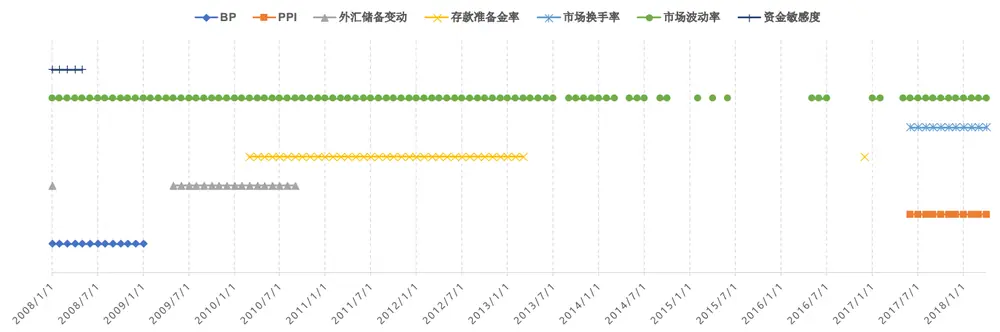
数据来源：东方证券研究所 & Wind 资讯

从时间序列上看 IVX 回归模型对市值因子收益率的预测准确性（图 9），2015 和 2016 两年里，回归模型基于过去滚动十年的数据找不到有效指标（灰色部分），其它月份基本都可以有效预测。特别是最近 12个月的风格预测中，模型方向只错了 3次。

图 9：IVX 回归模型预测市值因子收益率的方向准确性(N_roll =120, K =1, 2008.01 – 2018.04)
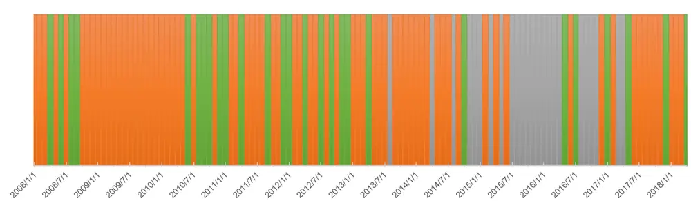
数据来源：东方证券研究所 & Wind 资讯

ILLIQ 因子和市值因子高度相关，有效预测占比和方向准确性也很高，但从模型 MSE 的相对大小看，它和直接滚动均值预测没有明显差别。Value、Profit、Growth、Turnover 的有效预测占比较低，也不适合用回归预测方法。反转因子有效预测占比、样本外 Rsquared 都不错，但预测方向准确率一般。后文实证发现，预测反转因子更长线（未来三个月）的收益效果会更好，下一节再做详细分析。

以上是用过去十年的数据做参数估计，也可以考虑用相对较短的数据样本训练模型，提升模型对市场变化的敏感度，但同时也会增加噪音数据对预测值的影响。图 10 和图 11 展示了用过去五年（N_roll = 60）和过去三年（N_roll =36）的预测结果，可以看到样本外 Rsquared 都是负值，模型预测精度还不如滚动均值方法，噪音对回归模型预测结果的影响增大。因子择时，我们建议用较长的时间（过去十年）来寻找历史规律。

图 10：样本外滚动预测结果（N_roll = 60, K =1, 2008.01 – 2018.04 ）

|  | 有效预测次数 | 有效预测占比 | 方向准确率 | MSE | MSE (24个月滚动均值预测) | Rsquared (out of sample) | CW-pVal |
| --- | --- | --- | --- | --- | --- | --- | --- |
| LogMV | 63 | 50.8% | 68.3% | 0.007769 | 0.007721 | -0.006 | 0.005 |
| Value | 45 | 36.3% | 55.6% | 0.004115 | 0.002601 | -0.582 | 0.943 |
| Profit | 18 | 14.5% | 66.7% | 0.000934 | 0.000875 | -0.068 | 0.062 |
| Growth | 62 | 50.0% | 58.1% | 0.000685 | 0.000640 | -0.071 | 0.358 |
| Volatility | 72 | 58.1% | 52.8% | 0.003289 | 0.002684 | -0.226 | 0.828 |
| Turnover | 23 | 18.5% | 43.5% | 0.005361 | 0.004023 | -0.333 | 0.905 |
| Reversal | 110 | 88.7% | 60.0% | 0.003212 | 0.002844 | -0.130 | 0.171 |
| ILLIQ | 53 | 42.7% | 62.3% | 0.003884 | 0.003115 | -0.247 | 0.134 |

数据来源：东方证券研究所 & Wind 资讯

图 11：样本外滚动预测结果（N_roll = 36, K =1, 2008.01 – 2018.04 ）

|  | 有效预测次数 | 有效预测占比 | 方向准确率 | MSE | MSE (24个月滚动均值预测) | Rsquared (out of sample) | CW-pVal |
| --- | --- | --- | --- | --- | --- | --- | --- |
| LogMV | 74 | 59.7% | 51.4% | 0.014160 | 0.008313 | -0.703 | 0.339 |
| Value | 58 | 46.8% | 46.6% | 0.007390 | 0.003259 | -1.268 | 0.938 |
| Profit | 33 | 26.6% | 51.5% | 0.002188 | 0.001813 | -0.207 | 0.106 |
| Growth | 57 | 46.0% | 59.6% | 0.000854 | 0.000561 | -0.522 | 0.295 |
| Volatility | 46 | 37.1% | 45.7% | 0.005272 | 0.002796 | -0.886 | 0.951 |
| Turnover | 31 | 25.0% | 38.7% | 0.009903 | 0.004995 | -0.983 | 0.988 |
| Reversal | 109 | 87.9% | 61.5% | 0.003180 | 0.002795 | -0.138 | 0.053 |
| ILLIQ | 43 | 34.7% | 51.2% | 0.008645 | 0.005000 | -0.729 | 0.703 |

数据来源：东方证券研究所 & Wind 资讯

## 3.5 长线样本外预测结果

对于大型机构投资者而言，月频预测可能过于频繁，可以考虑更长线的预测。我们尝试了未来3个月、6个月、12个月的因子收益率预测。从结果看，6个月和 12个月的长线预测基本不可行，这里只展示三个月的结果（图 12），

图 12：样本外滚动预测结果（N_roll = 120, K =3 , 2008.01 – 2018.04）

|  | 有效预测次数 | 有效预测占比 | 方向准确率 | MSE | MSE (24个月滚动均值预测) | Rsquared (out of sample) | CW-pVal |
| --- | --- | --- | --- | --- | --- | --- | --- |
| LogMV | 81 | 66.4% | 70.4% | 0.012275 | 0.014543 | 0.156 | 0.007 |
| Value | 59 | 48.4% | 59.3% | 0.010113 | 0.010697 | 0.055 | 0.554 |
| Profit | 97 | 79.5% | 46.4% | 0.007466 | 0.006499 | -0.149 | 0.967 |
| Growth | 13 | 10.7% | 61.5% | 0.005297 | 0.005392 | 0.018 | 0.814 |
| Volatility | 38 | 31.1% | 76.3% | 0.005679 | 0.006874 | 0.174 | 0.331 |
| Turnover | 76 | 62.3% | 67.1% | 0.007217 | 0.007509 | 0.039 | 0.639 |
| Reversal | 98 | 80.3% | 73.5% | 0.005646 | 0.006458 | 0.126 | 0.040 |
| ILLIQ | 78 | 63.9% | 75.6% | 0.007187 | 0.007348 | 0.022 | 0.001 |

数据来源：东方证券研究所 & Wind 资讯

和一个月的预测结果比，有显著提升的主要是反转因子，有效预测占比、方向准确率和样本外Rsquared 都有明显改善。从这个角度讲，反转因子更适合做季度频率的预测。其有效预测指标的变化如图 13所示，2015年之前“前三个月因子收益率”和Value Spread 对未来三个月的反转因子收益率有非常显著且持续的预测作用，但最近几年失效，目前对反转因子收益预测比较有效的主要是市场波动率和市场换手率。对反转因子有预测能力的指标大多偏技术。

图 13：反转因子有效预测指标变化(N_roll =120, K =3, 2008.01 – 2018.04)
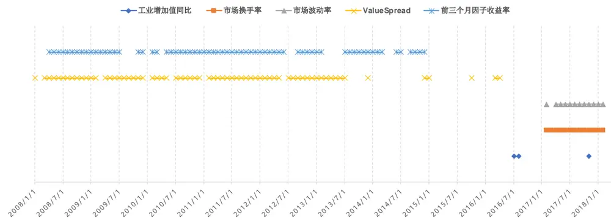
数据来源：东方证券研究所 & Wind 资讯

从预测准确度的时间变化来看（图 14），和市值因子比较类似，2015、2016 两年间，回归模型经常识别不出有效的预测指标。模型最近半年的预测全对。

图 14：IVX 回归模型预测反转因子收益率的方向准确性(N_roll =120, K =3, 2008.01 – 2018.04)无预测 正确 错误
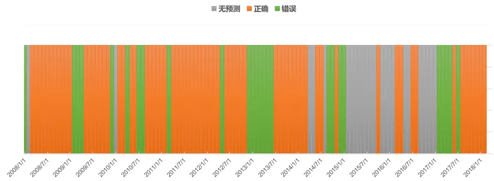
数据来源：东方证券研究所 & Wind 资讯

## 3.6 风险中性化影响

做指数增强策略时，为控制跟踪误差，需要做策略组合的主动风险暴露控制，对应的 alpha因子也要做风险中性化处理，此时需要关注的是中性化以后的因子收益率。下面我们测试了常用的行业市值中性化后的因子择时策略效果。风险中性化对因子择时策略可能有正反两面影响，一方面风险中性化过程剔除了行业和市值这两个风险因子波动的影响，因子变得更纯粹，直觉上应该会相对好预测一些；另一方面，每个月横截面上，Alpha因子与行业、市值因子的相关性会随时间变化，横截面回归系数每期都在变，增加回归得到的中性化因子的不确定性，降低可预测性。图15展示了之前七大类 Alpha 因子做行业和市值中性化处理后，因子收益率通过 IVX 回归方法预测结果。由于中信一级行业分类数据从 2003年才开始有，数据滚动窗口为十年，因此下图数据对应的样本外时间段是2013.01 –2018.04，和之前不一样。综合有效预测占比、方向准确率和样本外Rsquared三项指标看，反转因子的可预测性最强，月度预测方向准确率达到 73.8%（图 16）

图 15：样本外滚动预测结果（N_roll = 120, K =1，因子风险中性化, 2013.01 – 2018.04 ）

|  | 有效预测次数 | 有效预测占比 | 方向准确率 | MSE | MSE (24个月滚动均值预测) | Rsquared (out of sample) | CW-pVal |
| --- | --- | --- | --- | --- | --- | --- | --- |
| Value | 61 | 95.3% | 55.7% | 0.001753 | 0.001821 | 0.038 | 0.045 |
| Profit | 14 | 21.9% | 85.7% | 0.000751 | 0.000506 | -0.483 | 0.964 |
| Growth | 30 | 46.9% | 60.0% | 0.000376 | 0.000381 | 0.015 | 0.796 |
| Volatility | 63 | 98.4% | 61.9% | 0.002180 | 0.001972 | -0.105 | 0.346 |
| Turnover | 37 | 57.8% | 81.1% | 0.001644 | 0.001596 | -0.030 | 0.637 |
| Reversal | 61 | 95.3% | 73.8% | 0.001571 | 0.001764 | 0.110 | 0.022 |
| ILLIQ | 30 | 46.9% | 63.3% | 0.001379 | 0.001353 | -0.019 | 0.398 |

数据来源：东方证券研究所 & Wind 资讯

图 16：IVX 回归模型预测反转因子收益率的方向准确性(N_roll =120, K =1，反转因子做行业市值中性化处理, 2013.01 – 2018.04)无预测 正确 错误
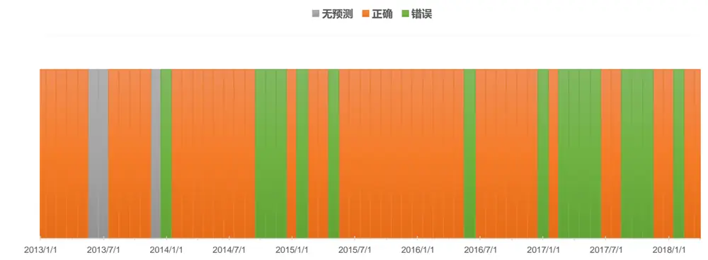
数据来源：东方证券研究所 & Wind 资讯

模型在 2017 年反转因子失效期间表现不佳，2017 全年有八个月预测错误，这和模型的滚动窗口设臵成十年太长有关，对近期市场变化反应不灵敏。但如果把滚动窗口设臵成五年或更短，模型 2017年表现会相对好些，但历史上预测整体的 MSE 会提升。Pesaran(2011)提供了一种经验做法，把不同长度滚动窗口的模型预测值进行加权，这样可以增加最终预测结果中近期数据的权重，提升模型的敏感性。我们用这个方法进行了测试，模型预测的方向准确度可以提升到 77%，2017全年的预测半对半错，同时样本外的 Rsquared 可以略微提升到 0.115，预测效果有所改善。

另外比较有意思的地方的是，在未做行业和市值中性化时，对反转因子有预测作用的基本上是像市场波动率、换手率这样偏技术的指标，但是做了风险中性化，像 PPI、工业增加值变化这样的宏观指标对其也有预测作用，从这个角度讲，风险中性化反而让因子变复杂了。

图 17：反转因子有效预测指标变化(N_roll =120, K =1，反转因子做行业市值中性化处理, 2013.01 – 2018.04)
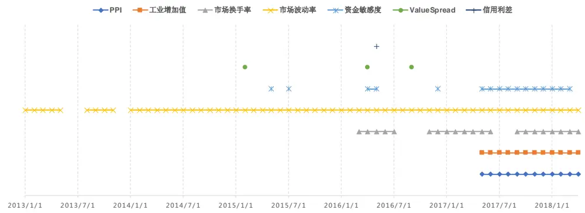
数据来源：东方证券研究所 & Wind 资讯

以上有关反转因子的结论和我们之前报告《反转因子择时》基本一致，但需要注意几个差别的地方：

1） 前期报告里我们用的是一个复合反转因子，由一个月反转，三个月反转，处臵效应，乒乓球反转，一个月特异度五个因子风险中性化后等权合成；本报告只用了一个月反转因子。我们也用 IVX方法测试了复合反转因子，结果和单因子基本相当。

2） 之前报告里的结果部分属于样本内，虽然回归预测也是滚动窗口法，但为什么只用市场波动率、换手率和资金敏感度三个因子其实是基于全样本的样本内检验。从图17可以看到，中性化后反转因子的有效预测指标变化实际非常频繁，之前报告里的做法有局限。

3） 之前报告里用的 OLS 回归，这里用的是 IVX 回归，方法上更稳健。

预测完因子收益率后，下一步是要把因子收益率转换成多因子打分里的因子权重，这一步的做法没有固定模式。Hodges(2017)和 Hua(2012)采用的是模型优化的方法，Miller(2015)采用的则是偏经验的方法。复杂模型不一定比简单模型好，因为复杂模型要估计的参数更多，不一定估计的准。转换方法的不同会对策略组合的收益产生影响。之前报告《反转因子择时》中提供了一种可行方式，感兴趣的投资者可以参阅。

## 四、总结

因子择时策略的核心是预测，两点需要着重关注：一是区分样本内跟样本外，二是使用稳健的统计方法。和多因子选股的横截面回归不同，金融时间序列方向的回归预测必须考虑变量的内生性和持续性问题，报告中提到的 IVX 回归是针对此类问题的一种高效方法，建议投资者使用。从目前测试的实证结果看，A股特有的两个因子：市值和反转，可以通过回归模型进行较好的预测。市值和反转因子收益率的预测都需要关注市场波动率和换手率指标，市值效应还需额外关注 PPI 指标。利用 IVX 回归模型，月度市值因子收益率和季度反转因子收益率的样本外预测方向准确度都可以达到 70%以上，其它类别的 alpha 因子可预测性相对要弱不少。报告里用的都是一些常见宏观和市场指标来预测因子收益率，这里不排序某一类因子有因子专属且特别有效的预测指标的可能性，我们后续研究将持续关注。

## 风险提示

1. 量化模型基于历史数据分析得到，未来存在失效的风险，建议投资者紧密跟踪模型表现。

2. 极端市场环境可能对模型效果造成剧烈冲击，导致收益亏损。

## 参考文献

[1]. Arnott, R., Beck, N., Kalesnik, V., West, J., (2016), “How can Smart Beta Go Horribly Wrong”,Fundamentals, Research Affiliates

[2]. Arnott, R., Beck, N., Kalesnik, V., (2017), “Forecasting Factor and Smart Beta Returns”, White paper, Research Affiliates

[3]. Asness, C.S., (2016), “The Siren Song of Factor Timing”, the Journal of Portfolio Management, Vol. Special Issue, No. 1, 2016.

[4]. Asness, C.S., Chandra, S., Ilmanen, A., Israel, R., (2017a), “Contrarian Factor Timing is Deceptively Difficult”. Journal of Portfolio Management, Forthcoming. Available at SSRN: https://ssrn.com/abstract=2928945

[5]. Asness, C. S., Frazzini, A., and Pedersen, L.H., (2017b), “Quality Minus Junk”, AQR working paper, Available at SSRN: https://ssrn.com/abstract=2312432.

[6]. Asness, C.S., Friedman, J.A., Krail, R.J., Liew, J.M., (2000), “ Style Timing : Value versus Growth”, the Journal of Portfolio Management, 26(3), pp: 50-60

[7]. Boudoukh, J., Israel, R., Richardson, M.P., (2018), “Long Horizon Predictability: A Cautionary Tale”, Available at SSRN: https://ssrn.com/abstract=3142575

[8]. Boudoukh, J., Richardson, M.P., Whitelaw, R., (2005), “The Myth of Long-Horizon Predictability”, NBER Working Paper No. w11841. Available at SSRN: https://ssrn.com/abstract=893380

[9]. Cahan, R., Luo, Y., (2013), “Standing Out From the Crowd: Measuring Crowding in Quantitative Strategies”, The Journal of Portfolio Management, 39 (4), pp:14-23

[10]. Campbell, J.Y., Shiller, R.J.,(1998), “Stock Prices, Earnings, and Expected dividends”, Journal of Finance, 43(3), pp: 661- 676.

[11]. Clark, T.E., West, K.D., (2007), “Approximately normal tests for equal predictive accuracy in nested models”, Journal of Econometrics, 33(1), pp:3-56

[12]. Corbett, A.J., (2016), “Are Style Rotating Funds Successful at Style Timing? Evidence from the US Equity Mutual Fund Market”. Available at SSRN: https://ssrn.com/abstract=2736672

[13]. Feng, G.H., Stefano, G., Xiu, D.C., (2017), “Taming the Factor Zoo”. Fama-Miller Working Paper Forthcoming; Chicago Booth Research Paper No. 17-04.

[14]. Fama, E., French,K.R., (1988), “Dividends yields and expected returns”, Journal of Financial Economics, 22, pp: 23-49

[15]. Frazzini, A., Pederson, L.H., (2014), “Betting Agains Beta”, Journal of Financial Economics, 111(1), pp: 1-25

[16]. Gustafson, K., Halper, P., (2010), “Are Quants All Fishing in the Same Small Pond with the Same Tackle Box?”, The Journal of Investing, 19(4).

有关分析师的申明，见本报告最后部分。其他重要信息披露见分析师申明之后部分，或请与您的投资代表联系。并请阅读本证券研究报告最后一页的免责申明。

[17]. Hodges, P., Hogan, K., Peterson, J., Ang, A., (2017), „Factor Timing with Cross Sectional and Time-Series Predictors”, the Journal of Portfolio Management, 44(1), pp:30-43

[18]. Hua,R., Kantsyrev, D., Qian, E., (2012), “Factor – Timing Model”, the Journal of Porfolio Management, 39(1), pp: 75-87.

[19]. Khandani, A., Lo,A., (2011), “What happened to the quants in August 2007? Evidence from factors and transactions data”, Journal of Financial Markets, 14(1), pp: 1-46.

[20]. Kostakis,A., Magdalinos, T., Stamatogiannis,P., (2015). "Robust Econometric Inference for Stock Return Predictability," Review of Financial Studies, Society for Financial Studies, 28(5), pp: 1506-1553.

[21]. Luo, Y., (2017), “Style Factor Timing”, Factor Investing – from Traditional to Alternative Risk Premia, ISTE press, pp: 127-153.

[22]. Miller, K., Li, H., Zhou, T.G., Giamouridis, D., (2015) , “ A Risk-Oriented Model for Factor Timing Decisions”, The Journal of Portfolio Management, 41 (3), pp: 46-58

[23]. Pesaran, M.H., Pick, A., (2011), “Forecast Combination Across Estimation Windows”, Journal of Business & Economic Statistics, 29(2), pp:307-318.

[24]. Phillips, P., Magdalinos, T., (2009), “ Econometric inference in the vicinity of unity”, Singapore, SG. Singapore Management University working paper.

[25]. Qian,E., Sorensen, E., Hua, R., Schoen, R., (2004), ”Multiple Alpha Sources and Active Management”, The Journal of Portfolio Management, 30(winter 2004), pp:39 -45

[26]. Thomas, R.,Shapiro, R., (2014), “Dynamic Timing of Advanced Beta Strategies: Is It Possible?”, State Street Global Advisors, IQ Insights.

## 附录

图 18：市值因子测试（1998.01 – 2018.04）
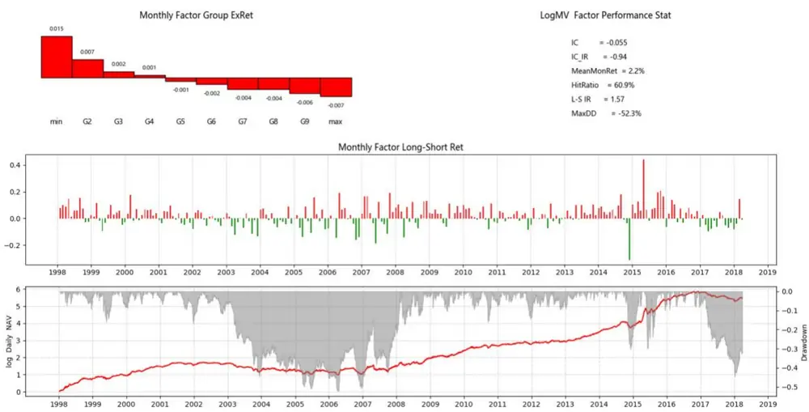
数据来源：东方证券研究所 & Wind 资讯

图 19：Value 因子测试（1998.01 – 2018.04）
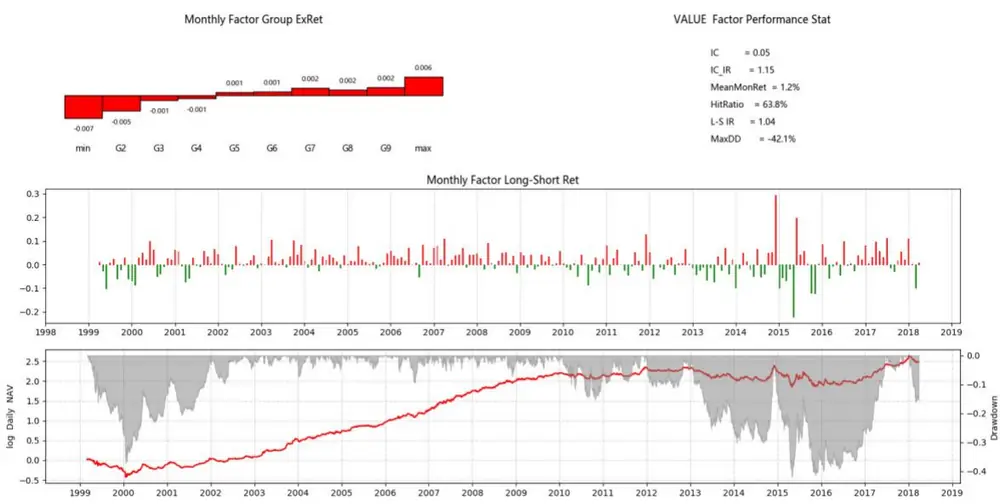
数据来源：东方证券研究所 & Wind 资讯

图 20：Profit 因子测试（1998.01 – 2018.04）
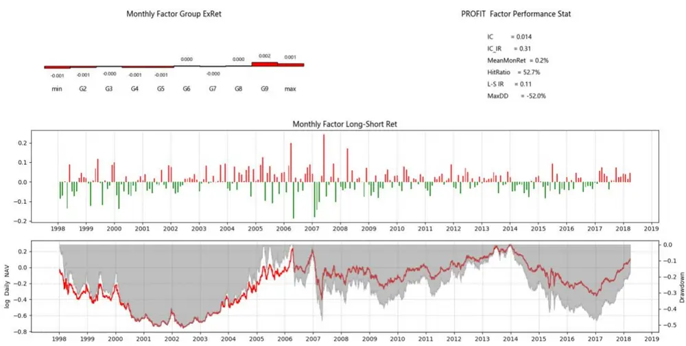
数据来源：东方证券研究所 & Wind 资讯

图 21：Growth 因子测试（1998.01 – 2018.04）
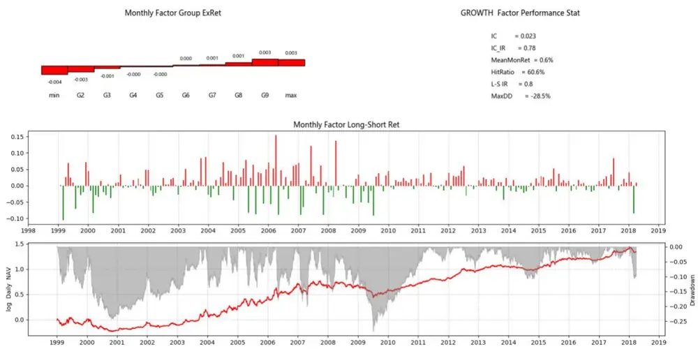
数据来源：东方证券研究所 & Wind 资讯

图 22：Volatility 因子测试（1998.01 – 2018.04）
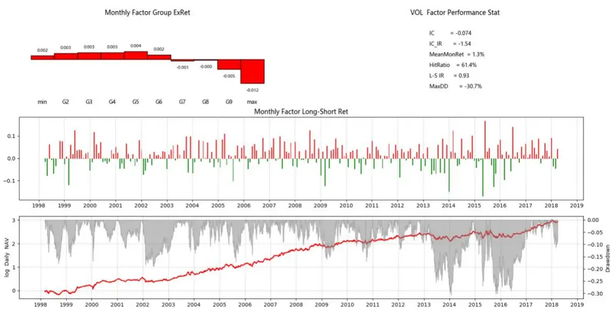
数据来源：东方证券研究所 & Wind 资讯

图 23：Turnover 因子测试（1998.01 – 2018.04）
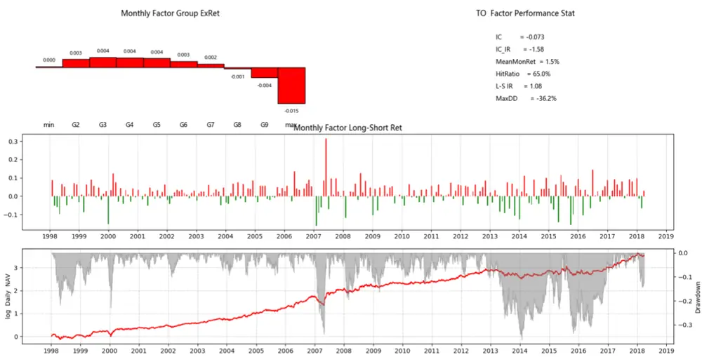
数据来源：东方证券研究所 & Wind 资讯

图 24：Reversal 因子测试（1998.01 – 2018.04）
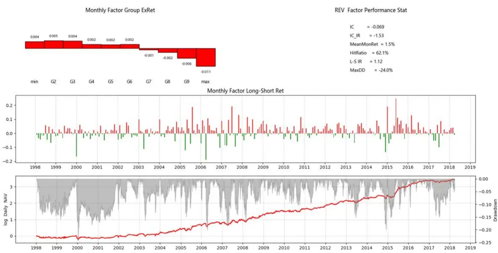
数据来源：东方证券研究所 & Wind 资讯

图 25：ILLIQ 因子测试（1998.01 – 2018.04）
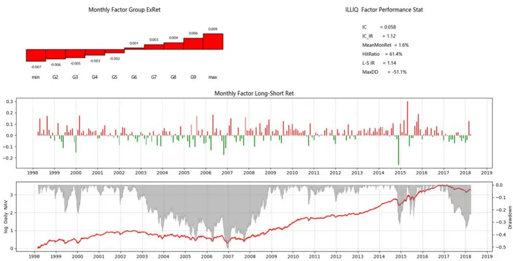
数据来源：东方证券研究所 & Wind 资讯

## 分析师申明

每位负责撰写本研究报告全部或部分内容的研究分析师在此作以下声明：

分析师在本报告中对所提及的证券或发行人发表的任何建议和观点均准确地反映了其个人对该证券或发行人的看法和判断；分析师薪酬的任何组成部分无论是在过去、现在及将来，均与其在本研究报告中所表述的具体建议或观点无任何直接或间接的关系。

## 投资评级和相关定义

报告发布日后的 12个月内的公司的涨跌幅相对同期的上证指数/深证成指的涨跌幅为基准；

## 公司投资评级的量化标准

买入：相对强于市场基准指数收益率 15%以上；

增持：相对强于市场基准指数收益率 5%～15%；

中性：相对于市场基准指数收益率在-5%～+5%之间波动；

减持：相对弱于市场基准指数收益率在-5%以下。

未评级——由于在报告发出之时该股票不在本公司研究覆盖范围内，分析师基于当时对该股票的研究状况，未给予投资评级相关信息。

暂停评级——根据监管制度及本公司相关规定，研究报告发布之时该投资对象可能与本公司存在潜在的利益冲突情形；亦或是研究报告发布当时该股票的价值和价格分析存在重大不确定性，缺乏足够的研究依据支持分析师给出明确投资评级；分析师在上述情况下暂停对该股票给予投资评级等信息，投资者需要注意在此报告发布之前曾给予该股票的投资评级、盈利预测及目标价格等信息不再有效。

## 行业投资评级的量化标准：

看好：相对强于市场基准指数收益率 5%以上；

中性：相对于市场基准指数收益率在-5%～+5%之间波动；

看淡：相对于市场基准指数收益率在-5%以下。

未评级：由于在报告发出之时该行业不在本公司研究覆盖范围内，分析师基于当时对该行业的研究状况，未给予投资评级等相关信息。

暂停评级：由于研究报告发布当时该行业的投资价值分析存在重大不确定性，缺乏足够的研究依据支持分析师给出明确行业投资评级；分析师在上述情况下暂停对该行业给予投资评级信息，投资者需要注意在此报告发布之前曾给予该行业的投资评级信息不再有效。

## 免责声明

本证券研究报告（以下简称“本报告”）由东方证券股份有限公司（以下简称“本公司”）制作及发布。

本报告仅供本公司的客户使用。本公司不会因接收人收到本报告而视其为本公司的当然客户。本报告的全体接收人应当采取必要措施防止本报告被转发给他人。

本报告是基于本公司认为可靠的且目前已公开的信息撰写，本公司力求但不保证该信息的准确性和完整性，客户也不应该认为该信息是准确和完整的。同时，本公司不保证文中观点或陈述不会发生任何变更，在不同时期，本公司可发出与本报告所载资料、意见及推测不一致的证券研究报告。本公司会适时更新我们的研究，但可能会因某些规定而无法做到。除了一些定期出版的证券研究报告之外，绝大多数证券研究报告是在分析师认为适当的时候不定期地发布。

在任何情况下，本报告中的信息或所表述的意见并不构成对任何人的投资建议，也没有考虑到个别客户特殊的投资目标、财务状况或需求。客户应考虑本报告中的任何意见或建议是否符合其特定状况，若有必要应寻求专家意见。本报告所载的资料、工具、意见及推测只提供给客户作参考之用，并非作为或被视为出售或购买证券或其他投资标的的邀请或向人作出邀请。

本报告中提及的投资价格和价值以及这些投资带来的收入可能会波动。过去的表现并不代表未来的表现，未来的回报也无法保证，投资者可能会损失本金。外汇汇率波动有可能对某些投资的价值或价格或来自这一投资的收入产生不良影响。那些涉及期货、期权及其它衍生工具的交易，因其包括重大的市场风险，因此并不适合所有投资者。

在任何情况下，本公司不对任何人因使用本报告中的任何内容所引致的任何损失负任何责任，投资者自主作出投资决策并自行承担投资风险，任何形式的分享证券投资收益或者分担证券投资损失的书面或口头承诺均为无效。

本报告主要以电子版形式分发，间或也会辅以印刷品形式分发，所有报告版权均归本公司所有。未经本公司事先书面协议授权，任何机构或个人不得以任何形式复制、转发或公开传播本报告的全部或部分内容。不得将报告内容作为诉讼、仲裁、传媒所引用之证明或依据，不得用于营利或用于未经允许的其它用途。

经本公司事先书面协议授权刊载或转发的，被授权机构承担相关刊载或者转发责任。不得对本报告进行任何有悖原意的引用、删节和修改。

提示客户及公众投资者慎重使用未经授权刊载或者转发的本公司证券研究报告，慎重使用公众媒体刊载的证券研究报告。

## 东方证券研究所

地址：上海市中山南路 318 号东方国际金融广场 26 楼

联系人： 王骏飞

电话：021-63325888*1131

传真：021-63326786

网址： www.dfzq.com.cn

Email： wangjunfei@orientsec.com.cn