## 研究结论

本篇报告主要研究了研发营收比因子在各个行业内的效果，从单因子测试角度来看，研发营收比在高科技行业(医药、电子、通讯、计算机)都有一定的效果，但是在构建行业内增强组合后，发现因子在医药和计算机行业有比较明显的新 alpha贡献，在另外两个行业内新增强组合与原组合表现基本不变。

我们构建了中证 500内和创业板指医药计算机增强组合，其中中证 500内医药计算机增强组合相比于原来的常规组合年化对冲收益提升 1.3%，信息比提升 0.2，最大回撤降低 1.8%，效果还是比较显著的，但由于本身这两个行业在中证 500 内占比在 15%左右，所以这样的改进对整个 500 增强的效果比较有限。创业板指医药计算机增强组合是以创业板综的对应成分股构建的，新的组合相比于原来的组合年化对冲收益提升1.1%，信息比从 0.43提升到 0.58，最大回撤下降近 1%，因为这两个行业在创业板指中占比较高约为 30%，所以我们进一步构建了分块建模的创业扳指增强组合，新的组合年化对冲收益提升 0.37%，最大回撤下降 1%。

研发营收比因子主要适用于高科技行业，特别是在医药和计算机内有比较好的效果，但因为这两个行业在主要指数中占比有限，所以根据分块建模的思路去构建主要指数的增强组合提升不是很显著，但是还是可以起到一定的参考价值。此外，如果是单纯的构建这几个行业的量化组合时，研发营收比因子还是能发挥比较好的效用的。

## 风险提示:

极端市场环境可能对模型效果造成剧烈冲击，导致收益亏损。

量化模型基于历史数据分析得到，未来存在失效风险，建议投资者紧密跟踪模型表现。

常规建模和加入了研发营收比因子医药增强组合对比
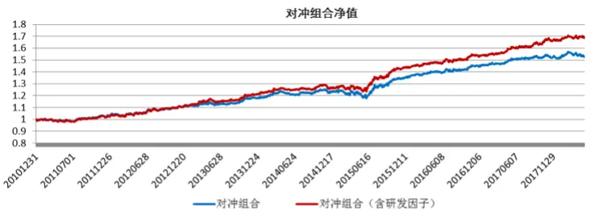

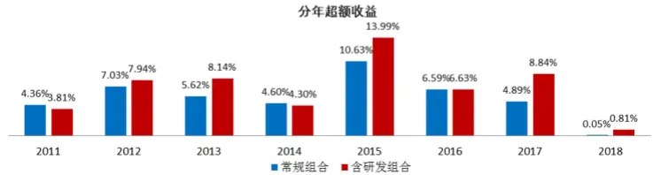

| 组合 | 对冲组合收益 | 信息比 | 最大回撤 | 跟踪误差 |
| --- | --- | --- | --- | --- |
| 常规组合 | 5.98% | 1.37 | -6.10% | 4.32% |
| 含研发因子组合 | 7.42% | 1.67 | -4.62% | 4.36% |

报告发布日期2018 年 06 月 08 日

证券分析师朱剑涛

021-63325888*6077

zhujiantao@orientsec.com.cn

执业证书编号：S0860515060001

联系人张惠澍

021-63325888-6123

zhanghuishu@orientsec.com.cn

相关报告

| 因子择时 2018-06-02 |
| --- |
| 英国市场简史与现状 2018-05-18 |
| 业绩超预期类因子 2018-05-18 |
| 协方差矩阵谱分解近似方法的补充 2018-04-04 |
| 风险模型提速组合优化的另一种方案 2018-03-28 |
| A 股小市值溢价的来源 2018-03-04 |
| 组合优化的若干问题 2018-03-01 |
| 基于风险监控的动态调仓策略 2018-02-22 |
| 反转因子择时研究 2018-02-21 |

## 1.因子在不同行业的表现

研发费用（Research & Development）指的是研究与开发某项目所支付的费用，理论上说，在技术含量较高的行业，对研发投入更高的公司长期的发展也会更好，因此股票的收益率也会越高。研发费用根据研发阶段和条件的不同，可以归属于两个科目。我国会计准则中明确规定，“企业内部研究开发项目研究阶段的支出，应当于发生时计入当期损益”，而企业内部研究开发项目开发阶段的支出，符合资本化条件的，可以确认为无形资产，进行摊销。根据这两种不同的部分，通常有两个维度可以衡量公司研发投入，其一是根据资产负债表中的开发支出除以总市值作为衡量，海外文献关于这方面的收益率异像研究较多（如 Leung 等、Chan 等），但是我们在之前的微信公众号中也统计了 A股相关因子的表现，首先在 A股开发支出的覆盖率非常低（远低于 50%），其次本身这个因子也并没有什么选股的效果，所以我们这篇报告不做赘述。其二是根据管理费用中的研发费用除以营业收入（RD ratio）作为衡量，关于这个指标几乎没有海外文献研究其选股能力的，这很大可能是因为会计准则的差异，但这个因子在中证全指（2011.1-2018.4）成分股中的平均覆盖率（有研发费用公司占行业内公司数量比例）达到了 73.3%，确实可以作为一个选股因子来检验，因此本篇报告主要就研究了研发费用因子在 A 股的选股效果以及适用的行业，为细分行业建模和行业量化提供新的思路。

## 2.研发因子在不同行业的表现

本节主要测试了研发营收比从 2011.12018.4 在各个中信一级行业中的效果。图 1展示这个因子在不同行业中的覆盖率，可以很明显的看到许多行业的研发营收比不到 50%，这些行业普遍都是不需要投入研发的传统行业。

图 1：研发营收比因子在不同中信一级行业覆盖率

| 行业 | 平均覆盖率行业 |  | 平均覆盖率 |
| --- | --- | --- | --- |
| 中证全指 | 73.29% | 中信餐饮旅游 | 13.9% |
| 中信石油石化 | 65.8% | 中信家电 | 82.1% |
| 中信煤炭 | 64.0% | 中信纺织服装 | 77.5% |
| 中信有色金属 | 73.3% | 中信医药 | 83.3% |
| 中信电力及公用事业 | 40.8% | 中信食品饮料 | 64.9% |
| 中信钢铁 | 72.9% | 中信农林牧渔 | 65.6% |
| 中信基础化工 | 78.5% | 中信银行 | 3.2% |
| 中信建筑 | 72.0% | 中信非银行金融 | 17.0% |
| 中信建材 | 67.1% | 中信房地产 | 13.4% |
| 中信轻工制造 | 79.5% | 中信交通运输 | 22.6% |
| 中信机械 | 87.8% | 中信电子元器件 | 84.5% |
| 中信电力设备 | 87.1% | 中信通信 | 85.1% |
| 中信国防军工 | 89.9% | 中信计算机 | 87.2% |
| 中信汽车 | 80.1% | 中信传媒 | 49.4% |
| 中信商贸零售 | 18.9% | 中信综合 | 40.1% |

数据来源：东方证券研究所 Wind 资讯

我们测试了覆盖率大于 50%的行业内研发营收比的因子表现，这里的多空组合和 TOP 组合均选择行业内的 20%股票进行构建，由于衡量的是行业内的因子选股效果，这里我们只对因子做了市值中性化（图 2），从结果可以看到，整体来说研发营收比在大多数行业中的 ICIR、TOP 组合和多空组合表现都不佳，然而值得注意的是在 4 个高科技行业（医药、电子、通讯、计算机）中，研发营收比在各方面都展现出一定的选股效果，ICIR在 0.4附近、Top组合年化收益在 8%以上、多空组合信息比在 0.5附近，且逻辑上也符合我们对高科技行业的预期。下文我们将分别对研发营收比因子在这 4个行业内的表现进行深入的研究。

图 2：研发营收比在不同行业中的表现

| 行业 | RankIC ICIR |  | Top组合年收益 多空年化收益 |  | 多空月最大回撤 | 多空信息比 | 多空月胜率 |  | 方向 平均覆盖率 |
| --- | --- | --- | --- | --- | --- | --- | --- | --- | --- |
| 中证全指 | 0.004 | 0.177 | 7.03% | 2.36% | -11.21% | 0.629 | 56.00% | 1 | 73.29% |
| 中信石油石化 | 0.002 | 0.038 | 2.02% | -1.79% | -56.21% | -0.086 | 51.00% | 1 | 65.8% |
| 中信煤炭 | 0.017 | 0.281 | -3.20% | 2.17% | -29.14% | 0.326 | 52.00% | 1 | 64.0% |
| 中信有色金属 | 0.005 | 0.109 | 2.86% | -1.40% | -47.62% | -0.117 | 47.00% | 1 | 73.3% |
| 中信钢铁 | 0.011 | 0.217 | 0.79% | -3.10% | -51.75% | -0.304 | 50.00% | 1 | 72.9% |
| 中信基础化工 | 0.008 | 0.190 | 3.64% | 0.17% | -31.20% | 0.091 | 47.00% | 1 | 78.5% |
| 中信建筑 | 0.004 | 0.085 | 5.12% | -0.86% | -42.98% | -0.008 | 49.00% | -1 | 72.0% |
| 中信建材 | 0.014 | 0.250 | 5.83% | 3.37% | -28.81% | 0.439 | 51.00% | -1 | 67.1% |
| 中信轻工制造 | 0.014 | 0.298 | 4.67% | 0.94% | -39.23% | 0.192 | 50.00% | 1 | 79.5% |
| 中信机械 | 0.003 | 0.082 | 3.19% | 1.12% | -15.24% | 0.275 | 56.00% | 1 | 87.8% |
| 中信电力设备 | 0.004 | 0.092 | 3.13% | 0.26% | -26.42% | 0.103 | 51.00% | 1 | 87.1% |
| 中信国防军工 | 0.012 | 0.185 | 1.60% | -0.43% | -52.27% | 0.050 | 48.00% | 1 | 89.9% |
| 中信汽车 | 0.008 | 0.245 | 5.65% | 1.71% | -16.37% | 0.330 | 47.00% | 1 | 80.1% |
| 中信家电 | 0.022 | 0.453 | 5.31% | 1.76% | -33.43% | 0.291 | 56.00% | -1 | 82.1% |
| 中信纺织服装 | 0.009 | 0.227 | 2.90% | -2.97% | -53.30% | -0.311 | 49.00% | 1 | 77.5% |
| 中信医药 | 0.020 | 0.513 | 9.72% | 3.08% | -22.13% | 0.550 | 59.00% | 1 | 83.3% |
| 中信食品饮料 | 0.003 | 0.077 | 4.84% | -2.57% | -46.86% | -0.340 | 49.00% | 1 | 64.9% |
| 中信农林牧渔 | 0.021 | 0.471 | 5.72% | 5.15% | -17.51% | 0.568 | 56.00% | 1 | 65.6% |
| 中信电子元器件 | 0.014 | 0.377 | 8.54% | 4.73% | -21.68% | 0.711 | 58.00% | 1 | 84.5% |
| 中信通信 | 0.019 | 0.447 | 9.55% | 3.33% | -17.69% | 0.490 | 61.00% | 1 | 85.1% |
| 中信计算机 | 0.018 | 0.406 | 9.87% | 4.15% | -32.22% | 0.499 | 54.00% | 1 | 87.2% |

数据来源：东方证券研究所 Wind 资讯

## 3.研发营收比在高科技行业的表现

## 3.1 医药行业

图3展示市值中性化后研发营收比在医药行业中分十组的平均月超额收益（2011.1-2018.4），

图 3：分组超额收益
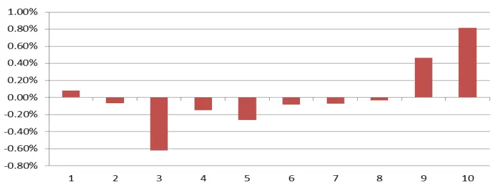
数据来源：东方证券研究所 Wind 资讯

可以很明显的看到前两组的超额收益非常显著，特别是第一组月超额收益高达0.8%，但是在后3组的单调性不是很好，这可能是受医药中的子行业影响，比如医药板块中的中药子行业公司整体不需要投入太多研发，而直接分组会受到子行业差异带来的一定影响。

图 4：组合构建的因子列表

| 因子类别 | 因子代码 | 因子说明 |
| --- | --- | --- |
| 估值 | BP | 账面市值比 |
|  | EP | 归属母公司的净利润TTM/总市值 |
|  | CFP | 经营性现金流TTM/总市值 |
|  | EBIT2EV | 息税前利润与企业价值之比 |
| 业绩超预期 | UP | 预期外的RNOA |
|  | SUEO | 标准化的预期外净利润(不含漂移项） |
|  | SUE1 | 标准化的预期外净利润（含漂移项） |
|  | SURO | 标准化的预期外营业收入(不含漂移项) |
|  | SUR1 | 标准化的预期外营业收入(含漂移项) |
| 盈利 | ROE | 净资产收益率 |
|  | RNOA | 净经营资产收益率 |
|  | GPOA | 总资产毛利率 |
| 公司治理 | MR | 高管前三薪酬总和 |
| 非流动性 | TO20 | 过去20个交易日的日均换手率对数 |
|  | LNAMIHUD | 20日Amihud非流动性自然对数 |
| 反转投机 | RET20 | 过去20个交易日的收益率 |
|  | IVR20 | 过去20个交易日的特异度 |
|  | IVOL60 | 过去60个交易日的特质波动率 |
|  | MAXRET | 过去最大收益，过去60日最大3个日收益均值 |
| 分析师预期 | COV | 过去6个月有覆盖的机构数量，取根号 |
|  | TPER | 目标价隐含的收益率 |
|  | WFR | 加权的预期调整 |
| 研发投入 | RD2S | 研发费用除以营业收入(TTM) |

数据来源：东方证券研究所 Wind 资讯

图 5：医药指数增强表现对比
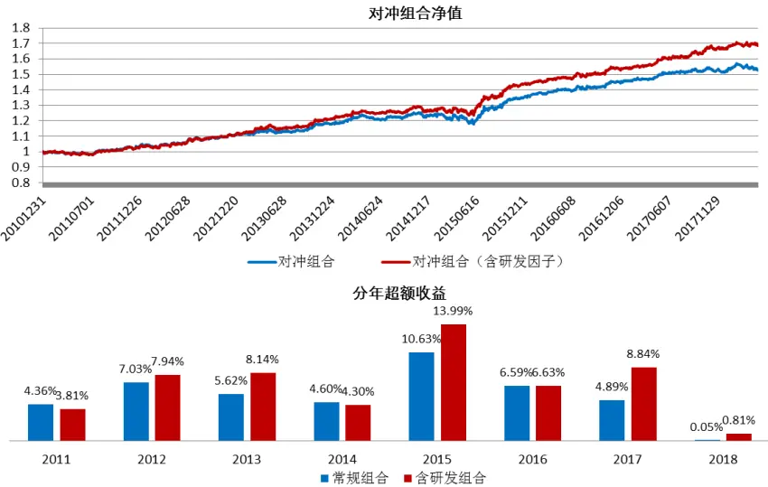

| 组合 | 对冲组合收益 | 信息比 | 最大回撤 | 跟踪误差 |
| --- | --- | --- | --- | --- |
| 常规组合 | 5.98% | 1.37 | -6.10% | 4.32% |
| 含研发因子组合 | 7.42% | 1.67 | -4.62% | 4.36% |

数据来源：东方证券研究所 Wind 资讯

我们把研发营收比作为医药行业中的新 alpha源加入到多因子模型中（图 4），以中信医药行业和中证全指的交集作为成分股构建的自由流通市值加权指数为基准构建指数增强组合（2011.1-2018.4），并对比没有加入这个因子的常规组合的表现（图 5）。可以看到加入了研发营收比因子后，医药增强组合的表现有着明显的提升，同样跟踪误差前提下，年化对冲收益提升

1.4%，信息比提升 0.3，最大回撤也下降了 1.5%。分年来看 12、13、15、17 和今年新组合都能够战胜常规组合，而在其他年份表现基本和常规组合接近。综合来看，我们认为研发营收比因子确实能够在医药行业中带来常规 alpha 因子不能包含的新 alpha 源，对构建医药行业内选股能起到一定的正向作用。

## 3.2 电子行业

图6展示市值中性化后研发营收比在电子行业中分十组的平均月超额收益(2011.1-2018.4)，

图 6：分组超额收益
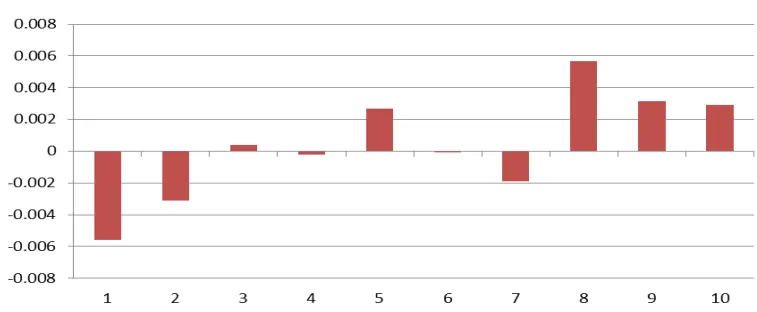
数据来源：东方证券研究所 Wind 资讯

相比于医药行业，电子行业 TOP 组超额收益不高，但是整体来看还是有一定的单调性的。

图 7：电子指数增强表现对比
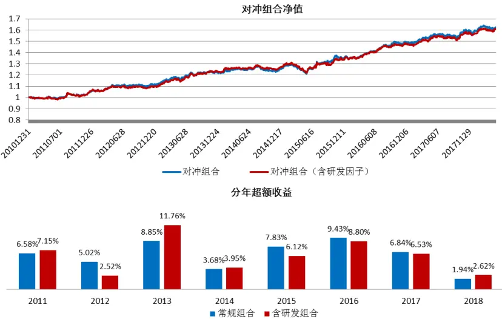

| 组合 | 对冲组合收益 | 信息比 | 最大回撤 | 跟踪误差 |
| --- | --- | --- | --- | --- |
| 常规组合 | 6.87% | 1.58 | -6.38% | 4.26% |
| 含研发因子组合 | 6.76% | 1.54 | -6.95% | 4.30% |

数据来源：东方证券研究所 Wind 资讯

我们把研发营收比作为电子行业中的新 alpha 源加入到多因子模型中（图 4），以中信电子行业和中证全指的交集作为成分股构建的自由流通市值加权指数为基准构建指数增强组合（2011.1-2018.4），并对比没有加入这个因子的常规组合的表现（图 7）。可以看到加入了研发

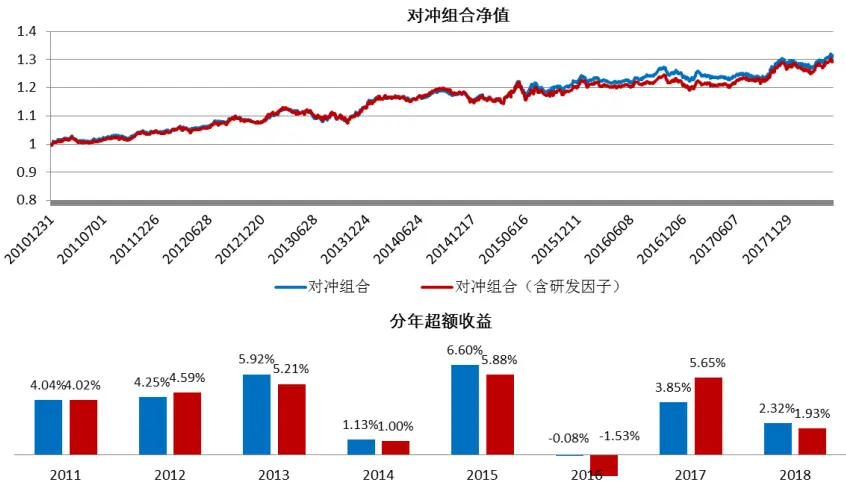
图 9：通讯指数增强表现对比
常规组合含研发组合

营收比因子后，组合的表现基本与原来一样，并没有什么改进。这也就说明了研发营收比因子在电子行业中并没有带来新的 alpha源。

## 3.3 通讯行业

图8展示市值中性化后研发营收比在通讯行业中分十组的平均月超额收益，

图 8：分组超额收益
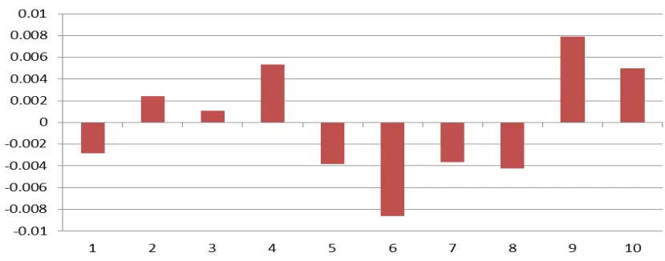
数据来源：东方证券研究所 Wind 资讯

从结果来看，Top的两组还是有着比较明显的超额收益的，但是后面的组单调性比较差，这很可能是因为通讯行业本身股票数量较少导致分组不太稳定有一定关系。

| 组合 | 对冲组合收益 | 信息比 | 最大回撤 | 跟踪误差 |
| --- | --- | --- | --- | --- |
| 常规组合 | 3.83% | 0.99 | -4.89% | 3.86% |
| 含研发因子组合 | 3.64% | 0.94 | -5.26% | 3.90% |

数据来源：东方证券研究所 Wind 资讯

我们把研发营收比作为通讯行业中的新 alpha源加入到多因子模型中（图 4），以通讯行业和中证全指的交集作为成分股构建的自由流通市值加权指数为基准构建指数增强组合（2011.1-2018.4），并对比没有加入这个因子的常规组合的表现（图 9）。可以看到通讯行业的组合本身效果较差，没有什么太大的增强效果，加入了研发营收比因子后，新组合的表现基本与原来一样，分年来看的话，不同年份存在一定差异，单整体差别不大。从结果来看研发营收比因子在通讯行业中也没有贡献显著的新 alpha 源。

## 3.4 计算机行业

图10展示市值中性化后研发营收比在计算机行业中分十组的平均月超额收益，

图 10：分组超额收益
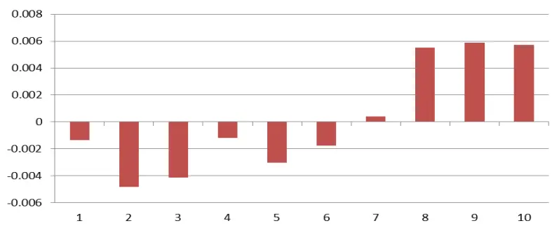
数据来源：东方证券研究所 Wind 资讯

从结果来看，最高 3档的组合都有着 0.5%以上的月超额收益率，整体的单调性也是比较好的。计算机行业整体的研发营收比非常高，20%以上的 15.9%，10%以上的公司占比 56.7%，因此区分度也比较好，长期来看高研发营收比的计算机公司确实有着明显的平均超额收益。

图 11：计算机指数增强表现对比
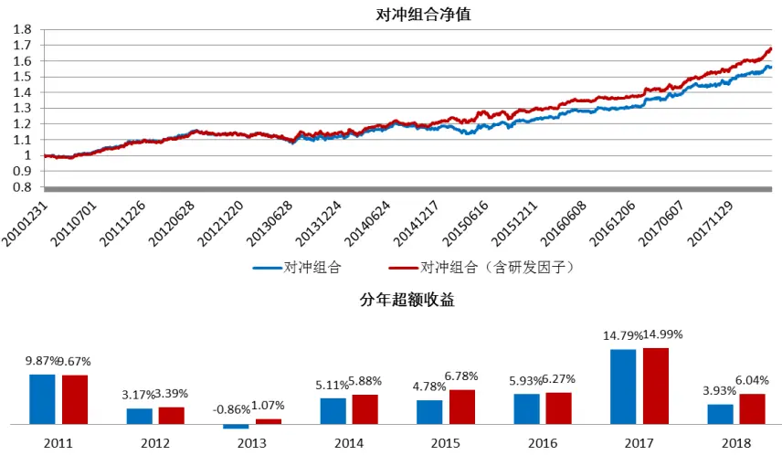

| 组合 | 对冲组合收益 | 信息比 | 最大回撤 | 跟踪误差 |
| --- | --- | --- | --- | --- |
| 常规组合 | 6.33% | 1.50 | -7.08% | 4.15% |
| 含研发因子组合 | 7.36% | 1.72 | -5.79% | 4.18% |

数据来源：东方证券研究所 Wind 资讯

我们以计算机行业和中证全指的交集作为成分股构建的自由流通市值加权指数为基准构建指数增强组合（2011.1-2018.4），并对比了两个组合的表现（图 11）。可以看到加入了新因子后，组合的年化对冲收益提升了 1%，信息比提升 0.2，最大回撤下降了 1.3%，提升比较显著。分年来看，

13、15 和今年都有着比较显著的提升，其他年份和常规组合差别不大。综合来看，研发营收比在计算机行业有着明显的新 alpha贡献。

## 3.5 研发对未来业绩的影响估计

从上面 4 个行业的结果来看，在医药和计算机行业内，研发营收比的表现要更好些，这里我们将通过统计方法来解释这一现象的原因。我们参考文献《公司R&D投入与企业业绩相关性研究》中类似的方法，来检验本年度研发营收比与公司未来业绩的关系。这里用到的 3个模型为：

$$
\begin{array}{rl}&{\mathrm{NPM}_{\mathrm{t+1}}=\beta_{0}+\beta_{1}\ln(\mathrm{Asset}_{\mathrm{t+1}})+\beta_{2}\mathrm{DAR}_{\mathrm{t+1}}+\beta_{3}RD2S_{t}}\\&{}\\&{\mathrm{NPM}_{\mathrm{t+2}}=\beta_{0}+\beta_{1}\ln(\mathrm{Asset}_{\mathrm{t+2}})+\beta_{2}\mathrm{DAR}_{\mathrm{t+2}}+\beta_{3}RD2S_{t}}\\&{}\\&{\mathrm{NPM}_{\mathrm{t+3}}=\beta_{0}+\beta_{1}\ln(\mathrm{Asset}_{\mathrm{t+3}})+\beta_{2}\mathrm{DAR}_{\mathrm{t+3}}+\beta_{3}RD2S_{t}}\end{array}
$$

这里 NPM是公司的净利润率，代表了盈利的能力。Asset 是公司的总资产，这是为了避免公司规模效应带来的影响。DAR 是公司的财务杠杆，因为债务融资有税收优势，因此高财务杠杆可能带来企业短期的业绩提升。RD2S 是研发营收比，这里仅取有研发营收比大于 0的公司作为样本。这里我们测试了 4个行业2010.6-2017.12的模型结果，这里是按照半年报和年报对数据进行匹配的，并且限制了行业内有研发投入的股票大于 30支。我们在每个横截面进行回归，并检验了时间序列上回归系数的显著性。

图 12展示了回归的结果，从结果来看，医药行业从第一年开始系数就比较显著，第二年显著性最高，说明在医药行业从研发到对公司业绩产生影响的时间较短，一部分因素是因为国内仿制药占比很高，而仿制药从研发到投产的周期较短，以科伦药业的右美托咪定为例，2017.6 送审，目前已经投产了，加上之前的研发时间总共也不到两年，此外，医疗器械的周期普遍比仿制药更短，所以整个医药行业的研发产出周期其实还是比较短的。电子行业 3 年都不显著，说明电子行业的研发到投产的周期较长，这是因为电子行业属于重资产行业，重大的研发成果往往先要投入新的产线才能开展生产，以京东方为例，京东方在 2017.12 宣布 10.5 代 TFT-LCD 生产线开始运作，而这条生产线开始建造是 2015.12，加上至少 1-2年的研发时间，也就是说整个从开始投入研发到正式投产至少也要 3-4年甚至更长。

图 12：不同行业回归模型系数和显著性

| 行业 | 指标 | 1年 | 2年 | 3年 |
| --- | --- | --- | --- | --- |
| 医药 | beta | 0.52 | 0.54 | 0.42 |
|  | t_value | 2.79 | 3.68 | 2.52 |
| 电子 | beta | 0.09 | -0.02 | -0.01 |
|  | t_value | 0.99 | -0.18 | -0.12 |
| 通讯 | beta | 0.04 | 0.12 | 0.27 |
|  | t_value | 0.44 | 1.29 | 5.92 |
| 计算机 | beta | 0.09 | 0.12 | 0.23 |
|  | t value | 2.03 | 2.55 | 5.27 |

数据来源：东方证券研究所 Wind 资讯

通讯行业从第三年开始系数比较显著，以通讯行业现在最新的 5G 技术为例，工信部在 2015.9 启动 3年的 5G技术测试计划，预计 2020正式商用，这中间就有 4年左右的周期。当然通讯行业也并不都是尖端技术的研发，一些技术的改进、产品的升级的研发产出周期就要短一些，从结果来看，大约 3 年的时间是通讯行业的研发产出周期。计算机行业从第二年开始系数比较显著，这是因为计算机行业中软件子行业占比最高，软件行业以项目和软件开发为主，软件开发相对慢些，但是因为不需要生产线所以周期也显著的快于电子和通讯，而项目则是投入研发人力很快会有产出的，周期更短，所以整个计算机行业研发投产周期还是比较短的。综合来看，当期的研发投入能比较快对公司业绩产生效用的行业，研发营收比因子的效用要更好一些，这也就是为什么因子在计算机和医药两个行业能比较明显的提升组合的收益。

## 4.主要指数中的组合表现

从上文的结果可以看到，研发营收比在医药和计算机这两个行业有着一定的额外 alpha贡献，所以这里我们分别对中证 500 和创业板指中的医药和计算机这两部分进行建模，检验研发因子能否对这两个主要指数中的这两个行业的增强有着明显提升。

## 4.1 中证 500 内组合表现

结合分块建模的思路，这里我们对中证 500 内的医药和计算机部分同时构建一个新的增强组合（2011.1-2018.4）。

图 13：中证 500内医药计算机增强组合
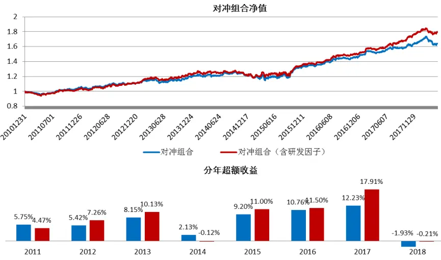
常规组合含研发组合

| 组合 | 对冲组合收益 | 信息比 | 最大回撤 | 跟踪误差 |
| --- | --- | --- | --- | --- |
| 常规组合 | 7.01% | 1.13 | -9.64% | 6.16% |
| 含研发因子组合 | 8.35% | 1.33 | -7.82% | 6.20% |

数据来源：东方证券研究所 Wind 资讯

单从组合结果来看，相比于常规组合，新的组合年化收益提升 1.3%，信息比提升 0.2，且最大回撤也有 1.8%的减小。但是我们统计了这两个行业在 500 内的权重（图 14）后发现，虽然研发营收比的加入可以显著提升 500 内医药计算机增强的效果，但是从权重占比来看，这两个行业历史的权重占比不高，平均占比 15%左右，在结合板块内 1%以上的提升，实际对 500 增强组合的提升大约在 0.2-0.3%，效果比较有限。

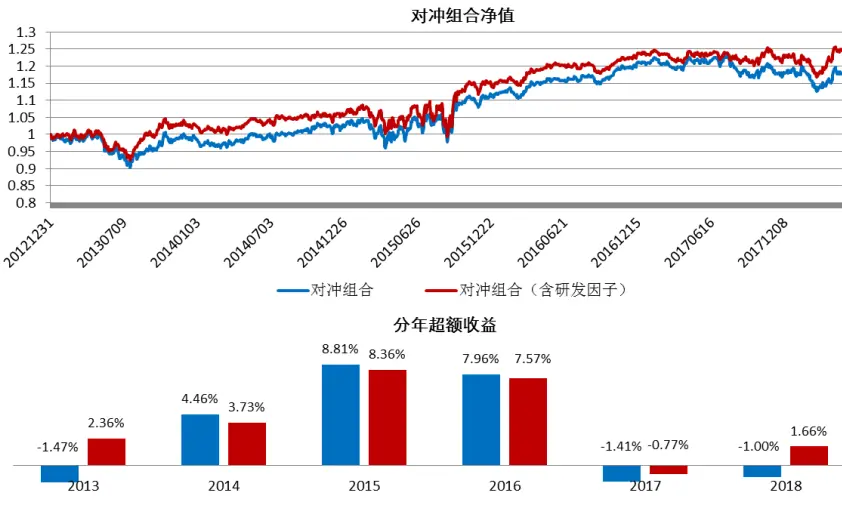
图 15：创业板指医药计算机增强
常规组合含研发组合

图 14：中证 500内医药加计算机权重占比
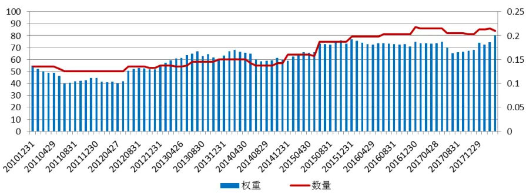
数据来源：东方证券研究所 Wind 资讯

## 4.2 创业板组合表现

这里我们用创业板综内的医药和计算机成分股对创业板指内的对应行业板块进行增强（2013.1-2018.4）。

| 组合 | 对冲组合收益 | 信息比 | 最大回撤 | 跟踪误差 |
| --- | --- | --- | --- | --- |
| 常规组合 | 3.18% | 0.43 | -10.34% | 8.03% |
| 含研发因子组合 | 4.28% | 0.56 | -9.48% | 8.00% |

数据来源：东方证券研究所 Wind 资讯

从结果来看，常规建模方法在创业板指的医药和计算机行业中效果较差，基本没有什么大的增强效果，但是加入了研发营收比因子后，对冲组合收益还是能增加 1.1%，且信息比和回撤也有所改善，整体还是有一定提升的。从对应板块的权重来看，医药加计算机在创业板指中的权重大约在 30%，数量在三分之左右，因此分块建模对整体创业板增强约能提升 0.3%-0.4%这个水平。

图 16：创业板指中医药和计算机权重占比
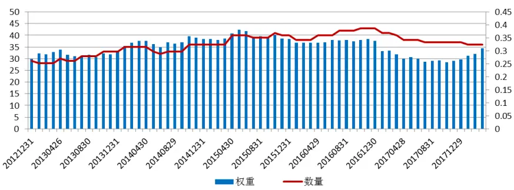
数据来源：东方证券研究所 Wind 资讯

我们进一步根据分块建模的方法，构建了创业板指增强（创业板综成分股）组合（图 17），把研发营收比加入医药和计算机板块可以对创业板指增强有一些提升，收益可以提升 0.37%，最大回撤下降 1%，分年来看，整体的差异不大。

图 17：医药计算机分块建模创业扳指增强组合
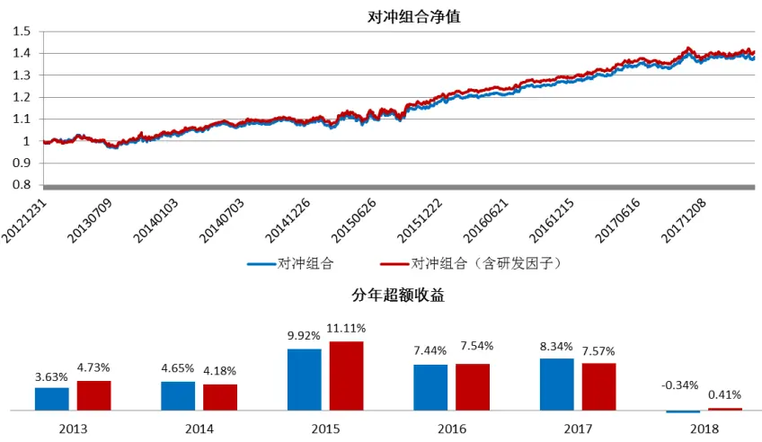
常规组合含研发组合

| 组合 | 对冲组合收益 | 信息比 | 最大回撤 | 跟踪误差 |
| --- | --- | --- | --- | --- |
| 常规组合 | 6.31% | 1.32 | -5.82% | 4.74% |
| 含研发因子组合 | 6.68% | 1.37 | -4.79% | 4.80% |

数据来源：东方证券研究所 Wind 资讯

## 5.总结

本篇报告主要研究了研发营收比因子在各个行业内的效果，从单因子测试角度来看，研发营收比在高科技行业(医药、电子、通讯、计算机)都有一定的效果，但是在构建行业内增强组合后，发现因子在医药和计算机行业有比较明显的 alpha贡献，在另外两个行业内增强组合表现基本不变。这是因为医药和计算机的研发投产周期相比于通讯和电子更短，因此当前的研发能更快的转变成公司的未来业绩，所以观察当前研发对评估公司近期业绩参考意义就更大。

我们进一步构建了中证 500 内和创业板指医药计算机增强组合，从结果来看，500 内医药计算机增强组合相比于原来的常规组合年化对冲收益提升 1.3%，信息比提升 0.2，最大回撤降低 1.8%，效果还是比较显著的，但由于本身这两个行业在中证 500 内占比在 15%左右，所以这样的改进对整个500增强的效果比较有限。创业板指医药计算机增强组合是以创业板综的对应成分股构建的，新的组合相比于原来的组合年化对冲收益提升 1.1%，信息比从 0.43 提升到 0.58，最大回撤下降近 1%，因为这两个行业在创业板指中占比约为 30%，相对中证 500 指数内占比高了不少，所以我们构建了分块建模的创业扳指增强组合，新的组合相比于原来的创业板指增强组合年化对冲收益0.37%，最大回撤下降 1%。

研发营收比因子主要适用于高科技行业，特别是在医药和计算机内有比较好的效果，但因为这两个行业在主要指数中占比有限，所以根据分块建模的思路去构建主要指数的增强组合提升不是很显著，但是还是可以起到一定的参考价值。此外，如果是单纯的构建这几个行业的量化组合时，研发营收比因子还是能发挥比较好的作用的。

## 风险提示

- 极端市场环境可能对模型效果造成剧烈冲击，导致收益亏损。

- 量化模型基于历史数据分析得到，未来存在失效风险，建议投资者紧密跟踪模型表现。

## 参考文献

[1] Leung, W. S., Mazouz, K., Evans, K. P. (2016).” A risk explanation for the R&D anomaly.” EFMA 2016 proceedings.

[2] Chan, L. K., Lakonishok, J., Sougiannis, T. (2001) “The stock market valuation of research and development expenditures.” The Journal of Finance, Vol 56 , pp: 2431-2456.

[3] Chiao, C., Hung, W. (2010). “Stock market valuations of r&d and electronics firms during taiwan's recent economic transition.” Developing Economies, Vol 44 , pp: 53-78.

[4] 任海云, 师萍. (2009). “公司R&D投入与绩效关系的实证研究——基于沪市a股制造业上市公司的数据分析.” 科技进步与对策, Vol 26, pp: 89-93.

## 分析师申明

每位负责撰写本研究报告全部或部分内容的研究分析师在此作以下声明：

分析师在本报告中对所提及的证券或发行人发表的任何建议和观点均准确地反映了其个人对该证券或发行人的看法和判断；分析师薪酬的任何组成部分无论是在过去、现在及将来，均与其在本研究报告中所表述的具体建议或观点无任何直接或间接的关系。

## 投资评级和相关定义

报告发布日后的 12个月内的公司的涨跌幅相对同期的上证指数/深证成指的涨跌幅为基准；

## 公司投资评级的量化标准

买入：相对强于市场基准指数收益率 15%以上；

增持：相对强于市场基准指数收益率 5%～15%；

中性：相对于市场基准指数收益率在-5%～+5%之间波动；

减持：相对弱于市场基准指数收益率在-5%以下。

未评级——由于在报告发出之时该股票不在本公司研究覆盖范围内，分析师基于当时对该股票的研究状况，未给予投资评级相关信息。

暂停评级——根据监管制度及本公司相关规定，研究报告发布之时该投资对象可能与本公司存在潜在的利益冲突情形；亦或是研究报告发布当时该股票的价值和价格分析存在重大不确定性，缺乏足够的研究依据支持分析师给出明确投资评级；分析师在上述情况下暂停对该股票给予投资评级等信息，投资者需要注意在此报告发布之前曾给予该股票的投资评级、盈利预测及目标价格等信息不再有效。

## 行业投资评级的量化标准：

看好：相对强于市场基准指数收益率 5%以上；

中性：相对于市场基准指数收益率在-5%～+5%之间波动；

看淡：相对于市场基准指数收益率在-5%以下。

未评级：由于在报告发出之时该行业不在本公司研究覆盖范围内，分析师基于当时对该行业的研究状况，未给予投资评级等相关信息。

暂停评级：由于研究报告发布当时该行业的投资价值分析存在重大不确定性，缺乏足够的研究依据支持分析师给出明确行业投资评级；分析师在上述情况下暂停对该行业给予投资评级信息，投资者需要注意在此报告发布之前曾给予该行业的投资评级信息不再有效。

## 免责声明

本证券研究报告（以下简称“本报告”）由东方证券股份有限公司（以下简称“本公司”）制作及发布。

本报告仅供本公司的客户使用。本公司不会因接收人收到本报告而视其为本公司的当然客户。本报告的全体接收人应当采取必要措施防止本报告被转发给他人。

本报告是基于本公司认为可靠的且目前已公开的信息撰写，本公司力求但不保证该信息的准确性和完整性，客户也不应该认为该信息是准确和完整的。同时，本公司不保证文中观点或陈述不会发生任何变更，在不同时期，本公司可发出与本报告所载资料、意见及推测不一致的证券研究报告。本公司会适时更新我们的研究，但可能会因某些规定而无法做到。除了一些定期出版的证券研究报告之外，绝大多数证券研究报告是在分析师认为适当的时候不定期地发布。

在任何情况下，本报告中的信息或所表述的意见并不构成对任何人的投资建议，也没有考虑到个别客户特殊的投资目标、财务状况或需求。客户应考虑本报告中的任何意见或建议是否符合其特定状况，若有必要应寻求专家意见。本报告所载的资料、工具、意见及推测只提供给客户作参考之用，并非作为或被视为出售或购买证券或其他投资标的的邀请或向人作出邀请。

本报告中提及的投资价格和价值以及这些投资带来的收入可能会波动。过去的表现并不代表未来的表现，未来的回报也无法保证，投资者可能会损失本金。外汇汇率波动有可能对某些投资的价值或价格或来自这一投资的收入产生不良影响。那些涉及期货、期权及其它衍生工具的交易，因其包括重大的市场风险，因此并不适合所有投资者。

在任何情况下，本公司不对任何人因使用本报告中的任何内容所引致的任何损失负任何责任，投资者自主作出投资决策并自行承担投资风险，任何形式的分享证券投资收益或者分担证券投资损失的书面或口头承诺均为无效。

本报告主要以电子版形式分发，间或也会辅以印刷品形式分发，所有报告版权均归本公司所有。未经本公司事先书面协议授权，任何机构或个人不得以任何形式复制、转发或公开传播本报告的全部或部分内容。不得将报告内容作为诉讼、仲裁、传媒所引用之证明或依据，不得用于营利或用于未经允许的其它用途。

经本公司事先书面协议授权刊载或转发的，被授权机构承担相关刊载或者转发责任。不得对本报告进行任何有悖原意的引用、删节和修改。

提示客户及公众投资者慎重使用未经授权刊载或者转发的本公司证券研究报告，慎重使用公众媒体刊载的证券研究报告。

## 东方证券研究所

地址：上海市中山南路 318 号东方国际金融广场 26 楼

联系人： 王骏飞

电话：021-63325888*1131

传真：021-63326786

网址： www.dfzq.com.cn

Email： wangjunfei@orientsec.com.cn