## 研究结论

这篇报告主要从多个维度切入来研究业绩预告在传统的多因子框架下的应用。业绩预告比业绩快报和定期财务报告的公布时间更早，对推测上市公司业绩还是很重要的。从 2012 年开始，A 股上市公司业绩预告的数量大幅的提升，且发布的预告的上市公司数量也达到了 1500 家左右，今年截至到 6月底，已经有 2600 多家上市公司发布过了业绩预告，覆盖度较高。从业绩预告的质量来看，2007-2018.6 区间内业绩预告与实际的单季净利润偏离在正负 10%以内的预告占比在 50.84%，正负 20%以内的预告占比在 67.94%，也就是说大多数公司的实际单季净利润不会偏离业绩预告上下限的均值太远，总体来说质量还是有一定的保证的。

我们基于业绩预告与实际归母净利润构建超预期因子，行业市值中性化后的业绩预告均值偏离度在 2012.12.31-2018.6.29 这个区间的 RankIC 为0.023， ICIR 有 2.36，多空组合年化收益为 7.8%，信息比为 2.04，且最大回撤仅为-3.54%，还是有着非常好的选股效果。在对常规的4个超预期因子（SUE0、SUE1、SUR0、SUR1）做正交化之后，业绩预告均值偏离度因子的 ICIR为 0.74，多空组合年化收益为 5%，信息比为 1.4，仍然有着一定的信息增量。

我们分别对 EP_TTM、ROE、SUE0和 SUE1进行的改进，在这 4个因子更新的时候加入了业绩预告的数据。对于 EP_TTM和 ROE来说，加入了业绩预告后因子与原始因子的因子值相关性依然高达90%以上，但是选股效果都有着一定的提升；对于业绩超预期因子来说，加入了业绩预告后的因子与原始因子的改变较大，虽然因子表现与原始因子类似，但是新的因子却带来了很明显的信息增量，SUE0（含预告）在剔除了 SUE0和 SUE1后，RankIC为 0.2，ICIR 为 2.4，多空的信息比为 1.06；SUE1(含预告) 在剔除了 SUE0和 SUE1 后，rankIC 为 0.19，ICIR 有 2.05，多空的信息比为 1.37，均有着非常明显的额外信息。所以可以考虑把 SUE0（含预告）和 SUE1(含预告)作为新的超预期因子与原来的超预期因子结合使用。

## 风险提示

- 极端市场环境可能对模型效果造成剧烈冲击，导致收益亏损。

- 量化模型基于历史数据分析得到，未来存在失效风险，建议投资者紧密跟踪模型表现。

SUE0(含预告)对常规超预期因子正交化后因子表现
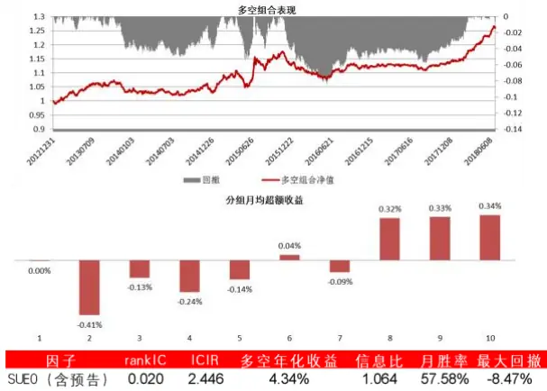

报告发布日期2018 年 08 月 02 日

证券分析师朱剑涛

021-63325888*6077

zhujiantao@orientsec.com.cn

执业证书编号：S0860515060001

联系人 张惠澍 021-63325888-6123 zhanghuishu@orientsec.com.cn

相关报告

| 公司研发费用因子探究 | 2018-06-09 2018-06-02 |
| --- | --- |
| 因子择时 英国市场简史与现状 | 2018-05-18 |
| 业绩超预期类因子 | 2018-05-18 |
| 协方差矩阵谱分解近似方法的补充 | 2018-04-04 |
| 风险模型提速组合优化的另一种方案 | 2018-03-28 |
| A 股小市值溢价的来源 |  |
|  | 2018-03-04 |
| 组合优化的若干问题 | 2018-03-01 |
| 基于风险监控的动态调仓策略 | 2018-02-22 |
| 反转因子择时研究 | 2018-02-21 |

## 1、业绩预告历史情况说明

业绩预告是上市公司在交易所发布的，对定期财务报告以预告的形式进行披露的报告，预告的内容主要是对公司当期净利润状况的预测，同比的变动情况，有的还会说明变动的原因。业绩预告、业绩快报和定期财务报告为上市公司披露业绩的主要方式，业绩预告作为三者之中时间最早的，其重要性不言而喻。

上交所和深交所对于业绩预告披露有着不同的规则。

上交所：按照《上海证券交易所股票上市规则》的要求，对于年度报告，如果上市公司预计全年可能出现亏损、扭亏为盈、净利润较前一年度增长或下降 50%以上（基数过小的除外）等三类情况，应当在当期会计年度结束后的 1月 31日前披露业绩预告。也就是说如果不存在上述三种情况可以不披露年度业绩预告。对于半年报和季度报告，也没有作强制要求。

深交所：对于主板部分的公司，在预计报告期内（第一季度、半年度、第三季度和年度）出现以下情况的，应进行业绩预告：净利润为负、扭亏为盈、实现盈利且净利润与上年同期相比上升或者下降 50％以上（基数过小的除外）、期末净资产为负、年度营业收入低于 1 千万元：对于中小板上市的公司，应在第一季度报告、半年度报告和第三季度报告中披露对年初至下一报告期末的业绩预告。公司预计第一季度业绩将出现归母净利润为负值、净利润与上年同期相比上升或者下降 50％以上（基数过小的除外）、扭亏为盈，应不晚于 3月 31日（在年报摘要或临时公告）进行业绩预告，也就是说对于深交所中小板的上市公司而言年报，中报和三季报的业绩预告是强制的；对于创业板而言，业绩预告也是强制的。此外，在 2016年底，深交所修改了高送转方案公告格式，要求披露高送转时必须披露业绩预告，原则上不支持亏损或业绩大幅下滑公司高送转。

综合来看，业绩预告虽然在一些情况下并不需要披露，但是整体的披露覆盖率也是逐年增加的，我们统计了分年的业绩预告和发布了业绩预告的上市公司数量（图 1），2012.1年证监会发布了《创业板信息披露业务备忘录第 11 号》要求创业板的上市公司要强制披露业绩预告，2012.8 深交所修订了《中小企业板信息披露业务备忘录第 1 号：业绩预告、业绩快报及其修正》要求中小板的上市公司也要强制披露业绩预告，所以从结果可以看到从 2012年开始，A股业绩预告的数量大幅的提升，且发布的预告的上市公司数量也达到了 1500家左右，今年截至到 6月底，也已经有 2600多家上市公司发布过了业绩预告。

图 1：不同年份业绩预告数量和公布业绩预告的上市公司数量
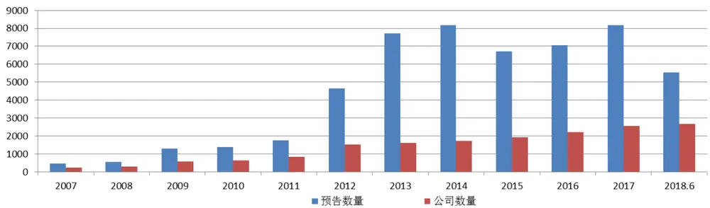
数据来源：东方证券研究所 Wind 资讯

从不同年份的不同期报告数量来看(图 2)，2012 年开始披露的数量相较之前有了大幅提升，2012年报的业绩预告共有近 1500家上市公司披露，整体来看中报和三季报披露数量差不多，年报披露数量最多，而一季报因为强制披露的要求较低，所以披露数量最少。对比报告数量可以发现，2012-2014年报告数量远高于披露公司数量，这说明这几年预告的修正披露较多，而从 2015年到现在，这个差距较小，说明最近 3 年以来业绩预告的修正较少，首次披露的质量相较于之前会更高一些。

图 2：不同年份不同期业绩预告和上市公司数量
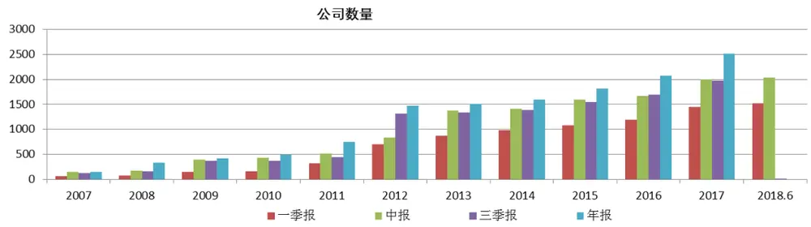

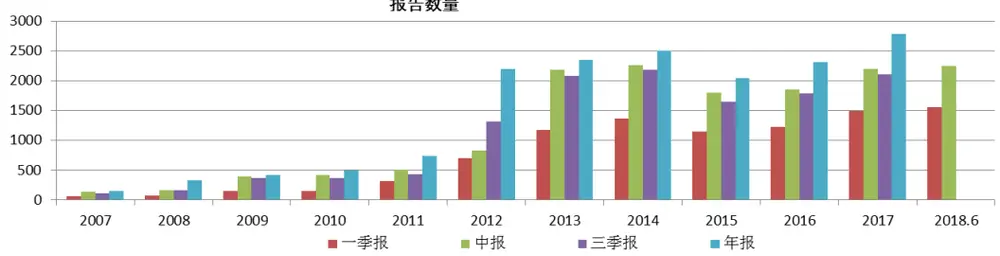
数据来源：东方证券研究所 Wind 资讯

那么，业绩预告是否能补充实际的财务报告中间的时间缺口，提高我们因子的信息更新速度？我们统计了 2007-2018.6不同月份业绩预告的披露数量(图 3)。

图 3：各月份公布业绩预告数量
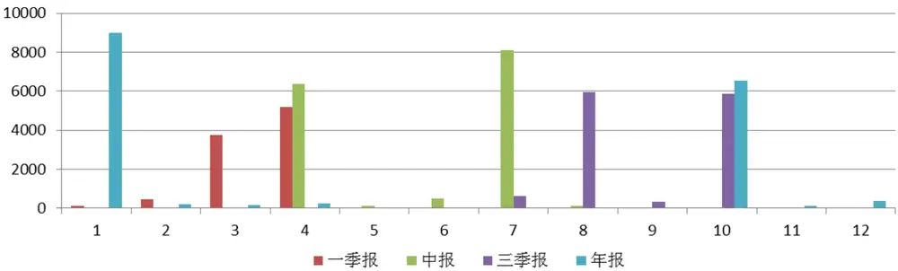
数据来源：东方证券研究所 Wind 资讯

从统计结果可以看到，业绩预告主要的披露为 1、3、4、7、8、10 这几个月份，其中 1 月份主要公布的是年报的预告，3月份主要是 1 季报的预告，4月份一季报和中报的预告各半，7月份主要是中报的预告，8月主要是三季报的预告，10月份三季报和年报的预告各半。也就是说，1月份的年报预告、三月份的一季报预告、4 月份和 7 月份的中报预告、8 月的三季报预告和 10 月的年报预告是明显的早于正式报告的发布时间的，所以这些时间段的业绩预告可以一定程度上弥补正式报告直接的空档期，帮助投资者更及时的了解公司的净利润情况。

从报告的发布时间和数量来看，业绩预告确实可以一定程度上提高信息获得的效率，但是业绩预告本身也存在一定的问题，不同公司在公布业绩预告的时候往往会给出不同的范围，有的上限和下限是相同的，有的则相差的非常远，如果我们都用上下限的均值来作为业绩的预测，那么上下限的区间大小和这个预测的准确程度有没有存在一定的关系？我们构建了指标来衡量预告的区间大小：

$$
业绩预告区间比=\frac{上限-下限}{(上限+下限)/2}
$$

这个值越大代表公司给出的业绩预告的不确定性越大，可能的偏差也更大。此外，我们还构建了业绩预告准确度指标：

$$
业绩预告均值偏离度=\frac{实际的累积净利润-(上限+下限)/2}{实际的单季度净利润}
$$

这个偏离度衡量了实际的单季净利润高于业绩预告均值的百分比。图 4 统计了 2007-2018.6 不同的业绩预告区间对应的偏离度的均值。从结果来看，73.9%的公司业绩预告区间比在 0.3以下，然而还有 5%左右的公司业绩预告区间比在 1以上，这些公司的业绩预告有着高度的不确定性。从对应区间的偏离度均值来看，所有区间的均值均小于零，也就是说平均来说业绩预告是高估了公司的实际净利润情况，此外，随着预告区间比大小的提升，平均的偏离度也存在一定的放大，这也就是说整体而言公司给出的业绩预告上下限越大，实际的净利润低于上下限均值的程度也会更高。因此业绩预告的上下行差别越小，预测的准确性通常来说也会更好一些。

图 4：不同业绩预告上下限区间和对应的均值偏离度统计
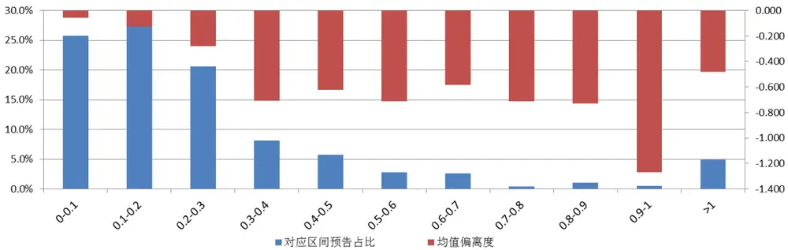
数据来源：东方证券研究所 Wind 资讯

此外，我们还统计了业绩预告均值偏离度的整体分布情况（图 5），从分布情况来看，整体的分布情况是左偏的，说明大多数上市公司的业绩预告还是偏乐观的，业绩预告与实际的单季净利润偏离在正负 10%以内的预告占比在 50.84%，正负 20%以内的预告占比在 67.94%，也就是说大多数公司的实际单季净利润不会偏离业绩预告上下限的均值太远，值得注意的是偏离度小于-2 的公司占比高达 3.16%，这些公司实际利润远低于业绩预告上下限的均值，对于出现过这种情况的公司，投资者需要予以一定的注意，避免踩雷。

图 5：业绩预告均值偏离度分布情况
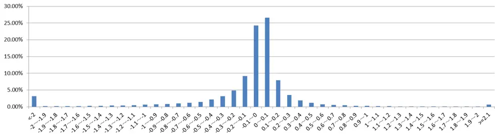
数据来源：东方证券研究所 Wind 资讯

图 6：不同年份业绩预告均值偏离度分布情况
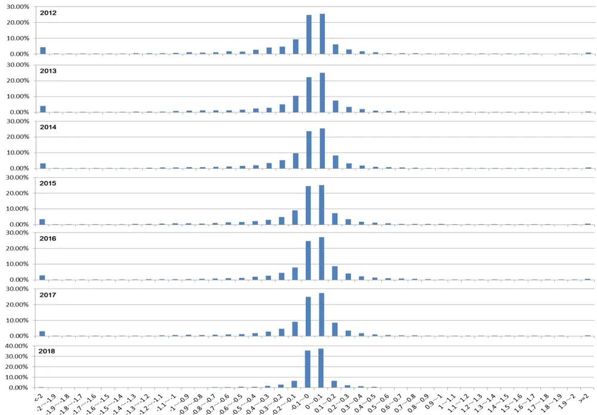
数据来源：东方证券研究所 Wind 资讯

此外，我们也统计了不同年份的业绩预告均值偏离度的整体分布情况（图 6），可以看到大多数的业绩预告均值和实际单季净利润的偏离都在正负 20%以内，偏离度小于-2 的公司占比也从 2012年的 4.28%逐渐降低到 2017年的 3.1%，还是有一定的向好趋势的。

整体来说，公司的业绩预告的准确度还是有一定的保障的，所以我们可以利用业绩预告的信息构建新的因子，也可以改进现有因子的数据更新速度，提高现有因子的表现。

## 2、基于业绩预告的超预期因子

我们在之前的报告《业绩超预期类因子》中提出了业绩超预期因子，当时的做法是基于季节性随机游走模型来构建相关的因子，也就是说投资者对公司业绩的预期是通过历史的随机游走模型来估计的。理论上说，在公司公布了业绩预告之后，投资者对公司业绩的预期会随之发生一定的变化，若实际的业绩好于预告的业绩，则说明业绩高于预期，对公司的股价是一个正面的影响，反之亦然。所以这里我们以上文中提到的业绩预告均值偏离度作为因子，来测试这个因子的表现。

图 7：业绩预告均值偏离度因子覆盖率
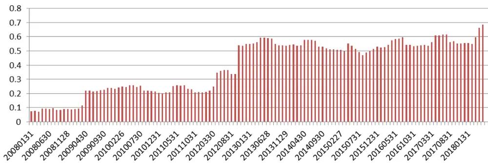
数据来源：东方证券研究所 Wind 资讯

因为并不是所有公司都公布业绩预告的，所以我们首先测试了这个因子在中证全指范围的覆盖率情况（图 7）.从结果可以看到，从 2008-2012 年这段区间，因子的覆盖率较低，但是从 2012 年底开始因子的覆盖率均高于 50%，这和 2012年之后预告数量大幅提升有关，所以我们的因子测试主要的测试时间为 2012.12.31-2018.6.29。图 8 展示了经过行业中位数填充且行业市值中性化后的因子表现，因子的 IC 虽然不高仅有 0.023，但是 ICIR较高有 2.36，多空组合年化收益为 7.8%，信息比为 2.04，且最大回撤仅为-3.54%，还是有着非常好的选股效果。

虽然从单因子来看，业绩预告均值偏离度这个因子有比较好的选股效果，但是这个因子从逻辑来说与之前报告中的业绩超预期因子是类似的，所以这里我们通过横截面回归的方式剥离我们的 4 个业绩超预期因子（图 10），剥离完超预期信息后的因子表现如图 9所示，ICIR下降到了 0.74，多空组合年化收益下降到了 5%，信息比下降到了 1.4，说明这个因子与常规的业绩超预期因子确实存在一定的信息重叠，但是在剥离完这 4 个超预期因子后，仍然有着一定的选股效果，所以这个因子可以作为常规业绩超预期因子的补充。

图 8：业绩预告均值偏离度的因子表现（中性化后）
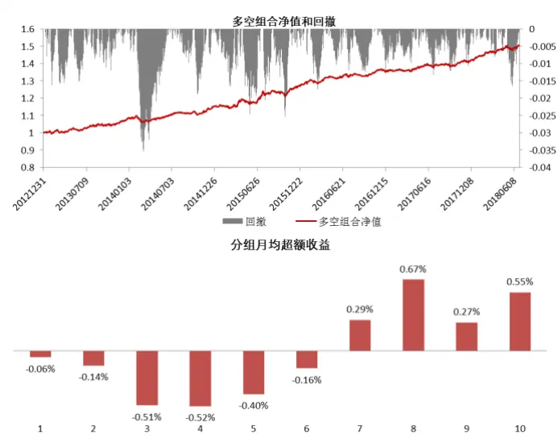
数据来源：东方证券研究所 Wind 资讯

图 9：剔除了超预期因子后的业绩预告均值偏离度因子表现
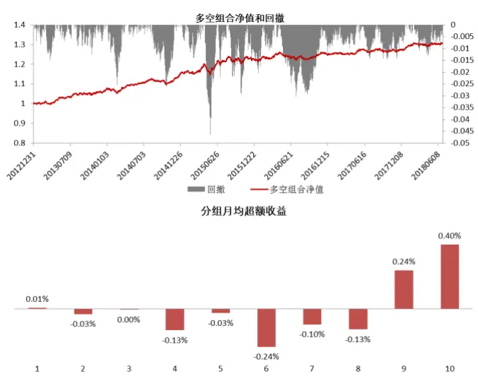

|  | rankIC | ICIR | 多空年化收益 | 信息比 | 月胜率 | 最大回撤 |
| --- | --- | --- | --- | --- | --- | --- |
| 因子表现 | 0.023 | 2.355 | 7.77% | 2.039 | 72.73% | -3.54% |

数据来源：东方证券研究所 Wind 资讯

|  | rankIC | ICIR | 多空年化收益 | 信息比 | 月胜率 | 最大回撤 |
| --- | --- | --- | --- | --- | --- | --- |
| 因子表现 | 0.006 | 0.744 | 5.01% | 1.413 | 62.12% | -4.63% |

图 10：业绩超预期因子列表

| 因子 | 因子说明 |
| --- | --- |
| SUE0 | 基于带漂移项随机游走模型计算的预期外的净利润，详见《业绩超预期类因子》 |
| SUE1 | 基于不带漂移项随机游走模型计算的预期外的净利润，详见《业绩超预期类因子》 |
| SUR0 | 基于带漂移项随机游走模型计算的预期外的营业收入，详见《业绩超预期类因子》 |
| SUR1 | 基于不带漂移项随机游走模型计算的预期外的营业收入，详见《业绩超预期类因子》 |

数据来源：东方证券研究所 Wind 资讯

## 3、基于业绩预告提高现有因子的效果

## 3.1 估值因子

与公司净利润有关的估值因子主要是 EP_TTM，我们在原来的基础上（财报+业绩快报）把业绩预告加入到计算因子值中。在更新因子的时候若有业绩预告，则用净利润预告上下限的均值作为最新的数据，并且更新原来的因子值。我们比较了 2012.12.31-2018.6.29常规 EP_TTM和加入了预告后的行业市值中性化因子的表现（图 11），在这段区间内中性化后因子值的平均相关性为 96.2%，IC 相关性为 99.4%，也就是说虽然加入预告后因子值和因子的选股逻辑整体来说和原始因子相比并没有什么的改变。

图 11：加入了业绩预告后的 EP_TTM因子和原始因子效果对比
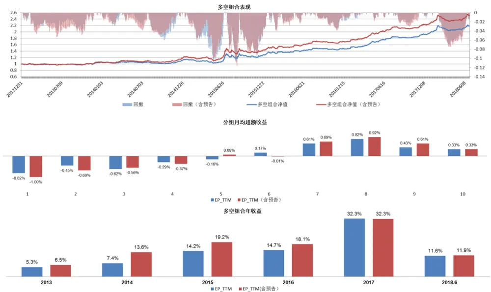

| 因子 | rankIC | ICIR | 多空年化收益 | 信息比 | 月胜率 | 最大回撤 |
| --- | --- | --- | --- | --- | --- | --- |
| EP_TTM | 0.057 | 2.949 | 15.38% | 1.709 | 60.61% | -10.89% |
| EP_TTM（含预告） | 0.062 | 3.206 | 18.41% | 1.894 | 62.12% | -11.70% |

数据来源：东方证券研究所 Wind 资讯

从结果来看，加入了业绩预告的 EP_TTM 因子表现确实有了一定的提升，RankIC 从 0.057 提升到了 0.062.多空组合年化收益从 15.4%提升到了 18.41%，信息比从 1.7 提升到了 1.9，从分组超额收益来看，加入了预告的因子单调性也有一定的提升。分年来看，加入了预告的因子表现没有一年比常规的因子差，而且在 17年以前每年都有一定的提升。此外，我们还计算了两个因子多空月收益的差异显著性，HACp-value为 37%，也就是说这个提升并不是很显著。综合来说，业绩预告的数据确实可以提供更加及时的数据更新，一定程度上帮助我们提高现有 EP_TTM因子的效果。

## 3.2 盈利因子

与公司净利润有关的盈利因子主要是 ROE，这里我们按照上文的处理方式处理分子上净利润的数据，对于分母上的净资产，我们假设最近一期的公司的净利润都加到了净资产上，这样就可以得到最新的预告净资产数据。我们比较了 2012.12.31-2018.6.29常规 ROE和加入了预告后的行业市值中性化因子的表现（图 12），在这段区间内中性化后因子值的平均相关性为 92.06%，IC 相关性为 99.3%，也就是说虽然加入预告后因子值和因子的选股逻辑整体来说和原始因子相比并没有什么的改变。

图 12：加入了业绩预告后的 ROE 因子和原始因子效果对比
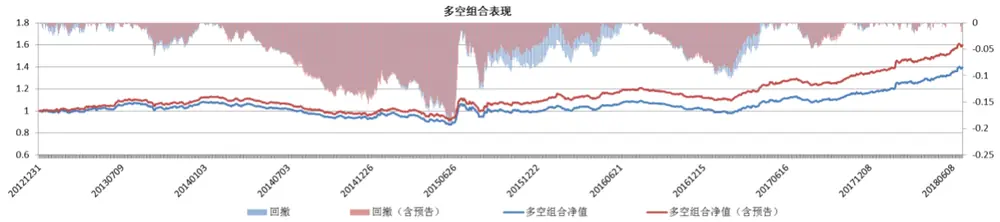

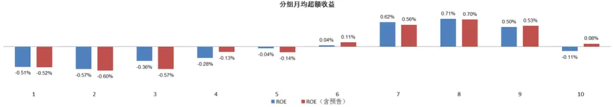

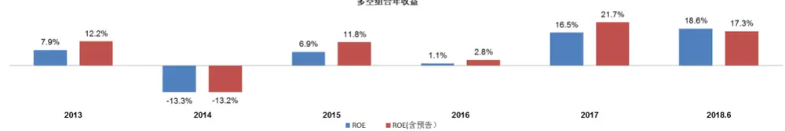

| 因子 | rankIC | ICIR | 多空年化收益 | 信息比 | 月胜率 | 最大回撤 |
| --- | --- | --- | --- | --- | --- | --- |
| ROE | 0.033 | 1.624 | 6.31% | 0.826 | 56.06% | -19.29% |
| ROE（含预告） | 0.038 | 1.904 | 8.94% | 1.171 | 60.61% | -18.86% |

数据来源：东方证券研究所 Wind 资讯

从结果来看，加入了业绩预告的 ROE 因子表现确实有了一定的提升，RankIC 从 0.033 提升到了0.038.多空组合年化收益从 6.31%提升到了 8.94%，信息比从 0.83提升到了 1.17，从分组超额收益来看，加入了预告的因子单调性也有一定的提升。分年来看，除了今年上半年加入了预告的因子略逊于常规因子，其他年份均有一定的提升。此外，我们还计算了两个因子多空月收益的差异显著性，HACp-value为 0.46%，也就是说差异非常的显著。综合来说，业绩预告的数据确实也可以帮助我们显著地提高现有 ROE因子的效果。

## 3.3 超预期因子

与公司净利润有关的超预期因子主要是 SUE0、SUE1两个，这里我们按照上文的处理方式处理净利润的数据，并且对现有的 SUE0 和 SUE1 因子进行改进。我们比较了 2012.12.31-2018.6.29 常规 SUE0、SUE1和加入了预告后的行业市值中性化因子的表现（图 13、14），在这段区间内 SUE0中性化后因子值的平均相关性为 66.6%，IC相关性为 81%，SUE0因子值的平均相关性为 66.5%，

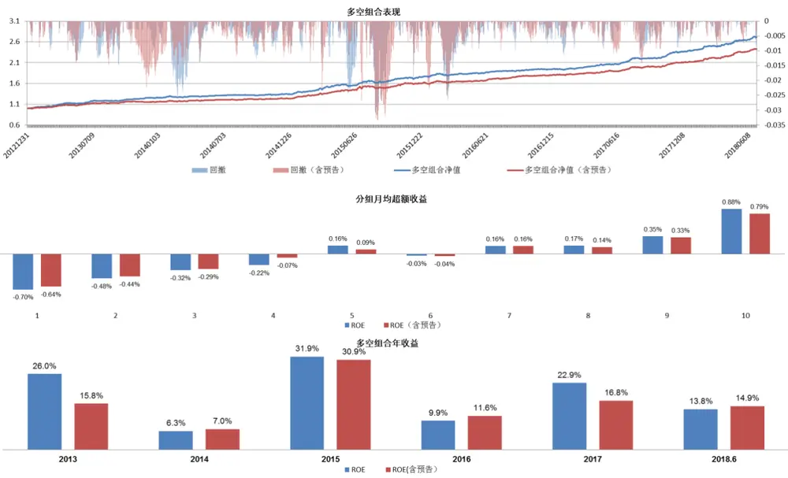

IC 相关性为 90%，因为计算 SUE 的时候用的是单季的数据，因此加入预告后因子值发生了不小的变化。

图 13： SUE0（含预告）因子和原始因子效果对比

| 因子 | rankIC | ICIR | 多空年化收益 | 信息比 | 月胜率 | 最大回撤 |
| --- | --- | --- | --- | --- | --- | --- |
| SUEO | 0.037 | 4.044 | 20.06% | 4.106 | 83.33% | -3.18% |
| SUEO (含预告) | 0.036 | 3.967 | 17.63% | 3.616 | 89.39% | -3.33% |

数据来源：东方证券研究所 Wind 资讯

加入了业绩预告的 SUE0表现要略微逊于原来的因子（图 13），多空收益年化少了 2.5%，但是月胜率从 83%提高到了 89%。加入了业绩预告的 SUE1表现基本与原始的 SUE1因子相同，但多空收益年化少了 1.3%（图 14）。单从这个结果并不能简单的认为加入了预期后的 SUE0 和 SUE1不如原始的因子，这是因为加入了业绩预期后的因子值与原始因子值的相关性并不是很高，所以我们还要对增量信息部分做进一步的测试。

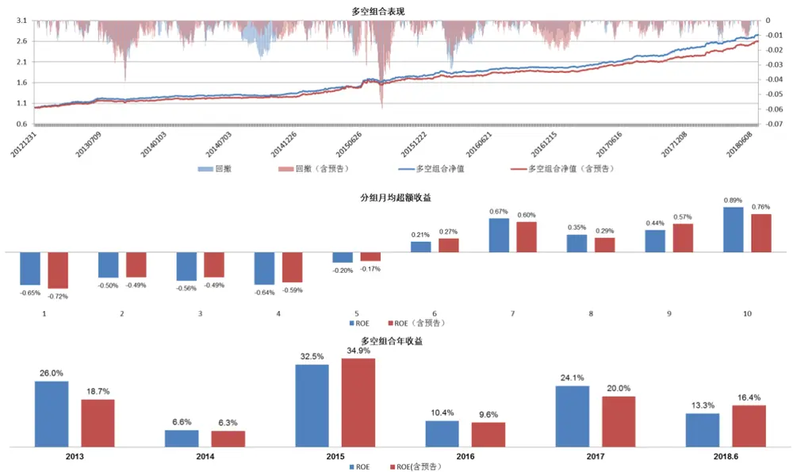

图 14：SUE1（含预告）因子和原始因子效果对比

| 因子 | rankIC | ICIR | 多空年化收益 | 信息比 | 月胜率 | 最大回撤 |
| --- | --- | --- | --- | --- | --- | --- |
| SUE1 | 0.046 | 3.631 | 20.41% | 3.539 | 83.33% | -4.83% |
| SUE1（含预告） | 0.047 | 3.673 | 19.16% | 3.244 | 81.82% | -5.98% |

数据来源：东方证券研究所 Wind 资讯

我们把加入了业绩预告后的 SUE0 和 SUE1 分别对原始的两个因子做横截面正交化，同时也把原始的 SUE0 和 SUE1 分别对加入预告后的因子做横截面正交化，来检验新的业绩超预期因子是否带来了额外的增量信息。图15和16分别是加入预告后的SUE0和SUE1对原始的SUE0和SUE1这两个自变量做横截面回归后的因子效果，可以看到剔除了超预期信息后，SUE0(含预告)的 rankIC为 0.2，ICIR 有 2.4，多空的信息比为 1.06；SUE1(含预告)的 rankIC 为 0.19，ICIR 有 2.05，多空的信息比为 1.37。也就是说业绩预告后的信息给 SUE0和 SUE1 带来了新的增量信息。

既然业绩预告带来了新的增量信息，那么为什么含业绩预告的 SUE0 和 SUE1 表现并没有比原始的超预期因子更强呢？这里我们把原始的 SUE0 和 SUE1 对加入预告后的因子值进行横截面回归并测算因子的选股效果（图 17、18），可以看到剔除了含业绩预告的 SUE0和 SUE1之后，原始的因子依然有着很好的选股效果，也就是说它们相对于含业绩预告的超预期因子也有着明显的增量信息。

从结果来看，加入了业绩预告后的 SUE0 和 SUE1 和原来的因子之间都互相有着独立信息，这很大可能是因为有部分投资者并不会根据业绩预告来调整自己的预期，从而当业绩预告出来之后，一部分投资者的超预期是根据业绩预告来判断的，而另一部分并没有调整自己的预测，这就会导致在业绩预告出来之后，原始的超预期和调整了业绩预告的超预期因子都具有部分独立的选股效果，从而产生相互剔除均有信息增量的现象。因此，从这一点来考虑，加入了业绩预告的 SUE0和 SUE1可以作为新的业绩超预期因子和原来的因子进行互相补充。

图 15：剔除了 SUE0 和 SUE1 后的 SUE0(含预告)表现
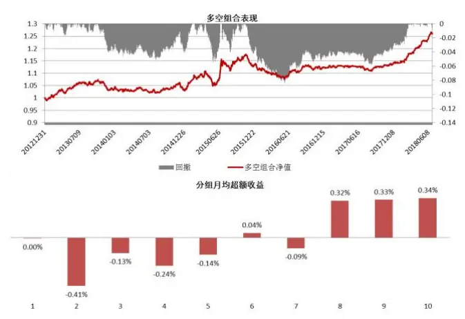
数据来源：东方证券研究所 Wind 资讯

图 16：剔除了 SUE0 和 SUE1 后的 SUE1(含预告)表现
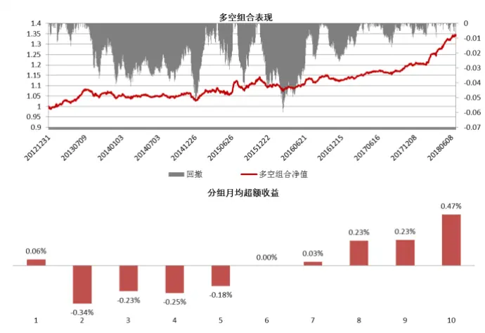
因子rankIC ICIR多空年化收益 信息比 月胜率 最大回撤SUE0（含预告）0.020 2.446 4.34%1.064 57.58% -8.47%

| 因子 |  | rankIC | ICIR | 多空年化收益 | 信息比 | 月胜率最大回撤 |
| --- | --- | --- | --- | --- | --- | --- |
| SUE1 | (含预告) | 0.019 | 2.056 | -100.00% | 1.379 | 68.18% -5.98% |

数据来源：东方证券研究所 Wind 资讯

图 17：剔除了 SUE0（含预告）和 SUE1（含预告）后的 SUE0表现
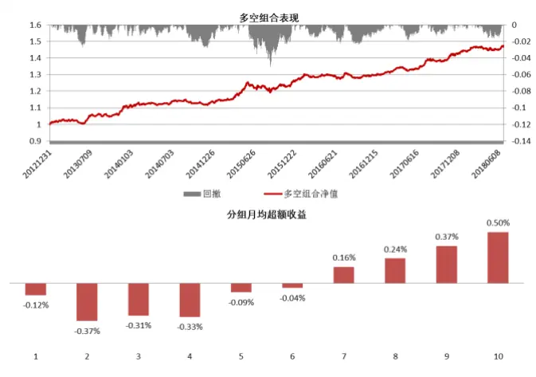

| 因子 | rankIC |  | ICIR | 多空年化收益 | 信息比 | 月胜率最大回撤 |
| --- | --- | --- | --- | --- | --- | --- |
| SUEO |  | 0.024 | 3.116 | 7.34% | 1.869 | 71.21% -5.05% |

数据来源：东方证券研究所 Wind 资讯

图 18：剔除了 SUE0（含预告）和 SUE1（含预告）后的 SUE1表现
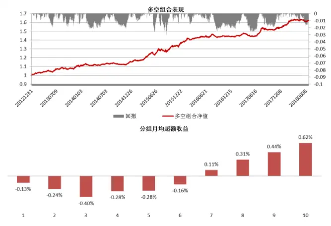

| 因子 | rankIC | ICIR | 多空年化收益 | 信息比 | 月胜率 最大回撤 |
| --- | --- | --- | --- | --- | --- |
| SUE1 | 0.026 | 2.929 | 9.24% | 2.277 | 69.70% -3.03% |

数据来源：东方证券研究所 Wind 资讯

## 4.总结

这篇报告主要从多个维度切入来研究业绩预告在传统的多因子框架下的应用。业绩预告比业绩快报和定期财务报告的公布时间更早，对推测上市公司业绩还是很重要的。从 2012年开始，A股业绩预告的数量大幅的提升，且发布的预告的上市公司数量也达到了1500家左右，今年截至到6月底，已经有 2600多家上市公司发布过了业绩预告，覆盖度较高。从业绩预告的质量来看，业绩预告与实际的单季净利润偏离在正负 10%以内的预告占比在 50.84%，正负 20%以内的预告占比在67.94%，也就是说大多数公司的实际单季净利润不会偏离业绩预告上下限的均值太远，总体来说质量还是有一定的保证的。

我们基于业绩预告与实际归母净利润构建超预期因子，行业市值中性化后的业绩预告均值偏离度在2012.12.31-2018.6.29 这个区间的 RankIC 为 0.023，ICIR 有 2.36，多空组合年化收益为 7.8%，信息比为 2.04，且最大回撤仅为-3.54%，还是有着非常好的选股效果。在对常规的 4 个超预期因子（SUE0、SUE1、SUR0、SUR1）做正交化之后，业绩预告均值偏离度因子的 ICIR 下降到了0.74，多空组合年化收益下降到了 5%，信息比下降到了 1.4，说明这个因子与常规的业绩超预期因子确实存在一定的信息重叠，但是在剥离完这 4个超预期因子后，仍然有着一定的信息增量。

业绩预告的还有一种应用方式是提高我们现有因子的信息更新频率，这样就可以提高信息的利用效率，增加因子的选股效果，这里我们分别对 EP_TTM、ROE、SUE0 和 SUE1 进行的改进，在这4个因子更新的时候加入了业绩预告的数据。对于 EP_TTM 和 ROE来说，加入了业绩预告后因子与原始因子的因子值相关性依然高达 90%以上，但是选股效果都有着一定的提升；对于业绩超预期因子来说，加入了业绩预告后的因子与原始因子的改变较大，虽然因子表现与原始因子类似，但是新的因子却带来了很明显的信息增量，SUE0（含预告）在剔除了 SUE0 和 SUE1 后，RankIC为 0.2，ICIR 为 2.4，多空的信息比为 1.06；SUE1(含预告) 在剔除了 SUE0 和 SUE1 后，rankIC为 0.19，ICIR 有 2.05，多空的信息比为 1.37，均有着非常明显的额外信息。而反过来把 SUE0和 SUE1 对加入了业绩预告的因子做正交化后，因子也有很明显的选股效果，这也就是说加入了业绩预告后的超预期因子与原来超预期因子有着非重叠的信息，所以可以考虑把 SUE0（含预告）和 SUE1(含预告)作为新的超预期因子与原来的超预期因子结合使用。

## 风险提示

- 极端市场环境可能对模型效果造成剧烈冲击，导致收益亏损。

- 量化模型基于历史数据分析得到，未来存在失效风险，建议投资者紧密跟踪模型表现。

## 分析师申明

每位负责撰写本研究报告全部或部分内容的研究分析师在此作以下声明：

分析师在本报告中对所提及的证券或发行人发表的任何建议和观点均准确地反映了其个人对该证券或发行人的看法和判断；分析师薪酬的任何组成部分无论是在过去、现在及将来，均与其在本研究报告中所表述的具体建议或观点无任何直接或间接的关系。

## 投资评级和相关定义

报告发布日后的 12个月内的公司的涨跌幅相对同期的上证指数/深证成指的涨跌幅为基准；

## 公司投资评级的量化标准

买入：相对强于市场基准指数收益率 15%以上；

增持：相对强于市场基准指数收益率 5%～15%；

中性：相对于市场基准指数收益率在-5%～+5%之间波动；

减持：相对弱于市场基准指数收益率在-5%以下。

未评级——由于在报告发出之时该股票不在本公司研究覆盖范围内，分析师基于当时对该股票的研究状况，未给予投资评级相关信息。

暂停评级——根据监管制度及本公司相关规定，研究报告发布之时该投资对象可能与本公司存在潜在的利益冲突情形；亦或是研究报告发布当时该股票的价值和价格分析存在重大不确定性，缺乏足够的研究依据支持分析师给出明确投资评级；分析师在上述情况下暂停对该股票给予投资评级等信息，投资者需要注意在此报告发布之前曾给予该股票的投资评级、盈利预测及目标价格等信息不再有效。

## 行业投资评级的量化标准：

看好：相对强于市场基准指数收益率 5%以上；

中性：相对于市场基准指数收益率在-5%～+5%之间波动；

看淡：相对于市场基准指数收益率在-5%以下。

未评级：由于在报告发出之时该行业不在本公司研究覆盖范围内，分析师基于当时对该行业的研究状况，未给予投资评级等相关信息。

暂停评级：由于研究报告发布当时该行业的投资价值分析存在重大不确定性，缺乏足够的研究依据支持分析师给出明确行业投资评级；分析师在上述情况下暂停对该行业给予投资评级信息，投资者需要注意在此报告发布之前曾给予该行业的投资评级信息不再有效。

## 免责声明

本证券研究报告（以下简称“本报告”）由东方证券股份有限公司（以下简称“本公司”）制作及发布。

本报告仅供本公司的客户使用。本公司不会因接收人收到本报告而视其为本公司的当然客户。本报告的全体接收人应当采取必要措施防止本报告被转发给他人。

本报告是基于本公司认为可靠的且目前已公开的信息撰写，本公司力求但不保证该信息的准确性和完整性，客户也不应该认为该信息是准确和完整的。同时，本公司不保证文中观点或陈述不会发生任何变更，在不同时期，本公司可发出与本报告所载资料、意见及推测不一致的证券研究报告。本公司会适时更新我们的研究，但可能会因某些规定而无法做到。除了一些定期出版的证券研究报告之外，绝大多数证券研究报告是在分析师认为适当的时候不定期地发布。

在任何情况下，本报告中的信息或所表述的意见并不构成对任何人的投资建议，也没有考虑到个别客户特殊的投资目标、财务状况或需求。客户应考虑本报告中的任何意见或建议是否符合其特定状况，若有必要应寻求专家意见。本报告所载的资料、工具、意见及推测只提供给客户作参考之用，并非作为或被视为出售或购买证券或其他投资标的的邀请或向人作出邀请。

本报告中提及的投资价格和价值以及这些投资带来的收入可能会波动。过去的表现并不代表未来的表现，未来的回报也无法保证，投资者可能会损失本金。外汇汇率波动有可能对某些投资的价值或价格或来自这一投资的收入产生不良影响。那些涉及期货、期权及其它衍生工具的交易，因其包括重大的市场风险，因此并不适合所有投资者。

在任何情况下，本公司不对任何人因使用本报告中的任何内容所引致的任何损失负任何责任，投资者自主作出投资决策并自行承担投资风险，任何形式的分享证券投资收益或者分担证券投资损失的书面或口头承诺均为无效。

本报告主要以电子版形式分发，间或也会辅以印刷品形式分发，所有报告版权均归本公司所有。未经本公司事先书面协议授权，任何机构或个人不得以任何形式复制、转发或公开传播本报告的全部或部分内容。不得将报告内容作为诉讼、仲裁、传媒所引用之证明或依据，不得用于营利或用于未经允许的其它用途。

经本公司事先书面协议授权刊载或转发的，被授权机构承担相关刊载或者转发责任。不得对本报告进行任何有悖原意的引用、删节和修改。

提示客户及公众投资者慎重使用未经授权刊载或者转发的本公司证券研究报告，慎重使用公众媒体刊载的证券研究报告。

## 东方证券研究所

地址：上海市中山南路 318 号东方国际金融广场 26 楼

联系人： 王骏飞

电话：021-63325888*1131

传真：021-63326786

网址： www.dfzq.com.cn

Email： wangjunfei@orientsec.com.cn