## 研究结论

ROE 是价值投资者考察上市公司盈利能力的一个重要指标，在美国市场上有效性很强，但在A股基本没有选股效果，造成“A股不看公司盈利”的印象。但如果 ROE 的分子换成一年后的未来盈利，ROE的选股能力将显著提高，说明历史 ROE 选股无效的原因主要在于其对公司未来盈利的预测作用太弱，准确的盈利预测可以为投资者带来超额收益。

预测公司盈利的常用方法有三种：时间序列法，横截面法和分析师一致预期。前两者是基于客观历史数据的统计模型，后者是分析师综合多种信息源研究后得到的汇总主观数据。从预测精度来看，采用历史 TTM 数据的时间序列方法预测准确性高于一致预期和横截面回归方法。分析师一致预期数据存在明显高估现象。

分析师一致预期数据的价值不在于其静态的绝对值，而在于其时间序列上动态变化和横截面上相对差异。我们前期报告里提到的盈利预期调整因子的优秀选股效果说明了一致预期数据时间序列上变化的价值，横截面上估值指标EP_FY1 表现明显优于 EP，可能是因为一致预期中包含分析师对公司盈利相对大小的研判信息。

有了盈利预测数据后，我们根据Easton(2004)的证券估值模型反算当前股价隐含的预期收益（ICC），在一定理论假设下，它和实际投资中常用的 PE和 PEG 指标等价，选股能力优秀，衍生的 PEG_his 和 Delta_ICC 指标也有不错的选股效果。

ICC 指标能够区分未来一个月股票收益的相对好坏，但很难用它来判断未来收益的绝对值大小进行择时。从测试结果看，它对中证 500指数未来一年的收益有显著的预测作用，但更短期的预测基本都不显著，对沪深300和中证全指预测也都无效。

## 风险提示

- 量化模型失效风险

- 市场极端环境的冲击

报告发布日期2018 年 09 月 01 日

证券分析师朱剑涛

021-63325888*6077

zhujiantao@orientsec.com.cn

执业证书编号：S0860515060001

相关报告

| 上市公司业绩预告信息研究 公司研发费用因子探究 | 2018-08-03 2018-06-09 |
| --- | --- |
| 因子择时 | 2018-06-02 |
| 英国市场简史与现状 | 2018-05-18 |
| 业绩超预期类因子 |  |
| 协方差矩阵谱分解近似方法的补充 | 2018-05-18 |
| 风险模型提速组合优化的另一种方案 | 2018-04-04 2018-03-28 |
| A 股小市值溢价的来源 | 2018-03-04 |
| 组合优化的若干问题 | 2018-03-01 |
| 反转因子择时研究 | 2018-02-21 |
| 港股简史与现状 | 2018-01-22 |

## 一、 盈利预测的意义

按照证券估值理论里最经典的股利贴现模型（DDM, Dividend Discount Model），股票的理论价值等于未来股票红利的贴现值之和，而股票分红来自于公司的盈利，因此盈利应该是股票定价里的最核心因素之一，但在 A 股实际投资中，财报里的盈利信息对于选股并没有太大的直接效用。例如，投资者如果用 TTM 的 ROE 在全市场选股，该因子的选股效果如图 1 所示，ROE 高（低）的股票并未获得对应的正（负）超额收益，股票未来收益跟ROE 的相关性不强。对比来看，美国市场 ROE因子过去二十年的平均 IC有 0.04，IC_IR接近 2，选股能力十分显著。

造成“A股不看公司盈利”现象的原因可能有两个：一个是 A股属于散户交易占主导的市场，易表现非理性，造成实际价格长期脱离理论价值；二是 DDM模型里的盈利是未来的盈利，A股作为新兴市场，企业盈利波动大，财报里的历史盈利信息对未来的预测作用不大。前者比较难验证，对于后者，我们假设投资者能准确知道 12个月后上市公司的 ROE_TTM，并基于此来做选股，这个包含未来信息的 ROE因子选股效果如图 2所示，因子 IC有 0.06，IC_IR达到 1.43，因子分组超额收益十分单调，多空组合表现稳健。由此可见，未来盈利好的公司确实获得了更高的市场超额收益，因此投资者如果能找到一个模型来预测企业盈利，模型的准确性是可以转换为投资收益的。A 股和成熟市场一样，也看公司盈利。

图 1：ROE_TTM 因子测试结果(2006.02- 2017.08)

| 2006.02 - 2017.08 |  | top 10% minus bot 10% |  |  |  |
| --- | --- | --- | --- | --- | --- |
| IC 均值 | IC_IR | 平均月收益 | IR | 胜率 | 最大回撤 |
| 0.003 | 0.08 | -0.10% | -0.14 | 47.5% | -55.9% |

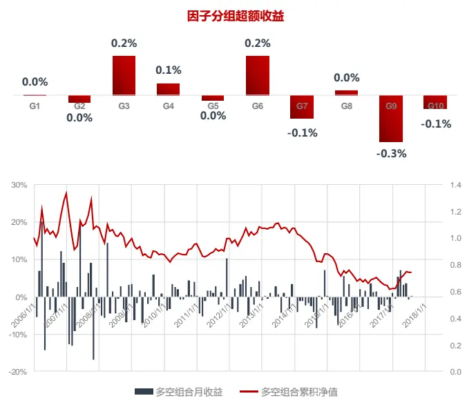
资料来源：东方证券研究所 & Wind 资讯

图 2：ROE_12M_shift 因子测试结果(2006.02- 2017.08)

| 2006.02 - 2017.08 |  | top 10% minus bot 10% |  |  |  |
| --- | --- | --- | --- | --- | --- |
| IC 均值 | IC_IR | 平均月收益 | IR | 胜率 | 最大回撤 |
| 0.056 | 1.43 | 2.30% | 2.04 | 66.2% | -30.2% |

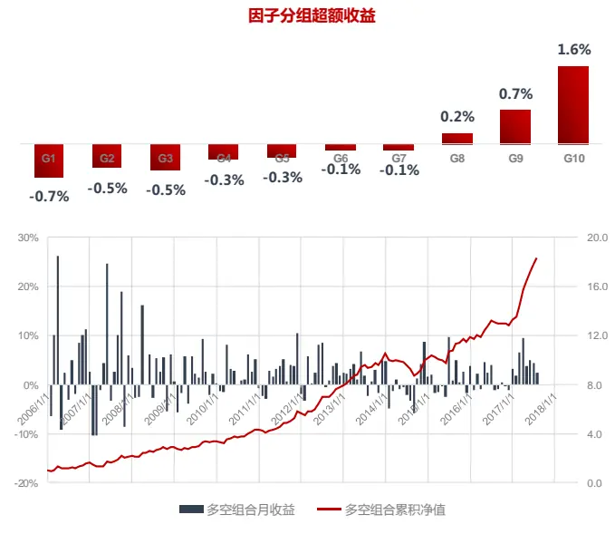
资料来源：东方证券研究所 & Wind 资讯

## 二、 盈利预测方法与实证

## 2.1 三种常用的盈利预测方法

预测公司盈利的常用方法有三种：时间序列法，横截面法和分析师一致预期。前两者是基于客观历史数据的统计模型，后者是分析师综合多种信息源研究后得到的汇总主观数据。以下分别介绍：

## 2.1.1 时间序列方法

时间序列方法是对上市公司历年的盈利数据（例如：ROE）统计建模，估计参数，预测下一期盈利。建模大多采用的是 AR 自回归模型，它利用到了公司盈利能力呈现的“均值回复”特征。参照 Penman(2012) 的证券估值教科书第 16章的盈利收敛图，图 3以 ROE为例展示了盈利收敛的过程。在 T 年把所有股票按 ROE 的高低分十组，计算每组的平均 ROE，之后再计算每组股票在之后五年每年的平均 ROE。可以看到，ROE 高的股票在五年内仍然能保持相对较高的 ROE，但不同组之间 ROE差距在减小收敛。

通常认为市场竞争是公司盈利均值回复的主因，高盈利行业会吸引更多市场参与者，竞争加剧，进而降低整体盈利。但这是全市场股票的一个汇总结果，具体到某个行业或某只股票上则不一定，Canarella（2013）剔除掉股票间横截面上的相关性影响后，统计检验发现美国市场上信息科技和通讯两个行业股票的盈利满足均值回复，而可选消费和公用事业行业则不满足。行政管制多、有垄断、竞争不充分的行业的公司盈利能力不一定会回复均衡水平。

图 3：ROE 随时间的收敛（2006.01 – 2018.07）
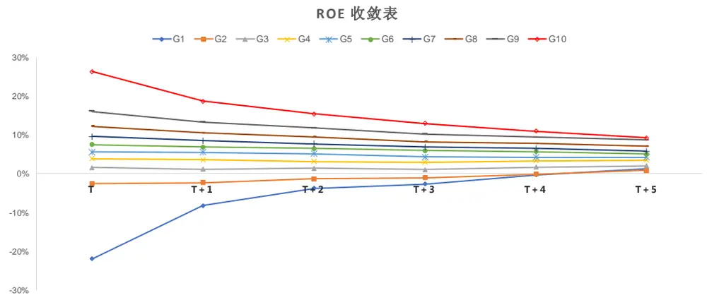
数据来源：东方证券研究所 & Wind 资讯

时间序列方法在使用中最大的问题是需要非常长的历史数据来估计模型参数，这在 A 股会是比较棘手的问题。数据太少，模型参数估计的方差高，结果受数据噪音的影响大。我们报告下文采用了最简单的时间序列方方法：随机游走模型。用最新的 TTM 盈利数据作为未来盈利的预测值，这种最简单的方法不涉及参数估计。

## 2.1.2 横截面方法

图 3 显示上市公司的盈利能力在短期内还是比较稳定的，可以考虑用当期横截面上所有已知股票数据来预测下一期的股票盈利能力。假设 t时刻市场上有 N只股票，横截面模型可以表示为：

$$
\mathrm{Y}_{\mathrm{i}}^{t+1}=f\big(X_{1,i}^{t},X_{2,i}^{t},\ldots X_{K,i}^{t}\big)\quad i=1{,}2\ldots N
$$

其中 $\mathrm{Y_{i}^{t+1}}$ 是度量公司盈利能力的指标，常用的有 ROE，RONOA 等。 $X_{k,i}^{t},\quad k=1{,}2\ldots K$ 是 K 个用来预测盈利能力的变量，选择有很多，最早的可以参考 Fama & French (2006)，以及其后的 Hou(2012)和 Novy-Marx(2013)，变量背后都有一定的经济逻辑和实证数据支持。函数 通常取为线性形式，投资者也可以考虑机器学习模型。

Azevedo(2016) 在美国和欧洲市场上比较了上述三个横截面模型的预测准确性，Novy-Marx(2013)的预测精度最高，但数值差别在美国市场上并不大；在预测未来一年公司盈利时它会比其它两个模型更容易高估，而且三个模型的预测精度都不及 I/B/E/S 分析师一致预测。不过这个实证结果会有点数据依赖，而且和怎么度量预测精度也会有关系，下一节再详细探讨。我们报告里参考的是 Hou(2012) 的模型，主要是考虑到报告后文要基于盈利预测数据计算股票的市价隐含预期收益（ICC, Impied Cost of Capital），Hou(2012)的文章在这个领域引用较多，以便对比参考。

Hou(2012) 直接用公司净利润数值作为 $\mathrm{{!Y_{i}^{t+1}}}$ ，变量 $X_{k,i}^{t}$ 用的是市值、总资 $i产$ 、分红等指标的数值。这样建模的问题是，上市公司规模大小分布不均， $\mathrm{Y_{i}^{t+1}}$ 和 $X_{k,i}^{t}$ 和样本数据的偏度和峰度会很大，显著偏离正态分布，线性回归 OLS 估计量不能保证一致性，也就是说样本数量虽然很多，但 OLS估计量不收敛于目标理论值。本报告用的是未来最新一期年报 ROE 作为  ，变量 $\cdot X_{k,i}^{t}$ 包括：当期市值（取对数）、 $\mathsf{[BP]}$ 估值、ROE(TTM)、股息率、行业虚拟变量（中性一级）和 $1_{\{\mathrm{ROE}<0\}}\cdot ROE$ 。加入最后一项的原因是之前有研究发现亏损公司盈利回复的速度要比实现盈利的公司要快，实证显示这项的回归系数确实为负值。

以上横截面模型我们在 A股进行了实证，每个月横截面回归的 Adjusted Rsquared 如下图所示。之所以呈现周期变化的原因是因为我们用的是 TTM的财务数据作为自变量，随着季报、半年报的发布，年报里的未知信息越来越少，回归方程的解释度随着年报临近越来越高。可以看到，上年年报公布完后，每年四月底，横截面模型对下一年 ROE的解释度最低，但 Adjusted Rsquared 也有 40%左右，到下一年二月份，可以升至 70%左右，模型的解释度整体非常高。三月份和四月份是年报集中公布期，年报公布时点不一，模型没有做测试，故数据缺失。

图 4：横截面模型每个月的 Adjusted Rsquared（2006.01 – 2018.07）
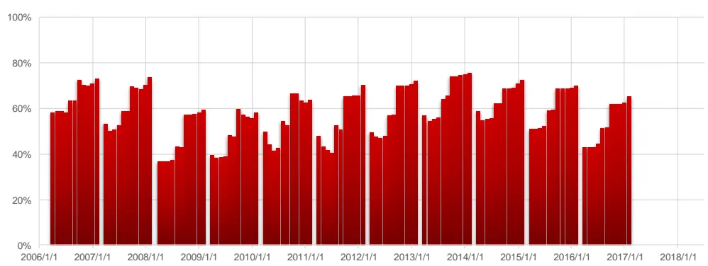

## 2.1.3 分析师一致预期

分析师盈利预测数据最大的特点是它包含了很多行业政策、突发事件、公司治理等很多无法定量分析的信息，但同时它又是主观分析的结果，受市场情绪和分析师自身利益冲突的影响。把过去一段时间内所有分析师的盈利预测数据加总起来就可以得到个股的一致预期盈利，最简单的加权方法是等权，但这种方法预测准确性不高。我们在上篇报告《分析师研报的数据特征与 alpha》通过回归分析发现，分析师工作经验、历史预测准确度、业内获奖情况对其未来的预测精度有显著影响。基于预测精度的高低给分析师不同的权重，加权其盈利预测结果，预测精度显著好于好于简单等权法。图 5 展示了我们计算得到的一致预期数据在全市场股票里的数据覆盖率，大部分时间 60%以上的股票都有数据覆盖，值得注意的是 2017 年开始的数据覆盖率的大幅下降，这可能和 2017 年行龙头股行情，让分析师对个股的关注度过于集中，小票无人关注，导致数据覆盖度显著下降。

图 5：FY1 一致预期预期数据全市场覆盖度（2006.01 – 2018.07）
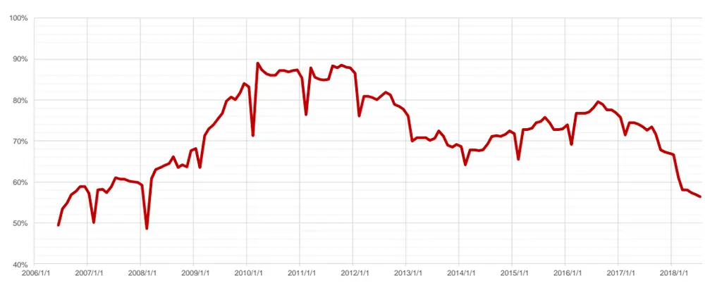
数据来源：东方证券研究所 & Wind 资讯

## 2.2 盈利预测方法准确性比较

假设有 N 个股票， $\mathrm{E_{k}^{model}}$ 是模型预测的股票 k 的净利润， $\mathrm{E_{k}}$ 是未来年里的真实净利润，模型的预测的准确性可以用下面指标度量:

$$
\mathrm{Error}=\left.\frac{1}{N}\sum_{k=1}^{N}\left|\frac{\mathrm{E}_{\mathbf{k}}^{\mathrm{model}}-E_{k}}{X_{k}}\right|\right|
$$

$\mathrm{X_{k}}$ 的选择通常有三种：股票 k 的市值、净（总）资产、净利润。如果取为市值，那么上面这个 Error指标会和整个市场的估值水平，而市场的估值随时间变化，不利于时间序列方向上的比较。如果取为净资产或总资产，Error 指标会受行业 ROE 或 ROA 的影响，行业股票数量的多少直接影响结果。因此，最后我们取 $\mathbf{X_{k}}=E_{k}$ ，此时 Error 指标也称作 MAPE (Mean Absolute Percentage Error)，不过需要注意的是，如果某个股票的净利润 $\mathrm{E_{k}}$ 的绝对值很小，则计算出来预测误差会很大，明显拉高整体均值，因此我们在实证时会剔除 ROE 绝对值小于 1%的股票，这些剔除股票平均占样本数量量的 4%，最多的月份占到 6.8%。另外，一些突发事件，例如：卖房产的经常性损益、假疫苗事件、资产重组等，可能造成公司利润大幅波动，但这些事件模型是不可能预测到的，把它们考虑在内会干扰模型预测能力的评估。此时可以把 MAPE 指标里的求均值改为求中位数，或者剔除收尾各 2.5%的极端值，对剩余数值取平均，两种方法实证下来结论基本一致，报告下文展示的结果是后者。

每个月月底，我们基于最新数据用三个模型分别预测未来最近一期的年报数据，因为上市公司95%的年报发布期集中在 3 月和 4 月，发布时点不一，不同股票对应的未来最近一期的年报会不一致，因此每年 3 月底没有做预测。把每个月预测模型的 MAPE 简单平均得到图 6 的数据。可以看到随着季报、半年报的发布，离年报发布日期越近，三个模型的预测偏差都变得越小。平均来看，模型预测精度从高到低依次为：时间序列法、横截面法、一致预期。MAPE 衡量的是模型预测的绝对偏差，我们还可以用另外一个指标 MPE 来衡量模型模型后是否会高估或低估

$$
\mathrm{MPE}=\frac{1}{N}\sum_{k=1}^{N}\frac{E_{k}^{\mathrm{model}}-E_{k}}{|E_{k}|}.
$$

结果如图 7 所示，可以看到分析师的一致预期净利润一直处于高估状态，4 月底时平均高估 75%左右，随着年报发布期的临近，高估程度降低，但到第二年二月底，仍然高估了 30%. 时间序列和横截面方法，总体而言略微高估，但幅度较小，都在 10%以内，年报发布前的二月底，时间序列方法的高估程度平均只有 1%，横截面方法相对较高，有 5%.

图 6：三个模型在不同月份的平均 MAPE(2006.02- 2017.08)
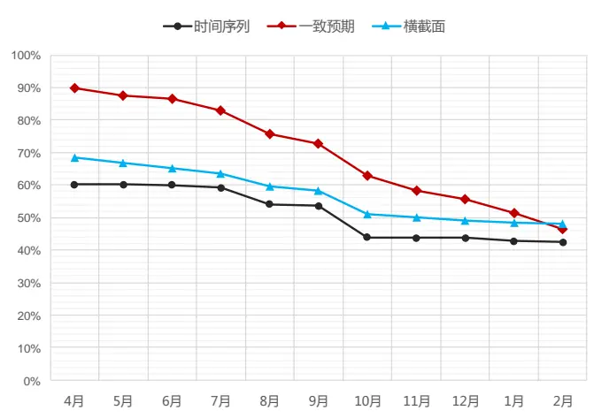
资料来源：东方证券研究所 & Wind 资讯

图 7：三个模型在不同月份的平均 MPE(2006.02- 2017.08)
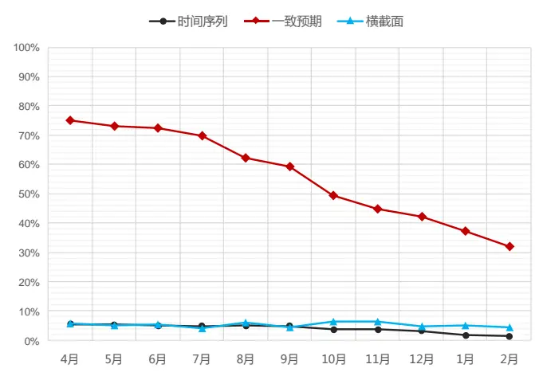
资料来源：东方证券研究所 & Wind 资讯

以上三个模型在海外学术研究领域里面，时间序列模型出现的最早，按照 Bradshaw(2012) 的整理，关于时间序列和一致预期方法的比较研究集中在 1968 至 1987的二十年间，最后的基本结论是一致预期优于时间序列方法，所以 2000年后有关时间序列方法的文献就变得非常少，用分析师一致预期的较多。不过 Bradshaw(2012) 重新做的实证显示，I/B/E/S 的一致预期只在分析师覆盖较多的大股票上做短期预测时优于时间序列方法；在分析师覆盖较少的小股票上、或者做长期预测时，一致预期不及时间序列模型。由于度量预测精度的指标不一样，这里没法把报告里的结果直接和其相比。

分析师一致预期数据会高估公司盈利是一个全球性现象，这和证券分析师涉及的利益冲突有关，包括：分析师和上市公司的利益关系、分析师和和持有该股票的机构客户间的利益关系、分析师的绩效考核机制等，感兴趣的投资者可以参考 Bradshaw(2011)做的相关文献综述。

既然分析师普遍存在高估企业盈利的现象，那是否有可能反向调低一致预期值让预测变得更准呢？ Dossou(2008), Gode(2008), Guay(2011)的研究得到了肯定的答案，这些研究的基本想法是找一些显著影响分析师预测偏差的股票特征，然后基于历史数据估计回归模型参数，预测分析师未来的预测偏差可能有多大，基于此反向调整一致预测数据。下文我们也做了类似测试，选取了市值、BP 估值、应计项目占比（Accrual / Equity），成长性（ROE 变化值），前三个月股票涨幅和行业虚拟作为自变量，通过回归模型来预测分析师预测偏差（MPE），一般来说，估值高、应计项目占比大、成长性好、最近涨幅大的股票，分析师更容易高估。图 8 展示了每个月做横截面回归预测分析师预测偏差时的 Adjusted Rsquared，不是很高，平均只有 15%左右。

图 8：横截面模型每个月的 Adjusted Rsquared（2006.01 – 2018.07）
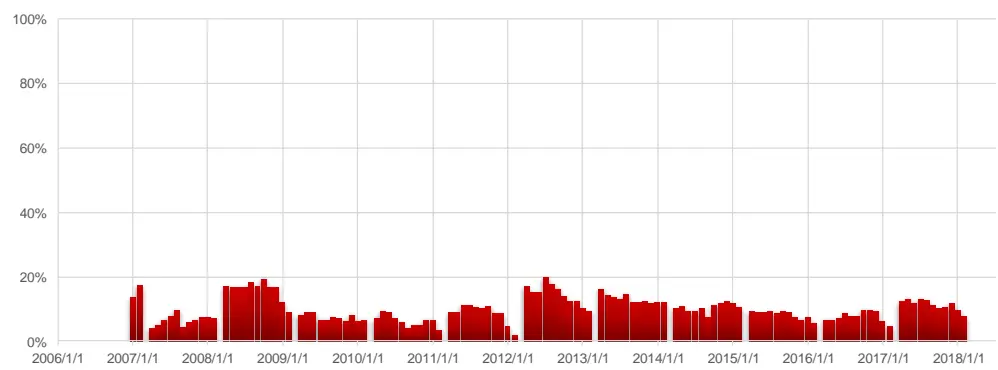
数据来源：东方证券研究所 & Wind 资讯

基于模型预测的预测偏差，我们可以反向调整一致预期数据，从图 9和图 10 可以看到，这个反向调整过程确实可以大幅降低分析师预测偏差（MPE），高估幅度降低一半左右；降低预测偏差的同时，预测精度也得到提高（MAPE 变小），但还是不如历史 TTM数值。另外，分析师的一致预期数据并非总是高估，在 2006 年经济动力强劲、企业盈利大幅改善的情况下，一致预测数据在 2017年 1月和 2月时仍然平均低估了盈利（2006年年报）2%左右，不过再往后都是高估。

图 9：一致预期（调整）的平均 MAPE(2008.04- 2017.08)
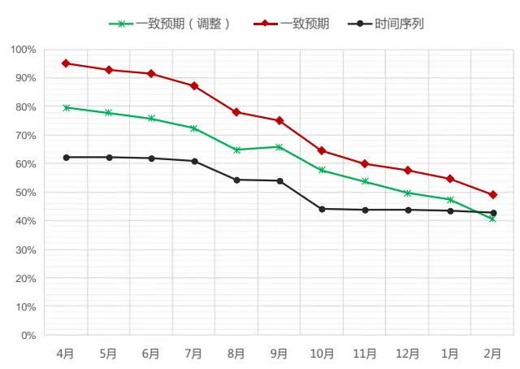
资料来源：东方证券研究所 & Wind 资讯

图 10：一致预期(调整)的平均 MPE(2008.04- 2017.08)
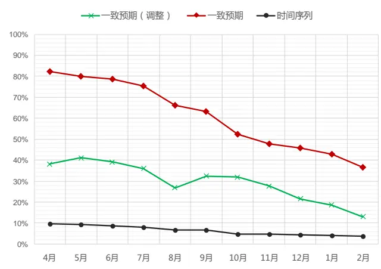
资料来源：东方证券研究所 & Wind 资讯

## 2.3 一致预期数据的信息增量

从上文的分析可以看到，一致预期方法预测净利润的精准度不如直接使用历史 TTM数据，那么它在实际投资中是否可以额外信息增量？我们认为分析师一致预期数据的价值不在于其静态的绝对值，而在于其时间序列上动态变化和横截面上相对差异。我们在之前报告《分析师研报的数据特征与 alpha》中验证过分析师一致预期盈利调整因子，向上（下）修正调整的股票能明显获得正（负）向超额收益，分析师盈利上调或下调代表了一种趋势判断，之前的因子测试结果显示，分析师的趋势判断和股价走势总体保持了一致。

至于一致预期数据横截面差异对选股的作用，我们构造了 EP, EP_FY1, EP_FY1_adj 三个选股因子来验证。三个指标的分母都是总市值，分子分别是 TTM的净利润、一致预期净利润和通过调整过预测偏度后的一致预期净利润。在全市场范围内，我们把三个因子都有数据的股票作为股票池，测试了因子的表现（图 11）。

图 11： 因子测试结果（2006.01 – 2018.07）

|  | 2006.02 - 2017.08 |  | top 10% minus bot 10% |  |  |  |
| --- | --- | --- | --- | --- | --- | --- |
|  | IC 均值 | IC_IR | 平均月收益 | IR | 胜率 | 最大回撤 |
| EP | 0.013 | 0.35 | 0.00% | 0.02 | 48.7% | -44.9% |
| EP_FY1 | 0.044 | 1.07 | 1.50% | 1.24 | 63.3% | -29.6% |
| EP_FY1_adj | 0.022 | 0.52 | 0.40% | 0.29 | 52.8% | -30.8% |

数据来源：东方证券研究所 & Wind 资讯

可以看到，用 TTM 净利润得到估值指标 EP 的选股作用非常差；一致预期数据虽然预测精度上没有 TTM 方法高，但是用它计算得到的 EP_FY1 的选股能力很强，因子 IC_IR 超过 1。说明EP_FY1 指标横截面上的排序和 EP 很不一样，分析师一致预期净利润的相对大小提供了额外的有用信息。如果在横截面上拿 EP_FY1 对 EP指标做回归，取残差项做选股因子，残差因子的 IC 仍有 0.036, IC_IR提高到 1.19，进一步说明一致预期相对历史数据而言提供了信息增量。

用回归模型调整了分析师预测偏差后，虽然一致预测数据的预测精度会变得更准，但是EP_FY1_ajd 指标的因子选股效果显著变弱，可能的原因是模型调整偏差的过程中可能打乱了一致预期数据的相对排序。

## 三、 市价隐含预期收益（ICC）

## 3.1 PE、PEG 和股票预期收益率的关系

除了构建因子，盈利预测的另一个重要应用是计算股票的预期收益，也就是股利贴现模型（DDM）里面把未来股票分红进行折现时用到的收益率。由于股票的分红时点和大小较难预测，DDM的实用性不高，我们下文引用 Easton(2004)的模型和推导来说明实务投资中常用的PE、PEG估值指标与股票预期收益率的关系。

假设当前时刻为 0 时刻，股票的理论价格为 $\mathrm{P_{0}}$ ，下一个时刻 1，股票每股分红记为 $\mathbf{d_{1}}$ ，股票价格记为 $\mathrm{P_{1}}$ 。如果投资者的借贷资金成本为 $\mathsf{{\Gamma}},$ 那么在市场无套利的假设下，股票价格应该满足

$$
P_{0}=\frac{P_{1}+d_{1}}{1+r}=\frac{eps_{1}}{r}-\left[\frac{eps_{1}}{r}-\frac{P_{1}+d_{1}}{1+r}\right]
$$

r 可以理解为投资者购买股票的预期收益, $\mathbf{eps_{1}}$ 为时刻 1 的每股盈利。下一个时刻 2 的股票价格 $\cdot\mathrm{P}_{2}$ 和 $\mathrm{P_{1}}.$ 也满足类似关系，借此可以逐步迭代，稍作变形后可以得到如下定价公式

$$
P_{0}=\frac{eps_{1}}{r}+\frac{1}{r}\sum_{t=1}^{\infty}\frac{agr_{t}}{(1+r)^{t}}
$$

其中 $\mathsf{agr}_{t}=eps_{t+1}+(1+\mathsf{r})\mathsf{d}_{\mathsf{t}}-(1+r)\cdot eps_{t}-d_{t}$ 称作预期异常盈利增长（Expected EarningsGrowth）。如果投资者有股票时刻 1 和时刻 2 的 eps 预测，那么为了让上式有实用价值，简便的方法是假设从时刻 3 开始, $\tt agr_{t}$ 保持一个匀速增长 $\begin{array}{r}{\Delta\arg=\frac{agr_{t+1}}{agr_{t}}-1}\end{array}$ 。美国市场 1981-1999 间个股每年的平均 是 2.9%，不过不同年份波动较大，较难预测。因此更方便的假设是 $\mathbf{:}\Delta\mathbf{a}\mathbf{g}\mathbf{r}=0$ ，此时上市可以进一步简化为

$$
\mathrm{P}_{0}=(eps_{2}+r\cdot d_{1}-eps_{1})/r^{2}
$$

也就是说当期时刻股价 $\mathrm{P_{0}}$ 和预期收益 满足如下方程：

$$
\mathbf{r}^{2}-\left(\frac{d_{1}}{P_{0}}\right)\mathbf{r}-\frac{eps_{2}-eps_{1}}{P_{0}}=0
$$

这是关于预期收益 的二次方程。如果投资者已经知道当前股价 $\cdot\mathrm{P}_{0}$ 和未来两期的 eps预测 $\mathsf{eps}_{1},eps_{2}$ 则可以解方程得到对应的预期收益，这个收益称为市价隐含预期收益（ICC, Implied Cost ofCapital）。进一步简化假设股票分红为 0，即 $\mathbf{d}_{1}=0$ ，且 $\mathrm{{_{1}eps_{2}}}>eps_{1}$ ，此时

$$
\mathbf{r}=\sqrt{\frac{\overline{eps_{2}-eps_{1}}}{P_{0}}}=\sqrt{\frac{\overline{eps_{2}-eps_{1}}}{\overline{eps_{1}}}\cdot\frac{\overline{eps_{1}}}{P_{0}}}=\sqrt{G/PE}
$$

其中 $\begin{array}{r}{G=\frac{eps_{2}-eps_{1}}{eps1}}\end{array}$ 表示利润增长率。股票的预期收益等于投资常用的 PE/G 估值指标取的倒数的平方跟，PE/G越高的股票，预期收益越低。

如果再进一步假设股票时刻 1 之后异常盈利增长为零，即：

$$
\arg_{1}=eps_{2}+r\cdot d_{1}-(1+r)\cdot eps_{1}=0
$$

则此时股票预期收益 $\mathrm{r}=\mathrm{eps}_1/P_0=EP$ 。实务投资中，经常会用 PE的倒数作为股票的预期收益率，例如大类资产配臵里著名的”Fed Model”，这种理解方法可以在 Easton(2004) 的模型里得到理论支持。用 EP表示股票预期收益是上列各个式子中计算方法最为简单的，但同时也是理论前提假设最强的，最容易和投资中的现实情况偏离。PEG 的方法，虽然计算略为复杂，但是理论前提假设比 EP方法弱，市场的适应性可能更强。

另外，上述理论推导中假设 $\mathrm{eps_{2}>eps_{1}}$ ，但事实上股票的盈利短期内可能会减少。此时上述模型不再适用，可以考虑剩余价值模型（Residual Income Model）。不过此时比较麻烦的是要假设公司的 ROE 未来会怎么变化。通常的做法是先预测股票未来 3年的盈利情况，然后假设之后十年股票 ROE 将逐步回复到历史均值，之后将按照长期 GDP 增长率永续增长。模型要设定的参数较多，比较敏感，不如上述模型方便。如果投资者用分析师的一致预期作为盈利预测值, $\mathrm{,eps_{2}>eps_{1}}$ 条件基本都能满足, 一致预期后年净利润大于明年的比例高达 96%。

## 3.2 基于 ICC 构建因子

我们可以用不同的方法去预测公司未来的盈利，然后用上节的模型来计算市价隐含预期收益，作为 alpha因子。如果投资者用的分析师的一致预期，那么此时的 ICC指标和 PEG指标等价，是非常不错的选股因子（图 12）。也可以用历史过去两年的盈利作为 eps2 和 eps1 的预测值，计算指标 $\mathrm{PEG}_{\mathrm{his}}=(\mathrm{eps}_{2}-\mathrm{eps}_{1})/P_{0}$ ，此时eps2是有可能小于eps1的，原理上和上述模型有出入，从效果看是一个刚够格的 alpha 因子（图 13），09 年之前的表现略差。 ICC 前后两个月的变化值 Delta_ICC 也可以为一个 alpha 因子（图 14），表现也十分稳健，隐含预期收益走高的股票未来收益也更高。

图 12：ICC指标（基于一致预期数据）在全市场的历史表现（2006.01 – 2018.07）

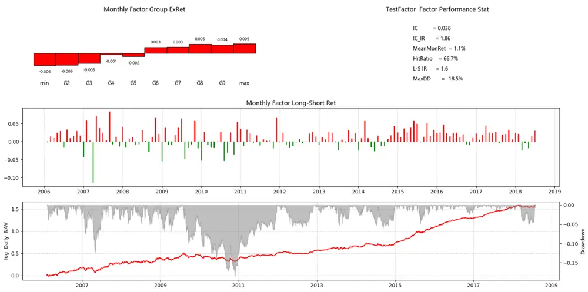
数据来源：Wind 资讯 & 东方证券研究所

图 13：PEG_his 指标（基于一致预期数据）在全市场的历史表现（2006.01 – 2018.07）
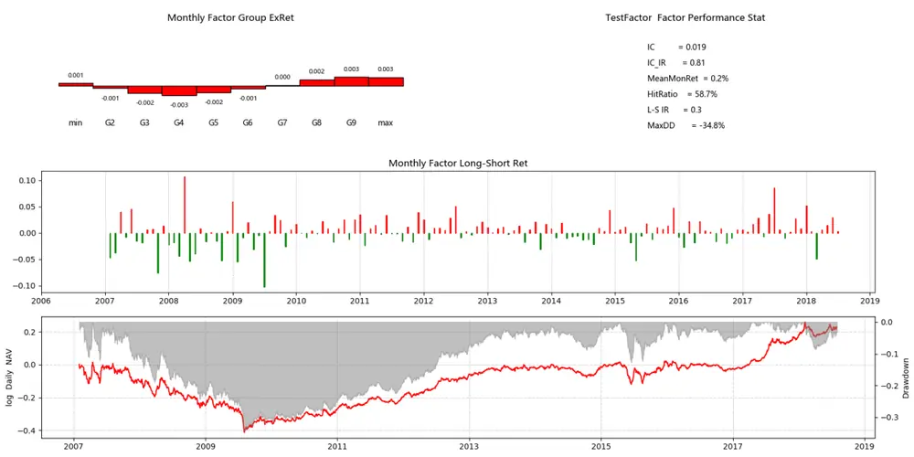
数据来源：Wind 资讯 & 东方证券研究所

图 14：Delta_ICC 指标（基于一致预期数据）在全市场的历史表现（2006.01 – 2018.07）

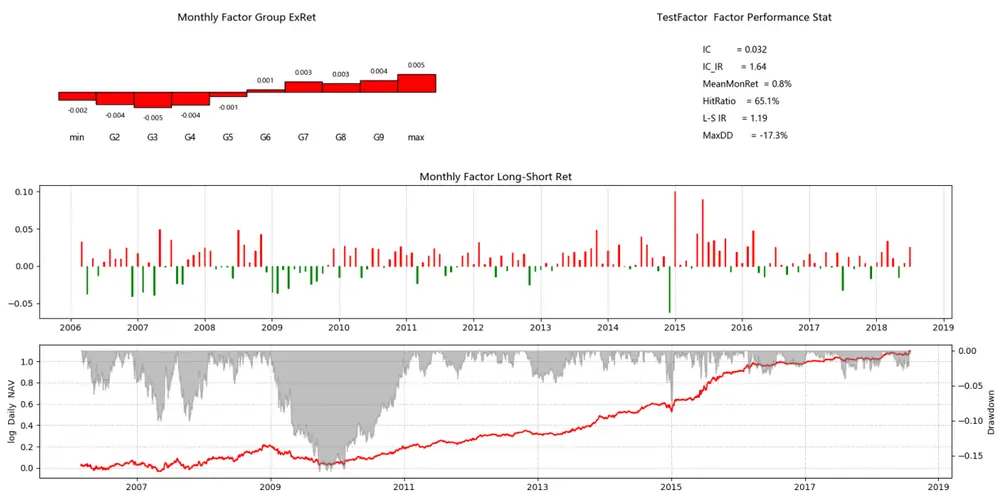
数据来源：Wind 资讯 & 东方证券研究所

## 3.3 市价隐含预期收益与真实收益

以上的实证研究说明，基于分析师一致预期得到的市价隐含预期收益（ICC）在横截面上可以区分未来一个月股票收益率的相对高低。投资者另外关心的一个问题是 ICC 在时间序列上和未来股市收益是否有相关性，或者说 ICC 指标能否用来择时。海外市场上，Botosan(2011),Larocque(2013), Li(2013) 做过此类研究，但结论并不统一；不同市场，盈利预测用哪个模型，证券估值用哪个模型对结论的影响很大。我们下文对中证全指、沪深 300、中证 500 三个指数进行了测试，把个股的 ICC 按市值加权得到对应指数的 ICC。然后用指数未来 K 个月的收益率作为因变量，指数当前时点的 ICC 作为自变量，进行回归，检验 ICC 的指标的预测能力。为了剔除 ICC指标时间序列上持续性（Persistence）的影响，回归模型采用的是我们上篇报告《因子择时》里推荐的 IVX 方法。计算个股的市价隐含预期收益时，除了 3.1节介绍的基于分析师一致预期的 ICC算法，还考虑了投资中常用的 EP_ttm 和 EP_FY1。

图 15： IVX 回归结果（2007.01 – 2018.07）

| 中证全指 | K=1 | K=3 | K=6 | K=12 |
| --- | --- | --- | --- | --- |
| EP_ttm | 0.306 | 0.576 | 0.861 | 1.173 |
|  | 0.600 | 0.336 | 0.176 | 0.122 |
| EP_FY1 | 0.139 | 0.391 | 0.745 | 1.116 |
|  | 0.803 | 0.499 | 0.228 | 0.121 |
| ICC | 0.844 | 0.993 | 1.079 | 0.853 |
|  | 0.245 | 0.171 | 0.144 | 0.290 |

| 沪深300 | K=1 | K=3 | K=6 | K=12 |
| --- | --- | --- | --- | --- |
| EP_ttm | 0.194 | 0.353 | 0.568 | 0.734 |
|  | 0.680 | 0.463 | 0.260 | 0.204 |
| EP_FY1 | 0.119 | 0.274 | 0.544 | 0.746 |
|  | 0.785 | 0.541 | 0.249 | 0.165 |
| ICC | -0.443 | -0.421 | -0.027 | 0.369 |
|  | 0.423 | 0.462 | 0.964 | 0.588 |

| 中证500 | K=1 | K=3 | K=6 | K=12 |
| --- | --- | --- | --- | --- |
| EP_ttm | 0.169 | 0.824 | 1.159 | 3.515 |
|  | 0.862 | 0.427 | 0.186 | 0.063 |
| EP_FY1 | -0.105 | 0.522 | 1.586 | 3.494 |
|  | 0.903 | 0.580 | 0.158 | 0.033 |
| ICC | 0.148 | 0.345 | 0.973 | 2.483 |
|  | 0.854 | 0.689 | 0.326 | 0.055 |

数据来源：东方证券研究所 & Wind 资讯

图 15 展示的是 IVX 回归中 ICC 指标的回归系数和对应统计检验的 p 值（斜体数值）。如果按臵信度 5%作为统计检验标准，事件隐含预期收益只对中证 500指数未来 12个月的收益率有显著预测作用，其中 EP_FY1 指标最为显著，p 值小于 0.05。市价隐含预期收益指标无法用于市场的短期择时。

图 16：中证 500 指数和市价隐含预期收益的走势（2007.01 – 2018.07）

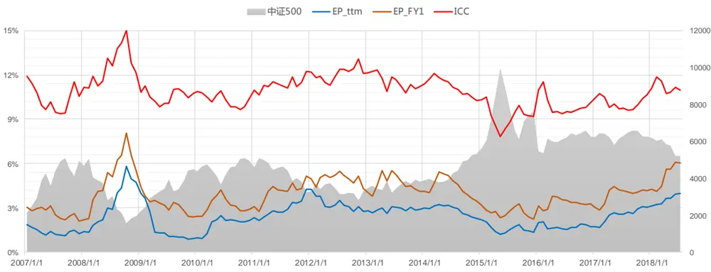
数据来源：Wind 资讯 & 东方证券研究所

## 四、 总结

准确的盈利预测可以为 A 股投资者获取超额收益，但从报告的测试结果看，准确盈利预测的难度很大。单从盈利预测精度看，直接使用历史财报的 TTM数据优于一致预期和横截面回归建模预测。我们认为分析师一致预期数据的价值不在于其静态的绝对值，而在于其时间序列上动态变化和横截面上相对差异。有了盈利预测的数值，在证券估值模型中做些假设后，投资者可以从股票价格中反算出其隐含的预期收益，基于此可以设计一些有效的选股指标来区分未来股票收益的相对好坏，但很难用它来判断未来短期收益率的绝对大小来进行择时。

## 风险提示

1. 量化模型基于历史数据分析得到，未来存在失效的风险，建议投资者紧密跟踪模型表现。

2. 极端市场环境可能对模型效果造成剧烈冲击，导致收益亏损。

## 参考文献

[1]. Azevedo, V., Gerhart, M., (2016), “Comparison of Cross-Sectional Earnings Forecasting Models for the European Market”. working paper, Available at SSRN: https://ssrn.com/abstract=2787277

[2]. Bradshaw, M.T., (2011), “Analysts’ Forecasts: What Do We Know after Decades of Work? “. working paper, Available at SSRN: https://ssrn.com/abstract=1880339

[3]. Bradshaw, M.T., Drake, M.S, Myers, J.N., Myers, L.A., (2012),” A re-examination of analysts’ superiority over time-series forecasts of annual earnings”, Review of Accounting Studies, Vol(17), Issue 4, 944–968.

[4]. Botosan, C. A.,Plumlee, M., Wen, H.J., (2011), “The Relation Between Expected Returns, Realized Returns, and Firm Risk Characteristics”. Contemporary Accounting Research, Vol(28), Issue(4), 1085 – 1122.

[5]. Canarella, G., Miller, S.M., Nourayi, M.M., (2013), “Firm Profitability: Mean-Reverting or Random-Walk Behavior?”, Journal of Economics and Business, Vol( 66), 76-97

[6]. Dossou,F., Lardic, S., Michalon, K., (2008), “ Can Earnings Forecasts be Improved by Taking into Account the Forecast bias?”, Economics Bulletin, Vol(7), 1-20.

[7]. Easton,P., (2004), “PE Ratios, PEG Ratios, and Estimating the Implied Expected Rate of Return on Equity Capital”, The Accounting Review, Vol(79), 73-95

[8]. Fama, E.F., French, K.R., (2006). “Profitability, investment and average returns”. Journal of Financial Economics, Vol(82), 491-518.

[9]. Gode, D., Mohanram,P., (2008), “Improving the relationship between Implied Cost of Capital and Realized Returns by Removing Predictable Analyst Forecast Errors”, working paper, available at: https://fisher.osu.edu/supplements/10/6899/Mohanram.pdf.

[10]. Guay, W. R., Kothari, S.P., Shu, S., (2011), “Properties of Implied Cost of Capital Using Analysts’ Forecasts”. Australian Journal of Management, Vol(36), No. 2.

[11]. Hou, K., van Dijk, M.A., Zhang, Y., (2012). “The implied cost of capital: A new approach”, Journal of Accounting and Economics, Vol(53), 504-526

[12]. Larocque, S., (2013), “Analysts' Earnings Forecast Errors and Cost of Equity Capital Estimates “. Review of Accounting Studies, Vol(18), No. 1.

[13]. Li, Y., David, T.Ng., Swaminathan, B., (2013), “Predicting market returns using aggregate implied cost of capital” ,Journal of Financial Econometrics, Vol(110), 419-436

[14]. Novy-Marx, R., (2013). “The other side of value: The gross profitability premium”. Journal of Financial Economics , Vol(108), 1-28

[15]. Penman, S. H., (2012), “Financial Statement Analysis and Security Valuation ( Fifth Edition )”, McGraw-Hill Professional.

## 分析师申明

每位负责撰写本研究报告全部或部分内容的研究分析师在此作以下声明：

分析师在本报告中对所提及的证券或发行人发表的任何建议和观点均准确地反映了其个人对该证券或发行人的看法和判断；分析师薪酬的任何组成部分无论是在过去、现在及将来，均与其在本研究报告中所表述的具体建议或观点无任何直接或间接的关系。

## 投资评级和相关定义

报告发布日后的 12个月内的公司的涨跌幅相对同期的上证指数/深证成指的涨跌幅为基准；

## 公司投资评级的量化标准

买入：相对强于市场基准指数收益率 15%以上；

增持：相对强于市场基准指数收益率 5%～15%；

中性：相对于市场基准指数收益率在-5%～+5%之间波动；

减持：相对弱于市场基准指数收益率在-5%以下。

未评级——由于在报告发出之时该股票不在本公司研究覆盖范围内，分析师基于当时对该股票的研究状况，未给予投资评级相关信息。

暂停评级——根据监管制度及本公司相关规定，研究报告发布之时该投资对象可能与本公司存在潜在的利益冲突情形；亦或是研究报告发布当时该股票的价值和价格分析存在重大不确定性，缺乏足够的研究依据支持分析师给出明确投资评级；分析师在上述情况下暂停对该股票给予投资评级等信息，投资者需要注意在此报告发布之前曾给予该股票的投资评级、盈利预测及目标价格等信息不再有效。

## 行业投资评级的量化标准：

看好：相对强于市场基准指数收益率 5%以上；

中性：相对于市场基准指数收益率在-5%～+5%之间波动；

看淡：相对于市场基准指数收益率在-5%以下。

未评级：由于在报告发出之时该行业不在本公司研究覆盖范围内，分析师基于当时对该行业的研究状况，未给予投资评级等相关信息。

暂停评级：由于研究报告发布当时该行业的投资价值分析存在重大不确定性，缺乏足够的研究依据支持分析师给出明确行业投资评级；分析师在上述情况下暂停对该行业给予投资评级信息，投资者需要注意在此报告发布之前曾给予该行业的投资评级信息不再有效。

## 免责声明

本证券研究报告（以下简称“本报告”）由东方证券股份有限公司（以下简称“本公司”）制作及发布。

本报告仅供本公司的客户使用。本公司不会因接收人收到本报告而视其为本公司的当然客户。本报告的全体接收人应当采取必要措施防止本报告被转发给他人。

本报告是基于本公司认为可靠的且目前已公开的信息撰写，本公司力求但不保证该信息的准确性和完整性，客户也不应该认为该信息是准确和完整的。同时，本公司不保证文中观点或陈述不会发生任何变更，在不同时期，本公司可发出与本报告所载资料、意见及推测不一致的证券研究报告。本公司会适时更新我们的研究，但可能会因某些规定而无法做到。除了一些定期出版的证券研究报告之外，绝大多数证券研究报告是在分析师认为适当的时候不定期地发布。

在任何情况下，本报告中的信息或所表述的意见并不构成对任何人的投资建议，也没有考虑到个别客户特殊的投资目标、财务状况或需求。客户应考虑本报告中的任何意见或建议是否符合其特定状况，若有必要应寻求专家意见。本报告所载的资料、工具、意见及推测只提供给客户作参考之用，并非作为或被视为出售或购买证券或其他投资标的的邀请或向人作出邀请。

本报告中提及的投资价格和价值以及这些投资带来的收入可能会波动。过去的表现并不代表未来的表现，未来的回报也无法保证，投资者可能会损失本金。外汇汇率波动有可能对某些投资的价值或价格或来自这一投资的收入产生不良影响。那些涉及期货、期权及其它衍生工具的交易，因其包括重大的市场风险，因此并不适合所有投资者。

在任何情况下，本公司不对任何人因使用本报告中的任何内容所引致的任何损失负任何责任，投资者自主作出投资决策并自行承担投资风险，任何形式的分享证券投资收益或者分担证券投资损失的书面或口头承诺均为无效。

本报告主要以电子版形式分发，间或也会辅以印刷品形式分发，所有报告版权均归本公司所有。未经本公司事先书面协议授权，任何机构或个人不得以任何形式复制、转发或公开传播本报告的全部或部分内容。不得将报告内容作为诉讼、仲裁、传媒所引用之证明或依据，不得用于营利或用于未经允许的其它用途。

经本公司事先书面协议授权刊载或转发的，被授权机构承担相关刊载或者转发责任。不得对本报告进行任何有悖原意的引用、删节和修改。

提示客户及公众投资者慎重使用未经授权刊载或者转发的本公司证券研究报告，慎重使用公众媒体刊载的证券研究报告。

## 东方证券研究所

地址：上海市中山南路 318 号东方国际金融广场 26 楼

联系人： 王骏飞

电话：021-63325888*1131

传真：021-63326786

网址： www.dfzq.com.cn

Email： wangjunfei@orientsec.com.cn