Table_Report 相关报告

## Table_Sum ary 研究结论

风险模型的作用主要有三个：识别风险、估计股票收益率协方差矩阵和组合绩效分析。如果只是估算协方差矩阵做组合优化，可以考虑用压缩估计量这样的统计方法。本报告提供的结构化因子模型，能在一套体系下实现三个功能，效果在理论上和实务上都比纯统计模型更佳。

DFQ-2018风险模型包括29 个行业风险因子（中信一级行业）和十大类风格因子，具体参见报告，其中我们用国企性质虚拟变量来部分衡量政策风险；用分析师覆盖度、公募基金持仓比例、上市时间长短来度量公司信息不确定性；并对 beta 的估计做了 bayes 压缩改进。风险模对不同股票池的股票收益都有很强的解释力度，对沪深 300 成份股的解释度最高，每个月横截面回归的 Adjusted Rsquared 平均能达到 30.2%; 中证 500 成分股有 14.1%，全市场平均有17%。

股票协方差矩阵估计的基本框架和标准结构化因子模型一致，基于此我们做了很多技术上的改进，包括：引入稳健回归、协方差矩阵的NW调整、残差矩阵的 Bayes 估计、Garch 方差调整等。基于我们模型得到 GMVP 组合波动率显著小于纯统计模型（见下表），结合 Alpha 模型做指数增强可以获得更好的收益风险配比。需要注意的是，投资者更换了风险模型后，组合优化里的风险厌恶系数需要重新调试，以达到最优状态。

## 风险提示

⚫ 量化模型失效风险

⚫ 市场极端环境的冲击

| 月频GMVP 年化波动率 | 纯统计模型 | DFQ-2018 模型 |
| --- | --- | --- |
| 沪深300 | 16.45% | 15.96%(***) |
| 中证500 | 23.45% | 21.94%(***) |
| 全市场 | 19.80% | 17.33%(***) |

Table_ReportDate 报告发布日期2018 年 09 月 02 日

Table_Autho 证券分析师朱剑涛

021-63325888*6077

zhujiantao@orientsec.com.cn

Table_Contacter 联系人 刘静涵 021-63325888-3211 liujinghan@orientsec.com.cn

| 盈利预测与市价隐含预期收益 | 2018-09-01 |
| --- | --- |
| 基金重仓股研究 | 2018-08-19 |
| 商品基本面量化研究之铁矿石 | 2018-08-10 |
| 上市公司业绩预告信息研究 | 2018-08-03 |
| 公司研发费用因子探究 | 2018-06-09 |
| 因子择时 | 2018-06-02 |
| 英国市场简史与现状 | 2018-05-18 |
| 业绩超预期类因子 | 2018-05-18 |

## 一、风险模型的作用

结构化因子风险模型的作用主要有三个：

## 1) 识别风险因子，控制组合风险暴露。

和 Alpha 因子不同，风险因子的风险溢价在时间序列上的均值绝对值可以很小，用这个因子来做选股长期可能没有明显超额收益，但在月度横截面上风险因子可以影响显著影响股票收益，方向可正可负，因子收益率波动大，控制组合对风险因子的风险暴露可以提升组合收益的稳定性。

## 2) 投资组合绩效归因分析。

通过因子暴露和因子收益率的计算，分析投资组合历史和当前的风险风险敞口，梳理业绩收益来源。

## 3) 降低股票收益率协方差矩阵估计误差，用于组合优化。

传统样本协方差矩阵估计方法在股票数量较多时，矩阵可能不满秩或者矩阵条件数太大，无法直接用于后续组合优化过程。结构化因子风险模型通过降维的方式减小了股票收益率协方差矩阵的估计误差，实用价值高。如果投资者只做组合优化，不使用风险模型的前两个功能，也可以考虑我们之前报告里推荐压缩估计量方法。

## 二、DFQ-2018 风险模型介绍

## 2.1. 风险因子介绍

## 2.1.1风险因子界定标准

我们从三个维度初步判断一个因子是否属于风险因子：

1) 因子对股价有显著影响。每个月在横截面上用股票收益率对月初的因子暴露做回归，检验因子暴露前的回归系数是否显著，再看过去一段历史时间里面，系数显著的月份占比有多少。建议显著月份占比达到50%以上，这是个经验数值，不同股票池，标准可以适度放松。

因子收益率波动大。因子暴露前的回归系数可以理解为因子收益率。因子收益率波动大的因子会增加组合波动风险，降低该因子的影响可以降低组合风险，但同时可能损失收益。模型中我们要求控制行业和市值后的因子收益率年化波动率在3%以上。

3) 因子数值稳定。风险因子的大小在时间序列上不能变化大剧烈，否则前期的风险控制作用可能完全无效。风险因子数值的稳定性可以用前后两个横截面上因子数值的相关性来度量，我们建议这个相关系数应不低于0.8。

经过以上三步筛选后，我们再结合 Fama-Macbeth 逐步回归的平均 Adjusted Rsquared 增加幅度的大小和顺序，确定最终入选风险因子。

## 2.1.2 风险因子列表

DFQ-2018 模型风险因子包含 29个行业风险因子（中信一级行业）和十大类风格因子，具体列表如下：

图1：东方A 股因子风险模型（DFQ-2018）——风格类风险因子列表

## Size

总市值对数

## Beta

贝叶斯压缩后的 市场Beta

## Trend

Trend_120：MA5/MA120

Trend_240：MA5/MA240

## Liquidity

- TO：过去252天换手率取平均

Liquidity beta：个股对数换手率， 与指数对数换手率回归

## Volatility

- Stdvol：标准波动率

- Ivff: Fama-French-3 特质波动率

- Range：区间最高价除以最低价-1

MaxRet_6：区间收益最高的六天的收益率平均值

MinRet_6：区间收益最低的六天的收益率平均值

## Value

BP：账面市值比

EP：盈利收益率

## Growth

Delta ROE：ROE变 动(当前TTM和一年 前TTM比较)

- Sales_growth：销售收入TTM一年同比

- Na_growth：净资产TTM一年的同比

## SOE

State Owned Enterprise，是否国企

Cubic Size

市值幂次项

Uncertainty

Instholder Pct：公募基金持仓比例

- Cov：分析师覆盖度

- Listdays：上市时长

数据来源：东方证券研究所

下面对其中个别特色的风险因子做详细解释：

## 1． Beta

在回归得到的传统beta的基础上，我们使用贝叶斯方法进行压缩调整，提升样本外预测能力。股票j的压缩估计量形式上可以表示

$$
\beta_{\mathrm{j}}^{shrink}\:=\lambda\cdot\beta_{j}^{prior}+(1-\lambda)\cdot\beta_{j}^{hist}
$$

其中βℎist为传统历史数据回归法估算出来的 beta, βprior 为先验 beta 值，我们取为个股所在行业的平均 beta。压缩系数λ 由βℎist的估计量方差和 beta 先验分布的方差的相对大小决定，βℎist的估计量方差越小，λ 取值越小。引入先验分布，使得压缩估计量变成有偏估计，提升了bias， 但同时也降低了估计量的方差（variance），两者叠加在一起有可能提升估计量样本外的预测准确度（bias–variance tradeoff）。下面的实证数据说明了这一点。

我们将个股后面一段时间已实现的beta与 beta估计值之差，作为当期个股beta的估计误差。由于个股情况差异较大，我们采取的方法是按照已实现的beta排序，将股票分组，比较各组合的估计误差。我们对比了新方法计算下的 beta 与传统 beta 的估计误差，整体来看，原有计算方法的估计误差为34.5%，压缩后的beta估计误差为33%。从分组情况来看，新的估计方法也可以普遍实现估计误差的降低。

图2：不同计算方法下，beta 的估计误差对比（按照已实现的beta 从大(10)到小(1)排序）
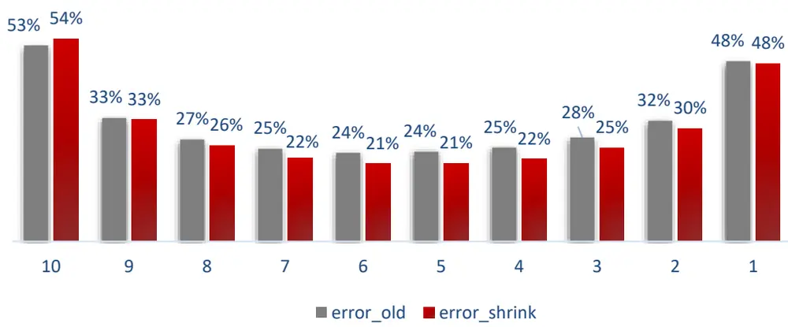
数据来源：Wind资讯 & 东方证券研究所

## 2． SOE

国有企业的市值在A股占主导地位，在目前企业制度下，国有企业最直接受到国家宏观、产业政策影响，对二级市场的平稳运行也起到了至关重要作用。我们在风险因子库中加入了是否国企的虚拟变量，可以部分表示政策风险。是否国有根据实际控制人类型进行判断。实际控制人是中央国家机关、国资委等，则企业所有制即为国企。

## 3． Uncertainty

A 股是一个历史不到三十年的年轻市场，在信息披露完整性、及时性、准确性上和发达国家的成熟市场还有差距。我们通过分析师覆盖数量、公募基金持仓比例和上市时间长短三个指标来度量上市公司的信息不确定性风险。跟踪的分析师数量越多，公募基金持仓比例越高，上市时间越长，上市公司的信息确定性越强。

## 4． Cubic Size

我们实证发现市值和收益的非线性特征十分显著，因此参考统计里的通常做法，加入了市值的幂次项来捕捉非线性关系。

## 2.1.3 风险因子检验结果

对于风险因子原始因子值的处理与 alpha 因子相同，首先对单因子进行正态分布检验，并对个别因子进行正态性转化。而后我们分别进行 boxplot去极值（参考报告《选股因子数据的异常值处理和正态转换》），行业中位数填补缺失值，市值加权标准化三个步骤，而后将单因子等权合成为大类风格因子。

图3：风险因子值数据处理
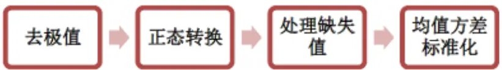
数据来源：东方证券研究所

风险因子的测试时间是从 2008.11.30 到 2018.6.30，测试标的范围是全市场股票（剔除上市不满 3个月及所有 ST、*ST、PT、暂停上市等特别处理股票后的全部 A股）。为保证统一，我们在全市场和成分内的指数增强组合中使用的是同一套风险因子，我们后续也可以针对机构投资者自有的股票池，提供风险因子定制化服务。由于行业因子和市值因子是各个市场普遍接受的风险因子，和市场经验相符，因而我们将其默认纳入风险因子库，重点关注新加入的九个风险因子的增量信息。检验步骤如下：

1.单因子截面回归：在每个月横截面上我们用当月的股票收益对期初的风险因子暴露做WLS回归。风险因子为行业因子，市值因子和新加入的单个风险因子。回归前因子暴露需要重新进行市值加权标准化，样本数据权重为个股总市值的平方根，由此得到风险因子当月的显著性检验 P 值、因子收益率、回归方程 Adjusted Rsquared，再基于历史每月数据计算得到该因子的因子收益率波动率。需要注意的是,Adjusted Rsquared和其它模型文档里的 Rsqured 算法存在差别，因而结果差别会较大。此外，计算前后两期横截面因子数据的相关系数平均值，来衡量风险因子的稳定性。

单因子检验结果如图 4所示，可以看出：(1) 在全市场范围内，9个风格类风险因子中的单因子及合成因子的显著月份比例基本均超过 60%，说明它们对股价都有显著影响；(2) 因子收益率年化波动率基本都在 3%以上；(3) 单因子回归的 AdjustedRsquare均超过16%，若回归方程中仅包含行业和市值因子，Adjusted Rsquare 为 15.9%，可见加入新因子后，模型对股票收益率的解释度均有提升；(4) 前后两期横截面因子数据的相关系数基本均大于 0.85，因子数值比较稳定

2.多因子逐步回归：我们采用前期报告《Alpha 因子库精简与优化》里提供的逐步Fama-Machbeth 回归方法，按照平均 Adjusted Rsquared 的增量大小，对风险因子进行排序，结果如图 5 所示。由于个别强相关性的风险因子，已经两两间进行了正交化处理，因此上面计算过程中，省去了因子正交化步骤。

图4：单因子检验结果

| 因子名称 |  | 因子显著月份占比 因子收益率 |  | 单因子回归 Adjusted Rsquare |  |
| --- | --- | --- | --- | --- | --- |
| Beta |  | (全市场) 76.09% | 年化波动率 7.02% | 17.28% | 相关系数 92.87% |
| Trend | trend_120 | 69.57% | 6.18% | 17.07% | 68.57% |
|  | trend_240 | 76.81% | 6.12% | 17.09% | 81.43% |
|  | Total | 72.46% | 6.23% | 17.11% | 74.90% |
|  | Stdvol | 86.23% | 6.73% | 17.33% | 93.57% |
| Volatility | Ivff |  |  |  |  |
|  |  | 75.36% | 5.27% | 16.91% | 92.32% 83.84% |
|  | Range MaxRet_6 | 84.06% | 6.61% | 17.21% | 88.23% |
|  | MinRet_6 | 78.26% 79.71% | 5.41% 6.85% | 16.91% 17.24% |  |
|  | Total | 82.61% | 5.90% | 17.07% | 89.01% |
|  | TO | 68.84% | 5.67% | 16.93% | 90.48% 97.56% |
| Liquidity | Liquidity beta | 65.22% | 5.17% | 16.46% | 79.43% |
|  | Total | 63.04% |  |  |  |
|  | BP |  | 5.37% | 16.58% | 86.19% |
| Value |  | 72.46% | 6.25% | 16.86% | 97.65% |
|  | EP | 66.67% | 5.16% | 16.58% | 96.50% |
|  | Total | 75.36% | 5.69% | 16.82% | 96.94% |
| Growth | Delta ROE | 45.65% | 2.77% | 16.10% | 90.03% |
|  | Sales_growth | 47.10% | 3.15% | 16.16% | 93.19% |
|  | Na_growth | 54.35% | 3.15% | 16.15% | 88.25% |
|  | Total | 56.52% | 3.83% | 16.26% | 91.84% |
| SOE |  | 63.77% | 9.27% | 16.37% | 99.73% |
| Uncertainty | Instholder Pct | 65.94% | 6.02% | 16.71% | 96.62% |
|  | Cov | 74.64% | 5.51% | 16.83% | 96.52% |
|  | Listdays | 70.29% | 5.56% | 16.73% | 99.99% |
|  | Total | 68.84% | 4.71% | 16.58% | 97.72% |
| Cubic Size |  | 65.22% | 4.24% | 16.36% | 97.32% |

数据来源：Wind资讯 & 东方证券研究所

图 5：多因子逐步回归的平均 Adjusted Rsquare（全市场）
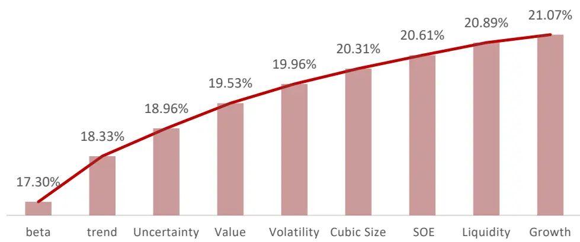
数据来源：Wind资讯 & 东方证券研究所

## 2.2 协方差矩阵估计

## 2.2.1 因子风险模型原理

在因子风险模型中，个股收益可以分为两部分：能够被公共风险因子解释的部分，以及不能被解释的残差收益：

$$
r_{t,i}=\beta_{i,1}^{\ t}f_{t,1}+\beta_{i,2}^{\ t}f_{t,2}+\cdots+\beta_{i,K}^{\ t}f_{t,K}+\varepsilon_{t,i}\quad t=1,\cdots T\quad i=1,\cdots N
$$

其中， $r_{t,i}$ 是第 i 只股票在期间 t 的收益率， $\beta_{i,k}^{\quad t}$ 是期间 t 开始时股票 i 在第 k 个因子上的风险暴露， $f_{t,k}$ 是第 k个因子在期间 t的纯因子收益率， $\mathcal{E}_{t,i}$ 是第 i只股票在期间t 的残差收益率。

假定股票的残差收益率和公共因子收益率不相关，并且每只股票的残差收益率也不相关的情况下，则股票的协方差矩阵 $\sum$ 可以表示为：

$$
\Sigma=BFB^{'}+S
$$

其中 B是N个股票在K个公共风险因子的上的因子暴露矩阵(N×K), F是K个公共因子收益率的协方差矩阵(K×K)，S 是 N个股票的残差收益率方差矩阵 $\mathbf{.}(\mathbf{N}\times\mathbf{N})$ 。从结果出发的话，想要得到未来一个月的股票间协方差矩阵的估计，就需要计算当前最新的个股风险因子暴露，因子协方差阵，个股风险三个变量。其中风险因子暴露可以直接由风险因子的取值计算，月度因子协方差矩阵可以通过过去的因子收益率估计得到，月度个股残差风险通过过去的个股残差收益率估计得到。这就意味着需要回归求解过去日度的因子收益率和残差收益率。股票协方差矩阵估计的具体流程如下图所示，接下来我们依次分别简单介绍因子风险模型的构建细节。

图6：股票协方差矩阵估计的具体流程
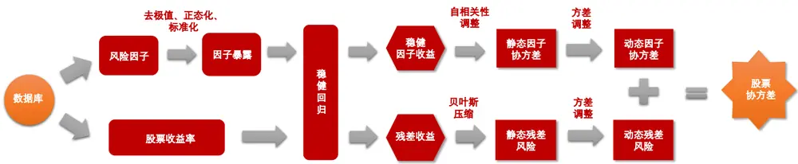
据来源：Wind资讯 & 东方证券研究所

## 2.2.2 因子收益率、残差收益率的计算

对于因子收益率、残差收益率的估计，我们采用的做法是在每天横截面上，用当天的股票收益率对上一天的风险因子暴露（29 个中信一级行业因子和十个风格因子）做加权的稳健回归，由此得到风险因子当天的纯因子收益率，个股当天的残差收益率。其中有几点细节需要特别解释：

（1）每天的因子收益率都是在当天特定的股票池中进行回归估计。经检验，这种做法比直接在全市场估计因子收益率更合理，效果也更好，而且不会额外增大计算量。

（2）风险因子暴露在当日股票池中重新进行市值加权标准化。因为风险因子模型的核心假设是这些因子风险可以通过股票组合的方式分散掉。如果是采用简单平均方式，那么等权组合的风险因子暴露度等于零；如果采取市值加权方法，那么市值加权组合（可以近似看作中证全指或Wind全A 指数）的风险暴露度等于0。在小市值股票数量占比超过一半的A 股，显然后者假设更合理。

（3）采用加权最小二乘的做法，选择市值平方根作为样本点的权重，也是基于我们之前报告中检验的结果：个股的残差风险和其市值平方根倒数近似成比例。这种加权回归可以保证 估计量的一致性，同时给市值大的股票数据赋予了更大的权重，也可以剔除小盘股数据噪音的影响，

（4）使用稳健回归，降低异常值对于回归结果的影响。

（5）市场因子因子收益率的计算。由于行业虚拟变量的使用，加入常数项（市场因子）会产生共线性问题，因此市场因子收益率而是根据行业和国企因子前的回归系数反推，从图 6 可以看出，Market Factor 和市场组合走势基本一致。基于按市值加权计算因子暴露的前提下，Marketfactor可以反映按市值加权的市场组合的收益率。此时行业和国企虚拟变量前的纯因子收益率代表的是剔除掉市场和其它风格因子影响后的收益，可以便于更准确地进行风险分析。

图7：Market Factor累计净值与市场组合累计净值对比
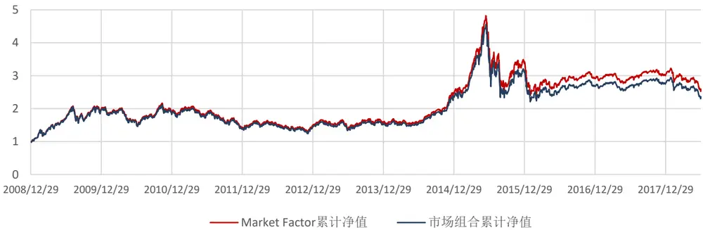
数据来源：Wind资讯 & 东方证券研究所

下面我们在三个常用的股票池（沪深300、中证500和全市场）中分别展示10个风格类风险因子的因子收益率和纯因子收益率日度累计净值情况。历史回溯测试的实证区间设定为2008.12.31 – 2018.06.31，对于沪深 300，选择当天沪深 300 的成分股，对于中证 500，选择当天中证 500 的成分股。对于全市场股票池，我们的做法是选择当天全部 A 股，并剔除上市不满 3个月及所有 ST、*ST、PT、暂停上市等特别处理的股票。此外，每天进行回归时我们剔除了当日停牌和当日涨跌幅超过11%的异常股，以保证收益率数据的准确性。

需要注意的是，此处我们展示的因子收益率和纯因子收益率，均是进行标准 WLS 回归后得到的风险因子回归系数，没有使用稳健回归。这是由于稳健回归会将一些样本数据当异常值处理，每期被认定为异常值的股票可能不一样，回归系数和我们通常理解的因子收益率不一致。稳健回归我们只用在估算协方差矩阵这个统计量时使用，此时稳健回归得到的回归系数的经济含义并不重要。

根据我们之前报告《A 股市场风险分析》中的解释，（1）因子收益率和单因子的横截面回归对应，当自变量为标准化后的 zscore 时，自变量回归系数可以理解为因子收益率。行业和国企虚拟变量不是标准化的 zscore，故图 8 中我们仅展示除国企变量外的 9 个风格类风险因子的因子收益率。（2）纯因子收益率的概念和多因子模型对应，横截面回归时，第k个因子的回归系数即是该因子的纯因子收益率。此处我们已经从行业因子收益率和国企因子收益率中拆解出了市场因子Market factor 收益率，因而行业和国企虚拟变量前的纯因子收益率代表的是剔除掉市场和其它风格因子影响后的收益。

图8：常用的股票池（沪深300、中证500和全市场）中各风险因子的因子收益率日度累计净值
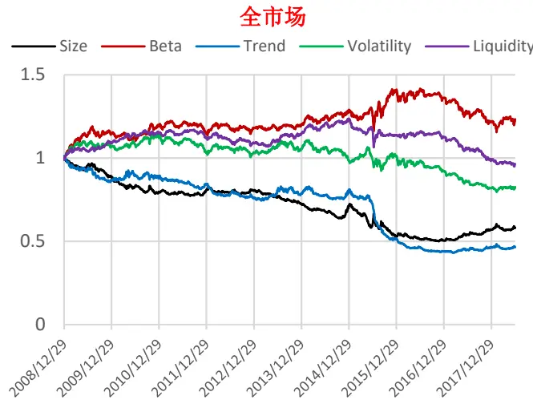

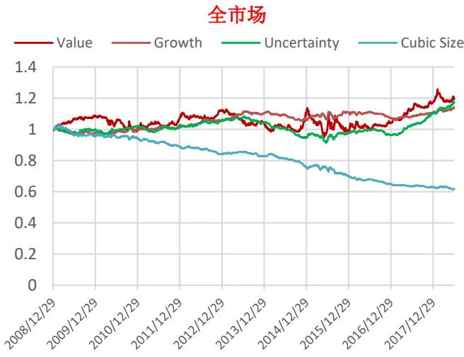

沪深300
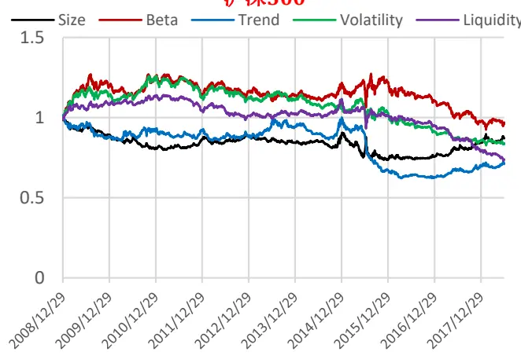

沪深300
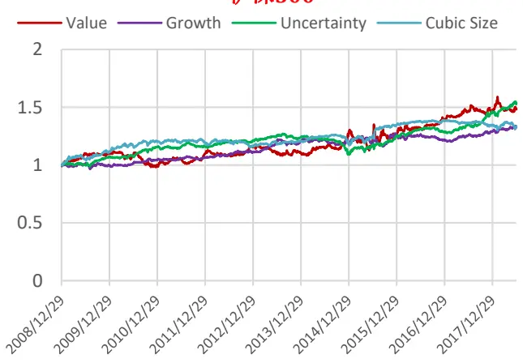

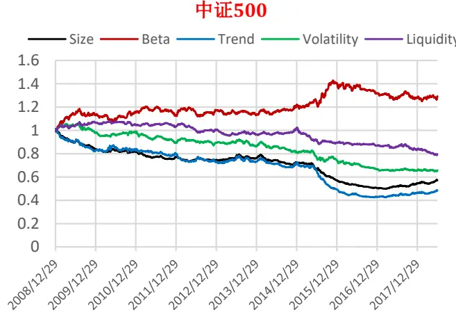
数据来源：Wind资讯 & 东方证券研究所

中证500
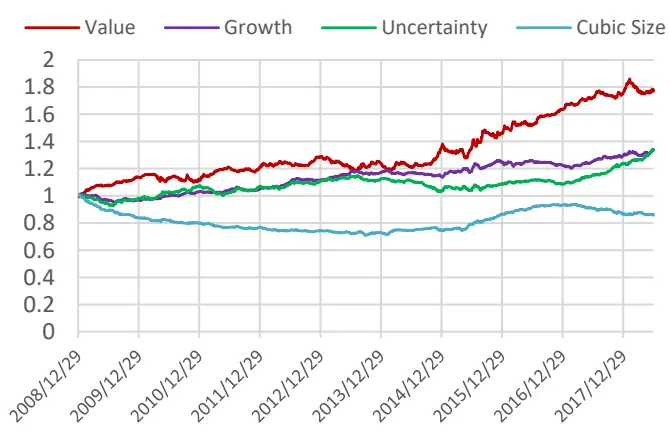

图9：常用的股票池（沪深300、中证500和全市场）中各风险因子的纯因子收益率日度累计净值
全市场
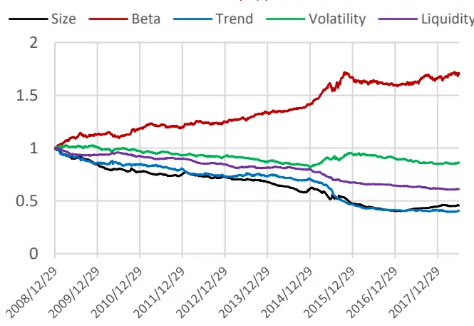

全市场
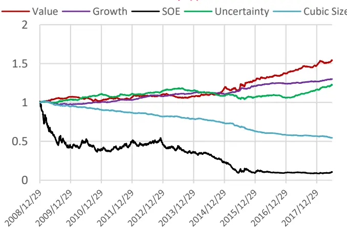

沪深300
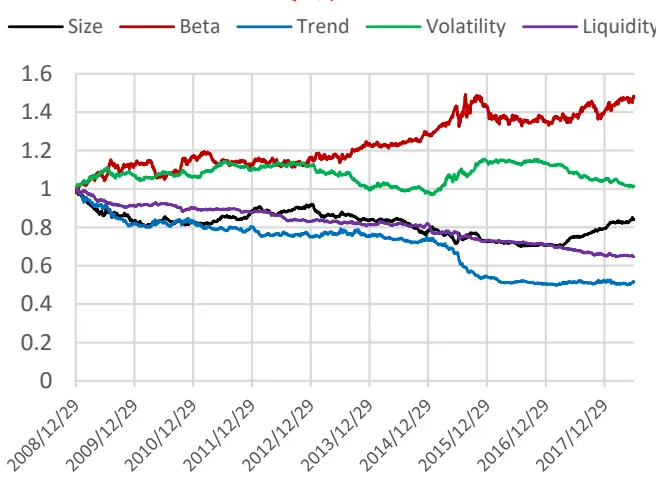

沪深300
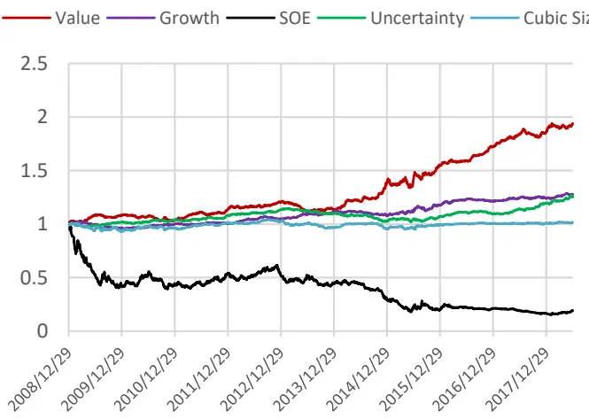

中证500
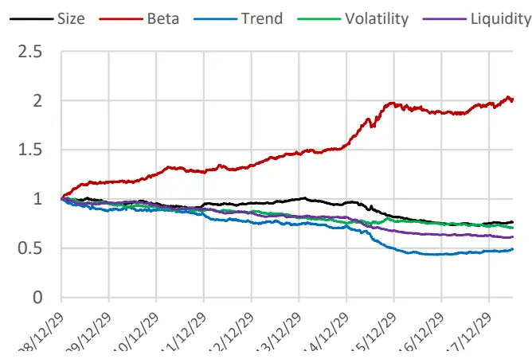
数据来源：Wind资讯 & 东方证券研究所

中证500
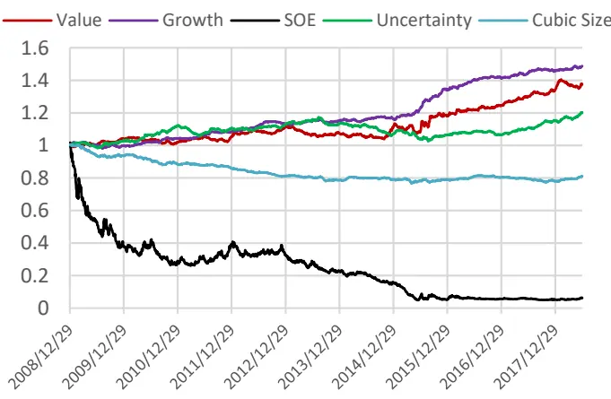

我们分别在全市场、沪深 300成分股、中证 500成分股内测试 DFQ-2018模型的横截面回归 Adjusted Rsquare，其 12 个月滚动值如图 6 所示。DFQ-2018 模型对沪深 300股票的解释度最高，平均能达到 30.2%，其次为中证 500成分股的14.1%，全市场来看，DFQ-2018 模型的平均 adjusted Rsquare 可以达到 17%。

图 10：沪深 300、中证 500 和全市场中 DFQ-2018 模型 12 个月滚动 Adjusted Rsquare
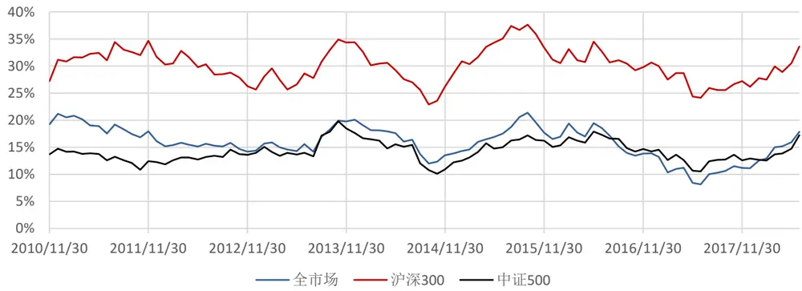
数据来源：Wind资讯 & 东方证券研究所

## 2.2.3因子协方差矩阵、残差风险的计算

在估计因子协方差阵时，我们进行了两步调整：

（1） 自相关性调整：由于全市场因子收益率存在较强的自相关性，样本协方差阵不是真实协方差矩阵的一致性估计（consistent estimation），因而我们参考Newey and West (1987)的方法进行调整。

图11：全市场因子收益率的自相关系数
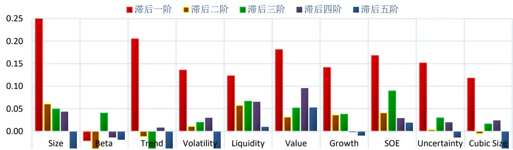
数据来源：Wind资讯 & 东方证券研究所

（2）因子收益率方差调整：实证数据和市场经验告诉我们，市场的波动性随着时间在变动，为了让风险模型能跟得上市场波动的变化。我们用 Garch模型估算条件方差，考察静态方差估计是否低估或高估，然后确定让静态方差估计乘上一个方差调整系数τ，让其跟上市场的动态节奏。

图12. 方差调整系数 τ 随市场行情的变化
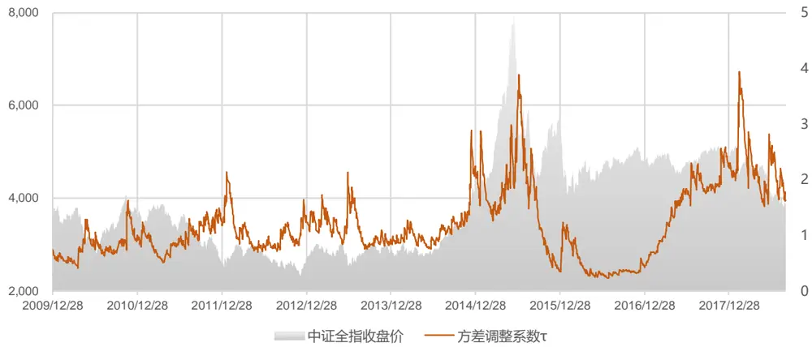
数据来源：Wind资讯 & 东方证券研究所

在估计残差风险时，我们进行了两步调整：

（1）贝叶斯压缩：原理及做法与 beta的处理相同，此处不详细展开。

（2）残差波动率调整：做法参考因子收益的波动率调整。

## 三、风险模型效果

## 3.1 GWVP 组合——理论效果

由于股票收益间的协方差是一个不可观测量，我们无法直接去比较那个方法预测的更“准”，只能比较不同方法的使用效果哪个更好。理论上常用的比较方法是用协方差矩阵估计值和股票真实收益数据构造一个全局最小方差组合（GMVP, Global MinimumVariance Portfolio），看 GMVP 样本外的真实方差哪个更小。

GMVP组合可以通过组合优化的方式定义为：

$$
\begin{aligned}\min_{w}w^{\prime}\cdot\sum\cdot w^{\prime}\\s.t.\sum_{t=1}^{N}w_{_t}=1\end{aligned}
$$

这个二次规划问题有显式解 w∗=Σ−1⋅e/(e′⋅Σ−1⋅e)，e 为常数 1向量。这个组合与股票预期收益率无关，完全由股票间的协方差决定。

基于此框架，我们在常用股票池（全市场、沪深 300 和中证 500）中分别使用压缩估计量方法和 DFQ-2018 模型，构造 GMVP 组合，月初调仓，持仓一个月到下个月初，滚动操作，比较不同估计方法得到的 GMVP 组合的年化波动率相对大小。但仅关注波动率的相对大小并不稳健，还需要对两个 GMVP收益率序列是否方差相等进行进一步的统计检验，具体方法我们采用的的是 Fligner-Killeen 检验，和传统的 F 检验相比，它不依赖于收益率正态分布假设，对尖峰厚尾、有异常值的数据比较稳健，历史回溯测试的实证区间设定为 2010.12.31 – 2018.06.31，可以看出，因子风险模型得出的 GWVP组合年化波动率均显著低于纯统计模型，且差额在统计上显著（1%置信度），说明我们构建的DFQ-2018 风险模型在理论上具备明显优势，可以对股票协方差阵做出更为准确的估计。

图13：不同估计方法得到的月频GMVP 年化波动率

| 月频GMVP年化波动率 | 纯统计模型 | DFQ-2018 模型 |
| --- | --- | --- |
| 沪深300 | 16.45% | 15.96%(***) |
| 中证500 | 23.45% | 21.94%(***) |
| 全市场 | 19.80% | 17.33%(***) |

数据来源：Wind资讯 & 东方证券研究所

## 3.2 指数增强组合——实践效果

GMVP 组合的方差小，只能说明理论上因子风险模型对于股票协方差阵的估计更准确，实践中应用到实际组合优化里是否也能提升组合表现呢？下面我们分别构建沪深 300增强（全市场、成分内）、中证 500 增强（全市场、成分内）组合，比较不同风险模型（压缩估计量方法和 DFQ-2018 模型）下的策略表现。历史回溯测试的实证区间设定为2010.12.31 – 2018.06.31，除风险模型不同外，其余处理均保持一致。

组合优化问题设置如下：

$$
\begin{aligned}\max:&\mathbf{f}^{\prime}\mathbf{w}-\lambda\mathbf{w}^{\prime}\Sigma\mathbf{w}\\st:&\quad\mathbf{w}^{\prime}\mathbf{I}=0\\&\quad\mathbf{w}^{\prime}\mathrm{Indus}=\mathbf{0}\\&\quad\mathbf{w}^{\prime}\mathrm{MV}=0\\&\quad\mathbf{wmin}<\mathbf{w}<w\max\mathbf{I}\end{aligned}
$$

其中 w为主动权重，f为预期收益率向量，λ为经验的风险厌恶系数，Σ为估计的月度协方差矩阵。个股权重上限分段设置，控制行业和市值完全中性。

需要特别注意的是，如果采用上述组合优化形式，将跟踪误差惩罚项 w′Σw 放置在目标函数中，需要人为设置风险厌恶系数，使用不同风险模型，最优风险厌恶系数可能不一样，在使用时需要进行参数调试。下面我们分别给出风险厌恶系数等于 5、10、15、20的组合对比结果。两种方法各自选出了相对最适的风险厌恶系数，突出展示。

图14：不同风险模型的效果对比

| 沪深300成分内 | 组合表现 | λ=5 | λ=10 | λ=15 | λ=20 |
| --- | --- | --- | --- | --- | --- |
| 纯统计 | IR | 2.45 | 2.51 | 2.54 | 2.59 |
|  | 年化收益 | 8.87% | 8.80% | 8.71% | 8.64% |
|  | 最大回撤 | -2.54% | -2.82% | -2.64% | -2.58% |
|  | 跟踪误差 | 3.50% | 3.39% | 3.31% | 3.23% |
| DFQ-2018 | IR | 2.44 | 2.45 | 2.45 | 2.47 |
|  | 年化收益 | 8.88% | 8.82% | 8.66% | 8.49% |
|  | 最大回撤 | -2.58% | -2.68% | -2.78% | -2.99% |
|  | 跟踪误差 | 3.52% | 3.48% | 3.41% | 3.33% |

| 中证500成分内 | 组合表现 | λ=5 | λ=10 | λ=15 | λ=20 |
| --- | --- | --- | --- | --- | --- |
| 纯统计 | IR | 2.69 | 2.72 | 2.72 | 2.73 |
|  | 年化收益 | 12.28% | 11.88% | 11.55% | 11.23% |
|  | 最大回撤 | -5.45% | -4.86% | -4.51% | -4.32% |
|  | 跟踪误差 | 4.34% | 4.16% | 4.05% | 3.93% |
| DFQ-2018 | IR | 2.65 | 2.67 | 2.68 | 2.69 |
|  | 年化收益 | 12.17% | 11.88% | 11.60% | 11.34% |
|  | 最大回撤 | -5.36% | -4.84% | -4.64% | -4.42% |
|  | 跟踪误差 | 4.37% | 4.24% | 4.13% | 4.03% |

| 沪深300全市场 | 组合表现 | λ=5 | λ=10 | λ=15 | λ=20 |
| --- | --- | --- | --- | --- | --- |
| 纯统计 | IR | 3.05 | 3.14 | 3.17 | 3.16 |
|  | 年化收益 | 11.03% | 10.79% | 10.48% | 10.22% |
|  | 最大回撤 | -4.86% | -4.00% | -3.77% | -3.75% |
|  | 跟踪误差 | 3.46% | 3.28% | 3.17% | 3.10% |
| DFQ-2018 | IR | 2.99 | 3.11 | 3.17 | 3.25 |
|  | 年化收益 | 11.07% | 11.13% | 10.96% | 10.92% |
|  | 最大回撤 | -5.77% | -5.23% | -4.62% | -3.82% |
|  | 跟踪误差 | 3.53% | 3.42% | 3.30% | 3.21% |

数据来源：Wind资讯 & 东方证券研究所

| 中证500全市场 | 组合表现 | λ=5 | λ=10 | λ=15 | λ=20 |
| --- | --- | --- | --- | --- | --- |
| 纯统计 | IR | 3.10 | 3.13 | 3.12 | 3.13 |
|  | 年化收益 | 16.48% | 15.63% | 15.05% | 14.70% |
|  | 最大回撤 | -4.18% | -3.79% | -3.65% | -3.60% |
|  | 跟踪误差 | 4.97% | 4.68% | 4.53% | 4.41% |
| DFQ-2018 | IR | 3.09 | 3.16 | 3.14 | 3.17 |
|  | 年化收益 | 16.60% | 16.24% | 15.72% | 15.49% |
|  | 最大回撤 | -4.50% | -3.63% | -3.91% | -3.96% |
|  | 跟踪误差 | 5.02% | 4.81% | 4.68% | 4.58% |

从对比结果可以看出，我们开发的 DFQ-2018 因子风险模型，相比之前报告中介绍的纯统计模型仍有优势，尤其在全市场指数增强组合中优势较为明显，可以同时实现组合收益的提升和最大回撤的降低。

## 四、风险模型研究服务

⚫ 定期提供风险因子收益率、因子暴露、协方差矩阵估计数据

我们可以定期提供东方 A股因子风险模型（DFQ-2018）每期输出的风险因子收益率、因子暴露、协方差矩阵估计数据，以便投资者做组合优化或其它研究工作的需要。

⚫ 针对客户自有的股票池，提供风险模型定制化服务

为保证统一，我们在全市场和成分内的指数增强组合中使用的是同一套风险因子，但因子收益率是在不同股票池估算。如果投资者需要，我们可以针对其自有的股票池重新筛选风险因子、提供因子收益率、因子暴露、协方差矩阵等相关数据。

⚫ 提供组合绩效归因分析工具

分析工具可以基于 Excel 宏或 python 封装。

## 风险提示

1. 量化模型基于历史数据分析，未来存在失效风险，建议投资者紧密跟踪模型表现。

2. 极端市场环境可能对模型效果造成剧烈冲击，导致收益亏损。

## Table_Disclaimer 分析师申明

每位负责撰写本研究报告全部或部分内容的研究分析师在此作以下声明：

分析师在本报告中对所提及的证券或发行人发表的任何建议和观点均准确地反映了其个人对该证券或发行人的看法和判断；分析师薪酬的任何组成部分无论是在过去、现在及将来，均与其在本研究报告中所表述的具体建议或观点无任何直接或间接的关系。

## 投资评级和相关定义

报告发布日后的12个月内的公司的涨跌幅相对同期的上证指数/深证成指的涨跌幅为基准；

## 公司投资评级的量化标准

买入：相对强于市场基准指数收益率15%以上；

增持：相对强于市场基准指数收益率5%～15%；

中性：相对于市场基准指数收益率在-5%～+5%之间波动；

减持：相对弱于市场基准指数收益率在-5%以下。

未评级——由于在报告发出之时该股票不在本公司研究覆盖范围内，分析师基于当时对该股票的研究状况，未给予投资评级相关信息。

暂停评级——根据监管制度及本公司相关规定，研究报告发布之时该投资对象可能与本公司存在潜在的利益冲突情形；亦或是研究报告发布当时该股票的价值和价格分析存在重大不确定性，缺乏足够的研究依据支持分析师给出明确投资评级；分析师在上述情况下暂停对该股票给予投资评级等信息，投资者需要注意在此报告发布之前曾给予该股票的投资评级、盈利预测及目标价格等信息不再有效。

## 行业投资评级的量化标准：

看好：相对强于市场基准指数收益率5%以上；

中性：相对于市场基准指数收益率在-5%～+5%之间波动；

看淡：相对于市场基准指数收益率在-5%以下。

未评级：由于在报告发出之时该行业不在本公司研究覆盖范围内，分析师基于当时对该行业的研究状况，未给予投资评级等相关信息。

暂停评级：由于研究报告发布当时该行业的投资价值分析存在重大不确定性，缺乏足够的研究依据支持分析师给出明确行业投资评级；分析师在上述情况下暂停对该行业给予投资评级信息，投资者需要注意在此报告发布之前曾给予该行业的投资评级信息不再有效。

## HeadertTable_Disclaimer 免责声明

本证券研究报告（以下简称“本报告”）由东方证券股份有限公司（以下简称“本公司”）制作及发布。

本报告仅供本公司的客户使用。本公司不会因接收人收到本报告而视其为本公司的当然客户。本报告的全体接收人应当采取必要措施防止本报告被转发给他人。

本报告是基于本公司认为可靠的且目前已公开的信息撰写，本公司力求但不保证该信息的准确性和完整性，客户也不应该认为该信息是准确和完整的。同时，本公司不保证文中观点或陈述不会发生任何变更，在不同时期，本公司可发出与本报告所载资料、意见及推测不一致的证券研究报告。本公司会适时更新我们的研究，但可能会因某些规定而无法做到。除了一些定期出版的证券研究报告之外，绝大多数证券研究报告是在分析师认为适当的时候不定期地发布。

在任何情况下，本报告中的信息或所表述的意见并不构成对任何人的投资建议，也没有考虑到个别客户特殊的投资目标、财务状况或需求。客户应考虑本报告中的任何意见或建议是否符合其特定状况，若有必要应寻求专家意见。本报告所载的资料、工具、意见及推测只提供给客户作参考之用，并非作为或被视为出售或购买证券或其他投资标的的邀请或向人作出邀请。

本报告中提及的投资价格和价值以及这些投资带来的收入可能会波动。过去的表现并不代表未来的表现，未来的回报也无法保证，投资者可能会损失本金。外汇汇率波动有可能对某些投资的价值或价格或来自这一投资的收入产生不良影响。那些涉及期货、期权及其它衍生工具的交易，因其包括重大的市场风险，因此并不适合所有投资者。

在任何情况下，本公司不对任何人因使用本报告中的任何内容所引致的任何损失负任何责任，投资者自主作出投资决策并自行承担投资风险，任何形式的分享证券投资收益或者分担证券投资损失的书面或口头承诺均为无效。

本报告主要以电子版形式分发，间或也会辅以印刷品形式分发，所有报告版权均归本公司所有。未经本公司事先书面协议授权，任何机构或个人不得以任何形式复制、转发或公开传播本报告的全部或部分内容。不得将报告内容作为诉讼、仲裁、传媒所引用之证明或依据，不得用于营利或用于未经允许的其它用途。

经本公司事先书面协议授权刊载或转发的，被授权机构承担相关刊载或者转发责任。不得对本报告进行任何有悖原意的引用、删节和修改。

提示客户及公众投资者慎重使用未经授权刊载或者转发的本公司证券研究报告，慎重使用公众媒体刊载的证券研究报告。

## 东方证券研究所

地址：上海市中山南路 318号东方国际金融广场 26楼

联系人： 王骏飞

电话： 021-63325888*1131

传真：021-63326786

网址： www.dfzq.com.cn

Email： wangjunfei@orientsec.com.cn