| 东方 A 股因子风险模型(DFQ-2018) | 2018-09-02 |
| --- | --- |
| 盈利预测与市价隐含预期收益 | 2018-09-01 |
| 上市公司业绩预告信息研究 | 2018-08-03 |
| 公司研发费用因子探究 | 2018-06-09 |
| 因子择时 | 2018-06-02 |
| 业绩超预期类因子 | 2018-05-18 |

## ——《因子选股系列研究之四十五》

## Table_Sum ary 研究结论

- 尾部相关系数是指二维分布中尾部数据的相关系数。反映了两个资产在极端情况下同涨或同跌的可能性。尾部相关系数分为两种，上尾相关系数和下尾相关系数。

我们基于 copula 方法来度量股票和市场之间的上下尾部相关系数，从结果看，上下尾部相关系数原始值和行业市值中性化后因子值在中证全指范围内均有着很强的选股效果，从 2006.1-2018.9行业市值中性化后的 rankIC分别为 0.056 和 0.043，ICIR 分别为 2.51 和 1.88，但是从因子间相关性角度出发，发现这两个因子和特异度高度相关，剔除完特异度后并没有选股效果。

我们进一步结合上下尾相关系数构建上尾异常相关系数因子，经过测试我们发现在中证全指、中证 500和沪深 300内因子原始值和行业市值中性化后的因子值均有选股效果，行业市值中性化后因子在中证全指范围内的 rankIC为0.039，ICIR 为 2.76，在中证 500 内因子的 rankIC 为 0.032，ICIR 为 1.77，在沪深 300 内因子的 rankIC 为 0.033，ICIR 为 1.76，

我们进一步在3个样本空间中测试了上尾异常相关系数和其他因子的rankIC相关性(原始值和风格中性后)，我们发现该因子和其他因子的 rankIC相关系数都较低，因子原始值和其他因子的 rankIC相关系数绝对值仅有少数略微大于 40%，而中性化后因子和其他因子的 rankIC 相关系数绝对值均在 40%以下，且绝大多数都小于 30%，说明该因子确实存在有一定的独立信息。

## 风险提示

- 极端市场环境可能对模型效果造成剧烈冲击，导致收益亏损。

- 量化模型基于历史数据分析得到，未来存在失效风险，建议投资者紧密跟踪模型表现。

上尾异常相关系数在中证全指内表现（行业市值中性化后）
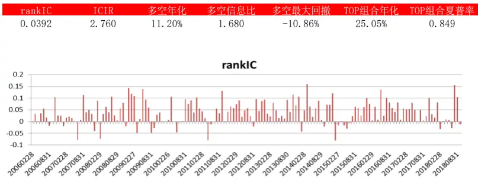

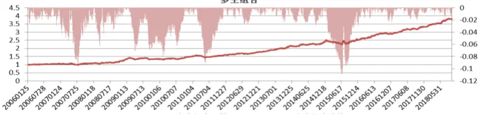

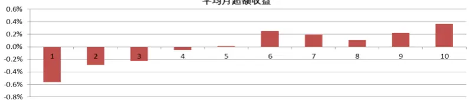

Table_ReportDate 报告发布日期2018 年 10 月 23 日

Table_Autho 证券分析师朱剑涛

021-63325888*6077

zhujiantao@orientsec.com.cn

执业证书编号：S0860515060001

Table_Contacter 联系人 张惠澍 021-63325888-6123 zhanghuishu@orientsec.com.cn

## Table_Report 相关报告

## 1. 尾部相关性研究综述

## 1.1 研究背景

随着金融市场的发展，人们越来越认识到极端事件对金融市场的影响巨大，而在极端的负面事件发生后，市场之间往往呈现出异常的同跌现象，而这种现象是常规的相关系数度量方法所无法捕捉到的，因此如何度量资产组合的尾部风险得到了越来越多的重视。

VaR（在险价值）方法是应用最广泛的尾部风险度量方法， VaR 方法能够直观的反映出资产组合面临的风险状况，在风险管理中有着非常重要的地位。它反映了在市场正常波动下，在一定概率水平（置信度）情况下，某一金融资产组合价值在未来特定时期内的最大可能损失。VaR 方法确实是一种非常有效的风险度量方法，但是 VaR 在实际的应用中也存在着一定的不足。首先，在计算资产组合的 VaR 时，通常用多元高斯分布作为资产收益率的分布，在这个假设下，资产组合中各个资产的收益率的边缘分布也需要满足正态分布，但是在实证当中，金融资产收益率往往具有尖峰厚尾的特征，而用多元高斯分布在正常波动的市场情况下确实能比较好的估计出资产的组合的风险，但是一旦遇到极端的市场环境，就会大幅低估资产组合的下行风险。其次，在描述资产组合内部的相关性结构时，通常会用线性相关系数来进行刻画，但是线性相关系数无法表述不同资产间的非线性关系，而且基于整体分布来计算的线性相关系数显然不能捕捉极端情况下的尾部相关性，这就会导致我们对于尾部风险的估计出现问题。举例来说，如果按照常规的相关性量度和高斯整体分布假设来估计全球市场同时发生大幅下跌的概率，那么这个概率并不算高，但是事实是在最近的几十年间，这样的全球性或区域性金融危机就发生很多次，发生的频率远大于估计出的概率。

关于尾部相关性的度量，主要有以下几种，一种是条件相关性，Ang 等人（2002）研究了不同市场之间下跌的条件相关性，发现这种下跌相关性和常规的整体相关性不同，且在市场发生剧烈变动时的相关性要大于波动较小时的相关性，这些特性能更好的用来解释组合的期望收益。但是条件相关性的计算依然需要假设序列间的分布情况，不同的分布会带来不同的结果，所以如果分布选择不当的话可能会带来较大的误差。

另一种方法是运用极值理论的多变量分布，根据尾部的数据去拟合分布的参数然后估计出尾部的相关性，Longin（2000）通过极值理论里的多变量分布研究了 5 个不同市场间的上下尾部相关性，研究发现熊市的时候市场间的相关性增加，但是牛市的时候相关性并没有明显提高。这类方法用的最多的多变量分布是广义帕累托分布，这个分布可以比较好的描述不同资产间的尾部分布，但是这个方法要估计的参数较多，而选择多少的数据去估计尾部相关系数也需要通过优化来找到最优的参数，如果用来衡量少数资产长期的相关性情况，那么这个方法还是比较好的，但是如果是用来构建选股因子，一则计算量太大，其次要优化的参数过多，并不是很适合。

最后一种方法是现在在学界运用最广泛的方法，即通过 copula 函数去描述不同资产的联合分布，然后根据 copula函数的形式和参数来度量随机变量间的尾部相关性，copula是边缘分布函数和联合分布函数的连接函数。本文也将采用这个方法去研究股票的尾部相关系，我们会在后文详细地描述 coplua 方法。

## 1.2 Copula 函数

## 1.2.1 Copula 研究概况

Coplua方法在金融领域的应用经历了比较漫长的过程，1959年 Sklar就证明了所有有限维的边际分布都可以通过 copula 函数联系在一起，奠定了 copula 的基础。Embrechts 等人(1999)首先把copula 作为相关性度量的工具并引入到了金融领域。Matteis 等（2001）对阿基米德族 copula 函数在建模中的应用进行了详细的描述，并据此对丹麦火灾险损失进行了估计。Romano 等(2001)将 copula 方法引入到金融资产的风险分析中，并运用多元 copula方法结合蒙特卡洛模拟对投资组合的 Var 进行了测算。Malevergne 等（2001）通过实证验证了在多数情况下，高斯 copula 作为连接函数是比较适合的。这些研究主要是针对 copula 函数的适用性和本身函数族的研究，并采用金融数据进行验证，但不足之处都是在固定的时间段和模式前提下进行的验证，没有考虑到市场长期的变化特征。Patton 等(2001)研究了不同国家汇率直接的相关性，研究发现欧元体系推出后汇率间相关性发现了显著的变化，作者也据此引入了时变 copula 函数，来对发生了时变的序列进行更好的描述。在这些研究的基础上，最近 10 年来 copula 的研究主要集中在多元、动态和更复杂函数族形式上。

## 1.2.2 Copula 函数定义

Sklar定理：令F是具有n维边缘分布 $F_{1}(x_{1}),F_{2}(x_{2}),\ldots,F_{n}(x_{n})$ 的联合分布函数，那么存在一个copula函数 C 使得：

$$
F(x_{1},x_{2},\ldots,x_{n})=\mathbb{C}(F_{1}(x_{1}),F_{2}(x_{2}),\ldots,F_{n}(x_{n})),
$$

如果 $_{:}F_{1}(x_{1}),F_{2}(x_{2}),\ldots,F_{n}(x_{n})$ 连续，那么 copula 函数是唯一确定的，根据 Sklar 定理，存在反函数，可以得到以下推论：

$$
C(u_{1},u_{2},\ldots,u_{n})=F(F_{1}^{-1}(u_{1})F_{2}^{-1}(u_{2}),\ldots,F_{n}^{-1}(u_{n}))
$$

根据上式，如果有 n维随机变量的边缘分布和 copula函数，将能够获取这 n维随机变量的联合分布函数。

## 1.2.3 Copula 函数族

常用的 copula函数族根据分类不同有很多类型，按照分布类型可以分为椭圆族 copula和阿基米德族 copula 等类型，根据参数个数可以分为 BB1copula、BB2copula 等类型。这里主要介绍最常用的两种函数族即椭圆族 copula 和阿基米德族 copula。

椭圆族 copula 函数中最常用的是 Nomal copula 和 t-Student copula，这两种 copula 在金融领域的应用非常广泛。

1. Normal copula 也叫高斯 copula，也就是多元正态分布的相依函数。令随机变量服从多元正态分布假设，当且仅当其边缘分布均为正态分布，则存在唯一 copula 函数使得：

$$
\mathbb{C}_{R}^{N}(u_{1},u_{2},\ldots,u_{n})=\Phi_{R}(\phi_{1}^{-1}(u_{1})\phi_{2}^{-1}(u_{2}),\ldots,\phi_{n}^{-1}(x_{n})),
$$

其中 $\Phi_{R}$ 是多元正态分布的分布函数，R 为相关系数矩阵，φ为一元标准正态分布。

2. t-Student copula 是多元 t-Student 分布的 copula 函数，假设随机变量服从多元 t-Student 分布，自由度为ν，均值向量为μ，则存在唯一 copula函数使得：

$$
\mathbb{C}_{\mathsf{v}}^{t}(u_{1},u_{2},\ldots,u_{n})=t_{\mathsf{v}}^{n}(t_{\mathsf{v}}^{-1}(u_{1})t_{\mathsf{v}}^{-1}(u_{2}),\ldots,t_{\mathsf{v}}^{-1}(x_{n})),
$$

其中tνn是 n 维 t-Student 分布， $t_{v}$ 为一维 t-Student 分布。

阿基米德族 copula函数在实际应用中主要有以下 3个形式：

1. Gumbel copula，其表达形式为：

$$
C(u_{1},u_{2},\ldots,u_{n})=\exp{\left\{-{\left[(-\ln u_{1})^{\theta}+\cdots+(-\ln u_{n})^{\theta}\right]}^{1/\theta}\right\}},
$$

其中 $\scriptstyle\theta\in[0,+\infty)$ ，Gumbel copula 是一个有偏的函数，能较好的拟合上尾的数据，所以在应用中通常用来刻画上尾风险

2. Clayton copula，其表达形式为：

$$
C(u_{1},u_{2},\ldots,u_{n})=\operatorname*{max}\big\{\big[{u_{1}}^{-\theta}+\cdots+{u_{n}}^{-\theta}\big]^{-1/\theta},0\big\},
$$

其中 $\theta\epsilon[-1{,}0)\cup(0,+\infty)$ ，Clayton copula 也是一个有偏的函数，能较好的拟合下尾的数据，所以在应用中通常用来刻画下尾风险

3. Frank copula，其表达形式为：

$$
C(u_{1},u_{2},\ldots,u_{n})=-{\textstyle\frac{1}{\theta}}\ln\quad\{1+{\frac{\left(e^{-\theta u_{1}}-1\right)\ldots\left(e^{-\theta u_{n}}-1\right)}{\left(e^{-\theta}-1\right)}}\}\quad,
$$

其中 $\theta\epsilon(-\infty,0)\cup(0,+\infty)$ ，Frank copula 是一个对称的函数，所以在应用中通常用来刻画对称的尾部风险

## 1.2.4 尾部相关系数

尾部相关系数是指二维分布中尾部数据的相关系数。尾部相关系数是一个广泛应用于极值理论的测度，尾部相关系数分为两种，上尾相关性和下尾相关性。令两个连续的随机变量 X、Y具有边缘分布F $\mathbf{\nabla_{1}}(X)$ 和F $_2(X)$ ，以及 copula 函数 $C(u_{1},u_{2})$ ，那么上尾相关系数为：

$$
\lambda_{U}=\operatorname*{lim}_{u\to1}P(Y>F_{1}^{-1}(u)|X>F_{2}^{-1}(u))=\operatorname*{lim}_{u\to1}{\frac{C(1-u,1-u)}{1-u}}=\operatorname*{lim}_{u\to1^{-}}{\frac{1-2u+C(u,u)}{1-u}},
$$

下尾相关系数为：

$$
\lambda_{L}=\underset{u\rightarrow0}{\operatorname*{lim}}P(Y>F_{1}^{-1}(u)|X>F_{2}^{-1}(u))=\underset{u\rightarrow0}{\operatorname*{lim}}\frac{C(u,u)}{u}.
$$

在下文中我们将用 Gumbel copula 和 Clayton copula 分别度量股票和市场间的上下尾相关性，把上文的copula函数形式带到相关系数计算公式可以得到，Gumbel copula估计的上尾相关系数为：

$$
\lambda_{U}=2-2^{1/\theta},
$$

Clayton copula 估计的下尾相关系数为：

$$
\lambda_{L}=2^{-1/\theta},
$$

其中θ为 copula函数的参数。可以看到相比于其他的方法，用 copula 函数估计尾部相关系数仅需要估计一个参数，这个大大降低了过拟合的可能和计算的复杂度。

## 2.上尾和下尾相关性

## 2.1 因子构建和基本统计

Chabi-Yo等人（2015）研究发现下尾的相关系数对股票未来的期望收益率有着一定的预测作用，下尾相关系数越大的股票未来的期望收益越高，他认为这是因为和市场有更高下尾相关系数的股票需要更大的风险补偿。在这篇报告中，我们将首先构建上下尾相关系数因子并进行测试，因子的测试区间为 2006.1-2018.9。我们在每个月月末用中证全指过去 3个月的日度收益率和股票过去 3个月的日度收益率（剔除了正常交易天数少于一半的样本）来分布估计 Gumbel copula和 Claytoncopula 的参数，并据此分别计算股票和市场的短期上下尾相关系数。

我们首先检验了不同样本空间里的平均上下尾相关系数在时间序列上的大小（图 1），可以看到其实上下尾相关系数的变动非常同步，且下尾相关系数几乎一直大于上尾相关系数，这点与常规的实证结果是一致的，从变动上可以看到，市场在大幅上涨的区间尾部相关系数都比较低，但是大幅下跌的区间，尾部相关系数则较高，也就是说在牛市的行情里，股票跟随市场极端上涨的相关系数比熊市行情里股票跟随市场极端下跌的相关系数低，这点与我们通常的认知也是相符的。

图 1：不同时间平均上下尾相关系数和市场关系
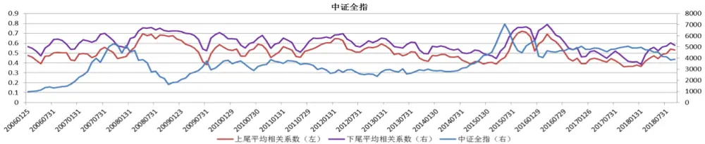

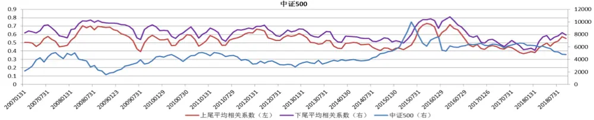

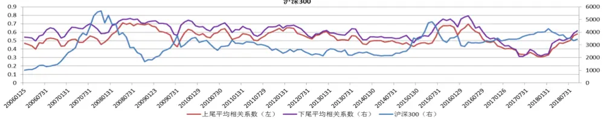
数据来源：东方证券研究所 Winc 资讯

此外，我们也统计了不同行业的平均上下尾相关系数（图 2），从结果来看，上尾相关系数都集中在 50%附近，其中上尾相关系数最大的是非银行业为 57.2%，说明在整个市场极端上涨的时候，非银行业也同步极端上涨的可能性是所有行业中最高的，下尾相关系数都集中在 60%附近，最低的是银行为 53%，也就是说市场极端下跌时，银行也同步极端下跌的可能性是所有行业中最低的。

图 2：中信一级行业尾部相关系数

| 中信行业 | 平均上尾相关系数 平均下尾相关系数 中信行业 |  |  | 平均上尾相关系数 平均下尾相关系数 |  |
| --- | --- | --- | --- | --- | --- |
| 中信石油石化 | 49.86% | 58.52% | 中信餐饮旅游 | 50.21% | 58.77% |
| 中信煤炭 | 56.25% | 64.16% | 中信家电 | 51.03% | 59.85% |
| 中信有色金属 | 52.40% | 60.97% | 中信纺织服装 | 50.70% | 59.99% |
| 中信电力及公用事业 | 52.69% | 61.81% | 中信医药 | 48.20% | 56.34% |
| 中信钢铁 | 53.14% | 62.41% | 中信食品饮料 | 48.06% | 55.96% |
| 中信基础化工 | 51.22% | 60.40% | 中信农林牧渔 | 48.60% | 57.58% |
| 中信建筑 | 52.58% | 61.75% | 中信银行 | 49.81% | 53.81% |
| 中信建材 | 50.86% | 60.17% | 中信非银行金融 | 57.23% | 62.97% |
| 中信轻工制造 | 51.12% | 60.51% | 中信房地产 | 50.72% | 59.67% |
| 中信机械 | 51.61% | 60.76% | 中信交通运输 | 54.67% | 63.80% |
| 中信电力设备 | 50.88% | 59.87% | 中信电子元器件 | 50.74% | 59.97% |
| 中信国防军工 | 49.52% | 58.87% | 中信通信 | 50.23% | 59.08% |
| 中信汽车 | 51.91% | 61.05% | 中信计算机 | 50.55% | 58.84% |
| 中信商贸零售 | 51.40% | 60.52% | 中信传媒 | 50.03% | 58.78% |

数据来源：东方证券研究所 Winc 资讯

## 2.2 因子测试和相关性分析

图 3 和图 4 展示了上尾相关系数和下尾相关系数在中证全指范围内原始值的表现，从结果可以看到这两个选股因子均有非常显著的选股效果，图 5 和图 6 展示了行业市值中性化后的测试结果，可以看到风格中性化之后，两个因子都选股效果进一步提升。综合来看，上尾的相关系数表现更好一些。两个因子的多空组合都非常的稳健，长期看回撤较小，从分组单调性来看，这两个因子和常规的技术类因子一样，空头端的负超额收益较强。

图 3：上尾相关系数因子中证全指内测试结果
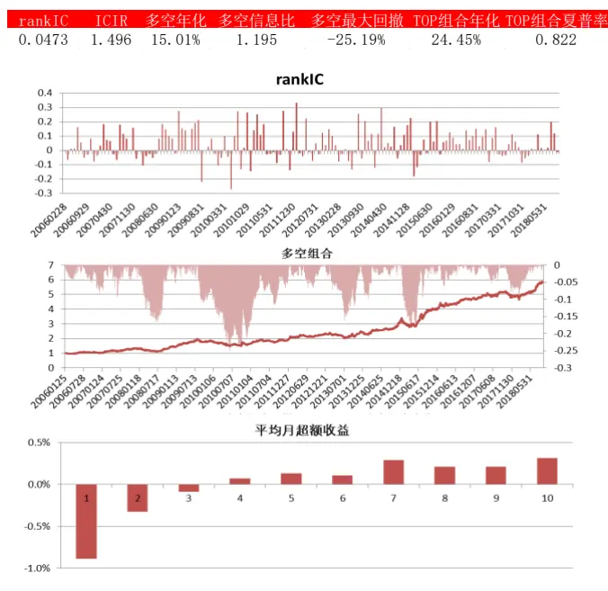
数据来源：东方证券研究所 Winc 资讯

图 4：下尾相关系数因子中证全指内测试结果
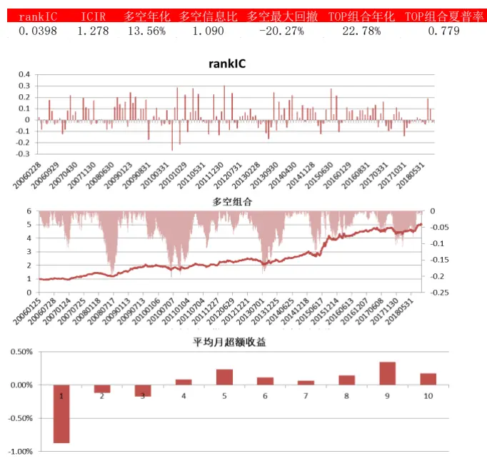
数据来源：东方证券研究所 Winc 资讯

图 5：行业市值中性化后上尾相关系数因子中证全指测试结果
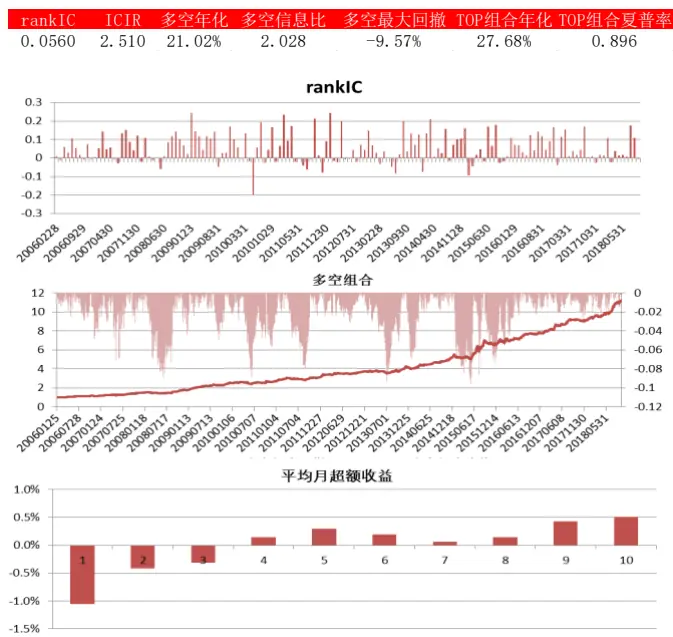
数据来源：东方证券研究所 Winc 资讯

图 6：行业市值中性化后下尾相关系数因子中证全指测试结果
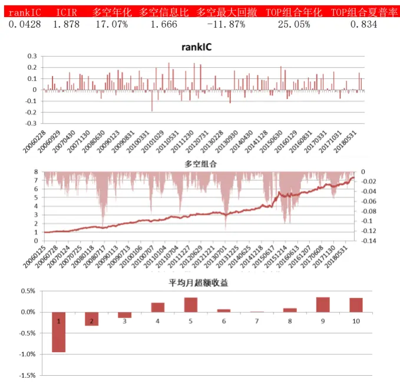
数据来源：东方证券研究所 Winc 资讯

单从因子效果来看，这两个因子在中证全指中都有着非常强的选股效果，但是因为因子是直接根据价格数据来构建的，因此很可能和其他技术类因子有信息重叠，所以这里我们分别测试了上下尾相关系数原始值和行业市值中性化后的因子值其他常规因子的 rankIC 相关性（其中数据较短的分析师因子从 2006.12 开始测试），测试的时候因子原始值和风格中性因子值分别和其他因子原始和风格中性因子值对应（图 7）。

从结果来看，上下尾相关系数之间的 rankIC 相关性都很高，不论原始值和风格中性化因子值均高于 90%，也就是说大多数情况下 A 股股票和市场的上下尾相关系数选出的股票是比较类同的，说明大多数和市场同涨的股票和市场也是同跌的。此外，可以注意到上下尾相关系数因子和 3 个月特异度的 rankIC 相关系数绝对值均大于 80%以上，这是因为特异度是股票收益率通过Fama-French 3 因子回归后的 1-R2，其中R2是 3 个因子线性组合和个股收益率的相关系数平方，而在 3 因子回归中，市场的收益率是占主导的，而同时上下尾相关性与常规的线性相关也比较接近，所以特异度这个指标会与上下尾相关系数有着非常强的反相关关系。图 8 和图 9 展示了我们通过 Fama-Macbeth 回归把风格中性的 3 个月特异度从风格中性的上下尾相关系数因子中剔除后的选股效果，从结果上来看，剥离了特异度信息后的因子在中证全指范围内基本没有选股效果，所以可以认为这两个因子和特异度基本是同样的因子，并没有什么独立的增量信息存在。

图 7：上下尾相关系数因子和其他因子的 rankIC相关系数

| 因子说明 |  |  | 原始值 LAMDAUP LAMDADOWN |  | 行业市值中性化 LAMDAUP LAMDADOWN |  |
| --- | --- | --- | --- | --- | --- | --- |
| 类型 尾部相关性 | 因子代码 LAMDAUP | 过去3个月股票和中证全指的上尾相关系数 | 100.00% | 92.80% | 100.00% | 95.42% |
|  | LAMDADOWN | 过去3个月股票和中证全指的下尾相关系数 | 92.80% | 100.00% | 95.42% | 100.00% |
| 估值 | BP | 账面市值比 | 65.21% | 67.22% | 78.55% | 79.32% |
|  | EP | 归属母公司的净利润TTM/总市值 | 23.37% | 13.62% | 31.47% | 28.62% |
|  | DP2 | 过去一年分红/总市值，以分红预案公告日为准 | 13.43% | 2.77% | 14.84% | 9.23% |
|  | UP | 预期外的RNOA | -38.56% | -38.78% | -24.42% | -24.32% |
| 超预期 | SUEO | 基于带漂移项随机游走模型计算的预期外的净利润，详见《业绩超预期类因子》 | -31.25% | -37.57% | -27.28% | -29.10% |
|  | SUE1 | 基于不带漂移项随机游走模型计算的预期外的净利润，详见《业绩超预期类因子》 | -40.85% | -48.74% | -42.96% | -43.84% |
|  | SURO | 基于带漂移项随机游走模型计算的预期外的营业收入，详见《业绩超预期类因子》 | -40.45% | -43.49% | -42.40% | -41.73% |
|  | SUR1 | 基于不带漂移项随机游走模型计算的预期外的营业收入，详见《业绩超预期类因子 | -47.83% | -53.40% | -50.60% | -51.06% |
|  | VOL20 | 过去20个交易日的波动率 | -19.91% | -18.05% | -32.09% | -28.75% |
|  | VOL60 | 过去60个交易日的波动率 | -17.17% | -15.20% | -28.04% | -26.33% |
| 投机 | IVOL20 | 过去20个交易日的特质波动率 | -50.63% | -51.28% | -63.28% | -60.62% |
|  | IVOL60 | 过去60个交易日的特质波动率 | -48.40% | -46.31% | -61.35% | -58.95% |
|  | IVR20 | 过去20个交易日的特异度 | -63.16% | -68.34% | -68.67% | -68.81% |
|  | IVR60 | 过去60个交易日的特异度 | -82.55% | -83.42% | -86.72% | -84.68% |
|  | RET20 | 过去20个交易日的收益率 | -26.75% | -32.01% | -25.76% | -25.10% |
| 反转 非流动性 | RET60 | 过去60个交易日的收益率 | -37.06% | -40.61% | -39.01% | -36.16% |
|  | TO20 | 过去20个交易日的日均换手率对数 | -18.43% | -14.15% | -25.34% | -24.46% |
|  | TO60 | 过去60个交易日的日均换手率对数 | -18.80% | -12.60% | -24.65% | -24.19% |
|  | LNAMIHUD | 20日Amihud非流动性自然对数 | -14.35% | -1.03% | -25.30% | -28.08% |
|  | LNAMIHUD | 60日Amihud非流动性自然对数 | -18.38% | -5.90% | -36.81% | -39.61% |
| 盈利 | ROE | 净资产收益率 | -23.03% | -35.52% | -33.46% | -37.28% |
|  | ROA | 总资产报酬率 | -45.37% | -54.27% | -46.23% | -49.43% |
|  | GPOA | 总资产毛利率 | -63.69% | -67.19% | -50.54% | -53.00% |
|  | MR | 高管薪酬前三之和的对数 | 15.88% | 2.43% | 30.78% | 29.11% |
| 治理 分析师 | COV | 过去6个月有覆盖的机构数量，取根号 | -22.10% | -34.90% | -47.92% | -51.72% |
|  | DISP | 过去6个月盈利预测的分歧度 | 48.63% | 51.70% | 39.29% | 39.20% |
|  | EP_FY1 | 预期的估值 | 49.32% | 44.30% | 58.88% | 57.68% |
|  | PEG | PE_FY1/FY2隐含的利润增量率 | -37.09% | -35.14% | -6.72% | -3.66% |
|  | SCORE | 综合评价 | -55.29% | -62.95% | -52.76% | -54.93% |
|  | TPER | 目标价隐含的收益率 | 21.34% | 27.69% | 24.39% | 25.80% |

数据来源：东方证券研究所 Winc 资讯

图 8：剥离了 3个月特异度后上尾相关系数因子表现
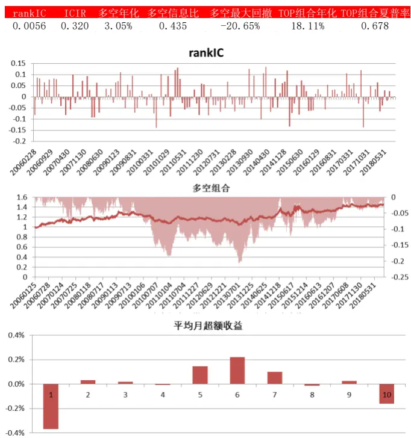
数据来源：东方证券研究所 Winc 资讯

图 9：剥离了 3个月特异度后下尾相关系数因子表现
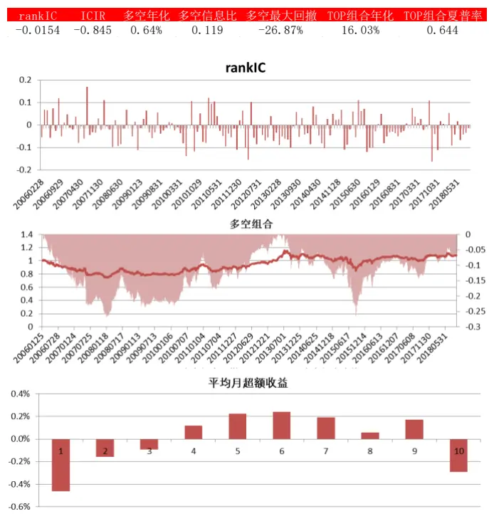
数据来源：东方证券研究所 Winc 资讯

## 3.上尾异常相关性

从上文结果来看，仅仅研究股票和市场的上尾或下尾相关系数并不能带来增量的 alpha，所以这里我们对上面的两个因子进行一定的改进，以期能够获得独立的 alpha源。上文仅考虑股票和市场单边的相关关系，上尾相关系数高说明在市场异常上涨的时候股票也能有大的涨幅，而下尾相关系数高则说明市场在异常下跌的时候股票也可能有较大的跌幅，而我们期望能找到在市场异常上涨时能跟着上涨而市场异常下跌时不跟着下跌的股票，也就是说我们要找到一个综合考虑上下尾相关系数的因子，这里我们通过回归的方式来构建因子：

$$
\lambda_{Ut}=\beta_{0}+\beta_{1}\lambda_{Lt}+\varepsilon_{t},
$$

其中 $\varepsilon_{t},$ ,即是上尾相关系数剥离掉下尾相关系数后的残差，相较于下尾相关系数而言，上尾的相关系数越大则残差也会越大，这个残差就是我们想要找的上尾异常相关系数。之所以通过回归的方式从上尾相关系数中剥离掉下尾相关系数是因为上下尾相关系数分布的均值和 dispersion 不同，回归以后反映的其实是相对位置的差距，即相对于市场普遍水平而言的上下尾相关系数差，这个因子值越大，那就说明这个股票在市场普遍的水平下，上尾相关系数相对越大于其下尾相关系数。

我们首先测试 2006.1-2018.9 中证全指范围内上尾异常相关系数原始值和行业市值中性化后因子值表现（图 10、11）。从结果可以看到这个因子不论是原始值还是中性化以后都有着非常稳健的选股效果，中性化后效果更好一些，rankIC 为 0.039，ICIR 高达 2.76，而且多空最大回撤也只有-10.86%

图 10：上尾异常相关系数在中证全指的表现
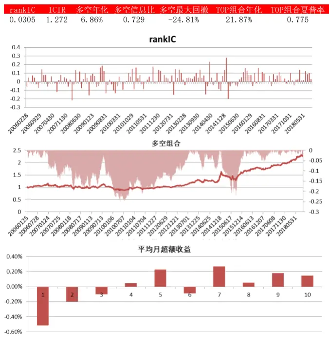
数据来源：东方证券研究所 Winc 资讯

图 11：行业市值中性化后上尾异常相关系数中证全指的表现
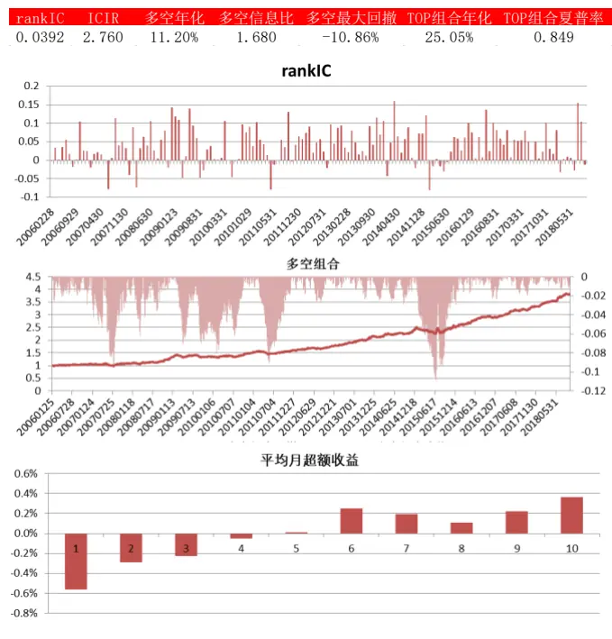
数据来源：东方证券研究所 Winc 资讯

图 12：上尾异常相关系数中证 500内表现
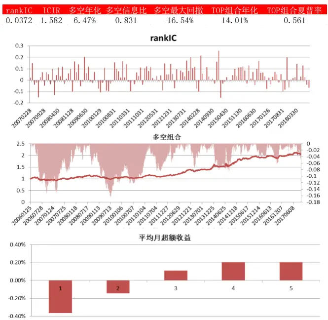
数据来源：东方证券研究所 Winc 资讯

图 13：行业市值中性化后上尾异常相关系数中证 500内表现
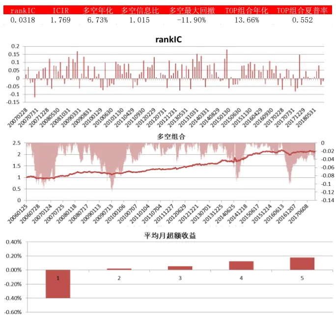
数据来源：东方证券研究所 Winc 资讯

图 14：上尾异常相关系数沪深 300内表现
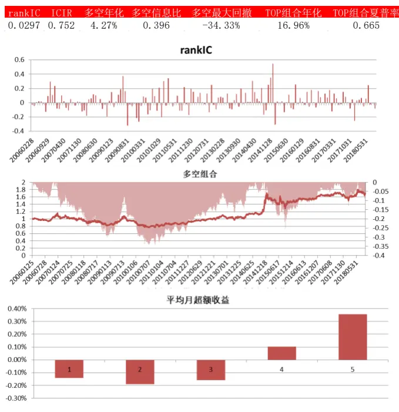
数据来源：东方证券研究所 Winc 资讯

图 15：行业市值中性化后上尾异常相关系数沪深 300内表现
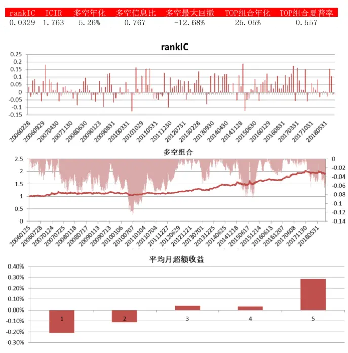
数据来源：东方证券研究所 Winc 资讯

我们进一步在沪深 300 和中证 500 内（中证 500 内的测试区间为 2007.1-2018.9）也分别测试了因子原始值和行业市值中性化后的选股效果（图 12-15）。从结果来看，因子在这两个样本空间内也有明显的选股效果，且行业市值中性化后选股效果非常显著，在中证 500 内因子的 rankIC 为0.032，ICIR 为 1.77，在沪深 300 内因子的 rankIC 为 0.033，ICIR 为 1.76，且都比较稳健。

同样，我们计算了这个因子和其他类型因子在不同样本空间的 rankIC相关性（图 16），这里也是原始值对应其他因子原始值，风格中性化因子值对应其他因子风格中性化因子值来比较的。从结果来看，这个因子除了和上尾相关系数的 rankIC 相关性较高（这是因为残差和因变量高相关），和其他因子的 rankIC相关系数都较低，因子原始值和其他因子的 rankIC相关系数绝对值仅有少数略大于 40%，而中性化以后因子和其他因子的 rankIC相关系数绝对值均在 40%以下，且绝大多数都小于 30%。

图 16：上尾异常相关性因子和其他因子的 rankIC相关性

| 类型 |  |  | 上尾异常相关系数(原始值) 中证全指 中证500 |  |  | 上尾异常相关系数（风格中性） 中证全指 |  |  |
| --- | --- | --- | --- | --- | --- | --- | --- | --- |
|  | 因子代码 LAMDAUP | 因子说明 过去3个月股票和中证全指的上尾相关系数 | 53.75% | 43.74% | 沪深300 55.29% | 48.52% | 中证500 51.78% | 沪深300 40.40% |
| 尾部相关性 | LAMDADOWN | 过去3个月股票和中证全指的下尾相关系数 | 19.85% | 12.60% | 20.02% | 22.73% | 13.76% | 9.85% |
|  | BP | 账面市值比 | 22.84% | 16.52% | 23.76% | 31.37% | 26.97% | 35.70% |
| 估值 | EP | 归属母公司的净利润TTM/总市值 | 33.61% | 8.36% | 26.57% | 22.75% | 10.66% | 34.26% |
|  | DP2 uP | 过去一年分红/总市值，以分红预案公告日为准 | 33.80% | 15.36% | 23.82% | 25.29% | 19.30% | 21.88% |
|  |  | 预期外的RNOA | -10.90% | -6.94% | -37.07% | -2.53% | 0.69% | 0.22% |
| 超预期 | SUEO | 基于带漂移项随机游走模型计算的预期外的净利润，详见《业绩超预期类因子》 | 5.37% | -9.50% | -1.29% | 1.43% | -17.25% | 3.47% |
|  | SUE1 | 基于不带漂移项随机游走模型计算的预期外的净利润，详见《业绩超预期类因子》 | 4.86% | -13.57% | -6.73% | -7.29% | -17.71% | -5.98% |
| SURO SUR1 |  | 基于带漂移项随机游走模型计算的预期外的营业收入，详见《业绩超预期类因子》 | -6.86% | -18.77% | -5.81% | -17.26% | -21.46% | -0.07% |
|  |  | 基于不带漂移项随机游走模型计算的预期外的营业收入，详见《业绩超预期类因子 | -4.29% | -18.30% | -14.85% | -17.04% | -20.51% | -11.02% |
|  | VOL20 | 过去20个交易日的波动率 | -20.68% | -10.24% | 20.15% | -33.51% | -15.61% | -9.39% |
|  | VOL60 | 过去60个交易日的波动率 | -19.86% | -9.24% | 17.79% | -29.54% | -18.35% | -13.54% |
|  | IVOL20 | 过去20个交易日的特质波动率 | -25.85% | -21.06% | 1.72% | -25.58% | -8.50% | -7.67% |
|  | IVOL60 | 过去60个交易日的特质波动率 | -30.87% | -19.75% | -3.36% | -24.01% | -7.05% | -11.93% |
|  | IVR20 | 过去20个交易日的特异度 | -12.59% | -22.57% | -32.42% | -38.70% | -29.43% | -22.67% |
|  | IVR60 | 过去60个交易日的特异度 | -28.38% | -26.07% | -43.28% | -39.27% | -33.29% | -27.99% |
| 反转 | RET20 | 过去20个交易日的收益率 | 1.81% | -11.04% | 4.69% | -21.76% | -32.63% | -12.71% |
|  | RET60 | 过去60个交易日的收益率 | -2.97% | -14.42% | 5.32% | -33.34% | -39.53% | -26.16% |
|  | TO20 | 过去20个交易日的日均换手率对数 | -25.89% | -2.62% | 7.48% | -6.63% | -12.15% | -4.03% |
| 非流动性 | T060 | 过去60个交易日的日均换手率对数 | -29.35% | -1.81% | 4.60% | -14.96% | -17.06% | -9.52% |
|  | LNAMIHUD | 20日Amihud非流动性自然对数 | -37.71% | -6.24% | -39.36% | 2.88% | -2.73% | -11.42% |
|  | LNAMIHUD | 60日Amihud非流动性自然对数 | -38.06% | -6.17% | -40.99% | -1.84% | -5.84% | -17.82% |
|  | ROE | 净资产收益率 | 20.66% | -3.25% | 1.80% | -0.19% | -3.76% | 0.19% |
| 盈利 | ROA | 总资产报酬率 | 4.31% | -6.38% | -26.35% | -5.51% | -4.60% | -8.23% |
|  | GPOA | 总资产毛利率 | -16.02% | -11.97% | -37.19% | -8.96% | -4.39% | -10.35% |
| 治理 | MR | 高管薪酬前三之和的对数 | 40.44% | 4.67% | 33.58% | 23.39% | 6.51% | 21.56% |
|  | COV | 过去6个月有覆盖的机构数量，取根号 | 23.56% | -3.25% | 9.47% | -2.98% | -0.37% | 0.93% |
|  | DISP | 过去6个月盈利预测的分歧度 | 9.75% | 10.28% | 17.34% | 5.08% | -3.43% | 1.99% |
|  | EP_FY1 | 预期的估值 | 33.09% | 10.86% | 23.05% | 24.75% | 13.58% | 39.37% |
| 分析师 | PEG | PE_FY1/FY2隐含的利润增量率 | -18.71% | -2.69% | -15.00% | -15.56% | -9.16% | -24.15% |
|  | SCORE | 综合评价 | -3.95% | -12.36% | -18.97% | -8.55% | -10.68% | 4.67% |
|  | TPER | 目标价隐含的收益率 | -8.04% | -9.73% | -10.26% | -1.74% | -10.82% | 8.92% |
|  | WFR | 加权的预期调整 | 6.91% | -0.81% | 6.03% | -0.83% | -0.53% | -7.11% |

数据来源：东方证券研究所 Winc 资讯

## 4.总结

本篇报告我们基于 copula 方法度量和股票和市场之间的尾部相关性，从过去 10 年来看，股票和市场的下尾相关系数均值要长期高于上尾相关系数均值，这说明市场极端上涨时股票同涨的可能性要小于市场极端下跌时股票同跌的可能性，这点与其他的实证研究是一致的。

我们发现基于过去 3 个月收益率数据构建的上下尾相关系数因子原始值和风格中性因子值在2006.1-2018.9均有着比较好的选股效果，但是这两个因子和 3个月特异度相关性很高，在剥离了特异度后因子没有什么选股效果，说明单纯的观察尾部的相关系数并不能带来独立的 alpha源。

在此基础上，我们结合了上下尾相关系数的特性构建了上尾异常相关系数因子，这个因子是上尾相关系数对下尾相关系数做回归的残差，它反映的相同分布情况下上下尾相关系数相对位置的差距，即相对于市场普遍水平而言的上下尾相关系数差，这个因子值越大，那就说明这个股票在市场普遍的水平下，上尾相关系数相对越大于其下尾相关系数。经过测试我们发现上尾异常相关系数因子原始值和风格中性化因子值都有着明显的选股效果，风格中性后在中证全指范围内的 rankIC 为0.039，ICIR 为 2.76，在中证 500 内因子的 rankIC 为 0.032，ICIR 为 1.77，在沪深 300 内因子的rankIC 为 0.033，ICIR 为 1.76，选股效果都比较稳健。

我们进一步在 3个样本空间中测试了因子和其他因子的 rankIC 相关性，我们发现这个因子除了和上尾相关系数因子相关系数较高（残差和因变量高相关），和其他因子的 rankIC相关系数都较低，因子原始值和其他因子原始值的 rankIC相关系数绝对值仅有少数略微大于 40%，而中性化以后因子和其他因子的 rankIC相关系数绝对值均在 40%以下，且绝大多数都小于 30%，这也就说明了上尾异常相关系数因子有着一定的独立信息源，可以考虑加入到 alpha因子库当中。

## 风险提示

- 极端市场环境可能对模型效果造成剧烈冲击，导致收益亏损。

- 量化模型基于历史数据分析得到，未来存在失效风险，建议投资者紧密跟踪模型表现。

## 参考文献

[1] Ang, A., & Chen, J. (2002). Asymmetric correlations of equity portfolios. Journal of financial Economics, Vol 63(3), pp:443-494.

[2]Chabi-Yo, F., Ruenzi, S., & Weigert, F. (2018). Crash Sensitivity and the Cross Section of Expected Stock Returns. Journal of Financial and Quantitative Analysis, Vol 53(3), pp:1059-1100.

[3] Embrechts, P., Resnick, S. I., & Samorodnitsky, G. (1999). Extreme value theory as a risk management tool. North American Actuarial Journal, Vol 3(2),pp: 30-41.

[4]Frahm, G., Junker, M., & Schmidt, R. (2005). Estimating the tail-dependence coefficient: properties and pitfalls. Insurance: mathematics and Economics, Vol 37(1), pp:80-100.

[5]Jondeau, E. (2016). Asymmetry in tail dependence in equity portfolios. Computational Statistics & Data Analysis, Vol 100,pp: 351-368.

[6] Longin, F. M. (2000). From value at risk to stress testing: The extreme value approach. Journal of Banking & Finance, Vol 24(7), pp:1097-1130.

[7]Longin, F., & Solnik, B. (2001). Extreme correlation of international equity markets. The journal of finance, Vol 56(2), pp:649-676.

## Table_Disclaime 分析师 r 申明

每位负责撰写本研究报告全部或部分内容的研究分析师在此作以下声明：

分析师在本报告中对所提及的证券或发行人发表的任何建议和观点均准确地反映了其个人对该证券或发行人的看法和判断；分析师薪酬的任何组成部分无论是在过去、现在及将来，均与其在本研究报告中所表述的具体建议或观点无任何直接或间接的关系。

## 投资评级和相关定义

报告发布日后的 12个月内的公司的涨跌幅相对同期的上证指数/深证成指的涨跌幅为基准；

## 公司投资评级的量化标准

买入：相对强于市场基准指数收益率 15%以上；

增持：相对强于市场基准指数收益率 5%～15%；

中性：相对于市场基准指数收益率在-5%～+5%之间波动；

减持：相对弱于市场基准指数收益率在-5%以下。

未评级——由于在报告发出之时该股票不在本公司研究覆盖范围内，分析师基于当时对该股票的研究状况，未给予投资评级相关信息。

暂停评级——根据监管制度及本公司相关规定，研究报告发布之时该投资对象可能与本公司存在潜在的利益冲突情形；亦或是研究报告发布当时该股票的价值和价格分析存在重大不确定性，缺乏足够的研究依据支持分析师给出明确投资评级；分析师在上述情况下暂停对该股票给予投资评级等信息，投资者需要注意在此报告发布之前曾给予该股票的投资评级、盈利预测及目标价格等信息不再有效。

## 行业投资评级的量化标准：

看好：相对强于市场基准指数收益率 5%以上；

中性：相对于市场基准指数收益率在-5%～+5%之间波动；

看淡：相对于市场基准指数收益率在-5%以下。

未评级：由于在报告发出之时该行业不在本公司研究覆盖范围内，分析师基于当时对该行业的研究状况，未给予投资评级等相关信息。

暂停评级：由于研究报告发布当时该行业的投资价值分析存在重大不确定性，缺乏足够的研究依据支持分析师给出明确行业投资评级；分析师在上述情况下暂停对该行业给予投资评级信息，投资者需要注意在此报告发布之前曾给予该行业的投资评级信息不再有效。

## HeadertTabl e_Discl ai mer 免责声明

本证券研究报告（以下简称“本报告”）由东方证券股份有限公司（以下简称“本公司”）制作及发布。

本报告仅供本公司的客户使用。本公司不会因接收人收到本报告而视其为本公司的当然客户。本报告的全体接收人应当采取必要措施防止本报告被转发给他人。

本报告是基于本公司认为可靠的且目前已公开的信息撰写，本公司力求但不保证该信息的准确性和完整性，客户也不应该认为该信息是准确和完整的。同时，本公司不保证文中观点或陈述不会发生任何变更，在不同时期，本公司可发出与本报告所载资料、意见及推测不一致的证券研究报告。本公司会适时更新我们的研究，但可能会因某些规定而无法做到。除了一些定期出版的证券研究报告之外，绝大多数证券研究报告是在分析师认为适当的时候不定期地发布。

在任何情况下，本报告中的信息或所表述的意见并不构成对任何人的投资建议，也没有考虑到个别客户特殊的投资目标、财务状况或需求。客户应考虑本报告中的任何意见或建议是否符合其特定状况，若有必要应寻求专家意见。本报告所载的资料、工具、意见及推测只提供给客户作参考之用，并非作为或被视为出售或购买证券或其他投资标的的邀请或向人作出邀请。

本报告中提及的投资价格和价值以及这些投资带来的收入可能会波动。过去的表现并不代表未来的表现，未来的回报也无法保证，投资者可能会损失本金。外汇汇率波动有可能对某些投资的价值或价格或来自这一投资的收入产生不良影响。那些涉及期货、期权及其它衍生工具的交易，因其包括重大的市场风险，因此并不适合所有投资者。

在任何情况下，本公司不对任何人因使用本报告中的任何内容所引致的任何损失负任何责任，投资者自主作出投资决策并自行承担投资风险，任何形式的分享证券投资收益或者分担证券投资损失的书面或口头承诺均为无效。

本报告主要以电子版形式分发，间或也会辅以印刷品形式分发，所有报告版权均归本公司所有。未经本公司事先书面协议授权，任何机构或个人不得以任何形式复制、转发或公开传播本报告的全部或部分内容。不得将报告内容作为诉讼、仲裁、传媒所引用之证明或依据，不得用于营利或用于未经允许的其它用途。

经本公司事先书面协议授权刊载或转发的，被授权机构承担相关刊载或者转发责任。不得对本报告进行任何有悖原意的引用、删节和修改。

提示客户及公众投资者慎重使用未经授权刊载或者转发的本公司证券研究报告，慎重使用公众媒体刊载的证券研究报告。

## 东方证券研究所

地址：上海市中山南路 318 号东方国际金融广场 26 楼

联系人： 王骏飞

电话：021-63325888*1131

传真：021-63326786

网址： www.dfzq.com.cn

Email： wangjunfei@orientsec.com.cn