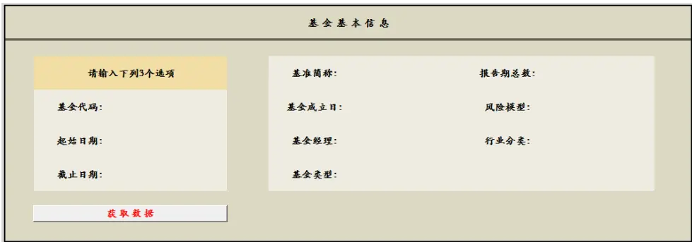
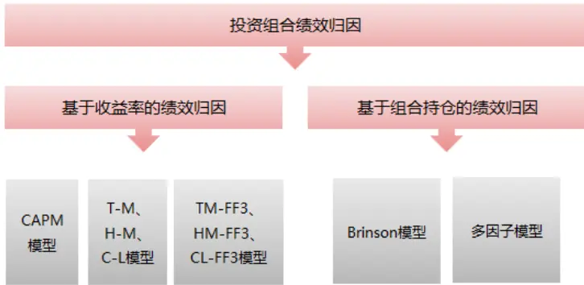
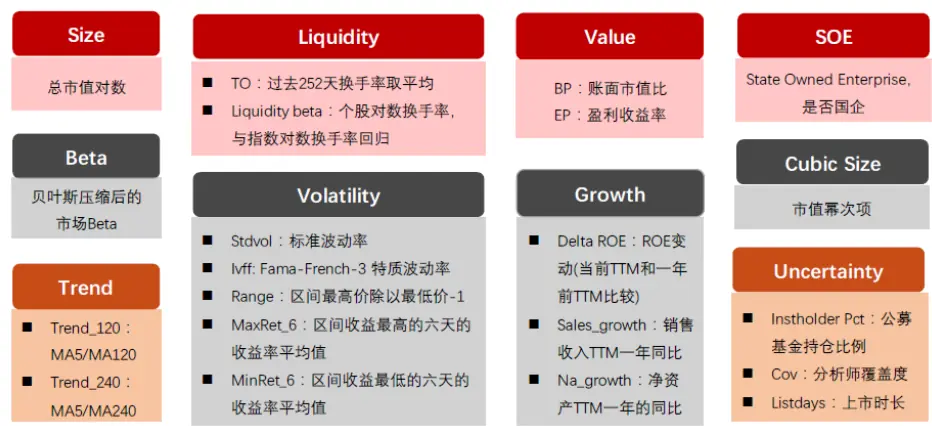
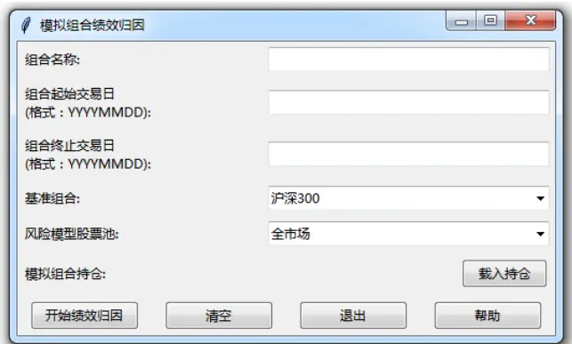
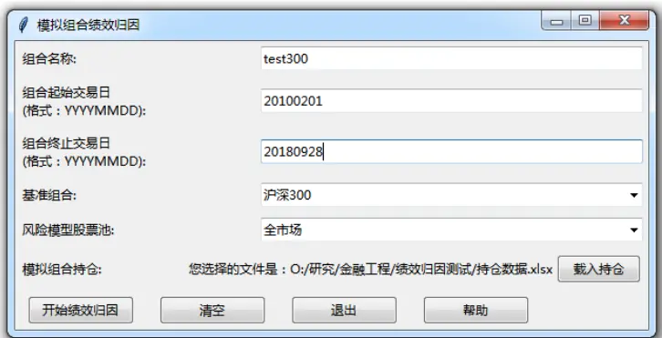
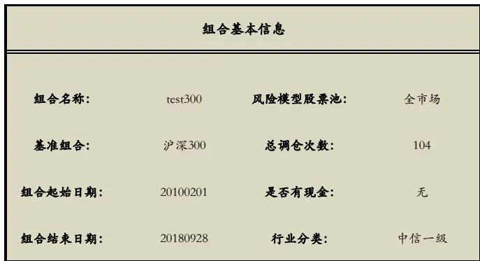
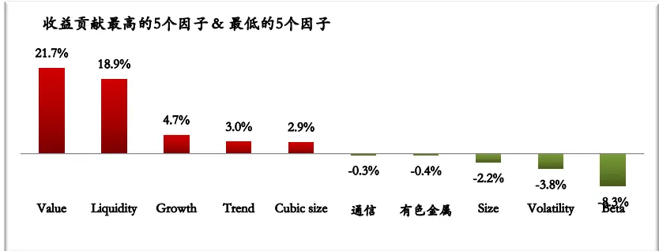
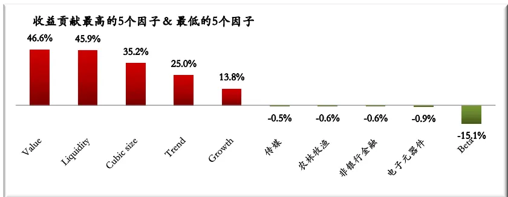
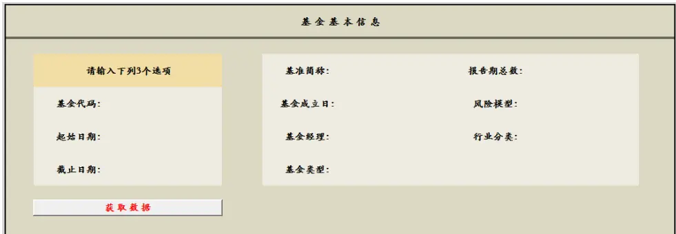

# Tabl e_Title DFQ2018 绩效归因与基金投资分析工具

## ——《因子选股系列研究之四十六》

## Table_Sum ary 研究结论

绩效归因分析主要是将投资组合的业绩与基准业绩相比较，并将超越基准部分的收益分解成若干影响投资决策的因素。投资组合的绩效归因分析主要有两大类：基于收益率的绩效归因和基于组合持仓的绩效归因。

基于收益率的绩效归因主要有 T-M 模型、H-M 模型、C-L模型、TM-FF3 、HM-FF3 和 CL-FF3 模型。基于组合持仓的绩效归因主要依据 Brinson 模型和多因子模型。基于持仓的归因相比于基于收益率的归因能够从更多角度刻画组合管理人的投资能力。

风险也是组合管理人关心的重要部分，对投资组合进行风险归因有助于组合管理人了解组合的风险来源。风险归因分为事前(ex-ante)风险归因和事后(ex-post)风险归因，事前风险归因依赖于多因子模型，事后风险归因依据的是组合已实现波动率。

基于归因理论与东方 A股因子风险模型(DFQ-2018)，我们研发了投资组合的绩效归因工具。

工具一：基于投资组合每期的持仓做绩效归因，提供的是 python 封装好的可执行程序，使用者无需另外安装 python编译环境。

工具二：用于公募基金的投资组合分析，目前研发了基金绩效归因的模块，后续可能会加入更多内容来完善整个基金分析系统。我们提供的是用 VBA语言编写的 EXCEL宏，使用者只需要在 excel中开启宏就可以使用。

欢迎感兴趣的投资者与我们团队成员或对口销售联系。

Table_ReportDate 报告发布日期2018 年 10 月 25 日

Table_Autho 证券分析师朱剑涛

021-63325888*6077

zhujiantao@orientsec.com.cn

执业证书编号：S0860515060001

Table_Contacter 联系人 邱蕊 021-63325888*5091 qiurui@orientsec.com.cn

## Table_Report 相关报告

基于 copula 的尾部相关性研究：上尾异常 2018-10-23相关系数因子

东方 A股因子风险模型（DFQ-2018）2018-09-02

盈利预测与市价隐含预期收益 2018-09-01

基金重仓股研究2018-08-19

上市公司业绩预告信息研究2018-08-03

## 风险提示

- 量化模型失效风险

- 市场极端环境的冲击

## 公募基金分析工具 – 操作界面

## 一、 绩效归因体系概述

绩效归因分析主要是将投资组合的业绩与基准业绩相比较，并将超越基准部分的收益分解成若干影响投资决策的因素。投资组合的构建通常是一个自上而下的过程，首先选择需要投资的大类资产，例如股票、债券、基金、现金等，再根据组合管理人的投资风格选择资产中的证券，例如选择国内 or国外资产、选择大市值 or小市值股票、选择评级高 or评级低的债券等。

投资组合的绩效归因分析主要有两大类：基于收益率的绩效归因和基于组合持仓的绩效归因。

基于收益率的绩效归因也被称为外部评价法，是一种自上而下的归因方法，主要依据为组合净值数据，即将组合收益率归因到几种风格类型上，然后依据剩余的 alpha 来评价组合的主动管理能力。Treynor 和 Mazuy（1966）在 CAPM 模型的基础上增加一个二次项，形成了 T-M 模型，把组合的业绩分解为组合管理人的证券选择能力和择时能力，首次对组合管理人的择时能力进行了定量分析。Henriksson 和 Merton（1981）对 T-M 模型作了进一步的修改，引入一个虚拟变量代替了 T-M 模型中的二次项，形成了 H-M 模型，从而简化了模型。Chang 和 Lewellen（1984）将市场分成了上涨和下跌两种情况，在 H-M模型的基础上进一步衍生出了 C-L模型，区分了组合在多头和空头市场的系数值。在 T-M 模型和 H-M 模型基础上，Fama 和 French（1993）引入了两个因素，即公司规模因子（SMB）和账面市值因子（HML），形成了 TM-FF3 、HM-FF3和CL-FF3 模型。

基于组合持仓的绩效归因也被称为内部评价法，主要依据组合具体持仓明细。一种广泛的做法是根据 Brinson 和 Falcher（1985）所提出的 Brinson模型将组合收益分解为资产配置收益、证券选择收益和交互收益，这是一种自上而下的归因方法。而另一种方法是依据多因子模型，首先计算组合在各个因子上的暴露，再将收益归因到各个因子上，这是一种自下而上的归因方法。显而易见，基于持仓的归因相比于基于收益率的归因能够从更多角度刻画组合管理人的投资能力。

图 1描述了绩效归因体系架构：
图 1：绩效归因体系架构

数据来源：东方证券研究所

## 二、基于收益率的绩效归因

基于收益率的绩效归因方法主要是建立在 CAPM模型的基础上，通过回归的方式，从统计的显著性来判断组合管理人的择时能力和证券选择能力。

## 2.1 T-M 模型

Treynor 和 Mazuy（1966）提出在 CAPM 模型基础上可以加入一个二次项，以此来考察组合管理人的择时能力和证券选择能力，该模型表明一个具有择时能力的组合管理人，应当在市场上涨前通过提高投资组合的风险水平，来获取牛市中较高的收益，而在市场下跌前，降低组合的风险水平，减少熊市中的损失。T-M 模型的回归方程是：

$$
R_{p}-R_{f}=\alpha_{p}+\beta_{1}\big(R_{m}-R_{f}\big)+\beta_{2}\big(R_{m}-R_{f}\big)^{2}+\varepsilon_{p}
$$

其中 $R_{p}$ 、 $R_{f}$ 、 $R_{m}$ 分别代表了投资组合收益、无风险收益以及市场组合收益， $\beta_{1}$ 代表了系统性风险， $\beta_{2}>0$ 时表明组合管理人具有择时能力， $\beta_{2}$ 越大择时能力越强， $\alpha_{p}>$ 0时表明组合管理人具有证券选择能力， $\alpha_{p}$ 越大证券选择能力越强， $\varepsilon_{p}$ 为随机误差项。

## 2.2 H-M 模型

Henriksson 和 Merton（1981）对 T-M 模型作了进一步的修改，用一个虚拟变量替代原来的二次项，他们把择时能力定义为：组合管理人通过预测市场收益与无风险收益之间的差异，来预先调整投资组合的能力，即在市场上涨时贝塔取值较大，在市场下跌时贝塔取值较小。H-M 模型的回归方程是：

$$
R_{p}-R_{f}=\alpha_{p}+\beta_{1}\big(R_{m}-R_{f}\big)+\beta_{2}\big(R_{m}-R_{f}\big)\cdot D+\varepsilon_{p}
$$

其中 $R_{p}$ 、 $R_{f}$ $R_{m}$ 分别代表了投资组合收益、无风险收益以及市场组合收益，D是一个虚拟变量，当 $R_{m}-R_{f}>0\forall\mathrm{D}=1$ ，否则D = 0， $\beta_{1}$ 代表了系统性风险， $\beta_{2}>0\sharp\bar{\cdot}$ 表明组合管理人具有择时能力， $\beta_{2}$ 越大择时能力越强， $\alpha_{p}>$ 0时表明组合管理人具有证券选择能力， $\alpha_{p}$ 越大证券选择能力越强， $\varepsilon_{p}$ 为随机误差项。

## 2.3 C-L 模型

Chang 和 Lewellen（1984）对 H-M 模型进行了改进，提出了 C-L 模型，C-L 模型的回归方程是：

$$
R_{p}-R_{f}=\alpha_{p}+\beta_{1}\cdot min\big(0,R_{m}-R_{f}\big)+\beta_{2}\cdot max\big(0,R_{m}-R_{f}\big)+\varepsilon_{p}
$$

如果市场处于牛市，即 $R_{m}-R_{f}>0$ ，那么模型为：

$$
R_{p}-R_{f}=\alpha_{p}+\beta_{2}\cdot\left(R_{m}-R_{f}\right)+\varepsilon_{p}
$$

如果市场处于熊市，即 $R_{m}-R_{f}<0$ ，那么模型为：

$$
R_{p}-R_{f}=\alpha_{p}+\beta_{1}\cdot\left(R_{m}-R_{f}\right)+\varepsilon_{p}
$$

其中 $R_{p}$ 、 $R_{f}$ 、 $R_{m}$ 分别代表了投资组合收益、无风险收益以及市场组合收益， $\beta_{1}$ 代表了空头市场的贝塔值， $\beta_{2}$ 代表了多头市场的贝塔值，如果 $\beta_{2}>\beta_{1}$ 表明组合管理人具有择时能力， $\alpha_{p}>$ 0时表明组合管理人具有证券选择能力， $\alpha_{p}$ 越大证券选择能力越强， $\varepsilon_{p}$ 为随机误差项。

## 2.4 TM-FF3、HM-FF3、CL-FF3 模型

前面的模型都只考虑了市场对投资组合的影响，而未考虑其他可能影响组合收益的风险因素，于是 Fama 和 French（1993）引入了两个因素，即公司规模因子（SMB）和账面市值因子（HML），逐渐形成了 TM-FF3 、HM-FF3和 CL-FF3模型，这些模型仅适用于股票型投资组合。

TM-FF3 的回归方程为：

$$
R_{p}-R_{f}=\alpha_{p}+\beta_{1}\big(R_{m}-R_{f}\big)+\beta_{2}\big(R_{m}-R_{f}\big)^{2}+\theta_{1}SMB+\theta_{2}HML+\varepsilon_{p}
$$

HM-FF3 的回归方程为：

$$
R_{p}-R_{f}=\alpha_{p}+\beta_{1}\big(R_{m}-R_{f}\big)+\beta_{2}\big(R_{m}-R_{f}\big)\cdot D+\theta_{1}SMB+\theta_{2}HML+\varepsilon_{p}
$$

CL-FF3 的回归方程为：

$$
R_{p}-R_{f}=\alpha_{p}+\beta_{1}\cdot min\big(0,R_{m}-R_{f}\big)+\beta_{2}\cdot max\big(0,R_{m}-R_{f}\big)+\theta_{1}SMB+\theta_{2}HML+\varepsilon_{p}SM^{\prime},
$$

## 三、基于组合持仓的绩效归因

基于收益率的绩效归因结果仅局限于择时能力和证券选择能力，很难获取组合收益风险来源，并且组合收益率受众多因素影响，例如基金中的大额赎回等，会导致回归结果的不准确，因此如果能够获得组合的持仓明细，我们可以从更多的角度知晓组合的收益与风险来源。

## 3.1 Brinson 模型

Brinson 和 Falcher（1985）所提出的 Brinson模型是目前运用最广泛的绩效归因模型，模型将一个时期的组合收益与基准收益进行比较，将组合超额收益分解为 3 个部分：资产配置收益、证券选择收益和交互收益。

Brinson收益的分解可以用如下表格来描述：

图 2：Brinson 收益分解

|  | 实际组合收益r | 基准组合收益rb： |
| --- | --- | --- |
| 实际组合权重w? | $\begin{array}{r}{Q_{4}:\sum_{i}w_{i}^{\mathcal{P}}*r_{i}^{\mathcal{P}}}\end{array}$ | $\begin{array}{r}{Q_{z}:\sum_{i}w_{i}^{\mathfrak{p}}*r_{i}^{\mathfrak{b}}}\end{array}$ |
| 基准组合权重w | $\begin{array}{r}{Q_{3}:\sum_{i}w_{i}^{\ b}*r_{i}^{\ p}}\end{array}$ | $\begin{array}{r}{Q_{1}:\sum_{i}w_{i}^{\ b}*r_{i}^{\ b}}\end{array}$ |

数据来源：东方证券研究所

其中 $Q_{1}$ 表示基准组合收益， $Q_{4}$ 表示实际投资组合收益， $Q_{2}$ 表示积极资产配置的组合所带来的收益， $Q_{1}$ 表示积极证券选择的组合所带来的收益。

## 1) 资产配置收益

资产配置收益反映了组合资产配置比例与基准组合的资产配置比例不同而带来的收益差异，组合管理人可以自主选择资产配置比例，但是在每个资产内部则完全按照该类资产的业绩基准配置，即每个资产的收益率等于该资产的基准收益率。因此资产配置收益为：

$$
Q_{2}-Q_{1}=\sum_{i}\left(w_{i}^{p}-w_{i}^{b}\right)*r_{i}^{b}
$$

## 2) 证券选择收益

证券选择收益反映了不同于基准组合的证券选择而带来的收益差异，组合管理人按照基准配置资产比例，但是在每个资产内部可以自主进行证券的选择，即每个资产的权重等于该资产的基准权重。因此证券选择收益为：

$$
Q_{3}-Q_{1}=\sum_{i}w_{i}^{b}*\left(r_{i}^{p}-r_{i}^{b}\right)
$$

## 3) 交互收益

交互收益反应的是资产配置和证券选择的交叉影响，若是同时具备资产配置能力和证券选择能力该项为正，因此交互收益为：

$$
Q_{4}-Q_{3}-Q_{2}+Q_{1}=\sum_{i}\bigl(w_{i}^{p}-w_{i}^{b}\bigr)*\bigl(r_{i}^{p}-r_{i}^{b}\bigr)
$$

根据上述分解，投资组合相对基准的超额收益为资产配置收益、证券选择收益与交互收益三者之和。

## 3.2 多因子模型

多因子模型将股票的收益分解为系统性收益（风格与行业因子）和特质收益，可以用如下式子来表达：

$$
r_{n}=\sum_{k}X_{nk}f_{k}+u_{n}
$$

其中 $r_{n}$ 指第 n个资 $\vec{\mathcal{T}}$ 的收益率， $X_{nk}$ 指第 n种资产在第 k个因子上的暴露， $f_{k}$ 是因子收益率， $u_{n}$ 指特质收益。

将上述式子归因到组合层面，即投资组合的超额收益可以写为：

$$
R^{p}=\sum_{k}X_{k}^{p}f_{k}+\sum_{n}w_{n}^{p}u_{n}
$$

其中 $X_{k}^{p}$ 指组合在第 k 个因子上的主动暴露， $w_{n}^{p}$ 是第 n 中资产相对基准的主动权重，因此 $X_{k}^{p}f_{k}$ 就是第 k个因子对整个组合超额收益的贡献。所以我们只要知晓各个资产上的因子暴露、资产权重以及因子收益率，就可以将组合超额收益进行分解。

若存在多种资产，例如股票和现金，我们将股票组合单独做多因子模型的归因，首先算出满仓情况下组合相对基准的暴露，再乘以因子收益率，最后将超额收益乘以基准权重，也就是每期的Rp相当于是 Brinson模型中的证券选择收益。

## 四、多期绩效归因

前面介绍的基于组合持仓的绩效归因方法主要针对于单期的绩效归因，也就是说组合的持仓没有发生变化，假如组合管理人在一段时间内多次调仓，并且需要对整个时间段进行归因，那么就需要运用多期的绩效归因方法。

收益率是一个累乘的结果而不是简单的相加，Menchero(2004)在文中介绍了多期归因的方法，他认为正确的多期归因方法应该同时具有 4个属性：

1) 没有残差（Absence of residuals）：方法应该包括整个期间的收益，而没有残差收益。

2) 可交换性（Commutativity）：不依赖于调仓日的顺序，即就算交换两期的顺序，也不会影响最后的多期归因结果。

3) 尺度保留（Metric preservation）：如果两期具有相同的收益，那么汇总成多期时对组合的贡献也必须相同。

4) 能够被完全连接（Ability to be fully linked）：方法在每个子模块归因的结果汇总起来要等于最高层的收益。

Menchero(2004)虽然介绍了多种方法，但是只有一种方法同时具备上述 4 种属性，即优化连接系数方法（Optimized Linking Coefficient Approaches），这是一种算术方法，多期收益不能通过每期收益的简单相加，但是如果每期收益都乘以一个连接系数，那么就可以相加成组合总超额收益，并且没有残差。可以用如下式子表达这个过程：

$$
R-\widetilde{R}=\sum_{t=1}^{T}\beta_{t}(R_{t}-\widetilde{R_{t}})
$$

其中R表示组合实际收益， ${\tilde{R}};$ 表示基准收益， $\beta_{t}$ 表示每期的连接系数，T表示期数。

$\beta_{t}$ 可以用下列式子得到：

$$
\begin{array}{c}{\beta_{t}=\mathrm{A}+\alpha_{t}=\mathrm{A}+\mathrm{C}(R_{t}-\widetilde{R_{t}})}\\{\mathrm{A}=\displaystyle\frac{(R-\widetilde{R})/T}{(1+R)^{1/T}-(1+\widetilde{R})^{1/T}}\qquad\mathrm{C}=\frac{R-\widetilde{R}-A\sum_{j=1}^{T}(R_{j}-\widetilde{R}_{j})}{\sum_{j=1}^{T}(R_{j}-\widetilde{R_{j}})^{2}}}\end{array}
$$

A 是通过式子 $\begin{array}{r}{{\cal R}-\widetilde{\cal R}\approx{\cal A}\sum_{t=1}^{T}({\cal R}_{t}-\widetilde{{\cal R}_{t}})}\end{array}$ 估计的， $\alpha_{t}$ 是残差项。

因此通过这种多期归因方法，无论是 Brinson 模型还是多因子模型，我们都可以将多期的收益汇总在一起进行归因，例如对于 Brinson模型来说，首先计算 $\overleftrightarrow{\boxplus}$ 期的连接系数β ，然后将每期资产配置收益、证券选择收益和交互收益分别乘以连接系数，然后相加起来，就得到多期汇总的资产配置收益、证券选择收益和交互收益，这三项加起来应该等于整个时间区间的超额收益。

## 五、风险归因

前面几章主要介绍了收益归因的常用方法，然而风险也是组合管理人关心的重要部分，通常基金经理需要对组合偏离基准的程度（跟踪误差）做出限制，特别是指数增强基金通常对跟踪误差有严格的约束，所以对投资组合进行风险归因有助于组合管理人了解组合的风险来源，从而更好的对风险因素做出决策。

Menchero (2006)在文中对风险归因进行了系统化的探讨，风险归因分为事前(ex-ante)风险归因和事后(ex-post)风险归因。

## 5.1 事前风险归因

事前风险归因依据的是多因子模型，将组合的风险归因到各个因子上，是基于某个时间点的股票持仓做的预测型风险，在理解预测性质之前首先描述一下组合的风险。

组合总体的方差为 $\sigma^{2}=\boldsymbol{w}^{T}\cdot\boldsymbol{\Sigma}\cdot\boldsymbol{w}$ ，在结构化因子模型的假设下，股票协方差矩阵Σ可以写成如下形式：

$$
\Sigma=X\cdot F\cdot X^{T}+D
$$

其中X是 n个股票在 k个公共风险因子上的因子暴露矩阵(n x k)，F是 k个公共因子收益率的协方差矩阵(k x k)，D是 n个股票的残差收益率方差矩阵(n x n)，因此可以得到组合总体方差为：

$$
\sigma^{2}=w^{T}\cdot{\boldsymbol{\Sigma}}\cdot w=w^{T}\cdot({\boldsymbol{X}}\cdot F\cdot{\boldsymbol{X}}^{T}+D)\cdot w=w^{T}\cdot({\boldsymbol{X}}\cdot F\cdot{\boldsymbol{X}}^{T})\cdot w+w^{T}\cdot D\cdot w
$$

又因为组合在第 k个因子上的暴露为 $f=X_{k}^{T}\cdot w$ ，所以组合方差最终可以写为：

$$
\sigma^{2}=f^{T}\cdot F\cdot f+w^{T}\cdot D\cdot w
$$

若w为组合相对基准的主动权重，那么这里的σ就是跟踪误差。

所以从上面的公式可以看出组合风险依赖于因子暴露、因子协方差矩阵和股票残差收益率方差矩阵，因子暴露依据的是当前时间点的持仓，因子协方差矩阵以及股票残差收益率都是通过历史的因子收益率估计得到，因此根据多因子模型计算的组合风险实际上不是已经实现的组合波动，而是一种对未来组合风险的预测。

在用多因子模型进行风险归因前，首先用最简单的公式表达组合收益，其中 $x_{m}$ 为在因子 m 上的暴露， $g_{m}$ 是因子 m 的收益率，那么组合的收益率可以写为 $\begin{array}{r}{R=\sum_{m}x_{m}g_{m}}\end{array}$ ，组合的方差可以进行如下推导：

$$
Var(R)=cov(R,R)=cov\left(\sum_{i=1}^{m}x_{i}g_{i},\sum_{j=1}^{m}\frac{1}{m}*R\right)=\sum_{i=1}^{m}\sum_{j=1}^{m}cov(x_{i}g_{i},\frac{1}{m}*R)=\sum_{m}x_{m}cov(g_{m},R)
$$

$cov(g_{m},R)$ 也可以通过类似的方推导写成∑ mi=1 $\Sigma_{j=1}^{m}x_{i}cov(g_{i},g_{j})$ ，而 $\textstyle\sum_{i=1}^{m}\sum_{j=1}^{m}cov(g_{i},g_{j})$ 实际上就是因子收益率的协方差矩阵F，所以我们将公式代入到多因子模型当中，写成矩阵的形式，组合的风险可以分解为：

$$
Var(R^{p})=\sum_{k}X_{k}^{p}cov(f_{k},R^{p})+\sum_{n}w_{n}^{p}cov(u_{n},R^{p})=\sum_{k}X_{k}^{p}(F*X^{p})_{k}+\sum_{n}w_{n}^{p}(u*w^{p})_{n}
$$

$$
\sigma(R^{p})=(\sum_{k}X_{k}^{p}(F*X^{p})_{k}+\sum_{n}w_{n}^{p}(u*w^{p})_{n}){\mathbf\Omega}/{\mathbf\Gamma}\sigma(R^{p})
$$

其中 $\begin{array}{r}{\sum_{k}X_{k}^{p}(F*X^{p})_{k}/\sigma(R^{p})}\end{array}$ 是公共因子对组合风险的贡献比例， ${\textstyle,}\sum_{n}w_{n}^{p}(u*w^{p})_{n}/\sigma(R^{p})$ 是特质因子对组合风险的贡献比例， $X_{k}^{p}(F*X^{p})_{k}/\sigma(R^{p})$ 是单个公共因子对组合风险的贡献比例。

如果存在多种资产，假设是股票和现金，那么整个资产组合的方差可以写为 $Var(R^{p})=$ $Var(w_{cash}R_{cash}+w_{stock}R_{stock})$ ， 假 设 现 金 部 分 的 风 险 为 0， 那 么 组 合 的 方 差 就 等 于${w_{stock}}^{2}Var(R_{stock})$ o

## 5.2 事后风险归因

事前风险归因是个时间点的概念，而事后风险归因是多期的结果，依据的是组合已实现的波动率（Realized Volatility）。

首先用如下式子定义组合已实现方差，其中 T是期数， $R_{t}$ 为第 t期组合收益， $\bar{R}$ 为多期平均收益：

$$
\tilde{\sigma}^{2}(R^{p})=\frac{\sum_{t}(R_{t}-\bar{R})^{2}}{T-1}
$$

假设单期收益 $R_{t}$ 由 m 个收益来源组成， $Q_{mt}$ 为单期第 m 个因素的收益，那么 $\textstyle R_{t}=\sum_{m}Q_{mt}$ 所以 $\begin{array}{r}{R_{t}-\bar{R}=\sum_{m}(Q_{mt}-\bar{Q}_{m})}\end{array}$ $\bar{Q}_{m}$ 为第 m 个因素多期平均收益，因此：

$$
\tilde{\sigma}^{2}(R^{p})=\frac{\sum_{t}(\sum_{m}(Q_{mt}-\overline{{Q}}_{m}))(R_{t}-\bar{R})}{T-1}=\sum_{m}\frac{\sum_{t}(Q_{mt}-\overline{{Q}}_{m})(R_{t}-\bar{R})}{T-1}=\sum_{m}\widetilde{cov}(Q_{m},R^{p})
$$

所以组合已实现方差就等于 m 个因素收益率与组合收益率的已实现协方差之和，可以看到这个公式的形式和事前方差的分解有相似之处，不过已实现方差不依赖于组合的因子暴露。

根据方差与波动率和相关系数的关系，我们继续分解组合的已实现方差：

$$
\widetilde\sigma^{2}(R^{p})=\sum_{m}\widetilde{cov}(Q_{m},R^{p})=\sum_{m}\widetilde\sigma(R^{p})*\widetilde\sigma(Q_{m})*\widetilde\rho(Q_{m},R^{p})
$$

最终组合的已实现波动率为：

$$
\tilde{\sigma}(R^{p})=\sum_{m}\widetilde{cov}(Q_{m},R^{p})=\sum_{m}\tilde{\sigma}(Q_{m})*\tilde{\rho}(Q_{m},R^{p})
$$

这个公式表示组合的已实现风险可以分解为：第 m个因素收益率的已实现波动率乘以第 m个因素收益率与组合收益率的已实现相关系数。事后风险归因本质上是组合已实现波动率与因子已实现波动率存在的线性关系。

## 六、DFQ2018 绩效归因与基金分析工具介绍

基于上述章节的理论，我们研发了投资组合的绩效归因工具，可基于投资组合每期的持仓做绩效归因和公募基金的绩效归因。我们使用的风险模型是《东方 A 股因子风险模型(DFQ-2018)》报告中研发的风险模型，具体模型细节可以参考报告，下图展示了该模型的风格因子列表：

图 3：东方 A股因子风险模型（DFQ-2018）-- 风格因子列表

数据来源：东方证券研究所

## 6.1 基于投资组合每期持仓的绩效归因分析工具

## 6.1.1 操作步骤

该工具主要是基于投资组合每期持仓做的绩效归因分析，我们提供的是 python封装好的可执行程序（大约 40MB），使用者无需另外安装 python编译环境，运行 exe 程序后稍等几秒会弹出如下操作界面（exe 运行后程序会在本地临时搭建一个微型 python 环境，若电脑配置不高可能会等待一段时间）：

图 4：基于投资组合持仓的绩效归因分析工具 – 操作界面

数据来源：东方证券研究所

操作步骤说明：

## 1) 组合名称

该字段用于生成的 excel 文件的名称，因此要求只能包含英文、数字和下划线，且必须以英文字母开头，不符合规则会报错。

## 2) 组合起始交易日、组合终止交易日

组合起始交易日必须和使用者输入的第一次组合调仓日保持一致，并且必须是交易日，格式为 YYYYMMDD，不符合规则会报错；

组合终止交易日必须大于使用者输入的最后一次组合调仓日，并且必须是交易日，格式为 YYYYMMDD，不符合规则会报错。

## 3) 基准组合

基准组合我们提供了沪深 300、中证 500、中证 800、中证 1000 和中证全指常见指数。

## 4) 风险模型股票池

DFQ-2018风险模型的一大特点是可以根据不同的股票池生成专属的风险模型，目前我们已经提供了全市场、沪深 300和中证 500的风险模型，需要注意的是，如果使用者的持仓中有沪深 300或中证 500成分外的数据，建议使用全市场风险模型，否则成分外的股票会没有风险模型数据，程序会报错。若使用者想制定专属于模拟持仓的风险模型，可以与我们团队成员联系，我们会为您制定专属的风险模型股票池。

## 5) 载入组合持仓

点击“载入持仓”按钮，使用者需载入持仓数据的 excel 文件，文件没有位置要求，不过需要满足一定的规则，请看下面的示例（我们在发送工具给使用者时会附带示例文件，使用者可以直接在示例上做修改）：

图 5：模拟组合持仓绩效归因分析工具 – 上传模拟组合示例

|  | A | B | C | D |
| --- | --- | --- | --- | --- |
| 1 | 调仓日期 | 资产代码 | 资产权重 |  |
| 2 | 20180801 | 601888.SH | 0.2 |  |
| 3 | 20180801 | 601939.SH | 0.2 |  |
| 4 | 20180801 | 601985.SH | 0.2 |  |
| 5 | 20180801 | 601997.SH | 0.2 |  |
| 6 | 20180801 | 603288.SH | 0.2 |  |
| 7 | 20180801 | 999999.CH | 0 |  |
| 8 | 20180903 | 000002.SZ | 0.2 |  |
| 9 | 20180903 | 000060.SZ | 0.2 |  |
| 10 | 20180903 | 000333.SZ | 0.2 |  |
| 11 | 20180903 | 000338.SZ | 0.2 |  |
| 12 | 20180903 | 000413.SZ | 0.1 |  |
| 13 | 20180903 | 999999.CH | 0.1 |  |
| 14 |  |  |  |  |
| 15 |  |  |  |  |

数据来源：东方证券研究所

|  | A | B | C | D |
| --- | --- | --- | --- | --- |
| 1 | 调仓日期 | 资产代码 | 资产权重 |  |
| 2 | 2018/8/1 | 601888.SH | 0.2 |  |
| 3 | 2018/8/1 | 601939.SH | 0.2 |  |
| 4 | 2018/8/1 | 601985.SH | 0.2 |  |
| 5 | 2018/8/1 | 601997.SH | 0.2 |  |
| 6 | 2018/8/1 | 603288.SH | 0.2 |  |
| 7 | 2018/8/1 | 999999.CH | 0 |  |
| 8 | 2018/9/3 | 000002.SZ | 0.2 |  |
| 9 | 2018/9/3 | 000060.SZ | 0.2 |  |
| 10 | 2018/9/3 | 000333.SZ | 0.2 |  |
| 11 | 2018/9/3 | 000338.SZ | 0.2 |  |
| 12 | 2018/9/3 | 000413.SZ | 0.1 |  |
| 13 | 2018/9/3 | 999999.CH | 0.1 |  |
| 14 |  |  |  |  |

第一行名称不能改变，调仓日期支持 YYYYMMDD数字格式以及日期格式，股票代码需要有后缀，另外由于工具支持股票和现金两种资产，所以请在每期持仓中添加一个“999999.CH”代表现金，如果没有现金权重填 0，如果不符合上述规则会报错。

6) 完成上述内容后，就可以点击“开始绩效归因”按钮，程序若执行成功会跳出提示框。在网络状况良好的情况下，一年 12 期的持仓数据大约需要 1 分钟左右的等待时间，如果等待时间过长，可能是由于网络状况较差，访问云服务器提取数据的速度较慢，或者是程序出现了 bug，使用过程中若有任何问题请随时联系我们团队成员。

## 6.1.2 应用展示

程序执行成功后，会在存放归因工具的路径自动生成一个 excel 文件（文件以使用者输入的组合名称命名），工具将会展示如下内容：

- 工具支持的资产种类：股票和现金

- 组合基本信息

- 组合收益与资产配置权重（日频）

- 资产组合：Brinson模型收益分解汇总数据与明细数据（单期和多期）

√股票组合：Brinson 模型收益分解汇总数据与明细数据（单期和多期）

- 股票组合：因子模型收益分解汇总数据与明细数据（单期和多期，日频）

- 股票组合：因子模型风险归因汇总数据与明细数据（单期）

- 股票组合：因子模型相对基准的主动暴露（单期，日频）

## 例一：全市场增强 300 组合（行业市值中性）

我们首先以全市场增强 300 的模拟组合为例，来描述 excel 展示的内容，操作界面输入的参数如下：

图 6：基于投资组合持仓的绩效归因分析工具 – 全市场增强 300 参数

数据来源：东方证券研究所

运行成功后我们挑选了部分重要数据进行描述：

## 1) 组合基本信息

测试组合时间段为 2010.02.01 至 2018.09.28，月度调仓，共 104 期（大约 10 分钟），没有现金资产。

图 7：例 全市场增强 300组合 -- 组合基本信息

数据来源：东方证券研究所

## 2) Brinson 模型收益分解汇总

由多期合计结果可知，模拟组合相对沪深 300 的超额收益为 121.97%。由于组合没有现金资产，所以资产组合的资产配置收益为 0，收益均来自于股票组合中的证券选择收益 121.97%。股票组合中能够配置的资产是行业，但是我们的组合是行业中性的，所以行业配置收益在 0 附近，没有完全等于 0 是因为持仓的权重是调仓日收盘的结果，并不是刚优化出来完全中性的数据。

图 8：资产组合 - Brinson收益分解汇总

|  | 资产配置收益 | 证券选择收益 | 交互收益 | 组合超额收益 |
| --- | --- | --- | --- | --- |
| 20100201 | 0.00% | 0.18% | 0.00% | 0.18% |
| 20100301 | 0.00% | 0.64% | 0.00% | 0.64% |
| 20100401 | 0.00% | 1.52% | 0.00% | 1.52% |
| 20100504 | 0.00% | -0.11% | 0.00% | -0.11% |
| 20100601 | 0.00% | 0.37% | 0.00% | 0.37% |
| 20100701 | 0.00% | 1.44% | 0.00% | 1.44% |
| 20100802 | 0.00% | 0.68% | 0.00% | 0.68% |
| 20100901 | 0.00% | -1.75% | 0.00% | -1.75% |
| 20101008 | 0.00% | 1.77% | 0.00% | 1.77% |
| 20180102 | 0.00% | 2.22% | 0.00% | 2.22% |
| 20180201 | 0.00% | 0.35% | 0.00% | 0.35% |
| 20180301 | 0.00% | -0.21% | 0.00% | -0.21% |
| 20180402 | 0.00% | 0.75% | 0.00% | 0.75% |
| 20180502 | 0.00% | -0.42% | 0.00% | -0.42% |
| 20180601 | 0.00% | 0.32% | 0.00% | 0.32% |
| 20180702 | 0.00% | 0.89% | 0.00% | 0.89% |
| 20180801 | 0.00% | 0.12% | 0.00% | 0.12% |
| 20180903 | 0.00% | 0.38% | 0.00% | 0.38% |
| 合计 | 0.00% | 121.97% | 0.00% | 121.97% |

图 9：股票组合 - Brinson收益分解汇总

|  | 行业配置收益 | 证券选择收益 | 交互收益 | 组合超额收益 |
| --- | --- | --- | --- | --- |
| 20100201 | 0.02% | 0.13% | 0.03% | 0.18% |
| 20100301 | -0.02% | 0.66% | -0.01% | 0.64% |
| 20100401 | -0.02% | 1.51% | 0.03% | 1.52% |
| 20100504 | -0.07% | -0.01% | -0.03% | -0.11% |
| 20100601 | 0.01% | 0.37% | -0.01% | 0.37% |
| 20100701 | -0.02% | 1.47% | -0.01% | 1.44% |
| 20100802 | -0.02% | 0.64% | 0.05% | 0.68% |
| 20100901 | 0.02% | -1.82% | 0.04% | -1.75% |
| 20101008 | -0.07% | 2.01% | -0.17% | 1.77% |
| 20180102 20180201 | -0.02% | 2.08% | 0.15% | 2.22% |
|  | -0.04% | 0.38% | 0.01% | 0.35% |
| 20180301 | -0.05% | -0.27% | 0.11% | -0.21% |
| 20180402 | 0.02% | 0.67% | 0.07% | 0.75% |
| 20180502 | -0.17% | -0.22% | -0.03% | -0.42% |
| 20180601 | -0.16% | 0.59% | -0.11% | 0.32% |
| 20180702 | 0.11% | 1.03% | -0.25% | 0.89% |
| 20180801 | 0.06% | 0.07% | -0.01% | 0.12% |
| 20180903 | -0.02% | 0.42% | -0.02% | 0.38% |
| 合计 | -0.98% | 127.69% | -4.75% | 121.97% |

## 3) 因子模型收益分解汇总

有前面章节的理论可知：风格因子收益+行业因子收益+特质收益=组合超额收益。从多期合计结果可知，风险因子收益贡献比例为 35%，风险模型不能解释的特质收益占比65%，特质收益里一部分是 alpha模型的贡献，一部分可能是市场随机因素。组合行业中性所以行业因子几乎没有收益。收益最高的风险因子是 Value ，贡献了 54%的风格因子收益，其次是 Liquidity 贡献了 47%的风格因子收益，收益最低的是 Beta 和 Volatility因子。

图 10：股票组合 - 因子模型收益分解汇总

|  | 风格因子 | 行业因子 | 特质收益 | 组合超额收益 |
| --- | --- | --- | --- | --- |
| 20100201 | -0.23% | 0.01% | 0.40% | 0.18% |
| 20100301 | -0.05% | 0.01% | 0.68% | 0.64% |
| 20100401 | -0.27% | 0.02% | 1.77% | 1.52% |
| 20100504 | 0.09% | -0.09% | -0.12% | -0.11% |
| 20100601 | 0.33% | 0.02% | 0.02% | 0.37% |
| 20100701 | -0.19% | 0.09% | 1.54% | 1.44% |
| 20100802 | -0.45% | 0.05% | 1.07% | 0.68% |
| 20100901 | -0.07% | 0.03% | -1.71% | -1.75% |
| 20101008 | 0.39% | -0.05% | 1.42% | 1.77% |
| 20180102 | 0.70% | 0.03% | 1.49% | 2.22% |
| 20180201 | 0.26% | -0.06% | 0.15% | 0.35% |
| 20180301 | -0.05% | -0.06% | -0.10% | -0.21% |
| 20180402 | 0.16% | -0.02% | 0.61% | 0.75% |
| 20180502 | 0.22% | -0.11% | -0.53% | -0.42% |
| 20180601 | 0.06% | 0.00% | 0.26% | 0.32% |
| 20180702 | 0.79% | 0.00% | 0.09% | 0.89% |
| 20180801 | 0.20% | 0.02% | -0.09% | 0.12% |
| 20180903 | -0.15% | 0.00% | 0.53% | 0.38% |
| 合计 | 40.41% | 2.04% | 79.43% | 121.97% |

数据来源：东方证券研究所 & wind 资讯

## 4) 股票组合：因子模型相对基准主动暴露

由于日频数据太长，这里只截取了部分数据，组合偏向于低 Beta、低波动、低换手、低估值、高成长，信息确定性较高的股票。

图 11：股票组合 - 因子模型相对基准主动暴露

|  | Market | Size | Trend | Beta | Volatility | Liquidity | Value | Growth | SOE | Uncertainty | Cubic size |
| --- | --- | --- | --- | --- | --- | --- | --- | --- | --- | --- | --- |
| 20100201 | 0.00 | 0.05 | -0.08 | -0.20 | -0.12 | -0.30 | 0.27 | 0.32 | 0.06 | 0.02 | -0.07 |
| 20100202 | 0.00 | 0.05 | -0.07 | -0.20 | -0.12 | -0.30 | 0.26 | 0.32 | 0.06 | 0.02 | -0.08 |
| 20100203 | 0.00 | 0.05 | -0.06 | -0.18 | -0.11 | -0.31 | 0.26 | 0.33 | 0.06 | 0.02 | -0.08 |
| 20100204 | 0.00 | 0.05 | -0.06 | -0.18 | -0.11 | -0.31 | 0.26 | 0.33 | 0.06 | 0.02 | -0.09 |
| 20100205 | 0.00 | 0.06 | -0.06 | -0.17 | -0.11 | -0.31 | 0.28 | 0.33 | 0.06 | 0.02 | -0.09 |
| 20100208 | 0.00 | 0.06 | -0.06 | -0.17 | -0.12 | -0.31 | 0.28 | 0.34 | 0.06 | 0.02 | -0.08 |
| 20100209 | 0.00 | 0.06 | -0.06 | -0.17 | -0.11 | -0.31 | 0.28 | 0.33 | 0.06 | 0.02 | -0.08 |
| 20100210 | 0.00 | 0.06 | -0.07 | -0.18 | -0.12 | -0.30 | 0.28 | 0.33 | 0.06 | 0.02 | -0.08 |
| 20100211 | 0.00 | 0.06 | -0.07 | -0.18 | -0.12 | -0.31 | 0.28 | 0.34 | 0.06 | 0.02 | -0.08 |
| 20100212 | 0.00 | 0.06 | -0.07 | -0.17 | -0.12 | -0.31 | 0.28 | 0.34 | 0.06 | 0.02 | -0.07 |
| 20100222 | 0.00 | 0.06 | -0.08 | -0.17 | -0.12 | -0.31 | 0.28 | 0.34 | 0.06 | 0.01 | -0.08 |
| 20100223 | 0.00 | 0.06 | -0.07 | -0.17 | -0.12 | -0.32 | 0.28 | 0.33 | 0.06 | 0.01 | -0.08 |
| 20100224 | 0.00 | 0.06 | -0.07 | -0.17 | -0.12 | -0.32 | 0.28 | 0.34 | 0.06 | 0.01 | -0.08 |
| 20100225 | 0.00 | 0.06 | -0.06 | -0.16 | -0.12 | -0.32 | 0.28 | 0.33 | 0.06 | 0.01 | -0.08 |
| 20100226 | 0.00 | 0.06 | -0.06 | -0.16 | -0.12 | -0.33 | 0.28 | 0.33 | 0.06 | 0.02 | -0.09 |
| 20100301 | 0.00 | 0.05 | -0.08 | -0.22 | -0.14 | -0.25 | 0.28 | 0.36 | -0.02 | 0.00 | -0.08 |
| 20100302 | 0.00 | 0.05 | -0.08 | -0.22 | -0.15 | -0.25 | 0.29 | 0.37 | -0.01 | 0.00 | -0.07 |

| 20180907 | 0.00 | -0.13 | 0.04 | -0.06 | -0.10 | 0.00 | 0.13 | 0.08 | -0.05 | 0.08 | 0.00 |
| --- | --- | --- | --- | --- | --- | --- | --- | --- | --- | --- | --- |
| 20180910 | 0.00 | -0.13 | 0.05 | -0.07 | -0.09 | 0.00 | 0.12 | 0.08 | -0.06 | 0.08 | 0.00 |
| 20180911 | 0.00 | -0.13 | 0.06 | -0.07 | -0.09 | 0.00 | 0.12 | 0.08 | -0.06 | 0.08 | 0.00 |
| 20180912 | 0.00 | -0.13 | 0.07 | -0.07 | -0.09 | -0.01 | 0.12 | 0.08 | -0.06 | 0.08 | 0.00 |
| 20180913 | 0.00 | -0.13 | 0.08 | -0.07 | -0.09 | -0.01 | 0.12 | 0.08 | -0.06 | 0.07 | 0.00 |
| 20180914 | 0.00 | -0.13 | 0.07 | -0.07 | -0.09 | -0.01 | 0.12 | 0.08 | -0.06 | 0.07 | 0.00 |
| 20180917 | 0.00 | -0.13 | 0.07 | -0.06 | -0.09 | -0.02 | 0.13 | 0.08 | -0.06 | 0.07 | 0.00 |
| 20180918 | 0.00 | -0.13 | 0.06 | -0.06 | -0.09 | -0.02 | 0.13 | 0.08 | -0.07 | 0.07 | -0.01 |
| 20180919 | 0.00 | -0.13 | 0.05 | -0.06 | -0.09 | -0.02 | 0.13 | 0.08 | -0.07 | 0.08 | -0.02 |
| 20180920 | 0.00 | -0.13 | 0.05 | -0.06 | -0.09 | -0.02 | 0.13 | 0.08 | -0.07 | 0.07 | 0.00 |
| 20180921 | 0.00 | -0.13 | 0.05 | -0.05 | -0.08 | -0.02 | 0.12 | 0.08 | -0.07 | 0.07 | 0.00 |
| 20180925 | 0.00 | -0.13 | 0.05 | -0.04 | -0.08 | -0.02 | 0.12 | 0.08 | -0.07 | 0.05 | 0.01 |
| 20180926 | 0.00 | -0.13 | 0.05 | -0.04 | -0.08 | -0.02 | 0.13 | 0.08 | -0.07 | 0.05 | 0.01 |
| 20180927 | 0.00 | -0.14 | 0.05 | -0.04 | -0.07 | -0.02 | 0.12 | 0.07 | -0.07 | 0.05 | 0.01 |
| 20180928 | 0.00 | -0.14 | 0.05 | -0.05 | -0.07 | -0.02 | 0.13 | 0.07 | -0.07 | 0.05 | 0.01 |

数据来源：东方证券研究所 & wind 资讯

## 5) 股票组合：因子模型风险归因汇总

因子模型估计的超额收益风险平均为 5.76%，模拟组合跟踪误差不高，其中特质风险贡献很高，平均贡献比例 90%，说明这个组合超额收益的大部分风险不能够解释。

图 12：股票组合 - 因子模型风险归因汇总

|  | 风格因子 | 行业因子 | 特质风险贡献 | 超额收益总风险 |
| --- | --- | --- | --- | --- |
| 20100201 | 0.47% | 0.00% | 5.56% | 6.03% |
| 20100301 | 0.51% | 0.03% | 5.33% | 5.87% |
| 20100401 | 0.31% | 0.00% | 5.03% | 5.35% |
| 20100504 | 0.39% | 0.13% | 5.23% | 5.75% |
| 20100601 | 0.30% | 0.01% | 5.90% | 6.21% |
| 20100701 | 0.51% | 0.01% | 5.73% | 6.25% |
| 20100802 | 0.20% | 0.00% | 5.55% | 5.76% |
| 20100901 | 0.17% | 0.00% | 5.59% | 5.76% |
| 20101008 | 0.34% | 0.01% | 6.07% | 6.42% |

| 20180102 | 0.14% | 0.00% 5.34% | 5.48% |
| --- | --- | --- | --- |
| 20180201 | 0.17% | 0.01% 5.13% | 5.32% |
| 20180301 | 0.09% | 0.01% 5.05% | 5.15% |
| 20180402 | 0.09% | 0.02% 5.23% | 5.34% |
| 20180502 | 0.14% | 0.02% 5.22% | 5.38% |
| 20180601 | 0.07% | 0.01% 5.55% | 5.63% |
| 20180702 | 0.11% | 0.01% 5.11% | 5.24% |
| 20180801 | 0.15% | 0.02% 4.72% | 4.88% |
| 20180903 | 0.10% | 0.01% 5.20% | 5.31% |

数据来源：东方证券研究所 & wind 资讯

## 例二：全市场增强 500 组合（行业市值中性）

我们用全市场增强 500 组合与例一进行对比，目的在于比较因子模型归因的结果，所以只展示部分因子模型结果。500 组合所用 alpha 因子和 300 组合一致，组合属性也相似，测试组合时间段为 2010.02.01 至 2018.09.28，月度调仓，共 104 期，没有现金资产。

## 1) 因子模型收益分解汇总

500 模拟组合超额收益为 273.18%，收益明显高于 300 模拟组合。与 300 不同的是，500组合中公共因子收益贡献比例为 60%，说明中证 500的收益大部分能够被已识别的因子所解释。收益最高的风险因子仍然是 Value 和 Liquidity，均贡献了 28%的风格因子收益，其次是 Cubic size 贡献了 21%的风格因子收益，接着是 Trend 和 Growth，分别贡献了 15%和 8%，500 组合收益来源比 300 更丰富，300 组合收益来源比较集中。

图 13：股票组合 - 因子模型收益分解汇总

|  | 风格因子 | 行业因子 | 特质收益 | 组合超额收益 |
| --- | --- | --- | --- | --- |
| 20100201 | 0.02% | -0.02% | -0.41% | -0.40% |
| 20100301 | 0.85% | 0.02% | 0.55% | 1.42% |
| 20100401 | -0.01% | 0.02% | 2.64% | 2.65% |
| 20100504 | 0.43% | 0.04% | 0.14% | 0.61% |
| 20100601 | 1.22% | 0.07% | 2.16% | 3.45% |
| 20100701 | 0.56% | 0.00% | 0.77% | 1.33% |
| 20100802 | -0.87% | 0.00% | 1.29% | 0.42% |
| 20100901 | 0.47% | 0.11% | -1.26% | -0.69% |
| 20101008 | 0.85% | -0.09% | 2.44% | 3.20% |
| 20180102 | 1.59% | -0.02% | 2.06% | 3.63% |
| 20180201 | -0.10% | 0.04% | -0.16% | -0.23% |
| 20180301 | -0.09% | -0.04% | -1.83% | -1.96% |
| 20180402 | 0.56% | 0.00% | -0.33% | 0.22% |
| 20180502 | 0.56% | -0.17% | 1.55% | 1.93% |
| 20180601 | 0.47% | 0.04% | 0.28% | 0.79% |
| 20180702 | 1.89% | -0.06% | -0.09% | 1.74% |
| 20180801 | 0.43% | -0.06% | -1.17% | -0.80% |
| 20180903 | 0.83% | -0.03% | 0.77% | 1.57% |
| 合计 | 164.40% | -1.00% | 109.78% | 273.18% |

|  | Market | Size | Trend | Beta | Volatility | Liquidity | Value | Growth | SOE | Uncertainty | Cubic size |
| --- | --- | --- | --- | --- | --- | --- | --- | --- | --- | --- | --- |
| 20100201 | 0.00 | -0.02 | -0.35 | -0.15 | -0.30 | -0.21 | 0.49 | 0.49 | -0.14 | 0.39 | -0.33 |
| 20100202 | 0.00 | -0.02 | -0.35 | -0.16 | -0.31 | -0.22 | 0.49 | 0.50 | -0.14 | 0.38 | -0.33 |
| 20100203 | 0.00 | -0.02 | -0.35 | -0.15 | -0.32 | -0.22 | 0.49 | 0.51 | -0.13 | 0.38 | -0.33 |
| 20100204 | 0.00 | -0.03 | -0.30 | -0.15 | -0.33 | -0.21 | 0.50 | 0.51 | -0.14 | 0.39 | -0.33 |
| 20100205 | 0.00 | -0.03 | -0.29 | -0.14 | -0.32 | -0.21 | 0.52 | 0.52 | -0.14 | 0.39 | -0.34 |
| 20100208 | 0.00 | -0.03 | -0.30 | -0.13 | -0.32 | -0.20 | 0.51 | 0.50 | -0.14 | 0.40 | -0.34 |
| 20100209 | 0.00 | -0.02 | -0.31 | -0.13 | -0.31 | -0.20 | 0.51 | 0.50 | -0.14 | 0.40 | -0.34 |
| 20100210 | 0.00 | -0.02 | -0.31 | -0.14 | -0.31 | -0.21 | 0.50 | 0.49 | -0.15 | 0.40 | -0.34 |
| 20100211 | 0.00 | -0.02 | -0.31 | -0.14 | -0.32 | -0.22 | 0.49 | 0.50 | -0.14 | 0.40 | -0.34 |
| 20100212 | 0.00 | -0.03 | -0.29 | -0.14 | -0.32 | -0.22 | 0.51 | 0.50 | -0.14 | 0.40 | -0.33 |
| 20100222 | 0.00 | -0.03 | -0.28 | -0.14 | -0.31 | -0.23 | 0.51 | 0.49 | -0.14 | 0.39 | -0.33 |
| 20100223 | 0.00 | -0.04 | -0.28 | -0.13 | -0.31 | -0.23 | 0.51 | 0.49 | -0.14 | 0.39 | -0.34 |
| 20100224 | 0.00 | -0.04 | -0.29 | -0.13 | -0.30 | -0.23 | 0.51 | 0.49 | -0.14 | 0.39 | -0.34 |
| 20100225 | 0.00 | -0.04 | -0.30 | -0.12 | -0.29 | -0.23 | 0.51 | 0.49 | -0.15 | 0.39 | -0.33 |
| 20100226 | 0.00 | -0.04 | -0.29 | -0.12 | -0.29 | -0.24 | 0.52 | 0.49 | -0.15 | 0.39 | -0.33 |
| 20100301 | 0.00 | -0.03 | -0.37 | -0.15 | -0.31 | -0.17 | 0.56 | 0.55 | -0.20 | 0.39 | -0.30 |
| 20100302 | 0.00 | -0.03 | -0.37 | -0.15 | -0.32 | -0.17 | 0.56 | 0.55 | -0.20 | 0.39 | -0.31 |
| 20180907 20180910 | 0.00 | 0.00 | -0.24 | -0.11 | -0.28 | -0.19 | 0.54 | 0.27 | -0.13 | 0.03 | -0.27 |
| 20180911 | 0.00 | 0.01 | -0.24 | -0.12 | -0.28 | -0.18 | 0.53 | 0.27 | -0.13 | 0.03 | -0.28 |
| 20180912 | 0.00 | 0.01 | -0.23 | -0.12 | -0.29 | -0.18 | 0.53 | 0.27 | -0.13 | 0.02 | -0.28 |
| 20180913 | 0.00 | 0.01 | -0.21 | -0.12 | -0.28 | -0.19 | 0.52 | 0.27 | -0.13 | 0.02 | -0.28 |
|  | 0.00 | 0.01 | -0.20 | -0.12 | -0.28 | -0.19 | 0.52 | 0.26 | -0.13 | 0.02 | -0.28 |
| 20180914 | 0.00 | 0.02 | -0.18 | -0.12 | -0.28 | -0.19 | 0.51 | 0.27 | -0.13 | 0.02 | -0.28 |
| 20180917 | 0.00 | 0.02 | -0.18 | -0.12 | -0.28 | -0.19 | 0.52 | 0.27 | -0.13 | 0.02 | -0.28 |
| 20180918 | 0.00 | 0.02 | -0.17 | -0.11 | -0.28 | -0.19 | 0.52 | 0.27 | -0.13 | 0.02 | -0.28 |
| 20180919 | 0.00 | 0.02 | -0.16 | -0.12 | -0.28 | -0.20 | 0.51 | 0.26 | -0.13 | 0.02 | -0.28 |
| 20180920 | 0.00 | 0.02 | -0.16 | -0.12 | -0.28 | -0.20 | 0.52 | 0.26 | -0.13 | 0.02 | -0.29 |
| 20180921 | 0.00 | 0.03 | -0.16 | -0.10 | -0.28 | -0.20 | 0.52 | 0.26 | -0.13 | 0.02 | -0.29 |
| 20180925 | 0.00 | 0.02 | -0.16 | -0.09 | -0.28 | -0.20 | 0.52 | 0.26 | -0.14 | 0.00 | -0.29 |
| 20180926 | 0.00 | 0.03 | -0.16 | -0.09 | -0.28 | -0.20 | 0.52 | 0.26 | -0.14 | 0.00 | -0.29 |
| 20180927 | 0.00 | 0.03 | -0.15 |  | -0.28 |  | 0.51 | 0.25 | -0.14 | 0.00 | -0.29 |
| 20180928 | 0.00 | 0.03 | -0.14 | -0.09 -0.09 | -0.29 | -0.20 -0.21 | 0.52 | 0.25 | -0.14 | 0.00 | -0.29 |

图 14：股票组合 - 因子模型相对基准主动暴露
数据来源：东方证券研究所 & wind 资讯

数据来源：东方证券研究所 & wind 资讯

## 2) 股票组合：因子模型相对基准主动暴露

由于使用的 alpha因子和例一相同，所以该组合的选股风格和例一相似，组合偏向于低Beta、低波动、低换手、低估值、高成长，信息确定性较高的股票。

## 3) 股票组合：因子模型风险归因汇总

因子模型估计的超额收益风险平均为 6.73%，比 300组合的跟踪误差要大些，特质风险贡献比 300 组合的贡献要低，平均比例为 77%，说明 500 中组合风险能较多的被已识别风险因子所解释。

图 15：股票组合 - 因子模型收益分解汇总

|  | 风格因子 | 行业因子 | 特质风险贡献 超额收益总风险 |  |
| --- | --- | --- | --- | --- |
| 20100201 | 1.22% | 0.01% | 5.75% | 6.98% |
| 20100301 | 1.29% | 0.00% | 5.33% | 6.62% |
| 20100401 | 1.16% | 0.01% | 5.26% | 6.44% |
| 20100504 | 1.18% | 0.12% | 5.42% | 6.72% |
| 20100601 | 1.15% | 0.00% | 5.64% | 6.79% |
| 20100701 | 1.30% | 0.01% | 5.38% | 6.70% |
| 20100802 | 0.66% | 0.01% | 5.52% | 6.19% |
| 20100901 | 0.69% | -0.01% | 5.23% | 5.91% |
| 20101008 | 0.86% | -0.01% | 5.53% | 6.39% |
| 20180102 | 0.74% | 0.01% | 5.28% | 6.03% |
| 20180201 | 0.91% | 0.01% | 5.13% | 6.05% |
| 20180301 | 1.13% | 0.03% | 5.19% | 6.36% |
| 20180402 | 1.60% | 0.01% | 4.89% | 6.50% |
| 20180502 | 0.70% | 0.01% | 5.28% | 5.99% |
| 20180601 | 0.28% | 0.01% | 5.38% | 5.67% |
| 20180702 | 0.40% | 0.00% | 5.63% | 6.03% |
| 20180801 | 0.71% | 0.01% | 5.49% | 6.22% |
| 20180903 | 0.94% | 0.04% | 5.05% | 6.03% |

数据来源：东方证券研究所 & wind 资讯

## 6.2 公募基金分析工具

## 6.2.1 操作步骤

该工具主要用于公募基金的投资组合分析，目前研发了基金绩效归因的模块，后续可能会加入更多内容来完善整个基金分析系统。我们提供的是用VBA语言编写的EXCEL宏（大约150KB），使用者只需要在 excel中开启宏就可以使用，操作十分方便。

打开 excel表 1是操作界面，如下图所示：

图 16：公募基金分析工具 – 操作界面

数据来源：东方证券研究所

## 操作步骤说明：

## 1) 基金代码

该字段是文本格式，不需要添加“.OF”后缀，例如 $"000001.05"$ ，只需要填写为“000001”，不可以填“1”。

## 2) 起始日期、截止日期

日期字段没有设置单元格格式，只需要填写 YYYYMMDD格式的日期就行，程序执行的结果会返回该区间内所有存在的报告期数据（闭区间）。

完成上述内容后，就可以点击“获取数据”按钮，程序若执行成功会跳出提示框。由于历史数据已经写入数据库，所以在网络状况良好的情况下，运行一次只需要 2-3秒，如果等待时间过长，可能是由于网络状况较差，访问云服务器提取数据的速度较慢，或者是程序出现了 bug，使用过程中若有任何问题请随时联系我们团队成员。

## 6.2.2 计算过程中的一些说明

## 1. 基金范围

工具目前囊括了股票型基金中的普通股票型和指数增强型产品（剔除了被动型），以及所有的混合型基金。量化基金中的对冲产品由于策略的复杂性，后续再纳入工具。存在海外股票的基金我们也进行了剔除。

## 2. 基金的收益率

工具基于的是公募基金公开的半年报和年报持仓数据，但基金可能在半年中有调仓行为，所以我们在工具中计算的收益率都是假设持有半年，所以与基金的实际收益会存在出入，但每期的因子暴露是准确的。

## 3. 基准的选择

我们主要依据 wind提供的基准，但是基金的基准各种各样，基于组合持仓的业绩归因需要使用成分股权重，然而并不是所有的基准都有成分股数据，没有相应数据的基准我们会用中证全指代替。债券的基准均为中证全债（利息及再投资）指数，现金的基准为一年定期存款利率。

## 4. 债券组合

基金中债券组合的收益率也采用中证全债（利息及再投资）指数收益率，暂时无法体现证券 选择收益。

## 6.2.3 应用展示

程序执行成功后，工具将会展示如下内容：

- 工具支持的资产种类：股票、债券和现金

- 基金基本信息

- 组合收益与资产配置权重

- 资产组合：Brinson模型收益分解汇总数据与明细数据（单期和多期）

√股票组合：Brinson模型收益分解汇总数据与明细数据（单期和多期）

√股票组合：因子模型收益分解汇总数据与明细数据（单期和多期）

√股票组合：因子模型风险归因汇总数据与明细数据（单期）

- 股票组合：风险因子相对基准的主动暴露（单期）

√股票组合：Alpha因子相对基准的主动暴露（单期）

我们挑选了 2015至 2017年收益排名前列的基金，用我们的工具进行了基金的风格分析：

## 指数增强型基金

## 景顺长城沪深 300

下图展示了该基金期初的资产配置情况，总的来说资产配置比例变化不大，在 2015 年中报的资产配置效应最明显，股灾期间增加现金的配置给组合带来了超额收益。

图 17：景顺长城沪深 300 – 资产配置

| 实际组合资产配置权重 |  |  |  | 基准组合资产配置权重 |  |  |
| --- | --- | --- | --- | --- | --- | --- |
|  | 股票 | 债券 | 现金 | 股票 | 债券 | 现金 |
| 20141231 | 89.28% | 0.00% | 10.72% | 95.00% | 0.00% | 5.00% |
| 20150630 | 89.49% | 0.00% | 10.51% | 95.00% | 0.00% | 5.00% |
| 20151231 | 93.94% | 0.00% | 6.06% | 95.00% | 0.00% | 5.00% |
| 20160630 | 93.20% | 0.00% | 6.80% | 95.00% | 0.00% | 5.00% |
| 20161231 | 86.60% | 0.00% | 13.40% | 95.00% | 0.00% | 5.00% |
| 20170630 | 94.31% | 0.00% | 5.69% | 95.00% | 0.00% | 5.00% |

|  | 资产配置收益 | 证券选择收益 | 交互收益 | 组合超额收益 |
| --- | --- | --- | --- | --- |
| 20141231 | -1.02% | 3.74% | -0.23% | 2.49% |
| 20150630 | 0.87% | 1.89% | -0.11% | 2.65% |
| 20151231 | 0.16% | 1.36% | -0.02% | 1.51% |
| 20160630 | -0.10% | 3.67% | -0.07% | 3.51% |
| 20161231 | -0.94% | 4.14% | -0.37% | 2.84% |
| 20170630 | -0.07% | 6.58% | -0.05% | 6.47% |
| 合计 | -1.28% | 25.10% | -0.98% | 22.83% |

数据来源：东方证券研究所 & wind 资讯

下图展示了该基金期初的风险因子主动暴露情况，相对于沪深 300来说，基金偏向于小市值、过去涨得好、低估值、高成长、信息确定性较强的股票，行业上没有完全中性，对多个行业均有不同程度的暴露，汽车行业长期超配，石油石化行业长期低配。

图 18：景顺长城沪深 300 – 风险因子主动暴露

|  | Market | Size | Trend | Beta | Volatility | Liquidity | Value | Growth | SOE | Uncertainty | Cubic size |
| --- | --- | --- | --- | --- | --- | --- | --- | --- | --- | --- | --- |
| 20141231 | 0.00 | -0.04 | 0.24 | 0.17 | 0.09 | 0.01 | 0.17 | 0.19 | -0.04 | 0.01 | -0.11 |
| 20150630 | 0.00 | -0.09 | 0.18 | -0.17 | 0.02 | -0.03 | 0.11 | 0.23 | -0.07 | 0.10 | 0.00 |
| 20151231 | 0.00 | -0.22 | 0.18 | 0.01 | 0.05 | 0.07 | 0.14 | 0.39 | -0.08 | 0.05 | -0.02 |
| 20160630 | 0.00 | -0.43 | 0.09 | -0.06 | -0.02 | -0.05 | 0.20 | 0.38 | -0.19 | 0.17 | 0.10 |
| 20161231 | 0.00 | -0.37 | 0.13 | 0.14 | 0.11 | -0.12 | 0.09 | 0.31 | 0.18 | 0.09 | 0.19 |
| 20170630 | 0.00 | -0.34 | 0.29 | 0.15 | 0.05 | -0.03 | 0.11 | 0.51 | 0.09 | 0.04 | 0.12 |

| 银行 | 非银行金融 | 医药 | 电子元器件 | 食品饮料 | 房地产 | 机械 | 基础化工 | 电力及公用事业 | 汽车 | 计算机 | 末屯 | 有色金属 | 建筑 |
| --- | --- | --- | --- | --- | --- | --- | --- | --- | --- | --- | --- | --- | --- |
| 0.01 | 0.03 | 0.00 | -0.01 | -0.01 | 0.01 | -0.01 | -0.01 | 0.00 | 0.02 | -0.01 | 0.01 | 0.01 | 0.00 |
| 0.00 | 0.01 | 0.01 | 0.00 | 0.01 | 0.01 | 0.01 | 0.00 | 0.02 | 0.01 | 0.00 | 0.02 | -0.01 | -0.01 |
| 0.01 | 0.02 | -0.01 | 0.00 | -0.01 | 0.01 | -0.01 | -0.01 | 0.03 | 0.03 | 0.00 | 0.00 | 0.00 | -0.01 |
| 0.03 | -0.01 | -0.01 | 0.01 | 0.02 | -0.01 | -0.02 | -0.02 | 0.01 | 0.03 | -0.02 | -0.01 | -0.02 | 0.01 |
| 0.00 | 0.00 | 0.00 | 0.01 | -0.02 | -0.01 | -0.02 | 0.03 | 0.00 | 0.03 | -0.02 | 0.00 | -0.02 | 0.00 |
| 0.00 | 0.00 | -0.01 | 0.01 | -0.02 | -0.01 | 0.00 | 0.01 | 0.00 | 0.03 | -0.02 | 0.00 | 0.02 | -0.01 |

| 交通运输 | 电力设备 | 传媒 | 通信 | 商贸零售 | 农林牧渣 | 建材 | 钢快 | 国防军工 | 石油石化 | 轻工制造 | 煤炭 | 纺织服装 | 餐饮旅游 | 综合 |
| --- | --- | --- | --- | --- | --- | --- | --- | --- | --- | --- | --- | --- | --- | --- |
| 0.03 | -0.01 | -0.01 | -0.01 | -0.01 | 0.00 | -0.01 | -0.02 | 0.01 | -0.01 | 0.01 | 0.01 | 0.00 | 0.00 | -0.01 |
| 0.02 | -0.01 | -0.02 | 0.00 | -0.01 | -0.01 | 0.00 | -0.01 | -0.01 | -0.02 | 0.00 | -0.01 | 0.00 | 0.00 | 0.00 |
| 0.00 | 0.00 | -0.01 | 0.01 | 0.00 | 0.00 | 0.00 | -0.01 | -0.02 | -0.01 | 0.00 | -0.01 | 0.02 | 0.00 | -0.01 |
| 0.02 | 0.01 | -0.01 | 0.01 | 0.00 | -0.01 | 0.00 | 0.02 | -0.02 | -0.01 | 0.00 | -0.01 | -0.01 | 0.00 | 0.00 |
| -0.03 | -0.01 | 0.03 | 0.01 | -0.01 | 0.01 | 0.01 | 0.03 | -0.02 | -0.02 | 0.00 | 0.03 | 0.00 | 0.00 | 0.00 |
| 0.02 | 0.01 | 0.00 | -0.03 | -0.01 | 0.01 | 0.01 | -0.01 | -0.02 | -0.01 | 0.01 | 0.01 | 0.00 | 0.00 | -0.01 |

数据来源：东方证券研究所 & wind 资讯

下图展示了该基金期初的 alpha 因子主动暴露情况，与风险因子的结果类似，主要也是超配了估值和成长因子，另外分析师因子的正暴露也较高，技术类因子的暴露变化较多。

图 19：景顺长城沪深 300 – alpha因子主动暴露

|  | Value | Profitability | Growth | Operation | Liquidity | Reversal | Lottery | Analyst | Surprise |
| --- | --- | --- | --- | --- | --- | --- | --- | --- | --- |
| 20141231 | 0.24 | -0.05 | 0.19 | 0.20 | -0.05 | 0.10 | 0.10 | 0.16 | 0.49 |
| 20150630 | 0.20 | 0.09 | 0.30 | 0.16 | 0.00 | -0.20 | 0.01 | 0.14 | 0.40 |
| 20151231 | 0.24 | 0.08 | 0.36 | 0.13 | -0.06 | 0.11 | 0.04 | 0.35 | 0.50 |
| 20160630 | 0.28 | 0.18 | 0.44 | 0.02 | 0.17 | -0.05 | 0.04 | 0.40 | 0.63 |
| 20161231 | 0.13 | 0.06 | 0.30 | 0.02 | 0.16 | -0.08 | -0.10 | 0.21 | 0.64 |
| 20170630 | 0.28 | 0.04 | 0.60 | -0.10 | 0.00 | 0.27 | 0.11 | 0.20 | 0.77 |

数据来源：东方证券研究所 & wind 资讯

## 兴全沪深 300

下图展示了该基金期初的资产配置情况，基金在债券上也有 5%左右的配置比例，在 2015年中报的资产配置效应最明显，股灾期间债券和现金的配置比例明显提升。

图 20：兴全沪深 300 – 资产配置

| 实际组合资产配置权重 |  |  | 基准组合资产配置权重 |  |  |
| --- | --- | --- | --- | --- | --- |
| 股票 |  | 债券 现金 | 股票 | 债券 | 现金 |
| 20141231 | 94.84% | 4.34% | 0.83% | 95.00% 0.00% | 5.00% |
| 20150630 | 91.34% | 5.70% | 2.96% 95.00% | 0.00% | 5.00% |
| 20151231 | 94.50% | 4.76% | 0.74% 95.00% | 0.00% | 5.00% |
| 20160630 | 93.64% | 5.24% | 1.12% | 95.00% 0.00% | 5.00% |
| 20161231 | 94.69% | 4.18% | 1.13% | 95.00% 0.00% | 5.00% |
| 20170630 | 93.89% | 4.73% | 1.37% | 95.00% 0.00% | 5.00% |

|  | 资产配置收益 | 证券选择收益 | 交互收益 | 组合超额收益 |
| --- | --- | --- | --- | --- |
| 20141231 | 0.02% | -2.19% | 0.00% | -2.17% |
| 20150630 | 0.66% | 1.49% | -0.06% | 2.09% |
| 20151231 | 0.15% | 1.53% | -0.01% | 1.66% |
| 20160630 | 0.00% | 1.84% | -0.03% | 1.82% |
| 20161231 | 0.02% | 2.52% | -0.01% | 2.53% |
| 20170630 | -0.05% | 3.20% | -0.04% | 3.11% |
| 合计 | 0.94% | 10.16% | -0.16% | 10.94% |

数据来源：东方证券研究所 & wind 资讯

下图展示了该基金期初的风险因子主动暴露情况，相对于沪深 300 来说，基金市值风格不明显，偏向于低 Beta、低波动、低换手、低估值的风格，行业上没有完全中性，长期超配银行和煤炭业，低配电子元器件和传媒业。

图 21：兴全沪深 300 – 风险因子主动暴露

|  | Market | Size | Trend | Beta | Volatility | Liquidity | Value | Growth | SOE | Uncertainty | Cubic size |
| --- | --- | --- | --- | --- | --- | --- | --- | --- | --- | --- | --- |
| 20141231 | 0.00 | 0.11 | 0.01 | 0.06 | -0.17 | 0.06 | 0.44 | -0.16 | 0.00 | 0.03 | 0.04 |
| 20150630 | 0.00 | 0.01 | -0.08 | -0.11 | -0.34 | -0.03 | 0.55 | -0.20 | 0.02 | 0.10 | 0.14 |
| 20151231 | 0.00 | 0.01 | 0.04 | -0.35 | -0.37 | -0.01 | 0.45 | -0.22 | 0.01 | 0.06 | 0.24 |
| 20160630 | 0.00 | -0.04 | 0.01 | -0.26 | -0.24 | -0.22 | 0.30 | -0.12 | 0.01 | 0.09 | 0.21 |
| 20161231 | 0.00 | -0.01 | 0.05 | -0.25 | -0.09 | -0.18 | 0.27 | 0.00 | 0.05 | 0.05 | 0.17 |
| 20170630 | 0.00 | 0.10 | 0.17 | -0.30 | -0.14 | -0.28 | 0.46 | 0.01 | 0.03 | 0.04 | 0.07 |

| 银行 | 非银行金融 | 医药 | 电子元器件 | 食品饮料 | 房地产 | 机械 | 基础化工 | 电力及公用事业 | 汽车 | 计算机 | 家电 | 有色金属 | 建筑 |
| --- | --- | --- | --- | --- | --- | --- | --- | --- | --- | --- | --- | --- | --- |
| 0.03 | -0.01 | 0.00 | -0.02 | 0.00 | 0.01 | -0.01 | 0.00 | -0.01 | 0.02 | -0.01 | -0.01 | -0.02 | 0.01 |
| 0.03 | -0.01 | 0.00 | -0.02 | 0.01 | 0.02 | -0.02 | 0.00 | -0.01 | 0.03 | -0.01 | 0.00 | -0.02 | 0.00 |
| 0.04 | -0.01 | 0.00 | -0.02 | 0.02 | -0.01 | -0.02 | 0.00 | 0.00 | 0.01 | -0.01 | 0.00 | -0.01 | 0.00 |
| 0.04 | -0.04 | -0.02 | -0.02 | 0.01 | 0.01 | 0.00 | 0.00 | 0.00 | 0.02 | 0.02 | 0.01 | -0.01 | 0.01 |
| 0.04 | -0.03 | -0.02 | -0.01 | 0.00 | 0.02 | -0.01 | 0.00 | 0.00 | 0.01 | -0.01 | 0.00 | -0.01 | 0.01 |
| 0.08 | 0.00 | -0.01 | -0.02 | 0.00 | -0.01 | -0.01 | -0.01 | 0.01 | 0.02 | -0.01 | -0.02 | -0.01 | 0.00 |

| 交通运输 | 电力设备 | 传媒 | 通信 | 商贸零售 | 农林牧潼 | 建材 | 钢铁 | 国防军工 | 石油石化 | 轻工制造 | 煤炭 | 纺织服装 餐饮排游 | 综合 |
| --- | --- | --- | --- | --- | --- | --- | --- | --- | --- | --- | --- | --- | --- |
| 0.01 | -0.01 | -0.01 | 0.00 | -0.01 | 0.00 | 0.00 | -0.01 | -0.01 | -0.01 | 0.00 |  |  | 0.00 |
| 0.00 | -0.01 | -0.02 | 0.00 | 0.00 | 0.00 | 0.00 | 0.00 |  | 0.00 | 0.04 0.04 | 0.00 0.00 | 0.00 0.01 | 0.01 |
| -0.01 | -0.01 | -0.02 | -0.01 | 0.00 | 0.00 | 0.00 | 0.00 | -0.01 -0.01 |  |  |  | 0.01 | 0.03 |
| -0.01 | -0.01 | -0.02 | 0.00 | 0.00 | 0.00 | 0.00 |  |  | 0.00 0.00 | 0.03 0.02 | 0.00 0.00 | 0.01 | 0.00 |
| -0.01 | -0.01 | -0.02 | 0.00 | 0.00 | 0.00 | 0.00 | 0.00 0.00 | -0.01 | 0.00 | 0.02 | 0.00 | 0.01 | 0.01 |
| 0.00 | 0.00 | -0.02 | -0.01 | -0.01 | 0.00 | 0.00 | 0.00 | -0.01 -0.01 |  | 0.01 | 0.00 | 0.02 | 0.00 |

数据来源：东方证券研究所 & wind 资讯

下图展示了该基金期初的 alpha 因子主动暴露情况，主要高配了估值和分析师因子，成长因子前两年低配，最近有多配的趋势。

图 22：兴全沪深 300 – alpha因子主动暴露

|  | Value | Profitability | Growth | Operation | Liquidity | Reversal | Lottery | Analyst | Surprise |
| --- | --- | --- | --- | --- | --- | --- | --- | --- | --- |
| 20141231 | 0.47 | -0.10 | -0.12 | 0.10 | 0.08 | 0.13 | -0.09 | 0.13 | -0.09 |
| 20150630 | 0.50 | -0.09 | -0.19 | 0.08 | -0.07 | 0.18 | -0.27 | 0.07 | -0.07 |
| 20151231 | 0.43 | -0.03 | -0.12 | 0.07 | -0.21 | 0.10 | -0.27 | 0.16 | -0.03 |
| 20160630 | 0.31 | 0.05 | -0.02 | -0.10 | -0.04 | -0.02 | -0.01 | 0.21 | 0.14 |
| 20161231 | 0.25 | -0.02 | -0.01 | -0.09 | -0.10 | 0.09 | 0.04 | 0.04 | -0.01 |
| 20170630 | 0.48 | -0.03 | 0.04 | -0.06 | 0.06 | 0.21 | -0.07 | 0.22 | 0.01 |

数据来源：东方证券研究所 & wind 资讯

## 建信中证 500A

下图展示了该基金期初的资产配置情况，相对前面分析的两个基金，该基金在现金的配置上较高，在 2015年年报的资产配置效应最明显。

图 23：建信中证 500A – 资产配置

| 实际组合资产配置权重 |  |  |  | 基准组合资产配置权重 |  |
| --- | --- | --- | --- | --- | --- |
|  | 股票 | 债券 | 现金 | 股票 债券 | 现金 |
| 20141231 | 92.70% | 0.00% | 7.30% | 95.00% 0.00% | 5.00% |
| 20150630 | 89.55% | 0.00% | 10.45% | 95.00% 0.00% | 5.00% |
| 20151231 | 85.22% | 0.00% | 14.78% | 95.00% 0.00% | 5.00% |
| 20160630 | 85.65% | 0.00% | 14.35% | 95.00% 0.00% | 5.00% |
| 20161231 | 86.31% | 0.00% | 13.69% | 95.00% 0.00% | 5.00% |
| 20170630 | 89.87% | 0.00% | 10.13% | 95.00% 0.00% | 5.00% |

|  | 资产配置收益 | 证券选择收益 | 交互收益 | 组合超额收益 |
| --- | --- | --- | --- | --- |
| 20141231 | -1.37% | 5.06% | -0.12% | 3.57% |
| 20150630 | 0.75% | 6.10% | -0.35% | 6.50% |
| 20151231 | 1.95% | 2.83% | -0.29% | 4.49% |
| 20160630 | -0.14% | 4.13% | -0.41% | 3.58% |
| 20161231 | 0.22% | 0.66% | -0.06% | 0.81% |
| 20170630 | -0.03% | 0.89% | -0.05% | 0.81% |
| 合计 | 1.78% | 25.15% | -1.63% | 25.29% |

数据来源：东方证券研究所 & wind 资讯

下图展示了该基金期初的风险因子主动暴露情况，相对于中证 500来说，基金偏向于小市值、高成长、反转效应强的股票，对估值因子最近有多配的趋势，行业上没有完全中性，2017 年低配了医药，银行业长期中性。

图 24：建信中证 500A – 风险因子主动暴露

|  | Market | Size | Trend | Beta | Volatility | Liquidity | Value | Growth | SOE | Uncertainty | Cubic size |
| --- | --- | --- | --- | --- | --- | --- | --- | --- | --- | --- | --- |
| 20141231 | 0.00 | -0.03 | -0.18 | 0.04 | 0.14 | -0.30 | 0.08 | 0.42 | -0.14 | 0.09 | -0.08 |
| 20150630 | 0.00 | -0.02 | -0.20 | 0.09 | 0.25 | -0.19 | 0.04 | 0.36 | -0.08 | 0.07 | -0.13 |
| 20151231 | 0.00 | 0.02 | -0.20 | 0.01 | 0.22 | 0.21 | 0.05 | 0.50 | 0.01 | 0.10 | -0.11 |
| 20160630 | 0.00 | -0.01 | -0.32 | -0.02 | 0.11 | 0.26 | 0.04 | 0.46 | -0.04 | -0.11 | -0.14 |
| 20161231 | 0.00 | -0.21 | -0.46 | 0.13 | 0.00 | 0.08 | 0.11 | 0.21 | -0.12 | -0.08 | -0.08 |
| 20170630 | 0.00 | -0.18 | -0.22 | 0.09 | -0.05 | 0.08 | 0.27 | 0.21 | -0.02 | 0.00 | -0.06 |

| 银行 | 非银行金融 | 医药 | 电子元器件 | 食品饮料 | 房地产 | 机械 | 基础化工 | 电力及公用事业 | 汽车 | 计算机 | 家电 | 有色金属 | 建筑 |
| --- | --- | --- | --- | --- | --- | --- | --- | --- | --- | --- | --- | --- | --- |
| 0.00 | 0.00 | 0.01 | 0.00 | 0.00 | 0.00 | -0.01 | 0.00 | 0.00 | 0.00 | 0.00 | 0.00 | 0.00 | 0.00 |
| 0.00 | 0.00 | 0.00 | 0.00 | 0.00 | 0.00 | 0.00 | 0.00 | 0.00 | 0.00 | 0.00 | 0.00 | 0.00 | 0.00 |
| 0.00 | 0.00 | 0.00 | 0.00 | -0.01 | 0.00 | 0.02 | 0.00 | 0.00 | 0.00 | 0.00 | 0.01 | 0.01 | 0.00 |
| 0.00 | 0.01 | -0.03 | 0.03 | 0.00 | -0.01 | 0.02 | 0.03 | -0.02 | 0.00 | 0.02 | 0.01 | 0.01 | -0.01 |
| 0.00 | 0.01 | -0.05 | -0.02 | 0.03 | 0.02 | 0.03 | 0.02 | -0.02 | -0.01 | -0.02 | -0.01 | -0.01 | 0.02 |
| 0.00 | 0.00 | -0.04 | -0.02 | 0.01 | 0.02 | 0.01 | 0.01 | 0.02 | 0.02 | -0.01 | 0.00 | -0.01 | 0.01 |

| 交通运输 | 电力设备 | 传媒 | 通信 | 商贸零售 | 农林牧渣 | 建材 | 钢铁 | 国防军工 石油石化 | 轻工制造 | 煤麦 | 纺织服装 | 餐饮排游 | 维合 |
| --- | --- | --- | --- | --- | --- | --- | --- | --- | --- | --- | --- | --- | --- |
| 0.00 | 0.01 | 0.00 | 0.00 | 0.00 | 0.00 | 0.00 | 0.00 | 0.00 | 0.00 0.00 | 0.00 | -0.01 | 0.00 | 0.00 |
| 0.00 | 0.00 | 0.00 | 0.00 | 0.00 | 0.00 | 0.00 | 0.00 | 0.00 0.00 | 0.00 | 0.00 | 0.00 | 0.00 | 0.00 |
| 0.00 | 0.00 | 0.00 | 0.00 | 0.00 | 0.00 | 0.00 | -0.01 | 0.01 -0.01 | 0.00 | 0.00 | 0.00 | 0.00 | 0.00 |
| 0.00 | 0.00 | -0.02 | -0.01 | -0.01 | -0.01 | 0.00 | 0.00 0.00 | 0.00 | -0.01 | -0.01 | 0.00 | 0.00 | 0.01 |
| -0.01 | -0.01 | 0.00 | 0.00 | 0.00 | -0.01 | 0.03 | 0.01 -0.01 | 0.02 | 0.01 | 0.00 | 0.00 | 0.00 | 0.00 |
| 0.01 | 0.00 | 0.00 | 0.00 | -0.01 | -0.01 | 0.00 | 0.01 | -0.01 0.01 | 0.00 | 0.00 | 0.00 | 0.00 | 0.00 |

数据来源：东方证券研究所 & wind 资讯

下图展示了该基金期初的 alpha 因子主动暴露情况，基金长期超配技术类因子，偏向于低换手、反转相应强、投机性强的股票，另外在成长和业绩超预期因子上的正暴露很高。

图 25：建信中证 500A – alpha 因子主动暴露

|  | Value | Profitability | Growth | Operation | Liquidity | Reversal | Lottery | Analyst | Surprise |
| --- | --- | --- | --- | --- | --- | --- | --- | --- | --- |
| 20141231 | 0.12 | 0.18 | 0.54 | 0.02 | -0.30 | -0.16 | -0.09 | 0.28 | 0.53 |
| 20150630 | 0.04 | 0.08 | 0.37 | 0.01 | -0.42 | -0.21 | -0.04 | 0.22 | 0.57 |
| 20151231 | 0.09 | 0.16 | 0.53 | -0.10 | -0.29 | -0.29 | -0.19 | 0.31 | 0.54 |
| 20160630 | -0.01 | -0.03 | 0.50 | -0.20 | -0.36 | -0.23 | -0.22 | 0.16 | 0.41 |
| 20161231 | 0.09 | 0.01 | 0.25 | -0.17 | -0.48 | -0.28 | -0.30 | 0.04 | 0.21 |
| 20170630 | 0.28 | 0.02 | 0.35 | -0.19 | -0.29 | -0.15 | -0.19 | 0.29 | 0.39 |

数据来源：东方证券研究所 & wind 资讯

| 实际组合资产配置权重 |  |  |  | 基准组合资产配置权重 |  |  |
| --- | --- | --- | --- | --- | --- | --- |
|  | 股票 | 债券 | 现金 | 股票 | 债券 | 现金 |
| 20141231 | 93.76% | 0.00% | 6.24% | 95.00% | 0.00% | 5.00% |
| 20150630 | 52.86% | 0.00% | 47.14% | 95.00% | 0.00% | 5.00% |
| 20151231 | 94.13% | 0.00% | 5.87% | 95.00% | 0.00% | 5.00% |
| 20160630 | 94.12% | 0.00% | 5.88% | 95.00% | 0.00% | 5.00% |
| 20161231 | 92.48% | 0.00% | 7.52% | 95.00% | 0.00% | 5.00% |
| 20170630 | 92.52% | 0.00% | 7.48% | 95.00% | 0.00% | 5.00% |
| 20141231 | -0.74% | 资产配置收益 | 证券选择收益 4.02% | 交互收益 -0.05% |  | 组合超额收益 |
| 20150630 | 5.81% |  | 3.28% | -1.45% |  | 3.22% |
| 20151231 | 0.17% |  |  |  |  | 7.63% |
|  | -0.01% |  | 2.00% | -0.02% |  | 2.15% |
| 20160630 |  |  | 5.31% | -0.05% |  | 5.25% |
| 20161231 | 0.06% |  | 4.55% | -0.12% |  | 4.49% |
| 20170630 | -0.01% |  | 5.57% | -0.15% |  | 5.41% |
| 合计 | 6.99% |  | 32.23% | -2.43% |  | 36.79% |

图 26：富国中证 500 – 资产配置
数据来源：东方证券研究所 & wind 资讯

## 富国中证 500

下图展示了该基金期初的资产配置情况，该基金同样在2015年中报提高了现金的配置比例，并且提高幅度相比其他基金都大，因此这期的资产配置收益也非常明显，这体现出了该基金在股灾期间较强的择时能力。

下图展示了该基金期初的风险因子主动暴露情况，相对于中证 500来说，基金偏向于低估值、高成长的风格，前两年偏向于大市值，最近有中性的趋势，行业上金融业长期中性，其他行业均有不同程度的暴露。

图 27：富国中证 500 – 风险因子主动暴露

|  | Market | Size | Trend | Beta | Volatility | Liquidity | Value | Growth | SOE | Uncertainty | Cubic size |
| --- | --- | --- | --- | --- | --- | --- | --- | --- | --- | --- | --- |
| 20141231 | 0.00 | 0.04 | -0.15 | -0.22 | -0.04 | -0.08 | 0.18 | 0.42 | -0.26 | 0.41 | -0.09 |
| 20150630 | 0.00 | 0.06 | -0.09 | -0.03 | 0.07 | -0.14 | 0.10 | 0.32 | -0.13 | 0.23 | -0.10 |
| 20151231 | 0.00 | 0.05 | 0.03 | -0.09 | -0.01 | -0.07 | 0.10 | 0.34 | -0.05 | 0.16 | -0.11 |
| 20160630 | 0.00 | 0.04 | -0.06 | -0.15 | -0.08 | 0.06 | 0.18 | 0.37 | -0.12 | -0.01 | -0.16 |
| 20161231 | 0.00 | 0.01 | 0.05 | -0.07 | 0.02 | -0.11 | 0.26 | 0.32 | 0.08 | 0.11 | -0.12 |
| 20170630 | 0.00 | 0.00 | -0.04 | 0.03 | 0.02 | 0.01 | 0.13 | 0.40 | -0.02 | 0.22 | -0.08 |

| 银行 | 非银行金融 | 医药 | 电子元器件 | 食品饮料 | 房地产 | 机械 | 基础化工 | 电力及公用事业 | 汽车 | 计算机 | 求电 | 有色金属 | 建筑 |
| --- | --- | --- | --- | --- | --- | --- | --- | --- | --- | --- | --- | --- | --- |
| 0.00 | 0.00 | -0.02 | -0.01 | 0.00 | 0.01 | -0.01 | 0.02 | -0.02 | 0.01 | -0.02 | -0.01 | -0.01 | -0.02 |
| 0.00 | 0.00 | 0.00 | -0.01 | 0.01 | 0.00 | 0.00 | 0.00 | -0.01 | 0.02 | 0.00 | -0.01 | 0.00 | -0.01 |
| 0.00 | 0.00 | 0.00 | -0.01 | -0.01 | 0.00 | 0.00 | 0.00 | -0.01 | 0.00 | 0.00 | 0.00 | -0.01 | 0.00 |
| 0.00 | 0.00 | -0.01 | -0.02 | -0.01 | 0.00 | 0.00 | 0.01 | -0.01 | -0.01 | -0.01 | -0.01 | -0.01 | 0.02 |
| 0.00 | 0.00 | 0.00 | -0.02 | -0.02 | -0.01 | 0.00 | 0.02 | -0.02 | -0.01 | 0.00 | -0.01 | -0.01 | -0.01 |
| 0.00 | 0.00 | -0.01 | 0.02 | -0.02 | -0.01 | 0.02 | 0.00 | 0.01 | 0.00 | -0.01 | 0.00 | 0.00 | -0.03 |

| 交通运輸 | 电力设备 | 特媒 | 通信 | 商贸零售 | 农林牧潼 | 建材 | 铜快 | 国防军工 | 石油石化 | 轻工制造 | 煤康 | 材织眼装 | 餐饮旅游 | 综合 |
| --- | --- | --- | --- | --- | --- | --- | --- | --- | --- | --- | --- | --- | --- | --- |
| 0.01 | 0.02 | 0.01 | 0.00 | -0.03 | 0.00 | 0.02 | 0.00 | 0.00 | 0.00 | 0.03 | 0.00 | -0.01 | 0.01 | 0.01 |
| -0.01 | -0.01 | 0.01 | -0.01 | -0.01 | 0.00 | 0.00 | 0.00 | 0.00 | -0.01 | 0.01 | 0.00 | 0.00 | 0.01 | 0.00 |
| -0.01 | 0.01 | 0.02 | 0.00 | -0.01 | 0.01 |  |  |  |  | 0.01 |  |  | 0.01 | 0.00 |
|  | 0.00 |  |  |  |  | 0.00 | 0.00 | 0.01 | 0.00 |  | 0.00 | 0.01 |  |  |
| 0.00 | 0.01 | 0.01 | 0.01 | 0.02 | 0.01 | -0.02 | 0.00 | 0.00 | 0.00 | 0.01 | 0.00 | 0.00 | 0.01 | 0.01 |
| 0.00 -0.01 | 0.00 | 0.02 0.00 | 0.01 -0.01 | -0.02 0.01 | 0.02 0.01 | 0.03 0.04 | -0.01 0.00 | -0.01 -0.02 | 0.00 0.01 | 0.01 0.00 | 0.00 0.00 | 0.00 0.01 | 0.01 0.00 | 0.01 -0.01 |

数据来源：东方证券研究所 & wind 资讯

下图展示了该基金期初的 alpha 因子主动暴露情况，基金主要是超配了估值、成长和超预期因子，在分析师预期因子上的正暴露也较高，另外偏向于低换手的股票。

图 28：富国中证 500 – alpha因子主动暴露

|  | Value | Profitability | Growth | Operation | Liquidity | Reversal | Lottery | Analyst | Surprise |
| --- | --- | --- | --- | --- | --- | --- | --- | --- | --- |
| 20141231 | 0.12 | 0.22 | 0.43 | 0.05 | -0.11 | 0.01 | -0.14 | 0.44 | 0.43 |
| 20150630 | 0.10 | 0.18 | 0.29 | 0.01 | -0.15 | 0.09 | -0.04 | 0.26 | 0.20 |
| 20151231 | 0.10 | 0.19 | 0.36 | 0.00 | -0.03 | 0.04 | -0.05 | 0.27 | 0.37 |
| 20160630 | 0.19 | 0.14 | 0.36 | -0.06 | -0.18 | -0.07 | -0.13 | 0.40 | 0.38 |
| 20161231 | 0.26 | 0.12 | 0.37 | 0.09 | -0.01 | 0.07 | 0.01 | 0.37 | 0.33 |
| 20170630 | 0.12 | -0.06 | 0.44 | -0.04 | -0.11 | -0.06 | -0.02 | 0.39 | 0.38 |

数据来源：东方证券研究所 & wind 资讯

## 主动量化型基金

## 申万菱信量化小盘

下图展示了该基金期初的资产配置情况，基金同样在 2015 年中报提高了现金的配置比例，带来了正的资产配置收益。

图 29：申万菱信量化小盘 – 资产配置

| 实际组合资产配置权重 |  |  |  | 基准组合资产配置权重 |  |  |
| --- | --- | --- | --- | --- | --- | --- |
|  | 股票 | 债券 | 现金 | 股票 | 债券 | 现金 |
| 20141231 | 84.97% | 0.00% | 15.03% | 90.00% | 0.00% | 10.00% |
| 20150630 | 83.29% | 0.00% | 16.71% | 90.00% | 0.00% | 10.00% |
| 20151231 | 89.56% | 0.00% | 10.44% | 90.00% | 0.00% | 10.00% |
| 20160630 | 85.31% | 0.00% | 14.69% | 90.00% | 0.00% | 10.00% |
| 20161231 | 82.68% | 3.06% | 14.27% | 90.00% | 0.00% | 10.00% |
| 20170630 | 86.20% | 1.02% | 12.78% | 90.00% | 0.00% | 10.00% |

|  | 资产配置收益 | 证券选择收益 | 交互收益 | 组合超额收益 |
| --- | --- | --- | --- | --- |
| 20141231 | -3.01% | 8.96% | -0.50% | 5.44% |
| 20150630 | 0.92% | 10.41% | -0.78% | 10.56% |
| 20151231 | 0.09% | 3.71% | -0.02% | 3.78% |
| 20160630 | -0.07% | 11.71% | -0.61% | 11.02% |
| 20161231 | 0.22% | 3.47% | -0.28% | 3.42% |
| 20170630 | -0.01% | 3.49% | -0.15% | 3.33% |
| 合计 | -2.46% | 55.89% | -3.13% | 50.30% |

数据来源：东方证券研究所 & wind 资讯

下图展示了该基金期初的风险因子主动暴露情况，wind提供的股票基准为中证 500，基金前两年偏向于小市值，最近有偏大盘的趋势，另外偏好低估值、低 Beta、低换手的股票，行业上均有不同程度的暴露，长期超配银行、房地产等周期性行业，低配医药、计算机等成长性行业。

图 30：申万菱信量化小盘 – 风险因子主动暴露

|  | Market | Size | Trend | Beta | Volatility | Liquidity | Value | Growth | SOE | Uncertainty | Cubic size |
| --- | --- | --- | --- | --- | --- | --- | --- | --- | --- | --- | --- |
| 20141231 | 0.00 | -0.98 | -0.26 | -0.07 | -0.49 | -0.21 | 0.54 | 0.41 | -0.26 | -0.34 | -1.11 |
| 20150630 | 0.00 | -0.29 | -0.32 | -0.52 | -0.51 | -0.44 | 1.39 | 0.11 | 0.17 | 0.31 | -0.40 |
| 20151231 | 0.00 | -0.50 | 0.00 | -0.36 | -0.54 | -0.02 | 1.27 | -0.11 | 0.46 | -0.04 | -0.48 |
| 20160630 | 0.00 | -0.48 | -0.18 | -0.50 | -0.35 | -0.10 | 1.11 | -0.16 | 0.31 | -0.09 | -0.48 |
| 20161231 | 0.00 | -0.43 | -0.01 | -0.19 | -0.03 | -0.22 | 0.90 | 0.21 | 0.11 | 0.07 | -0.33 |
| 20170630 | 0.00 | 0.03 | 0.32 | -0.30 | 0.19 | -0.11 | 0.59 | 0.58 | -0.16 | 0.21 | -0.63 |

| 银行 | 非银行金融 | 医药 | 电子元器件 | 食品饮料 | 房地产 | 机械 | 基础化工 | 电力及公用事业 | 汽车 | 计算机 | 家电 | 有色金属 | 建筑 |
| --- | --- | --- | --- | --- | --- | --- | --- | --- | --- | --- | --- | --- | --- |
| 0.00 | -0.02 | -0.09 | -0.06 | -0.02 | 0.01 | -0.04 | 0.16 | 0.01 | 0.02 | -0.05 | 0.09 | -0.05 | 0.02 |
| 0.04 | 0.00 | -0.08 | -0.04 | 0.01 | 0.06 | -0.05 | -0.01 | 0.11 | 0.07 | -0.06 | 0.05 | -0.03 | -0.02 |
| 0.03 | -0.01 | -0.09 | -0.06 | -0.03 | 0.06 | -0.06 | 0.03 | 0.10 | 0.05 | -0.04 | 0.02 | -0.04 | 0.00 |
| 0.04 | 0.01 | -0.07 | -0.06 | -0.01 | 0.08 | -0.03 | 0.05 | 0.04 | -0.01 | -0.07 | 0.00 | -0.03 | 0.00 |
| 0.02 | 0.00 | -0.10 | -0.04 | -0.01 | 0.04 | 0.01 | 0.04 | 0.02 | 0.03 | -0.06 | 0.04 | -0.04 | -0.02 |
| 0.04 | 0.01 | -0.08 | -0.06 | -0.01 | 0.05 | -0.04 | 0.05 | -0.02 | 0.06 | -0.05 | 0.02 | -0.04 | 0.00 |
| 交通运输 | 电力设备 | 特媒 | 通信 | 商贺零售 | 农林牧渣 | 建材 | 钢铁 | 国防军工 | 石油石化 | 轻工制造 0.00 | 煤康 -0.02 | 訪织服装 0.08 | 餐饮旅游 0.01 |
| 0.02 | -0.02 | -0.03 -0.03 | -0.03 -0.03 | -0.02 0.03 | -0.01 -0.02 | 0.08 0.02 | -0.01 0.01 | -0.02 -0.02 | 0.00 -0.02 |  |  |  | -0.01 |
| 0.04 | -0.03 |  |  |  |  |  |  |  | -0.01 0.01 | -0.01 | 0.05 | -0.01 | -0.01 |
| 0.07 | -0.03 | -0.03 | -0.02 | 0.02 | -0.01 | 0.02 | 0.00 |  | -0.01 | 0.01 | 0.03 | 0.01 | -0.01 |
| 0.08 | -0.03 | -0.03 | -0.03 | 0.04 | -0.01 | 0.04 | 0.03 |  |  | -0.02 | 0.03 | -0.01 | 0.00 |
| 0.05 | -0.02 | 0.00 | -0.02 | 0.00 | 0.02 | 0.05 0.00 | 0.00 0.02 | -0.03 -0.02 | -0.01 | 0.00 | 0.02 | 0.00 | 0.00 |
| 0.01 | 0.00 | -0.01 | -0.02 | -0.02 | 0.00 |  |  |  | 0.03 | 0.01 | 0.04 | 0.01 | -0.01 |

数据来源：东方证券研究所 & wind 资讯

下图展示了该基金期初的 alpha 因子主动暴露情况，基金高配了估值、盈利和分析师因子，其他因子的暴露变化较多。

图 31：申万菱信量化小盘 – alpha因子主动暴露

|  | Value | Profitability | Growth | Operation | Liquidity | Reversal | Lottery | Analyst | Surprise |
| --- | --- | --- | --- | --- | --- | --- | --- | --- | --- |
| 20141231 | 0.66 | 0.15 | 0.62 | -0.53 | 0.69 | 0.23 | 0.33 | 0.09 | 0.34 |
| 20150630 | 1.45 | 0.50 | 0.26 | 0.32 | -0.42 | 0.14 | -0.41 | 0.61 | 0.19 |
| 20151231 | 1.29 | 0.11 | 0.10 | 0.03 | 0.61 | -0.14 | 0.65 | 0.52 | -0.02 |
| 20160630 | 1.08 | 0.00 | -0.03 | -0.01 | 0.70 | 0.17 | 0.37 | 0.60 | -0.20 |
| 20161231 | 0.99 | 0.30 | 0.42 | -0.02 | -0.31 | 0.03 | -0.11 | 0.60 | 0.57 |
| 20170630 | 0.78 | 0.88 | 0.69 | -0.12 | -0.16 | 0.21 | -0.04 | 0.71 | 0.48 |

数据来源：东方证券研究所 & wind 资讯

## 长信量化先锋 A

下图展示了该基金期初的资产配置情况，基金在 2014 年年报提高了股票的配置比例，使得组合在牛市期间获取了比较明显的资产配置收益，股灾之后，现金比例大幅提升，最近稳定在15%-20%。

图 32：长信量化先锋 A – 资产配置

| 实际组合资产配置权重 |  |  |  | 基准组合资产配置权重 |  |  |
| --- | --- | --- | --- | --- | --- | --- |
|  | 股票 | 债券 | 现金 | 股票 | 债券 | 现金 |
| 20141231 | 92.90% | 2.76% | 4.34% | 75.00% | 25.00% | 0.00% |
| 20150630 | 71.39% | 2.54% | 26.07% | 75.00% | 25.00% | 0.00% |
| 20151231 | 81.26% | 0.00% | 18.74% | 75.00% | 25.00% | 0.00% |
| 20160630 | 82.49% | 0.00% | 17.51% | 75.00% | 25.00% | 0.00% |
| 20161231 | 84.24% | 0.00% | 15.76% | 75.00% | 25.00% | 0.00% |
| 20170630 | 80.92% | 0.00% | 19.08% | 75.00% | 25.00% | 0.00% |

|  | 资产配置收益 | 证券选择收益 | 交互收益 | 组合超额收益 |
| --- | --- | --- | --- | --- |
| 20141231 | 2.96% | 19.33% | 4.61% | 26.91% |
| 20150630 | 0.25% | 19.12% | -0.92% | 18.45% |
| 20151231 | -1.34% | 2.22% | 0.19% | 1.07% |
| 20160630 | 0.05% | 3.64% | 0.36% | 4.06% |
| 20161231 | 0.70% | -19.01% | -2.34% | -20.66% |
| 20170630 | 0.28% | -14.06% | -1.11% | -14.89% |
| 合计 | 3.14% | 7.55% | 0.28% | 10.97% |

数据来源：东方证券研究所 & wind 资讯

下图展示了该基金期初的风险因子主动暴露情况，该基金 wind 提供的股票基准为沪深 300，基金偏向于小市值、高 Beta、高估值的风格，特别是在市值上的负暴露比较大，行业上均有不同程度的偏离，长期低配金融业，总体来说基金风格与沪深 300差别比较大。

图 33：长信量化先锋 A – 风险因子主动暴露

|  | Market | Size | Trend | Beta | Volatility | Liquidity | Value | Growth | SOE | Uncertainty | Cubic size |
| --- | --- | --- | --- | --- | --- | --- | --- | --- | --- | --- | --- |
| 20141231 | 0.00 | -1.20 | -0.42 | -0.12 | 0.04 | -0.26 | -0.11 | -0.12 | 0.44 | -0.14 | 0.45 |
| 20150630 | 0.00 | -3.52 | 0.67 | 0.89 | -0.13 | 1.17 | -1.80 | -0.43 | -0.33 | -0.83 | -0.66 |
| 20151231 | 0.00 | -3.54 | 1.12 | 2.08 | 0.66 | -0.11 | -1.95 | -0.48 | -0.07 | -0.63 | -0.41 |
| 20160630 | 0.00 | -3.64 | 0.42 | 1.96 | 0.80 | 1.10 | -1.91 | -0.29 | -0.22 | -0.38 | -0.40 |
| 20161231 | 0.00 | -3.80 | -0.20 | 1.88 | 0.50 | 0.89 | -1.96 | -0.03 | -0.31 | -0.20 | -0.51 |
| 20170630 | 0.00 | -3.30 | -1.56 | 1.73 | -0.15 | 1.11 | -0.89 | 0.24 | -0.37 | 0.07 | -0.07 |

| 银行 | 非银行金融 | 医药 | 电子元器件 | 食品饮料 | 房地产 | 机械 | 基础化工 | 电力及公用事业 | 汽车 | 计算机 | 求电 | 有色金属 | 建筑 |
| --- | --- | --- | --- | --- | --- | --- | --- | --- | --- | --- | --- | --- | --- |
| -0.10 | -0.14 | -0.01 | 0.00 | -0.04 | 0.00 | 0.04 | 0.00 | 0.04 | 0.01 | 0.02 | -0.01 | 0.02 | 0.02 |
| -0.18 | -0.16 | 0.03 | 0.03 | -0.02 | 0.00 | 0.03 | 0.07 | -0.02 | 0.03 | 0.03 | -0.01 | 0.01 | -0.03 |
| -0.17 | -0.17 | -0.01 | 0.04 | -0.02 | 0.03 | 0.07 | 0.09 | -0.01 | 0.07 | 0.02 | -0.01 | 0.00 | -0.04 |
| -0.18 | -0.18 | -0.01 | 0.09 | -0.03 | -0.01 | 0.04 | 0.08 | -0.01 | 0.05 | 0.02 | 0.00 | 0.08 | 0.00 |
| -0.18 | -0.17 | 0.02 | 0.03 | -0.01 | -0.03 | 0.07 | 0.13 | -0.02 | 0.03 | 0.01 | 0.01 | 0.06 | -0.02 |
| -0.17 | -0.17 | 0.01 | 0.04 | -0.04 | -0.02 | 0.08 | 0.07 | 0.01 | 0.04 | 0.02 | 0.00 | 0.00 | 0.01 |

| 交通运输 | 电力设备 | 传媒 | 通信 | 商贸零售 | 农林牧渣 | 建材 | 钢快 | 国防军工 | 石油石化 | 轻工制造 | 煤炭 | 纺织服装 | 餐饮旅游 | 综合 |
| --- | --- | --- | --- | --- | --- | --- | --- | --- | --- | --- | --- | --- | --- | --- |
| 0.05 | 0.00 | 0.00 | 0.00 | 0.01 | 0.01 | 0.01 | 0.03 | 0.02 | 0.00 | 0.02 | 0.01 | 0.00 | 0.00 | 0.00 |
| -0.03 | 0.06 | -0.02 | 0.04 | 0.03 | 0.04 | 0.03 | 0.00 | 0.00 | 0.00 | 0.03 | -0.01 | 0.00 | 0.03 | 0.00 |
| -0.01 | 0.01 | -0.02 | 0.01 | 0.03 | 0.03 | 0.03 |  |  |  | 0.03 |  | 0.00 | 0.01 | 0.00 |
|  | 0.03 |  |  |  |  |  | 0.01 | -0.01 | 0.00 |  | -0.01 |  |  |  |
| -0.02 -0.02 | 0.02 | -0.03 | 0.03 | -0.01 | 0.03 | 0.02 | -0.01 | -0.02 | -0.01 | 0.01 | 0.01 | 0.00 | 0.01 | 0.02 |
| 0.00 | 0.03 | -0.04 -0.02 | 0.00 0.01 | 0.01 0.02 | 0.04 0.01 | 0.03 0.03 | 0.01 0.01 | -0.01 0.00 | -0.02 -0.01 | 0.01 0.02 | 0.00 0.00 | 0.01 0.03 | 0.00 0.00 | 0.00 0.00 |

数据来源：东方证券研究所 & wind 资讯

下图展示了该基金期初的 alpha 因子主动暴露情况，前两年基金低配了估值和基本面因子，超配了技术类因子，2017年中报以来，基金风格有所转变，开始选择低估值、高成长、流动性好、过去涨得更好的股票。

图 34：长信量化先锋 A – alpha因子主动暴露

|  | Value | Profitability | Growth | Operation | Liquidity | Reversal | Lottery | Analyst | Surprise |
| --- | --- | --- | --- | --- | --- | --- | --- | --- | --- |
| 20141231 | -0.11 | -0.32 | -0.09 | -0.70 | 0.70 | 0.38 | 0.09 | -0.29 | -0.15 |
| 20150630 | -1.81 | -0.88 | -0.34 | -1.87 | -0.09 | -0.07 | -0.54 | -1.28 | -0.39 |
| 20151231 | -2.00 | -0.98 | -0.30 | -1.87 | -0.59 | -0.89 | -1.00 | -1.38 | 0.01 |
| 20160630 | -1.93 | -0.86 | -0.13 | -1.76 | -0.46 | -0.51 | -0.98 | -0.95 | 0.20 |
| 20161231 | -1.91 | -0.81 | -0.11 | -1.79 | 0.60 | -0.05 | -0.12 | -1.23 | 0.07 |
| 20170630 | -0.87 | -0.56 | 0.28 | -1.45 | 1.07 | 1.16 | 0.08 | -0.65 | 0.03 |

数据来源：东方证券研究所 & wind 资讯

## 华泰柏瑞量化先行

下图展示了该基金期初的资产配置情况，该基金资产配置比例变化不大，没有明显的资产配置收益。

图 35：华泰柏瑞量化先行 – 资产配置

| 实际组合资产配置权重 |  |  |  | 基准组合资产配置权重 債券 |  |  |  |
| --- | --- | --- | --- | --- | --- | --- | --- |
|  | 股票 | 债券 | 现金 | 股票 |  |  | 现金 |
| 20141231 | 91.98% | 0.00% | 8.02% | 95.00% |  |  | 5.00% |
| 20150630 | 90.03% | 0.00% | 9.97% | 95.00% | 0.00% | 5.00% |  |
| 20151231 | 93.67% | 0.01% | 6.33% | 95.00% | 0.00% | 5.00% |  |
| 20160630 | 93.95% | 3.41% | 2.64% | 95.00% | 0.00% | 5.00% |  |
| 20161231 | 93.91% | 2.90% | 3.19% | 95.00% | 0.00% | 5.00% |  |
| 20170630 | 87.20% | 2.36% | 10.45% | 95.00% | 0.00% | 5.00% |  |

|  | 资产配置收益 | 证券选择收益 | 交互收益 | 组合超额收益 |
| --- | --- | --- | --- | --- |
| 20141231 | -1.81% | -1.55% | 0.05% | -3.31% |
| 20150630 | 0.69% | 6.11% | -0.32% | 6.48% |
| 20151231 | 0.26% | 5.23% | -0.07% | 5.43% |
| 20160630 | 0.03% | 4.32% | -0.05% | 4.30% |
| 20161231 | 0.07% | 11.70% | -0.13% | 11.63% |
| 20170630 | -0.02% | 3.29% | -0.27% | 3.01% |
| 合计 | -0.76% | 41.79% | -1.12% | 39.91% |

数据来源：东方证券研究所 & wind 资讯

下图展示了该基金期初的风险因子主动暴露情况，wind提供的股票基准为中证 500，基金在市值上没有明显的偏好，风格偏向于低估值、高成长、信息确定性较高、过去涨得好的股票，行业上没有完全中性，长期低配医药、计算机行业，高配汽车、家电行业。

图 36：华泰柏瑞量化先行 – 风险因子主动暴露

|  | Market | Size | Trend | Beta | Volatility | Liquidity | Value | Growth | SOE | Uncertainty | Cubic size |
| --- | --- | --- | --- | --- | --- | --- | --- | --- | --- | --- | --- |
| 20141231 | 0.00 | -0.10 | -0.21 | -0.39 | -0.37 | -0.44 | 0.83 | 0.46 | -0.18 | 0.67 | -0.43 |
| 20150630 | 0.00 | 0.01 | 0.12 | -0.13 | -0.11 | -0.23 | 0.59 | 0.45 | 0.02 | 0.39 | -0.25 |
| 20151231 | 0.00 | 0.01 | 0.15 | -0.27 | -0.09 | -0.20 | 0.59 | 0.38 | 0.18 | 0.29 | -0.43 |
| 20160630 | 0.00 | 0.00 | 0.37 | -0.27 | 0.02 | -0.15 | 0.67 | 0.33 | -0.07 | 0.15 | -0.38 |
| 20161231 | 0.00 | 0.10 | 0.17 | -0.13 | 0.23 | -0.23 | 0.57 | 0.42 | 0.01 | 0.37 | -0.42 |
| 20170630 | 0.00 | -0.18 | 0.22 | 0.13 | 0.16 | 0.00 | 0.58 | 0.46 | -0.02 | 0.21 | -0.33 |

| 银行 | 非银行金融 | 医药 | 电子元器件 | 食品饮料 | 房地产 | 机械 | 基础化工 | 电力及公用事业 | 汽车 | 计算机 | 家电 | 有色金属 | 建筑 |
| --- | --- | --- | --- | --- | --- | --- | --- | --- | --- | --- | --- | --- | --- |
| 0.00 | -0.01 | -0.04 | 0.00 | -0.01 | -0.01 | 0.02 | 0.01 | 0.00 | 0.03 | -0.03 | 0.04 | -0.04 | -0.01 |
| 0.00 | 0.01 | -0.01 | -0.01 | 0.00 | -0.03 | 0.00 | 0.00 | 0.03 | 0.01 | -0.03 | 0.03 | -0.01 | 0.01 |
| 0.00 | -0.01 | -0.02 | -0.04 | -0.01 | -0.02 | -0.01 | 0.00 | 0.01 | 0.03 | -0.02 | 0.05 | 0.00 | -0.01 |
| 0.01 | 0.01 | -0.02 | -0.03 | 0.01 | 0.00 | 0.01 | 0.02 | -0.01 | 0.01 | -0.05 | 0.02 | -0.02 | 0.01 |
| 0.00 | 0.03 | -0.03 | -0.03 | -0.01 | 0.00 | 0.03 | 0.03 | -0.05 | 0.01 | -0.04 | 0.04 | -0.02 | 0.03 |
| 0.00 | 0.01 | -0.04 | 0.02 | 0.00 | 0.00 | 0.01 | 0.02 | -0.05 | 0.03 | -0.01 | 0.01 | -0.01 | 0.00 |

| 交通运输 | 电力设备 | 传媒 | 通信 | 商贸零售 | 农林牧渣 | 建材 | 铜铁 | 国防军工 | 石油石化 | 轻工制造 | 纺织眼装 | 餐饮旅游 | 综舍 |
| --- | --- | --- | --- | --- | --- | --- | --- | --- | --- | --- | --- | --- | --- |
| -0.04 | -0.03 | -0.02 | 0.01 | -0.01 | 0.05 | 0.05 | 0.02 | 0.02 0.00 | -0.01 | 0.01 |  | 0.00 | -0.01 |
| 0.00 | -0.02 | 0.00 | -0.02 | 0.00 | -0.01 | -0.02 | 0.03 |  | 0.00 | -0.01 | 0.03 | 0.00 | 0.02 |
| 0.00 | 0.03 | -0.03 | 0.02 | -0.01 | -0.01 | 0.01 | 0.03 |  |  | 0.00 | 0.00 | 0.02 | -0.02 |
| 0.02 | 0.01 | -0.02 | -0.01 | -0.03 | -0.02 | 0.00 |  |  | 0.00 0.04 | -0.01 | 0.04 | 0.00 | -0.01 |
| 0.01 | 0.00 | 0.01 | -0.01 | -0.02 | -0.01 | 0.01 | 0.01 0.00 | 0.00 0.00 | 0.02 | 0.00 | 0.01 | 0.02 | -0.01 |
| 0.02 | 0.01 | -0.01 | -0.04 | -0.04 | 0.01 | 0.00 | 0.01 | -0.02 | 0.04 | 0.00 | 0.00 | 0.00 | -0.01 |

数据来源：东方证券研究所 & wind 资讯

下图展示了该基金期初的 alpha 因子主动暴露情况，基金长期超配估值、盈利、成长、分析师和业绩超预期因子，选股比较注重基本面。

图 37：华泰柏瑞量化先行– alpha 因子主动暴露

|  | Value | Profitability | Growth | Operation | Liquidity | Reversal | Lottery | Analyst | Surprise |
| --- | --- | --- | --- | --- | --- | --- | --- | --- | --- |
| 20141231 | 1.08 | 0.62 | 0.65 | 0.28 | 0.33 | -0.05 | 0.32 | 0.87 | 1.02 |
| 20150630 | 0.79 | 0.58 | 0.69 | 0.07 | 0.12 | -0.20 | 0.08 | 0.62 | 0.98 |
| 20151231 | 0.81 | 0.31 | 0.61 | 0.10 | -0.21 | 0.31 | -0.28 | 0.57 | 0.94 |
| 20160630 | 0.84 | 0.33 | 0.52 | 0.00 | -0.08 | 0.31 | -0.03 | 0.66 | 0.85 |
| 20161231 | 0.89 | 0.64 | 0.73 | 0.35 | -0.16 | 0.09 | 0.04 | 0.75 | 1.23 |
| 20170630 | 0.75 | 0.22 | 0.76 | -0.12 | 0.05 | 0.39 | -0.06 | 0.65 | 0.96 |

数据来源：东方证券研究所 & wind 资讯

## 主动非量化型基金

## 东方红睿丰

下图展示了该基金期初的资产配置情况，该基金在2016年年报大幅提高了股票的配置比例，使得本期的资产配置收益非常显著。

图 38：东方红睿丰 – 资产配置

| 实际组合资产配置权重 |  |  |  | 基准组合资产配置权重 |  |  |
| --- | --- | --- | --- | --- | --- | --- |
|  | 股票 | 债券 | 现金 | 股票 | 债券 | 现金 |
| 20141231 | 84.34% | 6.36% | 9.30% | 70.00% | 30.00% | 0.00% |
| 20150630 | 90.21% | 0.31% | 9.48% | 70.00% | 30.00% | 0.00% |
| 20151231 | 83.22% | 0.00% | 16.78% | 70.00% | 30.00% | 0.00% |
| 20160630 | 85.18% | 0.00% | 14.82% | 70.00% | 30.00% | 0.00% |
| 20161231 | 96.25% | 0.00% | 3.75% | 70.00% | 30.00% | 0.00% |
| 20170630 | 87.15% | 0.00% | 12.85% | 70.00% | 30.00% | 0.00% |

|  | 资产配置收益 | 证券选择收益 | 交互收益 | 组合超额收益 |
| --- | --- | --- | --- | --- |
| 20141231 | 2.31% | 13.44% | 2.75% | 18.50% |
| 20150630 | -3.63% | 15.10% | 4.36% | 15.82% |
| 20151231 | -2.49% | 4.96% | 0.94% | 3.40% |
| 20160630 | 0.40% | 1.39% | 0.30% | 2.08% |
| 20161231 | 2.53% | 16.47% | 6.18% | 25.17% |
| 20170630 | 1.35% | 11.73% | 2.88% | 15.96% |
| 合计 | 0.49% | 93.56% | 25.74% | 119.80% |

数据来源：东方证券研究所 & wind 资讯

下图展示了该基金期初的风险因子主动暴露情况，wind提供的股票基准为沪深 300，基金偏向于小市值、过去涨得好、换手率低、高估值、信息确定性较高的股票，行业上长期低配金融业，高配医药、电子元器件、汽车等行业。

图 39：东方红睿丰 – 风险因子主动暴露

|  | Market | Size | Trend | Beta | Volatility | Liquidity | Value | Growth | SOE | Uncertainty | Cubic size |
| --- | --- | --- | --- | --- | --- | --- | --- | --- | --- | --- | --- |
| 20141231 | 0.00 | -0.72 | -1.03 | -0.66 | -0.61 | -1.04 | -0.25 | 0.26 | -0.44 | 0.55 | 0.26 |
| 20150630 | 0.00 | -0.45 | 0.20 | -0.45 | -0.20 | -0.40 | -0.56 | 0.26 | -0.54 | 0.65 | -0.24 |
| 20151231 | 0.00 | -0.47 | 0.30 | -0.48 | -0.12 | -0.94 | -0.76 | 0.05 | -0.22 | 0.73 | -0.17 |
| 20160630 | 0.00 | -0.51 | 0.49 | -0.10 | 0.14 | -0.67 | -1.14 | -0.08 | -0.08 | 0.63 | -0.13 |
| 20161231 | 0.00 | -0.64 | 0.30 | -0.30 | 0.07 | -0.65 | -1.05 | 0.25 | -0.19 | 0.71 | -0.14 |
| 20170630 | 0.00 | -0.64 | 0.60 | 0.01 | 0.11 | -0.53 | -0.94 | 0.28 | -0.52 | 0.63 | 0.20 |

| 银行 | 非银行金融 | 医药 | 电子元器件 | 食品饮料 | 房地产 | 机械 | 基础化工 | 电力及公用事业 | 汽车 | 计算机 | 家电 | 有色金属 | 建筑 |
| --- | --- | --- | --- | --- | --- | --- | --- | --- | --- | --- | --- | --- | --- |
| -0.13 | -0.09 | 0.05 | 0.15 | 0.01 | -0.05 | -0.03 | -0.02 | -0.04 | 0.08 | 0.06 | 0.09 | -0.03 | -0.05 |
| -0.11 | -0.08 | 0.09 | 0.09 | 0.03 | 0.07 | -0.04 | 0.02 | -0.05 | 0.07 | 0.05 | -0.03 | -0.03 | -0.04 |
| -0.14 | -0.11 | 0.16 | 0.15 | 0.00 | 0.02 | -0.01 | 0.03 | -0.05 | 0.09 | 0.03 | 0.06 | -0.02 | -0.04 |
| -0.18 | -0.18 | 0.16 | 0.18 | 0.07 | 0.03 | 0.01 | 0.05 | -0.04 | 0.04 | 0.02 | 0.06 | -0.02 | -0.03 |
| -0.18 | -0.18 | 0.16 | 0.15 | 0.11 | -0.05 | 0.00 | 0.10 | -0.03 | 0.07 | -0.03 | 0.04 | -0.03 | -0.05 |
| -0.14 | -0.11 | 0.04 | 0.17 | 0.07 | -0.06 | 0.00 | 0.12 | -0.03 | 0.02 | -0.01 | 0.04 | -0.02 | -0.05 |

| 交通运输 | 电力设备 | 传媒 | 通信 | 商贸零售 | 农林牧渣 | 建材 | 钢铁 | 国防军工 石油石化 | 轻工制造 | 煤炭 | 纺织眼装 | 婴饮旅游 | 综合 |
| --- | --- | --- | --- | --- | --- | --- | --- | --- | --- | --- | --- | --- | --- |
| -0.03 | 0.01 | -0.01 | -0.02 | -0.01 | 0.04 | -0.01 | 0.04 | -0.02 | -0.02 | 0.00 -0.02 | 0.00 | 0.02 | -0.01 |
| -0.04 | -0.02 | 0.04 | 0.03 | -0.01 | 0.02 | -0.01 | -0.02 | -0.03 -0.02 | 0.00 | -0.01 | 0.00 | 0.02 | 0.00 |
| -0.04 | -0.02 | -0.03 | -0.02 | 0.01 | 0.01 | 0.00 | -0.01 | -0.02 -0.02 | 0.01 | -0.01 | -0.01 | 0.00 | -0.01 |
| -0.03 | 0.00 | -0.04 | -0.02 | -0.01 | 0.03 | 0.00 | -0.01 -0.02 | -0.02 | 0.00 | -0.01 | -0.01 | 0.00 | -0.01 |
| -0.03 | 0.00 | -0.02 | -0.02 | -0.01 | 0.06 | 0.00 | -0.01 -0.02 | -0.02 | 0.00 | -0.01 | 0.00 | 0.00 | -0.01 |
| -0.03 | 0.04 | 0.00 | -0.03 | -0.01 | 0.05 | 0.00 | -0.01 | -0.02 -0.01 | 0.00 | -0.01 | 0.00 | 0.00 | -0.01 |

数据来源：东方证券研究所 & wind 资讯

下图展示了该基金期初的 alpha 因子主动暴露情况，主要选择估值高、盈利能力强、业绩超预期、短期有反转效应的股票 。

图 40：东方红睿丰 – alpha 因子主动暴露

|  | Value | Profitability | Growth | Operation | Liquidity | Reversal | Lottery | Analyst | Surprise |
| --- | --- | --- | --- | --- | --- | --- | --- | --- | --- |
| 20141231 | -0.01 | 0.64 | 0.32 | -0.06 | -1.10 | -0.52 | -0.62 | 0.27 | 0.68 |
| 20150630 | -0.45 | 0.95 | 0.16 | 0.22 | -0.41 | 0.22 | 0.08 | 0.31 | 0.18 |
| 20151231 | -0.39 | 0.93 | 0.15 | 0.07 | 0.16 | -0.51 | 0.00 | 0.34 | 0.70 |
| 20160630 | -0.62 | 1.12 | -0.01 | 0.06 | -0.16 | -0.82 | -0.42 | 0.29 | 0.32 |
| 20161231 | -0.59 | 1.07 | 0.10 | 0.20 | 0.32 | -0.53 | -0.19 | 0.04 | 0.52 |
| 20170630 | -0.72 | 0.38 | 0.15 | 0.32 | -0.06 | -0.53 | -0.20 | 0.12 | 0.27 |

数据来源：东方证券研究所 & wind 资讯

## 华安策略优选

下图展示了该基金期初的资产配置情况，该基金在 2014 年年报提高了股票的配置比例，使得本期的资产配置收益非常显著。

图 41：华安策略优选 – 资产配置

| 实际组合资产配置权重 |  |  |  | 基准组合资产配置权重 |  |  |
| --- | --- | --- | --- | --- | --- | --- |
|  | 股票 | 债券 | 現金 | 股票 | 债券 | 現金 |
| 20141231 | 93.89% | 1.79% | 4.33% | 80.00% | 20.00% | 0.00% |
| 20150630 | 85.44% | 0.00% | 14.56% | 80.00% | 20.00% | 0.00% |
| 20151231 | 85.97% | 4.49% | 9.53% | 80.00% | 20.00% | 0.00% |
| 20160630 | 87.03% | 0.00% | 12.97% | 80.00% | 20.00% | 0.00% |
| 20161231 | 87.87% | 0.00% | 12.13% | 80.00% | 20.00% | 0.00% |
| 20170630 | 89.42% | 0.00% | 10.58% | 80.00% | 20.00% | 0.00% |

|  | 资产配置收益 | 证券选择收益 | 交互收益 | 组合超额收益 |
| --- | --- | --- | --- | --- |
| 20141231 | 2.28% | 7.51% | 1.30% | 11.10% |
| 20150630 | -1.15% | 11.70% | 0.80% | 11.34% |
| 20151231 | -1.15% | 1.89% | 0.14% | 0.88% |
| 20160630 | 0.10% | -6.67% | -0.59% | -7.16% |
| 20161231 | 0.61% | 13.10% | 1.29% | 15.00% |
| 20170630 | 0.70% | 8.71% | 1.03% | 10.44% |
| 合计 | 1.69% | 44.87% | 4.93% | 51.49% |

数据来源：东方证券研究所 & wind 资讯

下图展示了该基金期初的风险因子主动暴露情况，wind提供的股票基准为沪深 300，基金偏向于小市值、过去涨得好、低波动、低换手、高估值、高成长、信息确定性较高的股票，行业上长期低配非银行金融，高配房地产、基础化工和家电行业。

图 42：华安策略优选– 风险因子主动暴露

|  | Market | Size | Trend | Beta | Volatility | Liquidity | Value | Growth | SOE | Uncertainty | Cubic size |
| --- | --- | --- | --- | --- | --- | --- | --- | --- | --- | --- | --- |
| 20141231 | 0.00 | -0.73 | -0.91 | -0.28 | -0.09 | -0.83 | -0.19 | 0.48 | -0.31 | 0.81 | 0.23 |
| 20150630 | 0.00 | -1.26 | 0.49 | 0.52 | 0.33 | 0.07 | -1.27 | 0.37 | -0.36 | 0.54 | 0.29 |
| 20151231 | 0.00 | -0.91 | 0.49 | 0.40 | 0.36 | -0.52 | -1.05 | 0.33 | -0.14 | 0.63 | 0.24 |
| 20160630 | 0.00 | -1.07 | 0.93 | 0.20 | 0.65 | -0.35 | -1.39 | 0.38 | -0.21 | 0.50 | -0.21 |
| 20161231 | 0.00 | -0.49 | 0.19 | -0.31 | 0.37 | -0.60 | -0.63 | 0.33 | -0.21 | 0.58 | 0.19 |
| 20170630 | 0.00 | -0.27 | 0.97 | 0.24 | 0.43 | -0.39 | -0.13 | 0.66 | -0.28 | 0.50 | 0.15 |

| 银行 | 非银行金融 | 医药 | 电子无器件 | 食品饮料 | 房地产 | 机械 | 基础化工 | 电力及公用事业 | 汽车 | 计算机 | 家电 | 有色金属 | 建筑 |
| --- | --- | --- | --- | --- | --- | --- | --- | --- | --- | --- | --- | --- | --- |
| -0.08 | -0.18 | 0.00 | 0.04 | -0.04 | 0.17 | -0.01 | 0.05 | 0.02 | 0.05 | -0.01 | 0.01 | -0.03 | -0.04 |
| -0.18 | -0.16 | 0.08 | 0.15 | -0.04 | 0.04 | 0.03 | 0.06 | 0.03 | 0.05 | 0.04 | 0.00 | -0.03 | -0.03 |
| -0.18 | -0.11 | -0.01 | 0.10 | -0.04 | 0.08 | -0.03 | 0.04 | 0.06 | 0.02 | 0.02 | 0.04 | -0.02 | -0.04 |
| -0.18 | -0.18 | -0.01 | 0.16 | -0.05 | 0.01 | 0.00 | 0.03 | 0.02 | 0.07 | -0.03 | 0.03 | 0.10 | -0.02 |
| -0.05 | -0.12 | -0.01 | 0.08 | 0.01 | 0.02 | -0.03 | 0.00 | 0.05 | -0.03 | -0.03 | 0.04 | -0.03 | -0.03 |
| 0.05 | -0.11 | -0.03 | -0.05 | 0.01 | 0.01 | -0.01 | 0.06 | -0.03 | -0.04 | 0.04 | 0.08 | -0.02 | -0.05 |

| 交通运输 | 电力设备 | 传媒 | 通信 | 商贸零售 | 农林收渣 | 建材 | 钢快 | 国防军工 | 石油石化 | 轻工制造 | 煤炭 | 纺织服装 | 餐饮旅游 | 综合 |
| --- | --- | --- | --- | --- | --- | --- | --- | --- | --- | --- | --- | --- | --- | --- |
| -0.01 | 0.11 | 0.02 | 0.01 | -0.02 | 0.00 | -0.01 | -0.02 | -0.02 | -0.02 | 0.00 | 0.00 | 0.00 | 0.01 | -0.01 |
| 0.03 | 0.00 | -0.02 | 0.05 | -0.02 | -0.01 | -0.01 | -0.02 | -0.03 | -0.02 | 0.00 | -0.01 | 0.00 | 0.00 | 0.00 |
| 0.07 | 0.03 | 0.00 | 0.05 | -0.02 | 0.00 | 0.00 | -0.01 | -0.02 | -0.02 | 0.03 | -0.01 | -0.01 | 0.00 | -0.01 |
| 0.06 | 0.01 | -0.02 | 0.06 | -0.01 | -0.01 | 0.01 | 0.01 | -0.02 | -0.02 | 0.00 | -0.01 | 0.01 | 0.00 | -0.01 |
| 0.00 | -0.01 | -0.04 | 0.00 | -0.01 | 0.01 | 0.00 | 0.12 | -0.02 | -0.02 | 0.10 | -0.01 | 0.03 | 0.00 | 0.00 |
| 0.00 | -0.01 | -0.03 | -0.03 | -0.01 | 0.02 | 0.09 | 0.05 | -0.02 | -0.01 | 0.03 | -0.01 | 0.03 | 0.00 | -0.01 |

数据来源：东方证券研究所 & wind 资讯

下图展示了该基金期初的 alpha 因子主动暴露情况，基金前两年偏向于高估值股票，最近开始选择低估值股票，另外基金高配了盈利、成长、业绩超预期因子，可见主动非量化型基金比较注重股票的基本面。

图 43：华安策略优选 – alpha因子主动暴露

|  | Value | Profitability | Growth | Operation | Liquidity | Reversal | Lottery | Analyst | Surprise |
| --- | --- | --- | --- | --- | --- | --- | --- | --- | --- |
| 20141231 | -0.25 | 0.25 | 0.26 | -0.24 | 1.04 | 0.45 | 0.28 | 0.60 | -0.10 |
| 20150630 | -1.04 | 0.58 | 0.33 | -0.32 | 0.10 | -0.09 | -0.76 | 0.19 | 0.08 |
| 20151231 | -0.99 | 0.40 | 0.41 | -0.39 | 0.12 | 0.34 | 0.27 | 0.42 | 0.79 |
| 20160630 | -1.24 | 0.20 | 0.39 | -0.49 | 0.58 | 0.73 | 0.83 | 0.22 | 0.50 |
| 20161231 | -0.51 | 0.45 | 0.10 | -0.37 | -0.37 | 0.27 | 0.16 | 0.29 | 0.54 |
| 20170630 | 0.02 | 0.57 | 0.73 | 0.32 | 0.42 | 0.86 | 0.45 | 0.49 | 0.69 |

数据来源：东方证券研究所 & wind 资讯

## 风险提示

1. 因子有效性基于历史数据分析得到，未来市场可能发生较大的风格转换，建议投资者紧密跟踪因子表现。

2. 极端市场环境可能对因子效果和模型造成剧烈冲击，需进行严格的风险控制。

## 参考文献

[1] Treynor, J., & Mazuy, K. (1966). Can mutual funds outguess the market. Harvard business review, 44(4), 131-136.

[2] Henriksson, R. D., & Merton, R. C. (1981). On market timing and investment performance. II. Statistical procedures for evaluating forecasting skills. Journal of business, 513-533.

[3] Chang, E. C., & Lewellen, W. G. (1984). Market timing and mutual fund investment performance. Journal of Business, 57-72.

[4] Menchero, J. (2004). Multiperiod arithmetic attribution. Financial Analysts Journal, 76-91.

[5] Menchero, J., & Junmin, H. (2006). Portfolio Risk Attribution. The Journal of Performance Measurement, 22-23.

[6] Menchero, J., & Davis, B. (2011). Risk Contribution is Exposure times Volatility times Correlation: Decomposing risk using the x-sigma-rho formula. Journal of Portfolio Management, 37(2), 97.

## Table_Disclaimer 分析师申明

每位负责撰写本研究报告全部或部分内容的研究分析师在此作以下声明：

分析师在本报告中对所提及的证券或发行人发表的任何建议和观点均准确地反映了其个人对该证券或发行人的看法和判断；分析师薪酬的任何组成部分无论是在过去、现在及将来，均与其在本研究报告中所表述的具体建议或观点无任何直接或间接的关系。

## 投资评级和相关定义

报告发布日后的 12个月内的公司的涨跌幅相对同期的上证指数/深证成指的涨跌幅为基准；

## 公司投资评级的量化标准

买入：相对强于市场基准指数收益率 15%以上；

增持：相对强于市场基准指数收益率 5%～15%；

中性：相对于市场基准指数收益率在-5%～+5%之间波动；

减持：相对弱于市场基准指数收益率在-5%以下。

未评级——由于在报告发出之时该股票不在本公司研究覆盖范围内，分析师基于当时对该股票的研究状况，未给予投资评级相关信息。

暂停评级——根据监管制度及本公司相关规定，研究报告发布之时该投资对象可能与本公司存在潜在的利益冲突情形；亦或是研究报告发布当时该股票的价值和价格分析存在重大不确定性，缺乏足够的研究依据支持分析师给出明确投资评级；分析师在上述情况下暂停对该股票给予投资评级等信息，投资者需要注意在此报告发布之前曾给予该股票的投资评级、盈利预测及目标价格等信息不再有效。

## 行业投资评级的量化标准：

看好：相对强于市场基准指数收益率 5%以上；

中性：相对于市场基准指数收益率在-5%～+5%之间波动；

看淡：相对于市场基准指数收益率在-5%以下。

未评级：由于在报告发出之时该行业不在本公司研究覆盖范围内，分析师基于当时对该行业的研究状况，未给予投资评级等相关信息。

暂停评级：由于研究报告发布当时该行业的投资价值分析存在重大不确定性，缺乏足够的研究依据支持分析师给出明确行业投资评级；分析师在上述情况下暂停对该行业给予投资评级信息，投资者需要注意在此报告发布之前曾给予该行业的投资评级信息不再有效。

## HeadertTabl e_Discl ai mer 免责声明

本证券研究报告（以下简称“本报告”）由东方证券股份有限公司（以下简称“本公司”）制作及发布。

本报告仅供本公司的客户使用。本公司不会因接收人收到本报告而视其为本公司的当然客户。本报告的全体接收人应当采取必要措施防止本报告被转发给他人。

本报告是基于本公司认为可靠的且目前已公开的信息撰写，本公司力求但不保证该信息的准确性和完整性，客户也不应该认为该信息是准确和完整的。同时，本公司不保证文中观点或陈述不会发生任何变更，在不同时期，本公司可发出与本报告所载资料、意见及推测不一致的证券研究报告。本公司会适时更新我们的研究，但可能会因某些规定而无法做到。除了一些定期出版的证券研究报告之外，绝大多数证券研究报告是在分析师认为适当的时候不定期地发布。

在任何情况下，本报告中的信息或所表述的意见并不构成对任何人的投资建议，也没有考虑到个别客户特殊的投资目标、财务状况或需求。客户应考虑本报告中的任何意见或建议是否符合其特定状况，若有必要应寻求专家意见。本报告所载的资料、工具、意见及推测只提供给客户作参考之用，并非作为或被视为出售或购买证券或其他投资标的的邀请或向人作出邀请。

本报告中提及的投资价格和价值以及这些投资带来的收入可能会波动。过去的表现并不代表未来的表现，未来的回报也无法保证，投资者可能会损失本金。外汇汇率波动有可能对某些投资的价值或价格或来自这一投资的收入产生不良影响。那些涉及期货、期权及其它衍生工具的交易，因其包括重大的市场风险，因此并不适合所有投资者。

在任何情况下，本公司不对任何人因使用本报告中的任何内容所引致的任何损失负任何责任，投资者自主作出投资决策并自行承担投资风险，任何形式的分享证券投资收益或者分担证券投资损失的书面或口头承诺均为无效。

本报告主要以电子版形式分发，间或也会辅以印刷品形式分发，所有报告版权均归本公司所有。未经本公司事先书面协议授权，任何机构或个人不得以任何形式复制、转发或公开传播本报告的全部或部分内容。不得将报告内容作为诉讼、仲裁、传媒所引用之证明或依据，不得用于营利或用于未经允许的其它用途。

经本公司事先书面协议授权刊载或转发的，被授权机构承担相关刊载或者转发责任。不得对本报告进行任何有悖原意的引用、删节和修改。

提示客户及公众投资者慎重使用未经授权刊载或者转发的本公司证券研究报告，慎重使用公众媒体刊载的证券研究报告。

## 东方证券研究所

地址：上海市中山南路 318 号东方国际金融广场 26 楼

联系人： 王骏飞

电话：021-63325888*1131

传真：021-63326786

网址： www.dfzq.com.cn

Email： wangjunfei@orientsec.com.cn