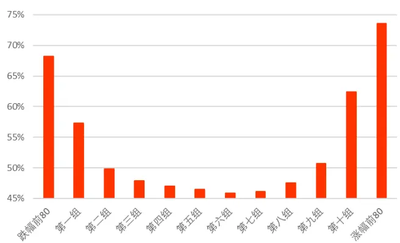
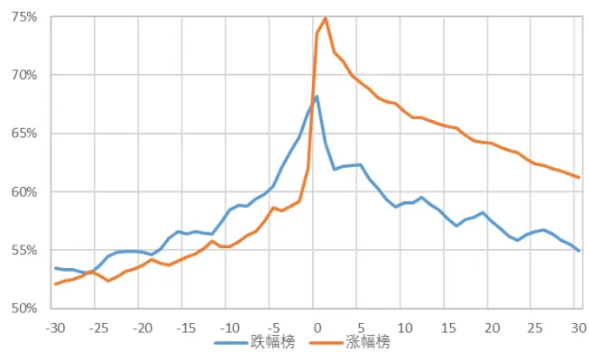
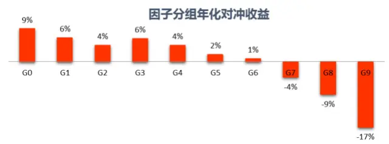
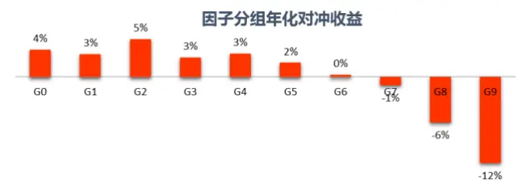
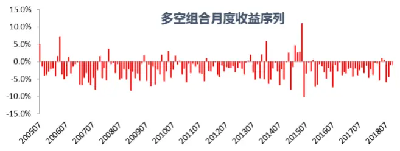
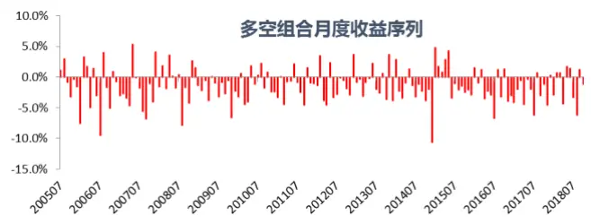
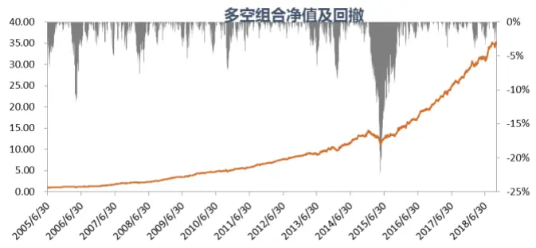
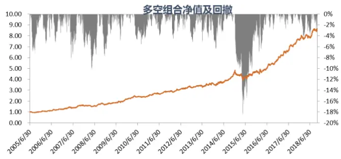
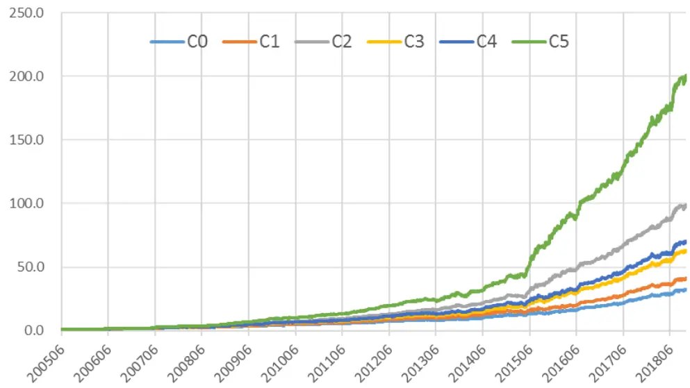

## Table_Sum ary 研究结论

- 由于时间和精力的有限性，投资者更倾向于交易自己关注的股票，涨跌幅排行榜上的股票更容易进入投资者视野，由于做空约束，这类股票更倾向于被买入，导致股价高估，未来收益率较低。

以搜狗指数作为代理变量，我们发现股票单日涨跌幅和关注度存在明显的 U型关系，只有涨幅或者跌幅特别靠前的股票才会有明显的关注度提升，而且涨幅榜的股票相对于跌幅榜更容易引起投资者关注。

- 构建榜单组合，我们发现上个月进入单日涨幅榜的股票在下个月明显跑输其他股票，而进入跌停榜的股票虽然也跑输但幅度更小。

我们通过指数加权方法构建了涨幅榜单因子 DWF 和跌幅榜单因子 DLF，具有十分显著的选股效果，其中中证全指内 DWF 的 RankIC 月均值达到9.24%，IC_IR 为 4.36，多空组合月度收益 2.29%，而且因子表现对因子构建的参数不敏感。

通过因子分层分析，我们发现涨幅榜单因子 DWF 可以解释日收益率的波动率、偏度、特质偏度、过去一个月最大收益等技术类 alpha因子的收益来源，而且通过回归控制常见技术类 alpha后依然有显著的选股能力。

通过相关性分析，我们发现涨幅榜单因子 和特异度 两者相关性较低，两者结合可以解释包括特质波动率 IVOL 在内的大多数投机类 alpha 因子的收益来源，再结合换手对数和短期反转，可以解释所有常见的技术类alpha 因子。

基于涨幅榜单因子 DWF和特异度 IVR 构建的投机类合成因子明显优于基于所有投机类指标合成的大类因子，再加上换手对数和反转构建的技术大类因子，明显优于所有技术类构建的大类因子。但实测下来对我们指数增强模型的改进有限，500全市场增强仅提升了 30个 bp且不显著，如果投资者比较看重技术类 alpha，可重点考虑该做法。

## 风险提示

- 量化模型失效风险

- 市场极端环境的冲击

技术类 alpha 因子表现（中证全指，200506-201810）

|  | 原始因子 |  |  | 行业市值中性化因子 |  |  |  |  |
| --- | --- | --- | --- | --- | --- | --- | --- | --- |
|  | RankIC | IC_IR t_value | IC | IC_IR | t_value多空月收益 | 夏普率 | 月胜率 | 最大回撤 |
| DWF | -9.44% | -3.29 | -12.01 -9.24% | -4.36 | -15.92 2.29% | 2.60 | 85.00% | -22.36% |
| DLF | -6.39% | -2.14 -7.81 | -5.83% | -2.49 | -9.10 1.39% | 1.69 | 69.38% | -18.64% |
| VOL | -5.98% | -1.30 -4.74 | -6.60% | -2.03 | -7.41 1.19% | 1.02 | 66.88% | -24.18% |
| SKEW | -4.24% | -1.69 -6.18 | -3.75% | -2.15 | -7.84 0.89% | 1.42 | 71.88% | -16.73% |
| IVR | -9.04% | -3.33 | -12.15 -8.77% | -4.39 | -16.02 2.63% | 3.26 | 86.88% | -5.71% |
| IVOL | -9.95% | -2.98 | -10.88 -10.10% | -4.23 | -15.46 2.55% | 2.94 | 79.38% | -10.87% |
| ISKEW | -1.86% | -1.24 | -4.51 -2.00% | -1.72 | -6.27 0.49% | 0.94 | 65.00% | -13.82% |
| MAXRET | -7.59% | -2.00 | -7.29 -8.10% | -3.10 | -11.31 | 1.75% 1.90 | 74.38% | -13.16% |
| LNTO | -7.61% | -1.58 | -5.78 | -9.54% -2.98 | -10.90 | 2.49% 1.92 | 71.88% | -23.36% |
| RET | -6.76% | -1.57 | -5.75 -7.41% | -2.42 | -8.83 | 2.13% 1.70 | 68.13% | -16.56% |

Table_ReportDate 报告发布日期2018 年 11 月 20 日

Table_Autho 证券分析师朱剑涛

021-63325888*6077

zhujiantao@orientsec.com.cn

执业证书编号：S0860515060001

王星星

021-63325888-6108

wangxingxing@orientsec.com.cn

执业证书编号：S0860517100001

Table_Contacter 联系人王星星

021-63325888-6108

wangxingxing@orientsec.com.cn

## Table_Report 相关报告

DFQ2018绩效归因与基金投资分析工具2018-10-26基于 copula的尾部相关性研究：上尾异常2018-10-23相关系数因子

东方 A股因子风险模型（DFQ-2018）2018-09-02

## 一、有限关注与收益排行榜

## 研究现状

由于时间和精力的有限性，投资者尤其个人投资者不可能详细研究全市场所有的股票后再交易股票，更常见的情况是投资者在自己关注的股票池中交易。由于做空约束，大多数投资者可以买入任一只想买的股票，但卖出的股票却限定在自己已经持仓股票股票中，由于这种非对称性关注度高的股票被高估，从而未来的收益平均更低。有限关注理论研究的难点在于关注度代理变量的选取，Barber and Odean (2007)采用新闻覆盖、股票异常换手和异常收益代理投资者关注度，发现关注度高的股票主要被个人投资者净买入，后续由于个人投资者的卖出持续跑输市场。Da, Engelberg,and Gao (2011)采用谷歌趋势指数作为关注度的度量，发现关注度的提升在短期（两个星期内）会推高股价，但之后股价会迎来持续的反转。俞庆进和张兵. (2012)、Shen、Zhang 等（2017）用百度指数作为代理变量研究市场关注度对 A 股股票的影响时并没有发现关注度提升只推高的同期的股票价格，后期价格立即回调，和美股的谷歌趋势指数表现出差异，Shen、Zhang 等（2017）等认为主要原因是美股以机构投资者为主，交易金额较大，建仓需要持续一段时间，而 A 股绝大多数交易是散户贡献，关注度的提升当天就可以反映在价格中。

任何行情软件、财经网站上都有各种股票收益率的排行榜，涨幅榜、跌幅榜上的股票更有可能进入投资者的视野，股票的关注度更高。Wang（2017）近期关于涨跌停板的排行研究特别有意思，同是涨停的股票由于股价四舍五入导致的排名差异，会对股票后期的交易特征有明显影响，排名更显眼的股票后期波动更大、成交更活跃，次日收益更高，但后期收益更低。Kumar, Ruenzi,and Ungeheuer (2018) 对日度收益率排行榜做了比较系统的研究，结果发现日收益率涨幅榜和跌幅榜的股票主要被个人投资者净买入，在未来大幅跑输没有上榜的股票，而且部分解释了特质波动率的超额收益率来源。

## 收益率与关注度的关系

到底取多少只股票（记为 N）作为涨幅榜或者跌幅榜上的股票，直观感觉一般前 20左右的股票比较引人注意，但考虑到投资者可能会在不同榜单内（比如上交所、深交所、创业板等）查看股票排行，也有可能在交易时间查看排行，所以为了更好的涵盖榜单内的股票，这里的 N 取值应该大于 20，但取值太大就会纳入太多不可能进入排行榜的股票，这里的 N涉及一个取舍问题，将是模型的一个重要参数，我们这里暂时沿用 Kumar, Ruenzi, and Ungeheuer (2018)的做法，取 N=80，下文再研究 N 的稳健性。

为了进一步直观表示日度收益率和投资者关注度的关系，我们采用采用搜狗指数作为关注度的代理变量，研究不同日收益率分组股票的关注度（理论上讲百度作为国内最大的搜索引擎公司，百度指数作为关注度的代理变量更合理，但考虑到百度指数的使用需要授权，我们退而求其次，采用搜狗指数，数据起始于 20160101）。投资者需要了解某只股票信息，可能搜索代码也可能股票简称，但考虑到部分股票简称具有多重含义，比如用户搜索“中国银行”可能是关注“中国银行”这只股票也有可能是要去中国银行办理业务、或者工作应聘等，而用户搜索“601988”大概率就是想了解“中国银行”这只股票，所以我们采用股票代码的搜索指数作为其关注度的代理变量，我们统计了各个交易日股票收益率分组的搜狗指数平均分位数的情况（第一组为全市场收益率最低的 10%股票，第十组最高）。分析图 1-图 2，我们发现：

（1）虽然各个收益率分组的关注度呈 U型结构，但第二组至第九组的关注度差异不大，主要两端的关注度比较高，第一组和和第十组关注度较高也主要是排行榜上的股票贡献；

（2）涨幅榜单上的股票关注度更高，更容易吸引投资者注意；

（3）无论涨幅榜还是跌幅榜，股票上榜后的高关注度会维持一段时间，而且跌幅榜上的股票在上榜前的关注度已经较高，而涨幅榜上的估值之前相对比较低调。

图 1：不同日涨跌幅分组的关注度

注：各组关注度为组内股票搜狗指数分位数的均值
数据来源：搜狗指数、东方证券研究所

图 2：涨/跌幅榜前后的市场关注度

注：各组关注度为组内股票搜狗指数分位数的均值
数据来源：搜狗指数、东方证券研究所

最后，需要说明的是，同样是投资者的关注度可能对股价的影响会有所不同，虽然大多数研究成果显示高关注度的股票后期收益更大，但也不是全部，比如券商分析师覆盖较多的股票就存在超额收益，因此，虽然存在互联网搜索指数等较直接的关注度代理变量，像涨跌幅排行榜这种结构性的关注度研究也是很有必要的，

## 二、榜单股票的收益分析

## 榜单组合表现

为了验证榜单股票的相对表现，我们首先参考 Kumar, Ruenzi, and Ungeheuer (2018)的做法，根据上个月股票的榜单情况，构建如下 4个组合，观测组合的相对表现：

（1）Never：上一个月即没在涨幅榜上出现过、也没在跌幅榜上出现过的股票；

（2）Winner：上个月在涨幅榜上至少出现过一次，但没有在跌幅榜上出现过；

（3）Loser：上个月在跌幅榜上至少出现过一次，但没有在涨幅榜上出现过；

（4）Both：上个月在涨跌幅榜上都出现过的股票；

各个组合的股票数量占比和市值占比相差不大，说明排行榜上的股票市场偏好并不明显，比较各个组合的相对收益，我们发现涨幅榜上的股票大幅显著跑输未上榜的股票，而跌幅榜上的股票（剔除涨幅榜上的股票）虽然也跑输未上榜的股票，但这种差异并不显著。涨幅榜上的股票未来表现更差可能有两方面的原因，一是涨幅榜上的股票更吸引投资者关注，关注度更高，另一方面同样受到关注，个人投资者可能更倾向于买入涨幅榜上的股票，而且更容易高估。

图 3：榜单组合表现（200506-201810）

| 股票数量占比 股票市值占比 |  |  |  |  |  |  |
| --- | --- | --- | --- | --- | --- | --- |
| Never | 40.1% | 45.2% | 月均收益 2.50% | 月收益t值 3.07 | 月胜率 59.0% | 夏普比 月最大回测 84.0% -63.8% |
| Winner | 16.9% | 15.0% | 1.62% | 1.94 | 55.3% 53.1% | -68.6% |
| Loser | 16.4% | 18.2% | 2.28% | 2.71 56.5% | 74.3% | -66.8% |
| Both | 26.7% | 21.6% | 1.18% 1.39 | 54.7% | 37.9% | -74.0% |
| Never-Winner |  |  | 0.88% 6.42 | 72.7% | 175.8% | -7.8% |
| Never-Loser |  |  | 0.22% | 1.63 | 55.9% 44.7% | -10.2% |
| Never-Both |  |  | 1.32% | 7.35 | 73.3% 201.4% | -6.8% |

数据来源：Wind、东方证券研究所

## 涨跌幅榜单因子

根据股票上个月是否纳入涨/跌幅榜单或者纳入涨/跌幅榜单的次数可以构建组合，但直接作为alpha因子并不妥当，一方面，因子取值过于离散，大多数股票取值都以为零，另一方面，并没有考虑时间维度的差异，昨天的涨幅榜和一个月前的涨幅榜对投资者的意义一定不会一样。为了解决这两个问题，我们采用指数加权的方法的构建榜单因子，方法如下：

$$
DWF_{i,t}=\frac{1-(1-a)^{N}}{\alpha}\cdot\sum_{l=0}^{N-1}(1-\alpha)^{l}\cdot I_{i,t-l}^{W}
$$

其中， $DWF_{i,t}$ 表示股票 i 在交易日 t 的涨幅榜单因子（DWF，daily winner factor）， $I_{i,t-l}^{W}$ 表示股票 i 在交易日 t-l 是否进入涨幅榜的虚拟变量，进入涨幅榜取 1，否则取 0，α表示指数权重的参数，α取值越大，近期的权重越大，α并不直观，也可以通过ℎ = ln0.5⁄ln(1−α)将α转换为半衰期h 来描述，历史上 N 应该取无穷大，但现实中不大可能实现，但只要 N 取值足够大对指数加权结果影响微乎其微。由于技术类因子大多以一个月一个计算周期，为保持一致，本文默认指数加权半衰期 h=10（意味着最近半个月的权重达到 1/2），这里 N我们取 120。

类似的，我们也可以计算跌幅榜单因子（DLF，daily loserfactor），考虑到 DWF 和 DLF分布均严重右偏，我们在因子数据处理时均取根号处理。

我们从传统的 RankIC 和多空组合两个维度考察 DWF 和 DLF 因子选股的有效性，两个因子在各个样本空间的表现如图 4所示，数据起始时间 200506-201810。

对比不同样本空间的表现，无论是涨幅榜单因子 DWF 还是跌幅榜单因子 DLF，小市值样本空间的表现要优于大市值样本空间，表现为中证 1000内选股效果最高，中证 500其次，沪深 300最差。另外，无论哪个样本空间，涨跌榜单因子 DWF 的表现均优于跌幅榜单因子 DLF。从绝对水平来看，涨幅榜单因子 DWF在中证全指内 RankIC高度 9.44%，原始值的 IC_IR也达到 3.29，行业市值中性化的选股因子多空组合月收益到的 2.29%，夏普比 2.60，选股效果在单因子中比较优异，和特质波动率、特异度在同一个水平。

图 4：涨跌幅榜单因子在各个样本空间的表现（200506-201810）
涨幅榜单因子 DWF：

|  | 原始因子 |  | 行业市值中性化因子 |  |  |  |  |  |  |
| --- | --- | --- | --- | --- | --- | --- | --- | --- | --- |
|  | RankIC IC_IR | t_value | IC | IC_IR | t_value | 多空月收益 | 夏普率 | 月胜率 | 最大回撤 |
| 中证全指 | -9.44% -3.29 | -12.01 | -9.24% | -4.36 | -15.92 | 2.29% | 2.60 | 85.00% | -22.36% |
| 沪深300 | -5.72% -1.38 | -5.03 | -5.30% | -2.09 | -7.63 | 1.55% | 1.66 | 65.00% | -18.16% |
| 中证500 | -9.11% -2.96 | -10.82 | -7.70% | -3.62 | -13.23 | 1.71% | 1.99 | 76.88% | -14.09% |
| 中证800 | -7.73% -2.44 | -8.92 | -7.07% | -3.32 | -12.14 | 1.67% | 2.00 | 76.88% | -14.97% |
| 中证1000 | -11.40% -3.68 | -13.43 | -9.63% | -3.70 | -13.50 | 2.24% | 1.99 | 78.13% | -18.54% |

跌幅榜单因子 DLF

|  | 原始因子 |  | 行业市值中性化因子 |  |  |  |  |  |  |
| --- | --- | --- | --- | --- | --- | --- | --- | --- | --- |
|  | RankIC IC_IR | t_value | IC | IC_IR | t_value | 多空月收益 | 夏普率 | 月胜率 | 最大回撤 |
| 中证全指 | -6.39% | -2.14 -7.81 | -5.83% | -2.49 | -9.10 | 1.39% | 1.69 | 69.38% | -18.64% |
| 沪深300 | -3.06% | -0.78 -2.86 |  | -2.71%-1.11 | -4.06 | 0.80% | 0.83 | 62.50% | -19.44% |
| 中证500 | -6.25% | -2.04 -7.44 |  | -4.89%-2.12 | -7.72 | 1.36% | 1.56 | 65.00% | -12.90% |
| 中证800 | -5.13% | -1.69 -6.18 |  | -4.15%-1.83 | -6.69 | 1.14% | 1.38 | 64.38% | -12.79% |
| 中证1000 | -7.26% | -2.10 -7.66 |  | -6.27%-2.27 | -8.30 | 1.47% | 1.29 | 68.13% | -14.90% |

数据来源：Wind、东方证券研究所

从时间序列上看，无论是涨幅榜单因子 DWF 还是跌幅榜单因子 DLF 在 2015 年 1 月中旬至2015年 5月底持续了 4个多月的回撤，回撤幅度深达 20%左右，这段时间正是牛市高峰期，市场情绪异常高涨，热门股票持续走高，相应的涨跌幅榜单上的股票关注度更高，散户持续不断的买入，而关注度低的股票弹性更小，涨幅不如榜单上的股票，导致期间两个榜单因子持续回撤。

图 5：涨幅榜单因子的历史表现（中证全指，行业市值中性化）

图 6：跌幅榜单因子的历史表现（中证全指，行业市值中性化）

数据来源：Wind、东方证券研究所

数据来源：Wind、东方证券研究所

## 结果稳健性分析

涨幅榜单因子 DWF和跌幅榜单因子 DLF在计算过程中均涉及到两个重要的参数，一是涨跌幅榜单的确认，到底排名前多少名的股票才算是榜单，本文默认取值 N=80只，和 Kumar, Ruenzi,and Ungeheuer (2018)保持一致；另一个参数是指数加权算法的半衰期，本文为了和月度计算的技术类因子保持一致，取值 h=10个交易日。本小节计算了 N取值 60、80、100，h取值 5、10、20、40共 3*4=12中情形下的因子表现，结果如图 7、图 8所示。

对比不同参数下的因子表现，我们发现在加权半衰期一定时，N=100的因子选股效果略好与N=80的结果，N=80略好于 N=60，但三者的差异总体不是很大，这说明我们结果对榜单的判别参数 N 并不敏感，而且我们也不是过于数据挖掘，我们的取值 N=80 也不是基于历史数据挖掘的结果。另外，指标计算时加权的半衰期取值越短，因子的 IC_IR 和多空组合收益越高，但这种收益提升代价就是因子换手率的提升，投资者在计算因子是可以根据自己的需求合理选择适合的半衰期。

图 7：不同参数下的涨幅榜单因子 DWF表现（中证全指）排行榜参数 N=60：

|  | 原始因子 |  |  | 行业市值中性化因子 |  |  |  |  |  |  |
| --- | --- | --- | --- | --- | --- | --- | --- | --- | --- | --- |
|  | RankIC | IC_IR | t_value | IC | IC_IR t_value |  | 多空月收益 | 夏普率 | 月胜率 | 最大回撤 |
| h=5 | -8.46% | -3.27 | -11.94 | -8.20% | -4.77 | -17.43 | 2.35% | 2.85 | 82.50% | -18.29% |
| h=10 | -8.66% | -3.15 | -11.51 | -8.50% | -4.33 | -15.83 | 2.28% | 2.86 | 82.50% | -17.19% |
| h=20 | -8.57% | -2.85 | -10.42 | -8.39% | -3.77 | -13.78 | 2.10% | 2.43 | 75.63% | -21.40% |
| h=40 | -8.06% | -2.50 | -9.14 | -7.92% | -3.32 | -12.11 | 1.79% | 1.98 | 70.00% | -27.59% |

图 8：不同参数下的跌幅榜单因子 DLF表现（中证全指）排行榜参数 N=60：

|  | 原始因子 |  |  | 行业市值中性化因子 |  |  |  |  |  |  |
| --- | --- | --- | --- | --- | --- | --- | --- | --- | --- | --- |
|  | RankIC | IC_IR | t_value | IC | IC_IR t_value |  | 多空月收益 | 夏普率 | 月胜率 | 最大回撤 |
| h=5 | -5.84% | -2.08 | -7.59 | -5.04% | -2.68 | -9.80 | 1.35% | 1.95 | 72.50% | -16.78% |
| h=10 | -5.97% | -2.05 | -7.48 | -5.48% | -2.50 | -9.13 | 1.37% | 1.76 | 73.75% | -19.29% |
| h=20 | -5.91% | -1.92 | -7.00 | -5.57% | -2.27 | -8.28 | 1.30% | 1.47 | 67.50% | -22.19% |
| h=40 | -5.65% | -1.75 | -6.37 | -5.38% | -2.07 | -7.57 | 1.13% | 1.17 | 65.63% | -26.15% |

排行榜参数 N=80：

|  | 原始因子 |  |  | 行业市值中性化因子 |  |  |  |  |  |  |
| --- | --- | --- | --- | --- | --- | --- | --- | --- | --- | --- |
|  | RankIC | IC_IR | t_value | IC | IC_IR t_value |  | 多空月收益 | 夏普率 | 月胜率 | 最大回撤 |
| h=5 | -9.18% | -3.44 | -12.55 | -8.96% | -4.85 | -17.72 | 2.39% | 2.90 | 86.25% | -19.27% |
| h=10 | -9.44% | -3.29 | -12.01 | -9.24% | -4.36 | -15.92 | 2.29% | 2.60 | 85.00% | -22.36% |
| h=20 | -9.26% | -2.93 | -10.71 | -9.04% | -3.81 | -13.91 | 2.05% | 2.17 | 73.75% | -23.83% |
| h=40 | -8.58% | -2.53 | -9.24 | -8.38% | -3.30 | -12.03 | 1.84% | 1.88 | 71.25% | -25.44% |

排行榜参数 N=100：

排行榜参数 N=80：

|  | 原始因子 |  |  | 行业市值中性化因子 |  |  |  |  |  |  |
| --- | --- | --- | --- | --- | --- | --- | --- | --- | --- | --- |
|  | RankIC | IC_IR | t_value | IC | IC_IR | t_value | 多空月收益 | 夏普率 | 月胜率 | 最大回撤 |
| h=5 | -6.27% | -2.21 | -8.06 | -5.44% | -2.69 | -9.81 | 1.36% | 1.91 | 73.75% | -17.02% |
| h=10 | -6.39% | -2.14 | -7.81 | -5.83% | -2.49 | -9.10 | 1.39% | 1.69 | 69.38% | -18.64% |
| h=20 | -6.26% | -1.96 | -7.15 | -5.86% | -2.26 | -8.24 | 1.31% | 1.40 | 64.38% | -23.74% |
| h=40 | -5.93% | -1.76 | -6.42 | -5.62% | -2.05 | -7.50 | 1.22% | 1.26 | 64.38% | -24.31% |

|  | 原始因子 |  |  | 行业市值中性化因子 |  |  |  |  |  |  |
| --- | --- | --- | --- | --- | --- | --- | --- | --- | --- | --- |
|  | RankIC | IC_IR | t_value | IC | IC_IR | t_value | 多空月收益 | 夏普率 | 月胜率 | 最大回撤 |
| h=5 | -9.67% | -3.54 | -12.94 | -9.43% | -4.83 | -17.63 | 2.47% | 3.03 | 89.38% | -23.75% |
| h=10 | -9.92% | -3.35 | -12.24 | -9.69% | -4.37 | -15.94 | 2.43% | 2.66 | 83.75% | -24.30% |
| h=20 | -9.63% | -2.94 | -10.75 | -9.37% | -3.79 | -13.84 | 2.15% | 2.19 | 74.38% | -24.22% |
| h=40 | -8.82% | -2.51 | -9.17 | -8.56% | -3.24 | -11.83 | 1.94% | 1.96 | 71.88% | -26.73% |

数据来源：Wind、东方证券研究所

排行榜参数 N=100：

|  | 原始因子 |  |  | 行业市值中性化因子 |  |  |  |  |  |  |
| --- | --- | --- | --- | --- | --- | --- | --- | --- | --- | --- |
|  | RankIC | IC_IR | t_value | IC | IC_IR | t_value | 多空月收益 | 夏普率 | 月胜率 | 最大回撤 |
| h=5 | -6.46% | -2.25 | -8.22 | -5.64% | -2.63 | -9.61 | 1.44% | 1.98 | 72.50% | -15.07% |
| h=10 | -6.61% | -2.16 | -7.90 | -5.98% | -2.44 | -8.92 | 1.23% | 1.41 | 66.25% | -23.52% |
| h=20 | -6.43% | -1.95 | -7.12 | -5.96% | -2.21 | -8.05 | 1.17% | 1.20 | 62.50% | -27.04% |
| h=40 | -6.04% | -1.74 | -6.34 | -5.66% | -2.00 | -7.29 | 1.13% | 1.12 | 62.50% | -27.66% |

数据来源：Wind、东方证券研究所

## 三、与技术类因子的关系

## 因子说明与表现

涨跌幅榜单因子基于过去的价格特征构建，不可避免会和其他技术类指标高度相关，比如波动较大的股票更有可能出现在涨跌幅榜单上，本章主要目标就是考察涨跌幅榜单因子和其他技术类因子的相关关系。本章考察的技术类因子列表如图 9 所示，因子在中证全指内的选股表现如图10 所示。

从因子表现来看，我们选取的技术类 alpha 因子在中证全指内均有显著的选股效果，其中从ICIR 和多空组合的收益来看，单因子表现相对更好的几个 alpha因子是涨幅榜单因子 DWF、特异度 IVR和特质波动率 IVOL，换手对数 LNTO原始值受市值因子，在剔除行业市值后明显变强。另外，一个比较有意思的现象是，特质波动率 IVOL表现明显优于波动率 VOL，但特质偏度 ISKEW的选股表现明显弱于原始收益率的偏度 SKEW，一种可能的原因是特质波动率IVOL = VOL∙√IVR，可以拆解为原始波动率 VOL 和特异度 IVR 的非线性叠加，IVOL 之所以表现更好有特异度 IVR 的贡献，而特质偏度 ISKEW 并不存在这种结构。

图 9：技术类因子列表

| 因子代码 因子说明 |  |
| --- | --- |
| DWF | 涨幅榜单因子，N=80，h=10 |
| DLF | 跌幅榜单因子，N=80，h=10 |
| VOL | 基于过去一个月日收益率数据计算的波动率 |
| SKEW | 基于过去一个月日收益率数据计算的偏度 |
| IVR | 基于过去一个月日收益率计算的特异度，1-FF三因子回归方程的R2 |
| IVOL | 基于过去一个月FF三因子残差收益率计算的特质波动率 |
| ISKEW | 基于过去一个月FF三因子残差收益率计算的特质偏度 |
| MAXRET | 过去一个月最大的三个日收益率的均值 |
| LNTO | 过去一个月日均换手的对数 |
| RET | 过去一个月的收益率 |

数据来源：东方证券研究所

图 10：技术类因子表现（中证全指，200506-201810）

|  | 原始因子 |  |  | 行业市值中性化因子 |  |  |  |  |  |
| --- | --- | --- | --- | --- | --- | --- | --- | --- | --- |
|  | RankIC | IC_IR | t_value | IC IC_IR | t_value 多空月收益 |  | 夏普率 | 月胜率 | 最大回撤 |
| DWF | -9.44% | -3.29 | -12.01 | -9.24% -4.36 | -15.92 | 2.29% | 2.60 | 85.00% | -22.36% |
| DLF | -6.39% | -2.14 | -7.81 | -5.83% -2.49 | -9.10 | 1.39% | 1.69 | 69.38% | -18.64% |
| VOL | -5.98% | -1.30 | -4.74 | -6.60% -2.03 | -7.41 | 1.19% | 1.02 | 66.88% | -24.18% |
| SKEW | -4.24% | -1.69 | -6.18 | -3.75% -2.15 | -7.84 | 0.89% | 1.42 | 71.88% | -16.73% |
| IVR | -9.04% | -3.33 | -12.15 | -8.77% | -4.39 -16.02 | 2.63% | 3.26 | 86.88% | -5.71% |
| IVOL | -9.95% | -2.98 | -10.88 | -10.10% | -4.23 -15.46 | 2.55% | 2.94 | 79.38% | -10.87% |
| ISKEW | -1.86% | -1.24 | -4.51 | -2.00% | -1.72 -6.27 | 0.49% | 0.94 | 65.00% | -13.82% |
| MAXRET | -7.59% | -2.00 | -7.29 | -8.10% | -3.10 -11.31 | 1.75% | 1.90 | 74.38% | -13.16% |
| LNTO | -7.61% | -1.58 | -5.78 | -9.54% | -2.98 -10.90 | 2.49% | 1.92 | 71.88% | -23.36% |
| RET | -6.76% | -1.57 | -5.75 | -7.41% | -2.42 -8.83 | 2.13% | 1.70 | 68.13% | -16.56% |

数据来源：Wind、东方证券研究所

## 两两相关性

我们首先计算了各个技术类 alpha 因子的因子值秩相关系数，和因子在中证全指内 RankIC的时序秩相关系数（图 11）。分析相关性矩阵，我们不难发现：

（1）涨幅榜单因子 DWF、跌幅榜单因子 DLF、波动率 VOL、特质波动率 IVOL、最大收益MAXRET 这五个因子两两高度相关，这一点无论是从因子取值还是 RankIC 的相关系数，无论因子原始值还是行业市值中性化取值均可以看出。这五个因子可以统一理解为“广义价格波动”，差异在于通过极值度量还是通过二阶矩度量。

（2）特异度因子 IVR除了和特质波动率 IVOL的因子取值高度相关外，和其他因子相关性较大，度量上和因子表现上都相对独立。

（3）换手率和“广义价格波动”类指标相关性较高，高波动一般也伴随着高换手。

（4）价格反转指标也是一个度量的 alpha维度，因子取值和其他技术类指标相关性很低，因子表现除了和特异度相关性较高，和其他 alpha因子相关性也很低。

图 11：技术类因子秩相关系数（左下因子取值，右上 RankIC，200506-201810）
因子原始值：

| DWF |  | DLF VOL |  | SKEW IVR |  | IVOL ISKEW MAXRET LNTO |  |  |  | RET |
| --- | --- | --- | --- | --- | --- | --- | --- | --- | --- | --- |
| DWF |  | 0.706 | 0.800 | 0.256 | 0.264 | 0.904 | 0.063 | 0.888 | 0.655 | 0.254 |
| DLF | 0.436 |  | 0.787 | 0.064 | 0.126 | 0.807 | -0.163 | 0.630 | 0.607 | -0.245 |
| VOL | 0.635 | 0.498 |  | -0.012 | -0.133 | 0.836 | 0.126 | 0.864 | 0.860 | -0.082 |
| SKEW | 0.326 | 0.077 | 0.227 |  | 0.435 | 0.146 | 0.092 | 0.285 | -0.174 | 0.373 |
| IVR | 0.428 | 0.355 | 0.230 | 0.323 |  | 0.339 | -0.218 | 0.113 | -0.165 | 0.478 |
| IVOL | 0.694 | 0.550 | 0.797 | 0.332 | 0.716 |  | 0.001 | 0.846 | 0.698 | 0.145 |
| ISKEW | 0.213 | -0.126 | 0.142 | 0.364 | 0.145 | 0.184 |  | 0.173 | 0.173 | 0.134 |
| MAXRET | 0.671 | 0.359 | 0.844 | 0.522 | 0.351 | 0.779 | 0.264 |  | 0.725 | 0.298 |
| LNTO | 0.428 | 0.352 | 0.592 | 0.075 | 0.210 | 0.526 | 0.047 | 0.502 |  | -0.046 |
| RET | 0.321 | -0.068 | 0.202 | 0.279 | 0.304 | 0.323 | 0.161 | 0.519 | 0.158 |  |

行业市值调整值：

| DWF |  | DLF VOL |  | SKEW | IVR | IVOL ISKEW MAXRET LNTO |  |  |  | RET |
| --- | --- | --- | --- | --- | --- | --- | --- | --- | --- | --- |
| DWF |  | 0.738 | 0.785 | 0.377 | 0.390 | 0.896 | 0.109 | 0.871 | 0.715 | 0.234 |
| DLF | 0.416 |  | 0.793 | 0.238 | 0.275 | 0.831 | -0.123 | 0.666 | 0.663 | -0.219 |
| VOL | 0.625 | 0.487 |  | 0.196 | 0.007 | 0.818 | 0.135 | 0.879 | 0.876 | -0.113 |
| SKEW | 0.337 | 0.075 | 0.252 |  | 0.448 | 0.334 | 0.234 | 0.418 | 0.141 | 0.290 |
| IVR | 0.435 | 0.360 | 0.257 | 0.325 |  | 0.491 | -0.152 | 0.240 | -0.018 | 0.480 |
| IVOL | 0.685 | 0.540 | 0.794 | 0.350 | 0.732 |  | 0.004 | 0.843 | 0.717 | 0.142 |
| ISKEW | 0.221 | -0.126 | 0.148 | 0.382 | 0.151 | 0.191 |  | 0.209 | 0.134 | 0.178 |
| MAXRET | 0.664 | 0.343 | 0.840 | 0.540 | 0.367 | 0.774 | 0.275 |  | 0.807 | 0.259 |
| LNTO | 0.411 | 0.342 | 0.554 | 0.116 | 0.233 | 0.504 | 0.039 | 0.479 |  | -0.020 |
| RET | 0.333 | -0.063 | 0.214 | 0.265 | 0.299 | 0.330 | 0.162 | 0.523 | 0.164 |  |

数据来源：Wind、东方证券研究所

## 因子分层

为了考察因子两两之间之间的相互替代作用，我们采用因子分层的方法，具体做法如下：

（1）根据分层因子把样本空间（本文取中证全指）的股票等数量的分成 10层；

（2）在每一层内再根据考察因子将股票再分为 10组，汇总每一层内的 top组股票、bot组股票等权构建 top 组合、bot 组合考察，做多 top 做空 bot 的多空组合月均收益及其显著性；

（3）观测按特定因子分层后观测因子多空组合是否有显著的异常收益，和不分层的结果进行比较，考察控制分层因子后对考察因子选股效果的影响。

我们计算了技术类因子两两分层后的多空月均收益及其显著性（图 12），分析分析结果，我们发现：

（1）在控制涨幅榜单因子 DWF后，原始波动 VOL和最大收益 MAXRET失效（最大收益因子原始值失效，中性值在 10%显著度下显著，在 5%置信度下不显著，而且多空月均收益从 1.76%大幅回落至 0.38%，故我们也认为其失效）。这意外着 VOL 和 MAXRET 的选股效果同样源于涨幅榜单的关注度效应，但是由于度量方法的不同，导致 VOL和 MAXRET表现总体弱于 DWF。

（2）两个偏度因子 SKEW和 ISKEW在控制涨幅榜单因子 DWF或者特异度 IVR后均失效，两个偏度因子总体表现偏弱，在控制强技术类因子后几乎没有选股效果。

（3）特质波动率同时涵盖“广义波动”和特异度两方面的信息，在控制任一单一维度下依然具有选股能力，这一点从行业市值调整值的分层结果下可以看出。

（4）涨幅榜单因子 DWF 和特异度信息相对独立，在控制任何其他因子后多空组合均有十分显著的异常收益。

（5）换手对数和反转因子原始值的选股效果受风格影响可能被其他信息替代，但行业市场调整后换手和反转的选股信息也相对独立。

（6）跌幅榜单因子 DLF在单独控制涨幅榜单因子 DWF、特异度 IVR或者特质波动率 IVOL后多空月收益均出现大幅回调，但任一单一因子很难完全解释其 alpha来源。

图 12：技术类因子两两分层多空月均收益及其显著性
因子原始值：

|  | DWF | DLF | VOL | SKEW | IVR | IVOL | ISKEW | MAXRET | LNTO | RET |
| --- | --- | --- | --- | --- | --- | --- | --- | --- | --- | --- |
| 不分层 | -1.90* | -1.51*** | -0.86** | -0.96*** | -2.59*** | -2.19*** | -0.36** | -1.18* | -1.61* | -1.80*** |
| DWF | -0.25 | -0.81* **★ | 0.54 | -0.24 | -1.75* *** | -0.94*** | -0.03 | -0.02 | -0.82* | -0.75* |
| DLF | -1.36* | -0.32*** | -0.26 | -0.87*** | -2.11 *** | -1.63* | -0.51*** | -0.80** | -1.19*** | -1.78*** |
| VOL | -1.64* | -1.16*** | -0.11 | -0.46* | -2.24*** | -2.15*** | -0.24 | -1.02*** | -1.51* | -1.02** |
| SKEW | -1.70* | -1.50*** | -0.76* | -0.18* | -2.17*** | -2.06*** | 0.01 | -1.04*** | -1.65*** | -1.45*** |
| IVR | -0.88* | -0.69** | -0.26 | -0.17 | -0.15 | -0.34 | -0.02 | -0.51 | -1.16** | -1.00** |
| IVOL | -0.69 | -0.50** | 1.37*** | -0.19 | -1.44*** | -0.1 | -0.05 | 0.55* | -0.66 | -0.72 |
| ISKEW | -1.89* | -1.54*** | -0.78* | -0.69*** | -2.45*** | -2.12*** | -0.08 | -1.20*** | -1.57*** | -1.68*** |
| MAXRET | -1.21* | -1.02*** | 0.61 | -0.14 | -2.07** | -1.53*** | -0.04 | -0.17* | -1.08*** | -0.79* |
| LNTO | -1.06* | -0.83*** | 0.27 | -0.80*** | -2.05*** | -1.27*** | -0.33** | -0.50* | -0.35*** | -1.14*** |
| RET | -1.33*** | -1.56*** | -0.59 | -0.79*** | -1.90*** | -1.67*** | -0.29** | -0.69** | -1.51*** | -0.15 |

行业市值调整值：

|  | DWF | DLF | VOL | SKEW | IVR | IVOL | ISKEW | MAXRET | LNTO | RET |
| --- | --- | --- | --- | --- | --- | --- | --- | --- | --- | --- |
| 不分层 | -2.25* | -1.38* | -1.17*** | -0.90* | -2.57 | -2.51 | -0.48* | -1.76* | -2.41 | -2.08* |
| DWF | -0.40* | -0.61* | 0.14 | -0.15 | -1.61*** | -1.19* ★安膏 | 0 | -0.38* | -1.60** | -1.04 |
| DLF | -1.76*** | -0.24** | -0.71*** | -0.74*** | -2.06*** | -2.05*** | -0.59*** | -1.35*** | -2.11*** | -2.10*** |
| VOL | -1.65*** | -0.89*** | -0.16 | -0.37** | -2.13*** | -2.34*** | -0.22 | -1.20*** | -2.10*** | -1.49*** |
| SKEW | -2.06*** | -1.37*** | -1.07*** | -0.06 | -2.17*** | -2.27*** | -0.01 | -1.60*** | -2.32*** | -1.81* ★实商 |
| IVR | -1.23*** | -0.52** | -0.68** | -0.07 | -0.47*** | -0.93*** | -0.09 | -0.95*** | -1.96*** | -1.49*** |
| IVOL | -0.67*** | -0.13 | 1.10*** | 0.05 | -1.10*** | -0.35*** | 0.06 | 0.08 | -1.46*** | -1.04*** |
| ISKEW | -2.23* | -1.40*** | -1.14*** | -0.65*** | -2.45** | -2.36*** | -0.02 | -1.74*** | -2.30*** | -2.03* |
| MAXRET | -1.19*** | -0.74*** | 0.56* | 0.15 | -1.89*** | -1.55*** | 0.02 | -0.15 | -1.80*** | -1.03*** |
| LNTO | -1.22*** | -0.47*** | 0.15 | -0.60*** | -1.92*** | -1.31*** | -0.40** | -0.69*** | -0.45*** | -1.50*** |
| RET | -1.41*** | -1.44*** | -0.74** | -0.63*** | -1.88*** | -1.84*** | -0.36*** | -0.83** | -2.10*** | -0.17 |

注：*表示 1%置信度下显著，**表示 5%置信度下显著、***表示 1%置信度下显著
数据来源：Wind、东方证券研究所

## 回归分析

因子分层的方法虽然即直观又能剔除非线性的影响，但考察两个因子间的相关关系尚可，但涉及到的因子较多时变捉襟见肘。本小节通过横截面回归的方法剔除其他因子的影响考察因子选股效果的独立性。

前文的分层结果显示，在控制涨幅榜单因子 DWF 后波动率 VOL、偏度 SKEW、特质偏度ISKEW 和最大收益 MAXRET 的选股效果不显著，意味着 DWF 涵盖了其他因子的信息，那么 DWF是否仅仅是这几个因子信息的简单叠加，能否提供额外信息，为了研究这个问题，我们考察了 DWF因子在剔除下列几组 alpha因子后的残差表现：

S0：DWF 可以解释的因子，即 VOL、SKEW、ISKEW、MAXRET

S1：除 DWF、DLF 外的其他所有技术类因子

S2：东方金工团队现有的各大类 alpha 因子

从结果来看（图 13），涨幅榜单因子 DWF 在剔除 S0 后原始值的 RankIC 依然高达 5.17%，多空组合也表现优异，说明 DWF 虽然可以解释 S0组因子，但在 VOL、SKEW、ISKEW、MAXRET之外依然有很有显著的超额收益信息。在剔除其他所有常见的技术类alpha因子S1后虽然RankIC、多空组合表现有所回落，但依然有显著的超额收益，对现有的技术类 alpha 因子有显著的信息增量。最后，在剔除东方现有的各大类 alpha 因子 S2 后选股效果依然显著，而且和剔除 S1 后的结果相差不大，说明 DWF 相对其他技术类 alpha 因子的信息增量并不是来源于其他大类因子。

图 13：DWF回归剔除其他因子前后的选股表现（中证全指，200506-201810）

|  | 原始因子 |  |  | 行业市值中性化因子 |  |  |  |  |  |  |
| --- | --- | --- | --- | --- | --- | --- | --- | --- | --- | --- |
|  | RankIC | IC_IR | t_value | IC | IC_IR | t_value | 多空月收益 | 夏普率 | 月胜率 | 最大回撤 |
| 剔除前 | -9.44% | -3.29 | -12.01 | -9.24% | -4.36 | -15.92 | 2.29% | 2.60 | 85.00% | -22.36% |
| 剔除S0后 | -5.17% | -3.09 | -11.29 | -4.80% | -3.79 | -13.82 | 1.17% | 1.85 | 73.75% | -18.98% |
| 剔除S1后 | -2.84% | -2.27 | -8.29 | -2.57% | -2.63 | -9.62 | 0.40% | 0.81 | 58.75% | -23.80% |
| 剔除S2后 | -2.93% | -2.31 | -8.10 | -2.53% | -2.41 | -8.46 | 0.48% | 0.84 | 61.49% | -22.32% |

注：由于金融股没有大类因子，分析师因子最早始于 2006 年 6 月，所以表格中剔除 S2 的结果起始于 200606，样本空间为中证全指非金融

数据来源：Wind、东方证券研究所

特质波动率IVOL = VOL∙√IVR的定义决定了携带“波动”和特异度两方面的信息，分层结果显示 IVOL 很难被单一的指标解释，但能否被涨幅榜单因子 DWF、特异度两个因子一起解释呢，为此，我们考察了特质波动率 IVOL 在剔除了 DWF、IVR 两个因子后的残差表现，类似的，我们也考察了跌幅榜单因子 DLF、换手对数、反转等因子在剔除 DWF两个因子后的残差表现。

图 14：回归剔除 DWF、IVR后的残差因子表现（中证全指，200506-201810）

|  | 原始因子 |  |  | 行业市值中性化因子 |  |  |  |  |  |  |
| --- | --- | --- | --- | --- | --- | --- | --- | --- | --- | --- |
|  | RankIC | IC_IR | t_value | IC | IC_IR | t_value | 多空月收益 | 夏普率 | 月胜率 | 最大回撤 |
| DLF | -1.40% | -0.51 | -1.87 | -1.02% | -0.48 | -1.75 | -0.13% | -0.16 | 45.00% | -32.47% |
| IVOL | -1.05% | -0.30 | -1.09 | -1.51% | -0.65 | -2.37 | 0.29% | 0.32 | 56.25% | -19.14% |
| LNTO | -3.93% | -0.88 | -3.23 | -5.61% | -2.00 | -7.31 | 1.63% | 1.42 | 70.63% | -22.77% |
| RET | -1.99% | -0.50 | -1.84 | -2.50% | -0.88 | -3.20 | 1.13% | 0.97 | 63.13% | -18.26% |

数据来源：Wind、东方证券研究所

从结果来看（图 14），DLF在剔除 DWF和 IVR后因子原始值和行业市值中性化的取值均没有显著的选股效果，而IVOL在剔除DWF和IVR后因子原始值的RankIC时间序列t值已不显著，行业市值中性化后 t 值虽然显著，但 IC_IR 不到 0.7，而且多空组合月均收益的 t 值仅为 1.17，也没有显著的异常收益。因此我们认为，DLF 和 IVOL 的选股信息也被涨幅榜单因子 DWF 和特异度IVR涵盖，并没有提供超额信息。相比之下，换手对数和反转在剔除 DWF和 IVR后虽然相对之前选股效果大幅下滑，但行业市值中性化后依然能够提供部分额外的选股信息。

## 合成因子表现

通过前文的分析，我们发现技术类 alpha因子有四种相对独立的 alpha来源：

（1）涨幅榜单因子 DWF，涨幅榜单上的股票更容易引起投资者关注，非对称的交易导致短期价格高估，未来收益降低。

（2）特异度 IVR，股票在没有特质信息时应该按市场风格“随波逐流”，特异度较高的股票很可能被过度炒作，股价高于其合理水平。

（3）换手对数，换手一方面作为关注度的代理变量，另一方面也反映了非流动性溢价。

（4）短期反转，短期反转源于的交易的冲击，如要快速大额卖出股票必然对打压当前股价，而给对手盘一定的利润空间。

涨幅榜的关注度效应解释了“广义波动”收益来源，日收益率波动大的股票更容易进入榜单，导致价格高估，这也解释了为什么日度的波动有显著的选股效果而日内波动没有，日内波动大的股票和当天是否处于涨跌幅榜关系不大，另外涨跌幅榜单因子的收益非对称性也可能是偏度类的alpha 背后的原因。当然，这四种 alpha 来源并不完全孤立，比如榜单上的股票关注度提升，相关的换手也可能提高，四种 alpha有一定独立性，又相互联系。

了解因子间的相关关系不仅体现在认识层面，也能指导我们构建大类因子和组合，前面的分析结构说明，VOL，SKEW，IVR，IVOL，ISKEW，MAXRET 共 6 个投机类的指标，加上本文新提出的 DWF、DLF共 8个投机类的 alpha因子真正度量的 alpla来源只有 DWF、IVR，因此我们才采用这 8个投机类因子构建大类因子时只需要考虑 DWF、IVR 即可。为了验证，这个逻辑，我们构建了如下几组 alpha因子等权的合成因子表现。

C0：原有的 6 个投机类指标 VOL，SKEW，IVR，IVOL，ISKEW，MAXRET

C1：原有的 6 个投机类指标 C0 + 本文提出的 DWF、DLF，共 8 个投机类指标

C2：C1 中和独立 alpha 源，DWF、IVR，共两个指标

同时我们也尝试纳入换手对数LNTO和短期反转RET把原有的8个投机类指标扩充为10个技术类指标。

C3：C0 + 换手对数 LNTO + 短期反转 RET

C4：C1 + 换手对数 LNTO + 短期反转 RET

C5：C2 + 换手对数 LNTO + 短期反转 RET

以上 6 个合成因子在中证全指的选股表现如图 15、图 16 所示，从结果来看，C1 由于 C0，C4 优于 C3，说明在加入本文提出 DWF、DLF 因子后，大类因子的表现有所提升，DWF 和 DLF对组合有一定的信息增量，但这种增量并不明显，如果分析清楚各个 alpha 因子间的相关性结构，只取其中独立核心 alpha合成大类因子，则相对于原有大类因子边际增量更加明显，比如C2 相对C1，C5 相对于 C4。

图 15：合成因子历史表现（中证全指，200506-201810）

|  | 原始因子 |  |  | 行业市值中性化因子 |  |  |  |  |  |  |
| --- | --- | --- | --- | --- | --- | --- | --- | --- | --- | --- |
|  | RankIC | IC_IR | t_value | IC | IC_IR | t_value | 多空月收益 | 夏普率 | 月胜率 | 最大回撤 |
| CO | -8.93% | -3.06 | -11.17 | -9.03% | -4.21 | -15.37 | 2.23% | 2.87 | 84.38% | -11.90% |
| C1 | -9.67% | -3.11 | -11.36 | -9.66% | -4.15 | -15.16 | 2.39% | 2.83 | 80.63% | -11.25% |
| C2 | -10.70% | -3.97 | -14.50 | -10.46% | -5.06 | -18.47 | 2.95% | 3.62 | 90.63% | -7.14% |
| C3 | -9.82% | -2.97 | -10.85 | -10.36% | -4.39 | -16.03 | 2.67% | 3.02 | 84.38% | -11.50% |
| C4 | -10.28% | -3.05 | -11.14 | -10.66% | -4.34 | -15.86 | 2.74% | 2.96 | 84.38% | -10.87% |
| C5 | -11.36% | -3.31 | -12.07 | -12.12% | -4.93 | -18.01 | 3.43% | 3.22 | 90.63% | -10.01% |

数据来源：Wind、东方证券研究所

图 16：合成因子多空历史净值（中证全指，200506-201810）

数据来源：Wind、东方证券研究所

最后，需要提醒的是，因子相关性的研究均基于样本内数据，研究过程中应时刻提防过度数据挖掘，保持充分的审慎态度。我们也尝试过取 DWF 和 IVR 的合成因子取代指数增强模型中的投机大类因子，发现对模型增强结果影响微乎其微，中证 500 全市场增强年化收益仅提升 30 个 bp，300 增强反而回落 8 个 bp，而且这种差异并不显著。投机类 alpha 在我们增强模型中的权重占比较小，边际改善有限，但如果投资者比较看重投机类 alpha，可以采用报告中的 DWF因子。

## 风险提示

1. 量化模型基于历史数据分析得到，未来存在失效的风险，建议投资者紧密跟踪模型表现。

2. 极端市场环境可能对模型效果造成剧烈冲击，导致收益亏损。

## 参考文献

[1]. Barber, B. M., & Odean, T. (2007). All that glitters: The effect of attention and news on the buying behavior of individual and institutional investors. The Review of Financial Studies, 21(2), 785-818.

[2]. ENGELBERG, J., & Gao, P. (2011). In search of attention. The Journal of Finance, 66(5), 1461-1499.

[3]. 俞庆进, & 张兵. (2012). 投资者有限关注与股票收益——以百度指数作为关注度的一项实证研究. 金融研究, (8), 152-165.

[4]. Shen, D., Zhang, Y., Xiong, X., & Zhang, W. (2017). Baidu index and predictability of Chinese stock returns. Financial Innovation, 3(1), 4.

[5]. Wang, B. (2017). Ranking and Salience.

[6]. Kumar, A., Ruenzi, S., & Ungeheuer, M. (2018). Daily winners and losers.

## Table_Disclaimer 分析师申明

每位负责撰写本研究报告全部或部分内容的研究分析师在此作以下声明：

分析师在本报告中对所提及的证券或发行人发表的任何建议和观点均准确地反映了其个人对该证券或发行人的看法和判断；分析师薪酬的任何组成部分无论是在过去、现在及将来，均与其在本研究报告中所表述的具体建议或观点无任何直接或间接的关系。

## 投资评级和相关定义

报告发布日后的 12个月内的公司的涨跌幅相对同期的上证指数/深证成指的涨跌幅为基准；

## 公司投资评级的量化标准

买入：相对强于市场基准指数收益率 15%以上；

增持：相对强于市场基准指数收益率 5%～15%；

中性：相对于市场基准指数收益率在-5%～+5%之间波动；

减持：相对弱于市场基准指数收益率在-5%以下。

未评级——由于在报告发出之时该股票不在本公司研究覆盖范围内，分析师基于当时对该股票的研究状况，未给予投资评级相关信息。

暂停评级——根据监管制度及本公司相关规定，研究报告发布之时该投资对象可能与本公司存在潜在的利益冲突情形；亦或是研究报告发布当时该股票的价值和价格分析存在重大不确定性，缺乏足够的研究依据支持分析师给出明确投资评级；分析师在上述情况下暂停对该股票给予投资评级等信息，投资者需要注意在此报告发布之前曾给予该股票的投资评级、盈利预测及目标价格等信息不再有效。

## 行业投资评级的量化标准：

看好：相对强于市场基准指数收益率 5%以上；

中性：相对于市场基准指数收益率在-5%～+5%之间波动；

看淡：相对于市场基准指数收益率在-5%以下。

未评级：由于在报告发出之时该行业不在本公司研究覆盖范围内，分析师基于当时对该行业的研究状况，未给予投资评级等相关信息。

暂停评级：由于研究报告发布当时该行业的投资价值分析存在重大不确定性，缺乏足够的研究依据支持分析师给出明确行业投资评级；分析师在上述情况下暂停对该行业给予投资评级信息，投资者需要注意在此报告发布之前曾给予该行业的投资评级信息不再有效。

## HeadertTabl e_Discl ai mer 免责声明

本证券研究报告（以下简称“本报告”）由东方证券股份有限公司（以下简称“本公司”）制作及发布。

本报告仅供本公司的客户使用。本公司不会因接收人收到本报告而视其为本公司的当然客户。本报告的全体接收人应当采取必要措施防止本报告被转发给他人。

本报告是基于本公司认为可靠的且目前已公开的信息撰写，本公司力求但不保证该信息的准确性和完整性，客户也不应该认为该信息是准确和完整的。同时，本公司不保证文中观点或陈述不会发生任何变更，在不同时期，本公司可发出与本报告所载资料、意见及推测不一致的证券研究报告。本公司会适时更新我们的研究，但可能会因某些规定而无法做到。除了一些定期出版的证券研究报告之外，绝大多数证券研究报告是在分析师认为适当的时候不定期地发布。

在任何情况下，本报告中的信息或所表述的意见并不构成对任何人的投资建议，也没有考虑到个别客户特殊的投资目标、财务状况或需求。客户应考虑本报告中的任何意见或建议是否符合其特定状况，若有必要应寻求专家意见。本报告所载的资料、工具、意见及推测只提供给客户作参考之用，并非作为或被视为出售或购买证券或其他投资标的的邀请或向人作出邀请。

本报告中提及的投资价格和价值以及这些投资带来的收入可能会波动。过去的表现并不代表未来的表现，未来的回报也无法保证，投资者可能会损失本金。外汇汇率波动有可能对某些投资的价值或价格或来自这一投资的收入产生不良影响。那些涉及期货、期权及其它衍生工具的交易，因其包括重大的市场风险，因此并不适合所有投资者。

在任何情况下，本公司不对任何人因使用本报告中的任何内容所引致的任何损失负任何责任，投资者自主作出投资决策并自行承担投资风险，任何形式的分享证券投资收益或者分担证券投资损失的书面或口头承诺均为无效。

本报告主要以电子版形式分发，间或也会辅以印刷品形式分发，所有报告版权均归本公司所有。未经本公司事先书面协议授权，任何机构或个人不得以任何形式复制、转发或公开传播本报告的全部或部分内容。不得将报告内容作为诉讼、仲裁、传媒所引用之证明或依据，不得用于营利或用于未经允许的其它用途。

经本公司事先书面协议授权刊载或转发的，被授权机构承担相关刊载或者转发责任。不得对本报告进行任何有悖原意的引用、删节和修改。

提示客户及公众投资者慎重使用未经授权刊载或者转发的本公司证券研究报告，慎重使用公众媒体刊载的证券研究报告。

## 东方证券研究所

地址：上海市中山南路 318 号东方国际金融广场 26 楼

联系人： 王骏飞

电话： 021-63325888*1131

传真：021-63326786

网址： www.dfzq.com.cn

Email： wangjunfei@orientsec.com.cn