## Table_Sum ary 研究结论

Smart Beta 产品近些年在海外市场规模增长迅速，它和主动量化、指数增强等 alpha 产品一样，收益来源于资产定价因子的风险溢价，不同之处在于获取因子暴露的方式，往往换手率较低。

我们把 A股常用的指数增强策略用到了标普 500指数上。用到的 alpha因子中只有估值因子在标普 500成分股内总体效果显著，但最近三年也有明显衰减。在不扣费情况下，年化超额收益仅 0.16%，由此可见标普 500指数的市场有效性。

对比看规模最大的 20 只 Smart Beta ETF 产品，有十支过去十年相对标普500 的年化超额收益为正，Invesco S&P 500 Equal Weight ETF 表现最为亮眼，过去 10年超额收益达到 4%。低管理费 + 交易便捷（低换手）+ 可接受的超额收益是 Smart Beta 产品这些年发展迅速的最核心因素

在 Alpha充裕的 A股市场，Alpha产品的收益更高，但换手也更高，资金规模大了以后，冲击成本会抹去很多超额收益。我们用 I-STAR 模型来估算交易冲击成本，实证发现扩大选股股票池、增加持股数量、少用技术类因子都可以增加 alpha策略在大资金下的收益。

参照 MSCI Quality Index 的方法，我们构建了沪深 300 和中证 500 成分内的 Smart Beta 策略，年单边换手率在 50%左右。按照 A股历史的 alpha水平和市场流动性，在 10 个交易日完成调仓的设定下，当前单策略新增资金达到 1500 亿左右时，沪深 300 和中证 500 指数增强策略收益将和对应的Smart Beta 产品基本持平。

## 风险提示

- 量化模失效风险

- 市场极端环境的冲击

Table_ReportDate 报告发布日期2018 年 12 月 03 日

Table_Autho 证券分析师朱剑涛

021-63325888*6077

zhujiantao@orientsec.com.cn

执业证书编号：S0860515060001

Table_Contacter 联系人 刘静涵 021-63325888-3211 liujinghan@orientsec.com.cn

| A 股涨跌幅排行榜效应 | 2018-11-20 2018-10-26 |
| --- | --- |
| DFQ2018 绩效归因与基金投资分析工具 基于 copula 的尾部相关性研究：上尾异常 | 2018-10-23 |
| 相关系数因子 |  |
| 东方 A 股因子风险模型(DFQ-2018) | 2018-09-02 |
| 盈利预测与市价隐含预期收益 | 2018-09-01 |
| 基金重仓股研究 | 2018-08-19 |
| 上市公司业绩预告信息研究 | 2018-08-03 |
| 公司研发费用因子探究 | 2018-06-09 |
| 因子择时 | 2018-06-02 |
| 英国市场简史与现状 | 2018-05-18 |
| 业绩超预期类因子 | 2018-05-18 |

SmartBeta 是近几年市场上快速成长的一种“半主动”产品，它和主动量化、指数增强等 alpha产品一样，收益来源于资产定价因子的风险溢价，不同之处在于获取因子暴露的方式。本报告将结合海外市场情况，对比分析 Alpha与 Smart Beta 产品的收益、换手率、资金容量的异同，以供投资者和资产管理机构参考。

## 一、 被动指数与 Smart Beta 产品的发展概况

## 1.1 海外市场

## 1.1.1 ETF 市场

ETF（交易所交易型基金） 是一种重要的指数投资工具，主要通过复制标的指数来构建跟踪指数变化，以实现与跟踪指数相同的投资收益，具有低成本、高透明度、可分散风险等优势，是投资者进行资产配置和风险管理的有力工具。

从 2000-2017年全球 ETF数量和资产规模的变化趋势来看（图 1），2000 年之前是 ETF市场发展的起步阶段，截至 2000 年，全球市场上仅有 100多只 ETF，资产规模不足 800 亿美元。2005 年之后，ETF 迎来了高速发展时期。即使在 2008 年全球金融危机时期，ETF 产品数量依然保持增长，规模仅缩水 10.8%。危机过后，投资者开始寻求更为安全的投资途径，以期更有效地保值增值，由于存在申购赎回的套利机制，ETF不会出现大幅持续折价现象，其安全性迎合了当下需求，资产规模大幅攀升。全球 ETF 规模从 2009 年的 1.14 万亿美元增长到 2017 年的 4.76万亿美元，9 年时间规模增长 3.2 倍。按照上市地区来看，美国是全球最大的 ETF 市场， 截止2017年底，美国的 ETF 资产总规模占到了全球 ETF总资产的 72%。

图 1：2000-2017 全球 ETF 数量和资产规模
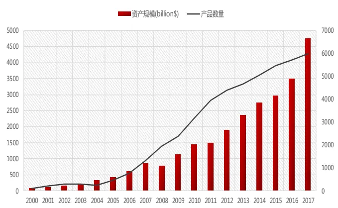
数据来源：东方证券研究所、BlackRock

图 2： 2017 年底全球各市场的 ETF 资产总额占比
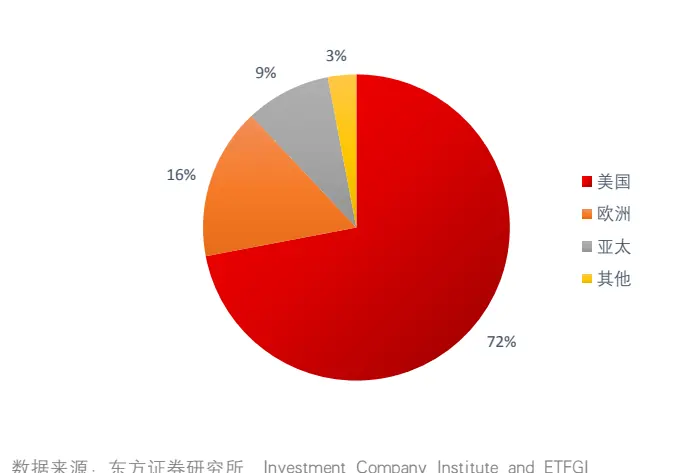
数据来源：东方证券研究所、Investment Company Institute and ETFGI

美国是 ETF 最重要、最具代表性的市场，同时也是是全球 ETF 发展的风向标，下面我们对美国市场进行介绍。自 1993年第一只 ETF问世以来，美国 ETF 市场蓬勃发展，ETF 存量个数保持每年增长，规模仅在 2008 年有所降低。美国 ETF 管理机构绝大部分都是按照《1940 年投资公司法》向 SEC 注册并受其监管的投资公司。截至 2017 年底，非 1940 年法案 ETF 仅占总规模的约2%。截止到 2018 年 10 月底的最新数据，美国共有 1942 只 ETF，资产规模约 3.70 万亿美元，

图 3：2007 年-2017 美国 ETF 资产规模（单位：billion$）
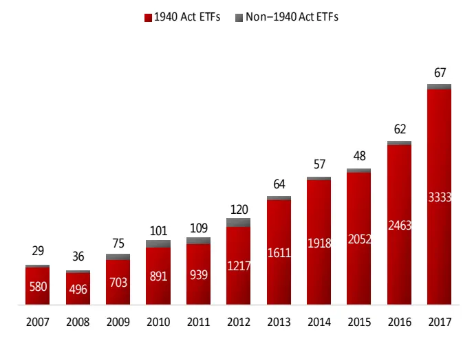
数据来源：东方证券研究所、Investment Company Institute and ETFGI

图 4：2007-2018.10 美国 ETF 数量和资产规模
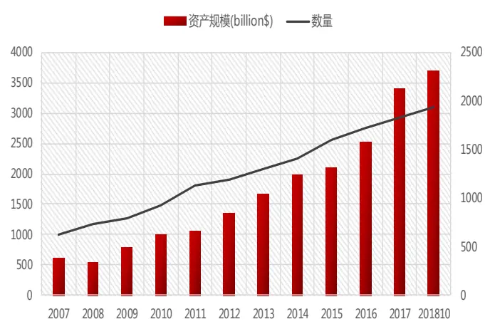
数据来源：东方证券研究所、Investment Company Institute and ETFGI

从美国各类型 ETF 规模占比情况来看，国内宽基指数 ETF占比最高，主要集中在国内大盘股票 ETF。截至 2017 年底，国内宽基指数 ETF（包括大盘、中盘、小盘及其他）占比最高，规模为 1.6 万亿美元，占比 47.17%。其中，国内大盘股票 ETF 的资产总额为 9,270 亿美元，占 ETF资产的 27％。其次是投资于海外市场的跨境 ETF（包括全球、海外、及新兴市场），规模为 7922亿美元，占比为 23.30%。在过去几年强劲的投资者需求推动下，债券和混合型 ETF持有 16%（5610亿美元）的 ETF资产，其中债券 ETF占 2017年债券和混合类别净资产总额的 99%。

图 5：2017年底美国各细分类别 ETF 在资产总额中的占比
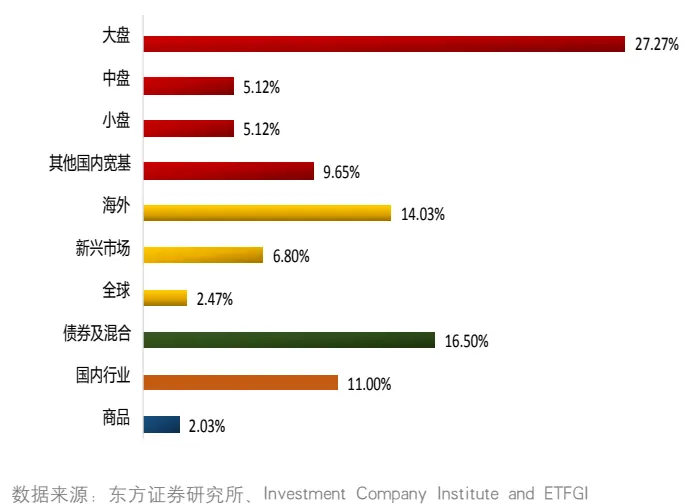

图 6：2017年底美国各大类 ETF 在净资产总额中的占比
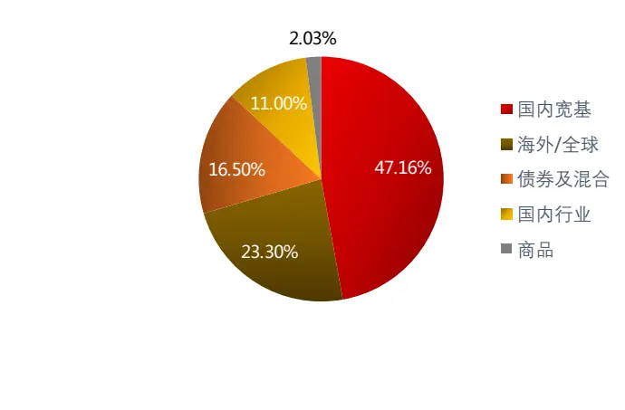
数据来源：东方证券研究所、Investment Company Institute and ETFGI

## “慧博资讯”是中国领先的投资研究大数据分享平台

从 2017 年底美国规模前二十大的 ETF 产品来看，规模最大的为 SSGA 发行的 SPDR S&P500 ETF Trust，规模为 2529 亿美元。其中 8 只为国内大盘 ETF。

图 7：2017 年底美国规模前二十大 ETF

| 代码 | 基金名称 | 发行机构 | 规模(billion$) | 投资类型 | 管理费 |
| --- | --- | --- | --- | --- | --- |
| SPY | SPDR S&P 500 ETF Trust | State Street Global Advisors | 252.89 | Equity: U.S. - Large Cap | 0.09% |
| IMV | iShares Core S&P 500 ETF | BlackRock | 155.66 | Equity: U.S. - Large Cap | 0.04% |
| VπI | Vanguard Total Stock Market ETF | Vanguard | 97.80 | Equity: U.S. - Total Market | 0.04% |
| VOO | Vanguard S&P 500 ETF | Vanguard | 97.80 | Equity: U.S. - Large Cap | 0.04% |
| VEA | Vanguard FTSE Developed Markets ETF | Vanguard | 65.56 | Equity: Developed Markets Ex-U.S. - Total Market | 0.07% |
| EFA | iShares MSCI EAFE ETF | BlackRock | 63.62 | Equity: Developed Markets Ex-U.S. - Total Market | 0.32% |
| QQQ | Invesco QQQ Trust | Invesco | 62.42 | Equity: U.S. - Large Cap | 0.20% |
| VWO | Vanguard FTSE Emerging Markets ETF | Vanguard | 54.80 | Equity: Emerging Markets - Total Market | 0.14% |
| IEFA | iShares Core MSCI EAFE ETF | BlackRock | 54.26 | Equity: Developed Markets Ex-U.S. - Total Market | 0.08% |
| AGG | iShares Core U.S. Aggregate Bond ETF | BlackRock | 53.77 | Fixed Income: U.S. - Broad Market, Broad-based Investment Grade | 0.05% |
| IEMG | iShares Core MSCI Emerging Markets ETF | BlackRock | 47.51 | Equity: Emerging Markets - Total Market | 0.14% |
| IH | iShares Core S&P Mid-Cap ETF | BlackRock | 45.42 | Equity: U.S. - Mid Cap | 0.07% |
| IWM | iShares Russell 2000 ETF | BlackRock | 43.23 | Equity: U.S. - Small Cap | 0.19% |
| VTV | Vanguard Value ETF | Vanguard | 42.97 | Equity: U.S. - Large Cap Value | 0.05% |
| IJR | iShares Core S&P Small Cap ETF | BlackRock | 41.12 | Equity: U.S. - Small Cap | 0.07% |
| IWF | iShares Russell 1000 Growth ETF | BlackRock | 38.97 | Equity: U.S. - Large Cap Growth | 0.20% |
| IWD | iShares Russell 1000 Value ETF | BlackRock | 37.35 | Equity: U.S. - Large Cap Value | 0.20% |
| BND | Vanguard Total Bond Market ETF | Vanguard | 35.66 | Fixed Income: U.S. - Broad Market, Broad-based Investment Grade | 0.05% |
| VUG | Vanguard Growth ETF | Vanguard | 33.29 | Equity: U.S. - Large Cap Growth | 0.05% |
| VNQ | Vanguard Real Estate ETF | Vanguard | 30.52 | Equity: U.S. Real Estate | 0.12% |

数据来源：东方证券研究所、Investment Company Institute and ETFGI

## 1.12 Smart Beta 产品

Smart Beta 产品是指数型基金发展的新阶段。其结合了主动选股、以及指数化操作的双重优势，是一种介于主动投资和被动投资之间的投资方式。Smart Beta 策略的主要方法是，在传统的指数投资基础上，系统性地筛选股票池，并对个股权重进行优化，以期在传统的指数投资基础之上获得一定超额收益。Smart Beta 策略主要特点在于产品运作基于规则、系统透明、具有较低的调仓频率（一般为季度）、管理成本更低、策略容量更高，

从全球市场来看，Smart Beta 策略普及度不断提高。 2018 年正在使用 Smart Beta 策略的机构投资者占比达 48%，创历史新高，考虑进正在或计划研发的机构，Smart Beta策略的全球普及率已达到 91%。根据 FTSE Russell 的调查报告《Five-year trends and outlook for smart beta》，全球 Smart Beta 资产总规模从 2012 年的 2800 亿美元增长到 2017 年底的 9990 亿美元，5 年增长 2.6倍，复合增长率达 29%。其中 ETF是 Smart Beta产品的主要增长点，到 2018年 3月30 日，全球 Smart Beta ETF 的资产总规模达 8130 亿美元。BlackRock 预测到 2020 年 SmartBeta ETF的资产规模将达到 1万亿美元。

图 8：全球金融机构对待 Smart Beta 的态度
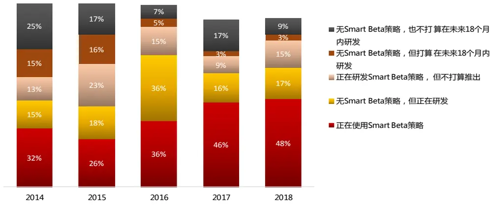
数据来源：东方证券研究所、FTSE Russell.《Smart Beta:2018 global survey findings from asset owners》

目前，美国是全球市场上 Smart Beta 最大、最多样化的市场。截至 2017 年末，美国拥有全球 Smart Beta ETP 市场 49%的产品数量，占据 88%的规模份额。从 2000 年 5 月，第一代 SmartBeta ETF 诞生以来，美国市场 Smart Beta ETF 产品的规模、数量均呈现稳定增长的趋势。截止于 2018 年 11 月 21 日，根据 ETF.com 上的统计结果，美国有 1024 只 Smart Beta ETF，总规模为 7859.4 亿美元。

图 9：美国 Smart Beta ETF 数量变化
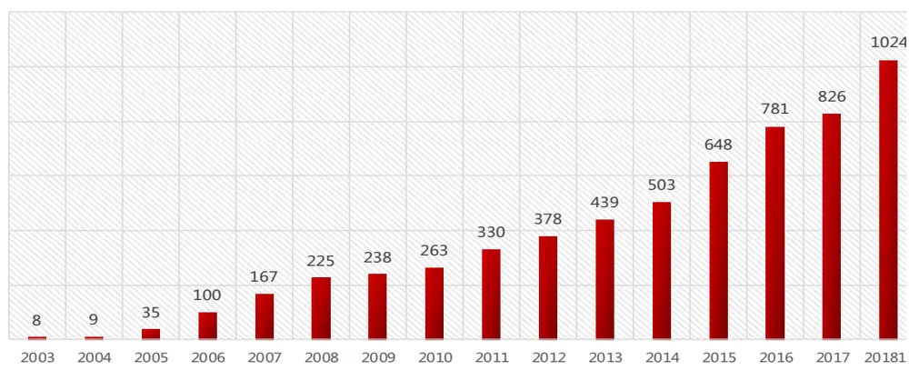
数据来源：东方证券研究所、ETF.comr

关于 Smart Beta 策略的分类并没有一个统一的标准。MorningStar 从 Smart Beta 策略的目标出发，将 Smart Beta策略分为收益导向、风险导向和其他类别。基于收益的 Smart Beta策略特征为，增加组合在能获得稳定风险溢价的因子上的暴露，常用因子包括红利、价值、成长、基本面、多因子、规模、动量等等；基于风险的 Smart Beta策略目标为降低产品的风险，包括最小波动率、风险加权等等；其他类包括非股票类资产、事件驱动、资产配置等。

图 10：Smart Beta 策略分类

| 类型 | 主要策略 | 特征 |
| --- | --- | --- |
| 收益导向型 | 规模、价值、成长、动量、红利、质量、基本面加权、利润加权、收入加权、预期回报、多因子 | 增加收益型因子的暴露 |
| 风险导向型 | 最小波动率/最小方差、风险加权、风险评价、最大化分散组合、去相关性 | 降低产品的风险 |
| 其他类型 | 等权、非传统商品、非传统固定收益、多资产、ESG（环境、社会、政府） | 与大数据等主流市场产品相联系 |

数据来源：东方证券研究所、MorningSta

从 Smart Beta策略分类来看，美国市场产品种类丰富，产品个数最多的 Smart Beta产品为多因子策略，占比达到 33.1%，但是其规模占比并不是很高只有 7.8%。规模占比较高的有价值、红利、成长策略，规模占比均超过了 20%，合计占据整个市场 70.7%的份额。这可能和 Smart Beta产品的配置作用定位有关，逻辑较多的多因子产品不利于资产管理机构的配置决策，简洁纯粹的单类因子产品更受青睐。

图 11：各类型 Smart Beta ETF 规模占比（截至 2017 年 6 月）
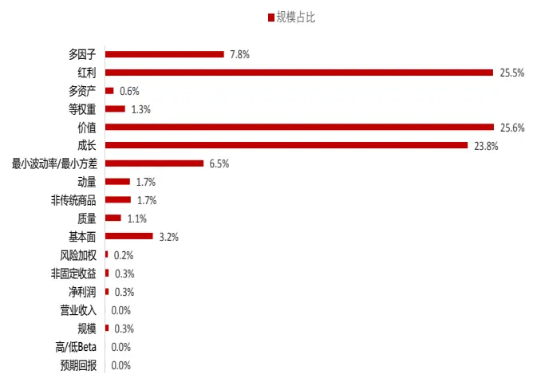
数据来源：东方证券研究所、MorningStar

图 12：各类型 Smart Beta ETF 数量占比（截至 2017 年 6 月）
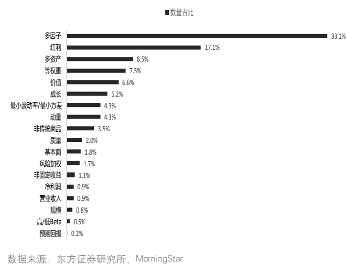

当前美国 Smart Beta 市场上规模最大的二十只 Smart Beta ETF 中，也是以成长、红利、价值风格居多，价值因子 ETF 占 7 个，其次是成长和红利因子，分别有 4 只和 3 只。有 14 只 SmartBeta ETF 的资产管理规模超过 100 亿美元。其中规模最大的三只 Smart Beta ETF——iSharesRussell 1000 Growth ETF、iShares Russell 1000 Value ETF、Vanguard Value ETF 均为 2000年 5月成立，成立都将近 15年，合计规模超过 1000亿美元。

图 13：2017 年底美国规模前二十大 Smart Beta ETF

| 代码 | 基金名称 | 发行机构 | 规模(billion$) | 管理费 | 投资类型 |
| --- | --- | --- | --- | --- | --- |
| VTV | Vanguard Value ETF | Vanguard | 43.72 | 0.05% | Equity: U.S. - Large Cap Value |
| IWF | iShares Russell 1000 Growth ETF | BlackRock | 41.02 | 0.20% | Equity: U.S. - Large Cap Growth |
| IWD | iShares Russell 1000 Value ETF | BlackRock | 37.51 | 0.20% | Equity: U.S. - Large Cap Value |
| VUG | Vanguard Growth ETF | Vanguard | 35.22 | 0.05% | Equity: U.S. - Large Cap Growth |
| VIG | Vanguard Dividend Appreciation ETF | Vanguard | 29.98 | 0.08% | Equity: U.S. - Total Market |
| VYM | Vanguard High Dividend Yield ETF | Vanguard | 21.86 | 0.08% | Equity: U.S. - High Dividend Yield |
| IVW | iShares S&P 500 Growth ETF | BlackRock | 21.31 | 0.18% | Equity: U.S. - Large Cap Growth |
| USMV | iShares Edge MSCI Min Vol U.S.A. ETF | BlackRock | 17.48 | 0.15% | Equity: U.S. - Total Market |
| DVY | iShares Select Dividend ETF | BlackRock | 16.97 | 0.39% | Equity: U.S. - High Dividend Yield |
| SDY | SPDR S&P Dividend ETF | State Street Global Advisors | 16.02 | 0.35% | Equity: U.S. - High Dividend Yield |
| IVE | iShares S&P 500 Value ETF | BlackRock | 15.37 | 0.18% | Equity: U.S. - Large Cap Value |
| RSP | Invesco S&P 500 Equal Weight ETF | Invesco | 14.73 | 0.20% | Equity: U.S. - Large Cap |
| VBR | Vanguard Small-Cap Value ETF | Vanguard | 13.03 | 0.07% | Equity: U.S. - Small Cap Value |
| IWS | iShares Russell Mid-Cap Value ETF | BlackRock | 11.10 | 0.25% | Equity: U.S. - Mid Cap Value |
| IWN | iShares Russell 2000 Value ETF | BlackRock | 9.61 | 0.24% | Equity: U.S. - Small Cap Value |
| MTUM | iShares Edge MSCI U.S.A. Momentum Factor ETF | BlackRock | 9.55 | 0.15% | Equity: U.S. - Total Market |
| IWO | iShares Russell 2000 Growth ETF | BlackRock | 9.52 | 0.24% | Equity: U.S. - Small Cap Growth |
| AMLP | Alerian MLP ETF | ALPS | 9.31 | 0.85% | Equity: U.S. MLPs |
| VOE | Vanguard Mid-Cap Value ETF | Vanguard | 8.90 | 0.07% | Equity: U.S. - Mid Cap Value |
| EFAV | iShares Edge MSCI Min Vol EAFE ETF | BlackRock | 8.74 | 0.20% | Equity: Developed Markets Ex-U.S. - Total Market |

数据来源：东方证券研究所、 ETF.com

## 1.2 国内市场

## 1.1.1 被动指数产品

伴随着全球指数化投资的热潮，我国被动指数产品也得到了较快发展。2003 年 3月 15日万家 180 基金推出，被动指数产品正式登上了我国市场的舞台。截止 2018 年 11 月 27 日，我国A 股市场共有被动指数型产品 613 只，规模约为 6504.03 亿元，在股票型基金中的数量和规模占比分别为 56%，66%。市场规模排名前十的股票型基金全部为被动指数产品，前三依次为大的华夏上证 50ETF（413.06 亿）、南方中证 500ETF（297 亿）和华泰柏瑞沪深 300ETF（277 亿）。

图 14：2006-2018国内被动指数产品规模及数量变化
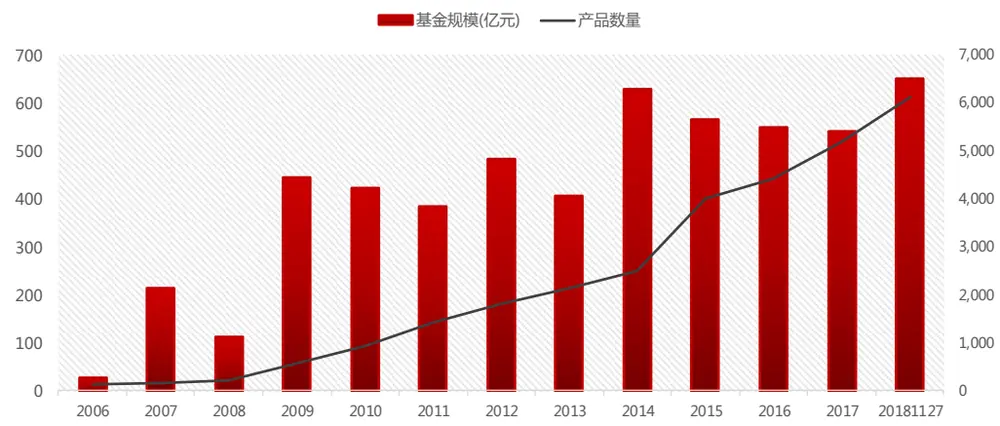
数据来源：东方证券研究所 & Wind 资讯

## 1.1.2 Smart Beta 产品

从 2006 年华泰柏瑞红利 ETF 发行至今，截止 2018 年 11 月 27 日，国内共发行了 68 只Smart Beta 产品，累计规模达到 245.44 亿元。对比海外成熟市场，无论从数量上还是从规模上看，国内的 Smart Beta基金产品仍处于前期起步阶段。2009年之前，Smart Beta刚进入中国市场，发展较缓慢，2009 -2012 年产品规模出现爆发式增长，2011 年规模达到最高 300 亿元，为Smart Beta 指数基金在中国市场规模的峰值；2013-2016 年，国内 Smart Beta 产品的发展缓慢，新发行产品数量有限，规模也有缩水；从 2017 年开始，整个 Smart Beta 市场逐渐回暖，产品数量和规模显著提升。

图 15：2006-2018 国内 Smart Beta 指数基金规模及数量变化
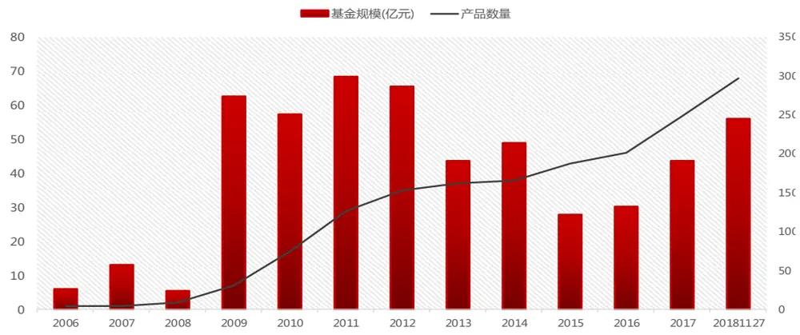
数据来源：东方证券研究所 & Wind 资讯

从策略分布来看，国内 Smart Beta 种类较为单一，以红利、基本面、价值风格为主，从规模分布来看，红利加权风格的 Smart Beta占据最大市场份额。从数量分布来看，基本面加权风格的产品数量最多。

图 16：各类型 Smart Beta ETF 规模比例（截至 2018 年 11月 27 日）
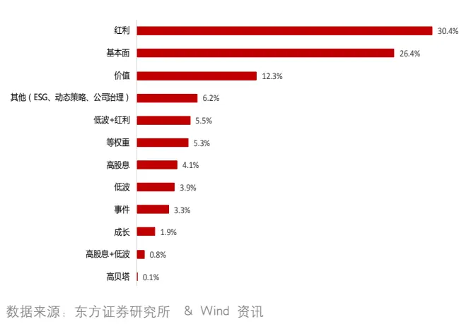

图 17：各类型 Smart Beta ETF 数量比例（截至 2018 年 11月 27 日）
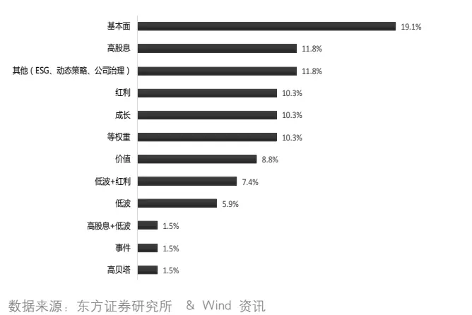

## “慧博资讯”是中国领先的投资研究大数据分享平台

当前国内 Smart Beta市场上规模最大的二十只 Smart Beta产品中，也是以红利因子和基本面加权风格居多，各占 5 个，其次是价值和低波红利，分别有 3 只和 2 只。目前国内规模最大的Smart Beta 产品为华泰柏瑞红利 ETF，规模达 20.88 亿元。

图 18：国内规模前二十大 Smart Beta 产品（截止日：2018/11/27）

| 证券代码 | 证券简称 | 基金规模（亿元） | 跟踪指数 | 策略类型 | 成立日期 | 管理费(%) |
| --- | --- | --- | --- | --- | --- | --- |
| 510880.OF | 华泰柏瑞红利ETF | 20.88 | 上证红利 | 红利 | 2006-11-17 | 0.50 |
| 160716.OF | 嘉实基本面50指数(LOF)A | 19.89 | 基本面50 | 基本面 | 2009-12-30 | 1.00 |
| 160725.OF | 嘉实基本面50指数(LOF)C | 19.89 | 基本面50 | 基本面 | 2018-08-08 | 1.00 |
| 501029.OF | 华宝标普中国A股红利机会A | 19.39 | 标普A股红利 | 红利 | 2017-01-18 | 0.75 |
| 005125.OF | 华宝标普中国A股红利机会C | 19.39 | 标普A股红利 | 红利 | 2017-08-28 | 0.75 |
| 310398.OF | 申万菱信沪深300价值 | 10.84 | 沪深300价值 | 价值 | 2010-02-11 | 0.65 |
| 512040.OF | 富国中证价值ETF | 9.38 | 国信价值 | 价值 | 2018-11-07 | 0.60 |
| 161123.OF | 易方达并购重组 | 8.00 | CSWD并购 | 事件 | 2015-06-03 | 1.00 |
| 159905.OF | 工银瑞信深证红利ETF | 6.82 | 深证红利 | 红利 | 2010-11-05 | 0.50 |
| 003318.OF | 景顺长城中证500行业 | 6.52 | 500SNLV | 低波 | 2017-03-03 | 0.50 |
| 161724.OF | 招商中证煤炭 | 6.27 | 煤炭等权 | 等权重 | 2015-05-20 | 1.00 |
| 005051.OF | 上投摩根港股低波红利A | 6.08 | 普港股通低波红利指 | 低波红利 | 2017-12-04 | 0.60 |
| 005052.OF | 上投摩根港股低波红利C | 6.08 | 普港股通低波红利指 | 低波红利 | 2017-12-04 | 0.60 |
| 481012.OF | 工银瑞信深证红利ETF联接 | 5.46 | 深证红利 | 红利 | 2010-11-09 | 0.50 |
| 159910.OF | 嘉实深证基本面120ETF | 4.78 | 深证F120 | 基本面 | 2011-08-01 | 0.50 |
| 519671.OF | 银河沪深300价值 | 4.61 | 沪深300价值 | 价值 | 2009-12-28 | 0.50 |
| 070023.OF | 嘉实深证基本面120ETF联接A | 4.60 | 深证F120 | 基本面 | 2011-08-01 | 0.50 |
| 005998.OF | 嘉实深证基本面120ETF联接C | 4.60 | 深证F120 | 基本面 | 2018-06-15 | 0.50 |
| 005770.OF | 信达澳银沪港深高股息 | 4.13 | 户港深高股息(CNY | 高股息 | 2018-11-02 | 1.00 |
| 519686.OF | 交银180治理ETF联接 | 4.01 | 180治理 | 公司治理 | 2009-09-29 | 0.50 |

数据来源：东方证券研究所 & Wind 资讯

下面是一些常见的 smart beta 指数的编制方式，列于此以供参考。

图 19：常见 smart beta 指数编制方式

| 因子 代表指数 | 成分股筛选 | 加权方式 |
| --- | --- | --- |
| 价值 成长 | 300价值 300成长 | 1.对样本空间的股票，计算其成长因子与价值因子的变量数值，并计算评分。 市值加权 2.对样本空间的股票，按照成长评分与价值评分确定指数样本股。 |
| 红利 | 300红利 | 1.过去两年连续现金分红：2.过去两年每年的税后现金红利均大于0，月过去2 年的平均税后现金股息率大于1%。对样本空间内股票，按照过去2年的平均税 市值加权 |
| 动量 300动量 | 后现金股息率由高到低进行排名，选取排名在前50名的股票作为指数样本股。 1.对样本空间的股票，计算其风险调整动量指标。风险调整动量指标等于最近 一年的价格收益率除以最近一年周收益波动率；2.将股票按照风险调整动量指 | 市值加权 |
| 等权 300等权 | 标由高到低进行排名，选取排名前100名的股票作为指数样本。 |  |
| 低波动 300低波动 | 沪深300中所有股票。 1.对样本空间的股票，计算最近一年日收益率的波动率；2.将股票按照波动率指 | 等权加权 权重分配与其历史波动率的倒数成正比。 |

数据来源：东方证券研究所

## 二、 美国市场主动、被动、SmartBeta 产品收益比较

## 2.1 主动管理基金 VS 被动指数基金

与指数化投资兴起相呼应的是，美国股票市场的有效性越来越高，主动管理类产品获取超额收益的难度很大。根据 Morningstar 2018 年 8 月的报告《Morningstar Active/Passive Barometer》显示，投资美国本土的主动管理产品过去一年跑赢同类别被动产品的比例大部分都在 40%以下，放眼过去十年看，跑赢大盘类别被动产品的主动管理基金都不到 10%，特别是 LargeBlend 类，只有 1.6%。中盘和小盘类别里，主动管理产品跑赢的比例略高，但很多也没超过 20%。由此可见美国市场的有效性。对比来看，投海外新兴市场的产品里，主动战胜被动的比例要高很多。

图 20：美国主动基金 VS 被动基金的多时间维度胜率比较（%）（截止日 2018/6/30）

| 类别 | 过去1年 | 过去3年 | 过去5年 | 过去10年 | 过去15年 | 过去20年 |
| --- | --- | --- | --- | --- | --- | --- |
| U.S. LargeBlend | 36.2 | 17.0 | 2.9 | 1.6 | 15.7 | 16.9 |
| U.S. LargeValue | 34.8 | 11.2 | 23.3 | 5.5 | 17.8 |  |
| U.S. LargeGrowth | 44.1 | 31.9 | 25.7 | 9.8 | 1.2 |  |
| U.S. Mid-Blend | 23.5 | 18.6 | 14.2 | 14.2 | 7.8 | 9.0 |
| U.S. Mid-Value | 29.6 | 15.1 | 11.3 | 11.6 | 14.0 |  |
| U.S. Mid-Growth | 41.5 | 33.8 | 31.0 | 27.9 | 23.2 |  |
| U.S. SmalIBlend | 23.1 | 2.9 | 15.2 | 17.7 | 18.5 | 31.5 |
| U.S. SmalIValue | 28.6 | 25.9 | 24.8 | 28.6 | 4.6 |  |
| U.S. SmalIGrowth | 41.0 | 31.3 | 24.2 | 18.5 | 8.4 |  |
| Foreign LargeBlend | 3.1 | 33.5 | 41.4 | 26.3 | 28.1 | 33.3 |
| Foreign LargeValue | 4.7 | 26.1 | 44.0 | 48.9 |  |  |
| Foreign Small/Mid-Blend | 26.7 | 22.2 | 34.8 | 92.9 |  |  |
| World Large Stock | 44.5 | 33.9 | 39.7 | 29.5 |  |  |
| Diversified Emerging Markets | 47.7 | 58.3 | 57.9 | 33.7 |  |  |
| Europe Stock | 25.0 | 19.0 | 13.0 | 51.7 | 31.1 |  |
| U.S.RealEstate | 39.4 | 1.3 | 32.8 | 36.5 | 32.8 | 25.8 |
| Global RealEstate | 27.1 | 33.9 | 38.5 | 22.9 |  |  |
| Intermediate-Term Bond | 7.9 | 63.4 | 6.5 | 49.0 | 34.4 | 23.8 |
| Corporate Bond | 48.1 | 55.6 | 59.0 | 62.5 |  |  |

数据来源：东方证券研究所、Morningstar. Data

学术界对于主动管理基金是否能获得超额收益也有许多研究。绝大多数研究结果都显示，在成熟市场中随着市场有效程度的提高，主动管理基金获得超额收益的难度很大。Fama&French（2010）将 the Fama-French 三因子模型和 Carhart 四因子模型作为基金业绩比较的基准，使用 bootstrap方法证实，整体而言美国主动管理型股票共同基金产品没有表现出主动管理能力（选股），很少有基金经理能够在扣除基金运作成本后还能获得额外的剔除风格后的 alpha。Cremers, Petajisto,and Zitzewitz (2012)的研究发现，即便是纯被动指数，在传统的因子模型下依然可以获得显著非0 的 alpha。因而正的 alpha 也并不能说明基金可以获得超额收益。Berk and van Binsbergen(2012)提出应该将可投资的被动指数基金收益，而非 alpha，作为主动管理基金的业绩参考基准。其测试结果显示，主动基金的收益平均每年比被动指数基金低 0.70%。Del Guercio and Reuter(2014) 的研究给出了类似的结论。pooled regressions 结果显示，主动基金的收益平均每年比被动指数基金低 0.87%，t 检验 p 值为 0.049。尤其在相对有效，和对超额收益激励不足的市场中，主动基金的收益更差。David C. Brown(2017)的研究发现，投资者投资主动和被动管理基金的收益并没有显著差别，随着被动产品的吸引力越来越强，主动基金经理能获得的管理费也在下降，从而进一步降低了主动基金经理的积极性。Crane, A. D., & Crotty, K. (2018)最新的研究中，将被动指数基金的收益分布作为基准来衡量主动基金的表现，结果显示，与指数基金相比，美国市场中主动管理基金并不能获得显著的超额收益。在二阶随机占优决策法则下，被动基金优于主动基金。

## 2.2 标普 500 成分内的 Alpha 因子表现

本节将考察常见 alpha 因子在标普 500 成分股里的表现，从另一个角度来考察市场的有效性，因子列表如下，每个类别下的因子通过等权的方式合成一个大类因子（图 21）。

图 21：美股 Alpha 因子列表

| 类型 | 因子代码 | 因子说明 |
| --- | --- | --- |
| 估值 | BP | 账面市值比 |
|  | EP | 归属母公司的净利润TTM/总市值 |
|  | CFP | 经营性现金流TTM/总市值 |
|  | SP | 营业收入TTM/总市值 |
|  | Sales2EV | 营业收入_TTM/企业价值 |
| 盈利 | ROA 总资产收益率 | 净资产收益率 |
|  | ROE 净资产收益率 | 投资现金收益率 |
|  | GrossMargin | 销售毛利率 |
| 成长 | SalesGrowth_Qr_YOY | 营业收入增长率（季度同比） |
|  | ProfitGrowth_Qr_YOY | 净利润增长率(季度同比） |
|  | OCFGrowth_YOY | 经营现金流增长率（同比） |
| 波动率 | RealizedVolatility_3M | 过去三个月日收益率数据计算的标准差 |
|  | MaxRet | 上月最大日收益 |
| 动量 | Ret9M_1 | 9个月收益剔除最近1个月 |
| 流动性 | TO_1M | 以流通股本计算的1个月日均换手率 |
|  | ILLIQ | 每天一个亿成交量能推动的股价涨幅 |
|  | AmountAvg_1M_3M | 过去一个月日均成交额/过去三个月日均成交额 |

数据来源：东方证券研究所

从大类因子检测结果来看，1997.1-2017.12 间，仅估值因子在美股全市场上的整体选股作用较为显著，IC达到 2.59%，IC_IR为 0.6，多空年化收益 8.18%，但从 2014年至今，也出现了大幅回撤。其它因子基本没有什么选股效果，这和 A股的充裕 alpha形成鲜明对比。

图 22：美股-标普 500 成分股原始因子绩效指标（1997.1-2017.12）

| 大类因子 | RankIC | ICIR | Tstat | 多空月均收益 | 多空月胜率 |  | 多空信息比多空月最大回撤 | 多空年化收益 |
| --- | --- | --- | --- | --- | --- | --- | --- | --- |
| 估值 | 2.59% | 0.62 | 2.69 | 0.87% | 54.19% | 0.51 | -56.14% | 8.18% |
| 波动率 | 1.51% | 0.23 | 1.00 | 0.18% | 51.10% | 0.07 | -80.14% | -3.22% |
| 动量 | 0.81% | 0.14 | 0.60 | -0.04% | 55.95% | -0.01 | -87.90% | -6.01% |
| 盈利 | 0.52% | 0.14 | 0.59 | -0.15% | 52.42% | -0.10 | -65.14% | -3.71% |
| 流动性 | 0.32% | 0.10 | 0.42 | 0.31% | 51.98% | 0.19 | -58.37% | 1.63% |
| 成长 | 0.24% | 0.08 | 0.34 | -0.19% | 49.34% | -0.15 | -57.91% | -3.78% |
| 合成因子 | 2.07% | 0.43 | 1.85 | 0.42% | 55.07% | 0.20 | -60.41% | 1.75% |

数据来源：东方证券研究所 & Bloomberg

图 23：S&P500估值因子多空组合净值曲线&最大回撤
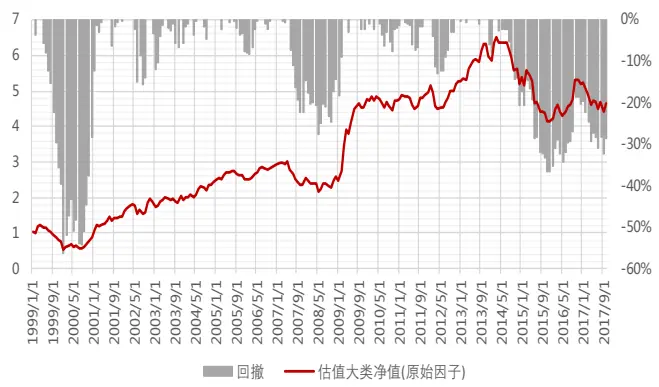
数据来源：东方证券研究所 & Bloomberg

图 24：S&P500盈利因子多空组合净值曲线&最大回撤
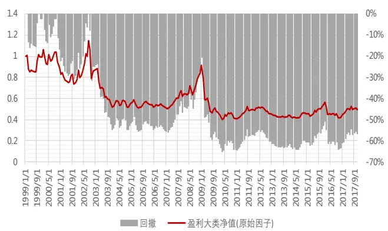
数据来源：东方证券研究所 & Bloomberg

图 25：S&P500成长因子多空组合净值曲线&最大回撤
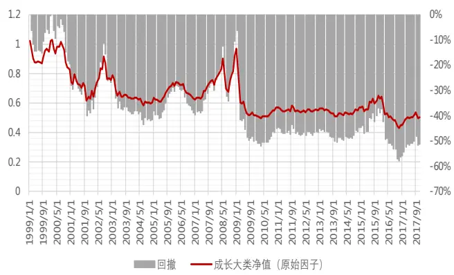
数据来源：东方证券研究所 & Bloomberg

图 26：S&P500波动率因子多空组合净值曲线&最大回撤
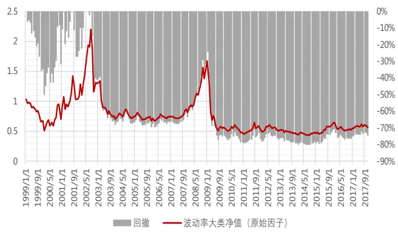
数据来源：东方证券研究所 & Bloomberg

图 27：S&P500 动量因子多空组合净值曲线&最大回撤
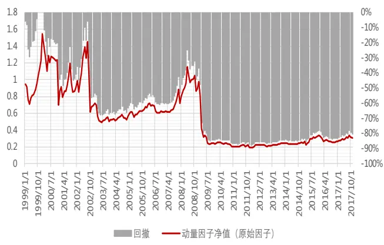
数据来源：东方证券研究所 & Bloomberg

图 28：S&P500 流动性因子多空组合净值曲线&最大回撤
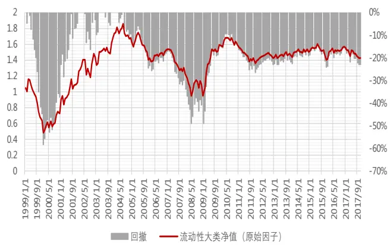
数据来源：东方证券研究所 & Bloomberg

## 2.3 指数增强策略 VS Smart Beta 策略

下面我们将 A股常用的指数增强策略运用于标普 500指数，进行历史回溯并和 Smart Beta 产品做比较。回溯测试时没有考虑交易手续费，仅测算指数增强策略的理论表现。测试时间段设定为1999.1.29 – 2017.12.31，Alpha模型采用多因子大类间等权的加权方式，各因子均进行行业和市值中性化处理（图 21）。风险模型采用压缩估计量方法，优化时将风险项作为惩罚项加入目标函数中。控制行业市值完全中性，月度调仓。从结果可以看出，在美国市场中，未扣费情况下的标普500 成分内的多因子的指数增强策略相比标普 500 指数，基本没有超额收益，年化对冲收益仅0.16%，并且策略换手率较高，单边年换手达到了 4.3倍。剔除掉技术类因子可以降低换手率，但收益变化不大。

图 29：标普 500 成分内的指数增强策略表现（1999.1.29 – 2017.12.31）
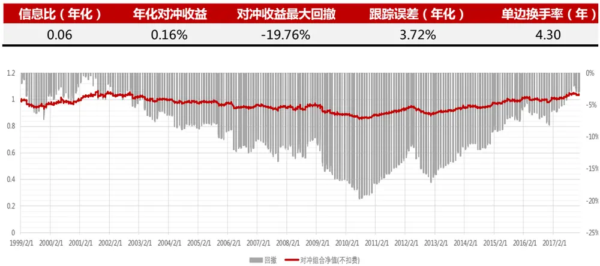
数据来源：东方证券研究所 & Bloomberg

对比 1968–2016 美国 Smart Beta 策略的表现（图 30）可以看出，在过去近 50 年间，各类型 Smart Beta策略的平均收益都在 10%以上，动量类策略的换手率最高，年化单边 132.2%，基本面因子策略的换手率很低，基本在 20%左右。

图 30：美国 Smart Beta 策略表现（1968–2016）
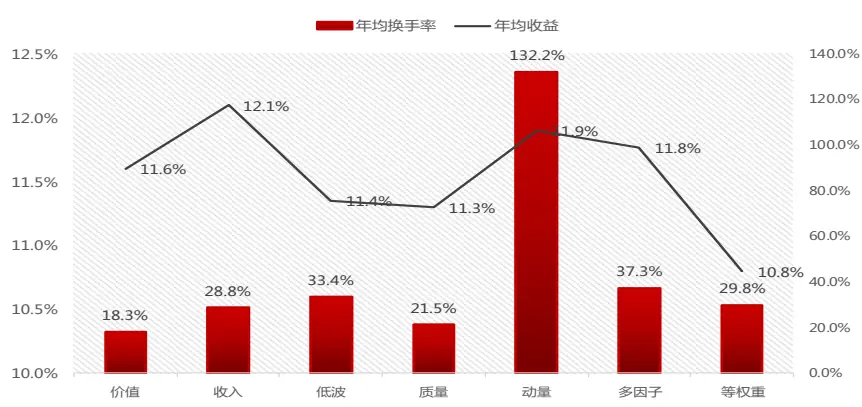
据来源：东方证券研究所、Research Affiliates, LLC, using data from Worldscope and Datastream

如果只看规模最大的 20只 Smart Beta ETF（图 31），有十支过去十年相对标普 500的年化超额收益为正，Invesco S&P 500 Equal Weight ETF 表现最为亮眼，过去 10 年超额收益达到 4%.由此可见，低管理费 + 交易便捷（低换手）+ 可接受的 alpha收益是 Smart Beta 产品这些年发展迅速的最核心因素。

图 31：美国市场典型 Smart Beta ETF 的收益及换手情况

| 基金简称 | 基金全称 | 发行机构 | 管理规模 (billion$) | 管理费 | 策略类型 手率 | 2017年换 | 过去1年超额 过去5年超额收益 过去10年超额收益 |  |  |
| --- | --- | --- | --- | --- | --- | --- | --- | --- | --- |
|  |  |  |  |  |  |  | 收益(2017) | (年化)(12-17) | (年化)(07-17) |
| VTV | Vanguard Value ETF | Vanguard | 43.72 | 0.05% | U.S. - Large Cap Value | 9% | -2.30% | 1.97% | 1.47% |
| IWF | iShares Russell 1000 Growth ETF | BlackRock | 41.02 | 0.20% | U.S. - Large Cap Growth | 13% | 8.98% | 2.12% | 2.07% |
| IWD | iShares Russell 1000 Value ETF | BlackRock | 37.51 | 0.20% | U.S. - Large Cap Value | 15% | -8.41% | -2.10% | -1.75% |
| VUG | Vanguard Growth ETF | Vanguard | 35.22 | 0.05% | U.S. - Large Cap Growth | 8% | 8.23% | 2.53% | 3.18% |
| VIG | Vanguard Dividend Appreciation ETF | Vanguard | 29.98 | 0.08% | U.S. - Total Market | 14% | 6.60% | 0.05% | 3.26% |
| VYM | Vanguard High Dividend Yield ETF | Vanguard | 21.86 | 0.08% | U.S. - High Dividend Yield | 9% | -0.05% | 0.56% | 1.25% |
| IVW | iShares S&P 500 Growth ETF | BlackRock | 21.31 | 0.18% | U.S. - Large Cap Growth | 21% | 6.00% | 1.65% | 1.94% |
| USMV | iShares Edge MSCI Min Vol U.S.A. ETF | BlackRock | 17.48 | 0.15% | U.S. - Total Market | 23% | -2.65% | -1.31% |  |
| DVY | iShares Select Dividend ETF | BlackRock | 16.97 | 0.39% | U.S. - High Dividend Yield | 28% | -8.03% | -1.93% | -1.89% |
| SDY | SPDR S&P Dividend ETF | SSGA | 16.02 | 0.35% | U.S. - High Dividend Yield | 24% | -3.58% | 1.96% | 3.88% |
| IVE | iShares S&P 500 Value ETF | BlackRock | 15.37 | 0.18% | U.S. - Large Cap Value | 23% | -6.79% | -1.94% | -2.12% |
| RSP | Invesco S&P 500 Equal Weight ETF | Invesco | 14.73 | 0.20% | U.S. - Large Cap | 7% | 10.61% | 8.84% | 4.24% |
| VBR | Vanguard Small-Cap Value ETF | Vanguard | 13.03 | 0.07% | U.S. - Small Cap Value | 15% | -3.32% | 0.91% | 3.36% |
| IWS | iShares Russell Mid-Cap Value ETF | BlackRock | 11.10 | 0.25% | U.S. - Mid Cap Value | 20% | -8.63% | -1.26% | 0.41% |
| IWN | iShares Russell 2000 Value ETF | BlackRock | 9.61 | 0.24% | U.S. - Small Cap Value | 23% | -13.66% | -2.66% | -0.27% |
| MTUM | res Edge MSCI U.S.A. Momentum Factor BlackRock |  | 9.55 | 0.15% | U.S. - Total Market | 114% | 16.62% | -13.39% |  |
| IWO | iShares Russell 2000 Growth ETF | BlackRock | 9.52 | 0.24% | U.S. - Small Cap Growth | 26% | 1.85% | 0.98% | 2.17% |
| AMLP | Alerian MLP ETF | ALPS | 9.31 | 0.85% | U.S. MLPs | 23% | -27.22% | -13.92% |  |
| VOE | Vanguard Mid-Cap Value ETF | Vanguard | 8.90 | 0.07% | U.S. - Mid Cap Value | 11% | -5.81% | 1.12% |  |
| EFAV | iShares Edge MSCI Min Vol EAFE ETF | BlackRock | 8.74 | 0.20% | Developed Markets Ex-U.S. - Total Market | 28% | -0.88% | -7.19% |  |

数据来源：东方证券研究所、ETF。Com

## 三、 A 股指数增强与 Smart Beta 策略对比

由于因子暴露的获取方式不一样，Alpha与 Smart Beta 产品在策略收益和换手上会有很大不同。理论上讲，在 alpha充裕的市场，前者收益高，选择更佳，不过现实投资中，资金的交易会造成冲击成本，大额资金量有可能抹平两个策略的差别。下文我们将结合冲击成本模型，分析不同因子选择、组合构建方式和资金规模对两类策略的影响。

## 3.1 冲击成本模型—I-star 模型

交易成本可分为容易度量的显性成本（交易费用、印花税等）和较难度量的隐性冲击成本两类。冲击成本指在交易中买进或者卖出证券时，由于未能按照预定价位成交，而多支付的成本。由于我们只能观测到交易发生后的市场价格，不可能反推出交易未发生时的价格，因此冲击成本是一个观念上很明确，但事实上不可能精确度量的指标。不同模型选择的度量方式会不太一样，不过这些模型一般都会满足冲击成本的一些经验特性，例如：分笔交易冲击成本更小、市场参与率越低冲击成本越小等，配合算法交易，实际运用中确实可以起到降低冲击成本的作用。我们下文采用的是Kissell& Glantz (2003) 提出的 ISTAR 模型。模型的表达式如下：

$$
\begin{array}{l}{{I^{*}\displaystyle=a_{1}\times(\frac{S}{ADV})^{a_{2}}\times\sigma^{a_{3}}}}\\{{MI=b_{1}\times I^{*}\times POV+(1-b_{1})\times I^{*}}}\end{array}
$$

（1）模型中的 I* 度量订单的整体瞬时冲击（Instantaneous Impact），代表订单一次性释放后对市场价格带来的冲击，与交易策略无关。I*与订单大小及股价波动率呈幂指数函数形式的非线性关系。模型参数α1, α2，α3取决于股票本身的特性及主要交易参与者的属性等。此处我们根据低频的日度数据来估计冲击成本平均在一天内的效果。假设相同的主动买入量与主动卖出量的作用相互抵消，将每日的主动净流入量看做一个主动的交易订单，由于每个股票上订单量的绝对值不具有可比性，我们用每日的主动净流入量 S 占过去 30 个交易日平均成交量 ADV 的比例来衡量订单的大小。个股波动率 用过去 30个交易日的年化波动率衡量。

（2）I* 中包括了永久性冲击和暂时性冲击：永久性冲击指的是订单对于价格的永久性影响，永久性冲击来源于订单释放信息导致的价格永久性不利偏移；暂时性冲击指的是订单对于价格的暂时性影响，暂时性冲击来源于市场短期供求关系的非平衡和流动性需求，在流动性恢复以后价格会回到原来。参数 b1衡量暂时性冲击所占的比例。

（3）MI表示该笔订单的交易者最终需承担的实际冲击成本，与交易策略有关。I* 中暂时性冲击的部分应由市场中所有交易者共同承担，模型用 POV（主动净流入量 S 占当天成交量的比例）衡量需由该笔订单的交易者承担的暂时性冲击比例。假设这个订单是在一天之内以成交量加权平均价（VWAP）来交易完成的，MI 可以表示为 abs（VWAP-S0）/ S0，S0为每日的开盘价格。

由于冲击成本与股票市值有一定关系，因而我们在沪深 300（大市值）、中证 500（中市值）、中证 1000（小市值）三个股票池中分别使用最近三个月（2018.7-2018.10）的市场数据进行参数估计。此处我们剔除了涨跌方向和主动买卖单方向不一样的股票，对各变量取对数后，使用稳健回归，降低异常值对于回归结果的影响。根据图 32 的参数估计结果，我们以沪深 300 股票池为例，控制股票波动率不变，绘制了不同 POV水平下，冲击成本与订单大小（S/ADV）的关系图（图 33）。可见，对于某一只股票上的相同大小买卖单（S/ADV相同），如果当天市场活跃，成交量大（POV较低），则交易带来的暂时性冲击成本会被分散，从而降低冲击成本。

图 32：I-star 模型参数（2018.7-2018.10）

|  | b1 | a1 | a2 | a3 |
| --- | --- | --- | --- | --- |
| 沪深300 | 0.68 | 0.13 | 0.24 | 1.10 |
| 中证500 | 0.64 | 0.10 | 0.24 | 1.00 |
| 中证1000 | 0.47 | 0.07 | 0.21 | 0.90 |

数据来源：东方证券研究所 & Wind 资讯

图 33：沪深 300 股票池中冲击成本与订单大小的关系
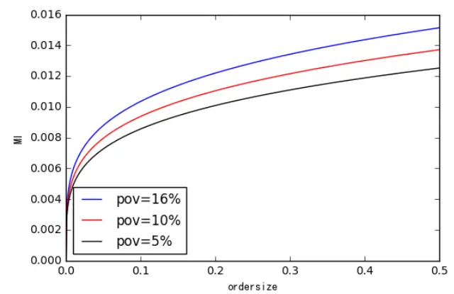
数据来源：东方证券研究所 & Wind 资讯

## 3.2 资金规模对策略收益的影响

下面我们将交易成本的影响加入到策略调仓过程中，对比 A 股市场指数增强策略和 SmartBeta 策略的收益情况。首先对策略细节进行阐述：

（1）两策略的历史回溯测试的实证区间设定为 2010.4.30 – 2018.10.31，第一个月用于建仓，策略收益统一从第二个月开始计算。指数增强策略每月底调仓，而 Smart Beta 策略统一在每年的04.30、08.31 和 10.31 三个财报公布完结日调仓，一年调仓三次。此处我们先假设两策略均在一天内完成卖出及买入交易调仓，3.4节中将进一步测试分散调仓后的效果。

（2）两策略所用到的 Alpha 因子保持一致（图 34），各单因子均进行行业和市值中性化处理，采用多因子大类间等权的加权方式。需要注意的是，指数增强策略中我们对银行和券商进行了单独建模，但在构建 Smart Beta策略时均统一建模，无法计算的因子作为缺省值，用该因子全市场数值的中位数进行填充。非流动性和反转两个大类因子偏技术面，换手率较高，后面我们将分别比较全因子以及纯基本面因子的策略效果。

（3）Smart Beta 策略构建时，采用 MSCI Quality Index 的股票权重设置方法。以标的股票池（例如沪深 300成份股）内成份股权重为基准，因子得分高的股票在此基础上进行超配，得分低的股票则低配。假设有 N只股票，股票 i 的多因子打分 zscore 为 zi，其在标的指数的权重为 wi0，则 Smart Beta 策略给股票 i配置的权重为：

$$
w_{i}=\left\{\begin{array}{ll}{(1+z_{i})\cdot w_{i}^{0}~if~z_{i}\geq0}\\{(1-z_{i})^{-1}\cdot w_{i}^{0}~if~z_{i}<0}\end{array}\right.
$$

（4）指数增强组合构建时，风险模型采用 DFQ风险模型（具体内容参见报告：东方 A股因子风险模型（ DFQ-2018）—— 《因子选股系列研究之四十四》），组合优化时将风险项作为惩罚项加入目标函数中，取风险厌恶系数 lamda=20，控制行业市值完全中性。

图 34：A 股 Alpha 因子列表

| 类型 | 因子代码 | 因子说明 |
| --- | --- | --- |
|  | BP | 账面市值比 |
|  | EP | 归属母公司的净利润TTM/总市值 |
|  | CFP | 经营性现金流TTM/总市值 |
|  | EBIT2EV | 息税前利润与企业价值之比 |
|  | DP2 | 过去一年分红/总市值，以分红预案公告日为准 |
| 盈利能力 | RNOA | 净经营资产收益率 |
|  | CFROI | 投资现金收益率 |
|  | ROE | 净资产收益率 |
|  | GPOA | 总资产毛利率 |
| 业绩超预期 | UP | 预期外的RNOA |
|  | SUEO | 基于带漂移项随机游走模型计算的预期外的净利润，详见《业绩超预期类因子》 |
|  | SUE1 | 基于不带漂移项随机游走模型计算的预期外的净利润，详见《业绩超预期类因子》 |
|  | SURO | 基于带漂移项随机游走模型计算的预期外的营业收入，详见《业绩超预期类因子》 |
| 公司治理 | SUR1 | 基于不带漂移项随机游走模型计算的预期外的营业收入，详见《业绩超预期类因子》 |
| 分析师预期 | MR | 高管薪酬前三之和的对数 过去6个月有覆盖的机构数量，取根号 |
|  | COV DISP | 过去6个月盈利预测的分歧度 |
|  | EP_FY1 | 预期的估值 |
|  | PEG | PE_FY1/FY2隐含的利润增量率 |
|  | SCORE | 综合评价 |
|  | TPER | 目标价隐含的收益率 |
|  | WFR | 加权的预期调整 |
| 非流动性 | TO20 | 过去20个交易日的日均换手率对数 |
|  | ILLIQ | 20日Amihud非流动性自然对数 |
| 反转投机 | IVOL60 | 过去60个交易日的特质波动率 |
|  | IVR20 | 过去20个交易日的特异度 |
|  | RET20 |  |
|  | MAXRET | 过去20个交易日的收益率 |

数据来源：东方证券研究所

图 35至图 38展示了不同初始资金规模下，沪深 300、中证 500（成分内、全市场）的指数增强策略，以及沪深 300、中证 500成分内的 Smart Beta 策略表现。需要注意的是，这里的初始规模 100亿是指在历史的市场交易状态下，额外再增加 100亿，这 100亿能获得的策略收益。

从结果可以看出：

1. Smart Beta VS指数增强：Smart Beta 策略的换手率显著低于指数增强策略，当资金规模较小时，高换手带来的冲击成本影响并不大，指数增强策略占优，但当资金规模较大时，冲击成本将抹去指数增强策略的优势。

2. 成分内 VS 全市场指数增强策略：全市场增强策略由于 alpha 收益更高、持股数量更多，资金容量也更大，

3. 沪深 300 VS 中证 500：500 增强策略的容量更大：原因在于其 alpha 更高，容许更多的冲击成本。

4. 全因子 VS 基本面因子：技术类因子可以提高组合收益，但换手也会大幅提升，增加组合的冲击成本，当资金规模较小时，高换手带来的冲击成本影响并不大，去掉技术类因子的增强策略收益降低，但当资金规模较大时，冲击成本影响明显，去掉技术类因子的增强策略收益更高。

图 35：沪深 300 成分内的指数增强策略、Smart Beta 策略表现对比（2010.4.30 – 2018.10.31）

| 沪深300成分内 | 2010.04.31-2018.10.31 组合表现 | 扣交易佣金（单边0.08%）+卖出印花税0.1%+冲击成本 |  |  |  |  |  |
| --- | --- | --- | --- | --- | --- | --- | --- |
|  |  | 初始规模1千万 | 初始规模1亿 | 初始规模5亿 | 初始规模10亿 | 初始规模50亿 | 初始规模100亿 |
| 指数增强 | 全因子 | 信息比（年化） 2.92 | 2.84 | 2.60 | 2.38 | 1.38 | 0.73 |
|  |  | 年化对冲收益 | 10.06% | 9.80% 9.00% | 8.32% | 5.16% | 2.92% |
|  |  | 对冲收益最大回撤 | -2.84% | -2.85% | -2.89% -2.92% | -3.62% | -4.70% |
|  |  | 跟踪误差（年化） | 3.30% 3.31% | 3.34% | 3.38% | 3.69% | 4.03% |
|  |  | 单边换手率（年） | 3.29 | 3.29 | 3.29 3.29 | 3.29 | 3.28 |
|  |  | 每期调仓平均冲击成本 | 0.00% 0.04% | 0.15% | 0.25% | 0.70% | 1.04% |
|  |  | 每期买卖股票金额占股票成交额的平均比例 | 0.07% 0.68% | 2.95% | 5.21% | 15.41% | 21.59% |
|  |  | 信息比（年化） | 2.98 2.94 | 2.79 | 2.66 | 1.99 | 1.46 |
|  |  | 年化对冲收益 | 9.65% | 9.51% | 9.06% | 8.66% 6.71% | 5.16% |
|  |  | 对冲收益最大回撤 | -4.02% -4.03% | -4.07% | -4.08% | -4.23% | -4.52% |
|  | 跟踪误差（年化） | 3.11% | 3.11% | 3.13% | 3.14% | 3.29% | 3.48% |
|  | 单边换手率（年） | 2.44 | 2.44 | 2.44 | 2.44 | 2.44 | 2.44 |
|  | 单次调仓平均冲击成本 | 0.00% | 0.03% | 0.11% | 0.18% | 0.55% | 0.85% |
|  | 每期买卖股票金额占股票成交额的平均比例 | 0.04% | 0.41% | 1.85% | 3.41% | 11.34% | 17.01% |
|  | 信息比（年化） | 2.67 | 2.67 | 2.66 | 2.65 | 2.57 | 2.50 |
| 全因子 smart beta | 年化对冲收益 | 5.30% | 5.29% | 5.27% | 5.25% | 5.11% | 4.99% |
|  | 对冲收益最大回撤 | -3.05% | -3.05% | -3.05% | -3.06% | -3.09% | -3.13% |
|  | 跟踪误差（年化） | 1.94% | 1.94% | 1.94% | 1.94% | 1.95% | 1.95% |
|  | 单边换手率（年） | 0.55 | 0.55 | 0.55 | 0.55 | 0.55 | 0.55 |
|  | 单次调仓平均冲击成本 | 0.00% | 0.01% | 0.03% | 0.05% | 0.18% | 0.29% |
|  | 每期买卖股票金额占股票成交额的平均比例 | 0.01% | 0.08% | 0.41% | 0.81% | 3.67% | 6.62% |
|  | 信息比（年化） | 2.72 | 2.72 | 2.71 | 2.70 | 2.65 | 2.61 |
|  | 年化对冲收益 | 5.63% | 5.62% | 5.61% | 5.59% | 5.49% |  |
| 基本面因子 | 对冲收益最大回撤 | -3.79% | -3.79% |  |  |  | 5.40% |
|  |  |  |  | -3.80% | -3.82% | -3.88% | -3.94% |
|  | 跟踪误差（年化） | 2.02% | 2.02% | 2.02% | 2.02% | 2.02% | 2.03% |
|  | 单边换手率（年） | 0.46 | 0.46 | 0.46 | 0.46 | 0.46 | 0.46 |
|  | 单次调仓平均冲击成本 每期买卖股票金额占股票成交额的平均比例 | 0.00% 0.01% | 0.01% 0.06% | 0.02% 0.32% | 0.04% 0.63% | 0.16% 2.90% | 0.26% 5.32% |

数据来源：东方证券研究所 & Wind 资讯

图 36：沪深 300 全市场的指数增强策略表现（2010.4.30 – 2018.10.31）

| 沪深300全市场 2010.04.31-2018.10.31 |  | 组合表现 | 扣交易佣金（单边0.08%） +卖出印花税0.1%+冲击成本 |  |  |  |  |  |
| --- | --- | --- | --- | --- | --- | --- | --- | --- |
|  |  |  | 初始规模1千万 | 初始规模1亿 | 初始规模5亿 | 初始规模10亿 | 初始规模50亿 | 初始规模100亿 |
| 指数增强 | 全因子 | 信息比（年化） | 3.43 | 3.33 | 3.03 | 2.77 | 1.66 | 0.99 |
|  |  | 年化对冲收益 | 11.45% | 11.12% | 10.21% | 9.45% | 6.16% | 3.96% |
|  |  | 对冲收益最大回撤 | -3.97% | -4.04% | -4.27% | -4.44% | -5.39% | -6.02% |
|  |  | 跟踪误差（年化） | 3.18% | 3.19% | 3.23% | 3.28% | 3.64% | 3.99% |
|  |  | 单边换手率（年） | 3.20 | 3.20 | 3.20 | 3.20 | 3.20 | 3.19 |
|  |  | 每期调仓平均冲击成本 | 0.01% | 0.05% | 0.18% | 0.29% | 0.77% | 1.11% |
|  |  | 每期买卖股票金额占股票成交额的平均比例 | 0.12% | 1.11% | 4.43% | 7.41% | 19.29% | 26.09% |
|  |  | 信息比（年化） | 3.18 | 3.12 | 2.95 | 2.79 | 2.04 | 1.49 |
|  |  | 年化对冲收益 | 10.24% | 10.07% | 9.53% | 9.06% | 6.93% | 5.33% |
|  |  | 对冲收益最大回撤 | -3.28% | -3.32% | -3.42% | -3.50% | -3.94% | -4.40% |
| 基本面因子 | 跟踪误差（年化） | 3.08% | 3.09% | 3.11% | 3.13% | 3.31% | 3.52% |  |
|  | 单边换手率（年） | 2.50 | 2.50 | 2.50 | 2.50 | 2.49 | 2.49 |  |
|  | 单次调仓平均冲击成本 | 0.00% | 0.03% | 0.13% | 0.21% | 0.60% | 0.91% |  |
|  | 每期买卖股票金额占股票成交额的平均比例 | 0.06% | 0.57% | 2.51% | 4.45% | 13.68% | 19.76% |  |

数据来源：东方证券研究所 & Wind 资讯

图 37：中证 500 成分内的指数增强策略、Smart Beta 策略表现对比（2010.4.30 – 2018.10.31）

| 中证500成分内 组合表现 | 2010.04.31-2018.10.31 |  | 扣交易佣金（单边0.08%） +卖出印花税0.1%+冲击成本 |  |  |  |  |  |
| --- | --- | --- | --- | --- | --- | --- | --- | --- |
|  |  |  | 初始规模1千万 | 初始规模1亿 | 初始规模5亿 | 初始规模10亿 | 初始规模50亿 | 初始规模100亿 |
| 指数增强 | 全因子 | 信息比(年化） | 2.98 | 2.84 | 2.44 | 2.12 | 0.83 | 0.15 |
|  |  | 年化对冲收益 | 12.11% | 11.55% | 10.05% | 8.84% | 3.84% | 0.64% |
|  |  | 对冲收益最大回撤 | -4.24% | -4.27% | -4.35% | -4.43% | -4.76% | -13.36% |
|  |  | 跟踪误差（年化） | 3.87% | 3.88% | 3.96% | 4.05% | 4.68% | 5.26% |
|  |  | 单边换手率（年） | 3.67 | 3.67 | 3.67 | 3.67 | 3.67 | 3.67 |
|  |  | 每期调仓平均冲击成本 | 0.01% | 0.08% | 0.26% | 0.41% | 1.06% | 1.50% |
|  |  | 每期买卖股票金额占股票成交额的平均比例 | 0.14% | 1.28% | 5.21% | 8.68% | 22.00% | 28.72% |
|  |  | 信息比(年化） | 2.70 | 2.61 | 2.36 | 2.15 | 1.19 | 0.57 |
|  |  | 年化对冲收益 | 10.43% | 10.10% | 9.16% | 8.39% | 4.90% | 2.49% |
|  |  | 对冲收益最大回撤 基本面因子 | -4.10% | -4.12% | -4.17% | -4.21% | -4.43% | -5.02% |
|  | 跟踪误差（年化） | 3.71% | 3.71% | 3.74% | 3.78% | 4.11% | 4.47% |  |
|  | 单边换手率（年） | 2.75 | 2.75 | 2.75 | 2.75 | 2.74 | 2.74 |  |
|  | 单次调仓平均冲击成本 | 0.01% | 0.06% | 0.21% | 0.34% | 0.93% | 1.36% |  |
|  | 每期买卖股票金额占股票成交额的平均比例 | 0.09% | 0.85% | 3.64% | 6.38% | 17.97% | 24.80% |  |
|  | 信息比（年化） | 1.46 | 1.46 2.85% | 1.42 | 1.39 | 1.20 | 1.05 |  |
|  | 年化对冲收益 | 2.87% |  | 2.79% | 2.73% | 2.40% | 2.13% |  |
| smart beta | 对冲收益最大回撤 | -3.20% | -3.20% | -3.23% | -3.25% |  | -3.39% | -3.47% |
|  | 跟踪误差（年化） | 1.94% | 1.94% | 1.95% | 1.95% | 1.99% |  | 2.03% |
|  | 单边换手率（年） | 0.68 | 0.68 | 0.68 | 0.68 |  | 0.68 | 0.68 |
|  | 单次调仓平均冲击成本 | 0.00% | 0.01% | 0.06% |  | 0.10% | 0.35% | 0.55% |
|  | 每期买卖股票金额占股票成交额的平均比例 | 0.02% | 0.19% | 0.93% |  | 1.79% | 7.26% | 12.20% |
|  | 信息比（年化） | 1.57 | 1.57 | 1.54 |  | 1.51 | 1.36 | 1.22 |
|  | 年化对冲收益 | 2.99% | 2.98% | 2.93% |  | 2.88% | 2.61% | 2.38% |
|  | 对冲收益最大回撤 | -2.99% | -3.00% | -3.01% |  | -3.03% | -3.13% | -3.21% |
| 基本面因子 | 跟踪误差（年化） | 1.88% | 1.89% | 1.89% | 1.89% | 1.91% |  | 1.94% |
|  | 单边换手率（年） | 0.61 | 0.61 | 0.61 | 0.61 |  | 0.61 | 0.61 |
|  | 单次调仓平均冲击成本 | 0.00% | 0.01% | 0.05% |  | 0.09% | 0.33% | 0.52% |
|  | 每期买卖股票金额占股票成交额的平均比例 |  |  | 0.77% |  | 1.49% | 6.20% |  |
|  |  | 0.02% | 0.16% |  |  |  |  | 10.64% |

数据来源：东方证券研究所 & Wind 资讯

图 38：中证 500 全市场的指数增强策略表现（2010.4.30 – 2018.10.31）

| 中证500全市场 | 2010.04.31-2018.10.31 | 组合表现 | 扣交易佣金（单边0.08%）+卖出印花税0.1%+冲击成本 |  |  |  |  |
| --- | --- | --- | --- | --- | --- | --- | --- |
|  |  |  | 初始规模1千万 | 初始规模1亿 初始规模5亿 |  | 初始规模10亿 初始规模50亿 | 初始规模100亿 |
| 指数增强 |  | 信息比（年化） 年化对冲收益 | 3.47 16.87% | 3.25 15.86% | 2.72 | 2.31 0.92 | 0.26 |
|  | 全因子 |  |  | 13.55% | 11.80% | 5.28% | 1.50% |
|  | 对冲收益最大回撤 跟踪误差（年化） | -4.34% | -4.55% | -5.00% | -5.36% | -7.18% | -13.66% |
|  |  | 4.53% | 4.57% | 4.71% | 4.87% | 5.79% | 6.51% |
|  | 单边换手率（年） | 4.85 | 4.85 | 4.85 | 4.85 | 4.84 | 4.84 |
|  | 每期调仓平均冲击成本 | 0.01% | 0.10% | 0.31% | 0.47% | 1.09% | 1.48% |
|  | 每期买卖股票金额占股票成交额的平均比例 信息比（年化） | 0.27% | 2.33% | 8.36% | 13.16% | 28.61% | 35.23% |
|  |  | 3.16 | 3.04 | 2.72 | 2.46 | 1.40 | 0.80 |
|  | 年化对冲收益 | 15.15% | 14.58% | 13.13% | 11.99% | 7.36% | 4.45% |
|  | 对冲收益最大回撤 | -4.16% | -4.18% | -4.24% | -4.35% | -5.88% | -7.09% |
| 基本面因子 | 跟踪误差（年化） | 4.50% 3.64 | 4.52% | 4.58% | 4.66% | 5.16% 5.62% |  |
| 单边换手率（年） |  | 3.64 | 3.64 | 3.64 | 3.64 | 3.64 |  |
| 单次调仓平均冲击成本 | 0.01% | 0.08% | 0.24% | 0.38% | 0.95% | 1.34% |  |
| 每期买卖股票金额占股票成交额的平均比例 | 0.15% | 1.39% | 5.47% | 9.06% | 22.44% | 29.74% |  |

数据来源：东方证券研究所 & Wind 资讯

## 3.3 组合持股数量对策略收益的影响

组合持股数量会对策略收益产生影响，组合持仓股票个数增多降低部分 alpha，但也会相应分散个股调仓金额，降低冲击成本。我们列出 A股市场主要的 300和 500指数增强产品的持股数量。可以看到，当前市场上 300 增强产品的持股数在 100 左右的居多，500 增强产品的持股数 200 左右的居多。

图 39：沪深 300 指数增强产品的持股数量

| 证券简称 | 基金规模合计（亿元） | 报告期末持有股票报告期末持有股票个 个数——今年中报 | 数——去年年报 |
| --- | --- | --- | --- |
| 景顺长城沪深300 | 84.76 | 118 | 112 |
| 富国沪深300 | 46.28 | 169 | 147 |
| 兴全沪深300 | 15.74 | 311 | 304 |
| 易方达沪深300量化 | 10.36 | 92 | 109 |
| 华安沪深300量化A | 7.69 | 99 | 100 |
| 华夏沪深300增强A | 4.90 | 124 | 225 |
| 创金合信沪深300A | 3.71 | 219 | 157 |
| 华宝沪深300 | 2.09 | 77 | 89 |
| 泰达宏利沪深300A | 1.91 | 118 | 125 |
| 广发沪深300A | 1.22 | 0 | 0 |
| 浦银安盛沪深300 | 1.21 | 168 | 172 |
| 万家沪深300A | 0.90 | 109 | 144 |
| 招商沪深300A | 0.82 | 136 | 323 |
| 平安大华沪深300指数量化A | 0.68 |  |  |
| 诺安沪深300 | 0.42 | 148 | 0 |
| 安信沪深300A | 0.39 | 3 | 5 |
| 国金沪深300 | 0.26 | 347 | 113 |
|  | 0.23 | 306 | 309 |
| 浙商沪深300 | 0.17 | 297 | 308 |
| 中金沪深300A | 0.13 | 190 | 121 |
| 汇安沪深300A |  | 0 | 7 |
| 鹏华沪深300指数增强 | 0.07 | 67 | 100 |

数据来源：东方证券研究所 & Wind 资讯

图 40：中证 500 指数增强产品的持股数量

| 证券简称 | 基金规模（亿元） | 报告期末持有股票报告期末持有股票个 个数——今年中报 | 数——去年年报 |
| --- | --- | --- | --- |
| 富国中证500 | 24.10 | 238 | 195 |
| 国投瑞银中证500量化增强 | 4.22 |  |  |
| 南方中证500增强A | 3.55 | 175 | 184 |
| 创金合信中证500A | 2.84 | 410 | 170 |
| 申万菱信中证500优选 | 2.02 | 153 | 149 |
| 博时中证500A | 1.41 | 204 | 262 |
| 申万菱信中证500 | 0.55 | 72 | 146 |
| 招商中证500A | 0.41 | 217 | 344 |
| 华宝中证500A | 0.35 | 151 |  |
| 长信中证500 | 0.32 | 94 | 162 |
| 中金中证500A | 0.23 | 741 | 234 |
| 长城中证500 | 0.16 | 256 | 271 |

数据来源：东方证券研究所 & Wind 资讯

下面我们通过提高组合优化中的风险厌恶系数 lamda来增加持仓股票数量，看看其对策略的影响。此处仅展示使用基本面因子的结果。可以看出，资金规模较小时，冲击成本影响并不大，提高持股数量后会损失一定收益，但当资金规模较大时，冲击成本将占主要影响，增加持股数量后的组合收益会更高。

图 41：不同持股数量下，沪深 300 成分内的指数增强策略、Smart Beta 策略表现对比（2010.4.30 – 2018.10.31）

| 沪深300成分内 | 2010.04.31-2018.10.31 | 组合表现 | 扣交易佣金（单边0.08%） +卖出印花税0.1%+冲击成本 |  |  |  |  |  |
| --- | --- | --- | --- | --- | --- | --- | --- | --- |
|  |  |  | 初始规模1千万 | 初始规模1亿 | 初始规模5亿 | 初始规模10亿 | 初始规模50亿 | 初始规模100亿 |
| 指数增强 |  | 信息比（年化） | 2.98 | 2.94 | 2.79 | 2.66 | 1.99 | 1.46 |
|  |  | 年化对冲收益 | 9.65% | 9.51% | 9.06% | 8.66% | 6.71% | 5.16% |
|  |  | 对冲收益最大回撤 | -4.02% | -4.03% | -4.07% | -4.08% | -4.23% | -4.52% |
|  |  | 跟踪误差（年化） | 3.11% | 3.11% | 3.13% | 3.14% | 3.29% | 3.48% |
|  |  | 单边换手率（年） | 2.44 | 2.44 | 2.44 | 2.44 | 2.44 | 2.44 |
|  |  | 每期调仓平均冲击成本 | 0.00% | 0.03% | 0.11% | 0.18% | 0.55% | 0.85% |
|  |  | 每期买卖股票金额占股票成交额的平均比例 | 0.04% | 0.41% | 1.85% | 3.41% | 11.34% | 17.01% |
|  |  | 信息比（年化） | 3.20 | 3.18 | 3.08 | 2.99 | 2.51 | 2.10 |
|  |  | 年化对冲收益 | 7.53% | 7.47% | 7.27% | 7.07% | 6.07% | 5.22% |
|  |  | 对冲收益最大回撤 | -3.35% | -3.36% | -3.40% | -3.43% | -3.63% | -3.82% |
| lamda=100(平均持仓114只) | 跟踪误差（年化） | 2.28% | 2.28% | 2.29% | 2.29% | 2.36% | 2.44% |  |
|  | 单边换手率（年） | 2.06 | 2.06 | 2.06 | 2.06 | 2.06 | 2.06 |  |
|  | 单次调仓平均冲击成本 | 0.00% | 0.01% | 0.06% | 0.10% | 0.33% | 0.53% |  |
|  | 每期买卖股票金额占股票成交额的平均比例 | 0.02% | 0.21% | 1.02% | 1.92% | 7.45% | 12.13% |  |
|  | 信息比（年化） | 2.72 | 2.72 | 2.71 | 2.70 | 2.65 | 2.61 |  |
| smart beta | 年化对冲收益 基本面因子 | 5.63% | 5.62% | 5.61% | 5.59% | 5.49% | 5.40% |  |
|  | 对冲收益最大回撤 | -3.79% | -3.79% | -3.80% | -3.82% | -3.88% | -3.94% |  |
|  | 跟踪误差（年化） | 2.02% | 2.02% | 2.02% | 2.02% | 2.02% | 2.03% |  |
|  | 单边换手率（年） | 0.46 | 0.46 | 0.46 | 0.46 | 0.46 | 0.46 |  |
|  | 单次调仓平均冲击成本 | 0.00% | 0.01% | 0.02% | 0.04% | 0.16% | 0.26% |  |
|  | 每期买卖股票金额占股票成交额的平均比例 | 0.01% | 0.06% | 0.32% | 0.63% | 2.90% | 5.32% |  |

数据来源：东方证券研究所 & Wind 资讯

图 42：不同持股数量下，中证 500 成分内的指数增强策略、Smart Beta 策略表现对比（2010.4.30 – 2018.10.31）

| 中证500成分内 | 2010.04.31-2018.10.31 | 组合表现 | 扣交易佣金 (单边0.08%) +卖出印花税0.1%+冲击成本 |  |  |  |  |  |
| --- | --- | --- | --- | --- | --- | --- | --- | --- |
|  |  |  | 初始规模1千万 | 初始规模1亿 | 初始规模5亿 | 初始规模10亿 | 初始规模50亿 | 初始规模100亿 |
| 指数增强 |  | 信息比（年化） | 2.70 10.43% | 2.61 10.10% | 2.36 9.16% | 2.15 8.39% | 1.19 4.90% | 0.57 |
|  | lamda=20（平均持仓126只） | 年化对冲收益 |  |  |  |  |  | 2.49% |
|  |  | 对冲收益最大回撤 | -4.10% | -4.12% | -4.17% | -4.21% | -4.43% | -5.02% |
|  |  | 跟踪误差（年化） | 3.71% | 3.71% | 3.74% | 3.78% | 4.11% | 4.47% |
|  |  | 单边换手率（年） | 2.75 | 2.75 | 2.75 | 2.75 | 2.74 | 2.74 |
|  |  | 每期调仓平均冲击成本 | 0.01% | 0.06% | 0.21% | 0.34% | 0.93% | 1.36% |
|  | 每期买卖股票金额占股票成交额的平均比例 | 0.09% | 0.85% | 3.64% | 6.38% | 17.97% | 24.80% |  |
|  | lamda=100(平均持仓197只) | 信息比（年化） | 2.85 | 2.79 | 2.59 | 2.41 | 1.55 | 0.94 |
|  |  | 年化对冲收益 | 8.00% | 7.83% | 7.31% | 6.84% | 4.66% | 3.02% |
|  |  | 对冲收益最大回撤 | -2.36% | -2.39% | -2.47% | -2.54% | -2.91% | -3.42% |
| 跟踪误差（年化） |  | 2.72% | 2.72% | 2.74% | 2.77% | 2.98% | 3.22% |  |
| 单边换手率（年） |  | 2.47 | 2.47 | 2.47 | 2.47 | 2.47 | 2.47 |  |
| 单次调仓平均冲击成本 |  | 0.00% | 0.03% | 0.13% | 0.21% | 0.62% | 0.93% |  |
| smart beta | 基本面因子 | 每期买卖股票金额占股票成交额的平均比例 | 0.05% 1.57 | 0.49% 1.57 | 2.22% | 4.07% | 13.36% | 20.06% |
|  |  | 信息比（年化） 年化对冲收益 | 2.99% | 2.98% | 1.54 2.93% | 1.51 2.88% | 1.36 2.61% | 1.22 2.38% |
|  |  | 对冲收益最大回撤 | -2.99% | -3.00% | -3.01% | -3.03% | -3.13% | -3.21% |
|  |  | 跟踪误差（年化） | 1.88% | 1.89% | 1.89% | 1.89% | 1.91% | 1.94% |
|  |  | 单边换手率（年） | 0.61 | 0.61 | 0.61 | 0.61 | 0.61 | 0.61 |
|  |  | 单次调仓平均冲击成本 | 0.00% | 0.01% | 0.05% | 0.09% | 0.33% | 0.52% |
|  | 每期买卖股票金额占股票成交额的平均比例 |  | 0.02% 0.16% | 0.77% | 1.49% | 6.20% | 10.64% |  |

数据来源：东方证券研究所 & Wind 资讯

## 3.4 指数增强与 Smart Beta 的均衡新增资金规模

本节我们考察策略资金规模到什么级别时，指数增强与 Smart Beta 产品的收益将持平，这个规模我们称作均衡新增资金规模。这里指数增强策略只用基本面 alpha因子，风险厌恶系数设置为100以增加持仓股票数量，提升整个策略的容纳资金规模。

上一节测算时，我们假设所有产品都在一天内完成卖出和买入调仓，实际上为避免冲击成本，基金公司通常会分期交易。虽然之前买入（卖出）交易会抬高（压低）股价，造成永久冲击成本，但也会给之前已买入（卖出）的股票带来收益，二者相抵，因此这里我们近似假设每个调仓日的暂时性冲击成本和永久性冲击相同。这样汇总后的总冲击成本相比一次性调仓会降低很多，从而可以增大策略容量。我们下面分别测试单日调仓、分散一个礼拜里（五个交易日内）调仓、分散在月内每天调仓所对应的策略表现，

经测算，如果是单日调仓，沪深 300 和中证 500 增强产品新增初始规模（2010.04.30）分别达到 80和 130亿时，策略收益和对应的 Smart Beta 产品即将持平；经过净值的增长，初始规模增长到现在（2018.10.31）的 130和 150亿。如果是分成 5天和 20天调仓，对应的当前均衡规模分别乘以 5和 20（图 43）。由于交易系统的限制，对于很多资产管理机构而言，月内每个交易日都交易的设定过于理想，两周（10 个交易日）的设定可能更合适。由此推断，当前市场沪深 300和中证 500增强的均衡新增资金规模大概都在 1500亿左右。

需要注意的是，我们以上的测算基于以下这些市场假设：

1) 未来股市的 alpha 水平、流动性会重复历史

2) 指数增强策略的行业是市值风险完全控制、Smart Beta 策略用了所有的 alpha 因子

如果发生变化，对应的均衡新增资金规模也会发生变化。例如，2018年做全市场中证 500增强，是否放开市值因子的风险暴露可能会导致 5%左右的收益差距。另外，alpha 产品的管理费比smart beta 产品高，高换手率带来的交易不确定性也更强，因此 alpha 产品需要额外的收益来弥补这部分成本和风险。

图 43：当前市场指数增强和 Smart Beta 策略的均衡新增资金规模

| 对照基准 | 指数增强策略 | 单日调仓 | 分散五个交易日调仓 | 分散月内每天调仓 |
| --- | --- | --- | --- | --- |
| smart beta策略 | 沪深300 | 130 | 650 | 2600 |
|  | 中证500 | 150 | 760 | 3000 |

数据来源：东方证券研究所 & Wind 资讯

图 44：沪深 300成分内的指数增强策略资金容量测算

| 沪深300成分内 | 组合表现 | 扣交易佣金（单边0.08%）+卖出印花税0.1%+冲击成本（单次调仓） |  |  |  |  |  |  |  |
| --- | --- | --- | --- | --- | --- | --- | --- | --- | --- |
|  |  | 初始规模10亿 | 初始规模30亿 | 初始规模50亿 | 初始规模80亿 | 初始规模90亿 | 初始规模200亿 | 初始规模250亿 | 初始规模500亿 |
| smart beta | 信息比（年化） | 2.70 | 2.67 | 2.65 | 2.62 | 2.61 | 2.53 | 2.49 | 2.33 |
|  | 年化对冲收益 | 5.59% | 5.53% | 5.49% | 5.44% | 5.42% | 5.26% | 5.20% | 4.94% |
|  | 对冲收益最大回撤 | -3.82% | -3.85% | -3.88% | -3.91% | -3.93% | -4.04% | -4.08% | -4.24% |
|  | 跟踪误差（年化） | 2.02% | 2.02% | 2.02% | 2.03% | 2.03% | 2.04% | 2.04% | 2.08% |
|  | 单边换手率（年） | 0.46 | 0.46 | 0.46 | 0.46 | 0.46 | 0.46 | 0.46 | 0.46 |
|  | 单次调仓平均冲击成本 | 0.042% | 0.108% | 0.159% | 0.219% | 0.239% | 0.422% | 0.496% | 0.812% |
|  | 期末规模（亿元） | 16.63 | 49.57 | 82.24 | 130.93 | 147.04 | 321.21 | 398.78 | 775.05 |
| 指数增强 | 信息比（年化） | 2.99 | 2.72 | 2.51 | 2.25 | 2.17 | 1.52 | 1.30 | 0.58 |
|  | 年化对冲收益 | 7.07% | 6.51% | 6.07% | 5.53% | 5.37% | 4.01% | 3.52% | 1.73% |
|  | 对冲收益最大回撤 | -3.43% | -3.55% | -3.63% | -3.75% | -3.79% | -4.07% | -4.18% | -5.07% |
|  | 跟踪误差（年化） | 2.29% | 2.33% | 2.36% | 2.41% | 2.42% | 2.61% | 2.68% | 3.02% |
|  | 单边换手率（年） | 2.06 | 2.06 | 2.06 | 2.06 | 2.06 | 2.06 | 2.06 | 2.06 |
|  | 单次调仓平均冲击成本 | 0.102% | 0.229% | 0.328% | 0.454% | 0.491% | 0.812% | 0.929% | 1.369% |
|  | 期末规模（亿元） | 18.50 | 52.96 | 85.15 | 130.19 | 144.50 | 285.72 | 342.51 | 585.96 |

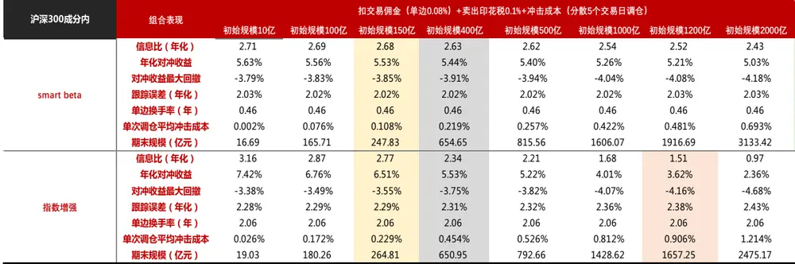

| 沪深300成分内 | 组合表现 | 扣交易佣金（单边0.08%）+卖出印花税0.1%+冲击成本（分散月内每天调仓） |  |  |  |  |  |  |  |
| --- | --- | --- | --- | --- | --- | --- | --- | --- | --- |
|  |  | 初始规模600亿 初始规模1000亿 初始规模1500亿 初始规模1600亿 |  |  |  | 初始规模2000亿 |  | 初始规模3000亿 初始规模5000亿 | 初始规模1万亿 |
| smart beta | 信息比（年化） | 2.67 | 2.65 | 2.63 | 2.62 | 2.61 | 2.57 | 2.51 | 2.39 |
|  | 年化对冲收益 | 5.54% | 5.49% | 5.45% | 5.44% | 5.41% | 5.33% | 5.21% | 4.95% |
|  | 对冲收益最大回撤 | -3.85% | -3.88% | -3.91% | -3.91% | -3.93% | -3.98% | -4.08% | -4.23% |
|  | 跟踪误差（年化） | 2.03% | 2.03% | 2.03% | 2.03% | 2.03% | 2.03% | 2.03% | 2.04% |
|  | 单边换手率（年） | 0.46 | 0.46 | 0.46 | 0.46 | 0.46 | 0.46 | 0.46 | 0.46 |
|  | 单次调仓平均冲击成本 | 0.106% | 0.156% | 0.205% | 0.215% | 0.251% | 0.337% | 0.484% | 0.793% |
|  | 期末规模（亿元） | 991.49 | 1645.12 | 2457.77 | 2619.43 | 3263.61 | 4856.04 | 7982.37 | 15521.48 |
| 指数增强 | 信息比（年化） | 2.76 | 2.58 | 2.39 | 2.35 | 2.23 | 1.95 | 1.51 | 0.76 |
|  | 年化对冲收益 | 6.51% | 6.08% | 5.62% | 5.54% | 5.23% | 4.57% | 3.53% | 1.75% |
|  | 对冲收益最大回撤 | -3.63% | -3.71% | -3.81% | -3.83% | -3.90% | -4.04% | -4.27% | -5.08% |
|  | 跟踪误差（年化） | 2.30% | 2.30% | 2.30% | 2.30% | 2.30% | 2.31% | 2.31% | 2.33% |
|  | 单边换手率（年） | 2.06 | 2.06 | 2.06 | 2.06 | 2.06 | 2.06 | 2.06 | 2.06 |
|  | 单次调仓平均冲击成本 | 0.229% | 0.328% | 0.433% | 0.453% | 0.525% | 0.680% | 0.928% | 1.368% |
|  | 期末规模（亿元） | 1059.43 | 1703.86 | 2460.12 | 2605.74 | 3172.92 | 4498.71 | 6856.37 | 11735.39 |

数据来源：东方证券研究所 & Wind 资讯

图 45：中证 500成分内的指数增强策略资金容量测算

| 中证500成分内 | 组合表现 | 扣交易佣金（单边0.08%）+卖出印花税0.1%+冲击成本 (单次调仓) |  |  |  |  |  |  |  |
| --- | --- | --- | --- | --- | --- | --- | --- | --- | --- |
|  |  | 初始规模10亿 | 初始规模80亿 | 初始规模100亿 | 初始规模130亿 | 初始规模140亿 | 初始规模170亿 | 初始规模180亿 | 初始规模200亿 |
| smart beta | 信息比（年化） | 1.51 | 1.27 | 1.22 | 1.15 | 1.13 | 1.07 | 1.05 | 1.02 |
|  | 年化对冲收益 | 2.88% | 2.46% | 2.38% | 2.26% | 2.23% | 2.13% | 2.10% | 2.03% |
|  | 对冲收益最大回撤 | -3.03% | -3.18% | -3.21% | -3.26% | -3.31% | -3.52% | -3.63% | -3.83% |
|  | 跟踪误差（年化） | 1.89% | 1.93% | 1.94% | 1.96% | 1.96% | 1.98% | 1.99% | 2.00% |
|  | 单边换手率（年） | 0.61 | 0.61 | 0.61 | 0.61 | 0.61 | 0.61 | 0.61 | 0.61 |
|  | 单次调仓平均冲击成本 | 0.095% | 0.446% | 0.517% | 0.616% | 0.648% | 0.738% | 0.767% | 0.822% |
|  | 期末规模（亿元） | 12.43 | 95.61 | 118.54 | 152.38 | 163.52 | 196.57 | 207.49 | 229.12 |
| 指数增强 | 信息比（年化） | 2.41 | 1.15 | 0.94 | 0.69 | 0.61 | 0.42 | 0.36 | 0.26 |
|  | 年化对冲收益 | 6.84% | 3.60% | 3.02% | 2.27% | 2.04% | 1.43% | 1.24% | 0.88% |
|  | 对冲收益最大回撤 | -2.54% | -3.15% | -3.42% | -3.76% | -3.87% | -4.15% | -4.57% | -6.06% |
|  | 跟踪误差（年化） | 2.77% | 3.13% | 3.22% | 3.35% | 3.39% | 3.51% | 3.55% | 3.62% |
|  | 单边换手率（年） | 2.47 | 2.47 | 2.47 | 2.47 | 2.47 | 2.47 | 2.47 | 2.47 |
|  | 单次调仓平均冲击成本 | 0.212% | 0.820% | 0.934% | 1.082% | 1.127% | 1.251% | 1.289% | 1.362% |
|  | 期末规模（亿元） | 17.25 | 105.70 | 125.79 | 153.43 | 162.10 | 186.68 | 194.45 | 209.50 |

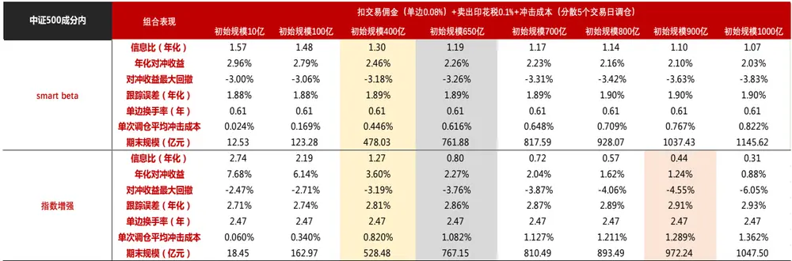

| 中证500成分内 | 组合表现 | 扣交易佣金（单边0.08%）+卖出印花税0.1%+冲击成本（分散月内每天调仓） |  |  |  |  |  |  |  |
| --- | --- | --- | --- | --- | --- | --- | --- | --- | --- |
|  |  | 初始规模1000亿 初始规模1600亿 |  | 初始规模2000亿 | 初始规模2600亿 | 初始规模3000亿 | 初始规模3500亿 | 初始规模3600亿 | 初始规模5000亿 |
| smart beta | 信息比（年化） | 1.39 | 1.31 | 1.27 | 1.21 | 1.17 | 1.13 | 1.12 | 1.02 |
|  | 年化对冲收益 | 2.61% | 2.47% | 2.39% | 2.28% | 2.21% | 2.13% | 2.11% | 1.91% |
|  | 对冲收益最大回撤 | -3.06% | -3.08% | -3.10% | -3.12% | -3.20% | -3.39% | -3.44% | -4.09% |
|  | 跟踪误差（年化） | 1.88% | 1.88% | 1.88% | 1.88% | 1.88% | 1.88% | 1.88% | 1.88% |
|  | 单边换手率（年） | 0.61 | 0.61 | 0.61 | 0.61 | 0.61 | 0.61 | 0.61 | 0.61 |
|  | 单次调仓平均冲击成本 | 0.317% | 0.436% | 0.506% | 0.603% | 0.664% | 0.736% | 0.750% | 0.931% |
|  | 期末规模（亿元） | 1212.66 | 1913.88 | 2373.26 | 3051.12 | 3496.81 | 4046.75 | 4155.82 | 5657.37 |
| 指数增强 | 信息比（年化） | 1.69 | 1.32 | 1.11 | 0.84 | 0.69 | 0.51 | 0.47 | 0.06 |
|  | 年化对冲收益 | 4.67% | 3.61% | 3.04% | 2.29% | 1.85% | 1.36% | 1.27% | 0.12% |
|  | 对冲收益最大回撤 | -2.99% | -3.20% | -3.33% | -3.52% | -3.81% | -4.33% | -4.50% | -9.76% |
|  | 跟踪误差（年化） | 2.72% | 2.73% | 2.73% | 2.73% | 2.74% | 2.74% | 2.74% | 2.74% |
|  | 单边换手率（年） | 2.47 | 2.47 | 2.47 | 2.47 | 2.47 | 2.47 | 2.47 | 2.47 |
|  | 单次调仓平均冲击成本 | 0.616% | 0.821% | 0.934% | 1.082% | 1.170% | 1.270% | 1.289% | 1.525% |
|  | 期末规模（亿元） | 1445.62 | 2116.69 | 2520.42 | 3074.66 | 3417.57 | 3821.69 | 3899.23 | 4903.94 |

数据来源：东方证券研究所 & Wind 资讯

## 四、 总结

Smart Beta 是伴随资本市场有效性提高的产物，收益来源和 Alpha产品类似，但获得因子暴露的方式不同，策略换手率低，资金容量更大。在目前 A股充裕的 alpha环境下，Alpha产品的收益更高，扩大选股范围、增加持仓股票数量、分散调仓交易都可以增加 alpha策略的资金容量，但当资金规模增加到一定水平时，它的收益很多会被交易冲击成本抹去，最终和 Smart Beta 产品持平。以常用的沪深 300和中证 500指数增强产品为例，按照 A股历史的 alpha和流动性水平估算，当前单策略新增资金量达到 1500亿左右时，策略的收益会和对应的 Smart Beta 产品基本持平。

## 风险提示

1. 量化模型基于历史数据分析得到，未来存在失效的风险，建议投资者紧密跟踪模型表现。

2. 极端市场环境可能对模型效果造成剧烈冲击，导致收益亏损。

## 参考文献

1.《我国主动与被投资管理产品比较分析》，中证指数公司

2. Arnott R, Beck N, Kalesnik V. Forecasting Factor and Smart Beta Returns[M]//Research Affiliates. 2017.

3. Berk J B, van Binsbergen J H. Measuring economic rents in the mutual fund industry[J]. NBER Working Paper, 2012, 18184.

4. Brown D C, Davies S W. Moral hazard in active asset management[J]. Journal of Financial Economics, 2017, 125(2): 311-325.

5. Chow T M, Li F, Pickard A, et al. Cost and Capacity: Comparing Smart Beta Strategies[J]. Research Affiliates (July), 2017.

6. Crane A D, Crotty K. Passive versus Active Fund Performance: Do Index Funds Have Skill?[J]. Journal of Financial and Quantitative Analysis, 2018, 53(1): 33-64.

7. Cremers M, Petajisto A, Zitzewitz E. Should benchmark indices have alpha? Revisiting performance evaluation[R]. National Bureau of Economic Research, 2012.

8. Fama E F, French K R. Luck versus skill in the cross‐section of mutual fund returns[J]. The journal of finance, 2010, 65(5): 1915-1947.

9．《Five-year trends and outlook for smart beta》, FTSE Russell

10. Guercio D D, Reuter J. Mutual fund performance and the incentive to generate alpha[J]. The Journal of Finance, 2014, 69(4): 1673-1704.

11. Kestner L. Quantitative trading strategies: harnessing the power of quantitative techniques to create a winning trading program[M]. McGraw-Hill Professional, 2003.

12. Kissell R L. Algorithmic trading strategies[J]. 2006.

13. O'Neill M J, Warren G J. Evaluating fund capacity: Issues and Methods[J]. Accounting & Finance, 2017.

## Table_Disclaimer 分析师申明

每位负责撰写本研究报告全部或部分内容的研究分析师在此作以下声明：

分析师在本报告中对所提及的证券或发行人发表的任何建议和观点均准确地反映了其个人对该证券或发行人的看法和判断；分析师薪酬的任何组成部分无论是在过去、现在及将来，均与其在本研究报告中所表述的具体建议或观点无任何直接或间接的关系。

## 投资评级和相关定义

报告发布日后的 12个月内的公司的涨跌幅相对同期的上证指数/深证成指的涨跌幅为基准；

## 公司投资评级的量化标准

买入：相对强于市场基准指数收益率 15%以上；

增持：相对强于市场基准指数收益率 5%～15%；

中性：相对于市场基准指数收益率在-5%～+5%之间波动；

减持：相对弱于市场基准指数收益率在-5%以下。

未评级——由于在报告发出之时该股票不在本公司研究覆盖范围内，分析师基于当时对该股票的研究状况，未给予投资评级相关信息。

暂停评级——根据监管制度及本公司相关规定，研究报告发布之时该投资对象可能与本公司存在潜在的利益冲突情形；亦或是研究报告发布当时该股票的价值和价格分析存在重大不确定性，缺乏足够的研究依据支持分析师给出明确投资评级；分析师在上述情况下暂停对该股票给予投资评级等信息，投资者需要注意在此报告发布之前曾给予该股票的投资评级、盈利预测及目标价格等信息不再有效。

## 行业投资评级的量化标准：

看好：相对强于市场基准指数收益率 5%以上；

中性：相对于市场基准指数收益率在-5%～+5%之间波动；

看淡：相对于市场基准指数收益率在-5%以下。

未评级：由于在报告发出之时该行业不在本公司研究覆盖范围内，分析师基于当时对该行业的研究状况，未给予投资评级等相关信息。

暂停评级：由于研究报告发布当时该行业的投资价值分析存在重大不确定性，缺乏足够的研究依据支持分析师给出明确行业投资评级；分析师在上述情况下暂停对该行业给予投资评级信息，投资者需要注意在此报告发布之前曾给予该行业的投资评级信息不再有效。

## HeadertTabl e_Discl ai mer 免责声明

本证券研究报告（以下简称“本报告”）由东方证券股份有限公司（以下简称“本公司”）制作及发布。

本报告仅供本公司的客户使用。本公司不会因接收人收到本报告而视其为本公司的当然客户。本报告的全体接收人应当采取必要措施防止本报告被转发给他人。

本报告是基于本公司认为可靠的且目前已公开的信息撰写，本公司力求但不保证该信息的准确性和完整性，客户也不应该认为该信息是准确和完整的。同时，本公司不保证文中观点或陈述不会发生任何变更，在不同时期，本公司可发出与本报告所载资料、意见及推测不一致的证券研究报告。本公司会适时更新我们的研究，但可能会因某些规定而无法做到。除了一些定期出版的证券研究报告之外，绝大多数证券研究报告是在分析师认为适当的时候不定期地发布。

在任何情况下，本报告中的信息或所表述的意见并不构成对任何人的投资建议，也没有考虑到个别客户特殊的投资目标、财务状况或需求。客户应考虑本报告中的任何意见或建议是否符合其特定状况，若有必要应寻求专家意见。本报告所载的资料、工具、意见及推测只提供给客户作参考之用，并非作为或被视为出售或购买证券或其他投资标的的邀请或向人作出邀请。

本报告中提及的投资价格和价值以及这些投资带来的收入可能会波动。过去的表现并不代表未来的表现，未来的回报也无法保证，投资者可能会损失本金。外汇汇率波动有可能对某些投资的价值或价格或来自这一投资的收入产生不良影响。那些涉及期货、期权及其它衍生工具的交易，因其包括重大的市场风险，因此并不适合所有投资者。

在任何情况下，本公司不对任何人因使用本报告中的任何内容所引致的任何损失负任何责任，投资者自主作出投资决策并自行承担投资风险，任何形式的分享证券投资收益或者分担证券投资损失的书面或口头承诺均为无效。

本报告主要以电子版形式分发，间或也会辅以印刷品形式分发，所有报告版权均归本公司所有。未经本公司事先书面协议授权，任何机构或个人不得以任何形式复制、转发或公开传播本报告的全部或部分内容。不得将报告内容作为诉讼、仲裁、传媒所引用之证明或依据，不得用于营利或用于未经允许的其它用途。

经本公司事先书面协议授权刊载或转发的，被授权机构承担相关刊载或者转发责任。不得对本报告进行任何有悖原意的引用、删节和修改。

提示客户及公众投资者慎重使用未经授权刊载或者转发的本公司证券研究报告，慎重使用公众媒体刊载的证券研究报告。

## 东方证券研究所

地址：上海市中山南路 318 号东方国际金融广场 26 楼

联系人： 王骏飞

电话： 021-63325888*1131

传真：021-63326786

网址： www.dfzq.com.cn

Email： wangjunfei@orientsec.com.cn