## Table_Sum ary 研究结论

如果没有额外的信息或者大资金的强行介入、股票的日内交易特征应该处于较稳定状态，反之如果股票的日内价量特征很不稳定，那么该股票大概率有信息溢出或者被幕后大资金操控，而此时应该是考虑离场的时候了。

我们基于日内 5分钟线计算了日内收益率的波动率、偏度、峰度和日内成交量的波动率、偏度、峰度和 HHI 指数共 7个日内交易特征，考虑到时间序列自相关性，我们采用 Newey-West 调整标准差度量日内交易特征的稳定性（SDRVOL，SDRSKEW，SDRKURT，SDVVOL，SDVSKEW，SDVKURT和 SDVHHI）。

7 个日内交易特征稳定性因子在各个样本空间均展现出日内交易特征稳定性越差的股票未来平均收益越低的选股效果，而且部分因子在大市值股票内的选股效果并没有明显比小市值股票差，比如 SDRVOL 在沪深 300 中的RankIC 均值为 6.57%，而在中证 1000 中为 6.56%。

从时间序列上看，日内交易特征稳定性因子在最近几年的 alpha没有衰减的趋势，近几年部分技术类 alpha 因子在大票中失效，但日内交易特征稳定性因子在沪深 300依然有显著的多头收益。

- 平均来看，日内交易特征稳定性因子的空头收益强于多头，但沪深 300成分股内 SDRVOL和 SDVVOL的多头年化对冲收益依然高达 7%以上。

7 个日内交易特征稳定性因子内部存在替代关系，SDRVOL、SDVVOL 和SDVHHI 信息相对独立。虽然两两来看这三个因子和常见的技术类 alpha因子相关性都低，但剔除各大类因子后仅 SDRVOL、SDVVOL 有独立的显著选股效果。

在引入日内相关的技术类因子（SDRVOL、SDVVOL和日内特质偏度）后沪深 300和中证 500增强模型在跟踪误差、回撤和换手相差不大的情况下能提升组合收益，在投机反转类权重占比较大的模型中这种差异更加显著。

Table_ReportDate 报告发布日期2019 年 01 月 14 日

Table_Autho 证券分析师朱剑涛

021-63325888*6077

zhujiantao@orientsec.com.cn

日内交易特征稳定性因子在沪深 300 成分股内的分组年化对冲收益

执业证书编号：S0860515060001

王星星

021-63325888-6108

wangxingxing@orientsec.com.cn

执业证书编号：S0860517100001

- 量化模型失效风险

Table_Contacter 联系人王星星

021-63325888-6108

wangxingxing@orientsec.com.cn

## Table_Report 相关报告

Alpha 与 Smart Beta 2018-12-02

A股涨跌幅排行榜效应 2018-11-20

绩效归因与基金投资分析工具2018-10-26

## 风险提示

- 市场极端环境的冲击

|  | 第1组 第2组 |  | 第3组 第4组 第5组 第6组 第7组 |  |  |  |  | 第8组 第9组 第10组 |  |  |
| --- | --- | --- | --- | --- | --- | --- | --- | --- | --- | --- |
| SDRVOL | 7.72% | 4.38% | 3.18% | 3.73% | -2.81% | 1.27% | -2.59% | -3.93%-4.04% |  | -8.07% |
| SDRSKEW | 5.43% | 3.30% | -1.10% | 1.07% | 2.10% | 1.11% | 0.71% | -2.82% | -2.79% | -8.70% |
| SDKURT | 4.88% | 6.68% | 2.40% | 1.01% | -2.99% | 1.86% | -0.67% | -3.86% | -2.50% | -8.04% |
| SDVVOL | 10.22% | -0.03% | -2.37% | 2.22% | -0.44% | -0.84% | -3.25% | 2.02% | -2.79% | -6.07% |
| SDVSKEW | 0.26% | -0.12% | 0.92% | 5.29% | 3.72% | -1.28% | -2.17% | 1.65% | -3.66% | -6.21% |
| SDVKURT | -0.93% | 3.50% | 2.13% | 3.85% | -1.93% | 0.07% | 1.51% | -1.82% | -1.14% | -6.70% |
| SDVHHI | 4.27% | 3.28% | 3.90% | 1.98% | 2.13% | 0.73% | 1.40% | 0.18% | -6.90% | -12.06% |

## 一、日内交易特征及其稳定性

## 投机与日内交易特征稳定性

我们在前期报告《投机、交易行为与股票收益（上）》中提到投机程度强的股票未来预期收益更低，并基于日线交易数据提出了特征波动率、特异度、价格时滞、市值调整换手四个交易行为类指标，本文从日内交易特征稳定性的角度扩充股票投机程度的度量，全文主要验证了一个朴实的想法：

如果没有额外的信息或者大资金的强行介入，股票的日内交易特征应该处干较稳定状态，那么股票的日内价量特征应该处于一个较小的波动范围内，反之如果股票的日内价量特征很不稳定那么该股票大概率有信息溢出或者被幕后大资金操控，而此时便是一个睿智的投资者离场的时候了。

接下来，我们首先探讨如何度量股票日内交易特征的稳定性，然后考察日内交易特征稳定性的横截面选股效果、最后也分析了日内交易特征稳定性对现有 alpha因子的信息增量。

## 日内交易特征及其稳定性的度量

几乎所有的交易行为都会反映在股票的价和量上，交易行为的特征也即价和量的特征，我们基于日内 5 分钟线计算了每只股票在每个交易日的日内涨跌幅和成交量的统计特征，然后再考察个股的这些日内特征在时间序列的稳定性。

在每只股票的每个交易日，日内的 48个 K线对应着 48个 5分钟收益率（不考虑开盘价相对昨日收盘的跳开），利用这48个收益率我们分别计算股票i在交易t的日内收益率的波动率 $RVOL_{i,t}$ 偏度 $RSKEW_{i,t}$ 和峰度 $[RKURT_{i,t}$

日内收益率的波动：

$$
RVOL_{i,t}=\sqrt{\frac{1}{K}{\sum}_{k=1}^{K=48}(r_{k}-\bar{r})^{2}}
$$

日内收益率的偏度：

$$
RSKEW_{i,t}=\frac{\frac{1}{K}\sum_{k=1}^{K=48}(r_{k}-\bar{r})^{3}}{RVOL_{i,t}^{3}}
$$

日内收益率的峰度：

$$
RKURT_{i,t}=\frac{\frac{1}{K}{\sum_{k=1}^{K=48}(r_{k}-\bar{r})^{4}}}{RVOL_{i,t}^{4}}
$$

其中， $r_{k}$ 表示股票 i 在交易日 t 的第 k 个 5 分钟收益率，r̅表示 $r_{k}$ 的样本均值，为表达简洁，均省略下标 i 和 t。

类似的，我们也可以计算日内5分钟成交量的波动率 ${1VVOL}_{i,t}$ 、偏度 $VSKEW_{i,t}$ 和峰度 $VKURT_{i,t}$ 除此之外我们还通过赫芬达尔—赫希曼指数(Herfindahl-Hirschman Index，简称 HHI）考察了日内成交量在不同交易时间分布的离散程度，股票 i在交易日 t的 HHI指数定义如下：

$$
VHHI_{i,t}=et{}{_{k=1}^{K=48}}\sum_{k=1}^{K=48}\left(\frac{v_{k}}{\sum_{k=1}^{K=48}v_{k}}\right)^{2}
$$

其中， $v_{k}$ 表示股票 i 在交易日 t 的第 k 个 5 分钟成交量。

上面我们定义了 7个日内交易特征（3个与日内涨跌幅有关、4个与日内成交量有关），考虑到股票的日内统计特征或多或少都存在时间序列上的自相关性，我们采用 Newey West 调整后的标准差度量股票在过去一段时间内的稳定性，另外由于日内涨跌幅的波动率 $.RVOL_{i,t}$ 和成交量的波动率 $VVOL_{i,t}$ 、两个股票日内特征受数据量纲影响，因此我们采用其均值对时间序列波动进行调整，即

$$
\begin{aligned}&SDRVOL_{i,t}=\sigma^{WW}\big(RVOL_{i,t}\big)/\mu\big(RVOL_{i,t}\big)\\&SDVVOL_{i,t}=\sigma^{WW}\big(VVOL_{i,t}\big)/\mu\big(VVOL_{i,t}\big)\\\end{aligned}
$$

而其他几个特征与量纲无关，可以直接取时间序列上的 Newey West 标准差作为相应的稳定性度量 $\underline{{\underline{{1}}}}SDRSKEW_{i,t}$ 、 $SDRKURT_{i,t}$ 、SDVSKE $W_{i,t}$ $SDVKURT_{i,t}$ 、 $SDVHHI_{i,t}$ 。本文默认以过去一个月的日内交易特征计算 Newey West 标准差，但考虑到不同投资者的需求，我们也计算了不同计算周期下的因子选股表现。

关于日内交易特征的度量有两个缺陷在这里需要说明：

（1）对于成交极不活跃的股票，日内交易特征的度量可能会严重失真，日内交易特征的度量涉及到日内 5分钟线的量和价，但如果在 5分钟区间内股票几乎没有成交时，股票涨跌幅为 0，成交量分布的随机性也较大，导致日内交易特征的度量失真，这在流动性较差的小市值股票中更加明显。

（2）个股的价量变动受市场风格影响，上述度量并没有考虑该影响。当市场波动较大时个股波动也会较大，但由于不同个股的风格暴露不尽相同所以也会有不同影响，另外个股的成交量也可能会同市场同步变化，我们尝试过用 Fama-French风格调整后的 5分钟收益率和全市场加权成交量调整后的 5 分钟成交量计算上述日内交易特征及其稳定性，发现对本文主要结论影响不大，风格调整后的收益率度量对下文中探讨的选股表现会有更好的结果，但市场调整后的成交量度量选股表现略弱于原始成交量度量。

## 二、日内交易特征稳定性的选股表现

本章从传统的 RankIC 和因子分组（10组）两个维度考察 7个日内交易特征稳定性因子的选股有效性，考虑到部分投资者比较担心基于日内计算的选股因子换手较高或者在大票中选股效果不理想，本章也着重考虑了因子在不同计算周期下的选股效果及其在沪深 300 等大市值样本空间的表现。考虑到日内数据的可获得性，我们的因子考察期间起始于 201012至 201812。

## 不同样本空间的选股表现

对比日内交易特征稳定性因子在各个样本空间的选股表现，首先，7 个日内特征稳定性因子的月度 RankIC均值（无论原始值还是中性值）均为负，即日内交易特征波动越大的个股未来平均收益更差，7个不同度量因子的一致表现相互印证了我们的核心假设；其次，不同 alpha因子表现上存在差异，其中 SDRVOL、SDVVOL、SDVHHI 三个因子在各个样本空间的原始值 RanKIC 均值都超过 5%，而偏度、峰度相关的 4个稳定性因子相对较弱；最后，我们发现因子在各个样本空间内的表现相差不大，大多数技术内 alpha因子在大市值样本空间内表现相对较差，而几个日内交易特征稳定性因子在沪深 300 等大票中的 RankIC 等并不比中证 500 等要差，这可能与日内特征的度量有关，大市值股票成交更加活跃，日内 5 分钟线的可信度更高，日内特征的度量也更加可靠。

图 1：日内交易特征稳定性因子在各个样本空间的表现
日内收益波动的波动率 SDRVOL:

|  | 行业市值中性化因子 |  |  | 原始因子 |  |  |  |  |  |  |
| --- | --- | --- | --- | --- | --- | --- | --- | --- | --- | --- |
|  | RankIC | IC_IR | t_value | RankIC | IC_IR | t_value | 多空月收益 | 夏普率 | 月胜率 | 最大回撤 |
| 中证全指 | -5.89% | -4.04 | -11.41 | -6.45% | -2.98 | -8.43 | 1.85% | 2.22 | 82.29% | -17.96% |
| 沪深300 | -4.48% | -2.47 | -7.00 | -6.57% | -1.84 | -5.19 | 1.33% | 1.09 | 69.79% | -24.93% |
| 中证500 | -4.51% | -2.46 | -6.96 | -5.31% | -2.27 | -6.41 | 1.27% | 1.62 | 71.88% | -17.65% |
| 中证800 | -4.73% | -2.84 | -8.03 | -5.81% | -2.18 | -6.17 | 1.36% | 1.50 | 71.88% | -19.95% |
| 中证1000 | -6.15% | -3.92 | -11.10 | -6.56% | -3.17 | -8.98 | 2.04% | 2.62 | 77.08% | -11.63% |

日内收益偏度的波动率 SDRSKEW:

|  | 行业市值中性化因子 |  |  | 原始因子 |  |  |  |  |  |  |
| --- | --- | --- | --- | --- | --- | --- | --- | --- | --- | --- |
|  | RankIC | IC_IR | t_value | RankIC | IC_IR | t_value | 多空月收益 | 夏普率 | 月胜率 | 最大回撤 |
| 中证全指 | -4.32% | -3.52 | -9.96 | -4.36% | -2.18 | -6.18 | 0.96% | 1.35 | 60.42% | -10.69% |
| 沪深300 | -3.64% | -1.95 | -5.52 | -4.92% | -1.49 | -4.20 | 1.15% | 0.96 | 65.63% | -15.96% |
| 中证500 | -2.88% | -1.64 | -4.63 | -3.35% | -1.59 | -4.51 | 0.41% | 0.61 | 53.13% | -13.71% |
| 中证800 | -3.46% | -2.32 | -6.56 | -3.84% | -1.57 | -4.45 | 0.72% | 0.85 | 52.08% | -14.53% |
| 中证1000 | -3.90% | -2.62 | -7.40 | -4.26% | -2.42 | -6.83 | 1.02% | 1.46 | 63.54% | -16.13% |

日内收益峰度的波动率 SDRKURT:

|  | 行业市值中性化因子 |  |  | 原始因子 |  |  |  |  |  |  |
| --- | --- | --- | --- | --- | --- | --- | --- | --- | --- | --- |
|  | RankIC | IC_IR | t_value | RankIC | IC_IR | t_value | 多空月收益 | 夏普率 | 月胜率 | 最大回撤 |
| 中证全指 | -4.34% | -3.66 | -10.36 | -4.42% | -2.41 | -6.83 | 1.07% | 1.59 | 70.83% | -11.78% |
| 沪深300 | -3.70% | -2.12 | -6.00 | -5.36% | -1.78 | -5.04 | 1.09% | 0.99 | 65.63% | -23.31% |
| 中证500 | -3.33% | -2.07 | -5.85 | -3.61% | -1.73 | -4.88 | 0.64% | 0.85 | 54.17% | -14.16% |
| 中证800 | -3.64% | -2.55 | -7.21 | -4.22% | -1.88 | -5.31 | 0.81% | 1.05 | 63.54% | -14.68% |
| 中证1000 | -3.95% | -2.97 | -8.40 | -4.18% | -2.47 | -6.99 | 1.24% | 1.81 | 65.63% | -8.28% |

日内成交量波动的波动率 SDVVOL:

|  | 行业市值中性化因子 |  |  | 原始因子 |  |  |  |  |  |  |
| --- | --- | --- | --- | --- | --- | --- | --- | --- | --- | --- |
|  | RankIC | IC_IR | t_value | RankIC | IC_IR | t_value | 多空月收益 | 夏普率 | 月胜率 | 最大回撤 |
| 中证全指 | -6.62% | -4.47 | -12.63 | -6.75% | -3.30 | -9.33 | 1.65% | 2.28 | 79.17% | -9.45% |
| 沪深300 | -4.32% | -2.22 | -6.29 | -5.06% | -1.55 | -4.38 | 1.33% | 1.09 | 69.79% | -33.46% |
| 中证500 | -5.51% | -3.27 | -9.26 | -6.12% | -2.47 | -6.98 | 1.10% | 1.44 | 63.54% | -16.86% |
| 中证800 | -5.12% | -3.11 | -8.81 | -5.91% | -2.26 | -6.40 | 1.22% | 1.39 | 75.00% | -20.83% |
| 中证1000 | -6.28% | -3.57 | -10.09 | -6.44% | -3.00 | -8.49 | 1.50% | 1.97 | 75.00% | -11.21% |

日内成交量偏度的波动率 SDVSKEW:

|  | 行业市值中性化因子 |  |  | 原始因子 |  |  |  |  |  |  |
| --- | --- | --- | --- | --- | --- | --- | --- | --- | --- | --- |
|  | RankIC | IC_IR | t_value | RankIC | IC_IR | t_value | 多空月收益 | 夏普率 | 月胜率 | 最大回撤 |
| 中证全指 | -3.58% | -2.89 | -8.17 | -3.35% | -2.00 | -5.65 | 0.98% | 1.79 | 67.71% | -8.82% |
| 沪深300 | -2.40% | -1.30 | -3.68 | -2.80% | -1.07 | -3.02 | 0.56% | 0.62 | 55.21% | -26.66% |
| 中证500 | -3.41% | -2.12 | -6.00 | -3.24% | -1.36 | -3.86 | 1.07% | 1.42 | 67.71% | -12.24% |
| 中证800 | -2.68% | -1.69 | -4.79 | -2.93% | -1.28 | -3.62 | 0.80% | 1.13 | 62.50% | -17.81% |
| 中证1000 | -4.03% | -2.66 | -7.53 | -3.84% | -1.99 | -5.63 | 1.00% | 1.50 | 63.54% | -9.88% |

日内成交量峰度的波动率 SDVKURT:

|  | 行业市值中性化因子 |  |  | 原始因子 |  |  |  |  |  |  |
| --- | --- | --- | --- | --- | --- | --- | --- | --- | --- | --- |
|  | RankIC | IC_IR | t_value | RankIC | IC_IR | t_value | 多空月收益 | 夏普率 | 月胜率 | 最大回撤 |
| 中证全指 | -3.50% | -2.62 | -7.42 | -3.11% | -1.70 | -4.81 | 1.03% | 1.73 | 67.71% | -7.88% |
| 沪深300 | -2.62% | -1.47 | -4.16 | -2.66% | -0.98 | -2.76 | 0.49% | 0.53 | 60.42% | -34.25% |
| 中证500 | -3.37% | -1.97 | -5.58 | -3.21% | -1.26 | -3.57 | 0.91% | 1.18 | 60.42% | -14.22% |
| 中证800 | -2.68% | -1.66 | -4.69 | -2.78% | -1.14 | -3.23 | 0.67% | 0.84 | 58.33% | -24.95% |
| 中证1000 | -4.07% | -2.62 | -7.40 | -3.80% | -1.86 | -5.25 | 1.18% | 1.79 | 67.71% | -8.50% |

日内成交量 HHI指数的波动率 SDVHHI:

|  | 行业市值中性化因子 |  |  | 原始因子 |  |  |  |  |  |  |
| --- | --- | --- | --- | --- | --- | --- | --- | --- | --- | --- |
|  | RankIC | IC_IR | t_value | RankIC | IC_IR | t_value | 多空月收益 | 夏普率 | 月胜率 | 最大回撤 |
| 中证全指 | -4.78% | -2.54 | -7.19 | -5.24% | -2.33 | -6.60 | 1.51% | 2.09 | 71.88% | -11.00% |
| 沪深300 | -4.60% | -2.16 | -6.11 | -5.98% | -1.74 | -4.92 | 1.43% | 1.24 | 65.63% | -21.87% |
| 中证500 | -4.36% | -2.25 | -6.37 | -5.28% | -1.93 | -5.45 | 1.21% | 1.43 | 63.54% | -18.33% |
| 中证800 | -4.28% | -2.30 | -6.50 | -5.49% | -1.96 | -5.55 | 1.32% | 1.50 | 68.75% | -11.00% |
| 中证1000 | -5.17% | -2.98 | -8.44 | -5.44% | -2.40 | -6.78 | 1.61% | 2.11 | 76.04% | -8.52% |

数据来源：wind 咨询、东方证券研究所

## Alpha 的时间序列特点

最近几年很多技术类 alpha 的表现较弱，有些虽然从全市场的多空来看 alpha 仍在，但在多头端，或者大市值股票中几乎没有超额收益甚至起到负向作用，我们计算了 7 个日内特征稳定性因子在中证全指和沪深 300 样本空间中的多空对冲组合（分 10 组，第一组对冲第 10 组）和多头多空组合（第 1组对冲样本空间等权）的时间序列净值。

从时间序列来看，几个交易特征稳定性因子在 2014年至 2015年表现较差，回撤较大，但最近 3 年的多空组合和多头组合净值走势的斜率并没有变平，相比之下、反转因子、特异度等常见的技术类 alpha在沪深 300成分股内最近 3年几乎没有选股效果。

图 2：日内交易特征稳定性因子的时间序列表现（中证全指）

多空对冲组合净值:

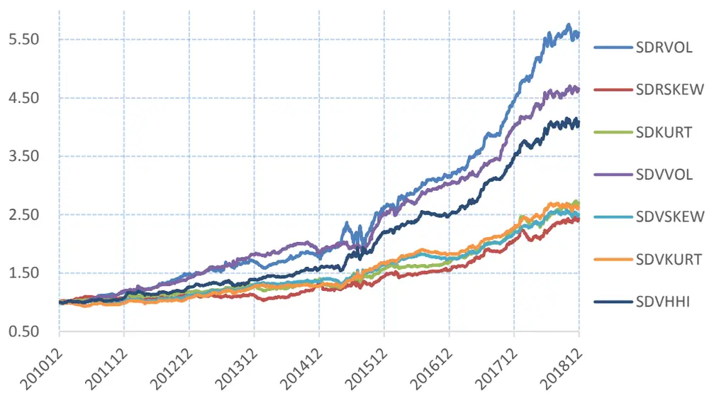
多头对冲组合净值:

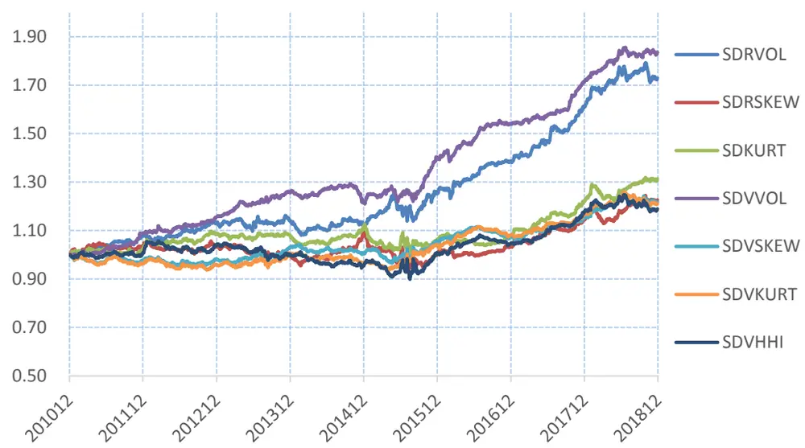
数据来源：wind 咨询、东方证券研究所

图 3：日内交易特征稳定性因子的时间序列表现（沪深 300）
多空对冲组合净值:
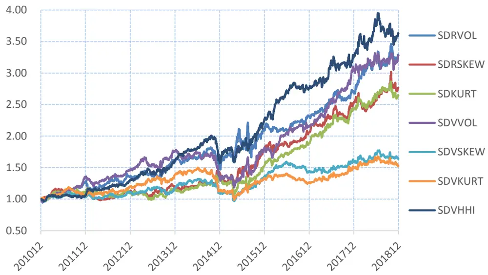
多头对冲组合净值:

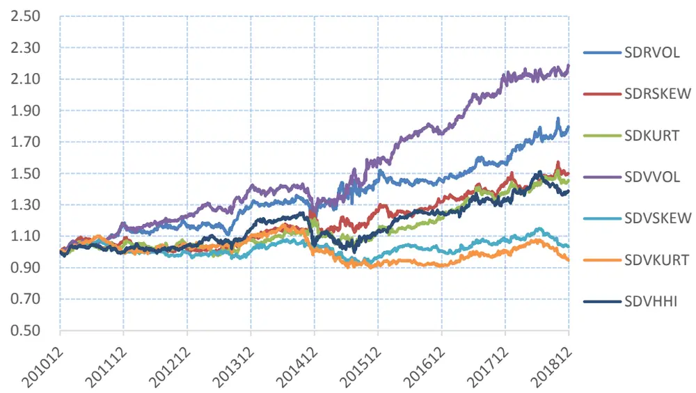
数据来源：wind 咨询、东方证券研究所

沪深 300：

## 多空收益的非对称性

另外一个大家关注比较多的问题是，大多技术类 alpha 因子的收益主要集中在空头、多头端的相对收益很弱，甚至可以忽略不计。为考察日内交易特征稳定性因子的多空收益的非对称性，我们统计了 7 个交易特征稳定性因子原始值在各个样本空间内分组（分为 10 组，第 1 组因子值最低，第 10组最高，等权构建组合）的年化对冲收益（相对样本空间等权）。

从结果来看，在各个样本空间，各个因子的空头收益相对多头收益的确更加明显，但在沪深300 这样的大市值样本空间内这种非对称性相对较弱，尤其是 SDRVOL 和 SDVVOL 两个跟日内波动相关的因子，在沪深 300成分股内的多头组合年化对冲收益高达 7%以上。

图 4：日内交易特征稳定性因子各个样本空间分组年化对冲收益（原始值，相对样本空间等权）中证全指:

|  | 第1组 | 第2组 | 第3组 | 第4组 | 第5组 | 第6组 | 第7组 | 第8组 | 第9组 | 第10组 |
| --- | --- | --- | --- | --- | --- | --- | --- | --- | --- | --- |
| SDRVOL | 6.85% | 6.17% | 4.79%4.88% |  | 2.53% -0.52% |  | -1.21% | -3.44% | -4.80% | -14.23% |
| SDRSKEW | 2.60% | 3.03% | 1.41% | 2.33% | 3.10% | 1.81% | -0.79% | -1.25% | -3.53% | -8.81% |
| SDKURT | 3.48% | 3.39% | 1.97% | 2.57% | 2.53% | 0.29% | 0.05% | -1.20% | -4.18% | -8.94% |
| SDVVOL | 7.84% | 6.10% | 3.99% | 3.04% | 1.34% | 0.36% | -1.55% | -3.74% | -5.21% | -11.35% |
| SDVSKEW | 2.53% | 2.60% | 2.76% | 1.98% | 2.03% | 0.99% | 1.47% | -1.17% | -4.19% | -8.90% |
| SDVKURT | 2.51% | 1.39% | 2.83% | 3.13% | 1.00% | 1.84% | 0.88% | -0.35% | -3.54% | -9.47% |
| SDVHHI | 2.25% | 4.65% | 4.26% | 3.28% | 4.09% 3.96% |  | 1.36% | -2.92% | -5.16% | -14.74% |

|  | 第1组 | 第2组 | 第3组 第4组 第5组 |  |  | 第6组 第7组 |  | 第8组 第9组 |  | 第10组 |
| --- | --- | --- | --- | --- | --- | --- | --- | --- | --- | --- |
| SDRVOL | 7.72% | 4.38% | 3.18% | 3.73% | -2.81% | 1.27% | -2.59% | -3.93%-4.04% |  | -8.07% |
| SDRSKEW | 5.43% | 3.30% | -1.10% | 1.07% | 2.10% | 1.11% | 0.71% | -2.82% | -2.79% | -8.70% |
| SDKURT | 4.88% | 6.68% | 2.40% | 1.01% | -2.99% | 1.86% | -0.67% | -3.86% | -2.50% | -8.04% |
| SDVVOL | 10.22% | -0.03% | -2.37% | 2.22% | -0.44% | -0.84% | -3.25% | 2.02% | -2.79% | -6.07% |
| SDVSKEW | 0.26% | -0.12% | 0.92% | 5.29% | 3.72% | -1.28% | -2.17% | 1.65% | -3.66% | -6.21% |
| SDVKURT | -0.93% | 3.50% | 2.13% | 3.85% | -1.93% | 0.07% | 1.51% | -1.82% | -1.14% | -6.70% |
| SDVHHI | 4.27% | 3.28% | 3.90% | 1.98% | 2.13% | 0.73% | 1.40% | 0.18% | -6.90% | -12.06% |

中证 500：

|  | 第1组 | 第2组 | 第3组 | 第4组 | 第5组 | 第6组 | 第7组 | 第8组 | 第9组 | 第10组 |
| --- | --- | --- | --- | --- | --- | --- | --- | --- | --- | --- |
| SDRVOL | 4.28% | 4.55% | 2.00% | 3.79% | 2.53% | 0.80% | -1.72% | -3.52% | -2.79% | -10.35% |
| SDRSKEW | 1.02% | 1.73% | 1.83% | 0.30% | 0.84% | 3.01% | -0.63% | -1.71% | -3.69% | -4.03% |
| SDKURT | 2.16% | 3.06% | -0.38% | 2.71% | 2.59% | 0.85% | -5.50% | 1.75% | -2.48% | -5.54% |
| SDVVOL | 4.33% | 4.42% | 7.46% | 0.35% | 1.94% | 1.89% | -4.30% | -3.93% | -3.80% | -8.47% |
| SDVSKEW | 3.32% | 2.01% | 1.88% | 0.13% | 2.08% | 3.09% | -1.54% | -0.12% | -2.65% | -8.98% |
| SDVKURT | 2.13% | 2.65% | 2.06% | 1.23% | 2.50% | 0.39% | 0.22% | 1.83% | -5.26% | -8.41% |
| SDVHHI | 1.97% | 4.64% | 2.68% | 4.76% | 2.16% | 4.47% | -0.26% | -3.94% | -4.29% | -12.01% |

中证 800：

|  | 第1组 | 第2组 | 第3组 | 第4组 | 第5组 | 第6组 | 第7组 | 第8组 | 第9组 | 第10组 |
| --- | --- | --- | --- | --- | --- | --- | --- | --- | --- | --- |
| SDRVOL | 6.45% | 3.75% | 2.89% | 2.80% | 2.37% | -1.53% | -1.04% | -2.37% | -4.32% | -9.47% |
| SDRSKEW | 2.85% | 1.63% | 1.49% | -0.84% | 2.74% | 1.36% | 1.14% | -1.62% | -3.52% | -5.96% |
| SDKURT | 2.82% | 4.06% | 2.92% | 0.19% | 0.49% | 1.98% | -3.57% | -1.13% | -1.71% | -6.56% |
| SDVVOL | 6.38% | 3.26% | 4.74% | 0.60% | 0.03% | 0.54% | -2.02% | -2.32% | -3.59% | -7.99% |
| SDVSKEW | 2.09% | 0.75% | 3.06% | 2.41% | 0.21% | 2.85% | -3.19% | 2.00% | -3.50% | -7.23% |
| SDVKURT | 0.25% | 2.52% | 3.08% | 1.09% | 1.27% | 0.92% | 0.91% | 0.48% | -3.65% | -7.40% |
| SDVHHI | 2.42% | 4.52% | 3.25% | 5.67% | 0.76% | 2.07% | 2.62% | -3.37% | -5.52% | -12.47% |

中证 1000：

|  | 第1组 | 第2组 | 第3组 | 第4组 | 第5组 | 第6组 | 第7组 | 第8组 | 第9组 | 第10组 |
| --- | --- | --- | --- | --- | --- | --- | --- | --- | --- | --- |
| SDRVOL | 8.94% | 7.60% | 6.27% | 3.24% | 1.13% | -1.14% | -1.84% | -4.67% | -3.35% | -14.99% |
| SDRSKEW | 2.77% | 3.57% | 1.92% | 3.16% | 2.63% | -1.08% | 0.29% | -1.75% | -2.28% | -9.26% |
| SDKURT | 4.09% | 2.29% | 1.86% | 2.43% | 1.46% | 1.88% | 1.90% | -0.75% | -5.02% | -10.37% |
| SDVVOL | 6.79% | 9.29% | 2.81% | 2.69% | 1.15% | -0.47% | -0.45% | -5.80% | -4.71% | -10.89% |
| SDVSKEW | 3.08% | 4.08% | 3.55% | 3.62% | 1.06% | -0.32% | 0.27% | 0.41% | -7.18% | -8.51% |
| SDVKURT | 4.97% | 1.24% | 4.79% | 3.09% | 1.50% | -0.71% | 0.76% | -0.74% | -6.05% | -8.85% |
| SDVHHI | 3.38% | 4.37% | 5.95% | 2.39% | 2.73% | 2.03% | 3.54% | -3.73% | -5.30% | -14.76% |

数据来源：wind 咨询、东方证券研究所

## 不同计算周期的影响

技术类 alpha 因子还有一个问题是因子换手较高，较高的超额收益是由高换手带来的，这样投资者费后能够拿到的真实收益很低，甚至没有超额收益。降低因子换手的一种解决方法是拉长技术类 alpha 因子的计算周期，比如本文中计算日内交易特征 Newey-West 调整标准差时是基于过去一个月数据还是基于过去一年，显然基于一年计算的因子换手率更低，

我们统计了在中证全指和沪深 300 成分股内各个日内交易特征稳定性因子在不同计算周期的截面自相关系数（本月和上个月因子取值的秩相关系数的时间序列均值）和 top组合换手率（因子取值最小的 1/10 股票等权构建的组合的月均换手率）。无论对于中证全指成分股还是沪深 300 成分股，基于过去一个月计算的因子截面自相关系数很低（平均仅为 16%），top组合每月平均换手高达 82%，绝大多数股票均需要调仓，而基于过去一年数据计算的因子取值截面自相关系数平均94%，top 组合每月需要换仓的股票仅为 20%，因子换手率大幅降低。

图 5：不同计算周期下的因子换手水平（中证全指）

|  | 自相关系数 |  |  |  | top组合换手率 |  |  |  |
| --- | --- | --- | --- | --- | --- | --- | --- | --- |
|  | 一个月 | 3个月 | 6个月 | 1年 | 一个月 | 3个月 | 6个月 | 1年 |
| SDRVOL | 0.12 | 0.60 | 0.81 | 0.91 | 0.82 | 0.57 | 0.38 | 0.25 |
| SDRSKEW | 0.17 | 0.72 | 0.87 | 0.95 | 0.80 | 0.49 | 0.33 | 0.20 |
| SDKURT | 0.15 | 0.70 | 0.86 | 0.94 | 0.82 | 0.49 | 0.32 | 0.19 |
| SDVVOL | 0.09 | 0.61 | 0.81 | 0.91 | 0.87 | 0.58 | 0.36 | 0.22 |
| SDVSKEW | 0.13 | 0.70 | 0.86 | 0.94 | 0.86 | 0.53 | 0.35 | 0.21 |
| SDVKURT | 0.16 | 0.72 | 0.87 | 0.95 | 0.84 | 0.50 | 0.32 | 0.19 |
| SDVHHI | 0.26 | 0.74 | 0.87 | 0.94 | 0.79 | 0.44 | 0.27 | 0.16 |

数据来源：wind 咨询、东方证券研究所

图 6：不同计算周期下的因子换手水平（沪深 300）

|  | 自相关系数 |  |  |  | top组合换手率 |  |  |  |
| --- | --- | --- | --- | --- | --- | --- | --- | --- |
|  | 一个月 | 3个月 | 6个月 | 1年 | 一个月 | 3个月 | 6个月 | 1年 |
| SDRVOL | 0.16 | 0.62 | 0.82 | 0.92 | 0.74 | 0.50 | 0.33 | 0.21 |
| SDRSKEW | 0.20 | 0.74 | 0.89 | 0.95 | 0.72 | 0.44 | 0.28 | 0.18 |
| SDKURT | 0.17 | 0.71 | 0.87 | 0.95 | 0.79 | 0.46 | 0.32 | 0.19 |
| SDVVOL | 0.08 | 0.60 | 0.81 | 0.92 | 0.88 | 0.59 | 0.39 | 0.22 |
| SDVSKEW | 0.12 | 0.70 | 0.86 | 0.94 | 0.87 | 0.54 | 0.37 | 0.23 |
| SDVKURT | 0.16 | 0.73 | 0.88 | 0.95 | 0.85 | 0.51 | 0.33 | 0.21 |
| SDVHHI | 0.26 | 0.75 | 0.89 | 0.94 | 0.83 | 0.48 | 0.29 | 0.17 |

数据来源：wind 咨询、东方证券研究所

随着因子计算周期的拉长，因子换手随之降低，但相应的因子表现也有所回落，比如基于过去一个月计算的 SDRVOL 因子原始值中证全指内 RankIC 均值 6.45%，但基于过去一个月的数据计算时 RankIC 均值为 4.19%。另外比较有意思的一个现象是，同样的因子在沪深 300 成分股内随着计算周期的拉长因子回落的更慢，SDRSKEW 和 SDRKURT两个因子在计算周期拉长时甚至表现的更好。

图 7：不同计算周期的日内交易特征稳定性因子在中证全指内的表现
日内收益波动的波动率 SDRVOL:

|  | 行业市值中性化因子 |  |  | 原始因子 |  |  |  |  |  |  |
| --- | --- | --- | --- | --- | --- | --- | --- | --- | --- | --- |
|  | RankIC | IC_IR | t_value | RankIC | IC_IR | t_value | 多空月收益 | 夏普率 | 月胜率 | 最大回撤 |
| 过去一个月 | -5.89% | -4.04 | -11.41 | -6.45% | -2.98 | -8.43 | 1.85% | 2.22 | 82.29% | -17.96% |
| 过去3个月 | -5.26% | -3.07 | -8.68 | -5.86% | -2.32 | -6.56 | 1.68% | 1.71 | 72.92% | -20.92% |
| 过去6个月 | -4.32% | -2.05 | -5.81 | -5.15% | -1.70 | -4.81 | 1.61% | 1.43 | 65.63% | -18.33% |
| 过去1年 | -3.47% | -1.72 | -4.86 | -4.19% | -1.46 | -4.12 | 1.49% | 1.34 | 68.75% | -16.83% |

日内收益偏度的波动率 SDRSKEW:

|  | 行业市值中性化因子 |  |  | 原始因子 |  |  |  |  |  |  |
| --- | --- | --- | --- | --- | --- | --- | --- | --- | --- | --- |
|  | RankIC | IC_IR | t_value | RankIC | IC_IR | t_value | 多空月收益 | 夏普率 | 月胜率 | 最大回撤 |
| 过去一个月 | -4.32% | -3.52 | -9.96 | -4.36% | -2.18 | -6.18 | 0.96% | 1.35 | 60.42% | -10.69% |
| 过去3个月 | -4.27% | -3.20 | -9.04 | -4.30% | -1.85 | -5.23 | 0.91% | 1.19 | 63.54% | -12.07% |
| 过去6个月 | -4.03% | -2.66 | -7.52 | -3.96% | -1.58 | -4.46 | 0.88% | 1.10 | 62.50% | -13.92% |
| 过去1年 | -3.79% | -2.35 | -6.64 | -3.61% | -1.33 | -3.77 | 0.79% | 0.87 | 60.42% | -14.99% |

日内收益峰度的波动率 SDRKURT:

|  | 行业市值中性化因子 |  |  | 原始因子 |  |  |  |  |  |  |
| --- | --- | --- | --- | --- | --- | --- | --- | --- | --- | --- |
|  | RankIC | IC_IR | t_value | RankIC | IC_IR | t_value | 多空月收益 | 夏普率 | 月胜率 | 最大回撤 |
| 过去一个月 | -4.34% | -3.66 | -10.36 | -4.42% | -2.41 | -6.83 | 1.07% | 1.59 | 70.83% | -11.78% |
| 过去3个月 | -4.16% | -3.34 | -9.45 | -4.14% | -1.98 | -5.60 | 0.91% | 1.28 | 64.58% | -12.54% |
| 过去6个月 | -3.64% | -2.73 | -7.71 | -3.44% | -1.52 | -4.31 | 0.79% | 1.04 | 59.38% | -15.69% |
| 过去1年 | -3.39% | -2.36 | -6.68 | -3.17% | -1.31 | -3.71 | 0.65% | 0.81 | 54.17% | -16.16% |

日内成交量波动的波动率 SDVVOL:

|  | 行业市值中性化因子 |  |  | 原始因子 |  |  |  |  |  |  |
| --- | --- | --- | --- | --- | --- | --- | --- | --- | --- | --- |
|  | RankIC | IC_IR | t_value | RankIC | IC_IR | t_value | 多空月收益 | 夏普率 | 月胜率 | 最大回撤 |
| 过去一个月 | -6.62% | -4.47 | -12.63 | -6.75% | -3.30 | -9.33 | 1.65% | 2.28 | 79.17% | -9.45% |
| 过去3个月 | -5.78% | -3.62 | -10.25 | -5.53% | -2.40 | -6.80 | 1.24% | 1.73 | 68.75% | -11.59% |
| 过去6个月 | -4.32% | -2.30 | -6.51 | -3.81% | -1.42 | -4.02 | 0.77% | 0.93 | 65.63% | -16.94% |
| 过去1年 | -3.61% | -2.11 | -5.97 | -2.88% | -1.08 | -3.07 | 0.54% | 0.61 | 47.92% | -24.21% |

日内成交量偏度的波动率 SDVSKEW:

|  | 行业市值中性化因子 |  |  |  |  |  |  |  |  |
| --- | --- | --- | --- | --- | --- | --- | --- | --- | --- |
|  | RankIC | IC_IR | t_value | RankIC IC_IR | t_value | 多空月收益 | 夏普率 | 月胜率 | 最大回撤 |
| 过去一个月 | -3.58% | -2.89 | -8.17 | -3.35% | -2.00 -5.65 | 0.98% | 1.79 | 67.71% | -8.82% |
| 过去3个月 | -3.48% | -2.47 | -6.98 | -2.70% | -1.31 | -3.70 0.69% | 1.02 | 62.50% | -14.55% |
| 过去6个月 | -3.30% | -2.24 | -6.33 | -2.17% | -0.96 | -2.70 0.39% | 0.55 | 51.04% | -20.02% |
| 过去1年 | -2.65% | -1.64 | -4.65 | -1.31% | -0.52 | -1.48 0.06% | 0.07 | 45.83% | -38.09% |

日内成交量峰度的波动率 SDVKURT:

|  | 行业市值中性化因子 |  |  | 原始因子 |  |  |  |  |  |  |
| --- | --- | --- | --- | --- | --- | --- | --- | --- | --- | --- |
|  | RankIC | IC_IR | t_value | RankIC | IC_IR | t_value | 多空月收益 | 夏普率 | 月胜率 | 最大回撤 |
| 过去一个月 | -3.50% | -2.62 | -7.42 | -3.11% | -1.70 | -4.81 | 1.03% | 1.73 | 67.71% | -7.88% |
| 过去3个月 | -3.24% | -2.16 | -6.11 | -2.37% | -1.09 | -3.07 | 0.64% | 0.93 | 58.33% | -12.78% |
| 过去6个月 | -2.99% | -1.88 | -5.31 | -1.86% | -0.78 | -2.21 | 0.40% | 0.54 | 56.25% | -18.30% |
| 过去1年 | -2.39% | -1.42 | -4.01 | -1.00% | -0.39 | -1.12 | -0.02% | -0.02 | 45.83% | -40.06% |

日内成交量 HHI指数的波动率 SDVHHI:

|  | 行业市值中性化因子 |  | 原始因子 |  |  |  |  |  |  |
| --- | --- | --- | --- | --- | --- | --- | --- | --- | --- |
|  | RankIC IC_IR | t_value | RankIC | IC_IR | t_value | 多空月收益 | 夏普率 | 月胜率 | 最大回撤 |
| 过去一个月 | -4.78% -2.54 | -7.19 | -5.24% | -2.33 | -6.60 | 1.51% | 2.09 | 71.88% | -11.00% |
| 过去3个月 | -4.14% -2.29 | -6.48 | -4.02% | -1.58 | -4.47 | 1.10% | 1.34 | 56.25% | -9.16% |
| 过去6个月 | -3.35% | -2.02 -5.70 | -3.15% | -1.19 | -3.36 | 0.88% | 1.00 | 54.17% | -18.32% |
| 过去1年 | -2.77% -1.65 | -4.68 | -2.71% | -0.98 | -2.79 | 0.67% | 0.69 | 54.17% | -31.37% |

数据来源：wind 咨询、东方证券研究所

图 8：不同计算周期的日内交易特征稳定性因子在沪深 300内的表现
日内收益波动的波动率 SDRVOL:

|  | 行业市值中性化因子 |  |  | 原始因子 |  |  |  |  |  |  |
| --- | --- | --- | --- | --- | --- | --- | --- | --- | --- | --- |
|  | RankIC | IC_IR | t_value | RankIC | IC_IR | t_value | 多空月收益 | 夏普率 | 月胜率 | 最大回撤 |
| 过去一个月 | -4.48% | -2.47 | -7.00 | -6.57% | -1.84 | -5.19 | 1.33% | 1.09 | 69.79% | -24.93% |
| 过去3个月 | -3.90% | -1.78 | -5.03 | -6.10% | -1.54 | -4.34 | 1.32% | 0.93 | 61.46% | -26.47% |
| 过去6个月 | -3.46% | -1.41 | -3.98 | -4.89% | -1.04 | -2.93 | 1.10% | 0.64 | 63.54% | -28.88% |
| 过去1年 | -2.70% | -1.09 | -3.10 | -4.33% | -0.91 | -2.58 | 1.28% | 0.83 | 56.25% | -21.65% |

日内收益偏度的波动率 SDRSKEW:

|  | 行业市值中性化因子 |  |  | 原始因子 |  |  |  |  |  |  |
| --- | --- | --- | --- | --- | --- | --- | --- | --- | --- | --- |
|  | RankIC | IC_IR | t_value | RankIC | IC_IR | t_value | 多空月收益 | 夏普率 | 月胜率 | 最大回撤 |
| 过去一个月 | -3.64% | -1.95 | -5.52 | -4.92% | -1.49 | -4.20 | 1.15% | 0.96 | 65.63% | -15.96% |
| 过去3个月 | -4.70% | -2.34 | -6.62 | -6.79% | -1.89 | -5.34 | 1.50% | 1.27 | 69.79% | -16.60% |
| 过去6个月 | -4.65% | -2.17 | -6.14 | -6.76% | -1.93 | -5.46 | 1.44% | 1.18 | 65.63% | -17.27% |
| 过去1年 | -4.95% | -2.10 | -5.93 | -7.00% | -1.81 | -5.13 | 1.77% | 1.26 | 61.46% | -18.56% |

日内收益峰度的波动率 SDRKURT:

|  | 行业市值中性化因子 |  |  | 原始因子 |  |  |  |  |  |  |
| --- | --- | --- | --- | --- | --- | --- | --- | --- | --- | --- |
|  | RankIC | IC_IR | t_value | RankIC | IC_IR | t_value | 多空月收益 | 夏普率 | 月胜率 | 最大回撤 |
| 过去一个月 | -3.70% | -2.12 | -6.00 | -5.36% | -1.78 | -5.04 | 1.09% | 0.99 | 65.63% | -23.31% |
| 过去3个月 | -3.97% | -2.02 | -5.72 | -6.46% | -2.04 | -5.76 | 1.60% | 1.35 | 66.67% | -18.61% |
| 过去6个月 | -4.20% | -2.04 | -5.77 | -6.10% | -1.87 | -5.28 | 1.22% | 1.09 | 64.58% | -22.45% |
| 过去1年 | -4.56% | -1.99 | -5.64 | -6.37% | -1.84 | -5.20 | 1.37% | 1.07 | 63.54% | -20.46% |

日内成交量波动的波动率 SDVVOL:

|  | 行业市值中性化因子 |  | 原始因子 |  |  |  |  |  |  |
| --- | --- | --- | --- | --- | --- | --- | --- | --- | --- |
|  | RankIC | IC_IR t_value |  | RankIC IC_IR | t_value | 多空月收益 | 夏普率 | 月胜率 | 最大回撤 |
| 过去一个月 | -4.32% | -2.22 -6.29 |  | -5.06% -1.55 | -4.38 | 1.33% | 1.09 | 69.79% | -33.46% |
| 过去3个月 | -3.81% | -1.90 -5.36 |  | -5.68% | -1.58 -4.47 | 1.36% | 1.04 | 69.79% | -30.27% |
| 过去6个月 | -3.39% | -1.54 -4.36 |  | -5.16% | -1.22 -3.44 | 0.95% | 0.64 | 57.29% | -29.19% |
| 过去1年 | -2.85% | -1.17 -3.30 |  | -4.17% | -0.93 -2.64 | 1.01% | 0.59 | 59.38% | -38.95% |

日内成交量偏度的波动率 SDVSKEW:

|  | 行业市值中性化因子 |  |  | 原始因子 |  |  |  |  |  |  |
| --- | --- | --- | --- | --- | --- | --- | --- | --- | --- | --- |
|  | RankIC | IC_IR | t_value | RankIC | IC_IR | t_value | 多空月收益 | 夏普率 | 月胜率 | 最大回撤 |
| 过去一个月 | -2.40% | -1.30 | -3.68 | -2.80% | -1.07 | -3.02 | 0.56% | 0.62 | 55.21% | -26.66% |
| 过去3个月 | -2.42% | -1.18 | -3.34 | -3.12% | -1.03 | -2.92 | 0.96% | 0.79 | 58.33% | -30.63% |
| 过去6个月 | -2.16% | -0.98 | -2.77 | -3.10% | -0.88 | -2.49 | 0.70% | 0.63 | 61.46% | -34.37% |
| 过去1年 | -1.91% | -0.82 | -2.31 | -2.81% | -0.71 | -2.01 | 0.46% | 0.35 | 55.21% | -46.34% |

日内成交量峰度的波动率 SDVKURT:

|  | 行业市值中性化因子 |  | 原始因子 |  |  |  |  |  |  |
| --- | --- | --- | --- | --- | --- | --- | --- | --- | --- |
|  | RankIC IC_IR | t_value | RankIC | IC_IR | t_value | 多空月收益 | 夏普率 | 月胜率 | 最大回撤 |
| 过去一个月 | -2.62% | -1.47 -4.16 | -2.66% | -0.98 | -2.76 | 0.49% | 0.53 | 60.42% | -34.25% |
| 过去3个月 | -2.16% | -1.02 -2.90 | -2.77% | -0.83 | -2.35 | 0.92% | 0.82 | 56.25% | -25.15% |
| 过去6个月 | -2.12% | -0.91 -2.57 |  | -2.99% -0.78 | -2.22 | 0.73% | 0.61 | 53.13% | -29.47% |
| 过去1年 | -1.70% | -0.69 -1.95 |  | -2.48% -0.60 | -1.71 | 0.55% | 0.42 | 56.25% | -43.41% |

日内成交量 HHI指数的波动率 SDVHHI:

|  | 行业市值中性化因子 |  |  | 原始因子 |  |  |  |  |  |  |
| --- | --- | --- | --- | --- | --- | --- | --- | --- | --- | --- |
|  | RankIC | IC_IR | t_value | RankIC | IC_IR | t_value | 多空月收益 | 夏普率 | 月胜率 | 最大回撤 |
| 过去一个月 | -4.60% | -2.16 | -6.11 | -5.98% | -1.74 | -4.92 | 1.43% | 1.24 | 65.63% | -21.87% |
| 过去3个月 | -3.47% | -1.45 | -4.09 | -5.34% | -1.50 | -4.24 | 1.04% | 0.91 | 62.50% | -22.73% |
| 过去6个月 | -3.61% | -1.67 | -4.72 | -4.51% | -1.24 | -3.52 | 1.17% | 0.92 | 62.50% | -29.79% |
| 过去1年 | -3.40% | -1.55 | -4.39 | -4.34% | -1.16 | -3.28 | 0.84% | 0.67 | 57.29% | -35.58% |

数据来源：wind 咨询、东方证券研究所

## 三、相关性结构

本章主要考察日内交易特征稳定性因子内部以及和其他常见 alpha 因子的关系，我们首先探讨了日内交易特征稳定性内部的两两关系，随后研究了日内交易特征稳定性因子和其他技术类alpha因子相关性，最后测试了在剔除其他各大类因子后日内交易特征稳定性因子的选股效果。本章相关性相关的测试均在中证全指成分股内进行，时间区间 201012-201812。

## 内部相关性及替代关系

本文提出的 7 个日内交易特征稳定性因子本质是同一个问题的不同角度度量，而且均是基于日内 5 分钟数据计算。为了考察因子两两间的相关性，我们计算了各个日内交易特征稳定性因子的两两相关系数（因子值和 RankIC）和因子两两分层前后的多空月均收益（两两分层方法可参考我们前期报告《A 股涨跌幅排行榜效应》等）。SDRSKEW 和 SDRKURT 之间，SDVSKEW 和SDVKURT之间无论因子值还是 RankIC均高度相关，而且这 4个偏度、峰度相关的因子都可以被其他因子解释，其他 3 个因子相对来说比较独立。故下文仅考察 SDRVOL、SDVVOL 和 SDVHHI三个日内交易特征 alpha因子。

图 9：日内交易特征稳定性因子内部相关性（左下因子值，右上 RankIC）
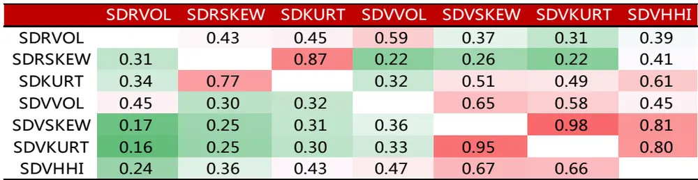
数据来源：wind 咨询，东方证券研究所

图 10：日内交易特征稳定性因子两两分层的多空月均收益及其显著性（%）

| SDRVOL SDRSKEW SDKURT SDVVOL SDVSKEWSDVKURT SDVHHI |  |  |  |  |  |  |
| --- | --- | --- | --- | --- | --- | --- |
| 不分层 | -1.80* *** | -0.94* *** | -1.07 *** | -1.62* *** | -0.98* *** | -0.99 *** -1.45 *** |
| SDRVOL | -0.17* | -0.34 | -0.44* ** | -0.81* *** | -0.54* *** -0.61* | *** -1.01 *** |
| SDRSKEW | -1.48 *** | -0.02 | -0.48* *** -1.33* | *** -0.56* | *** -0.63* *** | -1.06* *** |
| SDKURT | -1.47 *** | -0.05 | -0.07 | -1.25 *** -0.57 | *** -0.60 *** | -1.16* *** |
| SDVVOL | -1.10* *** | -0.4 | -0.51 ** | -0.20* | ** -0.45* ** | -0.77 *** |
| SDVSKEW | -1.56* *** | -0.61 *** | -0.72* *** | -1.30* *** | -0.36* -0.11 -0.13 | -1.07 *** |
| SDVKURT | -1.56* *** | -0.59** | -0.71* *** | -1.35* *** | -0.33** -0.21** | -1.02* *** |
| SDVHHI | -1.37 *** | -0.25 | -0.25 | -0.92* *** | 0 -0.06 | -0.34* *** |

注：***表示 1%置信度下显著，**表示 5%置信度下显著，*表示 1%置信度下显著。
数据来源：wind 咨询，东方证券研究所

## 与其他 alpha 因子的关系

日内交易特征稳定性实质还是量价技术类 alpha 因子，我们在前期报告《A 股涨跌幅排行榜效应》中讲到，日频的技术类 alpha主要有反转、换手、特异度和涨幅榜单因子四个相对比较独立的 alpha 源，另外我们在前期报告《日内残差高阶矩与股票收益》中提出了另一个基于日内数据计算的 alpha因子——日内特质偏度，因此我们主要考察日内交易特征类 alpha因子和这 5个 alpha的相互关系，同时考虑到波动率、特质波动率、Amihud 非流动性也是客户关心的技术类 alpha，这 3 个技术类 alpha 我们也一并处理。

图 11：本节考察的技术类 alpha因子列表

| 因子代码 | 因子说明 |
| --- | --- |
| RET | 过去一个月的收益率 |
| LNTO | 过去一个月日均换手的对数 |
| IVR | 基于过去一个月日收益率计算的特异度，1-FF三因子回归方程的R2 |
| DWF | 涨幅榜单因子，详见《A股涨跌幅榜单效应》 |
| IISKEW | 日内特质偏度，详见《日内残差高阶矩与股票收益》 |
| VOL | 基于过去一个月日收益率数据计算的波动率 |
| IVOL | 基于过去一个月FF三因子残差收益率计算的特质波动率 |
| ILLIQ | 过去一个月Amihud非流动性自然对数 |
| SDRVOL | 过去一个月日内波动率的波动率 |
| SDVVOL | 过去一个月日内成交量波动率的波动率 |
| SDVHHI | 过去一个月日内成交量HHI指数的波动率 |

数据来源：东方证券研究所

从相关性来看，我们发现日内交易特征稳定性因子和常见的基于日频行情计算的技术类 alpha因子相关性绝大多数均在 30%以下（实际上我们和东方因子库中所有的技术类 alpha 均做过相关性计算，无论因子值还是 RankIC 绝大多数均在 30%以下），同样由日内 5 分钟数据计算的日内特质偏度和因子值虽然和 3个日内交易特征稳定性因子的相关性不高，但 RankIC的相关性相对较高。总体来看，基于日内数据计算的日内交易特征稳定性因子和其他常见的技术类 alpha 相关性很低，信息重叠较少。

图 12：日内交易特征稳定性因子与其他技术类因子的相关系数（左下因子值，右上 RankIC）

|  | RET | LNTO | IVR DWF IISKEW VOL |  |  |  | IVOL ILLIQ |  | SDRVOL S | DVVOL SDVHHI |  |
| --- | --- | --- | --- | --- | --- | --- | --- | --- | --- | --- | --- |
| RET |  | -0.08 | 0.62 | 0.15 | 0.29 | -0.12 | 0.15 | -0.13 | -0.14 | 0.08 | 0.15 |
| LNTO | 0.11 |  | -0.06 | 0.80 | 0.43 | 0.91 | 0.85 | 0.40 | 0.10 | -0.05 | -0.12 |
| IVR | 0.29 | 0.21 |  | 0.21 | 0.08 | -0.10 | 0.31 | -0.20 | -0.14 | -0.03 | 0.05 |
| DWF | 0.29 | 0.46 | 0.43 |  | 0.53 | 0.88 | 0.93 | 0.12 | 0.13 | 0.06 | -0.04 |
| IISKEW | 0.29 | 0.29 | 0.21 | 0.26 |  | 0.41 | 0.45 | 0.18 | 0.38 | 0.49 | 0.37 |
| VOL | 0.17 | 0.63 | 0.26 | 0.65 | 0.25 |  | 0.88 | 0.30 | 0.14 | -0.01 | -0.11 |
| IVOL | 0.29 | 0.56 | 0.69 | 0.71 | 0.29 | 0.83 |  | 0.25 | 0.07 | -0.02 | -0.08 |
| ILLIQ | -0.03 | -0.11 | -0.10 | -0.08 | -0.08 | -0.01 | -0.07 |  | 0.12 | 0.04 | 0.38 |
| SDRVOL | 0.06 | 0.15 | 0.23 | 0.22 | 0.20 | 0.21 | 0.28 | 0.05 |  | 0.59 | 0.39 |
| SDWOL | 0.17 | 0.20 | 0.26 | 0.28 | 0.23 | 0.29 | 0.35 | 0.05 | 0.45 |  | 0.45 |
| SDVHHI | 0.14 | 0.08 | 0.21 | 0.15 | 0.25 | 0.13 | 0.20 | 0.21 | 0.24 | 0.47 |  |

数据来源：wind 咨询、东方证券研究所

为了进一步验证日内交易特征稳定性因子和其他各大类 alpha 因子的相关性，我们在采用横截面回归的方法剔除估值、成长、盈利等各大类 alpha因子的影响，考察残差因子的选股效果。结果显示，两个波动相关的因子 SDRVOL 和 SDVVOL依然有显著的选股效果，而 SDHHI几乎没有任何选股效果，因此，从结果来看，本文提出的 7 个日内交易特征稳定性因子相对我们的因子库真正有增量信息的可能就只有 SDRVOL 和 SDVVOL 两个因子。

图 13：日内交易特征稳定性因子在剔除各大类 alpha因子后的选股表现（中证全指）

|  | 行业市值中性化因子 |  |  | 原始因子 |  |  |  |  |  |  |
| --- | --- | --- | --- | --- | --- | --- | --- | --- | --- | --- |
|  | RankIC | IC_IR | t_value | RankIC | IC_IR |  | t_value 多空月收益 | 夏普率 | 月胜率 | 最大回撤 |
| SDRVOL | -3.09% | -2.77 | -7.83 | -3.18% | -2.17 | -6.14 | 1.10% | 1.77 | 71.88% | -8.73% |
| SDVVOL | -2.47% | -2.02 | -5.72 | -2.28% | -1.50 | -4.23 | 0.58% | 1.00 | 63.54% | -7.44% |
| SDVHHI | -0.17% | -0.09 | -0.27 | -0.03% | -0.01 | -0.04 | 0.28% | 0.47 | 58.33% | -10.84% |

数据来源：wind 咨询，东方证券研究所

## 四、指数增强

以上的研究表明日内收益率波动的波动 SDRVOL 和日内成交量波动的波动 SDVVOL 相对于现有的 alpha因子库有显著的增量，我们在前期报告《日内残差高阶矩与股票收益》中讲到日内残差偏度 IISKEW 也有不错的选股效果。这三个 alpha 因子均涉及到日内 5 分钟数据，客户在使用时都需要额外增加日内分钟数据整理的工作量，而这个额外的工作到底对增强组合到底有多大贡献，本章以 SDRVOL、SDVVOL 和 IISKEW 三个基于日内 5分钟数据计算的 alpha因子为例，考察通过引入日内相关的 alpha对现有指数增强模型的边际贡献。

我们现有的指数增强模型采用大类等权的方式构建，由估值、成长、盈利、营运能力、流动性、投机反转、分析师共 7大类因子等权合成综合打分（银行、券商单独建模），其中日内 alpha因子主要影响投机反转类 aphla 的构成，原有的投机反转大类因子我们采用一个月反转，特异度、涨幅榜单三个因子等权合成（《A股涨跌幅榜单效应》的研究显示 A股大多数日频技术 alpha可以用特异度、涨跌榜单、一个月反转、换手 4个因子解释，换手归为流动性类，所以这里投机反转类取这三个因子等权），引入日内技术指标的投机反转大类采用原有的三个 alpha 和 SDRVOL、SDVVOL、IISKEW 共 6个技术指标等权合成大类。为考察日内技术类因子对指数增强组合的边际贡献，我们对沪深 300和中证500分别构建如下两个增强模型：

ModelA-Ⅰ：7大类因子等权合成 ZSCORE，投机反转大类采用原有构成，月度调仓，风险厌恶系数 lambda=20，行业市值零暴露，费率单边千三，交易成本惩罚为费率的 0.3倍，样本空间中证全指成分股。

ModelA-Ⅱ：投机反转大类因子引入日内数据计算的三个 alpha 因子，其他和 ModelA-Ⅰ保持一致。

由于 ModelA-Ⅰ和 ModelA-Ⅱ中投机反转大类的权重占比仅为 1/7，投机反转类因子对组合的影响相对有限，同时考虑到部分客户投机反转类因子权重占比较高，因此我们在 ModelA-Ⅰ和ModelA-Ⅱ的基础上增加投机反转大类的权重构建如下两个模型 ModelB-Ⅰ和 ModelB-Ⅱ，以此来考察日内技术类 alpha对技术占比高的增强模型的边际贡献。

ModelB-Ⅰ：将 ModelA-Ⅰ中的投机反转大类权重系数增加至原来 3 倍，即从 1/7 至 1/3，其他同 ModelA-Ⅰ保持一致。

ModelB-Ⅱ：将 M odelA-Ⅱ中的投机反转大类权重系数增加至原来 3倍，即从 1/7至 1/3，其他同 ModelA-Ⅰ保持一致。。

对比沪深 300 增强 ModelA-Ⅰ和 ModelA-Ⅱ增强结果，我们发现在引入日内相关的技术类alpha后，在跟踪误差、最大回测和组合换手几乎一样的情况下，组合年化对冲收益提升 45个 BP，对指数增强组合的收益有正的边际贡献，通过对月度收益率序列进行双边 t检验，发现月度收益率差 t值为 1.72，两者的在 10%的置信度水平下有显著差异。

图 14：沪深 300 增强：ModelA-Ⅰ vs ModelA-Ⅱ
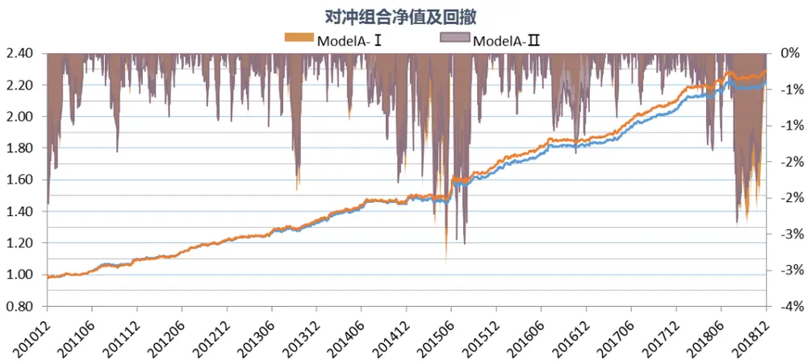

各年度对冲收益
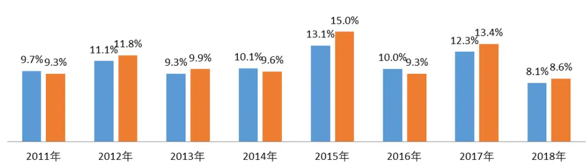

|  | 对冲年化收益 | 跟踪误差 | 信息比 | 月胜率 | 最大回测 | 年化换手 |
| --- | --- | --- | --- | --- | --- | --- |
| ModelA-I | 10.43% | 3.36% | 2.97 | 78.13% | 2.99% | 2.13 |
| ModelA-Ⅱ | 10.87% | 3.39% | 3.06 | 81.25% | 2.64% | 2.14 |

数据来源：wind 咨询，东方证券研究所

对比中证 500增强 ModelA-Ⅰ和 ModelA-Ⅱ，结果和沪深 300类似，在引入日内相关技术类alpha因子后，模型在跟踪误差、最大回测和组合换手几乎一样的情况下，组合年化对冲收益提升56 个 BP，但两者月度收益序列的差异并不显著（t 值 1.48）。

各年度对冲收益
图 15：中证 500 增强：ModelA-Ⅰ vs ModelA-Ⅱ
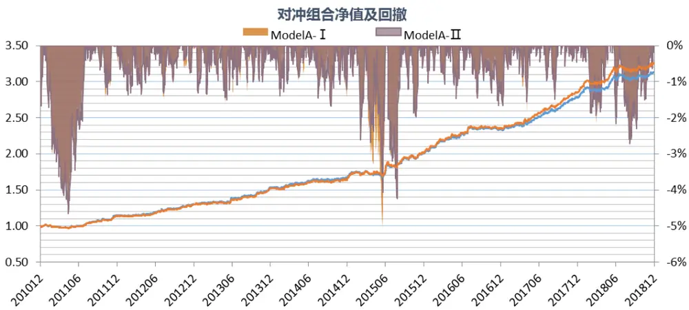

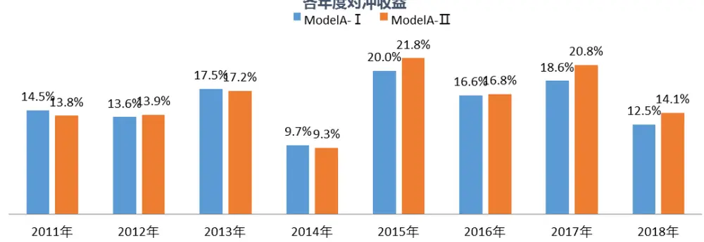

|  | 对冲年化收益 | 跟踪误差 | 信息比 | 月胜率 | 最大回测 | 年化换手 |
| --- | --- | --- | --- | --- | --- | --- |
| ModelA-I | 15.32% | 4.98% | 2.89 | 79.17% | 5.16% | 3.67 |
| ModelA-Ⅱ | 15.88% | 4.99% | 2.98 | 77.08% | 4.66% | 3.67 |

数据来源：wind 咨询，东方证券研究所

在投机反转类的权重放大之后，ModelB-Ⅱ 相对 ModelB-Ⅰ的收益边际贡献明显增大，沪深300增强组合的跟踪误差和换手差异依然不大，但年化对冲收益提升了 129个 BP，两者的月度收益率在统计上显著差异（t值 3.40）。从时间序列上来看，ModelB-Ⅱ除 2011年小幅跑输 ModelB-Ⅰ外其余年份均领跑 ModelB-Ⅰ，最近几年这种差异明显加大。

图 16：沪深 300 增强：ModelB-Ⅰ vs ModelB-Ⅱ
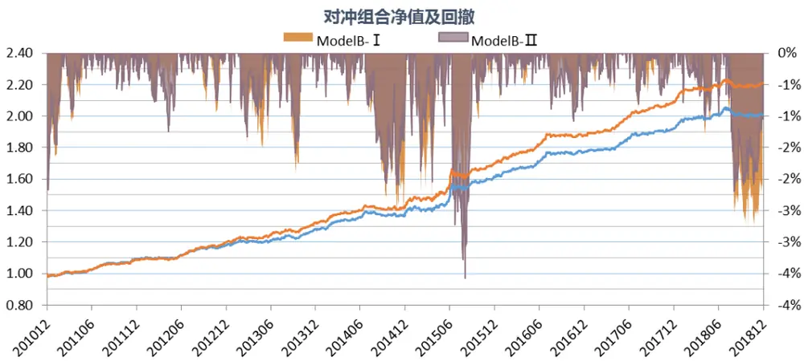

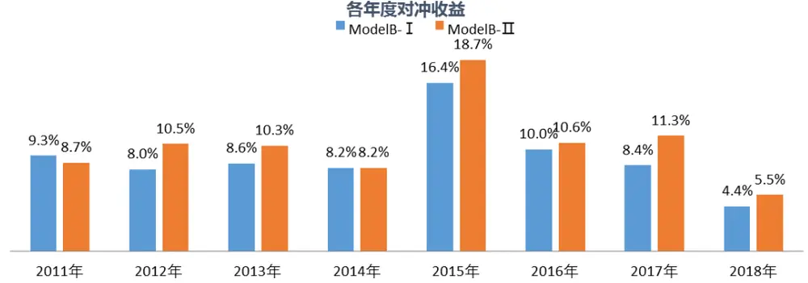

|  | 对冲年化收益 | 跟踪误差 | 信息比 | 月胜率 | 最大回测 | 年化换手 |
| --- | --- | --- | --- | --- | --- | --- |
| ModelB- I | 9.11% | 3.30% | 2.65 | 76.04% | 2.76% | 3.27 |
| ModelB-Ⅱ | 10.40% | 3.38% | 2.94 | 82.29% | 3.56% | 3.26 |

数据来源：wind 咨询，东方证券研究所

对比中证 500增强 ModelB-Ⅰ和 ModelB-Ⅱ，结果和沪深 300类似，投机反转大类因子权重加大后两者的差异明显变大，模型在跟踪误差、最大回测和组合换手相差不大的情况下，组合年化对冲收益提升 158个 BP，两者月度收益率序列显著差异，t值达到 2.48，而且从时间序列上看这种收益的差异主要是由最近 4年引起的。

图 17：中证 500 增强：ModelB-Ⅰ vs ModelB-Ⅱ
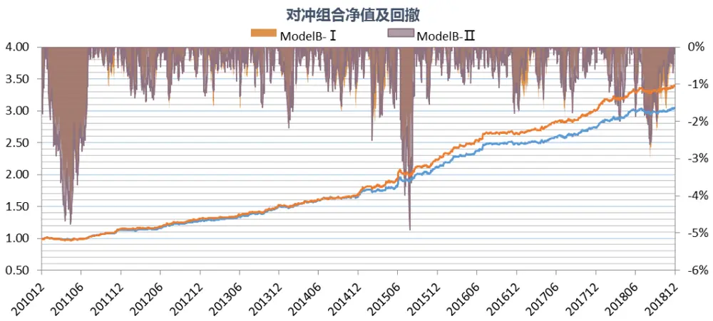

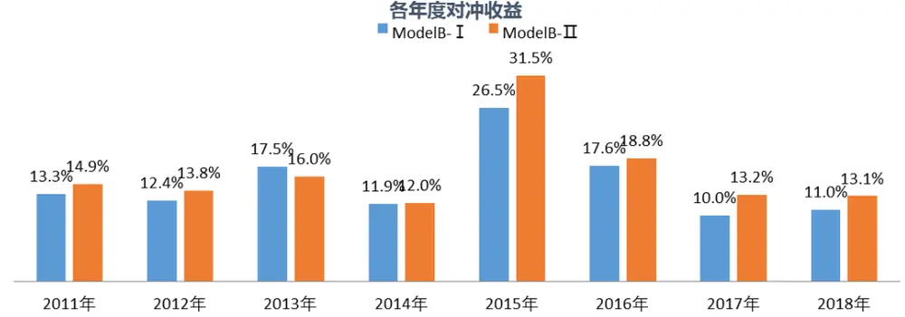

|  | 对冲年化收益 | 跟踪误差 | 信息比 | 月胜率 | 最大回测 | 年化换手 |
| --- | --- | --- | --- | --- | --- | --- |
| ModelB-I | 14.92% | 4.93% | 2.85 | 78.13% | 4.45% | 5.80 |
| ModelB-Ⅱ | 16.50% | 5.05% | 3.05 | 88.54% | 4.91% | 5.78 |

数据来源：wind 咨询，东方证券研究所

## 五、结论

如果没有额外的信息或者大资金的强行介入、股票的日内交易特征应该处于较稳定状态，那么股票的日内价量特征应该处于一个较小的波动范围内，反之如果股票的日内价量特征很不稳定，那么该股票大概率有信息溢出或者被幕后大资金操控，而此时便是一个睿智的投资者离场的时候了。

我们基于日内 5 分钟线计算了日内收益率的波动率 RVOL、偏度 RSKEW、峰度 RKURT 和日内成交量的波动率 VVOL、偏度 VSKEW、峰度 VKURT 和 HHI 指数 VHHI 共 7 个日内交易特征，考虑到时间序列自相关性，我们采用 Newey-West 调整标准差度量日内交易特征的稳定性（SDRVOL，SDRSKEW，SDRKURT，SDVVOL，SDVSKEW，SDVKURT 和 SDVHHI）。

7 个日内交易特征稳定性因子在各个样本空间均展现出日内交易特征稳定性越差的股票未来平均收益越低的选股效果，而且部分因子在大市值股票内的选股效果并没有明显比小市值股票差，比如 SDRVOL 在沪深 300 中的 RankIC 均值为 6.57%，而在中证 1000 中为 6.56%。

从时间序列上看，日内交易特征稳定性因子在最近几年的 alpha 没有衰减的趋势，近几年部分技术类 alpha 因子在大票中失效，但日内交易特征稳定性因子在沪深 300 依然有显著的多头收益。

平均来看，日内交易特征稳定性因子的空头收益强于多头，但在沪深 300 成分股内这种非对称性并不明显，比如沪深 300 成分股内 SDRVOL 和 SDVVOL 的多头年化对冲收益依然高达 7%以上。

7个日内交易特征稳定性因子内部存在替代关系，SDRVOL、SDVVOL和 SDVHHI信息相对独立。虽然两两来看这三个因子和常见的技术类 alpha 因子相关性都低，但剔除各大类因子后仅SDRVOL、SDVVOL 有独立的显著选股效果。

在引入日内相关的技术类因子（SDRVOL、SDVVOL 和日内特质偏度）后沪深 300 和中证500增强模型在跟踪误差、回撤和换手相差不大的情况下能提升组合收益，在投机反转类权重占比较大的模型中这种差异更加显著。因此，在条件允许的情况下基于日内数据提取 alpha对指数增强效果有可观的价值。

## 风险提示

1. 量化模型基于历史数据分析得到，未来存在失效的风险，建议投资者紧密跟踪模型表现。

2. 极端市场环境可能对模型效果造成剧烈冲击，导致收益亏损。

## Table_Disclaimer 分析师申明

每位负责撰写本研究报告全部或部分内容的研究分析师在此作以下声明：

分析师在本报告中对所提及的证券或发行人发表的任何建议和观点均准确地反映了其个人对该证券或发行人的看法和判断；分析师薪酬的任何组成部分无论是在过去、现在及将来，均与其在本研究报告中所表述的具体建议或观点无任何直接或间接的关系。

## 投资评级和相关定义

报告发布日后的 12个月内的公司的涨跌幅相对同期的上证指数/深证成指的涨跌幅为基准；

## 公司投资评级的量化标准

买入：相对强于市场基准指数收益率 15%以上；

增持：相对强于市场基准指数收益率 5%～15%；

中性：相对于市场基准指数收益率在-5%～+5%之间波动；

减持：相对弱于市场基准指数收益率在-5%以下。

未评级——由于在报告发出之时该股票不在本公司研究覆盖范围内，分析师基于当时对该股票的研究状况，未给予投资评级相关信息。

暂停评级——根据监管制度及本公司相关规定，研究报告发布之时该投资对象可能与本公司存在潜在的利益冲突情形；亦或是研究报告发布当时该股票的价值和价格分析存在重大不确定性，缺乏足够的研究依据支持分析师给出明确投资评级；分析师在上述情况下暂停对该股票给予投资评级等信息，投资者需要注意在此报告发布之前曾给予该股票的投资评级、盈利预测及目标价格等信息不再有效。

## 行业投资评级的量化标准：

看好：相对强于市场基准指数收益率 5%以上；

中性：相对于市场基准指数收益率在-5%～+5%之间波动；

看淡：相对于市场基准指数收益率在-5%以下。

未评级：由于在报告发出之时该行业不在本公司研究覆盖范围内，分析师基于当时对该行业的研究状况，未给予投资评级等相关信息。

暂停评级：由于研究报告发布当时该行业的投资价值分析存在重大不确定性，缺乏足够的研究依据支持分析师给出明确行业投资评级；分析师在上述情况下暂停对该行业给予投资评级信息，投资者需要注意在此报告发布之前曾给予该行业的投资评级信息不再有效。

## HeadertTabl e_Discl ai mer 免责声明

本证券研究报告（以下简称“本报告”）由东方证券股份有限公司（以下简称“本公司”）制作及发布。

本报告仅供本公司的客户使用。本公司不会因接收人收到本报告而视其为本公司的当然客户。本报告的全体接收人应当采取必要措施防止本报告被转发给他人。

本报告是基于本公司认为可靠的且目前已公开的信息撰写，本公司力求但不保证该信息的准确性和完整性，客户也不应该认为该信息是准确和完整的。同时，本公司不保证文中观点或陈述不会发生任何变更，在不同时期，本公司可发出与本报告所载资料、意见及推测不一致的证券研究报告。本公司会适时更新我们的研究，但可能会因某些规定而无法做到。除了一些定期出版的证券研究报告之外，绝大多数证券研究报告是在分析师认为适当的时候不定期地发布。

在任何情况下，本报告中的信息或所表述的意见并不构成对任何人的投资建议，也没有考虑到个别客户特殊的投资目标、财务状况或需求。客户应考虑本报告中的任何意见或建议是否符合其特定状况，若有必要应寻求专家意见。本报告所载的资料、工具、意见及推测只提供给客户作参考之用，并非作为或被视为出售或购买证券或其他投资标的的邀请或向人作出邀请。

本报告中提及的投资价格和价值以及这些投资带来的收入可能会波动。过去的表现并不代表未来的表现，未来的回报也无法保证，投资者可能会损失本金。外汇汇率波动有可能对某些投资的价值或价格或来自这一投资的收入产生不良影响。那些涉及期货、期权及其它衍生工具的交易，因其包括重大的市场风险，因此并不适合所有投资者。

在任何情况下，本公司不对任何人因使用本报告中的任何内容所引致的任何损失负任何责任，投资者自主作出投资决策并自行承担投资风险，任何形式的分享证券投资收益或者分担证券投资损失的书面或口头承诺均为无效。

本报告主要以电子版形式分发，间或也会辅以印刷品形式分发，所有报告版权均归本公司所有。未经本公司事先书面协议授权，任何机构或个人不得以任何形式复制、转发或公开传播本报告的全部或部分内容。不得将报告内容作为诉讼、仲裁、传媒所引用之证明或依据，不得用于营利或用于未经允许的其它用途。

经本公司事先书面协议授权刊载或转发的，被授权机构承担相关刊载或者转发责任。不得对本报告进行任何有悖原意的引用、删节和修改。

提示客户及公众投资者慎重使用未经授权刊载或者转发的本公司证券研究报告，慎重使用公众媒体刊载的证券研究报告。

## 东方证券研究所

地址：上海市中山南路 318 号东方国际金融广场 26 楼

联系人： 王骏飞

电话： 021-63325888*1131

传真：021-63326786

网址： www.dfzq.com.cn

Email： wangjunfei@orientsec.com.cn