## Table_Sum ary 研究结论

本篇报告测试不同行业内大类因子的表现（2009.7-2018.11），并尝试对因子在不同行业表现差异的原因进行分析。比如市值因子在龙头变换率较高，小市值股票占比较高且规模集中度较低的行业中有更强的负向选股作用，也就是说在这些行业里小市值溢价更明显。比如 BP 因子在（无形资产+开发支出+商誉）比净资产较高的行业表现较差，这是因为这类资产未来具有较大的不确定性，不能被账面价值很好的解释。

- 综合来看，估值、超预期、分析师、非流动性和投机性因子在绝大多数行业基本都有一定的选股效果，而盈利、高管薪酬、成长和反转适用的行业相对较少些。

我们基于较低的筛选标准（rankIC大于等于 0.02，ICIR大于等于 0.4）和较高的筛选标准（rankIC大于等于 0.03，ICIR大于等于 1）去筛选每个行业的大类因子，并构建细分行业的行业内增强组合，两类组合在几乎所有行业中均可以获得正的超额收益，但我们发现，在不同标准下行业内的增强效果有强有弱，也就是说仅仅通过一个统一标准去选择行业内的因子并不能得到让每个行业增强表现都最优的因子组合。

理论上说细分行业建模可以增加行业内预期收益率的准确性，从而提升宽基指数增强的效果，这里我们比较了在两种筛选标准下的细分行业建模全市场中证 500增强组合和常规建模中证 500增强组合的表现，从结果来看，细分行业建模后组合表现与整体建模组合基本相当，主要是因为用统一的标准筛选不同行业的因子会导致不同的行业适应性不同，结果有强有弱，其次也因为细分行业建模组合换手率较高，综合下来行业建模提升的整体 Alpha并不显著。

## 风险提示

- 极端市场环境可能对模型效果造成剧烈冲击，导致收益亏损。

- 量化模型基于历史数据分析得到，未来存在失效风险，建议投资者紧密跟踪模型表现。

细分行业建模与整体建模的指数增强组合对比

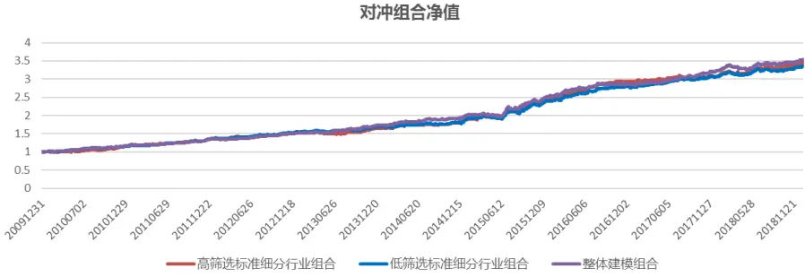

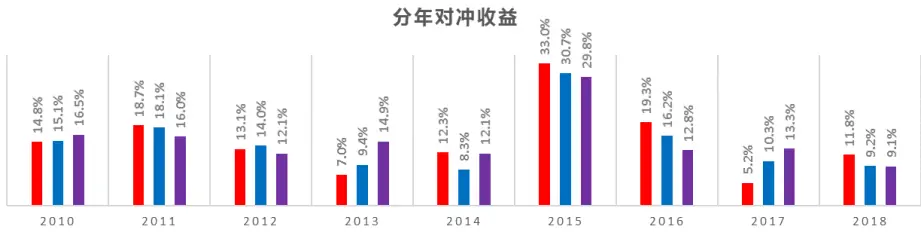
eaderTable_StaementCompany东方证券股份有限公司经相关主管机关核准具备证券投资咨询业务资格，据此开展发布证券研究报告业务。
Table_Report 相关报告

Table_ReportDate 报告发布日期2019 年 01 月 15 日

Table_Autho 证券分析师朱剑涛

021-63325888*6077

zhujiantao@orientsec.com.cn

执业证书编号：S0860515060001

张惠澍

021-63325888-6123

影响的利益冲突，不应视本证券研究报告为作出投资决策的唯一因素。

zhanghuishu@orientsec.com.cn

执业证书编号：S0860518080001

| 日内交易特征稳定性与股票收益 Alpha 与Smart Beta | 2019-01-14 2018-12-02 |
| --- | --- |
| 产业链与公司股价关联 | 2018-12-02 |
| A 股是估值驱动还是盈利驱动？ | 2018-12-02 |
| A 股涨跌幅排行榜效应 | 2018-11-20 |
| 基于 copula 的尾部相关性研究：上尾异常 | 2018-10-23 |
| 相关系数因子 |  |
| 东方 A 股因子风险模型(DFQ-2018) | 2018-09-02 |
| 盈利预测与市价隐含预期收益 | 2018-09-01 |
| 基金重仓股研究 | 2018-08-19 |
| 公司研发费用因子探究 | 2018-06-09 |
| 因子择时 | 2018-06-02 |

有关分析师的申明，见本报告最后部分。其他重要信息披露见分析师申明之后部分，或请与您的投资代表联系。并请阅读本证券研究报告最后一页的免责申明。

## 1.因子在不同行业内的测试

众所周知，不同行业的选股逻辑并不相同，因此 alpha 因子在不同行业也有着不完全相同的表现，本篇报告旨在分析各种 alpha因子在不同行业的选股效果，并且对因子的在不同样本空间的适用性进行研究。因子的测试区间为 2009.7-2018.11（银行从 2010.6），这个测试区间保证了每个行业的股票至少有 15支，这样统计因子表现才有意义。图 1展示了我们测试的大类因子列表，这个因子列表与我们网站上的 alpha列表是相同的，在测试大类因子的时候，我们剔除了银行和非银，这是因为很多因子在银行和非银中是不能计算的，如 CFP、EBIT2EV、RNOA 等，而且银行和非银中主要的券商股的研究我们在之前的报告中也做过相应的研究。

图 1：ALPHA 因子列表

| 大类 | 因子简称 | 因子定义 | 序 |
| --- | --- | --- | --- |
| Value | BP EP | 账面市值比 归属母公司的净利润TTM/总市值 | 1 1 |
|  | EP2 | 扣非后的净利润TTM/总市值 | 1 |
|  | SP | 营业收入TTM/总市值 | 1 |
|  | CFP | 经营性现金流TTM/总市值 | 1 |
|  | EBIT2EV | 息税前利润与企业价值之比 | 1 |
|  | SALES2EV | 营业收入与企业价值之比 | 1 |
|  | DP2 | 过去一年分红/总市值，以分红预案公告日为准 | 1 |
| Profitability | CFROI | 投资现金收益率 | 1 |
|  | RNOA | 净经营资产收益率 | 1 |
|  | ROE | 净资产收益率 | 1 |
|  | ROA2 | 总资产净利率 | 1 |
|  | GPOA | 总资产毛利率 | 1 |
|  | GROSS_MARGIN NET_MARGIN | 销售毛利率 | 1 |
|  |  | 销售净利率 | 1 |
| Growth | PROFIT_GROWTH_YOY | 归属母公司的净利润季度同比 | 1 |
|  | SALES_GROWTH_YOY | 营业收入季度同比 | 1 |
|  | PROFIT_GROWTH_TTM | TTM净利润同比增长 | 1 |
|  | SALES_GROWTH_TTM | TTM营业收入同比增长 | 1 |
|  | DELTA_GPOA | GPOA变动(当前TTM和一年前TTM比较) | 1 |
|  | DELTA_ROE | ROE变动(当前TTM和一年前TTM比较) | 1 |
|  | DELTA_ROA | ROA变动(当前TTM和一年前TTM比较) | 1 |
|  | DELTA_RNOA | RNOA变动(当前TTM和一年前TTM比较) | 1 |
| Surprise | UP | 预期外的RNOA | 1 |
|  | SUEO SUE1 | 基于带漂移项随机游走模型计算的预期外的净利润 | 1 |
|  | SURO | 基于不带漂移项随机游走模型计算的预期外的净利润 | 1 |
|  | SUR1 | 基于带漂移项随机游走模型计算的预期外的营业收入 | 1 |
|  | MR | 基于不带漂移项随机游走模型计算的预期外的营业收入 | 1 |
| Operation |  | 高管薪酬前三之和的对数 | 1 |
| Liquidity | TO20 | 过去20个交易日的日均换手率对数 | -1 |
|  | TO60 | 过去60个交易日的日均换手率对数 | -1 |
|  | LNAMIHUD | 20日Amihud非流动性自然对数 | 1 |
|  | AVGAMT_20_60 | 过去20日日均成交额/过去60日日均成交额，乘以100处理 | -1 |
|  | AVGVOL_20_240 | 过去20日日均成交量/过去240日日均成交量，乘以100处理 | -1 |
| Reversal | RET20 | 过去20个交易日的收益率 | -1 |
|  | PPREVERSAL | 乒乓球反转，过去5日均价/过去60日均价-1 | -1 |
|  | CGO60 | 处置效应因子，当前价/60日换手反推的持仓价-1 | -1 |
|  | P2HIGH | 当前价格除以过去243个交易日的最高价，乘以100处理 | -1 |
| Lottery | VOL20 | 过去20个交易日的波动率 | -1 |
|  | VOL60 | 过去60个交易日的波动率 | -1 |
|  | IVOL60 | 过去60个交易日的特质波动率 | -1 |
|  | IVR20 | 过去20个交易日的特异度 | -1 |
|  | MAXRET | 过去最大收益，过去60日最大3个日收益均值 | -1 |
|  | VOL120 | 过去120个交易日的波动率 | -1 |
|  | IVOL60_CAPM | 过去60个交易日的CAPM特质波动率 | -1 |
| Analyst | cov | 过去6个月有覆盖的机构数量，取根号 | 1 |
|  | DISP | 过去6个月盈利预测的分歧度 | -1 |
|  | EP_FY1 PEG | 预期的估值 | 1 |
|  | SCORE | PE_FY1/FY2隐含的利润增量率 | -1 |
|  | TPER | 综合评价 | 1 1 |
|  |  | 目标价隐含的收益率 | 1 |
| WFR | 加权的预期调整 |  |  |

数据来源：东方证券研究所 Wind 资讯

## 1.1 市值因子

图 2 展示了市值因子在各个行业中的 rankIC 和年化 ICIR，市值因子这里没有做方向的调整，可以看到市值的选股方向整体为负向，说明在这个时间区间内小市值股票平均是可以获得超额收益的，但是也有几个行业市值基本没有选股效果，如银行，非银，食品饮料、家电等。我们之前报告《A股小市值溢价来源》中曾经测试过，小市值溢价在市值较大的沪深 300 样本空间中的效果要弱于中证 500 和全市场，也就是说相对偏小市值的样本空间中小市值溢价更强，因此行业内市值因子的表现肯定也与行业内的小市值公司的数量有关，我们计算了每个行业内市值最小 30%的股票占比，发现小市值股票占比和市值的 rankIC呈显著的负相关，回归的 R-square为 39%，也就是说行业内小市值股票占比越高，市值因子在行业内的 rankIC越低，小市值效果也就更强，这个与我们之前研究的结论是一致的，而且这个是不同行业间市值表现差异的最大影响因素。

图 2：2009.7-2018.11市值因子在各个行业的表现以及各行业相关特征
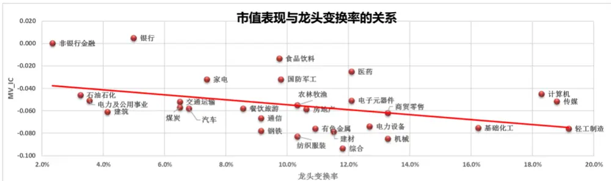

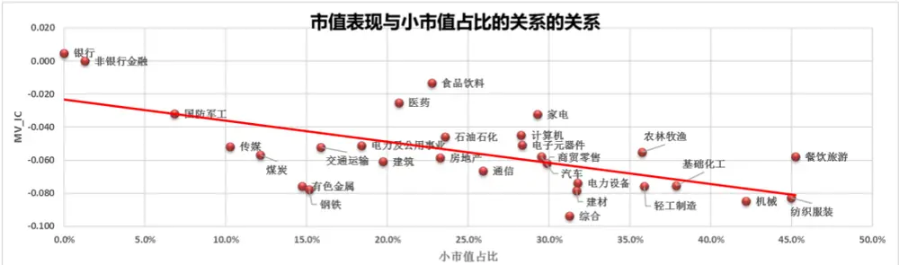

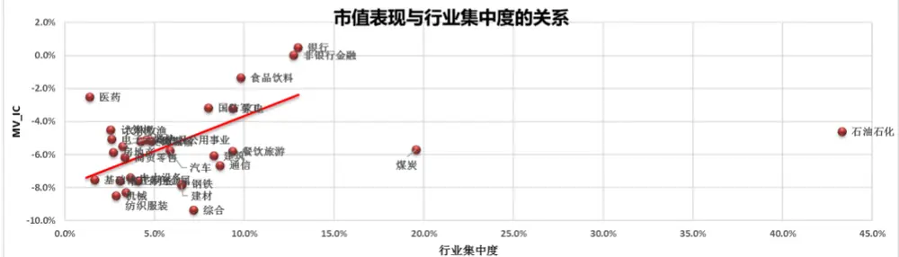

| 系数 | 龙头变换率 | 小市值股票占比 | 行业集中度 |
| --- | --- | --- | --- |
| beta | -0.222 | -0.128 | 0.425 |
| pval | 0.028 | 0.000 | 0.003 |
| R-square | 16.74% | 39.30% | 30.24% |

数据来源：东方证券研究所 Wind 资讯

除此之外，我们认为市值因子的选股效果可能也和行业集中度有一定关系，理论上说行业越集中，行业内的龙头股票越稳定，那么小市值股票逆袭的可能性也就越低，所以小市值股票的价值也就相对较低，我们基于以下公式计算了行业集中度：

$$
\begin{array}{r}{\overleftarrow{1}\mathbb{T}\underline{{\Psi}}\overleftarrow{\mathbb{R}}\oplus\varTheta\varTheta=\sum_{\mathrm{i}=1}^{N}w_{i}^{2},}\end{array}
$$

其中w 为行业内每只股票的市值权重，行业集中度越大，代表行业的垄断程度越高。此外，我们也计算了行业内的龙头变换率，我们在每个月计算了行业内前三大市值最大的龙头与上月末的差异，龙头变换率越低，说明这个行业的龙头越稳定，小市值股票逆袭的可能性就越低。从图 2 可以看到，市值因子 rankIC 与龙头变换率呈现反相关关系，而与行业集中度呈正相关关系，可以很明显的看到石油石化和煤炭这两个行业的行业集中度明显远大于其他行业，因此我们在做回归的时候把这两个行业作为异常值进行了剔除，从回归结果看，市值因子 rankIC与龙头变换率与行业集中度的回归系数分布为-0.22 和 0.43，均非常显著，R-square 分别为 16.7%和 30%。说明龙头股票比较固定，行业集中度较高的行业市值因子效果较弱。比如银行股中四大行是长期不变的，非银中的平安，食品饮料中的茅台和家电中的格力，长期占据着行业龙头的位置，因此市值因子在这些行业中基本没有什么效果。

图 3：2016.12-2018.11 市值因子在各个行业的表现
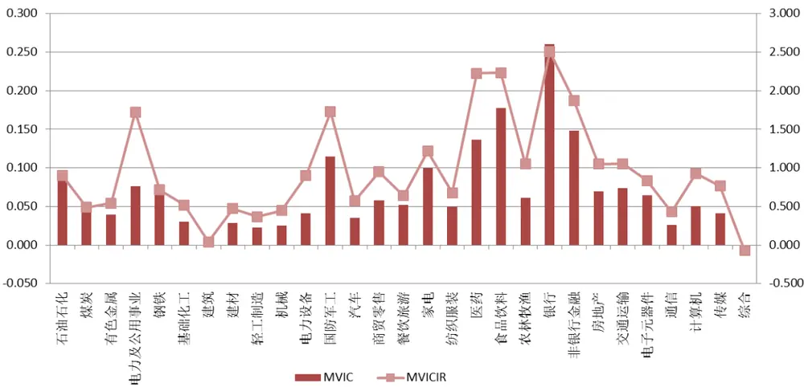
数据来源：东方证券研究所 Wind 资讯

图 3 测试 2016.12-2018.11 的市值因子在各个行业内的表现，可以看到结果与整个历史区间有着巨大的差别，几乎所有的行业都转变成为正方向的市值选股效果。从 2016年底开始，由于政策收紧，市场整体的投机性下降，投资者更加关注公司的价值和质量因素，小市值溢价效果基本消失。图 4展示了公募基金重仓股的在大类因子上的暴露情况，可以看到从 2016年底开始，价值、成长、盈利、超预期、市值的正向暴露都迅速提升，说明公募基金的持仓风格也发生了一定的改变。

图 4：基金重仓股的风格特征变化
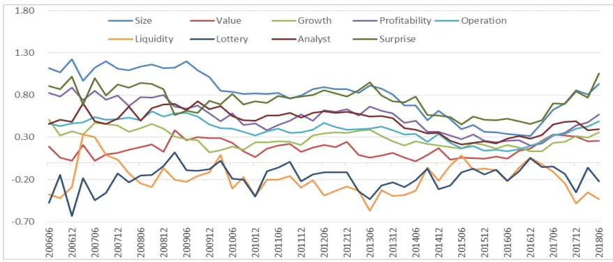
数据来源：东方证券研究所 Wind 资讯

图 5：各个行业内大类因子值与市值的平均秩相关性
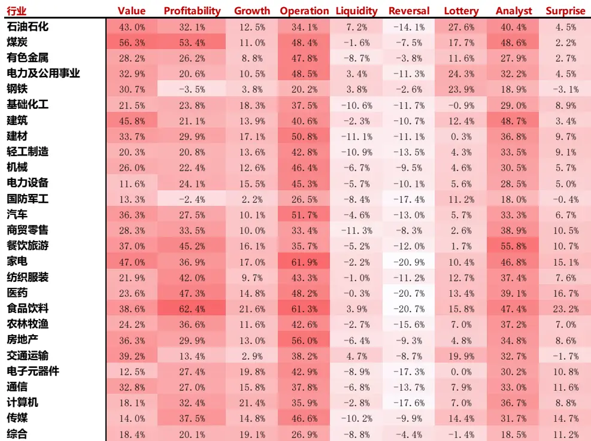
数据来源：东方证券研究所 Wind 资讯

图 5 展示了各个大类因子和市值因子在行业内的因子值秩相关系数，可以看到估值、盈利、公司治理和分析师在各个行业内基本都与市值有较强的相关性，说明历史来看，大市值股票估值较低、盈利能力较好且高管的薪酬较高。根据之前的结果市值在 10-16 年底这段时间在绝大多数行业内都有很强的负向选股效果，小市值股票表现较好，但是在最近两年这个风格偏向于了大票。基于这3个因子与市值的正向相关性，这几个因子理论上说在 10-16年底会受到市值风格的负向影响，而在 17年以来则会因为市值风格偏向于大票而受到市值风格的正向影响。

## 1.2 估值因子

我们测试了估值大类因子从 2009.7-2018.11的表现，图6展示了测试的结果。从原始值表现来看，RankIC大于 0.04且 ICIR大于 1的行业为轻工制造、机械、电力设备、国防军工、汽车、食品饮料、农林牧渔、交通运输、电子元器件、通讯和计算机，整体估值表现比较好的行业主要集中在制造业和 TMT；rankIC低于 0.03或 ICIR小于 0.6的行业主要有石油石化、煤炭、电力及公用事业、钢铁和建筑这些周期行业；剩下的估值表现处在中游的行业以消费类为主。

相比于其他类型的因子，估值因子虽然被划入了估值大类，但是其逻辑其实差别较大，所以我们这里将进一步比较单个估值因子在各个行业间的表现（图 8-9）。

图 6：估值大类因子在各个行业内的表现

| Value 原始值 Value市值中性化 |  |  |  |  |  |  |  |  |  |
| --- | --- | --- | --- | --- | --- | --- | --- | --- | --- |
| 行业 | rankIC | ICIR |  | 多空年化 多空月最大回撤 多空信息比 |  | rankIC | ICIR | 多空年化 多空月最大回撤 | 多空信息比 |
| 石油石化 | 0.039 | 0.55 | 7% | -48% | 0.38 | 0.063 1.08 | 18% | -37% | 0.97 |
| 煤炭 | 0.035 | 0.41 | -1% | -64% | 0.09 0.082 | 1.45 | 9% | -37% | 0.57 |
| 有色金属 | 0.043 | 0.8 | 6% | -37% | 0.41 0.063 | 1.3 | 12% | -30% | 0.75 |
| 电力及公用事业 | 0.040 | 0.57 | 8% | -29% | 0.42 | 0.062 1.06 | 13% | -25% | 0.72 |
| 钢铁 | 0.044 | 0.55 | 4% | -64% | 0.27 | 0.071 1.07 | 13% | -39% | 0.63 |
| 基础化工 | 0.041 | 0.95 | 6% | -38% | 0.42 | 0.054 1.4 | 10% | -28% | 0.69 |
| 建筑 | 0.022 | 0.28 | 0% | -64% | 0.15 | 0.060 0.95 | 13% | -36% | 0.64 |
| 建材 | 0.056 | 0.81 | 7% | -51% | 0.40 | 0.086 1.56 | 15% | -20% | 0.73 |
| 轻工制造 | 0.060 | 1.15 | 8% | -34% | 0.53 | 0.082 1.66 | 16% | -22% | 0.93 |
| 机械 | 0.048 | 1.25 | 8% | -20% | 0.65 | 0.074 2.61 | 16% | -15% | 1.45 |
| 电力设备 | 0.045 | 1.01 | 12% | -22% | 0.85 | 0.061 1.46 | 15% | -19% | 1.20 |
| 国防军工 | 0.087 | 1.25 | 15% | -37% | 0.79 | 0.087 1.27 | 13% | -40% | 0.74 |
| 汽车 | 0.060 | 1.09 | 4% | -47% | 0.31 | 0.086 | 2.03 18% | -21% | 1.14 |
| 商贸零售 | 0.048 | 0.9 | 6% | -22% | 0.46 | 0.062 1.28 | 11% | -22% | 0.78 |
| 餐饮旅游 | 0.049 | 0.61 | 2% | -60% | 0.21 | 0.051 0.68 | 6% | -53% | 0.38 |
| 家电 | 0.051 | 0.62 | 4% | -68% | 0.29 | 0.075 | 1.21 21% | -29% | 1.05 |
| 纺织服装 | 0.039 | 0.73 | 4% | -39% | 0.31 | 0.057 | 1.2 9% | -24% | 0.68 |
| 医药 | 0.037 | 0.77 | 3% | -35% | 0.28 | 0.047 | 1.16 6% | -22% | 0.52 |
| 食品饮料 | 0.064 | 1.05 | 5% | -52% | 0.34 | 0.069 | 1.47 14% | -29% | 0.93 |
| 农林牧渔 | 0.052 | 1.02 | 9% | -26% | 0.58 | 0.062 | 1.35 17% | -14% | 1.00 |
| 房地产 | 0.034 | 0.55 | 4% | -38% | 0.28 | 0.057 | 1.21 13% | -25% | 0.89 |
| 交通运输 | 0.077 | 1.14 | 13% | -22% | 0.76 | 0.101 | 1.77 16% | -18% | 1.12 |
| 电子元器件 | 0.060 | 1.51 | 14% | -17% | 0.99 | 0.065 | 1.94 14% | -19% | 1.10 |
| 通信 | 0.048 | 1.03 | 6% | -27% | 0.40 | 0.071 | 1.66 16% | -18% | 0.92 |
| 计算机 | 0.045 | 1.01 | 11% | -19% | 0.70 | 0.054 | 1.29 14% | -26% | 0.90 |
| 传媒 | 0.049 | 0.74 | 2% | -67% | 0.19 | 0.053 | 0.83 -2% | -72% | 0.04 |
| 综合 | 0.052 | 0.73 | 3% | -50% | 0.23 | 0.063 | 0.92 | 6% -51% | 0.36 |

数据来源：东方证券研究所 Wind 资讯

从结果来看，不同的估值因子在各个行业内的表现差别较大。RankIC大于 0.04且 ICIR大于 1的行业有轻工制造、机械、电力设备、国防军工、汽车、食品饮料、农林牧渔、交通运输、电子元器件、通讯和计算机，整体来看估值在制造业和 TMT 行业表现较好。

我们在图 7 展示了估值因子与市值因子在行业内的因子值平均秩相关性，发现估值因子在行业内与市值的相关性较高，其中 EP、EP2 和 DP2 三个因子在各个行业内均与市值是正相关的，也就说在每个行业内大市值的股票都会在 EP上给出较低的估值，且大市值股票也会有着较高的股息率，这两个因素其实是有着内生联系的，因为大市值的股票通常股息率较高，所以在 ROE相同的情况下，大市值股票分配了较多的股息，因此相对的成长性会略低于小市值股票，所以 EP估值水平也会较低。

图 7：各类估值因子与市值因子在行业内相关性

| 因子简称 | BP | EP | EP2 | SP | CFP | EBIT2EV | SALES2EV | DP2 |
| --- | --- | --- | --- | --- | --- | --- | --- | --- |
| 石油石化 | 0.31 | 0.46 | 0.44 | 0.18 | 0.39 | 0.47 | 0.11 | 0.31 |
| 煤炭 | 0.27 | 0.57 | 0.61 | 0.06 | 0.35 | 0.62 | 0.07 | 0.53 |
| 有色金属 | 0.05 | 0.26 | 0.31 | 0.03 | 0.23 | 0.34 | 0.02 | 0.24 |
| 电力及公用事业 | 0.22 | 0.37 | 0.40 | 0.07 | 0.19 | 0.28 | -0.05 | 0.45 |
| 钢铁 | 0.43 | 0.13 | 0.12 | 0.25 | 0.40 | 0.09 | 0.19 | 0.16 |
| 基础化工 | -0.04 | 0.29 | 0.29 | 0.01 | 0.11 | 0.28 | -0.02 | 0.16 |
| 建筑 | 0.20 | 0.53 | 0.54 | 0.31 | 0.11 | 0.46 | 0.32 | 0.34 |
| 建材 | 0.11 | 0.39 | 0.39 | 0.17 | 0.26 | 0.34 | 0.07 | 0.26 |
| 轻工制造 | 0.01 | 0.25 | 0.23 | 0.08 | 0.14 | 0.21 | -0.02 | 0.21 |
| 机械 | -0.03 | 0.33 | 0.28 | 0.18 | 0.06 | 0.30 | 0.16 | 0.14 |
| 电力设备 | -0.16 | 0.26 | 0.24 | 0.04 | 0.07 | 0.19 | 0.02 | 0.08 |
| 国防军工 | 0.11 | 0.14 | 0.17 | 0.05 | 0.05 | 0.14 | 0.07 | 0.12 |
| 汽车 | 0.15 | 0.39 | 0.36 | 0.26 | 0.20 | 0.21 | 0.30 | 0.30 |
| 商贸零售 | 0.05 | 0.37 | 0.38 | 0.04 | 0.06 | 0.25 | 0.07 | 0.20 |
| 餐饮旅游 | 0.04 | 0.44 | 0.41 | 0.17 | 0.07 | 0.36 | 0.20 | 0.36 |
| 家电 | 0.01 | 0.49 | 0.45 | 0.29 | 0.27 | 0.38 | 0.32 | 0.27 |
| 纺织服装 | 0.04 | 0.37 | 0.35 | -0.07 | 0.05 | 0.32 | -0.04 | 0.25 |
| 医药 | -0.17 | 0.42 | 0.44 | -0.06 | 0.13 | 0.37 | -0.06 | 0.26 |
| 食品饮料 | -0.33 | 0.51 | 0.53 | -0.05 | 0.34 | 0.50 | -0.03 | 0.49 |
| 农林牧渔 | -0.11 | 0.34 | 0.39 | -0.01 | 0.15 | 0.32 | 0.00 | 0.26 |
| 银行 | 0.20 | 0.44 | 0.43 | 0.19 | -0.24 |  |  | 0.68 |
| 非银行金融 | 0.45 | 0.56 | 0.62 | 0.55 | 0.12 | -0.13 | -0.37 | 0.55 |
| 房地产 | 0.21 | 0.45 | 0.46 | 0.24 | -0.05 | 0.39 | 0.19 | 0.34 |
| 交通运输 | 0.29 | 0.39 | 0.38 | 0.18 | 0.23 | 0.25 | 0.15 | 0.30 |
| 电子元器件 | -0.12 | 0.27 | 0.24 | -0.03 | 0.11 | 0.22 | -0.06 | 0.06 |
| 通信 | 0.00 | 0.30 | 0.28 | 0.20 | 0.20 | 0.32 | 0.17 | 0.20 |
| 计算机 | -0.25 | 0.30 | 0.26 | -0.01 | 0.09 | 0.26 | -0.05 | 0.07 |
| 传媒 | -0.01 | 0.31 | 0.26 | -0.13 | 0.06 | 0.22 | -0.10 | 0.16 |

数据来源：东方证券研究所 Wind 资讯

图 8：估值因子原始值在各个行业内的 rankIC

| 大类 |  |  | Value |  |  |  |  |  |
| --- | --- | --- | --- | --- | --- | --- | --- | --- |
| 因子简称 | BP | EP | EP2 | SP | CFP | EBIT2EV | SALES2EV | DP2 |
| 石油石化 | 0.052 | 0.013 | 0.014 | 0.024 | 0.034 | 0.015 | 0.026 | 0.005 |
| 煤炭 | 0.048 | 0.021 | 0.019 | 0.015 | 0.021 | 0.022 | 0.011 | 0.007 |
| 有色金属 | 0.052 | 0.035 | 0.022 | 0.02 | 0.016 | 0.033 | 0.026 | 0.026 |
| 电力及公用事业 | 0.035 | 0.037 | 0.034 | 0.002 | 0.007 | 0.032 | 0.012 | 0.015 |
| 钢铁 | 0.015 | 0.06 | 0.058 | 0.015 | 0.002 | 0.055 | 0.040 | 0.043 |
| 基础化工 | 0.043 | 0.029 | 0.027 | 0.023 | 0.018 | 0.03 | 0.035 | 0.020 |
| 建筑 | 0.025 | 0.029 | 0.024 | 0.002 | 0.012 | 0.023 | -0.001 | 0.016 |
| 建材 | 0.059 | 0.029 | 0.024 | 0.044 | 0.032 | 0.033 | 0.058 | 0.029 |
| 轻工制造 | 0.042 | 0.049 | 0.051 | 0.036 | 0.044 | 0.062 | 0.051 | 0.047 |
| 机械 | 0.057 | 0.029 | 0.028 | 0.02 | 0.042 | 0.03 | 0.028 | 0.031 |
| 电力设备 | 0.053 | 0.034 | 0.029 | 0.029 | 0.016 | 0.029 | 0.034 | 0.013 |
| 国防军工 | 0.067 | 0.071 | 0.058 | 0.043 | 0.051 | 0.073 | 0.055 | 0.045 |
| 汽车 | 0.051 | 0.053 | 0.054 | 0.039 | 0.034 | 0.055 | 0.043 | 0.041 |
| 商贸零售 | 0.056 | 0.031 | 0.031 | 0.037 | 0.021 | 0.035 | 0.038 | 0.011 |
| 餐饮旅游 | 0.074 | 0.028 | 0.018 | 0.029 | 0.062 | 0.031 | 0.028 | 0.019 |
| 家电 | 0.046 | 0.055 | 0.045 | 0.027 | 0.04 | 0.046 | 0.028 | 0.044 |
| 纺织服装 | 0.052 | 0.017 | 0.012 | 0.032 | 0.035 | 0.018 | 0.039 | 0.011 |
| 医药 | 0.025 | 0.03 | 0.031 | 0.016 | 0.037 | 0.033 | 0.017 | 0.028 |
| 食品饮料 | 0.037 | 0.045 | 0.044 | 0.027 | 0.081 | 0.044 | 0.030 | 0.031 |
| 农林牧渔 | 0.06 | 0.035 | 0.031 | 0.028 | 0.028 | 0.037 | 0.031 | 0.032 |
| 银行 | 0.089 | 0.112 | 0.109 | 0.086 |  |  |  | 0.079 |
| 非银行金融 | 0.097 | 0.075 | 0.077 | 0.057 |  |  |  | 0.049 |
| 房地产 | 0.055 |  | 0.017 0.017 | 0.034 | 0.005 | 0.017 | 0.034 | 0.025 |
| 交通运输 | 0.057 | 0.065 | 0.059 | 0.027 | 0.043 | 0.058 | 0.031 | 0.049 |
| 电子元器件 | 0.049 | 0.054 | 0.045 | 0.044 | 0.039 | 0.045 | 0.046 | 0.037 |
| 通信 | 0.061 | 0.039 | 0.034 | 0.035 | 0.007 | 0.026 | 0.042 | 0.010 |
| 计算机 | 0.04 | 0.051 | 0.048 | 0.033 | 0.002 | 0.035 | 0.035 | 0.016 |
| 传媒 | 0.027 | 0.021 | 0.027 | 0.05 | 0.022 | 0.045 | 0.046 | 0.035 |
| 综合 | 0.062 | 0.025 | 0.027 | 0.042 | 0.033 | 0.013 | 0.050 | 0.033 |

数据来源：东方证券研究所 Wind 资讯

图 9：估值因子在各个行业内的 ICIR

| 大类 |  |  | Value |  |  |  |  |  |
| --- | --- | --- | --- | --- | --- | --- | --- | --- |
| 因子简称 | BP | EP | EP2 | SP | CFP | EBIT2EV | SALES2EV | DP2 |
| 石油石化 | 0.7 | 0.19 | 0.2 | 0.33 | 0.49 | 0.22 | 0.38 | 0.09 |
| 煤炭 | 0.64 | 0.27 | 0.24 | 0.26 | 0.3 | 0.28 | 0.21 | 0.09 |
| 有色金属 | 0.89 | 0.81 | 0.48 | 0.34 | 0.36 | 0.71 | 0.45 | 0.67 |
| 电力及公用事业 | 0.54 | 0.64 | 0.58 | 0.04 | 0.1 | 0.59 | 0.26 | 0.28 |
| 钢铁 | 0.15 | 0.82 | 0.78 | 0.16 | 0.03 | 0.81 | 0.51 | 0.82 |
| 基础化工 | 1.04 | 0.75 | 0.71 | 0.49 | 0.48 | 0.76 | 0.88 | 0.66 |
| 建筑 | 0.34 | 0.42 | 0.36 | 0.03 | 0.25 | 0.36 | -0.01 | 0.27 |
| 建材 | 0.97 | 0.46 | 0.41 | 0.69 | 0.49 | 0.55 | 1.08 | 0.57 |
| 轻工制造 | 0.74 | 0.94 | 1.01 | 0.58 | 0.93 | 1.25 | 0.99 | 0.98 |
| 机械 | 1.37 | 0.78 | 0.75 | 0.39 | 1.42 | 0.87 | 0.59 | 1.12 |
| 电力设备 | 1.22 | 0.73 | 0.63 | 0.66 | 0.49 | 0.63 | 0.81 | 0.31 |
| 国防军工 | 1.01 | 1.06 | 0.84 | 0.55 | 0.85 | 1.08 | 0.72 | 0.74 |
| 汽车 | 1.05 | 0.98 | 1.05 | 0.77 | 0.82 | 1.4 | 0.82 | 1 |
| 商贸零售 | 1.13 | 0.59 | 0.54 | 0.94 | 0.44 | 0.66 | 0.96 | 0.24 |
| 餐饮旅游 | 1.11 | 0.37 | 0.23 | 0.4 | 0.83 | 0.4 | 0.37 | 0.27 |
| 家电 | 0.75 | 0.69 | 0.6 | 0.34 | 0.6 | 0.66 | 0.34 | 0.72 |
| 纺织服装 | 0.99 | 0.32 | 0.22 | 0.57 | 0.82 | 0.33 | 0.72 | 0.24 |
| 医药 | 0.57 | 0.56 | 0.58 | 0.37 | 0.96 | 0.64 | 0.41 | 0.7 |
| 食品饮料 | 0.58 | 0.66 | 0.59 | 0.46 | 1.55 | 0.63 | 0.52 | 0.44 |
| 农林牧渔 | 1.45 | 0.7 | 0.57 | 0.64 | 0.69 | 0.7 | 0.72 | 0.69 |
| 银行 | 0.92 | 1.16 | 1.12 | 0.93 |  |  |  | 0.73 |
| 非银行金融 | 1.33 | 0.89 | 0.94 | 0.62 |  |  |  | 0.59 |
| 房地产 | 1.03 | 0.25 | 0.25 | 0.62 | 0.15 | 0.29 | 0.7 | 0.53 |
| 交通运输 | 0.77 | 0.99 | 0.9 | 0.62 | 0.73 | 0.91 | 0.75 | 0.86 |
| 电子元器件 | 1.17 | 1.21 | 1 | 1.12 | 1.08 | 0.98 | 1.22 | 1.13 |
| 通信 | 1.26 | 0.8 | 0.73 | 0.75 | 0.15 | 0.55 | 0.89 | 0.24 |
| 计算机 | 0.76 | 1.06 | 0.92 | 0.63 | 0.05 | 0.72 | 0.66 | 0.44 |
| 传媒 | 0.4 | 0.33 | 0.51 | 0.67 | 0.33 | 0.79 | 0.63 | 0.76 |
| 综合 | 0.91 | 0.35 | 0.4 | 0.7 | 0.58 | 0.19 | 0.85 | 0.59 |

数据来源：东方证券研究所 Wind 资讯

## 1.2.1 无形资产加商誉占比较低的行业更适用 BP

从 BP 来看，BP 因子在大多数行业中有着显著的选股效果，我们知道 BP 是公司净资产与市值的比值，理论上说，BP对于公司资产的价值更加重视，通常来说账面价值相对稳定的周期性行业如石油石化、有色金属等行业比较有效。而对于像银行、非银等流动资产比重较大的行业，其账面价值一般被认为是其内在价值的一个优良指标，绝大部分的银行资产，如债券和商业贷款，其价值都与账面价值相等，因此 BP也应该具有较好的选股效果。而对于一些净资产与重置成本相差较大从而不能反映公司实际价值的公司，BP的效用就会大打折扣，通常来说公司的专利、使用权、开发支出、商誉等都属于账面价值不能反映其真实价值的科目。这里我们用无形资产加开发支出加商誉除以净资产构建了指标（IRB2E）（图 10），这个指标数值越高，就说明这个行业中不能反映真实价值的资产占比越高，这里要注意的是像煤炭、有色这样的采掘行业无形资产中其实包括了很大账面价值的开采证，而开采证这类无形资产相对而言是定价比较准确的，因此这个指标在这两个行业其实是不适用的，我们在剩下的 27 个行业进行回归，系数为-0.146，R-square 为 21%。这也就是说明 BP的选股效果与公司资产结构是有关的，若公司存在比较多的预期能够产生很高价值的资产，那么 BP 的效用也会有所下降。

图 10：各(无形资产加开发支出加商誉)比净资产指标与 BP 表现的关系
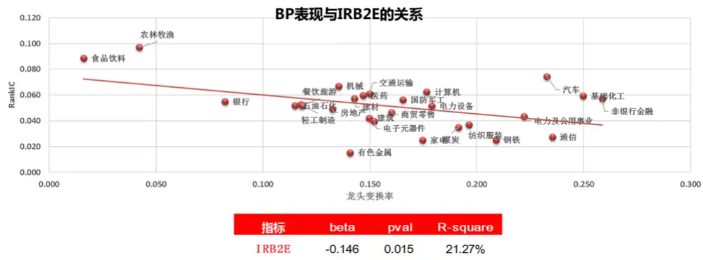
数据来源：东方证券研究所 Wind 资讯

## 1.2.2 行业内股票成长同质性高，负净利占比较低的行业更适用 EP(EP2)

从 EP 和 EP2 来看，这两个因子在各个行业中的表现都基本相同，说明扣非本身对因子表现影响不大。EP和 EP2在不同行业的差别较大，在银行、计算机、电子、国防军工中的表现较强，而在是有石化、煤炭、建筑、建材、餐饮旅游、纺织服装、传媒和综合中表现很弱，并没有非常明显的规律。EP（EP2）反映了行业内横向的公司关于净利润的估值水平，理论上说单纯的看 EP 大小其实并不能说明太多的问题，比如一个行业内某公司 EP为 0.1，而另一个公司 EP为 0.2，不能就断言 EP为 0.2的公司被低估了，这是因为这两个公司的成长性并不是完全相同的，若这两个公司有着比较接近的成长性的话，那么 EP的可比性就会更高，因此若是行业内股票的成长性比较同质，那么 EP在这类行业应该有着更强的可比性。基于这个推论，我们构建了行业内个股的净利润 TMM同比增长差异指标（NITTMYOY_DISP），计算方式为行业内的个股增长在横截面上取标准差（图11）。此外，在构建市盈率指标时通常认为净利润为负则说明市盈率没有意义，因为这样的话就会导致净利润负的越多的公司市盈率反而比净利润负的少的公司低的情况，因此我们在量化领域通常是把 PE 写成 EP，因为这样即使净利润为负，EP 依然可以保持单调，虽然这样做从数学上来说是合理的，但是首先绝大多数投资者在投资估值的时候依然会关注市盈率，其次从理论上说负的

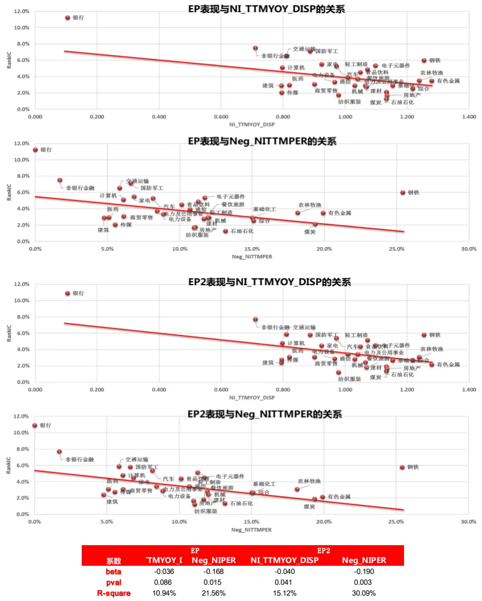
图 11：各行业 EP(EP2)表现与行业内股票净利润增长同质性和负净利润股票占比的关系
数据来源：东方证券研究所 Wind 资讯

EP 依然没有太大的经济意义，所以我们认为在净利润为负占比更高的行业，EP 的选股效果也会相对更弱些，所以我们构建 TTM 净利润为负的公司占比（Neg_NITTMPER）。

图 11展示了上述指标和 EP、EP2 的 rankIC 的关系。从结果上看， EP（EP2）与行业内股票成长的标准差有非常强的关系，当然这个关系受银行影响非常大，在图中可以看到银行是一个明显的异常点，因此我们去掉银行然后进行回归，EP（EP2）与 NITTMYOY_DISP 的回归系数为-0.036（-0.04），R-square为 10.9%（15.1%），都是比较显著地负相关关系，这是因为标准差越低说明行业内股票增长的同质性更高，从而 EP（EP2）在这类行业更加具有可比性，表现也就更好。此外，EP（EP2）与行业内负净利润股票占比也有一定的相关关系，从图上可以看到，银行和钢铁是两个非常明显的异常点，所以我们对剩下 27个行业进行回归，EP（EP2）与 Neg_NITTMPER的回归系数为-0.17（-0.19），R-square 为 21.9%（30.1%），也就是说若行业内负净利润的公司占比比较高，那么 EP（EP2）的效果也会较弱，这点与市盈率不能为负值的要求是一致的。

从 SP 上来看，SP 表现要弱于 BP 和 EP，从 rankIC 上看，银行和非银中 SP 表现最好，其次是传媒、电子和建材，rankIC 均大于 0.04，表现较差的行业为煤炭、电力及公用事业、钢铁、建筑和医药，rankIC 均小于 0.02。整体来看上游强周期的行业 SP 表现较弱，这可能是因为周期性行业的营收直接受到经济周期的影响，因此参考价值偏弱。而医药行业 SP较弱是因为医药可以主要分为医药商业和医药工业，医药工业的营收低但毛利高，而医药商业的营收高但毛利低，就导致SP 在医药股间没有可比性。

## 1.2.3行业内 CFO成长同质性较高，负 CFO股票占比低的行业更适合CFP

CFP 因子整体表现也要弱于 BP 和 EP，从 rankIC 上看，食品饮料、餐饮旅游、国防军工、轻工制造、机械和交通运输行业中 CFP 表现较好，rankIC 均大于 0.04，表现较差的行业为有色、电力及公用事业、钢铁、基础化工和建筑，rankIC均小于 0.02，整体来看在强周期行业中 CFP表现也并不好。CFP 的逻辑与 EP 类似，只不过一个关注的是净利润，一个关注的是经营性现金流。与EP 类似的构建行业内个股的经营现金流 TMM同比增长差异指标（CFOTTMYOY_DISP），以及TTM净利润为负的公司占比（Neg_CFOTTMPER）这两个指标。从结果看（图 12），CFP在行业内的 rankIC 与 CFOTTMYOY_DISP 的回归系数为-0.039，R-square 为 12%，说明行业内股票的经营现金流增长差异越大，CFP 的可比性也就越弱，选股效果就会降低。CFP在行业内的 rankIC与 Neg_CFOTTMPER 的回归系数为-0.073，R-square 为 13%，说明与 EP 类似，投资者通常关注市现率较多，因此当经营性现金流为负之后，市现率其实是没有意义的，所以经营性现金流为负的公司占比比较高的行业 CFP表现会较弱。

图 12：各行业 CFP表现与行业内股票 CFO增长同质性和负 CFO股票占比关系
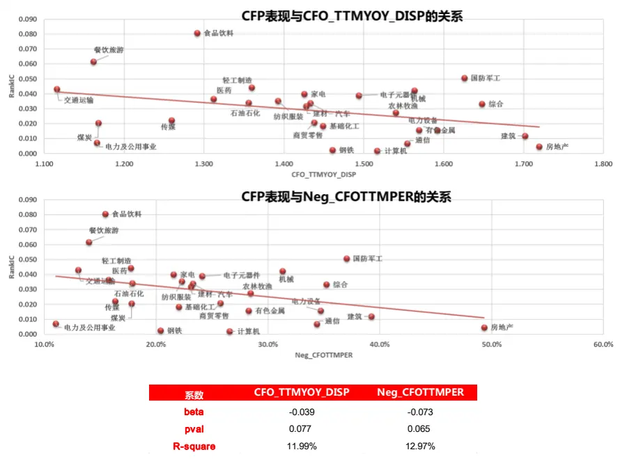
数据来源：东方证券研究所 Wind 资讯

EBIT2EV 与 EP在全市场的因子相关性高达 80%，SALES2EV 与 SP在全市场的因子相关性高达94%，所以它们属于比较同质的因子，这里就不做赘述了。

## 1.2.3 分红股票占比较高的行业股息率因子表现较好

在测试股息率因子的时候，因为有些股票是没有分红的，因此把这类公司对应因子值取为了 0，也就是说计算 rankIC 的时候其实反映的是非零数据与收益率的秩相关性。股息率因子表现较好的行业有银行、非银、国防军工、钢铁和交通运输。我们计算了行业股息率的数据，从行业股息率可以看到，在很多行业股息率是非常低，那么即使这些行业分红公司覆盖度较高，股息率在行业内也没有太大的可比性，很有可能会得到失真的结果。这里我们进一步比较了股息率在行业股息率大于1%的行业内的 rankIC 与 DP_DISP 和 DP_PER 的关系(图 13 右)，因为样本较少所以回归是没有太大意义的，简单从相关性上看，DP 在行业股息率大于 1%的行业内 rankIC 与 DP_DISP 和DP_PER 的相关系数分别为 42%和 59%，从图上 DP 与 DP_PER 的线性关系是比较显著的，说明 DP 因子表现与行业内有股息股票占比有一定关系。

图 13：行业内股息率因子表现与行业内股息同质性、平均股息率和分红股票占比

| 行业 | DP_IC | DP |
| --- | --- | --- |
| 石油石化 | 0.013 | 2.7% |
| 煤炭 | 0.021 | 2.8% |
| 有色金属 | 0.035 | 0.7% |
| 电力及公用事业 | 0.037 | 1.9% |
| 钢铁 | 0.060 | 1.5% |
| 基础化工 | 0.029 | 0.8% |
| 建筑 | 0.029 | 1.4% |
| 建材 | 0.029 | 1.1% |
| 轻工制造 | 0.049 | 1.2% |
| 机械 | 0.029 | 0.9% |
| 电力设备 | 0.034 | 0.9% |
| 国防军工 | 0.071 | 0.4% |
| 汽车 | 0.053 | 1.8% |
| 商贸零售 | 0.031 | 1.0% |
| 餐饮旅游 | 0.028 | 0.8% |
| 家电 | 0.055 | 1.9% |
| 纺织服装 | 0.017 | 1.6% |
| 医药 | 0.030 | 0.8% |
| 食品饮料 | 0.045 | 1.6% |
| 农林牧渔 | 0.035 | 0.9% |
| 银行 | 0.112 | 4.4% |
| 非银行金融 | 0.075 | 1.7% |
| 房地产 | 0.017 | 1.4% |
| 交通运输 | 0.065 | 1.8% |
| 电子元器件 | 0.054 | 0.6% |
| 通信 | 0.039 | 0.6% |
| 计算机 | 0.051 | 0.6% |
| 传媒 | 0.021 | 0.6% |
| 综合 | 0.025 | 0.7% |

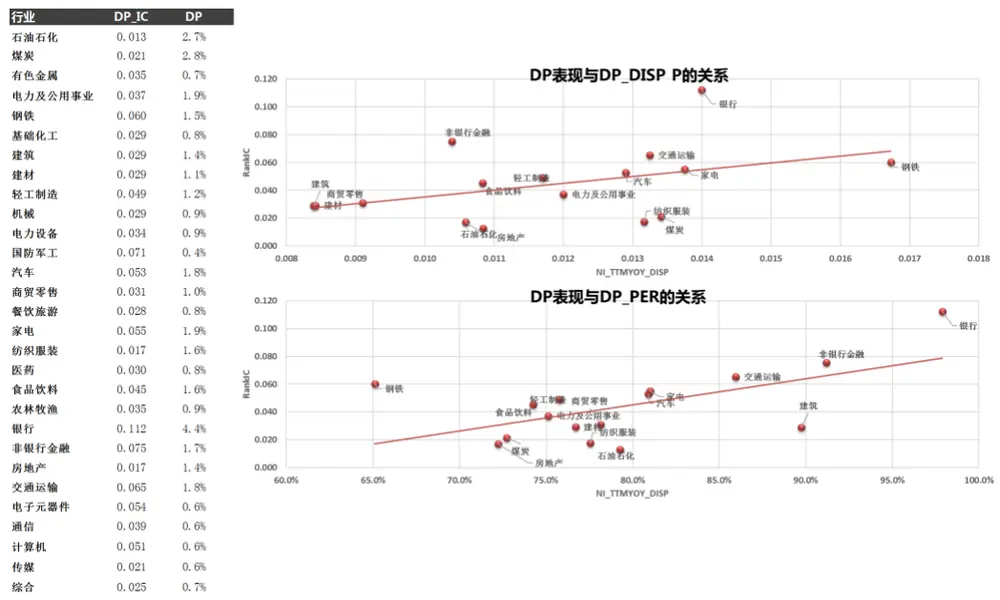
数据来源：东方证券研究所 Wind 资讯

## 1.3 盈利因子

我们测试了盈利大类因子从 2009.7-2018.11 的表现，图 14 展示了测试的结果。盈利大类因子rankIC大于 0.02，ICIR大于 0.5的行业仅有电力及公用事业、钢铁、交通运输和电子元器件，在绝大多数行业盈利并不是有效的选股指标，且盈利大类的多空最大回撤都非常的大。

值得注意的是从 16 年底开始，盈利因子的表现有了很大的提升。图 15 展示了 2016.12-2018.11的盈利大类因子测试结果，在绝大多数行业中盈利因子的表现有了巨大的提升，提升一方面是由于小市值溢价减弱带来的估值修复（低估值股票很多也是盈利能力较好的），另一方面试因为投资者的避险情绪所带来的对于公司质量的关注，这两个因素从基金重仓股的风格暴露变化可以很好的反映出来。但是值得注意的是在有色、建筑、轻工、机械、电力设备、国防军工、汽车、房地产、通讯和综合这些行业中盈利因子这两年选股效果依然较弱。

图 14：2009.7-2018.11 盈利因子在各行业表现

| Profitability原始值 Profitability市值中性化 |  |  |  |  |  |  |  |  |
| --- | --- | --- | --- | --- | --- | --- | --- | --- |
| 行业 | rankIC ICIR |  | 多空年化多空月最大回撤多空信息比 |  | rankIC | ICIR | 多空年化 多空月最大回撤 | 多空信息比 |
| 石油石化 | -0.02 -0.3 | -6% | -52% | -0.21 | 0.006 | 0.11 | -1% -38% | 0.03 |
| 煤炭 | 0.018 0.24 | 2% | -60% | 0.18 | 0.045 | 0.82 9% | -21% | 0.66 |
| 有色金属 | 0.014 0.33 | 5% | -25% | 0.42 | 0.033 | 0.81 8% | -23% | 0.66 |
| 电力及公用事业 | 0.035 0.75 | 4% | -27% | 0.31 | 0.046 | 1.02 | 8% -19% | 0.61 |
| 钢铁 | 0.047 0.7 | 12% | -27% | 0.64 | 0.039 | 0.66 | 13% -29% | 0.72 |
| 基础化工 | 0.008 0.2 | 0% | -38% | 0.08 | 0.029 | 0.74 | 6% -16% | 0.50 |
| 建筑 | 0.025 0.4 | 8% | -48% | 0.49 | 0.029 | 0.45 | 6% -55% | 0.39 |
| 建材 | 0.009 0.16 | -3% | -50% | -0.06 | 0.029 | 0.6 | 4% -37% | 0.34 |
| 轻工制造 | 0.026 0.45 | 2% | -33% | 0.18 | 0.045 | 0.81 | 8% -28% | 0.52 |
| 机械 | 0.018 0.43 | 6% | -29% | 0.48 | 0.038 | 0.9 | 11% -26% | 0.81 |
| 电力设备 | 0.009 0.19 | 2% | -27% | 0.19 | 0.035 | 0.72 | 11% -21% | 0.73 |
| 国防军工 | 0.033 0.44 | 4% | -39% | 0.28 | 0.037 | 0.5 | 9% -37% | 0.48 |
| 汽车 | 0.021 0.46 | 1% | -50% | 0.14 | 0.043 | 1.06 | 7% -19% | 0.54 |
| 商贸零售 | -0.01 -0.1 | -8% | -71% | -0.47 | 0.016 | 0.37 | -4% -51% | -0.22 |
| 餐饮旅游 | 0.021 0.25 | -2% | -61% | 0.03 | 0.037 | 0.52 | 1% -51% | 0.16 |
| 家电 | 0.031 0.43 | 7% | -42% | 0.44 | 0.037 | 0.62 | 12% -33% | 0.65 |
| 纺织服装 | 0.002 0.02 | -7% | -70% | -0.28 | 0.041 | 0.73 | 8% -34% | 0.53 |
| 医药 | 0.028 0.5 | 3% | -42% | 0.26 | 0.047 | 1.23 | 12% -18% | 1.02 |
| 食品饮料 | 0.034 0.42 | 4% | -78% | 0.29 | 0.044 | 0.87 | 8% -54% | 0.50 |
| 农林牧渔 | 0.026 0.49 | 7% | -34% | 0.43 | 0.048 | 0.97 | 11% -27% | 0.58 |
| 房地产 | -0.01 -0.2 | -4% | -45% | -0.23 | 0.009 | 0.32 | -2% -25% | -0.12 |
| 交通运输 | 0.026 0.53 | -2% | -55% | -0.06 | 0.028 | 0.58 | -2% -56% | -0.05 |
| 电子元器件 | 0.028 0.58 | 5% | -38% | 0.40 | 0.049 | 1.18 | 14% -15% | 1.01 |
| 通信 | -0 -0.1 | -5% | -56% | -0.18 | 0.015 | 0.31 | 5% -34% | 0.37 |
| 计算机 | 0.015 0.27 | -1% | -44% | 0.04 | 0.037 | 0.74 | 7% -23% | 0.52 |
| 传媒 | 0.006 0.09 | -6% | -52% | -0.14 | 0.031 | 0.51 | 8% -32% | 0.50 |
| 综合 | -0.01 -0.1 | -12% | -74% | -0.44 | 0.022 | 0.35 | -5% -56% | -0.12 |

数据来源：东方证券研究所 Wind 资讯

图 15：2016.12-2018.11 盈利因子在各行业表现

| Profitability原始值 |  |  |  |  |  |  | Profitability市值中性化 |  |  |
| --- | --- | --- | --- | --- | --- | --- | --- | --- | --- |
| 行业 | rankIC ICIR |  | 多空年化多空月最大回撤多空信息比 |  | rankIC | ICIR |  | 多空年化 多空月最大回撤 | 多空信息比 |
| 石油石化 | 0.019 0.39 | 8% | -12% | 0.57 | 0.007 | 0.17 | 8% | -13% | 0.53 |
| 煤炭 | 0.096 1 | 32% | -12% | 1.52 | 0.066 | 1 | 18% | -7% | 1.12 |
| 有色金属 | -0.02 -0.5 | -2% | -16% | -0.10 | -0.028 | -0.7 | -7% | -19% | -0.45 |
| 电力及公用事业 | 0.058 1.36 | 10% | -8% | 0.89 | 0.038 | 0.97 | 7% | -11% | 0.62 |
| 钢铁 | 0.041 0.52 | 20% | -13% | 0.75 | 0.038 | 0.69 | 30% | -8% | 1.29 |
| 基础化工 | 0.021 0.58 | 5% | -7% | 0.54 | 0.014 | 0.44 | 5% | -6% | 0.57 |
| 建筑 | -0.01-0.3 | 1% | -15% | 0.14 | -0.017 | -0.35 | 1% | -18% | 0.12 |
| 建材 | 0.051 1.08 | 13% | -14% | 0.73 | 0.041 | 1.18 | 5% | -13% | 0.42 |
| 轻工制造 | 0.02 0.35 | -5% | -14% | -0.24 | 0.002 | 0.03 | -5% | -15% | -0.24 |
| 机械 | 0.016 0.43 | 8% | -9% | 0.78 | 0.014 | 0.4 | 7% | -10% | 0.65 |
| 电力设备 | -0.01-0.2 | -1% | -17% | -0.07 | -0.017 | -0.45 | -4% | -19% | -0.31 |
| 国防军工 | -0.02 -0.2 | 0% | -17% | 0.08 | 0.009 | 0.14 | 4% | -11% | 0.30 |
| 汽车 | 0.02 0.49 | -5% | -14% | -0.49 | 0.010 | 0.25 | -8% | -16% | -0.80 |
| 商贸零售 | 0.054 1.4 | 18% | -7% | 1.65 | 0.044 | 1.29 | 11% | -5% | 1.15 |
| 餐饮旅游 | 0.105 1.12 | 30% | -10% | 1.30 | 0.063 | 0.84 | 16% | -14% | 0.96 |
| 家电 | 0.113 1.46 | 32% | -10% | 1.46 | 0.057 | 0.99 | 20% | -9% | 1.14 |
| 纺织服装 | 0.059 0.92 | 10% | -19% | 0.57 | 0.051 | 0.94 | 22% | -6% | 1.28 |
| 医药 | 0.08 1.71 | 19% | -7% | 1.58 | 0.031 | 0.81 | 9% | -6% | 0.98 |
| 食品饮料 | 0.201 2.53 | 72% | -15% | 2.63 | 0.100 | 2.24 | 32% | -11% | 2.07 |
| 农林牧渔 | 0.066 1.39 | 19% | -6% | 1.45 | 0.035 | 0.84 | 15% | -10% | 1.14 |
| 房地产 | 0.019 0.52 | 9% | -7% | 0.86 | 0.003 | 0.09 | 1% | -7% | 0.14 |
| 交通运输 | 0.071 1.83 | 15% | -5% | 1.47 | 0.058 | 1.57 | 14% | -5% | 1.43 |
| 电子元器件 | 0.067 1.59 | 14% | -6% | 1.13 | 0.053 | 1.8 | 11% | -5% | 1.23 |
| 通信 | 0.009 0.22 | 8% | -7% | 0.68 | -0.006 | -0.14 | 5% | -9% | 0.43 |
| 计算机 | 0.041 1 | 9% | -6% | 0.94 | 0.030 | 0.79 | 10% | -4% | 1.05 |
| 传媒 | 0.041 0.94 | 4% | -14% | 0.36 | 0.017 | 0.46 | 1% | -11% | 0.12 |
| 综合 | 0.005 0.11 | -8% | -28% | -0.38 | 0.012 | 0.26 | -4% | -25% | -0.17 |

数据来源：东方证券研究所 Wind 资讯

## 1.4 成长和超预期因子

基于我们之前报告《业绩超预期类因子》的结果，成长因子和超预期大类中的因子度量方法比较接近，在剥离了超预期的 ALPHA 之后，成长因子几乎没有选股能力，因此这里我们把成长和超预期因子放在一个小节来比较（图 17、18）。我们也比较了成长和超预期因子在不同行业间的 rankIC，发现秩相关性高达 80%，而且除了在传媒行业成长与超预期表现接近，在别的行业中超预期均大幅好于成长（图 16），这个结论与我们之前的报告的结果是相符的，所以这里我们对成长因子就不再赘述了。综合来看，超预期因子整体都表现不错，相对表现很弱的行业有石油石化、煤炭、房地产和传媒，都是未来行业表现比较难预测的行业；相对表现很强的行业有机械、电力设备、医药、交通运输这几个行业。

图 16：成长因子与盈利因子在各个行业间的表现
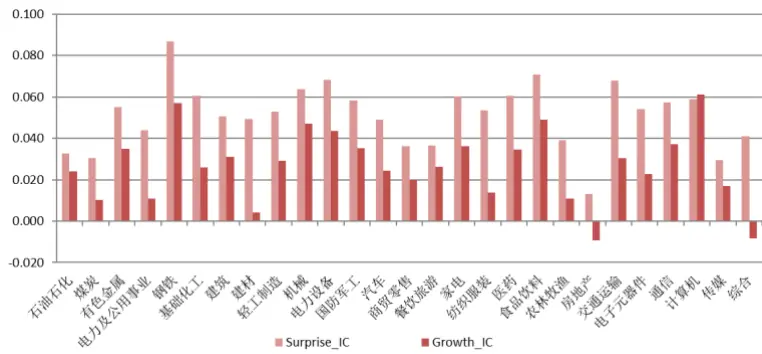
数据来源：东方证券研究所 Wind 资讯

图 17：成长大类因子表现

| Growth原始值 Growth市值中性化 |  |  |  |  |  |  |  |  |  |
| --- | --- | --- | --- | --- | --- | --- | --- | --- | --- |
| 行业 | rankIC ICIR | 多空年化 | 多空月最大回撤 | 多空信息比 rankIC |  | ICIR | 多空年化 | 多空月最力多空信息比 |  |
| 石油石化 | 0.024 0.41 | -3% | -54% | -0.02 | 0.030 | 0.53 | 1% | -51% | 0.16 |
| 煤炭 | 0.01 0.19 | 2% | -26% | 0.22 | 0.004 | 0.08 | -2% | -27% | -0.10 |
| 有色金属 | 0.035 0.74 | 8% | -23% | 0.51 | 0.029 | 0.68 | 9% | -22% | 0.62 |
| 电力及公用事业 | 0.011 0.32 | 1% | -27% | 0.10 | 0.022 | 0.64 | 3% | -21% | 0.35 |
| 钢铁 | 0.057 0.9 | 11% | -36% | 0.59 | 0.050 | 0.91 | 10% | -39% | 0.61 |
| 基础化工 | 0.026 0.69 | 9% | -11% | 0.77 | 0.037 | 1.09 | 12% | -11% | 0.99 |
| 建筑 | 0.031 0.69 | 11% | -25% | 0.76 | 0.038 | 0.87 | 13% | -19% | 0.94 |
| 建材 | 0.004 0.08 | 4% | -32% | 0.29 | 0.015 | 0.34 | 8% | -21% | 0.51 |
| 轻工制造 | 0.029 0.52 | 5% | -34% | 0.34 | 0.044 | 0.81 | 7% | -38% | 0.43 |
| 机械 | 0.047 1.47 | 12% | -13% | 1.11 | 0.056 | 1.79 | 14% | -15% | 1.27 |
| 电力设备 | 0.044 1.14 | 11% | -14% | 0.97 | 0.059 | 1.57 | 18% | -12% | 1.50 |
| 国防军工 | 0.035 0.53 | 5% | -41% | 0.34 | 0.031 | 0.49 | 5% | -38% | 0.35 |
| 汽车 | 0.024 0.69 | 10% | -14% | 0.77 | 0.040 | 1.19 | 14% | -14% | 0.96 |
| 商贸零售 | 0.02 0.55 | 7% | -17% | 0.58 | 0.024 | 0.69 | 7% | -20% | 0.56 |
| 餐饮旅游 | 0.026 0.42 | 5% | -31% | 0.35 | 0.024 | 0.43 | 7% | -21% | 0.45 |
| 家电 | 0.036 0.65 | 12% | -28% | 0.67 | 0.040 | 0.8 | 13% | -27% | 0.75 |
| 纺织服装 | 0.014 0.35 | 4% | -44% | 0.35 | 0.031 | 0.81 | 10% | -22% | 0.75 |
| 医药 | 0.035 0.93 | 9% | -20% | 0.74 | 0.045 | 1.4 | 13% | -9% | 1.17 |
| 食品饮料 | 0.049 0.92 | 14% | -44% | 0.88 | 0.031 | 0.67 | 12% | -25% | 0.91 |
| 农林牧渔 | 0.011 0.27 | 4% | -34% | 0.33 | 0.022 | 0.56 | 6% | -26% | 0.53 |
| 房地产 | -0.01 -0.3 | 0% | -26% | 0.10 | 0.000 | -0.01 | 3% | -26% | 0.30 |
| 交通运输 | 0.03 0.7 | 9% | -14% | 0.69 | 0.032 | 0.8 | 11% | -12% | 0.93 |
| 电子元器件 | 0.023 0.62 | 6% | -22% | 0.49 | 0.035 | 1.08 | 12% | -13% | 0.97 |
| 通信 | 0.037 0.79 | 6% | -23% | 0.40 | 0.053 | 1.24 | 14% | -23% | 0.85 |
| 计算机 | 0.061 1.32 | 15% | -28% | 0.90 | 0.079 | 1.84 | 26% | -14% | 1.67 |
| 传媒 | 0.017 0.35 | 3% |  | -30% | 0.27 0.028 | 0.6 | 7% | -28% | 0.47 |
| 综合 | -0.01-0.2 | -11% |  | -71% | -0.43 | 0.009 0.16 | -6% | -49% | -0.21 |

数据来源：东方证券研究所 Wind 资讯

图 18：超预期大类因子表现

| Surprise原始值 |  |  |  |  |  |  |  |  |  |
| --- | --- | --- | --- | --- | --- | --- | --- | --- | --- |
| 行业 | rankIC ICIR |  | 多空年化多空月最大回撤 | 多空信息比 rankIC |  | ICIR | Surprise市值中性化 | 多空年化 多空月最多空信息比 |  |
| 石油石化 | 0.033 0.58 | 5% | -55% | 0.32 | 0.031 | 0.58 | 7% | -37% | 0.44 |
| 煤炭 | 0.03 0.53 | 5% | -20% | 0.42 | 0.020 | 0.37 | 5% | -19% | 0.43 |
| 有色金属 | 0.055 1.18 | 12% | -16% | 0.88 | 0.047 | 1.1 | 10% | -19% | 0.75 |
| 电力及公用事业 | 0.044 1.3 | 11% | -19% | 0.93 | 0.048 | 1.42 | 12% | -20% | 0.99 |
| 钢铁 | 0.087 1.41 | 19% | -48% | 0.92 | 0.059 | 1.09 | 9% | -51% | 0.52 |
| 基础化工 | 0.061 1.64 | 18% | -10% | 1.41 | 0.068 | 1.99 | 23% | -9% | 1.74 |
| 建筑 | 0.051 1.24 | 15% | -11% | 1.21 | 0.050 | 1.19 | 16% | -10% | 1.17 |
| 建材 | 0.049 0.97 | 20% | -20% | 1.09 | 0.053 | 1.14 | 22% | -21% | 1.29 |
| 轻工制造 | 0.053 1.04 | 14% | -32% | 0.76 | 0.060 | 1.21 | 15% | -38% | 0.79 |
| 机械 | 0.064 2.17 | 21% | -8% | 1.86 | 0.069 | 2.43 | 22% | -12% | 1.88 |
| 电力设备 | 0.068 1.74 | 26% | -8% | 1.76 | 0.071 | 1.87 | 27% | -8% | 1.78 |
| 国防军工 | 0.058 0.91 | 10% | -31% | 0.59 | 0.050 | 0.82 | 8% | -32% | 0.52 |
| 汽车 | 0.049 1.36 | 12% |  | -14% 0.96 | 0.060 | 1.79 | 18% | -9% | 1.43 |
| 商贸零售 | 0.036 1.01 | 17% | -11% | 1.31 | 0.035 | 1.03 | 14% | -12% | 1.15 |
| 餐饮旅游 | 0.036 0.61 | 11% |  | -49% 0.68 | 0.048 | 0.85 | 15% | -38% | 0.88 |
| 家电 | 0.06 1.08 | 12% | -36% | 0.71 | 0.057 | 1.1 | 14% | -27% | 0.86 |
| 纺织服装 | 0.054 1.27 | 15% |  | -12% | 1.02 0.059 | 1.42 | 16% | -13% | 1.08 |
| 医药 | 0.061 1.57 | 19% |  | -12% | 1.52 0.070 | 2.25 | 21% | -6% | 2.09 |
| 食品饮料 | 0.071 1.35 | 21% |  | -26% 1.18 | 0.064 | 1.5 | 25% | -18% | 1.58 |
| 农林牧渔 | 0.039 0.92 | 11% |  | -22% | 0.76 0.046 | 1.16 | 12% | -21% | 0.85 |
| 房地产 | 0.013 0.43 | 4% |  | -23% | 0.37 0.020 | 0.72 | 3% | -23% | 0.36 |
| 交通运输 | 0.068 1.72 | 12% |  | -11% | 1.03 0.062 | 1.67 | 11% | -14% | 1.01 |
| 电子元器件 | 0.054 1.44 | 23% |  | -8% | 1.68 | 0.062 1.85 | 25% | -6% | 1.98 |
| 通信 | 0.058 1.16 | 17% |  | -16% | 1.00 0.067 | 1.44 | 19% | -13% | 1.14 |
| 计算机 | 0.059 | 1.7 20% |  | -12% | 1.54 | 0.062 1.78 | 22% | -16% | 1.55 |
| 传媒 | 0.029 | 0.63 | 12% | -31% | 0.73 | 0.046 1.03 | 15% | -20% | 1.00 |
| 综合 | 0.041 0.83 |  | 7% | -47% | 0.46 | 0.048 | 0.92 | 11% -32% | 0.63 |

数据来源：东方证券研究所 Wind 资讯

## 1.5 公司治理因子

我们测试了公司治理大类因子从 2009.7-2018.11的表现（图 19），公司治理因子中仅包括了高管薪酬因子，从原始值结果来看，并没有哪个行业里的 rankIC 高于 0.02 且 ICIR 大于 0.5，也就是说单看原始值高管薪酬在过去 9 年是没有选股效果的，这是因为高管薪酬和市值高度正相关，大的龙头企业的高管薪酬较高，而过去这段时间市值在绝大多数行业中都是负向的效果，所以导致高管薪酬的原始值基本没有选股效果，因此像高管薪酬这类的因子，我们可以考虑剥离掉市值的因素来比较市值相同情况下的高管薪酬因子的表现（图 20右），则该因子在绝大多数行业中都是有比较显著的选股效果的，说明在市值差不多的情况下，高管薪酬越高的公司长期可以获得超额收益，因此像高管薪酬因子我们推荐最好进行市值调整后再使用，从结果来看 rankIC 大于 0.03 且 ICIR大于 1的行业有基础化工、轻工制造、建材、汽车、房地产和电子元器件。

## 1.5.1 大国企占比较高的行业，高管薪酬表现较弱

通常来说，大国企对于高管薪酬都是有所限制的，所以这个因子可能会在大国企比例较高的行业中效果变弱，我们计算了每个行业中股票在全市场市值前 10%且为国企的占比（SOE），并比较了市值调整后高管薪酬 RankIC 和 SOE 的关系，可以看到，煤炭行业大国企比例远大于其他行业，我们把煤炭行业作为异常点，并对剩下的数据进行回归，回归系数为-0.11，R-square 为 15.2%，说明高管薪酬表现和行业的大国企占比确实存在一定的反相关关系。简单来说大国企由于限薪会导致高管薪酬失真，所以在大国企比例较高的行业高管薪酬因子的表现会较弱。

图 19：公司治理因子表现

| Operation原始值 Operation市值中性化 |  |  |  |  |  |  |  |  |  |
| --- | --- | --- | --- | --- | --- | --- | --- | --- | --- |
| 行业 | rankIC ICIR |  | 多空年化 多空月最大回撤 | 多空信息比 rankIC |  | ICIR | 多空年化 | 多空月最多空信息比 |  |
| 石油石化 | -0.01-0.2 | -9% | -63% | -0.37 | -0.002 | -0.04 | -4% | -48% | -0.15 |
| 煤炭 | 0.005 0.07 | -4% | -61% | -0.15 | 0.032 | 0.6 | 5% | -20% | 0.40 |
| 有色金属 | -0.01-0.3 | -7% | -64% | -0.37 | 0.034 | 0.94 | 3% | -19% | 0.33 |
| 电力及公用事业 | -0.03 -0.6 | -3% | -54% | -0.11 | -0.008 | -0.24 | 1% | -35% | 0.16 |
| 钢铁 | 0.007 0.13 | -7% | -64% | -0.31 | 0.033 | 0.7 | 2% | -28% | 0.20 |
| 基础化工 | 0.009 0.27 | -2% | -40% | -0.09 | 0.039 | 1.39 | 6% | -23% | 0.61 |
| 建筑 | 0.017 0.29 | 6% | -31% | 0.36 | 0.039 | 0.83 | 9% | -27% | 0.61 |
| 建材 | 0.007 0.12 | 3% | -47% | 0.26 | 0.045 | 1.15 | 13% | -23% | 0.89 |
| 轻工制造 | 0.007 0.16 | -8% | -64% | -0.41 | 0.048 | 1.23 | 9% | -29% | 0.58 |
| 机械 | -0.02 -0.6 | -12% | -74% | -0.76 | 0.016 | 0.66 | 2% | -24% | 0.28 |
| 电力设备 | -0.01 -0.4 | -9% | -68% | -0.60 | 0.021 | 0.68 | 1% | -31% | 0.17 |
| 国防军工 | 0.018 0.3 | 4% | -29% | 0.29 | 0.030 | 0.54 | 10% | -25% | 0.63 |
| 汽车 | 0.001 0.02 | -6% | -67% | -0.24 | 0.033 | 1.06 | 8% | -20% | 0.72 |
| 商贸零售 | -0.01-0.2 | -5% | -58% | -0.24 | 0.012 | 0.39 | -1% | -38% | 0.01 |
| 餐饮旅游 | 0.03 0.46 | 3% | -38% | 0.24 | 0.044 | 0.77 | 13% | -23% | 0.82 |
| 家电 | 0.012 0.16 | -4% | -63% | -0.02 | 0.035 | 0.67 | 7% | -30% | 0.47 |
| 纺织服装 | -0.01-0.2 | -8% | -58% | -0.46 | 0.027 | 0.73 | 8% | -17% | 0.63 |
| 医药 | 0.009 0.22 | 0% | -40% | 0.07 | 0.021 | 0.84 | 4% | -17% | 0.52 |
| 食品饮料 | 0.005 0.08 | -8% | -75% | -0.34 | 0.015 | 0.37 | -4% | -42% | -0.14 |
| 农林牧渔 | 0.005 0.12 | -2% | -53% | -0.02 | 0.029 | 0.87 | 8% | -18% | 0.65 |
| 房地产 | 0.006 0.11 | -4% | -60% | -0.10 | 0.042 | 1.43 | 9% | -12% | 0.83 |
| 交通运输 | -0.03 -0.6 | -4% | -43% | -0.20 | -0.008 | -0.23 | 2% | -17% | 0.24 |
| 电子元器件 | 0.011 0.3 | -2% | -52% | -0.10 | 0.035 | 1.17 | 9% | -16% | 0.79 |
| 通信 | 0.006 0.15 | -4% | -57% | -0.17 | 0.032 | 0.79 | 6% | -24% | 0.53 |
| 计算机 | -0.01-0.2 | -5% | -54% | -0.29 | 0.011 | 0.32 | 2% | -28% | 0.24 |
| 传媒 | -0 -0.1 | -10% | -65% | -0.54 | 0.026 | 0.51 | 4% | -33% | 0.34 |
| 综合 | 0.0040.07 | -7% | -60% | -0.18 | 0.040 | 0.76 | 5% | -35% | 0.33 |

数据来源：东方证券研究所 Wind 资讯

图 20：市值调整后的高管薪酬表现和行业大国企占比的关系
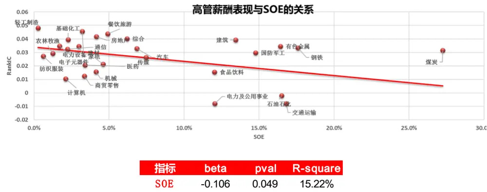
数据来源：东方证券研究所 Wind 资讯

## 1.6 技术类因子

技术类因子我们主要分成非流动性、反转和投机性三大类（图 21-23），技术类因子从理想表现来看，是要强于基本面因子的，但是因为技术类因子换手率较高，因此实际表现在测试结果上要打一定折扣。因为技术类因子整体表现较好，所以我们设定一个相对高的标准来划分，非流动性 rankIC小于 0.05或 ICIR小于 1的行业仅有煤炭；反转因子有石油石化、煤炭、有色、钢铁、建筑、纺织服装和食品饮料；投机性因子有石油石化、建筑和传媒。

图 21：非流动性因子表现

| 行业 | rankIC ICIR | Liquidity原始值 多空年化 多空月最大回撤 |  | 多空信息比 rankIC | ICIR |  | Liquidity市值中性化 多空年化 多空月最大回撤 | 多空信息比 |
| --- | --- | --- | --- | --- | --- | --- | --- | --- |
| 石油石化 | 0.104 1.43 | 22% | -28% | 0.95 | 0.106 | 1.52 30% | -26% | 1.15 |
| 煤炭 | 0.067 0.98 | 7% | -36% | 0.44 | 0.070 | 1.06 11% | -32% | 0.69 |
| 有色金属 | 0.083 1.54 | 12% | -35% | 0.73 | 0.082 | 1.59 12% | -37% | 0.76 |
| 电力及公用事业 | 0.089 1.73 | 13% | -23% | 0.90 | 0.093 | 1.95 17% | -24% | 1.17 |
| 钢铁 | 0.066 1.01 | 4% | -37% | 0.29 | 0.064 | 1.07 9% | -30% | 0.54 |
| 基础化工 | 0.114 2.65 | 27% | -12% | 1.72 | 0.110 | 2.6 25% | -16% | 1.59 |
| 建筑 | 0.104 1.86 | 15% | -47% | 0.66 | 0.102 | 2.09 23% | -18% | 1.20 |
| 建材 | 0.112 2.09 | 30% | -19% | 1.57 | 0.117 | 2.39 | 32% -14% | 1.72 |
| 轻工制造 | 0.095 1.66 | 12% | -43% | 0.63 | 0.086 | 1.56 | 15% -38% | 0.76 |
| 机械 | 0.111 2.5 | 23% | -15% | 1.47 | 0.114 | 2.62 | 28% -11% | 1.77 |
| 电力设备 | 0.1 2.43 | 28% | -12% | 1.84 | 0.104 | 2.54 | 32% -9% | 2.06 |
| 国防军工 | 0.076 1.01 | 25% | -30% | 1.03 | 0.071 | 0.94 | 16% -39% | 0.80 |
| 汽车 | 0.115 2.67 | 33% | -20% | 1.90 | 0.117 | 2.85 | 39% -18% | 2.26 |
| 商贸零售 | 0.11 2.38 | 26% | -15% | 1.53 | 0.105 | 2.36 | 30% -12% | 1.72 |
| 餐饮旅游 | 0.068 1 | 11% | -34% | 0.60 | 0.079 | 1.17 | 12% -27% | 0.64 |
| 家电 | 0.11 2 | 29% | -18% | 1.51 | 0.111 | 2.05 | 32% -12% | 1.67 |
| 纺织服装 | 0.143 2.94 | 45% | -16% | 2.22 | 0.140 | 2.93 | 42% -16% | 2.09 |
| 医药 | 0.074 1.86 | 18% | -12% | 1.33 | 0.078 | 2.17 | 18% -17% | 1.46 |
| 食品饮料 | 0.111 1.88 | 28% | -21% | 1.41 | 0.115 | 2.11 | 30% -21% | 1.56 |
| 农林牧渔 | 0.136 3.03 | 35% | -11% | 1.63 | 0.131 | 3.05 | 35% -12% | 1.75 |
| 房地产 | 0.116 3.02 | 31% | -15% | 2.00 | 0.111 | 3.23 | 33% -8% | 2.40 |
| 交通运输 | 0.11 1.98 | 14% | -31% | 0.82 | 0.114 | 2.29 | 16% -25% | 0.99 |
| 电子元器件 | 0.108 32.41 | 28% | -14% | 1.73 | 0.112 | 2.58 | 30% -13% | 1.79 |
| 通信 | 0.096 1.69 | 28% | -23% | 1.14 | 0.098 | 1.77 | 28% -19% | 1.21 |
| 计算机 | 0.109 2 | 32% | -14% | 1.62 | 0.113 | 2.11 | 33% -12% | 1.67 |
| 传媒 | 0.096 1.36 | 12% | -48% | 0.57 | 0.097 | 1.46 | 12% -60% | 0.56 |
| 综合 | 0.12 1.63 | 16% | -41% | 0.70 | 0.115 | 1.62 | 14% -39% | 0.65 |

数据来源：东方证券研究所 Wind 资讯

图 22：反转因子表现

| Reversal原始值 Reversal市值中性化 |  |  |  |  |  |  |  |  |
| --- | --- | --- | --- | --- | --- | --- | --- | --- |
| 行业 | rankIC ICIR |  | 多空年化 多空月最大回撤 | 多空信息比 rankIC |  | ICIR |  | 多空年化 多空月最多空信息比 |
| 石油石化 | 0.075 0.97 | 12% | -53% | 0.56 | 0.065 | 0.99 | 11% -40% | 0.55 |
| 煤炭 | 0.044 0.54 | 7% | -39% | 0.44 | 0.049 0.67 | 7% | -42% | 0.42 |
| 有色金属 | 0.064 0.95 | 6% | -34% | 0.40 | 0.069 | 1.13 7% | -23% | 0.43 |
| 电力及公用事业 | 0.068 1.08 | 10% | -25% | 0.62 | 0.078 | 1.45 14% | -24% | 0.91 |
| 钢铁 | 0.063 0.85 | 8% | -29% | 0.44 | 0.055 | 0.86 10% | -25% | 0.53 |
| 基础化工 | 0.071 1.45 | 17% | -17% | 0.99 | 0.065 | 1.41 15% | -18% | 0.93 |
| 建筑 | 0.043 0.66 | 1% | -60% | 0.18 | 0.044 | 0.77 2% | -49% | 0.22 |
| 建材 | 0.068 1.19 | 13% | -25% | 0.73 | 0.066 | 1.25 | 13% -25% | 0.71 |
| 轻工制造 | 0.05 0.77 | 7% | -31% | 0.44 | 0.038 | 0.62 | 5% -28% | 0.34 |
| 机械 | 0.063 1.24 | 12% | -17% | 0.80 | 0.065 | 1.4 | 14% -14% | 0.99 |
| 电力设备 | 0.041 0.81 | 12% | -30% | 0.74 | 0.042 | 0.84 | 13% -23% | 0.79 |
| 国防军工 | 0.063 0.82 | 17% | -32% | 0.82 | 0.060 | 0.84 | 12% -40% | 0.62 |
| 汽车 | 0.076 1.34 | 12% | -33% | 0.66 | 0.072 | 1.41 | 11% -38% | 0.64 |
| 商贸零售 | 0.092 1.67 | 23% | -25% | 1.29 | 0.093 | 1.83 | 22% -28% | 1.33 |
| 餐饮旅游 | 0.073 0.91 | 19% | -44% | 0.88 | 0.076 | 1 | 22% -26% | 1.06 |
| 家电 | 0.081 1.22 | 26% | -33% | 1.11 | 0.083 | 1.29 | 22% -19% | 1.01 |
| 纺织服装 | 0.062 0.95 | 15% | -33% | 0.78 | 0.063 | 1.05 | 14% -25% | 0.76 |
| 医药 | 0.035 0.6 | 4% | -36% | 0.32 | 0.038 | 0.78 | 6% -34% | 0.44 |
| 食品饮料 | 0.002 0.02 | -6% | -58% | -0.15 | 0.019 | 0.32 | -2% -58% | 0.02 |
| 农林牧渔 | 0.094 1.63 | 17% | -34% | 0.85 | 0.091 | 1.73 | 13% -34% | 0.72 |
| 房地产 | 0.086 1.59 | 20% | -40% | 1.07 | 0.089 | 1.99 | 23% -23% | 1.31 |
| 交通运输 | 0.066 0.97 | 14% | -25% | 0.79 | 0.068 | 1.09 | 10% -25% | 0.63 |
| 电子元器件 | 0.065 1.22 | 13% | -30% | 0.78 | 0.067 | 1.38 | 17% -20% | 1.01 |
| 通信 | 0.114 2.14 | 30% | -16% | 1.55 | 0.104 | 2.05 | 25% -19% | 1.47 |
| 计算机 | 0.066 1.16 | 21% | -20% | 1.06 | 0.063 | 1.16 | 18% -23% | 0.98 |
| 传媒 | 0.073 1.14 | 10% | -49% | 0.52 | 0.066 | 1.08 | 8% -51% | 0.45 |
| 综合 | 0.074 1.18 | 14% | -32% | 0.66 | 0.082 | 1.36 | 19% -30% | 0.80 |

数据来源：东方证券研究所 Wind 资讯

图 23：投机性因子表现

| 行业 | rankIC ICIR | 多空年化 Lottery原始值 多空月最大回撤 |  | 多空信息比rankIC |  |  | Lottery市值中性化 多空年化 多空月最力多空信息比 |  |  |
| --- | --- | --- | --- | --- | --- | --- | --- | --- | --- |
| 石油石化 |  |  |  | -54% | 0.063 |  | ICIR 1.01 |  |  |
| 煤炭 | 0.053 0.72 | 8% |  |  | 0.46 | 1.4 | 10% 11% | -48% -33% | 0.58 0.67 |
| 有色金属 | 0.081 1.14 | 8% | -25% | 0.50 0.64 | 0.099 0.106 | 1.84 | 14% | -26% | 0.76 |
| 电力及公用事业 | 0.0961.52 | 13% | -34% | 0.79 | 0.109 | 2.06 | 20% | -18% | 1.26 |
| 钢铁 | 0.09 1.45 | 13% | -20% -46% | 0.10 | 0.084 | 1.26 | 8% | -25% | 0.46 |
| 基础化工 | 0.056 0.71 | 0% 12% | -24% | 0.79 | 0.080 | 1.81 | 10% | -30% | 0.68 |
| 建筑 | 0.082 1.83 |  | -28% | 0.20 | 0.073 | 1.23 |  | -28% |  |
| 建材 | 0.0570.88 | 2% |  |  | 0.123 |  | 12% |  | 0.70 |
| 轻工制造 | 0.119 2.4 | 25% | -18% | 1.26 0.47 | 0.098 | 2.59 | 31% | -12% | 1.61 |
| 机械 | 0.093 1.55 | 8% | -52% |  | 0.109 | 1.66 | 9% | -54% | 0.50 |
| 电力设备 | 0.101 2.27 | 17% | -14% | 1.12 0.53 | 0.088 | 2.51 | 21% | -16% | 1.41 |
| 国防军工 | 0.072 1.42 | 7% | -29% |  |  | 1.78 | 14% | -21% | 0.94 |
| 汽车 | 0.09 1.2 | 16% | -34% | 0.80 | 0.085 | 1.12 | 14% | -40% | 0.72 |
| 商贸零售 | 0.121 2.42 | 24% | -22% | 1.30 0.61 | 0.122 0.094 | 2.68 | 27% | -18% | 1.64 |
| 餐饮旅游 | 0.094 1.81 | 9% | -28% |  |  | 1.83 | 9% | -30% | 0.59 |
| 家电 | 0.0781.08 | 3% | -52% | 0.26 | 0.086 | 1.2 | 6% | -53% | 0.41 |
| 纺织服装 | 0.099 1.55 | 18% |  | -42% | 0.83 0.101 | 1.65 | 23% | -40% | 1.04 |
| 医药 | 0.098 1.74 | 15% |  | -35% | 0.79 0.106 | 2 | 19% | -28% | 0.95 |
| 食品饮料 | 0.058 1.18 | 8% |  | -33% | 0.58 0.064 | 1.41 | 10% | -35% | 0.68 |
| 农林牧渔 | 0.087 1.44 | 15% |  | -21% | 0.83 0.092 | 1.74 | 18% | -25% | 0.95 |
| 房地产 | 0.125 2.41 | 24% |  | -18% | 1.25 0.123 | 2.4 | 24% | -17% | 1.29 |
| 交通运输 | 0.117 2.64 | 26% |  | -12% | 1.62 | 0.114 2.57 | 27% | -14% | 1.65 |
| 电子元器件 | 0.104 1.58 | 12% |  | -28% | 0.73 0.113 | 1.91 | 15% | -16% | 0.91 |
| 通信 | 0.0881.82 | 15% |  | -20% | 0.85 | 0.090 1.89 | 14% | -24% | 0.82 |
| 计算机 | 0.084 1.34 | 12% |  | -34% -25% | 0.64 1.13 | 0.097 1.62 1.75 | 22% 20% | -23% -39% | 1.10 1.02 |
| 传媒 | 0.0881.56 0.061 0.83 | 21% -8% |  | -76% | -0.18 | 0.096 0.081 | 1.1 0% | -73% | 0.14 |
| 综合 | 0.1171.67 |  | 16% | -41% | 0.72 | 0.121 | 21% | -35% | 0.93 |
|  |  |  |  |  |  |  | 1.81 |  |  |

数据来源：东方证券研究所 Wind 资讯

## 1.6.1 股票收益 Dispersion 更高的行业非流动性和投机因子表现更好

我们测算了 3类因子在行业横截面上的 rankIC间的秩相关性，发现非流动性和反转的秩相关系数为 36%（10%显著）、非流动性和投机性的秩相关系数为 67%(1%显著)、反转和投机性的秩相关系数为 40%（5%显著），也就是说不同类型技术类因子在不同行业间的表现是有同步性的。我们进一步比较了不同行业内股票的月收益 Dispersion（图 24），发现非流动性和投机表现都与行业内的 Dispersion 有显著的正相关关系，系数为 1.74 和 1.05，R-sqaure 为 43%和 14%，但是反转和 Dispersion 的关系不显著。这也就是说行业内的股票收益的差异化越大，这个行业就更适合于使用非流动性和投机因子，这是因为行业内更高的收益率 Dispersion 反映了更大的投资者分歧，这样的行业投机的空间也就越大，非流动性和投机因子的表现也会较好。

图 24：技术因子表现与行业收益率 Dispersion的关系
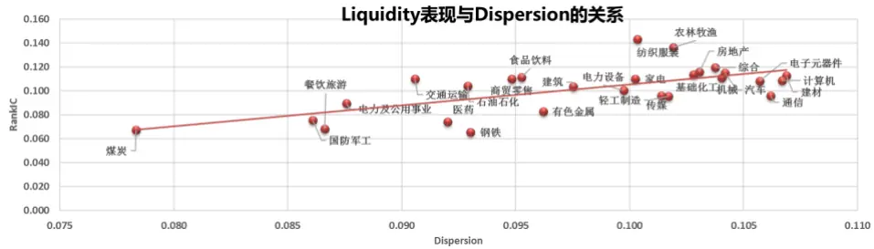

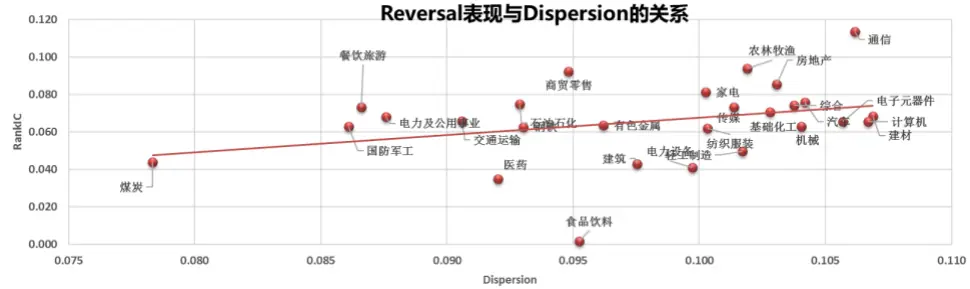

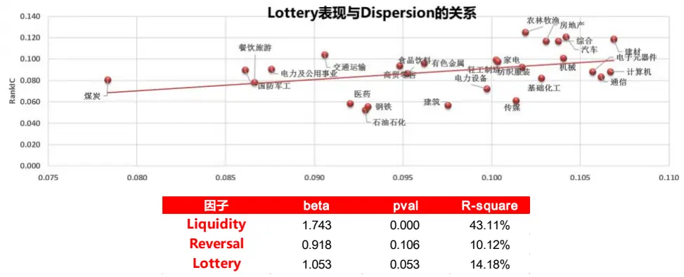
数据来源：东方证券研究所 Wind 资讯

## 1.7 分析师类因子

图 25 展示了分析师因子的测试结果，分析师因子在有综合行业中的平均覆盖率低于 30%，所以这里做了剔除。

图 25：分析师因子表现

| Analyst原始值 Analyst市值中性化 |  |  |  |  |  |  |  |  |  |
| --- | --- | --- | --- | --- | --- | --- | --- | --- | --- |
| 行业 | rankIC ICIR |  | 多空年化 多空月最大回撤 | 多空信息比 rankIC |  | ICIR |  | 多空年化 多空月最多空信息比 |  |
| 石油石化 | 0.046 0.74 | 10% | -35% | 0.58 | 0.066 | 1.13 | 16% | -21% | 0.91 |
| 煤炭 | 0.025 0.32 | 4% | -31% | 0.32 | 0.040 | 0.67 | 8% | -26% | 0.56 |
| 有色金属 | 0.033 0.76 | 7% | -33% | 0.57 | 0.042 | 1.1 | 6% | -27% | 0.45 |
| 电力及公用事业 | 0.035 0.73 | 5% | -26% | 0.39 | 0.058 | 1.42 | 13% | -16% | 1.00 |
| 钢铁 | 0.057 0.79 | 11% | -19% | 0.61 | 0.068 | 1.05 | 13% | -30% | 0.69 |
| 基础化工 | 0.036 0.95 | 9% | -15% | 0.84 | 0.068 | 2.09 | 17% | -10% | 1.55 |
| 建筑 | 0.027 0.5 | 5% | -35% | 0.33 | 0.072 | 1.52 | 14% | -29% | 0.97 |
| 建材 | 0.047 0.84 | 11% | -36% | 0.62 | 0.085 | 1.94 | 23% | -25% | 1.28 |
| 轻工制造 | 0.054 1.11 | 10% | -20% | 0.68 | 0.091 | 2 | 21% | -18% | 1.33 |
| 机械 | 0.047 1.31 | 13% | -16% | 1.07 | 0.081 | 2.48 | 20% | -18% | 1.53 |
| 电力设备 | 0.054 1.13 | 11% | -25% | 0.75 | 0.076 | 1.8 | 19% | -26% | 1.22 |
| 国防军工 | 0.06 0.87 | 18% | -33% | 0.90 | 0.061 | 0.89 | 20% | -28% | 1.02 |
| 汽车 | 0.05 0.93 | 3% | -54% | 0.26 | 0.081 | 1.87 | 13% | -37% | 0.82 |
| 商贸零售 | 0.027 0.58 | 5% | -17% | 0.47 | 0.051 | 1.25 | 8% | -17% | 0.70 |
| 餐饮旅游 | 0.025 0.35 | 6% | -26% | 0.39 | 0.038 | 0.57 | 11% | -21% | 0.68 |
| 家电 | 0.06 0.83 | 14% |  | -48% 0.64 | 0.084 | 1.48 | 30% | -18% | 1.50 |
| 纺织服装 | 0.019 0.34 | 7% |  | -27% | 0.45 0.062 | 1.38 | 12% | -23% | 0.75 |
| 医药 | 0.052 1.01 | 13% |  | -31% | 0.92 0.075 | 1.97 | 19% | -13% | 1.56 |
| 食品饮料 | 0.084 1.22 | 17% |  | -29% | 0.94 0.103 | 2.02 | 28% | -12% | 1.69 |
| 农林牧渔 | 0.05 0.89 | 12% |  | -30% | 0.65 0.074 | 1.49 | 19% | -16% | 1.07 |
| 房地产 | 0.035 0.61 | 9% |  | -25% | 0.54 0.069 | 1.56 | 20% | -14% | 1.29 |
| 交通运输 | 0.056 1.11 | 8% |  | -25% | 0.64 0.072 | 1.65 | 13% | -22% | 1.00 |
| 电子元器件 | 0.062 | 1.27 18% |  | -24% | 1.05 | 0.083 2.02 | 22% | -16% | 1.44 |
| 通信 | 0.038 | 0.81 3% |  | -43% | 0.25 0.065 | 1.53 | 12% | -32% | 0.70 |
| 计算机 | 0.06 | 1.14 13% |  | -31% | 0.77 | 0.082 1.85 | 16% | -30% | 1.05 |
| 传媒 | 0.035 | 0.62 | 6% | -38% | 0.39 | 0.057 1.05 | 11% | -30% | 0.61 |
| 综合 | nan | nan | nan | nan | nan | nan | nan | nan nan | nan |

数据来源：东方证券研究所 Wind 资讯

综合来看，分析师因子 rankIC大于 0.04，ICIR大于 1的行业有轻功制造、电力设备、医药、食品饮料、交通运输、电子元器件和计算机，而在通讯和传媒其实也有不错的选股效果的，这个说明在更看重未来预期的 TMT行业，分析师因子不失为比较好的选股指标；而在石油石化、有色、电力及公用事业、钢铁和建筑等强周期行业中分师因子的表现会弱一些，这是因为这些强周期行业预测相对困难，即使是分析师也很难对于这类行业未来的表现作出很好的判断，因此分析师因子在这类行业中效果会相对变弱。

## 2.行业内增强组合测试

从 1.1 对市值的分析可以看到，无论是过去九年还是过去两年，市值的 rankIC 在绝大多数行业都非常显著，但是 ICIR整体来看并不高，而且一旦发生风格变化，市值选股的方向完全发生了改变，因此如果构建行业内的增强组合，我们还是倾向于对市值风格进行一定的控制。

这里我们以一定的标准对行业内调整了市值风格的单因子进行一定的筛选，较低的筛选标准为因子的 rankIC 大于等于 0.02，ICIR 大于等于 0.4，较高的筛选标准为 rankIC 大于等于 0.03，ICIR 大于等于 1，在低标准情况下，盈利类因子、公司治理和反转因子在大多数行业都被选到了，而在高标准的筛选条件下，因为技术类因子整体的 rankIC和 ICIR都高于基本面因子，所以基本面因子选到的较少。

图 26：两种不同筛选标准下的行业内增强表现

筛选行业内因子行业内增强组合（标准1）
筛选行业内因子行业内增强组合（标准2）

| 行业 | 对冲年化 | 最大回撤 | 信息比 | 跟踪误差 | 换手率 | 对冲年化 | 最大回撤 | 信息比 | 跟踪误差 | 换手率 |
| --- | --- | --- | --- | --- | --- | --- | --- | --- | --- | --- |
| 石油石化 | 4.8% | -4.9% | 1.168 | 4.1% | 16.2% | 4.9% | -6.3% | 1.093 | 4.4% | 23.7% |
| 煤炭 | 4.1% | -5.6% | 1.219 | 3.4% | 17.9% | 2.1% | -9.2% | 0.605 | 3.5% | 20.5% |
| 有色金属 | 3.1% | -8.2% | 0.742 | 4.2% | 18.3% | 2.7% | -7.3% | 0.663 | 4.2% | 17.9% |
| 电力及公用事业 | 5.3% | -8.6% | 1.049 | 5.0% | 28.1% | 4.2% | -10.0% | 0.882 | 4.8% | 29.8% |
| 钢铁 | 2.0% | -8.7% | 0.568 | 3.5% | 15.2% | 4.1% | -6.4% | 1.071 | 3.8% | 18.8% |
| 基础化工 | 10.2% | -9.2% | 1.849 | 5.3% | 31.5% | 11.2% | -9.2% | 1.990 | 5.4% | 30.8% |
| 建筑 | 6.1% | -5.3% | 1.485 | 4.1% | 18.3% | 6.5% | -7.2% | 1.483 | 4.3% | 22.0% |
| 建材 | 8.4% | -6.5% | 1.579 | 5.2% | 20.5% | 9.1% | -6.6% | 1.700 | 5.2% | 23.7% |
| 轻工制造 | 5.7% | -5.4% | 1.243 | 4.5% | 19.4% | 6.0% | -4.7% | 1.296 | 4.6% | 18.5% |
| 机械 | 12.8% | -7.2% | 2.135 | 5.7% | 31.1% | 12.6% | -7.7% | 2.168 | 5.6% | 30.9% |
| 电力设备 | 11.6% | -8.4% | 2.161 | 5.1% | 25.4% | 11.5% | -7.6% | 2.117 | 5.2% | 30.9% |
| 国防军工 | 3.4% | -6.9% | 0.860 | 4.0% | 14.6% | 3.9% | -6.9% | 0.917 | 4.2% | 18.9% |
| 汽车 | 6.9% | -10.2% | 1.364 | 5.0% | 23.1% | 6.3% | -11.4% | 1.254 | 5.0% | 21.2% |
| 商贸零售 | 2.1% | -9.1% | 0.500 | 4.4% | 23.7% | 3.1% | -6.8% | 0.650 | 4.9% | 28.1% |
| 餐饮旅游 | 1.9% | -6.6% | 0.628 | 3.1% | 12.9% | 0.7% | -6.3% | 0.235 | 3.0% | 16.3% |
| 家电 | 2.0% | -18.5% | 0.343 | 6.3% | 14.8% | 2.9% | -17.2% | 0.481 | 6.5% | 17.5% |
| 纺织服装 | 7.1% | -8.3% | 1.347 | 5.2% | 21.6% | 8.0% | -6.9% | 1.488 | 5.3% | 24.4% |
| 医药 | 5.7% | -7.4% | 1.127 | 5.1% | 31.8% | 5.4% | -7.5% | 1.075 | 5.0% | 36.2% |
| 食品饮料 | 2.6% | -5.8% | 0.719 | 3.7% | 19.8% | 3.4% | -5.0% | 0.885 | 3.9% | 17.7% |
| 农林牧渔 | 8.0% | -8.7% | 1.363 | 5.8% | 22.2% | 8.3% | -7.5% | 1.482 | 5.5% | 25.7% |
| 房地产 | 2.8% | -8.3% | 0.746 | 3.9% | 23.0% | 3.6% | -10.0% | 0.870 | 4.1% | 17.7% |
| 交通运输 | 3.4% | -10.2% | 0.817 | 4.2% | 25.4% | 0.9% | -9.9% | 0.236 | 4.0% | 27.2% |
| 电子元器件 | 6.8% | -8.6% | 1.241 | 5.4% | 27.8% | 3.6% | -9.2% | 0.685 | 5.4% | 27.4% |
| 通信 | 4.1% | -7.1% | 0.808 | 5.1% | 21.8% | 4.1% | -6.8% | 0.814 | 5.2% | 21.3% |
| 计算机 | 5.6% | -10.1% | 1.057 | 5.3% | 25.1% | 4.9% | -10.7% | 0.932 | 5.2% | 23.7% |
| 传媒 | 2.8% | -13.3% | 0.705 | 4.0% | 16.7% | 3.0% | -14.1% | 0.755 | 4.0% | 19.6% |
| 综合 | 0.5% | -23.5% | 0.122 | 5.5% | 13.3% | -0.2% | -25.2% | -0.007 | 5.7% | 12.9% |

数据来源：东方证券研究所 Wind 资讯

图 28展示了在两种筛选标准（低标准左，高标准右）下行业内精选大类因子的行业内增强组合组合的表现，可以看到两类组合在各个行业中都是有着正的超额收益的，但是从结果来看，提高筛选标准并没有带来整体的提升，筛选标准高了以后有的行业表现变好了，比如基础化工、纺织服装、建材等，但是也有一些行业的表现变差了，比如煤炭、餐饮旅游、医药等，这是因为有的行业因子整体表现较好，而有的行业因子整体表现较差，如果只是单纯的用一套筛选标准就会导致选出来的因子适应性在不同行业有所差异，因此如果是想构建单个行业的增强组合，最好采用更适应行业的因子筛选方法，综合行业内因子表现，因子在行业内换手率，多空收益表现等因素进行因子的选择，这样可以构建更适合行业属性的增强组合。此外，这里只测试了常规 ALPHA因子的效果，但是很多行业都存在有独特的 ALPHA 因子，比如研发营收比在医药和计算机行业有非常明显的独特ALPHA，所以如果在构建行业内增强的时候引入特有的 ALPHA 因子，可以进一步提升行业内的选股效果。

## 3.细分行业建模的增强组合

在行业内建模除了可以构建行业内增强组合，另一种思路是构建以行业为情景的模型，理论上说在每个行业建模然后合并到一起可以让期望收益率的预测更为准确，所以这里我们对比了细分行业建模与整体建模在构建的差异，我们构建了细分行业建模的中证 500 全市场增强组合，在构建组合的时候，我们把基于每个行业计算的行业内期望收率（Zscore 调整了 RankIC 和 Dispersion）拼在一起，得到了全市场的期望收益率，然后据此构建增强组合。

图 27：全市场增强 500 组合对比

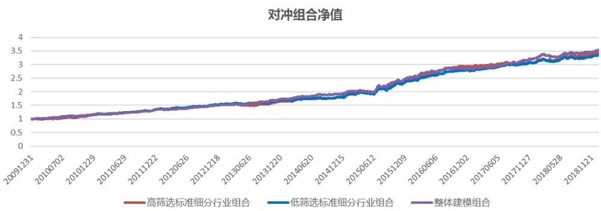

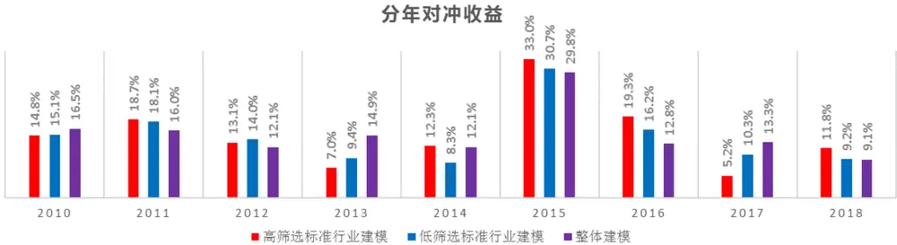

| 组合 | 对冲年化 | 最大回撤 | 信息比 | 月单边换手 |
| --- | --- | --- | --- | --- |
| 高筛选标准行业建模 | 14.9% | -3.7% | 2.77 | 52.7% |
| 低筛选标准行业建模 | 14.5% | -4.2% | 2.72 | 51.0% |
| 整体建模 | 15.1% | -4.0% | 2.90 | 42.1% |

数据来源：东方证券研究所 Wind 资讯

从结果来看，细分行业建模后组合与整体建模组合表现基本相当，但换手率较整体建模的组合更高，这里我们扣除了单边 0.3%的费率，更高的换手也会使得收益被削弱一些。分年收益上看，3 个组合在不同年份均有不同的表现，从最近两年来看啊，高筛选标准下因为技术类占比较高，因此 2017年表现不佳，不过 2018年因为技术类整体表现较好，所以在 3个组合中表现最优。整体来看，对每个行业基于相同的标准选择因子构建细分行业建模组合并不能战胜原来的整体建模组合，主要是因为所有行业统一的标准筛选不同行业的因子会导致不同的行业适应性不同，结果有强有弱，综合下来行业建模提升的 Alpha并不能有显著的提升。图 29展示了两种细分行业建模增强组合在每个行业上的月均超额收益相比于整体建模增强组合的差，从结果来看，不同的筛选标准结果差别较大，但是相比于整体建模模型都是有好有坏，以差别最大的医药来说，增强组合每个月在医药行业上的超额收益差别平均在 0.06%，一年差别在 0.7-0.8%的水平。

图 28：两种筛选标准下行业建模组合相比于整体建模组合各行业平均超额收益差

高筛选标准行业建模相对于整体的建模月超额
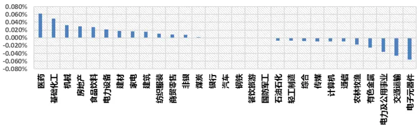

低筛选标准行业建模相对于整体的建模月超额
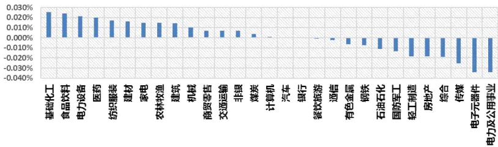
数据来源：东方证券研究所 Wind 资讯

## 4.总结

本篇报告主要测试了市值和各类 ALPHA因子在各个行业内的表现，并对一部分因子表现的逻辑进行了研究，这类能够显著区分因子表现好坏的解释其实也是一种因子情景划分的方法，相对而言根据因子逻辑去做情景划分要比常规的按照市值、估值或行业等方法更优。

我们基于较低的筛选标准（rankIC 大于 0.02，ICIR 大于 0.4）和较高的筛选标准（rankIC大于等于 0.03，ICIR 大于等于 1）去筛选每个行业的大类因子，并构建细分行业的行业内增强组合，两类组合在所有行业中均可以获得正的超额收益，但我们发现，在不同标准下行业内的增强效果有好有坏，也就是说仅仅通过一个标准去选择行业内的因子并不能得到让每个行业表现都最优的因子组合，这是因为有的行业因子整体表现较好而有的行业因子整体表现较差，在提高或者降低标准的时候必然会导致不同的行业增强表现有涨有落，因此如果是想构建单个行业的增强组合，最好采用更适应行业的因子筛选方法，综合行业内因子整体表现，因子在行业内换手率，多空表现等因素进行因子的选择，这样可以构建更适合行业属性的增强组合。此外，很多行业都存在有独特的ALPHA因子，比如研发营收比在医药和计算机行业有非常明显的独特 ALPHA，所以如果在构建行业内增强的时候引入特有的 ALPHA因子，可以进一步提升行业内的选股效果。

理论上说细分行业建模可以增加行业内预期收益率的准确性，从而提升宽基指数增强的效果，这里我们比较了在两种筛选标准下的细分行业建模全市场中证 500 增强组合和常规建模中证 500 增强组合的表现，从结果来看，细分行业建模后组合表现基本与整体建模组合相同，主要是因为通过统一的标准筛选不同行业的因子会导致不同的行业适应性不同，结果有强有弱，综合下来并没有显著提升，另一方面也因为细分行业建模组合的换手率较高，在单边 0.3%的成本下稀释了更多的收益。之前我们在报告中提出沪深 300 增强中对银行和券商单独建模，是因为这两个行业比较独特（大多数全市场有效因子在行业内失效），且在沪深 300中权重占比较高，所以对增强组合影响较大。但是其它行业权重占比都没有这么高，而且大多数因子相对还是有效果的，所以对这些行业单独建模来构建宽基指数增强其实并没有太显著的提升，当然如果能够加入一些行业内的专属 Alpha，在行业中引入独立的新 Alpha 源，那应该还是能有一定的效果的。因此，细分行业建模可能更适用于行业增强组合，或者是在进行行业配置的时候精选行业内股票。

## 风险提示

- 极端市场环境可能对模型效果造成剧烈冲击，导致收益亏损。

- 量化模型基于历史数据分析得到，未来存在失效风险，建议投资者紧密跟踪模型表现。

## Table_Disclaimer 分析师申明

每位负责撰写本研究报告全部或部分内容的研究分析师在此作以下声明：

分析师在本报告中对所提及的证券或发行人发表的任何建议和观点均准确地反映了其个人对该证券或发行人的看法和判断；分析师薪酬的任何组成部分无论是在过去、现在及将来，均与其在本研究报告中所表述的具体建议或观点无任何直接或间接的关系。

## 投资评级和相关定义

报告发布日后的 12个月内的公司的涨跌幅相对同期的上证指数/深证成指的涨跌幅为基准；

## 公司投资评级的量化标准

买入：相对强于市场基准指数收益率 15%以上；

增持：相对强于市场基准指数收益率 5%～15%；

中性：相对于市场基准指数收益率在-5%～+5%之间波动；

减持：相对弱于市场基准指数收益率在-5%以下。

未评级——由于在报告发出之时该股票不在本公司研究覆盖范围内，分析师基于当时对该股票的研究状况，未给予投资评级相关信息。

暂停评级——根据监管制度及本公司相关规定，研究报告发布之时该投资对象可能与本公司存在潜在的利益冲突情形；亦或是研究报告发布当时该股票的价值和价格分析存在重大不确定性，缺乏足够的研究依据支持分析师给出明确投资评级；分析师在上述情况下暂停对该股票给予投资评级等信息，投资者需要注意在此报告发布之前曾给予该股票的投资评级、盈利预测及目标价格等信息不再有效。

## 行业投资评级的量化标准：

看好：相对强于市场基准指数收益率 5%以上；

中性：相对于市场基准指数收益率在-5%～+5%之间波动；

看淡：相对于市场基准指数收益率在-5%以下。

未评级：由于在报告发出之时该行业不在本公司研究覆盖范围内，分析师基于当时对该行业的研究状况，未给予投资评级等相关信息。

暂停评级：由于研究报告发布当时该行业的投资价值分析存在重大不确定性，缺乏足够的研究依据支持分析师给出明确行业投资评级；分析师在上述情况下暂停对该行业给予投资评级信息，投资者需要注意在此报告发布之前曾给予该行业的投资评级信息不再有效。

## HeadertTabl e_Discl ai mer 免责声明

本证券研究报告（以下简称“本报告”）由东方证券股份有限公司（以下简称“本公司”）制作及发布。

本报告仅供本公司的客户使用。本公司不会因接收人收到本报告而视其为本公司的当然客户。本报告的全体接收人应当采取必要措施防止本报告被转发给他人。

本报告是基于本公司认为可靠的且目前已公开的信息撰写，本公司力求但不保证该信息的准确性和完整性，客户也不应该认为该信息是准确和完整的。同时，本公司不保证文中观点或陈述不会发生任何变更，在不同时期，本公司可发出与本报告所载资料、意见及推测不一致的证券研究报告。本公司会适时更新我们的研究，但可能会因某些规定而无法做到。除了一些定期出版的证券研究报告之外，绝大多数证券研究报告是在分析师认为适当的时候不定期地发布。

在任何情况下，本报告中的信息或所表述的意见并不构成对任何人的投资建议，也没有考虑到个别客户特殊的投资目标、财务状况或需求。客户应考虑本报告中的任何意见或建议是否符合其特定状况，若有必要应寻求专家意见。本报告所载的资料、工具、意见及推测只提供给客户作参考之用，并非作为或被视为出售或购买证券或其他投资标的的邀请或向人作出邀请。

本报告中提及的投资价格和价值以及这些投资带来的收入可能会波动。过去的表现并不代表未来的表现，未来的回报也无法保证，投资者可能会损失本金。外汇汇率波动有可能对某些投资的价值或价格或来自这一投资的收入产生不良影响。那些涉及期货、期权及其它衍生工具的交易，因其包括重大的市场风险，因此并不适合所有投资者。

在任何情况下，本公司不对任何人因使用本报告中的任何内容所引致的任何损失负任何责任，投资者自主作出投资决策并自行承担投资风险，任何形式的分享证券投资收益或者分担证券投资损失的书面或口头承诺均为无效。

本报告主要以电子版形式分发，间或也会辅以印刷品形式分发，所有报告版权均归本公司所有。未经本公司事先书面协议授权，任何机构或个人不得以任何形式复制、转发或公开传播本报告的全部或部分内容。不得将报告内容作为诉讼、仲裁、传媒所引用之证明或依据，不得用于营利或用于未经允许的其它用途。

经本公司事先书面协议授权刊载或转发的，被授权机构承担相关刊载或者转发责任。不得对本报告进行任何有悖原意的引用、删节和修改。

提示客户及公众投资者慎重使用未经授权刊载或者转发的本公司证券研究报告，慎重使用公众媒体刊载的证券研究报告。

## 东方证券研究所

地址：上海市中山南路 318 号东方国际金融广场 26 楼

联系人： 王骏飞

电话： 021-63325888*1131

传真：021-63326786

网址： www.dfzq.com.cn

Email： wangjunfei@orientsec.com.cn